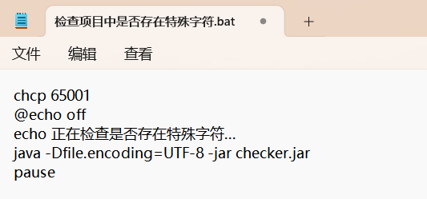

# 项目演示地址

https://newfbin.github.io/learning-notes

# 项目使用方式介绍

## 项目下载方式

首先将该项目Fork到自己的仓库、再在本地使用`git clone` 将自己仓库的项目克隆到本地。

## 项目部署方式

免域名部署：GitHubPage 或 Vercel

具体部署方式请查找网络上的资料

## 文件夹和文件存放位置

所有md文档，文件夹都存放在study目录中

## 文件夹与文件命名规则

文件夹和文件以及图片名称不能有空格和特殊字符（#    ？   %   /   <   >   "   '）。

> 如果包含空格或特殊字符，网站将解析不了文件的路径。
>
> 如果发现某些页面打开之后显示404，证明文件夹或文件名中含有特殊字符，请找到对应的文件或文件夹进行重命名文件以删除该字符。
>
> 如果发现页面上的文章链接变成了不能跳转的纯文字，说明文件夹或文件名中含有空格，请找到对应的文件或文件夹进行重命名文件以删除空格。
>
> 如果有些图片加载不出来，考虑两种情况：
>
> 1. 图片链接为网络地址，该地址已无法访问。
> 2. 图片存放在本地，但地址中含有 #    ？   %   /   <   >   "   ' 这些字符。需要将这些字符删除或替换为其它文字

如果不确定项目中是否存在特殊字符，请双击 "检查项目中是否存在特殊字符.bat" 脚本进行检查

脚本内容如下：

## ”同步文章到GitHub.bat“脚本使用说明

bat脚本的功能如下，脚本中依次执行：

1.从GitHub中拉取

2.通过执行generator.jar文件自动生成README.md和_sidebar.md

3.4.5.将本地文件提交到GitHub仓库中

>  脚本内容如下：
>
> `

可以看出该脚本执行了generator.jar文件

generator.jar的功能为在每个需要的文件夹中自动生成README.md和_sidebar.md

该功能非常重要，能让自己不用再亲自编辑README.md和_sidebar.md文件，为自己省下许多时间

如果不需要使用generator.jar文件，可以用记事本打开该bat文件，把上面图片中红色框圈中的内容删除。

如果需要使用generator.jar文件，则需按照下面的要求操作。

## generator.jar使用要求

### 下载 jdk

首先下载 jdk8 或更高版本，下载完成后将jdk配置到环境变量中

请自行在网上查找下载和配置环境变量方式

### 更改图片存放位置

首先将本地Typora偏好设置中的图像选项 与 下面图片保持一致

之后再将本地所有的md文档引用的图片的位置按下面的示例更改

在md文档所在文件夹新建一个assets目录，再在assets目录中依次建立与文档名称相同的文件夹（忽略README.md和_sidebar.md）

最后每个md档的图片都存放在和其名称相同的文件夹内

按照上面的要求修改成功后，在每次修改、添加、删除文件和文件夹之后，双击”同步文章到GitHub.bat“文件便可自动将修改的内容同步到网站上。