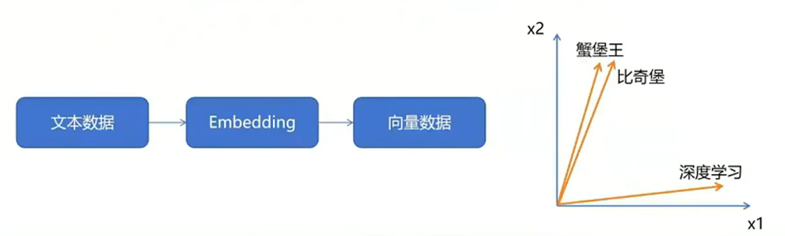

> 视频教程：https://www.bilibili.com/video/BV1itdAY2Egr

## 本地部署全流程

### 下载Ollama及DeepSeek

#### 下载 Ollama 平台

进入[ollama.com](ollama.com)，点击下载

- ollama 是一个用于本地运行和管理大语言模型（LLM）的工具。

#### 配置环境变量

- OLLAMA_HOST - 0.0.0.0:11434
  - 作用：让Docker所在的WSL虚拟机里的 RAGflow 能够访问到本机上的 Ollama；
  - 如果配置后虚拟机无法访问，可能是你的本机防火墙拦截了端口 11434；
  - 不想直接暴露 11434 端口：SSH 端口转发来实现；
  - 更新完两个环境变量记得重启
- OLLAMA_MODELS - 自定义位置
  - 作用：ollama 默认会把模型下载到 C 盘，如果希望下载到其他盘需要进行配置；

#### 自定义ollama安装位置

首先在想安装的路径下**创建好一个新文件夹，并把Ollama的安装包放在里面**。比如我的是：D:\AI\Ollama

接着在文件路径上输入CMD并回车

之后在CMD窗口输入：`OllamaSetup.exe /DIR=D:\AI\Ollama`

然后Ollama就会进入安装，点击Install后，可以看到Ollama的安装路径就变成了我们指定的目录了，这样大模型数据包也会默认下载在指定目录中。

#### 通过 ollama 下载模型 deepseek-r1:1.5b

在命令行运行 `ollama run deepseek-r1:1.5b`

第一次运行需要下载，运行成功后就能和本地模型进行对话了

### 下载并部署RAGflow 

> 以下步骤在 [https://github.com/infiniflow/ragflow.git](https://github.com/infiniflow/ragflow.git) 该仓库的README文档中都有介绍

#### 下载RAGflow源代码

克隆该仓库：[https://github.com/infiniflow/ragflow.git](https://github.com/infiniflow/ragflow.git)

或者如下图直接下载压缩包并解压

#### 下载Docker

直接进入[Docker官网](https://www.docker.com/)下载Windows版本

#### 修改配置

进入docker文件夹

修改.env文件

将第84行注释掉，并取消第87行的注释

如果不修改配置，会默认下载轻量版本，轻量版本没有embedding模型。需要自己本地部署一个embedding模型并调用自己的embedding模型，或者调用开源在线的embedding模型，这两种方案都比较复杂

通过cmd窗口进入该目录，执行`docker compose -f docker-compose.yml up -d`

成功执行后结果如下，此时RAGflow已经启动起来了：

在浏览器输入 localhost:80，出现以下页面说明RAGflow部署成功。

注册登录后就能够使用

### 构建个人知识库

#### 添加模型

点击右上角头像，点模型提供商，点Ollama的添加模型

将部署好的deepseek设置为系统模型	

#### 构建知识库

将本地文件新增到知识库中，并点击解析

#### 新建助理

当知识库中没有与问题匹配的答案时，会说“知识库中未找到您要的答案！”

可以将红线部分删除，这样模型就能够根据自身能力生成回答

 

测试效果

新建对话并测试（此截图来自视频，我未测试出此效果，或许和知识库有关）

## 为什么不使用网页版大模型

### 问题引出

假设需要让DeepSeek指出 ”如何接待一车拉丁鱼''，由于DeepSeek不知道《蟹堡王员工规范》的内容，导致DeepSeek的回答不符合自己的要求。

在传统网页版大模型上，一般可以通过上传附件解决这一问题

### 网页版大模型无法实现的需求

- 数据隐私问题：联网大模型数据隐私性无法得到绝对保证
- 上传文件限制：网页版AI对于文件上传数量、大小一般有限制，而且通常需要付费，如果自己想要上传几十个几百个附件，构建自己的知识库，网页版模型同样无法支持。
- 仅通过附件拓展上下文功能有限：每次在新对话中提问相关问题时，仍需要重新上传附件；修改删除对话中已有的附件困难

网页版大模型无法解决我们的两个需求：**绝对的隐私保护**、**个性化知识库构建**

## 如何实现网页版大模型不能实现的需求

### 隐私保护

通过本地部署大模型解决隐私问题

### 个性化知识库构建

使用 RAG 技术（Retrieval-Augmented Generation，检索增强生成）构建个人知识库。为此我们需要：

1. 本地部署 RAG 技术所需要的开源框架 RAGflow；
2. 本地部署 Embedding 大模型（或者直接部署自带 Embedding model 的 RAGflow 版本）；

## 目标效果预览

很明显可以看到这里的回答引用了《蟹堡王员工规范》中的内容，而不是简单地根据模型已训练的参数去生成一个不准确的回答

## 为什么要使用RAG技术，RAG和模型微调的区别

### RAG和模型微调作用

RAG和模型微调都是为了解决大模型的幻觉问题，幻觉问题即大模型在回答它不知道的问题时，它会胡说八道；

### 微调技术和 RAG 技术区别

- 微调：在已有的预训练模型基础上，再结合特定任务的数据集进一步对其进行训练，使得模型在这一领域中表现更好（考前复习）；
- RAG：在生成回答之前，通过信息检索从外部知识库中查找与问题相关的知识，增强生成过程中的信息来源，从而提升生成的质量和准确性（开卷考试，边考边抄）。
- 共同点：都是为了赋予模型某个领域的特定知识，解决大模型的幻觉问题。

### 模型微调局限性

以往的模型微调很大程度上可以解决幻觉问题

模型微调的缺点是本地部署并且微调一个大模型，对于企业和个人成本都是非常高的。如果退而求其次，微调一个小一点的模型，可能效果又不是很好。

实践证实（视频up主实践证实），本地部署一个蒸馏后的大模型，加上RAG技术进行针对性的检索增强生成是一个出色的解决方案。

### RAG原理

RAG (Retrieval-Augmented Generation) 的原理：

- 检索 (Retrieval)：当用户提出问题时，系统会从外部的知识库中检索出与用户输入相关的内容。
- 增强 (Augmentation)：系统将检索到的信息与用户的输入结合，扩展模型的上下文。然后再传给生成模型（也就是 Deepseek）；
- 生成 (Generation)：生成模型基于增强后的输入生成最终的回答。由于这一回答参考了外部知识库中的内容，因此更加准确可读。

## 什么是Embedding？为什么需要 “Embeddign模型”？

经过上面的解释，能够知道DeepSeek是用来和我们智能对话用的，RAGflow是为了辅助我们构建知识库，实现RAG技术用的，那么为什么还要搞一个Embeddign模型？

为了解释清楚Embedding是什么，我们需要更加详细地解释一下RAG检索增强生成中的检索（Retrieval）步骤做了什么

- 检索（Retrieval）的详细过程：
  - 准备外部知识库：外部知识库可能来自本地的文件、搜索引擎结果、API 等等。（本教程构建本地文件的外部知识库）
  - 通过 Embedding（嵌入）模型，对知识库文件进行解析：Embedding 的主要作用是将自然语言转化为机器可以理解的高维向量，并且通过这一过程捕获到文本背后的语义信息（比如不同文本之间的相似度关系）；
  - 通过 Embedding（嵌入）模型，对用户的提问进行处理：用户的输入同样会经过嵌入（Embedding）处理，生成一个高维向量。
  - 拿用户的提问去匹配本地知识库：使用这个用户输入生成的这个高纬向量，去查询知识库中相关的文档片段。在这个过程中，系统会利用某些相似度度量（如余弦相似度）去判断相似度。
- 模型的分类：Chat 模型、Embedding 模型；
- 简而言之：Embedding 模型是用来对你上传的附件进行解析的；

> 如下图所示：
>
> 蟹堡王、比奇堡经过Embedding之后，会被映射到非常相近的向量空间中
>
> 而深度学习这个词会被映射到离它们两个都很远的向量空间中
>
> 这样通过Embedding，机器就可以学习到自然语言之中的深度语义关系，并且可以通过这个计算不同文本之间的相似关系
>
> 

## 只是想快速搭建个人知识库，可以不部署吗

—— 当然可以！这样实现起来更简单，而且效果一般来说会更好；

### 具体步骤:

1. 下载 RAGFlow 源代码和 docker，通过 docker 本地部署 RAGFlow（RAGFlow 目前没有官方的网页版）;
2. 在 RAGFlow 中配置任意的 Chat 模型和 Embedding 模型（你需要到这些模型对应的官网去付费申请 apiKey）;

### 优点:

- 不用本地部署大模型，简单易操作；
- 企业大模型性能一般更优越；

### 缺点:

- 隐私安全问题；
- 调用企业大模型 API 的成本；
