> 视频链接：https://www.bilibili.com/video/BV1iws5zyESt

## 一、微调介绍

### 1、大模型的本质是什么

**模型的本质是函数，核心是参数，训练是为了得到更好用的参数。**


大模型看似智能，其实每吐出一个词，都是根据当前词，计算下一个词的概率，这个计算过程就是由函数完成的。

那么函数里的这些参数就至关重要了，它们决定了模型最后算出来的结果准不准确。

模型的知识和能力就是存储在这些参数里。所以模型智能不智能，很重要一点就是看参数好不好（当然跟模型的结构也有关系）。

因此所谓模型训练就是寻找优质参数的过程。

### 2、如何得到优质参数

我们小时候解方程都知道，解未知数是有个公式。

你可能以为大模型的这些参数也可以通过某个公式来计算，其实不是，大模型的参数是一步一步试出来的。


具体过程如上图，首先**随机初始化**所有参数的值，我们不知道好的参数是多少，没有关系，我们先随机初始化；

接下来我们拿着初始化好的参数开展计算，也就是输入训练数据，让模型预测下一个词的概率，模型会输出一个结果，比如下一个词是"命运"，但模型认为命运的概率只有0.0001，这就错的离谱，但没有关系，我们记录下这个错误，这个叫做损失；

接下来我们拿着这个损失对模型的所有参数进行求导，这个求导的过程很复杂，不用管它。只要记住，求导的结果我们称它为梯度就好，有了梯度结合这个公式我们就可以进行参数更新了。

看不懂这个公式也没关系，你只要知道更新参数的逻辑是用旧的参数加减某个值，就得到了新的参数，我们通过这个方法持续重复这个过程，就可以不断对参数的值进行调整，那么要重复几次才停下来，这就来到我们今天第三个问题。

### 3、怎么知道模型学得好不好

怎么知道模型学的好不好？


当我们觉得模型学会了的时候，我们就可以停下来，所以我们要知道在多轮的训练过程中模型学的怎么样了？最简单的方式就是监测前面说的这个损失，如果损失没有下降，那说明没有学会，需要继续学，直到这个损失下降了为止。

但是注意有个陷阱，损失函数掉了不一定说明学会了，就好比你平时练习题都做对了，不代表你真的学会了，你得通过考试才能说明你真的学会。大模型也要考试。


我们另外准备一份数据，这份数据不能和训练数据重复，我们称它为验证集。我们把这个验证集丢给模型，看看损失值是怎么变化的，如果训练集损失很低，但是验证集损失很高，这叫过拟合，说明模型学的不好。

完美的情况是训练集和验证集的曲线都稳步的下降，当然也不只有损失，这个评估指标还有很多，后面我们会再继续介绍。

总而言之，在这个微调过程，我们需要通过某种评估方法实时的来检验模型的成效，这个是非常重要的。后面我们会反复提

### 4、到底什么是微调

第四个问题。到底什么是微调？

一句话总结：**微调就是在已经训练好的模型上继续调整模型的参数**。

那好好的，我们为什么要继续调整模型的参数呢？因为原来的模型，因为各种原因不能适配我们的任务，我们需要训练出一个新的模型。


这时我们有两种方法，一种就是按照前面流程说的重新训练一个，另外一种就是我们拿一个已经训练好的模型，在这个基础上继续训练，这就是微调。

你想想这两者本质的差异是什么？本质的差异是参数初始化的方式不一样，前者随机初始化，这是没办法的办法。后者是拿已经验证过了的参数进行初始化，一个是随机，一个是调出来的，所以后者相当于让你站在巨人的肩膀上继续往下走。如果你的目的是罗马，微调相当于是直接把你送到了意大利，会极大的节省你的时间。 

### 5、微调的流程是什么

第五个问题，微调的流程是什么？


微调有三个步骤，找一个模型，准备一批数据，选一个微调方法。既然微调是在已有的模型的基础上继续调整参数，那总要找一个模型，这个叫做基座模型。准备数据是整个微调过程中最重要的环节，花再多心思也不过分。业界有一句话叫做你输入的是垃圾，得到的也是垃圾。有了基础模型和微调数据，最后再选一个方法就行了。


总体来说有三种方法，分别叫全量微调、冻结微调和 Lora 微调。

### （1）全量微调


所谓全量微调，是指我们要对模型的所有参数都进行调整，如果一个模型有 100 亿参数，那就对 100 亿参数都进行调整。

### （2）冻结


而冻结微调是这个神经网络有这么多层，底层的我就不动了，冻结起来。我们把输出层或靠近输出层的那几层拿出来调整就好。

### （3）Lora 微调


那我们主要介绍 Lora 微调，这个有意思，它不是对原来的模型参数直接调整，而是构造出一个参数模块，训练好这个模块的参数就行，然后将原来的模型加这个参数模块的参数合并起来就得到了完整的参数。这样的话我们只要调整少量的参数，就能实现一个比较好的效果。具体的技术细节我们后面会介绍的很清楚。

### 6、什么时候要使用微调

第六个问题，为什么要微调？


为什么要微调？各种说法有很多，我觉得总结起来就是两点。提示词不够用的时候，或者计算机资源不够用的时候。

#### 场景1：提示词不够用

什么叫提示词不够用？就是在你的场景中，你竭尽所能的调整提示词，但是依然不能实现预期目标，这样的情况可太多了。比如最常见的是智能体中的工具调用，我们要让模型从用户的提问中准确的判断出需要使用哪个工具，以及对应的参数是什么。

如果你纯依靠提示词来实现，那一定需要性能好的模型，普通模型是不行的。即便这样，还得要求你的场景不能过于复杂，否则还是不行。那就可以考虑微调了。

#### 场景2：资源不够用

另外一种场景是提示词够用，但是提示词要写得很长，加上很多案例，并且要用比较大的模型才能实现这个场景，这时候长上下文加大模型势必导致两个问题，第一资源消耗巨大，第二推理速度变慢。

 在很多业务场景中，这两点都是不能接受的，所以我们可以专门针对这个场景微调出一个小模型，既能满足业务需求，又极大的降低了资源需求。

---

## 二、环境搭建

执行如下脚本，安装环境

```sh
#!/bin/bash

# LLaMA-Factory 自动安装脚本
# 注意：此脚本在执行时，所有相对路径都以脚本所在目录为根目录

set -e  # 遇到错误立即退出

echo "=== 开始安装 LLaMA-Factory 环境 ==="

# 获取脚本所在目录
SCRIPT_DIR="$(cd "$(dirname "${BASH_SOURCE[0]}")" && pwd)"
cd "$SCRIPT_DIR"

echo "当前工作目录: $(pwd)"

# 安装系统级依赖
echo "=== 安装系统级依赖 ==="
sudo apt-get update
sudo apt-get install -y python3-pip python3-setuptools python3-venv git

# 克隆 LLaMA-Factory
echo "=== 克隆 LLaMA-Factory 仓库 ==="
REPO_DIR="LlamaFactory"
if [ ! -d "$REPO_DIR" ]; then
    git clone https://github.com/hiyouga/LlamaFactory.git
else
    echo "$REPO_DIR 目录已存在，跳过克隆"
fi

# 先创建虚拟环境，再在虚拟环境内安装uv，避免系统限制报错
echo "=== 创建虚拟环境 ==="
if [ ! -d "finetune" ]; then
    python3 -m venv finetune
fi

# 激活虚拟环境
echo "=== 激活虚拟环境并安装依赖 ==="
. finetune/bin/activate

# 在虚拟环境中安装uv（无系统限制报错）
echo "=== 安装 uv ==="
pip install uv -i https://mirrors.aliyun.com/pypi/simple

# 进入项目目录安装LLaMA-Factory
cd LlamaFactory
echo "当前目录: $(pwd)"

# 安装 LLaMA-Factory
echo "=== 安装 LLaMA-Factory 及其依赖 ==="
uv pip install -e ".[torch,metrics]" -i https://mirrors.aliyun.com/pypi/simple

# 返回脚本目录
cd "$SCRIPT_DIR"

# 验证安装
echo "=== 验证安装 ==="
. finetune/bin/activate
cd LlamaFactory

echo "1. 验证 LLaMA-Factory 安装:"
llamafactory-cli version

echo "2. 验证 GPU 是否可用:"
python -c "import torch; print('CUDA available:', torch.cuda.is_available())"

echo "=== 安装完成 ==="
```


## 三、模型微调全流程尝试

一行代码都不用写就可以实现模型微调，这是 Llama factory 最大的优点，也因此我认为它是最适合于新手的框架。


在 LLAMA factory 里面，你只要通过参数配置就可以实现所有微调的功能。那主要通过两种方式进行参数配置，一种是通过 Web UI 的方法，另外一种是通过配置文件编辑的方法。今天这两种方式我都会介绍，并且介绍完了之后会告诉你哪种方式是我比较推荐的。

### web执行

首先执行

```sh
llamafactory-cli webui
```

执行完命令后，点击链接即可跳转到 llamafactory 的web界面


在界面中按照如下顺序点击


等待模型加载完成后，即可开始聊天


### 命令执行（推荐）

> 以下文件路径都以 LlamaFactory 为根路径
>
> 

接下来会涉及 `train、chat、export、api`四个命令，每个命令都会执行两个步骤： `1、修改配置`，`2、执行命令`

#### train

1、命令查询

```sh
llamafactory-cli -h
```

2、修改配置文件 `examples/train_lora/qwen3_lora_sft.yaml`

```yaml
model_name_or_path: Qwen/Qwen3-0.6B-base
template: default
output_dir: saves/qwen3-0.6b/lora/sft
```

3、执行训练

```sh
cd LlamaFactory
USE_MODELSCOPE_HUB=1 llamafactory-cli train examples/train_lora/qwen3_lora_sft.yaml
```

#### chat

1、准备执行`chat`，修改配置文件 `examples/inference/qwen3_lora_sft.yaml`

```yaml
model_name_or_path: Qwen/Qwen3-0.6B-base
adapter_name_or_path: saves/qwen3-0.6b/lora/sft
template: default
```

2、执行推理对话

```sh
USE_MODELSCOPE_HUB=1 llamafactory-cli chat examples/inference/qwen3_lora_sft.yaml
```

#### export（合并）

1、修改配置文件 `examples/merge_lora/qwen3_lora_sft.yaml`

```yaml
model_name_or_path: Qwen/Qwen3-0.6B-base
adapter_name_or_path: saves/qwen3-0.6b/lora/sft
template: default

export_dir: output/Qwen3-0.6B
```

2、执行合并命令

```sh
USE_MODELSCOPE_HUB=1 llamafactory-cli export examples/merge_lora/qwen3_lora_sft.yaml
```

#### api（部署api）

1、修改配置文件 `examples/inference/qwen3_lora_sft.yaml`

```yaml
model_name_or_path: output/Qwen3-0.6B
```

2、启动api

```sh
USE_MODELSCOPE_HUB=1 llamafactory-cli api examples/inference/qwen3_lora_sft.yaml
```

3、测试api，复制命令到shell中，回车执行

```sh
curl -s http://localhost:8000/v1/chat/completions \
  -H "Content-Type: application/json" \
  -d '{
    "model": "output/Qwen3-0.6B",
    "messages": [
      {"role": "user", "content": "你是谁"}
    ],
    "max_tokens": 64,
    "temperature": 0.7
  }'
```

## 四、基座模型的选择与使用

### 模型选择

> 从**模型家族，模型阶段，模型大小，思考模式**四个维度决定如何选择模型

|      | 模型家族                   | 模型阶段                           | 模型大小                         | 思考模式                                               |
| ---- | -------------------------- | ---------------------------------- | -------------------------------- | ------------------------------------------------------ |
| 选项 | qwen3、llama3、deepseek... | 预训练模型、chat微调、instruct微调 | 0.6B、1.7B、4B、8B、14B          | 推理模型，非推理模型                                   |
| 推荐 | qwen3                      | instruct微调                       | 无，能满足应用的情况下，越小越好 | 能满足应用的情况下，可以选择推理模型，但不使用思考模式 |
| 理由 | 性能好、教程多、品类齐全   | 对新手友好，难度与效果的最佳平衡点 | 尽量提升速度，节省资源           | 尽量提升速度，节省资源                                 |


### 模型使用

1、安装modelscope

```sh
# 激活环境 (首先cd到finetune/bin/activate所在的目录)
source finetune/bin/activate
# 安装modelscope
uv pip install modelscope -i https://mirrors.aliyun.com/pypi/simple
```

2、下载模型到指定路径

> 需要将 `/home/newfbin/scripts/models/Qwen3-0.6B` 替换为自己自定义的目录

```sh
modelscope download --model Qwen/Qwen3-0.6B --local_dir /home/newfbin/scripts/models/Qwen3-0.6B
```

3、应用的时候，在 `examples/train_lora/qwen3_lora_sft.yaml`配置文件中，按照绝对路径写清楚

```yaml
model_name_or_path: /home/newfbin/scripts/models/Qwen3-0.6B
```

4、执行训练（能启动就行，说明模型起作用了）

```sh
cd LlamaFactory
llamafactory-cli train examples/train_lora/qwen3_lora_sft.yaml
```

## 五、准备微调数据

机器学习界有句话叫做**数据决定模型的上限，算法只是让你逼近这个上限。**这句话放到现在依然不过时，但是准备数据的确很麻烦，麻烦到通常会占整个微调工作的 70% 到80%，以至于很多人想偷懒，但是模型会惩罚任何一个想偷懒的人，很多人着急着做后续的各种调试，发现没有效果，最后还是乖乖的回过头来，继续把数据搞清楚，最后才把模型的效果提了上去。

### 准备数据的关键


准备数据最重要的一点就是看上线后用户会怎么问，微调的时候你就要怎么准备数据。比如说如果你做的是客服机器人，那最好收集历史上用户的常见提问，既包括用户的提问内容，也包括提问方式。再比如说你想做一个周报优化器，上线之后给同事们使用，那么在训练阶段最好就找同事们收集一些平时他们写的垃圾周报，然后当成模型的输入。有了上述数据，你再采用**人工填写、规则填充、模型回答**等多个方式去得到输出数据，这样有了输入和输出，训练数据就准备好了。总而言之，训练数据应该尽可能地模拟上线后用户会提问的问题类型、语言风格，还有数据这个提问的复杂程度。确保训练数据和上线后的预测数据两者的数据分布要尽量的相似，才能够使模型有更好的泛化效果。当然我们说的是尽量相似，如果是实在不相似行不行？也可以，只是效果差一点，具体的话还是要实际试一下。

### 没有数据怎么办

如果有人会说我没有历史数据怎么办？


其实可以这样，我们先借助大模型蒸馏出一批数据，用这批数据先去微调出一个模型部署上线。然后给一批有代表性的用户来使用，在这个过程中我们就收集到了用户使用的这个数据，然后拿着这批数据再去微调更新模型，这样不断的更新模型，收集数据，再更新模型，不断的迭代，这样就可以不断的提升模型的效果，也就是说模型蒸馏的数据虽然和真实场景有区别，但是由于蒸馏数据的效率比较高，可以让我们尽快的调出一个 60 分的模型，满足基本的使用要求。至于怎么蒸馏，我们后面会用两节课来说。

### 准备数据集的3个关键


另外关于数据的准备。有几个重要事项，第一点是数据的质量要比数据的数量来得重要，这一点太好理解了，所以即便你不能一条一条的检查数据，也一定要抽样数据做一个评估，心里要有个数。第二，数据量不需要太多，也不需要太少，这取决于你的任务类型和你使用的基座模型。实践中可以从 1, 000 ~ 2, 000 条开始，然后根据模型的效果逐渐的增减。如果任务类型比较简单，比如说是做意图识别，那数据量不用太多。如果任务比较复杂，比如说是做知识库类的问题。那取决你的知识库的大小，如果知识库很大的话，那你的微调数据就要多一点。如果你选用的基座模型是 base 模型，那数据量就要多一点，因为这时候模型还没有学会指令遵循的能力。如果是使用已经调过的 CHAT 模型，那数据量可以少一点。

另外，即便你的数据很干净，数据也不是越多越好，因为多了容易过拟合，容易造成一些灾难性遗忘。什么是灾难性遗忘呢？比如微调之前牛模型 1 + 1 等于多少他知道，但是微调之后他不知道了。为了避免灾难性遗忘，我们可以在数据集中补充一些通用的数据集。第三是要注意数据的多样性。所谓多样性，是指你要尽量覆盖用户可能提问的方方面面，比如说你在微调客服问答模型时，那就要覆盖不同的问题，也要覆盖同一问题的不同问法，这是非常重要的一点，尤其是如果你是通过大模型来蒸馏数据的话，一定要千方百计的保障这个模型的多样性，如果我们要保障这个数据的多样性，有些时候你看似生成了 1, 000 条数据，但其实这 1, 000 条大差不差，那就没有意义，模型的效果一定不好。后续我们会介绍在蒸馏数据的时候如何保障数据的多样性。

### 准备数据集的3个方法


最后我们介绍一下数据要如何准备，大体上是三种。人工准备，模型生成加人工检查，还有第三种开源数据人工准备，这个很好理解，埋头吭哧吭哧，一条一条准备过去，有人看不起这个方法，其实他真别看不起。我记得谷歌团队有个大佬就建议他们的团队要时不时来个披萨，时间就是一边吃披萨一边讨论怎么准备数据，怎么样去给数据做标注，检查生成的数据等等。这块我们不要有太强的技术思维，觉得某个方法很 low 就嗤之以鼻。还是那句话，不管是黑猫白猫，能够解决问题的就是好猫。当然这个方法还是太费人类了，所以通常我们会借助模型来生成第二种模型生成加人工检查，如果你已经有了 1, 000 个问题，那就可以让模型来回答，从而获得输入和输出数据。对，如果你手头已经有了内部的文档，那也可以让模型根据文档来生成回答，或者纯粹空手套白狼，让模型完全无中生有，生成指定领域的问答。对，都可以，但记得我们还是强调要人工检查一下，保障一下数据质量。

### 开源数据集网址

魔搭：https://modelscope.cn/datasets

天池：https://tianchi.aliyun.com/dataset

百度飞桨：https://aistudio.baidu.com/datasetoverview

### 下载开源数据集

```sh
modelscope download --dataset alleyf/HUST-Student-Handbook --local_dir ./dataset/HUST-Student-Handbook
```

数据集内容如下：


## 六、LlamaFactory的两种数据格式

### alpaca格式


### shareGPT格式


### 数据准备与加载流程

在LlamaFactory文件夹下，存在`data`和`examples`文件夹，分别存放示例数据和示例配置文件。

推荐自己新建一个 `my_data`和`my_yaml`，来存放自己的数据和配置文件。


在my_data下新建`data_alpaca.json`和`data_share_gpt.json`文件，

`data_alpaca`文件内容

```json
[
    {
        "instruction": "对暗号！",
        "input": "一支穿云箭",
        "output": "万里来相见"
    },
    {
        "instruction": "对暗号！一支穿云箭",
        "input": "",
        "output": "万里来相见"
    },
    {
        "instruction": "",
        "input": "对暗号！一支穿云箭",
        "output": "万里来相见"
    }
]
```

`data_share_gpt`文件内容

```json
{
    "conversations": [
        {
            "from": "human",
            "value": "对暗号！一支穿云箭"
        },
        {
            "from": "gpt",
            "value": "万里来相见"
        }
    ]
}
```

打开dataset_info.json文件


新增配置


将`examples/train_lora/qwen3_lora_sft.yaml`文件复制到新建的 `my_yaml`文件夹下， 并修改dataset配置项。


接下来执行以下命令来加载数据

```sh
lmf train my_yaml/qwen3_lora_sft.yaml
```

### alpaca格式数据映射

数据文件


配置文件


## 七、数据蒸馏

### 案例--微调出周报优化模型：

微调出一个能够优化周报的模型

### 问题：

没有训练数据，需要让大模型来生成一份数据。

因此需要写提示词，让大模型生成数据。

### 提示词1--劣质周报：

```markdown
# 角色和要求
1.你是报告优化专家，请生成劣质报告与对应优化后的优质报告
2.字数在 100 字左右。
3.……

## 案例参考
劣质报告：这周写了 20 行代码，引发 bug21 个……
优质报告：……
```

**提示词存在的问题**：

模型生成的结果里面，要么劣质周报不够劣质，要么优质周报不够优质，调好了前者，后者就出了问题，提示词调来调去总是不顺利。

对以上提示词做如下改造，让模型先聚焦生成劣质周报，再生成优质周报。


### 提示词2--劣质周报：

经过上面的改进后，得到如下提示词。

```markdown
# 角色和要求
1. 你是报告小白，请生成劣质报告
2. 字数在100字左右。
3.……

## 案例参考
劣质报告：这周写了20行代码，引发bug21个……
```

**提示词存在的问题**：

模型构造的数据虽然质量不错，但是彼此的相似性太高，这会影响微调的效果。

可以调高 temperature 参数，或者更换不同的模型，但最主要因素其实是提示词太雷同了。所以，当务之急是要想办法使得提示词也具备多样性，从而给模型下达不同的指令。

于是在提示词中加入了这几个变量，每次随机挑选一个变量值，这样就会得到不同的提示词。

根据业务的实际场景，选择的提示词里面包括的变量有角色、任务类型、报告类型、问题点，还有字数。并且此处剔除了示例，防止模型过度参考示例，丧失了灵活性，可以说是非常聪明了。

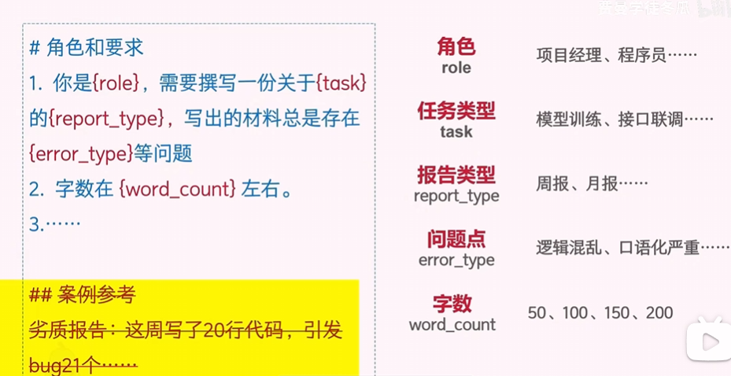

### 提示词3--劣质周报：

经过上面的改进，得到了下面的提示词

```markdown
# 角色和要求
1. 你是{role}，需要撰写一份关于{task}的{report_type}，写出的材料总是存在{error_type}等问题
2. 字数在 {word_count} 左右。
3.……
```

### 提示词--优质周报：

```markdown
## 角色定义
你现在是一位经验丰富的办公室秘书，擅长将普通文本优化为专业、结构清晰的优质报告。请根据提供的普通文本，进行以下优化：
## 核心要求
修改后的报告：有战略格局、逻辑清晰、有数据支撑、语言专业、 亮点突出。
## 参考案例
修改前：……
修改后：……

原始文本：{原始文本}
```

### 构造数据----要点

1. 输入数据和输出数据要分开构造，这样完成一份再检查一份，有利于提升数据的质量。
2. 应该尽量提升提示词的差异化，以便获得更丰富的数据。

### 构造数据----建议

1. 在构造输入数据的时候，提示词中不要有示例。
2. 在蒸馏输出数据的时候，提示词才要加入示例。

> 因为输入数据要的是多样性，示例可能会让模型过度的模拟，从而限制了想象力。输出数据要的是确定性，确保模型知道什么样的周报是优质的。

### 实操--构建输入数据和输出数据

> 可以构造4480个提示词模板
>
> 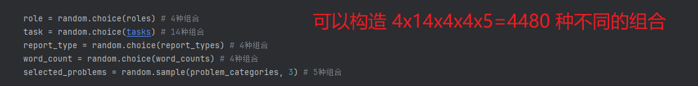

可以在PyCharm中，新建一个无后缀的文本文档，将以下代码复制进去，再将文本文档重命名为`ipynb`

```py
# 1. 构造input-输入数据（劣质报告）
## 1.1 构造动态提示词
import random

def generate_input_prompt():
    roles = ['初级产品经理', '高级项目经理', '技术负责人', '数据产品经理']
    tasks = ['工单流程开发', 'BI看板开发', '文本分类模型建设', '知识库建设', '对话智能体建设', '接口开发与联调', '数据中台建设', '用户画像标签体系建设', 
             '数据治理与质量监控','用户需求调研与分析', '跨部门沟通协调', '技术方案选型与评审', '数据备份与灾难恢复演练', '指标口径统一化建设']
    report_types = ['周报', '月报', '建设进展', '工作总结']
    word_counts = [80, 120, 150, 200]
    problem_categories = ['逻辑混乱', '口语化严重', '流水账', '缺乏数据支撑', '价值点缺失']
    
    role = random.choice(roles) # 4种组合
    task = random.choice(tasks) # 14种组合
    report_type = random.choice(report_types) # 4种组合
    word_count = random.choice(word_counts) # 4种组合
    selected_problems = random.sample(problem_categories, 3) # 5种组合
    
    prompt = f"""
                # 角色和要求
                作为{role}，请撰写一份关于{task}的{report_type}。这份报告应该是一个典型的"反面教材"。
                
                ## 需要突出的问题特征（重点体现：{', '.join(selected_problems)}）：
                - 逻辑不连贯，想到哪写到哪
                - 大量使用口语化、不专业的表达
                - 像记流水账一样罗列工作
                - 避免使用具体数据和量化结果
                - 只描述过程，不提炼价值和成果
                
                ## 写作要求：
                - 字数：{word_count}字左右
                - 内容要基于真实工作场景，但表达要糟糕
                - 避免刻意搞笑或夸张，要像真实工作中会出现的低质量报告
            """
    
    return prompt, {
        "role": role,
        "task": task,
        "report_type": report_type,
        "word_count": word_count,
        "problem_types": selected_problems
    }

# 使用示例
prompt, metadata = generate_input_prompt()
print("生成的提示词：")
print(prompt)
print("\n样本元数据：", metadata)
## 1.2 调用大模型，生成“劣质报告”
from openai import OpenAI

api_key=r"6be28e485ed034fce5b5f20bd4facc67.CCLWM78V32tWhRTI"
base_url= r"https://open.bigmodel.cn/api/paas/v4"
model_name = "glm-4.5-x"


client = OpenAI(
    api_key=api_key,  
    base_url=base_url 
)

def generate_input_sample():
    """生成单个样本的辅助函数"""
    prompt, _ = generate_input_prompt()
    
    response = client.chat.completions.create(
        model=model_name,
        messages=[{"role": "user", "content": prompt}]
    )
    
    return response.choices[0].message.content

reulst = generate_input_sample()
print(reulst)
num_samples = 2
results=[]
for i in range(num_samples):
    
    # 获取结果
    result = generate_input_sample()
    
    # 添加到结果列表
    results.append(result)

print("数据生成完成!")
results
## 1.3 保存数据，并人工抽样检查，适时调整提示词
 # 保存到JSON文件
from datetime import datetime
import json

filename = f"distill_input.json"

with open(filename, 'w', encoding='utf-8') as f:
    json.dump(results, f, ensure_ascii=False, indent=2)

print(f"结果已保存到: {filename}")

# 二、生成output-输出数据（优质报告）
## 2.1 构造提示词

    
def generate_output_prompt(original_text):
    return f"""
        你现在是一位经验丰富的办公室秘书，擅长将普通文本优化为专业、结构清晰、符合领导预期的优质报告。请根据提供的普通文本，进行以下优化：
        
        ## 核心要求
        请务必在报告中体现以下要素：
        1. 战略格局：将工作成果与公司“降本增效”/“技术驱动业务”等核心战略联系起来。
        2. 逻辑清晰：采用“总-分-总”结构，分点阐述，条理分明。
        3. 数据支撑：尽可能量化成果，使用具体数据（如效率提升百分比、节省工时、处理数据量等）来增强说服力。
        4. 语言专业：使用规范、专业的书面语和技术术语，避免口语化表达。
        5. 亮点突出：不仅要写“做了什么”，更要强调“取得了什么成果”和“带来了什么价值”。
        6. 计划明确：给出清晰、可量化的下一步行动计划。
        
        ## 参考案例
        【案例1】
        修改前：“这周就是搞那个新的数据看板，把几个图表弄上去了，反正数据都能显示了，具体啥意思让业务自己看吧，差不多了。”
        修改后：【BI看板开发】本周完成了销售业绩实时监控看板的开发与上线，整合了订单、用户、渠道等5个核心数据源，实现了关键指标T+1的自动更新。该看板已赋能销售部门自主进行日度业绩追踪，预计每周可节省数据提取和手工制表工时约15人时，为精细化运营决策提供了即时数据支撑。
        ## 待优化的文本
        {original_text}
    """


## 2.2 载入“劣质报告”，生成“优质报告”
import json
import pprint
with open(f"distill_input.json", 'r', encoding='utf-8') as f:
    input_distill = json.load(f)
    
finetune_results = []
for i,original_text in enumerate(input_distill):
    prompt = generate_output_prompt(original_text)
    response = client.chat.completions.create(
        model="glm-4.5-x",
        messages=[{"role": "user", "content": prompt}]
    )
    
    # 按照alpaca格式存储
    finetune_results.append(
        {
            "instruction":"优化报告",
            "input":original_text,
            "output": response.choices[0].message.content
        }
    )
    
pprint.pprint(finetune_results)
## 2.3 载入“劣质报告”，生成“优质报告”（有思考模式）
import json
import pprint
with open(f"distill_input.json", 'r', encoding='utf-8') as f:
    input_distill = json.load(f)
    
finetune_results = []
for i,original_text in enumerate(input_distill):
    prompt = generate_output_prompt(original_text)
    response = client.chat.completions.create(
        model="glm-4.5-x", # 1.模型得具备输出思维链的能力
        messages=[{"role": "user", "content": prompt}],
        top_p=0.8,
        temperature=0.9,
        extra_body={"thinking": {"type": "enabled",}} # 2.要在参数中启用思考模式
    )
    message= response.choices[0].message 
    finetune_results.append(
        {
            "instruction":"优化报告",
            "input":original_text,
            "output":"<think>"+ message.reasoning_content +"</think>\n"+  message.content      # 3.将整出输出和思维链数据拼接起来
        }
    )
    
pprint.pprint(finetune_results)
```

### Easy Dataset--根据文档快速生成微调数据

> Easy Dataset下载地址：https://github.com/ConardLi/easy-dataset/releases

基本步骤：

- 上传一个文件
- 自动生成问题
- 自动生成答案
- 导出数据

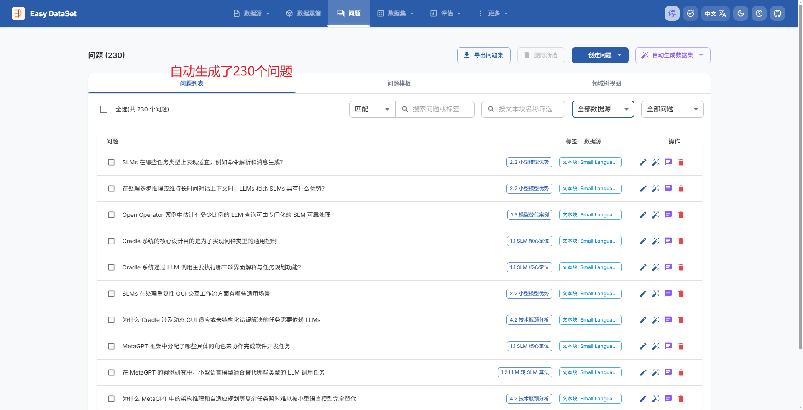

### Easy Dataset原理


给定一个文档如何获得问题答案。对，最直观的办法就是把这个文档塞到提示词中，让模型去生成。

但这通常会有两个问题，

1. 模型的上下文有限，整个文档可能塞不进去，即便塞了进去，由于上下文太长，模型的处理效果也不好。
2. 直接这样生成问题，覆盖可能不全面，或者相似度太高。

所以我们通常得做切块，然后根据文本块再去生成数据。

怎么切呢？这是做 rag 老生常谈的问题了。

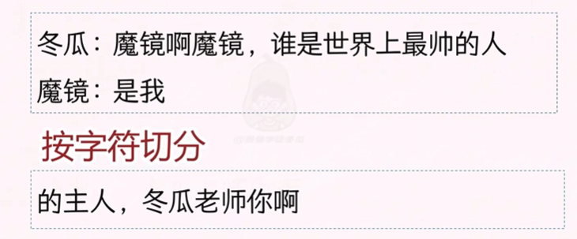

直接按字符切，很有可能导致相同的语义片段被分割到不同的文档，甚至形成来源北辙的语义，让模型产生错误的回答。所以我们得找到一个办法，尽可能的保留文本块的完整语义。

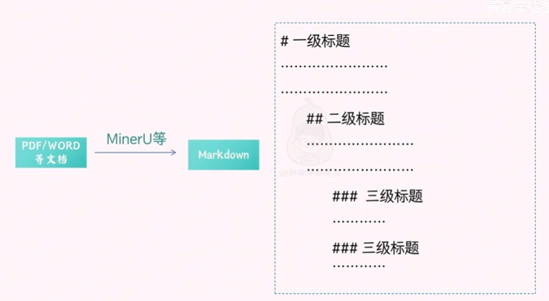

这个项目的方法是首先将文档转成 Markdown 格式，由于 Markdown 是用井号键区分章节标题，因此可以很方便的基于井号键对文档进行切分，切分之后每一个文本块都是一个章节，基本上语义是完整的。

但是这可能存在两个极端，有些文本块太大，有些文本块太小，这时候我们可以提前设定文本块的最小和最大长度。对于太小的文本块，直接合并到相邻的章节中。对于太大的文本块，首先根据换行符进行切分，得到不同的段落，如果段落还太大，那就按照句号继续切分，这时候就基本没有问题了。

有人会说，如果还有问题怎么办？那就按照文字继续切分，确保程序能够执行下去。

总而言之，经过一系列操作之后，我们就得到了众多文本块，接下来的问题是，如何根据给定的文本块生成问题答案对呢？

跟我们之前介绍的做法差不多，这个项目也是聚焦两个步骤，

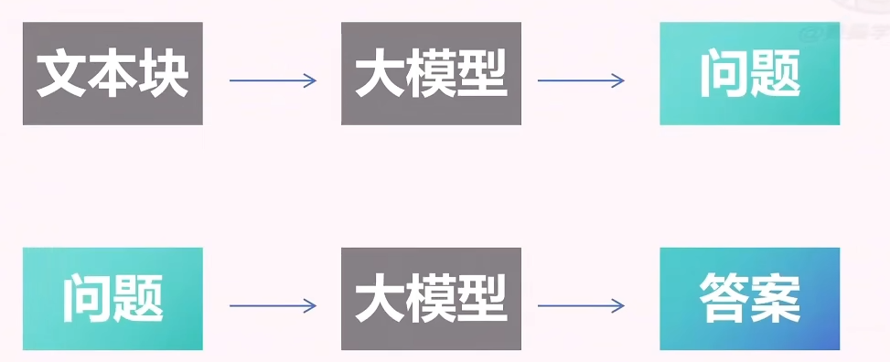

1. 一是分别让大模型独立生成问题和答案，便于调试整个生成过程。
2. 二是千方百计的增加问题的丰富度。

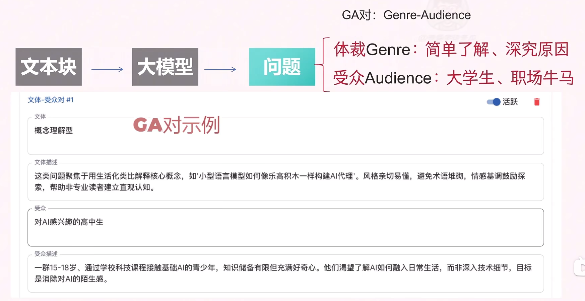

第二点比较有意思，作者为每个问题设定不同的文体和受众，从而极大提升问题的丰富度。文体是指内容的知识表达框架，受众是指内容的目标读者群体，这个就叫做GA对。

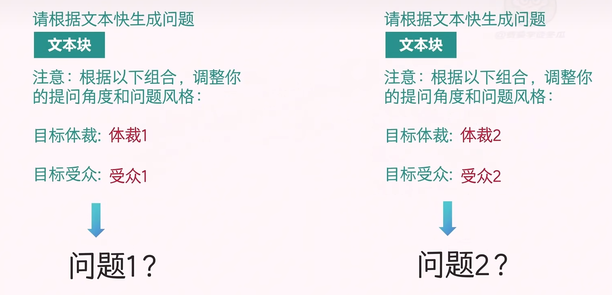

具体来说就是首先让大模型根据原来的文档生成 5 组GA对，然后将每个问题的GA对填充到提示之中，让模型参考生成问题，这样就可以让大模型针对同一个文本块，站在不同的视角生成不同的问题。

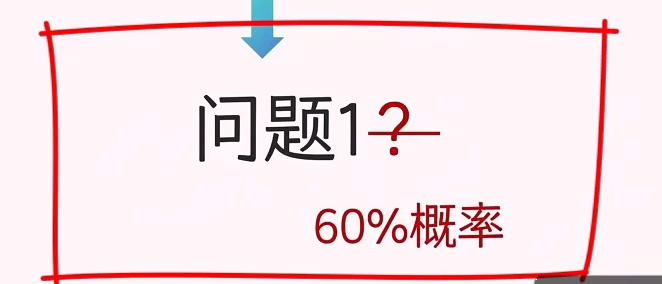

接下来还有个创意，针对生成的问题随机剔除 60% 的问号。这里是担心模型微调后过于依赖问号来回答问题，好通过这一系列操作，每个文本块我们就都可以得到多个问题

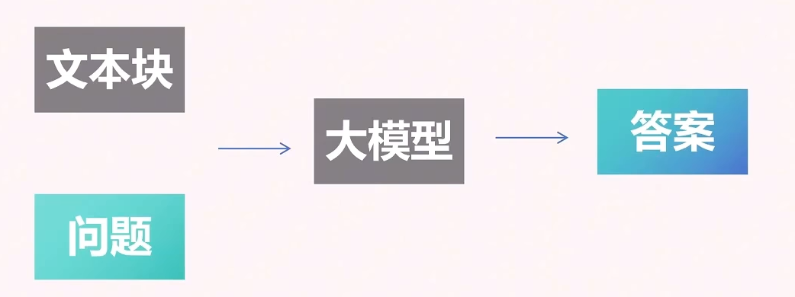

接下来就是如何根据问题生成答案的，这里就简单多了，输入文本块和问题，让模型严格按照文本块来生成答案，这样就搞定了。

> 最后针对这个软件再补充一点，如果你去体验这个软件，会发现作者几乎在所有的地方都保留了人工修改的入口，你可以对接对文本块问题和答案进行各种增删改。
>
> 这里给我们的启示是，**不要觉得模型蒸馏是万能的，人工介入还是必要的，真的不要偷懒**。当时 DeepSeek 在训练 R1 的时候，冷启动阶段的几千条数据和 SFT 的 80 万条数据其实也是有人工介入筛选的。还是那句话，数据决定模型的上限。

## 八、微调技巧解读

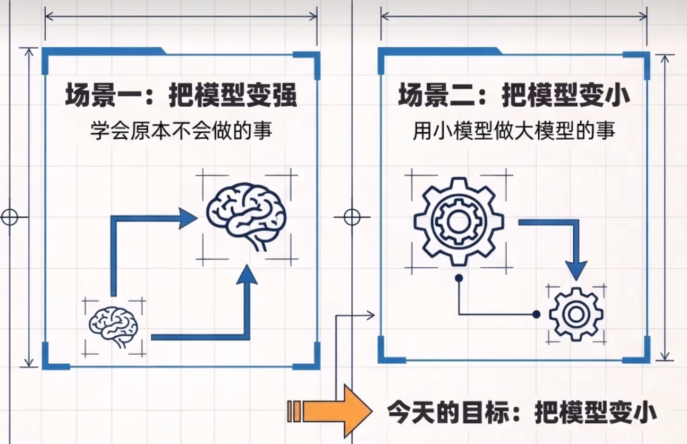

### 基础参数

```yaml
model_name_or_path: /mnt/f/models/Base/Qwen3-0.6B-Base
template: default
dataset: report
stage: sft
finetuning_type: lora
do_train: true
```

#### model_name_or_path

> 用于指定基座模型

```yaml
model_name_or_path: /mnt/f/models/Base/Qwen3-0.6B-Base
```

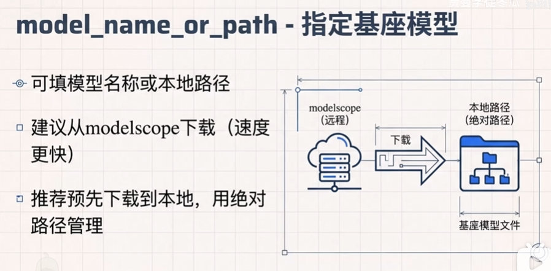

#### template

> template 对话模板非常重要，比如这个就是对话模板，训练数据经过对话模板处理后会变成具备特定标志的一句话模型。在预训练阶段，通过这些标志来区分哪些是人类说的，哪些是 AI 说的，什么时候结束，什么时候开始。如果你选错模板，也就是说微调阶段和预训练阶段的模板不一样，那模型可能会懵逼，可能导致你的模型开始胡言乱语，或者输出奇怪的字符，或者停不下来。
>
> 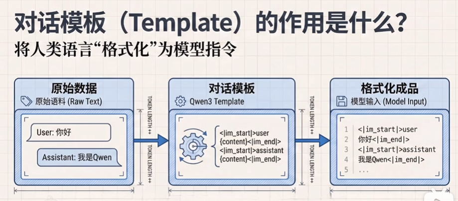

```yaml
template: default
```

#### dataset

> 将数据集配置到dataset_info中，就可以在dataset中配置数据集
>
> 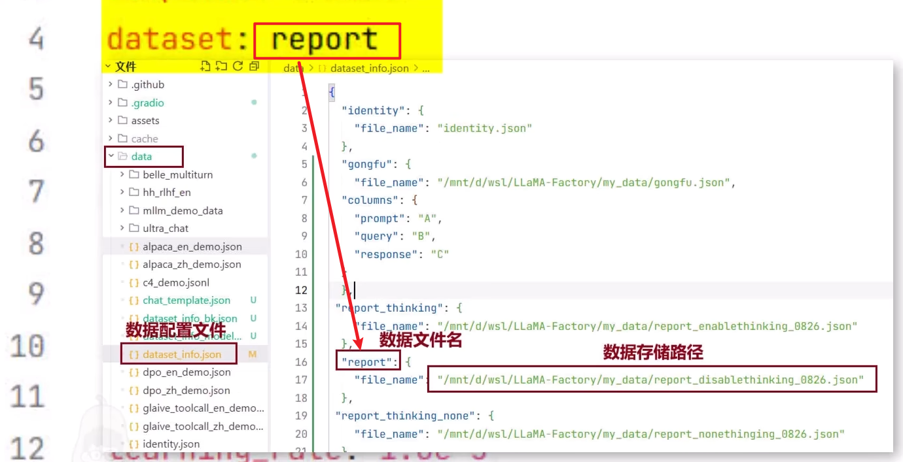

```yaml
dataset: report
```

#### stage

> stage表示训练阶段
>
> 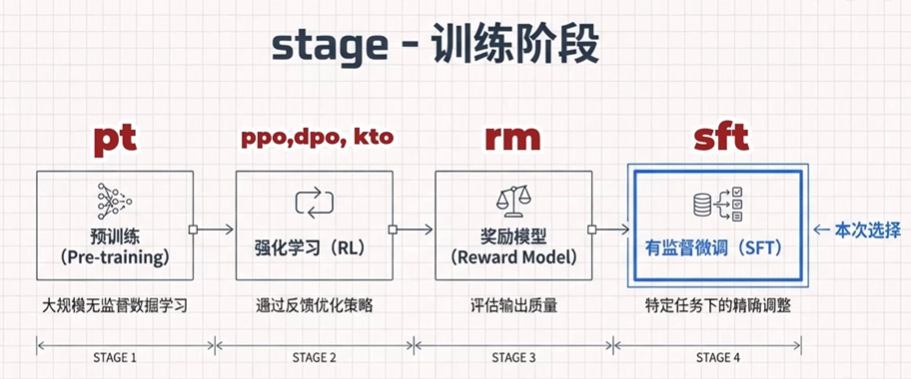

```yaml
stage: sft
```

#### finetuning_type

> 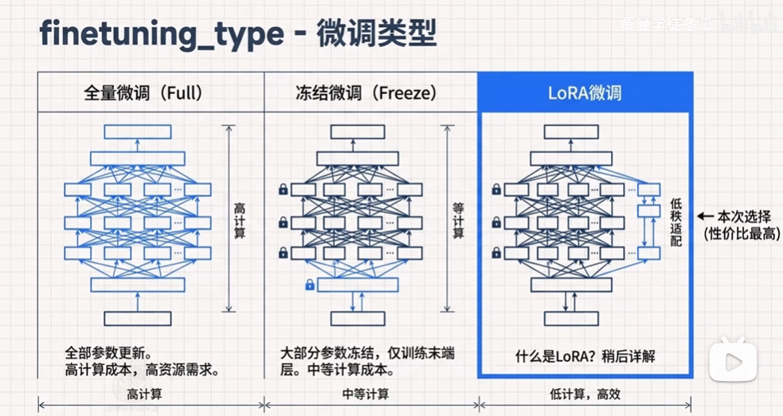

```yaml
finetuning_type: lora
```

#### do_train

> 除了do_train，还有do_eval、do_predict
>
> 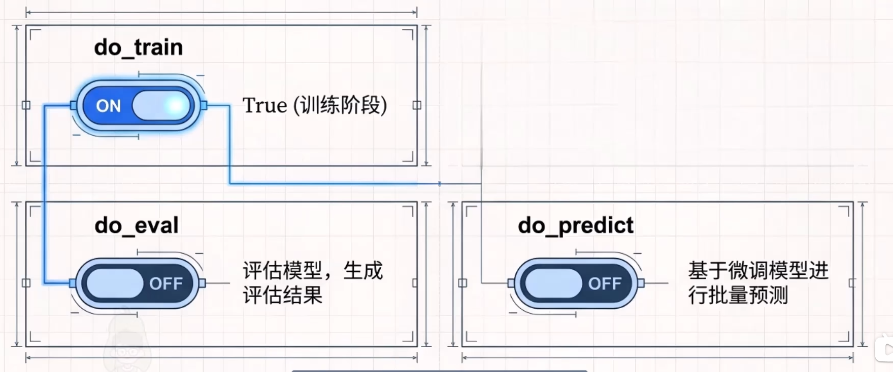

```yaml
do_train: true
```

### 控制模型学习深度的参数

> 主要是为了控制学习的深度，不能学的太浅，也不能学的太深，太浅相当于没学会，太深容易过拟合。

```yaml
lora_rank: 8
learning_rate: 1.0e-5
lr_scheduler_type: cosine
warmup_ratio: 0.1
max_samples: 1500
num_train_epochs: 1
```

#### lora_rank

> Lora 的秩（lora_rank）是什么东西呢？
>
> 我们先简单理解Lora，假定微调之后的参数矩阵是`W’`，那么 `W‘` 可以表示为原始参数 `w` 加参数变量 `Δw`。这点很好理解？
>
> 于是我们的学习目标就从学习 `w’` 变成学习 `Δw`。这个 `Δw` 矩阵通常很大，我们假设是 3, 000 行， 5, 000 列。然后有人惊奇的发现，这个 Δw 具备低秩特性，可以拆分为两个更小的矩阵的乘积 `a` 和`b`。至于什么是低秩，这里我们先跳过，先记住结论就好。
>
> 总而言之，拆分之后我们就不用学习 `Δw`，只要学习 `a b` 这两个矩阵就可以了。那么根据矩阵相乘的特性，我们可以知道 b 矩阵的行必须是 3, 000，列数是可变的。而 a 矩阵的列数必须是 5, 000，行数是可变的。而且两个矩阵能够相乘的前提是左矩阵的列要等于右矩阵的行，也就是说这两个数要相等，这个数就是 Lora rank，简称`r`，所以 Lora rank 是一个可以调节的参数。
>
> 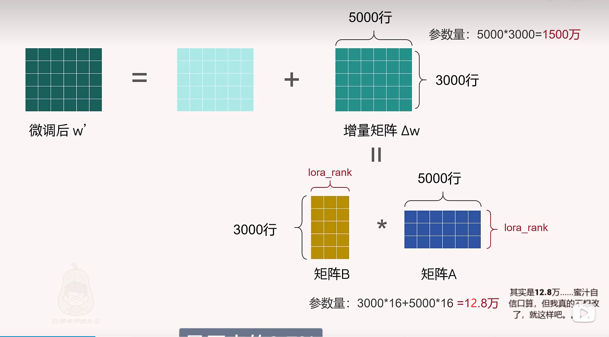
>
> 知道上述内容之后，我们就可以回答两个问题了，
>
> 一、为什么 Lora 会极大的降低参数量呢？以这里为例子，拆解前参数量是 1, 500 万，拆解之后，假设 r 是16，那么参数量是 12.8 万，是原来的0.7%。
>
> 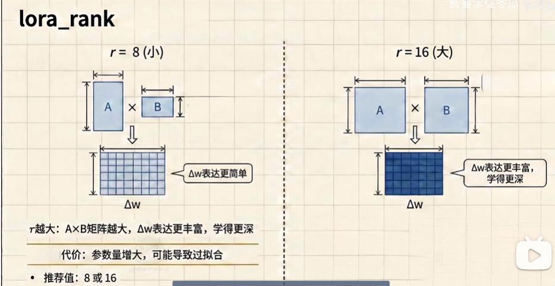
>
> 第二，为什么调整 Lora rank 可以控制模型学习的深度呢？你可以这么理解，当 `r` 越大， AB 矩阵就越大，也就意味着我们可以用更大的矩阵来表达 `Δw`，从而让 `Δw` 涵盖更丰富的信息，也就是意味着模型会学得更深。当然 `r` 不是越大越好， `r` 越大它的参数就越多。失去了用 Lora 的初衷，而且它很有可能导致过拟合。通常我们可以设定为 8 或者 16。
>
>  LORA 的原理还是比较复杂的，这里我简化了很多知识点，如果你有点懵逼，那我建议你看一下我之前关于 Lora 的讲解。
>
> 【【LoRA微调】从原理到调参，7 个问题彻底理解LoRA，不懂线性代数也没问题_大模型微调_低秩适配】 https://www.bilibili.com/video/BV1waZ2YDEcp

```yaml
lora_rank: 8
```

#### learning_rate +  warmup_ratio  + lr_scheduler_type

> 下个参数是 learning rate。学习率是什么呢？
>
> 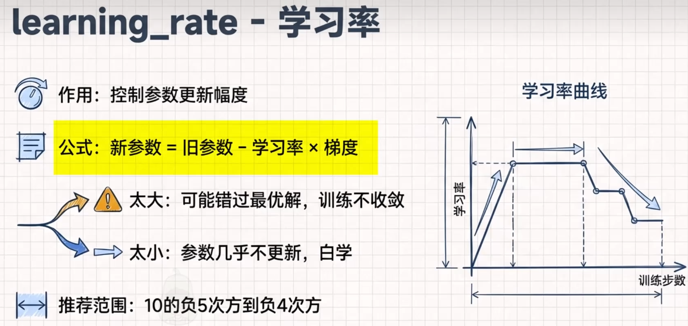
>
> 模型是根据这个公式来更新参数的 ：`新参数 = 旧参数 - 学习率 x 梯度`。
>
> 那么学习率的作用就很明显了：
>
> - 学习率越大，每一次更新参数的幅度就越大，那就有可能学得更深入，但也有可能因为学习的幅度过大而错过模型的最优解，导致训练不收敛。
> - 学习率也不能太小，太小了会导致模型啥都没学到，辛辛苦苦前后向传播，结果参数不怎么更新，白学了。
>
> 
>
> 通常设定在这个范围以内，这是个经验值，我们照着做就是了。
>
> 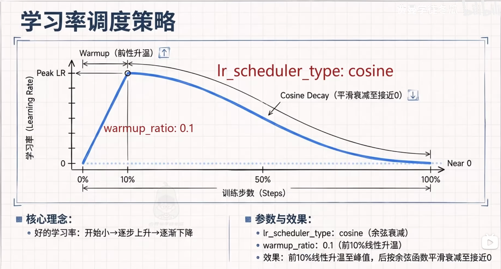
>
> 一个好的学习率通常是这样的，开始的时候小一点，因为此时模型的参数是随机的，学习步伐不能太大，否则容易失控。然后学习率逐步上升到预设值，这可以加快学习速度，接下来学习率逐步下降，因为越到后期，模型的参数就越趋于稳定，我们需要更精细的调整模型的参数，因此学习率通常会结合`warmup_ratio`、`lr_scheduler_type`这两个参数一起使用，表示在前 10% 的训练步数中，学习率从较低的线性值增加到设定峰值，然后按照余弦函数平滑衰减到接近0。
>

```yaml
learning_rate: 1.0e-5
```

#### max_samples

> 数据量表示从数据集抽出多少数据量用于微调。这个很好理解，数据越多自然学得越深。
>
> **技巧**：先用小数据量快速测试，确保参数无误

```yaml
max_samples: 1500
```

#### num_train_epochs

> 这个参数表示所有数据训练几轮
>
> 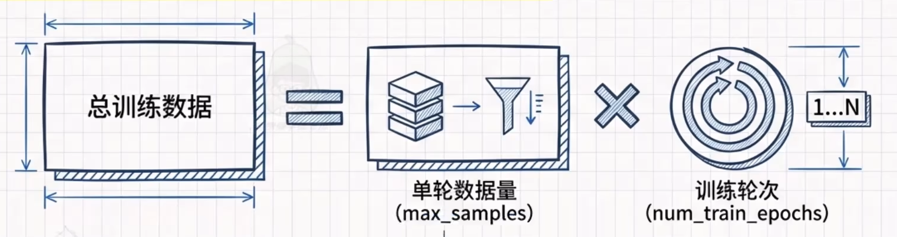

```yaml
num_train_epochs: 1
```


### 控制测试集的参数

```yaml
# eval_dataset:
val_size: 0.1
per_device_eval_batch_size: 1
eval_strategy: steps
eval_steps: 50
save_steps: 50
```

#### eval_dataset + val_size + per_device_eval_batch_size

> 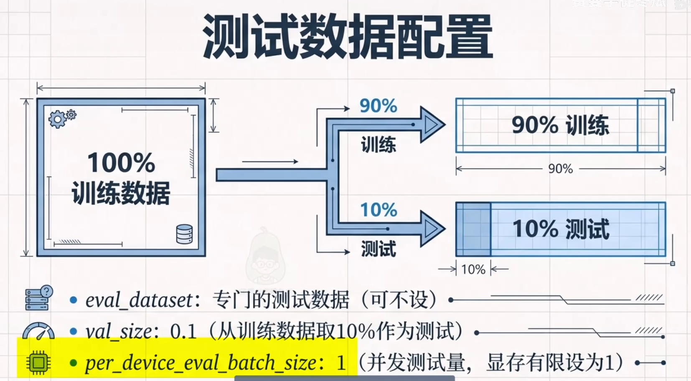

```yaml
# eval_dataset:
val_size: 0.1
per_device_eval_batch_size: 1
```

#### eval_strategy + eval_steps + save_steps

>  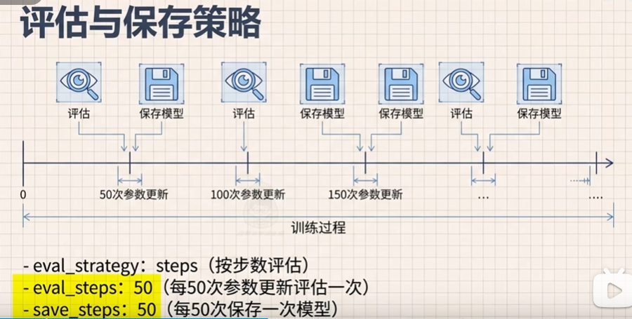
>
> 通常我会设置 `eval_steps`和 `save_steps`一致， 这样我就知道每个保存下来的模型效果怎么样，以便完成训练之后挑选一个效果最好的模型作为最终的模型。

```yaml
eval_strategy: steps
eval_steps: 50
save_steps: 50
```


### 控制显存的参数

```yaml
## 控制显存
cutoff_len: 2048
per_device_train_batch_size: 1
gradient_accumulation_steps: 4
### 启用qlora
quantization_bit: 8
```

#### cutoff_len

> 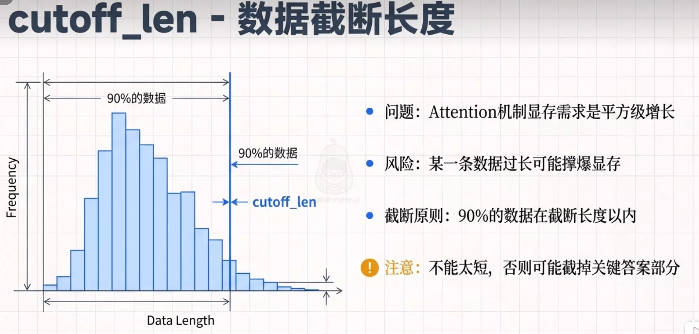

```yaml
cutoff_len: 2048
```

#### gradient_accumulation_steps + per_device_train_batch_size

> `per_device_train_batch_size`: 在微调时，每次输入模型的数据是一个batch，这个 batch 中的样本数就是一个 batch 的size，我们称为 batch size，而这个参数表示每个 GPU 的 batch size。如果你有多个GPU，那么总的 batchsize 就等于这个参数。乘以 GPU 的数量，这里我们只有一个GPU，所以这个参数就等同于总的batchsize，
>
> `gradient_accumulation_steps`:而这个参数表示经历多少次前后向传播才进行一次参数更新，比如当这个参数等于 3 时，表示每进行 3 次前后向传播才进行一次参数更新。
>
> 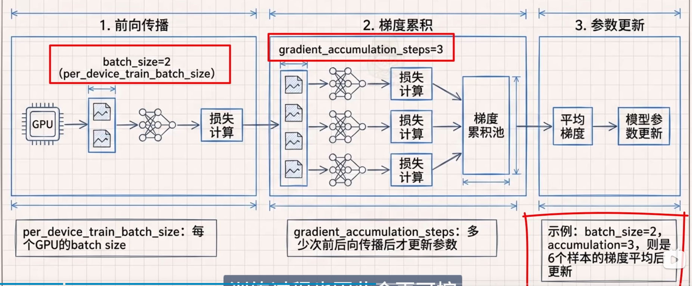
>
> 倘若此时 batchsize 等于2，那就是会把计算 2 乘以3，总计 6 个样本得到的梯度求平均值，拿这个平均梯度去更新参数。这样的好处是多个梯度求平均值之后得到的梯度会更稳定，训练过程也因此会更可控。
>
> 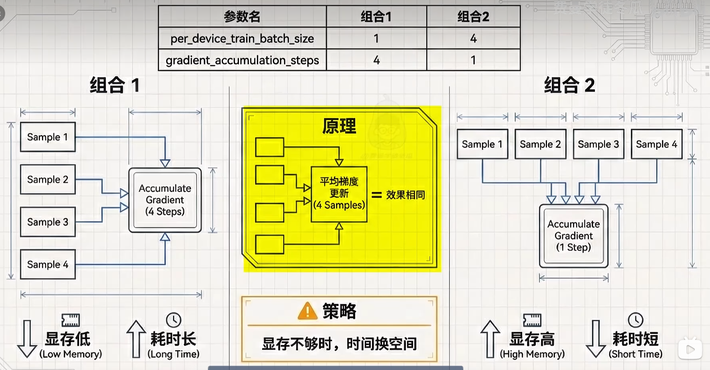
>
> 都是针对 4 个样本的平均梯度进行参数更新。区别在于前一种每次只计算一个样本，显存消耗更低，但是要进行 4 次计算之后才会更新一次参数，耗时更长。后一种每次会计算 4 个样本，对显存的要求更高，但每次计算后都会更新参数，耗时更短。
>
> 在实际微调时，如果显存不够，我们通常会降低单次运算的batchsize，增加这个累计梯度的次数。这是一种时间换空间的技巧，而当你的显存足够时，那可以通过增加 batchsize 来减少训练时间。但是注意，如果你的显存本来就不够大，增大 batchsize 可能会导致额外的显存交换，反而会增加训练时间。

```yaml
per_device_train_batch_size: 1
gradient_accumulation_steps: 4
```

#### quantization_bit

> 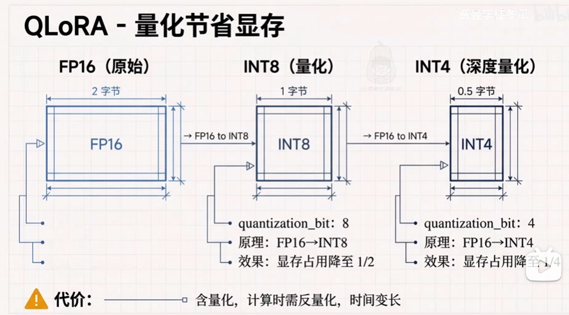
>
> 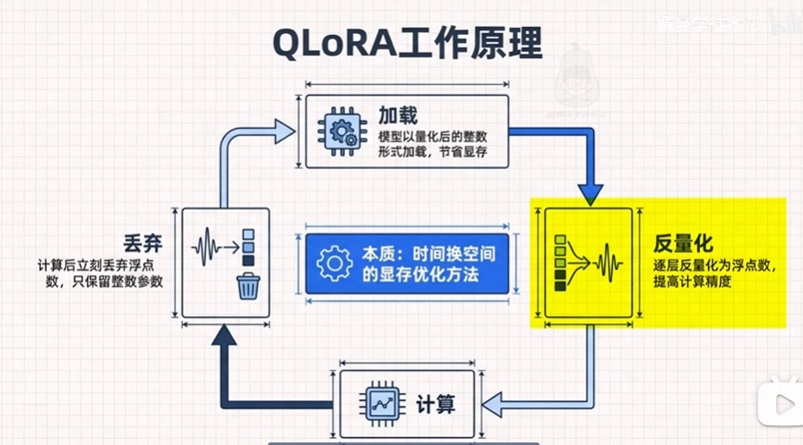

```yaml
quantization_bit: 8 # 通常取 8 或4，表示8位量化或者4位量化
```


### 其它功能性参数

```yaml
# 功能性参数-swanlab专场
use_swanlab: true							  # True（启用SwanLab）
swanlab_mode: cloud							  # cloud（外网）/ local（本地）
swanlab_project: report-0131				   # 项目名称
swanlab_run_name: rerport_Qwen3-0.6B-0201		# 本次运行名称
swanlab_api_key: qh4Hr6q1fgVv3q7szd7V0 			# API密钥

output_dir：模型保存文件夹路径
overwrite_output_dir: True（调参阶段设为True，覆盖之前的模型）
logging_steps: 10（每10次参数更新打印一次损失函数）
```

### 练习：参数更新次数计算

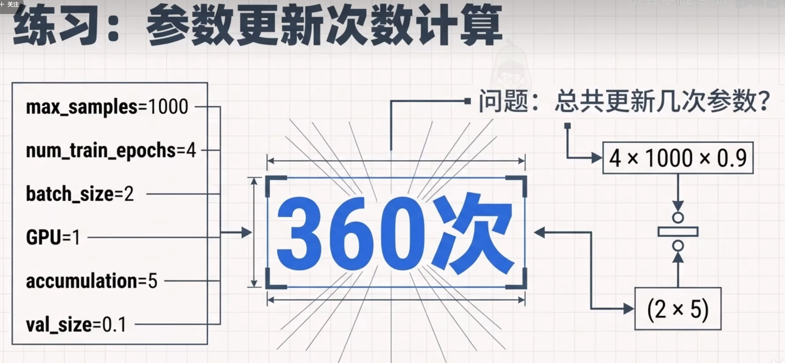

在LlamaFactory的训练日志中，也可以看到这个训练结果

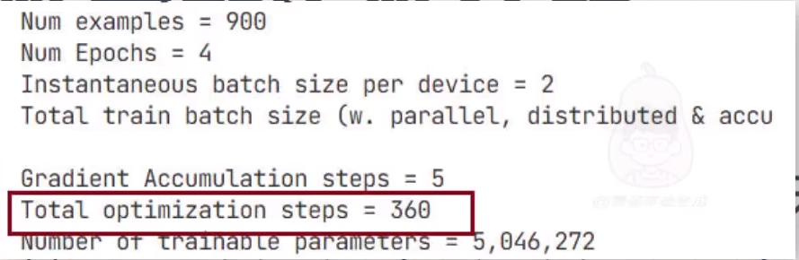


### 评估模型成效

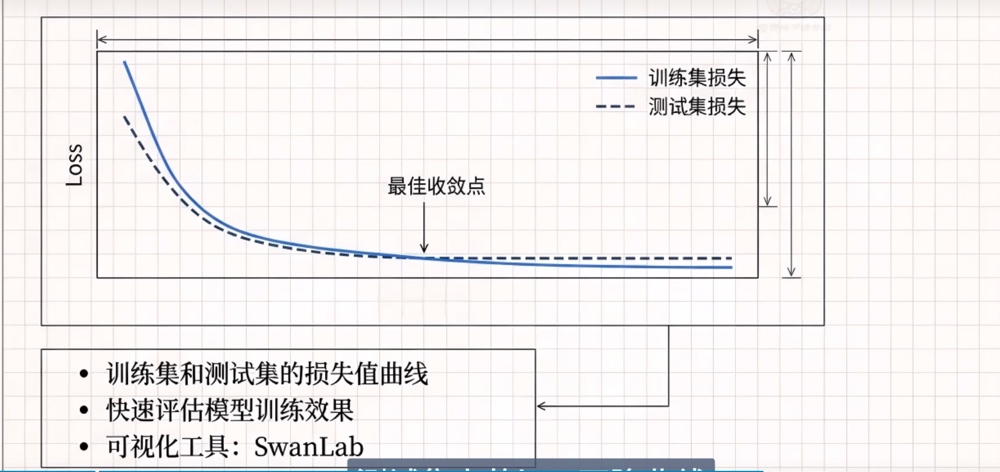

那训练完成之后，我们如何评估本次的训练成效呢？一般来说我们要看模型在训练集和测试集上的表现。

最好是有类似这样的图形，直接画出训练集和测试集上的 loss 下降曲线，以便快速的做个评估。

接下来我要给大家推荐一个好用的微调监控工具， swanlab 是一个专门用于微调监测的工具，它可以记录你微调过程中的关键信息，比如说参数配置、 loss 下降曲线等等，可以方便的做历史记录和对比使用很简单，登录这个网址，首先注册一下，注册完了之后登录在个人设置这个页面，创建一个 API key，这样就可以使用了。

接下来打开 number factory 的配置文件，关于 swanlab 主要有这几个参数。 use swanlab 这个设置为true，表示启用 swanlab swanlab mode 这个设置为cloud，表示使用外网的监测环境。如果你要在本地部署使用，那可以使用 local 设定。

project 会在你的 swanlab 工作空间创建一个项目文件夹，而 runtime 表示你可以给某一次具体的微调任务命名，对应的是 swanlab 工作空间的这一列 swanlab API key，那填入你刚刚创建的API，然后我们启动训练，接下来我们就可以来到 swanlab 页面实时观测训练过程，这里记录了配置项目前情况、详细日志、运行环境等等，一般来说无测试集 loss 的变化情况。

通过这两张图来初步评估模型的训练成效如何？根据这两张曲线图评估模型成效，这个没有一概而论的方法，我说自己的习惯供你参考。首先看训练数据集的 loss 曲线是否下降，如果没有，那就别往下看了，模型根本没有学到东西，大概率是数据有问题，要检查一下数据，如果 loss 曲线有下降，那就看一下曲线是不是会剧烈波动，如果会剧烈波动，那表示训练不稳定，有可能是学习率太大，参数变更过于激烈导致的。这时候可以考虑降低学习率，也有可能是梯度不稳定，这时候可以考虑增加累积的batchsize，这样得到的平均梯度会更稳定。

接下来看一下 loss 曲线是否趋于平稳，如果不平稳，说明训练不充分，最好是增加训练数据或者增加学习轮次。不过有说法是最好不要训练超过 3 轮。 Openai 担心过拟合只训练了一轮，但我觉得还是看场景吧，像我训练了 5 轮觉得还行。接下来就是重点了，要看一下测试集 loss 的变化。首先也是看测试集的 loss 是否下降，如果完全没下降，说明测试集和训练集根本就不在一个样本空间里面，要检查一下数据。如果有下降，那就看一下两个 loss 的差异大不大。如果测试集的 loss 显著大于训练集的loss，那么说明模型在训练集上表现很好，但是在测试集上表现一般，那就要考虑过拟合了，这时候最好要考虑增加样本的多样性。按照我的经验，当测试集的 loss 轻微回升时，往往是要过拟合的警戒线，此时即便训练集的 loss 还有下降空间，我也会暂停训练。

仅仅使用 loss 曲线评估模型是不够的，这只是一个初步的评估，我们还需要更精准的评估方法，比如说人工实际体验，或者用模型来打分。接下来我会部署模型，然后将模型配置到 CHATI 中，在 CHATI 中和模型对话，人工体验模型的成效。那么 factory 本身就可以部署模型，并且支持这三个推理后端 VLLM 可以带来更好的推理速度。

这次我们就使用这个，我们首先执行这个命令安装VLLM，安装完成之后我们就可以用来准备配置文件用于部署 API 了。前三个参数分别从训练配置里面抄过来。 back end 表示推理后端我们填入VLLM，这两个参数用来控制显存的占用大小非常重要。 Max Len 表示最长输出长度， VLLM 会根据这个参数评估需要预留多少显存，不要设置的过大，否则可能直接报错，当然也不要设置的太小，否则会影响业务应用。 GPU util 表示会划用多少比例的显存？ VLLM 会一次性划拨显存，如果设置的过大也会导致报错。

这里还有个参数表示是否开启思考模式，因为我们使用的这个基座模型是可以人为控制是否开启思考模式的。我们在微调阶段并没有微调它的思考能力，所以在推理阶段的时候也关掉思考模式，完成参数配置之后来执行这个命令，启动API，这个 API model name 是模型的名字，如果不配置，那默认名字就是配置文件中的模型路径，后续使用不方便，我们记住这个模型名字，后面要用好，这里模型服务已经启动了，只是模型地址我们记下来，一会要配置，接下来我们把这个模型配置到 Qwen 中， Qwen 是一个很方便的 AI 聊天工具，支持你自定义模型。而且主要是可以同时和多个模型对话，很方便我们做测试。下载安装之后，我们打开Qwen。

点击左下角的配置，来到模型配置页面，首先点击供应商列表中的添加，随便填个名字，供应商类别记得选择Openai，因为我们刚刚部署的接口是符合 Openai 规范的。接下来就可以配置模型了，点击刚刚创建的供应商右边这里 API 密钥随便填 API 地址，填刚刚记录的模型地址，接下来点击添加模型ID，填入刚刚启动服务时配置的模型名字，这样就行了。接下来我们来到对话页面，你可以在这里艾特不同的模型，这样就可以同时和多个模型对话，进行更全面的比对。比如比对微调前和微调后的模型效果，一般我会重点测试模型的泛化能力，比如训练数据，我用的都是 it 领域的例子，那这边我就会举一个非 it 领域的例子，比如说这里我化身为一个工地的小工，随便写了几句话，发现模型也能有模有样的完成这个周报的优化工作，还不错。

好，这个就是人工检测的方法。人工检测的方法是挺准的，但是毕竟太费人力了，所以我们通常还会让大模型来评估，具体来说就是准备一份测试数据。使用微调后的模型进行批量推理。接下来让另外一个更高级的模型来评估推理结果的质量。怎么评估质量的好坏呢？你可以设定一套评估标准，让大模型按照这个评估标准进行打分。这个视频很长的，这个方法我们就不介绍了，留给大家自己实现吧。我们的微调系列也告一段落了，后续可能会零星的再出一些视频，比如说探讨微调到底能不能学会新知识。如果觉得这次还不错，请给个一键三连。最后祝大家春节快乐，再见。