> 视频连接：https://www.bilibili.com/video/BV1iws5zyESt

## 一、微调介绍

### 1、大模型的本质是什么

**模型的本质是函数，核心是参数，训练是为了得到更好用的参数。**

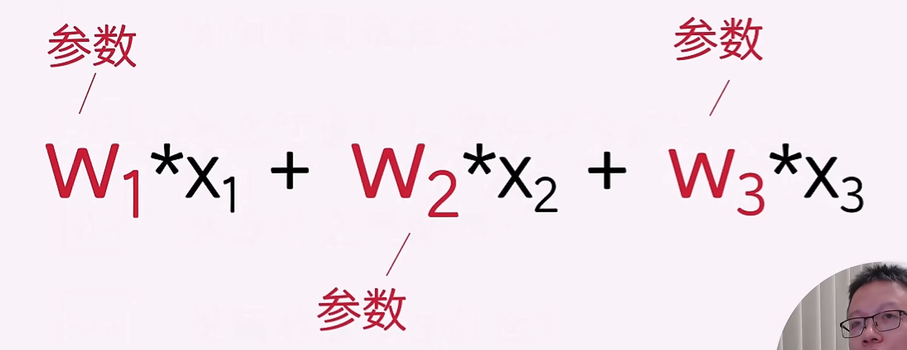

大模型看似智能，其实每吐出一个词，都是根据当前词，计算下一个词的概率，这个计算过程就是由函数完成的。

那么函数里的这些参数就至关重要了，它们决定了模型最后算出来的结果准不准确。

模型的知识和能力就是存储在这些参数里。所以模型智能不智能，很重要一点就是看参数好不好（当然跟模型的结构也有关系）。

因此所谓模型训练就是寻找优质参数的过程。

### 2、如何得到优质参数

我们小时候解方程都知道，解未知数是有个公式。

你可能以为大模型的这些参数也可以通过某个公式来计算，其实不是，大模型的参数是一步一步试出来的。

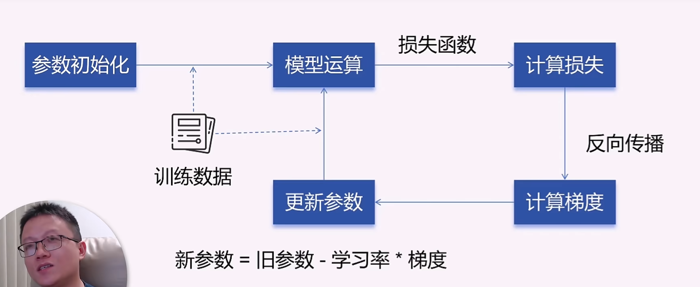

具体过程如上图，首先**随机初始化**所有参数的值，我们不知道好的参数是多少，没有关系，我们先随机初始化；

接下来我们拿着初始化好的参数开展计算，也就是输入训练数据，让模型预测下一个词的概率，模型会输出一个结果，比如下一个词是"命运"，但模型认为命运的概率只有0.0001，这就错的离谱，但没有关系，我们记录下这个错误，这个叫做损失；

接下来我们拿着这个损失对模型的所有参数进行求导，这个求导的过程很复杂，不用管它。只要记住，求导的结果我们称它为梯度就好，有了梯度结合这个公式我们就可以进行参数更新了。

看不懂这个公式也没关系，你只要知道更新参数的逻辑是用旧的参数加减某个值，就得到了新的参数，我们通过这个方法持续重复这个过程，就可以不断对参数的值进行调整，那么要重复几次才停下来，这就来到我们今天第三个问题。

### 3、怎么知道模型学得好不好

怎么知道模型学的好不好？

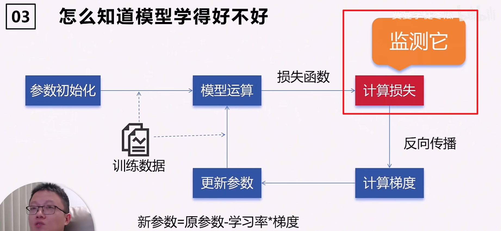

当我们觉得模型学会了的时候，我们就可以停下来，所以我们要知道在多轮的训练过程中模型学的怎么样了？最简单的方式就是监测前面说的这个损失，如果损失没有下降，那说明没有学会，需要继续学，直到这个损失下降了为止。

但是注意有个陷阱，损失函数掉了不一定说明学会了，就好比你平时练习题都做对了，不代表你真的学会了，你得通过考试才能说明你真的学会。大模型也要考试。

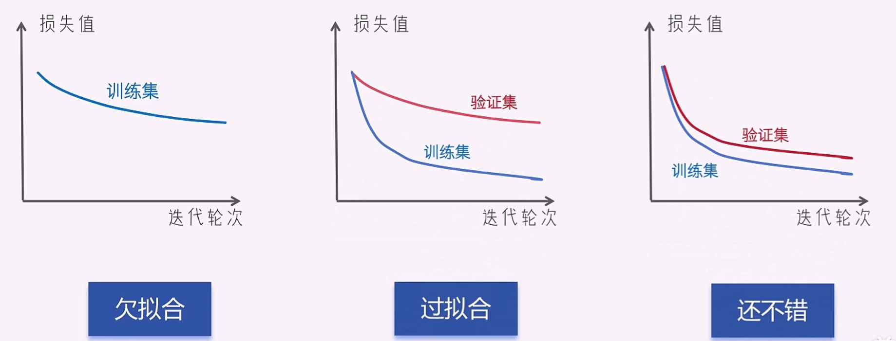

我们另外准备一份数据，这份数据不能和训练数据重复，我们称它为验证集。我们把这个验证集丢给模型，看看损失值是怎么变化的，如果训练集损失很低，但是验证集损失很高，这叫过拟合，说明模型学的不好。

完美的情况是训练集和验证集的曲线都稳步的下降，当然也不只有损失，这个评估指标还有很多，后面我们会再继续介绍。

总而言之，在这个微调过程，我们需要通过某种评估方法实时的来检验模型的成效，这个是非常重要的。后面我们会反复提

### 4、到底什么是微调

第四个问题。到底什么是微调？

一句话总结：**微调就是在已经训练好的模型上继续调整模型的参数**。

那好好的，我们为什么要继续调整模型的参数呢？因为原来的模型，因为各种原因不能适配我们的任务，我们需要训练出一个新的模型。

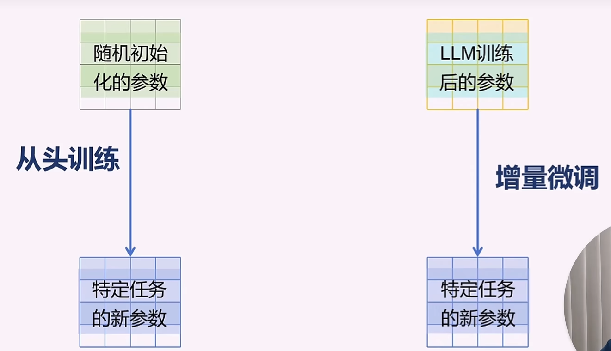

这时我们有两种方法，一种就是按照前面流程说的重新训练一个，另外一种就是我们拿一个已经训练好的模型，在这个基础上继续训练，这就是微调。

你想想这两者本质的差异是什么？本质的差异是参数初始化的方式不一样，前者随机初始化，这是没办法的办法。后者是拿已经验证过了的参数进行初始化，一个是随机，一个是调出来的，所以后者相当于让你站在巨人的肩膀上继续往下走。如果你的目的是罗马，微调相当于是直接把你送到了意大利，会极大的节省你的时间。 

### 5、微调的流程是什么

第五个问题，微调的流程是什么？


微调有三个步骤，找一个模型，准备一批数据，选一个微调方法。既然微调是在已有的模型的基础上继续调整参数，那总要找一个模型，这个叫做基座模型。准备数据是整个微调过程中最重要的环节，花再多心思也不过分。业界有一句话叫做你输入的是垃圾，得到的也是垃圾。有了基础模型和微调数据，最后再选一个方法就行了。

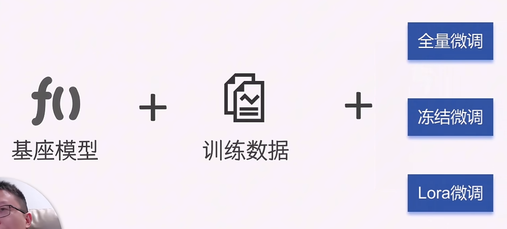

总体来说有三种方法，分别叫全量微调、冻结微调和 Lora 微调。

### （1）全量微调

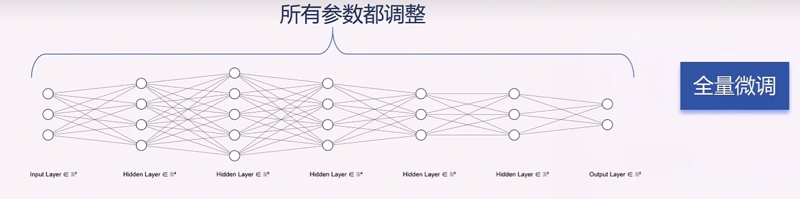

所谓全量微调，是指我们要对模型的所有参数都进行调整，如果一个模型有 100 亿参数，那就对 100 亿参数都进行调整。

### （2）冻结

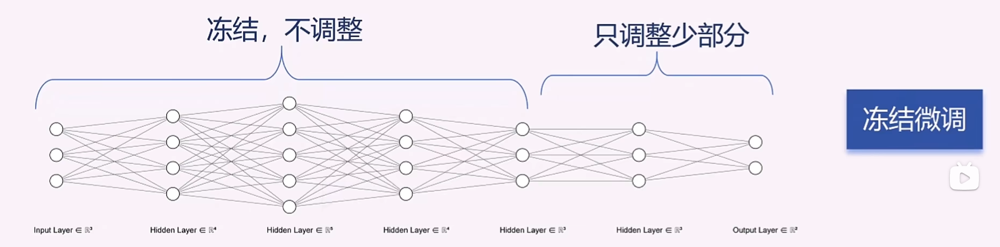

而冻结微调是这个神经网络有这么多层，底层的我就不动了，冻结起来。我们把输出层或靠近输出层的那几层拿出来调整就好。

### （3）Lora 微调

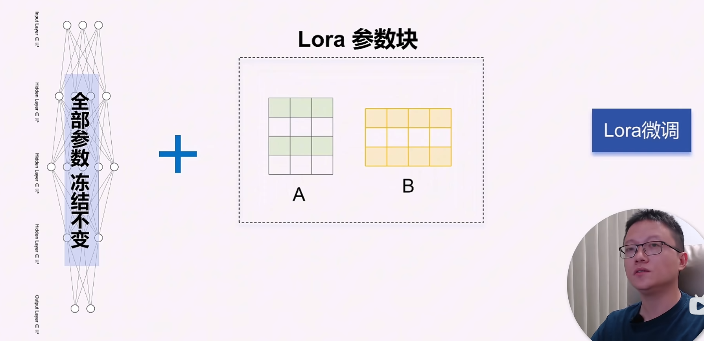

那我们主要介绍 Lora 微调，这个有意思，它不是对原来的模型参数直接调整，而是构造出一个参数模块，训练好这个模块的参数就行，然后将原来的模型加这个参数模块的参数合并起来就得到了完整的参数。这样的话我们只要调整少量的参数，就能实现一个比较好的效果。具体的技术细节我们后面会介绍的很清楚。

### 6、什么时候要使用微调

第六个问题，为什么要微调？

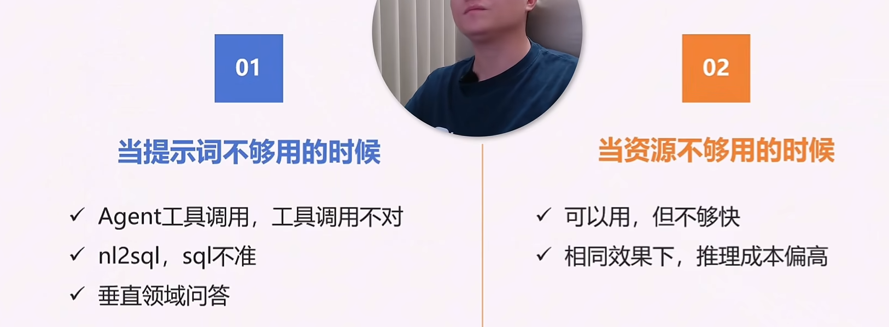

为什么要微调？各种说法有很多，我觉得总结起来就是两点。提示词不够用的时候，或者计算机资源不够用的时候。

#### 场景1：提示词不够用

什么叫提示词不够用？就是在你的场景中，你竭尽所能的调整提示词，但是依然不能实现预期目标，这样的情况可太多了。比如最常见的是智能体中的工具调用，我们要让模型从用户的提问中准确的判断出需要使用哪个工具，以及对应的参数是什么。

如果你纯依靠提示词来实现，那一定需要性能好的模型，普通模型是不行的。即便这样，还得要求你的场景不能过于复杂，否则还是不行。那就可以考虑微调了。

#### 场景2：资源不够用

另外一种场景是提示词够用，但是提示词要写得很长，加上很多案例，并且要用比较大的模型才能实现这个场景，这时候长上下文加大模型势必导致两个问题，第一资源消耗巨大，第二推理速度变慢。

 在很多业务场景中，这两点都是不能接受的，所以我们可以专门针对这个场景微调出一个小模型，既能满足业务需求，又极大的降低了资源需求。

---

## 二、环境搭建

执行如下脚本，安装环境

```sh
#!/bin/bash

# LLaMA-Factory 自动安装脚本
# 注意：此脚本在执行时，所有相对路径都以脚本所在目录为根目录

set -e  # 遇到错误立即退出

echo "=== 开始安装 LLaMA-Factory 环境 ==="

# 获取脚本所在目录
SCRIPT_DIR="$(cd "$(dirname "${BASH_SOURCE[0]}")" && pwd)"
cd "$SCRIPT_DIR"

echo "当前工作目录: $(pwd)"

# 安装系统级依赖
echo "=== 安装系统级依赖 ==="
sudo apt-get update
sudo apt-get install -y python3-pip python3-setuptools python3-venv git

# 克隆 LLaMA-Factory
echo "=== 克隆 LLaMA-Factory 仓库 ==="
REPO_DIR="LlamaFactory"
if [ ! -d "$REPO_DIR" ]; then
    git clone https://github.com/hiyouga/LlamaFactory.git
else
    echo "$REPO_DIR 目录已存在，跳过克隆"
fi

# 先创建虚拟环境，再在虚拟环境内安装uv，避免系统限制报错
echo "=== 创建虚拟环境 ==="
if [ ! -d "finetune" ]; then
    python3 -m venv finetune
fi

# 激活虚拟环境
echo "=== 激活虚拟环境并安装依赖 ==="
. finetune/bin/activate

# 在虚拟环境中安装uv（无系统限制报错）
echo "=== 安装 uv ==="
pip install uv -i https://mirrors.aliyun.com/pypi/simple

# 进入项目目录安装LLaMA-Factory
cd LlamaFactory
echo "当前目录: $(pwd)"

# 安装 LLaMA-Factory
echo "=== 安装 LLaMA-Factory 及其依赖 ==="
uv pip install -e ".[torch,metrics]" -i https://mirrors.aliyun.com/pypi/simple

# 返回脚本目录
cd "$SCRIPT_DIR"

# 验证安装
echo "=== 验证安装 ==="
. finetune/bin/activate
cd LlamaFactory

echo "1. 验证 LLaMA-Factory 安装:"
llamafactory-cli version

echo "2. 验证 GPU 是否可用:"
python -c "import torch; print('CUDA available:', torch.cuda.is_available())"

echo "=== 安装完成 ==="
```


## 三、模型微调全流程尝试

一行代码都不用写就可以实现模型微调，这是 Llama factory 最大的优点，也因此我认为它是最适合于新手的框架。

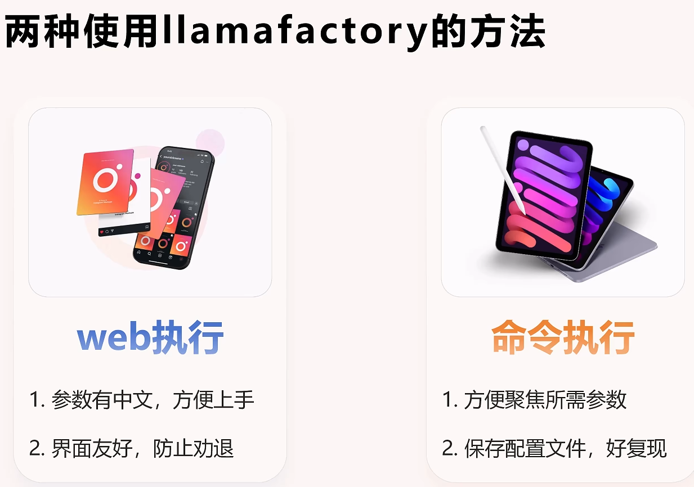

在 LLAMA factory 里面，你只要通过参数配置就可以实现所有微调的功能。那主要通过两种方式进行参数配置，一种是通过 Web UI 的方法，另外一种是通过配置文件编辑的方法。今天这两种方式我都会介绍，并且介绍完了之后会告诉你哪种方式是我比较推荐的。

### web执行

首先执行

```sh
llamafactory-cli webui
```

执行完命令后，点击链接即可跳转到 llamafactory 的web界面

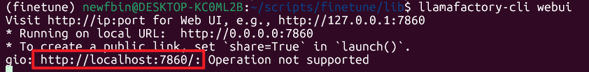

在界面中按照如下顺序点击

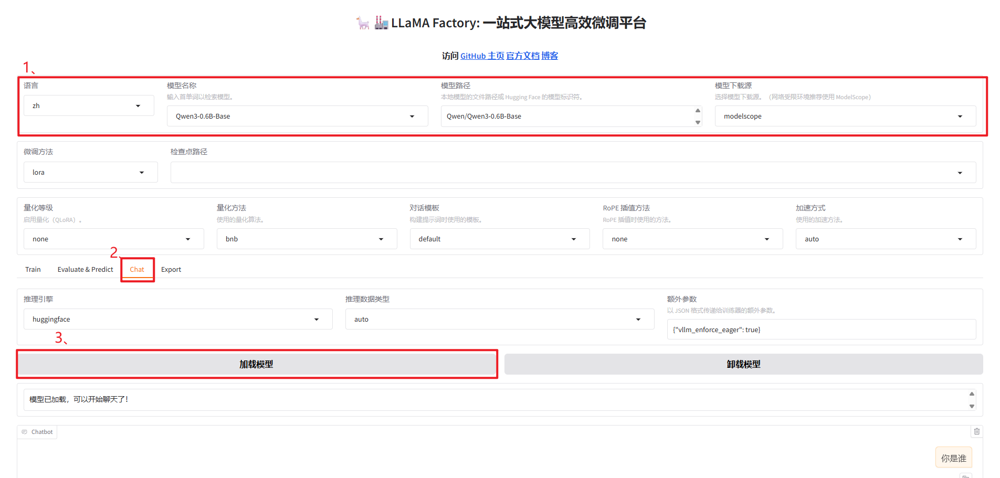

等待模型加载完成后，即可开始聊天

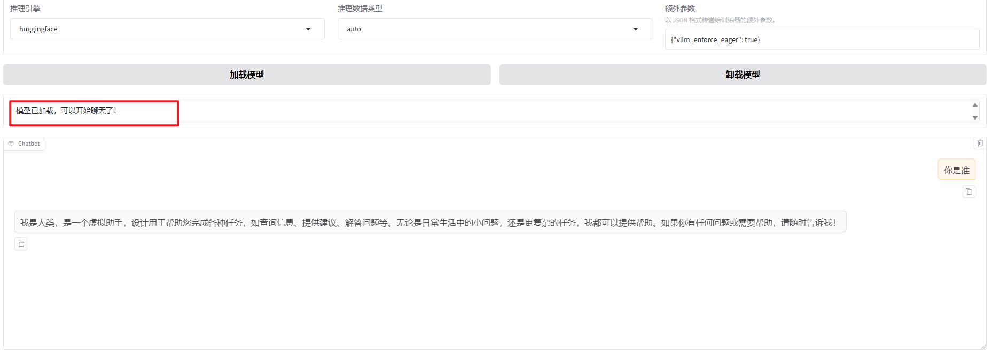

### 命令执行（推荐）

> 以下文件路径都以 LlamaFactory 为根路径
>
> 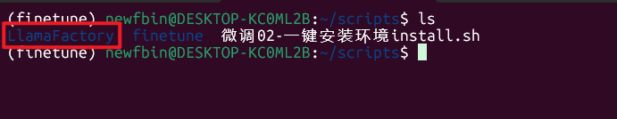

接下来会涉及 `train、chat、export、api`四个命令，每个命令都会执行两个步骤： `1、修改配置`，`2、执行命令`

#### train

1、命令查询

```sh
llamafactory-cli -h
```

2、修改配置文件 `examples/train_lora/qwen3_lora_sft.yaml`

```yaml
model_name_or_path: Qwen/Qwen3-0.6B-base
template: default
output_dir: saves/qwen3-0.6b/lora/sft
```

3、执行训练

```sh
cd LlamaFactory
USE_MODELSCOPE_HUB=1 llamafactory-cli train examples/train_lora/qwen3_lora_sft.yaml
```

#### chat

1、准备执行`chat`，修改配置文件 `examples/inference/qwen3_lora_sft.yaml`

```yaml
model_name_or_path: Qwen/Qwen3-0.6B-base
adapter_name_or_path: saves/qwen3-0.6b/lora/sft
template: default
```

2、执行推理对话

```sh
USE_MODELSCOPE_HUB=1 llamafactory-cli chat examples/inference/qwen3_lora_sft.yaml
```

#### export（合并）

1、修改配置文件 `examples/merge_lora/qwen3_lora_sft.yaml`

```yaml
model_name_or_path: Qwen/Qwen3-0.6B-base
adapter_name_or_path: saves/qwen3-0.6b/lora/sft
template: default

export_dir: output/Qwen3-0.6B
```

2、执行合并命令

```sh
USE_MODELSCOPE_HUB=1 llamafactory-cli export examples/merge_lora/qwen3_lora_sft.yaml
```

#### api（部署api）

1、修改配置文件 `examples/inference/qwen3_lora_sft.yaml`

```yaml
model_name_or_path: output/Qwen3-0.6B
```

2、启动api

```sh
USE_MODELSCOPE_HUB=1 llamafactory-cli api examples/inference/qwen3_lora_sft.yaml
```

3、测试api，复制命令到shell中，回车执行

```sh
curl -s http://localhost:8000/v1/chat/completions \
  -H "Content-Type: application/json" \
  -d '{
    "model": "output/Qwen3-0.6B",
    "messages": [
      {"role": "user", "content": "你是谁"}
    ],
    "max_tokens": 64,
    "temperature": 0.7
  }'
```

## 四、基座模型的选择与使用

### 模型选择

> 从**模型家族，模型阶段，模型大小，思考模式**四个维度决定如何选择模型

|      | 模型家族                   | 模型阶段                           | 模型大小                         | 思考模式                                               |
| ---- | -------------------------- | ---------------------------------- | -------------------------------- | ------------------------------------------------------ |
| 选项 | qwen3、llama3、deepseek... | 预训练模型、chat微调、instruct微调 | 0.6B、1.7B、4B、8B、14B          | 推理模型，非推理模型                                   |
| 推荐 | qwen3                      | instruct微调                       | 无，能满足应用的情况下，越小越好 | 能满足应用的情况下，可以选择推理模型，但不使用思考模式 |
| 理由 | 性能好、教程多、品类齐全   | 对新手友好，难度与效果的最佳平衡点 | 尽量提升速度，节省资源           | 尽量提升速度，节省资源                                 |


### 模型使用

1、安装modelscope

```sh
# 激活环境 (首先cd到finetune/bin/activate所在的目录)
source finetune/bin/activate
# 安装modelscope
uv pip install modelscope -i https://mirrors.aliyun.com/pypi/simple
```

2、下载模型到指定路径

> 需要将 `/home/newfbin/scripts/models/Qwen3-0.6B` 替换为自己自定义的目录

```sh
modelscope download --model Qwen/Qwen3-0.6B --local_dir /home/newfbin/scripts/models/Qwen3-0.6B
```

3、应用的时候，在 `examples/train_lora/qwen3_lora_sft.yaml`配置文件中，按照绝对路径写清楚

```yaml
model_name_or_path: /home/newfbin/scripts/models/Qwen3-0.6B
```

4、执行训练（能启动就行，说明模型起作用了）

```sh
cd LlamaFactory
llamafactory-cli train examples/train_lora/qwen3_lora_sft.yaml
```

## 五、准备微调数据

机器学习界有句话叫做**数据决定模型的上限，算法只是让你逼近这个上限。**这句话放到现在依然不过时，但是准备数据的确很麻烦，麻烦到通常会占整个微调工作的 70% 到80%，以至于很多人想偷懒，但是模型会惩罚任何一个想偷懒的人，很多人着急着做后续的各种调试，发现没有效果，最后还是乖乖的回过头来，继续把数据搞清楚，最后才把模型的效果提了上去。

### 准备数据的关键

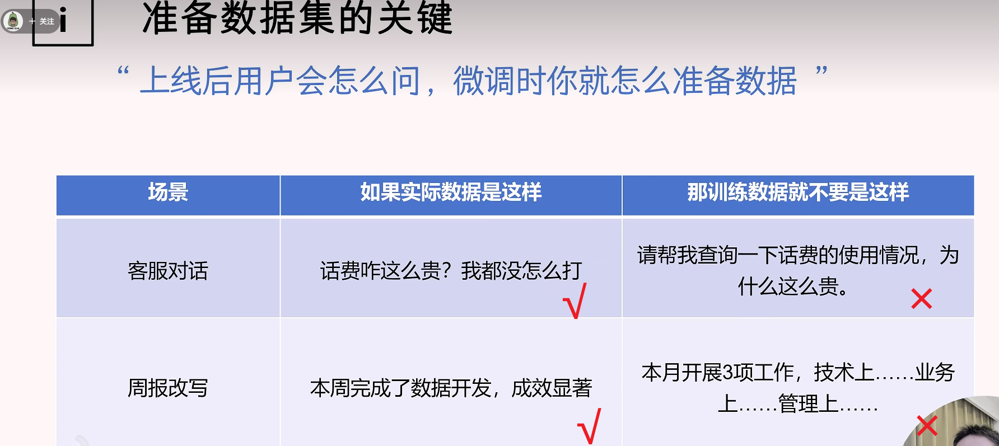

准备数据最重要的一点就是看上线后用户会怎么问，微调的时候你就要怎么准备数据。比如说如果你做的是客服机器人，那最好收集历史上用户的常见提问，既包括用户的提问内容，也包括提问方式。再比如说你想做一个周报优化器，上线之后给同事们使用，那么在训练阶段最好就找同事们收集一些平时他们写的垃圾周报，然后当成模型的输入。有了上述数据，你再采用**人工填写、规则填充、模型回答**等多个方式去得到输出数据，这样有了输入和输出，训练数据就准备好了。总而言之，训练数据应该尽可能地模拟上线后用户会提问的问题类型、语言风格，还有数据这个提问的复杂程度。确保训练数据和上线后的预测数据两者的数据分布要尽量的相似，才能够使模型有更好的泛化效果。当然我们说的是尽量相似，如果是实在不相似行不行？也可以，只是效果差一点，具体的话还是要实际试一下。

### 没有数据怎么办

如果有人会说我没有历史数据怎么办？

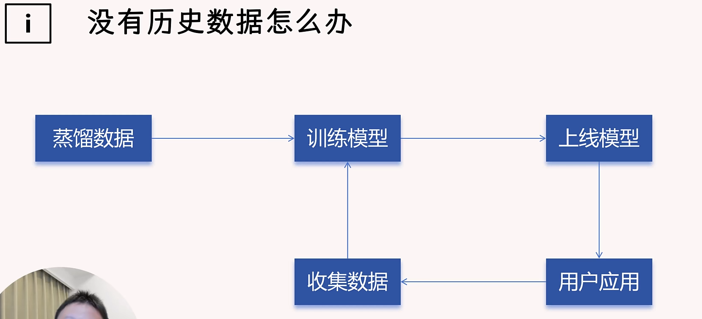

其实可以这样，我们先借助大模型蒸馏出一批数据，用这批数据先去微调出一个模型部署上线。然后给一批有代表性的用户来使用，在这个过程中我们就收集到了用户使用的这个数据，然后拿着这批数据再去微调更新模型，这样不断的更新模型，收集数据，再更新模型，不断的迭代，这样就可以不断的提升模型的效果，也就是说模型蒸馏的数据虽然和真实场景有区别，但是由于蒸馏数据的效率比较高，可以让我们尽快的调出一个 60 分的模型，满足基本的使用要求。至于怎么蒸馏，我们后面会用两节课来说。

### 准备数据集的3个关键

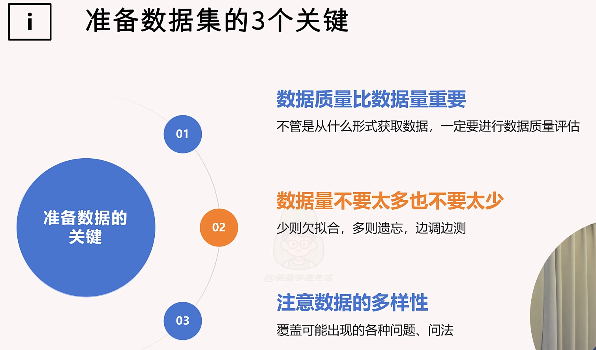

另外关于数据的准备。有几个重要事项，第一点是数据的质量要比数据的数量来得重要，这一点太好理解了，所以即便你不能一条一条的检查数据，也一定要抽样数据做一个评估，心里要有个数。第二，数据量不需要太多，也不需要太少，这取决于你的任务类型和你使用的基座模型。实践中可以从 1, 000 ~ 2, 000 条开始，然后根据模型的效果逐渐的增减。如果任务类型比较简单，比如说是做意图识别，那数据量不用太多。如果任务比较复杂，比如说是做知识库类的问题。那取决你的知识库的大小，如果知识库很大的话，那你的微调数据就要多一点。如果你选用的基座模型是 base 模型，那数据量就要多一点，因为这时候模型还没有学会指令遵循的能力。如果是使用已经调过的 CHAT 模型，那数据量可以少一点。

另外，即便你的数据很干净，数据也不是越多越好，因为多了容易过拟合，容易造成一些灾难性遗忘。什么是灾难性遗忘呢？比如微调之前牛模型 1 + 1 等于多少他知道，但是微调之后他不知道了。为了避免灾难性遗忘，我们可以在数据集中补充一些通用的数据集。第三是要注意数据的多样性。所谓多样性，是指你要尽量覆盖用户可能提问的方方面面，比如说你在微调客服问答模型时，那就要覆盖不同的问题，也要覆盖同一问题的不同问法，这是非常重要的一点，尤其是如果你是通过大模型来蒸馏数据的话，一定要千方百计的保障这个模型的多样性，如果我们要保障这个数据的多样性，有些时候你看似生成了 1, 000 条数据，但其实这 1, 000 条大差不差，那就没有意义，模型的效果一定不好。后续我们会介绍在蒸馏数据的时候如何保障数据的多样性。

### 准备数据集的3个方法

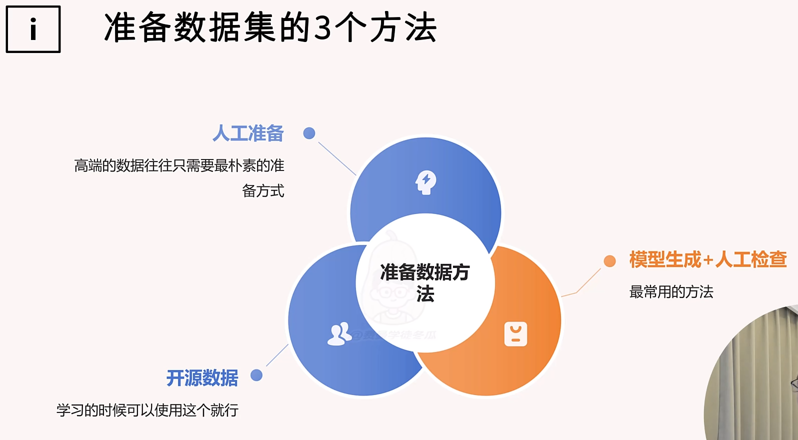

最后我们介绍一下数据要如何准备，大体上是三种。人工准备，模型生成加人工检查，还有第三种开源数据人工准备，这个很好理解，埋头吭哧吭哧，一条一条准备过去，有人看不起这个方法，其实他真别看不起。我记得谷歌团队有个大佬就建议他们的团队要时不时来个披萨，时间就是一边吃披萨一边讨论怎么准备数据，怎么样去给数据做标注，检查生成的数据等等。这块我们不要有太强的技术思维，觉得某个方法很 low 就嗤之以鼻。还是那句话，不管是黑猫白猫，能够解决问题的就是好猫。当然这个方法还是太费人类了，所以通常我们会借助模型来生成第二种模型生成加人工检查，如果你已经有了 1, 000 个问题，那就可以让模型来回答，从而获得输入和输出数据。对，如果你手头已经有了内部的文档，那也可以让模型根据文档来生成回答，或者纯粹空手套白狼，让模型完全无中生有，生成指定领域的问答。对，都可以，但记得我们还是强调要人工检查一下，保障一下数据质量。

### 开源数据集网址

魔搭：https://modelscope.cn/datasets

天池：https://tianchi.aliyun.com/dataset

百度飞桨：https://aistudio.baidu.com/datasetoverview

### 下载开源数据集

```sh
modelscope download --dataset alleyf/HUST-Student-Handbook --local_dir ./dataset/HUST-Student-Handbook
```

数据集内容如下：

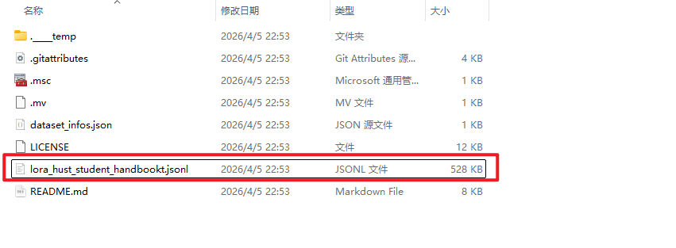

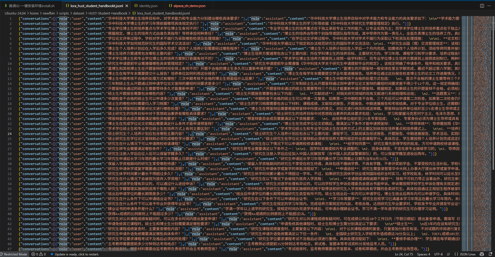

## 六、LlamaFactory的两种数据格式

### alpaca格式

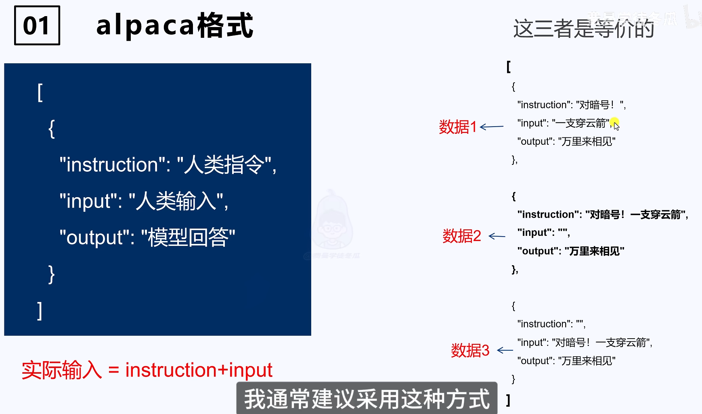

### shareGPT格式

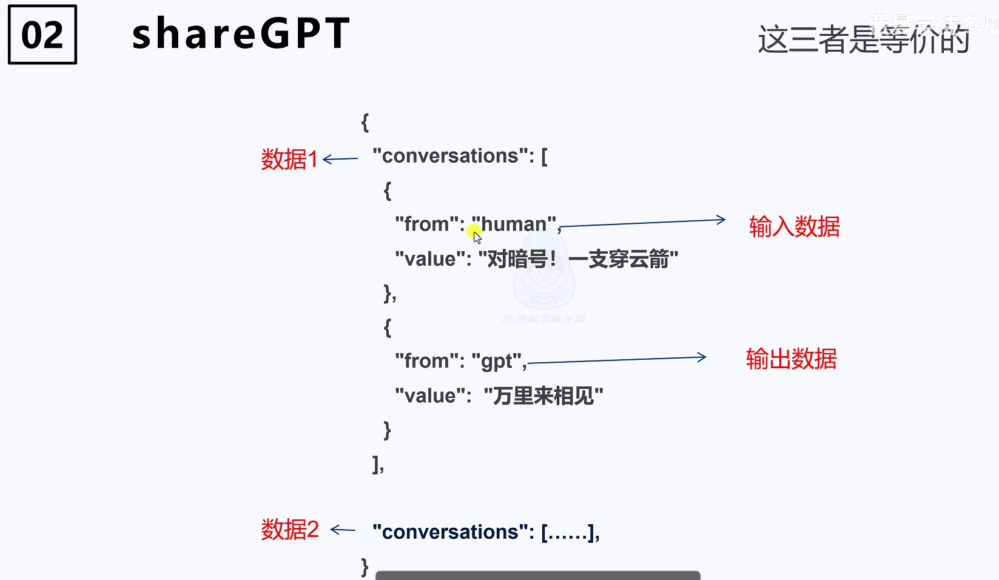

### 数据准备与加载流程

在LlamaFactory文件夹下，存在`data`和`examples`文件夹，分别存放示例数据和示例配置文件。

推荐自己新建一个 `my_data`和`my_yaml`，来存放自己的数据和配置文件。

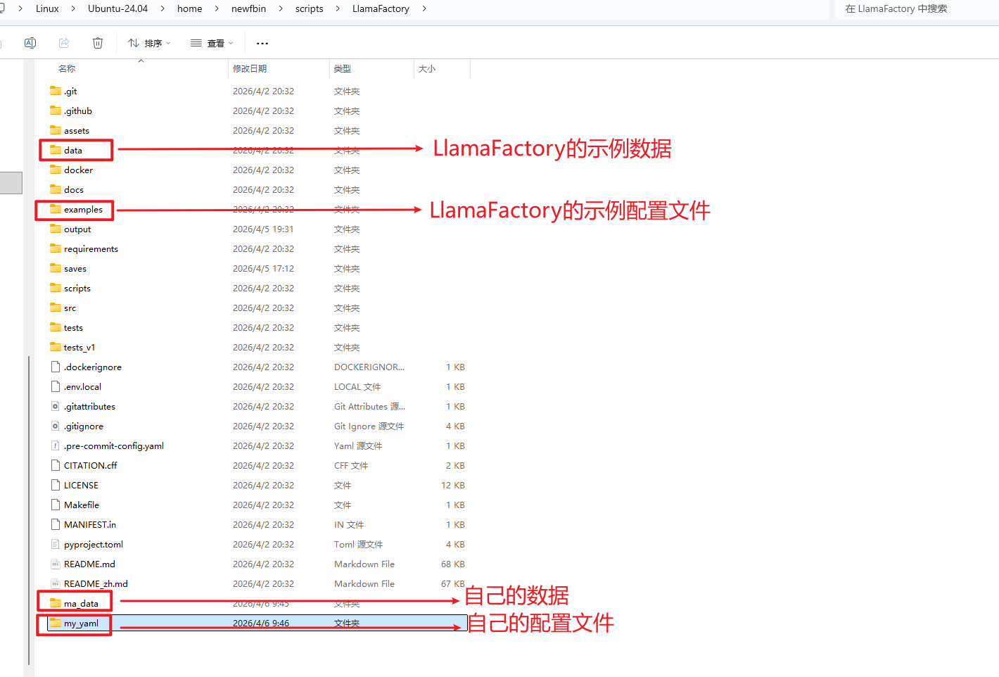

在my_data下新建`data_alpaca.json`和`data_share_gpt.json`文件，

`data_alpaca`文件内容

```json
[
    {
        "instruction": "对暗号！",
        "input": "一支穿云箭",
        "output": "万里来相见"
    },
    {
        "instruction": "对暗号！一支穿云箭",
        "input": "",
        "output": "万里来相见"
    },
    {
        "instruction": "",
        "input": "对暗号！一支穿云箭",
        "output": "万里来相见"
    }
]
```

`data_share_gpt`文件内容

```json
{
    "conversations": [
        {
            "from": "human",
            "value": "对暗号！一支穿云箭"
        },
        {
            "from": "gpt",
            "value": "万里来相见"
        }
    ]
}
```

打开dataset_info.json文件

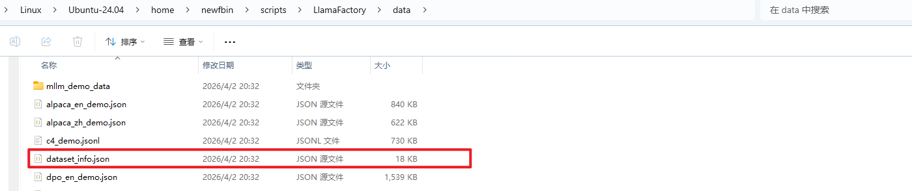

新增配置

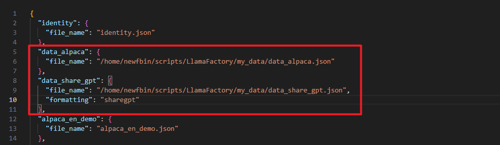

将`examples/train_lora/qwen3_lora_sft.yaml`文件复制到新建的 `my_yaml`文件夹下， 并修改dataset配置项。

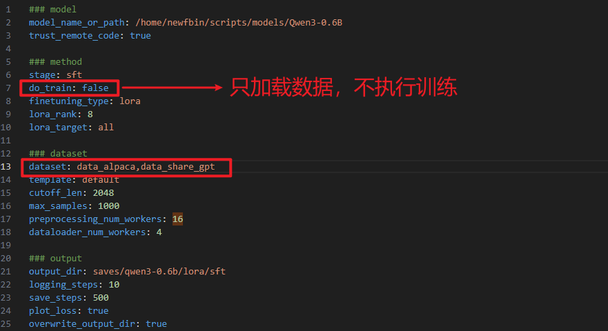

接下来执行以下命令来加载数据

```sh
lmf train my_yaml/qwen3_lora_sft.yaml
```

### alpaca格式数据映射

数据文件

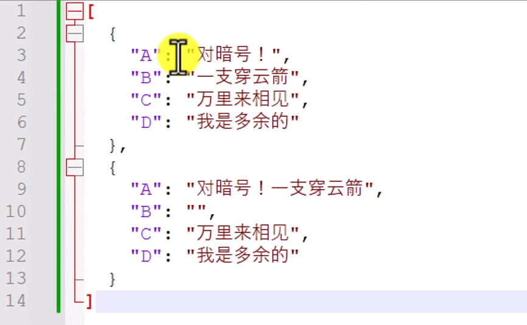

配置文件

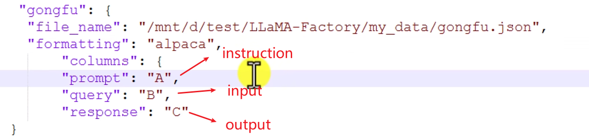

## 七、

```py
# 1. 构造input-输入数据（劣质报告）
## 1.1 构造动态提示词
import random

def generate_input_prompt():
    roles = ['初级产品经理', '高级项目经理', '技术负责人', '数据产品经理']
    tasks = ['工单流程开发', 'BI看板开发', '文本分类模型建设', '知识库建设', '对话智能体建设', '接口开发与联调', '数据中台建设', '用户画像标签体系建设', 
             '数据治理与质量监控','用户需求调研与分析', '跨部门沟通协调', '技术方案选型与评审', '数据备份与灾难恢复演练', '指标口径统一化建设']
    report_types = ['周报', '月报', '建设进展', '工作总结']
    word_counts = [80, 120, 150, 200]
    problem_categories = ['逻辑混乱', '口语化严重', '流水账', '缺乏数据支撑', '价值点缺失']
    
    role = random.choice(roles) # 4种组合
    task = random.choice(tasks) # 14种组合
    report_type = random.choice(report_types) # 4种组合
    word_count = random.choice(word_counts) # 4种组合
    selected_problems = random.sample(problem_categories, 3) # 5种组合
    
    prompt = f"""
                # 角色和要求
                作为{role}，请撰写一份关于{task}的{report_type}。这份报告应该是一个典型的"反面教材"。
                
                ## 需要突出的问题特征（重点体现：{', '.join(selected_problems)}）：
                - 逻辑不连贯，想到哪写到哪
                - 大量使用口语化、不专业的表达
                - 像记流水账一样罗列工作
                - 避免使用具体数据和量化结果
                - 只描述过程，不提炼价值和成果
                
                ## 写作要求：
                - 字数：{word_count}字左右
                - 内容要基于真实工作场景，但表达要糟糕
                - 避免刻意搞笑或夸张，要像真实工作中会出现的低质量报告
            """
    
    return prompt, {
        "role": role,
        "task": task,
        "report_type": report_type,
        "word_count": word_count,
        "problem_types": selected_problems
    }

# 使用示例
prompt, metadata = generate_input_prompt()
print("生成的提示词：")
print(prompt)
print("\n样本元数据：", metadata)
## 1.2 调用大模型，生成“劣质报告”
from openai import OpenAI

api_key=r"6be28e485ed034fce5b5f20bd4facc67.CCLWM78V32tWhRTI"
base_url= r"https://open.bigmodel.cn/api/paas/v4"
model_name = "glm-4.5-x"


client = OpenAI(
    api_key=api_key,  
    base_url=base_url 
)

def generate_input_sample():
    """生成单个样本的辅助函数"""
    prompt, _ = generate_input_prompt()
    
    response = client.chat.completions.create(
        model=model_name,
        messages=[{"role": "user", "content": prompt}]
    )
    
    return response.choices[0].message.content

reulst = generate_input_sample()
print(reulst)
num_samples = 2
results=[]
for i in range(num_samples):
    
    # 获取结果
    result = generate_input_sample()
    
    # 添加到结果列表
    results.append(result)

print("数据生成完成!")
results
## 1.3 保存数据，并人工抽样检查，适时调整提示词
 # 保存到JSON文件
from datetime import datetime
import json

filename = f"distill_input.json"

with open(filename, 'w', encoding='utf-8') as f:
    json.dump(results, f, ensure_ascii=False, indent=2)

print(f"结果已保存到: {filename}")

# 二、生成output-输出数据（优质报告）
## 2.1 构造提示词

    
def generate_output_prompt(original_text):
    return f"""
        你现在是一位经验丰富的办公室秘书，擅长将普通文本优化为专业、结构清晰、符合领导预期的优质报告。请根据提供的普通文本，进行以下优化：
        
        ## 核心要求
        请务必在报告中体现以下要素：
        1. 战略格局：将工作成果与公司“降本增效”/“技术驱动业务”等核心战略联系起来。
        2. 逻辑清晰：采用“总-分-总”结构，分点阐述，条理分明。
        3. 数据支撑：尽可能量化成果，使用具体数据（如效率提升百分比、节省工时、处理数据量等）来增强说服力。
        4. 语言专业：使用规范、专业的书面语和技术术语，避免口语化表达。
        5. 亮点突出：不仅要写“做了什么”，更要强调“取得了什么成果”和“带来了什么价值”。
        6. 计划明确：给出清晰、可量化的下一步行动计划。
        
        ## 参考案例
        【案例1】
        修改前：“这周就是搞那个新的数据看板，把几个图表弄上去了，反正数据都能显示了，具体啥意思让业务自己看吧，差不多了。”
        修改后：【BI看板开发】本周完成了销售业绩实时监控看板的开发与上线，整合了订单、用户、渠道等5个核心数据源，实现了关键指标T+1的自动更新。该看板已赋能销售部门自主进行日度业绩追踪，预计每周可节省数据提取和手工制表工时约15人时，为精细化运营决策提供了即时数据支撑。
        ## 待优化的文本
        {original_text}
    """


## 2.2 载入“劣质报告”，生成“优质报告”
import json
import pprint
with open(f"distill_input.json", 'r', encoding='utf-8') as f:
    input_distill = json.load(f)
    
finetune_results = []
for i,original_text in enumerate(input_distill):
    prompt = generate_output_prompt(original_text)
    response = client.chat.completions.create(
        model="glm-4.5-x",
        messages=[{"role": "user", "content": prompt}]
    )
    
    # 按照alpaca格式存储
    finetune_results.append(
        {
            "instruction":"优化报告",
            "input":original_text,
            "output": response.choices[0].message.content
        }
    )
    
pprint.pprint(finetune_results)
## 2.3 载入“劣质报告”，生成“优质报告”（有思考模式）
import json
import pprint
with open(f"distill_input.json", 'r', encoding='utf-8') as f:
    input_distill = json.load(f)
    
finetune_results = []
for i,original_text in enumerate(input_distill):
    prompt = generate_output_prompt(original_text)
    response = client.chat.completions.create(
        model="glm-4.5-x", # 1.模型得具备输出思维链的能力
        messages=[{"role": "user", "content": prompt}],
        top_p=0.8,
        temperature=0.9,
        extra_body={"thinking": {"type": "enabled",}} # 2.要在参数中启用思考模式
    )
    message= response.choices[0].message 
    finetune_results.append(
        {
            "instruction":"优化报告",
            "input":original_text,
            "output":"<think>"+ message.reasoning_content +"</think>\n"+  message.content      # 3.将整出输出和思维链数据拼接起来
        }
    )
    
pprint.pprint(finetune_results)
```


## 八、

假设你接到了一个任务，要微调出一个能够优化周报的模型，那么你的第一个问题是怎么样收集数据呢？你意识到最好的方案是找同事们收集他们过往写的很烂的周报。然后找个优质的大模型，改写成优质的周报，这样就拿到了训练数据。同事们听完你的诉求之后，用很友善的眼神看着你，说，你再说一遍，是谁的周报写的烂？收集数据陷入了僵局怎么办呢？没办法，那就只能让模型无中生有，硬造一堆数据。于是你很快准备好了一份提示词，这段提示词里面，你要求模型产出劣质周报和优质周报，但是开头就不顺利，因为你觉得模型生产出了这些结果里面，要么劣质周报不够劣质，要么优质周报不够优质。调好了前者，后者又出了问题，提示词调来调去总是不顺利。你很快想到，那就拆嘛，先集中构造出劣质的周报，确定没问题了，再生成优质周报。你对提示词做了一下改造，首先聚焦生成劣质周报，但是新的问题来了，模型构造的数据虽然质量不错，但是彼此的相似性太高，这会影响微调的效果。你马上就想到了几个方案，可以调高 temperature 参数或者更换不同的模型，但你知道最主要因素其实是提示词太雷同了，所以。当务之急是要想办法使得提示词也具备多样性，从而给模型下达不同的指令。于是你在提示词中加入了这几个变量，每次随机挑选一个变量值，这样就会得到不同的提示词。

根据业务的实际场景，你选择的提示词里面包括的变量有角色、任务类型、报告类型、问题点，还有字数，并且你剔除了示例，防止模型过度参考示例，丧失了灵活性，可以说是非常聪明了。按照这个方案，你很快得到了足够劣质也足够丰富的劣质周报，接下来就是根据劣质周报去蒸馏出一份优质周报。你很快又准备好了一份提示词，提示词中有角色定义、有要求、有示例，是一份优质的提示词该有的样子。于是你又很顺利的得到了微调所需要的数据。总结以上过程你觉得有以下几个要点，第一，输入数据和输出数据要分开构造，这样完成一份再检查一份，有利于提升数据的质量。第二个，应该尽量提升提示词的差异化，以便获得更丰富的数据。此外还有个建议就是在构造输入数据的时候，提示词中不要有示例。在蒸馏输出数据的时候，提示词才要加入示例，因为输入数据要的是多样性，示例可能会让模型过度的模拟，从而限制了想象力。输出数据要的是确定性，确保模型知道什么样的周报是优质的。如果说还要说一点经验和教训的话，那就是找同事帮忙之前先想清楚要怎么说。正所谓纸上得来终觉浅，绝知此事要躬行。接下来我们进入实操环节，最适合做教学演示的，那自然是 Jupyter 了。这个是叫 Jupyter 还是 jupiter 呀？这个我一下子有点困惑了。不管它了，就叫主派特，那云服务器一般是自带主派特的，可以直接使用。这边我已经写好了代码，我放在简介里面，大家可以自己去下载，然后点击这里可以上传这个代码，这边我已经上传了，然后我们来看一下这个代码，这整个代码分成两个部分，第一个是构造一个输入的数据，这是劣质报告。第二个是生成输出数据，就是优质报告。先看一下第一部分，这边先来看一下生成劣质报告的提示词，这个提示词模板分成三步，第一步是构造一堆变量列表。第二步是从变量列表里面随机选取一部分变量值。第三步是把这些变量值填充到这个提示词模板里面去，这样我们就得到了不同的提示词结果，大家可以看一下根据这份模板，最终我们可以获得多少种不同的组合呢。

答案是 4 乘以 14 乘以 4 乘以 4 乘以5，大概是 4, 480 种，但实际上我们大概只需要 1, 000 ~ 2, 000 条数据就可以了。 4480 种提示词方案对应 2, 000 条数据，所以这个丰富度是足够的。我们来看一下生成的这个结果，这是它生成的提示词，我们可以再切换一下，又是一个不一样的结果，再切换一下又是一个不一样的结果，那么接下来就简单了，我们拿着这份提示词去调用大模型，它就能够生成我们想要的劣质报告了。接下来我们使用的是这个叫 Openai 的框架去调用大模型，应该来说这是现在市面上最普遍的调用大模型的框架了，这个框架的特点是只要符合 Openai 格式的大模型接口，都可以用这个框架来调用，操作非常简单。如果你用过一些 AI 产品就会知道。

要自定义使用某个模型时，只要填入这个模型的接口地址、API、 key 和模型名字就行了。这是因为这些模型接口支持 Openai 格式，可以用同一套代码来调用。比如这里我要调用 GLM 大模型接口，那只要填入 GLM 对应的接口地址、 API key 还有模型名字就行了，其他代码都不用变，那这个 API key 是你需要你去官网申请的，到时候会按照这个 API key 去扣费。另外两个参数，通常你在官方的接口文档也可以找得到。

目前主流的大模型都支持 Openai 格式，因为你不支持的话，别人就要重新学习试用你的接口规范，那人家可能就不用了。这里我选择的是 GLM 这个大模型，一般来说蒸馏数据会用能力比较强的大模型，但我觉得我目前这个场景比较简单，基本上任意模型都能够满足。我选择 GLM 的原因是前段时间他送了一个 TOKEN 大礼包，再不用要过期了，所以这个 key 我也不打码了，留给有缘人了，因为好像 11 月底就过期了。当然了，其实 GLM 这段时间的模型表现也不错，可圈可点。如果你要注册一个的话，不妨点一下我的推荐链接。我放在简介中了。点这个链接去注册的话，你我能各得 2, 000 万TOKEN，感觉有点心虚，怎么回事啊？仿佛在传销。其实这真的也不是广告，咱的段位太低，还接不到广告。不多说了，我们来直接调用这个模型生成一下试试看。

好，成功生成，我们来看一下这个劣质周报怎么样？嗯，看了一下是足够劣质了，我看着血压已经上来了。那接下来的话我们就可以根据需要设定样本的数量，比如说 1, 000 或者 2, 000 条，然后执行这段代码就可以了。这边我设定的是两条，然后之后它就会生成对应数量的这个劣质周报。那完成这一步之后，我们就可以把这份数据保存起来，然后进行人工检查。当然了，我不会在视频里面演示怎么去做这个检查，只是想再一次提醒你数据的质量是非常重要的，要抽空做一些抽样检查，并适时的去调整这个提示词。

好，假设我们已经保存完，接下来就可以进行到第二步去生成这个优质报告。首先还是构造一下这个提示词，这份提示词的特点是我们在这里面明确告知模型优质报告的特点是什么。然后确保模型能够按照我们的需要去生成这个输出数据，并且我们给了一个样例，那拿到这个。提示词我们就可以去载入劣质报告，然后生成优质报告了，这边的代码跟上面差不多，我们也不赘述了，唯一要说的是最后我们把生成的结果按照 l 帕卡的格式去进行存储，这个就是最终生成的结果了。

我们看一下，看起来的确是有模有样的，虽然我看不懂，但看起来很厉害的样子，这个就是一份优质报告该有的品任务到这里基本完成了，但是我们额外再介绍一个带有思考模式的数据集，比如你希望微调之后的模型有思考模式，那构建数据集的时候它也是要有思考的数据的，这是相关的代码。

这里的重点是什么呢？首先你在挑选模型的时候，就必须挑选带有思考模式的模型。像 GLM 4.5 是有的，但是 GLM 3 就没有。第二个的话是在参数中记得要启动它的思考模式，要把这个参数设定为enable，当然这是 GLM 对应的参数格式，不同的模型可能有不同的参数要求，你对应的最好去看一下这个接口文档，比如说这个是它的接口文档。第三点是你在结果数据中要把思维链数据和最终的结果数据拼接起来，用这个 think 标志拼接，一般来说是这个标志。我们来看一下这个结果，你看一下这个是 sink 标志，这个就是模型的思考过程，这是另外一个 sink 标志，后面的话就是它最终实际的输出，这是完整的带有思考模式的数据集。好蒸馏的过程基本上是这样的，当然这份代码还比较简单，它只是告诉你大概的逻辑是什么，实际应用的话肯定还要做一些调整，比如说你应该加一些多线程，不然的话这样这个蒸馏速度就太慢了。这些细节大家就自己去完善了。好消息是互联网有个铁律，但凡你想做的， 99% 的情况下已经有人做了。有一款叫做 easy dataset 的开源数据就是用于解决这个问题的，这款软件让你可以上传一个文档，然后根据这个文档解析出微调所需的问答数据。对，这个软件的开源作者也在 b 站，这个才是真正的大佬，我早就偷偷关注了，推荐你们也关注一下。

首先需要去下载地址，我放在简介中了，我下载的是 exe 文件，然后安装完成之后双击打开。接下来点击新建项目，那我这边已经有了一个，我们直接进入这个项目，进入项目之后记得先配置一下模型，点击一下这里的项目设置，这里有个模型配置，添加上你所需要的模型，添加模型的时候一样是填入这三个信息就可以了。然后我们来到文献处理，首先你需要上传需要处理的领域的文件，上传之后它就会开始进行切片，这是我们最终切片的结果。切完片之后记得在这里再点击一下批量生成基乐队，你先不用管这是什么东西，我们待会解释。那有了这些文本分块就可以进行问题的生成了，选中要进行生成的问题块也可以直接全选，然后点击批量生成问题，接下来进入漫长的等待，然后就可以在问题管理这里看到我们生成的问题了。然后再点击一下全选，再选择构造数据集，然后它就会基于这些问题去生成答案。

最后我们可以在数据集管理这里看到最终的数据，然后我们点击右上角的导出数据集，选择 APAC 格式，点击确认导出这是蒸馏的数据，那这个操作还是很简单的，更具体的应用大家自己看原作者的视频，因为我也不可能讲得更好，直接去搜一下这个软件的名字， b 站里面就有。

那我重点要说的是。如果你只是学会了软件应用，那只是在第一层，我们要把作者的精髓给学习到位，才能更上一层。因为有些时候软件并不能满足你的个性化需求，还是得自己上手，所以我们来学习一下。接下来请看维西亚给定一个文档如何获得问题答案。对，最直观的办法就是把这个文档塞到提示词中，让模型去生成。但这通常会有两个问题，一是模型的上下文有限，整个文档可能塞不进去，即便塞了进去，由于上下文太长，模型的处理效果也不好。二是直接这样生成问题，覆盖可能不全面，或者相似度太高。所以我们通常得做切块，然后根据文本块再去生成数据。

怎么切呢？这是做 rag 老生常谈的问题了。直接按字符切，很有可能导致相同的语义片段被分割到不同的文档，甚至形成来源北辙的语义，让模型产生错误的回答。所以我们得找到一个办法，尽可能的保留文本块的完整语义。这个项目的方法是首先将文档转成 Markdown 格式，由于 Markdown 是用井号键区分章节标题，因此可以很方便的基于井号键对文档进行切分，切分之后每一个文本块都是一个章节，基本上语义是完整的。但是这可能存在两个极端，有些文本块太大，有些文本块太小，这时候我们可以提前设定文本块的最小和最大长度。对于太小的文本块，直接合并到相邻的章节中。

对于太大的文本块，首先根据换行符进行切分，得到不同的段落，如果段落还太大，那就按照句号继续切分，这时候就基本没有问题了。有人会说，如果还有问题怎么办？那就按照文字继续切分，确保程序能够执行下去。总而言之，经过一系列操作之后，我们就得到了众多文本块，接下来的问题是，如何根据给定的文本块生成问题答案，对呢？跟我们之前介绍的做法差不多，这个项目也是聚焦两个步骤，一是分别让大模型独立生成问题和答案，便于调试整个生成过程。二是千方百计的增加问题的丰富度。第二点比较有意思，作者为每个问题设定不同的文体和受众，从而极大提升问题的丰富度。文体是指内容的知识表达框架，受众是指内容的目标读者群体，这个就叫做阶梯队。具体来说就是首先让大模型根据原来的文档生成 5 组阶梯队，然后将每个问题的阶梯队填充到提示之中，让模型参考生成问题，这样就可以让大模型针对同一个文本块，站在不同的视角生成不同的问题。

接下来还有个创意，针对生成的问题随机剔除 60% 的问号。这里是担心模型微调后过于依赖问号来回答问题，好通过这一系列操作，每个文本块我们就都可以得到多个问题，接下来就是如何根据问题生成答案的，这里就简单多了，输入文本块和问题，让模型严格按照文本块来生成答案，这样就搞定了。最后针对这个软件再补充一点，如果你去体验这个软件，会发现作者几乎在所有的地方都保留了人工修改的入口，你可以对接对文本块问题和答案进行各种增删改。这里给我们的启示是，不要觉得模型蒸馏是万能的，人工介入还是必要的，真的不要偷懒。当时 DeepSeek 在训练 R1 的时候，冷启动阶段的几千条数据和 SFT 的 80 万条数据其实也是有人工介入筛选的。还是那句话，数据决定模型的上限。好，今天的课程就到这里，如果觉得这次不错，请给个一键三连。

进行微调最困难的是什么？是跑完微调的全流程吗？不是的。现在微调操作已经傻瓜化，跑出一个微调模型并不难，难的是当模型的效果不好时要怎么调参。今天我们通过一个视频来完整介绍微调的全流程，重点会介绍如何配置参数，如何解读 loss 曲线，如何调整参数。

好，点赞投币收藏，我们马上开始。首先介绍今天的微调任务，早前我说过，我认为微调主要有两个场景，一个是把模型变强，学会原本不会做的事情。一个是把模型变小，用更小的模型去做大模型才能做的事。我们今天的任务是把模型变小，具体来说就是我希望在 0.6 B 的模型上实现周报优化改写的目的。

周报优化这个事情并不难，只要给出合适的提示词，大模型完全可以胜任。这是我们的一个示例，使用相同的提示词分别让 0.6 B 的模型和 235b 的模型优化一段周报， 235b 的模型效果不错， 0.6 B 这个就很糟糕了，出现了幻觉。你看它把提示词中的示例当成了本次周报的内容，所以我们的目标是通过微调让这个 0.6 B 的模型达到和 235B 模型一样的效果，这个就是把模型变小，且相比 235B 模型需要很长一段提示词， 0.6 B 模型仅需输入一句简单的提示词就能达到一样的效果，甚至效果更好，这就显著节省了TOKEN。

这次训练我用的是本地 WSL 环境，显卡是3050。一个打黑神话只能开中画质的破显卡，但是训练 0.6 B 的模型足够了。微调框架使用的是最适合新手学习的 LLAMA factory。我的本机已经装好了，你可以跟我一样把环境装在本地，也可以选择租用云服务器模型，我选择千问3。这个 0.6 B 的模型已经提前从 model scope 下载下来了，很简单，一键执行这个命令就可以，数据我也提前蒸馏好了，来看一下长这样，这是指令，这是输入，这是输出。

准备好数据之后，我们把数据注册到 llama factory 的数据配置文件中，对数据集进行命名，并写清楚数据路径，这样后期只要在配置文件中填写数据集的名字，就可以使用这份数据了。如果你想知道怎么准备环境，怎么挑选模型，怎么蒸馏数据，可以看一下我历史的这些视频，完成这些准备工作之后，我们就可以进入微调环节了。

m a factory 对微调的所有控制都是通过调整配置文件的参数来实现的，官方参数有 200 多个，不可能一个个看，根本学不动。最好的方式是先知道个大概，后面遇到具体不懂的参数可以直接看文档或者去问大模型，我按照自己的习惯把常用的参数分成了 5 个部分，分别是最基础的参数。用于控制模型学习深度的参数。用于控制测试集的参数。用于控制显存的参数以及其他功能性参数。

首先，今天我们介绍基础参数 model name or path，这个参数用于指定基座模型，可以填入模型的名字，也可以填入模型的本地存储路径。如果填的是模型名字，那第一次微调时会自动从远程下载到本地，但我一般不会启动微调时才去下载模型，而是事先从 model scope 下载到空间比较充足的本地硬盘中，然后使用绝对路径来指定模型，这样方便管理所有的基座模型。

template 对话模板非常重要，比如这个就是对话模板，训练数据经过对话模板处理后会变成具备特定标志的一句话模型。在预训练阶段，通过这些标志来区分哪些是人类说的，哪些是 AI 说的，什么时候结束，什么时候开始。如果你选错模板，也就是说微调阶段和预训练阶段的模板不一样，那模型可能会懵逼，可能导致你的模型开始胡言乱语，或者输出奇怪的字符，或者停不下来。选择的方法也很简单， LLAMA factory 官方已经给出建议了，我们对照着选。这里我们用的是千问山的 base 模型，我们选择 default data set，填入训练数据集的名称，这个名称我们已经配置到 data set info 中了， LLAMA factory 会通过这里的路径找到训练数据。 stage 表示训练阶段有预训练，强化学习奖励模型有监督微调，这里我们是有监督微调，我们选择SFT。这是微调类型，包括全量微调、冻结微调和 Lora 微调。一般来说我们选择 Lora 微调，这样性价比最高。至于什么是 Lora 微调，这个我们一会再说。 do train 我们填 true 表示现在是训练阶段，类似的参数还有 do evaluate 表示评估模型会生成模型的评估结果。

do predict 表示基于已完成的微调模型进行批量预测好完成这些参数的设定，就相当于告诉 LLAMA factory。我们要基于这个模型采用这个数据进行 Lora 微调，就说光设定这些参数就足够启动一次微调了，这些参数不用调，设定好了就行。那么当我们说调参的时候，主要是在调什么呢？主要是为了控制学习的深度，不能学的太浅，也不能学的太深，太浅相当于没学会，太深容易过拟合这里常见的参数主要包括 Lora 的秩、 Lora rank 学习率、数据量、迭代轮次等等。

Lora rank， Lora 的秩，这是什么东西呢？我们先简单理解Lora，假定微调之后的参数矩阵是WP，那么 WP 可以表示为原始参数 w 加参数变量 Delta w。这点很好理解，对吧？于是我们的学习目标就从学习 w 配变成学习 Delta w。这个 Delta w 矩阵通常很大，我们假设是 3, 000 行， 5, 000 列。然后有人惊奇的发现，这个 Delta w 具备低秩特性，可以拆分为两个更小的矩阵的乘积 a 和b。至于什么是低秩，这里我们先跳过，先记住结论就好。总而言之，拆分之后我们就不用学习 Delta w，只要学习 a b 这两个矩阵就可以了。那么根据矩阵相乘的特性，我们可以知道 b 矩阵的行必须是 3, 000，列数是可变的。而 a 矩阵的列数必须是 5, 000，行数是可变的。而且两个矩阵能够相乘的前提是左矩阵的列要等于右矩阵的行，也就是说这两个数要相等，这个数就是 Lora rank，简称r，所以 Lora rank 是一个可以调节的参数。

知道上述内容之后，我们就可以回答两个问题了，一、为什么 Lora 会极大的降低参数量呢？以这里为例子，拆解前参数量是 1, 500 万，拆解之后，假设 r 是16，那么参数量是 10.8 万，是原来的0.7%。第二，为什么调整 Lora rank 可以控制模型学习的深度呢？你可以这么理解，当 r 越大， AB 矩阵就越大，也就意味着我们可以用更大的矩阵来表达 Delta w，从而让 Delta w 涵盖更丰富的信息，也就是意味着模型会学得更深。当然 r 不是越大越好， r 越大它的参数就越多。失去了用 Lora 的初衷，而且它很有可能导致过拟合。通常我们可以设定为 8 或者 16 LORA 的原理还是比较复杂的，这里我简化了很多知识点，如果你有点懵逼，那我建议你看一下我之前关于 Lora 的讲解。

下个参数是 learning rate。学习率是什么呢？模型是根据这个公式来更新参数的，新参数等于旧参数减去学习率乘以梯度。那么学习率的作用就很明显了，学习率越大，每一次更新参数的幅度就越大，那就有可能学得更深入，但也有可能因为学习的幅度过大而错过模型的最优解，导致训练不收敛。学习率也不能太小，太小了会导致模型啥都没学到，辛辛苦苦前后向传播，结果参数不怎么更新，白学了。通常设定在这个范围以内，这是个经验值，我们照着做就是了。

一个好的学习率通常是这样的，开始的时候小一点，因为此时模型的参数是随机的，学习步伐不能太大，否则容易失控。然后学习率逐步上升到预设值，这可以加快学习速度，接下来学习率逐步下降，因为越到后期，模型的参数就越趋于稳定，我们需要更精细的调整模型的参数，因此学习率通常会结合这两个参数一起使用，表示在前 10% 的训练步数中，学习率从较低的线性值增加到设定峰值，然后按照余弦函数平滑衰减到接近0。

这里我们也这么设置，下一个是这个参数。数据量表示从数据集抽出多少数据量用于微调。这个很好理解，数据越多自然学得越深。这里有另外一个技巧分享给大家。完成这些参数设定之后，我通常会选择一个比较小的数据量，快速的先跑一遍，确保所有的参数设置没有问题，不会出现bug，避免数据处理完成之后才发现参数设置不当，浪费时间。下一个参数是这个，表示所有的数据要训练几轮，这样训练数据总量就等于单轮的数据量乘以训练的轮次。使用的训练数据越多，自然学得越深入。好，关于控制学习深度，主要就介绍这几个，其他的我们不多说了。在调参过程中，我们会设定一部分数据作为测试集，结合模型在训练集和测试集上的表现来评估微调的效果。测试集相关的参数主要是这几个，这个表示测试数据集你可以专门准备测试数据，也可以不设定，而是选择训练数据集中的一部分作为测试数据，此时你要配置这个参数表示测试数据的比例。这里我们写 0.1 表示从训练数据中取出 10% 作为测试数据，这个参数表示并发测试量推理还是很耗显存的。考虑到我这个显卡比较破，我设置为一。这两个参数要结合起来看，表示每更新 50 次参数就测试一次模型的效果。

通常我会设置 self STEPS 和 Eval STEPS 一致， self STEPS 表示多久保存一次模型， Eval steps 表示多久评估一次模型，这样我就知道每个保存下来的模型效果怎么样，以便完成训练之后挑选一个效果最好的模型作为最终的模型。

这里还有几个简单的参数，是功能性参数，我们也看一下这个参数用于指定训练后模型的保存文件夹。方便我们管理模型，这个参数表示是否覆盖之前的模型成果默认是false，这个时候如果 OPT 文件夹中已经有模型了，就会终止训练。通常你完成调参后可以设定为false，避免训练好的模型被覆盖。那这边我们在调参阶段还要反复训练，所以设置为 true logging steps，这里设置为10，表示每更新 10 次参数，就打印一次当前训练集的损失，用来监测训练的成效。

好，接下来我们可以启动微调了。这里报错了，但不要急，我们看一下这里提示什么？提示显存不足，这里还需要 7G 的显存，但是分配失败。显存不足很常见，但是不用慌。 Llama factory 提供了很多办法让我们控制显存。只要我们愿意付出一些代价，比如说增加训练时间或者降低训练的效果，那还是有很多办法可以控制显存的，接下来我们介绍控制显存的相关参数。 cut off length 表示数据的截断长度，由于 attention 机制，通常是要将当前 TOKEN 跟之前所有 TOKEN 进行计算。显存需求是平方级增长长度翻两倍，显存直接翻 4 倍，万一哪条数据过长，可能就把显存给撑爆了。所以我们通常要把数据截断，但也不能随便截在微调任务中。

答案通常是在句子的最后，如果你设置的这个参数太短，可能恰好把最关键的答案部分给截掉了，所以通常要结合训练数据的一般长度进行合理设定，一般要求 90% 的数据要在截断长度以内，这样既保住了显存，又保住了训练成效。接下来这两个参数通常合起来设置，而且稍微复杂，我们多费点口舌。

在微调时，每次输入模型的数据是一个batch，这个 batch 中的样本数就是一个 batch 的size，我们称为 batch size，而这个参数表示每个 GPU 的 batch size。如果你有多个GPU，那么总的 batchsize 就等于这个参数。乘以 GPU 的数量，这里我们只有一个GPU，所以这个参数就等同于总的batchsize，而这个参数表示经历多少次前后向传播才进行一次参数更新，比如当这个参数等于 3 时，表示每进行 3 次前后向传播才进行一次参数更新。

倘若此时 batchsize 等于2，那就是会把计算 2 乘以3，总计 6 个样本得到的梯度求平均值，拿这个平均梯度去更新参数。这样的好处是多个梯度求平均值之后得到的梯度会更稳定，训练过程也因此会更可控。在这种情况下，我们会发现这两组参数组合的训练效果其实是。是一样的，因为它们都是针对 4 个样本的平均梯度进行参数更新。区别在于前一种每次只计算一个样本，显存消耗更低，但是要进行 4 次计算之后才会更新一次参数，耗时更长。后一种每次会计算 4 个样本，对显存的要求更高，但每次计算后都会更新参数，耗时更短。

在实际微调时，如果显存不够，我们通常会降低单次运算的batchsize，增加这个累计梯度的次数。这是一种时间换空间的技巧，而当你的显存足够时，那可以通过增加 batchsize 来减少训练时间。但是注意，如果你的显存本来就不够大，增大 batchsize 可能会导致额外的显存交换，反而会增加训练时间。

我做了个实验，分别在 3050 和 4090 显卡上使用这两组配置跑模型，其他配置都一样，按道理 batchsize 等于 4 的这一组配置训练时间应该要更短。在 4090 显卡上的确是这样的，但是在 3050 显卡上却反过来 batchsize 等于 4 的这组配置，训练时间反而更长，原因我们就不深究了，大家只要知道要根据自身显存的大小来合理分配这个参数，不要强行分配的太高。这样即便你能跑下来，也可能会适得其反。如果显卡不足或者时间不值钱，那就无脑降低batchsize。

最后，为了加深你的印象，我来做一道题，假设相关参数如下。提问，整个训练过程总共会更新几次参数来，你自己暂停视频想一下，我直接公布答案的答案是这个。在 numfactory 的训练日志中，你也可以看到这个计算结果，现在你知道怎么算的了，接下我们再介绍一种节省显存的方法。

量化 qlora 启动量化的参数就是这个取值是量化位数，通常取 8 或4，表示8位量化或者4位量化没了就这样启用。功能很简单，但我觉得还是有必要啰嗦一下什么是量化，以及它为什么能够节省显存模型加载后会占用显存，通常模型参数是 FP 16 格式，每个参数占用两个字节。量化是指将这些高精度参数转化为低精度整数的过程。如果是8位量化，每个参数占用一个字节，显存占用降至原来的一半。如果是4位量化，那显存占用会降至原来的 1/ 10。所以对模型进行量化之后，加载时所需的显存就会大大缩小，我们不考虑怎么量化，只关注量化前后的变化就好。但是当模型开始进行前后向传播计算时，仍然需要将整形参数反量化为浮点数参数，这样可以提高计算精度。

这个过程是逐层推进的，计算到哪一层，就把那一层的整形参数反量化为浮点数，算完之后立刻把浮点数丢掉，只在显存里保留压缩后的整形参数。由于加入了反量化这个计算步骤，所以计算时间会变长。因此， Qlora 也是一种时间换空间的显存优化方法。如果大家对量化的原理有兴趣推荐，可以看看我这两个介绍量化的视频。哎，我发现这次光推荐视频了，没办法。微调的过程很简单，但难的是背后的这些原理。我要面面俱到，又不能太啰嗦，只能这样了。最后我们增加这些参数来降低显存，接下来我们继续启动微调，好，这次没有报错开始训练了。

那训练完成之后，我们如何评估本次的训练成效呢？一般来说我们要看模型在训练集和测试集上的表现。最好是有类似这样的图形，直接画出训练集和测试集上的 loss 下降曲线，以便快速的做个评估。接下来我要给大家推荐一个好用的微调监控工具， swanlab 是一个专门用于微调监测的工具，它可以记录你微调过程中的关键信息，比如说参数配置、 loss 下降曲线等等，可以方便的做历史记录和对比使用很简单，登录这个网址，首先注册一下，注册完了之后登录在个人设置这个页面，创建一个 API key，这样就可以使用了。

接下来打开 number factory 的配置文件，关于 swanlab 主要有这几个参数。 use swanlab 这个设置为true，表示启用 swanlab swanlab mode 这个设置为cloud，表示使用外网的监测环境。如果你要在本地部署使用，那可以使用 local 设定。

project 会在你的 swanlab 工作空间创建一个项目文件夹，而 runtime 表示你可以给某一次具体的微调任务命名，对应的是 swanlab 工作空间的这一列 swanlab API key，那填入你刚刚创建的API，然后我们启动训练，接下来我们就可以来到 swanlab 页面实时观测训练过程，这里记录了配置项目前情况、详细日志、运行环境等等，一般来说无测试集 loss 的变化情况。

通过这两张图来初步评估模型的训练成效如何？根据这两张曲线图评估模型成效，这个没有一概而论的方法，我说自己的习惯供你参考。首先看训练数据集的 loss 曲线是否下降，如果没有，那就别往下看了，模型根本没有学到东西，大概率是数据有问题，要检查一下数据，如果 loss 曲线有下降，那就看一下曲线是不是会剧烈波动，如果会剧烈波动，那表示训练不稳定，有可能是学习率太大，参数变更过于激烈导致的。这时候可以考虑降低学习率，也有可能是梯度不稳定，这时候可以考虑增加累积的batchsize，这样得到的平均梯度会更稳定。

接下来看一下 loss 曲线是否趋于平稳，如果不平稳，说明训练不充分，最好是增加训练数据或者增加学习轮次。不过有说法是最好不要训练超过 3 轮。 Openai 担心过拟合只训练了一轮，但我觉得还是看场景吧，像我训练了 5 轮觉得还行。接下来就是重点了，要看一下测试集 loss 的变化。首先也是看测试集的 loss 是否下降，如果完全没下降，说明测试集和训练集根本就不在一个样本空间里面，要检查一下数据。如果有下降，那就看一下两个 loss 的差异大不大。如果测试集的 loss 显著大于训练集的loss，那么说明模型在训练集上表现很好，但是在测试集上表现一般，那就要考虑过拟合了，这时候最好要考虑增加样本的多样性。按照我的经验，当测试集的 loss 轻微回升时，往往是要过拟合的警戒线，此时即便训练集的 loss 还有下降空间，我也会暂停训练。

仅仅使用 loss 曲线评估模型是不够的，这只是一个初步的评估，我们还需要更精准的评估方法，比如说人工实际体验，或者用模型来打分。接下来我会部署模型，然后将模型配置到 CHATI 中，在 CHATI 中和模型对话，人工体验模型的成效。那么 factory 本身就可以部署模型，并且支持这三个推理后端 VLLM 可以带来更好的推理速度。

这次我们就使用这个，我们首先执行这个命令安装VLLM，安装完成之后我们就可以用来准备配置文件用于部署 API 了。前三个参数分别从训练配置里面抄过来。 back end 表示推理后端我们填入VLLM，这两个参数用来控制显存的占用大小非常重要。 Max Len 表示最长输出长度， VLLM 会根据这个参数评估需要预留多少显存，不要设置的过大，否则可能直接报错，当然也不要设置的太小，否则会影响业务应用。 GPU util 表示会划用多少比例的显存？ VLLM 会一次性划拨显存，如果设置的过大也会导致报错。

这里还有个参数表示是否开启思考模式，因为我们使用的这个基座模型是可以人为控制是否开启思考模式的。我们在微调阶段并没有微调它的思考能力，所以在推理阶段的时候也关掉思考模式，完成参数配置之后来执行这个命令，启动API，这个 API model name 是模型的名字，如果不配置，那默认名字就是配置文件中的模型路径，后续使用不方便，我们记住这个模型名字，后面要用好，这里模型服务已经启动了，只是模型地址我们记下来，一会要配置，接下来我们把这个模型配置到 Qwen 中， Qwen 是一个很方便的 AI 聊天工具，支持你自定义模型。而且主要是可以同时和多个模型对话，很方便我们做测试。下载安装之后，我们打开Qwen。

点击左下角的配置，来到模型配置页面，首先点击供应商列表中的添加，随便填个名字，供应商类别记得选择Openai，因为我们刚刚部署的接口是符合 Openai 规范的。接下来就可以配置模型了，点击刚刚创建的供应商右边这里 API 密钥随便填 API 地址，填刚刚记录的模型地址，接下来点击添加模型ID，填入刚刚启动服务时配置的模型名字，这样就行了。接下来我们来到对话页面，你可以在这里艾特不同的模型，这样就可以同时和多个模型对话，进行更全面的比对。比如比对微调前和微调后的模型效果，一般我会重点测试模型的泛化能力，比如训练数据，我用的都是 it 领域的例子，那这边我就会举一个非 it 领域的例子，比如说这里我化身为一个工地的小工，随便写了几句话，发现模型也能有模有样的完成这个周报的优化工作，还不错。

好，这个就是人工检测的方法。人工检测的方法是挺准的，但是毕竟太费人力了，所以我们通常还会让大模型来评估，具体来说就是准备一份测试数据。使用微调后的模型进行批量推理。接下来让另外一个更高级的模型来评估推理结果的质量。怎么评估质量的好坏呢？你可以设定一套评估标准，让大模型按照这个评估标准进行打分。这个视频很长的，这个方法我们就不介绍了，留给大家自己实现吧。我们的微调系列也告一段落了，后续可能会零星的再出一些视频，比如说探讨微调到底能不能学会新知识。如果觉得这次还不错，请给个一键三连。最后祝大家春节快乐，再见。