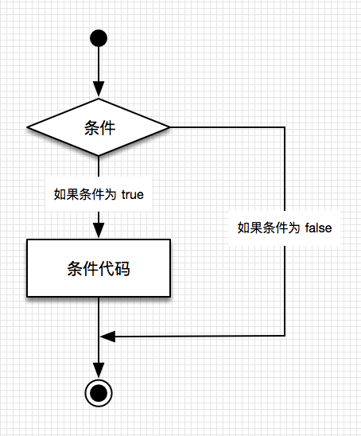
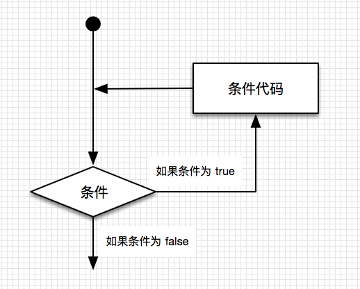
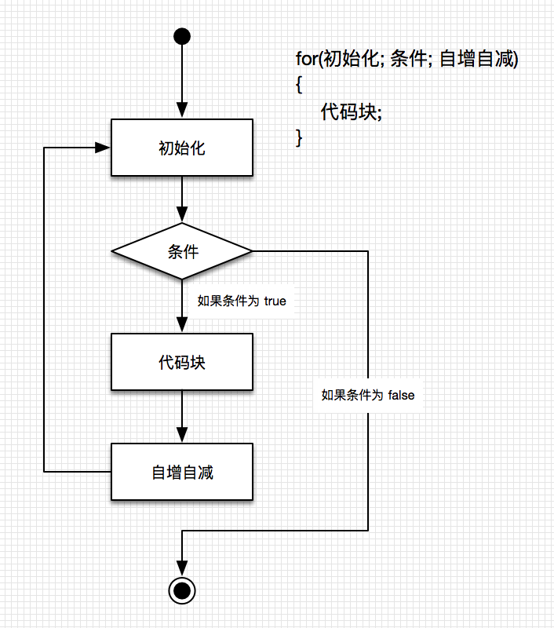
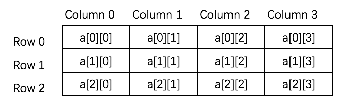

## C# 简介

C# 是一个现代的、通用的、面向对象的编程语言，它是由微软（Microsoft）开发的，由 Ecma 和 ISO 核准认可的。

C# 是由 Anders Hejlsberg 和他的团队在 .Net 框架开发期间开发的。

C# 是专为公共语言基础结构（CLI）设计的。CLI 由可执行代码和运行时环境组成，允许在不同的计算机平台和体系结构上使用各种高级语言。

下面列出了 C# 成为一种广泛应用的专业语言的原因：

```
• 现代的、通用的编程语言。
• 面向对象。
• 面向组件。
• 容易学习。
• 结构化语言。
• 它产生高效率的程序。
• 它可以在多种计算机平台上编译。
• .Net 框架的一部分。
```

### C# 强大的编程功能

虽然 C# 的构想十分接近于传统高级语言 C 和 C++，是一门面向对象的编程语言，但是它与 Java 非常相似，有许多强大的编程功能，因此得到广大程序员的亲睐。 下面列出 C# 一些重要的功能：

```
• 布尔条件（Boolean Conditions）
• 自动垃圾回收（Automatic Garbage Collection）
• 标准库（Standard Library）
• 组件版本（Assembly Versioning）
• 属性（Properties）和事件（Events）
• 委托（Delegates）和事件管理（Events Management）
• 易于使用的泛型（Generics）
• 索引器（Indexers）
• 条件编译（Conditional Compilation）
• 简单的多线程（Multithreading）
• LINQ 和 Lambda 表达式
• 集成 Windows
```

## C# 数据类型

在 C# 中，变量分为以下几种类型：

```
• 值类型（Value types）
• 引用类型（Reference types）
• 指针类型（Pointer types）
```

### 一、值类型（Value types）

值类型变量可以直接分配给一个值。它们是从类 `System.ValueType` 中派生的。 值类型直接包含数据。比如 `int`、`char`、`float`，它们分别存储数字、字母、浮点数。当您声明一个 `int` 类型时，系统分配内存来存储值。

下表列出了 C# 2010 中可用的值类型：

| 类型    | 描述                                 | 范围                                                  | 默认值 |
| :------ | :----------------------------------- | :---------------------------------------------------- | :----- |
| bool    | 布尔值                               | True 或 False                                         | False  |
| byte    | 8 位无符号整数                       | 0 到 255                                              | 0      |
| char    | 16 位 Unicode 字符                   | U +0000 到 U +ffff                                    | '\0'   |
| decimal | 128 位精确的十进制值，28-29 有效位数 | (-7.9 x 1028 到 7.9 x 1028) / 100 到 28               | 0.0M   |
| double  | 64 位双精度浮点型                    | (+/-)5.0 x 10-324 到 (+/-)1.7 x 10308                 | 0.0D   |
| float   | 32 位单精度浮点型                    | -3.4 x 1038 到 + 3.4 x 1038                           | 0.0F   |
| int     | 32 位有符号整数类型                  | -2,147,483,648 到 2,147,483,647                       | 0      |
| long    | 64 位有符号整数类型                  | -923,372,036,854,775,808 到 9,223,372,036,854,775,807 | 0L     |
| sbyte   | 8 位有符号整数类型                   | -128 到 127                                           | 0      |
| short   | 16 位有符号整数类型                  | -32,768 到 32,767                                     | 0      |
| uint    | 32 位无符号整数类型                  | 0 到 4,294,967,295                                    | 0      |
| ulong   | 64 位无符号整数类型                  | 0 到 18,446,744,073,709,551,615                       | 0      |
| ushort  | 16 位无符号整数类型                  | 0 到 65,535                                           | 0      |

如需得到一个类型或一个变量在特定平台上的准确尺寸，可以使用 `sizeof` 方法。表达式 `sizeof(type)` 产生以字节为单位存储对象或类型的存储尺寸。下面举例获取任何机器上 `int` 类型的存储尺寸：

```csharp
   namespace DataTypeApplication
   {
      class Program
      {
         static void Main(string[] args)
         {
            Console.WriteLine("Size of int: {0}", sizeof(int));
            Console.ReadLine();
         }
      }
   }
```

当上面的代码被编译和执行时，它会产生下列结果：

```csharp
   Size of int: 4
```

### 二、引用类型（Reference types）

引用类型不包含存储在变量中的实际数据，但它们包含对变量的引用。 换句话说，它们指的是一个内存位置。使用多个变量时，引用类型可以指向一个内存位置。如果内存位置的数据是由一个变量改变的，其他变量会自动反映这种值的变化。内置的 引用类型有：`object`、`dynamic` 和 `string`。

#### （1）、对象（Object）类型

对象（`Object`）类型 是 C# 通用类型系统（Common Type System - CTS）中所有数据类型的终极基类。`Object` 是 `System.Object` 类的别名。所以对象（`Object`）类型可以被分配任何其他类型（值类型、引用类型、预定义类型或用户自定义类型）的值。但是，在分配值之前，需要先进行类型转换。 **当一个值类型转换为对象类型时，则被称为 装箱；另一方面，当一个对象类型转换为值类型时，则被称为 拆箱。**

```csharp
   object obj;
   obj = 100; // 这是装箱
```

#### （2）、动态（Dynamic）类型

您可以存储任何类型的值在动态数据类型变量中。这些变量的类型检查是在运行时发生的。 声明动态类型的语法：

```csharp
dynamic <variable_name> = value;
```

例如：

```csharp
dynamic d = 20;
```

动态类型与对象类型相似，但是对象类型变量的类型检查是在编译时发生的，而动态类型变量的类型检查是在运行时发生的。

#### （3）、字符串（String）类型

字符串（`String`）类型 允许您给变量分配任何字符串值。字符串（`String`）类型是 `System.String` 类的别名。它是从对象（`Object`）类型派生的。字符串（`String`）类型的值可以通过两种形式进行分配：**引号**和 **@引号**。

例如：

```csharp
   String str = "runoob.com";
```

一个 @引号字符串：

```csharp
   @"runoob.com";
```

C# `string` 字符串的前面可以加 **@**（称作"逐字字符串"）**将转义字符（\）当作普通字符对待**，比如：

```csharp
   string str = @"C:\Windows";
```

等价于：

```csharp
   string str = "C:\\Windows";
```

@ 字符串中可以任意换行，换行符及缩进空格都计算在字符串长度之内。

```csharp
   string str = @"<script type=""text/javascript"">
       <!--
       -->
   </script>";
```

用户自定义引用类型有：`class`、`interface` 或 `delegate`。我们将在以后的章节中讨论这些类型。

### 三、指针类型（Pointer types）

指针类型变量存储另一种类型的内存地址。C# 中的指针与 C 或 C++ 中的指针有相同的功能。

声明指针类型的语法：

```csharp
   type* identifier;
```

例如：

```csharp
   char* cptr;
   int* iptr;
```

我们将在章节"不安全的代码"中讨论指针类型。

## C# 变量

一个变量只不过是一个供程序操作的存储区的名字。在 C# 中，每个变量都有一个特定的类型，类型决定了变量的内存大小和布局。范围内的值可以存储在内存中，可以对变量进行一系列操作。 我们已经讨论了各种数据类型。C# 中提供的基本的值类型大致可以分为以下几类：

| 类型       | 举例                                                       |
| :--------- | :--------------------------------------------------------- |
| 整数类型   | sbyte、byte、short、ushort、int、uint、long、ulong 和 char |
| 浮点型     | float 和 double                                            |
| 十进制类型 | decimal                                                    |
| 布尔类型   | true 或 false 值，指定的值                                 |
| 空类型     | 可为空值的数据类型                                         |

C# 允许定义其他值类型的变量，比如 `enum`，也允许定义引用类型变量，比如 `class`。这些我们将在以后的章节中进行讨论。在本章节中，我们只研究基本变量类型。

### 一、C# 中的变量定义

C# 中变量定义的语法：

```csharp
    <data_type> <variable_list>;
```

在这里，`data_type` 必须是一个有效的 C# 数据类型，可以是 `char`、`int`、`float`、`double` 或其他用户自定义的数据类型。`variable_list` 可以由一个或多个用逗号分隔的标识符名称组成。

一些有效的变量定义如下所示：

```csharp
    int i, j, k;
    char c, ch;
    float f, salary;
    double d;
```

您可以在变量定义时进行初始化：

```csharp
    int i = 100;
```

### 二、C# 中的变量初始化

变量通过在等号后跟一个常量表达式进行初始化（赋值）。初始化的一般形式为：

```csharp
    variable_name = value;
```

变量可以在声明时被初始化（指定一个初始值）。初始化由一个等号后跟一个常量表达式组成，如下所示：

```csharp
    <data_type> <variable_name> = value;
```

一些实例：

```csharp
    int d = 3, f = 5;    /* 初始化 d 和 f. */
    byte z = 22;         /* 初始化 z. */
    double pi = 3.14159; /* 声明 pi 的近似值 */
    char x = 'x';        /* 变量 x 的值为 'x' */
```

正确地初始化变量是一个良好的编程习惯，否则有时程序会产生意想不到的结果。

请看下面的实例，使用了各种类型的变量：

```csharp
    namespace VariableDefinition
    {
        class Program
        {
            static void Main(string[] args)
            {
                short a;
                int b ;
                double c;

                /* 实际初始化 */
                a = 10;
                b = 20;
                c = a + b;
                Console.WriteLine("a = {0}, b = {1}, c = {2}", a, b, c);
                Console.ReadLine();
            }
        }
    }
```

当上面的代码被编译和执行时，它会产生下列结果：

```csharp
    a = 10, b = 20, c = 30
```

### 三、接受来自用户的值

`System` 命名空间中的 `Console` 类提供了一个函数 `ReadLine()`，用于接收来自用户的输入，并把它存储到一个变量中。

例如：

```csharp
    int num;
    num = Convert.ToInt32(Console.ReadLine());
```

函数 `Convert.ToInt32()` 把用户输入的数据转换为 `int` 数据类型，因为 `Console.ReadLine()` 只接受字符串格式的数据。

### 四、C# 中的 Lvalues 和 Rvalues

**C# 中的两种表达式：**  **lvalue**：lvalue 表达式可以出现在赋值语句的左边或右边。   **rvalue**：rvalue 表达式可以出现在赋值语句的右边，不能出现在赋值语句的左边。

变量是 `lvalue` 的，所以可以出现在赋值语句的左边，也可以出现在右边。数值是 `rvalue` 的，因此不能被赋值，不能出现在赋值语句的左边。下面是一个有效的语句：

```csharp
    int g = 20;
    int a = g;
```

下面是一个无效的语句，会产生编译时错误：

```csharp
    10 = 20;    ❌
```

## C# 运算符

运算符是一种告诉编译器执行特定的数学或逻辑操作的符号。C# 有丰富的内置运算符，分类如下：

```
• 算术运算符
• 关系运算符
• 逻辑运算符
• 位运算符
• 赋值运算符
• 其他运算符
```

本教程将逐一讲解算术运算符、关系运算符、逻辑运算符、位运算符、赋值运算符及其他运算符。

### 一、算术运算符

下表显示了 C# 支持的所有算术运算符。假设变量 A 的值为 10，变量 B 的值为 20，则：

| 运算符 | 描述                             | 实例             |
| :----- | :------------------------------- | :--------------- |
| +      | 把两个操作数相加                 | A + B 将得到 30  |
| -      | 从第一个操作数中减去第二个操作数 | A - B 将得到 -10 |
| *      | 把两个操作数相乘                 | A * B 将得到 200 |
| /      | 分子除以分母                     | B / A 将得到 2   |
| %      | 取模运算符，整除后的余数         | B % A 将得到 0   |
| ++     | 自增运算符，整数值增加 1         | A++ 将得到 11    |
| --     | 自减运算符，整数值减少 1         | A-- 将得到 9     |

 

请看下面的实例，了解 C# 中所有可用的算术运算符：

```csharp
    using System;

    namespace OperatorsAppl
    {
        class Program
        {
            static void Main(string[] args)
            {
                int a = 21;
                int b = 10;
                int c;

                c = a + b;
                Console.WriteLine("Line 1 - c 的值是 {0}", c);
                c = a - b;
                Console.WriteLine("Line 2 - c 的值是 {0}", c);
                c = a * b;
                Console.WriteLine("Line 3 - c 的值是 {0}", c);
                c = a / b;
                Console.WriteLine("Line 4 - c 的值是 {0}", c);
                c = a % b;
                Console.WriteLine("Line 5 - c 的值是 {0}", c);

                // ++a 先进行自增运算再赋值
                c = ++a;
                Console.WriteLine("Line 6 - c 的值是 {0}", c);

                // 此时 a 的值为 22
                // --a 先进行自减运算再赋值
                c = --a;
                Console.WriteLine("Line 7 - c 的值是 {0}", c);
                Console.ReadLine();
            }
        }
    }
```

当上面的代码被编译和执行时，它会产生下列结果：

```csharp
    Line 1 - c 的值是 31
    Line 2 - c 的值是 11
    Line 3 - c 的值是 210
    Line 4 - c 的值是 2
    Line 5 - c 的值是 1
    Line 6 - c 的值是 22
    Line 7 - c 的值是 21
• c = a++: 先将 a 赋值给 c，再对 a 进行自增运算。
• c = ++a: 先将 a 进行自增运算，再将 a 赋值给 c 。
• c = a--: 先将 a 赋值给 c，再对 a 进行自减运算。
• c = --a: 先将 a 进行自减运算，再将 a 赋值给 c 。
    using System;

    namespace OperatorsAppl
    {
        class Program
        {
            static void Main(string[] args)
            {
                int a = 1;
                int b;

                // a++ 先赋值再进行自增运算
                b = a++;
                Console.WriteLine("a = {0}", a);
                Console.WriteLine("b = {0}", b);
                Console.ReadLine();

                // ++a 先进行自增运算再赋值
                a = 1; // 重新初始化 a
                b = ++a;
                Console.WriteLine("a = {0}", a);
                Console.WriteLine("b = {0}", b);
                Console.ReadLine();

                // a-- 先赋值再进行自减运算
                a = 1;  // 重新初始化 a
                b= a--;
                Console.WriteLine("a = {0}", a);
                Console.WriteLine("b = {0}", b);
                Console.ReadLine();

                // --a 先进行自减运算再赋值
                a = 1;  // 重新初始化 a
                b= --a;
                Console.WriteLine("a = {0}", a);
                Console.WriteLine("b = {0}", b);
                Console.ReadLine();
            }
        }
    }
```

执行以上程序，输出结果为：

```csharp
    a = 2
    b = 1
    a = 2
    b = 2
    a = 0
    b = 1
    a = 0
    b = 0
```

### 二、关系运算符

下表显示了 C# 支持的所有关系运算符。假设变量 A 的值为 10，变量 B 的值为 20，则：

| 运算符 | 描述                                                         | 实例                |
| :----- | :----------------------------------------------------------- | :------------------ |
| `==`   | 检查两个操作数的值是否相等，如果相等则条件为真。             | (A `== B)` 不为真。 |
| `!=`   | 检查两个操作数的值是否相等，如果不相等则条件为真。           | `(A != B)` 为真。   |
| `>`    | 检查左操作数的值是否大于右操作数的值，如果是则条件为真。     | `(A > B)` 不为真。  |
| `<`    | 检查左操作数的值是否小于右操作数的值，如果是则条件为真。     | `(A < B)` 为真。    |
| `>=`   | 检查左操作数的值是否大于或等于右操作数的值，如果是则条件为真。 | `(A >= B)` 不为真。 |
| `<=`   | 检查左操作数的值是否小于或等于右操作数的值，如果是则条件为真。 | `(A <= B)` 为真。   |

 

请看下面的实例，了解 C# 中所有可用的关系运算符：

```csharp
    using System;

    class Program
    {
      static void Main(string[] args)
      {
          int a = 21;
          int b = 10;

          if (a == b)
          {
              Console.WriteLine("Line 1 - a 等于 b");
          }
          else
          {
              Console.WriteLine("Line 1 - a 不等于 b");
          }
          if (a < b)
          {
              Console.WriteLine("Line 2 - a 小于 b");
          }
          else
          {
              Console.WriteLine("Line 2 - a 不小于 b");
          }
          if (a > b)
          {
              Console.WriteLine("Line 3 - a 大于 b");
          }
          else
          {
              Console.WriteLine("Line 3 - a 不大于 b");
          }
          /* 改变 a 和 b 的值 */
          a = 5;
          b = 20;
          if (a <= b)
          {
             Console.WriteLine("Line 4 - a 小于或等于 b");
          }
          if (b >= a)
          {
             Console.WriteLine("Line 5 - b 大于或等于 a");
          }
      }
    }
```

当上面的代码被编译和执行时，它会产生下列结果：

```csharp
    Line 1 - a 不等于 b
    Line 2 - a 不小于 b
    Line 3 - a 大于 b
    Line 4 - a 小于或等于 b
    Line 5 - b 大于或等于 a
```

### 三、逻辑运算符

下表显示了 C# 支持的所有逻辑运算符。假设变量 A 为布尔值 `true`，变量 B 为布尔值 `false`，则：

| 运算符 | 描述                                                         | 实例               |                                                              |      |      |           |
| :----- | :----------------------------------------------------------- | :----------------- | ------------------------------------------------------------ | ---- | ---- | --------- |
| &&     | 称为逻辑与运算符。如果两个操作数都非零，则条件为真。         | `(A && B)` 为假。  |                                                              |      |      |           |
| \      | \                                                            |                    | 称为逻辑或运算符。如果两个操作数中有任意一个非零，则条件为真。 | (A \ | \    | B) 为真。 |
| !      | 称为逻辑非运算符。用来逆转操作数的逻辑状态。如果条件为真则逻辑非运算符将使其为假。 | `!(A && B)` 为真。 |                                                              |      |      |           |

 

请看下面的实例，了解 C# 中所有可用的逻辑运算符：

```csharp
    using System;

    namespace OperatorsAppl
    {
        class Program
        {
            static void Main(string[] args)
            {
                bool a = true;
                bool b = true;

                if (a && b)
                {
                   Console.WriteLine("Line 1 - 条件为真");
                }
                if (a || b)
                {
                    Console.WriteLine("Line 2 - 条件为真");
                }
                /* 改变 a 和 b 的值 */
                a = false;
                b = true;
                if (a && b)
                {
                    Console.WriteLine("Line 3 - 条件为真");
                }
                else
                {
                    Console.WriteLine("Line 3 - 条件不为真");
                }
                if (!(a && b))
                {
                    Console.WriteLine("Line 4 - 条件为真");
                }
                Console.ReadLine();
            }
        }
    }
```

当上面的代码被编译和执行时，它会产生下列结果：

```csharp
    Line 1 - 条件为真
    Line 2 - 条件为真
    Line 3 - 条件不为真
    Line 4 - 条件为真
```

### 四、位运算符

位运算符作用于位，并逐位执行操作。&、 | 和 ^ 的真值表如下所示：

| p    | q    | p & q | p \  | q    | p ^ q |
| :--- | :--- | :---- | :--- | :--- | :---- |
| 0    | 0    | 0     | 0    | 0    |       |
| 0    | 1    | 0     | 1    | 1    |       |
| 1    | 1    | 1     | 1    | 0    |       |
| 1    | 0    | 0     | 1    | 1    |       |

假设如果 A = 60，且 B = 13，现在以二进制格式表示，它们如下所示：

```csharp
    A = 0011 1100
    B = 0000 1101
    -----------------
    A&B = 0000 1100
    A|B = 0011 1101
    A^B = 0011 0001
    ~A  = 1100 0011
```

下表列出了 C# 支持的位运算符。假设变量 A 的值为 60，变量 B 的值为 13，则：

| 运算符 | 描述                                                         | 实例                                                         |      |                              |
| :----- | :----------------------------------------------------------- | :----------------------------------------------------------- | ---- | ---------------------------- |
| &      | 如果同时存在于两个操作数中，二进制 AND 运算符复制一位到结果中。 | (A & B) 将得到 12，即为 0000 1100                            |      |                              |
| \      |                                                              | 如果存在于任一操作数中，二进制 OR 运算符复制一位到结果中。   | (A \ | B) 将得到 61，即为 0011 1101 |
| ^      | 如果存在于其中一个操作数中但不同时存在于两个操作数中，二进制异或运算符复制一位到结果中。 | (A ^ B) 将得到 49，即为 0011 0001                            |      |                              |
| ~      | 按位取反运算符是一元运算符，具有"翻转"位效果，即0变成1，1变成0，包括符号位。 | (~A ) 将得到 -61，即为 1100 0011，一个有符号二进制数的补码形式。 |      |                              |
| `<<`   | 二进制左移运算符。左操作数的值向左移动右操作数指定的位数。   | A << 2 将得到 240，即为 1111 0000                            |      |                              |
| `>>`   | 二进制右移运算符。左操作数的值向右移动右操作数指定的位数。   | A >> 2 将得到 15，即为 0000 1111                             |      |                              |

 

请看下面的实例，了解 C# 中所有可用的位运算符：

```csharp
    using System;
    namespace OperatorsAppl
    {
        class Program
        {
            static void Main(string[] args)
            {
                int a = 60;               /* 60 = 0011 1100 */  
                int b = 13;               /* 13 = 0000 1101 */
                int c = 0;           

                 c = a & b;           /* 12 = 0000 1100 */ 
                 Console.WriteLine("Line 1 - c 的值是 {0}", c );

                 c = a | b;           /* 61 = 0011 1101 */
                 Console.WriteLine("Line 2 - c 的值是 {0}", c);

                 c = a ^ b;           /* 49 = 0011 0001 */
                 Console.WriteLine("Line 3 - c 的值是 {0}", c);

                 c = ~a;               /*-61 = 1100 0011 */
                 Console.WriteLine("Line 4 - c 的值是 {0}", c);

                 c = a << 2;     /* 240 = 1111 0000 */
                 Console.WriteLine("Line 5 - c 的值是 {0}", c);

                 c = a >> 2;     /* 15 = 0000 1111 */
                 Console.WriteLine("Line 6 - c 的值是 {0}", c);
                Console.ReadLine();
            }
        }
    }
```

当上面的代码被编译和执行时，它会产生下列结果：

```csharp
    Line 1 - c 的值是 12
    Line 2 - c 的值是 61
    Line 3 - c 的值是 49
    Line 4 - c 的值是 -61
    Line 5 - c 的值是 240
    Line 6 - c 的值是 15
```

### 五、赋值运算符

下表列出了 C# 支持的赋值运算符：

| 运算符 | 描述                                                         | 实例                            |      |                    |      |
| :----- | :----------------------------------------------------------- | :------------------------------ | ---- | ------------------ | ---- |
| =      | 简单的赋值运算符，把右边操作数的值赋给左边操作数             | C = A + B 将把 A + B 的值赋给 C |      |                    |      |
| +=     | 加且赋值运算符，把右边操作数加上左边操作数的结果赋值给左边操作数 | C += A 相当于 C = C + A         |      |                    |      |
| -=     | 减且赋值运算符，把左边操作数减去右边操作数的结果赋值给左边操作数 | C -= A 相当于 C = C - A         |      |                    |      |
| *=     | 乘且赋值运算符，把右边操作数乘以左边操作数的结果赋值给左边操作数 | C *= A 相当于 C = C* A          |      |                    |      |
| /=     | 除且赋值运算符，把左边操作数除以右边操作数的结果赋值给左边操作数 | C /= A 相当于 C = C / A         |      |                    |      |
| %=     | 求模且赋值运算符，求两个操作数的模赋值给左边操作数           | C %= A 相当于 C = C % A         |      |                    |      |
| <<=    | 左移且赋值运算符                                             | C <<= 2 等同于 C = C << 2       |      |                    |      |
| >>=    | 右移且赋值运算符                                             | C >>= 2 等同于 C = C >> 2       |      |                    |      |
| &=     | 按位与且赋值运算符                                           | C &= 2 等同于 C = C & 2         |      |                    |      |
| ^=     | 按位异或且赋值运算符                                         | C ^= 2 等同于 C = C ^ 2         |      |                    |      |
| \      | =                                                            | 按位或且赋值运算符              | C \  | = 2 等同于 C = C \ | 2    |

 

请看下面的实例，了解 C# 中所有可用的赋值运算符：

```csharp
    using System;

    namespace OperatorsAppl
    {
        class Program
        {
            static void Main(string[] args)
            {
                int a = 21;
                int c;

                c = a;
                Console.WriteLine("Line 1 - =  c 的值 = {0}", c);

                c += a;
                Console.WriteLine("Line 2 - += c 的值 = {0}", c);

                c -= a;
                Console.WriteLine("Line 3 - -=  c 的值 = {0}", c);

                c *= a;
                Console.WriteLine("Line 4 - *=  c 的值 = {0}", c);

                c /= a;
                Console.WriteLine("Line 5 - /=  c 的值 = {0}", c);

                c = 200;
                c %= a;
                Console.WriteLine("Line 6 - %=  c 的值 = {0}", c);

                c <<= 2;
                Console.WriteLine("Line 7 - <<=  c 的值 = {0}", c);

                c >>= 2;
                Console.WriteLine("Line 8 - >>=  c 的值 = {0}", c);

                c &= 2;
                Console.WriteLine("Line 9 - &=  c 的值 = {0}", c);

                c ^= 2;
                Console.WriteLine("Line 10 - ^=  c 的值 = {0}", c);

                c |= 2;
                Console.WriteLine("Line 11 - |=  c 的值 = {0}", c);
                Console.ReadLine();
            }
        }
    }
```

当上面的代码被编译和执行时，它会产生下列结果：

```csharp
    Line 1 - =     c 的值 = 21
    Line 2 - +=    c 的值 = 42
    Line 3 - -=    c 的值 = 21
    Line 4 - *=    c 的值 = 441
    Line 5 - /=    c 的值 = 21
    Line 6 - %=    c 的值 = 11
    Line 7 - <<=    c 的值 = 44
    Line 8 - >>=    c 的值 = 11
    Line 9 - &=    c 的值 = 2
    Line 10 - ^=    c 的值 = 0
    Line 11 - |=    c 的值 = 2
```

### 六、其他运算符

下表列出了 C# 支持的其他一些重要的运算符，包括 `sizeof`、`typeof` 和 `? :`。

| 运算符   | 描述                                   | 实例                                                         |
| :------- | :------------------------------------- | :----------------------------------------------------------- |
| sizeof() | 返回数据类型的大小。                   | sizeof(int)，将返回 4.                                       |
| typeof() | 返回 class 的类型。                    | typeof(StreamReader);                                        |
| &        | 返回变量的地址。                       | &a; 将得到变量的实际地址。                                   |
| *        | 变量的指针。                           | *a; 将指向一个变量。                                         |
| ? :      | 条件表达式                             | 如果条件为真 ? 则为 X : 否则为 Y                             |
| is       | 判断对象是否为某一类型。               | If( Ford is Car) // 检查 Ford 是否是 Car 类的一个对象。      |
| as       | 强制转换，即使转换失败也不会抛出异常。 | Object obj = new StringReader("Hello"); StringReader r = obj as StringReader; |

 

**实例**

```csharp
    using System;

    namespace OperatorsAppl
    {

       class Program
       {
          static void Main(string[] args)
          {

             /* sizeof 运算符的实例 */
             Console.WriteLine("int 的大小是 {0}", sizeof(int));
             Console.WriteLine("short 的大小是 {0}", sizeof(short));
             Console.WriteLine("double 的大小是 {0}", sizeof(double));

             /* 三元运算符符的实例 */
             int a, b;
             a = 10;
             b = (a == 1) ? 20 : 30;
             Console.WriteLine("b 的值是 {0}", b);

             b = (a == 10) ? 20 : 30;
             Console.WriteLine("b 的值是 {0}", b);
             Console.ReadLine();
          }
       }
    }
```

当上面的代码被编译和执行时，它会产生下列结果：

```csharp
    int 的大小是 4
    short 的大小是 2
    double 的大小是 8
    b 的值是 30
    b 的值是 20
```

### 七、C# 中的运算符优先级

运算符的优先级确定表达式中项的组合。这会影响到一个表达式如何计算。某些运算符比其他运算符有更高的优先级，例如，乘除运算符具有比加减运算符更高的优先级。

例如 `x = 7 + 3 * 2`，在这里，x 被赋值为 13，而不是 20，因为运算符 * 具有比 + 更高的优先级，所以首先计算乘法 3*2，然后再加上 7。

下表将按运算符优先级从高到低列出各个运算符，具有较高优先级的运算符出现在表格的上面，具有较低优先级的运算符出现在表格的下面。在表达式中，较高优先级的运算符会优先被计算。

| 类别       | 运算符                          | 结合性   |          |          |
| :--------- | :------------------------------ | :------- | -------- | -------- |
| 后缀       | () [] -> . ++ - -               | 从左到右 |          |          |
| 一元       | + - ! ~ ++ - - (type)* & sizeof | 从右到左 |          |          |
| 乘除       | * / %                           | 从左到右 |          |          |
| 加减       | + -                             | 从左到右 |          |          |
| 移位       | << >>                           | 从左到右 |          |          |
| 关系       | < <= > >=                       | 从左到右 |          |          |
| 相等       | == !=                           | 从左到右 |          |          |
| 位与 AND   | &                               | 从左到右 |          |          |
| 位异或 XOR | ^                               | 从左到右 |          |          |
| 位或 OR    | \                               |          | 从左到右 |          |
| 逻辑与 AND | &&                              | 从左到右 |          |          |
| 逻辑或 OR  | \                               | \        |          | 从左到右 |
| 条件       | ?:                              | 从右到左 |          |          |
| 赋值       | = += -= *= /= %=>>= <<= &= ^= \ | =        | 从右到左 |          |
| 逗号       | ,                               | 从左到右 |          |          |

 

**实例**

```csharp
    using System;

    namespace OperatorsAppl
    {

       class Program
       {
          static void Main(string[] args)
          {
             int a = 20;
             int b = 10;
             int c = 15;
             int d = 5;
             int e;
             e = (a + b) * c / d;     // ( 30 * 15 ) / 5
             Console.WriteLine("(a + b) * c / d 的值是 {0}", e);

             e = ((a + b) * c) / d;   // (30 * 15 ) / 5
             Console.WriteLine("((a + b) * c) / d 的值是 {0}", e);

             e = (a + b) * (c / d);   // (30) * (15/5)
             Console.WriteLine("(a + b) * (c / d) 的值是 {0}", e);

             e = a + (b * c) / d;    //  20 + (150/5)
             Console.WriteLine("a + (b * c) / d 的值是 {0}", e);
             Console.ReadLine();
          }
       }
    }
```

当上面的代码被编译和执行时，它会产生下列结果：

```csharp
    (a + b) * c / d 的值是 90
    ((a + b) * c) / d 的值是 90
    (a + b) * (c / d) 的值是 90
    a + (b * c) / d 的值是 50
```

## C# 分支语句

分支结构要求程序员指定一个或多个要评估或测试的条件，以及条件为真时要执行的语句（必需的）和条件为假时要执行的语句（可选的）。 下面是大多数编程语言中典型的分支结构的一般形式：



 

### 一、if 语句

一个 if 语句 由一个布尔表达式后跟一个或多个语句组成。

**C# 中 if 语句的语法：**

```csharp
    if(boolean_expression)
    {
       /* 如果布尔表达式为真将执行的语句 */
    }
```

如果布尔表达式为 `true`，则 `if` 语句内的代码块将被执行。如果布尔表达式为 `false`，则 `if` 语句结束后的第一组代码（闭括号后）将被执行。

 

**实例**

```csharp
    using System;

    namespace DecisionMaking
    {

        class Program
        {
            static void Main(string[] args)
            {
                /* 局部变量定义 */
                int a = 10;

                /* 使用 if 语句检查布尔条件 */
                if (a < 20)
                {
                    /* 如果条件为真，则输出下面的语句 */
                    Console.WriteLine("a 小于 20");
                }
                Console.WriteLine("a 的值是 {0}", a);
                Console.ReadLine();
            }
        }
    }
```

当上面的代码被编译和执行时，它会产生下列结果：

```csharp
    a 小于 20
    a 的值是 10
```

 

### 二、if...else 语句

一个 `if` 语句 后可跟一个可选的 `else` 语句，`else` 语句在布尔表达式为假时执行。

**C# 中 if...else 语句的语法：**

```csharp
    if(boolean_expression)
    {
       /* 如果布尔表达式为真将执行的语句 */
    }
    else
    {
      /* 如果布尔表达式为假将执行的语句 */
    }
```

如果布尔表达式为 `true`，则执行 `if` 块内的代码。如果布尔表达式为 `false`，则执行 `else` 块内的代码。

 

**实例**

```csharp
    using System;

    namespace DecisionMaking
    {

        class Program
        {
            static void Main(string[] args)
            {

                /* 局部变量定义 */
                int a = 100;

                /* 检查布尔条件 */
                if (a < 20)
                {
                    /* 如果条件为真，则输出下面的语句 */
                    Console.WriteLine("a 小于 20");
                }
                else
                {
                    /* 如果条件为假，则输出下面的语句 */
                    Console.WriteLine("a 大于 20");
                }
                Console.WriteLine("a 的值是 {0}", a);
                Console.ReadLine();
            }
        }
    }
```

当上面的代码被编译和执行时，它会产生下列结果：

```csharp
    a 大于 20
    a 的值是 100
```

 

### 三、if...else if...else 语句

一个 `if` 语句后可跟一个可选的 `else if...else` 语句，这可用于测试多种条件。

当使用 `if...else if...else` 语句时，以下几点需要注意：

```
• 一个 if 后可跟零个或一个 else，它必须在任何一个 else if 之后。
• 一个 if 后可跟零个或多个 else if，它们必须在 else 之前。
• 一旦某个 else if 匹配成功，其他的 else if 或 else 将不会被测试。
```

 

**C# 中的 if...else if...else 语句的语法：**

```csharp
    if(boolean_expression 1)
    {
       /* 当布尔表达式 1 为真时执行 */
    }
    else if( boolean_expression 2)
    {
       /* 当布尔表达式 2 为真时执行 */
    }
    else if( boolean_expression 3)
    {
       /* 当布尔表达式 3 为真时执行 */
    }
    else 
    {
       /* 当上面条件都不为真时执行 */
    }
```

 

**实例**

```csharp
    using System;

    namespace DecisionMaking
    {

        class Program
        {
            static void Main(string[] args)
            {

                /* 局部变量定义 */
                int a = 100;

                /* 检查布尔条件 */
                if (a == 10)
                {
                    /* 如果 if 条件为真，则输出下面的语句 */
                    Console.WriteLine("a 的值是 10");
                }
                else if (a == 20)
                {
                    /* 如果 else if 条件为真，则输出下面的语句 */
                    Console.WriteLine("a 的值是 20");
                }
                else if (a == 30)
                {
                    /* 如果 else if 条件为真，则输出下面的语句 */
                    Console.WriteLine("a 的值是 30");
                }
                else
                {
                    /* 如果上面条件都不为真，则输出下面的语句 */
                    Console.WriteLine("没有匹配的值");
                }
                Console.WriteLine("a 的准确值是 {0}", a);
                Console.ReadLine();
            }
        }
    }
```

当上面的代码被编译和执行时，它会产生下列结果：

```csharp
    没有匹配的值
    a 的准确值是 100
```

 

### 四、嵌套if语句

在 C# 中，嵌套 `if-else` 语句是合法的，这意味着您可以在一个 `if` 或 `else if` 语句内使用另一个 `if` 或 `else if` 语句。

 

**C# 中 嵌套 if 语句的语法：**

```csharp
    if( boolean_expression 1)
    {
       /* 当布尔表达式 1 为真时执行 */
       if(boolean_expression 2)
       {
          /* 当布尔表达式 2 为真时执行 */
       }
    }
```

您可以嵌套 `else if...else`，方式与嵌套 `if` 语句相似。

 

**实例**

```csharp
    using System;

    namespace DecisionMaking
    {

        class Program
        {
            static void Main(string[] args)
            {

                //* 局部变量定义 */
                int a = 100;
                int b = 200;

                /* 检查布尔条件 */
                if (a == 100)
                {
                    /* 如果条件为真，则检查下面的条件 */
                    if (b == 200)
                    {
                        /* 如果条件为真，则输出下面的语句 */
                        Console.WriteLine("a 的值是 100，且 b 的值是 200");
                    }
                }
                Console.WriteLine("a 的准确值是 {0}", a);
                Console.WriteLine("b 的准确值是 {0}", b);
                Console.ReadLine();
            }
        }
    }
```

当上面的代码被编译和执行时，它会产生下列结果：

```csharp
    a 的值是 100，且 b 的值是 200
    a 的准确值是 100
    b 的准确值是 200
```

 

### 五、switch 语句

一个 `switch` 语句允许测试一个变量等于多个值时的情况。每个值称为一个 `case`，且被测试的变量会对每个 `switch case` 进行检查。

**C# 中 switch 语句的语法：**

```csharp
switch(expression){
    case constant-expression  :
       statement(s);
       break; 
    case constant-expression  :
       statement(s);
       break; 

    /* 您可以有任意数量的 case 语句 */
    default : /* 可选的 */
       statement(s);
       break; 
}
```

**switch 语句必须遵循下面的规则：**

1. `switch` 语句中的 `expression` 必须是一个整型或枚举类型，或者是一个 `class` 类型，其中 `class` 有一个单一的转换函数将其转换为整型或枚举类型。
2. 在一个 `switch` 中可以有任意数量的 `case` 语句。每个 `case` 后跟一个要比较的值和一个冒号。
3. `case` 的 `constant-expression` 必须与 `switch` 中的变量具有相同的数据类型，且必须是一个常量。
4. 当被测试的变量等于 `case` 中的常量时，`case` 后跟的语句将被执行，直到遇到 `break` 语句为止。
5. 当遇到 `break` 语句时，`switch` 终止，控制流将跳转到 `switch` 语句后的下一行。
6. 不是每一个 `case` 都需要包含 `break`。如果 `case` 语句为空，则可以不包含 `break`，控制流将会 继续 后续的 `case`，直到遇到 `break` 为止。
7. C# 不允许从一个开关部分继续执行到下一个开关部分。如果 `case` 语句中有处理语句，则必须包含 `break` 或其他跳转语句。
8. 一个 `switch` 语句可以有一个可选的 `default case`，出现在 `switch` 的结尾。`default case` 可用于在上面所有 `case` 都不为真时执行一个任务。`default case` 中的 `break` 语句不是必需的。
9. C# 不支持从一个 `case` 标签显式贯穿到另一个 `case` 标签。如果要使 C# 支持从一个 `case` 标签显式贯穿到另一个 `case` 标签，可以使用 `goto` 一个 `switch-case` 或 `goto default`。

 

**实例**

```csharp
    using System;

    namespace DecisionMaking
    {

        class Program
        {
            static void Main(string[] args)
            {
                /* 局部变量定义 */
                char grade = 'B';

                switch (grade)
                {
                    case 'A':
                        Console.WriteLine("很棒！");
                        break;
                    case 'B':
                    case 'C':
                        Console.WriteLine("做得好");
                        break;
                    case 'D':
                        Console.WriteLine("您通过了");
                        break;
                    case 'F':
                        Console.WriteLine("最好再试一下");
                        break;
                    default:
                        Console.WriteLine("无效的成绩");
                        break;
                }
                Console.WriteLine("您的成绩是 {0}", grade);
                Console.ReadLine();
            }
        }
    }
```

当上面的代码被编译和执行时，它会产生下列结果：

```csharp
    做得好
    您的成绩是 B
```

 

### 六、嵌套 switch 语句

您可以把一个 `switch` 作为一个外部 `switch` 的语句序列的一部分，即可以在一个 `switch` 语句内使用另一个 `switch` 语句。即使内部和外部 `switch` 的 `case` 常量包含共同的值，也没有矛盾。

 

**C# 中 嵌套 switch 语句的语法：**

```csharp
    switch(ch1) 
    {
       case 'A': 
          printf("这个 A 是外部 switch 的一部分" );
          switch(ch2) 
          {
             case 'A':
                printf("这个 A 是内部 switch 的一部分" );
                break;
             case 'B': /* 内部 B case 代码 */
          }
          break;
       case 'B': /* 外部 B case 代码 */
    }
```

 

**实例**

```csharp
    using System;

    namespace DecisionMaking
    {

        class Program
        {
            static void Main(string[] args)
            {
                int a = 100;
                int b = 200;

                switch (a)
                {
                    case 100:
                        Console.WriteLine("这是外部 switch 的一部分");
                        switch (b)
                        {
                            case 200:
                            Console.WriteLine("这是内部 switch 的一部分");
                            break;
                        }
                        break;
                }
                Console.WriteLine("a 的准确值是 {0}", a);
                Console.WriteLine("b 的准确值是 {0}", b);
                Console.ReadLine();
            }
        }
    }
```

当上面的代码被编译和执行时，它会产生下列结果：

```csharp
    这是外部 switch 的一部分
    这是内部 switch 的一部分
    a 的准确值是 100
    b 的准确值是 200
```

 

### 七、`？：`运算符

我们已经在前面的章节中讲解了 条件运算符 `? :`，可以用来替代 `if...else` 语句。它的一般形式如下：

```csharp
Exp1 ? Exp2 : Exp3;
```

其中，`Exp1`、`Exp2` 和 `Exp3` 是表达式。请注意，冒号的使用和位置。

`?` 表达式的值是由 `Exp1` 决定的。如果 `Exp1` 为真，则计算 `Exp2` 的值，结果即为整个 `?` 表达式的值。如果 `Exp1` 为假，则计算 `Exp3` 的值，结果即为整个 `?` 表达式的值。

## C# 循环语句

有的时候，可能需要多次执行同一块代码。一般情况下，语句是顺序执行的：函数中的第一个语句先执行，接着是第二个语句，依此类推。

编程语言提供了允许更为复杂的执行路径的多种控制结构。

循环语句允许我们多次执行一个语句或语句组，下面是大多数编程语言中循环语句的一般形式：



 

### 一、while 循环

只要给定的条件为真，C# 中的 `while` 循环语句会重复执行一个目标语句。

**C# 中 while 循环的语法：**

```csharp
   while(condition)
   {
      statement(s);
   }
```

在这里，`statement(s)` 可以是一个单独的语句，也可以是几个语句组成的代码块。`condition` 可以是任意的表达式，当为任意非零值时都为真。当条件为真时执行循环。

当条件为假时，程序流将继续执行紧接着循环的下一条语句。

在这里，`while` 循环的关键点是循环可能一次都不会执行。当条件被测试且结果为假时，会跳过循环主体，直接执行紧接着 `while` 循环的下一条语句。

 

**实例**

```csharp
    using System;

    namespace Loops
    {

        class Program
        {
            static void Main(string[] args)
            {
                /* 局部变量定义 */
                int a = 10;

                /* while 循环执行 */
                while (a < 20)
                {
                    Console.WriteLine("a 的值： {0}", a);
                    a++;
                }
                Console.ReadLine();
            }
        }
    }
```

当上面的代码被编译和执行时，它会产生下列结果：

```csharp
    a 的值： 10
    a 的值： 11
    a 的值： 12
    a 的值： 13
    a 的值： 14
    a 的值： 15
    a 的值： 16
    a 的值： 17
    a 的值： 18
    a 的值： 19
```

 

### 二、for/foreach 循环

一个 `for` 循环是一个允许您编写一个执行特定次数的循环的重复控制结构。

 

**C# 中 for 循环的语法：**

```csharp
for ( init; condition; increment )
{
   statement(s);
}
```

**下面是 for 循环的控制流：**

1. init 会首先被执行，且只会执行一次。这一步允许您声明并初始化任何循环控制变量。您也可以不在这里写任何语句，只要有一个分号出现即可。
2. 接下来，会判断 condition。如果为真，则执行循环主体。如果为假，则不执行循环主体，且控制流会跳转到紧接着 for 循环的下一条语句。
3. 在执行完 for 循环主体后，控制流会跳回上面的 increment 语句。该语句允许您更新循环控制变量。该语句可以留空，只要在条件后有一个分号出现即可。
4. 条件再次被判断。如果为真，则执行循环，这个过程会不断重复（循环主体，然后增加步值，再然后重新判断条件）。在条件变为假时，for 循环终止。



 

**实例**

```csharp
    using System;

    namespace Loops
    {

        class Program
        {
            static void Main(string[] args)
            {
                /* for 循环执行 */
                for (int a = 10; a < 20; a = a + 1)
                {
                    Console.WriteLine("a 的值： {0}", a);
                }
                Console.ReadLine();
            }
        }
    }
```

当上面的代码被编译和执行时，它会产生下列结果：

```csharp
    a 的值： 10
    a 的值： 11
    a 的值： 12
    a 的值： 13
    a 的值： 14
    a 的值： 15
    a 的值： 16
    a 的值： 17
    a 的值： 18
    a 的值： 19
```

 

#### foreach

C# 也支持 `foreach` 循环，使用`foreach`可以迭代数组或者一个集合对象。

**以下实例有三个部分：**

1. 通过 `foreach` 循环输出整型数组中的元素。
2. 通过 `for` 循环输出整型数组中的元素。
3. `foreach` 循环设置数组元素的计算器。

```csharp
    class ForEachTest
    {
        static void Main(string[] args)
        {
            int[] fibarray = new int[] { 0, 1, 1, 2, 3, 5, 8, 13 };
            foreach (int element in fibarray)
            {
                System.Console.WriteLine(element);
            }
            System.Console.WriteLine();


            // 类似 foreach 循环
            for (int i = 0; i < fibarray.Length; i++)
            {
                System.Console.WriteLine(fibarray[i]);
            }
            System.Console.WriteLine();


            // 设置集合中元素的计算器
            int count = 0;
            foreach (int element in fibarray)
            {
                count += 1;
                System.Console.WriteLine("Element #{0}: {1}", count, element);
            }
            System.Console.WriteLine("Number of elements in the array: {0}", count);
        }
    }
```

输出结果为：

```csharp
    0
    1
    1
    2
    3
    5
    8
    13

    0
    1
    1
    2
    3
    5
    8
    13

    Element #1: 0
    Element #2: 1
    Element #3: 1
    Element #4: 2
    Element #5: 3
    Element #6: 5
    Element #7: 8
    Element #8: 13
    Number of elements in the array: 8
```

 

### 三、do...while 循环

不像 `for` 和 `while` 循环，它们是在循环头部测试循环条件。`do...while` 循环是在循环的尾部检查它的条件。

`do...whil`e 循环与 `while` 循环类似，但是 `do...while` 循环会确保至少执行一次循环。

 

**C# 中 do...while 循环的语法：**

```csharp
    do
    {
       statement(s);

    }while( condition );
```

请注意，条件表达式出现在循环的尾部，所以循环中的 `statement(s)` 会在条件被测试之前至少执行一次。

如果条件为真，控制流会跳转回上面的 `do`，然后重新执行循环中的 `statement(s)`。这个过程会不断重复，直到给定条件变为假为止。

 

**实例**

```csharp
    using System;

    namespace Loops
    {

        class Program
        {
            static void Main(string[] args)
            {
                /* 局部变量定义 */
                int a = 10;

                /* do 循环执行 */
                do
                {
                   Console.WriteLine("a 的值： {0}", a);
                    a = a + 1;
                } while (a < 20);

                Console.ReadLine();
            }
        }
    }
```

当上面的代码被编译和执行时，它会产生下列结果：

```csharp
    a 的值： 10
    a 的值： 11
    a 的值： 12
    a 的值： 13
    a 的值： 14
    a 的值： 15
    a 的值： 16
    a 的值： 17
    a 的值： 18
    a 的值： 19
```

 

### 四、嵌套循环

C# 允许在一个循环内使用另一个循环，下面演示几个实例来说明这个概念。

 

**C# 中 嵌套 for 循环 语句的语法：**

```csharp
    for ( init; condition; increment )
    {
       for ( init; condition; increment )
       {
          statement(s);
       }
       statement(s);
    }
```

 

**C# 中 嵌套 while 循环 语句的语法：**

```csharp
    while(condition)
    {
       while(condition)
       {
          statement(s);
       }
       statement(s);
    }
```

 

**C# 中 嵌套 do...while 循环 语句的语法：**

```csharp
    do
    {
       statement(s);
       do
       {
          statement(s);
       }while( condition );

    }while( condition );
```

关于嵌套循环有一点值得注意，您可以在任何类型的循环内嵌套其他任何类型的循环。比如，一个 `for` 循环可以嵌套在一个 `while` 循环内，反之亦然。

 

**下面的程序使用了一个嵌套的 for 循环来查找 2 到 100 中的质数：**

```csharp
    using System;

    namespace Loops
    {

       class Program
       {
          static void Main(string[] args)
          {
             /* 局部变量定义 */
             int i, j;

             for (i = 2; i < 100; i++)
             {
                for (j = 2; j <= (i / j); j++)
                   if ((i % j) == 0) break; // 如果找到，则不是质数
                if (j > (i / j)) 
                   Console.WriteLine("{0} 是质数", i);
             }

             Console.ReadLine();
          }
       }
    }
```

当上面的代码被编译和执行时，它会产生下列结果：

```csharp
    2 是质数
    3 是质数
    5 是质数
    7 是质数
    11 是质数
    13 是质数
    17 是质数
    19 是质数
    23 是质数
    29 是质数
    31 是质数
    37 是质数
    41 是质数
    43 是质数
    47 是质数
    53 是质数
    59 是质数
    61 是质数
    67 是质数
    71 是质数
    73 是质数
    79 是质数
    83 是质数
    89 是质数
    97 是质数
```

 

### 五、循环控制语句

循环控制语句更改执行的正常序列。当执行离开一个范围时，所有在该范围中创建的自动对象都会被销毁。

C# 提供了下列的控制语句：

1. `break`语句。终止 `loop` 或 `switch` 语句，程序流将继续执行紧接着 `loop` 或 `switch` 的下一条语句。
2. `continue`语句。引起循环跳过主体的剩余部分，立即重新开始测试条件。

 

#### 5.1 break 语句

**C# 中 break 语句有以下两种用法：**

1. 当 `break` 语句出现在一个循环内时，循环会立即终止，且程序流将继续执行紧接着循环的下一条语句。
2. 它可用于终止 `switch` 语句中的一个 `case`。

 

如果您使用的是嵌套循环（即一个循环内嵌套另一个循环），break 语句会停止执行最内层的循环，然后开始执行该块之后的下一行代码。

 

**实例**

```csharp
    using System;

    namespace Loops
    {

        class Program
        {
            static void Main(string[] args)
            {
                /* 局部变量定义 */
                int a = 10;

                /* while 循环执行 */
                while (a < 20)
                {
                    Console.WriteLine("a 的值： {0}", a);
                    a++;
                    if (a > 15)
                    {
                        /* 使用 break 语句终止 loop */
                        break;
                    }
                }
                Console.ReadLine();
            }
        }
    }
```

当上面的代码被编译和执行时，它会产生下列结果：

```csharp
    a 的值： 10
    a 的值： 11
    a 的值： 12
    a 的值： 13
    a 的值： 14
    a 的值： 15
```

 

#### 5.2 continue 语句

C# 中的 `continue` 语句有点像 `break` 语句。但它不是强迫终止，`continue` 会跳过当前循环中的代码，强迫开始下一次循环。 对于 `for` 循环，`continue` 语句会导致执行条件测试和循环增量部分。对于 `while` 和 `do...while` 循环，`continue` 语句会导致程序控制回到条件测试上。

 

**实例**

```csharp
    using System;

    namespace Loops
    {

        class Program
        {
            static void Main(string[] args)
            {
                /* 局部变量定义 */
                int a = 10;

                /* do 循环执行 */
                do
                {
                    if (a == 15)
                    {
                        /* 跳过迭代 */
                        a = a + 1;
                        continue;
                    }
                    Console.WriteLine("a 的值： {0}", a);
                    a++;

                } while (a < 20);

                Console.ReadLine();
            }
        }
    }
```

当上面的代码被编译和执行时，它会产生下列结果：

```csharp
    a 的值： 10
    a 的值： 11
    a 的值： 12
    a 的值： 13
    a 的值： 14
    a 的值： 16
    a 的值： 17
    a 的值： 18
    a 的值： 19
```

 

### 六、无限循环

如果条件永远不为假，则循环将变成无限循环。`for` 循环在传统意义上可用于实现无限循环。由于构成循环的三个表达式中任何一个都不是必需的，您可以将某些条件表达式留空来构成一个无限循环。

```csharp
    using System;

    namespace Loops
    {

        class Program
        {
            static void Main(string[] args)
            {
                for (; ; )
                {
                    Console.WriteLine("Hey! I am Trapped");
                }

            }
        }
    }
```

当条件表达式不存在时，它被假设为真。您也可以设置一个初始值和增量表达式，但是一般情况下，程序员偏向于使用 `for(;;)` 结构来表示一个无限循环。

## C# 访问修饰符

封装 被定义为"把一个或多个项目封闭在一个物理的或者逻辑的包中"。在面向对象程序设计方法论中，封装是为了防止对实现细节的访问。

抽象和封装是面向对象程序设计的相关特性。抽象允许相关信息可视化，封装则使开发者实现所需级别的抽象。

C# 封装根据具体的需要，设置使用者的访问权限，并通过 访问修饰符 来实现。

一个 访问修饰符 定义了一个类成员的范围和可见性。C# 支持的访问修饰符如下所示：

1. Public：所有对象都可以访问；
2. Private：对象本身在对象内部可以访问；
3. Protected：只有该类对象及其子类对象可以访问
4. Internal：同一个程序集的对象可以访问；
5. Protected internal：该程序集内的派生类访问，是protected和internal的交集；

 

### 一、Public 访问修饰符

`Public` 访问修饰符允许一个类将其成员变量和成员函数暴露给其他的函数和对象。任何公有成员可以被外部的类访问。

 

**下面的实例说明了这点：**

```csharp
    using System;

    namespace RectangleApplication
    {
        class Rectangle
        {
            //成员变量
            public double length;
            public double width;

            public double GetArea()
            {
                return length * width;
            }
            public void Display()
            {
                Console.WriteLine("长度： {0}", length);
                Console.WriteLine("宽度： {0}", width);
                Console.WriteLine("面积： {0}", GetArea());
            }
        }// Rectangle 结束

        class ExecuteRectangle
        {
            static void Main(string[] args)
            {
                Rectangle r = new Rectangle();
                r.length = 4.5;
            r.width = 3.5;
                r.Display();
                Console.ReadLine();
            }
        }
    }
```

当上面的代码被编译和执行时，它会产生下列结果：

```csharp
    长度： 4.5
    宽度： 3.5
    面积： 15.75
```

在上面的实例中，成员变量 `length` 和 `width` 被声明为 `public`，所以它们可以被函数 `Main()` 使用 `Rectangle` 类的实例 `r` 访问。

成员函数 `Display()` 和 `GetArea()` 可以直接访问这些变量。

成员函数 `Display()` 也被声明为 `public`，所以它也能被 `Main()` 使用 `Rectangle` 类的实例 `r` 访问。

 

### 二、Private 访问修饰符

`Private` 访问修饰符允许一个类将其成员变量和成员函数对其他的函数和对象进行隐藏。只有同一个类中的函数可以访问它的私有成员。即使是类的实例也不能访问它的私有成员。

 

**下面的实例说明了这点：**

```csharp
    using System;

    namespace RectangleApplication
    {
        class Rectangle
        {
            //成员变量
            private double length;
            private double width;

            public void Acceptdetails()
            {
                Console.WriteLine("请输入长度：");
                length = Convert.ToDouble(Console.ReadLine());
                Console.WriteLine("请输入宽度：");
                width = Convert.ToDouble(Console.ReadLine());
            }
            public double GetArea()
            {
                return length * width;
            }
            public void Display()
            {
                Console.WriteLine("长度： {0}", length);
                Console.WriteLine("宽度： {0}", width);
                Console.WriteLine("面积： {0}", GetArea());
            }
        }//end class Rectangle    
        class ExecuteRectangle
        {
            static void Main(string[] args)
            {
                Rectangle r = new Rectangle();
                r.Acceptdetails();
                r.Display();
                Console.ReadLine();
            }
        }
    }
```

当上面的代码被编译和执行时，它会产生下列结果：

```csharp
    请输入长度：
    4.4
    请输入宽度：
    3.3
    长度： 4.4
    宽度： 3.3
    面积： 14.52
```

在上面的实例中，成员变量 `length` 和 `width` 被声明为 `private`，所以它们不能被函数 `Main()` 访问。

成员函数 `AcceptDetails()` 和 `Display()` 可以访问这些变量。

由于成员函数 `AcceptDetails()` 和 `Display()` 被声明为 `public`，所以它们可以被 `Main()` 使用 `Rectangle` 类的实例 `r` 访问。

 

### 三、Protected 访问修饰符

`Protected` 访问修饰符允许子类访问它的基类的成员变量和成员函数。这样有助于实现继承。我们将在继承的章节详细讨论这个。更详细地讨论这个。

 

### 四、Internal 访问修饰符

`Internal` 访问说明符允许一个类将其成员变量和成员函数暴露给当前程序中的其他函数和对象。换句话说，带有 `internal` 访问修饰符的任何成员可以被定义在该成员所定义的应用程序内的任何类或方法访问。

 

**下面的实例说明了这点：**

```csharp
    using System;

    namespace RectangleApplication
    {
        class Rectangle
        {
            //成员变量
            internal double length;
            internal double width;

            double GetArea()
            {
                return length * width;
            }
           public void Display()
            {
                Console.WriteLine("长度： {0}", length);
                Console.WriteLine("宽度： {0}", width);
                Console.WriteLine("面积： {0}", GetArea());
            }
        }//end class Rectangle    
        class ExecuteRectangle
        {
            static void Main(string[] args)
            {
                Rectangle r = new Rectangle();
                r.length = 4.5;
                r.width = 3.5;
                r.Display();
                Console.ReadLine();
            }
        }
    }
```

当上面的代码被编译和执行时，它会产生下列结果：

```csharp
    长度： 4.5
    宽度： 3.5
    面积： 15.75
```

在上面的实例中，请注意成员函数 `GetArea()` 声明的时候不带有任何访问修饰符。如果没有指定访问修饰符，则使用类成员的默认访问修饰符，即为 `private`。

 

### 五、Protected Internal 访问修饰符

`Protected Internal` 访问修饰符允许在本类,派生类或者包含该类的程序集中访问。这也被用于实现继承。


## C# 方法

一个方法是把一些相关的语句组织在一起，用来执行一个任务的语句块。每一个 C# 程序至少有一个带有 `Main` 方法的类。

**要使用一个方法，您需要：**

```
1. 定义方法
2. 调用方法
```

 

### 一、C# 中定义方法

当定义一个方法时，从根本上说是在声明它的结构的元素。在 C# 中，定义方法的语法如下：

```csharp
   <Access Specifier> <Return Type> <Method Name>(Parameter List)
   {
      Method Body
   }
```

 

**下面是方法的各个元素：**

1. Access Specifier：访问修饰符，这个决定了变量或方法对于另一个类的可见性。
2. Return type：返回类型，一个方法可以返回一个值。返回类型是方法返回的值的数据类型。如果方法不返回任何值，则返回类型为 void。
3. Method name：方法名称，是一个唯一的标识符，且是大小写敏感的。它不能与类中声明的其他标识符相同。
4. Parameter list：参数列表，使用圆括号括起来，该参数是用来传递和接收方法的数据。参数列表是指方法的参数类型、顺序和数量。参数是可选的，也就是说，一个方法可能不包含参数。
5. Method body：方法主体，包含了完成任务所需的指令集。

 

#### 实例

下面的代码片段显示一个函数 `FindMax`，它接受两个整数值，并返回两个中的较大值。它有 `public` 访问修饰符，所以它可以使用类的实例从类的外部进行访问。

```csharp
   class NumberManipulator
   {
      public int FindMax(int num1, int num2)
      {
         /* 局部变量声明 */
         int result;

         if (num1 > num2)
            result = num1;
         else
            result = num2;

         return result;
      }
      ...
   }
```

 

### 二、C# 中调用方法

您可以使用方法名调用方法。下面的实例演示了这点：

```csharp
   using System;

   namespace CalculatorApplication
   {
      class NumberManipulator
      {
         public int FindMax(int num1, int num2)
         {
            /* 局部变量声明 */
            int result;

            if (num1 > num2)
               result = num1;
            else
               result = num2;

            return result;
         }
         static void Main(string[] args)
         {
            /* 局部变量定义 */
            int a = 100;
            int b = 200;
            int ret;
            NumberManipulator n = new NumberManipulator();

            //调用 FindMax 方法
            ret = n.FindMax(a, b);
            Console.WriteLine("最大值是： {0}", ret );
            Console.ReadLine();
         }
      }
   }
```

当上面的代码被编译和执行时，它会产生下列结果：

```csharp
   最大值是： 200
```

 

您也可以使用类的实例从另一个类中调用其他类的公有方法。例如，方法 `FindMax` 属于 `NumberManipulator` 类，您可以从另一个类 `Test` 中调用它。

```csharp
   using System;

   namespace CalculatorApplication
   {
       class NumberManipulator
       {
           public int FindMax(int num1, int num2)
           {
               /* 局部变量声明 */
               int result;

               if (num1 > num2)
                   result = num1;
               else
                   result = num2;

               return result;
           }
       }
       class Test
       {
           static void Main(string[] args)
           {
               /* 局部变量定义 */
               int a = 100;
               int b = 200;
               int ret;
               NumberManipulator n = new NumberManipulator();
               //调用 FindMax 方法
               ret = n.FindMax(a, b);
               Console.WriteLine("最大值是： {0}", ret );
               Console.ReadLine();

           }
       }
   }
```

当上面的代码被编译和执行时，它会产生下列结果：

```csharp
   最大值是： 200
```

 

### 三、递归方法调用

一个方法可以自我调用。这就是所谓的 递归。下面的实例使用递归函数计算一个数的阶乘：

```csharp
   using System;

   namespace CalculatorApplication
   {
       class NumberManipulator
       {
           public int factorial(int num)
           {
               /* 局部变量定义 */
               int result;

               if (num == 1)
               {
                   return 1;
               }
               else
               {
                   result = factorial(num - 1) * num;
                   return result;
               }
           }

           static void Main(string[] args)
           {
               NumberManipulator n = new NumberManipulator();
               //调用 factorial 方法
               Console.WriteLine("6 的阶乘是： {0}", n.factorial(6));
               Console.WriteLine("7 的阶乘是： {0}", n.factorial(7));
               Console.WriteLine("8 的阶乘是： {0}", n.factorial(8));
               Console.ReadLine();

           }
       }
   }
```

当上面的代码被编译和执行时，它会产生下列结果：

```csharp
   6 的阶乘是： 720
   7 的阶乘是： 5040
   8 的阶乘是： 40320
```

 

### 四、参数传递

当调用带有参数的方法时，您需要向方法传递参数。在 C# 中，有三种向方法传递参数的方式：

| 方式     | 描述                                                         |
| :------- | :----------------------------------------------------------- |
| 值参数   | 这种方式复制参数的实际值给函数的形式参数，实参和形参使用的是两个不同内存中的值。在这种情况下，当形参的值发生改变时，不会影响实参的值，从而保证了实参数据的安全。 |
| 引用参数 | 这种方式复制参数的内存位置的引用给形式参数。这意味着，当形参的值发生改变时，同时也改变实参的值。 |
| 输出参数 | 这种方式可以返回多个值。                                     |

 

#### 4.1 按值传递参数

这是参数传递的默认方式。在这种方式下，当调用一个方法时，会为每个值参数创建一个新的存储位置。 实际参数的值会复制给形参，实参和形参使用的是两个不同内存中的值。所以，当形参的值发生改变时，不会影响实参的值，从而保证了实参数据的安全。下面的实例演示了这个概念：

```csharp
   using System;
   namespace CalculatorApplication
   {
      class NumberManipulator
      {
         public void swap(int x, int y)
         {
            int temp;

            temp = x; /* 保存 x 的值 */
            x = y;    /* 把 y 赋值给 x */
            y = temp; /* 把 temp 赋值给 y */
         }

         static void Main(string[] args)
         {
            NumberManipulator n = new NumberManipulator();
            /* 局部变量定义 */
            int a = 100;
            int b = 200;

            Console.WriteLine("在交换之前，a 的值： {0}", a);
            Console.WriteLine("在交换之前，b 的值： {0}", b);

            /* 调用函数来交换值 */
            n.swap(a, b);

            Console.WriteLine("在交换之后，a 的值： {0}", a);
            Console.WriteLine("在交换之后，b 的值： {0}", b);

            Console.ReadLine();
         }
      }
   }
```

当上面的代码被编译和执行时，它会产生下列结果：

```csharp
   在交换之前，a 的值：100
   在交换之前，b 的值：200
   在交换之后，a 的值：100
   在交换之后，b 的值：200
```

结果表明，即使在函数内改变了值，值也没有发生任何的变化。

 

#### 4.2 按引用传递参数

引用参数是一个对变量的内存位置的引用。当按引用传递参数时，与值参数不同的是，它不会为这些参数创建一个新的存储位置。引用参数表示与提供给方法的实际参数具有相同的内存位置。

在 C# 中，使用 `ref` 关键字声明引用参数。下面的实例演示了这点：

```csharp
   using System;
   namespace CalculatorApplication
   {
      class NumberManipulator
      {
         public void swap(ref int x, ref int y)
         {
            int temp;

            temp = x; /* 保存 x 的值 */
            x = y;    /* 把 y 赋值给 x */
            y = temp; /* 把 temp 赋值给 y */
          }

         static void Main(string[] args)
         {
            NumberManipulator n = new NumberManipulator();
            /* 局部变量定义 */
            int a = 100;
            int b = 200;

            Console.WriteLine("在交换之前，a 的值： {0}", a);
            Console.WriteLine("在交换之前，b 的值： {0}", b);

            /* 调用函数来交换值 */
            n.swap(ref a, ref b);

            Console.WriteLine("在交换之后，a 的值： {0}", a);
            Console.WriteLine("在交换之后，b 的值： {0}", b);

            Console.ReadLine();

         }
      }
   }
```

当上面的代码被编译和执行时，它会产生下列结果：

```csharp
   在交换之前，a 的值：100
   在交换之前，b 的值：200
   在交换之后，a 的值：200
   在交换之后，b 的值：100
```

结果表明，`swap` 函数内的值改变了，且这个改变可以在 `Main` 函数中反映出来。

 

#### 4.3 按输出传递参数

`return` 语句可用于只从函数中返回一个值。但是，可以使用 **输出参数** 来从函数中返回两个值。输出参数会把方法输出的数据赋给自己，其他方面与引用参数相似。

下面的实例演示了这点：

```csharp
   using System;

   namespace CalculatorApplication
   {
      class NumberManipulator
      {
         public void getValue(out int x )
         {
            int temp = 5;
            x = temp;
         }

         static void Main(string[] args)
         {
            NumberManipulator n = new NumberManipulator();
            /* 局部变量定义 */
            int a = 100;

            Console.WriteLine("在方法调用之前，a 的值： {0}", a);

            /* 调用函数来获取值 */
            n.getValue(out a);

            Console.WriteLine("在方法调用之后，a 的值： {0}", a);
            Console.ReadLine();

         }
      }
   }
```

当上面的代码被编译和执行时，它会产生下列结果：

```csharp
   在方法调用之前，a 的值： 100
   在方法调用之后，a 的值： 5
```

提供给输出参数的变量不需要赋值。当需要从一个参数没有指定初始值的方法中返回值时，输出参数特别有用。请看下面的实例，来理解这一点：

```csharp
   using System;

   namespace CalculatorApplication
   {
      class NumberManipulator
      {
         public void getValues(out int x, out int y )
         {
             Console.WriteLine("请输入第一个值： ");
             x = Convert.ToInt32(Console.ReadLine());
             Console.WriteLine("请输入第二个值： ");
             y = Convert.ToInt32(Console.ReadLine());
         }

         static void Main(string[] args)
         {
            NumberManipulator n = new NumberManipulator();
            /* 局部变量定义 */
            int a , b;

            /* 调用函数来获取值 */
            n.getValues(out a, out b);

            Console.WriteLine("在方法调用之后，a 的值： {0}", a);
            Console.WriteLine("在方法调用之后，b 的值： {0}", b);
            Console.ReadLine();
         }
      }
   }
```

当上面的代码被编译和执行时，它会产生下列结果（取决于用户输入）：

```csharp
   请输入第一个值：
   7
   请输入第二个值：
   8
   在方法调用之后，a 的值： 7
   在方法调用之后，b 的值： 8
```


## C# 常量

常量是固定值，程序执行期间不会改变。常量可以是任何基本数据类型，比如整数常量、浮点常量、字符常量或者字符串常量，还有枚举常量。 常量可以被当作常规的变量，只是它们的值在定义后不能被修改。

 

### 一、整数常量

整数常量可以是十进制、八进制或十六进制的常量。前缀指定基数：0x 或 0X 表示十六进制，0 表示八进制，没有前缀则表示十进制。

整数常量也可以有后缀，可以是 U 和 L 的组合，其中，U 和 L 分别表示 `unsigned` 和 `long`。后缀可以是大写或者小写，多个后缀以任意顺序进行组合。

**这里有一些整数常量的实例：**

```csharp
212         /* 合法 */
215u        /* 合法 */
0xFeeL      /* 合法 */
078         /* 非法：8 不是一个八进制数字 */
032UU       /* 非法：不能重复后缀 */
```

**以下是各种类型的整数常量的实例：**

```csharp
    85         /* 十进制 */
    0213       /* 八进制 */
    0x4b       /* 十六进制 */
    30         /* int */
    30u        /* 无符号 int */
    30l        /* long */
    30ul       /* 无符号 long */
```

 

### 二、浮点常量

一个浮点常量是由整数部分、小数点、小数部分和指数部分组成。您可以使用小数形式或者指数形式来表示浮点常量。

 

**这里有一些浮点常量的实例：**

```csharp
    3.14159       /* 合法 */
    314159E-5L    /* 合法 */
    510E          /* 非法：不完全指数 */
    210f          /* 非法：没有小数或指数 */
    .e55          /* 非法：缺少整数或小数 */
```

使用小数形式表示时，必须包含小数点、指数或同时包含两者。使用指数形式表示时，必须包含整数部分、小数部分或同时包含两者。有符号的指数是用 e 或 E 表示的。

 

### 三、字符常量

字符常量是括在单引号里，例如，'x'，且可存储在一个简单的字符类型变量中。一个字符常量可以是一个普通字符（例如 'x'）、一个转义序列（例如 '\t'）或者一个通用字符（例如 '\u02C0'）。

在 C# 中有一些特定的字符，当它们的前面带有反斜杠时有特殊的意义，可用于表示换行符（\n）或制表符 tab（\t）。在这里，列出一些转义序列码：

| 转义序列   | 含义                       |
| :--------- | :------------------------- |
| \\         | \ 字符                     |
| \'         | ' 字符                     |
| \"         | " 字符                     |
| \?         | ? 字符                     |
| \a         | Alert 或 bell              |
| \b         | 退格键（Backspace）        |
| \f         | 换页符（Form feed）        |
| \n         | 换行符（Newline）          |
| \r         | 回车                       |
| \t         | 水平制表符 tab             |
| \v         | 垂直制表符 tab             |
| \ooo       | 一到三位的八进制数         |
| \xhh . . . | 一个或多个数字的十六进制数 |

 

以下是一些转义序列字符的实例：

```csharp
    namespace EscapeChar
    {
        class Program
        {
            static void Main(string[] args)
            {
                Console.WriteLine("Hello\tWorld\n\n");
                Console.ReadLine();
            }
        }
    }
```

当上面的代码被编译和执行时，它会产生下列结果：

```csharp
    Hello   World
```

 

### 四、字符串常量

字符常量是括在双引号 `""` 里，或者是括在 `@""` 里。字符串常量包含的字符与字符常量相似，可以是：普通字符、转义序列和通用字符

使用字符串常量时，可以把一个很长的行拆成多个行，可以使用空格分隔各个部分。

这里是一些字符串常量的实例。下面所列的各种形式表示相同的字符串。

```csharp
    string a = "hello, world";                  // hello, world
    string b = @"hello, world";               // hello, world
    string c = "hello \t world";               // hello     world
    string d = @"hello \t world";               // hello \t world
    string e = "Joe said \"Hello\" to me";      // Joe said "Hello" to me
    string f = @"Joe said ""Hello"" to me";   // Joe said "Hello" to me
    string g = "\\\\server\\share\\file.txt";   // \\server\share\file.txt
    string h = @"\\server\share\file.txt";      // \\server\share\file.txt
    string i = "one\r\ntwo\r\nthree";
    string j = @"one
    two
    three";
```

 

### 五、定义常量

常量是使用 **const** 关键字来定义的 。定义一个常量的语法如下：

```csharp
    const <data_type> <constant_name> = value;
```

 

下面的代码演示了如何在程序中定义和使用常量：

```csharp
    using System;

    namespace DeclaringConstants
    {
        class Program
        {
            static void Main(string[] args)
            {
                const double pi = 3.14159; // 常量声明
                double r;
                Console.WriteLine("Enter Radius: ");
                r = Convert.ToDouble(Console.ReadLine());
                double areaCircle = pi * r * r;
                Console.WriteLine("Radius: {0}, Area: {1}", r, areaCircle);
                Console.ReadLine();
            }
        }
    }
```

当上面的代码被编译和执行时，它会产生下列结果：

```csharp
    Enter Radius: 
    3
    Radius: 3, Area: 28.27431
```


## C# 可空类型

C# 提供了一个特殊的数据类型，**nullable** 类型（可空类型），可空类型可以表示其基础值类型正常范围内的值，再加上一个 `null` 值。

例如，`Nullable< Int32 >`，读作"可空的 `Int32`"，可以被赋值为 `-2,147,483,648` 到 `2,147,483,647` 之间的任意值，也可以被赋值为 `null` 值。类似的，`Nullable< bool >` 变量可以被赋值为 `true` 或 `false` 或 `null`。

在处理数据库和其他包含可能未赋值的元素的数据类型时，将 `null` 赋值给数值类型或布尔型的功能特别有用。例如，数据库中的布尔型字段可以存储值 `true` 或 `false`，或者，该字段也可以未定义。

 

声明一个 nullable 类型（可空类型）的语法如下：

```csharp
   < data_type> ? <variable_name> = null;
```

 

下面的实例演示了可空数据类型的用法：

```csharp
   using System;
   namespace CalculatorApplication
   {
      class NullablesAtShow
      {
         static void Main(string[] args)
         {
            int? num1 = null;
            int? num2 = 45;
            double? num3 = new double?();
            double? num4 = 3.14157;

            bool? boolval = new bool?();

            // 显示值

            Console.WriteLine("显示可空类型的值： {0}, {1}, {2}, {3}", 
                               num1, num2, num3, num4);
            Console.WriteLine("一个可空的布尔值： {0}", boolval);
            Console.ReadLine();

         }
      }
   }
```

当上面的代码被编译和执行时，它会产生下列结果：

```csharp
   显示可空类型的值： , 45,  , 3.14157
   一个可空的布尔值：
```

 

#### Null 合并运算符（ ?? ）

`Null` 合并运算符用于定义可空类型和引用类型的默认值。`Null` 合并运算符为类型转换定义了一个预设值，以防可空类型的值为 `Null`。`Null` 合并运算符把操作数类型隐式转换为另一个可空（或不可空）的值类型的操作数的类型。

如果第一个操作数的值为 `null`，则运算符返回第二个操作数的值，否则返回第一个操作数的值。下面的实例演示了这点：

```csharp
   using System;
   namespace CalculatorApplication
   {
      class NullablesAtShow
      {

         static void Main(string[] args)
         {

            double? num1 = null;
            double? num2 = 3.14157;
            double num3;
            num3 = num1 ?? 5.34;      
            Console.WriteLine("num3 的值： {0}", num3);
            num3 = num2 ?? 5.34;
            Console.WriteLine("num3 的值： {0}", num3);
            Console.ReadLine();

         }
      }
   }
```

当上面的代码被编译和执行时，它会产生下列结果：

```csharp
   num3 的值： 5.34
   num3 的值： 3.14157
```


## C# 字符串

在 C# 中，您可以使用字符数组来表示字符串，但是，更常见的做法是使用 `string` 关键字来声明一个字符串变量。`string` 关键字是 `System.String` 类的别名。

 

### 一、创建 String 对象

您可以使用以下方法之一来创建 `string` 对象：

1. 通过给 `String` 变量指定一个字符串
2. 通过使用 `String` 类构造函数
3. 通过使用字符串串联运算符（ `+` ）
4. 通过检索属性或调用一个返回字符串的方法
5. 通过格式化方法来转换一个值或对象为它的字符串表示形式

 

下面的实例演示了这点：

```csharp
   using System;

   namespace StringApplication
   {
       class Program
       {
           static void Main(string[] args)
           {
              //字符串，字符串连接
               string fname, lname;
               fname = "Rowan";
               lname = "Atkinson";

               string fullname = fname + lname;
               Console.WriteLine("Full Name: {0}", fullname);

               //通过使用 string 构造函数
               char[] letters = { 'H', 'e', 'l', 'l','o' };
               string greetings = new string(letters);
               Console.WriteLine("Greetings: {0}", greetings);

               //方法返回字符串
               string[] sarray = { "Hello", "From", "Tutorials", "Point" };
               string message = String.Join(" ", sarray);
               Console.WriteLine("Message: {0}", message);

               //用于转化值的格式化方法
               DateTime waiting = new DateTime(2012, 10, 10, 17, 58, 1);
               string chat = String.Format("Message sent at {0:t} on {0:D}", 
               waiting);
               Console.WriteLine("Message: {0}", chat);
               Console.ReadKey() ;
           }
       }
   }
```

当上面的代码被编译和执行时，它会产生下列结果：

```csharp
   Full Name: RowanAtkinson
   Greetings: Hello
   Message: Hello From Tutorials Point
   Message: Message sent at 17:58 on Wednesday, 10 October 2012
```

 

### 二、String 类的属性

String 类有以下两个属性：

| 序号 | 属性名称 & 描述                                      |
| :--- | :--------------------------------------------------- |
| 1    | Chars 在当前 String 对象中获取 Char 对象的指定位置。 |
| 2    | Length 在当前的 String 对象中获取字符数。            |

 

### 三、String 类的方法

`String` 类有许多方法用于 `string` 对象的操作。下面的表格提供了一些最常用的方法：

| 序号 | 方法名称 & 描述                                              |
| :--- | :----------------------------------------------------------- |
| 1    | public static int Compare( string strA, string strB ) 比较两个指定的 string 对象，并返回一个表示它们在排列顺序中相对位置的整数。该方法区分大小写。 |
| 2    | public static int Compare( string strA, string strB, bool ignoreCase ) 比较两个指定的 string 对象，并返回一个表示它们在排列顺序中相对位置的整数。但是，如果布尔参数为真时，该方法不区分大小写。 |
| 3    | public static string Concat( string str0, string str1 ) 连接两个 string 对象。 |
| 4    | public static string Concat( string str0, string str1, string str2 ) 连接三个 string 对象。 |
| 5    | public static string Concat( string str0, string str1, string str2, string str3 ) 连接四个 string 对象。 |
| 6    | public bool Contains( string value ) 返回一个表示指定 string 对象是否出现在字符串中的值。 |
| 7    | public static string Copy( string str ) 创建一个与指定字符串具有相同值的新的 String 对象。 |
| 8    | public void CopyTo( int sourceIndex, char[] destination, int destinationIndex, int count ) 从 string 对象的指定位置开始复制指定数量的字符到 Unicode 字符数组中的指定位置。 |
| 9    | public bool EndsWith( string value ) 判断 string 对象的结尾是否匹配指定的字符串。 |
| 10   | public bool Equals( string value ) 判断当前的 string 对象是否与指定的 string 对象具有相同的值。 |
| 11   | public static bool Equals( string a, string b ) 判断两个指定的 string 对象是否具有相同的值。 |
| 12   | public static string Format( string format, Object arg0 ) 把指定字符串中一个或多个格式项替换为指定对象的字符串表示形式。 |
| 13   | public int IndexOf( char value ) 返回指定 Unicode 字符在当前字符串中第一次出现的索引，索引从 0 开始。 |
| 14   | public int IndexOf( string value ) 返回指定字符串在该实例中第一次出现的索引，索引从 0 开始。 |
| 15   | public int IndexOf( char value, int startIndex ) 返回指定 Unicode 字符从该字符串中指定字符位置开始搜索第一次出现的索引，索引从 0 开始。 |
| 16   | public int IndexOf( string value, int startIndex ) 返回指定字符串从该实例中指定字符位置开始搜索第一次出现的索引，索引从 0 开始。 |
| 17   | public int IndexOfAny( char[] anyOf ) 返回某一个指定的 Unicode 字符数组中任意字符在该实例中第一次出现的索引，索引从 0 开始。 |
| 18   | public int IndexOfAny( char[] anyOf, int startIndex ) 返回某一个指定的 Unicode 字符数组中任意字符从该实例中指定字符位置开始搜索第一次出现的索引，索引从 0 开始。 |
| 19   | public string Insert( int startIndex, string value ) 返回一个新的字符串，其中，指定的字符串被插入在当前 string 对象的指定索引位置。 |
| 20   | public static bool IsNullOrEmpty( string value ) 指示指定的字符串是否为 null 或者是否为一个空的字符串。 |
| 21   | public static string Join( string separator, string[] value ) 连接一个字符串数组中的所有元素，使用指定的分隔符分隔每个元素。 |
| 22   | public static string Join( string separator, string[] value, int startIndex, int count ) 连接接一个字符串数组中的指定位置开始的指定元素，使用指定的分隔符分隔每个元素。 |
| 23   | public int LastIndexOf( char value ) 返回指定 Unicode 字符在当前 string 对象中最后一次出现的索引位置，索引从 0 开始。 |
| 24   | public int LastIndexOf( string value ) 返回指定字符串在当前 string 对象中最后一次出现的索引位置，索引从 0 开始。 |
| 25   | public string Remove( int startIndex ) 移除当前实例中的所有字符，从指定位置开始，一直到最后一个位置为止，并返回字符串。 |
| 26   | public string Remove( int startIndex, int count ) 从当前字符串的指定位置开始移除指定数量的字符，并返回字符串。 |
| 27   | public string Replace( char oldChar, char newChar ) 把当前 string 对象中，所有指定的 Unicode 字符替换为另一个指定的 Unicode 字符，并返回新的字符串。 |
| 28   | public string Replace( string oldValue, string newValue ) 把当前 string 对象中，所有指定的字符串替换为另一个指定的字符串，并返回新的字符串。 |
| 29   | public string[] Split( params char[] separator ) 返回一个字符串数组，包含当前的 string 对象中的子字符串，子字符串是使用指定的 Unicode 字符数组中的元素进行分隔的。 |
| 30   | public string[] Split( char[] separator, int count ) 返回一个字符串数组，包含当前的 string 对象中的子字符串，子字符串是使用指定的 Unicode 字符数组中的元素进行分隔的。int 参数指定要返回的子字符串的最大数目。 |
| 31   | public bool StartsWith( string value ) 判断字符串实例的开头是否匹配指定的字符串。 |
| 32   | public char[] ToCharArray() 返回一个带有当前 string 对象中所有字符的 Unicode 字符数组。 |
| 33   | public char[] ToCharArray( int startIndex, int length ) 返回一个带有当前 string 对象中所有字符的 Unicode 字符数组，从指定的索引开始，直到指定的长度为止。 |
| 34   | public string ToLower() 把字符串转换为小写并返回。           |
| 35   | public string ToUpper() 把字符串转换为大写并返回。           |
| 36   | public string Trim() 移除当前 String 对象中的所有前导空白字符和后置空白字符。 |

上面的方法列表并不详尽，请访问 MSDN 库，查看完整的方法列表和 `String` 类构造函数。

 

#### 实例

下面的实例演示了上面提到的一些方法：

**比较字符串**

```csharp
   using System;

   namespace StringApplication
   {
      class StringProg
      {
         static void Main(string[] args)
         {
            string str1 = "This is test";
            string str2 = "This is text";

            if (String.Compare(str1, str2) == 0)
            {
               Console.WriteLine(str1 + " and " + str2 +  " are equal.");
            }
            else
            {
               Console.WriteLine(str1 + " and " + str2 + " are not equal.");
            }
            Console.ReadKey() ;
         }
      }
   }
```

当上面的代码被编译和执行时，它会产生下列结果：

```csharp
   This is test and This is text are not equal.
```

**字符串包含字符串：**

```csharp
   using System;

   namespace StringApplication
   {
      class StringProg
      {
         static void Main(string[] args)
         {
            string str = "This is test";
            if (str.Contains("test"))
            {
               Console.WriteLine("The sequence 'test' was found.");
            }
            Console.ReadKey() ;
         }
      }
   }
```

当上面的代码被编译和执行时，它会产生下列结果：

```csharp
   The sequence 'test' was found.
```

**获取子字符串：**

```csharp
   using System; 
   namespace StringApplication 
   {
       class StringProg 
       { 
           static void Main(string[] args) 
           { 
               string str = "Last night I dreamt of San Pedro"; 
               Console.WriteLine(str); 
               string substr = str.Substring(23); 
               Console.WriteLine(substr); 
               Console.ReadKey() ; 
           } 
       } 
   }
```

当上面的代码被编译和执行时，它会产生下列结果：

```csharp
   Last night I dreamt of San Pedro
   San Pedro
```

**连接字符串：**

```csharp
   using System;

   namespace StringApplication
   {
      class StringProg
      {
         static void Main(string[] args)
         {
            string[] starray = new string[]{"Down the way nights are dark",
            "And the sun shines daily on the mountain top",
            "I took a trip on a sailing ship",
            "And when I reached Jamaica",
            "I made a stop"};

            string str = String.Join("\n", starray);
            Console.WriteLine(str);
            Console.ReadKey() ;
         }
      }
   }
```

当上面的代码被编译和执行时，它会产生下列结果：

```csharp
   Down the way nights are dark
   And the sun shines daily on the mountain top
   I took a trip on a sailing ship
   And when I reached Jamaica
   I made a stop
```


## C# 数组

**数组是一个存储相同类型元素的固定大小的顺序集合。**数组是用来存储数据的集合，通常认为数组是一个同一类型变量的集合。

声明数组变量并不是声明 `number0`、`number1`、...、`number99` 一个个单独的变量，而是声明一个就像 `numbers` 这样的变量，然后使用 `numbers[0]`、`numbers[1]`、...、`numbers[99]` 来表示一个个单独的变量。数组中某个指定的元素是通过索引来访问的。

**所有的数组都是由连续的内存位置组成的。**最低的地址对应第一个元素，最高的地址对应最后一个元素。

 

### 一、声明数组

在 C# 中声明一个数组，您可以使用下面的语法：

```csharp
   datatype[] arrayName;
```

其中，

1. `datatype` 用于指定被存储在数组中的元素的类型。
2. `[ ]` 指定数组的秩（维度）。秩指定数组的大小。
3. `arrayName` 指定数组的名称。

 

**例如：**

```csharp
   double[] balance;
```

 

### 二、初始化数组

声明一个数组不会在内存中初始化数组。当初始化数组变量时，您可以赋值给数组。

数组是一个引用类型，所以您需要使用 `new` 关键字来创建数组的实例。

 

**例如：**

```csharp
   double[] balance = new double[10];
```

 

### 三、赋值给数组

您可以通过使用索引号赋值给一个单独的数组元素，比如：

```csharp
   double[] balance = new double[10];
   balance[0] = 4500.0;
```

您可以在声明数组的同时给数组赋值，比如：

```csharp
   double[] balance = { 2340.0, 4523.69, 3421.0};
```

您也可以创建并初始化一个数组，比如：

```csharp
   int [] marks = new int[5]  { 99,  98, 92, 97, 95};
```

在上述情况下，你也可以省略数组的大小，比如：

```csharp
   int [] marks = new int[]  { 99,  98, 92, 97, 95};
```

您也可以赋值一个数组变量到另一个目标数组变量中。在这种情况下，目标和源会指向相同的内存位置：

```csharp
   int [] marks = new int[]  { 99,  98, 92, 97, 95};
   int[] score = marks;
```

当您创建一个数组时，C# 编译器会根据数组类型隐式初始化每个数组元素为一个默认值。例如，`int` 数组的所有元素都会被初始化为 0。

 

### 四、访问数组元素

元素是通过带索引的数组名称来访问的。这是通过把元素的索引放置在数组名称后的方括号中来实现的。例如：

```csharp
   double salary = balance[9];
```

下面是一个实例，使用上面提到的三个概念，即声明、赋值、访问数组：

```csharp
   using System;
   namespace ArrayApplication
   {
      class MyArray
      {
         static void Main(string[] args)
         {
            int []  n = new int[10]; /* n 是一个带有 10 个整数的数组 */
            int i,j;


            /* 初始化数组 n 中的元素 */         
            for ( i = 0; i < 10; i++ )
            {
               n[ i ] = i + 100;
            }

            /* 输出每个数组元素的值 */
            for (j = 0; j < 10; j++ )
            {
               Console.WriteLine("Element[{0}] = {1}", j, n[j]);
            }
            Console.ReadKey();
         }
      }
   }
```

当上面的代码被编译和执行时，它会产生下列结果：

```csharp
   Element[0] = 100
   Element[1] = 101
   Element[2] = 102
   Element[3] = 103
   Element[4] = 104
   Element[5] = 105
   Element[6] = 106
   Element[7] = 107
   Element[8] = 108
   Element[9] = 109
```

 

### 五、使用 foreach 循环

在前面的实例中，我们使用一个 for 循环来访问每个数组元素。您也可以使用一个 foreach 语句来遍历数组。

```csharp
   using System;

   namespace ArrayApplication
   {
      class MyArray
      {
         static void Main(string[] args)
         {
            int []  n = new int[10]; /* n 是一个带有 10 个整数的数组 */


            /* 初始化数组 n 中的元素 */         
            for ( int i = 0; i < 10; i++ )
            {
               n[i] = i + 100;
            }

            /* 输出每个数组元素的值 */
            foreach (int j in n )
            {
               int i = j-100;
               Console.WriteLine("Element[{0}] = {1}", i, j);
            }
            Console.ReadKey();
         }
      }
   }
```

当上面的代码被编译和执行时，它会产生下列结果：

```csharp
   Element[0] = 100
   Element[1] = 101
   Element[2] = 102
   Element[3] = 103
   Element[4] = 104
   Element[5] = 105
   Element[6] = 106
   Element[7] = 107
   Element[8] = 108
   Element[9] = 109
```

 

### 六、多维数组

C# 支持多维数组。多维数组又称为矩形数组。

您可以声明一个 string 变量的二维数组，如下：

```csharp
   string [,] names;
```

或者，您可以声明一个 `int` 变量的三维数组，如下：

```csharp
   int [ , , ] m;
```

 

#### 6.1 二维数组

多维数组最简单的形式是二维数组。一个二维数组，在本质上，是一个一维数组的列表。

一个二维数组可以被认为是一个带有 x 行和 y 列的表格。下面是一个二维数组，包含 3 行和 4 列：



因此，数组中的每个元素是使用形式为 a[ i , j ] 的元素名称来标识的，其中 a 是数组名称，i 和 j 是唯一标识 a 中每个元素的下标。

##### 6.11 初始化二维数组

多维数组可以通过在括号内为每行指定值来进行初始化。下面是一个带有 3 行 4 列的数组。

```csharp
   int [,] a = new int [3,4] {
    {0, 1, 2, 3} ,   /*  初始化索引号为 0 的行 */
    {4, 5, 6, 7} ,   /*  初始化索引号为 1 的行 */
    {8, 9, 10, 11}   /*  初始化索引号为 2 的行 */
   };
```

##### 6.12 访问二维数组元素

二维数组中的元素是通过使用下标（即数组的行索引和列索引）来访问的。例如：

```csharp
   int val = a[2,3];
```

上面的语句将获取数组中第 3 行第 4 个元素。您可以通过上面的示意图来进行验证。让我们来看看下面的程序，我们将使用嵌套循环来处理二维数组：

```csharp
   using System;

   namespace ArrayApplication
   {
       class MyArray
       {
           static void Main(string[] args)
           {
               /* 一个带有 5 行 2 列的数组 */
               int[,] a = new int[5, 2] {{0,0}, {1,2}, {2,4}, {3,6}, {4,8} };

               int i, j;

               /* 输出数组中每个元素的值 */
               for (i = 0; i < 5; i++)
               {
                   for (j = 0; j < 2; j++)
                   {
                       Console.WriteLine("a[{0},{1}] = {2}", i, j, a[i,j]);
                   }
               }
              Console.ReadKey();
           }
       }
   }
```

当上面的代码被编译和执行时，它会产生下列结果：

```csharp
   a[0,0]: 0
   a[0,1]: 0
   a[1,0]: 1
   a[1,1]: 2
   a[2,0]: 2
   a[2,1]: 4
   a[3,0]: 3
   a[3,1]: 6
   a[4,0]: 4
   a[4,1]: 8
```

 

### 七、交错数组

交错数组是数组的数组。您可以声明一个带有 int 值的交错数组 scores，如下所示：

```csharp
   int [][] scores;
```

声明一个数组不会在内存中创建数组。创建上面的数组：

```csharp
   int[][] scores = new int[5][];
   for (int i = 0; i < scores.Length; i++) 
   {
      scores[i] = new int[4];
   }
```

您可以初始化一个交错数组，如下所示：

```csharp
   int[][] scores = new int[2][]{new int[]{92,93,94},new int[]{85,66,87,88}};
```

其中，scores 是一个由两个整型数组组成的数组 -- `scores[0]` 是一个带有 3 个整数的数组，`scores[1]` 是一个带有 4 个整数的数组。

 

下面的实例演示了如何使用交错数组：

```csharp
   using System;

   namespace ArrayApplication
   {
       class MyArray
       {
           static void Main(string[] args)
           {
               /* 一个由 5 个整型数组组成的交错数组 */
               int[][] a = new int[][]{new int[]{0,0},new int[]{1,2}, 
               new int[]{2,4},new int[]{ 3, 6 }, new int[]{ 4, 8 } }; 

               int i, j;

               /* 输出数组中每个元素的值 */
               for (i = 0; i < 5; i++)
               {
                   for (j = 0; j < 2; j++)
                   {
                       Console.WriteLine("a[{0}][{1}] = {2}", i, j, a[i][j]);
                   }
               }
              Console.ReadKey();
           }
       }
   }
```

当上面的代码被编译和执行时，它会产生下列结果：

```csharp
   a[0][0] = 0
   a[0][1] = 0
   a[1][0] = 1
   a[1][1] = 2
   a[2][0] = 2
   a[2][1] = 4
   a[3][0] = 3
   a[3][1] = 6
   a[4][0] = 4
   a[4][1] = 8
```

 

### 八、传递数组给函数

在 C# 中，您可以传递数组作为函数的参数。您可以通过指定不带索引的数组名称来给函数传递一个指向数组的指针。

下面的实例演示了如何传递数组给函数：

```csharp
   using System;

   namespace ArrayApplication
   {
      class MyArray
      {
         double getAverage(int[] arr, int size)
         {
            int i;
            double avg;
            int sum = 0;

            for (i = 0; i < size; ++i)
            {
               sum += arr[i];
            }

            avg = (double)sum / size;
            return avg;
         }
         static void Main(string[] args)
         {
            MyArray app = new MyArray();
            /* 一个带有 5 个元素的 int 数组 */
            int [] balance = new int[]{1000, 2, 3, 17, 50};
            double avg;

            /* 传递数组的指针作为参数 */
            avg = app.getAverage(balance, 5 ) ;

            /* 输出返回值 */
            Console.WriteLine( "平均值是： {0} ", avg );
            Console.ReadKey();
         }
      }
   }
```

当上面的代码被编译和执行时，它会产生下列结果：

```csharp
   平均值是： 214.4
```

 

### 九、参数数组

有时，当声明一个方法时，您不能确定要传递给函数作为参数的参数数目。C# 参数数组解决了这个问题，参数数组通常用于传递未知数量的参数给函数。

**params 关键字**

在使用数组作为形参时，C# 提供了 `params` 关键字，使调用数组为形参的方法时，既可以传递数组实参，也可以只传递一组数组。`params` 的使用格式为：

```csharp
   public 返回类型 方法名称( params 类型名称[] 数组名称 )
```

下面的实例演示了如何使用参数数组：

```csharp
   using System;

   namespace ArrayApplication
   {
      class ParamArray
      {
         public int AddElements(params int[] arr)
         {
            int sum = 0;
            foreach (int i in arr)
            {
               sum += i;
            }
            return sum;
         }
      }

      class TestClass
      {
         static void Main(string[] args)
         {
            ParamArray app = new ParamArray();
            int sum = app.AddElements(512, 720, 250, 567, 889);
            Console.WriteLine("总和是： {0}", sum);
            Console.ReadKey();
         }
      }
   }
```

当上面的代码被编译和执行时，它会产生下列结果：

```csharp
   总和是： 2938
```

 

### 十、Array 类

Array 类是 C# 中所有数组的基类，它是在 System 命名空间中定义。Array 类提供了各种用于数组的属性和方法。

#### 10.1 Array 类的属性

下表列出了 Array 类中一些最常用的属性：

| 序号 | 属性 & 描述                                                  |
| :--- | :----------------------------------------------------------- |
| 1    | IsFixedSize 获取一个值，该值指示数组是否带有固定大小。       |
| 2    | IsReadOnly 获取一个值，该值指示数组是否只读。                |
| 3    | Length 获取一个 32 位整数，该值表示所有维度的数组中的元素总数。 |
| 4    | LongLength 获取一个 64 位整数，该值表示所有维度的数组中的元素总数。 |
| 5    | Rank 获取数组的秩（维度）。                                  |

 

如需了解 Array 类的完整的属性列表，请参阅微软的 C# 文档。

 

#### 10.2 Array 类的方法

下表列出了 Array 类中一些最常用的方法：

| 序号 | 方法 & 描述                                                  |
| :--- | :----------------------------------------------------------- |
| 1    | Clear 根据元素的类型，设置数组中某个范围的元素为零、为 false 或者为 null。 |
| 2    | Copy(Array, Array, Int32) 从数组的第一个元素开始复制某个范围的元素到另一个数组的第一个元素位置。长度由一个 32 位整数指定。 |
| 3    | CopyTo(Array, Int32) 从当前的一维数组中复制所有的元素到一个指定的一维数组的指定索引位置。索引由一个 32 位整数指定。 |
| 4    | GetLength 获取一个 32 位整数，该值表示指定维度的数组中的元素总数。 |
| 5    | GetLongLength 获取一个 64 位整数，该值表示指定维度的数组中的元素总数。 |
| 6    | GetLowerBound 获取数组中指定维度的下界。                     |
| 7    | GetType 获取当前实例的类型。从对象（Object）继承。           |
| 8    | GetUpperBound 获取数组中指定维度的上界。                     |
| 9    | GetValue(Int32) 获取一维数组中指定位置的值。索引由一个 32 位整数指定。 |
| 10   | IndexOf(Array, Object) 搜索指定的对象，返回整个一维数组中第一次出现的索引。 |
| 11   | Reverse(Array) 逆转整个一维数组中元素的顺序。                |
| 12   | SetValue(Object, Int32) 给一维数组中指定位置的元素设置值。索引由一个 32 位整数指定。 |
| 13   | Sort(Array) 使用数组的每个元素的 IComparable 实现来排序整个一维数组中的元素。 |
| 14   | ToString 返回一个表示当前对象的字符串。从对象（Object）继承。 |

 

如需了解 Array 类的完整的方法列表，请参阅微软的 C# 文档。

下面的程序演示了 Array 类的一些方法的用法：

```csharp
   using System;
   namespace ArrayApplication
   {
       class MyArray
       {

           static void Main(string[] args)
           {
               int[] list = { 34, 72, 13, 44, 25, 30, 10 };
               int[] temp = list;

               Console.Write("原始数组： ");
               foreach (int i in list)
               {
                   Console.Write(i + " ");
               }
               Console.WriteLine();

               // 逆转数组
               Array.Reverse(temp);
               Console.Write("逆转数组： ");
               foreach (int i in temp)
               {
                   Console.Write(i + " ");
               }
               Console.WriteLine();

               // 排序数组
               Array.Sort(list);
               Console.Write("排序数组： ");
               foreach (int i in list)
               {
                   Console.Write(i + " ");
               }
               Console.WriteLine();

              Console.ReadKey();
           }
       }
   }
```

当上面的代码被编译和执行时，它会产生下列结果：

```csharp
   原始数组： 34 72 13 44 25 30 10
   逆转数组： 10 30 25 44 13 72 34
   排序数组： 10 13 25 30 34 44 72
```


## C# 结构体

在 C# 中，结构体是值类型数据结构。它使得一个单一变量可以存储各种数据类型的相关数据。**struct** 关键字用于创建结构体。

结构体是用来代表一个记录。假设您想跟踪图书馆中书的动态。您可能想跟踪每本书的以下属性：

```
  • Title
  • Author
  • Subject
  • Book ID
```

 

### 一、定义结构体

为了定义一个结构体，您必须使用 `struct` 语句。`struct` 语句为程序定义了一个带有多个成员的新的数据类型。

 

例如，您可以按照如下的方式声明 Book 结构：

```csharp
   struct Books
   {
      public string title;
      public string author;
      public string subject;
      public int book_id;
   };
```

下面的程序演示了结构的用法：

```csharp
   using System;

   struct Books
   {
      public string title;
      public string author;
      public string subject;
      public int book_id;
   };  

   public class testStructure
   {
      public static void Main(string[] args)
      {

         Books Book1;        /* 声明 Book1，类型为 Book */
         Books Book2;        /* 声明 Book2，类型为 Book */

         /* book 1 详述 */
         Book1.title = "C Programming";
         Book1.author = "Nuha Ali"; 
         Book1.subject = "C Programming Tutorial";
         Book1.book_id = 6495407;

         /* book 2 详述 */
         Book2.title = "Telecom Billing";
         Book2.author = "Zara Ali";
         Book2.subject =  "Telecom Billing Tutorial";
         Book2.book_id = 6495700;

         /* 打印 Book1 信息 */
         Console.WriteLine( "Book 1 title : {0}", Book1.title);
         Console.WriteLine("Book 1 author : {0}", Book1.author);
         Console.WriteLine("Book 1 subject : {0}", Book1.subject);
         Console.WriteLine("Book 1 book_id :{0}", Book1.book_id);

         /* 打印 Book2 信息 */
         Console.WriteLine("Book 2 title : {0}", Book2.title);
         Console.WriteLine("Book 2 author : {0}", Book2.author);
         Console.WriteLine("Book 2 subject : {0}", Book2.subject);
         Console.WriteLine("Book 2 book_id : {0}", Book2.book_id);       

         Console.ReadKey();

      }
   }
```

当上面的代码被编译和执行时，它会产生下列结果：

```csharp
   Book 1 title : C Programming
   Book 1 author : Nuha Ali
   Book 1 subject : C Programming Tutorial
   Book 1 book_id : 6495407
   Book 2 title : Telecom Billing
   Book 2 author : Zara Ali
   Book 2 subject : Telecom Billing Tutorial
   Book 2 book_id : 6495700
```

 

### 二、C# 结构的特点

您已经用了一个简单的名为 Books 的结构。在 C# 中的结构与传统的 C 或 C++ 中的结构不同。C# 中的结构有以下特点：

1. 结构可带有方法、字段、索引、属性、运算符方法和事件。
2. 结构可定义构造函数，但不能定义析构函数。但是，您不能为结构定义默认的构造函数。默认的构造函数是自动定义的，且不能被改变。
3. 与类不同，结构不能继承其他的结构或类。
4. 结构不能作为其他结构或类的基础结构。
5. 结构可实现一个或多个接口。
6. 结构成员不能指定为 abstract、virtual 或 protected。
7. 当您使用 New 操作符创建一个结构对象时，会调用适当的构造函数来创建结构。与类不同，结构可以不使用 New 操作符即可被实例化。
8. 如果不使用 New 操作符，只有在所有的字段都被初始化之后，字段才被赋值，对象才被使用。

 

### 三、类 vs 结构

类和结构有以下几个基本的不同点：

```
  • 类是引用类型，结构是值类型。
  • 结构不支持继承。
  • 结构不能声明默认的构造函数。
```

针对上述讨论，让我们重写前面的实例：

```csharp
   using System;

   struct Books
   {
      private string title;
      private string author;
      private string subject;
      private int book_id;
      public void getValues(string t, string a, string s, int id)
      {
         title = t;
         author = a;
         subject = s;
         book_id =id; 
      }
      public void display()
      {
         Console.WriteLine("Title : {0}", title);
         Console.WriteLine("Author : {0}", author);
         Console.WriteLine("Subject : {0}", subject);
         Console.WriteLine("Book_id :{0}", book_id);
      }

   };  

   public class testStructure
   {
      public static void Main(string[] args)
      {

         Books Book1 = new Books(); /* 声明 Book1，类型为 Book */
         Books Book2 = new Books(); /* 声明 Book2，类型为 Book */

         /* book 1 详述 */
         Book1.getValues("C Programming",
         "Nuha Ali", "C Programming Tutorial",6495407);

         /* book 2 详述 */
         Book2.getValues("Telecom Billing",
         "Zara Ali", "Telecom Billing Tutorial", 6495700);

         /* 打印 Book1 信息 */
         Book1.display();

         /* 打印 Book2 信息 */
         Book2.display(); 

         Console.ReadKey();

      }
   }
```

当上面的代码被编译和执行时，它会产生下列结果：

```csharp
      Title : C Programming
      Author : Nuha Ali
      Subject : C Programming Tutorial
      Book_id : 6495407
      Title : Telecom Billing
      Author : Zara Ali
      Subject : Telecom Billing Tutorial
      Book_id : 6495700
```


## C# 枚举

枚举是一组命名整型常量。枚举类型是使用 **enum** 关键字声明的。

C# 枚举是值数据类型。换句话说，枚举包含自己的值，且不能继承或传递继承。

 

### 一、声明 enum 变量

声明枚举的一般语法：

```csharp
   enum <enum_name>
   { 
       enumeration list 
   };
```

其中，

```
  • enum_name 指定枚举的类型名称。
  • enumeration list 是一个用逗号分隔的标识符列表。
```

枚举列表中的每个符号代表一个整数值，一个比它前面的符号大的整数值。默认情况下，第一个枚举符号的值是 0.例如：

```csharp
   enum Days { Sun, Mon, tue, Wed, thu, Fri, Sat };
```

#### 实例

下面的实例演示了枚举变量的用法：

```csharp
   using System;
   namespace EnumApplication
   {
      class EnumProgram
      {
         enum Days { Sun, Mon, tue, Wed, thu, Fri, Sat };

         static void Main(string[] args)
         {
            int WeekdayStart = (int)Days.Mon;
            int WeekdayEnd = (int)Days.Fri;
            Console.WriteLine("Monday: {0}", WeekdayStart);
            Console.WriteLine("Friday: {0}", WeekdayEnd);
            Console.ReadKey();
         }
      }
   }
```

当上面的代码被编译和执行时，它会产生下列结果：

```csharp
   Monday: 1
   Friday: 5
```


## C# 类

当你定义一个类时，你定义了一个数据类型的蓝图。这实际上并没有定义任何的数据，但它定义了类的名称意味着什么，也就是说，类的对象由什么组成及在这个对象上可执行什么操作。对象是类的实例。构成类的方法和变量成为类的成员。

 

### 一、类的定义

类的定义是以关键字 `class` 开始，后跟类的名称。类的主体，包含在一对花括号内。下面是类定义的一般形式：

```csharp
    <access specifier> class  class_name 
    {
        // member variables
        <access specifier> <data type> variable1;
        <access specifier> <data type> variable2;
        ...
        <access specifier> <data type> variableN;
        // member methods
        <access specifier> <return type> method1(parameter_list) 
        {
            // method body 
        }
        <access specifier> <return type> method2(parameter_list) 
        {
            // method body 
        }
        ...
        <access specifier> <return type> methodN(parameter_list) 
        {
            // method body 
        }
    }
```

**请注意：**

1. 访问标识符 指定了对类及其成员的访问规则。如果没有指定，则使用默认的访问标识符。类的默认访问标识符是 internal，成员的默认访问标识符是 private。
2. 数据类型 指定了变量的类型，返回类型 指定了返回的方法返回的数据类型。
3. 如果要访问类的成员，你要使用点（.）运算符。
4. 点运算符链接了对象的名称和成员的名称。

 

**下面的实例说明了目前为止所讨论的概念：**

```csharp
    using System;
    namespace BoxApplication
    {
        class Box
        {
           public double length;   // 长度
           public double breadth;  // 宽度
           public double height;   // 高度
        }
        class Boxtester
        {
            static void Main(string[] args)
            {
                Box Box1 = new Box();        // 声明 Box1，类型为 Box
                Box Box2 = new Box();        // 声明 Box2，类型为 Box
                double volume = 0.0;         // 体积

                // Box1 详述
                Box1.height = 5.0;
                Box1.length = 6.0;
                Box1.breadth = 7.0;

                // Box2 详述
                Box2.height = 10.0;
                Box2.length = 12.0;
                Box2.breadth = 13.0;

                // Box1 的体积
                volume = Box1.height * Box1.length * Box1.breadth;
                Console.WriteLine("Box1 的体积： {0}",  volume);

                // Box2 的体积
                volume = Box2.height * Box2.length * Box2.breadth;
                Console.WriteLine("Box2 的体积： {0}", volume);
                Console.ReadKey();
            }
        }
    }
```

当上面的代码被编译和执行时，它会产生下列结果：

```csharp
    Box1 的体积： 210
    Box2 的体积： 1560
```

 

### 二、成员函数和封装

类的成员函数是一个在类定义中有它的定义或原型的函数，就像其他变量一样。作为类的一个成员，它能在类的任何对象上操作，且能访问该对象的类的所有成员。

成员变量是对象的属性（从设计角度），且它们保持私有来实现封装。这些变量只能使用公共成员函数来访问。

让我们使用上面的概念来设置和获取一个类中不同的类成员的值：

```csharp
    using System;
    namespace BoxApplication
    {
        class Box
        {
           private double length;   // 长度
           private double breadth;  // 宽度
           private double height;   // 高度
           public void setLength( double len )
           {
                length = len;
           }

           public void setBreadth( double bre )
           {
                breadth = bre;
           }

           public void setHeight( double hei )
           {
                height = hei;
           }
           public double getVolume()
           {
               return length * breadth * height;
           }
        }
        class Boxtester
        {
            static void Main(string[] args)
            {
                Box Box1 = new Box();        // 声明 Box1，类型为 Box
                Box Box2 = new Box();         // 声明 Box2，类型为 Box
                double volume;                 // 体积


                // Box1 详述
                Box1.setLength(6.0);
                Box1.setBreadth(7.0);
                Box1.setHeight(5.0);

                // Box2 详述
                Box2.setLength(12.0);
                Box2.setBreadth(13.0);
                Box2.setHeight(10.0);

                // Box1 的体积
                volume = Box1.getVolume();
                Console.WriteLine("Box1 的体积： {0}" ,volume);

                // Box2 的体积
                volume = Box2.getVolume();
                Console.WriteLine("Box2 的体积： {0}", volume);

                Console.ReadKey();
            }
        }
    }
```

当上面的代码被编译和执行时，它会产生下列结果：

```csharp
    Box1 的体积： 210
    Box2 的体积： 1560
```

 

### 三、C# 中的构造函数

类的 构造函数 是类的一个特殊的成员函数，当创建类的新对象时执行。

构造函数的名称与类的名称完全相同，它没有任何返回类型。

下面的实例说明了构造函数的概念：

```csharp
    using System;
    namespace LineApplication
    {
       class Line
       {
          private double length;   // 线条的长度
          public Line()
          {
             Console.WriteLine("对象已创建");
          }

          public void setLength( double len )
          {
             length = len;
          }
          public double getLength()
          {
             return length;
          }

          static void Main(string[] args)
          {
             Line line = new Line();    
             // 设置线条长度
             line.setLength(6.0);
             Console.WriteLine("线条的长度： {0}", line.getLength());
             Console.ReadKey();
          }
       }
    }
```

当上面的代码被编译和执行时，它会产生下列结果：

```csharp
    对象已创建
    线条的长度： 6
```

**默认的构造函数**没有任何参数。但是如果你需要一个带有参数的构造函数可以有参数，这种构造函数叫做参数化构造函数。这种技术可以帮助你在创建对象的同时给对象赋初始值，具体请看下面实例：

```csharp
    using System;
    namespace LineApplication
    {
       class Line
       {
          private double length;   // 线条的长度
          public Line(double len)  // 参数化构造函数
          {
             Console.WriteLine("对象已创建，length = {0}", len);
             length = len;
          }

          public void setLength( double len )
          {
             length = len;
          }
          public double getLength()
          {
             return length;
          }

          static void Main(string[] args)
          {
             Line line = new Line(10.0);
             Console.WriteLine("线条的长度： {0}", line.getLength()); 
             // 设置线条长度
             line.setLength(6.0);
             Console.WriteLine("线条的长度： {0}", line.getLength()); 
             Console.ReadKey();
          }
       }
    }
```

当上面的代码被编译和执行时，它会产生下列结果：

```csharp
    对象已创建，length = 10
    线条的长度： 10
    线条的长度： 6
```

 

### 四、C# 中的析构函数

类的 **析构函数** 是类的一个特殊的成员函数，当类的对象超出范围时执行。

析构函数的名称是在类的名称前加上一个波浪形（~）作为前缀，它不返回值，也不带任何参数。

析构函数用于在结束程序（比如关闭文件、释放内存等）之前释放资源。析构函数不能继承或重载。

下面的实例说明了析构函数的概念：

```csharp
    using System;
    namespace LineApplication
    {
       class Line
       {
          private double length;   // 线条的长度
          public Line()  // 构造函数
          {
             Console.WriteLine("对象已创建");
          }
          ~Line() //析构函数
          {
             Console.WriteLine("对象已删除");
          }

          public void setLength( double len )
          {
             length = len;
          }
          public double getLength()
          {
             return length;
          }

          static void Main(string[] args)
          {
             Line line = new Line();
             // 设置线条长度
             line.setLength(6.0);
             Console.WriteLine("线条的长度： {0}", line.getLength());           
          }
       }
    }
```

当上面的代码被编译和执行时，它会产生下列结果：

```csharp
    对象已创建
    线条的长度： 6
    对象已删除
```

 

### 五、C# 类的静态成员

我们可以使用 **static** 关键字把类成员定义为静态的。当我们声明一个类成员为静态时，意味着无论有多少个类的对象被创建，只会有一个该静态成员的副本。

关键字 **static** 意味着类中只有一个该成员的实例。静态变量用于定义常量，因为它们的值可以通过直接调用类而不需要创建类的实例来获取。静态变量可在成员函数或类的定义外部进行初始化。你也可以在类的定义内部初始化静态变量。

下面的实例演示了**静态变量**的用法：

```csharp
    using System;
    namespace StaticVarApplication
    {
        class StaticVar
        {
           public static int num;
            public void count()
            {
                num++;
            }
            public int getNum()
            {
                return num;
            }
        }
        class StaticTester
        {
            static void Main(string[] args)
            {
                StaticVar s1 = new StaticVar();
                StaticVar s2 = new StaticVar();
                s1.count();
                s1.count();
                s1.count();
                s2.count();
                s2.count();
                s2.count();         
                Console.WriteLine("s1 的变量 num： {0}", s1.getNum());
                Console.WriteLine("s2 的变量 num： {0}", s2.getNum());
                Console.ReadKey();
            }
        }
    }
```

当上面的代码被编译和执行时，它会产生下列结果：

```csharp
    s1 的变量 num： 6
    s2 的变量 num： 6
```

你也可以把一个**成员函数**声明为 **static**。这样的函数只能访问静态变量。静态函数在对象被创建之前就已经存在。下面的实例演示了静态函数的用法：

```csharp
    using System;
    namespace StaticVarApplication
    {
        class StaticVar
        {
           public static int num;
            public void count()
            {
                num++;
            }
            public static int getNum()
            {
                return num;
            }
        }
        class StaticTester
        {
            static void Main(string[] args)
            {
                StaticVar s = new StaticVar();
                s.count();
                s.count();
                s.count();                   
                Console.WriteLine("变量 num： {0}", StaticVar.getNum());
                Console.ReadKey();
            }
        }
    }
```

当上面的代码被编译和执行时，它会产生下列结果：

```csharp
    变量 num： 3
```


## C# 继承

继承是面向对象程序设计中最重要的概念之一。继承允许我们根据一个类来定义另一个类，这使得创建和维护应用程序变得更容易。同时也有利于重用代码和节省开发时间。

当创建一个类时，程序员不需要完全重新编写新的数据成员和成员函数，只需要设计一个新的类，继承了已有的类的成员即可。这个已有的类被称为的**基类**，这个新的类被称为**派生类**。

继承的思想实现了 **属于（IS-A）** 关系。例如，哺乳动物 **属于（IS-A）** 动物，狗 **属于（IS-A）** 哺乳动物，因此狗 **属于（IS-A）** 动物。

 

### 一、基类和派生类

一个类可以派生自多个类或接口，这意味着它可以从多个基类或接口继承数据和函数。

C# 中创建派生类的语法如下：

```csharp
   <acess-specifier> class <base_class>
   {
    ...
   }
   class <derived_class> : <base_class>
   {
    ...
   }
```

假设，有一个基类 `Shape`，它的派生类是 `Rectangle`：

```csharp
   using System;
   namespace InheritanceApplication
   {
      class Shape 
      {
         public void setWidth(int w)
         {
            width = w;
         }
         public void setHeight(int h)
         {
            height = h;
         }
         protected int width;
         protected int height;
      }

      // 派生类
      class Rectangle: Shape
      {
         public int getArea()
         { 
            return (width * height); 
         }
      }

      class RectangleTester
      {
         static void Main(string[] args)
         {
            Rectangle Rect = new Rectangle();

            Rect.setWidth(5);
            Rect.setHeight(7);

            // 打印对象的面积
            Console.WriteLine("总面积： {0}",  Rect.getArea());
            Console.ReadKey();
         }
      }
   }
```

当上面的代码被编译和执行时，它会产生下列结果：

```csharp
总面积： 35
```

 

### 二、基类的初始化

派生类继承了基类的成员变量和成员方法。因此父类对象应在子类对象创建之前被创建。您可以在成员初始化列表中进行父类的初始化。

下面的程序演示了这点：

```csharp
   using System;
   namespace RectangleApplication
   {
      class Rectangle
      {
         // 成员变量
         protected double length;
         protected double width;
         public Rectangle(double l, double w)
         {
            length = l;
            width = w;
         }
         public double GetArea()
         {
            return length * width;
         }
         public void Display()
         {
            Console.WriteLine("长度： {0}", length);
            Console.WriteLine("宽度： {0}", width);
            Console.WriteLine("面积： {0}", GetArea());
         }
      }//end class Rectangle  
      class Tabletop : Rectangle
      {
         private double cost;
         public Tabletop(double l, double w) : base(l, w)
         { }
         public double GetCost()
         {
            double cost;
            cost = GetArea() * 70;
            return cost;
         }
         public void Display()
         {
            base.Display();
            Console.WriteLine("成本： {0}", GetCost());
         }
      }
      class ExecuteRectangle
      {
         static void Main(string[] args)
         {
            Tabletop t = new Tabletop(4.5, 7.5);
            t.Display();
            Console.ReadLine();
         }
      }
   }
```

当上面的代码被编译和执行时，它会产生下列结果：

```csharp
   长度： 4.5
   宽度： 7.5
   面积： 33.75
   成本： 2362.5
```

 

### 三、C# 多重继承

多重继承指的是一个类别可以同时从多于一个父类继承行为与特征的功能。与单一继承相对，单一继承指一个类别只可以继承自一个父类。

**C# 不支持多重继承**。但是，您可以使用接口来实现多重继承。下面的程序演示了这点：

```csharp
   using System;
   namespace InheritanceApplication
   {
      class Shape 
      {
         public void setWidth(int w)
         {
            width = w;
         }
         public void setHeight(int h)
         {
            height = h;
         }
         protected int width;
         protected int height;
      }

      // 基类 PaintCost
      public interface PaintCost 
      {
         int getCost(int area);

      }
      // 派生类
      class Rectangle : Shape, PaintCost
      {
         public int getArea()
         {
            return (width * height);
         }
         public int getCost(int area)
         {
            return area * 70;
         }
      }
      class RectangleTester
      {
         static void Main(string[] args)
         {
            Rectangle Rect = new Rectangle();
            int area;
            Rect.setWidth(5);
            Rect.setHeight(7);
            area = Rect.getArea();
            // 打印对象的面积
            Console.WriteLine("总面积： {0}",  Rect.getArea());
            Console.WriteLine("油漆总成本： ${0}" , Rect.getCost(area));
            Console.ReadKey();
         }
      }
   }
```

当上面的代码被编译和执行时，它会产生下列结果：

```csharp
   总面积： 35
   油漆总成本： $2450
```


## C# 多态性

多态性意味着有多重形式。在面向对象编程范式中，多态性往往表现为"一个接口，多个功能"。 多态性可以是静态的或动态的。在静态多态性中，函数的响应是在编译时发生的。在动态多态性中，函数的响应是在运行时发生的。

 

### 一、静态多态性

在编译时，函数和对象的连接机制被称为早期绑定，也被称为静态绑定。C# 提供了两种技术来实现静态多态性。分别为：

```
  • 函数重载
  • 运算符重载
```

运算符重载将在下一章节讨论，接下来我们将讨论函数重载。

 

### 二、函数重载

您可以在同一个范围内对相同的函数名有多个定义。函数的定义必须彼此不同，可以是参数列表中的参数类型不同，也可以是参数个数不同。不能重载只有返回类型不同的函数声明。

下面的实例演示了几个相同的函数 `print()`，用于打印不同的数据类型：

```csharp
   using System;
   namespace PolymorphismApplication
   {
      class Printdata
      {
         void print(int i)
         {
            Console.WriteLine("Printing int: {0}", i );
         }

         void print(double f)
         {
            Console.WriteLine("Printing float: {0}" , f);
         }

         void print(string s)
         {
            Console.WriteLine("Printing string: {0}", s);
         }
         static void Main(string[] args)
         {
            Printdata p = new Printdata();
            // 调用 print 来打印整数
            p.print(5);
            // 调用 print 来打印浮点数
            p.print(500.263);
            // 调用 print 来打印字符串
            p.print("Hello C++");
            Console.ReadKey();
         }
      }
   }
```

当上面的代码被编译和执行时，它会产生下列结果：

```csharp
   Printing int: 5
   Printing float: 500.263
   Printing string: Hello C++
```

 

### 三、动态多态性

C# 允许您使用关键字 **abstract** 创建抽象类，用于提供接口的部分类的实现。当一个派生类继承自该抽象类时，实现即完成。抽象类包含抽象方法，抽象方法可被派生类实现。派生类具有更专业的功能。

**请注意，下面是有关抽象类的一些规则：**

1. 您不能创建一个抽象类的实例。
2. 您不能在一个抽象类外部声明一个抽象方法。
3. 通过在类定义前面放置关键字 **sealed**，可以将类声明为**密封类**。当一个类被声明为 **sealed** 时，它不能被继承。抽象类不能被声明为 sealed。

下面的程序演示了一个抽象类：

```csharp
   using System;
   namespace PolymorphismApplication
   {
      abstract class Shape
      {
         public abstract int area();
      }
      class Rectangle:  Shape
      {
         private int length;
         private int width;
         public Rectangle( int a=0, int b=0)
         {
            length = a;
            width = b;
         }
         public override int area ()
         { 
            Console.WriteLine("Rectangle 类的面积：");
            return (width * length); 
         }
      }

      class RectangleTester
      {
         static void Main(string[] args)
         {
            Rectangle r = new Rectangle(10, 7);
            double a = r.area();
            Console.WriteLine("面积： {0}",a);
            Console.ReadKey();
         }
      }
   }
```

当上面的代码被编译和执行时，它会产生下列结果：

```csharp
   Rectangle 类的面积：
   面积： 70
```

当有一个定义在类中的函数需要在继承类中实现时，可以使用**虚方法**。虚方法是使用关键字 **virtual** 声明的。虚方法可以在不同的继承类中有不同的实现。对虚方法的调用是在运行时发生的。

动态多态性是通过 **抽象类** 和 **虚方法** 实现的。

下面的程序演示了这点：

```csharp
   using System;
   namespace PolymorphismApplication
   {
      class Shape 
      {
         protected int width, height;
         public Shape( int a=0, int b=0)
         {
            width = a;
            height = b;
         }
         public virtual int area()
         {
            Console.WriteLine("父类的面积：");
            return 0;
         }
      }
      class Rectangle: Shape
      {
         public Rectangle( int a=0, int b=0): base(a, b)
         {

         }
         public override int area ()
         {
            Console.WriteLine("Rectangle 类的面积：");
            return (width * height); 
         }
      }
      class Triangle: Shape
      {
         public Triangle(int a = 0, int b = 0): base(a, b)
         {

         }
         public override int area()
         {
            Console.WriteLine("Triangle 类的面积：");
            return (width * height / 2); 
         }
      }
      class Caller
      {
         public void CallArea(Shape sh)
         {
            int a;
            a = sh.area();
            Console.WriteLine("面积： {0}", a);
         }
      }  
      class Tester
      {

         static void Main(string[] args)
         {
            Caller c = new Caller();
            Rectangle r = new Rectangle(10, 7);
            Triangle t = new Triangle(10, 5);
            c.CallArea(r);
            c.CallArea(t);
            Console.ReadKey();
         }
      }
   }
```

当上面的代码被编译和执行时，它会产生下列结果：

```csharp
   Rectangle 类的面积：
   面积：70
   Triangle 类的面积：
   面积：25
```


## C# 运算符重载

您可以重定义或重载 C# 中内置的运算符。因此，程序员也可以使用用户自定义类型的运算符。重载运算符是具有特殊名称的函数，是通过关键字 **operator** 后跟运算符的符号来定义的。与其他函数一样，重载运算符有返回类型和参数列表。

例如，请看下面的函数：

```csharp
    public static Box operator+ (Box b, Box c)
    {
       Box box = new Box();
       box.length = b.length + c.length;
       box.breadth = b.breadth + c.breadth;
       box.height = b.height + c.height;
       return box;
    }
```

上面的函数为用户自定义的类 Box 实现了加法运算符（+）。它把两个 Box 对象的属性相加，并返回相加后的 Box 对象。

 

### 一、运算符重载的实现

下面的程序演示了完整的实现：

```csharp
    using System;

    namespace OperatorOvlApplication
    {
       class Box
       {
          private double length;      // 长度
          private double breadth;     // 宽度
          private double height;      // 高度

          public double getVolume()
          {
             return length * breadth * height;
          }
          public void setLength( double len )
          {
             length = len;
          }

          public void setBreadth( double bre )
          {
             breadth = bre;
          }

          public void setHeight( double hei )
          {
             height = hei;
          }
          // 重载 + 运算符来把两个 Box 对象相加
          public static Box operator+ (Box b, Box c)
          {
             Box box = new Box();
             box.length = b.length + c.length;
             box.breadth = b.breadth + c.breadth;
             box.height = b.height + c.height;
             return box;
          }

       }

       class Tester
       {
          static void Main(string[] args)
          {
             Box Box1 = new Box();         // 声明 Box1，类型为 Box
             Box Box2 = new Box();         // 声明 Box2，类型为 Box
             Box Box3 = new Box();         // 声明 Box3，类型为 Box
             double volume = 0.0;          // 体积

             // Box1 详述
             Box1.setLength(6.0);
             Box1.setBreadth(7.0);
             Box1.setHeight(5.0);

             // Box2 详述
             Box2.setLength(12.0);
             Box2.setBreadth(13.0);
             Box2.setHeight(10.0);

             // Box1 的体积
             volume = Box1.getVolume();
             Console.WriteLine("Box1 的体积： {0}", volume);

             // Box2 的体积
             volume = Box2.getVolume();
             Console.WriteLine("Box2 的体积： {0}", volume);

             // 把两个对象相加
             Box3 = Box1 + Box2;

             // Box3 的体积
             volume = Box3.getVolume();
             Console.WriteLine("Box3 的体积： {0}", volume);
             Console.ReadKey();
          }
       }
    }
```

当上面的代码被编译和执行时，它会产生下列结果：

```csharp
    Box1 的体积： 210
    Box2 的体积： 1560
    Box3 的体积： 5400
```

 

### 二、可重载和不可重载运算符

下表描述了 C# 中运算符重载的能力：

| 运算符                                | 描述                                         |      |                                    |
| :------------------------------------ | :------------------------------------------- | ---- | ---------------------------------- |
| +, -, !, ~, ++, --                    | 这些一元运算符只有一个操作数，且可以被重载。 |      |                                    |
| +, -, *, /, %                         | 这些二元运算符带有两个操作数，且可以被重载。 |      |                                    |
| ==, !=, `<`, `>`, `<=`, `>=`          | 这些比较运算符可以被重载。                   |      |                                    |
| &&, \                                 | \                                            |      | 这些条件逻辑运算符不能被直接重载。 |
| +=, -=, *=, /=, %=                    | 这些赋值运算符不能被重载。                   |      |                                    |
| =, ., ?:, ->, new, is, sizeof, typeof | 这些运算符不能被重载。                       |      |                                    |

 

#### 实例

针对上述讨论，让我们扩展上面的实例，重载更多的运算符：

```csharp
    using System;

    namespace OperatorOvlApplication
    {
        class Box
        {
           private double length;      // 长度
           private double breadth;     // 宽度
           private double height;      // 高度

           public double getVolume()
           {
             return length * breadth * height;
           }
          public void setLength( double len )
          {
              length = len;
          }

          public void setBreadth( double bre )
          {
              breadth = bre;
          }

          public void setHeight( double hei )
          {
              height = hei;
          }
          // 重载 + 运算符来把两个 Box 对象相加
          public static Box operator+ (Box b, Box c)
          {
              Box box = new Box();
              box.length = b.length + c.length;
              box.breadth = b.breadth + c.breadth;
              box.height = b.height + c.height;
              return box;
          }

          public static bool operator == (Box lhs, Box rhs)
          {
              bool status = false;
              if (lhs.length == rhs.length && lhs.height == rhs.height 
                 && lhs.breadth == rhs.breadth)
              {
                  status = true;
              }
              return status;
          }
          public static bool operator !=(Box lhs, Box rhs)
          {
              bool status = false;
              if (lhs.length != rhs.length || lhs.height != rhs.height 
                  || lhs.breadth != rhs.breadth)
              {
                  status = true;
              }
              return status;
          }
          public static bool operator <(Box lhs, Box rhs)
          {
              bool status = false;
              if (lhs.length < rhs.length && lhs.height 
                  < rhs.height && lhs.breadth < rhs.breadth)
              {
                  status = true;
              }
              return status;
          }

          public static bool operator >(Box lhs, Box rhs)
          {
              bool status = false;
              if (lhs.length > rhs.length && lhs.height 
                  > rhs.height && lhs.breadth > rhs.breadth)
              {
                  status = true;
              }
              return status;
          }

          public static bool operator <=(Box lhs, Box rhs)
          {
              bool status = false;
              if (lhs.length <= rhs.length && lhs.height 
                  <= rhs.height && lhs.breadth <= rhs.breadth)
              {
                  status = true;
              }
              return status;
          }

          public static bool operator >=(Box lhs, Box rhs)
          {
              bool status = false;
              if (lhs.length >= rhs.length && lhs.height 
                 >= rhs.height && lhs.breadth >= rhs.breadth)
              {
                  status = true;
              }
              return status;
          }
          public override string ToString()
          {
              return String.Format("({0}, {1}, {2})", length, breadth, height);
          }

       }

       class Tester
       {
          static void Main(string[] args)
          {
            Box Box1 = new Box();          // 声明 Box1，类型为 Box
            Box Box2 = new Box();          // 声明 Box2，类型为 Box
            Box Box3 = new Box();          // 声明 Box3，类型为 Box
            Box Box4 = new Box();
            double volume = 0.0;   // 体积

            // Box1 详述
            Box1.setLength(6.0);
            Box1.setBreadth(7.0);
            Box1.setHeight(5.0);

            // Box2 详述
            Box2.setLength(12.0);
            Box2.setBreadth(13.0);
            Box2.setHeight(10.0);

           // 使用重载的 ToString() 显示两个盒子
            Console.WriteLine("Box1： {0}", Box1.ToString());
            Console.WriteLine("Box2： {0}", Box2.ToString());

            // Box1 的体积
            volume = Box1.getVolume();
            Console.WriteLine("Box1 的体积： {0}", volume);

            // Box2 的体积
            volume = Box2.getVolume();
            Console.WriteLine("Box2 的体积： {0}", volume);

            // 把两个对象相加
            Box3 = Box1 + Box2;
            Console.WriteLine("Box3： {0}", Box3.ToString());
            // Box3 的体积
            volume = Box3.getVolume();
            Console.WriteLine("Box3 的体积： {0}", volume);

            //comparing the boxes
            if (Box1 > Box2)
              Console.WriteLine("Box1 大于 Box2");
            else
              Console.WriteLine("Box1 不大于 Box2");
            if (Box1 < Box2)
              Console.WriteLine("Box1 小于 Box2");
            else
              Console.WriteLine("Box1 不小于 Box2");
            if (Box1 >= Box2)
              Console.WriteLine("Box1 大于等于 Box2");
            else
              Console.WriteLine("Box1 不大于等于 Box2");
            if (Box1 <= Box2)
              Console.WriteLine("Box1 小于等于 Box2");
            else
              Console.WriteLine("Box1 不小于等于 Box2");
            if (Box1 != Box2)
              Console.WriteLine("Box1 不等于 Box2");
            else
              Console.WriteLine("Box1 等于 Box2");
            Box4 = Box3;
            if (Box3 == Box4)
              Console.WriteLine("Box3 等于 Box4");
            else
              Console.WriteLine("Box3 不等于 Box4");

            Console.ReadKey();
          }
        }
    }
```

当上面的代码被编译和执行时，它会产生下列结果：

```csharp
    Box1： (6, 7, 5)
    Box2： (12, 13, 10)
    Box1 的体积： 210
    Box2 的体积： 1560
    Box3： (18, 20, 15)
    Box3 的体积： 5400
    Box1 不大于 Box2
    Box1 小于 Box2
    Box1 不大于等于 Box2
    Box1 小于等于 Box2
    Box1 不等于 Box2
    Box3 等于 Box4
```


## C# 接口

接口定义了所有类继承接口时应遵循的语法合同。接口定义了语法合同 "**是什么**" 部分，派生类定义了语法合同 "**怎么做**" 部分。

接口定义了属性、方法和事件，这些都是接口的成员。接口只包含了成员的声明。成员的定义是派生类的责任。接口提供了派生类应遵循的标准结构。

接口使得实现接口的类或结构在形式上保持一致。

抽象类在某种程度上与接口类似，但是，它们大多只是用在当只有少数方法由基类声明由派生类实现时。

 

### 一、定义接口: MyInterface.cs

接口使用 **interface** 关键字声明，它与类的声明类似。接口声明默认是 `public` 的。下面是一个接口声明的实例：

```csharp
    interface IMyInterface
    {
        void MethodToImplement();
    }
```

以上代码定义了接口 `IMyInterface`。通常接口命令以 **I** 字母开头，这个接口只有一个方法 `MethodToImplement()`，没有参数和返回值，当然我们可以按照需求设置参数和返回值。

值得注意的是，该方法并没有具体的实现。

 

**接下来我们来实现以上接口：InterfaceImplementer.cs**

```csharp
    using System;

    interface IMyInterface
    {
        // 接口成员
        void MethodToImplement();
    }

    class InterfaceImplementer : IMyInterface
    {
        static void Main()
        {
            InterfaceImplementer iImp = new InterfaceImplementer();
            iImp.MethodToImplement();
        }

        public void MethodToImplement()
        {
            Console.WriteLine("MethodToImplement() called.");
        }
    }
```

`InterfaceImplementer` 类实现了 `IMyInterface` 接口，接口的实现与类的继承语法格式类似：

```csharp
    class InterfaceImplementer : IMyInterface
```

继承接口后，我们需要实现接口的方法 MethodToImplement() , 方法名必须与接口定义的方法名一致。

 

### 二、接口继承: InterfaceInheritance.cs

以下实例定义了两个接口 `IMyInterface` 和 `IParentInterface`。

如果一个接口继承其他接口，那么实现类或结构就需要实现所有接口的成员。

以下实例 `IMyInterface` 继承了 `IParentInterface` 接口，因此接口实现类必须实现 `MethodToImplement()` 和 `ParentInterfaceMethod()` 方法：

```csharp
    using System;

    interface IParentInterface
    {
        void ParentInterfaceMethod();
    }

    interface IMyInterface : IParentInterface
    {
        void MethodToImplement();
    }

    class InterfaceImplementer : IMyInterface
    {
        static void Main()
        {
            InterfaceImplementer iImp = new InterfaceImplementer();
            iImp.MethodToImplement();
            iImp.ParentInterfaceMethod();
        }

        public void MethodToImplement()
        {
            Console.WriteLine("MethodToImplement() called.");
        }

        public void ParentInterfaceMethod()
        {
            Console.WriteLine("ParentInterfaceMethod() called.");
        }
    }
```

实例输出结果为：

```csharp
    MethodToImplement() called.
    ParentInterfaceMethod() called.
```


## C# 命名空间

**命名空间**的设计目的是提供一种让一组名称与其他名称分隔开的方式。在一个命名空间中声明的类的名称与另一个命名空间中声明的相同的类的名称不冲突。

 

### 一、定义命名空间

命名空间的定义是以关键字 **namespace** 开始，后跟命名空间的名称，如下所示：

```csharp
   namespace namespace_name
   {
      // 代码声明
   }
```

为了调用支持命名空间版本的函数或变量，会把命名空间的名称置于前面，如下所示：

```csharp
   namespace_name.item_name;
```

下面的程序演示了命名空间的用法：

```csharp
   using System;
   namespace first_space
   {
      class namespace_cl
      {
         public void func()
         {
            Console.WriteLine("Inside first_space");
         }
      }
   }
   namespace second_space
   {
      class namespace_cl
      {
         public void func()
         {
            Console.WriteLine("Inside second_space");
         }
      }
   }   
   class TestClass
   {
      static void Main(string[] args)
      {
         first_space.namespace_cl fc = new first_space.namespace_cl();
         second_space.namespace_cl sc = new second_space.namespace_cl();
         fc.func();
         sc.func();
         Console.ReadKey();
      }
   }
```

当上面的代码被编译和执行时，它会产生下列结果：

```csharp
   Inside first_space
   Inside second_space
```

 

### 二、using 关键字

**using** 关键字表明程序使用的是给定命名空间中的名称。例如，我们在程序中使用 **System** 命名空间，其中定义了类 Console。我们可以只写：

```csharp
   Console.WriteLine ("Hello there");
```

我们可以写完全限定名称，如下：

```csharp
   System.Console.WriteLine("Hello there");
```

您也可以使用 **using** 命名空间指令，这样在使用的时候就不用在前面加上命名空间名称。该指令告诉编译器随后的代码使用了指定命名空间中的名称。下面的代码演示了命名空间的应用。

让我们使用 using 指定重写上面的实例：

```csharp
   using System;
   using first_space;
   using second_space;

   namespace first_space
   {
      class abc
      {
         public void func()
         {
            Console.WriteLine("Inside first_space");
         }
      }
   }
   namespace second_space
   {
      class efg
      {
         public void func()
         {
            Console.WriteLine("Inside second_space");
         }
      }
   }   
   class TestClass
   {
      static void Main(string[] args)
      {
         abc fc = new abc();
         efg sc = new efg();
         fc.func();
         sc.func();
         Console.ReadKey();
      }
   }
```

当上面的代码被编译和执行时，它会产生下列结果：

```csharp
   Inside first_space
   Inside second_space
```

 

### 三、嵌套命名空间

命名空间可以被嵌套，即您可以在一个命名空间内定义另一个命名空间，如下所示：

```csharp
   namespace namespace_name1 
   {
      // 代码声明
      namespace namespace_name2 
      {
        // 代码声明
      }
   }
```

您可以使用点（.）运算符访问嵌套的命名空间的成员，如下所示：

```csharp
   using System;
   using SomeNameSpace;
   using SomeNameSpace.Nested;

   namespace SomeNameSpace
   {
       public class MyClass 
       {
           static void Main() 
           {
               Console.WriteLine("In SomeNameSpace");
               Nested.NestedNameSpaceClass.SayHello();
           }
       }

       // 内嵌命名空间
       namespace Nested   
       {
           public class NestedNameSpaceClass 
           {
               public static void SayHello() 
               {
                   Console.WriteLine("In Nested");
               }
           }
       }
   }
```

当上面的代码被编译和执行时，它会产生下列结果：

```csharp
   In SomeNameSpace
   In Nested
```


## C# 异常处理

异常是在程序执行期间出现的问题。C# 中的异常是对程序运行时出现的特殊情况的一种响应，比如尝试除以零。

异常提供了一种把程序控制权从某个部分转移到另一个部分的方式。C# 异常处理时建立在四个关键词之上的：**try**、**catch**、**finally** 和 **throw**。

1. try：一个 try 块标识了一个将被激活的特定的异常的代码块。后跟一个或多个 catch 块。
2. catch：程序通过异常处理程序捕获异常。catch 关键字表示异常的捕获。
3. finally：finally 块用于执行给定的语句，不管异常是否被抛出都会执行。例如，如果您打开一个文件，不管是否出现异常文件都要被关闭。
4. throw：当问题出现时，程序抛出一个异常。使用 throw 关键字来完成。

 

#### 语法

假设一个块将出现异常，一个方法使用 try 和 catch 关键字捕获异常。try/catch 块内的代码为受保护的代码，使用 try/catch 语法如下所示：

```csharp
   try
   {
      // 引起异常的语句
   }
   catch( ExceptionName e1 )
   {
      // 错误处理代码
   }
   catch( ExceptionName e2 )
   {
      // 错误处理代码
   }
   catch( ExceptionName eN )
   {
      // 错误处理代码
   }
   finally
   {
      // 要执行的语句
   }
```

您可以列出多个 catch 语句捕获不同类型的异常，以防 try 块在不同的情况下生成多个异常。

 

### 一、C# 中的异常类

C# 异常是使用类来表示的。C# 中的异常类主要是直接或间接地派生于 **System.Exception** 类。**System.ApplicationException** 和 **System.SystemException** 类是派生于 System.Exception 类的异常类。

**System.ApplicationException** 类支持由应用程序生成的异常。所以程序员定义的异常都应派生自该类。

**System.SystemException** 类是所有预定义的系统异常的基类。

下表列出了一些派生自 Sytem.SystemException 类的预定义的异常类：

| 异常类                            | 描述                                           |
| :-------------------------------- | :--------------------------------------------- |
| System.IO.IOException             | 处理 I/O 错误。                                |
| System.IndexOutOfRangeException   | 处理当方法指向超出范围的数组索引时生成的错误。 |
| System.ArrayTypeMismatchException | 处理当数组类型不匹配时生成的错误。             |
| System.NullReferenceException     | 处理当依从一个空对象时生成的错误。             |
| System.DivideByZeroException      | 处理当除以零时生成的错误。                     |
| System.InvalidCastException       | 处理在类型转换期间生成的错误。                 |
| System.OutOfMemoryException       | 处理空闲内存不足生成的错误。                   |
| System.StackOverflowException     | 处理栈溢出生成的错误。                         |

 

### 二、异常处理

C# 以 try 和 catch 块的形式提供了一种结构化的异常处理方案。使用这些块，把核心程序语句与错误处理语句分离开。

这些错误处理块是使用 **try**、**catch** 和 **finally** 关键字实现的。下面是一个当除以零时抛出异常的实例：

```csharp
   using System;
   namespace ErrorHandlingApplication
   {
       class DivNumbers
       {
           int result;
           DivNumbers()
           {
               result = 0;
           }
           public void division(int num1, int num2)
           {
               try
               {
                   result = num1 / num2;
               }
               catch (DivideByZeroException e)
               {
                   Console.WriteLine("Exception caught: {0}", e);
               }
               finally
               {
                   Console.WriteLine("Result: {0}", result);
               }

           }
           static void Main(string[] args)
           {
               DivNumbers d = new DivNumbers();
               d.division(25, 0);
               Console.ReadKey();
           }
       }
   }
```

当上面的代码被编译和执行时，它会产生下列结果：

```csharp
   Exception caught: System.DivideByZeroException: Attempted to divide by zero. 
   at ...
   Result: 0
```

 

### 三、创建用户自定义异常

您也可以定义自己的异常。用户自定义的异常类是派生自 **ApplicationException** 类。下面的实例演示了这点：

```csharp
   using System;
   namespace UserDefinedException
   {
      class TestTemperature
      {
         static void Main(string[] args)
         {
            Temperature temp = new Temperature();
            try
            {
               temp.showTemp();
            }
            catch(TempIsZeroException e)
            {
               Console.WriteLine("TempIsZeroException: {0}", e.Message);
            }
            Console.ReadKey();
         }
      }
   }
   public class TempIsZeroException: ApplicationException
   {
      public TempIsZeroException(string message): base(message)
      {
      }
   }
   public class Temperature
   {
      int temperature = 0;
      public void showTemp()
      {
         if(temperature == 0)
         {
            throw (new TempIsZeroException("Zero Temperature found"));
         }
         else
         {
            Console.WriteLine("Temperature: {0}", temperature);
         }
      }
   }
```

当上面的代码被编译和执行时，它会产生下列结果：

```csharp
   TempIsZeroException: Zero Temperature found
```

 

### 四、抛出对象

如果异常是直接或间接派生自 **System.Exception** 类，您可以抛出一个对象。您可以在 catch 块中使用 throw 语句来抛出当前的对象，如下所示：

```csharp
   Catch(Exception e)
   {
      ...
      Throw e
   }
```


## C# 预处理器指令

预处理器指令指导编译器在实际编译开始之前对信息进行预处理。

所有的预处理器指令都是以 # 开始。且在一行上，只有空白字符可以出现在预处理器指令之前。预处理器指令不是语句，所以它们不以分号（;）结束。

C# 编译器没有一个单独的预处理器，但是，指令被处理时就像是有一个单独的预处理器一样。在 C# 中，预处理器指令用于在条件编译中起作用。与 C 和 C++ 不同的是，它们不是用来创建宏。一个预处理器指令必须是该行上的唯一指令。

 

### 一、C# 预处理器指令列表

下表列出了 C# 中可用的预处理器指令：

| 预处理器指令 | 描述                                                         |
| :----------- | :----------------------------------------------------------- |
| #define      | 它用于定义一系列成为符号的字符。                             |
| #undef       | 它用于取消定义符号。                                         |
| #if          | 它用于测试符号是否为真。                                     |
| #else        | 它用于创建复合条件指令，与 #if 一起使用。                    |
| #elif        | 它用于创建复合条件指令。                                     |
| #endif       | 指定一个条件指令的结束。                                     |
| #line        | 它可以让您修改编译器的行数以及（可选地）输出错误和警告的文件名。 |
| #error       | 它允许从代码的指定位置生成一个错误。                         |
| #warning     | 它允许从代码的指定位置生成一级警告。                         |
| #region      | 它可以让您在使用 Visual Studio Code Editor 的大纲特性时，指定一个可展开或折叠的代码块。 |
| #endregion   | 它标识着 #region 块的结束。                                  |

 

### 二、#define 预处理器

**#define** 预处理器指令创建符号常量。 **#define** 允许您定义一个符号，这样，通过使用符号作为传递给 #if 指令的表达式，表达式将返回 true。它的语法如下：

```csharp
   #define symbol
```

下面的程序说明了这点：

```csharp
   #define PI 
   using System;
   namespace PreprocessorDAppl
   {
      class Program
      {
         static void Main(string[] args)
         {
            #if (PI)
               Console.WriteLine("PI is defined");
            #else
               Console.WriteLine("PI is not defined");
            #endif
            Console.ReadKey();
         }
      }
   }
```

当上面的代码被编译和执行时，它会产生下列结果：

```csharp
   PI is defined
```

 

### 三、条件指令

您可以使用 #if 指令来创建一个条件指令。条件指令用于测试符号是否为真。如果为真，编译器会执行 #if 和下一个指令之间的代码。 条件指令的语法：

```csharp
   #if symbol [operator symbol]...
```

其中，symbol 是要测试的符号名称。您也可以使用 true 和 false，或在符号前放置否定运算符。

常见运算符有：

```
  • == (等于)
  • != (不等于)
  • && (与)
  • || (或)
```

您也可以用括号把符号和运算符进行分组。条件指令用于在调试版本或编译指定配置时编译代码。一个以 **#if** 指令开始的条件指令，必须显示地以一个 **#endif** 指令终止。

下面的程序演示了条件指令的用法：

```csharp
   #define DEBUG
   #define VC_V10
   using System;
   public class TestClass
   {
      public static void Main()
      {

         #if (DEBUG && !VC_V10)
            Console.WriteLine("DEBUG is defined");
         #elif (!DEBUG && VC_V10)
            Console.WriteLine("VC_V10 is defined");
         #elif (DEBUG && VC_V10)
            Console.WriteLine("DEBUG and VC_V10 are defined");
         #else
            Console.WriteLine("DEBUG and VC_V10 are not defined");
         #endif
         Console.ReadKey();
      }
   }
```

当上面的代码被编译和执行时，它会产生下列结果：

```csharp
   DEBUG and VC_V10 are defined
```


## C# 正则表达式

**正则表达式** 是一种匹配输入文本的模式。.Net 框架提供了允许这种匹配的正则表达式引擎。模式由一个或多个字符、运算符和结构组成。

 

### 定义正则表达式

下面列出了用于定义正则表达式的各种类别的字符、运算符和结构。

```
  • 字符转义
  • 字符类
  • 定位点
  • 分组构造
  • 限定符
  • 反向引用构造
  • 备用构造
  • 替换
  • 杂项构造
```

 

### 一、字符转义

正则表达式中的反斜杠字符（\）指示其后跟的字符是特殊字符，或应按原义解释该字符。

下表列出了转义字符：

| 转义字符  | 描述                                                         | 模式                      | 匹配                                     |
| :-------- | :----------------------------------------------------------- | :------------------------ | :--------------------------------------- |
| \a        | 与报警 (bell) 符 \u0007 匹配。                               | \a                        | "Warning!" + '\u0007' 中的 "\u0007"      |
| \b        | 在字符类中，与退格键 \u0008 匹配。                           | [\b]{3,}                  | "\b\b\b\b" 中的 "\b\b\b\b"               |
| \t        | 与制表符 \u0009 匹配。                                       | (\w+)\t                   | "Name\tAddr\t" 中的 "Name\t" 和 "Addr\t" |
| \r        | 与回车符 \u000D 匹配。（\r 与换行符 \n 不是等效的。）        | \r\n(\w+)                 | "\r\Hello\nWorld." 中的 "\r\nHello"      |
| \v        | 与垂直制表符 \u000B 匹配。                                   | [\v]{2,}                  | "\v\v\v" 中的 "\v\v\v"                   |
| \f        | 与换页符 \u000C 匹配。                                       | [\f]{2,}                  | "\f\f\f" 中的 "\f\f\f"                   |
| \n        | 与换行符 \u000A 匹配。                                       | \r\n(\w+)                 | "\r\Hello\nWorld." 中的 "\r\nHello"      |
| \e        | 与转义符 \u001B 匹配。                                       | \e "\x001B" 中的 "\x001B" |                                          |
| \ nnn     | 使用八进制表示形式指定一个字符（nnn 由二到三位数字组成）。   | \w\040\w                  | "a bc d" 中的 "a b" 和 "c d"             |
| \x nn     | 使用十六进制表示形式指定字符（nn 恰好由两位数字组成）。      | \w\x20\w                  | "a bc d" 中的 "a b" 和 "c d"             |
| \c X \c x | 匹配 X 或 x 指定的 ASCII 控件字符，其中 X 或 x 是控件字符的字母。 | \cC                       | "\x0003" 中的 "\x0003" (Ctrl-C)          |
| \u nnnn   | 使用十六进制表示形式匹配一个 Unicode 字符（由 nnnn 表示的四位数）。 | \w\u0020\w                | "a bc d" 中的 "a b" 和 "c d"             |
| \         | 在后面带有不识别的转义字符时，与该字符匹配。                 | \d+[+-x*]\d+\d+[+-x*\d+   | "(2+2) *3*9" 中的 "2+2" 和 "3*9"         |

 

### 二、字符类

字符类与一组字符中的任何一个字符匹配。

下表列出了字符类：

| 字符类                                                       | 描述                                                         | 模式                                                         | 匹配                                       |
| :----------------------------------------------------------- | :----------------------------------------------------------- | :----------------------------------------------------------- | :----------------------------------------- |
| [character_group]                                            | 匹配 character_group 中的任何单个字符。 默认情况下，匹配区分大小写。 | [mn]                                                         | "mat" 中的 "m"，"moon" 中的 "m" 和 "n"     |
| [character_group](https://shenjun-csharp.github.io/CSharpBook/一、CSharp 基础教程/1_23 CSharp 正则表达式.html#fn_character_group) | 非：与不在 character_group 中的任何单个字符匹配。 默认情况下，character_group 中的字符区分大小写。 | [aei](https://shenjun-csharp.github.io/CSharpBook/一、CSharp 基础教程/1_23 CSharp 正则表达式.html#fn_aei) | "avail" 中的 "v" 和 "l"                    |
| [ first - last ]                                             | 字符范围：与从 first 到 last 的范围中的任何单个字符匹配。    | (\w+)\t                                                      | "Name\tAddr\t" 中的 "Name\t" 和 "Addr\t"   |
| .                                                            | 通配符：与除 \n 之外的任何单个字符匹配。 若要匹配原意句点字符（. 或 \u002E），您必须在该字符前面加上转义符 (.)。 | a.e                                                          | "have" 中的 "ave"， "mate" 中的 "ate"      |
| \p{ name }                                                   | 与 name 指定的 Unicode 通用类别或命名块中的任何单个字符匹配。 | \p{Lu}                                                       | "City Lights" 中的 "C" 和 "L"              |
| \P{ name }                                                   | 与不在 name 指定的 Unicode 通用类别或命名块中的任何单个字符匹配。 | \P{Lu}                                                       | "City" 中的 "i"、 "t" 和 "y"               |
| \w                                                           | 与任何单词字符匹配。                                         | \w                                                           | "Room#1" 中的 "R"、 "o"、 "m" 和 "1"       |
| \W                                                           | 与任何非单词字符匹配。                                       | \W                                                           | "Room#1" 中的 "#"                          |
| \s                                                           | 与任何空白字符匹配。                                         | \w\s                                                         | "ID A1.3" 中的 "D "                        |
| \S                                                           | 与任何非空白字符匹配。                                       | \s\S                                                         | "int *_ctr" 中的 "* "                      |
| \d                                                           | 与任何十进制数字匹配。                                       | \d                                                           | "4 = IV" 中的 "4"                          |
| \D                                                           | 匹配不是十进制数的任意字符。                                 | \D                                                           | "4 = IV" 中的 " "、 "="、 " "、 "I" 和 "V" |

 

### 三、定位点

定位点或原子零宽度断言会使匹配成功或失败，具体取决于字符串中的当前位置，但它们不会使引擎在字符串中前进或使用字符。

下表列出了定位点：

| 断言 | 描述                                                         | 模式     | 匹配                                                         |
| :--- | :----------------------------------------------------------- | :------- | :----------------------------------------------------------- |
| ^    | 匹配必须从字符串或一行的开头开始。                           | ^\d{3}   | "567-777-" 中的 "567"                                        |
| $    | 匹配必须出现在字符串的末尾或出现在行或字符串末尾的 \n 之前。 | -\d{4}$  | "8-12-2012" 中的 "-2012"                                     |
| \A   | 匹配必须出现在字符串的开头。                                 | \A\w{4}  | "Code-007-" 中的 "Code"                                      |
| \Z   | 匹配必须出现在字符串的末尾或出现在字符串末尾的 \n 之前。     | -\d{3}\Z | "Bond-901-007" 中的 "-007"                                   |
| \z   | 匹配必须出现在字符串的末尾。                                 | -\d{3}\z | "-901-333" 中的 "-333"                                       |
| \G   | 匹配必须出现在上一个匹配结束的地方。                         | \G(\d)   | "(1)(3)(5)[7](https://shenjun-csharp.github.io/CSharpBook/一、CSharp 基础教程/9)" 中的 "(1)"、 "(3)" 和 "(5)" |
| \b   | 匹配一个单词边界，也就是指单词和空格间的位置。               | er\b     | 匹配"never"中的"er"，但不能匹配"verb"中的"er"。              |
| \B   | 匹配非单词边界。                                             | er\B     | 匹配"verb"中的"er"，但不能匹配"never"中的"er"。              |

 

### 四、分组构造

分组构造描述了正则表达式的子表达式，通常用于捕获输入字符串的子字符串。

下表列出了分组构造：

| 分组构造                         | 描述                                                 | 模式                                                         | 匹配                                                         |
| :------------------------------- | :--------------------------------------------------- | :----------------------------------------------------------- | :----------------------------------------------------------- |
| ( subexpression )                | 捕获匹配的子表达式并将其分配到一个从零开始的序号中。 | (\w)\1                                                       | "deep" 中的 "ee"                                             |
| (?< name >subexpression)         | 将匹配的子表达式捕获到一个命名组中。                 | (?< double>\w)\k< double>                                    | "deep" 中的 "ee"                                             |
| (?< name1 -name2 >subexpression) | 定义平衡组定义。                                     | (((?'Open'()[\(\)](https://shenjun-csharp.github.io/CSharpBook/一、CSharp 基础教程/1_23 CSharp 正则表达式.html#fn_\(\))*)+((?'Close-Open'))[\(\)](https://shenjun-csharp.github.io/CSharpBook/一、CSharp 基础教程/1_23 CSharp 正则表达式.html#fn_\(\))*)+)*(?(Open)(?!))$ | "3+2^((1-3)*(3-1))" 中的 "((1-3)*(3-1))"                     |
| (?: subexpression)               | 定义非捕获组。                                       | Write(?:Line)?                                               | "Console.WriteLine()" 中的 "WriteLine"                       |
| (?imnsx-imnsx:subexpression)     | 应用或禁用 subexpression 中指定的选项。              | A\d{2}(?i:\w+)\b                                             | "A12xl A12XL a12xl" 中的 "A12xl" 和 "A12XL"                  |
| (?= subexpression)               | 零宽度正预测先行断言。                               | \w+(?=.)                                                     | "He is. The dog ran. The sun is out." 中的 "is"、 "ran" 和 "out" |
| (?! subexpression)               | 零宽度负预测先行断言。                               | \b(?!un)\w+\b                                                | "unsure sure unity used" 中的 "sure" 和 "used"               |
| (?<=subexpression)               | 零宽度正回顾后发断言。                               | (?<=19)\d{2}\b                                               | "1851 1999 1950 1905 2003" 中的 "99"、"50"和 "05"            |
| (?<! subexpression)              | 零宽度负回顾后发断言。                               | (?                                                           | "Hi woman Hi man" 中的 "man"                                 |
| (?> subexpression)               | 非回溯（也称为"贪婪"）子表达式。                     | [13579](https://shenjun-csharp.github.io/CSharpBook/一、CSharp 基础教程/1_23 CSharp 正则表达式.html) | "1ABB 3ABBC 5AB 5AC" 中的 "1ABB"、 "3ABB" 和 "5AB"           |

 

#### 实例

```csharp
   using System;
   using System.Text.RegularExpressions;

   public class Example
   {
      public static void Main()
      {
         string input = "1851 1999 1950 1905 2003";
         string pattern = @"(?<=19)\d{2}\b";

         foreach (Match match in Regex.Matches(input, pattern))
            Console.WriteLine(match.Value);
      }
   }
```

 

### 五、限定符

限定符指定在输入字符串中必须存在上一个元素（可以是字符、组或字符类）的多少个实例才能出现匹配项。 限定符包括下表中列出的语言元素。

下表列出了限定符：

| 限定符     | 描述                                                   | 模式       | 匹配                                                         |
| :--------- | :----------------------------------------------------- | :--------- | :----------------------------------------------------------- |
| *          | 匹配上一个元素零次或多次。                             | \d*.\d     | ".0"、 "19.9"、 "219.9"                                      |
| +          | 匹配上一个元素一次或多次。                             | "be+"      | "been" 中的 "bee"， "bent" 中的 "be"                         |
| ?          | 匹配上一个元素零次或一次。                             | "rai?n"    | "ran"、 "rain"                                               |
| { n }      | 匹配上一个元素恰好 n 次。                              | ",\d{3}"   | "1,043.6" 中的 ",043"， "9,876,543,210" 中的 ",876"、 ",543" 和 ",210" |
| { n ,}     | 匹配上一个元素至少 n 次。                              | "\d{2,}"   | "166"、 "29"、 "1930"                                        |
| { n , m }  | 匹配上一个元素至少 n 次，但不多于 m 次。               | "\d{3,5}"  | "166"， "17668"， "193024" 中的 "19302"                      |
| *?         | 匹配上一个元素零次或多次，但次数尽可能少。             | \d*?.\d    | ".0"、 "19.9"、 "219.9"                                      |
| +?         | 匹配上一个元素一次或多次，但次数尽可能少。             | "be+?"     | "been" 中的 "be"， "bent" 中的 "be"                          |
| ??         | 匹配上一个元素零次或一次，但次数尽可能少。             | "rai??n"   | "ran"、 "rain"                                               |
| { n }?     | 匹配前导元素恰好 n 次。                                | ",\d{3}?"  | "1,043.6" 中的 ",043"， "9,876,543,210" 中的 ",876"、 ",543" 和 ",210" |
| { n ,}?    | 匹配上一个元素至少 n 次，但次数尽可能少。              | "\d{2,}?"  | "166"、 "29" 和 "1930"                                       |
| { n , m }? | 匹配上一个元素的次数介于 n 和 m 之间，但次数尽可能少。 | "\d{3,5}?" | "166"， "17668"， "193024" 中的 "193" 和 "024"               |

 

### 六、反向引用构造

反向引用允许在同一正则表达式中随后标识以前匹配的子表达式。

下表列出了反向引用构造：

| 反向引用构造 | 描述                                | 模式                  | 匹配             |
| :----------- | :---------------------------------- | :-------------------- | :--------------- |
| \ number     | 反向引用。 匹配编号子表达式的值。   | (\w)\1                | "seek" 中的 "ee" |
| \k< name >   | 命名反向引用。 匹配命名表达式的值。 | (?< char>\w)\k< char> | "seek" 中的 "ee" |

 

### 七、备用构造

备用构造用于修改正则表达式以启用 either/or 匹配。

下表列出了备用构造：

| 备用构造            | 描述 | 模式                                                         | 匹配                         |            |                                                              |      |                                          |
| :------------------ | :--- | :----------------------------------------------------------- | :--------------------------- | ---------- | ------------------------------------------------------------ | ---- | ---------------------------------------- |
| \                   |      | 匹配以竖线 (                                                 | ) 字符分隔的任何一个元素。   | th(e       | is                                                           | at)  | "this is the day. " 中的 "the" 和 "this" |
| (?( expression )yes | no ) | 如果正则表达式模式由 expression 匹配指定，则匹配 yes；否则匹配可选的 no 部分。 expression 被解释为零宽度断言。 | (?(A)A\d{2}\b                | \b\d{3}\b) | "A10 C103 910" 中的 "A10" 和 "910"                           |      |                                          |
| (?( name )yes       | no ) | 如果 name 或已命名或已编号的捕获组具有匹配，则匹配 yes；否则匹配可选的 no。 | (?< quoted>")?(?(quoted).+?" | \S+\s)     | "Dogs.jpg "Yiska playing.jpg"" 中的 Dogs.jpg 和 "Yiska playing.jpg" |      |                                          |

 

### 八、替换

替换是替换模式中使用的正则表达式。

下表列出了用于替换的字符：

| 字符      | 描述                               | 模式                                   | 替换模式              | 输入字符串 | 结果字符串    |
| :-------- | :--------------------------------- | :------------------------------------- | :-------------------- | :--------- | :------------ |
| `$number` | 替换按组 number 匹配的子字符串。   | `\b(\w+)(\s)(\w+)\b`                   | `$3$2$1`              | "one two"  | "two one"     |
| `${name}` | 替换按命名组 name 匹配的子字符串。 | `\b(?< word1>\w+)(\s)(?< word2>\w+)\b` | `${word2}` `${word1}` | "one two"  | "two one"     |
| $$        | 替换字符"$"。                      | \b(\d+)\s?USD                          | $$$1                  | "103 USD"  | "$103"        |
| $&        | 替换整个匹配项的一个副本。         | `(\$*(\d*(\.+\d+)?){1})`               | `**$&`                | `"$1.30"`  | `"**$1.30**"` |
| $`        | 替换匹配前的输入字符串的所有文本。 | B+                                     | $`                    | "AABBCC"   | "AAAACC"      |
| $'        | 替换匹配后的输入字符串的所有文本。 | B+                                     | `$'`                  | "AABBCC"   | "AACCCC"      |
| $+        | 替换最后捕获的组。                 | B+(C+)                                 | `$+`                  | "AABBCCDD" | AACCDD        |
| $_        | 替换整个输入字符串。               | B+                                     | `$_`                  | "AABBCC"   | "AAAABBCCCC"  |

 

### 九、杂项构造

下表列出了各种杂项构造：

| 构造           | 描述                                                   | 实例                                                   |
| :------------- | :----------------------------------------------------- | :----------------------------------------------------- |
| (?imnsx-imnsx) | 在模式中间对诸如不区分大小写这样的选项进行设置或禁用。 | \bA(?i)b\w+\b 匹配 "ABA Able Act" 中的 "ABA" 和 "Able" |
| (?#注释)       | 内联注释。该注释在第一个右括号处终止。                 | \bA(?#匹配以A开头的单词)\w+\b                          |
| # [行尾]       | 该注释以非转义的 # 开头，并继续到行的结尾。            | (?x)\bA\w+\b#匹配以 A 开头的单词                       |

 

### 十、Regex 类

Regex 类用于表示一个正则表达式。

下表列出了 Regex 类中一些常用的方法：

| 序号 | 方法 & 描述                                                  |
| :--- | :----------------------------------------------------------- |
| 1    | public bool IsMatch( string input ) 指示 Regex 构造函数中指定的正则表达式是否在指定的输入字符串中找到匹配项。 |
| 2    | public bool IsMatch( string input, int startat ) 指示 Regex 构造函数中指定的正则表达式是否在指定的输入字符串中找到匹配项，从字符串中指定的开始位置开始。 |
| 3    | public static bool IsMatch( string input, string pattern ) 指示指定的正则表达式是否在指定的输入字符串中找到匹配项。 |
| 4    | public MatchCollection Matches( string input ) 在指定的输入字符串中搜索正则表达式的所有匹配项。 |
| 5    | public string Replace( string input, string replacement ) 在指定的输入字符串中，把所有匹配正则表达式模式的所有匹配的字符串替换为指定的替换字符串。 |
| 6    | public string[] Split( string input ) 把输入字符串分割为子字符串数组，根据在 Regex 构造函数中指定的正则表达式模式定义的位置进行分割。 |

如需了解 Regex 类的完整的属性列表，请参阅微软的 C# 文档。

#### 实例 1

下面的实例匹配了以 'S' 开头的单词：

```csharp
   using System;
   using System.Text.RegularExpressions;

   namespace RegExApplication
   {
      class Program
      {
         private static void showMatch(string text, string expr)
         {
            Console.WriteLine("The Expression: " + expr);
            MatchCollection mc = Regex.Matches(text, expr);
            foreach (Match m in mc)
            {
               Console.WriteLine(m);
            }
         }
         static void Main(string[] args)
         {
            string str = "A Thousand Splendid Suns";

            Console.WriteLine("Matching words that start with 'S': ");
            showMatch(str, @"\bS\S*");
            Console.ReadKey();
         }
      }
   }
```

当上面的代码被编译和执行时，它会产生下列结果：

```csharp
   Matching words that start with 'S':
   The Expression: \bS\S*
   Splendid
   Suns
```

 

#### 实例 2

下面的实例匹配了以 'm' 开头以 'e' 结尾的单词：

```csharp
   using System;
   using System.Text.RegularExpressions;

   namespace RegExApplication
   {
      class Program
      {
         private static void showMatch(string text, string expr)
         {
            Console.WriteLine("The Expression: " + expr);
            MatchCollection mc = Regex.Matches(text, expr);
            foreach (Match m in mc)
            {
               Console.WriteLine(m);
            }
         }
         static void Main(string[] args)
         {
            string str = "make maze and manage to measure it";

            Console.WriteLine("Matching words start with 'm' and ends with 'e':");
            showMatch(str, @"\bm\S*e\b");
            Console.ReadKey();
         }
      }
   }
```

当上面的代码被编译和执行时，它会产生下列结果：

```csharp
   Matching words start with 'm' and ends with 'e':
   The Expression: \bm\S*e\b
   make
   maze
   manage
   measure
```

 

#### 实例 3

下面的实例替换掉多余的空格：

```csharp
   using System;
   using System.Text.RegularExpressions;

   namespace RegExApplication
   {
      class Program
      {
         static void Main(string[] args)
         {
            string input = "Hello   World   ";
            string pattern = "\\s+";
            string replacement = " ";
            Regex rgx = new Regex(pattern);
            string result = rgx.Replace(input, replacement);

            Console.WriteLine("Original String: {0}", input);
            Console.WriteLine("Replacement String: {0}", result);    
            Console.ReadKey();
         }
      }
   }
```

当上面的代码被编译和执行时，它会产生下列结果：

```csharp
   Original String: Hello   World   
   Replacement String: Hello World
```


## C# 文件处理

一个 **文件** 是一个存储在磁盘中带有指定名称和目录路径的数据集合。当打开文件进行读写时，它变成一个 **流**。

从根本上说，流是通过通信路径传递的字节序列。有两个主要的流：**输入流** 和 **输出流**。**输入流**用于从文件读取数据（读操作），**输出流**用于向文件写入数据（写操作）。

 

### 一、C# I/O 类

System.IO 命名空间有各种不同的类，用于执行各种文件操作，如创建和删除文件、读取或写入文件，关闭文件等。

下表列出了一些 System.IO 命名空间中常用的非抽象类：

| I/O 类         | 描述                               |
| :------------- | :--------------------------------- |
| BinaryReader   | 从二进制流读取原始数据。           |
| BinaryWriter   | 以二进制格式写入原始数据。         |
| BufferedStream | 字节流的临时存储。                 |
| Directory      | 有助于操作目录结构。               |
| DirectoryInfo  | 用于对目录执行操作。               |
| DriveInfo      | 提供驱动器的信息。                 |
| File           | 有助于处理文件。                   |
| FileInfo       | 用于对文件执行操作。               |
| FileStream     | 用于文件中任何位置的读写。         |
| MemoryStream   | 用于随机访问存储在内存中的数据流。 |
| Path           | 对路径信息执行操作。               |
| StreamReader   | 用于从字节流中读取字符。           |
| StreamWriter   | 用于向一个流中写入字符。           |
| StringReader   | 用于读取字符串缓冲区。             |
| StringWriter   | 用于写入字符串缓冲区。             |

 

### 二、FileStream 类

System.IO 命名空间中的 **FileStream** 类有助于文件的读写与关闭。该类派生自抽象类 Stream。

您需要创建一个 **FileStream** 对象来创建一个新的文件，或打开一个已有的文件。创建 **FileStream** 对象的语法如下：

```csharp
    FileStream <object_name> = new FileStream( <file_name>,
    <FileMode Enumerator>, <FileAccess Enumerator>, <FileShare Enumerator>);
```

例如，创建一个 FileStream 对象 F 来读取名为 sample.txt 的文件：

```csharp
    FileStream F = new FileStream("sample.txt", FileMode.Open, FileAccess.Read, FileShare.Read);
```

| 参数       | 描述                                                         |
| :--------- | :----------------------------------------------------------- |
| FileMode   | FileMode 枚举定义了各种打开文件的方法。FileMode 枚举的成员有： • Append：打开一个已有的文件，并将光标放置在文件的末尾。如果文件不存在，则创建文件。 • Create：创建一个新的文件。如果文件已存在，则删除旧文件，然后创建新文件。 • CreateNew：指定操作系统应创建一个新的文件。如果文件已存在，则抛出异常。 • Open：打开一个已有的文件。如果文件不存在，则抛出异常。 • OpenOrCreate：指定操作系统应打开一个已有的文件。如果文件不存在，则用指定的名称创建一个新的文件打开。 • Truncate：打开一个已有的文件，文件一旦打开，就将被截断为零字节大小。然后我们可以向文件写入全新的数据，但是保留文件的初始创建日期。如果文件不存在，则抛出异常。 |
| FileAccess | FileAccess 枚举的成员有：Read、ReadWrite 和 Write。          |
| FileShare  | FileShare 枚举的成员有： • Inheritable：允许文件句柄可由子进程继承。Win32 不直接支持此功能。 • None：谢绝共享当前文件。文件关闭前，打开该文件的任何请求（由此进程或另一进程发出的请求）都将失败。 • Read：允许随后打开文件读取。如果未指定此标志，则文件关闭前，任何打开该文件以进行读取的请求（由此进程或另一进程发出的请求）都将失败。但是，即使指定了此标志，仍可能需要附加权限才能够访问该文件。 • ReadWrite：允许随后打开文件读取或写入。如果未指定此标志，则文件关闭前，任何打开该文件以进行读取或写入的请求（由此进程或另一进程发出）都将失败。但是，即使指定了此标志，仍可能需要附加权限才能够访问该文件。 • Write：允许随后打开文件写入。如果未指定此标志，则文件关闭前，任何打开该文件以进行写入的请求（由此进程或另一进过程发出的请求）都将失败。但是，即使指定了此标志，仍可能需要附加权限才能够访问该文件。 • Delete：允许随后删除文件。 |

 

#### 实例

下面的程序演示了 FileStream 类的用法：

```csharp
    using System;
    using System.IO;

    namespace FileIOApplication
    {
        class Program
        {
            static void Main(string[] args)
            {
                FileStream F = new FileStream("test.dat", 
                FileMode.OpenOrCreate, FileAccess.ReadWrite);

                for (int i = 1; i <= 20; i++)
                {
                    F.WriteByte((byte)i);
                }

                F.Position = 0;

                for (int i = 0; i <= 20; i++)
                {
                    Console.Write(F.ReadByte() + " ");
                }
                F.Close();
                Console.ReadKey();
            }
        }
    }
```

当上面的代码被编译和执行时，它会产生下列结果：

```csharp
    1 2 3 4 5 6 7 8 9 10 11 12 13 14 15 16 17 18 19 20 -1
```

 

### 三、C# 高级文件操作

上面的实例演示了 C# 中简单的文件操作。但是，要充分利用 C# System.IO 类的强大功能，您需要知道这些类常用的属性和方法。 在下面的章节中，我们将讨论这些类和它们执行的操作。

 

### 四、文本文件的读写

**StreamReader** 和 **StreamWriter** 类用于文本文件的数据读写。这些类从抽象基类 Stream 继承，Stream 支持文件流的字节读写。

 

#### 4.1 StreamReader 类

**StreamReader** 类继承自抽象基类 TextReader，表示阅读器读取一系列字符。

下表列出了 **StreamReader** 类中一些常用的方法：

| 序号 | 方法 & 描述                                                  |
| :--- | :----------------------------------------------------------- |
| 1    | public override void Close() 关闭 StreamReader 对象和基础流，并释放任何与读者相关的系统资源。 |
| 2    | public override int Peek() 返回下一个可用的字符，但不使用它。 |
| 3    | public override int Read() 从输入流中读取下一个字符，并把字符位置往前移一个字符。 |

如需查看完整的方法列表，请访问微软的 C# 文档。 实例

下面的实例演示了读取名为 Jamaica.txt 的文件。文件如下：

```csharp
    Down the way where the nights are gay
    And the sun shines daily on the mountain top
    I took a trip on a sailing ship
    And when I reached Jamaica
    I made a stop
```

 

```csharp
    using System;
    using System.IO;

    namespace FileApplication
    {
        class Program
        {
            static void Main(string[] args)
            {
                try
                {
                    // 创建一个 StreamReader 的实例来读取文件 
                    // using 语句也能关闭 StreamReader
                    using (StreamReader sr = new StreamReader("c:/jamaica.txt"))
                    {
                        string line;

                        // 从文件读取并显示行，直到文件的末尾 
                        while ((line = sr.ReadLine()) != null)
                        {
                            Console.WriteLine(line);
                        }
                    }
                }
                catch (Exception e)
                {
                    // 向用户显示出错消息
                    Console.WriteLine("The file could not be read:");
                    Console.WriteLine(e.Message);
                }
                Console.ReadKey();
            }
        }
    }
```

当您编译和执行上面的程序时，它会显示文件的内容。

 

#### 4.2 StreamWriter 类

**StreamWriter** 类继承自抽象类 TextWriter，表示编写器写入一系列字符。

下表列出了 **StreamWriter** 类中一些常用的方法：

| 序号 | 方法 & 描述                                                  |
| :--- | :----------------------------------------------------------- |
| 1    | public override void Close() 关闭当前的 StreamWriter 对象和基础流。 |
| 2    | public override void Flush() 清理当前编写器的所有缓冲区，使得所有缓冲数据写入基础流。 |
| 3    | public virtual void Write(bool value) 把一个布尔值的文本表示形式写入到文本字符串或流。（继承自 TextWriter。） |
| 4    | public override void Write( char value ) 把一个字符写入到流。 |
| 5    | public virtual void Write( decimal value ) 把一个十进制值的文本表示形式写入到文本字符串或流。 |
| 6    | public virtual void Write( double value ) 把一个 8 字节浮点值的文本表示形式写入到文本字符串或流。 |
| 7    | public virtual void Write( int value ) 把一个 4 字节有符号整数的文本表示形式写入到文本字符串或流。 |
| 8    | public override void Write( string value ) 把一个字符串写入到流。 |
| 9    | public virtual void WriteLine() 把行结束符写入到文本字符串或流。 |

 

如需查看完整的方法列表，请访问微软的 C# 文档。

#### 实例

下面的实例演示了使用 StreamWriter 类向文件写入文本数据：

```csharp
    using System;
    using System.IO;

    namespace FileApplication
    {
        class Program
        {
            static void Main(string[] args)
            {

                string[] names = new string[] {"Zara Ali", "Nuha Ali"};
                using (StreamWriter sw = new StreamWriter("names.txt"))
                {
                    foreach (string s in names)
                    {
                        sw.WriteLine(s);

                    }
                }

                // 从文件中读取并显示每行
                string line = "";
                using (StreamReader sr = new StreamReader("names.txt"))
                {
                    while ((line = sr.ReadLine()) != null)
                    {
                        Console.WriteLine(line);
                    }
                }
                Console.ReadKey();
            }
        }
    }
```

当上面的代码被编译和执行时，它会产生下列结果：

```csharp
    Zara Ali
    Nuha Ali
```

 

### 五、二进制文件的读写

**BinaryReader** 和 **BinaryWriter** 类用于二进制文件的读写。

#### 5.1 BinaryReader 类

**BinaryReader** 类用于从文件读取二进制数据。一个 **BinaryReader** 对象通过向它的构造函数传递 **FileStream** 对象而被创建。

下表列出了 BinaryReader 类中一些常用的方法：

 

| 序号 | 方法 & 描述                                                  |
| :--- | :----------------------------------------------------------- |
| 1    | public override void Close() 关闭 BinaryReader 对象和基础流。 |
| 2    | public virtual int Read() 从基础流中读取字符，并把流的当前位置往前移。 |
| 3    | public virtual bool ReadBoolean() 从当前流中读取一个布尔值，并把流的当前位置往前移一个字节。 |
| 4    | public virtual byte ReadByte() 从当前流中读取下一个字节，并把流的当前位置往前移一个字节。 |
| 5    | public virtual byte[] ReadBytes( int count ) 从当前流中读取指定数目的字节到一个字节数组中，并把流的当前位置往前移指定数目的字节。 |
| 6    | public virtual char ReadChar() 从当前流中读取下一个字节，并把流的当前位置按照所使用的编码和从流中读取的指定的字符往前移。 |
| 7    | public virtual char[] ReadChars( int count ) 从当前流中读取指定数目的字节，在一个字符数组中返回数组，并把流的当前位置按照所使用的编码和从流中读取的指定的字符往前移。 |
| 8    | public virtual double ReadDouble() 从当前流中读取一个 8 字节浮点值，并把流的当前位置往前移八个字节。 |
| 9    | public virtual int ReadInt32() 从当前流中读取一个 4 字节有符号整数，并把流的当前位置往前移四个字节。 |
| 10   | public virtual string ReadString() 从当前流中读取一个字符串。字符串以长度作为前缀，同时编码为一个七位的整数。 |

 

如需查看完整的方法列表，请访问微软的 C# 文档。

 

#### 5.2 BinaryWriter 类

**BinaryWriter** 类用于向文件写入二进制数据。一个 **BinaryWriter** 对象通过向它的构造函数传递 **FileStream** 对象而被创建。

下表列出了 **BinaryWriter** 类中一些常用的方法：

| 序号 | 方法 & 描述                                                  |
| :--- | :----------------------------------------------------------- |
| 1    | public override void Close() 关闭 BinaryWriter 对象和基础流。 |
| 2    | public virtual void Flush() 清理当前编写器的所有缓冲区，使得所有缓冲数据写入基础设备。 |
| 3    | public virtual long Seek( int offset, SeekOrigin origin ) 设置当前流内的位置。 |
| 4    | public virtual void Write( bool value ) 把一个单字节的布尔值写入到当前流中，0 表示 false，1 表示 true。 |
| 5    | public virtual void Write( byte value ) 把一个无符号字节写入到当前流中，并把流的位置往前移一个字节。 |
| 6    | public virtual void Write( byte[] buffer ) 把一个字节数组写入到基础流中。 |
| 7    | public virtual void Write( char ch ) 把一个 Unicode 字符写入到当前流中，并把流的当前位置按照所使用的编码和要写入到流中的指定的字符往前移。 |
| 8    | public virtual void Write( char[] chars ) 把一个字符数组写入到当前流中，并把流的当前位置按照所使用的编码和要写入到流中的指定的字符往前移。 |
| 9    | public virtual void Write( double value ) 把一个 8 字节浮点值写入到当前流中，并把流位置往前移八个字节。 |
| 10   | public virtual void Write( int value ) 把一个 4 字节有符号整数写入到当前流中，并把流位置往前移四个字节。 |
| 11   | public virtual void Write( string value ) 把一个以长度为前缀的字符串写入到 BinaryWriter 的当前编码的流中，并把流的当前位置按照所使用的编码和要写入到流中的指定的字符往前移。 |

 

如需查看完整的方法列表，请访问微软的 C# 文档。

#### 实例

下面的实例演示了读取和写入二进制数据：

```csharp
    using System;
    using System.IO;

    namespace BinaryFileApplication
    {
        class Program
        {
            static void Main(string[] args)
            {
                BinaryWriter bw;
                BinaryReader br;
                int i = 25;
                double d = 3.14157;
                bool b = true;
                string s = "I am happy";
                // 创建文件
                try
                {
                    bw = new BinaryWriter(new FileStream("mydata",
                    FileMode.Create));
                }
                catch (IOException e)
                {
                    Console.WriteLine(e.Message + "\n Cannot create file.");
                    return;
                }
                // 写入文件
                try
                {
                    bw.Write(i);
                    bw.Write(d);
                    bw.Write(b);
                    bw.Write(s);
                }
                catch (IOException e)
                {
                    Console.WriteLine(e.Message + "\n Cannot write to file.");
                    return;
                }

                bw.Close();
                // 读取文件
                try
                {
                    br = new BinaryReader(new FileStream("mydata",
                    FileMode.Open));
                }
                catch (IOException e)
                {
                    Console.WriteLine(e.Message + "\n Cannot open file.");
                    return;
                }
                try
                {
                    i = br.ReadInt32();
                    Console.WriteLine("Integer data: {0}", i);
                    d = br.ReadDouble();
                    Console.WriteLine("Double data: {0}", d);
                    b = br.ReadBoolean();
                    Console.WriteLine("Boolean data: {0}", b);
                    s = br.ReadString();
                    Console.WriteLine("String data: {0}", s);
                }
                catch (IOException e)
                {
                    Console.WriteLine(e.Message + "\n Cannot read from file.");
                    return;
                }
                br.Close();
                Console.ReadKey();
            }
        }
    }
```

当上面的代码被编译和执行时，它会产生下列结果：

```csharp
    Integer data: 25
    Double data: 3.14157
    Boolean data: True
    String data: I am happy
```

 

### 六、Windows 文件系统的操作

C# 允许您使用各种目录和文件相关的类来操作目录和文件，比如 **DirectoryInfo** 类和 **FileInfo** 类。

 

#### 6.1 DirectoryInfo 类

**DirectoryInfo** 类派生自 **FileSystemInfo** 类。它提供了各种用于创建、移动、浏览目录和子目录的方法。该类不能被继承。

下表列出了 **DirectoryInfo** 类中一些常用的属性：

| 序号 | 属性 & 描述                                         |
| :--- | :-------------------------------------------------- |
| 1    | Attributes 获取当前文件或目录的属性。               |
| 2    | CreationTime 获取当前文件或目录的创建时间。         |
| 3    | Exists 获取一个表示目录是否存在的布尔值。           |
| 4    | Extension 获取表示文件存在的字符串。                |
| 5    | FullName 获取目录或文件的完整路径。                 |
| 6    | LastAccessTime 获取当前文件或目录最后被访问的时间。 |
| 7    | Name 获取该 DirectoryInfo 实例的名称。              |

 

下表列出了 **DirectoryInfo** 类中一些常用的方法：

| 序号 | 方法 & 描述                                                  |
| :--- | :----------------------------------------------------------- |
| 1    | public void Create() 创建一个目录。                          |
| 2    | public DirectoryInfo CreateSubdirectory( string path ) 在指定的路径上创建子目录。指定的路径可以是相对于 DirectoryInfo 类的实例的路径。 |
| 3    | public override void Delete() 如果为空的，则删除该 DirectoryInfo。 |
| 4    | public DirectoryInfo[] GetDirectories() 返回当前目录的子目录。 |
| 5    | public FileInfo[] GetFiles() 从当前目录返回文件列表。        |

 

如需查看完整的属性和方法列表，请访问微软的 C# 文档。

 

#### 6.2 FileInfo 类

**FileInfo** 类派生自 **FileSystemInfo** 类。它提供了用于创建、复制、删除、移动、打开文件的属性和方法，且有助于 FileStream 对象的创建。该类不能被继承。

下表列出了 **FileInfo** 类中一些常用的**属性**：

| 序号 | 属性 & 描述                                   |
| :--- | :-------------------------------------------- |
| 1    | Attributes 获取当前文件的属性。               |
| 2    | CreationTime 获取当前文件的创建时间。         |
| 3    | Directory 获取文件所属目录的一个实例。        |
| 4    | Exists 获取一个表示文件是否存在的布尔值。     |
| 5    | Extension 获取表示文件存在的字符串。          |
| 6    | FullName 获取文件的完整路径。                 |
| 7    | LastAccessTime 获取当前文件最后被访问的时间。 |
| 8    | LastWriteTime 获取文件最后被写入的时间。      |
| 9    | Length 获取当前文件的大小，以字节为单位。     |
| 10   | Name 获取文件的名称。                         |

 

下表列出了 **FileInfo** 类中一些常用的方法：

| 序号 | 方法 & 描述                                                  |
| :--- | :----------------------------------------------------------- |
| 1    | public StreamWriter AppendText() 创建一个 StreamWriter，追加文本到由 FileInfo 的实例表示的文件中。 |
| 2    | public FileStream Create() 创建一个文件。                    |
| 3    | public override void Delete() 永久删除一个文件。             |
| 4    | public void MoveTo( string destFileName ) 移动一个指定的文件到一个新的位置，提供选项来指定新的文件名。 |
| 5    | public FileStream Open( FileMode mode ) 以指定的模式打开一个文件。 |
| 6    | public FileStream Open( FileMode mode, FileAccess access ) 以指定的模式，使用 read、write 或 read/write 访问，来打开一个文件。 |
| 7    | public FileStream Open( FileMode mode, FileAccess access, FileShare share ) 以指定的模式，使用 read、write 或 read/write 访问，以及指定的分享选项，来打开一个文件。 |
| 8    | public FileStream OpenRead() 创建一个只读的 FileStream。     |
| 9    | public FileStream OpenWrite() 创建一个只写的 FileStream。    |

 

如需查看完整的属性和方法列表，请访问微软的 C# 文档。

 

#### 实例

下面的实例演示了上面提到的类的用法：

```csharp
    using System;
    using System.IO;

    namespace WindowsFileApplication
    {
        class Program
        {
            static void Main(string[] args)
            {
                // 创建一个 DirectoryInfo 对象
                DirectoryInfo mydir = new DirectoryInfo(@"c:\Windows");

                // 获取目录中的文件以及它们的名称和大小
                FileInfo [] f = mydir.GetFiles();
                foreach (FileInfo file in f)
                {
                    Console.WriteLine("File Name: {0} Size: {1}",
                        file.Name, file.Length);
                }
                Console.ReadKey();
            }
        }
    }
```

当您编译和执行上面的程序时，它会显示文件的名称及它们在 Windows 目录中的大小。