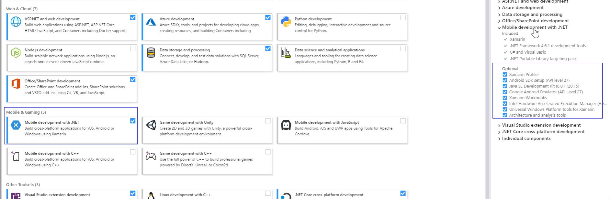
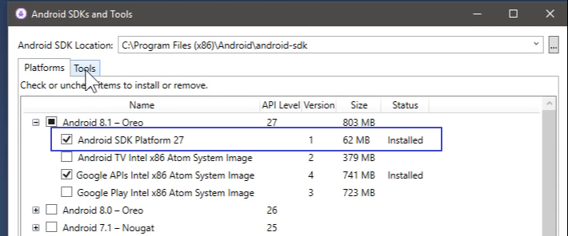
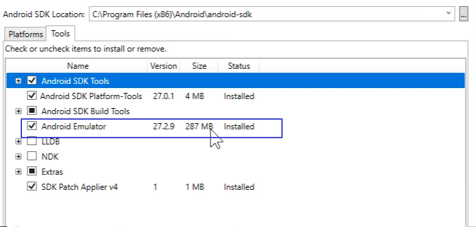
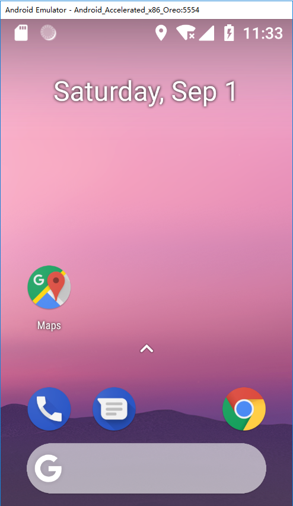
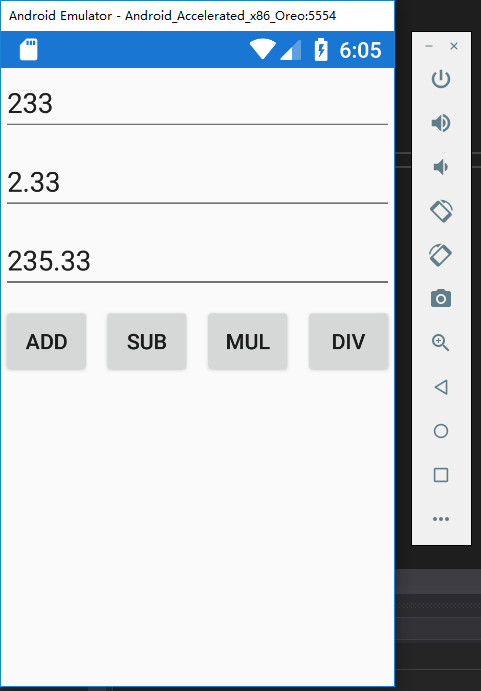

# 002.001 C# 也能开发 Android 应用

# 准备工作

打开 Visual Studio Installer 安装移动开发套件 Mobile development with .NET。


> 以前 VS 带的安卓模拟器和 Hyper-V 有冲突，从 VS 15.7 版本开始冲突解决了。
>
> 安装好套件后打开 VS 的 Tools - Android SDK Manager 确认 SDK Platform 和 27.2.9 版本的 Emulator 安装成功。
> 
> 
> PS：如果有 update，更新即可。

## 体验 Android 模拟器

Android SDK 更新完毕后，可以在 Tools - Android SDK Manager - Android Device Manager 直接体验 Android 模拟器（一瞥 8.1）。


# 开发一个简单的加法 App

开发安卓应用可以通过创建移动端跨平台项目，也可以通过创建单纯的安卓项目。考虑到 IOS 和 UWP 项目较难调试和发布我就只创建了 Android XAML App(**Xamarin.Forms**) 项目。
下面开发一个简单的加法应用。
前端 XAML：

```xml
<?xml version="1.0" encoding="utf-8" ?>
<ContentPage xmlns="http://xamarin.com/schemas/2014/forms"
             xmlns:x="http://schemas.microsoft.com/winfx/2009/xaml"
             xmlns:local="clr-namespace:HelloAndroid.Client"
             x:Class="HelloAndroid.Client.MainPage">
    <Grid>
        <Grid.RowDefinitions>
            <RowDefinition Height="Auto"/>
            <RowDefinition Height="Auto"/>
            <RowDefinition Height="Auto"/>
            <RowDefinition Height="Auto"/>
        </Grid.RowDefinitions>
        <Editor x:Name="Txt1" Grid.Row="0"/>
        <Editor x:Name="Txt2" Grid.Row="1"/>
        <Editor x:Name="Txt3" Grid.Row="2"/>
        <Grid Grid.Row="3">
            <Grid.ColumnDefinitions>
                <ColumnDefinition Width="*"/>
                <ColumnDefinition Width="*"/>
                <ColumnDefinition Width="*"/>
                <ColumnDefinition Width="*"/>
            </Grid.ColumnDefinitions>
            <Button x:Name="BtnAdd" Grid.Column="0" Text="Add" Clicked="DoAdd"/>
            <Button x:Name="BtnSub" Grid.Column="1" Text="Sub"/>
            <Button x:Name="BtnMul" Grid.Column="2" Text="Mul"/>
            <Button x:Name="BtnDiv" Grid.Column="3" Text="Div"/>
        </Grid>
    </Grid>
</ContentPage>
```

后端 C#：

```csharp
using System;
using Xamarin.Forms;
namespace HelloAndroid.Client
{
    public partial class MainPage : ContentPage
    {
        public MainPage()
        {
            InitializeComponent();
        }
        private void DoAdd(object sender, EventArgs e)
        {
            double.TryParse(Txt1.Text, out double x);
            double.TryParse(Txt2.Text, out double y);
            Txt3.Text = (x + y).ToString();
        }
    }
}
```

注：最好先 Build 项目，再进行调试。


# 打包成 APK

参考 [SOF](https://stackoverflow.com/questions/47554324/how-to-make-apk-of-xamarin-application-to-run-on-android-device) 和 [MSDN](https://docs.microsoft.com/zh-cn/xamarin/android/deploy-test/release-prep/?tabs=vswin)。

1. In your toolbar change the project from debug mode to release mode
2. Right-click on your Project and Select Archive（存档）...
3. Click on the generated archive and below on the Right side you will find two options Open folder and Distribute. (Select Distribute)
4. Then on the Pop-up that appears Select AD-HOC
5. Click on the Green plus icon to add signing identity where you need to provide the identity of the signing person or company
6. After creating the signing identity click on that identity to select it and then click on save as to save your APK.
7. A pop-up will appear asking password for the signing identity which you will produce in step 5.
   打包成 APK，安装到手机上的效果：
   

# 其它问题

## Android 设计器不工作

再 XAML 切换到设计器时提示：`System.ComponentModel.Composition.ImportCardinalityMismatchException: No exports were found that match the constraint:  ...`
解决方法：

1. 保证 SDK 都更新到了最新版
2. 清除 `C:\Users\UserName\AppData\Local\Microsoft\VisualStudio\15.0*\ComponentModelCache` 缓存的文件

> 更新: 2023-06-29 21:46:22  
> 原文: <https://www.yuque.com/yuejiangliu/dotnet/timothy-csharp-002-sub001>