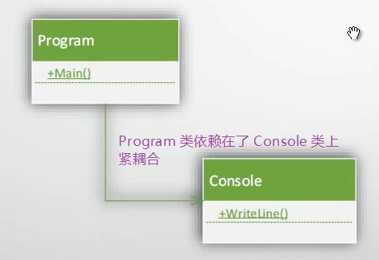

# 003 初识类与名称空间

# 类库的引用

## DLL 引用（黑盒引用，无源代码）

<font style="color:#000000;background-color:#FFFFFF;">示例： </font><font style="color:#000000;background-color:#FFFFFF;">在 Console 项目里面，引用 </font>`System.Windows.Forms`<font style="color:#000000;background-color:#FFFFFF;"> 来实现窗体。</font>

```csharp
using System.Windows.Forms;
namespace HelloWorld
{
    class Program
    {
        static void Main(string[] args)
        {
            Form form = new Form();
            form.ShowDialog();
        }
    }
}
```

### [NuGet](https://www.nuget.org/) 简介

<font style="color:#000000;background-color:#FFFFFF;">引用 DLL 时，你没有源代码，几乎可以说是“蒙着眼睛引用类库”。这是很危险的！特别是对于大型的项目。 </font>  
<font style="color:#000000;background-color:#FFFFFF;">有了 NuGet 后，你只需选择要引用的包，NuGet 会自动帮你对 DLL 引用进行管理。</font>
注：不要忽视 NuGet 的重要性，以后每当你需要找工具库时，第一要做的就是来 NuGet 搜索一下（第二当然就是去 GitHub 搜啦）。

## 项目引用（白盒引用，有源代码）

一个项目隶属于不同的 Solution，称为 Project 重用。
Debug 时一定要找到 Root cause！不要找到了表象就在那打补丁，要深入到问题的底层。

# 依赖关系

+ 类（或对象）之间的耦合关系
+ 优秀的程序追求“高内聚，低耦合”
  - 教学程序往往会违反这个原则
+ UML（通用建模语言）类图
  

# 排除错误

+ 仔细阅读编译器的报错
+ MSDN 文档与搜索引擎结合
  注：推荐使用 Bing + 英文关键字 搜索 C# 常见问题。

> 更新: 2020-11-14 21:41:02  
> 原文: <https://www.yuque.com/yuejiangliu/dotnet/timothy-csharp-003>