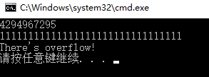
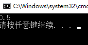

# 010,011,012 操作符详解

# 操作符概览


+ 操作符（Operator）也译为“运算符”
+ 操作符是用来操作数据的，被操作符操作的数据称为操作数（Operand）

# 操作符的本质

+ 操作符的本质是函数（即算法）的“简记法”
  - 假如没有发明“+”，只有 `Add` 函数，算式 `3+4+5` 将可以写成 `Add(Add(3,4),5)`
  - 假如没有发明“*”，只有 `Mul` 函数，那么算式 `3+4*5` 只能写成 `Add(3,Mul(4,5))`
+ 操作符不能脱离与它关联的数据类型
  - 可以说操作符就是与固定数据类型相关联的一套基本算法的简记法
  - 示例：为自定义数据类型创建操作符
    下例中操作符 `+` 就是 `GetMarry` 方法的简记。

```csharp
namespace CreateOperator
{
    class Program
    {
        static void Main(string[] args)
        {
            Person person1 = new Person();
            Person person2 = new Person();
            person1.Name = "Deer";
            person2.Name = "Deer's wife";
            //var nation = Person.GetMarry(person1, person2);
            var nation = person1 + person2;
            foreach (var p in nation)
            {
                Console.WriteLine(p.Name);
            }
        }
    }
    class Person
    {
        public string Name;
        //public static List<Person> GetMarry(Person p1, Person p2)
        public static List<Person> operator + (Person p1, Person p2)
        {
            List<Person> people = new List<Person>();
            people.Add(p1);
            people.Add(p2);
            for (int i = 0; i < 11; i++)
            {
                var child = new Person();
                child.Name = p1.Name + " & " + p2.Name + "s child";
                people.Add(child);
            }
            return people;
        }
    }
}
```

# 优先级与运算顺序

+ 操作符的优先级
  - 可以使用圆括号提高被括起来表达式的优先级
  - 圆括号可以嵌套
  - 不像数学里有方括号与花括号，在 C# 语言里面“[]”与“{}”有专门的用途
+ 同优先级操作符的运算顺序
  - 除了带有赋值功能的操作符，同优先级操作符都由左向右进行运算
  - 带有赋值功能的操作符的运算顺序是由右向左
  - 与数学运算不同，计算机语言的同优先级运算没有“结合率”
    * 3+4+5 只能理解为 `Add(Add(3,4),5)` 不能理解为 `Add(3,Add(4,5))`

# 各类操作符的示例


## 基本操作符

### `.` 成员访问操作符

```csharp
System.IO.File.Create("D:\\HelloWorld.txt");
      1  2    3
var myForm = new Form();
myForm.Text = "Hello, World";
      4
myForm.ShowDialog();
      4
```

1. 访问外层名称空间中的子名称空间
2. 访问名称空间中的类型
3. 访问类型的静态成员
4. 访问对象中的实例成员

### `f(x)` 方法调用操作符

C# 里方法调用都要用到`()`。  
Action 是委托，委托在创建时只需要知道方法的名称，不调用方法，所以只会用到方法名（不加`()`）。当然最终`myAction();`也用到了方法调用操作符`()`。

```csharp
namespace OperatorsExample
{
    class Program
    {
        static void Main(string[] args)
        {
            var c = new Calculator();
            double x = c.Add(3.0, 4.6);
            Console.WriteLine(x);
            Action myAction = new Action(c.PrintHello);
            myAction();
        }
    }
    class Calculator
    {
        public double Add(double a,double b)
        {
            return a + b;
        }
        public void PrintHello()
        {
            Console.WriteLine("Hello");
        }
    }
}
```

### `a[x]` 元素访问操作符

访问数组元素：

```csharp
int[] myIntArray = new int[] { 1, 2, 3, 4, 5 };
Console.WriteLine(myIntArray[0]);
Console.WriteLine(myIntArray[myIntArray.Length - 1]);
```

索引字典中的元素：

```csharp
class Program
{
    static void Main(string[] args)
    {
        Dictionary<string, Student> stuDic = new Dictionary<string, Student>();
        for (int i = 0; i < 100; i++)
        {
            var stu = new Student()
            {
                Name = "s_" + i.ToString(),
                Score = 100 - i
            };
            stuDic.Add(stu.Name, stu);
        }
        Console.WriteLine(stuDic["s_6"].Score);
    }
}
class Student
{
    public string Name;
    public int Score;
}
```

### `x++ x--` 后置自增、自减操作符

```csharp
int x = 100;
int y = x++;
Console.WriteLine(x);
Console.WriteLine(y);
```

<font style="color:#000000;background-color:#FFFFFF;">先赋值，再自增。 </font>


### `typeof` 操作符

检测类型元数据（Metadata）。

```csharp
// Metadata
var t = typeof(int);
Console.WriteLine(t.Namespace);
Console.WriteLine(t.FullName);
Console.WriteLine(t.Name);
int c = t.GetMethods().Length;
Console.WriteLine(c);
foreach (var m in t.GetMethods())
{
    Console.WriteLine(m.Name);
}
```


### `default` 操作符

```csharp
namespace OperatorsExample
{
    class Program
    {
        static void Main(string[] args)
        {
            // 值类型内存块都刷成 0，值就是 0。
            int x = default(int);
            Console.WriteLine(x);
            // 引用类型内存块刷成 0，没有引用，default 是 null。
            Form myForm = default(Form);
            Console.WriteLine(myForm == null);
            // 枚举类型映射到整型上，默认枚举值是对应值为 0 的那个，可能是你手动指定的，也可能是系统默认赋值的。
            // 这就牵扯到我们使用枚举时，要注意枚举中是否有对应 0 的；创建枚举类型时，最好有一个对应 0 的，以免他人查找我们枚举的 default 值时报错。
            Level level = default(Level);
            Console.WriteLine(level);
        }
    }
    enum Level
    {
        Low = 1,
        Mid = 2,
        High = 0
    }
}
```

### `new` 操作符

new 操作符基本功能。

```csharp
static void Main(string[] args)
{
    // 在内存中创建类型实例，调用实例构造器
    // 把实例地址通过赋值操作符交给访问它的变量
    var myForm = new Form();
    // new 操作符可以调用实例的初始化器
    var myForm2 = new Form()
    {
        Text = "Hello",
        FormBorderStyle=FormBorderStyle.SizableToolWindow
    };
    // new 一次性变量：利用实例的初始化器直接 new 对象后，马上执行方法，然后就不管它了，随着 GC 去处理它
    new Form() { Text = "Hello" }.ShowDialog();
}
```

通过 C# 的语法糖，我们在声明常用类型的变量时不需要 new 操作符。

```csharp
// 通过 C# 的语法糖，我们在声明常用类型的变量时不需要 new 操作符
string name = "Tim";
string name2 = new string(new char[]{ 'T', 'i', 'm' });
int[] myArray1 = { 1, 2, 3, 4 };
int[] myArray2 = new int[4];
```

为匿名类型创建对象。

```csharp
// new 为匿名类型创建对象，并且用隐式类型变量（var）来引用这个实例
var person = new { Name = "Mr.Okay", Age = true,Dob=true };
Console.WriteLine(person.Name);
Console.WriteLine(person.Age);
Console.WriteLine(person.GetType().Name);
```


new 操作符会导致依赖紧耦合，可以通过依赖注入模式来将紧耦合变成相对松的耦合。

```csharp
// new 操作符功能强大，但会造成依赖。new 出 myForm 后，Program class 就依赖到 myForm 上了，
// 一旦 myForm 运行出错，Program 类也会出问题。
// 通过设计模式中的依赖注入模式来将紧耦合变成相对松的耦合
var myForm = new Form() { Text = "Hello" };
```

new 作为关键字：

```csharp
class Program
{
    static void Main(string[] args)
    {
        var stu = new Student();
        stu.Report();
        var csStu = new CsStudent();
        csStu.Report();
    }
}
class Student
{
    public void Report()
    {
        Console.WriteLine("I'm a student.");
    }
}
class CsStudent:Student
{
    // new 修饰符
    new public void Report()
    {
        Console.WriteLine("I'm CS student.");
    }
}
```

### `checked` & `unchecked` 操作符

检查一个值在内存中是否有溢出。
未 check 时，`x+1`直接就溢出变成 0 了。

```csharp
uint x = uint.MaxValue;
Console.WriteLine(x);
var binStr = Convert.ToString(x, 2);
Console.WriteLine(binStr);
uint y = x + 1;
Console.WriteLine(y);
```


checked：

```csharp
uint x = uint.MaxValue;
Console.WriteLine(x);
var binStr = Convert.ToString(x, 2);
Console.WriteLine(binStr);
try
{
    uint y = checked(x + 1);
    Console.WriteLine(y);
}
catch (OverflowException ex)
{
    Console.WriteLine("There's overflow!");
}
```


unchecked：

```csharp
try
{
    // C# 默认采用的就是 unchecked 模式
    uint y = unchecked(x + 1);
    Console.WriteLine(y);
}
catch (OverflowException ex)
{
    Console.WriteLine("There's overflow!");
}
```

<font style="color:#000000;background-color:#FFFFFF;">checked 与 unchecked 的另一种用法。</font>

```csharp
uint x = uint.MaxValue;
Console.WriteLine(x);
var binStr = Convert.ToString(x, 2);
Console.WriteLine(binStr);
//unchecked
checked
{
    try
    {
        uint y = x + 1;
        Console.WriteLine(y);
    }
    catch (OverflowException ex)
    {
        Console.WriteLine("There's overflow!");
    }
}
```

### `delegate` 操作符

现在常见的是把 delegate 当做委托关键字使用。   
delegate 也可以作为操作符使用，但由于 Lambda 表达式的流行，delegate 作为操作符的场景愈发少见（被 Lambda 替代，已经过时）。

```csharp
public partial class MainWindow : Window
{
    public MainWindow()
    {
        InitializeComponent();
        // 方法封装提高了复用性，但如果我这个方法在别的地方不太可能用到，我就可以使用匿名方法
        // 下面就是使用 delegate 来声明匿名方法
        //this.myButton.Click += delegate (object sender, RoutedEventArgs e)
        //{
        //    this.myTextBox.Text = "Hello, World!";
        //}; 
        // 现在推荐使用的是 Lambda 表达式
        this.myButton.Click += (sender, e) =>
        {
            this.myTextBox.Text = "Hello, World!";
        };
    }
    // 非匿名方法
    //private void MyButton_Click(object sender, RoutedEventArgs e)
    //{
    //    throw new NotImplementedException();
    //}
}
```

### `sizeof` 操作符

sizeof 用于获取对象在内存中所占字节数。   
注意：

1. 默认情况下 sizeof 只能获取结构体类型的实例在内存中的字节数
   - int、uint、double 可以
   - string、object 不行
2. 非默认情况下，可以使用 sizeof 获取自定义结构体类型的大小，但需要把它放在不安全的上下文中
   需要在“项目属性”里面开启“允许不安全代码”。 
   

```csharp
class Program
{
    static void Main(string[] args)
    {
        var x = sizeof(int);
        Console.WriteLine(x);
        unsafe
        {
            int y = sizeof(Student);
            Console.WriteLine(y);
        }
    }
}
struct Student
{
    int ID;
    long Score;
}
```


注：int 字节数为 4，long 字节数为 8。但 sizeof(Student) 结果是 16。这涉及到了 .NET 对内存的管理，超出了现在所学内容。

### `->` 操作符

-> 操作符也必须放在不安全的上下文中才能使用。   
C# 中指针操作、取地址操作、用指针访问成员的操作，只能用来操作结构体类型，不能用来操作引用类型。

```csharp
class Program
{
    static void Main(string[] args)
    {
        unsafe
        {
            Student stu;
            stu.ID = 1;
            // 用 . 直接访问
            stu.Score = 99;
            Student* pStu = &stu;
            // 用 -> 间接访问
            pStu->Score = 100;
            Console.WriteLine(stu.Score);
        }
    }
}
struct Student
{
    public int ID;
    public long Score;
}
```

## 一元操作符

### `&x` `*x` 操作符

也需要在不安全的上下文中。   
现实工作中用得很少，当做知识了解一下即可。

```csharp
class Program
{
    static void Main(string[] args)
    {
        unsafe
        {
            Student stu;
            stu.ID = 1;
            stu.Score = 99;
            // & 取地址
            Student* pStu = &stu;
            pStu->Score = 100;
            // * 取引用
            (*pStu).Score = 1000;
            Console.WriteLine(stu.Score);
        }
    }
}
struct Student
{
    public int ID;
    public long Score;
}
```

### `+` `-` 正负操作符

正负操作符使用不当，可能导致溢出。

```csharp
var x = int.MinValue;
int y = checked(-x);
Console.WriteLine("x = " + x);
Console.WriteLine("y = " + y);
```

C# 求相反数是按位取反再加一：

```csharp
var x = int.MinValue;
int y = -x;
Console.WriteLine(y);
string xStr = Convert.ToString(x, 2).PadLeft(32, '0');
Console.WriteLine(xStr);
// C# 求相反数是按位取反再加一
string yStr = Convert.ToString(y, 2).PadLeft(32, '0');
Console.WriteLine(yStr);
```

### `~` 求反操作符

```csharp
int x = 12345678;
Console.WriteLine(x);
int y = ~x;
Console.WriteLine(y);
int z = y + 1;
Console.WriteLine(z);
var xStr = Convert.ToString(x, 2).PadLeft(32, '0');
var yStr = Convert.ToString(y, 2).PadLeft(32, '0');
Console.WriteLine(xStr);
Console.WriteLine(yStr);
```


### `!` 非操作符

!  操作符在现实工作中的一个应用：

```csharp
class Program
{
    static void Main(string[] args)
    {
        var stu = new Student(null);
        Console.WriteLine(stu.Name);
    }
}
class Student
{
    public Student(string initName)
    {
        if (!string.IsNullOrEmpty(initName))
        {
            this.Name = initName;
        }
        else
        {
            throw new ArgumentException("initName cannot be null or empty.");
        }
    }
    public string Name;
}
```

### `++x` `--x` 前置自增自减操作符

无论前置、后置，在实际工作中，尽量单独使用它们，不要把它们和别的语句混在一起，那样会降低可读性。

```csharp
static void Main(string[] args)
{
    var x = 100;
    // 单独使用时，前置与后置没有区别
    //++x;
    // 先自增再赋值
    var y = ++x;
    Console.WriteLine(x);
    Console.WriteLine(y);
}
```

### `(T)x` 强制类型转换操作符

详见[类型转换](#f3c723ec)

## 乘除、取余与加减法

务必留意“数值提升”。   
参见《C# 定义文档》7.8 算术运算符。

```csharp
// 自动类型提升为 double
var x = 3.0 * 4;
double x = (double)5 / 4;
```

### `%` 取余

```csharp
double x = 3.5;
double y = 3;
Console.WriteLine(x % y);
```



### 加法操作符

三大用途

+ 计算加法
+ 事件绑定
+ 字符串拼接

## 位移操作符

数据在内存中的二进制的结构，向左或向右进行一定位数的平移。
**当没有溢出时，左移就是乘 2 ，右移就是除 2 。**

```csharp
int x = -7;
// 右移时最高位：正数补 0 ，负数补 1 。
int y = x >> 1;
var strX = Convert.ToString(x, 2).PadLeft(32, '0');
var strY = Convert.ToString(y, 2).PadLeft(32, '0');
Console.WriteLine(strX);
Console.WriteLine(strY);
Console.WriteLine(y);
```


## 关系操作符

char 类型比较 Unicode 码。

```csharp
char char1 = 'a';
char char2 = 'A';
Console.WriteLine(char1 > char2);
var u1 = (ushort)char1;
var u2 = (ushort)char2;
Console.WriteLine(u1);
Console.WriteLine(u2);
```

<font style="color:#000000;background-color:#FFFFFF;">字符串比较：</font>

```csharp
string str1 = "abc";
string str2 = "Abc";
Console.WriteLine(str1.ToLower() == str2.ToLower());
string.Compare(str1, str2);
```

## 类型检测操作符


### `is` 操作符

```csharp
Teacher t = new Teacher();
// 检测 t 所引用的实例是否为 Teacher
var result = t is Teacher;
Console.WriteLine(result.GetType().FullName);
Console.WriteLine(result);
Console.WriteLine(t is Animal);
Car car = new Car();
Console.WriteLine(car is Animal);
Console.WriteLine(car is object);
Human h = new Human();
Console.WriteLine(h is Teacher);
```


### `as` 操作符

```csharp
object o = new Teacher();
//if(o is Teacher)
//{
//    var t = (Teacher)o;
//    t.Teach();
//}
Teacher t = o as Teacher;
if (t != null)
{
    t.Teach();
}
```

## 逻辑与 `&` 或 `|` 异或 `^`

一般在操作二进制数据，图像数据时用。

## 条件与 `&&` 条件或 `||`

条件与和条件或有**短路效应**。

## `??` null 合并操作符

```csharp
//Nullable<int> x = null;
int? x = null;
Console.WriteLine(x.HasValue);
// x 如果为 null，就拿 1 来代替。
int y = x ?? 1;
Console.WriteLine(y);
```

## `?:` 条件操作符

唯一一个三元操作符，本质上就是 if else 的简写。

```csharp
int x = 80;
// 使用 () 将条件括起来，提高可读性。
string str = (x >= 60) ? "Pass" : "Failed";
Console.WriteLine(str);
```

## 赋值和 Lambda 表达式

赋值略，Lambda 在前面 [delegate 操作符](#0eb67ed7)那里也讲过了。

# 类型转换

+ 隐式（implicit）类型转换
  - 不丢失精度的转换
  - 子类向父类的转换
  - 装箱
+ 显式（explicit）类型转换
  - 有可能丢失精度（甚至发生错误）的转换，即 cast
  - 拆箱
  - 使用 Convert 类
  - ToString 方法与各数据类型的 Parse/TryParse 方法
+ 自定义类型转换操作符
  - 示例
    [装箱与拆箱](https://www.yuque.com/yuejiangliu/dotnet/timothy-csharp-006-007#f8226ac4)之前讲过，这里不在细讲，只列出来。

## 隐式（implicit）类型转换

### 不丢失精度的转换

《C# 定义文档》6.1.2 隐式数值转换   
隐式数值转换为：

+ 从 sbyte 到 short、int、long、float、double 或 decimal。
+ 从 byte 到 short、ushort、int、uint、long、ulong、float、double 或 decimal。
+ 从 short 到 int、long、float、double 或 decimal。
+ 从 ushort 到 int、uint、long、ulong、float、double 或 decimal。
+ 从 int 到 long、float、double 或 decimal。
+ 从 uint 到 long、ulong、float、double 或 decimal。
+ 从 long 到 float、double 或 decimal。
+ 从 ulong 到 float、double 或 decimal。
+ 从 char 到 ushort、int、uint、long、ulong、float、double 或 decimal。
+ 从 float 到 double。
  从 int、uint、long 或 ulong 到 float 的转换以及从 long 或 ulong 到 double 的转换可能导致精度损失，但决不会影响数值大小。其他的隐式数值转换决不会丢失任何信息。   
  不存在向 char 类型的隐式转换，因此其他整型的值不会自动转换为 char 类型。

### 子类向父类的转换

所有真正面向对象的语言都支持子类向父类转换。后面会讲到面向对象编程的一个核心概念 —— “多态”（polymorphism），多态就基于面向对象语言支持子类向父类的隐式转换。
当 t 转换为 h 后，在 h 里面就只能访问到 Human 类能访问的成员，不能再访问 Teach 方法。

```csharp
class Program
{
    static void Main(string[] args)
    {
        Teacher t = new Teacher();
        Human h = t;
        Animal a = h;
        a.Eat();
    }
}
class Animal
{
    public void Eat()
    {
        Console.WriteLine("Eating...");
    }
}
class Human : Animal
{
    public void Think()
    {
        Console.WriteLine("Who i am?");
    }
}
class Teacher : Human
{
    public void Teach()
    {
        Console.WriteLine("I teach programmming");
    }
}
```

## 显式（explicit）类型转换

### 有可能丢失精度（甚至发生错误）的转换，即 cast

示例：ushort 转 uint

```csharp
// max ushort = 65535
Console.WriteLine(ushort.MaxValue);
uint x = 65536;
ushort y = (ushort)x;
Console.WriteLine(y);
// y = 0
```

《C# 定义文档》6.2.1 显式数值转换   
显式数值转换是指从一个 numeric-type 到另一个 numeric-type 的转换，此转换不能用已知的隐式数值转换（第 6.1.2 节）实现，它包括：

+ 从 sbyte 到 byte、ushort、uint、ulong 或 char。
+ 从 byte 到 sbyte 和 char。
+ 从 short 到 sbyte、byte、ushort、uint、ulong 或 char。
+ 从 ushort 到 sbyte、byte、short 或 char。
+ 从 int 到 sbyte、byte、short、ushort、uint、ulong 或 char。
+ 从 uint 到 sbyte、byte、short、ushort、int 或 char。
+ 从 long 到 sbyte、byte、short、ushort、int、uint、ulong 或 char。
+ 从 ulong 到 sbyte、byte、short、ushort、int、uint、long 或 char。
+ 从 char 到 sbyte、byte 或 short。
+ 从 float 到 sbyte、byte、short、ushort、int、uint、long、ulong、char 或 decimal。
+ 从 double 到 sbyte、byte、short、ushort、int、uint、long、ulong、char、float 或 decimal。
+ 从 decimal 到 sbyte、byte、short、ushort、int、uint、long、ulong、char、float 或 double。
  <font style="color:#000000;background-color:#FFFFFF;">显示类型转换还要特别注意有符号类型数据与无符号类型数据间的转换。有符号类型的最高位为符号位，如果其为负数（最高位为 1 ），将其转为无符号类型时必需注意。</font>

### 使用 Convert 类

```csharp
double result = x + y;
tb3.Text = Convert.ToString(result);
```

### ToString 方法与各数据类型的 Parse/TryParse 方法

ToString 示例：

```csharp
double result = x + y;
tb3.Text = result.ToString();
```

<font style="color:#000000;background-color:#FFFFFF;">C# 的所有数据类型都源自于 Object 类，而 Object 类就有 ToString 方法，即 C# 中所有类型都有 ToString 方法。 </font>

<font style="color:#000000;background-color:#FFFFFF;">Parse 只能解析格式正确的字符串数据类型。</font>

```csharp
double x = double.Parse(tb1.Text);
```

<font style="color:#000000;background-color:#FFFFFF;">TryParse 通过输出变量（out）来传值。</font>

```csharp
double x;
if (double.TryParse(tb1.Text,out x))
{
    double y = Convert.ToDouble(tb2.Text);
    double result = x + y;
    tb3.Text = result.ToString();
}
```

## 自定义类型转换操作符

更加详细的内容参见 C# 图解教程 第十六章 转换。
示例：让石头类支持显式转换为猴子。

```csharp
class Program
{
    static void Main(string[] args)
    {
        var stone = new Stone();
        stone.Age = 5000;
        var wukongSun = (Monkey)stone;
        Console.WriteLine(wukongSun.Age);
    }
}
class Stone
{
    public int Age;
    // 转换器写在被转换类型里面
    public static explicit operator Monkey(Stone stone)
    {
        var m = new Monkey()
        {
            Age = stone.Age / 500
        };
        return m;
    }
}
class Monkey
{
    public int Age;
}
```

# 参考

[Docs Expressions](https://docs.microsoft.com/zh-cn/dotnet/csharp/tour-of-csharp/expressions)

> 更新: 2020-10-27 20:47:20  
> 原文: <https://www.yuque.com/yuejiangliu/dotnet/timothy-csharp-010-012>