# 013,014,015,016 表达式、语句详解

# 表达式的定义

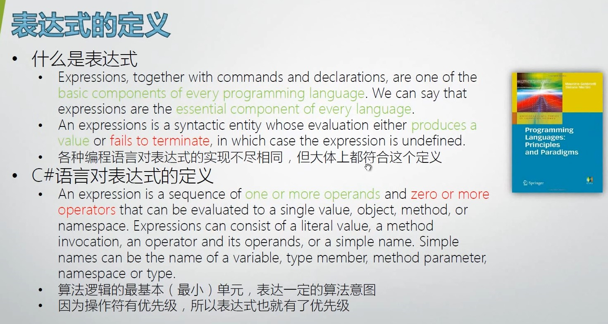

什么是表达式：An expressions is a syntactic entity whose evaluation either `produces a value` or `fails to terminate`, in which case the expression is undefined.

## evaluate a single value, object, method, or namespace

Single Value

```csharp
int x = 100;
x++;
++x;
```

<font style="color:#000000;background-color:#FFFFFF;">Object</font>

```csharp
(new Form()).ShowDialog();
```

<font style="color:#000000;background-color:#FFFFFF;">Method</font>

```csharp
// Console.WriteLine 就是方法
Action myActino = new Action(Console.WriteLine);
```

<font style="color:#000000;background-color:#FFFFFF;">Namespace</font>

```csharp
// System.Windows.Forms 名称空间访问表达式
System.Windows.Forms.Form myForm = new Form();
```

# 各类表达式概览

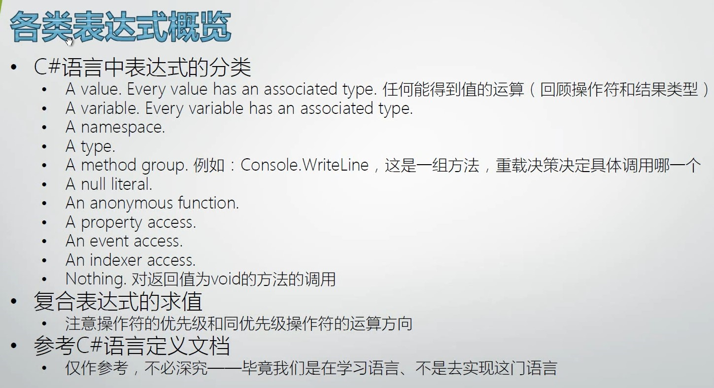


### C# 语言中表达式的分类

+ A value. Every value has an associated type.   
  回顾上一节讲的操作符，并讲解由这些操作符组成的表达式所返回的类型。 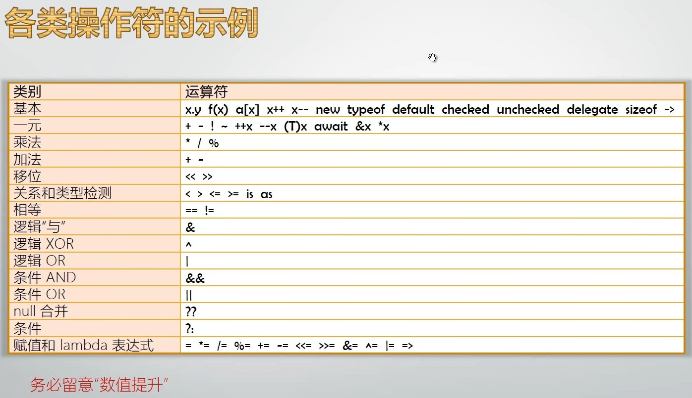

+ <font style="color:#000000;background-color:#FFFFFF;">条件操作符</font>`?:`<font style="color:#000000;background-color:#FFFFFF;">总会返回精度高的那个类型：</font>

```csharp
var x = 5>3?2:3.0;
Console.WriteLine(x.GetType().FullName);
// System.Double
```

+ A variable. Every variable has an associated type.

```csharp
int x = 100;
int y;
y = x;
```

+ A namespace.

```csharp
System.Windows.Forms.Form myForm = new Form();
```

+ A type.

```csharp
var t = typeof(Int32);
```

+ A method group   
  `Console.WriteLine`，这是一组方法（19 种重载），重载决策决定具体调用那种方法。
+ A null literal.   
  null 值也是一个值。

```csharp
Form myForm = null;
```

+ A property access.
+ An event access.

```csharp
static void Main(string[] args)
{
    var myForm = new Form();
    // 访问属性
    myForm.Text = "Hello";
    // 访问事件
    myForm.Load += MyForm_Load;
    myForm.ShowDialog();
}
private static void MyForm_Load(object sender, EventArgs e)
{
    var form = sender as Form;
    if (form == null)
    {
        return;
    }
    form.Text = "New Title";
}
```

+ An indexer access.

```csharp
var intList = new List<int>() {1, 2, 3 };
var x = intList[2];
```

+ <font style="color:#000000;background-color:#FFFFFF;">Nothing.对返回值为 void 方法的调用</font>

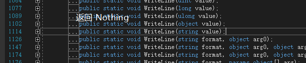


## 复合表达式的求值

C#语言定义文档里面未明确定义复合表达式，但确实常用。  
注意操作符的优先级和同优先级操作符的运算方向（除了赋值操作符，基本都是从左向右）。

## 参考C#语言定义文档

第七章专门讲表达式。  
对于初学者，仅作参考，不必深究 —— 毕竟我们是在学习语言、不是去实现这门语言。

# 语句的定义

广义：
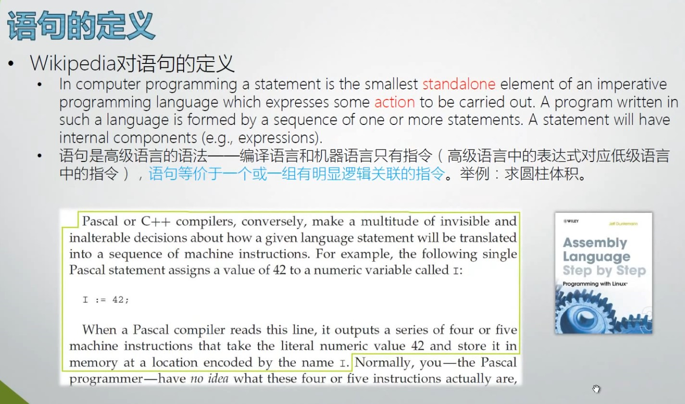

<font style="color:#000000;background-color:#FFFFFF;">狭义：</font>
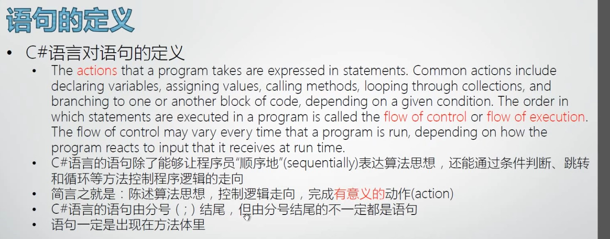


## 实例讲解高级语言与低级语言的差异

### C 版本

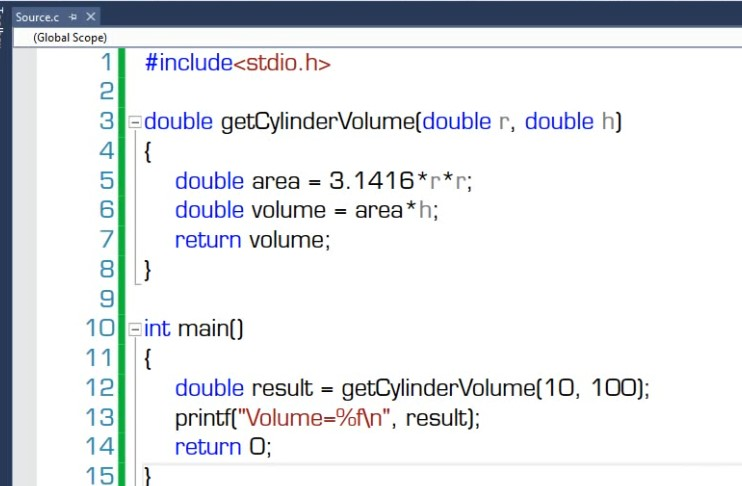

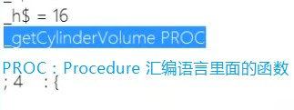

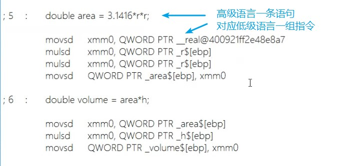


### C# 版本

C# 看汇编输出

1. <font style="color:#000000;background-color:#FFFFFF;">找到编译的 Application</font>

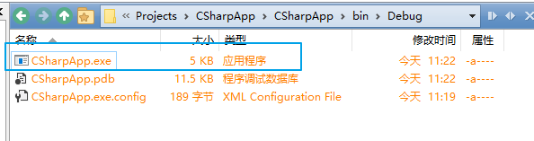

2. 在电脑里面搜索找到 Developer Command Prompt

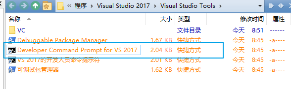

3. 输入 ildasm 命令

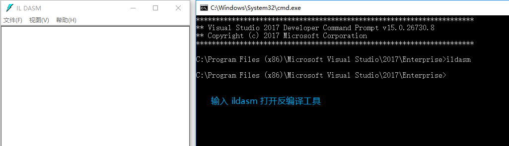

4. 用 ildasm 工具打开第 1 步找到的 Application

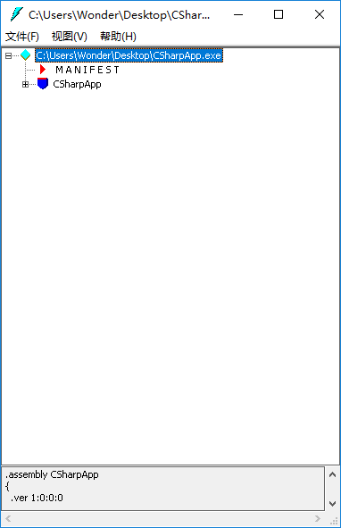

5. 双击具体方法，查看编译结果

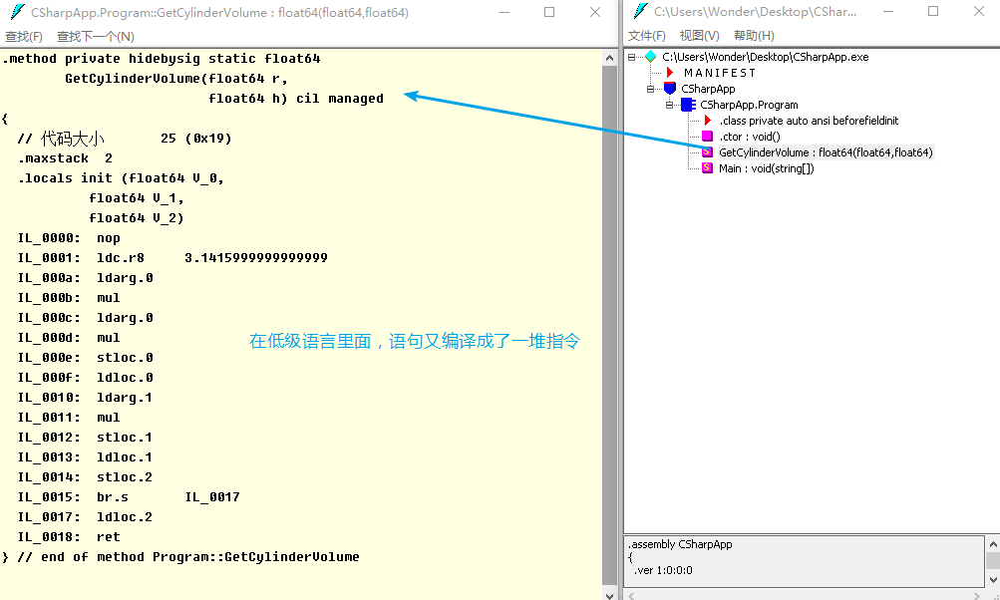

   PS：推荐使用 JetBrains 家的 [dotPeek](https://www.jetbrains.com/zh-cn/decompiler/) 进行反编译。

## 实例演示控制流（flow of control）

```csharp
static void Main(string[] args)
{
    string input = Console.ReadLine();
    try
    {
        double score = double.Parse(input);
        if (score >= 60)
        {
            Console.WriteLine("Pass!");
        }
        else
        {
            Console.WriteLine("Failed!");
        }
    }
    catch 
    {
        Console.WriteLine("Not a number!");
    }
}
```

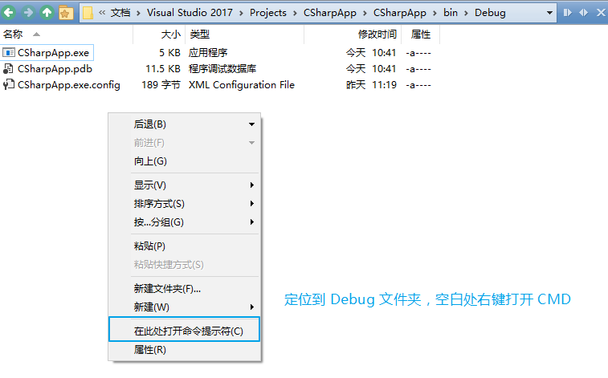

<font style="color:#000000;background-color:#FFFFFF;">程序没变，控制流变了。 </font>
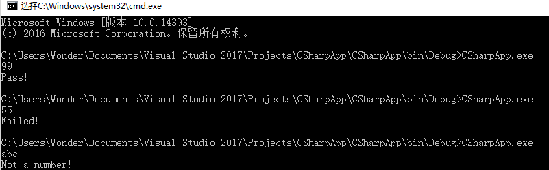


# 语句详解

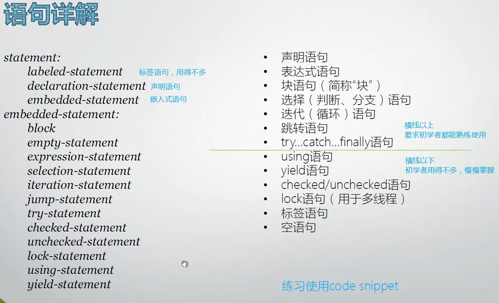

<font style="color:#000000;background-color:#FFFFFF;">嵌入式语句</font>
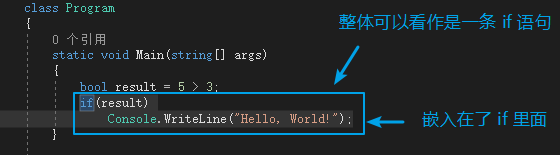


## 声明语句

讲解了局部变量声明与局部常量声明，详情参见 C#语言定义文档。
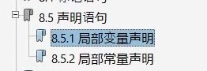


## 表达式语句

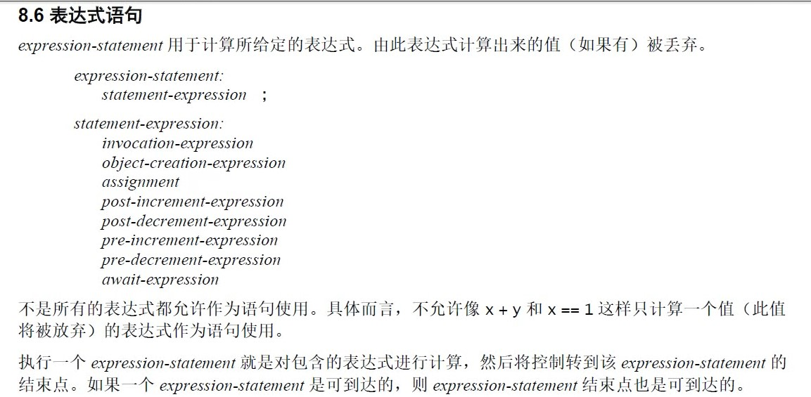

<font style="color:#000000;background-color:#FFFFFF;">expression-statement 用于计算所给定的表达式。由此表达式计算出来的值（如果有）被丢弃。</font>

```csharp
static void Main(string[] args)
{
    // Add 产生的 7.0，如果前面没有拿变量接收它，值被丢弃了。
    Add(3.0, 4.0);
}
static double Add(double a,double b)
{
    return a + b;
}
```

**Single Responsibility** 单一职责原则：一个方法尽量只做一件事情。
下面 `x+y` 这种语句在 C 语言里面是允许的，在 C# 里面不允许。

```csharp
int x = 100;
int y = 200;
x+y;
```

## 块语句

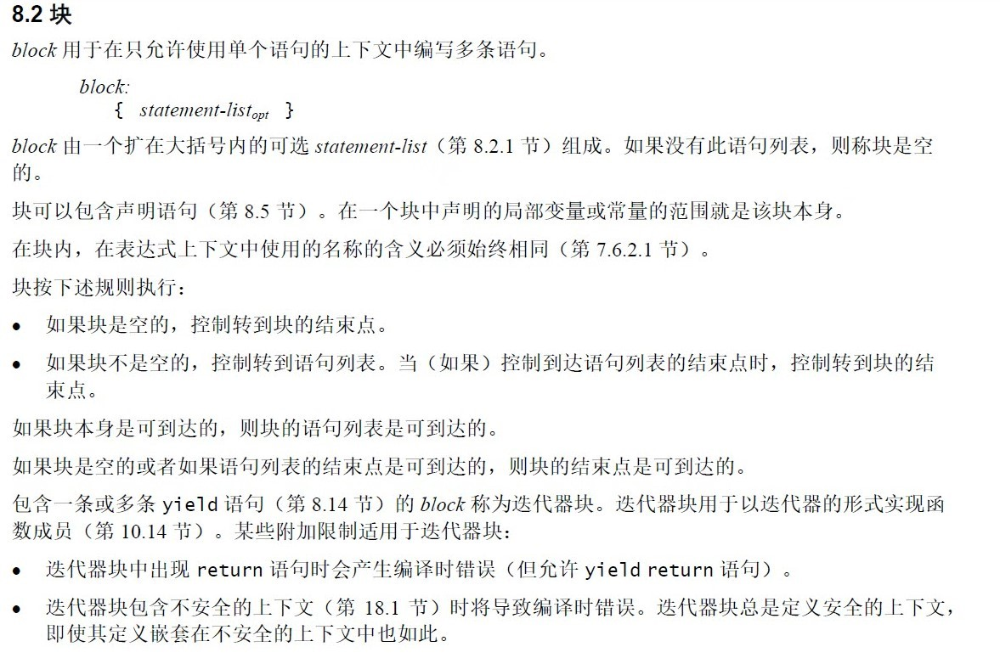


+ 块语句无论什么时候都被编译器当做一条语句来看待
+ 编译器认为块语句是一条完整的语句（即块语句最后不用加`;`号）

> **Code Snippet**  
> Ctrl + }：跳转至该花括号对应的花括号处。
>
> 变量的作用域：块之内声明的变量，作用域仅在块内。

```csharp
static void Main(string[] args)
{
    int x = 100;
    {
        Console.WriteLine(x);
        int y = 200;
        Console.WriteLine(y);
    }
    // Error CS0103  当前上下文中不存在名称“y”
    Console.WriteLine(y);
}
```

## 选择（判断、分支）语句

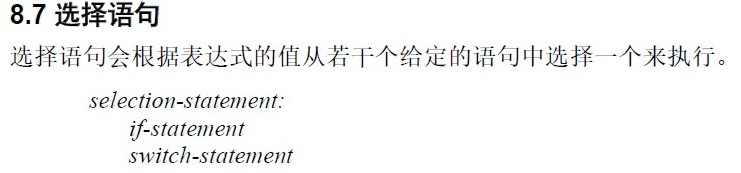


### if 语句


编程规范推荐即使只有一条语句，也建议使用块语句。

> **Code Snippet**
>
> 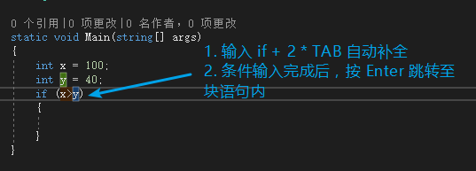

>
> 程序员经常修缮前人代码以满足新需求，但因为需求变化（需要实现新逻辑） + 业务逻辑复杂（不敢修改旧代码），导致写出来的代码很臃肿，还很容易陷入思维定式。
> 无论多长的 `if else`，它都是一条语句。之所以能有 `else if{}` 这种结构，也是因为 `if{}` 是一条语句。

### switch 语句

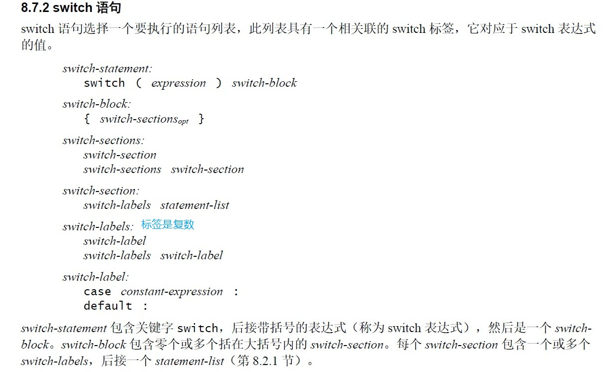

注：从 C# 7.0 开始 switch 表达式已[支持任何非 null 表达式](https://docs.microsoft.com/zh-cn/dotnet/csharp/language-reference/keywords/switch#the-match-expression)。

```csharp
int score = 101;
switch (score/10)
{
    case 10:
        if (score==100)
        {
            goto case 8;
        }
        else
        {
            goto default;
        }
    // 只有单独的标签才能连起来写。
    case 8:
    case 9:
        // 一旦有了具体的 section，就必需配套 break。
        Console.WriteLine("A");
        break;
        ...
    default:
        break;
}
```

> **Code Snippet**
>
> 1. Ctrl + L 剪切一整行
> 2. 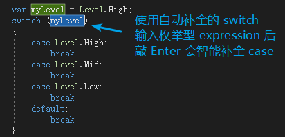


## try 语句

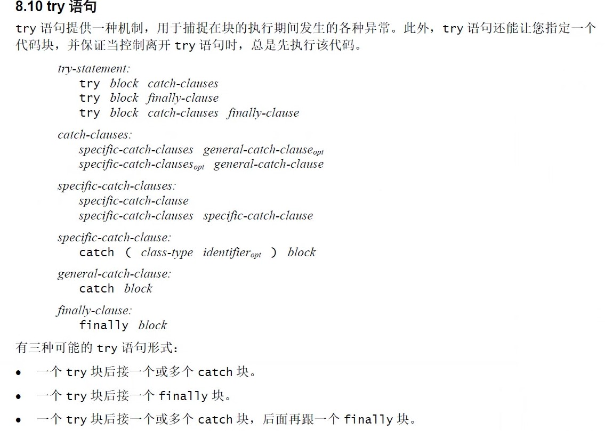

可以通过 MSDN 查方法相应的异常。   
如 Int32.Parse 方法 (String) 就有以下异常。 
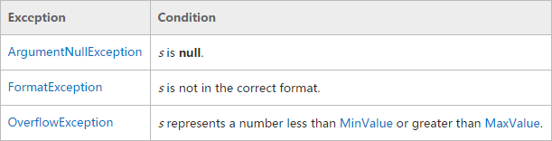


+ 应该把释放系统资源的语句写在 finally block 里面
+ 有时候也在 finally block 里面写 log
  throw 将异常抛给调用者。   
  throw 关键字的语法比较灵活。

```csharp
try
{
    ...
}
catch(OverflowException)
{
    throw;
}
```

## 迭代（循环）语句

+ while 语句按不同条件执行一个嵌入语句零次或多次
+ do 语句按不同条件执行一个嵌入语句一次或多次
+ for 语句计算一个初始化表达式序列，然后，当某个条件为真时，重复执行相关的嵌入语句并计算一个迭代表达式序列
+ foreach 语句用于枚举一个集合的元素，并对该集合中的每个元素执行一次相关的嵌入语句
  for 循环圆括号里面的的三部分都是 opt 可选的（两个分号不能省略），由此可以组成许多平时用不到的奇葩结构。

### 遍历和迭代器

Array 实现了 IEnumerable
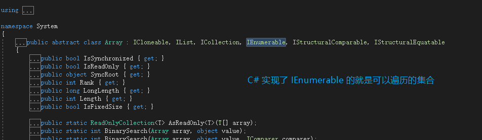

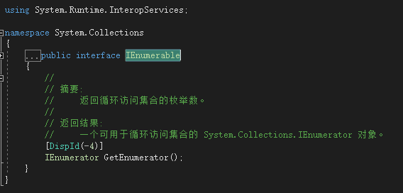

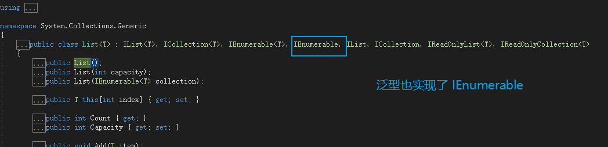

<font style="color:#000000;background-color:#FFFFFF;">集合遍历的底层原理和迭代器，foreach 语句就是对集合遍历的简记法。</font>

```csharp
static void Main(string[] args)
{
    var intArray = new int[] { 1, 3, 5 ,7};
    IEnumerator enumerator = intArray.GetEnumerator();
    while (enumerator.MoveNext())
    {
        Console.WriteLine(enumerator.Current);
    }
    var intList = new List<int>() { 2, 4, 6, 8 };
    IEnumerator enumerator2 = intList.GetEnumerator();
    while (enumerator2.MoveNext())
    {
        Console.WriteLine(enumerator2.Current);
    }
}
```

## 跳转语句

+ continue 语句将开始直接封闭它的 while、do、for 或 foreach 语句的一次新迭代
+ break 语句将退出直接封闭它的 switch、while、do、for 或 foreach 语句
+ goto 语句将控制转到由标签标记的语句
  - goto 语句基本被淘汰
+ throw 语句将引发一个异常
  - throw 语句语法比较灵活，它后面可以什么都不跟
+ return 语句会将控制返回到出现 return 语句的函数的当前调用方
  - 提前 return 原则
  - 方法的每个分支里面都需要有 return

### 提前 return 原则

通过提前 return 可以让代码阅读者立刻就鉴别出来程序将在什么情况下 return，同时减少 if else 嵌套，写出更优雅的代码。

```csharp
class Program
{
    static void Main(string[] args)
    {
        Greeting("Mr.Duan");
    }
    static void Greeting(string name)
    {
        if (string.IsNullOrEmpty(name))
        {
            // 通过尽早 return 可以让代码阅读者立刻就鉴别出来
            // name 参数在什么情况下是有问题的
            return;
        }
        Console.WriteLine("Hello, {0}", name);
    }
}
```

# 参考

[Docs Statements](https://docs.microsoft.com/zh-cn/dotnet/csharp/tour-of-csharp/statements)

> 更新: 2021-06-29 09:15:07  
> 原文: <https://www.yuque.com/yuejiangliu/dotnet/timothy-csharp-013-016>