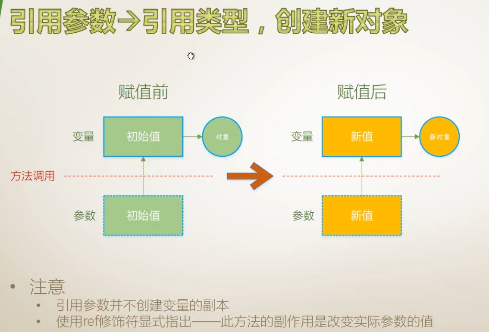

# 018 传值、输出、引用、数组、具名、可选参数、扩展方法

<font style="color:#000000;background-color:#FFFFFF;">这一节主要讲参数，参数是方法的一部分，所以这节课也可以看作是对方法的进一步学习。</font>
<font style="color:#000000;background-color:#FFFFFF;"></font>
<font style="color:#000000;background-color:#FFFFFF;">本节内容：</font>

+ 传值参数
+ 输出参数
+ 引用参数
+ 数组参数
+ 具名参数
+ 可选参数
+ 扩展方法（this 参数）

# 值参数


<font style="color:#000000;background-color:#FFFFFF;">参见 </font>C# 图解教程 第五章 方法。

## 传值参数 -> 值类型


## 传值参数 -> 引用类型，并且新创建对象


这种状况很少见，一般情况都是传进来引用它的值，而不是连接到新对象去（基本只有面试题会考这个）。

> 注：当参数类型为 string 时，在方法内部修改参数的值，对应的是此处创建对象这种情况。
>
> 因为 string 是 immutable 的，所以在方法内部对 string 赋值实际是“创建新的 string 实例再赋值”，最终方法外部的 string 并不会改变。

### GetHashCode()

`Object.GetHashCode()` 方法，用于获取当前对象的哈希代码，每个对象的 Hash Code 都不一样。
通过 Hash Code 来区分两个 Name 相同的 stu 对象。

```csharp
class Program
{
    static void Main(string[] args)
    {
        var stu = new Student() { Name="Tim"};
        SomeMethod(stu);
        Console.WriteLine(stu.Name);
        Console.WriteLine(stu.GetHashCode());
    }
    static void SomeMethod(Student stu)
    {
        stu = new Student { Name = "Tim" };
        Console.WriteLine(stu.Name);
        Console.WriteLine(stu.GetHashCode());
    }
}
class Student
{
    public string Name { get; set; }
}
```

## 传值参数 -> 引用类型，只操作对象，不创建新对象


这种通过传递进来的参数修改其引用对象的值的情况，在工作中也比较少见。
因为作为方法，其主要输出还是靠返回值。我们把这种修改参数所引用对象的值的操作叫做方法的副作用（side-effect），这种副作用平时编程时要尽量避免。

# 引用参数 ref


## 引用参数 -> 值类型


```csharp
static void Main(string[] args)
{
    int y = 1;
    IWantSideEffect(ref y);
    Console.WriteLine(y);
}
static void IWantSideEffect(ref int x)
{
    x += 100;
}
```

## 引用参数 -> 引用类型，创建新对象



```csharp
class Program
{
    static void Main(string[] args)
    {
        var outterStu = new Student() { Name = "Tim" };
        Console.WriteLine("HashCode={0}, Name={1}", outterStu.GetHashCode(), outterStu.Name);
        Console.WriteLine("-----------------");
        IWantSideEffect(ref outterStu);
        Console.WriteLine("HashCode={0}, Name={1}", outterStu.GetHashCode(), outterStu.Name);
    }
    static void IWantSideEffect(ref Student stu)
    {
        stu = new Student() { Name = "Tom" };
        Console.WriteLine("HashCode={0}, Name={1}",stu.GetHashCode(),stu.Name);
    }
}
class Student
{
    public string Name { get; set; }
}
```


## 引用参数 -> 引用类型，不创建新对象只改变对象值


<font style="color:#000000;background-color:#FFFFFF;">对象的 HashCode 没有改变过。</font>

```csharp
class Program
{
    static void Main(string[] args)
    {
        var outterStu = new Student() { Name = "Tim" };
        Console.WriteLine("HashCode={0}, Name={1}", outterStu.GetHashCode(), outterStu.Name);
        Console.WriteLine("-----------------");
        SomeSideEffect(ref outterStu);
        Console.WriteLine("HashCode={0}, Name={1}", outterStu.GetHashCode(), outterStu.Name);
    }
    static void SomeSideEffect(ref Student stu)
    {
        stu.Name = "Tom";
        Console.WriteLine("HashCode={0}, Name={1}", stu.GetHashCode(), stu.Name);
    }
}
class Student
{
    public string Name { get; set; }
}
```


**注：上面示例中使用传值参数（不用 ref）结果也将一样，但内部机理不同。 **  
传值参数创建了副本，方法里面的 stu 和 outterStu 不是一个对象，所指向的内存地址不一样，但是存储的地址是相同的，都存储的是 Student 实例在堆内存中的地址。
引用参数 stu 和 outterStu 指向的是同一个内存地址，这个内存地址里面存储的就是 Student 实例在堆内存中的地址。

# 输出形参 out


## 输出参数 -> 值类型


```csharp
static void Main(string[] args)
{
    Console.WriteLine("Please input first number:");
    var arg1 = Console.ReadLine();
    double x = 0;
    if (double.TryParse(arg1, out x) == false)
    {
        Console.WriteLine("Input error!");
        return;
    }
    Console.WriteLine("Please input second number:");
    var arg2 = Console.ReadLine();
    double y = 0;
    if (double.TryParse(arg2, out y) == false)
    {
        Console.WriteLine("Input error!");
        return;
    }
    double z = x + y;
    Console.WriteLine(z);
}
```

<font style="color:#000000;background-color:#FFFFFF;">自己实现了带有输出参数的 TryParse：</font>

```csharp
class Program
{
    static void Main(string[] args)
    {
        double x = 0;
        if(DoubleParser.TryParse("aa",out x))
        {
            Console.WriteLine(x);
        }
    }
}
class DoubleParser
{
    public static bool TryParse(string input,out double result)
    {
        try
        {
            result = double.Parse(input);
            return true;
        }
        catch
        {
            result = 0;
            return false;
        }
    }
}
```

## 输出参数 -> 引用类型


<font style="color:#000000;background-color:#FFFFFF;">引用类型的输出参数实例</font>

```csharp
class Program
{
    static void Main(string[] args)
    {
        Student stu = null;
        if(StudentFactory.Create("Tim", 34, out stu))
        {
            Console.WriteLine("Student {0}, age is {1}",stu.Name,stu.Age);
        }
    }
}
class Student
{
    public int Age { get; set; }
    public string Name { get; set; }
}
class StudentFactory
{
    public static bool Create(string stuName,int stuAge,out Student result)
    {
        result = null;
        if (string.IsNullOrEmpty(stuName))
        {
            return false;
        }
        if (stuAge < 20 || stuAge > 80)
        {
            return false;
        }
        result = new Student() { Name = stuName, Age = stuAge };
        return true;
    }
}
```

# 数组参数 params

+ 必需是形参列表中的最后一个，由 params 修饰
+ 举列：String.Format 方法和 String.Split 方法
  <font style="color:#000000;background-color:#FFFFFF;">使用 params 关键字前：</font>

```csharp
class Program
{
    static void Main(string[] args)
    {
        var myIntArray = new int[] { 1, 2, 3 };
        int result = CalculateSum(myIntArray);
        Console.WriteLine(result);
    }
    static int CalculateSum(int[] intArray)
    {
        int sum = 0;
        foreach (var item in intArray)
        {
            sum += item;
        }
        return sum;
    }
}
```

<font style="color:#000000;background-color:#FFFFFF;">使用 params 后，不再需要单独声明数组：</font>

```csharp
class Program
{
    static void Main(string[] args)
    {
        int result = CalculateSum(1, 2, 3);
        Console.WriteLine(result);
    }
    static int CalculateSum(params int[] intArray)
    {
        int sum = 0;
        foreach (var item in intArray)
        {
            sum += item;
        }
        return sum;
    }
}
```

<font style="color:#000000;background-color:#FFFFFF;">我们早在 WriteLine 方法中就用到了 params。</font>

<font style="color:#000000;background-color:#FFFFFF;">又一个用到了数组参数（params）的例子。</font>


# 具名参数

具名参数：参数的位置不再受约束。
具名参数的优点：

+ 提高代码可读性
+ 参数的位置不在受参数列表约束
  具名参数实例：

```csharp
class Program
{
    static void Main(string[] args)
    {
        PrintInfo("Tim", 34);
        PrintInfo(age: 24, name:"Wonder");
    }
    static void PrintInfo(string name, int age)
    {
        Console.WriteLine("Helllo {0}, you are {1}.",name,age);
    }
}
```

# 可选参数

+ 参数因为具有默认值而变得“可选”
+ 不推荐使用可选参数

# 扩展方法


<font style="color:#000000;background-color:#FFFFFF;">无扩展方法：</font>

```csharp
class Program
{
    static void Main(string[] args)
    {
        double x = 3.14159;
        // double 类型本身没有 Round 方法，只能使用 Math.Round。
        double y = Math.Round(x, 4);
        Console.WriteLine(y);
    }
}
```

有扩展方法后：

```csharp
class Program
{
    static void Main(string[] args)
    {
        double x = 3.14159;
        // double 类型本身没有 Round 方法，只能使用 Math.Round。
        double y = x.Round(4);
        Console.WriteLine(y);
    }
}
static class DoubleExtension
{
    public static double Round(this double input,int digits)
    {
        return Math.Round(input, digits);
    }
}
```


<font style="color:#000000;background-color:#FFFFFF;">当我们无法修改类型源码时，可以通过扩展方法为目标数据类型追加方法。 </font>  
<font style="color:#000000;background-color:#FFFFFF;">LINQ 也是扩展方法的一大体现。</font>

## LINQ 实例

```csharp
class Program
{
    static void Main(string[] args)
    {
        var myList = new List<int>(){ 11, 12, 9, 14, 15 };
        //bool result = AllGreaterThanTen(myList);
        // 这里的 All 就是一个扩展方法
        bool result = myList.All(i => i > 10);
        Console.WriteLine(result);
    }
    static bool AllGreaterThanTen(List<int> intList)
    {
        foreach (var item in intList)
        {
            if (item <= 10)
            {
                return false;
            }
        }
        return true;
    }
}
```

<font style="color:#000000;background-color:#FFFFFF;">All 第一个参数带 this，确实是扩展方法。</font>


# 总结

各种参数的使用场景总结：

+ 传值参数：参数的默认传递方法
+ 输出参数：用于除返回值外还需要输出的场景
+ 引用参数：用于需要修改实际参数值的场景
+ 数组参数：用于简化方法的调用
+ 具名参数：提高可读性
+ 可选参数：参数拥有默认值
+ 扩展方法（this 参数）：为目标数据类型“追加”方法

> 更新: 2021-02-20 08:33:12  
> 原文: <https://www.yuque.com/yuejiangliu/dotnet/timothy-csharp-018>