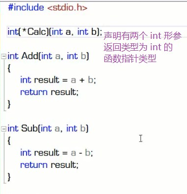
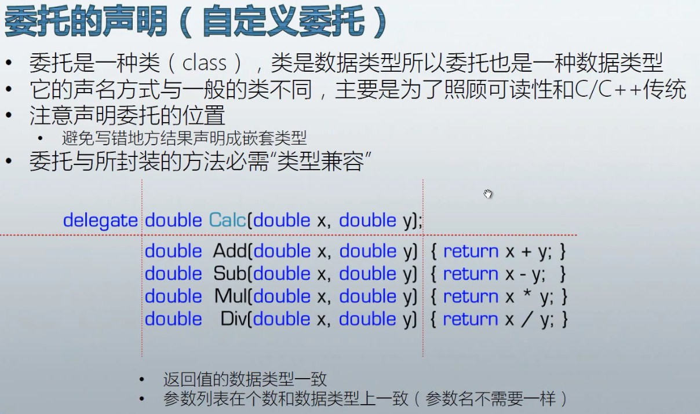
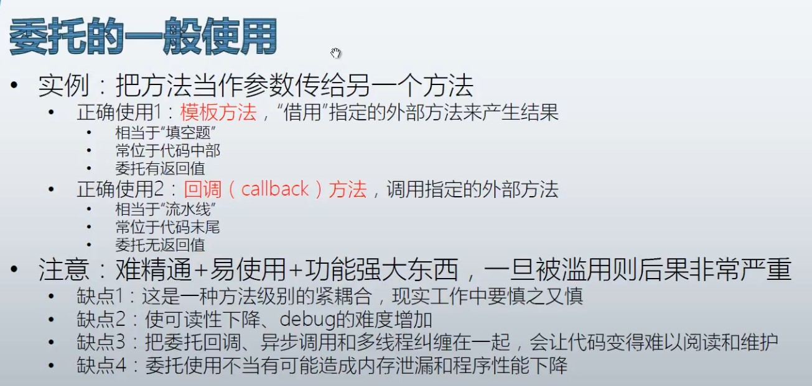
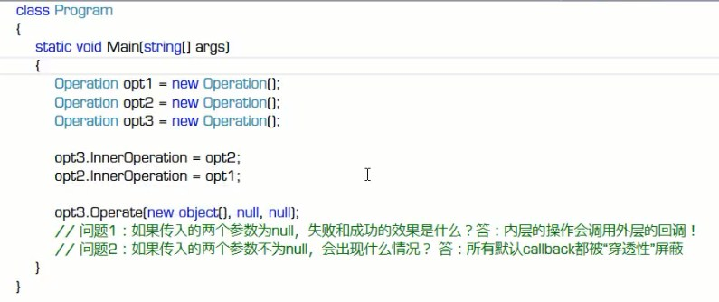
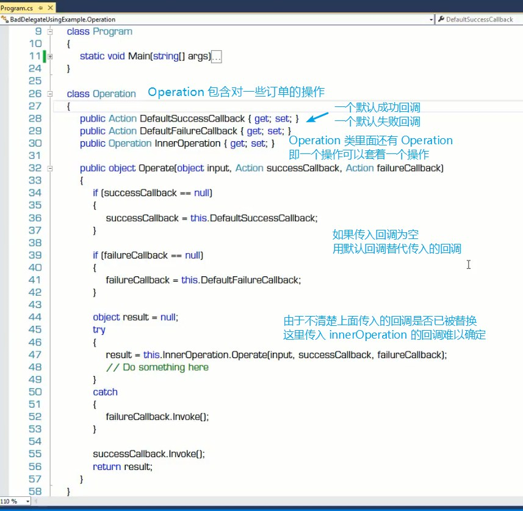
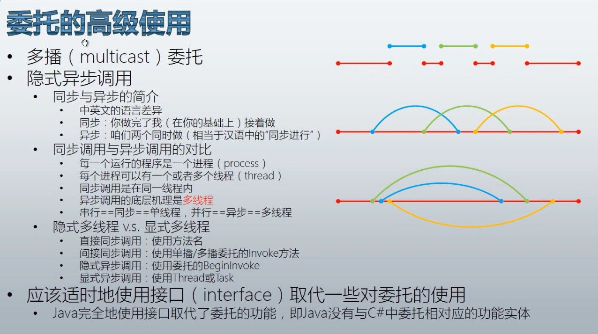
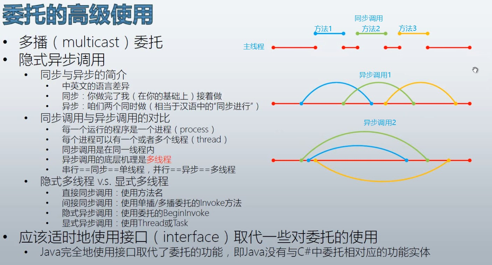
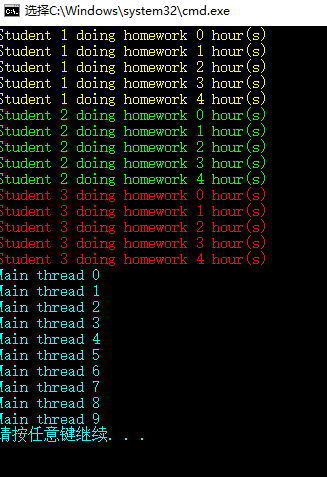
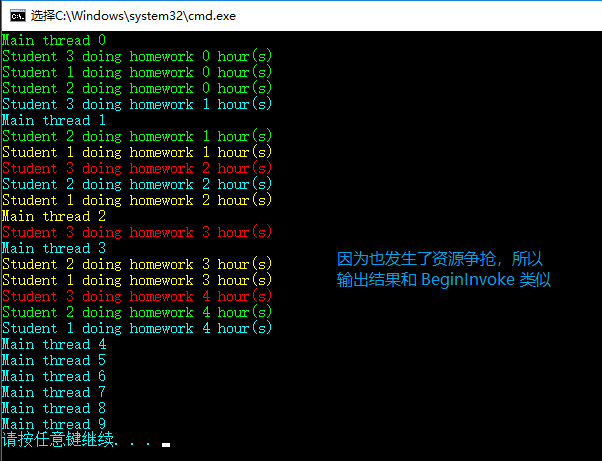

# 019 委托

# 什么是委托 Delegate

+ **委托（delegate）是函数指针的“升级版”**
  - 示例：C/C++ 中的函数指针
+ **一切皆地址**
  - 变量（数据）是以某个地址为起点的一段内存中所存储的值
  - 函数（算法）是以某个地址为起点的一段内存中所存储的一组机器语言指令
+ **直接调用与间接调用**
  - 直接调用：通过函数名来调用函数，CPU 通过函数名直接获得函数所在地址并开始执行 -> 返回
  - 间接调用：通过函数指针来调用函数，CPU 通过读取函数指针存储的值获得函数所在地址并开始执行 -> 返回
+ **Java 中没有与委托相对应的功能实体**
+ **委托的简单使用**
  - Action 委托
  - Func 委托

## C 语言函数指针

声明函数指针与函数：

<font style="color:#000000;background-color:#FFFFFF;">使用函数指针：</font>


## Java

<font style="color:#000000;background-color:#FFFFFF;">Java 语言由 C++ 发展而来，为了提高应用安全性，Java 语言禁止程序员直接访问内存地址。即 Java 语言把 C++ 中所有与指针相关的内容都舍弃掉了。</font>

## 委托实例 Action 与 Func

Action 和 Func 是 C# 内置的委托实例，它们都有很多重载以方便使用。

```csharp
class Program
{
    static void Main(string[] args)
    {
        var calculator = new Calculator();
        // Action 用于无形参无返回值的方法。
        Action action = new Action(calculator.Report);
        calculator.Report();
        action.Invoke();
        // 模仿函数指针的简略写法。
        action();
        Func<int, int, int> func1 = new Func<int, int, int>(calculator.Add);
        Func<int, int, int> func2 = new Func<int, int, int>(calculator.Sub);
        int x = 100;
        int y = 200;
        int z = 0;
        z = func1.Invoke(x, y);
        Console.WriteLine(z);
        z = func2.Invoke(x, y);
        Console.WriteLine(z);
        // Func 也有简略写法。
        z = func1(x, y);
        Console.WriteLine(z);
        z = func2(x, y);
        Console.WriteLine(z);
    }
}
class Calculator
{
    public void Report()
    {
        Console.WriteLine("I have 3 methods.");
    }
    public int Add(int a, int b)
    {
        return a + b;
    }
    public int Sub(int a, int b)
    {
        return a - b;
    }
}
```

# 委托的声明


<font style="color:#000000;background-color:#FFFFFF;">委托是一种类：</font>

```csharp
static void Main(string[] args)
{
    Type t = typeof(Action);
    Console.WriteLine(t.IsClass);
}
```


委托是类，所以声明位置是和 class 处于同一个级别。但 C# 允许嵌套声明类（一个类里面可以声明另一个类），所以有时也会有 delegate 在 class 内部声明的情况。
实例：

```csharp
public delegate double Calc(double x, double y);
class Program
{
    static void Main(string[] args)
    {
        var calculator = new Calculator();
        var calc1 = new Calc(calculator.Mul);
        Console.WriteLine(calc1(5, 6));
    }
}
class Calculator
{
    public double Mul(double x, double y)
    {
        return x * y;
    }
    public double Div(double x, double y)
    {
        return x / y;
    }
}
```

# 委托的一般使用



## 模板方法

利用模板方法，提高代码复用性。 

下例中 Product、Box、WrapFactory 都不用修改，只需要在 ProductFactory 里面新增不同的 MakeXXX 然后作为委托传入 WrapProduct 就可以对其进行包装。

```csharp
class Program
{
    static void Main(string[] args)
    {
        var productFactory = new ProductFactory();
        Func<Product> func1 = new Func<Product>(productFactory.MakePizza);
        Func<Product> func2 = new Func<Product>(productFactory.MakeToyCar);
        var wrapFactory = new WrapFactory();
        Box box1 = wrapFactory.WrapProduct(func1);
        Box box2 = wrapFactory.WrapProduct(func2);
        Console.WriteLine(box1.Product.Name);
        Console.WriteLine(box2.Product.Name);
    }
}
class Product
{
    public string Name { get; set; }
}
class Box
{
    public Product Product { get; set; }
}
class WrapFactory
{
    // 模板方法，提高复用性
    public Box WrapProduct(Func<Product> getProduct)
    {
        var box = new Box();
        Product product = getProduct.Invoke();
        box.Product = product;
        return box;
    }
}
class ProductFactory
{
    public Product MakePizza()
    {
        var product = new Product();
        product.Name = "Pizza";
        return product;
    }
    public Product MakeToyCar()
    {
        var product = new Product();
        product.Name = "Toy Car";
        return product;
    }
}
```

Reuse，重复使用，也叫“复用”。代码的复用不但可以提高工作效率，还可以减少 bug 的引入。
良好的复用结构是所有优秀软件所追求的共同目标之一。

## 回调方法

回调方法是通过委托类型参数传入主调方法的被调用方法，主调方法根据自己的逻辑决定是否调用这个方法。

```csharp
class Program
{
    static void Main(string[] args)
    {
        var productFactory = new ProductFactory();
        
        // Func 前面是传入参数，最后一个是返回值，所以此处以 Product 为返回值
        Func<Product> func1 = new Func<Product>(productFactory.MakePizza);
        Func<Product> func2 = new Func<Product>(productFactory.MakeToyCar);
        var wrapFactory = new WrapFactory();
        var logger = new Logger();
        // Action 只有传入参数，所以此处以 Product 为参数
        Action<Product> log = new Action<Product>(logger.Log);
        Box box1 = wrapFactory.WrapProduct(func1, log);
        Box box2 = wrapFactory.WrapProduct(func2, log);
        Console.WriteLine(box1.Product.Name);
        Console.WriteLine(box2.Product.Name);
    }
}
class Logger
{
    public void Log(Product product)
    {
        // Now 是带时区的时间，存储到数据库应该用不带时区的时间 UtcNow。
        Console.WriteLine("Product '{0}' created at {1}.Price is {2}", product.Name, DateTime.UtcNow, product.Price);
    }
}
class Product
{
    public string Name { get; set; }
    public double Price { get; set; }
}
class Box
{
    public Product Product { get; set; }
}
class WrapFactory
{
    // 模板方法，提高复用性
    public Box WrapProduct(Func<Product> getProduct, Action<Product> logCallBack)
    {
        var box = new Box();
        Product product = getProduct.Invoke();
        // 只 log 价格高于 50 的
        if (product.Price >= 50)
        {
            logCallBack(product);
        }
        box.Product = product;
        return box;
    }
}
class ProductFactory
{
    public Product MakePizza()
    {
        var product = new Product
        {
            Name = "Pizza",
            Price = 12
        };
        return product;
    }
    public Product MakeToyCar()
    {
        var product = new Product
        {
            Name = "Toy Car",
            Price = 100
        };
        return product;
    }
}
```

## 注意委托滥用

恐怖的委托滥用示例，基本上工作在这段代码上的人，三个月内就离职了。 

> 以后技术上去了，记得回看这段代码，警示自己。 
>
> 
> 

# 委托的高级使用



## 多播（multicast）委托

多播委托即一个委托内部封装不止一个方法。

```csharp
using System;
using System.Threading;
namespace DelegateExample
{
    class Program
    {
        static void Main(string[] args)
        {
            var stu1 = new Student { ID = 1, PenColor = ConsoleColor.Yellow };
            var stu2 = new Student { ID = 2, PenColor = ConsoleColor.Green };
            var stu3 = new Student { ID = 3, PenColor = ConsoleColor.Red };
            var action1 = new Action(stu1.DoHomework);
            var action2 = new Action(stu2.DoHomework);
            var action3 = new Action(stu3.DoHomework);
            // 单播委托
            //action1.Invoke();
            //action2.Invoke();
            //action3.Invoke();
            // 多播委托
            action1 += action2;
            action1 += action3;
            action1.Invoke();
        }
    }
    class Student
    {
        public int ID { get; set; }
        public ConsoleColor PenColor { get; set; }
        public void DoHomework()
        {
            for (int i = 0; i < 5; i++)
            {
                Console.ForegroundColor = PenColor;
                Console.WriteLine("Student {0} doing homework {1} hour(s)", ID, i);
                Thread.Sleep(1000);
            }
        }
    }
}
```

## 隐式异步调用


<font style="color:#000000;background-color:#FFFFFF;">异步互不相干：</font>
这里说的“互不相干”指的是逻辑上，而现实工作当中经常会遇到多个线程共享（即同时访问）同一个资源（比如某个变量）的情况，这时候如果处理不当就会产生线程间争夺资源的冲突。

### 三种同步调用

```csharp
using System;
using System.Threading;
namespace DelegateExample
{
    class Program
    {
        static void Main(string[] args)
        {
            var stu1 = new Student { ID = 1, PenColor = ConsoleColor.Yellow };
            var stu2 = new Student { ID = 2, PenColor = ConsoleColor.Green };
            var stu3 = new Student { ID = 3, PenColor = ConsoleColor.Red };
            // 直接同步调用
            //stu1.DoHomework();
            //stu2.DoHomework();
            //stu3.DoHomework();
            var action1 = new Action(stu1.DoHomework);
            var action2 = new Action(stu2.DoHomework);
            var action3 = new Action(stu3.DoHomework);
            // 间接同步调用
            //action1.Invoke();
            //action2.Invoke();
            //action3.Invoke();
            // 多播委托，同步调用
            action1 += action2;
            action1 += action3;
            action1.Invoke();
            // 主线程模拟在做某些事情。
            for (var i = 0; i < 10; i++)
            {
                Console.ForegroundColor=ConsoleColor.Cyan;
                Console.WriteLine("Main thread {0}",i);
                Thread.Sleep(1000);
            }
        }
    }
    class Student
    {
        public int ID { get; set; }
        public ConsoleColor PenColor { get; set; }
        public void DoHomework()
        {
            for (int i = 0; i < 5; i++)
            {
                Console.ForegroundColor = PenColor;
                Console.WriteLine("Student {0} doing homework {1} hour(s)", ID, i);
                Thread.Sleep(1000);
            }
        }
    }
}
```

三种同步调用的结果一样：


### 使用委托进行隐式异步调用 BeginInvoke

```csharp
using System;
using System.Threading;
namespace DelegateExample
{
    class Program
    {
        static void Main(string[] args)
        {
            var stu1 = new Student { ID = 1, PenColor = ConsoleColor.Yellow };
            var stu2 = new Student { ID = 2, PenColor = ConsoleColor.Green };
            var stu3 = new Student { ID = 3, PenColor = ConsoleColor.Red };
            var action1 = new Action(stu1.DoHomework);
            var action2 = new Action(stu2.DoHomework);
            var action3 = new Action(stu3.DoHomework);
            // 使用委托进行隐式异步调用。
            // BeginInvoke 自动生成分支线程，并在分支线程内调用方法。
            action1.BeginInvoke(null, null);
            action2.BeginInvoke(null, null);
            action3.BeginInvoke(null, null);
            // 主线程模拟在做某些事情。
            for (var i = 0; i < 10; i++)
            {
                Console.ForegroundColor = ConsoleColor.Cyan;
                Console.WriteLine("Main thread {0}",i);
                Thread.Sleep(1000);
            }
        }
    }
    class Student
    {
        public int ID { get; set; }
        public ConsoleColor PenColor { get; set; }
        public void DoHomework()
        {
            for (int i = 0; i < 5; i++)
            {
                Console.ForegroundColor = PenColor;
                Console.WriteLine("Student {0} doing homework {1} hour(s)", ID, i);
                Thread.Sleep(1000);
            }
        }
    }
}
```


### 使用 Thread 与 Task 进行异步调用

```csharp
using System;
using System.Threading;
using System.Threading.Tasks;
namespace DelegateExample
{
    class Program
    {
        static void Main(string[] args)
        {
            var stu1 = new Student { ID = 1, PenColor = ConsoleColor.Yellow };
            var stu2 = new Student { ID = 2, PenColor = ConsoleColor.Green };
            var stu3 = new Student { ID = 3, PenColor = ConsoleColor.Red };
            // 老的显式异步调用方式 Thread
            //var thread1 = new Thread(new ThreadStart(stu1.DoHomework));
            //var thread2 = new Thread(new ThreadStart(stu2.DoHomework));
            //var thread3 = new Thread(new ThreadStart(stu3.DoHomework));
            //thread1.Start();
            //thread2.Start();
            //thread3.Start();
            // 使用 Task
            var task1 = new Task(new Action(stu1.DoHomework));
            var task2 = new Task(new Action(stu2.DoHomework));
            var task3 = new Task(new Action(stu3.DoHomework));
            task1.Start();
            task2.Start();
            task3.Start();
            // 主线程模拟在做某些事情。
            for (var i = 0; i < 10; i++)
            {
                Console.ForegroundColor = ConsoleColor.Cyan;
                Console.WriteLine("Main thread {0}", i);
                Thread.Sleep(1000);
            }
        }
    }
    class Student
    {
        public int ID { get; set; }
        public ConsoleColor PenColor { get; set; }
        public void DoHomework()
        {
            for (int i = 0; i < 5; i++)
            {
                Console.ForegroundColor = PenColor;
                Console.WriteLine("Student {0} doing homework {1} hour(s)", ID, i);
                Thread.Sleep(1000);
            }
        }
    }
}
```



## 适时地使用接口（interface）取代委托

Java 完全使用接口取代了委托功能。 
以前面的模板方法举列，通过接口也能实现方法的可替换。

```csharp
using System;
namespace DelegateExample
{
    class Program
    {
        static void Main(string[] args)
        {
            IProductFactory pizzaFactory = new PizzaFactory();
            IProductFactory toyCarFactory = new ToyCarFactory();
            var wrapFactory = new WrapFactory();
            Box box1 = wrapFactory.WrapProduct(pizzaFactory);
            Box box2 = wrapFactory.WrapProduct(toyCarFactory);
            Console.WriteLine(box1.Product.Name);
            Console.WriteLine(box2.Product.Name);
        }
    }
    interface IProductFactory
    {
        Product Make();
    }
    class PizzaFactory : IProductFactory
    {
        public Product Make()
        {
            var product = new Product();
            product.Name = "Pizza";
            return product;
        }
    }
    class ToyCarFactory : IProductFactory
    {
        public Product Make()
        {
            var product = new Product();
            product.Name = "Toy Car";
            return product;
        }
    }
    class Product
    {
        public string Name { get; set; }
    }
    class Box
    {
        public Product Product { get; set; }
    }
    class WrapFactory
    {
        // 模板方法，提高复用性
        public Box WrapProduct(IProductFactory productFactory)
        {
            var box = new Box();
            Product product = productFactory.Make();
            box.Product = product;
            return box;
        }
    }
}
```

> 更新: 2020-08-10 09:46:51  
> 原文: <https://www.yuque.com/yuejiangliu/dotnet/timothy-csharp-019>