# 020,021,022 事件详解

<font style="color:#000000;background-color:#FFFFFF;">每写一个事件例子，就找出来</font>[<font style="background-color:#FFFFFF;">事件模型的五个组成部分</font>](#ccc9b8bd)<font style="color:#000000;background-color:#FFFFFF;">，加深对事件模型的掌握。</font>

# 初步了解事件

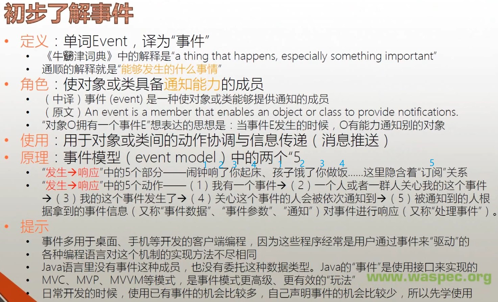

以手机有响铃事件举列：

+ 手机可以通过响铃事件来通知关注手机的人
+ 响铃事件让手机具备了通知关注者的能力
+ 从手机角度看：
  - 响铃要求关注者采取行动
  - 通知关注者的同时，把相关消息也发送给关注者
+ 从人的角度看：
  - 人得到手机的通知，可以采取行动了
  - 除了得到通知，还收到了事件主体者（手机）经由事件发送过来的消息 **事件参数 EventArgs**
+ 响应事件：关注者得到通知后，检查事件参数，依据其内容采取响应的行动
  - 处理事件具体所做的事情：**事件处理器 Event Handler**
  - 如果是会议提醒：就去准备会议
  - 如果是电话接入：选择是否接听
  - 如果关注者在开会，直接抛弃掉事件参数，不做处理
    **事件的功能 = 通知 + 可选的事件参数（即详细信息）**

## 术语约定

下面五种说法都指事件的订阅者：
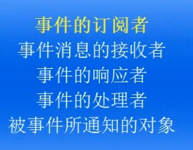

下面四种说法都指事件参数：


## 事件模式

<font style="color:#000000;background-color:#FFFFFF;">事件模式本身也是一种设计模式。 </font>

<font style="color:#000000;background-color:#FFFFFF;">事件模式有一些缺陷，例如牵扯到的元素比较多（5个），不加约束的话，程序逻辑很容易变得一团乱麻。 </font>
<font style="color:#000000;background-color:#FFFFFF;"></font>
<font style="color:#000000;background-color:#FFFFFF;">为了约束团队成员写代码时保持一致，把具有相同功能的代码写到固定的地方去，人们总结出一些最佳解决方案，逐渐形成了 MVC、MVP、MVVM 等程序架构模式。这些模式要求程序员在处理事件时有所为有所不为，代码该放到哪就放到哪，让程序更有条理。</font>

# 事件的应用

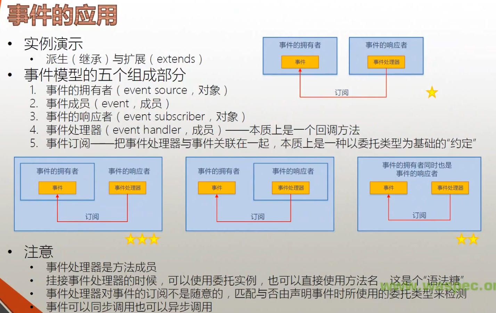


## 事件拥有者通过内部逻辑触发事件

用户按下按钮执行操作，看似是用户的外部操作引起按钮的 Click 事件触发，实际不然，详细情况大致如下：

1. 当用户点击图形界面的按钮时，实际是用户的鼠标向计算机硬件发送了一个电信号。Windows 检测到该电信号后，就查看一下鼠标当前在屏幕上的位置。当 Windows 发现鼠标位置处有个按钮，且包含该按钮的窗口处于激活状态，它就通知该按钮，用户按下了，然后按钮的内部逻辑开始执行
2. 典型的逻辑是按钮快速地把自己绘制一遍，绘制成自己被按下的样子，然后记录当前的状态为被按下了。紧接着如果用户松开了鼠标，Windows 就把消息传递给按钮，按钮内部逻辑又开始执行，把自己绘制成弹起的状态，记录当前的状态为未被按下
3. 按钮内部逻辑检测到，按钮被执行了连续的按下、松开动作，即按钮被点击了。按钮马上使用自己的 Click 事件通知外界，自己被点击了。如果有别的对象订阅了该按钮的 Click 事件，这些事件的订阅者就开始工作
   **简言之**：用户操作通过 Windows 调用了按钮的内部逻辑，最终还是按钮的内部逻辑触发了 Click 事件。

## 事件示例

<font style="color:#000000;background-color:#FFFFFF;">Timer 的一些成员，其中闪电符号标识的两个就是事件： </font>
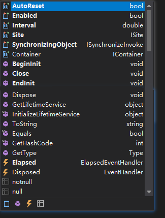

通过查看 Timer 的成员，我们不难发现一个对象最重要的三类成员：

+ 属性：对象或类当前处于什么状态
+ 方法：它能做什么
+ 事件：它能在什么情况下通知谁
  Timer Elapsed 事件示例：

```csharp
using System;
using System.Timers;
namespace EventExample
{
    class Program
    {
        static void Main(string[] args)
        {
            // 1.事件拥有者 timer
            var timer = new Timer();
            timer.Interval = 1000;
            // 3.事件的响应者 boy
            var boy = new Boy();
            
            var girl = new Girl();
            // 2.事件成员 Elapsed，5.事件订阅 +=
            timer.Elapsed += boy.Action;
            timer.Elapsed += girl.Action;
            timer.Start();
            Console.ReadLine();
        }
    }
    class Boy
    {
        // 这是通过 VS 自动生成的事件处理器，适合新手上手。
        // 4.事件处理器 Action
        internal void Action(object sender, ElapsedEventArgs e)
        {
            Console.WriteLine("Jump!");
        }
    }
    class Girl
    {
        internal void Action(object sender, ElapsedEventArgs e)
        {
            Console.WriteLine("Sing!");
        }
    }
}
```

## 几种事件订阅方式

### ⭐事件拥有者和事件响应者是完全不同的两个对象

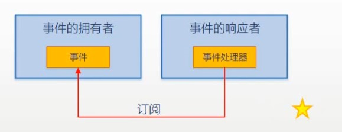

这种组合方式是 MVC、MVP 等设计模式的雏形。
Click 事件与上例的 Elapsed 事件的第二个参数的数据类型不同，即这两个事件的约定是不同的。
**也就是说，你不能拿影响 Elapsed 事件的事件处理器去响应 Click 事件 —— 因为遵循的约束不同，所以他们是不通用的。**

```csharp
using System;
using System.Windows.Forms;
namespace EventExample
{
    class Program
    {
        static void Main(string[] args)
        {
            // 1.事件拥有者
            var form = new Form();
            // 3.事件响应者
            var controller = new Controller(form);
            form.ShowDialog();
        }
    }
    class Controller
    {
        private Form form;
        public Controller(Form form)
        {
            if (form != null)
            {
                this.form = form;
                // 2.事件成员 Click 5.事件订阅 +=
                this.form.Click += this.FormClicked;
            }
        }
        // 4.事件处理器
        private void FormClicked(object sender, EventArgs e)
        {
            this.form.Text = DateTime.Now.ToString();
        }
    }
}
```

### ⭐⭐事件的拥有者和响应者是同一个对象

<font style="color:#000000;background-color:#FFFFFF;">一个对象拿着自己的方法去订阅和处理自己的事件。</font>
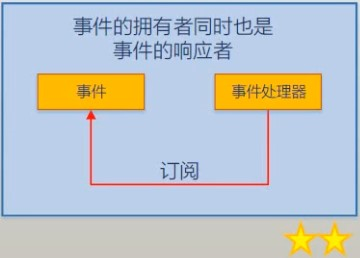

<font style="color:#000000;background-color:#FFFFFF;">该示例中事件的拥有者和响应者都是 from。示例中顺便演示了继承：</font>

```csharp
using System;
using System.Windows.Forms;
namespace EventExample
{
    class Program
    {
        static void Main(string[] args)
        {
            // 1.事件拥有者 3.事件响应者 都是 from
            var form = new MyForm();
            // 2.事件成员 Click 5.事件订阅 +=
            form.Click += form.FormClicked;
            form.ShowDialog();
        }
    }
    // 因为无法直接修改 Form 类，所以创建了继承与 Form 类的 MyForm 类
    class MyForm : Form
    {
        // 4.事件处理器
        internal void FormClicked(object sender, EventArgs e)
        {
            this.Text = DateTime.Now.ToString();
        }
    }
}
```

### ⭐⭐⭐事件的拥有者是事件响应者的一个字段成员

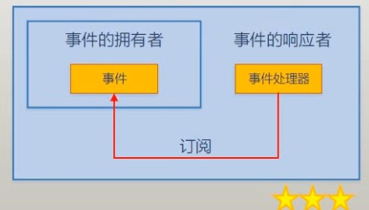

这种是用得最广的：

```csharp
using System;
using System.Windows.Forms;
namespace EventExample
{
    class Program
    {
        static void Main(string[] args)
        {
            // 3.事件响应者 form
            var form = new MyForm();
            form.ShowDialog();
        }
    }
    class MyForm : Form
    {
        private TextBox textBox;
        // 1.事件拥有者 button
        private Button button;
        public MyForm()
        {
            this.textBox = new TextBox();
            this.button = new Button();
            this.Controls.Add(this.button);
            this.Controls.Add(this.textBox);
            // 2.事件成员 Click 5.事件订阅 +=
            this.button.Click += this.ButtonClicked;
        }
        // 4.事件处理器
        private void ButtonClicked(object sender, EventArgs e)
        {
            this.textBox.Text = "Hello, World!!!!";
        }
    }
}
```

## WinForm，WPF 事件绑定示例

### WinForm 示例

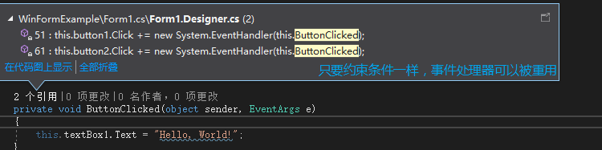


```csharp
public Form1()
{
    InitializeComponent();
    // 两种事件挂接的方式
    //this.button3.Click += this.ButtonClicked;
    //this.button3.Click += new EventHandler(this.ButtonClicked);
    // 挂接匿名方法
    // 已废弃的事件挂接方式
    //this.button3.Click += delegate(object sender, EventArgs e)
    //{
    //    this.textBox1.Text = "haha";
    //};
    // Lambda 表达式 PS：编译器可以通过委托约束推算出 sender 与 e 的数据类型
    this.button3.Click += (sender, e) =>
    {
        this.textBox1.Text = "Hoho";
    };
}
private void ButtonClicked(object sender, EventArgs e)
{
    if (sender == this.button1)
    {
        this.textBox1.Text = "Hello";
    }
    if (sender == this.button2)
    {
        this.textBox1.Text = "World";
    }
    if (sender == this.button3)
    {
        this.textBox1.Text = "Mr.Okay";
    }
}
```

<font style="color:#000000;background-color:#FFFFFF;">一个事件可以挂接多个事件处理器，一个事件处理器也可以被多个事件所挂接。</font>

### WPF 示例

<font style="color:#000000;background-color:#FFFFFF;">WPF 可以在 XAML 里面绑定事件。</font>
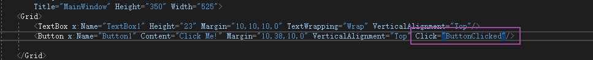

<font style="color:#000000;background-color:#FFFFFF;">它将自动在后台生成事件绑定代码。 </font>
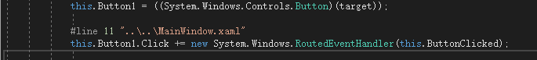

<font style="color:#000000;background-color:#FFFFFF;">也可以在后台手动绑定事件：</font>

```csharp
public partial class MainWindow : Window
{
    public MainWindow()
    {
        InitializeComponent();
        //this.Button1.Click += this.ButtonClicked;
        this.Button1.Click += new RoutedEventHandler(this.ButtonClicked);
    }
    private void ButtonClicked(object sender, RoutedEventArgs e)
    {
        this.TextBox1.Text = "Hello, WASPEC!";
    }
}
```

# 事件的声明

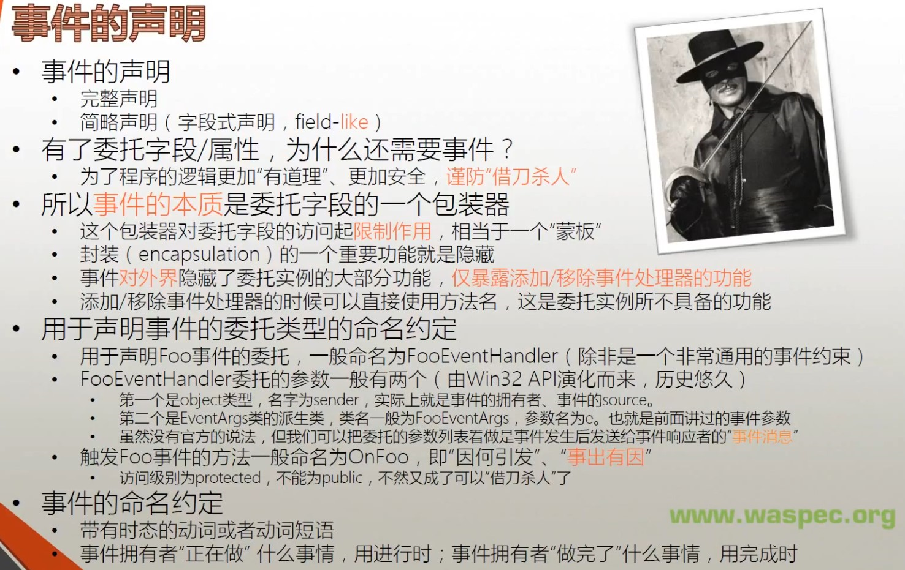

事件声明有完整声明和简略声明两种，简略声明是完整声明的语法糖。
事件无论是从表层约束还是从底层实现都是依赖于委托的。

## 事件声明完整格式

注：声明委托类型（与类同级）**≠** 声明委托类型字段（在类内部）。

```csharp
using System;
using System.Threading;
namespace EventExample
{
    class Program
    {
        static void Main(string[] args)
        {
            // 1.事件拥有者
            var customer = new Customer();
            // 2.事件响应者
            var waiter = new Waiter();
            // 3.Order 事件成员 5. +=事件订阅
            customer.Order += waiter.Action;
            customer.Action();
            customer.PayTheBill();
        }
    }
    // 该类用于传递点的是什么菜，作为事件参数，需要以 EventArgs 结尾，且继承自 EventArgs
    public class OrderEventArgs:EventArgs
    {
        public string DishName { get; set; }
        public string Size { get; set; }
    }
    // 声明一个委托类型，因为该委托用于事件处理，所以以 EventHandler 结尾
    // 注意委托类型的声明和类声明是平级的
    public delegate void OrderEventHandler(Customer customer, OrderEventArgs e);
    public class Customer
    {
        // 委托类型字段
        private OrderEventHandler orderEventHandler;
        // 事件声明
        public event OrderEventHandler Order
        {
            add { this.orderEventHandler += value; }
            remove { this.orderEventHandler -= value; }
        }
        public double Bill { get; set; }
        public void PayTheBill()
        {
            Console.WriteLine("I will pay ${0}.",this.Bill);
        }
        public void WalkIn()
        {
            Console.WriteLine("Walk into the restaurant");
        }
        public void SitDown()
        {
            Console.WriteLine("Sit down.");
        }
        public void Think()
        {
            for (int i = 0; i < 5; i++)
            {
                Console.WriteLine("Let me think ...");
                Thread.Sleep(1000);
            }
            if (this.orderEventHandler != null)
            {
                var e = new OrderEventArgs();
                e.DishName = "Kongpao Chicken";
                e.Size = "large";
                this.orderEventHandler.Invoke(this,e);
            }
        }
        public void Action()
        {
            Console.ReadLine();
            this.WalkIn();
            this.SitDown();
            this.Think();
        }
    }
    public class Waiter
    {
        // 4.事件处理器
        public void Action(Customer customer, OrderEventArgs e)
        {
            Console.WriteLine("I will serve you the dish - {0}.",e.DishName);
            double price = 10;
            switch (e.Size)
            {
                case "small":
                    price *= 0.5;
                    break;
                case "large":
                    price *= 1.5;
                    break;
                default:
                    break;
            }
            customer.Bill += price;
        }
    }
}
```

## 事件声明简略格式

一种 filed-like 的声明格式。

> filed-like：像字段声明一样 。
>
> 简略格式与上例的完整格式只有**事件声明**和**事件触发**两处不同。

```csharp
using System;
using System.Threading;
namespace EventExample
{
    class Program
    {
        static void Main(string[] args)
        {
            // 1.事件拥有者
            var customer = new Customer();
            // 2.事件响应者
            var waiter = new Waiter();
            // 3.Order 事件成员 5. +=事件订阅
            customer.Order += waiter.Action;
            customer.Action();
            customer.PayTheBill();
        }
    }
    public class OrderEventArgs:EventArgs
    {
        public string DishName { get; set; }
        public string Size { get; set; }
    }
    public delegate void OrderEventHandler(Customer customer, OrderEventArgs e);
    public class Customer
    {
        // 简略事件声明，看上去像一个委托（delegate）类型字段
        public event OrderEventHandler Order;
        public double Bill { get; set; }
        public void PayTheBill()
        {
            Console.WriteLine("I will pay ${0}.",this.Bill);
        }
        public void WalkIn()
        {
            Console.WriteLine("Walk into the restaurant");
        }
        public void SitDown()
        {
            Console.WriteLine("Sit down.");
        }
        public void Think()
        {
            for (int i = 0; i < 5; i++)
            {
                Console.WriteLine("Let me think ...");
                Thread.Sleep(1000);
            }
            if (this.Order != null)
            {
                var e = new OrderEventArgs();
                e.DishName = "Kongpao Chicken";
                e.Size = "large";
                // 事件触发
                this.Order.Invoke(this,e);
            }
        }
        public void Action()
        {
            Console.ReadLine();
            this.WalkIn();
            this.SitDown();
            this.Think();
        }
    }
    public class Waiter
    {
        // 4.事件处理器
        public void Action(Customer customer, OrderEventArgs e)
        {
            Console.WriteLine("I will serve you the dish - {0}.",e.DishName);
            double price = 10;
            switch (e.Size)
            {
                case "small":
                    price *= 0.5;
                    break;
                case "large":
                    price *= 1.5;
                    break;
                default:
                    break;
            }
            customer.Bill += price;
        }
    }
}
```

使<font style="color:#000000;background-color:#FFFFFF;">用 ildasm 反编译，查看隐藏在事件简化声明背后的秘密。</font>
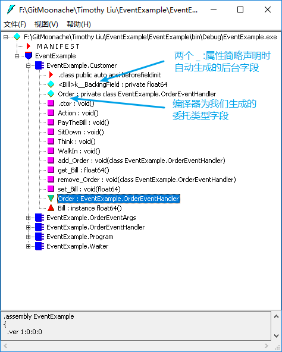


## 委托类型字段能否替代事件

既然已有了委托类型字段/属性，为什么还要事件？   
因为事件成员能让程序逻辑更加“有道理”、更加安全，谨防“借刀杀人”。
真正项目中，往往很多人在同一段代码上工作，如果在语言层面未对某些功能进行限值，这种自由度很可能被程序员滥用或误用。
像下面这种使用字段的方式，和 C、C++ 里面使用函数指针是一样的，经常出现函数指针指到了一个程序员不想调用的函数上去，进而造成逻辑错误。这也是为什么 Java 彻底放弃了与函数指针相关的功能 —— Java 没有委托类型。
正是为了解决 public 委托字段在类的外部被滥用或误用的问题，微软才推出了事件这个成员。

```csharp
using System;
using System.Threading;
namespace EventExample
{
    class Program
    {
        static void Main(string[] args)
        {
            Console.ReadLine();
            var customer = new Customer();
            var waiter = new Waiter();
            customer.Order += waiter.Action;
            //customer.Action();
            // badGuy 借刀杀人，给 customer 强制点菜
            OrderEventArgs e = new OrderEventArgs();
            e.DishName = "Manhanquanxi";
            e.Size = "large";
            OrderEventArgs e2 = new OrderEventArgs();
            e2.DishName = "Beer";
            e2.Size = "large";
            var badGuy = new Customer();
            badGuy.Order += waiter.Action;
            badGuy.Order.Invoke(customer, e);
            badGuy.Order.Invoke(customer, e2);
            customer.PayTheBill();
        }
    }
    public class OrderEventArgs : EventArgs
    {
        public string DishName { get; set; }
        public string Size { get; set; }
    }
    public delegate void OrderEventHandler(Customer customer, OrderEventArgs e);
    public class Customer
    {
        // 去掉 Event，把事件声明改成委托字段声明
        public OrderEventHandler Order;
        public double Bill { get; set; }
        public void PayTheBill()
        {
            Console.WriteLine("I will pay ${0}.", this.Bill);
        }
        public void WalkIn()
        {
            Console.WriteLine("Walk into the restaurant");
        }
        public void SitDown()
        {
            Console.WriteLine("Sit down.");
        }
        public void Think()
        {
            for (int i = 0; i < 5; i++)
            {
                Console.WriteLine("Let me think ...");
                Thread.Sleep(1000);
            }
            if (this.Order != null)
            {
                var e = new OrderEventArgs();
                e.DishName = "Kongpao Chicken";
                e.Size = "large";
                this.Order.Invoke(this, e);
            }
        }
        public void Action()
        {
            Console.ReadLine();
            this.WalkIn();
            this.SitDown();
            this.Think();
        }
    }
    public class Waiter
    {
        public void Action(Customer customer, OrderEventArgs e)
        {
            Console.WriteLine("I will serve you the dish - {0}.", e.DishName);
            double price = 10;
            switch (e.Size)
            {
                case "small":
                    price *= 0.5;
                    break;
                case "large":
                    price *= 1.5;
                    break;
                default:
                    break;
            }
            customer.Bill += price;
        }
    }
}
```

一<font style="color:#000000;background-color:#FFFFFF;">旦将 Order 声明为事件（添加 event 关键字），就能避免上面的问题。</font>
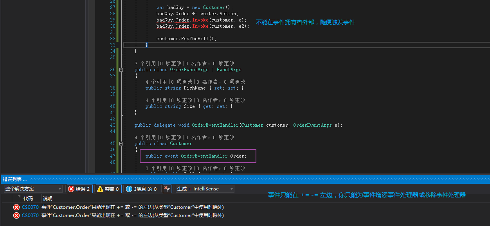

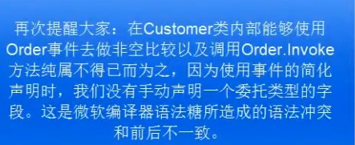


## 事件的本质

事件的本质是一个蒙版。
蒙板 Mask： 事件这个包装器对委托字段的访问起**限制作用**，只让你访问 +=、-= ，让你只能给事件添加或移除事件处理器。让程序更加安全更好维护。
封装 Encapsulation： 上面的限制作用，就是面向对象的封装这个概念。把一些东西封装隐藏起来，在外部只暴露我想让你看到的东西。
事件**对外界**隐藏了委托实例的大部分功能，**仅暴露添加/移除事件处理器**的功能。

## 命名约定

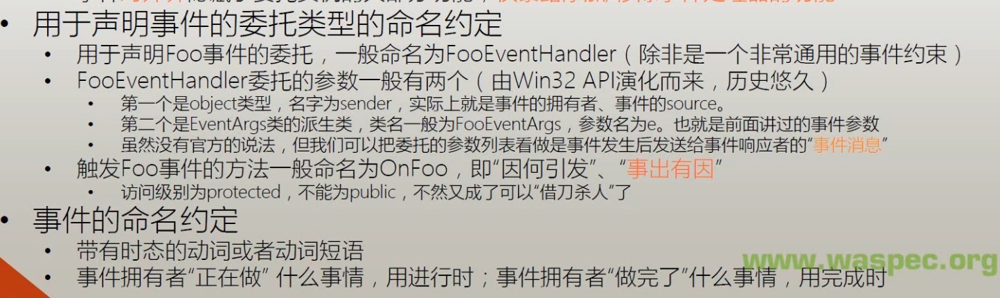


### 使用 EventHandler

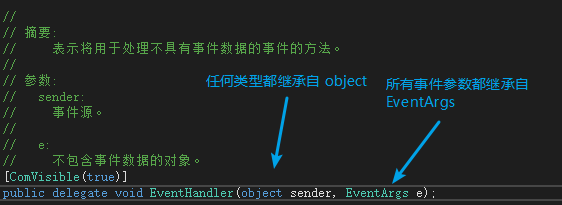


```csharp
using System;
using System.Threading;
namespace EventExample
{
    class Program
    {
        static void Main(string[] args)
        {
            var customer = new Customer();
            var waiter = new Waiter();
            customer.Order += waiter.Action;
            customer.Action();
            customer.PayTheBill();
        }
    }
    public class OrderEventArgs : EventArgs
    {
        public string DishName { get; set; }
        public string Size { get; set; }
    }
    //public delegate void OrderEventHandler(Customer customer, OrderEventArgs e);
    public class Customer
    {
        // 使用默认的 EventHandler，而不是声明自己的
        public event EventHandler Order;
        public double Bill { get; set; }
        public void PayTheBill()
        {
            Console.WriteLine("I will pay ${0}.", this.Bill);
        }
        public void WalkIn()
        {
            Console.WriteLine("Walk into the restaurant");
        }
        public void SitDown()
        {
            Console.WriteLine("Sit down.");
        }
        public void Think()
        {
            for (int i = 0; i < 5; i++)
            {
                Console.WriteLine("Let me think ...");
                Thread.Sleep(1000);
            }
            if (this.Order != null)
            {
                var e = new OrderEventArgs();
                e.DishName = "Kongpao Chicken";
                e.Size = "large";
                this.Order.Invoke(this, e);
            }
        }
        public void Action()
        {
            Console.ReadLine();
            this.WalkIn();
            this.SitDown();
            this.Think();
        }
    }
    public class Waiter
    {
        public void Action(object sender, EventArgs e)
        {
            // 类型转换
            var customer = sender as Customer;
            var orderInfo = e as OrderEventArgs;
            Console.WriteLine("I will serve you the dish - {0}.", orderInfo.DishName);
            double price = 10;
            switch (orderInfo.Size)
            {
                case "small":
                    price *= 0.5;
                    break;
                case "large":
                    price *= 1.5;
                    break;
                default:
                    break;
            }
            customer.Bill += price;
        }
    }
}
```

### 专用于触发事件的方法

触发事件的方法一般命名为 OnXxx，且访问级别为 protected（自己的类成员及派生类能访问）。
依据单一职责原则，把原来的 Think 中触发事件的部分单独提取为 OnOrder 方法。

```csharp
public void Think()
{
    for (int i = 0; i < 5; i++)
    {
        Console.WriteLine("Let me think ...");
        Thread.Sleep(1000);
    }
    this.OnOrder("Kongpao Chicken","large");
}
protected void OnOrder(string dishName,string size)
{
    if (this.Order != null)
    {
        var e = new OrderEventArgs();
        e.DishName = dishName;
        e.Size = size;
        this.Order.Invoke(this, e);
    }
}
```

### 事件的命名约定

注意动词的时态。 
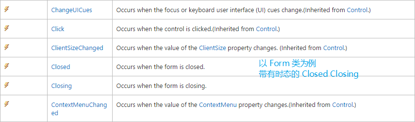


# 事件与委托的关系

+ 事件真的是“以特殊方式声明的委托字段/实例”吗？
  - <font style="color:#FA541C;">不是！</font>只是声明的时候“看起来像”（对比委托字段与事件的简化声明，field-like）
  - 事件声明的时候使用了委托类型，简化声明造成事件看上去像一个委托的字段（实例），而 event 关键字则更像是一个修饰符 —— <font style="color:#FA8C16;">这就是错觉的来源之一</font>
  - 订阅事件的时候 += 操作符后面可以是一个委托实例，这与委托实例的赋值方法语句相同，这也让事件看起来像是一个委托字段 —— <font style="color:#FA8C16;">这是错觉的又一来源</font>
  - 重申：事件的本质是加装在委托字段上的一个“蒙版”（mask），是个起掩蔽作用的包装器。这个用于阻挡非法操作的“蒙版”绝不是委托字段本身
+ 为什么要使用委托类型来声明事件？
  - 站在 source 的角度来看，是为了表明 source 能对外传递哪些消息
  - 站在 subscriber 的角度来看，它是一种约定，是为了约束能够使用什么样签名的方法来处理（响应）事件
  - 委托类型的实例将用于存储（引用）事件处理器
+ 对比事件与属性
  - 属性不是字段 —— <font style="color:#FA541C;">很多时候</font>属性是字段的包装器，这个包装器用来保护字段不被滥用
  - 事件不是委托字段 —— 它是委托字段的包装器，这个包装器用来保护委托字段不被滥用
  - **包装器永远都不可能是被包装的东西**
    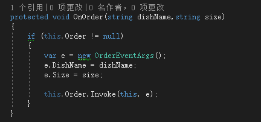

    在上图中是被迫使用事件去做 `!=` 和 `.Invoke()`，学过事件完整声明格式，就知道事件做不了这些。在这里能这样是因为简略格式下事件背后的委托字段是编译器自动生成的，这里访问不了。
    **总结：事件不是委托类型字段（无论看起来多像），它是委托类型字段的包装器，限制器，从外界只能访问 += -= 操作。**

> 更新: 2020-06-17 09:08:41  
> 原文: <https://www.yuque.com/yuejiangliu/dotnet/timothy-csharp-020-022>