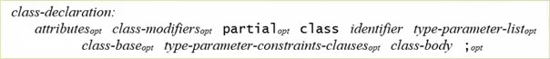
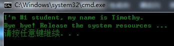

# 023 什么是类

从本节开始深入学习面向对象编程。
当前的视频教程是 1.0 版本，针对的是 C# 5.0。

# 前 22 讲的简要总结




1. 讲解了 C# 基本元素、基本语法
2. 把类的成员过了一遍：字段、属性、方法、事件
3. 在前面其实已经讲过了封装、后面讲继承和多态

# 什么是“类”

类是一种数据结构，它可以包含数据成员（常量和字段）、函数成员（方法、属性、事件、索引器、运算符、实例构造函数、静态构造函数和析构函数）以及嵌套类型。类类型支持继承，继承是一种机制，它使派生类可以对基类进行扩展和专用化。 —— 《C# 语言规范》
注：这是在描述类是什么，讲的是类的外延而不是类的内涵。
计算机领域的类有下面三个方面

+ 是一种数据结构（data structure）
+ 是一种数据类型
+ 代表现实世界中的“种类”

## 是一种数据结构（Data Structure）

类是一种“抽象”的数据结构。

+ 类本身是“抽象”的结果，例如把学生抽象为 Student 类
+ 类也是“抽象”结果的载体，Student 类承载着学生的抽象（学生的 ID，学生的行为等）
  这里提到的 data structure 和算法里面的 data structure 略有不同。算法里面的数据结构更多是指集合（List、Dictionary 等）数据类型。

```csharp
class Program
{
    static void Main(string[] args)
    {
        // 2. 可以用类声明变量、创建实例
        Student stu = new Student
        {
            ID=1,
            Name = "Timothy"
        };
        // 2. 类是实例的模板
        Console.WriteLine(stu.ID);
        Console.WriteLine(stu.Name);
        stu.Report();
    }
}
// 1. 类是一种数据结构
// 2. 类是一种自定义的引用类型
class Student
{
    // 1. 从现实世界学生抽象出来的属性
    public int ID { get; set; }
    public string Name { get; set; }
    // 1. 从现实世界学生抽象出来的行为
    public void Report()
    {
        Console.WriteLine($"I'm #{ID} student, my name is {Name}.");
    }
}
```

## 是一种数据类型

类是一种引用类型，具体到每一个类都是一个自定义类型：

1. 可以用类去声明变量
2. 可以用类去创建实例（把类作为实例的模板）

### 反射与 dynamic 示例

这两个示例也展现了类作为“数据类型”的一面。
反射的基础：

```csharp
Type t = typeof(Student);
object o = Activator.CreateInstance(t, 1, "Timothy");
Student stu = o as Student;
Console.WriteLine(stu.Name);
```

dynamic 编程：

```csharp
Type t = typeof(Student);
dynamic stu = Activator.CreateInstance(t, 1, "Timothy");
Console.WriteLine(stu.Name);
```

## 代表现实世界中的“种类”

程序中的类与哲学、数学中的类有相通的地方。

```csharp
class Program
{
    static void Main(string[] args)
    {
        Student s1 = new Student(1, "Timothy");
        Student s2 = new Student(2, "Jacky");
        Console.WriteLine(Student.Amount);
    }
}
class Student
{
    // 3. Amount 代表现实世界中学生的个数
    public static int Amount { get; set; }
    static Student()
    {
        Amount = 100;
    }
    public Student(int id, string name)
    {
        ID = id;
        Name = name;
        Amount++;
    }
    ~Student()
    {
        Amount--;
    }
    ...
}
```

# 构造器与析构器

```csharp
class Program
{
    static void Main(string[] args)
    {
        // 使用默认构造器
        //Student stu = new Student();
        // 一旦有了非默认构造器，系统就不在为我们生成默认构造器
        Student stu = new Student(1, "Timothy");
        stu.Report();
    }
}
class Student
{
    public Student(int id, string name)
    {
        ID = id;
        Name = name;
    }
    ~Student()
    {
        Console.WriteLine("Bye bye! Release the system resources ...");
    }
    public int ID { get; set; }
    public string Name { get; set; }
    public void Report()
    {
        Console.WriteLine($"I'm #{ID} student, my name is {Name}.");
    }
}
```




> 更新: 2020-04-18 13:47:11  
> 原文: <https://www.yuque.com/yuejiangliu/dotnet/timothy-csharp-023>