# 024,025 类的声明，继承和访问控制

# 类声明的全貌

Class declarations.
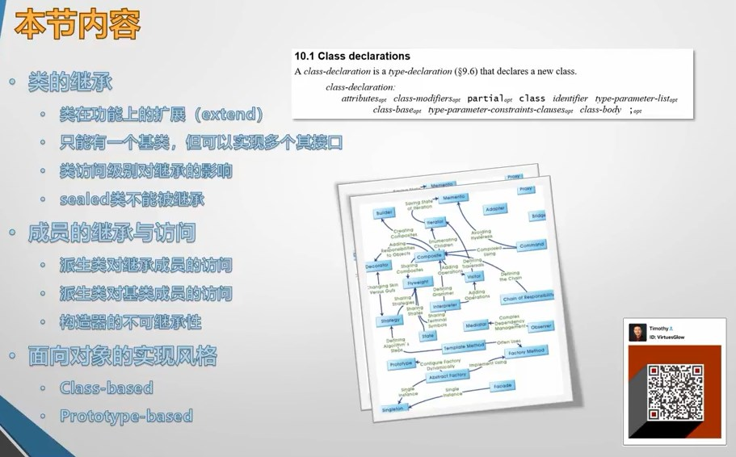

## C# 类声明的位置

+ 在名称空间里

```csharp
namespace HelloClass
{
    class Program
    {
        ...
    }
...
```

+ 放在显式的名称空间之外实际上是声明在了全局名称空间里面，这是把类声明在名称空间的一种特殊情况。

```csharp
namespace HelloClass
{
    ...
}
class Computer
{
}
```

+ 声明在类体里面（成员类）成员类在学习时不常见，但实际项目中常用。

```csharp
namespace HelloClass
{
    class Program
    {
        ...
        class Student
        {
            ...
        }
    }
}
```

## 声明即定义（C# 与 Java）

C++ 里面类的声明和定义默认是分开的（推荐），也可以手动写到一起。
在 C# 和 Java 中声明即定义。

# 最简单的类声明

语法： 
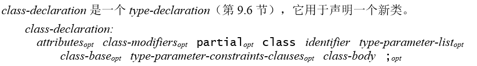
<font style="color:#000000;background-color:#FFFFFF;">即使是 </font>[ASP.NET Core](https://github.com/dotnet/aspnetcore)<font style="color:#000000;background-color:#FFFFFF;"> </font>这么大的项目里面也没有特别复杂的类声明。

# 类成员的访问控制

class 前面没有任何修饰符等于加了 internal。

+ internal：仅在自身程序集（Assembly）里面可以访问
+ public：从 Assembly 暴露出去

> **Code Snippet**
>
> 1. F12：跳至类定义
> 2. Ctrl + - (减号)：跳回至之前所在位置

# 类的继承

Timothy：继承的本质是派生类在基类已有的成员基础上，对基类进行的横向和纵向的扩展。

+ 横向扩展：对类成员个数的扩充
+ 纵向扩展：对类成员（重写）版本的更新
  只能扩展不能缩减，这是静态类型语言（C#、C++、Java 等）的特征，继承时类成员只能越来越多。  
  动态类型语言（Python、JavaScript）可以移除类成员。

```csharp
namespace HelloOOP
{
    class Program
    {
        static void Main(string[] args)
        {
            var t = typeof(Car);
            var tb = t.BaseType;
            var top = tb.BaseType;
            Console.WriteLine(tb.FullName);
            Console.WriteLine(top.FullName);
            Console.WriteLine(top.BaseType == null);
        }
    }
    class Vehicle {}
    class Car : Vehicle {}
}
```

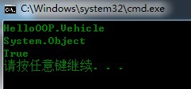

## is a 概念

is a：一个派生类的实例，从语义上来说也是一个基类的实例。

```csharp
var car = new Car();
Console.WriteLine(car is Vehicle);
Console.WriteLine(car is Object);
var vehicle = new Vehicle();
Console.WriteLine(vehicle is Car);
```

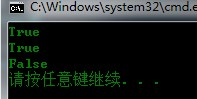

```csharp
// 可以用基类类型的变量来引用派生类实例
Vehicle vehicle = new Car();
Object o1 = new Vehicle();
Object o2 = new Car();
```

## 知识点

+ sealed 封闭类，无法被继承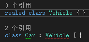
+ C# 只支持单继承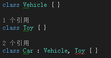注：C++ 支持多继承，但它也受菱形继承的困扰
+ 子类的访问权限不能超越父类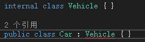

# 类成员的访问级别

类成员的访问级别以类的访问级别为上限。

> **命名偏好**   
> 随着越来越多 C++、Java 程序员加入 .NET 社区，private 字段的命名普遍遵循 下划线 + 小写。   
> 例：`private int _rpm;`
>
> 在团队合作中，自己写的类或方法不想被他人调用时，推荐的做法就是不用 public 进行修饰。  
> 如果应该封装的成员没有封装，对方只要发现能够调用，又能解决问题，他就一定会去用，进而导致一些不确定的问题。

| **关键字**                                                   | **访问级别**                                                 |
| ------------------------------------------------------------ | ------------------------------------------------------------ |
| <font style="color:#000000;background-color:#FFFFFF;">public</font> | 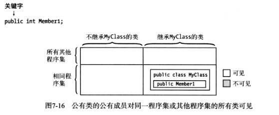 |
| protected internal                                           | 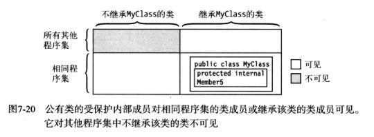 |
| internal                                                     | 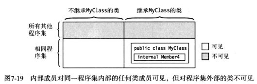 |
| protected                                                    | 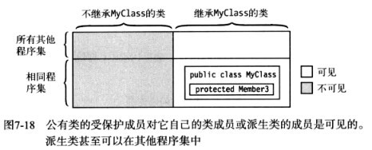 |
| private                                                      | 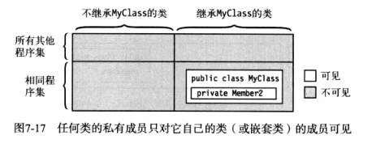 |
| C# 7.2 推出了最新的 [Private Protected](https://blogs.msdn.microsoft.com/mazhou/2017/10/05/c-7-series-part-5-private-protected/): The member declared with this accessibility can be visible within the types derived from this containing type within the containing assembly. It is not visible to any types not derived from the containing type, or outside of the containing assembly. i.e., the access is limited to derived types within the containing assembly.（ Private Protected 仅对程序集内的派生类可见） |                                                              |

# 面向对象的实现风格

开放心态，不要有语言之争。
我们现在学到的封装、继承、多态的风格是[基于类的（Class-based）](https://en.wikipedia.org/wiki/Class-based_programming)。   
还有另外一个非常重要的风格就是[基于原型的（Prototype-based）](https://zh.wikipedia.org/wiki/%E5%8E%9F%E5%9E%8B%E7%A8%8B%E5%BC%8F%E8%A8%AD%E8%A8%88)，JavaScript 就是基于原型的面向对象。
Java 也是基于类的，让我们一撇 Java：

```java
package com.ccc;
public class Main {
  public static void main(String[] args) {
    Car car = new Car();
    car.owner = "Timothy";
    System.out.println(car.owner);
  }
}
class Vehicle{
  public String owner;
}
class Car extends Vehicle{
}
```

> 更新: 2021-12-23 14:09:12  
> 原文: <https://www.yuque.com/yuejiangliu/dotnet/timothy-csharp-024-025>