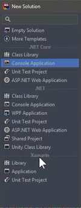
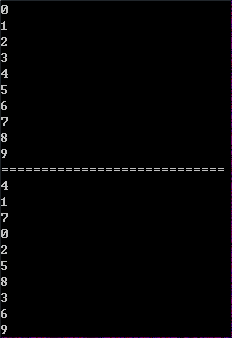
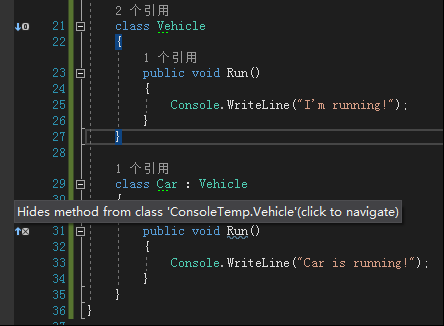
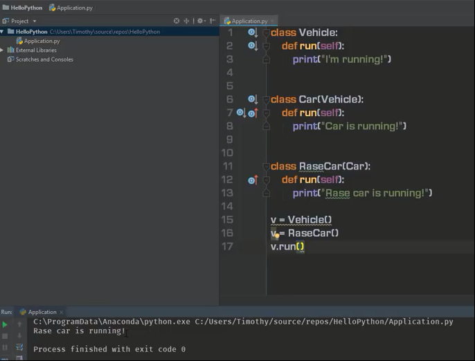
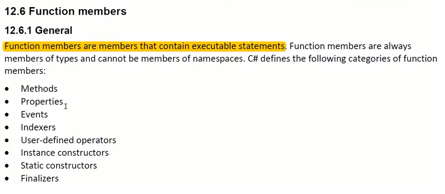

# 026 重写与多态

多态是基于重写的

+ 继承：向子类中添加父类没有的成员，子类对父类的横向扩展
+ 重写：纵向扩展，成员没有增加，但成员的版本增加了

# 引言

## Rider

JetBrains：Rider、ReSharper、dotPeek
Rider 支持包括 .NET Core 在内的较全面的 .NET 开发，以及 Unity 开发。
.NET Core / ASP.NETWeb Application 开发包括：

1. RestFul API
2. .NET Core 网站开发
   Ｑ：Rider 是否支持 WinForm 开发？
   A：不支持 WinForm，但支持基于 XAML 的 WPF 和 Xamarin
   
   Java 常用 Spring + Hibernate + JPA 这一套，它们都能在 .NET Core 找到对应选择。
   ASP.NET Core 框架 + Entity Framework Core
   .NET Core 自带 Razor engine

## Edx Timothy 参与开发的课程

校长关于 ASP.NET Core 开发的一些课程，分别讲 LINQ、Web 开发基础、RestFul API、实战。
未来还将有一门 ASP.NET Core 高级开发和 Authentication & Authorization。


## DFS 与 BFS

+ DFS：Depth-First-Search 深度优先搜索
+ BFS：Breadth-First Search 广度优先搜索

```csharp
using System;
using System.Collections.Generic;
using System.Linq;
namespace ConsoleTemp
{
    // 注：为了方便理解，很多变量命名都用的全称
    class Program
    {
        static void Main(string[] args)
        {
            // 生成 [0,10) 的自然数数组，即 0,1,2,3...9
            var values = Enumerable.Range(0, 10).ToArray();
            var binarySearchTree = GetTree(values, 0, values.Length - 1);
            DFS(binarySearchTree);
            Console.WriteLine("============================");
            BFS(binarySearchTree);
        }
        static Node GetTree(int[] values, int lowIndex, int highIndex)
        {
            if (lowIndex > highIndex) return null;
            var middleIndex = lowIndex + (highIndex - lowIndex) / 2;
            var node = new Node(values[middleIndex]);
            node.Left = GetTree(values, lowIndex, middleIndex - 1);
            node.Right = GetTree(values, middleIndex + 1, highIndex);
            return node;
        }
        static void DFS(Node node)
        {
            if (node == null) return;
            DFS(node.Left);
            Console.WriteLine(node.Value);
            DFS(node.Right);
        }
        static void BFS(Node root)
        {
            var q = new Queue<Node>();
            q.Enqueue(root);
            while (q.Count > 0)
            {
                var node = q.Dequeue();
                Console.WriteLine(node.Value);
                if (node.Left != null) q.Enqueue(node.Left);
                if (node.Right != null) q.Enqueue(node.Right);
            }
        }
    }
    class Node
    {
        public int Value { get; set; }
        public Node Left { get; set; }
        public Node Right { get; set; }
        public Node(int value)
        {
            Value = value;
        }
    }
}
```



## C# 语言标准文档

C# 5.0 已经成为国际标准 ECMA-334，ECMA-334 的 PDF 比微软自己的标准文档还要权威。
C# 6.0 7.0 还在 ECMA 验证中。

笔者注：校长还是很注重标准文档，推荐有志于深入 C# 的同学去多翻一翻、读一读。
---

下面开始讲解本节的正式内容：
本节内容

+ 类的继承
  - 类成员的“横向扩展”（成员越来越多）
  - 类成员的“纵向扩展”（行为改变，版本增高）
  - 类成员的隐藏（不常用）
  - 重写与隐藏的发生条件：函数成员，可见，签名一致
+ 多态（polymorphism）
  - 基于重写机制（virtual -> override）
  - 函数成员的具体行为（版本）由对象决定
  - 回顾：C# 语言的变量和对象都是有类型的，所以会有“代差”

# Override 重写

子类对父类成员的重写。
因为类成员个数还是那么多，只是更新版本，所以又称为纵向扩展。
注：重写时，Car 里面只有一个版本的 Run。
重写需要父类成员标记为 **virtual**，子类成员标记 **override**。
注：被标记为 override 的成员，隐含也是 virtual 的，可以继续被重写。

> virtual：可被重写的、名义上的、名存实亡的

```csharp
class Program
{
    static void Main(string[] args)
    {
        var car = new Car();
        car.Run();
        // Car is running!
        var v = new Vehicle();
        v.Run();
        // I'm running!
    }
}
class Vehicle
{
    public virtual void Run()
    {
        Console.WriteLine("I'm running!");
    }
}
class Car : Vehicle
{
    public override void Run()
    {
        Console.WriteLine("Car is running!");
    }
}
```

## Hide

如果子类和父类中函数成员签名相同，但又没标记 virtual 和 override，称为 hide 隐藏。

这会导致 Car 类里面有两个 Run 方法，一个是从 Vehicle 继承的 base.Run()，一个是自己声明的 this.Run()。
可以理解为 v 作为 Vehicle 类型，它本来应该顺着继承链往下（一直到 Car）找 Run 的具体实现，但由于 Car 没有 Override，所以它找不下去，只能调用 Vehicle 里面的 Run。

```csharp
class Program
{
    static void Main(string[] args)
    {
        Vehicle v = new Car();
        v.Run();
        // I'm running!
    }
}
class Vehicle
{
    public void Run()
    {
        Console.WriteLine("I'm running!");
    }
}
class Car : Vehicle
{
    public void Run()
    {
        Console.WriteLine("Car is running!");
    }
}
```

注：

1. 新手不必过于纠结 Override 和 Hide 的区分、关联。因为原则上是不推荐用 Hide 的。很多时候甚至会视 Hide 为一种错误
2. Java 里面是天然重写，不必加 virtual 和 override，也没有 Hide 这种情况
3. Java 里面的 @Override（annotation）只起到辅助检查重写是否有效的功能

# Polymorphism 多态

C# 支持用父类类型的变量引用子类类型的实例。
函数成员的具体行为（版本）由对象决定。
回顾：因为 C# 语言的变量和对象都是有类型的，就导致存在变量类型与对象类型不一致的情况，所以会有“代差”。

```csharp
class Program
{
    static void Main(string[] args)
    {
        Vehicle v = new RaceCar();
        v.Run();
        // Race car is running!
        Car c = new RaceCar();
        c.Run();
        // Race car is running!
        Console.ReadKey();
    }
}
class Vehicle
{
    public virtual void Run()
    {
        Console.WriteLine("I'm running!");
    }
}
class Car : Vehicle
{
    public override void Run()
    {
        Console.WriteLine("Car is running!");
    }
}
class RaceCar : Car
{
    public override void Run()
    {
        Console.WriteLine("Race car is running!");
    }
}
```

## C# vs Python

Python 是对象有类型，变量没有类型的语言，Python 变量的类型永远跟着对象走。 所以在 Python 中即使重写了，也没有多态的效果。

PS:

1. JS 和 Python 类似，也是对象有类型，变量没类型
2. TypeScript 是基于 JS 的强类型语言，所以 TS 变量是有类型的，存在多态

# 重写三条件

## 函数成员

只有函数成员才能重写，最常用的是重写 Methods 和 Properties。
函数成员的定义：

重写属性示例：

```csharp
class Program
{
    static void Main(string[] args)
    {
        Vehicle v = new Car();
        v.Run();
        // "Car is running!"
        Console.WriteLine(v.Speed);
        // 50
    }
}
class Vehicle
{
    private int _speed;
    public virtual int Speed
    {
        get { return _speed; }
        set { _speed = value; }
    }
    public virtual void Run()
    {
        Console.WriteLine("I'm running!");
        _speed = 100;
    }
}
class Car : Vehicle
{
    private int _rpm;
    public override int Speed
    {
        get { return _rpm / 100; }
        set { _rpm = value * 100; }
    }
    public override void Run()
    {
        Console.WriteLine("Car is running!");
        _rpm = 5000;
    }
}
```

## 可见

只有对子类可见的父类成员可以重写，具体说就是 protected 和 public。例如子类能继承父类 private 的成员，但无法访问，即不可见、不可重写。
访问级别的更多内容参考 [024,025 类的声明，继承和访问控制](https://www.yuque.com/yuejiangliu/dotnet/timothy-csharp-024-025#c75846f4)。

## 签名一致

方法签名：方法名称 + 类型形参的个数 + 每个形参（从左往右）的类型和种类（值、引用或输出）。
注：下面要讲接口和抽象类，为了与本节内容混淆，必须把本节彻底消化吸收。

> 更新: 2021-03-24 08:29:45  
> 原文: <https://www.yuque.com/yuejiangliu/dotnet/timothy-csharp-026>