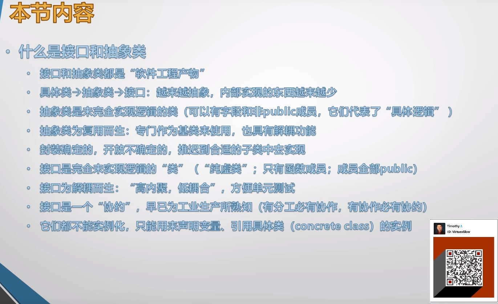

# 027 抽象类与开闭原则

接口和抽象类既是理论难点，又是代码难点。
接口和抽象类用得好，写出来的代码才好测试。

注：本节 PPT 的内容不是引导大纲，是总结 PPT。

# 引言

软件也是工业的分支，设计严谨的软件必须经得起测试。
软件能不能测试、测试出问题后好不好修复、软件整体运行状态好不好监控，都依赖于对接口和抽象类的使用。
接口和抽象类是现代面向对象的基石，也是高阶面向对象程序设计的起点。
学习设计模式的前提：

1. 透彻理解并熟练使用接口和抽象类
2. 深入理解 SOLID 设计原则，并在日常工作中自觉得使用它们
   要做到这两点，你必须在一个有质量文化的团队中，踏踏实实的写两三年代码。  
   建议尽快离开没有质量文化的组，在这些地方你即难学到好东西还会养成一身坏毛病。
   算法、设计原则、设计模式必须要用到工作中去，才能真正掌握。  
   还是那句话“学习编程的重点不是学是用”。

## SOLID

+ SRP：Single Responsibility Principle
+ OCP：Open Closed Principle
+ LSP：Liskov Substitution Principle
+ ISP：InterfaceSegregation Principle
+ DIP：Dependency Inversion Principle
  SOLID（单一功能、开闭原则、里氏替换、接口隔离以及依赖反转）是由罗伯特·C·马丁在21世纪早期引入的记忆术首字母缩略字，指代了面向对象编程和面向对象设计的五个基本原则。

|                          **首字母**                          | **指代**                                                     | **概念**                                                     |
| :----------------------------------------------------------: | ------------------------------------------------------------ | ------------------------------------------------------------ |
|                            **S**                             | [单一功能原则](https://zh.wikipedia.org/wiki/%E5%8D%95%E4%B8%80%E5%8A%9F%E8%83%BD%E5%8E%9F%E5%88%99) | 对象应该仅具有一种单一功能。                                 |
|                            **O**                             | [开闭原则](https://zh.wikipedia.org/wiki/%E5%BC%80%E9%97%AD%E5%8E%9F%E5%88%99) | 软件体应该是对于扩展开放的，但是对于修改封闭的。             |
|                            **L**                             | [里氏替换原则](https://zh.wikipedia.org/wiki/%E9%87%8C%E6%B0%8F%E6%9B%BF%E6%8D%A2%E5%8E%9F%E5%88%99) | 程序中的对象应该是可以在不改变程序正确性的前提下被它的子类所替换。<br/>参考 [契约式设计](https://zh.wikipedia.org/wiki/%E5%A5%91%E7%BA%A6%E5%BC%8F%E8%AE%BE%E8%AE%A1)。 |
|                            **I**                             | [接口隔离原则](https://zh.wikipedia.org/wiki/%E6%8E%A5%E5%8F%A3%E9%9A%94%E7%A6%BB%E5%8E%9F%E5%88%99) | 多个特定客户端接口要好于一个宽泛用途的接口。                 |
|                            **D**                             | [依赖反转原则](https://zh.wikipedia.org/wiki/%E4%BE%9D%E8%B5%96%E5%8F%8D%E8%BD%AC%E5%8E%9F%E5%88%99) | 一个方法应该遵从“依赖于抽象而不是一个实例”。[依赖注入](https://zh.wikipedia.org/wiki/%E4%BE%9D%E8%B5%96%E6%B3%A8%E5%85%A5)是该原则的一种实现方式。 |
| 关于 C# 设计原则的更多知识，<font style="color:#262626;background-color:#FFFFFF;">推荐《</font>[Agile Principles, Patterns, and Practices in C#](https://www.amazon.com/Agile-Principles-Patterns-Practices-C/dp/0131857258)<font style="color:#262626;background-color:#FFFFFF;">》。</font> |                                                              |                                                              |

## 为做基类而生的“抽象类”与“开闭原则”

抽象类和开闭原则有密切的联系。

设计原则的重要性和它在敏捷开发中扮演的重要角色：

1. 之前学了类的封装与继承，理论上爱怎么用怎么用，但要写出高质量、工程化的代码，就必须遵循一些规则
2. 写代码就必须和人合作，即使是你一个人写的独立软件，未来的你也会和现在的你合作
3. 这些规则就如同交通规则，是为了高效协作而诞生的
   1. 硬性规定：例如变量名合法，语法合法
   2. 软性规则

# 抽象类

一个类里面一旦有了 abstract 成员，类就变成了抽象类，就必须标 abstract。
抽象类内部至少有一个函数成员未完全实现。

```csharp
abstract class Student
{
    abstract public void Study();
}
```

abstract 成员即暂未实现的成员，因为它必须在子类中被实现，所以抽象类不能是 private 的。

因为抽象类内部还有未实现的函数成员，计算机不知道怎么调用这类成员，于是编译器干脆不允许你实例化抽象类。
一个类不允许实例化，它就只剩两个用处了：

1. 作为基类，在派生类里面实现基类中的 abstract 成员
2. 声明基类（抽象类）类型变量去引用子类（已实现基类中的 abstract 成员）类型的实例，这又称为多态

抽象方法的实现，看起来和 override 重写 virtual 方法有些类似，所以抽象方法在某些编程语言（如 C++）中又被称为“纯虚方法”。
virtual（虚方法）还是有方法体的，只不过是等着被子类重写，abstract（纯虚方法）却连方法体都没有。
PS：我们之前学的非抽象类又称为 Concrete Class。

# 开闭原则

如果不是为了修复 bug 和添加新功能，别总去修改类的代码，特别是类当中函数成员的代码。

我们应该封装那些不变的、稳定的、固定的和确定的成员，而把那些不确定的，有可能改变的成员声明为<font style="color:#E84C22;">抽象成员</font>，并且留给子类去实现。

开放修复 bug 和添加新功能，关闭对类的更改。

# 示例

示例演示如何添加交通工具类，通过版本的迭代来讲解开闭原则、抽象类和接口。

## **初始版本**

从 Car 直接 copy 代码到 Truck：

```csharp
class Car
{
    public void Run()
    {
        Console.WriteLine("Car is running...");
    }
    public void Stop()
    {
        Console.WriteLine("Stopped!");
    }
}
class Truck
{
    public void Run()
    {
        Console.WriteLine("Truck is running...");
    }
    public void Stop()
    {
        Console.WriteLine("Stopped!");
    }
}
```

这就已经违反了设计原则：不能 copy paste。

## **提取父类版**

将相同的方法提取出来放在父类里面：

```csharp
class Vehicle
{
    public void Stop()
    {
        Console.WriteLine("Stopped!");
    }
}
class Car : Vehicle
{
    public void Run()
    {
        Console.WriteLine("Car is running...");
    }
}
class Truck : Vehicle
{
    public void Run()
    {
        Console.WriteLine("Truck is running...");
    }
}
```

但这样会有一个问题就是 Vehicle 类型变量无法调用 Run 方法，有两种解决方法：

1. Vehicle 里面添加一个带参数的 Run 方法
2. 虚方法
   **添加带参数的 Run：**

```csharp
class Vehicle
{
    public void Stop()
    {
        Console.WriteLine("Stopped!");
    }
    public void Run(string type)
    {
        if (type == "car")
        {
            Console.WriteLine("Car is running...");
        }
        else if (type == "truck")
        {
            Console.WriteLine("Truck is running...");
        }
    }
}
```

这就违反了开闭原则，既没有修 bug 又没有添新功能就多了个 Run 方法。而且一旦以后再添加别的交通工具类，你就又得打开（Open） Vehicle 类，修改 Run 方法。
**虚方法：**

```csharp
class Program
{
    static void Main(string[] args)
    {
        Vehicle v = new Car();
        v.Run();
        // Car is running...
    }
}
class Vehicle
{
    public void Stop()
    {
        Console.WriteLine("Stopped!");
    }
    public virtual void Run()
    {
        Console.WriteLine("Vehicle is running...");
    }
}
class Car : Vehicle
{
    public override void Run()
    {
        Console.WriteLine("Car is running...");
    }
}
class Truck : Vehicle
{
    public override void Run()
    {
        Console.WriteLine("Truck is running...");
    }
}
```

虚方法解决了 Vehicle 类型变量调用子类 Run 方法的问题，也遗留下来一个问题：Vehicle 的 Run 方法的行为本身就很模糊，且在实际应用中也根本不会被调到。而且从测试的角度来看，测试一段你永远用不到的代码，也是不合理的。

## 抽象类版

要不就干脆 Run 方法里面什么都不写，进而直接把 Run 的方法体干掉，Run 就变成了一个抽象方法。于是 Vehicle 也变成了抽象类。

```csharp
abstract class Vehicle
{
    public void Stop()
    {
        Console.WriteLine("Stopped!");
    }
    public abstract void Run();
}
```

当 Vehicle 变成抽象类后，再添加新的继承于 Vehicle 的类就很简单了，也无需修改 Vehicle 的代码。

```csharp
abstract class Vehicle
{
    public void Stop()
    {
        Console.WriteLine("Stopped!");
    }
    public abstract void Run();
}
class Car : Vehicle
{
    public override void Run()
    {
        Console.WriteLine("Car is running...");
    }
}
...
class RaceCar : Vehicle
{
    public override void Run()
    {
        Console.WriteLine("Race car is running...");
    }
}
```

不光要掌握最后虚方法的用法，还有理解之前过程中的问题，<font style="background-color:transparent;">进而识别并改善工作中的代码。</font>

## 纯抽象类版（接口）

有没有一种可能，一个抽象类里面的所有方法都是抽象方法？
VehicleBase 是纯虚类，它将成员的实现向下推，推到 Vehicle。Vehicle 实现了 Stop 和 Fill 后将 Run 的实现继续向下推。

```csharp
// 特别抽象
abstract class VehicleBase
{
    public abstract void Stop();
    public abstract void Fill();
    public abstract void Run();
}
// 抽象
abstract class Vehicle:VehicleBase
{
    public override void Stop()
    {
        Console.WriteLine("Stopped!");
    }
    public override void Fill()
    {
        Console.WriteLine("Pay and fill...");
    }
}
// 具体
class Car : Vehicle
{
    public override void Run()
    {
        Console.WriteLine("Car is running...");
    }
}
```

在 C++ 中能看到这种纯虚类的写法，但在 C# 和 Java 中，纯虚类其实就是接口。

1. 因为 interface 要求其内部所有成员都是 public 的，所以就把 public 去掉了
2. 接口本身就包含了“是纯抽象类”的含义（所有成员一定是抽象的），所以 abstract 也去掉了
3. 因为 abstract 关键字去掉了，所以实现过程中的 override 关键字也去掉了

```csharp
interface VehicleBase
{
    void Stop();
    void Fill();
    void Run();
}
abstract class Vehicle : VehicleBase
{
    public void Stop()
    {
        Console.WriteLine("Stopped!");
    }
    public void Fill()
    {
        Console.WriteLine("Pay and fill...");
    }
    // Run 暂未实现，所以依然是 abstract 的
    public abstract void Run();
}
class Car : Vehicle
{
    public override void Run()
    {
        Console.WriteLine("Car is running...");
    }
}
```

纯虚类演变成了接口，现在的代码架构就有点像平时工作中用的了。
又因为接口在 C# 中的命名约定以 I 开头：

```csharp
interface IVehicle
{
    void Stop();
    void Fill();
    void Run();
}
```

# 总结

什么是接口和抽象类

+ 接口和抽象类都是“软件工程产物”
+ 具体类 -> 抽象类 -> 接口：越来越抽象，内部实现的东西越来越少
+ 抽象类是未完全实现逻辑的类（可以有字段和非 public 成员，它们代表了“具体逻辑”）
+ 抽象类为复用而生：专门作为基类来使用。也具有解耦功能
  - 解耦的具体内容留待下一节讲接口时讲
+ 封装确定的，开放不确定的（开闭原则），推迟到合适的子类中去实观
+ 接口是完全未实现逻辑的“类”（“纯虚类”；只有函数成员；成员全部 public）
+ 接口为解耦而生：“高内聚，低耦合”，方便单元测试
+ 接口是一个“协约”。早已为工业生产所熟知（有分工必有协作，有协作必有协约）
+ 它们都不能实例化。只能用来声明变量、引用具体类（concrete class）的实例
  对于一个方法来说，方法体就是它的实现；对于数据成员，如字段，它就是对类存储数据的实现。

> 更新: 2024-02-28 11:14:43  
> 原文: <https://www.yuque.com/yuejiangliu/dotnet/timothy-csharp-027>