> 原文地址：https://juejin.cn/post/7108295598054309919
>
> 视频地址：https://www.bilibili.com/video/BV1iY411w7zD

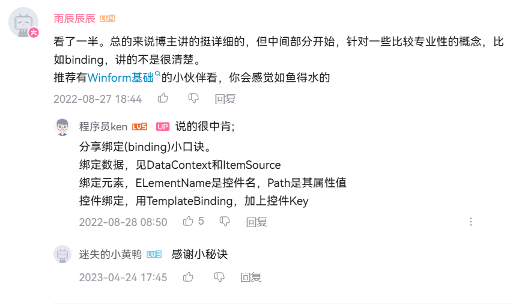

# 

### WPF的概述：

WPF 的核心是一个与分辨率无关且基于矢量的呈现引擎，旨在充分利用现代图形硬件。 WPF 通过一套完善的应用程序开发功能对该核心进行了扩展，这些功能包括可扩展应用程序标记语言 (XAML)、控件、数据绑定、布局、二维和三维图形、动画、样式、模板、文档、媒体、文本和版式。 WPF 属于 .NET，因此可以生成整合 .NET API 其他元素的应用程序。


## 简介：

Windows用户界面框架,统一的编程模型、语言和框架，做到了界面设计与后端开发分离。


## 特点：

1.呈现效果不受分辨率的影响
2.基于DirectX 3d技术，可以做出炫酷的界面
3.提供UI框架，集成了矢量图形、流动文字支持、3d视觉效果和控件模型框架、

4. UI与业务逻辑彻底分离，UI-XAML描述(底层wpf引擎是把元素解释成对应的对象)
5. xp server2003 到 window7及以后的操作系统版本 都可以支持

6.基于数据驱动，数据是核心


## 学习前提:

基础：首先我们需要先入门C# / VB

开发工具： Visual Studio 2019

（下载链接： [pan.baidu.com/s/1uMH8C2rg…](https://pan.baidu.com/s/1uMH8C2rg5T8pNXrObXddXw) 提取码: hatd ）

框架环境: .net core 3.1 或者.net framework4.0+


## 所有控件：

| System.Windows.Controls (程序集：PresentationFramework.dll)  |                                                              |                                                              |
| ------------------------------------------------------------ | ------------------------------------------------------------ | ------------------------------------------------------------ |
| 文档地址：[docs.microsoft.com/zh-cn/dotne…](https://docs.microsoft.com/zh-cn/dotnet/api/system.windows.controls?view=windowsdesktop-6.0&viewFallbackFrom=netcore-3.1) |                                                              |                                                              |
| [Label](https://docs.microsoft.com/zh-cn/dotnet/api/system.windows.controls.label?view=windowsdesktop-6.0) （表示控件的文本标签，并提供访问密钥支持。） | [TextBox](https://docs.microsoft.com/zh-cn/dotnet/api/system.windows.controls.textbox?view=windowsdesktop-6.0)(显示或编辑无格式文本) | [TextBlock](https://docs.microsoft.com/zh-cn/dotnet/api/system.windows.controls.textblock?view=windowsdesktop-6.0)(一个轻型控件，用于显示少量流内容) |
| [Border](https://docs.microsoft.com/zh-cn/dotnet/api/system.windows.controls.border?view=windowsdesktop-6.0) （边框控件 ，作用 在另一个元素四周绘制边框和/或背景） | [Button](https://docs.microsoft.com/zh-cn/dotnet/api/system.windows.controls.button?view=windowsdesktop-6.0)（按钮控件） | [Calendar](https://docs.microsoft.com/zh-cn/dotnet/api/system.windows.controls.calendar?view=windowsdesktop-6.0) （日历控件） |
| [CheckBox](https://docs.microsoft.com/zh-cn/dotnet/api/system.windows.controls.checkbox?view=windowsdesktop-6.0)（选择框） | [ComboBox](https://docs.microsoft.com/zh-cn/dotnet/api/system.windows.controls.combobox?view=windowsdesktop-6.0) （下拉框） | [Image](https://docs.microsoft.com/zh-cn/dotnet/api/system.windows.controls.image?view=windowsdesktop-6.0) (图片控件) |
| [Menu](https://docs.microsoft.com/zh-cn/dotnet/api/system.windows.controls.menu?view=windowsdesktop-6.0)（菜单） | [ContextMenu](https://docs.microsoft.com/zh-cn/dotnet/api/system.windows.controls.contextmenu?view=windowsdesktop-6.0)（内容菜单) | [RadioButton](https://docs.microsoft.com/zh-cn/dotnet/api/system.windows.controls.radiobutton?view=windowsdesktop-6.0)(表示可由用户选择但不能清除的按钮,代码能清除) |
| [DataGrid](https://docs.microsoft.com/zh-cn/dotnet/api/system.windows.controls.datagrid?view=windowsdesktop-6.0)（数据网格--Table） | [ListBox](https://docs.microsoft.com/zh-cn/dotnet/api/system.windows.controls.listbox?view=windowsdesktop-6.0)（包含可选项列表） | [ListView](https://docs.microsoft.com/zh-cn/dotnet/api/system.windows.controls.listview?view=windowsdesktop-6.0)（表示用于显示数据项列表的控件） |
| [DockPanel](https://docs.microsoft.com/zh-cn/dotnet/api/system.windows.controls.dockpanel?view=windowsdesktop-6.0)(定义一个区域，从中可以按相对位置水平或垂直排列各个子元素。)---码头;港区 | [Grid](https://docs.microsoft.com/zh-cn/dotnet/api/system.windows.controls.grid?view=windowsdesktop-6.0)(定义由列和行组成的灵活的网格区域。) | [GroupBox](https://docs.microsoft.com/zh-cn/dotnet/api/system.windows.controls.groupbox?view=windowsdesktop-6.0)(组控件--- 表示一个控件，该控件用于创建具有用户界面 (UI) 内容边框和标题的容器。) |
| [PrintDialog](https://docs.microsoft.com/zh-cn/dotnet/api/system.windows.controls.printdialog?view=windowsdesktop-6.0)（调用标准的 Microsoft Windows 打印对话框） | [ProgressBar](https://docs.microsoft.com/zh-cn/dotnet/api/system.windows.controls.progressbar?view=windowsdesktop-6.0)(指示操作进度) | [Canvas](https://docs.microsoft.com/zh-cn/dotnet/api/system.windows.controls.canvas?view=windowsdesktop-6.0) （画布控件） |
| [RichTextBox](https://docs.microsoft.com/zh-cn/dotnet/api/system.windows.controls.richtextbox?view=windowsdesktop-6.0)(表示对 FlowDocument 对象进行操作的丰富编辑控件) | [ToolBar](https://docs.microsoft.com/zh-cn/dotnet/api/system.windows.controls.toolbar?view=windowsdesktop-6.0)(一组命令或控件提供容器) | [Expander](https://docs.microsoft.com/zh-cn/dotnet/api/system.windows.controls.expander?view=windowsdesktop-6.0)（折叠控件） 表示一种控件，该控件显示具有可折叠内容显示窗口的标题。 |
| [TabControl](https://docs.microsoft.com/zh-cn/dotnet/api/system.windows.controls.tabcontrol?view=windowsdesktop-6.0)(表示包含多个项的控件，这些项共享屏幕上的同一空间) | [Frame](https://docs.microsoft.com/zh-cn/dotnet/api/system.windows.controls.frame?view=windowsdesktop-6.0)（一种支持导航的内容控件） | [Rectangle](https://docs.microsoft.com/zh-cn/dotnet/api/system.windows.shapes.rectangle?view=windowsdesktop-6.0)(矩形区域) |
| [StackPanel](https://docs.microsoft.com/zh-cn/dotnet/api/system.windows.controls.stackpanel?view=windowsdesktop-6.0)(将子元素排列成水平或垂直的一行。) | [WrapPanel](https://docs.microsoft.com/zh-cn/dotnet/api/system.windows.controls.wrappanel?view=windowsdesktop-6.0) (按从左到右的顺序位置定位子元素，在包含框的边缘处将内容切换到下一行。) |                                                              |


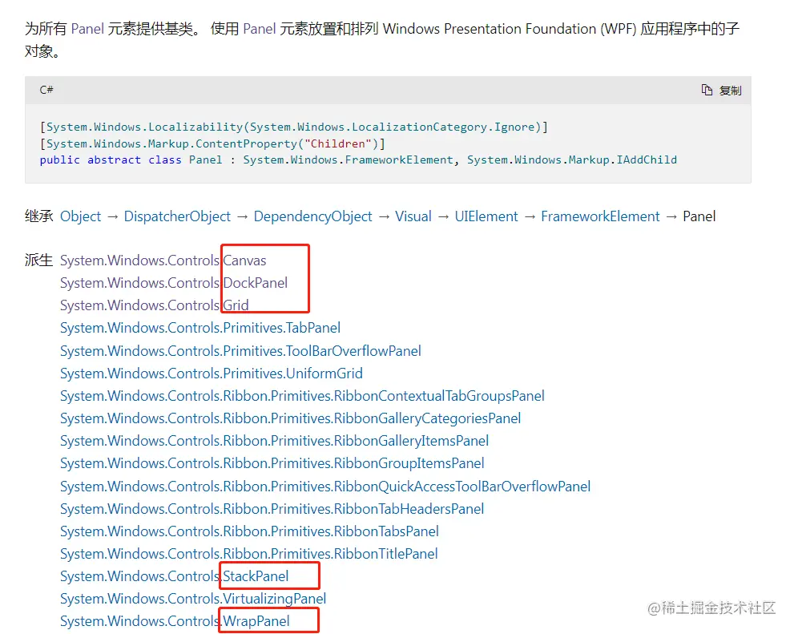


# 什么是 XAML

XAML 是一种声明性标记语言。 应用于 .NET Core 编程模型时，XAML 简化了为 .NET Core 应用创建 UI 的过程。 XAML 文件是通常具有 .xaml 扩展名的 XML 文件。 可通过任何 XML 编码对文件进行编码，但通常以 UTF-8 编码。

```csharp
<StackPanel>
    <Button Content="Click Me"/>
</StackPanel>
```


## 对象元素语法

*对象元素语法* 是 XAML 标记语法，它通过声明 XML 元素来实例化 CLR 类或结构。 此语法类似于其他标记语言（如 HTML）的元素语法。

- 单标签格式。 。
- 双标签格式。 【可嵌入其他的标签】

## XAML 根元素

一个 XAML 文件只能有一个根元素，这样才能同时作为格式正确的 XML 文件和有效的 XAML 文件。 对于典型 WPF 方案，可使用在 WPF 应用模型中具有突出意义的根元素（例如，页面的 [Window](https://docs.microsoft.com/zh-cn/dotnet/api/system.windows.window) 或 [Page](https://docs.microsoft.com/zh-cn/dotnet/api/system.windows.controls.page)）。

在根标签下面有且只能有一个二级标签。在二级标签里面我们可以写多个三级 四级标签。

```xml
<Window>

<【布局标签】>
  【其他标签....】
</【布局标签】>

</Window>
<Page>
    <Window.Resources>
      ....
    </Window.Resources>
  
<【布局标签】>
  【其他标签....】
</【布局标签】>

</Page>
```


## WPF 和 XAML 命名空间声明

在许多 XAML 文件的根标记中的命名空间声明内，通常可看到两个 XML 命名空间声明。 第一个声明默认映射整个 WPF 客户端/框架 XAML 命名空间：
xmlns="[schemas.microsoft.com/winfx/2006/…](http://schemas.microsoft.com/winfx/2006/xaml/presentation)"

第二个声明映射单独的 XAML 命名空间，（通常）将其映射到 x: 前缀。
xmlns:x="[schemas.microsoft.com/winfx/2006/…](http://schemas.microsoft.com/winfx/2006/xaml)"
这些声明之间的关系是 x: 前缀映射支持作为 xaml 语言定义一部分的内部函数，而 WPF 是一种将 xaml 用作语言的实现，并为 xaml 定义了其对象的词汇。

```xml
<Window x:Class="MyWpfApp.MainWindow"
        xmlns="http://schemas.microsoft.com/winfx/2006/xaml/presentation"
        xmlns:x="http://schemas.microsoft.com/winfx/2006/xaml"
        xmlns:d="http://schemas.microsoft.com/expression/blend/2008"
        xmlns:mc="http://schemas.openxmlformats.org/markup-compatibility/2006"
        xmlns:local="clr-namespace:MyWpfApp"
        mc:Ignorable="d"
        Title="MainWindow" Height="450" Width="800"
        >
//d  表达式
//mc 标记兼容性   

    <【布局标签】 >
  
    </【布局标签】>
 

</Window>
```

**(CLR指的是公共语言运行库）**


# 课程目标


## 前六章的课程目标：

实现一个可移动的方块盒子:
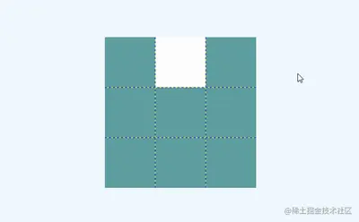

`newfbin.Wpf.移动方块.WindowMoveBox.xaml`

```xml
<Window x:Class="Ken.Wpf.移动方块.WindowMoveBox"
        xmlns="http://schemas.microsoft.com/winfx/2006/xaml/presentation"
        xmlns:x="http://schemas.microsoft.com/winfx/2006/xaml"
        xmlns:d="http://schemas.microsoft.com/expression/blend/2008"
        xmlns:mc="http://schemas.openxmlformats.org/markup-compatibility/2006"
        xmlns:local="clr-namespace:Ken.Wpf.移动方块"
        mc:Ignorable="d"
        Title="WindowMoveBox" Height="450" Width="800" KeyDown="Grid_KeyDown">
    <Grid ShowGridLines="True" Background="Teal" Name="gridContent">

        <!--
        使用Grid.ColumnDefinitions将grid 分成三列
        -->
        <Grid.ColumnDefinitions>
            <ColumnDefinition></ColumnDefinition>
            <ColumnDefinition></ColumnDefinition>
            <ColumnDefinition></ColumnDefinition>
        </Grid.ColumnDefinitions>

        <!--
        使用Grid.RowDefinitions将grid 分成三行
        -->
        <Grid.RowDefinitions>
            <RowDefinition></RowDefinition>
            <RowDefinition></RowDefinition>
            <RowDefinition></RowDefinition>
        </Grid.RowDefinitions>

        <Border Name="b1"  Background="Transparent" Grid.Row="0" Grid.Column="0"></Border>
        <Border Name="b2" Background="White" Grid.Row="0" Grid.Column="1"></Border>
        <Border Name="b3"  Background="Transparent" Grid.Row="0" Grid.Column="2"></Border>


        <Border Name="b4"  Background="Transparent" Grid.Row="1" Grid.Column="0"></Border>
        <Border Name="b5" Background="Transparent" Grid.Row="1" Grid.Column="1"></Border>
        <Border Name="b6"  Background="Transparent" Grid.Row="1" Grid.Column="2"></Border>


        <Border Name="b7"  Background="Transparent" Grid.Row="2" Grid.Column="0"></Border>
        <Border Name="b8" Background="Transparent" Grid.Row="2" Grid.Column="1"></Border>
        <Border Name="b9" Background="Transparent" Grid.Row="2" Grid.Column="2"></Border>
    </Grid>
</Window>
```
`newfbin.Wpf.移动方块.WindowMoveBox.xaml.cs`

```csharp
using System;
using System.Collections.Generic;
using System.Linq;
using System.Text;
using System.Threading.Tasks;
using System.Windows;
using System.Windows.Controls;
using System.Windows.Data;
using System.Windows.Documents;
using System.Windows.Input;
using System.Windows.Media;
using System.Windows.Media.Imaging;
using System.Windows.Shapes;

namespace newfbin.Wpf.移动方块
{
    /// <summary>
    /// WindowMoveBox.xaml 的交互逻辑
    /// </summary>
    public partial class WindowMoveBox : Window
    {
        public WindowMoveBox()
        {
            InitializeComponent();
        }

        private void Grid_KeyDown(object sender, KeyEventArgs e)
        {
            //首先判断按键的方位 比如上下左右

            //向上移动 移到格子每次减3  向下移动  移到格子每次加3
            //向左移动  每次减1  向右移动 每次加1

            //获取白色的border元素

            UIElementCollection children = gridContent.Children;

            Border curBorder = null;
            for (int i = 0; i < children.Count; i++)
            {

                if (children[i] is Border)
                {
                    if (((children[i] as Border).Background as SolidColorBrush).Color.Equals(Colors.White))
                    {
                        curBorder = children[i] as Border;
                    }
                    (children[i] as Border).Background = new SolidColorBrush(Colors.Transparent);
                }
            }

            string name = curBorder.Name;
            int index = Convert.ToInt32(name.Replace("b", ""));

            if (e.Key.Equals(Key.Up))//上
            {
                index = index - 3 >= 1 ? index - 3 : index;
            }
            else if (e.Key.Equals(Key.Down))//下
            {
                index = index + 3 <= 9 ? index + 3 : index;
            }
            else if (e.Key.Equals(Key.Left))//左
            {
                index = index - 1 >= 1 ? index - 1 : index;
            }
            else if (e.Key.Equals(Key.Right))//右
            {
                index = index + 1 <= 9 ? index + 1 : index;
            }

            object control = gridContent.FindName("b" + index);

            if (control != null)
            {
                (control as Border).Background = new SolidColorBrush(Colors.White);
            }
        }

    }
}

```


## 【后期】展示列表、新增/编辑页面（涉及到数据库）


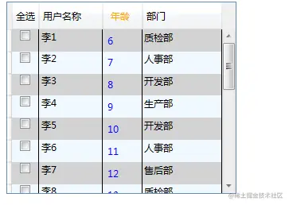


## 【后期】模仿界面


# 控件篇：


## 继承关系

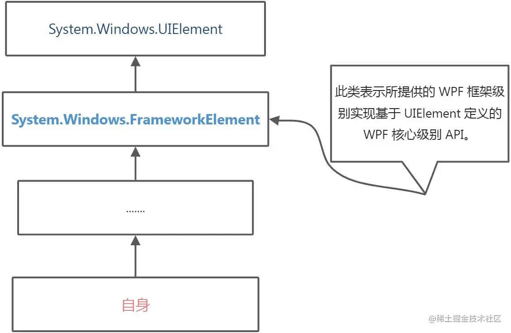

| 对象：[System.Windows](https://docs.microsoft.com/zh-cn/dotnet/api/system.windows?view=windowsdesktop-6.0).[FrameworkElement](https://docs.microsoft.com/zh-cn/dotnet/api/system.windows.frameworkelement?view=windowsdesktop-6.0) |                                                              |                                                              |
| ------------------------------------------------------------ | ------------------------------------------------------------ | ------------------------------------------------------------ |
| **属性**                                                     |                                                              |                                                              |
| 属性名                                                       | 对象类型                                                     | 作用                                                         |
| Width                                                        | double                                                       | 获取或设置元素的宽度。【(元素的高度（以 与设备无关的单位（每个单位 1/96 英寸） 为单位）。 )】 |
| Height                                                       | double                                                       | 获取或设置元素的高度。【元素的高度（以 与设备无关的单位（每个单位 1/96 英寸） 为单位）。 】 |
| ActualWidth                                                  | double                                                       | 获取此元素的呈现的宽度。                                     |
| ActualHeight                                                 | double                                                       | 获取此元素的呈现的高度。                                     |
| Name                                                         | string                                                       | 获取或设置元素的标识名称。 该名称提供引用，以便代码隐藏（如事件处理程序代码）可以引用标记元素（在 XAML 处理器的处理过程中构造该元素之后）。 |
| Style                                                        | Style                                                        | 获取或设置此元素呈现时所使用的样式。                         |
| Margin                                                       | Thickness                                                    | 获取或设置元素的外边距。                                     |
| HorizontalAlignment                                          | HorizontalAlignment                                          | 获取或设置在父元素(如 Panel 或项控件)中组合此元素时所应用的水平对齐特征。【水平对齐设置，它是一个枚举值。】 |
| VerticalAlignment                                            | VerticalAlignment                                            | 获取或设置在父元素（如面板或项控件）中组合此元素时所应用的垂直对齐特征。 |
| FocusVisualStyle                                             | Style                                                        | 获取或设置一个属性，该属性允许自定义此元素在捕获到键盘焦点时要应用于此元素的外观、效果或其他样式特征。 |
| FlowDirection                                                | FlowDirection                                                | 获取或设置方向，文本和其他 用户界面 (UI) 元素在任何控制其布局的父元素中都按此方向流动。 |
| DataContext                                                  | object                                                       | 获取或设置元素参与数据绑定时的数据上下文。                   |
| Resources                                                    | [ResourceDictionary](https://docs.microsoft.com/zh-cn/dotnet/api/system.windows.frameworkelement.resources?view=windowsdesktop-6.0#system-windows-frameworkelement-resources) | 获取或设置本地定义的资源字典。                               |
| **方法**                                                     |                                                              |                                                              |
| 方法名                                                       | 参数                                                         | 作用                                                         |
| BringIntoView                                                |                                                              | 尝试将此元素放入视图，它包含在任何可滚动区域内。             |
| BringIntoView(Rect targetRectangle)                          | 指定也放入视图的元素的大小。(targetRectangle)                | 尝试将放入视图，它包含在任何可滚动区域内的此元素提供的区域大小。 |
| FindName(string name)                                        | 所请求元素的名称（name）                                     | 查找具有提供的标识符名的元素。                               |
| FindResource(object resourceKey)                             | 所请求的资源键标识符（resourceKey）                          | 搜索具有指定键的资源并在引发异常，如果找不到所请求的资源。   |
| **事件**                                                     |                                                              |                                                              |
| 事件名称                                                     |                                                              | 作用                                                         |
| Loaded                                                       |                                                              | 当对元素进行布局、呈现，且可将其用于交互时发生。             |
| KeyDown                                                      |                                                              | 当焦点在该元素上时按下某个键后发生。                         |
| GotFocus                                                     |                                                              | 在此元素获得逻辑焦点时发生                                   |
| MouseDown                                                    |                                                              | 在指针位于此元素上并且按下任意鼠标按钮时发生。               |
| MouseMove                                                    |                                                              | 在鼠标指针位于此元素上并且移动鼠标指针时发生。               |
| Click                                                        |                                                              | 控件的点击事件                                               |


------


## 控件分类

> 内容控件、文本控件、条目控件、布局控件、其它控件

| **内容控件** **（System.Windows.Controls.ContentControl）** |      |                                                              |
| ----------------------------------------------------------- | ---- | ------------------------------------------------------------ |
| System.Windows.Controls.Label                               |      |                                                              |
| System.Windows.Controls.TextBlock                           |      | 继承自[FrameworkElement](https://docs.microsoft.com/zh-cn/dotnet/api/system.windows.frameworkelement?view=windowsdesktop-6.0)类 |
| System.Windows.Controls.Button                              |      |                                                              |
| System.Windows.Controls.Border                              |      | 继承自[Decorator](https://docs.microsoft.com/zh-cn/dotnet/api/system.windows.controls.decorator?view=windowsdesktop-6.0)类 |
| System.Windows.Controls.RadioButton                         |      |                                                              |
| System.Windows.Controls.CheckBox                            |      |                                                              |
| System.Windows.Controls.ToolTip                             |      |                                                              |
| System.Windows.Controls.GroupBox                            |      |                                                              |
| System.Windows.Controls.Expander                            |      |                                                              |
| System.Windows.Controls.Frame                               |      |                                                              |


------

| **文本控件** **（System.Windows.Controls.TextBoxBase）** |      |      |
| -------------------------------------------------------- | ---- | ---- |
| System.Windows.Controls.TextBox                          |      |      |
| System.Windows.Controls.RichTextBox                      |      |      |


------

| **条目控件** **(System.Windows.Controls.ItemsControl)** |      |      |
| ------------------------------------------------------- | ---- | ---- |
| System.Windows.Controls.ComboBox                        |      |      |
| System.Windows.Controls.Menu                            |      |      |
| System.Windows.Controls.ContextMenu                     |      |      |
| System.Windows.Controls.TabControl                      |      |      |
| System.Windows.Controls.ToolBar                         |      |      |
| System.Windows.Controls.ToolBarTray                     |      |      |
| System.Windows.Controls.ListBox                         |      |      |
| System.Windows.Controls.DataGrid                        |      |      |
| System.Windows.Controls.TreeView                        |      |      |


------

| **布局控件** **(System.Windows.Controls.Panel)** |      |      |
| ------------------------------------------------ | ---- | ---- |
| System.Windows.Controls.Grid                     |      |      |
| System.Windows.Controls.StackPanel               |      |      |
| System.Windows.Controls.DockPanel                |      |      |
| System.Windows.Controls.WrapPanel                |      |      |
| System.Windows.Controls.Canvas                   |      |      |


------

| **其他控件**                        |      |      |
| ----------------------------------- | ---- | ---- |
| System.Windows.Controls.Calendar    |      |      |
| System.Windows.Controls.Image       |      |      |
| System.Windows.Controls.ProgressBar |      |      |
| System.Windows.Shapes.Rectangle     |      |      |


------


## 代码区域


### 公共工具类

```csharp
using Ken.Wpf.Entity;
using System;
using System.Collections.Generic;
using System.Text;
using System.Windows.Media;

namespace Ken.Wpf.Utils
{
    public class MenuHelper
    {

        public static List<MenuInfo> CreateMenus()
        {
            List<MenuInfo> menus = new List<MenuInfo>();

            MenuInfo m1 = new MenuInfo("出入库管理",null);
            MenuInfo m2 = new MenuInfo("请假管理", null);
            MenuInfo m3 = new MenuInfo("考勤管理",null);

            MenuInfo m3_1 = new MenuInfo("日报管理", m3);
            MenuInfo m3_2 = new MenuInfo("请假管理", m3);

            MenuInfo m4 = new MenuInfo("商品管理",null);
            MenuInfo m4_1 = new MenuInfo("单位管理", m4);
            MenuInfo m4_2 = new MenuInfo("类别管理", m4);

            menus.Add(m1);
            menus.Add(m2);
            menus.Add(m3);
            menus.Add(m4);
            return menus;
        }
    }
}
```


### 自定义启动窗口

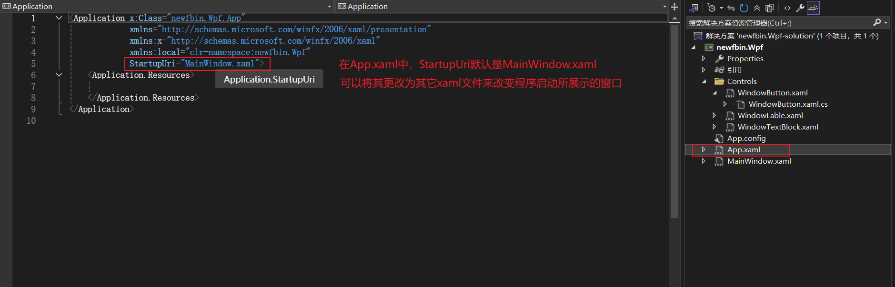

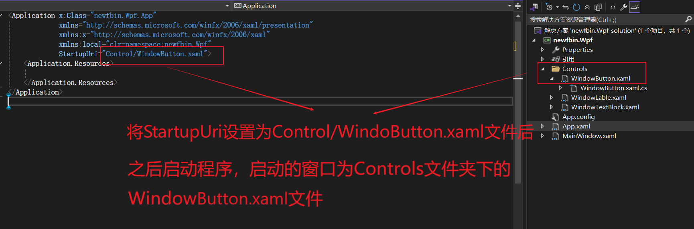

### Label的演示代码

```xml
    <!--
            宽度为width
            高度为height
            内容为content
            水平方向排列设置 需要用到HorizontalAlignment
            垂直方向排列设置 需要用到VerticalAlignment
            外边距 使用Margin 四个数字 对应方向分别为 左上右下,一个数字 代表所有方向的外边距 
            两个数字 分别代表 左右  上下

            FontSize 字体大小、Foregrount 字体颜色
        -->
        <Label  Width="180" Height="30" Content="我是个label控件" 
                HorizontalAlignment="Right" 
                VerticalAlignment="Top" Margin="0,10" FontSize="18" Foreground="Blue"/>
```


### TextBlock的演示代码

```xml
        <!--
            1.TextBlock 设置的text内容 如果标签里面有文本内容 会将其加到text内容后面
            2.如果想进行换行操作 可以在Textblock双标签里面 加上LineBreak标签
            在之后的内容就会换行
        -->
        <TextBlock  Text="我是个TextBlock33" FontSize="30" FontWeight="Light" Foreground="Red">
            我是文本一<LineBreak/>
            我是文本二<LineBreak/>
            我是文本三
        </TextBlock>
        
```


### Button的演示代码

WindowButton.xaml

```xml
<Button Width="100" Height="30" HorizontalAlignment="Left" VerticalAlignment="Top"
        Content="我是个按钮" Margin="20,20,0,0" Background="Teal"
        BorderThickness="5,0,10,0" BorderBrush="Transparent" Foreground="White"
        Click="Button_Click_1"  MouseMove="Button_MouseMove"
          >
</Button>
```

WindowButton.xaml.cs

```csharp
private void Button_Click_1(object sender, RoutedEventArgs e)
{
    MessageBox.Show("按钮被点击了");
}

private void Button_MouseMove(object sender, MouseEventArgs e)
{
    MessageBox.Show("鼠标移动到这个按钮上");
}
```

鼠标放到事件的名称上，按F12进入事件的定义

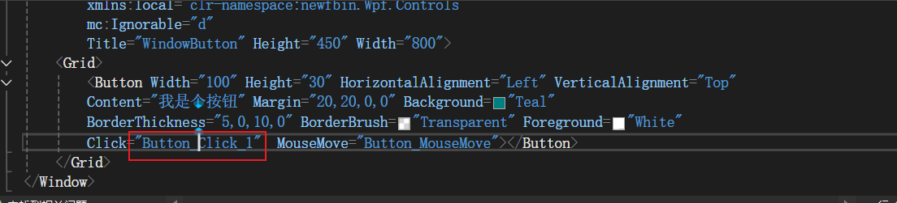

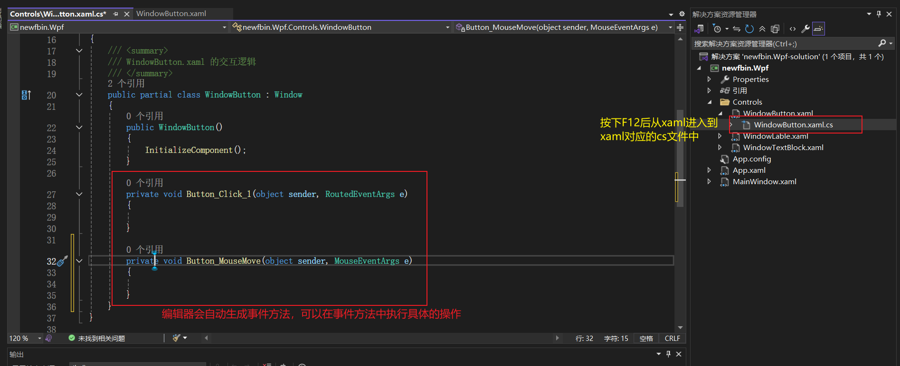

### Border的演示效果


```xml
 <!--
            BorderThickness边框宽度默认为0 直接设置一个参数 代表的是四周宽度
             BorderThickness 有四个参数时 分别代表左边 上边 右边 下边
            我们设置边框颜色加上边框宽度 才能准确显示边框的效果
            如果我们需要设置角的弧度 需要使用CornerRadius属性

            一个Border标签只能包裹一个标签
            如果想用Border包裹多个标签，需要用Border标签包裹住Grid标签，再用Grid标签包裹其它多个标签
            （准确的说，如果想用Border包裹多个标签，需要用Border标签包裹住Panel标签，再用Panel标签包裹其它多个标签，由于               Grid标签继承了Panel标签，所以可以用Grid标签包裹其他标签）
        -->
        <Border Width="200" Height="80" Background="LightBlue"
            BorderBrush="Red"  BorderThickness="1,1,2,1" CornerRadius="15">

            <!--<Label HorizontalAlignment="Center" VerticalAlignment="Center"
                   FontSize="20" Foreground="White">我是label1</Label>-->

            <Button Background="Transparent" FontSize="20" Foreground="White"
                    Content="我是个按钮" Click="Button_Click" BorderBrush="Transparent">
            </Button>
            
            <!--<Grid>
                <Label 
                   FontSize="20" Foreground="White">我是label1</Label>
                <Label HorizontalAlignment="Center" VerticalAlignment="Center"
                   FontSize="20" Foreground="White">我是label2</Label>
            </Grid>-->
            
        </Border>
```

### RadioButton的演示效果

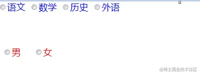

```xml
<!--
            radioButton 如果需要实现分组的效果 
            1. 使用布局容器来嵌套 （如grid /stackPanel等等）
            2. 可以使用groupName进行区分 分组
        -->
        <RadioButton Content="男" GroupName="sex"  Margin="10,100"  FontSize="20" Foreground="red" VerticalAlignment="Top" HorizontalAlignment="Left" ></RadioButton>
        <RadioButton Content="女" GroupName="sex" Margin="80,100"  FontSize="20" Foreground="red" VerticalAlignment="Top" HorizontalAlignment="Left" ></RadioButton>


        <RadioButton Content="语文" GroupName="course" FontSize="20" Foreground="Blue" VerticalAlignment="Top" HorizontalAlignment="Left" ></RadioButton>
        <RadioButton Content="数学"  GroupName="course" Margin="70,0" FontSize="20" Foreground="Blue" VerticalAlignment="Top" HorizontalAlignment="Left" ></RadioButton>
        <RadioButton Content="历史"  GroupName="course" Margin="140,0"  FontSize="20" Foreground="Blue" VerticalAlignment="Top" HorizontalAlignment="Left" ></RadioButton>
        <RadioButton Content="外语"  GroupName="course" Margin="210,0"  FontSize="20" Foreground="Blue" VerticalAlignment="Top" HorizontalAlignment="Left" ></RadioButton>
```

### CheckBox演示效果

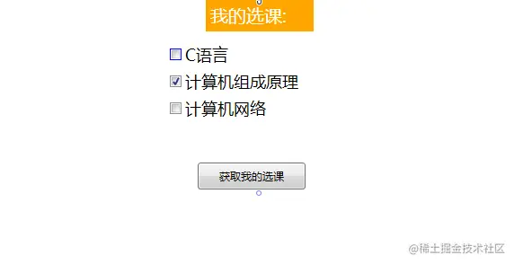

WindowCheckBox.xaml

```xml
<Grid Name="gridMain">

        <Label VerticalAlignment="Top" Width="120" FontSize="20" Background="Orange" Foreground="White">我的选课:</Label>

        <CheckBox Content="C语言" Margin="300,50" VerticalAlignment="Top" 
                  HorizontalAlignment="Left" Width="120" Height="30" FontSize="18" BorderBrush="blue"></CheckBox>
        
        <CheckBox Content="计算机组成原理" Margin="300,80" VerticalAlignment="Top" 
                  HorizontalAlignment="Left" Width="150" Height="30" FontSize="18" IsChecked="True"></CheckBox>

        <CheckBox Content="计算机网络" Margin="300,110" VerticalAlignment="Top" 
                  HorizontalAlignment="Left" Width="120" Height="30" FontSize="18"></CheckBox>
        
        <Button Content="获取我的选课" 
                Width="120" Height="30" Click="Button_Click"
                HorizontalAlignment="Left" Margin="331,182,0,0" VerticalAlignment="Top"/>

    </Grid>
```

WindowCheckBox.xaml.cs

```csharp
private void Button_Click(object sender, RoutedEventArgs e)
{
    UIElementCollection children = gridMain.Children;
    StringBuilder sbf = new StringBuilder("我的选课为:");
    foreach (UIElement item in children)
    {
        //item as CheckBox).IsChecked.Value 解释：
        //IsChecked 是 CheckBox 的一个 可空布尔类型（bool?） 属性，表示复选框的状态，有true（选中）、false（未选中）、null（不确定状态，通常用于三态复选框）三种状态
        //由于 IsChecked 是 bool?（可空布尔），不能直接当作 bool 使用。
        //Value 属性将 bool? 转换为 bool，但前提是 IsChecked 不是 null，否则会抛出 InvalidOperationException。
        if(item is CheckBox && (item as CheckBox).IsChecked.Value)
        {
            sbf.Append((item as CheckBox).Content+",");
        }
    }
    MessageBox.Show(sbf.ToString());
 }
```


### ToolTip的演示代码

```xml
   <!--
            1.只要控件继承了FrameworkElement 都有ToolTip属性
            2. 如果ToolTip标签单独使用 需要嵌入元素的ToolTip属性内
        -->
        <Label HorizontalAlignment="Left" FontSize="20">我是个label
            <Label.ToolTip>
                <!-- 这里对应了上面注释中的的第二点：ToolTip标签单独使用 需要嵌入元素的ToolTip属性内 -->
                <ToolTip >
                    <!-- 如果要在ToolTip中添加多个标签，需要在这多个标签外包裹一个布局空间
 					这里包裹的布局空间是 Grid，其它布局控件也是可以的-->
                    <Grid>
                        <TextBlock>1000000001.</TextBlock>
                        <TextBlock>1000000002.</TextBlock>
                        <TextBlock>1000000003.</TextBlock>
                    </Grid>
                </ToolTip>
            </Label.ToolTip>
        </Label>

        <Button Width="180" Height="50" HorizontalAlignment="Left" FontSize="20" Margin="200,10">我是个button
            <Button.ToolTip>
                <TextBlock>Useful information goes here.</TextBlock>
            </Button.ToolTip>
        </Button>
```


### GroupBox的演示代码

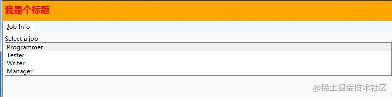

```xml
<Window x:Class="Ken.Wpf.Controls.WindowGroupBox"
        xmlns="http://schemas.microsoft.com/winfx/2006/xaml/presentation"
        xmlns:x="http://schemas.microsoft.com/winfx/2006/xaml"
        xmlns:d="http://schemas.microsoft.com/expression/blend/2008"
        xmlns:mc="http://schemas.openxmlformats.org/markup-compatibility/2006"
        xmlns:local="clr-namespace:Ken.Wpf.Controls"
        mc:Ignorable="d"
        Title="WindowGroupBox" Height="450" Width="800">

    <Window.Resources>
        <ControlTemplate x:Key="myGroupBox" TargetType="GroupBox">
            <Grid>
                <Grid.RowDefinitions>
                    <RowDefinition Height="40"></RowDefinition>
                    <RowDefinition Height="*"></RowDefinition>
                </Grid.RowDefinitions>

                <Border Grid.Row="0" Background="Orange">
                    <Label Foreground="Red" FontWeight="Bold" FontSize="18">
                        我是个标题
                    </Label>
                </Border>

                <Border Grid.Row="1" Background="AliceBlue">
                    <StackPanel>
                        <TabControl Name="myTabControl" 
     TabStripPlacement="Top" 
         Margin="0, 0, 0, 10" Height="350"
     >
                            <TabItem>
                                <TabItem.Header>_Job Info</TabItem.Header>
                                <StackPanel>
                                    <TextBlock>Select a job</TextBlock>
                                    <ListBox Name ="job" >
                                        <ListBoxItem IsSelected="true">Programmer</ListBoxItem>
                                        <ListBoxItem>Tester</ListBoxItem>
                                        <ListBoxItem>Writer</ListBoxItem>
                                        <ListBoxItem>Manager</ListBoxItem>
                                    </ListBox>
                                </StackPanel>
                            </TabItem>
                        </TabControl>
                    </StackPanel>
                </Border>
            </Grid>
        </ControlTemplate>
    </Window.Resources>
    
    
    <Grid>

        <Grid.RowDefinitions>
            <RowDefinition Height="*"></RowDefinition>
            <RowDefinition Height="*"> </RowDefinition>
        </Grid.RowDefinitions>
        
        <!--
            1.需要注意Header属性的使用
            2.groupbox的内容可以自由组合
            3.我们使用自定义模板==》我们是在Window.Resources里面使用ControlTemplate 需要指定key 需要指定作用模板
            
        -->
        <GroupBox Template="{StaticResource myGroupBox}" Grid.Row="0">
        </GroupBox>

        <GroupBox Template="{StaticResource myGroupBox}" Grid.Row="1">
        </GroupBox>

        <!--<GroupBox Header="GroupBox"/>-->

        <!--<GroupBox >
            <GroupBox.Header>
                <Label Foreground="blue">这个是groupbox的标题</Label>
            </GroupBox.Header>
            <StackPanel>
                <TabControl Name="myTabControl" 
     TabStripPlacement="Top" 
         Margin="0, 0, 0, 10" Height="350"
     >
                    <TabItem Name="PersonalInfo">
                        <TabItem.Header>_Personal Info</TabItem.Header>
                        <StackPanel>
                            <TextBlock>Employee</TextBlock>
                            <TextBlock>Select your name</TextBlock>
                            <ListBox Name="empName" >
                                <ListBoxItem IsSelected="true">Esther</ListBoxItem>
                                <ListBoxItem>George</ListBoxItem>
                                <ListBoxItem>Alan</ListBoxItem>
                                <ListBoxItem>Eric</ListBoxItem>
                            </ListBox>
                        </StackPanel>
                    </TabItem>
                    <TabItem>
                        <TabItem.Header>_Job Info</TabItem.Header>
                        <StackPanel>
                            <TextBlock>Select a job</TextBlock>
                            <ListBox Name ="job" >
                                <ListBoxItem IsSelected="true">Programmer</ListBoxItem>
                                <ListBoxItem>Tester</ListBoxItem>
                                <ListBoxItem>Writer</ListBoxItem>
                                <ListBoxItem>Manager</ListBoxItem>
                            </ListBox>
                        </StackPanel>
                    </TabItem>
                    <TabItem Name="Skill">
                        <TabItem.Header>_Skill</TabItem.Header>
                        <StackPanel>
                            <TextBlock>
                Select your strongest skill
                            </TextBlock>
                            <ListBox Name="skills" >
                                <ListBoxItem IsSelected="true">C#</ListBoxItem>
                                <ListBoxItem>Visual Basic</ListBoxItem>
                                <ListBoxItem>.NET</ListBoxItem>
                                <ListBoxItem>JScript</ListBoxItem>
                            </ListBox>
                        </StackPanel>
                    </TabItem>
                    <TabItem Name="Summary" >
                        <TabItem.Header>Su_mmary</TabItem.Header>
                        <StackPanel>
                            <TextBlock Name="emp"/>
                            <TextBlock Name="ejob"/>
                            <TextBlock Name="eskill"/>
                        </StackPanel>
                    </TabItem>
                </TabControl>
                <Button Content="Show Summary" />
            </StackPanel>
        </GroupBox>-->
        
    </Grid>
</Window>
```


### Expander的演示代码

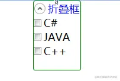

```xml
<!--
 1.如果内容需要跟Expander宽高保持一致 我们需要设置水平和垂直方向的排列 需要设置为非拉伸的状态

 2.若要使控件Expander正常工作，
 ExpandDirection设置为Down或Up时，我们不能设置它的高度。（否则当框收缩展开时，Expander标签大小都不会改变）
 ExpandDirection设置为Left或Right时，我们不能设置它的宽度。

3.HorizontalAlignment 和 VerticalAlignment 这两个属性默认为拉伸（Stretch）状态，即水平方向和垂直方向都会拉到最大
这两个属性为Stretch时，框展开折叠都不会影响 Expander 标签的大小
将这两个属性改为Stretch外的任意属性都能让 Expander 标签的大小随搜索框展开折叠变化
-->

<Expander Header="折叠框" FontSize="18" Foreground="Blue" IsExpanded="True" 
          BorderThickness="1" BorderBrush="Green"  ExpandDirection="Down" 
         VerticalAlignment="Top" HorizontalAlignment="Center" Height="100">
    <StackPanel Orientation="Vertical">
        <CheckBox FontSize="18">C#</CheckBox>
        <CheckBox FontSize="18">JAVA</CheckBox>
        <CheckBox FontSize="18">C++</CheckBox>
    </StackPanel>
</Expander>
```


### Frame的演示代码

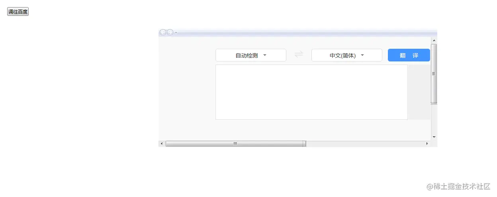

```xml
        <Button Click="Button_Click" Content="跳往哔哩哔哩" HorizontalAlignment="Left" Margin="230,27,0,0" VerticalAlignment="Top"/>

        <Frame Name="myFrame" Source="https://fanyi.baidu.com/"
               VerticalAlignment="Top" HorizontalAlignment="Center"
               Width="700" Height="300" Margin="30,80" NavigationUIVisibility="Visible" LoadCompleted="myFrame_LoadCompleted"></Frame>
```
```csharp
private void Button_Click(object sender, RoutedEventArgs e)
{
    //1.使用source
    //this.myFrame.Source = new Uri("https://www.bilibili.com/", UriKind.Absolute);
    
    //2.使用Navigate跳转
    //使用 对象
    //MyPage my = new MyPage();
    //this.myFrame.Navigate(my);
    //使用uri
    //this.myFrame.Navigate(new Uri("https://www.bilibili.com/", UriKind.Absolute));
    
    //3.使用Navigate跳转 携带参数
    MyPage my = new MyPage();
    this.myFrame.Navigate(my,"我是个参数");
}

private void myFrame_LoadCompleted(object sender, System.Windows.Navigation.NavigationEventArgs e)
{
    object extraData = e.ExtraData;
    Console.WriteLine(extraData);
 }
```


### TextBox的演示代码

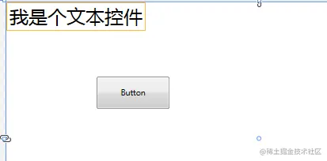

```xml
<TextBox Name="myTextBox"  FontSize="30" VerticalAlignment="Top" 
                 HorizontalAlignment="Left" BorderBrush="Orange" SelectionBrush="Teal">
           我是个文本控件
</TextBox>
<Button Content="Button" HorizontalAlignment="Left" Margin="142,118,0,0" VerticalAlignment="Top" Height="51" Width="116" Click="Button_Click"/>
```


### RichTextBox的演示代码

```xml
        <RichTextBox Name="richTB">
            <FlowDocument>
                <Paragraph TextIndent="20">
                    将 HTML 内容粘贴到 RichTextBox 应用程序中可能会导致意外行为，因为 RichTextBox 使用 RTF 格式，而不是直接使用 HTML 格式。
文本始终换行 。
                    <LineBreak/>
                    RichTextBox 如果不希望文字换行，请将 PageWidth on FlowDocument 设置为大于宽度 RichTextBox。 但是，到达页面宽度后，文本仍会换行。
                </Paragraph>
                <Paragraph>
                    <!--<Label>111</Label>
                    <CheckBox>1112</CheckBox>
                    <GroupBox Header="GroupBox"> </GroupBox>-->
                    <Run>Paragraph 2</Run>
                </Paragraph>

                <!--BlockUIContainer 块状容器 只支持一个子元素 如果需要多个标签 需要在最外面嵌入一个布局容器-->
                <BlockUIContainer>
                    <StackPanel>
                        <Label>Paragraph 2</Label>
                        <CheckBox>1112</CheckBox>
                    </StackPanel>
                </BlockUIContainer>
                
                <!--实现数学公式 x的4次方+y的3次方 = 99 -->
                <Paragraph FontSize="50">
                    <Run>x</Run>
                    <InlineUIContainer >
                        <Label Margin="-10,0,0,0" FontSize="30">4</Label>
                    </InlineUIContainer>
                    <Run>+</Run>
                    <Run>y</Run>
                    <InlineUIContainer >
                        <Label Margin="-10,0,0,0" FontSize="30">3</Label>
                    </InlineUIContainer>
                    <Run>=</Run>
                    <Run>99</Run>
                </Paragraph>
				
                <!--  跳转链接 -->
                <Paragraph FontSize="50">
                    <Hyperlink NavigateUri="https://www.baidu.com">百度一下</Hyperlink>
                </Paragraph>
            </FlowDocument>
        </RichTextBox>
```


### ComboBox的演示代码

`Ken.Wpf.Controls.WindowComboBox.xaml`

```xml
<!--1.使用静态资源-->
<!--<StackPanel  Grid.Column="0"
     Grid.Row="6">
    <StackPanel.Resources>
        <src:VacationSpots x:Key="myVacations"/>
    </StackPanel.Resources>
    <ComboBox Name="comboBox1"
    ItemsSource="{StaticResource myVacations}"
    Text="My Cities"
    IsEditable="True"
    IsReadOnly="False"/>

    <TextBlock Text="{Binding ElementName=comboBox1, Path=SelectedItem}"/>
</StackPanel>-->


<!--2.使用硬编码编写-->
<!--<ComboBox Name="comboBox1"
    Text="My Cities"
    IsEditable="True"
    IsReadOnly="False" Width="120" Height="30" VerticalAlignment="Top">
    <ComboBoxItem>选项1</ComboBoxItem>
    <ComboBoxItem>选项2</ComboBoxItem>
    <ComboBoxItem>选项3</ComboBoxItem>
    <Label>选项4</Label>
    <CheckBox>年级</CheckBox>
    <CheckBox>性别</CheckBox>
</ComboBox>-->

<!--3.使用代码动态编写-->
<ComboBox Name="comboBox1"
    Text="My Cities"
    IsEditable="True" ItemsSource="{Binding}"
    IsReadOnly="False" Width="120" Height="30" VerticalAlignment="Top">
</ComboBox>

<Button Click="Button_Click" Content="移除一项" HorizontalAlignment="Left" Margin="362,52,0,0" VerticalAlignment="Top"/>
```

`Ken.Wpf.Controls.WindowComboBox.cs`

```csharp
using Ken.Wpf.Entity;
using System;
using System.Collections.Generic;
using System.Text;
using System.Windows;
using System.Windows.Controls;
using System.Windows.Data;
using System.Windows.Documents;
using System.Windows.Input;
using System.Windows.Media;
using System.Windows.Media.Imaging;
using System.Windows.Shapes;

namespace Ken.Wpf.Controls
{
    /// <summary>
    /// WindowComboBox.xaml 的交互逻辑
    /// </summary>
    public partial class WindowComboBox : Window
    {
        public WindowComboBox()
        {
            InitializeComponent();
        }

        private void Window_Loaded(object sender, RoutedEventArgs e)
        {
            //1.使用items
            /*this.comboBox1.Items.Add("C#");
            this.comboBox1.Items.Add("Java");
            this.comboBox1.Items.Add("Python");*/

            //2.使用DataContext 进行绑定
            List<ClassInfo> list = new List<ClassInfo>();
            list.Add(new ClassInfo() { ClassName = "高三一班", Code = "301" });
            list.Add(new ClassInfo() { ClassName = "高三二班", Code = "302" });
            list.Add(new ClassInfo() { ClassName = "高三三班", Code = "303" });

            /*this.comboBox1.DataContext = list;

            this.comboBox1.DisplayMemberPath = "ClassName";
            this.comboBox1.SelectedValuePath = "Code";*/


            //3.使用ItemsSource 进行绑定
            this.comboBox1.ItemsSource = list;
            this.comboBox1.DisplayMemberPath = "ClassName";
            this.comboBox1.SelectedValuePath = "Code";

        }

        private void Button_Click(object sender, RoutedEventArgs e)
        {
            List<ClassInfo> lists = this.comboBox1.ItemsSource as List<ClassInfo>;

            lists.RemoveAt(0);
            //需要先把comboBox1.ItemsSource设置为null,再重新设置数据源。这样会让页面重新渲染一遍
            //否则会出现移除或添加一项之后，不能接着移除或添加的情况
            this.comboBox1.ItemsSource = null;
            this.comboBox1.ItemsSource = lists;
        }
    }
}


```

`Ken.Wpf.Entity.VacationSpots`

```csharp
namespace Ken.Wpf.Entity
{
    class VacationSpots : ObservableCollection<string>
    {
        public VacationSpots()
        {
            Add("Spain");
            Add("France");
            Add("Peru");
            Add("Mexico");
            Add("Italy");
        }
    }
}
```

`Ken.Wpf.Entity.ClassInfo.cs`

```csharp
using System;
using System.Collections.Generic;
using System.Text;

namespace Ken.Wpf.Entity
{
    public class ClassInfo
    {
        public string ClassName { get; set; }

        public string Code { get; set; }

    }
}
```

### Menu的演示代码

#### 硬编码菜单

```xml
<Window x:Class="Ken.Wpf.Controls.WindowMenu"
        xmlns="http://schemas.microsoft.com/winfx/2006/xaml/presentation"
        xmlns:x="http://schemas.microsoft.com/winfx/2006/xaml"
        xmlns:d="http://schemas.microsoft.com/expression/blend/2008"
        xmlns:mc="http://schemas.openxmlformats.org/markup-compatibility/2006"
        xmlns:local="clr-namespace:Ken.Wpf.Controls"
        mc:Ignorable="d"
        Title="WindowMenu" Height="450" Width="800">

    <Window.Resources>

        <!--Control colors.-->
        <Color x:Key="WindowColor">#FFE8EDF9</Color>
        <Color x:Key="ContentAreaColorLight">#FFC5CBF9</Color>
        <Color x:Key="ContentAreaColorDark">#FF7381F9</Color>

        <Color x:Key="DisabledControlLightColor">#FFE8EDF9</Color>
        <Color x:Key="DisabledControlDarkColor">#FFC5CBF9</Color>
        <Color x:Key="DisabledForegroundColor">#FF888888</Color>

        <Color x:Key="SelectedBackgroundColor">#FFC5CBF9</Color>
        <Color x:Key="SelectedUnfocusedColor">#FFDDDDDD</Color>

        <Color x:Key="ControlLightColor">White</Color>
        <Color x:Key="ControlMediumColor">#FF7381F9</Color>
        <Color x:Key="ControlDarkColor">#FF211AA9</Color>

        <Color x:Key="ControlMouseOverColor">#FF3843C4</Color>
        <Color x:Key="ControlPressedColor">#FF211AA9</Color>


        <Color x:Key="GlyphColor">#FF444444</Color>
        <Color x:Key="GlyphMouseOver">sc#1, 0.004391443, 0.002428215, 0.242281124</Color>

        <!--Border colors-->
        <Color x:Key="BorderLightColor">#FFCCCCCC</Color>
        <Color x:Key="BorderMediumColor">#FF888888</Color>
        <Color x:Key="BorderDarkColor">#FF444444</Color>

        <Color x:Key="PressedBorderLightColor">#FF888888</Color>
        <Color x:Key="PressedBorderDarkColor">#FF444444</Color>

        <Color x:Key="DisabledBorderLightColor">#FFAAAAAA</Color>
        <Color x:Key="DisabledBorderDarkColor">#FF888888</Color>

        <Color x:Key="DefaultBorderBrushDarkColor">Black</Color>

        <!--Control-specific resources.-->
        <Color x:Key="HeaderTopColor">#FFC5CBF9</Color>
        <Color x:Key="DatagridCurrentCellBorderColor">Black</Color>
        <Color x:Key="SliderTrackDarkColor">#FFC5CBF9</Color>

        <Color x:Key="NavButtonFrameColor">#FF3843C4</Color>

        <LinearGradientBrush x:Key="MenuPopupBrush"
                     EndPoint="0.5,1"
                     StartPoint="0.5,0">
            <GradientStop Color="{DynamicResource ControlLightColor}"
                Offset="0" />
            <GradientStop Color="{DynamicResource ControlMediumColor}"
                Offset="0.5" />
            <GradientStop Color="{DynamicResource ControlLightColor}"
                Offset="1" />
        </LinearGradientBrush>

        <LinearGradientBrush x:Key="ProgressBarIndicatorAnimatedFill"
                     StartPoint="0,0"
                     EndPoint="1,0">
            <LinearGradientBrush.GradientStops>
                <GradientStopCollection>
                    <GradientStop Color="#000000FF"
                    Offset="0" />
                    <GradientStop Color="#600000FF"
                    Offset="0.4" />
                    <GradientStop Color="#600000FF"
                    Offset="0.6" />
                    <GradientStop Color="#000000FF"
                    Offset="1" />
                </GradientStopCollection>
            </LinearGradientBrush.GradientStops>
        </LinearGradientBrush>


        <Style x:Key="{x:Type Menu}"
       TargetType="{x:Type Menu}">
            <Setter Property="OverridesDefaultStyle"
          Value="True" />
            <Setter Property="SnapsToDevicePixels"
          Value="True" />
            <Setter Property="Template">
                <Setter.Value>
                    <ControlTemplate TargetType="{x:Type Menu}">
                        <Border BorderThickness="1">
                            <Border.BorderBrush>
                                <LinearGradientBrush StartPoint="0,0"
                                 EndPoint="0,1">
                                    <LinearGradientBrush.GradientStops>
                                        <GradientStopCollection>
                                            <GradientStop Color="{DynamicResource BorderLightColor}"
                                Offset="0.0" />
                                            <GradientStop Color="{DynamicResource BorderDarkColor}"
                                Offset="1.0" />
                                        </GradientStopCollection>
                                    </LinearGradientBrush.GradientStops>
                                </LinearGradientBrush>

                            </Border.BorderBrush>
                            <Border.Background>
                                <LinearGradientBrush EndPoint="0.5,1"
                                 StartPoint="0.5,0">
                                    <GradientStop Color="{DynamicResource ControlLightColor}"
                            Offset="0" />
                                    <GradientStop Color="Teal"
                            Offset="1" />
                                </LinearGradientBrush>
                            </Border.Background>
                            <StackPanel ClipToBounds="True"
                      Orientation="Horizontal"
                      IsItemsHost="True" />
                        </Border>
                    </ControlTemplate>
                </Setter.Value>
            </Setter>
        </Style>

        <!--1.使用路由UI对Command的设置-->
        <RoutedUICommand x:Key="myCmd" ></RoutedUICommand>
    </Window.Resources>
    
    <!--2.使用命令绑定 CommandBind-->
    <Window.CommandBindings>
        <CommandBinding  Command="{StaticResource myCmd}"  Executed="CommandBinding_Executed"></CommandBinding>
    </Window.CommandBindings>

    <!--3.使用输入绑定 InputBinding-->
    <Window.InputBindings>
        <KeyBinding Command="{StaticResource myCmd}" Gesture="Ctrl+8" ></KeyBinding>
    </Window.InputBindings>

    <Grid>
        <Menu Height="25"  VerticalAlignment="Top" >
            <MenuItem Header="出入库管理" Foreground="White" FontFamily="华文行楷" Height="21" Command="{StaticResource myCmd}"/>
            <MenuItem Header="请假管理" Foreground="White" FontFamily="华文行楷" Height="21"/>
            <MenuItem Header="考勤管理" Foreground="White" FontFamily="华文行楷" Height="21"/>
            <MenuItem Header="商品管理" Foreground="White" FontFamily="华文行楷" Height="21">
                <MenuItem Header="单位管理" Foreground="Black" FontFamily="华文行楷" Height="21"></MenuItem>
                <MenuItem Header="类别管理" Foreground="Black" FontFamily="华文行楷" Height="21" InputGestureText="Ctrl + 8"></MenuItem>
            </MenuItem>
        </Menu>

    </Grid>
</Window>
```
```csharp
private void CommandBinding_Executed(object sender, ExecutedRoutedEventArgs e)
{
    MessageBox.Show("Command!!!");
}
```

#### 动态加载菜单

```xml
<Menu Name="menu1" VerticalAlignment="Top" Height="30" Background="Teal"
      ItemsSource="{Binding}">
  
  <Menu.ItemContainerStyle>
    <Style TargetType="{x:Type MenuItem}">
      <Setter Property="Command" Value="{Binding ICommand}"></Setter>
    </Style>
  </Menu.ItemContainerStyle>
  <Menu.ItemTemplate>
    <HierarchicalDataTemplate  DataType="{x:Type et:MenuInfo}" ItemsSource="{Binding SubMenus}">
      <TextBlock   Text="{Binding MenuName}"></TextBlock>
    </HierarchicalDataTemplate>
  </Menu.ItemTemplate>
</Menu>
</Grid>
```

```csharp
using Ken.Wpf.Commands;
using System;
using System.Collections.Generic;
using System.Text;
using System.Windows;
using System.Windows.Input;
namespace Ken.Wpf.Entity
{
    public class MenuInfo
    {


        /// <summary>
        /// 菜单名称
        /// </summary>
        public string MenuName { get; set; }

        /// <summary>
        /// 子菜单
        /// </summary>
        public List<MenuInfo> SubMenus { get; set; }


        /// <summary>
        /// Command
        /// </summary>
        public ICommand ICommand { get {
                return new MyCommand((o)=> {
                    MessageBox.Show(MenuName);
                });
            } 
        }

        public MenuInfo(string menuName, MenuInfo parentMenu)
        {
            MenuName = menuName;
            //将当期菜单挂载到父菜单下面
            if (parentMenu != null)
            {
                List<MenuInfo> lists = parentMenu.SubMenus ?? new List<MenuInfo>();
                lists.Add(this);
                parentMenu.SubMenus = lists;
            }
        }
    }
}
```

```csharp
using newfbin.Wpf.Entity;
using System;
using System.Collections.Generic;
using System.Linq;
using System.Text;
using System.Threading.Tasks;

namespace newfbin.Wpf.Utils
{
    class MenuHelper
    {
        public static List<MenuInfo> CreateMenus()
        {
            List<MenuInfo> menus = new List<MenuInfo>();

            MenuInfo m1 =  new MenuInfo();
            MenuInfo m2 =  new MenuInfo();
            MenuInfo m3 =  new MenuInfo();
            
            MenuInfo m3_1 = new MenuInfo();
            MenuInfo m3_2 = new MenuInfo();

            MenuInfo m4 = new MenuInfo();
            MenuInfo m4_1 = new MenuInfo();
            MenuInfo m4_2 = new MenuInfo();

            menus.Add(m1);
            menus.Add(m2);
            menus.Add(m3);
            menus.Add(m4);

            return menus;
        }
    }
}

```

```csharp
using System;
using System.Collections.Generic;
using System.Text;
using System.Windows.Input;

namespace Ken.Wpf.Commands
{
    /// <summary>
    /// 自定义实现ICommand
    /// </summary>
    class MyCommand : ICommand
    {
        public event EventHandler CanExecuteChanged;


        public Action<object> ExecuteAction;


        public MyCommand(Action<object> executeAction)
        {
            ExecuteAction = executeAction;
        }

        public bool CanExecute(object parameter)
        {
            return true;
            //throw new NotImplementedException();
        }

        public void Execute(object parameter)
        {
            if (this.ExecuteAction != null)
            {
                this.ExecuteAction(parameter);
            }
        }
    }
}
```


### ContextMenu的演示代码

```xml
    <Label VerticalAlignment="Center" HorizontalAlignment="Center"
          Content="我是Label" FontSize="30">

        <Label.ContextMenu>
            <ContextMenu Name="cm1" ItemsSource="{Binding}">
                <ContextMenu.ItemContainerStyle>
                    <Style TargetType="{x:Type MenuItem}">
                        <Setter Property="Command" Value="{Binding ICommand}"></Setter>
                    </Style>
                </ContextMenu.ItemContainerStyle>
                <ContextMenu.ItemTemplate>
                    <HierarchicalDataTemplate  DataType="{x:Type et:MenuInfo}" ItemsSource="{Binding SubMenus}">
                        <TextBlock   Text="{Binding MenuName}"></TextBlock>
                    </HierarchicalDataTemplate>
                </ContextMenu.ItemTemplate>
            </ContextMenu>

        </Label.ContextMenu>  
    </Label>
```
```csharp
private void Window_Loaded(object sender, RoutedEventArgs e)
{
    //设置数据上下文
    this.cm1.DataContext = MenuHelper.CreateMenus();
 }
```


### TabControl演示代码

```xml
<TabControl>
            <TabItem Header="tab1" FontSize="30">
                <Grid>
                    <Label>我是tab1的内容</Label>
                    <TextBox Name="textBox1" Width="50"/>
                </Grid>
            </TabItem>
            <TabItem   FontSize="30">
                <TabItem.Header>
                    <Grid>
                        <Label> tab2</Label>
                        <!--<CheckBox IsChecked="True" FontSize="30"></CheckBox>-->
                    </Grid>
                </TabItem.Header>
                <Label>我是tab2的内容</Label>
            </TabItem>
            <TabItem Header="tab3"  FontSize="30">
                <Label>我是tab3的内容</Label>
            </TabItem>
            
            
        </TabControl>
```


### ToolBar+ToolBarTray演示代码

```xml
        <!--
         ToolBarTray的Orientation默认是水平方向排列
        -->
        <ToolBarTray Orientation="Horizontal" Margin="0,0,0,-115">
            <!--
            ToolBar的属性
            Band默认为0
            BandIndex默认也为0
             Band相同 则任务栏都处于同一列 或 同一行
             Band值越大 该任务栏越靠后
            
             BandIndex的越大 在同一列 或 同一行里面 他就越靠后
            -->
            <ToolBar VerticalAlignment="Top" FontSize="30" Band="3" BandIndex="1">
                <Label>
                    Label1
                </Label>
                <Button>按钮1</Button>
                <Separator/>
                <Button>按钮2</Button>
                <Button>按钮3</Button>
                <Separator/>
                <Button>按钮4</Button>
                <Image Source="../Images/touxiang.jpg" Width="50" Height="50"></Image>
                <!--<TextBlock>textBlock1</TextBlock>-->
            </ToolBar>


            <ToolBar VerticalAlignment="Top" FontSize="30" Band="3" BandIndex="2" >
                <Button>按钮1</Button>
                <Separator/>
                <Button>按钮2</Button>
                <Button>按钮3</Button>
            </ToolBar>
        </ToolBarTray>
            
```


### ListBox演示代码

```csharp
private void Window_Loaded(object sender, RoutedEventArgs e)
{
    //模拟数据
    List<string> list = new List<string>();
    list.Add("1001");
    list.Add("1002");
    list.Add("1003");
    list.Add("1004");
    
    this.listbox1.DataContext = list;
}
```

```xml
<!--
    使用动态绑定 渲染出ListBoxItem
-->
<ListBox Name="listbox1" FontSize="30" SelectionMode="Extended"
         ItemsSource="{Binding}">
    <ListBox.ItemTemplate>
        <DataTemplate >
            <TextBlock Text="{Binding}"></TextBlock>
        </DataTemplate>
    </ListBox.ItemTemplate>
</ListBox>
```


### DataGrid演示代码

```xml
<DataGrid FontSize="30" Name="grid1" ItemsSource="{Binding}" AutoGenerateColumns="False"
          CanUserAddRows="False"  GridLinesVisibility="Vertical" >
  <DataGrid.Columns>
    <DataGridTextColumn Header="用户姓名" Binding="{Binding Name}"></DataGridTextColumn>
    <DataGridTextColumn Header="年龄" Binding="{Binding Age}"></DataGridTextColumn>
    <!--<DataGridCheckBoxColumn Header="复选列"></DataGridCheckBoxColumn>-->
    <DataGridComboBoxColumn x:Name="depts" Header="部门" SelectedValueBinding="{Binding DeptId}">
      
    </DataGridComboBoxColumn>
    
    <!--自定义模板列-->
    <DataGridTemplateColumn>
      <!--自定义列头-->
      <DataGridTemplateColumn.Header>
        <TextBlock>列表4</TextBlock>
      </DataGridTemplateColumn.Header>
      <!--自定义单元格-->
      <DataGridTemplateColumn.CellTemplate>
        <DataTemplate>
          <TextBlock Text="{Binding Name}"></TextBlock>
        </DataTemplate>
      </DataGridTemplateColumn.CellTemplate>
    </DataGridTemplateColumn>
  </DataGrid.Columns>
  
</DataGrid>
```

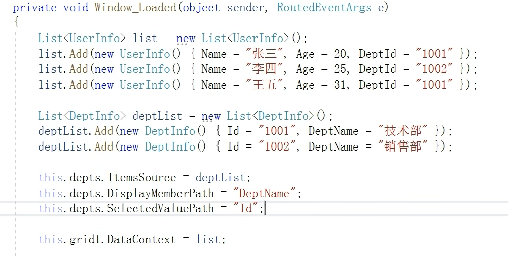

`DataGridTemplateColumn` 降序排列演示

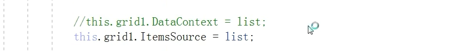

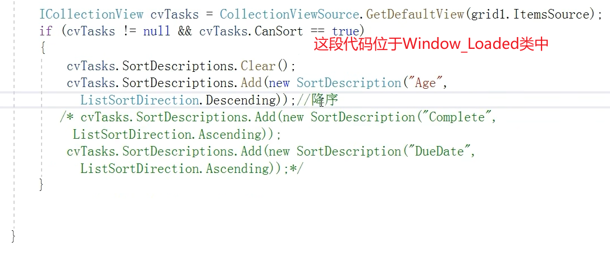

### TreeView演示代码

```csharp
private void Window_Loaded(object sender, RoutedEventArgs e)
{
    //设置treeView1的数据上下文
    this.treeView1.DataContext = MenuHelper.CreateMenus();
    
        }
        <!--硬代码 写死 树-->
        <!--<TreeView FontSize="30" >

            <TreeViewItem Header="部门" IsExpanded="True">
               
                <TreeViewItem Header="销售部" >
                    <TreeViewItem Header="销售1部">
                    </TreeViewItem>
                    <TreeViewItem Header="销售2部">

                    </TreeViewItem>
                </TreeViewItem>
                <TreeViewItem Header="财务部">

                </TreeViewItem>
                <TreeViewItem Header="技术部">

                </TreeViewItem>
                <TreeViewItem Header="人事部">

                </TreeViewItem>

            </TreeViewItem>
        </TreeView>-->


        <TreeView FontSize="30" Name="treeView1" ItemsSource="{Binding}" 
                  >
            <!--<TreeView.ItemContainerStyle>
                <Style TargetType="{x:Type MenuItem}">
                    <Setter Property="Command" Value="{Binding ICommand}"></Setter>
                </Style>
            </TreeView.ItemContainerStyle>-->
            <TreeView.ItemTemplate>
                <HierarchicalDataTemplate  DataType="{x:Type et:MenuInfo}" ItemsSource="{Binding SubMenus}">
                    <StackPanel Orientation="Horizontal">
                        <Image Source="../Images/touxiang.jpg" Width="50" Height="50"></Image>
                        <TextBlock   Text="{Binding MenuName}"></TextBlock>
                    </StackPanel>
                </HierarchicalDataTemplate>
            </TreeView.ItemTemplate>

        </TreeView>
```


### Grid演示代码

```csharp
 <Grid ShowGridLines="True">

        <!--自定义列-->
        <Grid.ColumnDefinitions>
            <ColumnDefinition Width="200"></ColumnDefinition>
            <ColumnDefinition Width="500"></ColumnDefinition>
            <ColumnDefinition></ColumnDefinition>
        </Grid.ColumnDefinitions>

        <!--自定义行-->
        <Grid.RowDefinitions>
            <RowDefinition Height="100"></RowDefinition>
            <RowDefinition Height="200"></RowDefinition>
            <RowDefinition></RowDefinition>
            <RowDefinition></RowDefinition>
        </Grid.RowDefinitions>


        <TextBlock Grid.Row="1" Grid.Column="0">我是TextBlock</TextBlock>


        <TabControl Grid.Row="1" Grid.Column="1">
            <TabItem Header="tab1"></TabItem>
            <TabItem Header="tab2"></TabItem>
            <TabItem Header="tab3"></TabItem>
 
        </TabControl>

    </Grid>
```


### StackPanel演示代码

```xml
<StackPanel Orientation="Horizontal" Opacity="0.5">
  <Label  Width="180" Height="30" Content="我是个label控件" 
         VerticalAlignment="Top" Margin="0,10" FontSize="18" Foreground="Blue"/>
  <Label  Width="180" Height="30" Content="我是个label控件" 
         VerticalAlignment="Top" Margin="0,10" FontSize="18" Foreground="Blue"/>
  
  <TextBlock>我是个TextBlock</TextBlock>
  
  <TabControl Grid.Row="1" Grid.Column="1">
    <TabItem Header="tab1"></TabItem>
    <TabItem Header="tab2"></TabItem>
    <TabItem Header="tab3"></TabItem>
    
  </TabControl>
        </StackPanel>
```


### DockPanel演示代码

```xml
        <DockPanel Background="Beige" LastChildFill="True">

            <!--<DockPanel DockPanel.Dock="Left" Background="Red" Width="50"></DockPanel>
            <DockPanel DockPanel.Dock="Left" Background="Red" Width="50"></DockPanel>
            <DockPanel DockPanel.Dock="Left" Background="Red" Width="50"></DockPanel>
            <DockPanel DockPanel.Dock="Left" Background="Green" Width="200"></DockPanel>-->

            <StackPanel DockPanel.Dock="Left" Background="Red" Width="50"></StackPanel>
            <StackPanel DockPanel.Dock="Top" Background="Black" Height="100"></StackPanel>
            <StackPanel DockPanel.Dock="Bottom" Background="Green" Height="100"></StackPanel>
            <StackPanel DockPanel.Dock="Right" Background="White" Width="100"></StackPanel>

            <DockPanel DockPanel.Dock="Right" Background="Purple" LastChildFill="False" >
                <!--<DockPanel DockPanel.Dock="Right" Background="Teal" Width="30">

                </DockPanel>-->
            </DockPanel>
        </DockPanel>
```


### WrapPanel演示代码

```xml
 <!--
        WrapPanel重点掌握
        1.它是对控件进行（超出宽度或高度时）换行，并不是真的控件的内容进行换行
        2.Orientation 默认是水平排列的 
        -->
        <WrapPanel Width="700" Orientation="Vertical">
            <!--<Label FontSize="20">按从左到右的顺序位置定位子元素</Label>
            <Label FontSize="20">，在包含框的边缘处将内容切换到下一行。</Label>-->
            <StackPanel Width="300" Height="100" Background="Teal"></StackPanel>
            <StackPanel Width="300" Height="100" Background="Teal" Orientation="Vertical">
                <Label FontSize="20">按从左到右的顺序位置定位子元素</Label>
                <Label FontSize="20">，在包含框的边缘处将内容切换到下一行。</Label>
            </StackPanel>
            <StackPanel Width="300" Height="100" Background="Red">
                
            </StackPanel>
            
        </WrapPanel>
```


### Canvas演示代码

 Object]&name=image.png&originHeight=311&originWidth=357&originalType=binary&ratio=1&rotation=0&showTitle=false&size=2016&status=done&style=none&taskId=u3b918b94-129b-4fd3-9a86-add4d43f511&title=&width=357)

```xml
<Canvas Width="500" Height="500" >

            <StackPanel Width="100" Height="100" Background="Red" Canvas.Top="50" Canvas.Left="200"></StackPanel>
            <StackPanel Width="100" Height="100" Background="Green" Canvas.Top="250" Canvas.Left="200"></StackPanel>
            <StackPanel Width="100" Height="100" Background="Yellow" Canvas.Top="150" Canvas.Left="95"></StackPanel>
            <WrapPanel Width="100" Height="100" Background="Black" Canvas.Top="150" Canvas.Left="305"></WrapPanel>

            <WrapPanel Width="100" Height="100" Background="Purple"   Canvas.Bottom="80" Canvas.Right="80"></WrapPanel>
        </Canvas>
```


### Calendar演示代码

```xml
<Calendar SelectionMode="MultipleRange" DisplayDate="2022-01-01" SelectedDate="2022-01-01"
                  DisplayDateStart="2022-01-01" DisplayDateEnd="2022-03-01">
            
        </Calendar>
```


### Image演示代码

```xml
 <!--
        Source的写法
        1.相对路径 例如：../Images/avatar.png 【图片是嵌入资源或生成到内容 都可以获取到】
        2.pack://application:,,,    (这个代表获取应用下的路径)【图片是嵌入资源或生成到内容 都可以获取到】
        3.pack://siteoforigin:,,,    (这个代表获取站点下的路径)【图片是生成到内容 都可以获取到】
        -->
        <!--<Image Source="../Images/avatar.png" Stretch="Uniform"/>-->
        <!--<Image Source="pack://application:,,,/Images/avatar.png" Stretch="Uniform"/>-->
        <!--<Image Source="pack://siteoforigin:,,,/Images/avatar.png" Stretch="Uniform"/>-->
        
        
        <!--
            2.实现特定的文字背景（图片）
        -->

        <TextBlock Background="Orange" Width="300" Height="80" FontSize="60pt" 
            FontFamily="华文行楷" TextAlignment="Center" VerticalAlignment="Center">

            <TextBlock.Foreground>
                <ImageBrush ImageSource="../Images/avatar.png" TileMode="FlipX" Viewport="0,0,30,30" ViewportUnits="Absolute">
                    
                </ImageBrush>
            </TextBlock.Foreground>
            Text
        </TextBlock>
```


### ProgressBar演示代码

```xml
        <!--<ProgressBar Name="pro" Foreground="Blue" Background="AliceBlue" Width="300" 
                     Minimum="10" Maximum="100" 
                  IsIndeterminate="False" Orientation="Vertical" Margin="250,182,250,83"  />-->

        <ProgressBar Width="300" Height="50" 
                 Name="progressBar1">
            <!--
            使用了触发器 （Triggers）
               事件触发器（EventTrigger） 使用了路由事件（绑定了该控件的加载事件）
                使用了动画效果（DoubleAnimation）
            -->
            <ProgressBar.Triggers>
                <EventTrigger RoutedEvent="ProgressBar.Loaded">
                    <BeginStoryboard>
                        <Storyboard>
                            <DoubleAnimation
                Storyboard.TargetName="progressBar1" 
                Storyboard.TargetProperty="Value"
                From="0" To="100" Duration="1:1:5"  />
                        </Storyboard>
                    </BeginStoryboard>
                </EventTrigger>
            </ProgressBar.Triggers>
        </ProgressBar>
```


### Rectangle的演示代码

```xml
<Rectangle Stroke="Green"  HorizontalAlignment ="Left" VerticalAlignment="Center"
           StrokeDashArray="2" RadiusX="200"  RadiusY="200"    StrokeThickness="20"  Width="400" Height="400"  Margin="20,0">

<Rectangle.Fill>
  <!--
            1.VisualBrush 使用可视化画笔
        -->
  <!--<VisualBrush>
                    <VisualBrush.Visual>
                        <StackPanel>
                            <TextBlock FontSize="12" HorizontalAlignment="Center">图片															</TextBlock>
                            <Image Source="../Images/avatar.png" ></Image>
                        </StackPanel>
                    </VisualBrush.Visual>
                </VisualBrush>-->
  <!--
        2.DrawingBrush 图片画笔
        -->
  <DrawingBrush>
    <DrawingBrush.Drawing>
      <!--Rect必须设置 否则图片不展示-->
      <ImageDrawing ImageSource="../Images/avatar.png" Rect="0,0,200,200"></ImageDrawing>
    </DrawingBrush.Drawing>
  </DrawingBrush>
</Rectangle.Fill>

</Rectangle>
```


# 其他

WPF 还包括增强属性和事件的其他编程构造： [依赖项属性](https://docs.microsoft.com/zh-cn/dotnet/desktop/wpf/advanced/dependency-properties-overview?view=netframeworkdesktop-4.8) 和 [路由事件](https://docs.microsoft.com/zh-cn/dotnet/desktop/wpf/advanced/routed-events-overview?view=netframeworkdesktop-4.8)。

依赖性示例:

```xml
<DockPanel>
  <Button Background="{DynamicResource MyBrush}" Content="I am gold"  Width="200px" Height=" 30px" />
  
  <DockPanel.Resources>
    <SolidColorBrush x:Key="MyBrush" Color="Gold" />
  </DockPanel.Resources>
</DockPanel>
```

路由事件:
(*路由是指网络数据包发送到目的地址的路线*)

```xml
     <StackPanel>
            <StackPanel.Resources>
                <Style TargetType="{x:Type Button}">
                    <EventSetter Event="Click" Handler="SetColor"/>
                </Style>
            </StackPanel.Resources>
            <Button>Click me</Button>
            <Button Name="ThisButton" Click="HandleThis">
                Raise event, handle it, use handled=true handler to get it anyway.
            </Button>
        </StackPanel>
```
```csharp
private void SetColor(object sender, RoutedEventArgs e)
{
    MessageBox.Show("点击了按钮:"+(e.OriginalSource is Button));
}

private void HandleThis(object sender, RoutedEventArgs e)
{
    MessageBox.Show("点击了按钮:");
}
```


## ~~WPF 中的代码隐藏和 XAML~~

```xml
<Page
  xmlns="http://schemas.microsoft.com/winfx/2006/xaml/presentation"
  xmlns:x="http://schemas.microsoft.com/winfx/2006/xaml"
  x:Class="MyNamespace.MyCanvasCodeInline"
>
  <Button Name="button1" Click="Clicked">Click Me!</Button>
  <x:Code><![CDATA[
    void Clicked(object sender, RoutedEventArgs e)
    {
        button1.Content = "Hello World";
    }
  ]]></x:Code>
</Page>
```


## 绑定标记扩展

将属性值延迟为数据绑定值，从而创建中间表达式对象并解释应用于元素及其绑定的数据上下文。

### 绑定表达式用法

```xml
<object property="{Binding}" .../>  

<object property="{Binding  bindProp1=value1[, bindPropN=valueN]*}" ...  />  
<object property="{Binding path}" .../>  
<object property="{Binding path[, bindPropN=valueN]*}" .../>
```


#### 语法说明

在这些语法中， 和 []* 不是文本。 它们是表示法的一部分，用于指示可以使用零个或多个 *bindPropvalue*=, 对，并且它们与前面的 *bindPropvalue*= 对之间具有分隔符。
可以改为使用对象元素的属性设置"可以使用绑定扩展设置的绑定属性"部分中列出的任何 [Binding](https://docs.microsoft.com/zh-cn/dotnet/api/system.windows.data.binding) 属性。 但是，这不是 真正的标记扩展用法 [Binding](https://docs.microsoft.com/zh-cn/dotnet/api/system.windows.data.binding)，它只是设置 CLR 类属性的属性的常规 XAML [Binding](https://docs.microsoft.com/zh-cn/dotnet/api/system.windows.data.binding) 处理。 换句话说，<Binding_bindProp1value1bindPropNvalueN_=""[=""]*/>[Binding](https://docs.microsoft.com/zh-cn/dotnet/api/system.windows.data.binding) 是对象元素用法的属性的等效语法，而不是表达式Binding用法。

- [Mode](https://docs.microsoft.com/zh-cn/dotnet/api/system.windows.data.binding.mode)： *value* 是枚举中的常量 [BindingMode](https://docs.microsoft.com/zh-cn/dotnet/api/system.windows.data.bindingmode) 名称。 例如，{Binding Mode=OneWay}。
- [Path](https://docs.microsoft.com/zh-cn/dotnet/api/system.windows.data.binding.path)：一个字符串，用于描述数据对象或常规对象模型的路径。 格式提供了几种不同的约定，用于遍历本主题中无法充分描述的对象模型。 请参阅 [PropertyPath XAML 语法](https://docs.microsoft.com/zh-cn/dotnet/desktop/wpf/advanced/propertypath-xaml-syntax?view=netframeworkdesktop-4.8)。
- [RelativeSource](https://docs.microsoft.com/zh-cn/dotnet/api/system.windows.data.binding.relativesource)：与 和 互斥[ElementName](https://docs.microsoft.com/zh-cn/dotnet/api/system.windows.data.binding.elementname)[Source](https://docs.microsoft.com/zh-cn/dotnet/api/system.windows.data.binding.source);其中每个绑定属性都表示特定的绑定方法。 请参阅 [数据绑定概述](https://docs.microsoft.com/zh-cn/dotnet/desktop/wpf/data/data-binding-overview?view=netframeworkdesktop-4.8)。 需要嵌套 [的 RelativeSource MarkupExtension](https://docs.microsoft.com/zh-cn/dotnet/desktop/wpf/advanced/relativesource-markupextension?view=netframeworkdesktop-4.8) 用法来指定值。
- [Source](https://docs.microsoft.com/zh-cn/dotnet/api/system.windows.data.binding.source)：互斥与 [RelativeSource](https://docs.microsoft.com/zh-cn/dotnet/api/system.windows.data.binding.relativesource) 和 [ElementName](https://docs.microsoft.com/zh-cn/dotnet/api/system.windows.data.binding.elementname);其中每个绑定属性都表示特定的绑定方法。 请参阅 [数据绑定概述](https://docs.microsoft.com/zh-cn/dotnet/desktop/wpf/data/data-binding-overview?view=netframeworkdesktop-4.8)。 需要使用嵌套扩展，通常是引用键键资源字典中的对象数据源的 [StaticResource](https://docs.microsoft.com/zh-cn/dotnet/desktop/wpf/advanced/staticresource-markup-extension?view=netframeworkdesktop-4.8) 标记扩展。
- [StringFormat](https://docs.microsoft.com/zh-cn/dotnet/api/system.windows.data.bindingbase.stringformat)：一个字符串，描述绑定数据的字符串格式约定。 这是一个相对高级的绑定概念;请参阅 的参考页 [StringFormat](https://docs.microsoft.com/zh-cn/dotnet/api/system.windows.data.bindingbase.stringformat)。
- [XPath](https://docs.microsoft.com/zh-cn/dotnet/api/system.windows.data.binding.xpath)：一个字符串，描述 XML 数据源的 XMLDOM 的路径。 请参阅 [使用 XMLDataProvider 和 XPath 查询绑定到 XML 数据](https://docs.microsoft.com/zh-cn/dotnet/desktop/wpf/data/how-to-bind-to-xml-data-using-an-xmldataprovider-and-xpath-queries?view=netframeworkdesktop-4.8)。


### 其他标记扩展

| 属性                     | 作用                                                         |
| ------------------------ | ------------------------------------------------------------ |
| **StaticResource**       | 通过查找对已定义的资源的引用，为任何 XAML 属性属性提供值。   |
| **DynamicResource**      | 通过将任何 XAML 属性属性的值延迟为对已定义资源的引用，为该属性提供值。 |
| **RelativeSource**       | 指定绑定源的属性 [RelativeSource](https://docs.microsoft.com/zh-cn/dotnet/api/system.windows.data.relativesource) ，以便在 [绑定标记扩展](https://docs.microsoft.com/zh-cn/dotnet/desktop/wpf/advanced/binding-markup-extension?view=netframeworkdesktop-4.8)中使用，或在设置 [RelativeSource](https://docs.microsoft.com/zh-cn/dotnet/api/system.windows.data.binding.relativesource) 在 XAML 中建立的元素的属性 [Binding](https://docs.microsoft.com/zh-cn/dotnet/api/system.windows.data.binding) 时使用。 |
| **TemplateBinding**      | 连接某一控件模板中的属性值，使之成为模板化控件上另一个属性的值。 |
| **ThemeDictionary**      | 为集成第三方控件的自定义控件创作者或应用程序提供一种方法，用于加载要在设置控件样式时使用的特定于主题的资源字典。 |
| **ColorConvertedBitmap** | 提供一种方法，用于指定没有嵌入的配置文件的位图源。 颜色上下文/配置文件由 URI 指定，与映像源 URI 相同。 |


## 数据绑定与自定义路由：

官方文档：[docs.microsoft.com/zh-cn/dotne…](https://docs.microsoft.com/zh-cn/dotnet/desktop/wpf/data/?view=netdesktop-6.0)

### 创建绑定

前面部分中讨论的一些概念可以重申为：使用 [Binding](https://docs.microsoft.com/zh-cn/dotnet/api/system.windows.data.binding) 对象建立绑定，且每个绑定通常具有四个组件：绑定目标、目标属性、绑定源以及指向要使用的源值的路径。
绑定源绑定到元素的活动 [DataContext](https://docs.microsoft.com/zh-cn/dotnet/api/system.windows.frameworkelement.datacontext)。 如果元素没有显式定义 DataContext，则会自动继承。
请考虑以下示例，其中的绑定源对象是一个名为 *MyData* 的类，该类在**Ken.Wpf.Entity**命名空间中定义。 出于演示目的，*MyData* 具有名为 *ColorName* 的字符串属性，其值设置为“Red”。 因此，此示例生成一个具有红色背景的按钮。

`newfbin.Wpf.数据绑定.WindowDataBinding.xaml`

```xml
<Window x:Class="newfbin.Wpf.数据绑定.WindowDataBinding"
        xmlns="http://schemas.microsoft.com/winfx/2006/xaml/presentation"
        xmlns:x="http://schemas.microsoft.com/winfx/2006/xaml"
        xmlns:d="http://schemas.microsoft.com/expression/blend/2008"
        xmlns:mc="http://schemas.openxmlformats.org/markup-compatibility/2006"
        xmlns:local="clr-namespace:newfbin.Wpf.数据绑定"
        xmlns:c="clr-namespace:newfbin.Wpf.Entity"
        mc:Ignorable="d"
        Title="MainWindow" Height="450" Width="800" Loaded="Window_Loaded">

    <Grid >
        <Grid.Resources>
            <!--
				这个是资源字典
				key为myDataSource、value为MyData类
			-->
            <c:MyData x:Key="myDataSource"/>
        </Grid.Resources>
        <Grid.DataContext>
            <!--
				获取或设置元素参与数据绑定时的数据上下文。
				（在本文的 控件篇->继承关系 内的表格中提到了Grid.Resources和Grid.DataContext）
			-->
            <Binding Source="{StaticResource myDataSource}"/>
        </Grid.DataContext>
        <!--第一种绑定方式-->
        <!--在上面的标签中可以看到，数据上下文被绑定到了Grid上。
        因为Button是Grid的子元素，所有Grid绑定的数据源，都可以分享给下面的子元素-->
        <Button Background="{Binding Path=ColorName}"
          Width="150" Height="30">
            I am bound to be RED!
        </Button>
        <!--第二种 直接在后台数据绑定（控件）-->
		<Label Name="myLable" Content="{Binding Path=Titel}" FontSize="50" FontWeight="Bold"></Label>
    </Grid>
</Window>

```

`newfbin.Wpf.Entity.MyData.cs`

```csharp
using System;
using System.Collections.Generic;
using System.Linq;
using System.Text;
using System.Threading.Tasks;

namespace newfbin.Wpf.Entity
{
    class MyData
    {
        //第一种绑定方式用到的字段
        private string colorName = "Red";

        //第二种绑定方式用到的字段
        private string titel;

        public string ColorName
        {
            get => colorName; set => colorName = value;
        }
        public string Titel { get => titel; set => titel = value; }
    }
}

```

`newfbin.Wpf.数据绑定.WindowDataBinding.xaml.cs`

```csharp
using newfbin.Wpf.Entity;
using System;
using System.Collections.Generic;
using System.Linq;
using System.Text;
using System.Threading.Tasks;
using System.Windows;
using System.Windows.Controls;
using System.Windows.Data;
using System.Windows.Documents;
using System.Windows.Input;
using System.Windows.Media;
using System.Windows.Media.Imaging;
using System.Windows.Shapes;

namespace newfbin.Wpf.数据绑定
{
    /// <summary>
    /// WindowDataBinding.xaml 的交互逻辑
    /// </summary>
    public partial class WindowDataBinding : Window
    {
        public WindowDataBinding()
        {
            InitializeComponent();
        }

        // 需在WindowDataBinding.xaml 的 Window 标签中添加 Loaded="Window_Loaded"属性。并在该属性上按F12
        // Loaded="Window_Loaded"表示在程序运行起来后，窗口被加载的时候该方法才会被触发
        private void Window_Loaded(object sender, RoutedEventArgs e)
        {
            //第二种数据绑定方式
            myLable.DataContext = new MyData() { Titel = "我是个标题" };
        }
    }
}

```

**两种绑定方式的效果如下**：

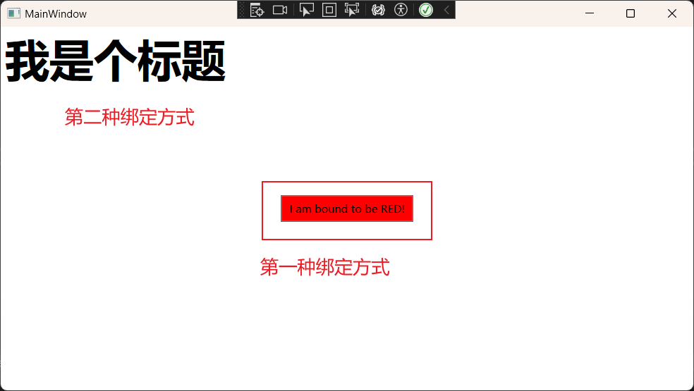

### 创建自定义路由

以下示例在自定义控件 CustomButton 库中实现 类。 派生 CustomButton 自 的 类 [Button](https://docs.microsoft.com/zh-cn/dotnet/api/system.windows.controls.button)：

1. 使用 方法 [RoutedEvent](https://docs.microsoft.com/zh-cn/dotnet/api/system.windows.routedevent) 注册 ConditionalClick 名为 [RegisterRoutedEvent](https://docs.microsoft.com/zh-cn/dotnet/api/system.windows.eventmanager.registerroutedevent) 的 ，并指定 [注册期间冒泡](https://docs.microsoft.com/zh-cn/dotnet/api/system.windows.routingstrategy#system-windows-routingstrategy-bubble) 策略。
2. 将注册 RoutedEvent 调用返回的实例分配给名为 的静态只读字段 ConditionalClickEvent。
3. 定义 CLR [添加](https://docs.microsoft.com/zh-cn/dotnet/api/system.windows.uielement.addhandler)[和删除](https://docs.microsoft.com/zh-cn/dotnet/api/system.windows.uielement.removehandler)事件访问器。
4. 添加自定义逻辑，以在单击 并 CustomButton 应用外部条件时引发自定义路由事件。 尽管示例代码从重写 ConditionalClick 的虚拟方法 OnClick 中引发路由事件，但你可以以任何选择的方式引发事件。

```csharp
public class CustomButton : Button
{
    // Register a custom routed event using the Bubble routing strategy.
    public static readonly RoutedEvent ConditionalClickEvent = EventManager.RegisterRoutedEvent(
        name: "ConditionalClick",
        routingStrategy: RoutingStrategy.Bubble,
        handlerType: typeof(RoutedEventHandler),
        ownerType: typeof(CustomButton));

    // Provide CLR accessors for assigning an event handler.
    public event RoutedEventHandler ConditionalClick
    {
        add { AddHandler(ConditionalClickEvent, value); }
        remove { RemoveHandler(ConditionalClickEvent, value); }
    }

    void RaiseCustomRoutedEvent()
    {
        // Create a RoutedEventArgs instance.
        RoutedEventArgs routedEventArgs = new(routedEvent: ConditionalClickEvent);

        // Raise the event, which will bubble up through the element tree.
        RaiseEvent(routedEventArgs);
    }

    // For demo purposes, we use the Click event as a trigger.
    protected override void OnClick()
    {
        // Some condition combined with the Click event will trigger the ConditionalClick event.
        if (DateTime.Now > new DateTime())
            RaiseCustomRoutedEvent();

        // Call the base class OnClick() method so Click event subscribers are notified.
        base.OnClick();
    }
}
```

该示例包括一个单独的 WPF 应用程序，该应用程序使用 XAML CustomButton[StackPanel](https://docs.microsoft.com/zh-cn/dotnet/api/system.windows.controls.stackpanel)标记将 的实例添加到 ，Handler_ConditionalClickConditionalClick并将 方法分配为 和 元素StackPanel1的事件CustomButton处理程序。

```xml
<Window x:Class="CodeSample.MainWindow"
    xmlns="http://schemas.microsoft.com/winfx/2006/xaml/presentation"
    xmlns:x="http://schemas.microsoft.com/winfx/2006/xaml"
    xmlns:custom="clr-namespace:WpfControl;assembly=WpfControlLibrary"
        Title="How to create a custom routed event" Height="100" Width="300">

    <StackPanel Name="StackPanel1" custom:CustomButton.ConditionalClick="Handler_ConditionalClick">
        <custom:CustomButton
            Name="customButton"
            ConditionalClick="Handler_ConditionalClick"
            Content="Click to trigger a custom routed event"
            Background="LightGray">
        </custom:CustomButton>
    </StackPanel>
</Window>
```

在代码隐藏中，WPF 应用程序定义事件 Handler_ConditionalClick 处理程序方法。 只能在代码隐藏中实现事件处理程序方法。

```csharp
// The ConditionalClick event handler.
private void Handler_ConditionalClick(object sender, RoutedEventArgs e)
{
    string senderName = ((FrameworkElement)sender).Name;
    string sourceName = ((FrameworkElement)e.Source).Name;
    
    Debug.WriteLine($"Routed event handler attached to {senderName}, " +
                    $"triggered by the ConditionalClick routed event raised on 				{sourceName}.");
}

// Debug output when CustomButton is clicked:
// Routed event handler attached to CustomButton,
//     triggered by the ConditionalClick routed event raised on CustomButton.
// Routed event handler attached to StackPanel1,
//     triggered by the ConditionalClick routed event raised on CustomButton.
```

单击 CustomButton 时：

1. 路由 ConditionalClick 事件在 上引发 CustomButton。
2. 将 Handler_ConditionalClick 触发附加到 CustomButton 的事件处理程序。
3. 路由 ConditionalClick 事件将元素树向上遍历到 StackPanel1。
4. 将 Handler_ConditionalClick 触发附加到 StackPanel1 的事件处理程序。
5. 路由 ConditionalClick 事件继续上移元素树，可能会触发附加到 ConditionalClick 其他遍历元素的其他事件处理程序。

事件 Handler_ConditionalClick 处理程序获取有关触发它的事件的以下信息：

- [发送方](https://docs.microsoft.com/zh-cn/dotnet/api/system.windows.routedeventhandler)对象，它是事件处理程序附加到的元素。 将 sender 第一 CustomButton 次运行处理程序，第二 StackPanel1 次运行。
- 对象 [RoutedEventArgs.Source](https://docs.microsoft.com/zh-cn/dotnet/api/system.windows.routedeventargs.source#system-windows-routedeventargs-source) ，它是最初引发事件的元素。 此示例中， 始终 Source 为 CustomButton。

**备注**
路由事件和 CLR 事件之间的主要区别在于路由事件遍历元素树，查找处理程序，而 CLR 事件不遍历元素树，处理程序只能附加到引发事件的源对象。 因此，路由事件 sender 可以是元素树中任何遍历的元素。
可以像冒泡事件一样创建隧道事件，只不过你将在事件注册调用中将路由策略设置为 [Tunnel](https://docs.microsoft.com/zh-cn/dotnet/api/system.windows.routingstrategy#system-windows-routingstrategy-tunnel)。 有关隧道事件详细信息，请参阅 [WPF 输入事件](https://docs.microsoft.com/zh-cn/dotnet/desktop/wpf/advanced/routed-events-overview?view=netframeworkdesktop-4.8&preserve-view=true#wpf-input-events)。