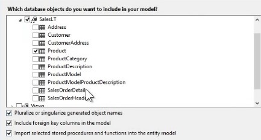

# 004 类，对象，类成员简介

# 类是现实世界事物的模型

+ 类是对现实世界事物进行抽象所得到的结果
  - 事物包括“物质”（实体）与“运动”（逻辑）
  - 建模是一个去伪存真、由表及里的过程
    唯物主义辩证法对学习面向对象编程很有好处。
    


# 类与对象的关系

+ 对象也叫实例，是类经过“实例化”后得到的内存中的实体
  - Formally "instance" is synonymous with "object" —— **对象和实例是一回事**
  - “飞机”与“一架飞机”有何区别？ 天上有（一架）飞机 —— 必需是实例飞，概念不能飞
  - 有些类是不能实例化的，比如“数学”（Math class），我们不能说“一个数学”
+ 依照类，我们可以创建对象，这就是“实例化”
  - 现实世界中常称“对象”，程序世界中常称“实例”
  - 二者并无太大区别，常常混用，初学者不必迷惑
+ 使用 new 操作符创建类的实例
+ 引用变量与实例的关系
  - 孩子与气球
  - 气球不一定有孩子牵着
  - 多个孩子可以使用各自的绳子牵着同一个气球，也可以都通过一根绳子（ref）牵着同一个气球

# 类的三大成员 属性、方法、事件

+ 属性 Property
  - 存储数据，组合起来表示类或对象当前的状态
+ 方法 Method
  - 由 C 语言中的函数（function）进化而来，表示类或对象“能做什么”
  - 工作中 90% 的时间是与方法打交道，因为它是“真正做事”、“构成逻辑”的成员
+ 事件 Event
  - 类或对象通知其它类或对象的机制，为 C# 所特有（Java 通过其它办法实现这个机制）
  - 善用事件机制非常重要（切勿滥用）
+ 善用 MSDN 文档
+ 某些特殊类或对象在成员方面侧重点不同
  - 模型类或对象重在属性，如 Entity Framework
  - 工具类或对象重在方法，如 Math，Console
  - 通知类或对象重在事件，如各种 Timer

## MSDN 文档阅读技巧

注：微软已将 MSDN 的文档都迁移到了 [Microsoft Learn](https://learn.microsoft.com/zh-cn/)，关于 C# 语言的都集中在 [C# 文档](https://learn.microsoft.com/zh-cn/dotnet/csharp/) 部分。

> **Microsoft Docs**
>
> 最终用户、开发人员和 IT 专业人士可访问 
>
> [docs.microsoft.com](http://docs.microsoft.com)
>
> 获取 Microsoft 文档。 查看我们的快速入门、教程、API 参考和代码示例。
>
> 

> 

> 

> <font style="color:#000000;background-color:#FFFFFF;">当微软示例的 Examples 看不明白时，就以 类名 + Examples 为关键字在网上搜索示例即可。</font>

## Entity Framework

PropertySample

1. 用 NuGet 给项目添加 Entity Framework 引用
2. 项目添加 ADO.NET Entity Data Model 

3. <font style="color:#000000;background-color:#FFFFFF;">设置 Data Model</font>
   1. Generate from database
   2. Add new connection, selsect Microsoft SQL Server
   3. Fill in server name, local
   4. Select Adventure Works database
   5. Select table 

4. 成功后的效果


5. 代码

```csharp
namespace PropertySample
{
    class Program
    {
        static void Main(string[] args)
        {
            AdventureWorks2014Entities proxy = new AdventureWorks2014Entities();
            foreach (Product p in proxy.Products)
            {
                Console.WriteLine(p.Name);
            }
            Console.WriteLine("===============");
            Console.WriteLine(proxy.Products.Count());
        }
    }
}
```

> **Code Snippet**
>
> 1. foreach + Tab * 2
> 2. cw + Tab * 2 == Cosole.WriteLine();

## Event

Event 示例。用 DispatcherTimer 写了个时钟。

```csharp
using System.Windows.Threading;
namespace EventSample
{
    /// <summary>
    /// MainWindow.xaml 的交互逻辑
    /// </summary>
    public partial class MainWindow : Window
    {
        public MainWindow()
        {
            InitializeComponent();
            DispatcherTimer timer = new DispatcherTimer();
            timer.Interval = TimeSpan.FromSeconds(1);
            timer.Tick += Timer_Tick;
            timer.Start();
        }
        private void Timer_Tick(object sender, EventArgs e)
        {
            this.timeTextBox.Text = DateTime.Now.ToString();
        }
    }
}
```

效果：


# 静态成员与实例成员

+ 静态（Static）成员在语义上表示它是“类的成员”
  - 物体固有的性质，隶属于某个类
+ 实例（非静态）成员在语义表示它是“对象的成员”
  - 实例成员是属于对象的，而非类
+ 绑定（Binding）指的是编译器如何把一个成员与类或对象关联起来
  - 不可小觑的 `.` 操作符 —— 成员访问操作符
    

    

    绑定分为“早绑定”和“晚绑定”
+ 早绑定 编译器在编译时就知道成员是隶属于类还是隶属于类的对象
+ 晚绑定 编译器不管，由程序员决定程序运行起来后一个成员（方法或属性）是隶属于类还是某个对象
  - 有晚绑定的语言一般叫做动态语言，例如 JavaScript

> 更新: 2023-02-02 16:02:19  
> 原文: <https://www.yuque.com/yuejiangliu/dotnet/timothy-csharp-004>