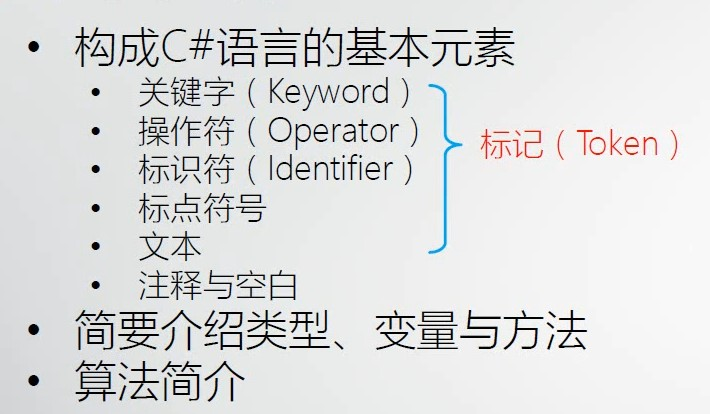
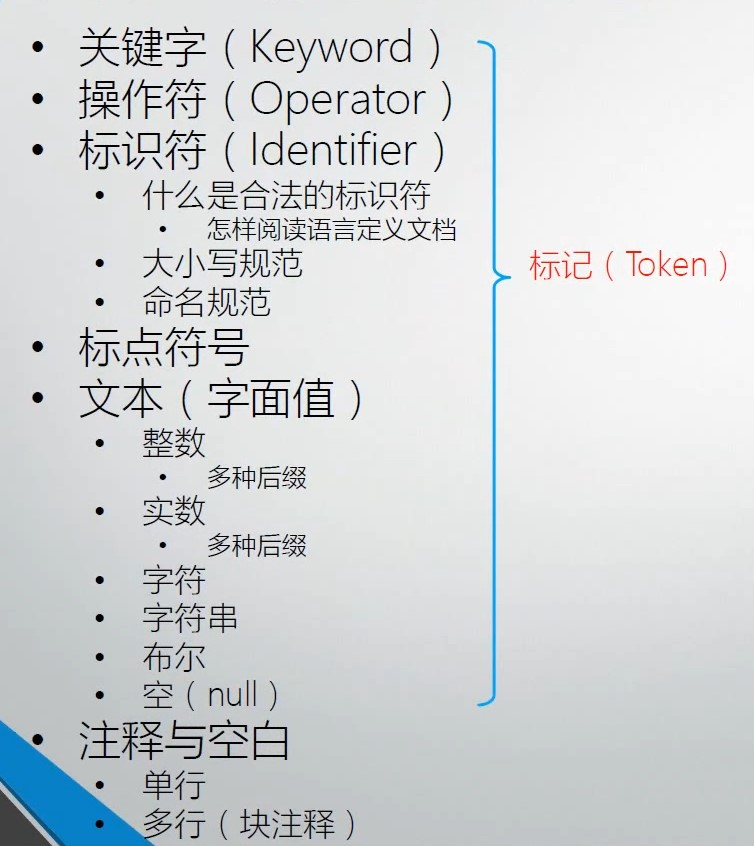
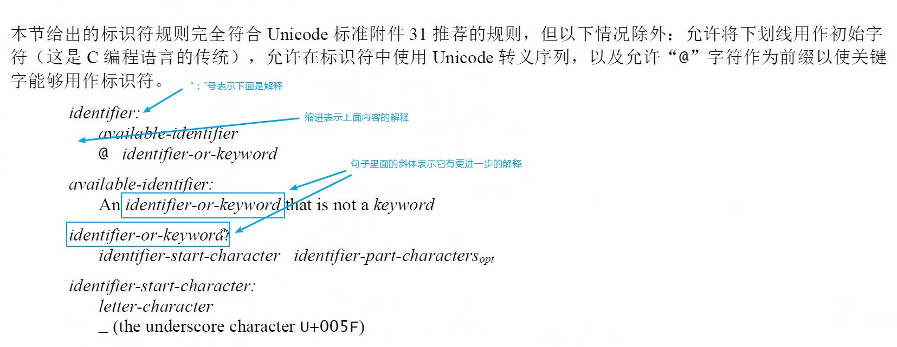

# 005 C#语言基本元素概览，初识类型、变量与方法，算法简介

本节内容：

| **熟悉 C# 语言**         | **精通 C# 语言**         |
| ------------------------------------------------------------ | ------------------------------------------------------------ |
| 1. 对于构成 C# 的基本元素你都认识 2. 常见的基本元素你都能正确的使用 | 1. 对于构成 C# 的基本元素你都会使用 2. 对于常见的你不仅会使用还不会出错误 3. 还能在更深层次上去理解这些基本元素 4. 了解一些它们背后的运行机制 |
| 面试时算法和数据结构都很重要。                               |                                                              |

# 构成 C# 语言的基本元素

+ 关键字（Keyword）
+ 操作符（Operator）
+ [标识符](https://www.yuque.com/yuejiangliu/dotnet/timothy-csharp-005#f3c00c7e)
  - 什么是合法的标识符
    * [怎样阅读语言定义文档](#986baf58)
  - 大小写规范
  - 命名规范
+ 标点符号
+ 文本（字面值）
  - 整数
    * 多种后缀
  - 实数
    * 多种后缀
  - 字符
  - 字符串
  - 布尔
  - 空（null）
+ 注释与空白
  - 单行
  - 多行（块注释）

## 怎样阅读语言定义文档

## 标识符

合法标识符：

+ 标识符不允许是关键字，如果非要用关键字就在前面加 `@` 符号
+ 标识符必需以字符或下划线开头
  - 字符包括英文字符，也包括汉语、俄语等字符
+ 开始字符的后面可以跟字符、数字、下划线

## 基本命名规范

+ 变量名都用驼峰法 Camel
  - 首字母小写，后续单词首字母大写
  - 例：`apple` `smallApple`
+ 方法、类、名称空间都用帕斯卡 Pascal
  - 每个单词的首字母都大写
  - 例：`Apple` `SmallApple`
    方法名应该是动词或动词短语，例如 ~~Today~~ 错，GetToday 对。

## 注释

好的代码要有自解释性。

# 初识类型、变量和方法

+ 初识类型（Type）
  - 亦称是数据类型（Data Type）
+ 变量是存放数据的地方，简称“数据”
  - 变量的声明
  - 变量的使用
+ 方法（旧称函数）是处理数据的逻辑，又称“算法”
  - 方法的声明
  - 方法的调用
+ 程序 = 数据 + 算法
  - 有了变量和方法就可以写有意义的程序了

# 算法简介

+ 循环初体验
+ 递归初体验
+ 计算 1 到 100 的和
  1. 用循环
  2. 用递归
  3. 用数学公式
     很明显直接用数学公式效率最高。

> 更新: 2021-03-09 12:56:30  
> 原文: <https://www.yuque.com/yuejiangliu/dotnet/timothy-csharp-005>