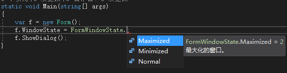

# 006,007 详解类型、变量与对象

# 什么是类型

+ Type 又名数据类型（Data Type）
  - A data type is a homogeneous collection of values, effectively presented, equipped with a set of operations which manipulate these values.
  - 是数据在内存中存储时的“型号”
  - 小内存容纳大尺寸数据会丢失精度、发生错误
  - 大内存容纳小尺寸数据会导致浪费
  - 编程语言的数据类型与数据的数据类型不完全相同
+ 强类型语言与弱类型语言的比较
  - 强类型：编写程序时，程序中的数据受到数据类型的约束，即强类型编程语言
  - 弱类型：数据受类型约束不严格，或基本不受约束，即弱类型编程语言（如 JavaScript 动态类型）
  - C# 从 4.0 开始引入了 Dynamic，让它可以利用动态语言的一些特性，但 C# 依然是强类型编程语言
    **要成为优秀的开发人员，软件、硬件、操作系统都要精通。**
    附上一张[后端工程师路线图.png](https://www.yuque.com/attachments/yuque/0/2019/png/101969/1557204253095-e6e7d4aa-71c0-4e11-96c5-7bfe5d9be488.png)
（[来自 Github](https://github.com/kamranahmedse/developer-roadmap)）

# 类型在 C# 语言中的作用

一个 C# 类型中所包含的信息有：

+ 存储此类型变量所需的内存空间大小
+ 此类型的值可表示的最大、最小值范围
+ 此类型所包含的成员（如方法、属性、事件等）
+ 此类型由何基类派生而来
+ 程序运行的时候，此类型的变量被分配在内存的什么位置
  - Stack 简介
  - Stack overflow
  - Heap 简介
  - 使用 Performance Monitor 查看进程的堆内存使用量
  - 关于内存泄漏
+ 此类型所允许的操作（运算）
  对一个程序来说，静态指编辑期、编译期，动态指运行期。   
  静态时装在硬盘里，动态时装在内存里。

## 反射示例

通过反射在运行期获取类的属性和方法。

```csharp
static void Main(string[] args)
{
    Type myType = typeof(Form);
    Console.WriteLine(myType.BaseType.FullName + Environment.NewLine + myType.FullName);
    var pInfos = myType.GetProperties();
    foreach (var p in pInfos)
    {
        Console.WriteLine(p.Name);
    }
    var mInfos = myType.GetMethods();
    foreach (var m in mInfos)
    {
        Console.WriteLine(m.Name);
    }
}
```

## Stack & Heap

方法调用用到 Stack，Heap 存储对象。
Stack overflow

+ 函数调用过多（算法错误）
+ 在栈上分配了过多内存
  不良的递归：
  

  <font style="color:#000000;background-color:#FFFFFF;">在栈上分配过大内存：</font>
  


## Process（进程）

+ 程序从硬盘加载到内存中执行就形成了一个进程。 
+ 进程就是这个程序正在运行着的实例。 
+ Process 的 ID 简称 PID。

## Performance Monitor

Win + R，键入 perfmon 即可开启性能监视器。   
通过性能监视器可以精确监视单个进程的内存消耗。


# C# 语言的类型系统


面试问 C# 数据类型有那些，如下回答。

1. C# 类型分为引用类型和值类型
2. 引用类型包括类、接口、委托，值类型包括结构体和枚举
3. 所有类型都以 Object 为自己的基类型

## C# 的五大数据类型

**Classes**

```csharp
var myType = typeof(Form);
Console.WriteLine(myType.FullName);
Console.WriteLine(myType.IsClass);
```

**Structures**
<font style="color:#000000;background-color:#FFFFFF;">在定义中还可以直接看到 MaxValue、MinValue。</font>


**Enumerations**




```csharp
//
// 摘要:
//     指定窗体窗口如何显示。
[ComVisible(true)]
public enum FormWindowState
{
    //
    // 摘要:
    //     默认大小的窗口。
    Normal = 0,
    //
    // 摘要:
    //     最小化的窗口。
    Minimized = 1,
    //
    // 摘要:
    //     最大化的窗口。
    Maximized = 2
}
```

## C# 类型的派生谱系


# 变量、对象与内存


变量表示了存储位置，并且每个变量都有一个类型，以决定什么样的值能够存入变量。

+ 变量名表示（对应着）变量的值在内存中的存储位置
+ 计算机系统通过变量的类型来分配给它对应大小的内存空间
  **字段**   
  字段是属性的雏形，可以赋任意值。

```csharp
class Program
{
    static void Main(string[] args)
    {
        var stu = new Student();
        // 人的年龄不应该为 -1
        stu.Age = -1;
    }
    class Student
    {
        public static int Amout;
        public int Age;
        public string Name;
    }
}
```

## 引用类型的变量与实例

```csharp
Student stu;
```

<font style="color:#000000;background-color:#FFFFFF;">计算机看到引用类型，直接给它分配 4 个字节，而且全部 Bit 置 0，告诉你这个变量没有引用任何实例。</font>


```csharp
Student stu;
stu = new Student();
```

现在，引用变量里面存的是实例的地址。   
图中左侧是栈，右侧是堆。


```csharp
Student stu;
stu = new Student();
Student stu2;
stu2 = stu;
```


## 变量的默认值

一旦变量在内存中分配好后，它的内存块就被统统刷成 0，这就是它的默认值。
局部变量没有默认值，因为 C# 为了避免不安全代码，要求局部变量必需有显式赋值。

## 装箱与拆箱

```csharp
int a = 100;
object x;
```


**装箱**

```csharp
int a = 100;
object x;
x = a;
```


**拆箱**

```csharp
int a = 100;
object x;
x = a;
int b = (int)x;
Console.WriteLine(b);
```


# 参考

[C# 教程 - 类型及其成员](https://learn.microsoft.com/zh-cn/dotnet/csharp/tour-of-csharp/types)

> 更新: 2023-02-02 16:03:27  
> 原文: <https://www.yuque.com/yuejiangliu/dotnet/timothy-csharp-006-007>