# 008,009 方法的定义、调用与调试

推荐好书：**《CLR via C#》 《C# IN DEPTH》**（中文名 《深入理解C#》）
学习完课程后，一定要把这两本书好好读读，完成从初级到高级的转变。

# 方法的由来

+ 方法（method）的前身是 C/C++ 语言的函数（function）
  - 方法是面向对象范畴的概念，在非面向对象语言中仍然称为函数
  - 使用 C/C++ 语言做对比
+ 方法永远都是类（或结构体）的成员
  - C# 语言中函数不可能独立于类（或结构体）之外
  - 只有作为类（或结构体）的成员时才被称为方法
  - C++ 中函数可以独立于类之外，称为“全局函数”
+ 方法是类（或结构体）最基本的成员之一
  - 最基本的成员只有两个 —— 字段与方法（成员变量与成员方法），本质还是数据 + 算法
  - 方法表示类（或结构体）“能做什么事情”
+ 为什么需要方法和函数
  - 目的 1：隐藏复杂的逻辑
  - 目的 2：复用（reuse，重用）
  - 示例：计算圆面积、圆柱体积、圆锥体积
    <font style="color:#000000;background-color:#FFFFFF;">VS2017 装上 SDK，就可以直接写 C 和 C++。 </font>

<font style="color:#000000;background-color:#FFFFFF;">C++ 函数示例：</font>

```cpp
#include <iostream>
double Add(double a, double b)
{
    return a + b;
}
int main()
{
    double x = 3.0;
    double y = 5.0;
    double result = Add(x, y);
    std::cout << x << "+" << y << "=" << result;
    return 0;
}
```

<font style="color:#000000;background-color:#FFFFFF;">当一个函数以类的成员的身份出现时，它就被称为方法。方法有一个别名叫“成员函数”。 </font>

<font style="color:#000000;background-color:#FFFFFF;">C++ 里面完成了函数向方法的过渡。</font>

## C++ 添加类

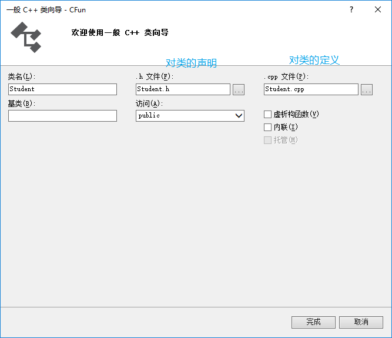

**Student.h：**

```cpp
#pragma once
class Student
{
public:
    Student();
    ~Student();
    void SayHello();
};
```

**Student.cpp：**

```cpp
#include "Student.h"
#include <iostream>
Student::Student()
{
}
Student::~Student()
{
}
void Student::SayHello()
{
    std::cout << "Hello! I'm a student!";
}
```

**Source.cpp：**

```cpp
#include <iostream>
#include "Student.h"
int main()
{
    Student *pStu = new Student();
    pStu->SayHello();
    return 0;
}
```

## 方法永远都是类（或结构体）的成员

<font style="color:#000000;background-color:#FFFFFF;">C# namespace 里不能有方法。</font>


# 方法的声明与调用

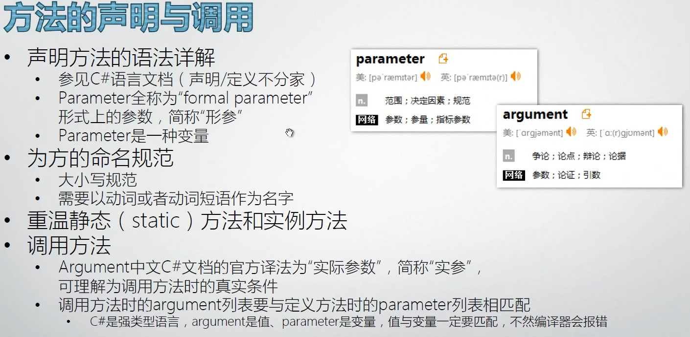


+ <font style="color:#000000;background-color:#FFFFFF;">C# 声明/定义不分家</font>
+ <font style="color:#000000;background-color:#FFFFFF;">C++ 声明放在头文件，定义放在代码文件里面</font>

## C# 语言定义文档 —— 方法声明

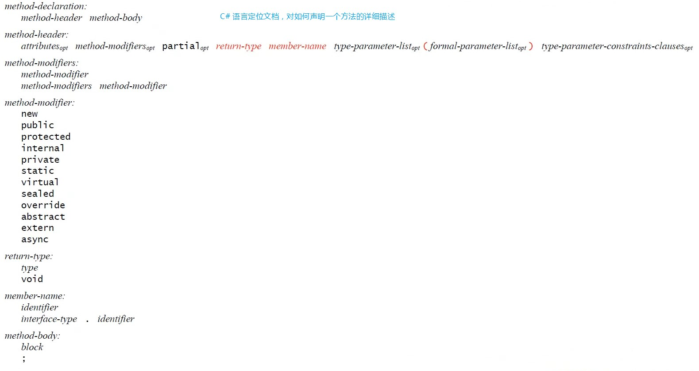


# 构造器（一种特殊的方法）

+ 构造器（constructor）是类型的成员之一
+ 狭义的构造器指的是“实例构造器”（instance constructor）
+ 如何调用构造器
+ 声明构造器
+ 构造器的内存原理
  构造函数译为构造器，成员函数译为方法，它们本质都还是函数。

## 默认构造器

```csharp
namespace ConstructorExample
{
    class Program
    {
        static void Main(string[] args)
        {
            Student stu = new Student();
            Console.WriteLine(stu.ID);
        }
    }
    class Student
    {
        public int ID;
        public string Name;
    }
}
```

默认构造器将`int`型的 ID 初始化为 0：

```csharp
0
请按任意键继续. . .
```

## 无参数默认构造器

```csharp
namespace ConstructorExample
{
    class Program
    {
        static void Main(string[] args)
        {
            Student stu = new Student();
            Console.WriteLine(stu.ID);
            Console.WriteLine(stu.Name);
        }
    }
    class Student
    {
        public Student()
        {
            ID = 1;
            Name = "No name";
        }
        public int ID;
        public string Name;
    }
}
```

<font style="color:#000000;background-color:#FFFFFF;">输出：</font>

```csharp
1
No name
请按任意键继续. . .
```

## 带参数构造器

一旦有了带参数的构造器，默认构造器就不存在了。若还想调用无参数构造器，必需自己写。

```csharp
namespace ConstructorExample
{
    class Program
    {
        static void Main(string[] args)
        {
            Student stu = new Student(2, "Mr.Okay");
            Console.WriteLine(stu.ID);
            Console.WriteLine(stu.Name);
        }
    }
    class Student
    {
        public Student(int initId,string initName)
        {
            ID = init Id;
            Name = initName;
        }
        public int ID;
        public string Name;
    }
}
```

输出：

```csharp
2
Mr.Okay
请按任意键继续. . .
```

> **<font style="color:#AAAAAA;background-color:#FFFFFF;">Code Snippet </font>**  
> <font style="color:#AAAAAA;background-color:#FFFFFF;">ctor + TAB * 2：快速生成构造器代码片段 </font>
>
> 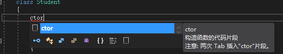


## 构造器内存原理

### 默认构造器图示

图中左侧代指栈内存，右侧代指堆内存。  
注意栈内存分配是从高地址往低地址分配，直到分配到栈顶。

```csharp
public int ID;// int 结构体 占4个字节
public string Name;// string 引用类型 占4个字节 存储的是实例的地址
```

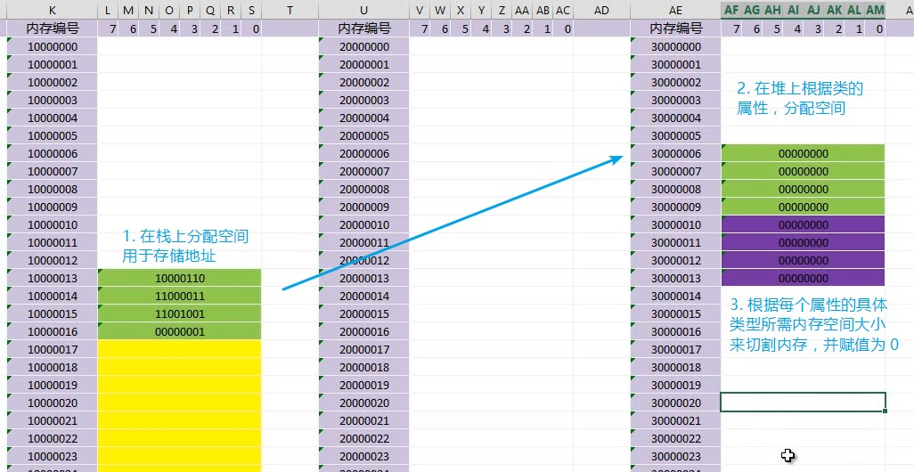


### 带参数构造器图示

```csharp
Student stu = new Student(1, "Mr.Okay");
```

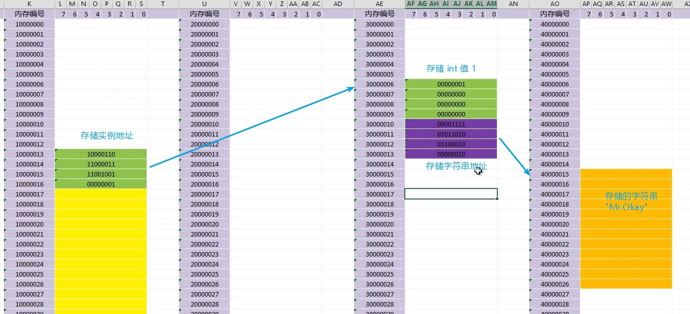


# 方法的重载（Overload）

## 调用重载方法的示例

`Console.WriteLine()` 有多达 19 个重载。
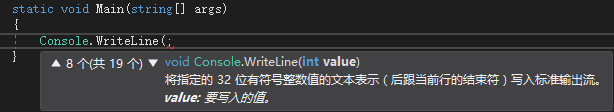


## 声明带有重载的方法

+ 方法签名（method signature）由方法的名称、类型形参的个数和它的每一个形参（按从左到右的顺序）的类型和种类（值、引用或输出）组成。<font style="color:#FA541C;">方法签名不包含返回类型</font>
+ 实例构造函数签名由它的每一个形参（按从左到右的顺序）的类型和种类（值、引用或输出）组成
+ 重载决策（到底调用哪一个重载）：用于在给定了参数列表和一组候选函数成员的情况下，选择一个最佳的函数成员来实施调用
  <font style="color:#000000;background-color:#FFFFFF;">“类型形参”是用在泛型里面的。</font>

```csharp
public int Add(int a, int b)
{
    return a + b;
}
public int Add<T>(int a, int b)
{
    T t;//...
    return a + b;
}
```

<font style="color:#000000;background-color:#FFFFFF;">参数种类不同示例：</font>

```csharp
public int Add(int a, int b)
{
    return a + b;
}
public int Add(ref int a, int b)
{
    return a + b;
}
public int Add(int a,out int b)
{
    b = 100;
    return a + b;
}
```

# 如何对方法进行 debug

+ 设置断点（breakpoint）
+ 观察方法调用时的 call stack
+ Step-in、Step-over、Step-out
+ 观察局部变量的值与变化

## call stack

<font style="color:#000000;background-color:#FFFFFF;">通过 call stack 可以直观的追溯方法调用链。</font>
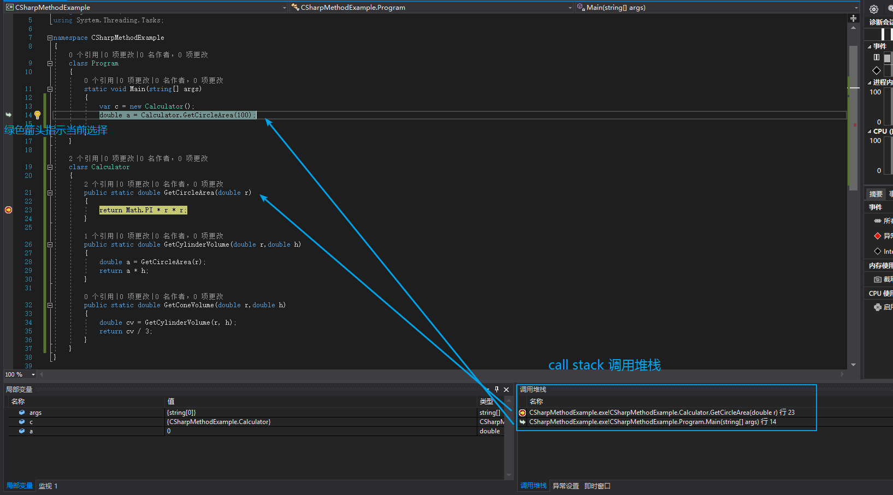


## Step-out

Step-out（Shift + F11）用于跳出当前方法并返回到调用它的方法。 

这在跨文件方法调用、大项目里面很有用，你想知道到底谁调用了这个方法，直接一个 Shift + F11 就跳过去了。

## 钉变量

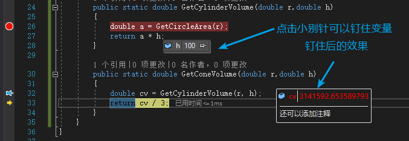


# 方法的调用与栈

+ 方法调用时栈内存的分配
  - 对 stack frame 的分析
    stack frame：一个方法被调用时，它在栈内存中的布局。
    C# 中调用方法时的变量归 Caller（主调函数） 管，不归 Callee（被调用者） 管。  
    压变量入栈，C# 是从左至右的顺序。
    图示是为了重点解释方法、变量、参数的压栈，实际情况下还要压入返回地址等。   
    返回值一般存在 CPU 的寄存器里面，特殊情况寄存器存不下该返回值时，会到栈上开辟空间。
    stack overflow 就是栈无限向上延伸（分配变量、参数、栈针等），最后溢出了。

## 代码

```csharp
using System;
namespace CSharpMethodExample
{
    class Program
    {
        static void Main(string[] args)
        {
            double result = Calculator.GetConeVolume(100, 90);
        }
    }
    class Calculator
    {
        public static double GetCircleArea(double r)
        {
            return Math.PI * r * r;
        }
        public static double GetCylinderVolume(double r,double h)
        {
            double a = GetCircleArea(r);
            return a * h;
        }
        public static double GetConeVolume(double r,double h)
        {
            double cv = GetCylinderVolume(r, h);
            return cv / 3;
        }
    }
}
```

## 分步讲解

### 1.进入 Main 方法，调用 GetConeVolume 方法前

在栈上开辟了 Main 方法的 stack frame。
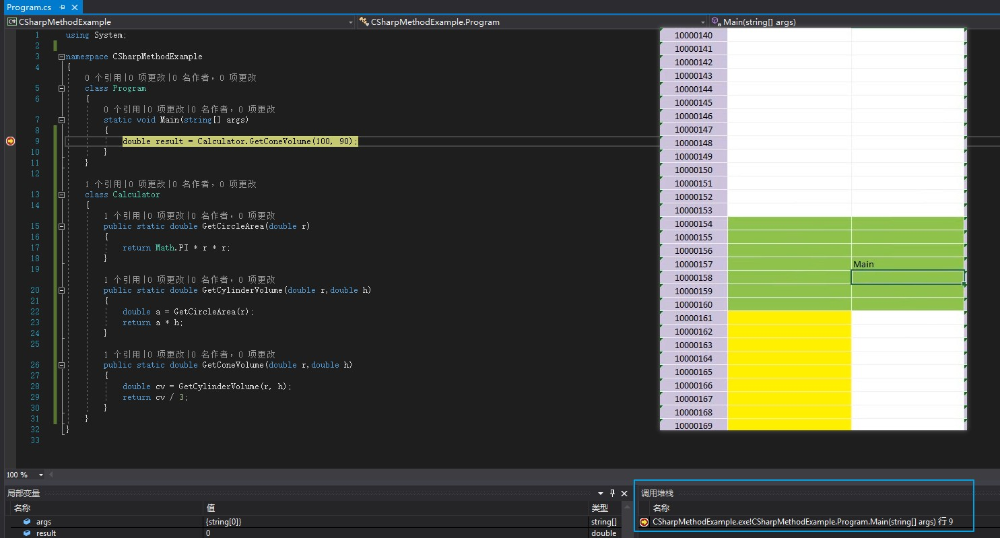


### 2.Main 方法中调用 GetConeVolume 时

将两个参数压入栈中。因为 C# 中调用时的参数归 Caller 管，此处即归 Main 管。
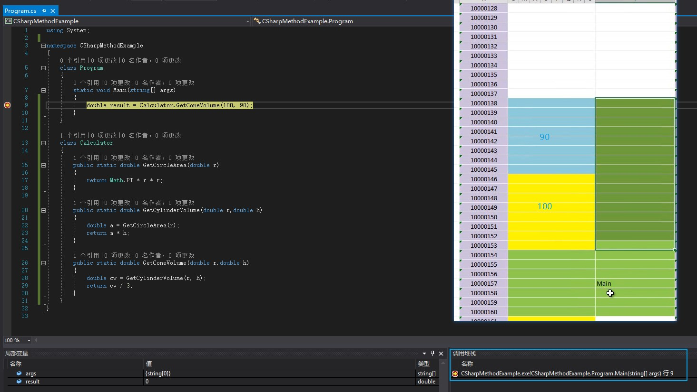


### 3.进入 GetConeVolume 后

局部变量是需要入栈的，GetConeVolume 方法中的 cv 入栈。  
r，h 也是局部变量，但已经作为参数被 Main 方法压入栈了，所以它只需要压 cv 即可。
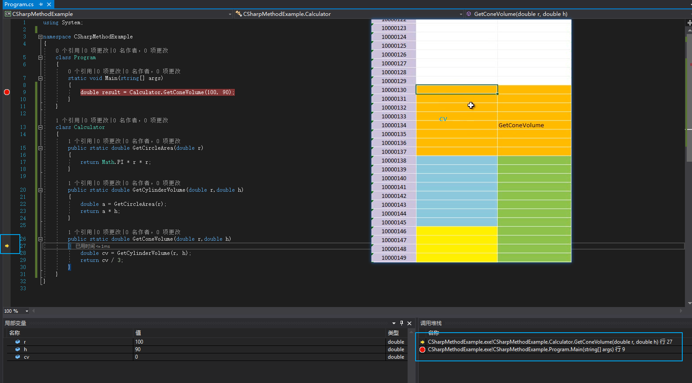


### 4.GetConeVolume 调用 GetCylinderVolume 时

将两个参数压入栈中。
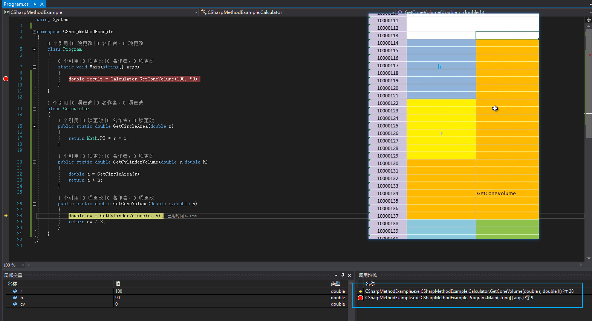


### 5.进入 GetCylinderVolume 后

局部变量 a 入栈。
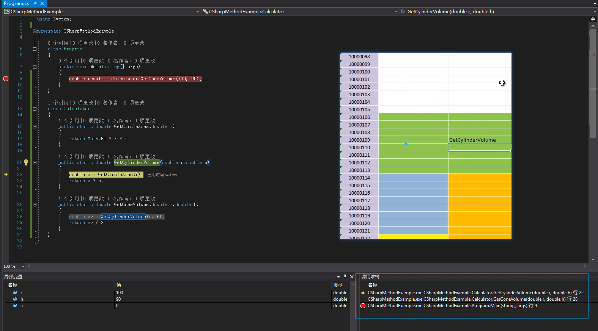


### 6.GetCylinderVolume 调用 GetCircleArea 时

GetCircleArea 只有一个参数，将其压入栈即可。
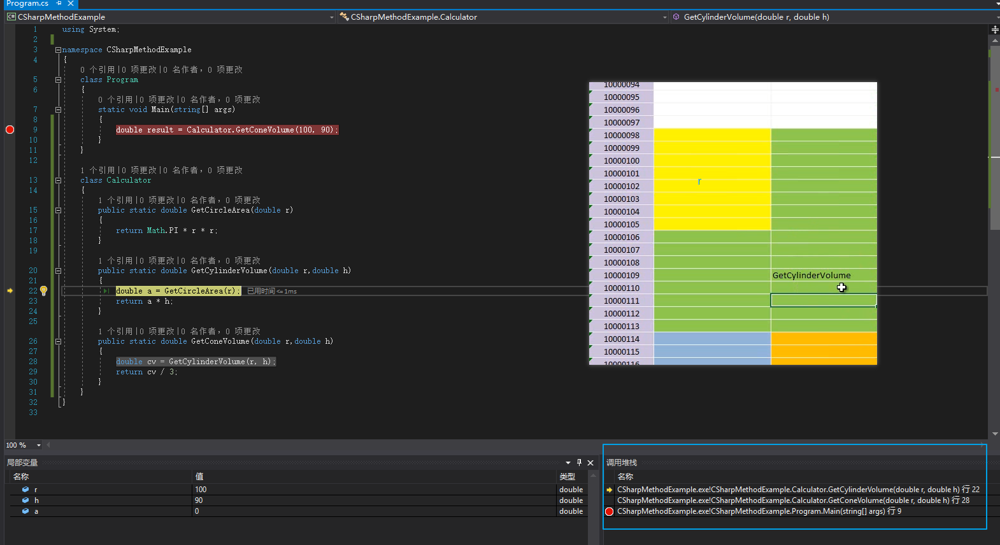


### 7.进入 GetCircleArea 后

GetCircleArea 中没有局部变量，但它在栈上也占内存，它有自己的栈针。
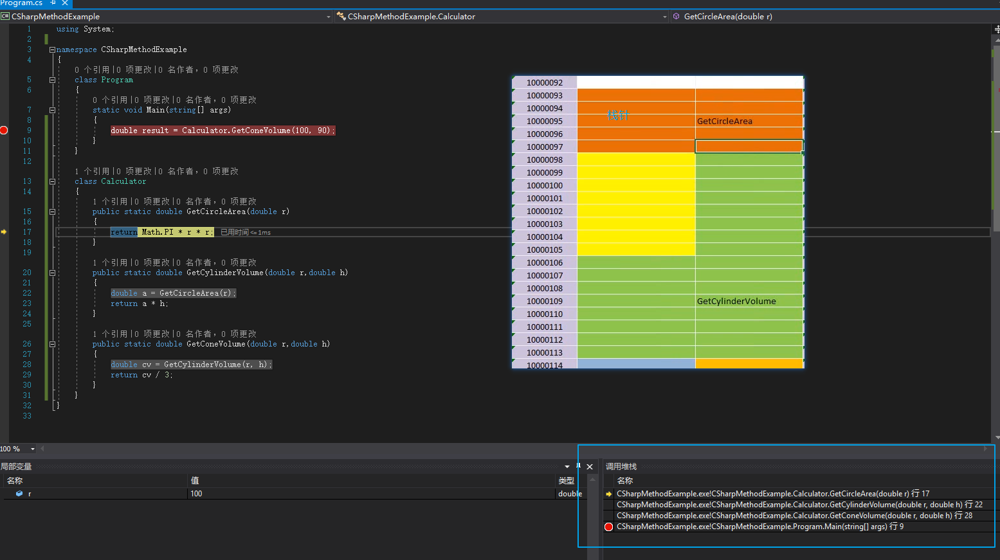


### 8.GetCircleArea 返回后

返回值存在 CPU 的寄存器（register）里面。  
call stack 少了一层。  
函数返回后，它所占有的 stack frame 就清空了。
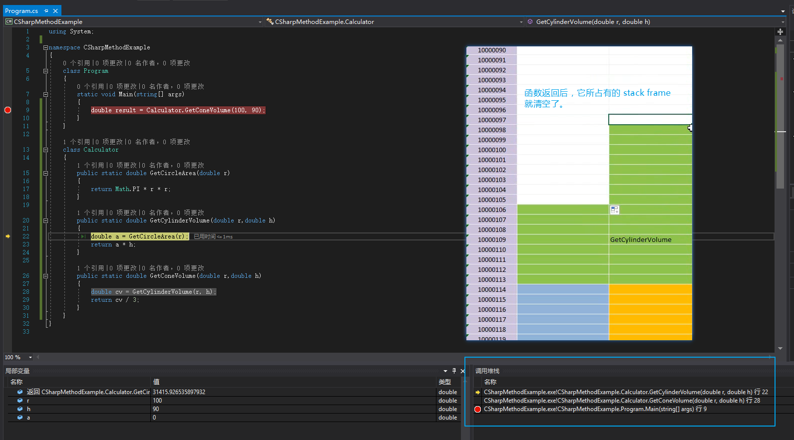


### 9.GetCylinderVolume 返回后

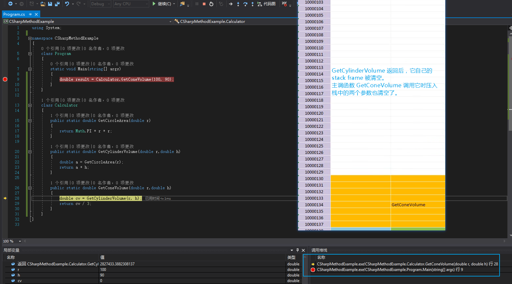


### 10.GetConeVolume 返回后

GetConeVolume 的 stack frame被清空。  
Main 方法中调用 GetConeVolume 时压入栈中的两个参数也出栈了。
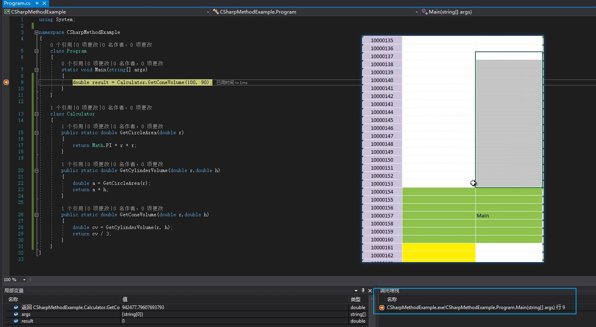


### 11.Main 返回后（程序结束）

Main 方法的 stack frame 也被清空。
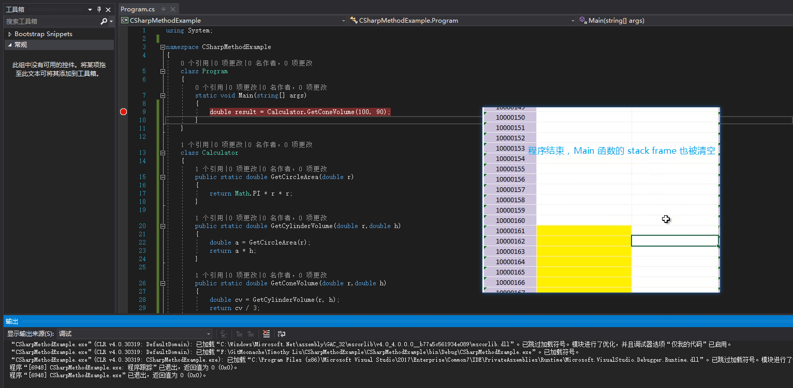


> 更新: 2021-07-16 10:33:59  
> 原文: <https://www.yuque.com/yuejiangliu/dotnet/timothy-csharp-008-009>