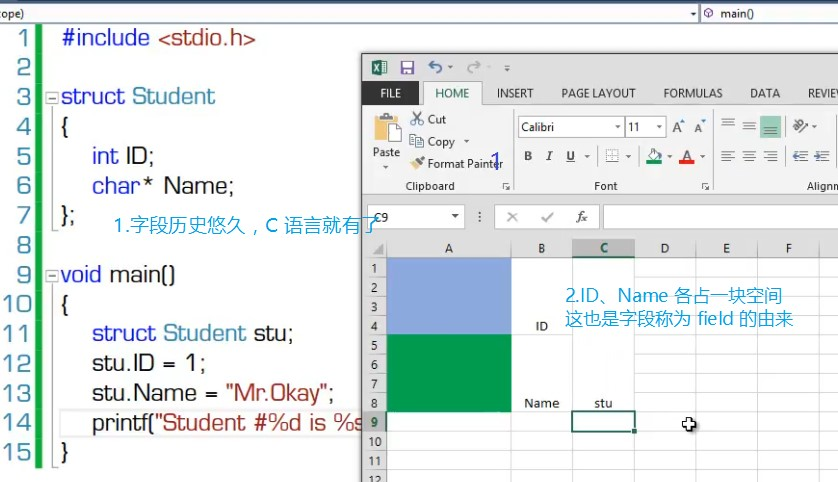

# 017 字段、属性、索引器、常量

<font style="color:#000000;background-color:#FFFFFF;">这四种成员都是用来表示数据的，所以放在一起讲。</font>
<font style="color:#000000;background-color:#FFFFFF;"></font>

| **成员** | **说明**                             |
| -------- | ------------------------------------ |
| 常量     | 与类关联的常量值                     |
| 字段     | 类的变量                             |
| 方法     | 类可执行的计算和操作                 |
| 属性     | 与读写类的命名属性相关联的操作       |
| 索引器   | 与以数组方式索引类的实例相关联的操作 |
| 事件     | 可由类生成的通知                     |
| 运算符   | 类所支持的转换和表达式运算符         |
| 构造函数 | 初始化类的实例或类本身所需的操作     |
| 析构函数 | 在永久丢弃类的实例之前执行的操作     |
| 类型     | 类所声明的嵌套类型                   |

# 字段


1. 字段历史悠久，C 语言就有了
2. ID、Name 各占一块空间，这也是字段称为 field 的由来 
   


## 什么是字段

示例：实例字段与静态字段

```csharp
class Program
{
    static void Main(string[] args)
    {
        var stuList = new List<Student>();
        for (int i = 0; i < 100; i++)
        {
            var stu = new Student
            {
                Age = 24,
                Score = i,
            };
            stuList.Add(stu);
        }
        int totalAge=0;
        int totalScore=0;
        foreach (var stu in stuList)
        {
            totalAge += stu.Age;
            totalScore += stu.Score;
        }
        Student.AverageAge = totalAge / Student.Amout;
        Student.AverageScore = totalScore / Student.Amout;
        Student.ReportAmount();
        Student.ReportAverageAge();
        Student.ReportScore();
    }
    class Student
    {
        public int Age;
        public int Score;
        public static int AverageAge;
        public static int AverageScore;
        public static int Amout;
        public Student()
        {
            Amout++;
        }
        public static void ReportAmount()
        {
            Console.WriteLine(Amout);
        }
        public static void ReportAverageAge()
        {
            Console.WriteLine(AverageAge);
        }
        public static void ReportScore()
        {
            Console.WriteLine(AverageScore);
        }
    }
}
```

## 字段的声明

字段（field）是一种表示与对象或类关联的变量的成员。

+ 对于实例字段，它初始化的时机是在实例创建时
  - 声明实例字段时初始化值与在实例构造器里面初识化实例字段是一样的
+ 对于静态字段，它初始化的时机是在运行环境加载该数据类型时
  - 即静态构造器初始化时
  - 声明静态字段时设置初始化值与在静态构造器里面初始化静态字段其实是一样的
    数据类型被运行环境加载时，它的静态构造器将会被调用，且只被调用一次。
    静态构造器：

```csharp
public static int Amout=100;
static Student()
{
    Amout = 200;
}
```

## 只读字段 readonly

只读字段为实例或类型保存一旦初始化后就不希望再改变的值。

> **Code Shippet**  
> ctor + 2 * TAB：插入构造函数代码片段。

# 属性


**建议：永远使用属性（而不是字段）来暴露数据，即字段永远是 private 或 protected 的。**   
字段只在类内部使用，类之间交换数据，永远只用属性。

## 什么是属性

使用 Get/Set 方法对之前：

```csharp
class Program
{
    static void Main(string[] args)
    {
        var stu1 = new Student()
        {
            Age = 20
        };
        var stu2 = new Student()
        {
            Age = 20
        };
        var stu3 = new Student()
        {
            // 非法值，污染字段
            Age = 200
        };
        var avgAge = (stu1.Age + stu2.Age + stu3.Age) / 3;
        Console.WriteLine(avgAge);
    }
}
class Student
{
    public int Age;
}
```

<font style="color:#000000;background-color:#FFFFFF;">使用 Get/Set 后：</font>

```csharp
class Program
{
    static void Main(string[] args)
    {
        try
        {
            var stu1 = new Student();
            stu1.SetAge(20);
            var stu2 = new Student();
            stu2.SetAge(20);
            var stu3 = new Student();
            stu3.SetAge(200);
            var avgAge = (stu1.GetAge() + stu2.GetAge() + stu3.GetAge()) / 3;
            Console.WriteLine(avgAge);
        }
        catch (Exception ex)
        {
            Console.WriteLine(ex.Message);
        }
    }
}
class Student
{
    private int age;
    public int GetAge()
    {
        return age;
    }
    public void SetAge(int value)
    {
        if (value >= 0 && value <= 120)
        {
            age = value;
        }
        else
        {
            throw new Exception("Age value has error.");
        }
    }
}
```

使用 Get/Set 来保护字段的方法至今仍在 C++、JAVA 里面流行（即 C++、JAVA 里面是没有属性的）。  
因为 Get/Set 写起来冗长，微软应广大程序员请求，给 C# 引入了属性。
引入属性后：

```csharp
class Program
{
    static void Main(string[] args)
    {
        try
        {
            var stu1 = new Student();
            stu1.Age=20;
            var stu2 = new Student();
            stu2.Age = 20;
            var stu3 = new Student();
            stu3.Age = 200;
            var avgAge = (stu1.Age + stu2.Age + stu3.Age) / 3;
            Console.WriteLine(avgAge);
        }
        catch (Exception ex)
        {
            Console.WriteLine(ex.Message);
        }
    }
}
class Student
{
    private int age;
    public int Age
    {
        get
        {
            return age;
        }
        set
        {
            if (value >= 0 && value <= 120)
            {
                age = value;
            }
            else
            {
                throw new Exception("Age value has error.");
            }
        }
    }
}
```

引入属性后代码简洁明了许多。
语法糖背后的秘密：   
参照 [013,014,015,016 表达式、语句详解](https://www.yuque.com/yuejiangliu/dotnet/timothy-csharp-013-016#bad91752) 用 ildasm 反编译工具，反编译上面的示例。   
发现编译器使用语法糖，把背后比较复杂的机制掩蔽了起来，即属性也是一种语法糖。 


## 属性的声明


> **Code Snippet**
>
> 1. prop + 2 * TAB：属性的简略声明
> 2. propfull + 2 * TAB：属性的完整声明
> 3. 


### 动态计算值的属性

主动计算，每次获取 CanWork 时都计算，适用于 CanWork 属性使用频率低的情况。

```csharp
class Program
{
    static void Main(string[] args)
    {
        try
        {
            var stu1 = new Student();
            stu1.Age = 12;
            Console.WriteLine(stu1.CanWork);
        }
        catch (Exception ex)
        {
            Console.WriteLine(ex.Message);
        }
    }
}
class Student
{
    private int age;
    public int Age
    {
        get { return age; }
        set
        {
            age = value;
        }
    }
    public bool CanWork
    {
        get
        {
            return age > 16;
        }
    }
}
```

<font style="color:#000000;background-color:#FFFFFF;">被动计算，只在 Age 赋值时计算一次，适用于 Age 属性使用频率低，CanWork 使用频率高的情况。</font>

```csharp
class Program
{
    static void Main(string[] args)
    {
        try
        {
            var stu1 = new Student();
            stu1.Age = 12;
            Console.WriteLine(stu1.CanWork);
        }
        catch (Exception ex)
        {
            Console.WriteLine(ex.Message);
        }
    }
}
class Student
{
    private int age;
    public int Age
    {
        get { return age; }
        set
        {
            age = value;
            CalculateCanWork();
        }
    }
    private bool canWork;
    public bool CanWork
    {
        get { return canWork; }
    }
    private void CalculateCanWork()
    {
        canWork = age > 16;
    }
}
```

# 索引器

+ 什么是索引器
  - 索引器（indexer）是这样一种成员：它使对象能够用与数组相同的方式（即使用下标）进行索引
+ 索引器的声明
  - 参加 C#语言定义文档
  - 注意：没有静态索引器

> **Code Snippet**  
> index + 2 * TAB：快速声明索引器
>
> 索引器一般都是用在集合上面，像如下示例这样用是很少见的（只是为了讲解方便）。

```csharp
class Program
{
    static void Main(string[] args)
    {
        var stu = new Student();
        stu["Math"] = 90;
        stu["Math"] = 100;
        var mathScore = stu["Math"];
        Console.WriteLine(mathScore);
    }
}
class Student
{
    private Dictionary<string, int> scoreDictionary = new Dictionary<string, int>();
    public int? this[string subject]
    {
        get
        {
            if (scoreDictionary.ContainsKey(subject))
            {
                return scoreDictionary[subject];
            }
            else
            {
                return null;
            }
        }
        set
        {
            if (value.HasValue == false)
            {
                throw new Exception("Score cannot be null");
            }
            if (scoreDictionary.ContainsKey(subject))
            {
                //  可空类型的 Value 属性才是其真实值。
                scoreDictionary[subject] = value.Value;
            }
            else
            {
                scoreDictionary.Add(subject, value.Value);
            }
        }
    }
}
```

# 常量

+ 什么是常量
  - 常量（constant）是表示常量值（即，可以在编译时计算的值）的类成员
  - 常量隶属于类型而不是对象，即没有“实例常量”
    * “实例常量”的角色由只读实例字段来担当
  - 注意区分成员常量与局部常量
+ 常量的声明
+ 各种“<font style="color:#FA541C;">只读</font>”的应用场景
  - 为了提高程序可读性和执行效率 —— 常量
  - 为了防止对象的值被改变 —— 只读字段
  - 向外暴露不允许修改的数据 —— 只读属性（静态或非静态），功能与常量有一些重叠
  - 当希望成为常量的值其类型不能被常量声明接受时（类/自定义结构体） —— 静态只读字段
    


## 各种“只读”的应用场景

+ 常量：隶属于类型，没有所谓的实例常量
+ 只读字段：只有一次初始化机会，就是在声明它时初始化（等价于在构造函数中初始化）
+ 只读属性：对于类使用静态只读属性，对于实例使用实例只读属性
  - 要分清没有 Set，与 private Set 的区别
  - 常量比静态只读属性性能高，因为编译时，编译器将用常量的值代替常量标识符
+ 静态只读字段：字段没有类型局限，但常量只能是简单类型，不能是类/自定义结构体类型

> 更新: 2020-04-18 13:10:01  
> 原文: <https://www.yuque.com/yuejiangliu/dotnet/timothy-csharp-017>