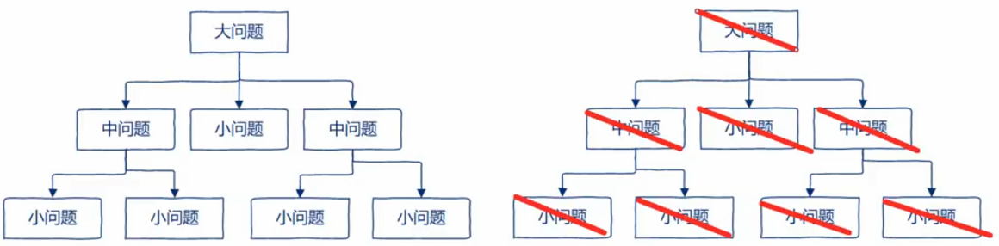
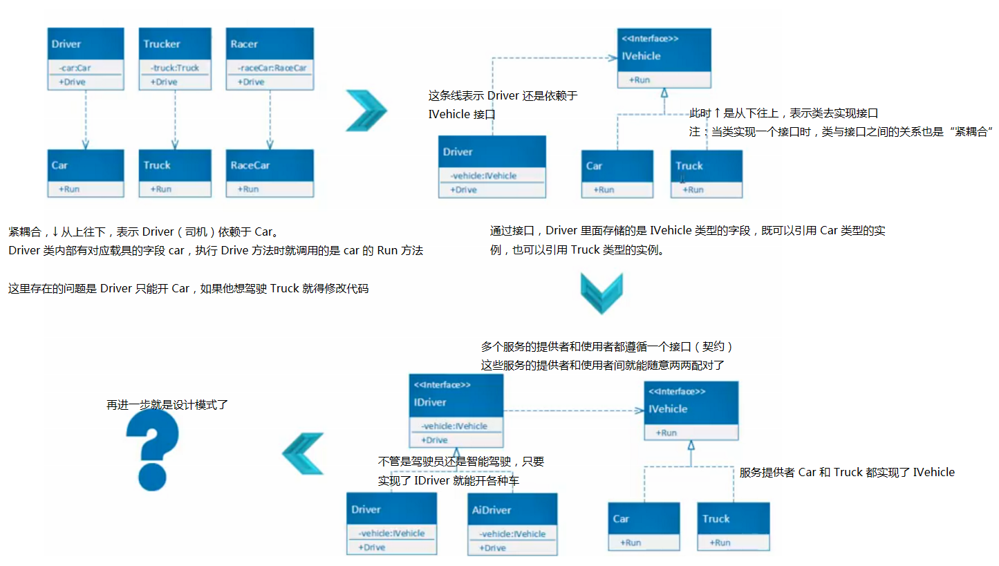
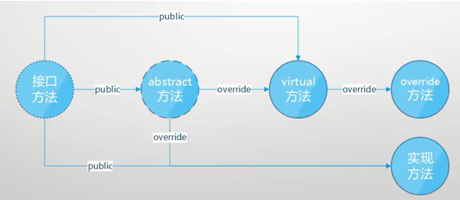

# 028 接口，依赖反转，单元测试

# 接口

abstract 中的抽象方法只规定了不能是 private 的，而接口中的“抽象方法”只能是 public 的。
这样的成员访问级别就决定了接口的本质：接口是服务消费者和服务提供者之间的契约。
既然是契约，那就必须是透明的，对双方都是可见的。
除了 public，abstract 的抽象方法还可以是 protected 和 internal，它们都不是给功能调用者准备的，各自有特定的可见目标。
**<font style="color:#FA541C;">接口即契约(contract)</font>**

契约使自由合作成为可能，所谓自由合作就是一份合同摆在这里，它即约束服务的使用者也约束服务的提供者。如果该契约的使用者和提供者有多个，它们之间还能自由组合。

## 接口契约示例

未使用接口时：

```csharp
class Program
{
    static void Main(string[] args)
    {
        int[] nums1 = new int[] { 1, 2, 3, 4, 5 };
        ArrayList nums2 = new ArrayList { 1, 2, 3, 4, 5 };
        Console.WriteLine(Sum(nums1));
        Console.WriteLine(Avg(nums1));
        Console.WriteLine(Sum(nums2));
        Console.WriteLine(Avg(nums2));
    }
    static int Sum(int[] nums)
    {
        int sum = 0;
        foreach (var n in nums)
        {
            sum += n;
        }
        return sum;
    }
    static double Avg(int[] nums)
    {
        int sum = 0;
        double count = 0;
        foreach (var n in nums)
        {
            sum += n;
            count++;
        }
        return sum / count;
    }
    static int Sum(ArrayList nums)
    {
        int sum = 0;
        foreach (var n in nums)
        {
            sum += (int)n;
        }
        return sum;
    }
    static double Avg(ArrayList nums)
    {
        int sum = 0;
        double count = 0;
        foreach (var n in nums)
        {
            sum += (int)n;
            count++;
        }
        return sum / count;
    }
}
```

供方是 nums1 和 nums2，需方是 Sum 和 Avg 这两函数。
需方需要传进来的参数可以迭代就行，别的不关心也用不到。
整型数组的基类是 Array，Array 和 ArrayList 都实现了 IEnumerable。

```csharp
static int Sum(IEnumerable nums)
{
    int sum = 0;
    foreach (var n in nums)
    {
        sum += (int)n;
    }
    return sum;
}
static double Avg(IEnumerable nums)
{
    int sum = 0;
    double count = 0;
    foreach (var n in nums)
    {
        sum += (int)n;
        count++;
    }
    return sum / count;
}
```

## 依赖与耦合

现实世界中有分工、合作，面向对象是对现实世界的抽象，它也有分工、合作。
类与类、对象与对象间的分工、合作。
在面向对象中，合作有个专业术语“依赖”，依赖的同时就出现了耦合。依赖越直接，耦合就越紧。
Car 与 Engine 紧耦合的示例：

```csharp
class Program
{
    static void Main(string[] args)
    {
        var engine = new Engine();
        var car = new Car(engine);
        car.Run(3);
        Console.WriteLine(car.Speed);
    }
}
class Engine
{
    public int RPM { get; private set; }
    public void Work(int gas)
    {
        this.RPM = 1000 * gas;
    }
}
class Car
{
    // Car 里面有个 Engine 类型的字段，它两就是紧耦合了
    // Car 依赖于 Engine
    private Engine _engine;
    public int Speed { get; private set; }
    public Car(Engine engine)
    {
        _engine = engine;
    }
    public void Run(int gas)
    {
        _engine.Work(gas);
        this.Speed = _engine.RPM / 100;
    }
}
```

紧耦合的问题：

1. 基础类一旦出问题，上层类写得再好也没辙
2. 程序调试时很难定位问题源头
3. 基础类修改时，会影响写上层类的其他程序员的工作
   所以程序开发中要尽量避免紧耦合，解决方法就是接口。

接口：

1. 约束调用者只能调用接口中包含的方法
2. 让调用者放心去调，不必关心方法怎么实现的、谁提供的

## 接口解耦示例

以老式手机举例，对用户来说他只关心手机可以接（打）电话和收（发）短信。
对于手机厂商，接口约束了他只要造的是手机，就必须可靠实现上面的四个功能。

用户如果丢了个手机，他只要再买个手机，不必关心是那个牌子的，肯定也包含这四个功能，上手就可以用。用术语来说就是“人和手机是解耦的”。

```csharp
class Program
{
    static void Main(string[] args)
    {
        //var user = new PhoneUser(new NokiaPhone());
        var user = new PhoneUser(new EricssonPhone());
        user.UsePhone();
        Console.ReadKey();
    }
}
class PhoneUser
{
    private IPhone _phone;
    public PhoneUser(IPhone phone)
    {
        _phone = phone;
    }
    public void UsePhone()
    {
        _phone.Dail();
        _phone.PickUp();
        _phone.Receive();
        _phone.Send();
    }
}
interface IPhone
{
    void Dail();
    void PickUp();
    void Send();
    void Receive();
}
class NokiaPhone : IPhone
{
    public void Dail()
    {
        Console.WriteLine("Nokia calling ...");
    }
    public void PickUp()
    {
        Console.WriteLine("Hello! This is Tim!");
    }
    public void Send()
    {
        Console.WriteLine("Nokia message ring ...");
    }
    public void Receive()
    {
        Console.WriteLine("Hello!");
    }
}
class EricssonPhone : IPhone
{
    public void Dail()
    {
        Console.WriteLine("Ericsson calling ...");
    }
    public void PickUp()
    {
        Console.WriteLine("Hello! This is Tim!");
    }
    public void Send()
    {
        Console.WriteLine("Ericsson ring ...");
    }
    public void Receive()
    {
        Console.WriteLine("Good evening!");
    }
}
```

没有用接口时，如果一个类坏了，你需要 Open 它再去修改，修改时可能产生难以预料的副作用。引入接口后，耦合度大幅降低，换手机只需要换个类名，就可以了。
等学了反射后，连这里的一行代码都不需要改，只要在配置文件中修改一个名字即可。
在代码中只要有可以替换的地方，就一定有接口的存在；接口就是为了解耦（松耦合）而生。
松耦合最大的好处就是让功能的提供方变得可替换，从而降低紧耦合时“功能的提供方不可替换”带来的高风险和高成本。

+ 高风险：功能提供方一旦出问题，依赖于它的功能都挂
+ 高成本：如果功能提供方的程序员崩了，会导致功能使用方的整个团队工作受阻

# 依赖反转原则

解耦在代码中的表现就是依赖反转。
单元测试就是依赖反转在开发中的直接应用和直接受益者。



人类解决问题的典型思维：自顶向下，逐步求精。
在面向对象里像这样来解决问题时，这些问题就变成了不同的类，且类和类之间紧耦合，它们也形成了这样的金字塔。
依赖反转给了我们一种新思路，用来**<font style="color:#E84C22;">平衡</font>**自顶向下的思维方式。

> 平衡：不要一味推崇依赖反转，很多时候自顶向下就很好用，就该用。
>
> 


# 单元测试

用例子来展示接口、解耦和依赖反转原则是怎么被单元测试应用的。
紧耦合：

```csharp
class Program
{
    static void Main(string[] args)
    {
        var fan = new DeskFan(new PowerSupply());
        Console.WriteLine(fan.Work());
    }
}
// 背景：电扇有个电源，电源输出电流越大电扇转得越快
// 电源输出有报警上限
class PowerSupply
{
    public int GetPower()
    {
        //return 100;
        return 210;
    }
}
class DeskFan
{
    private PowerSupply _powerSupply;
    public DeskFan(PowerSupply powerSupply)
    {
        _powerSupply = powerSupply;
    }
    public string Work()
    {
        int power = _powerSupply.GetPower();
        if (power <= 0)
        {
            return "Won't work.";
        }
        else if (power < 100)
        {
            return "Slow";
        }
        else if (power < 200)
        {
            return "Work fine";
        }
        else
        {
            return "Warning";
        }
    }
}
```

现在的问题是：我要测试电扇是否能按预期工作，我必须去修改 PowerSupply 里面的代码，这违反了开闭原则。
而且可能有除了电扇外的别的电器也连到了这个电源上面（在其他位置也引用了 PowerSupply），为了测试电扇工作就去改电源，很可能会造成别的问题。
接口的产生：自底向上（重构）和自顶向下（设计）。
只有对业务足够熟悉才能做到自顶向下，更多时候是一边写一边重构，现在我们就用接口去对电源和风扇进行解耦。

```csharp
class Program
{
    static void Main(string[] args)
    {
        var fan = new DeskFan(new PowerSupply());
        Console.WriteLine(fan.Work());
    }
}
public interface IPowerSupply
{
    int GetPower();
}
public class PowerSupply : IPowerSupply
{
    public int GetPower()
    {
        return 110;
    }
}
public class DeskFan
{
    private IPowerSupply _powerSupply;
    public DeskFan(IPowerSupply powerSupply)
    {
        _powerSupply = powerSupply;
    }
    public string Work()
    {
        int power = _powerSupply.GetPower();
        if (power <= 0)
        {
            return "Won't work.";
        }
        else if (power < 100)
        {
            return "Slow";
        }
        else if (power < 200)
        {
            return "Work fine";
        }
        else
        {
            return "Warning";
        }
    }
}
```

有接口后，我们就可以专门创建一个用于测试的电源类。

1. 为了单元测试，将相关的类和接口都显式声明为 public
2. 示例本身是个 .NET Core Console App，其相应的测试项目最好用 xUnit（官方之选）
3. 测试项目命名：被测试项目名.Tests，例如 InterfaceExample.Tests
4. 测试项目要引用被测试项目
5. 测试项目里面的类和被测试项目的类一一对应，例如 DeskFanTests.cs

```csharp
using Xunit;
namespace InterfaceExample.Tests
{
    public class DeskFanTest
    {
        [Fact]
        public void PowerLowerThanZero_OK()
        {
            var fan = new DeskFan(new PowerSupplyLowerThanZero());
            var expected = "Won't work.";
            var actual = fan.Work();
            Assert.Equal(expected, actual);
        }
        [Fact]
        public void PowerHigherThan200_Warning()
        {
            var fan = new DeskFan(new PowerSupplyHigherThan200());
            // 注：此处为了演示，实际程序那边先故意改成了 Exploded!
            var expected = "Warning";
            var actual = fan.Work();
            Assert.Equal(expected, actual);
        }
    }
    class PowerSupplyLowerThanZero : IPowerSupply
    {
        public int GetPower()
        {
            return 0;
        }
    }
    class PowerSupplyHigherThan200 : IPowerSupply
    {
        public int GetPower()
        {
            return 220;
        }
    }
}
```

每当有新的代码提交后，就将 TestCase 全部跑一遍，如果原来通过了的，这次却没有通过（称为**回退**），就开始 Debug。
平时工作中写测试 case 和写代码的重要性是一样的，没有测试 case 监控的代码的正确性、可靠度都不能保证。
程序想要能被测试，就需要引入接口、松耦合、依赖反转。

## Mock

现在的一个问题就是：为了进行测试，我们要不断的创建实现了接口的测试类，造成这些看上去很丑的类越来越多。
可以通过 Mock（模拟） Framework 来解决。
打开测试项目的 NuGet，搜索并安装 Moq（发音就是 Mock）。

```csharp
using Xunit;
using Moq;
namespace InterfaceExample.Tests
{
    public class DeskFanTest
    {
        [Fact]
        public void PowerLowerThanZero_OK()
        {
            var mock = new Mock<IPowerSupply>();
            // 设置该 mock 对应的 GetPower 方法返回 0
            mock.Setup(ps => ps.GetPower()).Returns(() => 0);
            var fan = new DeskFan(mock.Object);
            var expected = "Won't work.";
            var actual = fan.Work();
            Assert.Equal(expected, actual);
        }
        [Fact]
        public void PowerHigherThan200_Warning()
        {
            var mock = new Mock<IPowerSupply>();
            mock.Setup(ps => ps.GetPower()).Returns(() => 220);
            var fan = new DeskFan(mock.Object);
            var expected = "Warning";
            var actual = fan.Work();
            Assert.Equal(expected, actual);
        }
    }
}
```

# 总结



各种方法间的关系

+ 接口方法用虚线圆表示接口方法是纯虚方法
  - 接口方法的修饰符一定是 public
+ abstract 比纯虚方法稍微实现了点，但并未完全实现，其实现还要下推出去
  - 从 abstract 到 virtual 和实现方法必须加 override
+ virtual、override 和实现方法是有了逻辑有了方法体的方法
  - 从 virtual 到 override 方法也必须加 override

> 更新: 2020-04-18 17:48:02  
> 原文: <https://www.yuque.com/yuejiangliu/dotnet/timothy-csharp-028>