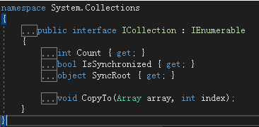
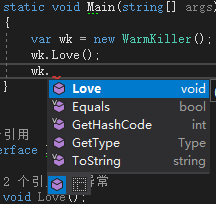

# 029 接口隔离，反射，特性，依赖注入

# 接口隔离

接口即契约：甲方“我不会多要”；乙方“我不会少给”。

+ 乙方不会少给：硬性规定，即一个类只要实现了接口，就必需实现接口里面的所有方法，一旦未全部实现，类就还只是个抽象类，仍然不能实例化
+ 甲方不会多要：软性规定，是个设计问题

## 胖接口及其产生原因

观察传给调用者的接口里面有没有一直没有调用的函数成员，如果有，就说明传进来的接口类型太大了。换句话说，这个“胖”接口是由两个或两个以上的小接口合并起来的。

### 设计失误

设计失误：把太多的功能包含在一个接口里面

+ 这就导致实现该接口的类违反了单一职责原则
  - 单一职责原则：一个类只做一件（或一组相关的）事
+ 接口隔离原则是从服务调用者的角度来看接口类型，单一职责原则是从服务提供者的角度来看接口类型
+ 解决方案就是把胖接口拆成单一的小接口（把本质不同的功能隔离开）
  例子：背景是 Driver（小女生）撞车了，小男生安慰她以后可以开 Tank 上班。

```csharp
using System;
namespace IspExample
{
    class Program
    {
        static void Main(string[] args)
        {
            var driver = new Driver(new Car());
            driver.Drive();
        }
    }
    class Driver
    {
        private IVehicle _vehicle;
        public Driver(IVehicle vehicle)
        {
            _vehicle = vehicle;
        }
        public void Drive()
        {
            _vehicle.Run();
        }
    }
    interface IVehicle
    {
        void Run();
    }
    class Car : IVehicle
    {
        public void Run()
        {
            Console.WriteLine("Car is running ...");
        }
    }
    class Truck : IVehicle
    {
        public void Run()
        {
            Console.WriteLine("Truck is running ...");
        }
    }
    interface ITank
    {
        void Fire();
        void Run();
    }
    class LightTank : ITank
    {
        public void Fire()
        {
            Console.WriteLine("Boom!");
        }
        public void Run()
        {
            Console.WriteLine("Ka ka ka ...");
        }
    }
    class MediumTank : ITank
    {
        public void Fire()
        {
            Console.WriteLine("Boom!!");
        }
        public void Run()
        {
            Console.WriteLine("Ka! ka! ka! ...");
        }
    }
    class HeavyTank : ITank
    {
        public void Fire()
        {
            Console.WriteLine("Boom!!!");
        }
        public void Run()
        {
            Console.WriteLine("Ka!! ka!! ka!! ...");
        }
    }
}
```

Driver 要开 Tank，第一种方法就是将 IVehicle 改成 ITank：

```csharp
class Program
{
    static void Main(string[] args)
    {
        var driver = new Driver(new HeavyTank());
        driver.Drive();
    }
}
class Driver
{
    private ITank _tank;
    public Driver(ITank tank)
    {
        _tank = tank;
    }
    public void Drive()
    {
        _tank.Run();
    }
}
```

此时就出现了胖接口的问题，Driver 只是个小女生，ITank 里面 Fire 永远都用不到。
将 Fire 和 Run 这两个完全不同的功能分隔开，分隔到两个不同的接口里面去。
下面也展示了接口的多实现。

```csharp
class Program
{
    static void Main(string[] args)
    {
        var driver = new Driver(new HeavyTank());
        driver.Drive();
    }
}
class Driver
{
    private IVehicle _vehicle;
    public Driver(IVehicle vehicle)
    {
        _vehicle = vehicle;
    }
    public void Drive()
    {
        _vehicle.Run();
    }
}
interface IVehicle
{
    void Run();
}
...
interface IWeapon
{
    void Fire();
}
interface ITank : IVehicle, IWeapon { }
```

现在 Driver 里面又只需包含 IVehicle 类型字段了。
注：在使用接口隔离原则和单一职责原则时不要过犹不及，过头了就会产生很多细碎的接口和类，使用时必须把握度。

### 传了个大接口

传给调用者的胖接口是由两个设计很好的小接口合并而来的，本来应该传一个小接口就可以了，结果却传了个大接口。
这种情况的问题在于你可能把原来合格的服务提供者给拒之门外了。
例如上例中，将 Driver 类里面的 IVehicle 改成 ITank 后，能够作为服务提供者的就只剩下三个 Tank 类了，Car 和 Truck 这两个好好的交通工具都被挡在门外了。
下面以枚举举例，本来枚举只需要实现了 IEnumerable，结果你传了个 ICollection，就无法对数组进行 Sum 操作了。
注：ICollection 实现了 IEnumerable




```csharp
class Program
{
    static void Main(string[] args)
    {
        int[] nums1 = { 1, 2, 3, 4, 5 };
        ArrayList nums2 = new ArrayList { 1, 2, 3, 4, 5 };
        Console.WriteLine(Sum(nums1));
        Console.WriteLine(Sum(nums2));
        // 可以迭代
        var num3 = new ReadOnlyCollection(nums1);
        foreach (var n in num3)
        {
            Console.WriteLine(n);
        }
        Console.WriteLine(Sum(num3));
    }
    // 调用者绝不多要
    // static int Sum(ICollection nums)
    static int Sum(IEnumerable nums)
    {
        int sums = 0;
        foreach (var n in nums)
        {
            sums += (int)n;
        }
        return sums;
    }
}
class ReadOnlyCollection : IEnumerable
{
    private int[] _array;
    public ReadOnlyCollection(int[] array)
    {
        _array = array;
    }
    public IEnumerator GetEnumerator()
    {
        return new Enumerator(this);
    }
    // 为了避免污染整个名称空间，所以用了成员类
    public class Enumerator : IEnumerator
    {
        private ReadOnlyCollection _collection;
        private int _head;
        public Enumerator(ReadOnlyCollection collection)
        {
            _collection = collection;
            _head = -1;
        }
        public object Current
        {
            get
            {
                // 因为 Enumerator 就在 ReadOnlyCollection 内部
                // 所以能访问 private 的 _array 成员
                object o = _collection._array[_head];
                return o;
            }
        }
        public bool MoveNext()
        {
            return ++_head < _collection._array.Length;
        }
        public void Reset()
        {
            _head = -1;
        }
    }
}
```

## 显式接口实现

接口隔离的第三个例子，专门用来展示 C# 特有的能力 —— 显式接口实现。
C# 能把隔离出来的接口隐藏起来，直到你显式的使用这种接口类型的变量去引用实现了该接口的实例，该接口内的方法才能被你看见被你使用。
这个例子的背景是《这个杀手不太冷》，WarmKiller 有其两面性，即实现 IGentleman 又实现 IKiller。
之前见过的多接口的默认实现方式，该方式从业务逻辑来说是有问题的，一个杀手不应该总将 Kill 方法暴露出来。
换言之，如果接口里面有的方法，我们不希望它轻易被调用，就不能让它轻易被别人看到。

```csharp
class Program
{
    static void Main(string[] args)
    {
        var wk = new WarmKiller();
        wk.Love();
        wk.Kill();
    }
}
interface IGentleman
{
    void Love();
}
interface IKiller
{
    void Kill();
}
class WarmKiller : IGentleman, IKiller
{
    public void Love()
    {
        Console.WriteLine("I will love you forever ...");
    }
    public void Kill()
    {
        Console.WriteLine("Let me kill the enemy ...");
    }
}
```

显式实现：

```csharp
static void Main(string[] args)
{
    IKiller killer = new WarmKiller();
    killer.Kill();
    var wk = (WarmKiller) killer;
    wk.Love();
}
...
class WarmKiller : IGentleman, IKiller
{
    public void Love()
    {
        Console.WriteLine("I will love you forever ...");
    }
    // 显示实现，只有当该类型（WarmKiller）实例被 IKiller 类型变量引用时该方法才能被调用
    void IKiller.Kill()
    {
        Console.WriteLine("Let me kill the enemy ...");
    }
}
```

WarmKiller 类型的实例，只能看到 Love 方法。




# 反射 Reflection

反射：你给我一个对象，我能在不用 new 操作符也不知道该对象的静态类型的情况下，我能给你创建出一个同类型的对象，还能访问该对象的各个成员。
这相当于进一步的解耦，因为有 new 操作符后面总得跟类型，一跟类型就有了紧耦合的依赖。依靠反射创建类型不再需要 new 操作符也无需静态类型，这样使得很多时候耦合可以松到忽略不计。
反射不是 C# 语言的功能，而是 .NET 框架的功能，所以 .NET 框架支持的语言都能使用反射功能。
C# 和 Java 这种托管类型的语言和 C、C++ 这些原生类型的语言区别之一就是反射。
单元测试、依赖注入、泛型编程都是基于反射机制的。
本来反射应该是个很复杂的东西，但因为 .NET 和 C# 设计得精妙，导致时常我们是在使用反射却感觉不到它的存在，也使得反射用起来并不复杂。
当程序处于动态期（dynamic）用户已经用上了，不再是开发时的静态期（static）。动态期用户和程序间的操作是难以预测的，如果你要在开始时将所有情况都预料到，那程序的复杂度难免太高，指不定就是成百上千的 if else，即使你真的这样做了，写出来的程序也非常难维护，可读性很低。很多时候更有可能是我们在编写程序时无法详尽枚举出用户可能进行的操作，这时我们的程序就需要一种**<font style="color:#F5222D;">以不变应万变</font>**的能力。
注：

1. .NET Framework 和 .NET Core 都有反射机制，但它们的类库不太一样，使用反射时用到的一些 API 也略有差别，示例是基于 .NET Core 的
2. 反射毕竟是动态地去内存中获取对象的描述、对象类型的描述，再用这些描述去创建新的对象，整个过程会影响程序性能，所以不要盲目过多地使用反射

## 依赖注入

例一：反射的原理以及和反射密切相关的一个重要技能 —— 依赖注入。
例一沿用的是一开始那个 Tank 的例子。

```csharp
static void Main(string[] args)
{
    // ITank、HeavyTank 这些都算静态类型
    ITank tank = new HeavyTank();
    // ======华丽的分割线======
    // 分割线以下不再使用静态类型
    var t = tank.GetType();
    object o = Activator.CreateInstance(t);
    MethodInfo fireMi = t.GetMethod("Fire");
    MethodInfo runMi = t.GetMethod("Run");
    fireMi.Invoke(o, null);
    runMi.Invoke(o, null);
}
...
```

> CreateInstance 创建出来的对象是 object 的，我们并不知道它的静态类型是什么。
>
> public static object CreateInstance(Type type);
>
> 我们平时大多数是用封装好了的反射方法，上面这种用法很少见。
> 封装好了的反射最重要的一个功能就是依赖注入 DI Dependency Injection。别把前面学的 DIP（依赖反转）和 DI（依赖注入）搞混，但换句话说没有依赖反转也就没有依赖注入。
> 依赖反转是一个概念，依赖注入是在该概念之上结合接口和反射机制所形成的一个应用。

## 依赖注入框架

依赖注入需要借助依赖注入框架，.NET Core 的依赖注入框架就是：Microsoft.Extensions.DependencyInjection。
依赖注入最重要的元素就是 Container（容器），我们把各种各样的类型和它们对应的接口都放在（注册）容器里面。回头我们创建实例时就找容器要。

> 容器又叫做 Service Provider
>
> 在注册类型时我们可以设置容器创建对象的规则：每次给我们一个新对象或是使用单例模式（每次要的时候容器都给我们同一个实例）。
> 具体怎么使用容器此处按下不表，主要还是看依赖注入怎么用。

```csharp
static void Main(string[] args)
{
    // ServiceCollection 就是容器
    var sc = new ServiceCollection();
    // 添加 ITank，并设置其对应的实现类是 HeavyTank
    sc.AddScoped(typeof(ITank), typeof(HeavyTank));
    var sp = sc.BuildServiceProvider();
    // ===========分割线===========
    // 分割线上面是整个程序的一次性注册，下面是具体使用
    ITank tank = sp.GetService<ITank>();
    tank.Fire();
    tank.Run();
}
```

通过上面这种方法，一旦以后我的 ITank 需要改为 MediumTank， 只需要改一句话即可。

```csharp
static void Main(string[] args)
{
    // ServiceCollection 就是容器
    var sc = new ServiceCollection();
    sc.AddScoped(typeof(ITank), typeof(MediumTank));
    sc.AddScoped(typeof(IVehicle), typeof(Car));
    sc.AddScoped<Driver>();
    var sp = sc.BuildServiceProvider();
    // ===========分割线===========
    var driver = sp.GetService<Driver>();
    driver.Drive();
}
```


Driver 创建时本来需要一个 IVehicle 对象，sp 会去容器里面找，又由于我们注册了 IVehicle 的实现类是 Car，所以会自动创建一个 Car 实例传入 Driver 的构造器 。

## 插件式编程

下例演示如何用反射实现更松的耦合，以不变应万变。
这种更松的耦合一般用在插件式编程 —— 不与主体程序一起编译，但与其一同工作。
插件往往由第三方提供，例如 Office 和 VS 的插件。
主体程序一般提供 API（Application Programming Interface） 和 SDK（Software Development Kit）。
第一方程序员是婴儿车生产厂商，婴儿车上面有一排动物头像按钮，一按就模拟动物发声，增强婴儿认知能力。

在程序 `\bin\Debug\netcoreapp2.1` 目录下创建一个 Animals 文件夹。
主体程序：

```csharp
using System;
using System.Collections.Generic;
using System.IO;
using System.Runtime.Loader;
namespace BabyStroller.App
{
    class Program
    {
        static void Main(string[] args)
        {
            var folder = Path.Combine(Environment.CurrentDirectory, "Animals");
            var files = Directory.GetFiles(folder);
            var animalTypes = new List<Type>();
            foreach (var file in files)
            {
                var assembly = AssemblyLoadContext.Default.LoadFromAssemblyPath(file);
                var types = assembly.GetTypes();
                foreach (var t in types)
                {
                    // 如果类型里面有 Voice 方法，就认为是动物类
                    if (t.GetMethod("Voice") != null)
                    {
                        animalTypes.Add(t);
                    }
                }
            }
            while (true)
            {
                for (var i = 0; i < animalTypes.Count; i++)
                {
                    Console.WriteLine($"{i + 1}.{animalTypes[i].Name}");
                }
                Console.WriteLine("==================");
                Console.WriteLine("Please choose animal:");
                var index = int.Parse(Console.ReadLine());
                if (index > animalTypes.Count || index < 1)
                {
                    Console.WriteLine("No such an animal. Try again!");
                    continue;
                }
                Console.WriteLine("How many times?");
                var times = int.Parse(Console.ReadLine());
                var t = animalTypes[index - 1];
                var m = t.GetMethod("Voice");
                var o = Activator.CreateInstance(t);
                m.Invoke(o, new object[] {times});
            }
        }
    }
}
```

创建名为 Animals.Lib 的 .NET Core 类库项目，并添加 Cat 类和 Sheep 类。

```csharp
using System;
namespace Animals.Lib
{
    public class Cat
    {
        public void Voice(int times)
        {
            for (var i = 0; i < times; i++)
            {
                Console.WriteLine("Meow!");
            }
        }
    }
}
```

```csharp
using System;
namespace Animals.Lib
{
    public class Sheep
    {
        public void Voice(int times)
        {
            for (var i = 0; i < times; i++)
            {
                Console.WriteLine("Baa...");
            }
        }
    }
}
```

再创建名为 Animals.Lib2 的 .NET Core 类库项目，并添加 Dog 类和 Cow 类。

```csharp
using System;
namespace Animals.Lib2
{
    public class Dog
    {
        public void Voice(int times)
        {
            for (var i = 0; i < times; i++)
            {
                Console.WriteLine("Woof!");
            }
        }
    }
}
```

```csharp
using System;
namespace Animals.Lib2
{
    public class Cow
    {
        public void Voice(int times)
        {
            for (var i = 0; i < times; i++)
            {
                Console.WriteLine("Moo!");
            }
        }
    }
}
```

编译两个类库项目，再将两个 DLL 复制到主体程序的 Animals 文件夹下。
第一方常会提供 SDK，规范第三方插件开发同时降低插件开发难度。
例如本例中就可以添加一个 IAnimal 接口，所有开发第三方小动物叫声的都必需实现该接口。还可以引入 Attribute 来标记正在开发的类和已开发完成的类。
创建 BabyStroller.SDK 类库项目

```csharp
namespace BabyStroller.SDK
{
    public interface IAnimal
    {
        void Voice(int times);
    }
}
```

```csharp
using System;
namespace BabyStroller.SDK
{
    public class UnfinishedAttribute:Attribute
    {
    }
}
```

build 后将生成的 DLL 发布到一个公开的地方，让他人下载使用。
作为主体厂商，自己的程序直接项目间引用 SDK，第三方插件开发商需通过 DLL 文件引用。
第三方插件类就改成实现 IAnimal

```csharp
using System;
using BabyStroller.SDK;
namespace Animals.Lib
{
    public class Sheep:IAnimal
    {
        public void Voice(int times)
        {
            for (var i = 0; i < times; i++)
            {
                Console.WriteLine("Baa...");
            }
        }
    }
}
```

没有开发完成的可以标注 Unfinished

```csharp
namespace Animals.Lib2
{
    [Unfinished]
    public class Cow : IAnimal
    {
        public void Voice(int times)
        {
            for (var i = 0; i < times; i++)
            {
                Console.WriteLine("Moo!");
            }
        }
    }
}
```

再次生成第三方类库，并将新版本 DLL 拷贝只 Animals 文件夹。
注：Attribute 就是拿来修饰类的，通常用于反射时获取类的信息。

```csharp
class Program
{
    static void Main(string[] args)
    {
        var folder = Path.Combine(Environment.CurrentDirectory, "Animals");
        var files = Directory.GetFiles(folder);
        var animalTypes = new List<Type>();
        foreach (var file in files)
        {
            var assembly = AssemblyLoadContext.Default.LoadFromAssemblyPath(file);
            var types = assembly.GetTypes();
            foreach (var t in types)
            {
                // 通过接口和 Attribute 筛选类
                if (t.GetInterfaces().Contains(typeof(IAnimal)))
                {
                    var isUnfinished = t.GetCustomAttributes(false)
                        .Any(a => a.GetType() == typeof(UnfinishedAttribute));
                    if (isUnfinished) continue;
                    animalTypes.Add(t);
                }
            }
        }
        while (true)
        {
            for (var i = 0; i < animalTypes.Count; i++)
            {
                Console.WriteLine($"{i + 1}.{animalTypes[i].Name}");
            }
            Console.WriteLine("==================");
            Console.WriteLine("Please choose animal:");
            var index = int.Parse(Console.ReadLine());
            if (index > animalTypes.Count || index < 1)
            {
                Console.WriteLine("No such an animal. Try again!");
                continue;
            }
            Console.WriteLine("How many times?");
            var times = int.Parse(Console.ReadLine());
            var t = animalTypes[index - 1];
            var o = Activator.CreateInstance(t);
            // 将 object 转为强类型的 IAnimal，用起来更直观方便
            var a = o as IAnimal;
            a.Voice(times);
        }
    }
}
```

> 更新: 2024-02-28 11:33:48  
> 原文: <https://www.yuque.com/yuejiangliu/dotnet/timothy-csharp-029>