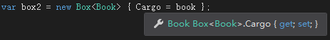
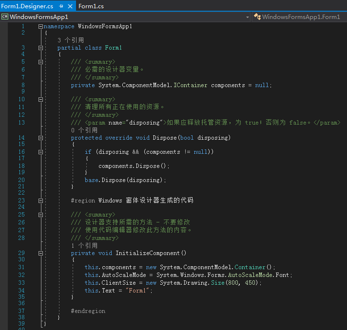
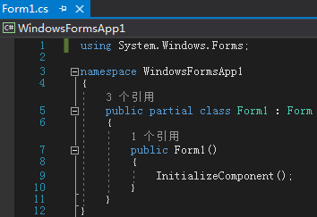
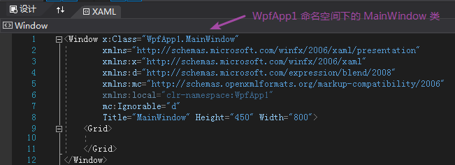
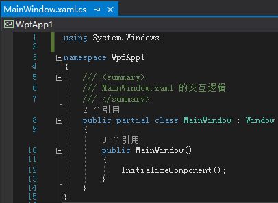
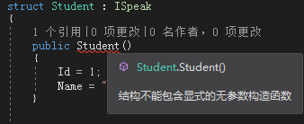

# 030 泛型，partial类，枚举，结构体

# 泛型

+ 为什么需要泛型：避免成员膨胀或类型膨胀
+ 正交性：泛型类型（类、接口、委托……） 泛型成员（属性、方法、字段……）
+ 类型方法的参数推断
+ 泛型与委托，Lambda 表达式
  泛型在面向对象中的地位与接口相当。其内容很多，今天只介绍最常用最重要的部分。

## 基本介绍


正交性：泛型和其它的编程实体都有正交点，导致泛型对编程的影响广泛而深刻。
泛化 <-> 具体化

## 泛型类示例

示例背景：开了个小商店，一开始只卖苹果，卖的苹果用小盒子装上给顾客。顾客买到后可以打开盒子看苹果颜色。

```csharp
class Program
{
    static void Main(string[] args)
    {
        var apple = new Apple { Color = "Red" };
        var box = new Box { Cargo = apple };
        Console.WriteLine(box.Cargo.Color);
    }
}
class Apple
{
    public string Color { get; set; }
}
class Box
{
    public Apple Cargo { get; set; }
}
```

后来小商店要增加商品（卖书），有下面几种处理方法。
一：我们专门为 Book 类添加一个 BookBox 类的盒子。

```csharp
static void Main(string[] args)
{
  	var apple = new Apple { Color = "Red" };
  	var box = new AppleBox { Cargo = apple };
  	Console.WriteLine(box.Cargo.Color);
  
	var book = new Book { Name = "New Book" };
  	var bookBox = new BookBox { Cargo = book };
  	Console.WriteLine(bookBox.Cargo.Name);
}
```

现在代码就出现了“类型膨胀”的问题。未来随着商品种类的增多，盒子种类也须越来越多，类型膨胀，不好维护。
二：用同一个 Box 类，每增加一个商品时就给 Box 类添加一个属性。

```csharp
class Program
{
    static void Main(string[] args)
    {
        var apple = new Apple { Color = "Red" };
        var book = new Book { Name = "New Book" };
        var box1 = new Box { Apple = apple };
        var box2 = new Box { Book = book };
    }
}
...
class Book
{
    public string Name { get; set; }
}
class Box
{
    public Apple Apple { get; set; }
    public Book Book { get; set; }
}
```

这会导致每个 box 变量只有一个属性被使用，也就是“成员膨胀”（类中的很多成员都是用不到的）。
三：Box 类里面的 Cargo 改为 Object 类型。

```csharp
class Program
{
    static void Main(string[] args)
    {
        var apple = new Apple { Color = "Red" };
        var book = new Book { Name = "New Book" };
        var box1 = new Box { Cargo = apple };
        var box2 = new Box { Cargo = book };
        Console.WriteLine((box1.Cargo as Apple)?.Color);
    }
}
...
class Box
{
    public Object Cargo{ get; set; }
}
```

使用时必须进行强制类型转换或 as，即向盒子里面装东西省事了，但取东西时很麻烦。
四：**泛型登场**。

```csharp
class Program
{
    static void Main(string[] args)
    {
        var apple = new Apple { Color = "Red" };
        var book = new Book { Name = "New Book" };
        var box1 = new Box<Apple> { Cargo = apple };
        var box2 = new Box<Book> { Cargo = book };
        Console.WriteLine(box1.Cargo.Color);
        Console.WriteLine(box2.Cargo.Name);
    }
}
...
class Box<TCargo>
{
    public TCargo Cargo { get; set; }
}
```

泛型类特化后，都是强类型：




## 泛型接口示例

```csharp
class Program
{
    static void Main(string[] args)
    {
        //var stu = new Student<int>();
        //stu.Id = 101;
        //stu.Name = "Timothy";
        var stu = new Student<ulong>();
        stu.Id = 1000000000000001;
        stu.Name = "Timothy";
        var stu2 = new Student();
        stu2.Id = 100000000001;
        stu2.Name = "Elizabeth";
    }
}
interface IUnique<T>
{
    T Id { get; set; }
}
// 泛型类实现泛型接口
class Student<T> : IUnique<T>
{
    public T Id { get; set; }
    public string Name { get; set; }
}
// 具体类实现特化化后的泛型接口
class Student : IUnique<ulong>
{
    public ulong Id { get; set; }
    public string Name { get; set; }
}
```

## 泛型集合

.NET Framework 中常用的数据结构基本都是泛型的。
编程中处理的数据很多都存储在如数组、列表、字典、链表等集合中，这些集合都是泛型的，它们的基接口和基类都是泛型的。
这些泛型集合都集中在 System.Collections.Generic 命名空间中。

```csharp
static void Main(string[] args)
{
    IList<int> list = new List<int>();
    for (var i = 0; i < 100; i++)
    {
        list.Add(i);
    }
    foreach (var item in list)
    {
        Console.WriteLine(item);
    }
}
```

List 的定义：

```csharp
public class List<T> : ICollection<T>, IEnumerable<T>, IEnumerable, IList<T>, IReadOnlyCollection<T>, IReadOnlyList<T>, ICollection, IList
{
  ...
}
```

+ IEnumerable<T>：可迭代
+ ICollection<T>：集合，可以添加和移除元素
  注：很多泛型类型带有不止一个类型参数，例如 IDictionary<TKey, TValue>。

```csharp
IDictionary<int, string> dict = new Dictionary<int, string>();
dict[1] = "Timothy";
dict[2] = "Michael";
Console.WriteLine($"Student #1 is {dict[1]}");
Console.WriteLine($"Student #2 is {dict[2]}");
```

## 泛型算法示例

泛型不仅与面向对象和数据结构有关系，它也和算法密不可分。
Zip 方法：像拉拉链一样合并整型数组。

```csharp
static void Main(string[] args)
{
    int[] a1 = { 1, 2, 3, 4, 5 };
    int[] a2 = { 1, 2, 3, 4, 5, 6 };
    double[] a3 = { 1.1, 2.2, 3.3, 4.4, 5.5 };
    double[] a4 = { 1.1, 2.2, 3.3, 4.4, 5.5, 6.6 };
    var result = Zip(a1, a2);
    Console.WriteLine(string.Join(",", result));
}
static int[] Zip(int[] a, int[] b)
{
    int[] zipped = new int[a.Length + b.Length];
    int ai = 0, bi = 0, zi = 0;
    do
    {
        if (ai < a.Length) zipped[zi++] = a[ai++];
        if (bi < b.Length) zipped[zi++] = b[bi++];
    } while (ai < a.Length || bi < b.Length);
    return zipped;
}
```

现在的问题是：当前的 Zip 仅对 int 类型数组有效，无法合并两个 double 数组。
使用泛型后：

```csharp
static void Main(string[] args)
{
    int[] a1 = { 1, 2, 3, 4, 5 };
    int[] a2 = { 1, 2, 3, 4, 5, 6 };
    var result = Zip(a3, a4);
    Console.WriteLine(string.Join(",", result));
  
    double[] a3 = { 1.1, 2.2, 3.3, 4.4, 5.5 };
    double[] a4 = { 1.1, 2.2, 3.3, 4.4, 5.5, 6.6 };
    var result2 = Zip(a3, a4);
    Console.WriteLine(string.Join(",", result2));
}
static T[] Zip<T>(T[] a, T[] b)
{
    T[] zipped = new T[a.Length + b.Length];
    int ai = 0, bi = 0, zi = 0;
    do
    {
        if (ai < a.Length) zipped[zi++] = a[ai++];
        if (bi < b.Length) zipped[zi++] = b[bi++];
    } while (ai < a.Length || bi < b.Length);
    return zipped;
}
```

## 泛型委托

C# 内置了很多泛型委托，它们经常会和 Lambda 表达式配合使用，构成 LINQ 查询。
Action 泛型委托：

```csharp
static void Main(string[] args)
{
    Action<string> a1 = Say;
    a1("Timothy");
    Action<int> a2 = Mul;
    a2(1);
}
static void Say(string str)
{
    Console.WriteLine($"Hello, {str}!");
}
static void Mul(int x)
{
    Console.WriteLine(x * 100);
}
```

Func 泛型委托：

```csharp
static void Main(string[] args)
{
    Func<int, int, int> f1 = Add;
    Console.WriteLine(f1(1, 2));
    Func<double, double, double> f2 = Add;
    Console.WriteLine(f2(1.1, 2.2));
}
static int Add(int a, int b)
{
    return a + b;
}
static double Add(double a, double b)
{
    return a + b;
}
```

配合 Lambda 表达式：

```csharp
//Func<int, int, int> f1 = (int a, int b) => { return a + b; };
Func<int, int, int> f1 = (a, b) => { return a + b; };
Console.WriteLine(f1(1, 2));
```

# partial 类

下面依次讲解 partial 类的三大用途。

## 减少派生类

学习类的继承时就提到过一个概念，“把不变的内容写在基类里，在子类里写经常改变的内容”。这就导致一个类中只要有经常改变的内容，我们就要为它声明一个派生类，如果改变的部分比较多，还得声明多个或多层派生类，导致派生结构非常复杂。
有 partial 类后，我们按照逻辑将类切分成几块，每块作为一个逻辑单元单独更新迭代，这些分块合并起来还是一个类。

## partial 类与 EF

使用 EF 时，EF 会自动创建映射 Book 的实体类。如果你在自动生成的 Book 实体类中声明方法，一会刷新 EF 实体时，你手写的代码将会被覆盖。
同时我们注意到 EF 创建的 Book 实体类是 partial 类，于是我们可以在别的位置声明 partial 类，添加方法。

```csharp
public partial class Book
{
    public string Report()
    {
        return $"#{ID} Name:{Name} Price:{Price}";
    }
}
```

调用 Report()：

```csharp
static void Main(string[] args)
{
    var dbContext = new BookstoreEntities();
    var books = dbContext.Books;
    foreach (var book in books)
    {
        Console.WriteLine(book.Report());
    }
}
```

## partial 类与 WinForm、WPF、ASP.NET Core

partial 类还允许一个类的不同部分，使用不同的编程语言来编写。
**WinForm **的 Designer 部分和后台代码部分都是用 C# 编写的：





**WPF** 的界面使用 XAML（最终会被编译成 C#），后台依然是 C#：





新建 **ASP.NET Core** MVC 项目，找到 Views\Home\Index.cshtml。
cshtml 最终一部分也将被编译为 C# 代码。

# 枚举类型

+ 人为限定取值范围的整数
+ 整数值的对应
+ 比特位式用法

## 枚举示例

如何设计员工类的级别属性。

1. 使用数字？ 大小不明确
2. 使用字符串？ 无法约束程序员的输入
   使用枚举，即限定输入，又清晰明了：

```csharp
class Program
{
    static void Main(string[] args)
    {
        var employee = new Person
        {
            Level = Level.Employee
        };
        var boss = new Person
        {
            Level = Level.Boss
        };
        Console.WriteLine(boss.Level > employee.Level);
        // True
        Console.WriteLine((int)Level.Employee);// 0
        Console.WriteLine((int)Level.Manager); // 100
        Console.WriteLine((int)Level.Boss);    // 200
        Console.WriteLine((int)Level.BigBoss); // 201
    }
}
enum Level
{
    Employee,
    Manager = 100,
    Boss = 200,
    BigBoss,
}
class Person
{
    public int Id { get; set; }
    public string Name { get; set; }
    public Level Level { get; set; }
}
```

## 枚举的比特位用法

```csharp
class Program
{
    static void Main(string[] args)
    {
        var employee = new Person
        {
            Name = "Timothy",
            Skill = Skill.Drive | Skill.Cook | Skill.Program | Skill.Teach
        };
        Console.WriteLine(employee.Skill); // 15
        
        // 过时用法不推荐
        //Console.WriteLine((employee.Skill & Skill.Cook) == Skill.Cook); // True
        
        // .NET Framework 4.0 后推荐的用法
        Console.WriteLine((employee.Skill.HasFlag(Skill.Cook))); // True
    }
}
[Flags]
enum Skill
{
    Drive = 1,
    Cook = 2,
    Program = 4,
    Teach = 8,
}
class Person
{
    public int Id { get; set; }
    public string Name { get; set; }
    public Skill Skill { get; set; }
}
```

1. 比特位（Flag）用法需给枚举标注 Flags 特性
2. 比特位用法的更多内容参考官方文档 [Non-exclusive members and the Flags attribute](https://docs.microsoft.com/en-us/dotnet/api/system.enum?view=netframework-4.8#non-exclusive-members-and-the-flags-attribute)
3. 枚举默认父类是 int，你也可以[显式指定它的父类](https://docs.microsoft.com/en-us/dotnet/csharp/language-reference/keywords/enum#example-1)

# 结构体

+ 值类型，可装/拆箱
+ 可实现接口，不能派生自类/结构体
+ 不能有显式无参构造器

## 结构体示例

结构体是值类型：

```csharp
class Program
{
    static void Main(string[] args)
    {
        var stu = new Student { Id = 101, Name = "Timothy" };
        // 装箱：复制一份栈上的 stu ，放到堆上去，然后用 obj 引用堆上的 student 实例
        object obj = stu;
        // 拆箱
        Student stu2 = (Student)obj;
        Console.WriteLine($"#{stu2.Id} Name:{stu2.Name}");
    }
}
struct Student
{
    public int Id { get; set; }
    public string Name { get; set; }
}
```

因为是值类型，所以拷贝时是值复制：

```csharp
static void Main(string[] args)
{
    var stu1 = new Student { Id = 101, Name = "Timothy" };
    // 结构体赋值是值复制
    var stu2 = stu1;
    stu2.Id = 1001;
    stu2.Name = "Michael";
    Console.WriteLine($"#{stu1.Id} Name:{stu1.Name}");
    // #101 Name:Timothy
}
```

## 结构体可以实现接口

```csharp
class Program
{
    static void Main(string[] args)
    {
        var stu1 = new Student { Id = 101, Name = "Timothy" };
        stu1.Speak();
    }
}
interface ISpeak
{
    void Speak();
}
struct Student : ISpeak
{
    public int Id { get; set; }
    public string Name { get; set; }
    public void Speak()
    {
        Console.WriteLine($"I'm #{Id} student {Name}");
    }
}
```

注：

1. 将结构体转换为接口时要装箱
2. 结构体不能有基类或基结构体，只可以实现接口

## 结构体不能有显式无参构造器



因为结构体是值类型，它有默认的无参构造器，该构造器中将字段初始化为 0 或 NULL。

# 感谢 Tim 老师五年的付出


> 更新: 2021-03-24 08:43:57  
> 原文: <https://www.yuque.com/yuejiangliu/dotnet/timothy-csharp-030>