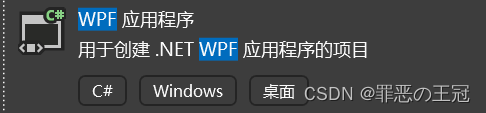
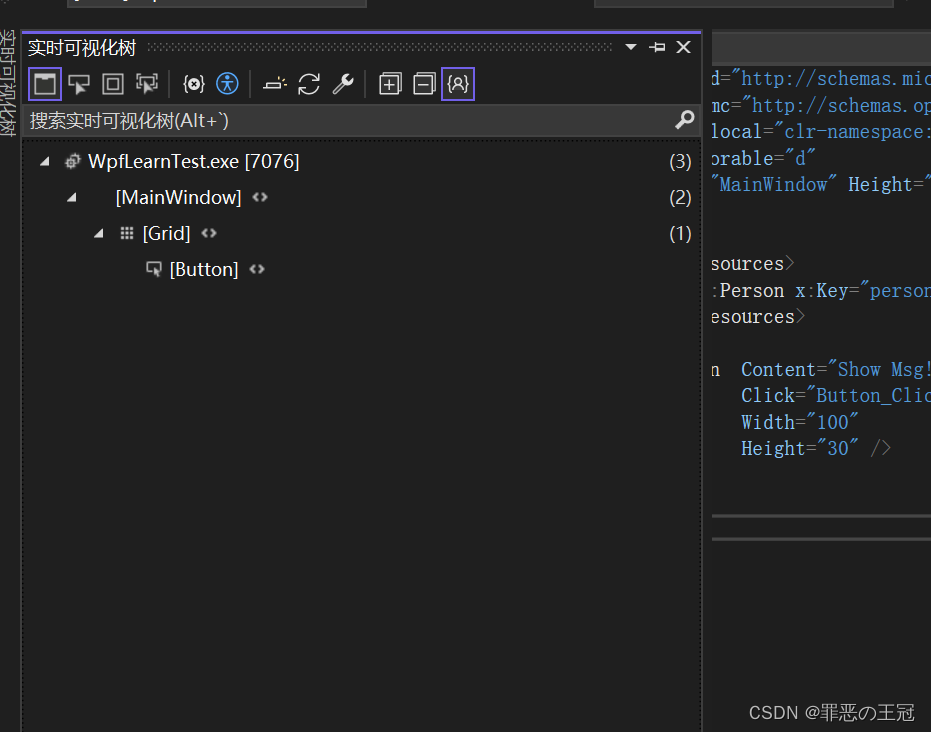
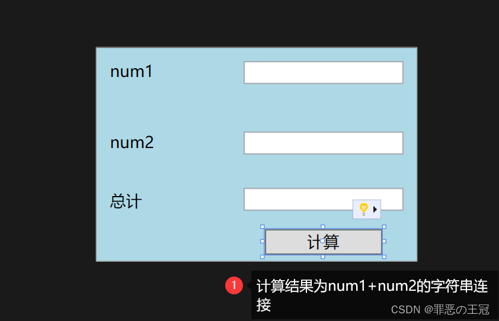

> 原文地址：https://blog.csdn.net/qq_44695769/article/details/131348652

##  相关资源

[《深入浅出WPF》系列高清视频教程 | 讲师：刘铁猛](https://www.bilibili.com/video/BV1ht411e7Fe/?p=1&vd_source=17cf6a5a912b0a39a628030a5814462c)

[深入浅出wpf pdf版完整版下载](http://www.xfdown.com/soft/46210.html)
[刘铁猛老师B站号。但是只有最近的视频资料](https://space.bilibili.com/7499477)


## 前言

WPF 是一个设计非常超前的技术框架，即使他是在2007年开始研发，2010年正式发行的技术。里面的MVVM，业务代码和界面代码完全分离，低耦合，高内聚的思想一直影响着后来的前端发展。比如Vue就是MVVM的继承的。

WPF在国内就业市场的情况并不理想，原因是桌面软件的式微，功能逐渐从PC端转向WEB端。我用网页能解决的，为什么要下个客户端呢？WPF技术的推广也是个问题。因为传统互联网的崛起，把java抬到了一个非常高的高度，java的轮子特别多，生态特别好，学的人也特别多。

所以我认为，不要以为学了WPF就可以找到很好的工作了。.NET工程师还是要转全栈，前端后端都要会。我目前觉得最简单的全栈技术栈是Vue+uniapp+WPF+webApi+.NET core。数据库:Sql server sqlite Mysql。其实最好再学个Unity 2d+Unity 3d +C4D。这样就是完整的全栈了。基本一个简单的小项目你都可以解决。

我今年的模板就是学会WPF+Unity 2d+C4D建模。我学习的逻辑一直都是从低到高，就是先学会工具怎么用，再去钻研高深的东西。这部分学好了，明年就开始学linux和python。

C#和JAVA是相互竞争的关系，我暂时没有精力去学Java的知识。等我需要用到的时候再说吧

虽然有点离题了，回到深入浅出WPF ，刘铁猛老师还是很猛的，讲解的特别好。不像别的课，上来先讲个几个小时的控件属性。直接从原理开始讲，从底层到应用，特别的清晰。

## WPF 学习笔记

视频资料地址

[《深入浅出WPF》系列高清视频教程 | 讲师：刘铁猛](https://www.bilibili.com/video/BV1ht411e7Fe/?p=1&vd_source=17cf6a5a912b0a39a628030a5814462c)

### 环境配置

- .NET Core 6.0
- WPF



### WPF基础：一个WPF程序是如何启动的

我们创建的一个简单的WPF程序。


#### xaml文件和cs文件是如何连接的

WPF为了做到页面和业务分离，强制了我们只能在xaml里面写页面，在cs文件里面写业务。这个强制分离是为了降低耦合。如果有同学试过维护JQuery的项目就知道业务和页面不分离是多么痛苦的事情。一个函数里面包含了页面逻辑和业务逻辑，导致后期更改的时候要完全理解整个函数是怎么跑的，随便删一个变量就直接报错。

我们以App.xaml和App.xaml.cs为例


#### 如何确定启动页面


#### xaml文件如何引用别的文件


##### 如何引用


### WPF是如何创建元素，改变元素的

WPF进行了高度的页面和业务分割，然后通过编译，将对应的页面和文件进行映射。所有我们所有的元素创建和简单的交互事件都在xaml进行。

#### WPF的元素创建和简单属性赋值

以一个简单的按钮为例

在布局元素中创建控件。

```css
<Grid>
    <Button  Content="Show Msg!"//显示的文字
             Click="Button_Click"//点击事件
             Width="100"//宽度
             Height="30" />//高度
</Grid>
```

被<>符合包裹住的是标签，<>后续跟着的就是属性。在上面的例子中，Button是标签，Grid也是标签。Content、Click、Width、Height都是属性。
实现效果


#### WPF的树形界面

WPF的xaml和html很像，都是标记性语言



这个树形层级结构就是WPF的层级。

如果想具体了解，可以去看我之前写的文章。
[WPF 如何实时查看页面元素如何使用实时可视化树](https://blog.csdn.net/qq_44695769/article/details/131095227?ops_request_misc=%7B%22request%5Fid%22%3A%22168751229716800184125836%22%2C%22scm%22%3A%2220140713.130102334.pc%5Fblog.%22%7D&request_id=168751229716800184125836&biz_id=0&utm_medium=distribute.pc_search_result.none-task-blog-2~blog~first_rank_ecpm_v1~rank_v31_ecpm-2-131095227-null-null.268^v1^koosearch&utm_term=实时可视化&spm=1018.2226.3001.4450)

#### xaml属性赋值

xaml一共有三种属性赋值的方式。

- 行内标签：默认的赋值方式
- 属性标签：字符串输入转换数据类型
- 扩展标签

##### 为什么要多种属性赋值

我们看一个最简单的Button按钮

```java
<Grid>
    <Button  Content="Show Msg!"//字符串标签
             Click="Button_Click"
             Width="100"//属性标签
             Height="30" />
</Grid>
```

我们可以看到，我们赋值的值都是字符串。像Content就肯定是字符串，但是Width和Height，属性值应该是数字，但是我们输入的也是字符串。那就说明一点：我们可以对复制的字符串进行转换。

##### 属性转换

属性转换的目的是为了我们通过标签属性去生成一些复杂的信息。比如Height = “100”。Height赋值一个字符串，里面肯定转换成了一个数字。

我们新建一个Person类

MainWindow.cs

```java
namespace WpfLearnTest
{
    public partial class MainWindow : Window
    {
        public MainWindow()
        {
            InitializeComponent();
        }

        private void Button_Click(object sender, RoutedEventArgs e)//按钮事件
        {
        	///找到资源字典中名字为person的类
            Person _model = (Person)this.FindResource("person");
            MessageBox.Show(_model.Name);
        }
    }

    public class Person
    {
        public string Name { get; set; }

        public Person Chil { get; set; }

    }
}
```

MainWindow.xaml

```css
<Window x:Class="WpfLearnTest.MainWindow"
        xmlns="http://schemas.microsoft.com/winfx/2006/xaml/presentation"
        xmlns:x="http://schemas.microsoft.com/winfx/2006/xaml"
        xmlns:d="http://schemas.microsoft.com/expression/blend/2008"
        xmlns:mc="http://schemas.openxmlformats.org/markup-compatibility/2006"
        xmlns:local="clr-namespace:WpfLearnTest"
        mc:Ignorable="d"
        Title="MainWindow" Height="450" Width="800">
     
    
    <Window.Resources>
        <local:Person x:Key="person" Name="小王" />//声明Person类
    </Window.Resources>
    <Grid>
        <Button  Content="Show Msg!"
                 Click="Button_Click"//添加点击按钮
                 Width="100"
                 Height="30" />
    </Grid>
</Window>
```

实现结果


成功的原因是因为我们的Person类的Name是字符串，但是如果不是字符串会如何？


我们可以的看到Child报错。字符串不能直接转Person类。

###### 解决方法

```java
	///引入属性转换
    [TypeConverterAttribute(typeof(NameToPersonTypeConverter))]
    public class Person
    {
        public string Name { get; set; }

        public Person Child { get; set; }

    }
    /// <summary>
    /// 添加属性转换
    /// </summary>
    public class NameToPersonTypeConverter : TypeConverter
    {
        public override object? ConvertFrom(ITypeDescriptorContext? context, CultureInfo? culture, object value)
        {
            string name = value.ToString();
            Person child = new Person();

            child.Name = name;
            return child;
        }
    }
```

使用效果：


运行结果成功！


##### 属性标签

需要解决的问题。


在网页端，Html+css中是如何实现的？

```html
<!DOCTYPE html>
<html>
	<head>
		<meta charset="utf-8">
		<title>一个简单的网页</title>
	</head>
	<body>
        <div>
            <button style="width: 100px;height: 30px;">
                <div style="height: 10px;min-width: 10px;border: 1px solid red;display: inline-block;"></div>
            </button>
        </div>

	</body>
</html>
```


在xaml中也可以使用嵌套

```html
<Window x:Class="WpfLearnTest.MainWindow"
        xmlns="http://schemas.microsoft.com/winfx/2006/xaml/presentation"
        xmlns:x="http://schemas.microsoft.com/winfx/2006/xaml"
        xmlns:d="http://schemas.microsoft.com/expression/blend/2008"
        xmlns:mc="http://schemas.openxmlformats.org/markup-compatibility/2006"
        xmlns:local="clr-namespace:WpfLearnTest"
        mc:Ignorable="d"
        Title="MainWindow"
        Height="450"
        Width="800">


    <Grid>
        <Button 
                Width="100"
                Height="30">
            <Rectangle Width="20"
                       Height="20"
                       Stroke="DarkGreen"
                       Fill="LawnGreen" />

        </Button>
    </Grid>
</Window>
```


但是xaml支持我们使用属性标签 的方式填写

```html
        <Button Click="Button_Click"
                Width="100"
                Height="30">
            <Button.Content>//属性标签,对应button的content值
                <Rectangle Width="20"
                           Height="20"
                           Stroke="DarkGreen"
                           Fill="LawnGreen" />
            </Button.Content>
        </Button>
```

实现的效果是一样的


那嵌套一个属性标签到底有什么用呢？

结论是在这个案例里面没有区别。

在实时可视化树中也没区别


###### 属性标签的特点和缺点

我们现在有一个需求


```html
        <Rectangle Width="200"
                   Height="160"
                   Stroke="Blue"
                   Fill="LightBlue" />
```

我们看看html+css是如何解决的
网页端用html+css+JS分离。只让html声明元素，让css修改样式。JS在使用中原则上不添加或者删除html元素(虽然可以进行DOM操作实现，但是这样会将提高耦合，容易形成屎山代码)，而是通过css的display：none。来进行页面样式的显示或者不显示。

<svg id="mermaid-svg-4e8lkzBUsUj7oy33" width="588.5751953125" xmlns="http://www.w3.org/2000/svg" height="433.87042236328125" viewBox="-0.00000762939453125 -0.0000019073486328125 588.5751953125 433.87042236328125" class="mermaid-svg"><g><g class="output"><g class="clusters"></g><g class="edgePaths"><g class="edgePath LS-Html LE-page" id="L-Html-page" style="opacity: 1;"><path class="path" d="M244.86343383789062,303.9027786254883L244.86343383789062,310.2347617149353C244.86343383789062,316.5667448043823,244.86343383789062,329.23071098327637,261.8426005045573,342.76005757172385C278.82176717122394,356.2894041601714,312.7801005045573,370.6841311581723,329.75926717122394,377.8814946571729L346.7384338378906,385.07885815617334" marker-end="url(#arrowhead14557)" style="fill:none"></path><defs><marker id="arrowhead14557" viewBox="0 0 10 10" refX="9" refY="5" markerUnits="strokeWidth" markerWidth="8" markerHeight="6" orient="auto"><path d="M 0 0 L 10 5 L 0 10 z" class="arrowheadPath" style="stroke-width: 1; stroke-dasharray: 1, 0;"></path></marker></defs></g><g class="edgePath LS-CSS LE-Html" style="opacity: 1;" id="L-CSS-Html"><path class="path" d="M116.43171691894531,178.94328689575195L116.43171691894531,185.7739199002584C116.43171691894531,192.6045529047648,116.43171691894531,206.26581891377768,133.27006657918295,221.09187942876463C150.10841623942056,235.91793994375158,183.78511555989584,251.9087949647126,200.62346522013345,259.90422247519314L217.4618148803711,267.89964998567365" marker-end="url(#arrowhead14558)" style="fill:none"></path><defs><marker id="arrowhead14558" viewBox="0 0 10 10" refX="9" refY="5" markerUnits="strokeWidth" markerWidth="8" markerHeight="6" orient="auto"><path d="M 0 0 L 10 5 L 0 10 z" class="arrowheadPath" style="stroke-width: 1; stroke-dasharray: 1, 0;"></path></marker></defs></g><g class="edgePath LS-JS LE-Html" style="opacity: 1;" id="L-JS-Html"><path class="path" d="M316.38253021240234,43.06954245711846L304.4626808166504,51.22056766471501C292.54283142089844,59.37159287231156,268.70313262939453,75.67364328750466,256.7832832336426,94.48728443010894C244.86343383789062,113.30092557271321,244.86343383789062,134.62615744272867,244.86343383789062,155.95138931274414C244.86343383789062,177.2766211827596,244.86343383789062,198.60185305277506,244.86343383789062,215.59645207722983C244.86343383789062,232.59105110168457,244.86343383789062,245.2550172805786,244.86343383789062,251.58700037002563L244.86343383789062,257.91898345947266" marker-end="url(#arrowhead14559)" style="fill:none"></path><defs><marker id="arrowhead14559" viewBox="0 0 10 10" refX="9" refY="5" markerUnits="strokeWidth" markerWidth="8" markerHeight="6" orient="auto"><path d="M 0 0 L 10 5 L 0 10 z" class="arrowheadPath" style="stroke-width: 1; stroke-dasharray: 1, 0;"></path></marker></defs></g><g class="edgePath LS-JS LE-page" style="opacity: 1;" id="L-JS-page"><path class="path" d="M351.70660400390625,36.41670824731818L381.8546562194824,45.67653915654811C412.0027084350586,54.93637006577804,472.29881286621094,73.4560318842379,502.4468650817871,93.37847872847556C532.5949172973633,113.30092557271321,532.5949172973633,134.62615744272867,532.5949172973633,155.95138931274414C532.5949172973633,177.2766211827596,532.5949172973633,198.60185305277506,532.5949172973633,219.4284350077311C532.5949172973633,240.25501696268717,532.5949172973633,260.5829490025838,532.5949172973633,280.91088104248047C532.5949172973633,301.23881308237713,532.5949172973633,321.56674512227374,515.6157506306967,338.92807464122257C498.63658396402997,356.2894041601714,464.6782506306966,370.6841311581723,447.69908396402997,377.8814946571729L430.7199172973633,385.07885815617334" marker-end="url(#arrowhead14560)" style="fill:none"></path><defs><marker id="arrowhead14560" viewBox="0 0 10 10" refX="9" refY="5" markerUnits="strokeWidth" markerWidth="8" markerHeight="6" orient="auto"><path d="M 0 0 L 10 5 L 0 10 z" class="arrowheadPath" style="stroke-width: 1; stroke-dasharray: 1, 0;"></path></marker></defs></g><g class="edgePath LS-JS LE-Html" style="opacity: 1;" id="L-JS-Html"><path class="path" d="M351.70660400390625,43.06954245711846L363.6264533996582,51.22056766471501C375.54630279541016,59.37159287231156,399.38600158691406,75.67364328750466,411.305850982666,94.48728443010894C423.22570037841797,113.30092557271321,423.22570037841797,134.62615744272867,423.22570037841797,155.95138931274414C423.22570037841797,177.2766211827596,423.22570037841797,198.60185305277506,398.0655924479167,217.86695494035084C372.90548451741535,237.13205682792662,322.5852686564128,254.33702873306274,297.42516072591144,262.93951468563074L272.26505279541016,271.54200063819883" marker-end="url(#arrowhead14561)" style="fill:none;stroke-width:2px;stroke-dasharray:3;"></path><defs><marker id="arrowhead14561" viewBox="0 0 10 10" refX="9" refY="5" markerUnits="strokeWidth" markerWidth="8" markerHeight="6" orient="auto"><path d="M 0 0 L 10 5 L 0 10 z" class="arrowheadPath" style="stroke-width: 1; stroke-dasharray: 1, 0;"></path></marker></defs></g><g class="edgePath LS-JS LE-CSS" style="opacity: 1;" id="L-JS-CSS"><path class="path" d="M316.38253021240234,35.94150444754945L283.05739466349286,45.28053599007416C249.73225911458334,54.619567532598886,183.0819880167643,73.29763061764832,149.75685246785483,89.46729516467947C116.43171691894531,105.63695971171062,116.43171691894531,119.29822572072347,116.43171691894531,126.1288587252299L116.43171691894531,132.95949172973633" marker-end="url(#arrowhead14562)" style="fill:none;stroke-width:2px;stroke-dasharray:3;"></path><defs><marker id="arrowhead14562" viewBox="0 0 10 10" refX="9" refY="5" markerUnits="strokeWidth" markerWidth="8" markerHeight="6" orient="auto"><path d="M 0 0 L 10 5 L 0 10 z" class="arrowheadPath" style="stroke-width: 1; stroke-dasharray: 1, 0;"></path></marker></defs></g></g><g class="edgeLabels"><g class="edgeLabel" transform="translate(244.86343383789062,341.8946771621704)" style="opacity: 1;"><g transform="translate(-47.98032760620117,-12.991898536682129)" class="label"><rect rx="0" ry="0" width="95.96065521240234" height="25.983797073364258"></rect><foreignObject width="95.96065521240234" height="25.983797073364258"><div style="display: inline-block; white-space: nowrap;"><span id="L-L-Html-page" class="edgeLabel L-LS-Html' L-LE-page" style="fill: rgb(51, 51, 51); color: rgb(51, 51, 51); background-color: rgb(232, 232, 232); text-align: center;">声明页面元素</span></div></foreignObject></g></g><g class="edgeLabel" style="opacity: 1;" transform="translate(116.43171691894531,219.92708492279053)"><g transform="translate(-49.38657760620117,-12.991898536682129)" class="label"><rect rx="0" ry="0" width="98.77315521240234" height="25.983797073364258"></rect><foreignObject width="98.77315521240234" height="25.983797073364258"><div style="display: inline-block; white-space: nowrap;"><span id="L-L-CSS-Html" class="edgeLabel L-LS-CSS' L-LE-Html" style="fill: rgb(51, 51, 51); color: rgb(51, 51, 51); background-color: rgb(232, 232, 232); text-align: center;">修改Html样式</span></div></foreignObject></g></g><g class="edgeLabel" style="opacity: 1;" transform="translate(244.86343383789062,155.95138931274414)"><g transform="translate(-68.99304962158203,-12.991898536682129)" class="label"><rect rx="0" ry="0" width="137.98609924316406" height="25.983797073364258"></rect><foreignObject width="137.98611450195312" height="25.983797073364258"><div style="display: inline-block; white-space: nowrap;"><span id="L-L-JS-Html" class="edgeLabel L-LS-JS' L-LE-Html" style="fill: rgb(51, 51, 51); color: rgb(51, 51, 51); background-color: rgb(232, 232, 232); text-align: center;">动态html对应的CSS</span></div></foreignObject></g></g><g class="edgeLabel" style="opacity: 1;" transform="translate(532.5949172973633,219.92708492279053)"><g transform="translate(-47.98032760620117,-12.991898536682129)" class="label"><rect rx="0" ry="0" width="95.96065521240234" height="25.983797073364258"></rect><foreignObject width="95.96065521240234" height="25.983797073364258"><div style="display: inline-block; white-space: nowrap;"><span id="L-L-JS-page" class="edgeLabel L-LS-JS' L-LE-page" style="fill: rgb(51, 51, 51); color: rgb(51, 51, 51); background-color: rgb(232, 232, 232); text-align: center;">实现业务逻辑</span></div></foreignObject></g></g><g class="edgeLabel" style="opacity: 1;" transform="translate(423.22570037841797,155.95138931274414)"><g transform="translate(-89.36921691894531,-25.983797073364258)" class="label"><rect rx="0" ry="0" width="178.73843383789062" height="51.967594146728516"></rect><foreignObject width="178.73843383789062" height="51.967594146728516"><div style="display: inline-block; white-space: nowrap;"><span id="L-L-JS-Html" class="edgeLabel L-LS-JS' L-LE-Html" style="fill: rgb(51, 51, 51); color: rgb(51, 51, 51); background-color: rgb(232, 232, 232); text-align: center;">原则上不能直接操控Html<br>的元素生成</span></div></foreignObject></g></g><g class="edgeLabel" style="opacity: 1;" transform="translate(116.43171691894531,91.97569370269775)"><g transform="translate(-108.43171691894531,-12.991898536682129)" class="label"><rect rx="0" ry="0" width="216.86343383789062" height="25.983797073364258"></rect><foreignObject width="216.86343383789062" height="25.983797073364258"><div style="display: inline-block; white-space: nowrap;"><span id="L-L-JS-CSS" class="edgeLabel L-LS-JS' L-LE-CSS" style="fill: rgb(51, 51, 51); color: rgb(51, 51, 51); background-color: rgb(232, 232, 232); text-align: center;">原则上不能修改CSS的样式内容</span></div></foreignObject></g></g></g><g class="nodes"><g class="node default" id="flowchart-page-12270" transform="translate(388.72917556762695,402.87847328186035)" style="opacity: 1;"><rect rx="0" ry="0" x="-41.99074172973633" y="-22.99189853668213" width="83.98148345947266" height="45.98379707336426" class="label-container"></rect><g class="label" transform="translate(0,0)"><g transform="translate(-31.990741729736328,-12.991898536682129)"><foreignObject width="63.981483459472656" height="25.983797073364258"><div style="display: inline-block; white-space: nowrap;">用户页面</div></foreignObject></g></g></g><g class="node default" style="opacity: 1;" id="flowchart-Html-12271" transform="translate(244.86343383789062,280.91088104248047)"><rect rx="0" ry="0" x="-27.40161895751953" y="-22.99189853668213" width="54.80323791503906" height="45.98379707336426" class="label-container"></rect><g class="label" transform="translate(0,0)"><g transform="translate(-17.40161895751953,-12.991898536682129)"><foreignObject width="34.80324172973633" height="25.983797073364258"><div style="display: inline-block; white-space: nowrap;">Html</div></foreignObject></g></g></g><g class="node default" style="opacity: 1;" id="flowchart-CSS-12272" transform="translate(116.43171691894531,155.95138931274414)"><rect rx="0" ry="0" x="-22.476852416992188" y="-22.99189853668213" width="44.953704833984375" height="45.98379707336426" class="label-container"></rect><g class="label" transform="translate(0,0)"><g transform="translate(-12.476852416992188,-12.991898536682129)"><foreignObject width="24.953704833984375" height="25.983797073364258"><div style="display: inline-block; white-space: nowrap;">CSS</div></foreignObject></g></g></g><g class="node default" style="opacity: 1;" id="flowchart-JS-12273" transform="translate(334.0445671081543,30.991897583007812)"><rect rx="0" ry="0" x="-17.66203737258911" y="-22.99189853668213" width="35.32407474517822" height="45.98379707336426" class="label-container"></rect><g class="label" transform="translate(0,0)"><g transform="translate(-7.662037372589111,-12.991898536682129)"><foreignObject width="15.324074745178223" height="25.983797073364258"><div style="display: inline-block; white-space: nowrap;">JS</div></foreignObject></g></g></g></g></g></g></svg>

```html
<!DOCTYPE html>
<html>
<head>
    <meta charset="utf-8">
    <title>一个简单的网页</title>
</head>
<body>
    <div id="box">
    </div>
</body>
</html>
<style type="text/css">
    #box {
        height: 200px;
        background-color: red;
        background-image: linear-gradient(to bottom right, red, blue);
    }
</style>
```

实现效果


###### 属性标签的缺点

我们看看WPF实现上述效果要怎么写？

```html
<Rectangle Width="200"
                   Height="160"
                   Stroke="Blue">
            <Rectangle.Fill>
                <LinearGradientBrush>
                    <LinearGradientBrush.StartPoint>
                        <Point  X="0"
                                Y="0" />
                    </LinearGradientBrush.StartPoint>
                    <LinearGradientBrush.EndPoint>
                        <Point X="1"
                               Y="1" />
                    </LinearGradientBrush.EndPoint>
                    <LinearGradientBrush.GradientStops>
                        <GradientStop Offset="0.2"
                                      Color="LightBlue" />
                        <GradientStop Offset="0.7"
                                      Color="DarkBlue" />
                        <GradientStop Offset="1.0"
                                      Color="LightBlue" />
                    </LinearGradientBrush.GradientStops>
                </LinearGradientBrush>
            </Rectangle.Fill>
        </Rectangle>
```


我们可以看到只是个单纯的渐变效果，就写的特别麻烦

当然，我们可以使用行内标签来进行优化

```html
<Rectangle Width="200"
                   Height="160"
                   Stroke="Blue">
            <Rectangle.Fill>
                <LinearGradientBrush StartPoint="0,0" EndPoint="1,1">//使用行内标签来对代码进行优化
                    <LinearGradientBrush.GradientStops>
                        <GradientStop Offset="0.2"
                                      Color="LightBlue" />
                        <GradientStop Offset="0.7"
                                      Color="DarkBlue" />
                        <GradientStop Offset="1.0"
                                      Color="LightBlue" />
                    </LinearGradientBrush.GradientStops>
                </LinearGradientBrush>
            </Rectangle.Fill>
        </Rectangle>
```

我们可以使用资源字典来优化

```html
 <Window.Resources>
        <Style x:Key="MyButton"
               TargetType="Button">
            <Style.Setters>
                <Setter Property="Content"
                        Value="" />
            </Style.Setters>
        </Style>
        <Style x:Key="MyRectFill" TargetType="Rectangle">
            <Style.Setters>
                <Setter Property="Fill" >
                    <Setter.Value>
                        <LinearGradientBrush StartPoint="0,0"
                                             EndPoint="1,1">
                            <GradientStop Offset="0.2"
                                          Color="LightBlue" />
                            <GradientStop Offset="0.7"
                                          Color="DarkBlue" />
                            <GradientStop Offset="1.0"
                                          Color="LightBlue" />
                        </LinearGradientBrush>
                    </Setter.Value>
                </Setter>
            </Style.Setters>
        </Style>
    </Window.Resources>
    <Grid>
        <Rectangle Width="200"
                   Height="160"
                   Stroke="Blue" Style="{StaticResource MyRectFill}" >
        </Rectangle>
    </Grid>
```

我们保证了页面元素的简洁化，但是由于WPF运行的关系，Window.Resources只能放在页面元素之前。而且由于C#和xaml是强定义语言，所以写起来一定要对元素内容进行声明。

CSS里面5行能解决的事情，在xaml里面有10行才能解决。

##### 扩展标签

我们刚刚写的代码中

```html
        <Rectangle Width="200"
                   Height="160"
                   Stroke="Blue" Style="{StaticResource MyRectFill}" >//这个就是扩展标签
        </Rectangle>
```

扩展标签使用{}的形式，将属性值包含在里面。这时候我们输入的就不是字符串，而是一个属性对象。如果同学们学过Vue 就能了解到这个类似于Vue 的差值表达式{{value}}。

标签扩展一般和属性绑定配合，我过会会讲解如何使用属性绑定。这个是WPF的重点。

### WPF的属性绑定

#### 页面元素相互赋值

我之前说过WPF中的内容关系如下

<svg id="mermaid-svg-gO4viRnDBYbTkBjG" width="458.7662353515625" xmlns="http://www.w3.org/2000/svg" height="794.8541259765625" viewBox="0 0 458.7662353515625 794.8541259765625" class="mermaid-svg"><g transform="translate(0, 0)"><marker id="flowchart-pointEnd" class="marker flowchart" viewBox="0 0 10 10" refX="9" refY="5" markerUnits="userSpaceOnUse" markerWidth="12" markerHeight="12" orient="auto"><path d="M 0 0 L 10 5 L 0 10 z" class="arrowMarkerPath" style="stroke-width: 1; stroke-dasharray: 1, 0;"></path></marker><marker id="flowchart-pointStart" class="marker flowchart" viewBox="0 0 10 10" refX="0" refY="5" markerUnits="userSpaceOnUse" markerWidth="12" markerHeight="12" orient="auto"><path d="M 0 5 L 10 10 L 10 0 z" class="arrowMarkerPath" style="stroke-width: 1; stroke-dasharray: 1, 0;"></path></marker><marker id="flowchart-circleEnd" class="marker flowchart" viewBox="0 0 10 10" refX="11" refY="5" markerUnits="userSpaceOnUse" markerWidth="11" markerHeight="11" orient="auto"><circle cx="5" cy="5" r="5" class="arrowMarkerPath" style="stroke-width: 1; stroke-dasharray: 1, 0;"></circle></marker><marker id="flowchart-circleStart" class="marker flowchart" viewBox="0 0 10 10" refX="-1" refY="5" markerUnits="userSpaceOnUse" markerWidth="11" markerHeight="11" orient="auto"><circle cx="5" cy="5" r="5" class="arrowMarkerPath" style="stroke-width: 1; stroke-dasharray: 1, 0;"></circle></marker><marker id="flowchart-crossEnd" class="marker cross flowchart" viewBox="0 0 11 11" refX="12" refY="5.2" markerUnits="userSpaceOnUse" markerWidth="11" markerHeight="11" orient="auto"><path d="M 1,1 l 9,9 M 10,1 l -9,9" class="arrowMarkerPath" style="stroke-width: 2; stroke-dasharray: 1, 0;"></path></marker><marker id="flowchart-crossStart" class="marker cross flowchart" viewBox="0 0 11 11" refX="-1" refY="5.2" markerUnits="userSpaceOnUse" markerWidth="11" markerHeight="11" orient="auto"><path d="M 1,1 l 9,9 M 10,1 l -9,9" class="arrowMarkerPath" style="stroke-width: 2; stroke-dasharray: 1, 0;"></path></marker><g class="root"><g class="clusters"></g><g class="edgePaths"><path d="M173.66194474687273,300.9513854980469L172.0768929917787,305.11805216471356C170.49184123668468,309.2847188313802,167.32173772649665,317.61805216471356,165.7366859714026,329.36670176188153C164.1516342163086,341.1153513590495,164.1516342163086,356.27931722005206,164.1516342163086,375.7739159266154C164.1516342163086,395.2685146331787,164.1516342163086,419.09374618530273,164.1516342163086,456.3342940012614C164.1516342163086,493.57484181722003,164.1516342163086,544.2307058970133,164.1516342163086,590.555937131246C164.1516342163086,636.8811683654785,164.1516342163086,678.8757667541504,170.12627722283213,704.039732615153C176.10092022935567,729.2036984761556,188.05020624240274,737.5370318094889,194.0248492489263,741.7036984761556L199.99949225544984,745.8703651428223" id="L-sub1-用户页面-0" class=" edge-thickness-normal edge-pattern-solid flowchart-link LS-sub1 LE-用户页面" style="fill:none;" marker-end="url(#flowchart-pointEnd)"></path><path d="M294.6146011352539,695.8703651428223L294.6146011352539,700.0370318094889C294.6146011352539,704.2036984761556,294.6146011352539,712.5370318094889,288.63995812873037,720.8703651428223C282.66531512220683,729.2036984761556,270.71602910915976,737.5370318094889,264.7413861026362,741.7036984761556L258.7667430961127,745.8703651428223" id="L-sub2-用户页面-0" class=" edge-thickness-normal edge-pattern-solid flowchart-link LS-sub2 LE-用户页面" style="fill:none;" marker-end="url(#flowchart-pointEnd)"></path><path d="M285.10429060468977,300.9513854980469L286.6893423597838,305.11805216471356C288.2743941148778,309.2847188313802,291.4444976250659,317.61805216471356,293.0295493801599,325.9513854980469C294.6146011352539,334.2847188313802,294.6146011352539,342.61805216471356,294.6146011352539,346.7847188313802L294.6146011352539,350.9513854980469" id="L-sub1-数据交互和触发事件回调-0" class=" edge-thickness-normal edge-pattern-solid flowchart-link LS-sub1 LE-数据交互和触发事件回调" style="fill:none;"></path><path d="M294.6146011352539,391.9351806640625L294.6146011352539,400.43248017628986C294.6146011352539,408.92977968851727,294.6146011352539,425.924378712972,294.6146011352539,442.91897773742676C294.6146011352539,459.91357676188153,294.6146011352539,476.90817578633624,294.6146011352539,485.40547529856366L294.6146011352539,493.902774810791" id="L-数据交互和触发事件回调-sub2-0" class=" edge-thickness-normal edge-pattern-solid flowchart-link LS-数据交互和触发事件回调 LE-sub2" style="fill:none;"></path></g><g class="edgeLabels"><g class="edgeLabel" transform="translate(164.1516342163086, 442.91897773742676)"><g class="label" transform="translate(-79.96527862548828, -25.983797073364258)"><foreignObject width="159.93055725097656" height="51.967594146728516"><div style="display: inline-block; white-space: nowrap;"><span class="edgeLabel" style="fill: rgb(51, 51, 51); color: rgb(51, 51, 51); background-color: rgb(232, 232, 232); text-align: center;">负责所有的页面元素<br>样式和简单的用户交互</span></div></foreignObject></g></g><g class="edgeLabel"><g class="label" transform="translate(0, 0)"><foreignObject width="0" height="0"><div style="display: inline-block; white-space: nowrap;"><span class="edgeLabel" style="fill: rgb(51, 51, 51); color: rgb(51, 51, 51); background-color: rgb(232, 232, 232); text-align: center;"></span></div></foreignObject></g></g><g class="edgeLabel"><g class="label" transform="translate(0, 0)"><foreignObject width="0" height="0"><div style="display: inline-block; white-space: nowrap;"><span class="edgeLabel" style="fill: rgb(51, 51, 51); color: rgb(51, 51, 51); background-color: rgb(232, 232, 232); text-align: center;"></span></div></foreignObject></g></g><g class="edgeLabel"><g class="label" transform="translate(0, 0)"><foreignObject width="0" height="0"><div style="display: inline-block; white-space: nowrap;"><span class="edgeLabel" style="fill: rgb(51, 51, 51); color: rgb(51, 51, 51); background-color: rgb(232, 232, 232); text-align: center;"></span></div></foreignObject></g></g></g><g class="nodes"><g class="root" transform="translate(198.63658905029297, 485.902774810791)"><g class="clusters"><g class="cluster default" id="sub2"><rect style="" rx="0" ry="0" x="8" y="8" width="176.95602416992188" height="201.96759033203125"></rect><g class="cluster-label" transform="translate(87.49653053283691, 13)"><foreignObject width="17.962963104248047" height="25.983797073364258"><div style="display: inline-block; white-space: nowrap;"><span class="nodeLabel" style="fill: rgb(51, 51, 51); color: rgb(51, 51, 51);">C#</span></div></foreignObject></g></g></g><g class="edgePaths"></g><g class="edgeLabels"></g><g class="nodes"><g class="node default default" id="flowchart-复杂的交互逻辑-12307" transform="translate(96.47801208496094, 63.49189758300781)"><rect class="basic label-container" style="" rx="0" ry="0" x="-63.47801208496094" y="-20.49189853668213" width="126.95602416992188" height="40.98379707336426"></rect><g class="label" style="" transform="translate(-55.97801208496094, -12.991898536682129)"><foreignObject width="111.95602416992188" height="25.983797073364258"><div style="display: inline-block; white-space: nowrap;"><span class="nodeLabel" style="fill: rgb(51, 51, 51); color: rgb(51, 51, 51);">复杂的交互逻辑</span></div></foreignObject></g></g><g class="node default default" id="flowchart-业务逻辑-12308" transform="translate(96.47801208496094, 154.47569274902344)"><rect class="basic label-container" style="" rx="0" ry="0" x="-39.49074172973633" y="-20.49189853668213" width="78.98148345947266" height="40.98379707336426"></rect><g class="label" style="" transform="translate(-31.990741729736328, -12.991898536682129)"><foreignObject width="63.981483459472656" height="25.983797073364258"><div style="display: inline-block; white-space: nowrap;"><span class="nodeLabel" style="fill: rgb(51, 51, 51); color: rgb(51, 51, 51);">业务逻辑</span></div></foreignObject></g></g></g></g><g class="root" transform="translate(0.5, 0)"><g class="clusters"><g class="cluster default" id="sub1"><rect style="" rx="0" ry="0" x="8" y="8" width="442.76622009277344" height="292.9513854980469"></rect><g class="cluster-label" transform="translate(211.73264694213867, 13)"><foreignObject width="35.300926208496094" height="25.983797073364258"><div style="display: inline-block; white-space: nowrap;"><span class="nodeLabel" style="fill: rgb(51, 51, 51); color: rgb(51, 51, 51);">xaml</span></div></foreignObject></g></g></g><g class="edgePaths"><path d="M178.97222900390625,63.49189758300781L183.1388956705729,63.49189758300781C187.3055623372396,63.49189758300781,195.6388956705729,63.49189758300781,204.1805623372396,63.49189758300781C212.72222900390625,63.49189758300781,221.47222900390625,63.49189758300781,225.84722900390625,63.49189758300781L230.22222900390625,63.49189758300781" id="L-Resource-负责Style管理和资源管理-0" class=" edge-thickness-normal edge-pattern-solid flowchart-link LS-Resource LE-负责Style管理和资源管理" style="fill:none;" marker-end="url(#flowchart-pointEnd)"></path><path d="M131.16551399230957,154.47569274902344L143.29996649424234,154.47569274902344C155.43441899617514,154.47569274902344,179.70332400004068,154.47569274902344,196.00444316864014,154.47569274902344C212.3055623372396,154.47569274902344,220.6388956705729,154.47569274902344,224.8055623372396,154.47569274902344L228.97222900390625,154.47569274902344" id="L-Style-负责样式管理,触发器管理-0" class=" edge-thickness-normal edge-pattern-solid flowchart-link LS-Style LE-负责样式管理,触发器管理" style="fill:none;" marker-end="url(#flowchart-pointEnd)"></path><path d="M146.68634796142578,245.45948791503906L156.2339948018392,245.45948791503906C165.7816416422526,245.45948791503906,184.87693532307944,245.45948791503906,205.7440268198649,245.45948791503906C226.6111183166504,245.45948791503906,249.25000762939453,245.45948791503906,260.5694522857666,245.45948791503906L271.8888969421387,245.45948791503906" id="L-xaml元素-负责声明元素-0" class=" edge-thickness-normal edge-pattern-solid flowchart-link LS-xaml元素 LE-负责声明元素" style="fill:none;" marker-end="url(#flowchart-pointEnd)"></path></g><g class="edgeLabels"><g class="edgeLabel"><g class="label" transform="translate(0, 0)"><foreignObject width="0" height="0"><div style="display: inline-block; white-space: nowrap;"><span class="edgeLabel" style="fill: rgb(51, 51, 51); color: rgb(51, 51, 51); background-color: rgb(232, 232, 232); text-align: center;"></span></div></foreignObject></g></g><g class="edgeLabel"><g class="label" transform="translate(0, 0)"><foreignObject width="0" height="0"><div style="display: inline-block; white-space: nowrap;"><span class="edgeLabel" style="fill: rgb(51, 51, 51); color: rgb(51, 51, 51); background-color: rgb(232, 232, 232); text-align: center;"></span></div></foreignObject></g></g><g class="edgeLabel"><g class="label" transform="translate(0, 0)"><foreignObject width="0" height="0"><div style="display: inline-block; white-space: nowrap;"><span class="edgeLabel" style="fill: rgb(51, 51, 51); color: rgb(51, 51, 51); background-color: rgb(232, 232, 232); text-align: center;"></span></div></foreignObject></g></g></g><g class="nodes"><g class="node default default" id="flowchart-负责Style管理和资源管理-12302" transform="translate(327.36922454833984, 63.49189758300781)"><rect class="basic label-container" style="" rx="0" ry="0" x="-97.1469955444336" y="-20.49189853668213" width="194.2939910888672" height="40.98379707336426"></rect><g class="label" style="" transform="translate(-89.6469955444336, -12.991898536682129)"><foreignObject width="179.2939910888672" height="25.983797073364258"><div style="display: inline-block; white-space: nowrap;"><span class="nodeLabel" style="fill: rgb(51, 51, 51); color: rgb(51, 51, 51);">负责Style管理和资源管理</span></div></foreignObject></g></g><g class="node default default" id="flowchart-Resource-12301" transform="translate(105.98611450195312, 63.49189758300781)"><rect class="basic label-container" style="" rx="0" ry="0" x="-72.98611450195312" y="-20.49189853668213" width="145.97222900390625" height="40.98379707336426"></rect><g class="label" style="" transform="translate(-65.48611450195312, -12.991898536682129)"><foreignObject width="130.97222900390625" height="25.983797073364258"><div style="display: inline-block; white-space: nowrap;"><span class="nodeLabel" style="fill: rgb(51, 51, 51); color: rgb(51, 51, 51);">windows.Resource</span></div></foreignObject></g></g><g class="node default default" id="flowchart-Style-12303" transform="translate(105.98611450195312, 154.47569274902344)"><rect class="basic label-container" style="" rx="0" ry="0" x="-25.179399490356445" y="-20.49189853668213" width="50.35879898071289" height="40.98379707336426"></rect><g class="label" style="" transform="translate(-17.679399490356445, -12.991898536682129)"><foreignObject width="35.35879898071289" height="25.983797073364258"><div style="display: inline-block; white-space: nowrap;"><span class="nodeLabel" style="fill: rgb(51, 51, 51); color: rgb(51, 51, 51);">Style</span></div></foreignObject></g></g><g class="node default default" id="flowchart-负责样式管理,触发器管理-12304" transform="translate(327.36922454833984, 154.47569274902344)"><rect class="basic label-container" style="" rx="0" ry="0" x="-98.3969955444336" y="-20.49189853668213" width="196.7939910888672" height="40.98379707336426"></rect><g class="label" style="" transform="translate(-90.8969955444336, -12.991898536682129)"><foreignObject width="181.7939910888672" height="25.983797073364258"><div style="display: inline-block; white-space: nowrap;"><span class="nodeLabel" style="fill: rgb(51, 51, 51); color: rgb(51, 51, 51);">负责样式管理,触发器管理</span></div></foreignObject></g></g><g class="node default default" id="flowchart-xaml元素-12305" transform="translate(105.98611450195312, 245.45948791503906)"><rect class="basic label-container" style="" rx="0" ry="0" x="-40.700233459472656" y="-20.49189853668213" width="81.40046691894531" height="40.98379707336426"></rect><g class="label" style="" transform="translate(-33.200233459472656, -12.991898536682129)"><foreignObject width="66.40046691894531" height="25.983797073364258"><div style="display: inline-block; white-space: nowrap;"><span class="nodeLabel" style="fill: rgb(51, 51, 51); color: rgb(51, 51, 51);">xaml元素</span></div></foreignObject></g></g><g class="node default default" id="flowchart-负责声明元素-12306" transform="translate(327.36922454833984, 245.45948791503906)"><rect class="basic label-container" style="" rx="0" ry="0" x="-55.48032760620117" y="-20.49189853668213" width="110.96065521240234" height="40.98379707336426"></rect><g class="label" style="" transform="translate(-47.98032760620117, -12.991898536682129)"><foreignObject width="95.96065521240234" height="25.983797073364258"><div style="display: inline-block; white-space: nowrap;"><span class="nodeLabel" style="fill: rgb(51, 51, 51); color: rgb(51, 51, 51);">负责声明元素</span></div></foreignObject></g></g></g></g><g class="node default default" id="flowchart-用户页面-12310" transform="translate(229.38311767578125, 766.3622627258301)"><rect class="basic label-container" style="" rx="0" ry="0" x="-39.49074172973633" y="-20.49189853668213" width="78.98148345947266" height="40.98379707336426"></rect><g class="label" style="" transform="translate(-31.990741729736328, -12.991898536682129)"><foreignObject width="63.981483459472656" height="25.983797073364258"><div style="display: inline-block; white-space: nowrap;"><span class="nodeLabel" style="fill: rgb(51, 51, 51); color: rgb(51, 51, 51);">用户页面</span></div></foreignObject></g></g><g class="node default default" id="flowchart-数据交互和触发事件回调-12314" transform="translate(294.6146011352539, 371.4432830810547)"><rect class="basic label-container" style="" rx="0" ry="0" x="-95.46296691894531" y="-20.49189853668213" width="190.92593383789062" height="40.98379707336426"></rect><g class="label" style="" transform="translate(-87.96296691894531, -12.991898536682129)"><foreignObject width="175.92593383789062" height="25.983797073364258"><div style="display: inline-block; white-space: nowrap;"><span class="nodeLabel" style="fill: rgb(51, 51, 51); color: rgb(51, 51, 51);">数据交互和触发事件回调</span></div></foreignObject></g></g></g></g></g></svg>

而xaml里面，元素的是可以沟通的，在Web端则不行。Web需要通过JS事件触发来修改数据。这个就是事件驱动型。事件驱动型认为所有的页面交互都是由事件触发的，两个页面元素的沟通必须要有一个中间事件。

<svg id="mermaid-svg-rgA9zk4qIBpWKRUJ" width="136.39352416992188" xmlns="http://www.w3.org/2000/svg" height="264.9351806640625" viewBox="0 0 136.39352416992188 264.9351806640625" class="mermaid-svg"><g transform="translate(0, 0.0000019073486328125)"><marker id="flowchart-pointEnd" class="marker flowchart" viewBox="0 0 10 10" refX="9" refY="5" markerUnits="userSpaceOnUse" markerWidth="12" markerHeight="12" orient="auto"><path d="M 0 0 L 10 5 L 0 10 z" class="arrowMarkerPath" style="stroke-width: 1; stroke-dasharray: 1, 0;"></path></marker><marker id="flowchart-pointStart" class="marker flowchart" viewBox="0 0 10 10" refX="0" refY="5" markerUnits="userSpaceOnUse" markerWidth="12" markerHeight="12" orient="auto"><path d="M 0 5 L 10 10 L 10 0 z" class="arrowMarkerPath" style="stroke-width: 1; stroke-dasharray: 1, 0;"></path></marker><marker id="flowchart-circleEnd" class="marker flowchart" viewBox="0 0 10 10" refX="11" refY="5" markerUnits="userSpaceOnUse" markerWidth="11" markerHeight="11" orient="auto"><circle cx="5" cy="5" r="5" class="arrowMarkerPath" style="stroke-width: 1; stroke-dasharray: 1, 0;"></circle></marker><marker id="flowchart-circleStart" class="marker flowchart" viewBox="0 0 10 10" refX="-1" refY="5" markerUnits="userSpaceOnUse" markerWidth="11" markerHeight="11" orient="auto"><circle cx="5" cy="5" r="5" class="arrowMarkerPath" style="stroke-width: 1; stroke-dasharray: 1, 0;"></circle></marker><marker id="flowchart-crossEnd" class="marker cross flowchart" viewBox="0 0 11 11" refX="12" refY="5.2" markerUnits="userSpaceOnUse" markerWidth="11" markerHeight="11" orient="auto"><path d="M 1,1 l 9,9 M 10,1 l -9,9" class="arrowMarkerPath" style="stroke-width: 2; stroke-dasharray: 1, 0;"></path></marker><marker id="flowchart-crossStart" class="marker cross flowchart" viewBox="0 0 11 11" refX="-1" refY="5.2" markerUnits="userSpaceOnUse" markerWidth="11" markerHeight="11" orient="auto"><path d="M 1,1 l 9,9 M 10,1 l -9,9" class="arrowMarkerPath" style="stroke-width: 2; stroke-dasharray: 1, 0;"></path></marker><g class="root"><g class="clusters"></g><g class="edgePaths"><path d="M68.19676208496094,48.983795166015625L68.19676208496094,53.15046183268229C68.19676208496094,57.31712849934896,68.19676208496094,65.6504618326823,68.19676208496094,73.98379516601562C68.19676208496094,82.31712849934895,68.19676208496094,90.6504618326823,68.19676208496094,94.81712849934895L68.19676208496094,98.98379516601562" id="L-页面A数据修改-触发JS函数-0" class=" edge-thickness-normal edge-pattern-solid flowchart-link LS-页面A数据修改 LE-触发JS函数" style="fill:none;" marker-end="url(#flowchart-pointEnd)"></path><path d="M68.19676208496094,139.96759033203125L68.19676208496094,146.29957342147827C68.19676208496094,152.6315565109253,68.19676208496094,165.29552268981934,68.19676208496094,177.95948886871338C68.19676208496094,190.62345504760742,68.19676208496094,203.28742122650146,68.19676208496094,209.6194043159485L68.19676208496094,215.9513874053955" id="L-触发JS函数-B元素修改-0" class=" edge-thickness-normal edge-pattern-solid flowchart-link LS-触发JS函数 LE-B元素修改" style="fill:none;" marker-end="url(#flowchart-pointEnd)"></path></g><g class="edgeLabels"><g class="edgeLabel"><g class="label" transform="translate(0, 0)"><foreignObject width="0" height="0"><div style="display: inline-block; white-space: nowrap;"><span class="edgeLabel" style="fill: rgb(51, 51, 51); color: rgb(51, 51, 51); background-color: rgb(232, 232, 232); text-align: center;"></span></div></foreignObject></g></g><g class="edgeLabel" transform="translate(68.19676208496094, 177.95948886871338)"><g class="label" transform="translate(-55.97801208496094, -12.991898536682129)"><foreignObject width="111.95602416992188" height="25.983797073364258"><div style="display: inline-block; white-space: nowrap;"><span class="edgeLabel" style="fill: rgb(51, 51, 51); color: rgb(51, 51, 51); background-color: rgb(232, 232, 232); text-align: center;">修改对应元素值</span></div></foreignObject></g></g></g><g class="nodes"><g class="node default default" id="flowchart-页面A数据修改-12321" transform="translate(68.19676208496094, 28.491897583007812)"><rect class="basic label-container" style="" rx="0" ry="0" x="-60.19676208496094" y="-20.49189853668213" width="120.39352416992188" height="40.98379707336426"></rect><g class="label" style="" transform="translate(-52.69676208496094, -12.991898536682129)"><foreignObject width="105.39352416992188" height="25.983797073364258"><div style="display: inline-block; white-space: nowrap;"><span class="nodeLabel" style="fill: rgb(51, 51, 51); color: rgb(51, 51, 51);">页面A数据修改</span></div></foreignObject></g></g><g class="node default default" id="flowchart-触发JS函数-12322" transform="translate(68.19676208496094, 119.47569274902344)"><rect class="basic label-container" style="" rx="0" ry="0" x="-47.14699172973633" y="-20.49189853668213" width="94.29398345947266" height="40.98379707336426"></rect><g class="label" style="" transform="translate(-39.64699172973633, -12.991898536682129)"><foreignObject width="79.29398345947266" height="25.983797073364258"><div style="display: inline-block; white-space: nowrap;"><span class="nodeLabel" style="fill: rgb(51, 51, 51); color: rgb(51, 51, 51);">触发JS函数</span></div></foreignObject></g></g><g class="node default default" id="flowchart-B元素修改-12323" transform="translate(68.19676208496094, 236.44328498840332)"><rect class="basic label-container" style="" rx="0" ry="0" x="-44.016204833984375" y="-20.49189853668213" width="88.03240966796875" height="40.98379707336426"></rect><g class="label" style="" transform="translate(-36.516204833984375, -12.991898536682129)"><foreignObject width="73.03240966796875" height="25.983797073364258"><div style="display: inline-block; white-space: nowrap;"><span class="nodeLabel" style="fill: rgb(51, 51, 51); color: rgb(51, 51, 51);">B元素修改</span></div></foreignObject></g></g></g></g></g></svg>

xaml中，则是数据驱动型，或者可以看做匿名事件。就是我没必要声明一个事件，我直接将值给他就行了

<svg id="mermaid-svg-8y9GWEkaujbfZ2PW" width="138.43055725097656" xmlns="http://www.w3.org/2000/svg" height="173.95138549804688" viewBox="0 0 138.43055725097656 173.95138549804688" class="mermaid-svg"><g transform="translate(0, 0.0000019073486328125)"><marker id="flowchart-pointEnd" class="marker flowchart" viewBox="0 0 10 10" refX="9" refY="5" markerUnits="userSpaceOnUse" markerWidth="12" markerHeight="12" orient="auto"><path d="M 0 0 L 10 5 L 0 10 z" class="arrowMarkerPath" style="stroke-width: 1; stroke-dasharray: 1, 0;"></path></marker><marker id="flowchart-pointStart" class="marker flowchart" viewBox="0 0 10 10" refX="0" refY="5" markerUnits="userSpaceOnUse" markerWidth="12" markerHeight="12" orient="auto"><path d="M 0 5 L 10 10 L 10 0 z" class="arrowMarkerPath" style="stroke-width: 1; stroke-dasharray: 1, 0;"></path></marker><marker id="flowchart-circleEnd" class="marker flowchart" viewBox="0 0 10 10" refX="11" refY="5" markerUnits="userSpaceOnUse" markerWidth="11" markerHeight="11" orient="auto"><circle cx="5" cy="5" r="5" class="arrowMarkerPath" style="stroke-width: 1; stroke-dasharray: 1, 0;"></circle></marker><marker id="flowchart-circleStart" class="marker flowchart" viewBox="0 0 10 10" refX="-1" refY="5" markerUnits="userSpaceOnUse" markerWidth="11" markerHeight="11" orient="auto"><circle cx="5" cy="5" r="5" class="arrowMarkerPath" style="stroke-width: 1; stroke-dasharray: 1, 0;"></circle></marker><marker id="flowchart-crossEnd" class="marker cross flowchart" viewBox="0 0 11 11" refX="12" refY="5.2" markerUnits="userSpaceOnUse" markerWidth="11" markerHeight="11" orient="auto"><path d="M 1,1 l 9,9 M 10,1 l -9,9" class="arrowMarkerPath" style="stroke-width: 2; stroke-dasharray: 1, 0;"></path></marker><marker id="flowchart-crossStart" class="marker cross flowchart" viewBox="0 0 11 11" refX="-1" refY="5.2" markerUnits="userSpaceOnUse" markerWidth="11" markerHeight="11" orient="auto"><path d="M 1,1 l 9,9 M 10,1 l -9,9" class="arrowMarkerPath" style="stroke-width: 2; stroke-dasharray: 1, 0;"></path></marker><g class="root"><g class="clusters"></g><g class="edgePaths"><path d="M69.21527481079102,48.983795166015625L69.21527481079102,55.31577825546265C69.21527481079102,61.64776134490967,69.21527481079102,74.31172752380371,69.21527481079102,86.97569370269775C69.21527481079102,99.6396598815918,69.21527481079102,112.30362606048584,69.21527481079102,118.63560914993286L69.21527481079102,124.96759223937988" id="L-xaml元素A-xaml元素B联动-0" class=" edge-thickness-normal edge-pattern-solid flowchart-link LS-xaml元素A LE-xaml元素B联动" style="fill:none;" marker-end="url(#flowchart-pointEnd)"></path></g><g class="edgeLabels"><g class="edgeLabel" transform="translate(69.21527481079102, 86.97569370269775)"><g class="label" transform="translate(-44.69907760620117, -12.991898536682129)"><foreignObject width="89.39815521240234" height="25.983797073364258"><div style="display: inline-block; white-space: nowrap;"><span class="edgeLabel" style="fill: rgb(51, 51, 51); color: rgb(51, 51, 51); background-color: rgb(232, 232, 232); text-align: center;">A被修改属性</span></div></foreignObject></g></g></g><g class="nodes"><g class="node default default" id="flowchart-xaml元素A-12326" transform="translate(69.21527481079102, 28.491897583007812)"><rect class="basic label-container" style="" rx="0" ry="0" x="-45.41666793823242" y="-20.49189853668213" width="90.83333587646484" height="40.98379707336426"></rect><g class="label" style="" transform="translate(-37.91666793823242, -12.991898536682129)"><foreignObject width="75.83333587646484" height="25.983797073364258"><div style="display: inline-block; white-space: nowrap;"><span class="nodeLabel" style="fill: rgb(51, 51, 51); color: rgb(51, 51, 51);">xaml元素A</span></div></foreignObject></g></g><g class="node default default" id="flowchart-xaml元素B联动-12327" transform="translate(69.21527481079102, 145.4594898223877)"><rect class="basic label-container" style="" rx="0" ry="0" x="-61.21527862548828" y="-20.49189853668213" width="122.43055725097656" height="40.98379707336426"></rect><g class="label" style="" transform="translate(-53.71527862548828, -12.991898536682129)"><foreignObject width="107.43055725097656" height="25.983797073364258"><div style="display: inline-block; white-space: nowrap;"><span class="nodeLabel" style="fill: rgb(51, 51, 51); color: rgb(51, 51, 51);">xaml元素B联动</span></div></foreignObject></g></g></g></g></g></svg>

xaml代码

```html
    <Grid>
        <Grid.RowDefinitions>
            <RowDefinition Height="24" />
            <RowDefinition Height="4" />
            <RowDefinition Height="24" />
        </Grid.RowDefinitions>
        <TextBox  x:Name="tb"
                  Text="{Binding ElementName=sld,Path=Value}" />
        <Slider  x:Name="sld"
                 Grid.Row="2"
                 Value="50"
                 Maximum="100"
                 Minimum="0" />
    </Grid>
```


#### WPF 数据绑定会在后面的Prism框架中进行详细说明。

### WPF组件化

组件化，即将一个会重复复用界面封装成一个组件。WPF一共有一下4个类


- 窗口：一个窗口。窗口之间不能嵌套
- 页：很少用，也不知道干什么的，好像是网页的。
- 用户控件：套在窗口上面的。用于抽象化组件
- 资源字典：用于管理WPF资源的，比如样式，控件。

我们新建一个WPF资源类


新建项目

然后添加如下代码

UserControl1.xaml

```html
<UserControl x:Class="ControlLibrary.UserControl1"
             xmlns="http://schemas.microsoft.com/winfx/2006/xaml/presentation"
             xmlns:x="http://schemas.microsoft.com/winfx/2006/xaml"
             xmlns:mc="http://schemas.openxmlformats.org/markup-compatibility/2006"
             xmlns:d="http://schemas.microsoft.com/expression/blend/2008"
             xmlns:local="clr-namespace:ControlLibrary"
             mc:Ignorable="d"
             d:DesignHeight="160"
             d:DesignWidth="240"
             Background="LightBlue">
    <Canvas>
        <TextBox Canvas.Left="110"
                 TextWrapping="Wrap"
                 x:Name="textBox1"
                 Canvas.Top="10"
                 Width="120"
                 HorizontalAlignment="Left"
                 VerticalAlignment="Center"/>
        <TextBox Canvas.Left="110"
                 TextWrapping="Wrap"
                 x:Name="textBox3"
                 Canvas.Top="105"
                 Width="120"
                 HorizontalAlignment="Left"
                 VerticalAlignment="Top" />
        <TextBox Canvas.Left="110"
                 TextWrapping="Wrap"
                 x:Name="textBox2"
                 Canvas.Top="63"
                 Width="120"
                 HorizontalAlignment="Left"
                 VerticalAlignment="Center" />
        <TextBlock TextWrapping="Wrap"
                   Canvas.Top="10"
                   Canvas.Left="10"><Run Language="zh-cn"
                                         Text="num1" /></TextBlock>
        <TextBlock TextWrapping="Wrap"
                   Canvas.Top="63"
                   Canvas.Left="10"
                   HorizontalAlignment="Center"
                   VerticalAlignment="Top"><Run Text="num" /><Run Language="zh-cn"
                                                                  Text="2" /></TextBlock>
        <TextBlock TextWrapping="Wrap"
                   Canvas.Top="107"
                   Canvas.Left="10"
                   HorizontalAlignment="Center"
                   VerticalAlignment="Top"><Run Language="zh-cn"
                                                Text="总计" /></TextBlock>
        <Button Content="计算"
                Canvas.Left="126"
                Canvas.Top="136"
                HorizontalAlignment="Left"
                VerticalAlignment="Center"
                Width="88"
                Click="Button_Click" />
    </Canvas>
</UserControl>
```

UserControl.xaml.cs

```java
using System;
......

namespace ControlLibrary
{
    /// <summary>
    /// UserControl1.xaml 的交互逻辑
    /// </summary>
    public partial class UserControl1 : UserControl
    {
        public UserControl1()
        {
            InitializeComponent();
        }

        private void Button_Click(object sender, RoutedEventArgs e)
        {
                        this.textBox3.Text = ( int.Parse(this.textBox1.Text) + int.Parse(this.textBox2.Text) ).ToString();

        }
    }
}
```



然后添加对其的引用


每个项目都重新生成一下


在主函数中引用

```html
<Window x:Class="WpfLearnTest.MainWindow"
        xmlns="http://schemas.microsoft.com/winfx/2006/xaml/presentation"
        xmlns:x="http://schemas.microsoft.com/winfx/2006/xaml"
        xmlns:d="http://schemas.microsoft.com/expression/blend/2008"
        xmlns:mc="http://schemas.openxmlformats.org/markup-compatibility/2006"
        xmlns:local="clr-namespace:WpfLearnTest"
        xmlns:sys="clr-namespace:System.Security.Claims;assembly=mscorlib"
        xmlns:controls="clr-namespace:ControlLibrary;assembly=ControlLibrary"
        mc:Ignorable="d"
        Title="MainWindow"
        Height="450"
        Width="800">

    <Grid>
        <Grid.RowDefinitions>
            <RowDefinition />
            <RowDefinition />
        </Grid.RowDefinitions>
        <Grid.ColumnDefinitions>
            <ColumnDefinition />
            <ColumnDefinition />
        </Grid.ColumnDefinitions>
        <controls:UserControl1 Grid.Row="0"
                               Grid.Column="0" />
        <controls:UserControl1 Grid.Row="1"
                               Grid.Column="1" />
        <controls:UserControl1 Grid.Row="1"
                               Grid.Column="0" />

        <controls:UserControl1 Grid.Row="0"
                               Grid.Column="1" />
    </Grid>
</Window>
```


使用结果


可以直接引入，而且能够执行用户控件的代码（总计的结果为num1+num2）。