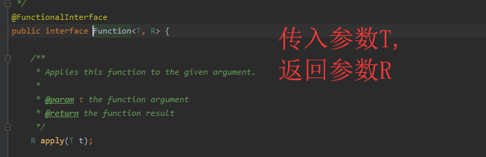
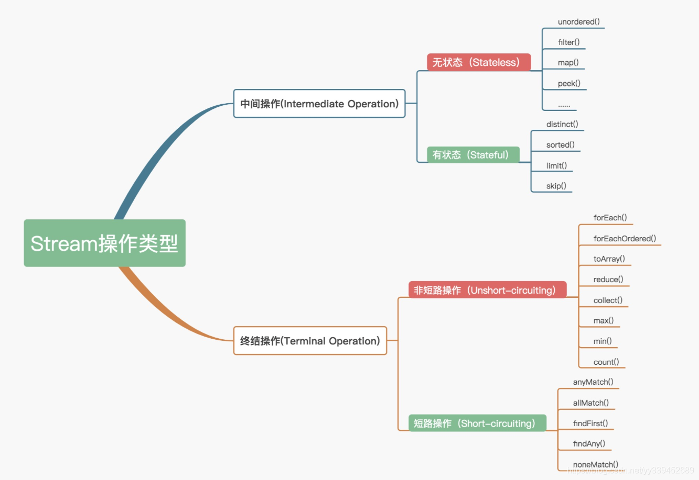
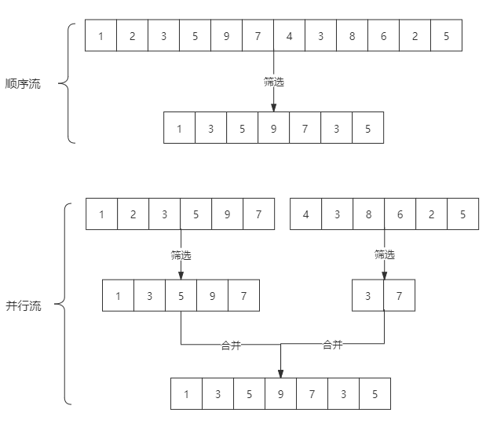
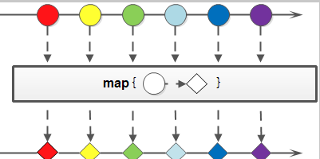
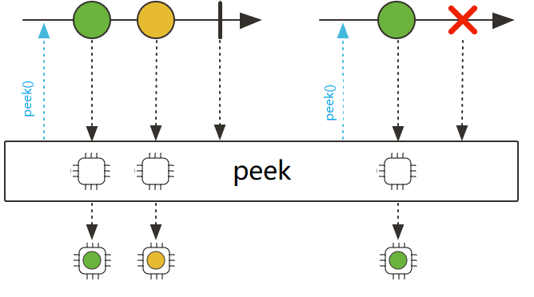
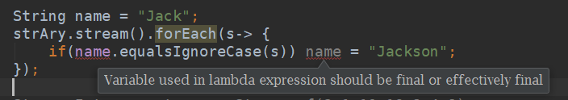
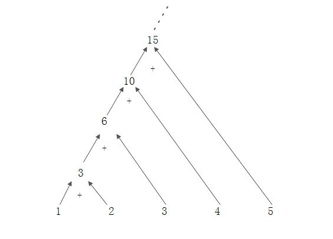
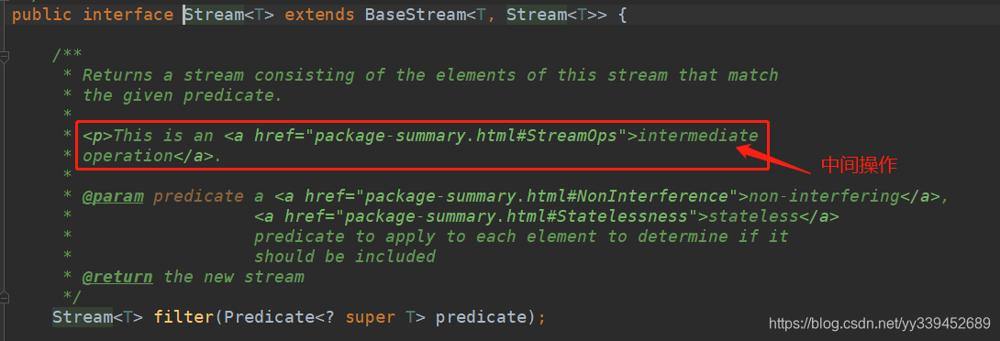
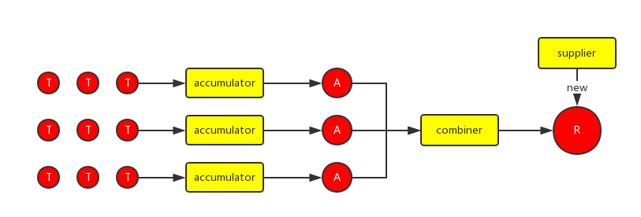

# Lambda表达式

> 原文地址 ： https://objcoding.com/2019/03/04/lambda/

本节将介绍如何使用Lambda表达式简化匿名内部类的书写，但Lambda表达式并不能取代所有的匿名内部类，只能用来取代**函数接口（Functional Interface）**的简写。先别在乎细节，看几个例子再说。

## 四大函数式接口

### 1）Function 函数型接口



```java
public class FunctionDemo {
    public static void main(String[] args) {
        Function<String, String> function = (str) -> {return str;};
        System.out.println(function.apply("aaaaaaaaaa"));
    }
}
```

### 2）Predicate 断定型接口


```java
public class PredicateDemo {
    public static void main(String[] args) {
        Predicate<String> predicate = (str) -> {return str.isEmpty();};
        // false
        System.out.println(predicate.test("aaa"));
        // true
        System.out.println(predicate.test(""));
    }
}
```

### 3）Suppier 供给型接口


```java
/**
 * 供给型接口，只返回，不输入
 */
public class Demo4 {
    public static void main(String[] args) {
        Supplier<String> supplier = ()->{return "1024";};
        System.out.println(supplier.get());
    }
}
```

### 4）Consummer 消费型接口


```java
/**
 * 消费型接口 没有返回值！只有输入！
 */
public class Demo3 {
    public static void main(String[] args) {
        Consumer<String> consumer = (str)->{
            System.out.println(str);
        };
        consumer.accept("abc");
    }
}
```

## 例子1：无参函数的简写

如果需要新建一个线程，一种常见的写法是这样：

```java
// JDK7 匿名内部类写法
new Thread(new Runnable(){// 接口名
	@Override
	public void run(){// 方法名
		System.out.println("Thread run()");
	}
}).start();
```

上述代码给`Tread`类传递了一个匿名的`Runnable`对象，重载`Runnable`接口的`run()`方法来实现相应逻辑。这是 `JDK7` 以及之前的常见写法。匿名内部类省去了为类起名字的烦恼，但还是不够简化，在Java 8中可以简化为如下形式：

```java
// JDK8 Lambda表达式写法
new Thread(
		() -> System.out.println("Thread run()")// 省略接口名和方法名
).start();
```

上述代码跟匿名内部类的作用是一样的，但比匿名内部类更进一步。这里连**接口名和函数名都一同省掉**了，写起来更加神清气爽。如果函数体有多行，可以用大括号括起来，就像这样：

```java
// JDK8 Lambda表达式代码块写法
new Thread(
        () -> {
            System.out.print("Hello");
            System.out.println(" Hoolee");
        }
).start();
```

## 例子2：带参函数的简写

如果要给一个字符串列表通过自定义比较器，按照字符串长度进行排序，Java 7的书写形式如下：

```java
// JDK7 匿名内部类写法
List<String> list = Arrays.asList("I", "love", "you", "too");
Collections.sort(list, new Comparator<String>(){// 接口名
    @Override
    public int compare(String s1, String s2){// 方法名
        if(s1 == null)
            return -1;
        if(s2 == null)
            return 1;
        return s1.length()-s2.length();
    }
});
```

上述代码通过内部类重载了`Comparator`接口的`compare()`方法，实现比较逻辑。采用Lambda表达式可简写如下：

```java
// JDK8 Lambda表达式写法
List<String> list = Arrays.asList("I", "love", "you", "too");
Collections.sort(list, (s1, s2) ->{// 省略参数表的类型
    if(s1 == null)
        return -1;
    if(s2 == null)
        return 1;
    return s1.length()-s2.length();
});
```

上述代码跟匿名内部类的作用是一样的。除了省略了接口名和方法名，代码中把参数表的类型也省略了。这得益于`javac`的**类型推断**机制，编译器能够根据上下文信息推断出参数的类型，当然也有推断失败的时候，这时就需要手动指明参数类型了。注意，Java是强类型语言，每个变量和对象都必需有明确的类型。

## 简写的依据

也许你已经想到了，**能够使用Lambda的依据是必须有相应的函数接口**（函数接口，是指内部只有一个抽象方法的接口）。这一点跟Java是强类型语言吻合，也就是说你并不能在代码的任何地方任性的写Lambda表达式。实际上*Lambda的类型就是对应函数接口的类型*。**Lambda表达式另一个依据是类型推断机制**，在上下文信息足够的情况下，编译器可以推断出参数表的类型，而不需要显式指名。Lambda表达更多合法的书写形式如下：

```java
// Lambda表达式的书写形式
Runnable run = () -> System.out.println("Hello World");// 1
ActionListener listener = event -> System.out.println("button clicked");// 2
Runnable multiLine = () -> {// 3 代码块
    System.out.print("Hello");
    System.out.println(" Hoolee");
};
BinaryOperator<Long> add = (Long x, Long y) -> x + y;// 4
BinaryOperator<Long> addImplicit = (x, y) -> x + y;// 5 类型推断
```

上述代码中，1展示了无参函数的简写；2处展示了有参函数的简写，以及类型推断机制；3是代码块的写法；4和5再次展示了类型推断机制。

## 自定义函数接口

自定义函数接口很容易，只需要编写一个只有一个抽象方法的接口即可。

```java
// 自定义函数接口
@FunctionalInterface
public interface ConsumerInterface<T>{
	void accept(T t);
}
```

上面代码中的@FunctionalInterface是可选的，但加上该标注编译器会帮你检查接口是否符合函数接口规范。就像加入@Override标注会检查是否重载了函数一样。

有了上述接口定义，就可以写出类似如下的代码：

```java
ConsumerInterface<String> consumer = str -> System.out.println(str);
```

进一步的，还可以这样使用：

```java
class MyStream<T>{
	private List<T> list;
    ...
	public void myForEach(ConsumerInterface<T> consumer){// 1
		for(T t : list){
			consumer.accept(t);
		}
	}
}
MyStream<String> stream = new MyStream<String>();
stream.myForEach(str -> System.out.println(str));// 使用自定义函数接口书写Lambda表达式
```

# 方法引用

JDK8中有双冒号的用法，就是把方法当做参数传到stream内部，使stream的每个元素都传入到该方法里面执行一下。

使用方法：

> **类名::方法名**

例如

```java
表达式:

person -> person.getAge();

可以替换成

Person::getAge

```

```java
表达式

() -> new HashMap<>();

可以替换成

HashMap::new
```

方法引用主要用于简化 Lambda 表达式，特别是在以下几种场景中(from ChatGPT)：

## 1. 引用静态方法

- 如果可以直接使用类的静态方法作为行为，则可以通过方法引用简化 Lambda 表达式。

- 示例

  ```java
  // 使用Lambda表达式
  Function<Integer, String> converter = (num) -> String.valueOf(num);
  
  // 使用方法引用
  Function<Integer, String> converter = String::valueOf;
  
  
  //调用接口方法的实现（两种方式的调用方式一样）
  converter.apply(100);
  ```

> 

## 2. 引用实例方法（特定对象）

- 当 Lambda 表达式调用特定对象的实例方法时，可以使用实例方法引用。

- 示例

  ```java
  // 使用Lambda表达式
  Consumer<String> printer = (msg) -> System.out.println(msg);
  
  // 使用方法引用
  Consumer<String> printer = System.out::println;
  
  //调用接口方法的实现（两种方式的调用方式一样）
  printer.accept("I am newfbin");
  ```

> 


## 3. 引用实例方法（任意对象）

- 当 Lambda 表达式调用类的任意对象的实例方法时，可以使用这种方法引用。通常适用于集合中的对象操作。

- 示例

  ```java
  // 使用Lambda表达式
  List<String> names = Arrays.asList("Alice", "Bob", "Charlie");
  names.forEach(name -> name.toUpperCase());
  
  // 使用方法引用
  names.forEach(String::toUpperCase);
  ```

## 4. 引用构造方法

- 当 Lambda 表达式创建新对象时，可以使用构造方法引用来简化代码。

- 示例

  ```java
  // 使用Lambda表达式
  Supplier<List<String>> listSupplier = () -> new ArrayList<>();
  
  // 使用方法引用
  Supplier<List<String>> listSupplier = ArrayList::new;
  
  //调用接口方法的实现（两种方式的调用方式一样）
  listSupplier.get();
  ```

> 


# StreamAPI--CSDN

## 1.前言

Java 8的另一大亮点Stream，它与 java.io 包里的 InputStream 和 OutputStream 是完全不同的概念。

Java 8 中的 Stream 是对集合（Collection）对象功能的增强，它专注于对集合对象进行各种非常便利、高效的聚合操作（aggregate operation），或者大批量数据操作 (bulk data operation)。

Stream API 借助于同样新出现的 [Lambda ](https://blog.csdn.net/yy339452689/article/details/110880969)表达式，极大的提高编程效率和程序可读性。同时它提供串行和并行两种模式进行汇聚操作，并发模式能够充分利用多核处理器的优势，使用 **fork/join** 并行方式来拆分任务和加速处理过程。

### 1.1 为什么要用Stream

我个人总结有如下几个特点：

- 有高效率的并行操作
- 有多中功能性的聚合操作
- 函数式编程，使代码更加简洁，提高编程效率

### 1.2 什么是聚合操作

举个例子，例如我们现在有一个模块的列表需要做如下处理：

- 客户每月平均消费金额
- 最昂贵的在售商品
- 本周完成的有效订单（排除了无效的）
- 取十个数据样本作为首页推荐

以上这些操作，你可以理解为就是对一个列表集合的**聚合操作**啦，类似于SQL里面的（count（）、sum(）、avg（）....）！

有一些操作，有人可能会说，可以在SQL语句中完成过滤分类！首先不说SQL不能实现的功能，即使SQL能够实现，但是数据库毕竟是用来读写数据的，主要功能是用于数据落地存储的。并不是用来做大量的逻辑处理的，所以不能为了图方便，而忽略了性能方面的损耗！所以，相比之下，有一些列表操作我们必须在程序中做逻辑处理！那如果我们用之前的java处理方式，得像如下操作一样：

```java
for(int i=0;i<10;i++){
    if(....){
        //内部做一系列的逻辑判断处理
        //也
        //许
        //有
        //这
        //么
        //多
        //行
        //还
        //不
        //止
    }else{
        //吧啦吧啦吧啦.......
    }

}
```

那如果用Stream来处理的话，可能就只有如下简单几行：

```java
list.stream().filter().limit(10).foreach();
```

所以，代码不仅简洁了，阅读起来也会很是方便！

------

## 2.正文

### 2.1 Stream操作分类

**Stream的操作**可以分为两大类：**中间操作、终结操作**

**中间操作**可分为：

- **无状态（Stateless）操作：**指元素的处理不受之前元素的影响
- **有状态（Stateful）操作：**指该操作只有拿到所有元素之后才能继续下去

**终结操作**可分为：

- **短路（Short-circuiting）操作：**指遇到某些符合条件的元素就可以得到最终结果
- **非短路（Unshort-circuiting）操作：**指必须处理完所有元素才能得到最终结果


Stream结合具体操作，大致可分为如下图所示：




### 2.2 Stream API使用

接下来，我们将按各种类型的操作，对一些常用的功能API进行一一讲解：

#### 2.2.1 Stream 构成与创建

**2.2.1.1 流的构成**

> 当我们使用一个流的时候，通常包括三个基本步骤：
>
> 获取一个数据源（source）→ 数据转换 → 执行操作获取想要的结果，每次转换原有 Stream 对象不改变，返回一个新的 Stream 对象（可以有多次转换），这就允许对其操作可以像链条一样排列，变成一个管道。

如下图所示：


##### 2.2.1.2 流的创建

- **通过 `java.util.Collection.stream()` 方法用集合创建流**

```java
List<String> list = Arrays.asList("hello","world","stream");
//创建顺序流
Stream<String> stream = list.stream();
//创建并行流
Stream<String> parallelStream = list.parallelStream();
```

- **使用`java.util.Arrays.stream(T[] array)`方法用数组创建流**

```java
String[] array = {"h", "e", "l", "l", "o"};
Stream<String> arrayStream = Arrays.stream(array);
```

- **`Stream`的静态方法：`of()、iterate()、generate()`**

```java
Stream<Integer> stream1 = Stream.of(1, 2, 3, 4, 5, 6);

Stream<Integer> stream2 = Stream.iterate(0, (x) -> x + 2).limit(3);
stream2.forEach(System.out::println);

Stream<Double> stream3 = Stream.generate(Math::random).limit(3);
stream3.forEach(System.out::println)


//输出结果如下：

0
2
4
0.9620319103852426
0.8303672905658537
0.09203215202737569
```

- **`stream`和`parallelStream`的简单区分**

**`stream`是顺序流**，由主线程按顺序对流执行操作，而**`parallelStream`是并行流**，内部以多线程并行执行的方式对流进行操作，**需要注意使用并行流的前提是流中的数据处理没有顺序要求（会乱序，即使用了**forEachOrdered**）**。例如筛选集合中的奇数，两者的处理不同之处：



当然，除了直接创建并行流，还可以通过`parallel()`把顺序流转换成并行流：

```java
Optional<Integer> findFirst = list.stream().parallel().filter(x->x>4).findFirst();
```


#### 2.2.2 无状态（Stateless）操作

##### 过滤（filter）

-  filter：筛选，是按照一定的规则校验流中的元素，将符合条件的元素提取到新的流中的操作。

```java
Stream<T> filter(Predicate<? super T> predicate);
```

流程解析图如下：


举个栗子：

```java
public static void main(String[] args) {
    List<Integer> list = Arrays.asList(6, 7, 3, 8, 1, 2);
    Stream<Integer> stream = list.stream();
    stream.filter(x -> x > 5).forEach(System.out::println);
}


//结果如下：

6
7
8
```

##### 映射（map、flatMap、peek）

- 映射(map、flatMap、peek)

###### ①map

一个元素类型为 T 的流转换成元素类型为 R 的流，这个方法传入一个Function的函数式接口，接收一个泛型T，返回泛型R，map函数的定义，返回的流，表示的泛型是R对象；

简言之：将集合中的元素A转换成想要得到的B

```java
<R> Stream<R> map(Function<? super T, ? extends R> mapper);
```

流程解析图如下：



举个栗子：

```java
//使用的People对象
public class People {
    private String name;
    private int age;
    ...省略get,set方法
}

//将String转化为People对象
Stream.of("小王:18","小杨:20").map(new Function<String, People>() {
     @Override
     public People apply(String s) {
         String[] str = s.split(":");
         People people = new People(str[0],Integer.valueOf(str[1]));
         return people;
     }
 }).forEach(people-> System.out.println("people = " + people));
}
```

或如下（众多姿势，任君选择）：

```java
List<String> output = wordList.stream().
map(String::toUpperCase).
collect(Collectors.toList());
```

###### ②flatMap

接收一个函数作为参数，将流中的每个值都换成另一个流，然后把所有流连接成一个流。

简言之：与Map功能类似，区别在于将结合A的流转换成B流

```java
<R> Stream<R> flatMap(Function<? super T, ? extends Stream<? extends R>> mapper)
```

流程解析图如下：


举个栗子：

```java
public static void main(String[] args) {
    List<String> list1 = Arrays.asList("m,k,l,a", "1,3,5,7");
    List<String> listNew = list1.stream().flatMap(s -> {
        // 将每个元素转换成一个stream
        String[] split = s.split(",");
        Stream<String> s2 = Arrays.stream(split);
        return s2;
    }).collect(Collectors.toList());

    System.out.println("处理前的集合：" + list1);
    System.out.println("处理后的集合：" + listNew);
}

//结果如下：
//这个结果的引号是不存在的，为了方便阅读，我手动添加的
处理前的集合：["m,k,l,a", "1,3,5,7"]
处理后的集合：["m", "k", "l", "a", "1", "3", "5", "7"]
```

###### ③peek

`peek` 操作接收的是一个 `Consumer<T>` 函数。顾名思义 peek 操作会按照 `Consumer<T>` 函数提供的逻辑去消费流中的每一个元素，同时有可能改变元素内部的一些属性。

```java
Stream<T> peek(Consumer<? super T> action);
```

这里我们要提一下这个 `Consumer<T>` ，以理解什么是消费。

`Consumer<T>` 是一个函数接口。一个抽象方法 `void accept(T t)` 意为接受一个 `T` 类型的参数并将其消费掉。其实消费给我的感觉就是 “用掉” ，自然返回的就是 `void` 。通常“用掉” `T` 的方式为两种：

> - **T 本身的 void 方法** 比较典型的就是 `setter` 。
> - **把 T 交给其它接口（类）的 void 方法进行处理** 比如我们经常用的打印一个对象 `System.out.println(T)`

操作流程解析图如下：



下面我们来看个栗子：

```java
Stream<String> stream = Stream.of("hello", "felord.cn");
stream.peek(System.out::println);
```

执行之后，控制台并没有输出任何字符串！纳尼？？

**这是因为流的生命周期有三个阶段：**

- 起始生成阶段。
- 中间操作会逐一获取元素并进行处理。可有可无。**所有中间操作都是惰性的，因此，流在管道中流动之前，任何操作都不会产生任何影响。**
- 终端操作。通常分为 **最终的消费** （`foreach` 之类的）和 **归纳** （`collect`）两类。还有重要的一点就是终端操作启动了流在管道中的流动。

所以，上面的代码是因为缺少了终端操作，因此，我们改成如下即可：

```java
Stream<String> stream = Stream.of("hello", "felord.cn");
stream.peek(System.out::println).collect(Collectors.toList());

//控制台打印内容如下：
hello
felord.cn
```

**重点：****peek VS map**

他们最大的区别是：

> `peek` 操作 一般用于**不想改变流中元素本身**的类型或者只想元素的内部状态时；
>
> 而 `map` 则用于**改变流中元素本身类型**，即从元素中派生出另一种类型的操作。


###### ④mapToInt、mapToLong、mapToDouble、flatMapToDouble、flatMapToInt、flatMapToLong

以上这些操作是**map和flatMap的特例版**，也就是针对特定的数据类型进行映射处理。其对应的方法接口如下：

```java
IntStream mapToInt(ToIntFunction<? super T> mapper);

LongStream mapToLong(ToLongFunction<? super T> mapper); 

DoubleStream mapToDouble(ToDoubleFunction<? super T> mapper);

IntStream flatMapToInt(Function<? super T, ? extends IntStream> mapper);

LongStream flatMapToLong(Function<? super T, ? extends LongStream> mapper);

DoubleStream flatMapToDouble(Function<? super T, ? extends DoubleStream> mapper);
```

此处就不全部单独说明了，取一个操作举例说明一下其用法：

```java
Stream<String> stream = Stream.of("hello", "felord.cn");
stream.mapToInt(s->s.length()).forEach(System.out::println);


//输出结果
5
9
```

并且这些指定类型的流，还有另外一些常用的方法，也是很好用的，可以参考：[IntStream](https://docs.oracle.com/javase/8/docs/api/java/util/stream/IntStream.html)、[LongStream](https://docs.oracle.com/javase/8/docs/api/java/util/stream/LongStream.html)、[DoubleStream](https://docs.oracle.com/javase/8/docs/api/java/util/stream/DoubleStream.html)

##### 无序化（unordered）

- 无序化（unordered）

**`unordered()`操作不会执行任何操作来显式地对流进行排序。它的作用是消除了流必须保持有序的约束**，从而允许后续操作使用不必考虑排序的优化。

举个栗子：

```java
public static void main(String[] args) {
	 Stream.of(5, 1, 2, 6, 3, 7, 4).unordered().forEach(System.out::println);
     Stream.of(5, 1, 2, 6, 3, 7,4).unordered().parallel().forEach(System.out::println);
}


//两次输出结果对比（方便比较，写在一起）
第一遍：          第二遍：
//第一行代码输出   //第一行代码输出
5                 5
1                 1
2                 2
6                 6
3                 3
7                 7
4                 4

//第二行代码输出   //第二行代码输出
3                 3
6                 6
4                 7
7                 5
2                 4
1                 1
5                 2
```

以上结果，可以看到，虽然用了**`unordered()`**`，但是第一个循环里的数据顺序并没有被打乱；是不是很好奇？`

您可以在**[Java 8文档](https://docs.oracle.com/javase/8/docs/api/java/util/stream/package-summary.html#Ordering)**中有一下一段内容：

> 对于**顺序流**，顺序的存在与否不会影响性能，只影响确定性。如果流是顺序的，则**在相同的源上重复执行相同的流管道将产生相同的结果**;
>
> 如果是**非顺序流**，重复执行可能会产生不同的结果。 **对于并行流，放宽排序约束有时可以实现更高效的执行**。
>
> 在流有序时, 但用户不特别关心该顺序的情况下，**使用 unordered 明确地对流进行去除有序约束可以改善某些有状态或终端操作的并行性能。**


#### 2.2.3 有状态（Stateful）操作

##### distinct

- distinct：返回由该流的不同元素组成的流（根据 Object.equals(Object)）；distinct（）使用hashCode（）和equals（）方法来获取不同的元素。因此，我们的类必须实现hashCode（）和equals（）方法。

```java
Stream<T> distinct();
```

**简言之：就是去重；**下面看下流程解析图：


举个栗子：

```java
Stream<String> stream = Stream.of("1", "3","4","10","4","6","23","3");
stream.distinct().forEach(System.out::println);


//输出
1
3
4
10
6
23
```

可以发现，重复的数字会被剔除掉！那么如果需要对自定义的对象进行过滤，则需要重写对象的equals方法即可 ！

另外有一个细节可以看到，去重之后还是按照原流中的排序顺序输出的，所以是有序的！

##### sorted

-  sorted：返回由该流的元素组成的流，并根据自然顺序排序

该接口有两种形式：无参和有参数，如：

```java
Stream<T> sorted();

Stream<T> sorted(Comparator<? super T> comparator);
```

那区别其实就在于：**传入比较器的参数，可以自定义这个比较器，即自定义比较规则**。

举个栗子：

```java
Stream<Integer> stream = Stream.of(3,1,10,16,8,4,9);
stream.sorted().forEach(System.out::println);	


//输出
1
3
4
8
9
10
16
```

##### limit

- **limit：获取流中n个元素返回的流**

这个很好理解，**和mysql的中的limit函数一样的效果**，返回指定个数的元素流。

```java
Stream<T> limit(long maxSize);
```

流程解析图如下：


举个栗子：

```java
Stream<Integer> stream = Stream.of(3,1,10,16,8,4,9);
stream.limit(3).forEach(System.out::println);


//输出
3
1
10
```

##### skip

- **skip：在丢弃流的第一个`n`元素之后，返回由该流的其余元素组成的流。**

**简言之：跳过第n个元素，返回其后面的元素流；**

```java
Stream<T> skip(long n);
```

流程解析图：


举个栗子：

```java
Stream<Integer> stream = Stream.of(3,1,10,16,8,4,9);
stream.skip(3).forEach(System.out::println);


//输出
16
8
4
9
```


#### 2.2.4 短路（Short-circuiting）操作

##### anyMatch

- **anyMatch：Stream 中只要有一个元素符合传入的 predicate，返回 true;**

```java
boolean anyMatch(Predicate<? super T> predicate);
```

举个栗子：

```java
Stream<Integer> stream = Stream.of(3,1,10,16,8,4,9);
System.out.println("result="+stream.anyMatch(s->s==2));

//输出
result=false
```

##### allMatch

- **allMatch：Stream 中全部元素符合传入的 predicate，返回 true;**

```java
boolean allMatch(Predicate<? super T> predicate);
```

举个栗子：

```java
Stream<Integer> stream = Stream.of(3,1,10,16,8,4,9);
System.out.println("result="+stream.allMatch(s->s>=1));


//输出
result=true
```

##### noneMatch

- **noneMatch：Stream 中没有一个元素符合传入的 predicate，返回 true.**

```java
boolean noneMatch(Predicate<? super T> predicate);
```

举个栗子：

```java
Stream<Integer> stream = Stream.of(3,1,10,16,8,4,9);
System.out.println("result="+stream.noneMatch(s -> s>=17 ));


//输出
result=true
```

##### findFirst

- **findFirst：用于返回满足条件的第一个元素（但是该元素是封装在Optional类中）**

关于Optional可以点这里**：[【Java 8系列】Java开发者的判空利器 -- Optional](https://blog.csdn.net/yy339452689/article/details/110670282)**

```java
Optional<T> findFirst();
```

举个栗子：

```java
Stream<Integer> stream = Stream.of(3,1,10,16,8,4,9);
System.out.println("result="+stream.findFirst().get());

//输出
result=3


//当然，我们还可以结合filter处理
System.out.println("result="+stream.filter(s-> s > 3).findFirst().get());

//输出
result=10
```

##### findAny

- **findAny：返回流中的任意元素（但是该元素也是封装在Optional类中）**

```java
Optional<T> findAny();
```

举个栗子：

```java
List<String> strAry = Arrays.asList( "Jhonny", "David", "Jack", "Duke", "Jill","Dany","Julia","Jenish","Divya");

String result = strAry.parallelStream().filter(s->s.startsWith("J")).findAny().get();
System.out.println("result = " + result);

//输出
result = Jill
```

通过多次执行，我们会发现，其实findAny会每次按顺序返回第一个元素。那这个时候，可能会认为findAny与findFirst方法是一样的效果。**其实不然，findAny()操作，返回的元素是不确定的**，对于同一个列表多次调用findAny()有可能会返回不同的值。使用findAny()是为了更高效的性能。**如果是数据较少，串行地情况下，一般会返回第一个结果，如果是并行的情况，那就不能确保是第一个。**

我们接着看下面这个例子：

```java
List<String> strAry = Arrays.asList( "Jhonny", "David", "Jack", "Duke", "Jill","Dany","Julia","Jenish","Divya");
 
String result = strAry.parallelStream().filter(s->s.startsWith("J")).findAny().get();
System.out.println("result = " + result);

//输出
result = Jill
或
result = Julia
```

如此可见，在并行流里，findAny可就不是只返回第一个元素啦！


#### 2.2.5 非短路（Unshort-circuiting）操作

##### forEach

- **forEach：该方法接收一个Lambda表达式，然后在Stream的每一个元素上执行该表达式**

可以理解为我们平时使用的for循环，但是较于for循环，又略有不同！咱们待会再讲。

```java
void forEach(Consumer<? super T> action);
```

举个栗子：

```java
List<String> strAry = Arrays.asList( "Jhonny", "David", "Jack", "Duke", "Jill","Dany","Julia","Jenish","Divya");

strAry.stream().forEach(s-> {
			if("Jack".equalsIgnoreCase(s)) System.out.println(s);
		});

//输出
Jack
```

那如果我们把 "Jack"用在循环外部用一个变量接收，如下操作：

```java
String name = "Jack";
strAry.stream().forEach(s-> {
	if(name.equalsIgnoreCase(s)) name = "Jackson";
});
```

那么此时编辑器则会爆红，



因为lambda中，使用的外部变量必须是最终的，不可f变的，所以如果我们想要对其进行修改，那是不可能的！如果必须这么使用，可以将外部变量，移至表达式之中使用才行！

##### forEachOrdered

- **forEachOrdered：该方法接收一个Lambda表达式，然后按顺序在Stream的每一个元素上执行该表达式**

```java
void forEachOrdered(Consumer<? super T> action);
```

该功能其实和forEach是很相似的，也是循环操作！那唯一的区别，就在于**forEachOrdered是可以保证循环时元素是按原来的顺序逐个循环的！**

**但是，也不尽其然！因为有的时候，forEachOrdered也是不能百分百保证有序！****例如下面这个例子：**

```java
Stream.of("AAA,","BBB,","CCC,","DDD,").parallel().forEach(System.out::print);
System.out.println("\n______________________________________________");
Stream.of("AAA,","BBB,","CCC,","DDD").parallel().forEachOrdered(System.out::print);
System.out.println("\n______________________________________________");
Stream.of("DDD,","AAA,","BBB,","CCC").parallel().forEachOrdered(System.out::print);

//输出为：
 
CCC,DDD,BBB,AAA,
______________________________________________
AAA,BBB,CCC,DDD
______________________________________________
DDD,AAA,BBB,CCC
```

可以看到，**在并行流时，由于是多线程处理，其实还是无法保证有序操作的！**

##### toArray

- **toArray：返回包含此流元素的数组；当有参数时，则使用提供的`generator`函数分配返回的数组，以及分区执行或调整大小可能需要的任何其他数组**

```java
Object [] toArray();

<A> A[] toArray(IntFunction<A[]> generator);
```

举个栗子：

```java
List<String> strList = Arrays.asList( "Jhonny", "David", "Jack", "Duke", "Jill","Dany","Julia","Jenish","Divya");

Object [] strAryNoArg = strList.stream().toArray();
String [] strAry = strList.stream().toArray(String[]::new);
```

##### reduce

- **reduce：方法接收一个函数作为累加器，数组中的每个值（从左到右）开始缩减，最终计算为一个值**

通过字面意思，可能比较难理解是个什么意思？下面我们先看一个图，熟悉一下这个接口的操作流程是怎样的：



该接口含有3种调用方式：

```java
Optional<T> reduce(BinaryOperator<T> accumulator);

T reduce(T identity, BinaryOperator<T> accumulator);

<U> U reduce(U identity,
                 BiFunction<U, ? super T, U> accumulator,
                 BinaryOperator<U> combiner);


//以及参数的定义结构
@FunctionalInterface
public interface BinaryOperator<T> extends BiFunction<T,T,T> {
	//两个静态方法，先进行忽略
}

@FunctionalInterface
public interface BiFunction<T, U, R> {
	R apply(T t, U u);
	//一个默认方法，先进行忽略
}
```


下面举几个栗子，看看具体效果：

###### （一）.先以1个参数的接口为例

为了方便理解，先看下内部的执行效果代码：

```java
boolean foundAny = false;
T result = null;
for (T element : this stream) {
    if (!foundAny) {
        foundAny = true;
        result = element;
    }
    else
        result = accumulator.apply(result, element);
}
return foundAny ? Optional.of(result) : Optional.empty();
```

再看下具体栗子：

```java
List<Integer> num = Arrays.asList(1, 2, 4, 5, 6, 7);

*原接口一比一原汁原味写法*
Integer integer = num.stream().reduce(new BinaryOperator<Integer>() {
    @Override
    public Integer apply(Integer a, Integer b) {
    	System.out.println("x:"+a);
        return a + b;
    }
}).get();
System.out.println("resutl:"+integer);


*等效写法一*
Integer result = num.stream().reduce((x, y) -> {
    System.out.println("x:"+x);
    return x + y;
}).get();
System.out.println("resutl:"+result);


*等效的普通写法*
boolean flag = false;
int temp = 0;
for (Integer integer : num) {
	if(!flag){
		temp = integer;
		flag = true;
	}else {
		System.out.println("x:"+temp);
		temp += integer;
	}
}

System.out.println("resutl:"+temp);
```

执行结果都是：

```java
x:1
x:3
x:7
x:12
x:18
resutl:25
```

###### （二）再以2个参数的接口为例

先看下内部的执行效果代码：

```java
T result = identity;
for (T element : this stream){
    result = accumulator.apply(result, element)
}
return result;
```

在看具体栗子：

```java
List<Integer> num = Arrays.asList(1, 2, 4, 5, 6, 7);

*一比一原汁原味写法*
Integer integer = num.stream().reduce(1,new BinaryOperator<Integer>() {
    @Override
    public Integer apply(Integer a, Integer b) {
    	System.out.println("a="+a);
        return a + b;
    }
});
System.out.println("resutl:"+integer);


*普通for循环写法*
int temp = 1;
for (Integer integer : num) {
	System.out.println("a="+temp);
	temp += integer;
}

System.out.println("resutl:"+temp);
```

输出结果都是：

```java
a=1
a=2
a=4
a=8
a=13
a=19
resutl:26
```

###### （三）最后3个参数的接口为例

这个接口的内部执行效果，其实和2个参数的几乎一致。那么第三个参数是啥呢？这是一个combiner组合器；

> **组合器需要和累加器的返回类型需要进行兼容，combiner组合器的方法主要用在并行操作中**

在看具体栗子：

```java
List<Integer> num = Arrays.asList(1, 2, 3, 4, 5, 6);
List<Integer> other = new ArrayList<>();
other.addAll(Arrays.asList(7,8,9,10));

num.stream().reduce(other,
	(x, y) -> { //第二个参数
		System.out.println(JSON.toJSONString(x));
        x.add(y);
        return x;
    },
	(x, y) -> { //第三个参数
        System.out.println("并行才会出现："+JSON.toJSONString(x));
        return x;
});


//输出结果：
[7,8,9,10,1]
[7,8,9,10,1,2]
[7,8,9,10,1,2,3]
[7,8,9,10,1,2,3,4]
[7,8,9,10,1,2,3,4,5]
[7,8,9,10,1,2,3,4,5,6]
```

我们再讲串行流改成并行流，看下会出现什么结果：

```java
List<Integer> num = Arrays.asList( 4, 5, 6);
List<Integer> other = new ArrayList<>();
other.addAll(Arrays.asList(1,2,3));

num.parallelStream().reduce(other,
	(x, y) -> { //第二个参数
        x.add(y);
        System.out.println(JSON.toJSONString(x));
        return x;
    },
	(x, y) -> { //第三个参数
		x.addAll(y);
		System.out.println("结合："+JSON.toJSONString(x));
		return x;
});


//输出结果
//第一遍
[1,2,3,4,5,6]
[1,2,3,4,5,6]
[1,2,3,4,5,6]
结合：[1,2,3,4,5,6,1,2,3,4,5,6]
结合：[1,2,3,4,5,6,1,2,3,4,5,6,1,2,3,4,5,6,1,2,3,4,5,6]

//第二遍
[1,2,3,4,6]
[1,2,3,4,6]
[1,2,3,4,6]
结合：[1,2,3,4,6,1,2,3,4,6]
结合：[1,2,3,4,6,1,2,3,4,6,1,2,3,4,6,1,2,3,4,6]

//第三遍
[1,2,3,5,4,6]
[1,2,3,5,4,6]
[1,2,3,5,4,6]
结合：[1,2,3,5,4,6,1,2,3,5,4,6]
结合：[1,2,3,5,4,6,1,2,3,5,4,6,1,2,3,5,4,6,1,2,3,5,4,6]
```

我们会发现每个结果都是乱序的，并且多执行几次，都会出现不同的结果。并且第三个参数组合器内的代码也得到了执行！！

这就是因为并行时，使用多线程时顺序性没有保障所产生的结果。通过实践，可以看到：**组合器的作用，其实是对参数2中的各个线程，产生的结果进行了再一遍的归约操作！**

并且仔细看第二遍的执行结果**：每一组都少了一1个值！！！**

**所以，对于并行流parallelStream操作，必须慎用！！**

##### collect

- **collect：称为收集器，是一个终端操作,它接收的参数是将流中的元素累积到汇总结果的各种方式**

```java
<R, A> R collect(Collector<? super T, A, R> collector); //第一种方式

<R> R collect(Supplier<R> supplier,
                  BiConsumer<R, ? super T> accumulator,
                  BiConsumer<R, R> combiner);  //第二种方式
```

###### 第一种方式

**第一种方式**会比较经常使用到，也比较方便使用，现在先看一看里面常用的一些方法：

| 工厂方法                                                     | 返回类型             | 用于                                                         |
| ------------------------------------------------------------ | -------------------- | ------------------------------------------------------------ |
| **toList**                                                   | List<T>              | 把流中所有元素收集到List中                                   |
| **示例:List<Menu> menus=Menu.getMenus.stream().collect(Collectors.toList());** |                      |                                                              |
| **toSet**                                                    | Set<T>               | 把流中所有元素收集到Set中,删除重复项                         |
| **示例:Set<Menu> menus=Menu.getMenus.stream().collect(Collectors.toSet());** |                      |                                                              |
| **toCollection**                                             | Collection<T>        | 把流中所有元素收集到给定的供应源创建的集合中                 |
| **示例:ArrayList<Menu> menus=Menu.getMenus.stream().collect(Collectors.toCollection(ArrayList::new));** |                      |                                                              |
| **Counting**                                                 | Long                 | 计算流中元素个数                                             |
| **示例:Long count=Menu.getMenus.stream().collect(Collectors.counting);** |                      |                                                              |
| **SummingInt**                                               | Integer              | 对流中元素的一个整数属性求和                                 |
| **示例:Integer count=Menu.getMenus.stream().collect(Collectors.summingInt(Menu::getCalories));** |                      |                                                              |
| **averagingInt**                                             | Double               | 计算流中元素integer属性的平均值                              |
| **示例:Double averaging=Menu.getMenus.stream().collectCollectors.(averagingInt(Menu::getCalories));** |                      |                                                              |
| **Joining**                                                  | String               | 连接流中每个元素的toString方法生成的字符串                   |
| **示例:String name=Menu.getMenus.stream().map(Menu::getName).collect(Collectors.joining(“, ”));** |                      |                                                              |
| **maxBy**                                                    | Optional<T>          | 一个包裹了流中按照给定比较器选出的最大元素的optional 如果为空返回的是Optional.empty() |
| **示例:Optional<Menu> fattest=Menu.getMenus.stream().collect(Collectors.maxBy(Menu::getCalories));** |                      |                                                              |
| **minBy**                                                    | Optional<T>          | 一个包裹了流中按照给定比较器选出的最小元素的optional 如果为空返回的是Optional.empty() |
| **示例: Optional<Menu> lessest=Menu.getMenus.stream().collect(Collectors.minBy(Menu::getCalories));** |                      |                                                              |
| **Reducing**                                                 | 归约操作产生的类型   | 从一个作为累加器的初始值开始,利用binaryOperator与流中的元素逐个结合,从而将流归约为单个值 |
| **示例:int count=Menu.getMenus.stream().collect(Collectors.reducing(0,Menu::getCalories,Integer::sum));** |                      |                                                              |
| **collectingAndThen**                                        | 转换函数返回的类型   | 包裹另一个转换器,对其结果应用转换函数                        |
| **示例:Int count=Menu.getMenus.stream().collect(Collectors.collectingAndThen(Collectors.toList(),List::size));** |                      |                                                              |
| **groupingBy**                                               | Map<K,List<T>>       | 根据流中元素的某个值对流中的元素进行分组,并将属性值做为结果map的键 |
| **示例:Map<Type,List<Menu>> menuType=Menu.getMenus.stream().collect(Collectors.groupingby(Menu::getType));** |                      |                                                              |
| **partitioningBy**                                           | Map<Boolean,List<T>> | 根据流中每个元素应用谓语的结果来对项目进行分区               |
| **示例:Map<Boolean,List<Menu>> menuType=Menu.getMenus.stream().collect(Collectors.partitioningBy(Menu::isType)** |                      |                                                              |

###### 第二种方式

**第二种方式**看起来跟reduce的三个入参的方法有点类似，也可以用来实现filter、map等操作！

流程解析图如下：


举个栗子：

```java
List<Integer> numList = Arrays.asList(1,2,3);
		
numList.stream()
        .collect(()->{ //第一个参数
        	//构造器
            System.out.println("构造器，返回一个你想用到的任意起始对象！此处返回一个空List为例");
            System.out.println();
            return new ArrayList();
        }, (a, b) -> {  //第二个参数
            synchronized (Java8DemoServiceImpl.class) {  //加锁是为了并行流下方便查看打印结果
                System.out.println("累加器");
                a.forEach(item -> System.out.println("a:" + item));
                System.out.println("b:" + b);
                
                a.add(b);
                //换行
                System.out.println();
            }
        }, (a, b) -> {  //第三个参数
            synchronized (Java8DemoServiceImpl.class) {  //加锁是为了并行流下方便查看打印结果
                System.out.println("合并器");
                System.out.println("a:" + JSON.toJSONString(a) + " , " + "b:" + JSON.toJSONString(b));
                
                a.addAll(b);
                System.out.println();  //为了换行方便查看打印
            }
        })
        .forEach(item -> System.out.println("最终结果项:" + item));
```

运行结果：

```java
构造器，返回一个你想用到的任意起始对象！此处返回一个空List为例

累加器
b:1

累加器
a:1
b:2

累加器
a:1
a:2
b:3

最终结果项:1
最终结果项:2
最终结果项:3
```

如果把上述流换成并行流，会得到如下一种结果：

```java
构造器，返回一个你想用到的任意起始对象！此处返回一个空List为例
构造器，返回一个你想用到的任意起始对象！此处返回一个空List为例

构造器，返回一个你想用到的任意起始对象！此处返回一个空List为例

累加器

b:2

累加器
b:1

累加器
b:3

合并器
a:[2] , b:[3]

合并器
a:[1] , b:[2,3]

最终结果项:1
最终结果项:2
最终结果项:3
```

可以看到，根据流内的元素个数n，起了n个线程，同时分别执行了构造器、累加器、合并器内代码！与reduce的行为方式基本一致！

##### max

- **max：根据提供的Comparator返回此流的最大元素**

```java
Optional<T> max(Comparator<? super T> comparator);
```

举个栗子：

```java
List<Integer> num = Arrays.asList( 4, 5, 6);
num.stream().max(Integer::compareTo).ifPresent(System.out::println);

//输出
6
```

##### min

- **min：根据提供的Comparator返回此流的最小元素**

```java
Optional<T> min(Comparator<? super T> comparator);
```

举个栗子：

```java
List<Integer> num = Arrays.asList( 4, 5, 6);
num.stream().min(Integer::compareTo).ifPresent(System.out::println);

//输出
4
```

##### count

- **count：返回此流中的元素计数**

```java
long count();
```

举个栗子：

```java
List<Integer> num = Arrays.asList( 4, 5, 6);
System.out.println(num.stream().count());

//输出
3
```


------

## 3.总结

此处给正在学习的朋友两个小提示：

1、对于流的各种操作所属分类，还不够熟悉的，可以直接进入方法的源码接口内，如下，是可以查看到类型说明的：



2、对于并行流stream().parallel()、parallelStream()的使用，**须慎重使用**！使用前须考虑其不确定因素和无序性，考虑多线程所带来的复杂性！！

# StreamAPI之收集器Collector

## 1.前言

好久没有输出啦。今天接着前面说到的Java8系列，聊一聊最后的收集器：Collector ！

Collector作为收集器，简单来说就是将数据或元素收集到一起！下面，就具体讲一讲有哪些收集方式！

------

## 2.正文

其实目前，我们主要用到Collector的地方，也就是与Stream（[【Java 8系列】Stream详解，看这一篇就够啦](https://blog.csdn.net/yy339452689/article/details/110956119)）来结合使用的。所以，接下来也主要围绕我们平时可能会用到的一些常用方式，展开讲解！

### 2.1 Collector的接口结构

直接看源码：

```java
public interface Collector<T, A, R> {
    // supplier参数用于生成结果容器，容器类型为A
    Supplier<A> supplier();
    // accumulator用于消费元素，也就是归纳元素，这里的T就是元素，它会将流中的元素一个一个与结果容器A发生操作
    BiConsumer<A, T> accumulator();
    // combiner用于两个两个合并并行执行的线程的执行结果，将其合并为一个最终结果A
    BinaryOperator<A> combiner();
    // finisher用于将之前整合完的结果R转换成为A
    Function<A, R> finisher();
    // characteristics表示当前Collector的特征值，这是个不可变Set
    Set<Characteristics> characteristics();


    // 四参方法，用于生成一个Collector，T代表流中的一个一个元素，R代表最终的结果
    public static<T, R> Collector<T, R, R> of(Supplier<R> supplier,
                                              BiConsumer<R, T> accumulator,
                                              BinaryOperator<R> combiner,
                                              Characteristics... characteristics) {/*...*/}
    // 五参方法，用于生成一个Collector，T代表流中的一个一个元素，A代表中间结果，R代表最终结果，finisher用于将A转换为R                                          
    public static<T, A, R> Collector<T, A, R> of(Supplier<A> supplier,
                                                 BiConsumer<A, T> accumulator,
                                                 BinaryOperator<A> combiner,
                                                 Function<A, R> finisher,
                                                 Characteristics... characteristics) {/*...*/}                                           
}
```

上面代码中，已经加入了具体的注释，可以说是一目了然！下面针对源码的中的几个泛型，大致的做下了解（这里贴一下**[Java API文档](https://docs.oracle.com/javase/8/docs/api/index.html) ，**有兴趣的可以对照着理解）：

文档的原文如下：

> ### Interface Collector<T,A,R>
>
> - Type Parameters:
>
>   `T` - the type of input elements to the reduction operation
>
>   `A` - the mutable accumulation type of the reduction operation (often hidden as an implementation detail)
>
>   `R` - the result type of the reduction operation

翻译过来如下（有道硬翻的，八九不离十，哈哈~~~）：

> 接口收集器< T, A,R >
>
> 类型参数:
>
> T -约简操作的输入元素的类型
>
> A -约简操作的可变积累类型(通常隐藏为实现细节)
>
> R -还原操作的结果类型

Collector中还定义了一个枚举类Characteristics，有三个枚举值，理解这三个值的含义对于我们自己编写正确的收集器也是至关重要的。

- Characteristics.CONCURRENT：表示中间结果只有一个，即使在并行流的情况下。所以只有在并行流且收集器不具备CONCURRENT特性时，combiner方法返回的lambda表达式才会执行（中间结果容器只有一个就无需合并）。
- Characteristics.UNORDER：表示流中的元素无序。
- Characteristics.IDENTITY_FINISH：表示中间结果容器类型与最终结果类型一致，此时finiser方法不会被调用。

### 2.2 Collector处理流程

个人比较喜欢用图做理解，因为比文字更明了易于理解。下面看下其实现流程图：



 

### 2.3 Collector常用方法

下面具体讲解一下一些常用的方法，这些方法主要由**工具类Collectors**提供。一般常用方法分类主要分为：**收集、求值、分组、连接、归约等**！

| **收集** | **toCollection()、toConcurrentMap()、toList()、toMap()、toSet()** |
| -------- | ------------------------------------------------------------ |
| **求值** | **averagingDouble()、averagingInt()、averagingLong()、counting()、maxBy()、summarizingDouble()、summarizingInt()、summarizingLong()、summingDouble()、summingInt()、summingLong()** |
| **分组** | **groupingBy()、groupingByConcurrent()、partitioningBy()**   |
| **连接** | **joining()**                                                |
| **归约** | **reducing()**                                               |
| **其他** | **collectingAndThen()**                                      |

#### 2.3.1 收集

主要方法有：

| Modifier and Type                                            | Method and Description                                       |
| ------------------------------------------------------------ | ------------------------------------------------------------ |
| **`static <T,C extends Collection<T>>Collector<T,?,C>`**     | **`toCollection(Supplier<C> collectionFactory)`****Returns a `Collector` that accumulates the input elements into a new `Collection`, in encounter order.** |
| **`static <T,K,U> Collector<T,?,ConcurrentMap<K,U>>`**       | **`toConcurrentMap(Function<? super T,? extends K> keyMapper, Function<? super T,? extends U> valueMapper)`****Returns a concurrent `Collector` that accumulates elements into a `ConcurrentMap` whose keys and values are the result of applying the provided mapping functions to the input elements.** |
| **`static <T,K,U> Collector<T,?,ConcurrentMap<K,U>>`**       | **`toConcurrentMap(Function<? super T,? extends K> keyMapper, Function<? super T,? extends U> valueMapper, BinaryOperator<U> mergeFunction)`****Returns a concurrent `Collector` that accumulates elements into a `ConcurrentMap` whose keys and values are the result of applying the provided mapping functions to the input elements.** |
| **`static <T,K,U,M extends ConcurrentMap<K,U>>Collector<T,?,M>`** | **`toConcurrentMap(Function<? super T,? extends K> keyMapper, Function<? super T,? extends U> valueMapper, BinaryOperator<U> mergeFunction, Supplier<M> mapSupplier)`****Returns a concurrent `Collector` that accumulates elements into a `ConcurrentMap` whose keys and values are the result of applying the provided mapping functions to the input elements.** |
| **`static <T> Collector<T,?,List<T>>`**                      | **`toList()`****Returns a `Collector` that accumulates the input elements into a new `List`.** |
| **`static <T,K,U> Collector<T,?,Map<K,U>>`**                 | **`toMap(Function<? super T,? extends K> keyMapper, Function<? super T,? extends U> valueMapper)`****Returns a `Collector` that accumulates elements into a `Map` whose keys and values are the result of applying the provided mapping functions to the input elements.** |
| **`static <T,K,U> Collector<T,?,Map<K,U>>`**                 | **`toMap(Function<? super T,? extends K> keyMapper, Function<? super T,? extends U> valueMapper, BinaryOperator<U> mergeFunction)`****Returns a `Collector` that accumulates elements into a `Map` whose keys and values are the result of applying the provided mapping functions to the input elements.** |
| **`static <T,K,U,M extends Map<K,U>>Collector<T,?,M>`**      | **`toMap(Function<? super T,? extends K> keyMapper, Function<? super T,? extends U> valueMapper, BinaryOperator<U> mergeFunction, Supplier<M> mapSupplier)`****Returns a `Collector` that accumulates elements into a `Map` whose keys and values are the result of applying the provided mapping functions to the input elements.** |
| **`static <T> Collector<T,?,Set<T>>`**                       | **`toSet()`****Returns a `Collector` that accumulates the input elements into a new `Set`.** |

下面举例看看效果：

```java
public static void main(String[] args) {
	List<Integer> list = Arrays.asList(1,3,8,5,2,9,4,7,6);
	list = list.stream().sorted().collect(Collectors.toList());
	//toSet()与此相似，只是收集到set中
	System.out.println("list = "+JSON.toJSONString(list));
	
	List<Integer> list1 = Arrays.asList(1,3,8,5,2,9,4,7,6);
	Map<String,Object> map = list.stream().collect(Collectors.toMap(s->s+"", s->s));
	//toConcurrentMap与此相似，只是ConcurrentMap是线程安全，一般用于并发场景
	System.out.println("map = "+JSON.toJSONString(map));
}
```

输出结果：

```java
list = [1,2,3,4,5,6,7,8,9]
map = {"1":1,"2":2,"3":3,"4":4,"5":5,"6":6,"7":7,"8":8,"9":9}
```

 

#### 2.3.2 求值

主要方法：

| Modifier and Type                                       | Method and Description                                       |
| ------------------------------------------------------- | ------------------------------------------------------------ |
| **`static <T> Collector<T,?,Double>`**                  | **`averagingDouble(ToDoubleFunction<? super T> mapper)`****Returns a `Collector` that produces the arithmetic mean of a double-valued function applied to the input elements.** |
| **`static <T> Collector<T,?,Double>`**                  | **`averagingInt(ToIntFunction<? super T> mapper)`****Returns a `Collector` that produces the arithmetic mean of an integer-valued function applied to the input elements.** |
| **`static <T> Collector<T,?,Double>`**                  | **`averagingLong(ToLongFunction<? super T> mapper)`****Returns a `Collector` that produces the arithmetic mean of a long-valued function applied to the input elements.** |
| **`static <T> Collector<T,?,Long>`**                    | **`counting()`****Returns a `Collector` accepting elements of type `T` that counts the number of input elements.** |
| **`static <T> Collector<T,?,Optional<T>>`**             | **`maxBy(Comparator<? super T> comparator)`****Returns a `Collector` that produces the maximal element according to a given `Comparator`, described as an `Optional<T>`.** |
| **`static <T> Collector<T,?,Optional<T>>`**             | **`minBy(Comparator<? super T> comparator)`****Returns a `Collector` that produces the minimal element according to a given `Comparator`, described as an `Optional<T>`.** |
| **`static <T> Collector<T,?,DoubleSummaryStatistics>`** | **`summarizingDouble(ToDoubleFunction<? super T> mapper)`****Returns a `Collector` which applies an `double`-producing mapping function to each input element, and returns summary statistics for the resulting values.** |
| **`static <T> Collector<T,?,IntSummaryStatistics>`**    | **`summarizingInt(ToIntFunction<? super T> mapper)`****Returns a `Collector` which applies an `int`-producing mapping function to each input element, and returns summary statistics for the resulting values.** |
| **`static <T> Collector<T,?,LongSummaryStatistics>`**   | **`summarizingLong(ToLongFunction<? super T> mapper)`****Returns a `Collector` which applies an `long`-producing mapping function to each input element, and returns summary statistics for the resulting values.** |
| **`static <T> Collector<T,?,Double>`**                  | **`summingDouble(ToDoubleFunction<? super T> mapper)`****Returns a `Collector` that produces the sum of a double-valued function applied to the input elements.** |
| **`static <T> Collector<T,?,Integer>`**                 | **`summingInt(ToIntFunction<? super T> mapper)`****Returns a `Collector` that produces the sum of a integer-valued function applied to the input elements.** |
| **`static <T> Collector<T,?,Long>`**                    | **`summingLong(ToLongFunction<? super T> mapper)`****Returns a `Collector` that produces the sum of a long-valued function applied to the input elements.** |

实践栗子：

```java
public static void main(String[] args) {
	List<Integer> list = Arrays.asList(1,3,8,5,2,9,4,7,6);

	//summarizingDouble、summarizingLong与此相似
	IntSummaryStatistics intSummaryStatistics = list.stream().collect(Collectors.summarizingInt(s->s));
	System.out.println("IntSummaryStatistics求和："+intSummaryStatistics.getSum());
	System.out.println("IntSummaryStatistics求平均值："+intSummaryStatistics.getAverage());
	System.out.println("IntSummaryStatistics求个数："+intSummaryStatistics.getCount());
	System.out.println("IntSummaryStatistics求最大值："+intSummaryStatistics.getMax());
	System.out.println("IntSummaryStatistics求最小值："+intSummaryStatistics.getMin());
	System.out.println();
	
	//summingDouble、summingLong与此相似
	int i = list.stream().collect(Collectors.summingInt(s->s));
	System.out.println("summingInt求和："+i);
	
	long num = list.stream().collect(Collectors.counting());
	System.out.println("counting求个数："+num);
	System.out.println();
	
	Optional max = list.stream().collect(Collectors.maxBy(Comparator.comparing(s-> {
		return s;
	})));
	Optional min = list.stream().collect(Collectors.minBy(Comparator.comparing(s-> {
		return s;
	})));
	System.out.println("maxBy求最大值："+max.get());
	System.out.println("maxBy求最小值："+min.get());
	System.out.println();
	
	//averagingDouble、averagingLong与此相似
	double avg = list.stream().collect(Collectors.averagingInt(s->s));
	System.out.println("averagingInt求平均值："+avg);
}
```

运行结果：

```java
IntSummaryStatistics求和：45
IntSummaryStatistics求平均值：5.0
IntSummaryStatistics求个数：9
IntSummaryStatistics求最大值：9
IntSummaryStatistics求最小值：1

summingInt求和：45
counting求个数：9

maxBy求最大值：9
maxBy求最小值：1

averagingInt求平均值：5.0
```

 

#### 2.3.3 分组

| Modifier and Type                                            | Method and Description                                       |
| ------------------------------------------------------------ | ------------------------------------------------------------ |
| **`static <T,K> Collector<T,?,Map<K,List<T>>>`**             | **`groupingBy(Function<? super T,? extends K> classifier)`****Returns a `Collector` implementing a "group by" operation on input elements of type `T`, grouping elements according to a classification function, and returning the results in a `Map`.** |
| **`static <T,K,A,D> Collector<T,?,Map<K,D>>`**               | **`groupingBy(Function<? super T,? extends K> classifier, Collector<? super T,A,D> downstream)`****Returns a `Collector` implementing a cascaded "group by" operation on input elements of type `T`, grouping elements according to a classification function, and then performing a reduction operation on the values associated with a given key using the specified downstream `Collector`.** |
| **`static <T,K,D,A,M extends Map<K,D>>Collector<T,?,M>`**    | **`groupingBy(Function<? super T,? extends K> classifier, Supplier<M> mapFactory, Collector<? super T,A,D> downstream)`****Returns a `Collector` implementing a cascaded "group by" operation on input elements of type `T`, grouping elements according to a classification function, and then performing a reduction operation on the values associated with a given key using the specified downstream `Collector`.** |
| **`static <T,K> Collector<T,?,ConcurrentMap<K,List<T>>>`**   | **`groupingByConcurrent(Function<? super T,? extends K> classifier)`****Returns a concurrent `Collector` implementing a "group by" operation on input elements of type `T`, grouping elements according to a classification function.** |
| **`static <T,K,A,D> Collector<T,?,ConcurrentMap<K,D>>`**     | **`groupingByConcurrent(Function<? super T,? extends K> classifier, Collector<? super T,A,D> downstream)`****Returns a concurrent `Collector` implementing a cascaded "group by" operation on input elements of type `T`, grouping elements according to a classification function, and then performing a reduction operation on the values associated with a given key using the specified downstream `Collector`.** |
| **`static <T,K,A,D,M extends ConcurrentMap<K,D>>Collector<T,?,M>`** | **`groupingByConcurrent(Function<? super T,? extends K> classifier, Supplier<M> mapFactory, Collector<? super T,A,D> downstream)`****Returns a concurrent `Collector` implementing a cascaded "group by" operation on input elements of type `T`, grouping elements according to a classification function, and then performing a reduction operation on the values associated with a given key using the specified downstream `Collector`.** |
| **`static <T> Collector<T,?,Map<Boolean,List<T>>>`**         | **`partitioningBy(Predicate<? super T> predicate)`****Returns a `Collector` which partitions the input elements according to a `Predicate`, and organizes them into a `Map<Boolean, List<T>>`.** |
| **`static <T,D,A> Collector<T,?,Map<Boolean,D>>`**           | **`partitioningBy(Predicate<? super T> predicate, Collector<? super T,A,D> downstream)`****Returns a `Collector` which partitions the input elements according to a `Predicate`, reduces the values in each partition according to another `Collector`, and organizes them into a `Map<Boolean, D>` whose values are the result of the downstream reduction.** |

**groupingBy** 有三种定义，上面表格有具体结构。下面用代码演示一下：

```java
import com.alibaba.fastjson.JSON;
import lombok.AllArgsConstructor;
import lombok.Data;
import lombok.NoArgsConstructor;

import java.util.ArrayList;
import java.util.Arrays;
import java.util.Comparator;
import java.util.IntSummaryStatistics;
import java.util.List;
import java.util.Map;
import java.util.Optional;
import java.util.TreeMap;
import java.util.function.Supplier;
import java.util.stream.Collectors;

/**
 * @Author: Yangy
 * @Date: 2021/3/24 17:11
 * @Description
 */
public class CollectorDemo {
	
	public static Hero build(String name,int damage,String type){
		return new Hero(name,damage,type);
	}
	
	@Data
	@AllArgsConstructor
	@NoArgsConstructor
	static class Hero{
		private String name;
		private int damage;
		private String type;
	}
	
	
	public static void main(String[] args) {
		
		List<Hero> heroes = Arrays.asList(CollectorDemo.build("蛮王",120,"战士"),
											CollectorDemo.build("辛德拉",60,"法师"),
											CollectorDemo.build("赵信",110,"战士"),
											CollectorDemo.build("男刀",100,"刺客"),
											CollectorDemo.build("冰霜女巫",66,"法师"),
											CollectorDemo.build("刀妹",108,"刺客"),
											CollectorDemo.build("蒙多",99,"战士"));
		
		//groupingByConcurrent与此相似，只是最终收集到ConcurrentMap中
		//按英雄类别分类，并添加到各类集合中
		Map<String,List<Hero>> heroList = heroes.stream().collect(Collectors.groupingBy(Hero::getType));
		System.out.println("分类后的英雄列表：\n"+JSON.toJSONString(heroList));
		System.out.println();
		
		//按英雄类别分类，求各类英雄的平均战力
		Map<String,Double> damageMap = heroes.stream().collect(Collectors.groupingBy(Hero::getType,Collectors.averagingInt(Hero::getDamage)));
		System.out.println("分类后的英雄平均战力：\n"+JSON.toJSONString(damageMap));
		System.out.println();
		
		//按英雄类别分类，求各类英雄个数，并装入指定类型的集合TreeMap
		TreeMap<String,Long> treeMap = heroes.stream().collect(Collectors.groupingBy(Hero::getType,TreeMap::new,Collectors.counting()));
		System.out.println("分类后的各类英雄个数：\n"+JSON.toJSONString(treeMap));
		System.out.println();
	}
	
}
```

输出结果如下：

```java
分类后的英雄列表：
{"刺客":[{"damage":100,"name":"男刀","type":"刺客"},
         {"damage":108,"name":"刀妹","type":"刺客"}],
 "法师":[{"damage":60,"name":"辛德拉","type":"法师"},
       {"damage":66,"name":"冰霜女巫","type":"法师"}],
 "战士":[{"damage":120,"name":"蛮王","type":"战士"},
       {"damage":110,"name":"赵信","type":"战士"},
       {"damage":99,"name":"蒙多","type":"战士"}]
}

分类后的英雄平均战力：
{"刺客":104.0,"法师":63.0,"战士":109.66666666666667}

分类后的各类英雄个数：
{"刺客":2,"战士":3,"法师":2}
```

**partitioningBy（分区）**与 **groupingBy** 用法类似，唯一不同是第一个参数：**partitioningBy**第一个入参是一个判断表达式，返回boolean值 ！

```java
//分区实现：挑选出英雄类型为法师的对象，分为true和false两类
Map<Boolean,List<Hero>> partitionMap = heroes.stream().collect(Collectors.partitioningBy(s->s.getType().equals("法师")));
System.out.println("法师为true，其他为false：\n"+JSON.toJSONString(partitionMap));


//输出结果
法师为true，其他为false：
{false:[{"damage":120,"name":"蛮王","type":"战士"},{"damage":110,"name":"赵信","type":"战士"},{"damage":100,"name":"男刀","type":"刺客"},{"damage":108,"name":"刀妹","type":"刺客"},{"damage":99,"name":"蒙多","type":"战士"}],true:[{"damage":60,"name":"辛德拉","type":"法师"},{"damage":66,"name":"冰霜女巫","type":"法师"}]}
```

 

#### 2.3.4 连接

| Modifier and Type                             | Method and Description                                       |
| --------------------------------------------- | ------------------------------------------------------------ |
| **`static Collector<CharSequence,?,String>`** | **`joining()`****Returns a `Collector` that concatenates the input elements into a `String`, in encounter order.** |
| **`static Collector<CharSequence,?,String>`** | **`joining(CharSequence delimiter)`****Returns a `Collector` that concatenates the input elements, separated by the specified delimiter, in encounter order.** |
| **`static Collector<CharSequence,?,String>`** | **`joining(CharSequence delimiter, CharSequence prefix, CharSequence suffix)`****Returns a `Collector` that concatenates the input elements, separated by the specified delimiter, with the specified prefix and suffix, in encounter order.** |

此方式可以简单的理解为 **字符串拼接** ，代码演示：

```java
//将集合内的元素转为字符串类型（如果集合本身就是装的字符串类型，则不需要；否则必须转换），然后以 - 连接
String s = list.stream().map(a->a.toString()).collect(Collectors.joining("-"));
System.out.println("连接后："+s);

//以 - 连接，并以 { 开头，以 } 结尾连接
s = list.stream().map(a->a.toString()).collect(Collectors.joining("-","{","}"));
System.out.println("加首尾连接后："+s);
```

输出结果：

```java
连接后：1-3-8-5-2-9-4-7-6
加首尾连接后：{1-3-8-5-2-9-4-7-6}
```

 

#### 2.3.5 归约

| Modifier and Type                           | Method and Description                                       |
| ------------------------------------------- | ------------------------------------------------------------ |
| **`static <T> Collector<T,?,Optional<T>>`** | **`reducing(BinaryOperator<T> op)`****Returns a `Collector` which performs a reduction of its input elements under a specified `BinaryOperator`.** |
| **`static <T> Collector<T,?,T>`**           | **`reducing(T identity, BinaryOperator<T> op)`****Returns a `Collector` which performs a reduction of its input elements under a specified `BinaryOperator` using the provided identity.** |
| **`static <T,U> Collector<T,?,U>`**         | **`reducing(U identity, Function<? super T,? extends U> mapper, BinaryOperator<U> op)`****Returns a `Collector` which performs a reduction of its input elements under a specified mapping function and `BinaryOperator`.** |

reducing方法有三个重载方法，其实是和Stream里的三个reduce方法对应的，二者是可以替换使用的，作用完全一致，也是对流中的元素做统计归纳作用。

```java
public final class Collectors {
    // 无初始值的情况，返回一个可以生成Optional结果的Collector
    public static <T> Collector<T, ?, Optional<T>> reducing(BinaryOperator<T> op) {/*...*/}
    // 有初始值的情况，返回一个可以直接产生结果的Collector
    public static <T> Collector<T, ?, T> reducing(T identity, BinaryOperator<T> op) {/*...*/}
    // 有初始值，还有针对元素的处理方案mapper，生成一个可以直接产生结果的Collector，元素在执行结果操作op之前需要先执行mapper进行元素转换操作
    public static <T, U> Collector<T, ?, U> reducing(U identity,
                                    Function<? super T, ? extends U> mapper,
                                    BinaryOperator<U> op) {/*...*/}
}
```

演示代码可见博主的之前在Stream篇的演示：**[reducing归约用法举例](https://yangy.blog.csdn.net/article/details/110956119)**

 

#### 2.3.6 collectingAndThen

该方法是在归纳动作结束之后，对归纳的结果进行再处理。简言之：**将第一个参数的处理结果，再传给第二个参数处理，最后输出最终结果。**

| Modifier and Type                         | Method and Description                                       |
| ----------------------------------------- | ------------------------------------------------------------ |
| **`static <T,A,R,RR> Collector<T,A,RR>`** | **`collectingAndThen(Collector<T,A,R> downstream, Function<R,RR> finisher)`****Adapts a `Collector` to perform an additional finishing transformation.** |

演示代码：

```java
import com.alibaba.fastjson.JSON;
import lombok.AllArgsConstructor;
import lombok.Data;
import lombok.NoArgsConstructor;

import java.util.ArrayList;
import java.util.Arrays;
import java.util.Comparator;
import java.util.IntSummaryStatistics;
import java.util.List;
import java.util.Map;
import java.util.Optional;
import java.util.TreeMap;
import java.util.function.Supplier;
import java.util.stream.Collectors;

/**
 * @Author: Yangy
 * @Date: 2021/3/24 17:11
 * @Description
 */
public class CollectorDemo {
	
	public static Hero build(String name,int damage,String type){
		return new Hero(name,damage,type);
	}
	
	@Data
	@AllArgsConstructor
	@NoArgsConstructor
	static class Hero{
		private String name;
		private int damage;
		private String type;
	}
	
	
	public static void main(String[] args) {
	
		List<Hero> heroes = Arrays.asList(CollectorDemo.build("蛮王",120,"战士"),
											CollectorDemo.build("辛德拉",60,"法师"),
											CollectorDemo.build("赵信",110,"战士"),
											CollectorDemo.build("男刀",100,"刺客"),
											CollectorDemo.build("冰霜女巫",66,"法师"),
											CollectorDemo.build("刀妹",108,"刺客"),
											CollectorDemo.build("蒙多",99,"战士"));

		//第一个参数结果，传给第二个参数作为入参
		String result = heroes.stream().collect(Collectors.collectingAndThen(Collectors.counting(),r->"英雄总数"+r));
		System.out.println(result);
	}
	
}
```

输出结果：

```java
英雄总数7
```

 

------

## 3.总结

因为都是一些工具类常用操作，所以直接以代码演示的方式讲述了一遍。作用和效果都一目了然！

另外在这里，个人有一点小的建议。**以前一些可能会在数据库层面用到的聚合操作，如果数据量较大时，需要优化sql的执行效率，可以考虑将此类的操作，通过JAVA8的这些新特性和功能区完成，减少数据库层面的压力！！！**


# Java时间类

> 原文地址：https://moonce.blog.csdn.net/article/details/111146637

## DayOfWeek

> `DayOfWeek` 表示一周的日期名称。

`java.time.DayOfWeek`是`java 8`中一个不可变的、线程安全的枚举。

`DayOfWeek`表示一周中的一天，如`MONDAY`, `TUESDAY`等。

`DayOfWeek`除了日期名称也有一个数字值。

我们可以通过数字值获得日期名称，也可以通过日期名称获得数字值。

**DayOfWeekDemo.java**

```java
import java.time.DayOfWeek;
public class DayOfWeekDemo {
	public static void main(String[] args) {
		System.out.print(DayOfWeek.MONDAY.getValue());
		System.out.println(DayOfWeek.of(1));
		System.out.print(DayOfWeek.THURSDAY.getValue());
		System.out.println(DayOfWeek.of(2));
		System.out.print(DayOfWeek.SUNDAY.getValue());
		System.out.println(DayOfWeek.of(7));
	}
} 
```

输出

```bash
1MONDAY
4TUESDAY
7SUNDAY 
```

## Duration

> `Duration`是将表示为一个类的时间量。

`java.time.Duration`是一个时间量。

例如，`20`分钟是一个时间量，可以用`Duration`类来表示。

**DurationDemo.java**

```java
import java.time.Duration;
import java.time.temporal.ChronoUnit;
public class DurationDemo {
	public static void main(String[] args) {
		Duration duration = Duration.of(2, ChronoUnit.DAYS);
		System.out.println(duration.getSeconds());
		System.out.println(Duration.ofHours(1).getSeconds());
		System.out.println(Duration.ofDays(1).getSeconds());
	}
} 
```

输出

```bash
172800
3600
86400 
```

## Instant

> `Instant` 是时间刻度上的一个瞬间的时间点。

`java.time.Instant`与它的名字相同。

`Instant`可以用来记录任何应用程序中的事件时间戳。

`Instant`对象表示时间尺度上的瞬时点。

**InstantDemo.java**

```java
import java.time.Clock;
import java.time.Instant;
public class InstantDemo {
	public static void main(String[] args) {
		Instant inst1 = Instant.now();
		System.out.println(inst1.getEpochSecond());
		Instant inst2 = Instant.EPOCH;
		System.out.println(inst1.isAfter(inst2));
		Instant inst3 = Instant.now(Clock.systemUTC());
		System.out.println(inst3.isAfter(inst1));
		System.out.println(Instant.MAX.getNano());
		System.out.println(Instant.MIN.getNano());
	}
} 
```

输出

```bash
1409913547
true
false
999999999
0 
```

## LocalTime

`java.time.LocalTime`是一个不含时区的时间，可以用`小时-分钟-秒`来表示。

`LocalTime`是不可改变的，只代表时间。

它不存储日期或时区。

**LocalTimeDemo.java**

```java
import java.time.Clock;
import java.time.LocalTime;
import java.time.ZoneId;
public class LocalTimeDemo {
	public static void main(String[] args) {
		LocalTime localt1 = LocalTime.now();
		System.out.println(localt1);
		LocalTime localt2 = LocalTime.now(Clock.systemDefaultZone());
		System.out.println(localt2);
		System.out.println(LocalTime.now(ZoneId.of("Indian/Cocos")));
		System.out.println(LocalTime.now(ZoneId.of("America/Caracas")));
		System.out.println(LocalTime.now(ZoneId.of("Pacific/Norfolk")));
	}
} 
```

输出

```bash
18:30:59.474
18:30:59.474
19:30:59.475
08:30:59.475
00:30:59.475 
```

## LocalDate

`java.time.LocalDate`是一个不可变的类，它代表了像`YYYY-MM-dd`这样的本地日期。

这个类并不存储时间和时区。

**LocalDateDemo.java**

```java
import java.time.Clock;
import java.time.LocalDate;
import java.time.ZoneId;
public class LocalDateDemo {
	public static void main(String[] args) {
		LocalDate localDate1 = LocalDate.now();
		System.out.println(localDate1);
		LocalDate localDate2 = LocalDate.now(Clock.systemDefaultZone());
		System.out.println(localDate2);
		System.out.println(LocalDate.now(ZoneId.of("Indian/Cocos")));
		System.out.println(LocalDate.now(ZoneId.of("America/Caracas")));
		System.out.println(LocalDate.now(ZoneId.of("Pacific/Norfolk")));
	}
} 
```

输出

```bash
2021-06-05
2021-06-05
2021-06-05
2021-06-05
2021-06-06 
```

## LocalDateTime

`java.time.LocalDateTime`是一个不可变的类，它表示本地日期和本地时间的组合，如`2021-06-06T10:18:30`。

`LocalDateTime`并不存储时区。

**LocalDateTimeDemo.java**

```java
import java.time.Clock;
import java.time.LocalDateTime;
import java.time.ZoneId;
public class LocalDateTimeDemo {
	public static void main(String[] args) {
		LocalDateTime localdt1 = LocalDateTime.now();
		System.out.println(localdt1);
		LocalDateTime localdt2 = LocalDateTime.now(Clock.systemDefaultZone());
		System.out.println(localdt2);
		System.out.println(LocalDateTime.now(ZoneId.of("Indian/Cocos")));
		System.out.println(LocalDateTime.now(ZoneId.of("America/Caracas")));
		System.out.println(LocalDateTime.now(ZoneId.of("Pacific/Norfolk")));
	}
} 
```

输出

```bash
2021-06-05T18:31:09.128
2021-06-05T18:31:09.128
2021-06-05T19:31:09.128
2021-06-05T08:31:09.128
2021-06-06T00:31:09.128 
```


## MonthDay

`MonthDay`表示月份和日期的组合。这个类不提供年份。

在这个例子中，我展示了`MonthDay`的一些用途和工作。

**MonthDayDemo.java**

```java
package com.cp.time;
import java.time.MonthDay;
public class MonthDayDemo {
	public static void main(String[] args) {
		MonthDay mday = MonthDay.now();
		System.out.println(mday.getDayOfMonth());
		System.out.println(mday.getMonth());
		System.out.println(mday.atYear(2021));
	}
} 
```

输出

```bash
8
JUNE
2021-06-08 
```

## Month

`Month`是一个枚举，代表一年中完整的月份。

**MonthDemo.java**

```java
import java.time.Month;
public class MonthDemo {
	public static void main(String[] args) {
		System.out.println(Month.MARCH);
		System.out.println(Month.MARCH.getValue());
		System.out.println(Month.of(3));
		System.out.println(Month.valueOf("MARCH"));
	}
} 
```

输出

```bash
MARCH
3
MARCH
MARCH 
```

## OffsetDateTime

`OffsetDateTime`表示所有的日期和时间字段。

该类表示具有偏移量的日期和时间。

比方说现在我们在`GMT+8:00` 的位置，所以当地时间是 `2021-06-09 15:00:00` ,如果用`OffsetDateTime`来表示就是 `2021-06-09 07:00:00 -8:00`

**OffsetDateTimeDemo.java**

```java
import java.time.OffsetDateTime;
public class OffsetDateTimeDemo {
	public static void main(String[] args) {
		OffsetDateTime offsetDT = OffsetDateTime.now();
		System.out.println(offsetDT.getDayOfMonth());
		System.out.println(offsetDT.getDayOfYear());
		System.out.println(offsetDT.getDayOfWeek());
		System.out.println(offsetDT.toLocalDate());
	}
} 
```

输出

```bash
8
159
TUESDAY
2021-06-08
```

## OffsetTime

`OffsetTime` 表示具有偏移量的时间，该偏移量可以被视为时-分-秒-偏移量(`hour-minute-second-offset`)。

**OffsetTimeDemo.java**

```java
import java.time.OffsetTime;
public class OffsetTimeDemo {
	public static void main(String[] args) {
	  OffsetTime offTime = OffsetTime.now();
	  System.out.println(offTime.getHour() +" hour");
	  System.out.println(offTime.getMinute() +" minute");
	  System.out.println(offTime.getSecond() +" second");
	}
} 
```

输出

```bash
15 hour
41 minute
48 second
```

## Period

`Period`是指不同单位的时间量，如年、月或日。

例如：1年5个月10天。

**PeriodDemo.java**

```java
import java.time.LocalDate;
import java.time.Period;
public class PeriodDemo {
	public static void main(String[] args) {
		LocalDate start = LocalDate.now();
		System.out.println("Period.between:"+Period.between(start, LocalDate.MAX).getDays());
		System.out.println("Period.ofDays:"+Period.ofDays(5).getDays());
	}
} 
```

输出

```bash
Period.between:19
Period.ofDays:5 
```

## Year

`Year`类代表年份，如`2014`。

这个类只与年份有关。

我们可以用它来判断闰年(`leap year`)或获取当前年份。

**YearDemo.java**

```java
import java.time.Year;
public class YearDemo {
	public static void main(String[] args) {
		System.out.println("Year.now():"+Year.now());		
		System.out.println("Year.MAX_VALUE:"+Year.MAX_VALUE);
		System.out.println("Year.isLeap(2014):"+Year.isLeap(2014));
		System.out.println("Year.isLeap(2016):"+Year.isLeap(2016));
	}
} 
```

输出

```bash
Year.now():2014
Year.MAX_VALUE:999999999
Year.isLeap(2014):false
Year.isLeap(2016):true 
```

## YearMonth

`YearMonth` 是代表年份和月份组合的类，如 `2014-09`。

此类提供了获取给定日期字符串的年和月的方法。

**YearMonthDemo.java**

```java
import java.time.YearMonth;
public class YearMonthDemo {
	public static void main(String[] args) {
		System.out.println("YearMonth.now():"+YearMonth.now());
		System.out.println("getMonthValue():"+YearMonth.parse("2014-09").getMonthValue());		
		System.out.println("getYear():"+YearMonth.parse("2014-09").getYear());
		System.out.println("isLeapYear():"+YearMonth.parse("2014-09").isLeapYear());		
	}
} 
```

输出

```bash
YearMonth.now():2014-09
getMonthValue():9
getYear():2014
isLeapYear():false 
```

## ZonedDateTime

`ZonedDateTime` 类表示带区域的日期和时间。；例如：`2014-09-12T18:32:29.636+05:30[Asia/Calcutta]`。

该类提供了获取年、月、日、时、分、秒和区域偏移量的方法。

**ZonedDateTimeDemo.java**

```java
import java.time.ZonedDateTime;
public class ZonedDateTimeDemo {
	public static void main(String[] args) {
		System.out.println(ZonedDateTime.now());
		ZonedDateTime zdt = ZonedDateTime.parse("2014-09-12T10:15:30+01:00[Europe/Paris]");
		System.out.println("getDayOfYear:"+zdt.getDayOfYear());
		System.out.println("zdt.getYear():"+zdt.getYear());
	}
} 
```

输出

```bash
2014-09-12T18:32:29.636+05:30[Asia/Calcutta]
getDayOfYear:255
zdt.getYear():2014 
```

## LocalDate 详解

### LocalDate - 初始化

`LocalDate`以年月日的格式输出，即`yyyy-MM-dd`。

我们可以使用`LocalDate`的下列静态方法来初始化`LocalDate`。

**1. now():** 给出LocalDate实例，该实例包含默认时区的系统时钟的当前日期。

```java
LocalDate localDate = LocalDate.now();
System.out.println(localDate); 
```

输出

```bash
2021-06-13
```

**2. now(Clock clock):** 提供LocalDate实例，该实例具有从指定时钟获得的当前日期。

```java
LocalDate localDate = LocalDate.now(Clock.systemUTC()); 
```

`Clock.systemUTC()`将返回`Clock`实例。

**3. now(ZoneId zone):** 给出当前日期的`LocalDate`实例，该日期来自指定时区的系统时钟。

```java
LocalDate localDate = LocalDate.now(ZoneId.systemDefault()); 
```

**4. of(int year, int month, int dayOfMonth:** 从给定的年、月、日中获得`LocalDate`实例，输入数据类型为`int`。

```java
LocalDate localDate = LocalDate.of(2018, 11, 30); 
```

输出为`2018-11-30`。

**5. of(int year, Month month, int dayOfMonth):** 从给定的年（`int`）、月（`Month`）和日（`int`）给出`LocalDate`实例。

```java
LocalDate localDate = LocalDate.of(2018, Month.NOVEMBER, 30); 
```

输出为`2018-11-30`。

**6. ofEpochDay(long epochDay):** 从给定的纪元日数中给出`LocalDate`实例。

```java
LocalDate localDate = LocalDate.ofEpochDay(500); 
```

输出为`1971-05-16`。

**7. ofInstant(Instant instant, ZoneId zone):** 从给定的`Instant`和`ZoneId`给出`LocalDate`实例。

```java
LocalDate localDate = LocalDate.ofInstant(Instant.now(), ZoneId.systemDefault()); 
```

`注`：`ofInstant`在`Java 9`中被引入。

**8. ofYearDay(int year, int dayOfYear):** 从给定的年份和年份中的天数给出`LocalDate`实例，输入数据类型为`int`。

```java
LocalDate localDate = LocalDate.ofYearDay(2018, 02); 
```

输出为`2018-01-02`，即`2018`年第二天的日期。

**9. parse(CharSequence text):** 从给定的文本字符串，如 `"2018-10-01"`，给出`LocalDate`实例。

```java
LocalDate localDate = LocalDate.parse("2018-10-01"); 
```

输出为`2018-10-01`。

**10. parse(CharSequence text, DateTimeFormatter formatter):** 从给定格式的文本字符串中获得`LocalDate`实例。输出的`LocalDate`将是`yyyy-MM-dd`格式。

```java
LocalDate localDate = LocalDate.parse("15-03-2018", DateTimeFormatter.ofPattern("dd-MM-yyyy")); 
```

输出为`2018-03-15`。

**11. from(TemporalAccessor temporal):** 从给定的时间对象中获得`LocalDate`实例。

```java
LocalDate localDate = LocalDate.from(LocalDate.now()); 
```

### plus - 按给定数量增加日期值

**1. plus(long amountToAdd, TemporalUnit unit):** 通过增加给定的数量返回`LocalDate`实例。

```java
import java.time.LocalDate;
import java.time.temporal.ChronoUnit;

public class LocalDateDemo {
  public static void main(String[] args) {
	LocalDate localDate1 = LocalDate.now();
	System.out.println(localDate1);
	
	LocalDate localDate2 = localDate1.plus(15, ChronoUnit.DAYS);
	System.out.println(localDate2);
  }
} 
```

输出

```bash
2021-06-13
2021-06-28
```

在上面的例子中，我们在当前日期中增加了`15`天。

**2. plus(TemporalAmount amountToAdd):** 通过添加指定的`TemporalAmount`返回`LocalDate`实例。

```java
LocalDate localDate1 = LocalDate.now();
System.out.println(localDate1);
	
LocalDate localDate2 = localDate1.plus(Period.ofDays(15));
System.out.println(localDate2); 
```

输出

```bash
2021-06-13
2021-06-28
```

在上面的代码中，我们给`localDate1`增加了`15`天，得到`localDate2`作为`LocalDate`的实例。

**3. plusDays(long daysToAdd):** 通过添加指定的天数返回`LocalDate`实例。

```java
LocalDate localDate1 = LocalDate.parse("2018-11-05");
LocalDate localDate2 = localDate1.plusDays(15);
System.out.println(localDate2); 
```

输出为`2018-11-20`。

**4. plusWeeks(long weeksToAdd):** 通过添加指定的周数返回 `LocalDate` 实例，用法与`plusDays`类似。

**5. plusMonths(long monthsToAdd):** 通过添加指定的月数返回 `LocalDate` 实例，用法与`plusDays`类似。

**6. plusYears(long yearsToAdd):** ，通过添加指定的年数返回 `LocalDate` 实例，用法与`plusDays`类似。

### minus - 按给定数量减去日期值

**1. minus(long amountToSubtract, TemporalUnit unit):** 通过减去给定的数量返回`LocalDate`实例。

```java
import java.time.LocalDate;
import java.time.temporal.ChronoUnit;

public class LocalDateDemo {
  public static void main(String[] args) {
	LocalDate localDate1 = LocalDate.now();
	System.out.println(localDate1);

	LocalDate localDate2 = localDate1.minus(15, ChronoUnit.DAYS);
	System.out.println(localDate2);
  }
} 
```

输出

```bash
2018-12-02
2018-11-17 
```

在上面的例子中，我们在当前日期中减少了`15`天。

**2. minus(TemporalAmount amountToSubtract):** 通过减去指定的`TemporalAmount`返回`LocalDate`实例。

```java
LocalDate localDate1 = LocalDate.now();
System.out.println(localDate1);

LocalDate localDate2 = localDate1.minus(Period.ofDays(15));
System.out.println(localDate2); 
```

输出

```bash
2018-12-02
2018-11-17 
```

在上面的代码中，我们给`localDate1`减少了`15`天，得到`localDate2`作为`LocalDate`的实例。

**3. minusDays(long daysToSubtract):** 通过减少指定的天数返回`LocalDate`实例。

```java
LocalDate localDate1 = LocalDate.parse("2018-11-05");
LocalDate localDate2 = localDate1.minusDays(15);
System.out.println(localDate2); 
```

输出为`2018-10-21`。

**4. minusWeeks(long weeksToSubtract):** 通过减少指定的周数返回 `LocalDate` 实例，用法与`minusDays`相似。

**5. minusMonths(long monthsToSubtract):** 通过减少指定的月数返回 `LocalDate` 实例，用法与`minusDays`相似。

**6. minusYears(long yearsToSubtract):** ，通过减少指定的年数返回 `LocalDate` 实例，用法与`minusDays`相似。

### with - 调整日期

查看`LocalDate`方法，这些方法将返回具有指定值的`LocalDate`调整，或为给定的日期字段设置一个新值。

**1. with(TemporalAdjuster adjuster):** 返回用给定的`TemporalAdjuster`调整的`LocalDate`实例。

```java
LocalDate localDate1 = LocalDate.now();
System.out.println(localDate1);
	
LocalDate localDate2 = localDate1.with(DayOfWeek.SUNDAY);
System.out.println(localDate2); 
```

输出

```bash
2018-12-03
2018-12-09 
```

在上面的代码中，我们使用`with`方法改变了当前日期的日期。在当前日期的输出中，它是星期一。

通过调整星期日，我们得到一个新的日期。

**2. with(TemporalField field, long newValue):** 将指定字段的`LocalDate`实例返回到一个新值。

```java
LocalDate localDate1 = LocalDate.now();
System.out.println(localDate1);
	
LocalDate localDate2 = localDate1.with(ChronoField.YEAR, 2017);
System.out.println(localDate2); 
```

输出

```bash
2018-12-03
2017-12-03 
```

在上面的代码中，我们为年份设置了新的值。

**3. withDayOfMonth(int dayOfMonth):** 通过用给定的值改变月份中的号数来返回`LocalDate`实例。

```java
LocalDate localDate1 = LocalDate.now();
System.out.println(localDate1);
	
LocalDate localDate2 = localDate1.withDayOfMonth(10);
System.out.println(localDate2); 
```

输出

```bash
2018-12-03
2018-12-10 
```

**4. withDayOfYear(int dayOfYear):** 通过使用给定值更改一年中的某一天来返回 `LocalDate` 实例。一年中的第几天的有效值为 `1` 到 `365`，闰年的有效值为 `1` 到 `366`。

```java
LocalDate localDate1 = LocalDate.now();
System.out.println(localDate1);
	
LocalDate localDate2 = localDate1.withDayOfYear(110);
System.out.println(localDate2); 
```

输出

```bash
2018-12-03
2018-04-20 
```

在上面的例子中，我们想在当前日期中设置`110`。输出的方式是，年不会改变，月和日将从`1`月开始的第`110`天中获得。

**5. withMonth(int month):** 通过用给定的值改变年的月份来返回`LocalDate`实例。有效值是`1`到`12`。

```java
LocalDate localDate1 = LocalDate.now();
System.out.println(localDate1);
	
LocalDate localDate2 = localDate1.withMonth(6);
System.out.println(localDate2); 
```

输出

```bash
2018-12-03
2018-06-03 
```

**6. withYear(int year):** 通过用给定值改变年份来返回LocalDate实例。

```java
LocalDate localDate1 = LocalDate.now();
System.out.println(localDate1);
	
LocalDate localDate2 = localDate1.withYear(2017);
System.out.println(localDate2); 
```

输出

```bash
2018-12-03
2017-12-03 
```

### get - 获取日期信息

创建一个`LocalDate`实例，如下所示。

```java
LocalDate localDate = LocalDate.now();
System.out.println(localDate);
```

假设它给出了以下数值。

```bash
2018-12-03 
```

**1. get(TemporalField field):** 获取指定字段的`int`值。

```java
int val = localDate.get(ChronoField.YEAR);
System.out.println(val); 
```

输出为`2018`。

**2. getChronology():** 获取该日期格式，例如：`ISO`。

**3. getDayOfMonth():** 获取一个月中的第几号，为`int`类型。

```java
int val = localDate.getDayOfMonth();
System.out.println(val); 
```

输出为`3`。

**4. getDayOfWeek():** 获取星期字段，返回`DayOfWeek`。

```java
DayOfWeek val = localDate.getDayOfWeek();
System.out.println(val.name()); 
```

输出为`MONDAY`。

**5. getDayOfYear():** 以 `int` 格式获取一年中的第几天。它可以返回从 `1` 到 `365` 或 `366` (`闰年`)。

```java
int val = localDate.getDayOfYear();
System.out.println(val); 
```

输出为`337`。

**6. getEra():** 获取在此日期适用的时代。例如：`"CE "`从第一年开始，`"BCE "`从零年开始。

```java
IsoEra val = localDate.getEra(); 
```

**7. getLong(TemporalField field):** 获取指定字段的值，返回`long`类型。

```java
long val = localDate.getLong(ChronoField.YEAR);
System.out.println(val); 
```

输出为`2018`。

**8. getMonth():** 从这个日期获取一年中的月份，返回值为`Month`类型。

```java
Month val = localDate.getMonth();
System.out.println(val.name());
```

输出为`DECEMBER`。

**9. getMonthValue():** 获取月份，取值范围为`1-12`的`int`类型。

```java
int val = localDate.getMonthValue();
System.out.println(val); 
```

输出为`12`。

**10. getYear():** 获取年份，返回`int`类型。

```java
int val = localDate.getYear();
System.out.println(val);
```

输出为`2018`。

### LocalDate format() 转换格式

`LocalDate` 的默认日期格式为 `yyyy-MM-dd`。

`format` 方法使用指定的格式化程序格式化日期。

找到它的声明。

```java
String format(DateTimeFormatter formatter) 
```

示例

```java
import java.time.LocalDate;
import java.time.format.DateTimeFormatter;

public class LocalDateDemo {
  public static void main(String[] args) {
	LocalDate localDate = LocalDate.parse("2018-02-18");
	String formattedDate = localDate.format(DateTimeFormatter.ofPattern("MMM dd, yyyy"));
	System.out.println(formattedDate);
  }
} 
```

输出

```bash
二月 18, 2018
```

### atTime() - 将 LocalDate 与时间结合转化为 LocalDateTime

`atTime` 方法将 `LocalDate` 与给定时间结合起来，并返回 `LocalDateTime` 实例。

我们可以将以下参数传递给 `atTime` 方法。

```java
atTime(int hour, int minute)
atTime(int hour, int minute, int second)
atTime(int hour, int minute, int second, int nanoOfSecond)
atTime(LocalTime time) 
```

示例

```java
import java.time.LocalDate;
import java.time.LocalDateTime;
import java.time.LocalTime;

public class LocalDateDemo {
  public static void main(String[] args) {
	LocalDate localDate = LocalDate.parse("2018-05-02");
	System.out.println(localDate);
	
	//hour and minute
	LocalDateTime localDateTime = localDate.atTime(16, 50);
	System.out.println(localDateTime);
	
	//hour, minute and second
	localDateTime = localDate.atTime(16, 50, 20);
	System.out.println(localDateTime);	

	//hour, minute, second and nanoOfSecond	
	localDateTime = localDate.atTime(16, 50, 20, 300);
	System.out.println(localDateTime);	
	
	//Using LocalTime
	localDateTime = localDate.atTime(LocalTime.now());
	System.out.println(localDateTime);		
  }
} 
```

输出

```bash
2018-05-02
2018-05-02T16:50
2018-05-02T16:50:20
2018-05-02T16:50:20.000000300
2018-05-02T17:53:24.952
```

我们还可以将 `OffsetTime` 传递给将返回 `OffsetDateTime` 实例的 `atTime`。

```java
OffsetDateTime  offsetDateTime  = localDate.atTime(OffsetTime.now());
System.out.println(offsetDateTime)
```

输出为`2018-05-02T17:54:37.104+08:00`。

### atStartOfDay() 将 LocalDate 转化为 LocalDateTime

`atStartOfDay`方法将`LocalDate`与`00:00`的时间结合起来，在这个日期的开始创建`LocalDateTime`实例。

为了得到`ZonedDateTime`实例，我们需要将`ZoneId`实例传递给`atStartOfDay`方法。

找到`atStartOfDay`方法的声明。

```java
LocalDateTime atStartOfDay()
ZonedDateTime atStartOfDay(ZoneId zone) 
```

示例

```java
import java.time.LocalDate;
import java.time.LocalDateTime;
import java.time.ZoneId;
import java.time.ZonedDateTime;

public class LocalDateDemo {
  public static void main(String[] args) {
	LocalDate localDate = LocalDate.now();
        LocalDateTime localDateTime = localDate.atStartOfDay();
	System.out.println(localDateTime);
	
	ZonedDateTime zonedDateTime = localDate.atStartOfDay(ZoneId.systemDefault());
	System.out.println(zonedDateTime);	
  }
} 
```

输出

```bash
2021-06-13T00:00
2021-06-13T00:00+08:00[Asia/Shanghai]
```

我们可以看到，时间值是一天的开始。

### LocalDate isAfter(), isBefore() and isEqual() 比较日期

**isAfter(ChronoLocalDate other):** 检查此日期是否在给定日期之后。

**isBefore(ChronoLocalDate other):** 检查此日期是否在给定日期之前。

**isEqual(ChronoLocalDate other):** 检查此日期是否等于给定日期。

示例

```java
import java.time.LocalDate;

public class LocalDateDemo {
  public static void main(String[] args) {
	LocalDate localDate1 = LocalDate.parse("2018-03-18");
	LocalDate localDate2 = LocalDate.parse("2018-05-12");

	System.out.println(localDate1.isAfter(localDate2));
	System.out.println(localDate1.isBefore(localDate2));
	System.out.println(localDate1.isEqual(localDate2));
  }
} 
```

输出

```bash
false
true
false
```

### LocalDate isLeapYear(), isSupported() 检查闰年和输入域

**isLeapYear():** 检查年份是否为闰年。

**isSupported(TemporalField field):** 检查是否支持给定字段。在从日期获取任何字段之前，我们可以检查该字段是否受支持，否则我们可能会出错。

**isSupported(TemporalUnit unit):** 检查是否支持给定的单位。在使用加减之前，我们可以检查是否支持给定的单位，否则我们可能会出错。

示例

```java
import java.time.LocalDate;
import java.time.temporal.ChronoField;
import java.time.temporal.ChronoUnit;

public class LocalDateDemo {
  public static void main(String[] args) {
	LocalDate localDate = LocalDate.parse("2016-03-18");
	System.out.println(localDate.isLeapYear());
	System.out.println(localDate.isSupported(ChronoField.DAY_OF_MONTH));
	System.out.println(localDate.isSupported(ChronoUnit.HOURS));	
  }
} 
```

输出

```bash
true
true
false 
```

### LocalDate lengthOfMonth(), lengthOfYear() 检查月份和年份天数最大值

**lengthOfMonth():** 给出月份的最大天数，例如 28、29、30、31。

**lengthOfYear():** 给出年份的最大天数 365 或 366（闰年）。

示例

```java
import java.time.LocalDate;

public class LocalDateDemo {
  public static void main(String[] args) {
	LocalDate localDate = LocalDate.parse("2018-02-18");
	System.out.println(localDate.lengthOfMonth());
	System.out.println(localDate.lengthOfYear());
  }
} 
```

输出

```bash
28
365
```

### LocalDate datesUntil() 返回指定时间段

`Java 9` 中引入了`LocalDate` 中的`datesUntil` 方法。

`datesUntil` 方法返回不包括给定日期的有序的日期流。

我们也可以通过 `period` 来设置增量步长。

我们获取从该日期开始到指定日期的日期流。

指定的日期将被排除在结果中。

`dateUntil` 声明如下。

```java
Stream<LocalDate> datesUntil(LocalDate endExclusive)
Stream<LocalDate> datesUntil(LocalDate endExclusive, Period step) 
```

示例

```java
import java.time.LocalDate;
import java.time.Period;
import java.util.stream.Stream;

public class LocalDateDemo {
  public static void main(String[] args) {
	LocalDate localDate = LocalDate.parse("2018-02-18");
	
    System.out.println("--- With LocalDate ---");
	Stream<LocalDate> localDateStream = localDate.datesUntil(LocalDate.parse("2018-02-22"));
	localDateStream.forEach(date -> System.out.println(date));
	
    System.out.println("--- With LocalDate and Period ---");
	localDateStream = localDate.datesUntil(LocalDate.parse("2018-02-22"), Period.ofDays(2));
	localDateStream.forEach(date -> System.out.println(date));    
  }
} 
```

输出

```bash
--- With LocalDate ---
2018-02-18
2018-02-19
2018-02-20
2018-02-21
--- With LocalDate and Period ---
2018-02-18
2018-02-20 
```

### LocalDate until() 计算两个日期之间的时间量

1.计算此日期和指定日期之间的时期为`Period`

```java
Period until(ChronoLocalDate endDateExclusive) 
```

2.计算距指定日期（不包括）的时间量。

```java
long until(Temporal endExclusive, TemporalUnit unit) 
```

示例

```java
import java.time.LocalDate;
import java.time.Period;
import java.time.temporal.ChronoUnit;

public class LocalDateDemo {
  public static void main(String[] args) {
    LocalDate localDate = LocalDate.parse("2018-02-18");
	
    Period period = localDate.until(LocalDate.parse("2018-03-28"));
    System.out.println(period.getDays());
    
    long val = localDate.until(LocalDate.parse("2018-03-28"), ChronoUnit.DAYS);
    System.out.println(val);
  }
} 
```

输出

```bash
10
38 
```

### LocalDate compareTo() and equals() 比较日期

**compareTo(ChronoLocalDate other):** 将此日期与指定日期进行比较。

**equals(Object obj):** 检查此日期是否等于指定日期。

示例

```java
LocalDate localDate = LocalDate.parse("2018-02-18");
System.out.println(localDate.equals(LocalDate.parse("2018-02-18")));
System.out.println(localDate.compareTo(LocalDate.parse("2018-02-25"))); 
```

输出

```bash
true
-7 
```

### LocalDate adjustInto() 复制日期

`adjustInto`方法将指定的时间对象调整为与此对象具有相同的日期。

找到这个例子。

```java
import java.time.LocalDate;
import java.time.temporal.Temporal;

public class LocalDateDemo {
  public static void main(String[] args) {
	LocalDate localDate = LocalDate.parse("2018-02-18");
	Temporal temporalObj = LocalDate.parse("2017-03-20");
	
	temporalObj = localDate.adjustInto(temporalObj);
	System.out.println(temporalObj);
  }
} 
```

输出

```bash
2018-02-18 
```

我们可以看到`temporalObj`的日期值与`localDate`不同。

但在用`localDate`调整`temporalObj`后，两者是一样的。

### LocalDate query() 查询日期

query方法使用指定的查询方式查询这个日期。

```java
TemporalUnit unit = localDate.query(TemporalQueries.precision()); 
```

输出为`Days`。

`TemporalQueries.precision()`查询最小的支持单位。

它返回`TemporalQuery`的实例。

### LocalDate range() 字段有效值范围。

range给出指定字段的有效值范围。

```java
LocalDate localDate = LocalDate.parse("2018-02-18");
	
ValueRange vrange = localDate.range(ChronoField.DAY_OF_MONTH);
System.out.println(vrange);
    
vrange = localDate.range(ChronoField.DAY_OF_WEEK);
System.out.println(vrange);
```

输出

```bash
1 - 28
1 – 7 
```

在上面的代码中，日期是`“2018-02-18”`。

我们可以看到这个日期年二月的日期范围可以是 `1 – 28`，星期几是 `1 – 7`。

### LocalDate toEpochDay() and toEpochSecond()

**toEpochDay():** 将此日期转换为历法日，并返回`long`值。
**toEpochSecond(LocalTime time, ZoneOffset offset):** 此日期转换为自`1970-01-01T00:00:00Z`纪元以来的秒数，并返回`long`值。在`Java 9`中引入。

示例

```java
LocalDate localDate = LocalDate.parse("2018-02-18");
System.out.println(localDate.toEpochDay());
System.out.println(localDate.toEpochSecond(LocalTime.now(), ZoneOffset.MAX)); 
```

输出

```bash
17580
1518921065 
```

## DateTimeFormatter 日期时间格式化器

### 实例化 DateTimeFormatter

`DateTimeFormatter`有以下静态方法来实例化`DateTimeFormatter`。

1. **ofPattern(String pattern)**: 使用给定的模式创建格式化器。
2. **ofPattern(String pattern, Locale locale)**: 使用给定的模式和区域设置创建格式化器。
3. **ofLocalizedDate(FormatStyle dateStyle)**: 创建具有当地特定日期格式的格式化器。`FormatStyle`是一个枚举，其值可以是`FULL`, `LONG`, `MEDIUM`, `SHORT`。
4. **ofLocalizedDateTime(FormatStyle dateTimeStyle)**: 创建具有特定地区日期时间(`date-time`)格式的格式化器。
5. **ofLocalizedDateTime(FormatStyle dateStyle, FormatStyle timeStyle)**: 创建具有特定地区日期时间(`date-time`)格式的格式化器。我们需要为日期和时间分别传递`FormatStyle`。例如，日期可以是`LONG`，时间可以是`SHORT`。
6. **ofLocalizedTime(FormatStyle timeStyle)**: 创建具有当地特定时间格式的格式化器。

#### 示例

```java
import java.time.LocalDate;
import java.time.LocalDateTime;
import java.time.LocalTime;
import java.time.format.DateTimeFormatter;
import java.time.format.FormatStyle;
import java.util.Locale;

public class DateTimeFormatterDemo {
  public static void main(String[] args) {
    LocalDate localDate = LocalDate.now();
    
    DateTimeFormatter formatter1 = DateTimeFormatter.ofPattern("MMM dd, yyyy");
    String formattedDate1 = formatter1.format(localDate);
    System.out.println(formattedDate1); //Dec 17, 2018
    
    DateTimeFormatter formatter2 = DateTimeFormatter.ofPattern("MMM dd, yyyy", Locale.CANADA);
    String formattedDate2 = formatter2.format(localDate);
    System.out.println(formattedDate2); //Dec. 17, 2018 
    
    DateTimeFormatter formatter3 = DateTimeFormatter.ofLocalizedDate(FormatStyle.FULL);
    String formattedDate3 = formatter3.format(localDate);
    System.out.println(formattedDate3); //Monday, December 17, 2018
    
    LocalDateTime localDateTime = LocalDateTime.now();
    
    DateTimeFormatter formatter4 = DateTimeFormatter.ofLocalizedDateTime(FormatStyle.MEDIUM);
    String formattedDate4 = formatter4.format(localDateTime);
    System.out.println(formattedDate4); //Dec 17, 2018, 9:14:39 PM  

    DateTimeFormatter formatter5 = DateTimeFormatter.ofLocalizedDateTime(FormatStyle.LONG, FormatStyle.SHORT);
    String formattedDate5 = formatter5.format(localDateTime);
    System.out.println(formattedDate5); //December 17, 2018, 9:14 PM
    
    LocalTime localTime = LocalTime.now();
    
    DateTimeFormatter formatter6 = DateTimeFormatter.ofLocalizedTime(FormatStyle.MEDIUM);
    String formattedDate6 = formatter6.format(localTime);
    System.out.println(formattedDate6); //9:14:39 PM        
  }
} 
```

输出

```bash
Dec 17, 2018
Dec. 17, 2018
Monday, December 17, 2018
Dec 17, 2018, 9:14:39 PM
December 17, 2018, 9:14 PM
9:14:39 PM 
```

#### FormatStyle:

它是一个关于本地化日期、时间或日期时间(`date-time`)格式化风格的枚举。

它有以下常数。 1.**FULL**：例如 `'Tuesday, April 11, 2015 AD' or '5:30:45pm PST'`.

1. **LONG**：例如 `'January 10, 2018'`.
2. **MEDIUM**：例如 `'Jan 10, 2018'`
3. **SHORT**：例如 `'11.15.50' or '6:30pm'`.

### DateTimeFormatter format() 和 formatTo()。

为了格式化一个日期、时间或日期时间(`date-time`)，`DateTimeFormatter`提供了以下方法。

1. **format(TemporalAccessor temporal)**: 使用该格式化器对给定的日期时间(`date-time`)对象进行格式化，并以字符串形式返回。
2. **formatTo(TemporalAccessor temporal, Appendable appendable)**: 使用该格式化器对给定的日期时间(`date-time`)对象进行格式化，并将结果附加到给定的`Appendable`对象中。`Appendable`对象可以是`StringBuffer`、`StringBuilder`等的实例。

#### 示例

```java
import java.time.LocalDateTime;
import java.time.format.DateTimeFormatter;
public class DateTimeFormatterDemo {
  public static void main(String[] args) {  
     DateTimeFormatter dtf = DateTimeFormatter.ofPattern("yyyy-MMM-dd hh:mm:ss");
     LocalDateTime ldt = LocalDateTime.now();
     System.out.println(dtf.format(ldt)); //2018-Dec-20 03:50:45
     
     StringBuffer sb = new StringBuffer("Date ");
     dtf.formatTo(ldt, sb);
     System.out.println(sb); //Date 2018-Dec-20 03:50:45
  }
} 
```

输出

```bash
2018-Dec-20 03:50:45
Date 2018-Dec-20 03:50:45 
```

### 格式化 LocalDate

`LocalDate`是一个在`ISO-8601`日历系统中没有时区的日期。

找到使用`DateTimeFormatter`格式化`LocalDate`的例子。

```java
import java.time.LocalDate;
import java.time.format.DateTimeFormatter;
public class DateTimeFormatterDemo {
  public static void main(String[] args) {
    DateTimeFormatter dtf = DateTimeFormatter.ofPattern("yyyy-MMM-dd");
    LocalDate ld = LocalDate.now();
    System.out.println(dtf.format(ld)); //2018-Dec-20

    dtf = DateTimeFormatter.ofPattern("yyyy-MMM-dd(E)");
    ld = LocalDate.now();
    System.out.println(dtf.format(ld)); //2018-Dec-20(Thu)

    dtf = DateTimeFormatter.ofPattern("MMM dd, YYYY");
    ld = LocalDate.now();
    System.out.println(dtf.format(ld)); //Dec 20, 2018
  }
} 
```

输出

```bash
2018-Dec-20
2018-Dec-20(Thu)
Dec 20, 2018 
```

`DateTimeFormatter`也被用来解析一个本地日期。

查找示例代码。

```java
DateTimeFormatter dtf = DateTimeFormatter.ofPattern("MMM dd, yyyy");
LocalDate ld = LocalDate.parse("Dec 20, 2018", dtf);
System.out.println(ld); 
```

输出

```bash
2018-12-20 
```

### 格式化 LocalDateTime

`LocalDateTime`是`ISO-8601`日历系统中没有时区的日期时间。

查找使用`DateTimeFormatter`格式化`LocalDateTime`的示例。

```java
import java.time.LocalDateTime;
import java.time.format.DateTimeFormatter;
public class DateTimeFormatterDemo {
  public static void main(String[] args) {
    DateTimeFormatter dtf = DateTimeFormatter.ofPattern("yyyy-MMM-dd hh:mm:ss");
    LocalDateTime ldt = LocalDateTime.now();
    System.out.println(dtf.format(ldt)); //2018-Dec-20 07:40:03 

    dtf = DateTimeFormatter.ofPattern("yyyy-MMM-dd(E) hh:mm:ss a");
    ldt = LocalDateTime.now();
    System.out.println(dtf.format(ldt)); //2018-Dec-20(Thu) 07:40:03 PM

    dtf = DateTimeFormatter.ofPattern("yy-MM-dd HH:mm:ss");
    ldt = LocalDateTime.now();
    System.out.println(dtf.format(ldt)); //18-12-20 19:40:03
  }
} 
```

输出

```
2018-Dec-20 07:40:03 
2018-Dec-20(Thu) 07:40:03 PM
18-12-20 19:40:03 
```

`DateTimeFormatter`也被用来解析本地日期时间。

查找示例代码。

```java
DateTimeFormatter dtf = DateTimeFormatter.ofPattern("yyyy-MMM-dd HH:mm:ss");
LocalDateTime ldt = LocalDateTime.parse("2018-Dec-20 08:25:30", dtf);
System.out.println(ldt); 
```

输出

```
2018-12-20T08:25:30 
```

### 格式化 LocalTime

`LocalTime`是`ISO-8601`日历系统中没有时区的时间。

查找使用`DateTimeFormatter`格式化`LocalTime`的例子。

```java
import java.time.LocalTime;
import java.time.format.DateTimeFormatter;
public class DateTimeFormatterDemo {
  public static void main(String[] args) {
    DateTimeFormatter dtf = DateTimeFormatter.ofPattern("hh:mm:ss");
    LocalTime lt = LocalTime.now();
    System.out.println(dtf.format(lt)); //08:03:32

    dtf = DateTimeFormatter.ofPattern("hh:mm:ss a");
    lt = LocalTime.now();
    System.out.println(dtf.format(lt)); //08:03:32 PM

    dtf = DateTimeFormatter.ofPattern("HH:mm");
    lt = LocalTime.now();
    System.out.println(dtf.format(lt)); //20:03
  }
} 
```

输出

```
08:03:32
08:03:32 PM
20:03 
```

`DateTimeFormatter`也被用来解析本地时间。

查找示例代码。

```java
DateTimeFormatter dtf = DateTimeFormatter.ofPattern("HH:mm:ss");
LocalTime lt = LocalTime.parse("08:25:30", dtf);
System.out.println(lt); 
```

输出

```
08:25:30 
```

### DateTimeFormatter “parse” 方法

`DateTimeFormatter`提供以下方法来解析文本。

**1.**

```java
TemporalAccessor parse(CharSequence text) 
```

解析一个日期、时间或日期时间(`date-time`)的文本，并返回时间性(`temporal`)对象。

```java
DateTimeFormatter formatter = DateTimeFormatter.ofPattern("dd-MMM-yyyy hh:mm:ss");
TemporalAccessor ta = formatter.parse("18-Dec-2017 02:46:41");
System.out.println(ta.get(ChronoField.YEAR));
System.out.println(ta.get(ChronoField.HOUR_OF_AMPM)); 
```

输出

```bash
2017
2 
```

**2.**

```java
TemporalAccessor parse(CharSequence text, ParsePosition position) 
```

我们可以通过`ParsePosition`来转义给定文本中的一些字符。

我们用给定的初始索引启动一个`ParsePosition`，`parse`方法将从那里开始解析给定的文本。

```java
DateTimeFormatter formatter = DateTimeFormatter.ofPattern("dd-MMM-yyyy hh:mm:ss");
TemporalAccessor ta = formatter.parse("Date 18-Dec-2017 02:46:41", new ParsePosition(5));
System.out.println(ta.get(ChronoField.YEAR));
System.out.println(ta.get(ChronoField.HOUR_OF_AMPM)); 
```

输出

```bash
2017
2 
```

**3.**

```java
<T> T parse(CharSequence text, TemporalQuery<T> query) 
```

解析给定的文本并返回`TemporalQuery`指定的对象。

```java
DateTimeFormatter formatter = DateTimeFormatter.ofPattern("dd-MMM-yyyy hh:mm:ss");
LocalDate localDate = formatter.parse("18-Dec-2017 02:46:41", TemporalQueries.localDate());
System.out.println(localDate); 
```

输出

```bash
2017-12-18 
```

**4.**

```java
TemporalAccessor parseBest(CharSequence text, TemporalQuery<?>... queries) 
```

解析给定文本并返回其中一个指定类型。

```java
DateTimeFormatter formatter = DateTimeFormatter.ofPattern("dd-MMM-yyyy hh:mm:ss");
TemporalAccessor ta = formatter.parseBest("18-Dec-2017 02:46:41", 
     TemporalQueries.localDate(), TemporalQueries.localTime());
System.out.println(ta); 
```

输出

```bash
2017-12-18 
```

**5.**

```java
TemporalAccessor parseUnresolved(CharSequence text, ParsePosition position) 
```

用给定的`ParsePosition`解析给定的文本，但不解决它。

这意味着即使月日是`38`，它也不会产生错误。

```java
DateTimeFormatter formatter = DateTimeFormatter.ofPattern("dd-MMM-yyyy hh:mm:ss");
TemporalAccessor ta = formatter.parseUnresolved("Date 38-Dec-2017 02:46:41", new ParsePosition(5));
System.out.println(ta); 
```

输出

```bash
{DayOfMonth=38, ClockHourOfAmPm=2, MinuteOfHour=46, YearOfEra=2017, SecondOfMinute=41, MonthOfYear=12},null 
```

**6.**

```java
static TemporalQuery<Period> parsedExcessDays() 
```

提供一个查询，以访问作为已解析的`Period`的多余天数。

```java
import java.time.LocalDateTime;
import java.time.LocalTime;
import java.time.Period;
import java.time.format.DateTimeFormatter;
import java.time.temporal.TemporalAccessor;
public class DateTimeFormatterDemo {
  public static void main(String[] args) {  
    DateTimeFormatter formatter1 = DateTimeFormatter.ofPattern("HH:mm");
    TemporalAccessor parsed1 = formatter1.parse("24:00");
    LocalTime lt1 = parsed1.query(LocalTime::from);
    Period excessDays1 = parsed1.query(DateTimeFormatter.parsedExcessDays());
    System.out.println(lt1 + " , " + excessDays1);  //00:00 , P1D
    
    DateTimeFormatter formatter2 = DateTimeFormatter.ofPattern("yyyy-MM-dd HH:mm");
    TemporalAccessor parsed2 = formatter2.parse("2018-12-03 24:00");
    LocalDateTime lt2 = parsed2.query(LocalDateTime::from);
    Period excessDays2 = parsed2.query(DateTimeFormatter.parsedExcessDays());
    System.out.println(lt2 + " , " + excessDays2); //2018-12-04T00:00 , P0D     
  }
} 
```

输出

```
00:00 , P1D
2018-12-04T00:00 , P0D 
```

我们可以看到，当我们只有时间时，`24:00`（一天的结束），我们得到的时间是`00`和超过`1`天（`P1D`意味着有`1`天的时间）。

但是当我们同时提供日期和时间时，在这种情况下，多余的天数就会加到日期部分。在我们的例子中，我们可以看到第`3`天已经变成了第`4`天，多余的天数为`0`。

**7.**

```java
static TemporalQuery<Boolean> parsedLeapSecond() 
```

提供一个查询，用于访问是否解析了闰秒。

如果解析到闰秒，该查询返回真，否则返回假。

在`UTC`时区，闰秒发生在`'23:59:60'`。

在其他时区，时间可能不同。

查找示例。

```java
import java.time.Instant;
import java.time.format.DateTimeFormatter;
import java.time.temporal.TemporalAccessor;
public class DateTimeFormatterDemo {
  public static void main(String[] args) {  
    DateTimeFormatter formatter = DateTimeFormatter.ISO_INSTANT;
    TemporalAccessor parsed = formatter.parse("2017-12-31T23:59:60Z");
    Instant instant = parsed.query(Instant::from);
    System.out.println(instant);
        System.out.println("leap second parsed=" 
       + parsed.query(DateTimeFormatter.parsedLeapSecond()));   
  }
} 
```

输出

```bash
2017-12-31T23:59:59Z
leap second parsed=true 
```

`DateTimeFormatter.ISO_INSTANT`用`UTC`格式化一个瞬间(`instant`)。

### DateTimeFormatter “with” 方法

下列方法返回`DateTimeFormatter`实例。

1. **withChronology(Chronology chrono)**: 返回具有给定时间顺序的格式化器副本。
2. **withDecimalStyle(DecimalStyle decimalStyle)**: 返回具有给定十进制样式的格式化器副本。
3. **withLocale(Locale locale)**: 返回具有给定区域设置的格式化器副本。
4. **withResolverFields(TemporalField… resolverFields)**: 返回具有给定时间字段的格式化器副本。
5. **withResolverFields(Set resolverFields)**: 返回这个格式化器的副本，并将给定的时间字段作为Set。
6. **withResolverStyle(ResolverStyle resolverStyle)**: 返回具有给定解析器样式的格式化器副本。
7. **withZone(ZoneId zone)**: 返回这个格式化器的副本，并给定区域ID。

我们可以在使用`DateTimeFormatterBuilder`实例化`DateTimeFormatter`时使用上述方法。

查找示例代码。

```java
import java.time.LocalDateTime;
import java.time.ZoneId;
import java.time.chrono.IsoChronology;
import java.time.format.DateTimeFormatter;
import java.time.format.DateTimeFormatterBuilder;
import java.time.format.DecimalStyle;
import java.time.format.ResolverStyle;
import java.time.format.TextStyle;
import java.time.temporal.ChronoField;
import java.util.Locale;

public class DateTimeFormatterDemo {
  public static void main(String[] args) {  
    DateTimeFormatterBuilder builder = new DateTimeFormatterBuilder();
    DateTimeFormatter formatter = builder.appendLiteral("Day is:")
        .appendValue(ChronoField.DAY_OF_MONTH)
        .appendLiteral(", month is:")
        .appendValue(ChronoField.MONTH_OF_YEAR)
        .appendLiteral(", and year:")
        .appendPattern("u")
        .appendLiteral(" with the time:")
        .appendValue(ChronoField.HOUR_OF_DAY)
        .appendLiteral(":")
        .appendText(ChronoField.MINUTE_OF_HOUR, TextStyle.NARROW_STANDALONE)
        .toFormatter()
        .withDecimalStyle(DecimalStyle.STANDARD)
        .withChronology(IsoChronology.INSTANCE)
        .withLocale(Locale.CANADA)
        .withResolverStyle(ResolverStyle.LENIENT)
        .withZone(ZoneId.systemDefault());
    
    LocalDateTime dateTime  = LocalDateTime.now(); 
    String str =  dateTime.format(formatter); 
    System.out.println(str);    
  }
} 
```

输出

```bash
Day is:20, month is:12, and year:2018 with the time:11:36 
```

### DateTimeFormatter “get” 方法

我们可以使用以下方法获取`DateTimeFormatter`对象信息。 **getChronology()**：获取年表。 **getDecimalStyle()**：获取十进制风格。 **getLocale()**：获取区域设置。 **getResolverFields()**：获取解析器字段。 **getResolverStyle()**：获取解析器样式。 **getZone()**：获取区域。

**示例**

```java
import java.time.format.DateTimeFormatter;
public class DateTimeFormatterDemo {
  public static void main(String[] args) {  
     DateTimeFormatter dtf = DateTimeFormatter.ISO_LOCAL_DATE_TIME;
     System.out.println("Chronology: " + dtf.getChronology());
     System.out.println("DecimalStyle: " + dtf.getDecimalStyle());
     System.out.println("Locale: "+ dtf.getLocale());
     System.out.println("ResolverFields: "+ dtf.getResolverFields());
     System.out.println("ResolverStyle: "+ dtf.getResolverStyle());
     System.out.println("Zone: "+ dtf.getZone());
  }
} 
```

输出

```bash
Chronology: ISO
DecimalStyle: DecimalStyle[0+-.]
Locale: en_US
ResolverFields: null
ResolverStyle: STRICT
Zone: null 
```

### 将DateTimeFormatter转换为Format

`DateTimeFormatter`提供以下方法将`DateTimeFormatter`转换为`java.text.Format`。

1. **toFormat()**: 返回java.text.Format实例。
2. **toFormat(TemporalQuery<?> parseQuery)**: 返回java.text.Format实例，它将使用给定的查询进行解析。

**示例**

```java
import java.text.Format;
import java.time.LocalDate;
import java.time.LocalDateTime;
import java.time.format.DateTimeFormatter;
public class DateTimeFormatterDemo {
  public static void main(String[] args) {  
     DateTimeFormatter dtf1 = DateTimeFormatter.ofPattern("MMM dd, yyyy");
     Format format1 = dtf1.toFormat();
     String ld = format1.format(LocalDate.parse("2017-12-20"));
     System.out.println(ld); //Dec 20, 2017
     
     DateTimeFormatter dtf2 = DateTimeFormatter.ofPattern("HH:mm:ss");
     Format format2 = dtf2.toFormat();
     String time = format2.format(LocalDateTime.now());
     System.out.println(time); //12:34:23    
  }
} 
```

输出

```bash
Dec 20, 2017
12:34:23 
```

### 预定义格式

`DateTimeFormatter`有以下预定义的格式。

| Formatter            | Example                                   |
| -------------------- | ----------------------------------------- |
| BASIC_ISO_DATE       | ‘20181203’                                |
| ISO_LOCAL_DATE       | ‘2018-12-03’                              |
| ISO_OFFSET_DATE      | ‘2018-12-03+01:00’                        |
| ISO_DATE             | ‘2018-12-03+01:00’; ‘2018-12-03’          |
| ISO_LOCAL_TIME       | ‘11:15:30’                                |
| ISO_OFFSET_TIME      | ‘11:15:30+01:00’                          |
| ISO_TIME             | ‘11:15:30+01:00’; ‘11:15:30’              |
| ISO_LOCAL_DATE_TIME  | ‘2018-12-03T11:15:30’                     |
| ISO_OFFSET_DATE_TIME | ‘2018-12-03T11:15:30+01:00’               |
| ISO_ZONED_DATE_TIME  | ‘2018-12-03T11:15:30+01:00[Europe/Paris]’ |
| ISO_DATE_TIME        | ‘2018-12-03T11:15:30+01:00[Europe/Paris]’ |
| ISO_ORDINAL_DATE     | ‘2018-337’                                |
| ISO_WEEK_DATE        | ‘2018-W48-6’                              |
| ISO_INSTANT          | ‘2018-12-03T11:15:30Z’                    |
| RFC_1123_DATE_TIME   | ‘Tue, 3 Jun 2018 11:05:30 GMT’            |

例如，我们正在提供一个示例，以便使用预定义格式化器`ISO_WEEK_DATE`来打印和解析本地日期。

找到代码。

```java
import java.time.LocalDate;
import java.time.format.DateTimeFormatter;
public class DateTimeFormatterDemo {
  public static void main(String[] args) {
    DateTimeFormatter formatter = DateTimeFormatter.ISO_WEEK_DATE;
    String dateTime = formatter.format(LocalDate.now());
    System.out.println(dateTime); //2018-W51-5
    
    LocalDate ld = LocalDate.parse("2018-W40-4", formatter);
    System.out.println(ld); //2018-10-04
  }
} 
```

输出

```bash
2018-W51-5
2018-10-04 
```

### Pattern Letters 和 Symbols

找到格式化日期时间的模式字母(`letters`)和符号(`symbols`)。

| Symbol | Description                | Example                                       |
| ------ | -------------------------- | --------------------------------------------- |
| G      | era                        | AD; Anno Domini; A                            |
| u      | year                       | 2018; 18                                      |
| y      | year-of-era                | 2018; 18                                      |
| D      | day-of-year                | 180                                           |
| M/L    | month-of-year              | 7; 07; Jul; July; J                           |
| d      | day-of-month               | 11                                            |
| g      | modified-julian-day        | 2451334                                       |
| Q/q    | quarter-of-year            | 3; 03; Q3; 3rd quarter                        |
| Y      | week-based-year            | 1999; 99                                      |
| w      | week-of-week-based-year    | 25                                            |
| W      | week-of-month              | 3                                             |
| E      | day-of-week                | Tue; Tuesday; T                               |
| e/c    | localized day-of-week      | 2; 02; Tue; Tuesday; T                        |
| F      | day-of-week-in-month       | 2                                             |
| a      | am-pm-of-day               | AM                                            |
| h      | clock-hour-of-am-pm (1-12) | 12                                            |
| K      | hour-of-am-pm (0-11)       | 0                                             |
| k      | clock-hour-of-day (1-24)   | 24                                            |
| H      | hour-of-day (0-23)         | 0                                             |
| m      | minute-of-hour             | 35                                            |
| s      | second-of-minute           | 50                                            |
| S      | fraction-of-second         | 970                                           |
| A      | milli-of-day               | 1234                                          |
| n      | nano-of-second             | 987654321                                     |
| N      | nano-of-day                | 1234000000                                    |
| V      | time-zone ID               | America/Los_Angeles; Z; -08:30                |
| v      | generic time-zone name     | Pacific Time; PT                              |
| z      | time-zone name             | Pacific Standard Time; PST                    |
| O      | localized zone-offset      | GMT+8; GMT+08:00; UTC-08:00                   |
| X      | zone-offset ‘Z’ for zero   | Z; -08; -0830; -08:30; -083015; -08:30:15     |
| x      | zone-offset                | +0000; -08; -0830; -08:30; -083015; -08:30:15 |
| Z      | zone-offset                | +0000; -0800; -08:00                          |
| p      | pad next                   | 1                                             |
| `'`    | escape for text            |                                               |
| `''`   | single quote               | `'`                                           |
| [      | optional section start     |                                               |
| ]      | optional section end       |                                               |

# Java工具类

## Optional类

###  什么是Optional类？

Optional 类(java.util.Optional) 是一个容器类，代表一个值存在或不存在，原来用 null 表示一个值不存在，现在 Optional 可以更好的表达这个概念。并且可以避免空指针异常。

#### 不使用Optional类判断空值

```java
 private void getIsoCode( User user){
        if (user != null) {
            Address address = user.getAddress();
            if (address != null) {
                Country country = address.getCountry();
                if (country != null) {
                    String isocode = country.getIsocode();
                    if (isocode != null) {
                        isocode = isocode.toUpperCase();
                    }
                }
            }
        }
    }
```

#### Optional类常用方法：

- Optional.of(T t) : 创建一个 Optional 实例。
- Optional.empty() : 创建一个空的 Optional 实例。
- Optional.ofNullable(T t):若 t 不为 null,创建 Optional 实例,否则创建空实例。
- isPresent() : 判断是否包含值。
- orElse(T t) : 如果调用对象包含值，返回该值，否则返回t。
- orElseGet(Supplier s) :如果调用对象包含值，返回该值，否则返回 s 获取的值。
- map(Function f): 如果有值对其处理，并返回处理后的Optional，否则返回 Optional.empty()。
- flatMap(Function mapper):与 map 类似，要求返回值必须是Optional。

### Optional类示例

#### 1.创建Optional类

（1）使用empty()方法创建一个空的Optional对象：

```java
Optional<String> empty = Optional.empty();
```

（2）使用of()方法创建Optional对象：

```java
String name = "binghe";
Optional<String> opt = Optional.of(name);
assertEquals("Optional[binghe]", opt.toString());
```

传递给of()的值不可以为空，否则会抛出空指针异常。例如，下面的程序会抛出空指针异常。

```java
String name = null;
Optional<String> opt = Optional.of(name);
```

如果我们需要传递一些空值，那我们可以使用下面的示例所示。

```java
String name = null;
Optional<String> opt = Optional.ofNullable(name);
```

使用ofNullable()方法，则当传递进去一个空值时，不会抛出异常，而只是返回一个空的Optional对象，如同我们用Optional.empty()方法一样。

#### 2.isPresent

我们可以使用这个isPresent()方法检查一个Optional对象中是否有值，只有值非空才返回true。

```java
Optional<String> opt = Optional.of("binghe");
assertTrue(opt.isPresent());

opt = Optional.ofNullable(null);
assertFalse(opt.isPresent());
```

在Java8之前，我们一般使用如下方式来检查空值。

```java
if(name != null){
    System.out.println(name.length);
}
```

在Java8中，我们就可以使用如下方式来检查空值了。

```java
Optional<String> opt = Optional.of("binghe");
opt.ifPresent(name -> System.out.println(name.length()));
```

#### 3.orElse和orElseGet

（1）orElse

orElse()方法用来返回Optional对象中的默认值，它被传入一个“默认参数‘。如果对象中存在一个值，则返回它，否则返回传入的“默认参数”。

```java
String nullName = null;
String name = Optional.ofNullable(nullName).orElse("binghe");
assertEquals("binghe", name);
```

（2）orElseGet

与orElse()方法类似，但是这个函数不接收一个“默认参数”，而是一个函数接口。

```java
String nullName = null;
String name = Optional.ofNullable(nullName).orElseGet(() -> "binghe");
assertEquals("binghe", name);
```

（3）二者有什么区别？

要想理解二者的区别，首先让我们创建一个无参且返回定值的方法。

```java
public String getDefaultName() {
    System.out.println("Getting Default Name");
    return "binghe";
}
```

接下来，进行两个测试看看两个方法到底有什么区别。

```java
String text;
System.out.println("Using orElseGet:");
String defaultText = Optional.ofNullable(text).orElseGet(this::getDefaultName);
assertEquals("binghe", defaultText);

System.out.println("Using orElse:");
defaultText = Optional.ofNullable(text).orElse(getDefaultName());
assertEquals("binghe", defaultText);
```

在这里示例中，我们的Optional对象中包含的都是一个空值，让我们看看程序执行结果:

```java
Using orElseGet:
Getting default name...
Using orElse:
Getting default name...
```

两个Optional对象中都不存在value，因此执行结果相同。

那么，当Optional对象中存在数据会发生什么呢？我们一起来验证下。

```java
String name = "binghe001";

System.out.println("Using orElseGet:");
String defaultName = Optional.ofNullable(name).orElseGet(this::getDefaultName);
assertEquals("binghe001", defaultName);

System.out.println("Using orElse:");
defaultName = Optional.ofNullable(name).orElse(getDefaultName());
assertEquals("binghe001", defaultName);
```

运行结果如下所示。

```java
Using orElseGet:
Using orElse:
Getting default name...
```

可以看到，当使用orElseGet()方法时，getDefaultName()方法并不执行，因为Optional中含有值，而使用orElse时则照常执行。所以可以看到，当值存在时，orElse相比于orElseGet，多创建了一个对象。如果创建对象时，存在网络交互，那系统资源的开销就比较大了，这是需要我们注意的一个地方。

#### 4.orElseThrow

orElseThrow()方法当遇到一个不存在的值的时候，并不返回一个默认值，而是抛出异常。

```java
String nullName = null;
String name = Optional.ofNullable(nullName).orElseThrow( IllegalArgumentException::new);
```

#### 5.get

get()方法表示是Optional对象中获取值。

```java
Optional<String> opt = Optional.of("binghe");
String name = opt.get();
assertEquals("binghe", name);
```

使用get()方法也可以返回被包裹着的值。但是值必须存在。当值不存在时，会抛出一个NoSuchElementException异常。

```java
Optional<String> opt = Optional.ofNullable(null);
String name = opt.get();
```

#### 6.filter

接收一个函数式接口，当符合接口时，则返回一个Optional对象，否则返回一个空的Optional对象。

```java
String name = "binghe";
Optional<String> nameOptional = Optional.of(name);
boolean isBinghe = nameOptional.filter(n -> "binghe".equals(name)).isPresent();
assertTrue(isBinghe);
boolean isBinghe001 = nameOptional.filter(n -> "binghe001".equals(name)).isPresent();
assertFalse(isBinghe001);
```

使用filter()方法会过滤掉我们不需要的元素。

接下来，我们再来看一例示例，例如目前有一个Person类，如下所示。

```java
public class Person{
    private int age;
    public Person(int age){
        this.age = age;
    }
    //省略get set方法
}
```

例如，我们需要过滤出年龄在25岁到35岁之前的人群，那在Java8之前我们需要创建一个如下的方法来检测每个人的年龄范围是否在25岁到35岁之前。

```java
public boolean filterPerson(Peron person){
    boolean isInRange = false;
    if(person != null && person.getAge() >= 25 && person.getAge() <= 35){
        isInRange =  true;
    }
    return isInRange;
}
```

看上去就挺麻烦的，我们可以使用如下的方式进行测试。

```java
assertTrue(filterPerson(new Peron(18)));
assertFalse(filterPerson(new Peron(29)));
assertFalse(filterPerson(new Peron(16)));
assertFalse(filterPerson(new Peron(34)));
assertFalse(filterPerson(null));
```

如果使用Optional，效果如何呢？

```java
public boolean filterPersonByOptional(Peron person){
     return Optional.ofNullable(person)
       .map(Peron::getAge)
       .filter(p -> p >= 25)
       .filter(p -> p <= 35)
       .isPresent();
}
```

使用Optional看上去就清爽多了，这里，map()仅仅是将一个值转换为另一个值，并且这个操作并不会改变原来的值。

#### 7.map

如果有值对其处理，并返回处理后的Optional，否则返回 Optional.empty()。

```java
List<String> names = Arrays.asList("binghe001", "binghe002", "", "binghe003", "", "binghe004");
Optional<List<String>> listOptional = Optional.of(names);

int size = listOptional
    .map(List::size)
    .orElse(0);
assertEquals(6, size);
```

在这个例子中，我们使用一个List集合封装了一些字符串，然后再把这个List使用Optional封装起来，对其map()，获取List集合的长度。map()返回的结果也被封装在一个Optional对象中，这里当值不存在的时候，我们会默认返回0。如下我们获取一个字符串的长度。

```java
String name = "binghe";
Optional<String> nameOptional = Optional.of(name);

int len = nameOptional
    .map(String::length())
    .orElse(0);
assertEquals(6, len);
```

我们也可以将map()方法与filter()方法结合使用，如下所示。

```java
String password = " password ";
Optional<String> passOpt = Optional.of(password);
boolean correctPassword = passOpt.filter(
    pass -> pass.equals("password")).isPresent();
assertFalse(correctPassword);

correctPassword = passOpt
    .map(String::trim)
    .filter(pass -> pass.equals("password"))
    .isPresent();
assertTrue(correctPassword);
```

上述代码的含义就是对密码进行验证，查看密码是否为指定的值。

#### 8.flatMap

与 map 类似，要求返回值必须是Optional。

假设我们现在有一个Person类。

```java
public class Person {
    private String name;
    private int age;
    private String password;
 
    public Optional<String> getName() {
        return Optional.ofNullable(name);
    }
 
    public Optional<Integer> getAge() {
        return Optional.ofNullable(age);
    }
 
    public Optional<String> getPassword() {
        return Optional.ofNullable(password);
    }
    // 忽略get set方法
}
```

接下来，我们可以将Person封装到Optional中，并进行测试，如下所示。

```java
Person person = new Person("binghe", 18);
Optional<Person> personOptional = Optional.of(person);

Optional<Optional<String>> nameOptionalWrapper = personOptional.map(Person::getName);
Optional<String> nameOptional = nameOptionalWrapper.orElseThrow(IllegalArgumentException::new);
String name1 = nameOptional.orElse("");
assertEquals("binghe", name1);

String name = personOptional
    .flatMap(Person::getName)
    .orElse("");
assertEquals("binghe", name);
```

注意：方法getName返回的是一个Optional对象，如果使用map，我们还需要再调用一次get()方法，而使用flatMap()就不需要了。


