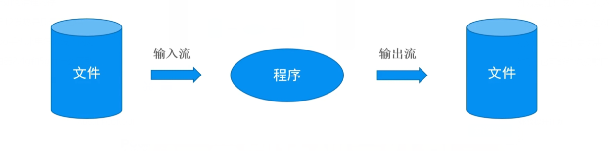
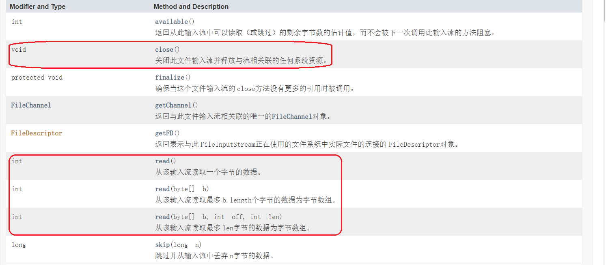
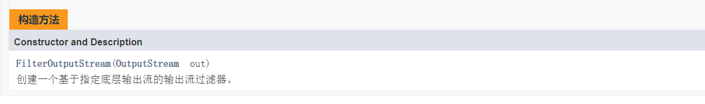
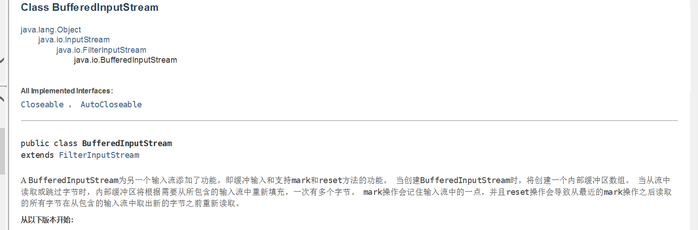
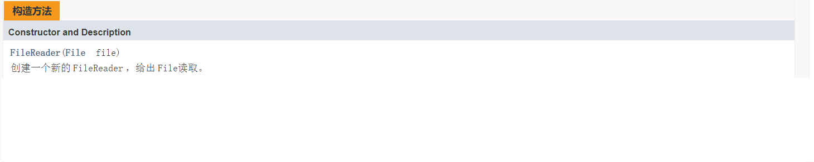
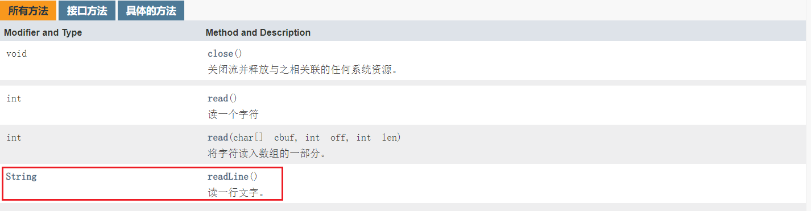
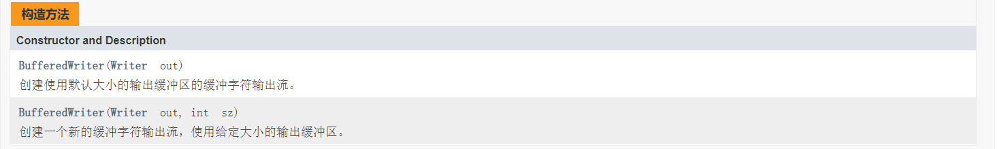
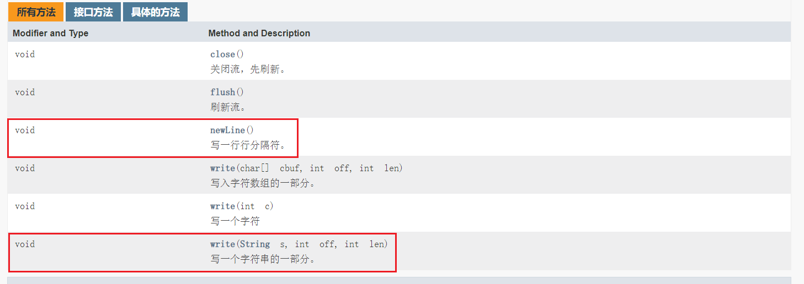
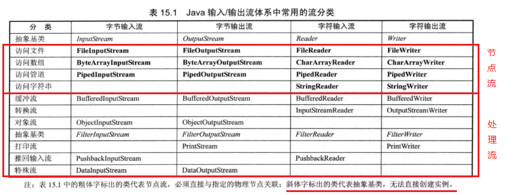
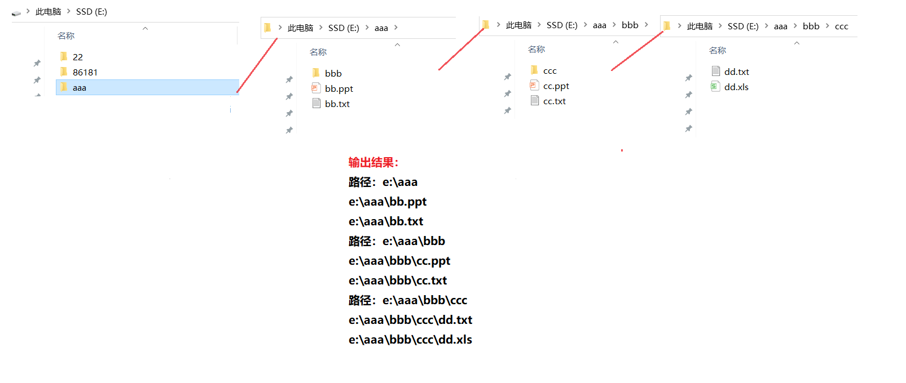

## 一、流的概念

概念：内存与存储设备之间传输数据的通道。


## 二、流的分类

**按方向分类：**

- 输入流：将<存储设备>中的内容读入到<内存>中
- 输出流：将<内存>中的内容读入到<存储设备>中



> 内存：内存是一种用于暂时存放[CPU]中的运算数据和外部储存器交换数据的随机储存器。
>
> 存储：一般可分为[机械硬盘]和[固态硬盘]，是一种储存硬件，用于存放数据。

**按单位进行划分：**

- 字节流：以字节为单位，可以读写所有数据。
- 字符流：以字符为单位，只能读写文本数据。

**按功能进行划分：**

- 节点流：具有实际传输数据的读写功能。
- 过滤流：在节点流的基础上增强功能，比如缓冲流。

## 三、字节流

### 文件字节流

#### 字节流的两个抽象父类：

- 字节输入流：`InputStream`

 这个抽象类是表示输入字节流的所有类的超类。

 常用方法：


- 字节输出流：`OutputStream`

 这个抽象类是表示字节输出流的所有类的超类。 输出流接收输出字节并将其发送到某个接收器。

 常用方法：


>flush() 方法的作用是强制将缓冲区中的数据立即写入到文件中，即使缓冲区没有满。在文件写入操作中，通常会有一个缓冲区，数据首先被写入到这个缓冲区中，当缓冲区满或者关闭流时，数据才会被真正写入到文件中。调用 flush() 可以确保数据立即被写入到文件，这在需要确保数据即时写入的场景中很有用。

#### 字节流的两个子类——文件字节流：


##### 文件字节输入流：`FileInputStream`——读取文件

> public class FileInputStream extends InputStream

 从文件系统中的文件获取输入字节。 什么文件可用取决于主机环境。

 `FileInputStream`用于读取诸如图像数据的原始字节流。 要阅读字符串，请考虑使用`FileReader` 。

构造方法：


常用方法：



> public int read(byte[] b)
> 从流中读取`多个`字节，将读到的内容存入`b`数组，返回实际读到的`字节数`；如果达到文件的尾部，则返回`-1`

**第一种读取方式**：单个字节读取——效率不高！

【参考代码】

```java
import java.io.FileInputStream;
import java.io.FileNotFoundException;

public class InputStreamTest {
  public static void main(String[] args) {
        try {
            // 1. 创建 FileInputStream，并指定文件路径
            FileInputStream fis = new FileInputStream("d:\\aaa.txt");

            // 2. 读取文件 fis.read()：一个一个的读
            int data;
            while ((data = fis.read()) != -1) {
                // 输出读取到的字节数据(由于无法指定编码格式，所以读取中文并输出时会出现乱码)
                System.out.print((char) data);
            }

            // 3. 读完之后，关闭流
            fis.close();
        } catch (IOException e) {
            e.printStackTrace();
        }
    }
}
```

**第二种读取方式**：一次读取多个字节，多一个字节数组！

```java
import java.io.FileInputStream;
import java.io.FileNotFoundException;

public class InputStreamTest {
    public static void main(String[] args) throws Exception {
//        1.创建FileInputStream，并指定文件路径
        FileInputStream fis = new FileInputStream("d:\\aaa.txt");
//        2 .一次读取多个字节
        byte[] buf = new byte[1024];
        int count = 0;
        while ((count = fis.read(buf)) != -1){
            System.out.println(new String(buf, 0, count)); // abcdefg
        }
//        3.读完之后，关闭流
        fis.close();
    }

}
```

##### 文件字节输出流：`FileOutputStream`——写入文件

> public class FilterOutputStream extends OutputStream

这个类是过滤输出流的所有类的超类。 这些流位于已经存在的输出流（ *底层*输出流） *之上* ，它使用它作为数据的基本接收器，但是可能沿着数据方向转换或提供附加功能。

构造方法：



常用方法：


> public int write(byte[] b)
> 一次写多个字节，将b数组中的所有字节，写入输出流中！

【参考代码】

```java
import java.io.FileNotFoundException;
import java.io.FileOutputStream;

public class FileOutPutStreamTest {
    public static void main(String[] args) throws Exception {
        // 创建文件输出流
        FileOutputStream fos = new FileOutputStream("d:\\bbb.txt",true);//加true后新的字节不会覆盖文件中原有的字节
        // 读入多个字节
        String str = "abcdef";
        fos.write(str.getBytes());
        // 关闭流
        fos.close();
        System.out.println("加载完毕！");

    }
}
```

> 注：如果是文本文件最好用字符流

**案例：使用文件字节流进行文件复制**

复制文件：利用文件字节流，一边读取，一边写入！

> 注：使用字节流可以复制任意文件，而字符流却不行！

【参考代码】

```java
import java.io.FileInputStream;
import java.io.FileOutputStream;

public class FileCopyDemon {
    public static void main(String[] args) throws Exception{
        // 创建文件输入流
        FileInputStream fis = new FileInputStream("d:\\bbb.txt");

        // 创建文件输出流
        FileOutputStream fos = new FileOutputStream("d:\\ccc.txt");

        //复制文件：一边读取，一边写入
        byte[] buf = new byte[1024];
        int count = 0;// count实际读取的个数
        while ((count = fis.read(buf)) != -1){
            fos.write(buf, 0, count);
        }
        fis.close();
        fos.close();
        System.out.println("复制完毕！");
    }
}
```

### 文件字节缓冲流



缓冲流：`BufferedInputStream/BufferedOutputStream`。提高IO效率，减少访问磁盘的次数；数据存储在缓冲区，`flush`是将缓冲区的内容写入文件中，也可以直接`close`。

- 字节输入缓冲流：`BufferedInputStream`——快速读取文件

 `BufferedInputStream`为另一个输入流添加了功能，即缓冲输入和支持`mark`和`reset`方法的功能。 当创建`BufferedInputStream`时，将创建一个内部缓冲区数组。 当从流中读取或跳过字节时，内部缓冲区将根据需要从所包含的输入流中重新填充，一次有多个字节。 `mark`操作会记住输入流中的一点，并且`reset`操作会导致从最近的`mark`操作之后读取的所有字节在从包含的输入流中取出新的字节之前重新读取。

构造方法：


常用方法：


【参考代码】

```java
import java.io.BufferedInputStream;
import java.io.FileInputStream;

public class BufferedInputStreamDemon {
    public static void main(String[] args) throws Exception{
        FileInputStream fis = new FileInputStream("d:\\aaa.txt");
        //1. 创建字节缓冲输入流
        /* BufferedInputStream 的构造函数没有指定缓冲区大小，因此它将使用默认的 8192 字节缓冲区。当 bis.read() 第一次被调用时，BufferedInputStream 会从 FileInputStream 中读取最多 8192 字节的数据填充其内部缓冲区。之后，每次调用 bis.read() 时，BufferedInputStream 都会尝试从缓冲区中读取数据，直到缓冲区为空，此时它会再次从 FileInputStream 中读取数据填充缓冲区。*/
        BufferedInputStream bis = new BufferedInputStream(fis); // 维护字节流，从缓冲区读取字节，加快效率

        //2. 读取
        int data = 0;
        while((data = bis.read()) != -1){
            System.out.println((char) data);
        }

        //3. 关闭缓冲流
        bis.close();
    }
}
```

- 字节输出缓冲流：`BufferedOutputStream`——快速写入文件

 该类实现缓冲输出流。 通过设置这样的输出流，应用程序可以向底层输出流写入字节，不必为写入的每个字节导致底层系统的调用。

构造方法：


常用方法：


【参考代码】

```java
import java.io.BufferedOutputStream;
import java.io.FileOutputStream;

public class BufferedOutputStreamDemon {
    public static void main(String[] args) throws Exception{

        FileOutputStream fos = new FileOutputStream("d:\\buff.txt");
        //1. 创建输出缓冲流
        BufferedOutputStream bos = new BufferedOutputStream(fos);
        //2. 写入文件
        String str = "hello";
        for(int i = 0; i <= 5; i ++){
            bos.write(str.getBytes()); // 写入8k缓冲区
            bos.flush(); // 刷新到硬盘
        }
        //3. 关闭流(内部调用)
        fos.close();
    }
}
```


## 四、字符流

**引入：**3个字节相当于一个字符，当我们要读取汉字（字符）时，如果用字节流来读取的话，他是一个一个字节读取的，最终的结果是字节，而不是我们想要的字符了！

字符流的两个父类（抽象类）：

- `Reader`：字符输入流

  常用方法：

  ```java
  public int read() {}
  public int read(char[] c) {}
  public int read(char[] b, int off, int len) {}
  ```

- `Write`：字符输出流

  常用方法：

  ```java
  public void write(int n) {}
  public void write(String str) {}
  public void write(char[] c) {}
  ```

### 文件字符流


- `FileReader`——文件字符输入流

读取字符文件的便利类。 该类的构造函数假定默认字符编码和默认字节缓冲区大小是适当的。 要自己指定这些值，请在FileInputStream上构造一个InputStreamReader。

`FileReader`是用于读取字符流。 要读取原始字节流，请考虑使用`FileInputStream` 。

```java
public class FileReader	extends InputStreamReader
```

构造方法：



常用方法：继承父类

```java
public int read(char[] c);
从流中读取多个字符，将读到内容存入c数组，返回实际读到的字符数；如果文件达到尾部，则返回-1.
```

【参考代码】

```java
import java.io.FileReader;

public class FileReaderDemon {
    public static void main(String[] args) throws Exception{

        //1. 创建FileReader 文件字符输入流
        FileReader fr = new FileReader("d:\\hello.txt");

        //2. 读取
        //2.1 单个读取
//        int data = 0;
//        while ((data = fr.read()) != -1){ // 读取一个字符！
//            System.out.println((char)data);
//        }
        char[] buf = new char[1024];
        int count = 0;
        while((count = fr.read(buf)) != -1){
            System.out.println(new String(buf, 0, count));
        }
        //3. 关闭
        fr.close();
    }
}
```

- `FileWriter`——文件字符输出流

```java
public void write(String str);
一次写入多个字符，将b数组中所有字符，写入输出流；
```

【参考代码】

```java
import java.io.FileWriter;

public class FileWriterDemon {
    public static void main(String[] args) throws Exception{

        //1. 创建FileWriter对象
        FileWriter fw = new FileWriter("d:\\write.txt");

        //2. 写入字符
        String str = "防不胜防";
        for(int i = 0; i < str.length(); i ++){
            fw.write(str);
            //flush() 方法的作用是强制将缓冲区中的数据立即写入到文件中，即使缓冲区没有满。在文件写入操作中，通常会有一个缓冲区，数据首先被写入到这个缓冲区中，当缓冲区满或者关闭流时，数据才会被真正写入到文件中。调用 flush() 可以确保数据立即被写入到文件，这在需要确保数据即时写入的场景中很有用。
            fw.flush();
        }
        //3. 关闭
        fw.close();
        System.out.println("执行完毕");
    }
}
```

**案例：文件字符流实现文本文件复制**

注：`FileReader、FileWriter`只能复制文本文件，不能复制图片或者二进制文件！—— 文本文件有字符编码！

【参考代码】

```java
import java.io.FileReader;
import java.io.FileWriter;

public class CopyDemon {
    public static void main(String[] args) throws Exception{

        //1. 创建FileReader  FileWriter 对象
        FileReader fr = new FileReader("d:\\write.txt");
        FileWriter fw = new FileWriter("d:\\write2.txt");

        //2. 读写
        int data = 0;
        while((data = fr.read()) != -1){
            fw.write(data);
            fw.flush();
        }
        
        //3. 关闭
        fr.close();
        fw.close();
        System.out.println("复制完毕！");

    }
}
```

### 字符缓冲流

字符缓冲流：`BufferedReader/BufferedWriter`

（1）高效读写

（2）支持输入换行

（3）可一次写一行，读一行。

- `BufferedReader`——字符缓冲输入流

 从字符输入流读取文本，缓冲字符，以提供字符，数组和行的高效读取。

 可以指定缓冲区大小，或者可以使用默认大小。 默认值足够大，可用于大多数用途。

 通常，由读取器做出的每个读取请求将引起对底层字符或字节流的相应读取请求。 因此，建议将BufferedReader包装在其read（）操 作可能昂贵的读取器上，例如FileReader

```java
  BufferedReader in = new BufferedReader(new FileReader("foo.in")); 
```

将缓冲指定文件的输入。 没有缓冲，每次调用read（）或readLine（）可能会导致从文件中读取字节，转换成字符，然后返回，这可能非常低效。

构造方法：


常用方法：



【参考代码】

~~~java
import java.io.BufferedReader;
import java.io.FileReader;

/**
 * 字符缓冲流读取文件
 */
public class BufferedReaderDemon {
    public static void main(String[] args) throws Exception{

        //1. 创建缓冲流
        FileReader fr = new FileReader("d:\\write.txt");
        BufferedReader br = new BufferedReader(fr);

        //2. 读取
        //2.1 第一种读取方式
//        char[] buf = new char[1024];
//        int count = 0;
//        while ((count = br.read(buf)) != -1){
//            System.out.println(new String(buf, 0, count));
//        }
        //2.2 第二种读取方式。 一行一行的读取
        String line = null;
        while ((line = br.readLine()) != null){
            System.out.println(line);
        }
        //3. 关闭
        br.close();
    }
}
~~~

- `BufferedWriter`——字符缓冲输出流（写入字符）

将文本写入字符输出流，缓冲字符，以提供单个字符，数组和字符串的高效写入。

可以指定缓冲区大小，或者可以接受默认大小。 默认值足够大，可用于大多数用途。

提供了一个newLine（）方法，它使用平台自己的系统属性`line.separator`定义的行分隔符概念。 并非所有平台都使用换行符（'\ n'）来终止行。 因此，调用此方法来终止每个输出行，因此优选直接写入换行符。

构造方法：



常用方法：



【参考代码】

```java
import java.io.BufferedWriter;
import java.io.FileWriter;

public class BufferedWriterDemon {
    public static void main(String[] args) throws Exception{
        //1. 创建BufferedWriter对象
        FileWriter fw = new FileWriter("d:\\buffer.txt");
        BufferedWriter bw = new BufferedWriter(fw);
        //2. 写入
        for (int i = 0; i < 5; i ++){
            bw.write("好好学习吧！");
            bw.newLine();// 换行！
        }
        //3. 关闭
        //在bw.close()方法调用时，BufferedWriter会自动执行flush()操作，将缓冲区的内容写入到文件中
        bw.close();
    }
}
```


### 转换流


api文档对转换流的解释


转换流：`InputStreamReader/OutputStreamWriter`

（1）可以将字节流转为字符流

（2）可设置字符的编码方式

**转换流的使用：**

InputStreamReader读取文件

【参考代码】

```java
import java.io.FileInputStream;
import java.io.InputStreamReader;

public class ZhuanHuanLiuTest {
        public static void main(String[] args) throws Exception{
            //1. 创建InputStreamReader对象
            FileInputStream fis = new FileInputStream("d:\\write.txt");
            InputStreamReader isr = new InputStreamReader(fis, "utf-8"); // 转换流设置编码方式

            //2.读取文件
            int data = 0;
            while ((data = isr.read()) != -1){
                System.out.println((char) data);
            }
            //3. 关闭
            isr.close();
        }
}
```

OutputStreamWriter——写入文件

【参考代码】

```java
import java.io.FileOutputStream;
import java.io.OutputStreamWriter;

public class ZhuanHuanLiuTest {
    public static void main(String[] args) throws Exception{
        //1. 创建OutputStreamWriter对象
        FileOutputStream  fos = new FileOutputStream("d:\\info.txt");
        OutputStreamWriter osw = new OutputStreamWriter(fos, "gbk"); // 转换流设置编码方式

        //2. 写入
        for(int i = 0; i < 5; i ++){
            osw.write("我爱学习\r\n");
        }
        //3. 关闭
        osw.close();
    }
}
```

## 五、处理流

### 缓冲流 （Buffered）

（1）字节缓冲流：`BufferedInputStream/BufferedOutputStream`。(详见--字节流/文件字节缓冲流)
（2）字符缓冲流：`BufferedReader/BufferedWriter`（详见--字符流/字符缓冲流）

### 打印流（Print）（待补充）

- `PrintWriter`——打印流

将对象的格式表示打印到文本输出流。 这个类实现了全部在发现`print种`方法[`PrintStream`](https://www.matools.com/file/manual/jdk_api_1.8_google/java/io/PrintStream.html) 。 它不包含用于编写原始字节的方法，程序应使用未编码的字节流。

不像类，如果启用自动刷新，它只会在调用的`println，printf，`或`format`方法来完成，而不是当一个换行符恰好是输出。 这些方法使用平台自己的行分隔符而不是换行符。

### 转换流

转换流：`InputStreamReader/OutputStreamWriter`

（1）可以将字节流转为字符流

（2）可设置字符的编码方式

**转换流的使用：**

InputStreamReader读取文件

【参考代码】

```java
import java.io.FileInputStream;
import java.io.InputStreamReader;

public class ZhuanHuanLiuTest {
        public static void main(String[] args) throws Exception{
            //1. 创建InputStreamReader对象
            FileInputStream fis = new FileInputStream("d:\\write.txt");
            InputStreamReader isr = new InputStreamReader(fis, "utf-8"); // 转换流设置编码方式

            //2.读取文件
            int data = 0;
            while ((data = isr.read()) != -1){
                System.out.println((char) data);
            }
            //3. 关闭
            isr.close();
        }
}
```

OutputStreamWriter——写入文件

【参考代码】

```java
import java.io.FileOutputStream;
import java.io.OutputStreamWriter;

public class ZhuanHuanLiuTest {
    public static void main(String[] args) throws Exception{
        //1. 创建OutputStreamWriter对象
        FileOutputStream  fos = new FileOutputStream("d:\\info.txt");
        OutputStreamWriter osw = new OutputStreamWriter(fos, "gbk"); // 转换流设置编码方式

        //2. 写入
        for(int i = 0; i < 5; i ++){
            osw.write("我爱学习\r\n");
        }
        //3. 关闭
        osw.close();
    }
}
```

### 数据流（Data）（待补充）

- `DataInputStream/DataOutputStream`：读写Java原始数据类型


### 对象流（Object）

对象流：`ObjectInputStream/ObjectOutputStream`。

（1）增强了缓冲区功能

（2）增强了读取8种基本数据类型和字符串功能

（3）增强了读写对象的功能：

 readObject() 从流中读取一个对象（反序列化）

 writeObject(Object obj) 向流中写入一个对象（序列化）

> 使用流传输对象的过程称为序列化，和反序列化。

- 对象输出流：`ObjectOutputStream`——序列化（写入对象）

 ObjectOutputStream将Java对象的原始数据类型和图形写入OutputStream。 可以使用ObjectInputStream读取（重构）对象。 可以 通过使用流的文件来实现对象的持久存储。 如果流是网络套接字流，则可以在另一个主机上或另一个进程中重构对象。

构造方法：


常用方法：


【参考代码】

```java
import java.io.FileInputStream;
import java.io.FileOutputStream;
import java.io.ObjectOutputStream;
import java.io.Serializable;


public class ObjectOutputStreamDemon {
    /**
     * 使用ObjectOutputStream实现对象的序列化————读入对象
     * 要求：序列化类必须实现接口
     */
    public static void main(String[] args) throws Exception{

       //1. 创建对象流
       //.bin是二进制文件格式，用于存储序列化后的对象。相比于文本文件，二进制文件更高效地存储数据，并且能保持对象的完整结构。
        FileOutputStream fos = new FileOutputStream("d:\\stu.bin");
        ObjectOutputStream oos = new ObjectOutputStream(fos);

        //2. 序列化（写入操作）
        Student student = new Student("张三",19);
        oos.writeObject(student);

        //3. 关闭(自带flush()方法了)
        oos.close();
        System.out.println("序列化完毕");

    }
}

class  Student implements Serializable {
     //自定义序列化版本号的好处：
     //在反序列化之前，如果突然临时增加或删除Student类的属性，反序列化依然能够顺利完成。
    //如果使用自动生成的serialVersionUID，在更类的属性后，serialVersionUID也会自动改变，从而导致文件中的serialVersionUID和类中的serialVersionUID不匹配，导致反序列化失败。
    //自定义serialVersionUID一直不会发生改变，避免了之一情况发生。
    private static final long  serialVersionUID = -6537681922718042751L;
    private String name;
    private int age;

    public Student(String name, int age) {
        this.name = name;
        this.age = age;
    }

    public String getName() {
        return name;
    }

    public void setName(String name) {
        this.name = name;
    }

    public int getAge() {
        return age;
    }

    public void setAge(int age) {
        this.age = age;
    }

    @Override
    public String toString() {
        return "Student{" +
                "name='" + name + '\'' +
                ", age=" + age +
                '}';
    }
}
```

> 使用ObjectOutputStream实现对象的序列化————写入对象
>
> 要求：序列化类必须实现接口

- 对象输入流：`ObjectInputStream`——反序列化（读取重构成对象）

 ObjectInputStream反序列化先前使用ObjectOutputStream编写的原始数据和对象。

构造方法：


常用方法：


【参考代码】

```java
import java.io.*;


public class ObjectInputStreamDemon {
    public static void main(String[] args) throws Exception{
        //1. 创建对象流
        FileInputStream fis = new FileInputStream("d:\\stu.bin");
        ObjectInputStream ois = new ObjectInputStream(fis);

        //2. 读取文件（反序列化）
        Student st = (Student) ois.readObject();

        //3. 关闭
        ois.close();

        System.out.println(st.toString());// Student{name='张三', age=19}
    }
}
```

序列化和反序列化注意事项：

（1）序列化类必须实现`Serializable`接口

（2）序列化类中对象属性要求实现Serializable接口

（3）序列化版本号ID，保证序列化的类和反序列化的类是同一个类

（4）使用transient（瞬间的）修饰属性，这个属性不能序列化

（5）静态属性不能序列化

（6）序列化多个对象，可以借助集合

### 过滤流（Filter）（待补充）


## 六、节点流

在Java IO中，节点流主要包括以下几种：

- `InputStream和OutputStream`：InputStream和OutputStream是所有输入流和输出流的父类，它们定义了读和写的基本操作。InputStream提供了read()方法，可以读取一个字节或一组字节，而OutputStream提供了write()方法，可以写入一个字节或一组字节。
- `FileInputStream和FileOutputStream`：FileInputStream和FileOutputStream是用于读写文件的流。FileInputStream负责从文件中读取数据，而FileOutputStream负责向文件中写入数据。
- `ByteArrayInputStream和ByteArrayOutputStream`：ByteArrayInputStream和ByteArrayOutputStream是用于读写字节数组的流。ByteArrayInputStream负责从字节数组中读取数据，而ByteArrayOutputStream负责向字节数组中写入数据。
- `DataInputStream和DataOutputStream`：DataInputStream和DataOutputStream是用于读写基本数据类型的流。DataInputStream提供了readXXX()方法，可以读取int、long、float、double等基本数据类型，而DataOutputStream提供了writeXXX()方法，可以写入int、long、float、double等基本数据类型。
- `BufferedInputStream和BufferedOutputStream`：BufferedInputStream和BufferedOutputStream是用于缓冲读写的流。它们可以提高读写性能，减少读写操作对磁盘的访问次数。BufferedInputStream负责读取数据并将其存储在缓冲区中，而BufferedOutputStream负责将缓冲区中的数据写入到目标中。
- `ObjectInputStream和ObjectOutputStream`：ObjectInputStream和ObjectOutputStream是用于读写Java对象的流。ObjectInputStream负责从输入流中读取对象，而ObjectOutputStream负责将对象写入输出流中。
- `PipedInputStream和PipedOutputStream`：PipedInputStream和PipedOutputStream是用于实现管道通信的流。PipedInputStream负责从管道中读取数据，而PipedOutputStream负责将数据写入管道中。

## 七、节点流和处理流 区别

理解好Java-IO中的节点流和处理流是理解Java输入、输出的关键基础，因此，了解节点流和处理流相关的知识点尤为重要。

### 1.定义

（1）节点流：可以从或向一个特定的地方（节点）读写数据。如FileReader。

（2）处理流（用来包装节点流）：是对一个已存在的流的连接和封装，通过所封装的流的功能调用实现数据读写。如BufferedReader.处理流的构造方法总是要带一个其他的流对象做参数。一个流对象经过其他流的多次包装，称为流的链接。

 

### 2.区别与联系

（1）节点流是低级流,直接跟数据源相接。

　　 处理流(也叫包装流)把节点流包装了一层,属于修饰器设计模式，不会直接与数据源相连，通过处理流来包装节点流既可以消除不同节点流的实现差异，也可以提供更方便的方法来完成输入输出。

（2）处理流的功能主要体现在以下两个方面:

​    1.性能的提高:主要以增加缓冲的方式来提高输入输出的效率。

​    2.操作的便捷:处理流可能提供了一系列便捷的方法来一次输入输出大批量的内容,而不是输入/输出一个或多个水滴处理流可以嫁接在任何已存在的流的基础上。

 

### 3.节点流和处理流的分类




## 八、编码方式


注：当编码方式和解码方式不一致时，就会出现乱码！

>乱码问题通常出现在编码和解码过程中使用不一致的字符编码方式时。字符编码是将字符映射到特定编码系统中的数字的过程，而解码则是将这些数字重新转换回字符的过程。如果编码和解码使用的编码系统不一致，就会导致无法正确还原原始字符，从而产生乱码。
>
>### 举例说明
>
>假设我们有一个文本文件，其中包含一个简单的句子：“你好，世界！”。这个文本文件是用UTF-8编码保存的。
>
>#### 编码过程（UTF-8）
>
>1. 使用UTF-8编码，每个中文字符（如“你”和“好”）通常占用3个字节，而英文字符（如“，”和“！”）占用1个字节。
>2. 例如，“你”在UTF-8中的编码可能是`E4 BD A0`，“好”可能是`E5 A5 BD`。
>
>#### 解码过程（假设使用GB2312解码）
>
>1. 如果这个文件被错误地用GB2312编码来解码，GB2312是一种主要用于简体中文的编码方式，它对中文字符的编码与UTF-8不同。
>2. 当尝试用GB2312解码UTF-8编码的字节时，由于编码映射不匹配，原本的UTF-8编码字节无法正确转换为GB2312中的字符。
>3. 例如，UTF-8中的`E4 BD A0`（“你”）在GB2312中没有对应的字符，因此解码结果会显示为乱码或不可识别的字符。
>
>#### 结果
>
>- 在GB2312解码下，原本的“你好，世界！”可能会显示为不可读的字符序列，如“鎴戞槸锛屼笘鐣屽ぇ瀹跺拰鐨勫畨鍏ㄥ悕锛?”，这是因为GB2312尝试将UTF-8编码的字节映射到其字符集中的字符，但映射失败。
>
>### 结论
>
>这个例子说明了当编码和解码使用的字符编码不一致时，会导致字符无法正确还原，从而产生乱码。为了避免这种情况，确保在编码和解码过程中使用相同的字符编码是非常重要的。

## 九、File类

概念：代表物理磁盘中的一个**文件**或者**文件夹（目录）**。

常用方法：


### 文件操作

**（1）分隔符：**

- 路径分隔符`;`
- 名称分隔符`\`

**（2）文件操作：**

- 创建文件`createNewFile()`

  > `boolean createNewFile()`当且仅当具有该名称的文件尚不存在时，原子地创建一个由该抽象路径名命名的新的空文件。

  ```java
  if(!file.exists()){ // 如果文件不存在则创建
      boolean b = file.createNewFile();
      System.out.println("创建结果" + b);
  }
  ```

- **删除文件**

  直接删除：`delete()`

  > `boolean delete()`删除由此抽象路径名表示的文件或目录

  JVM退出时删除：

  ```java
  file.deleteOnExit();
  Thread.sleep(5000); // 休眠五秒
  ```

- **获取文件信息**

  - `getAbsolutePath()`：获取到文件的绝对路径

  - `getPath()`：获取到文件的路径

  - `getName()`：获取文件的名称

  - `getParent()`：获取文件的父级目录

  - `length()`：获取文件的长度

  - `lastModified()`：获取文件最后的修改时间（如果是新创建的文件夹，获得的是文件的创建时间）

    ```java
    System.out.println("文件最后修改时间（或新文件创建时间）：" + new Date(file.lastModified()));
    ```

- 判断

  - `canWrite()`：判断文件是否可写
  - `isFile()`：判断是否是文件
  - `isHidden()`：判断文件是否隐藏

【参考代码】

```java
import java.io.File;
import java.util.Date;

public class FileTest {
    public static void main(String[] args) throws Exception{
        fileOpe();
    }

    /**
     * 文件操作
     */
    public static void fileOpe() throws Exception{
        //1. 创建文件
        File file = new File("d:\\file.txt"); // 只是创建了一个文件对象，此时在d盘下并没有该文件
        if(!file.exists()){ // 如果文件不存在则创建
            boolean b = file.createNewFile();
            System.out.println("创建结果" + b);
        }
        //2. 删除文件
        //2.1 直接删除
//        System.out.println("删除结果" + file.delete());
//        //2.2 JVM退出时删除
//        file.deleteOnExit();
//        Thread.sleep(5000); // 休眠五秒

        //3. 获取文件信息
        System.out.println("获取文件绝对路径" + file.getAbsolutePath()); // 获取文件绝对路径d:\file.txt
        System.out.println("获取路径" + file.getPath());
        System.out.println("获取文件名称" + file.getName());
        System.out.println("获取文件父目录" + file.getParent());
        System.out.println("获取文件长度" + file.length());
        System.out.println("文件最后修改时间（或新文件创建时间）：" + new Date(file.lastModified()));

        //4. 判断
        System.out.println("是否可写" + file.canWrite());
        System.out.println("是否是文件" + file.isFile());
        System.out.println("是否隐藏" + file.isHidden());

    }
}
```

### 文件夹操作

- 创建文件夹

  | `boolean` | `mkdir()`创建由此抽象路径名命名的目录。                      |
  | --------- | ------------------------------------------------------------ |
  | `boolean` | `mkdirs()`创建由此抽象路径名命名的目录，包括任何必需但不存在的父目录。 |

  ```java
          File dir = new File("d:\\aaa\\bbb\\ccc");
          if(! dir.exists()){
              dir.mkdir();// 只能单级目录
              System.out.println("创建结果：" +  dir.mkdirs()); //mkdirs();//可以创建多级目录
          }
  ```

- 删除文件夹

  直接删除：`delete()`——只能删除空目录

  JVM删除：`file.deleteOnExit();Thread.sleep(5000);` // 休眠五秒

- 获取文件夹信息

  - `getAbsolutePath()`：获取到文件夹的绝对路径
  - `getPath()`：获取到文件夹的路径
  - `getName()`：获取文件夹的名称（最里层）
  - `getParent()`：获取文件夹的父级目录
  - `lastModified()`：文件夹最后修改时间（或新文件夹创建时间）

- 判断

  - `isDirectory()`：判断是否是文件夹
  - `isHidden()`：判断文件是否隐藏

- 遍历文件

  (1)`list()`

  | `String[]` | `list()`返回一个字符串数组，命名由此抽象路径名表示的目录中的文件和目录。 |
  | ---------- | ------------------------------------------------------------ |
  |            |                                                              |

  ```java
         //5. 遍历文件夹
          File dir2 = new File("e:\\picture");
          String[] files = dir2.list();
          for(String str: files){
              System.out.println(str);
          }
  ```

  (2)` listFiles()`

  | `File[]` | `listFiles()`返回一个抽象路径名数组，表示由该抽象路径名表示的目录中的File对象。 |
  | -------- | ------------------------------------------------------------ |
  |          |                                                              |

  ```java
      //5. 遍历文件夹
       File dir2 = new File("e:\\picture");
       File[] files = dir2.listFiles(); // 文件数组
       for(File file: files){
           System.out.println(file.getName());
       }
  ```

### FileFilter接口

当调用File类中的`listFiles()`方法时，支持传入`FileFilter`接口接口实现类，对获取文件进行过滤，只有满足条件的文件才可以出现在`listFiles()`方法的返回值中。

| `File[]` | `listFiles(FileFilter filter)`返回一个抽象路径名数组，表示由此抽象路径名表示的满足指定过滤器的目录中的文件和目录。 |
| -------- | ------------------------------------------------------------ |
|          |                                                              |

【参考代码】

```java
		File dir2 = new File("e:\\picture");
		// 过滤：过滤出满足条件的文件
        File[] file2 = dir2.listFiles(new FileFilter() {
            @Override
            public boolean accept(File pathname) {
                if(pathname.getName().endsWith(".png")){ // 只要.png结尾的图片
                    return true;
                }
                return false;
            }
        });
        // 遍历输出
        for(File file : file2){
            System.out.println(file.getName());
        }
```

### 递归遍历与删除

**递归遍历文件夹：**

遍历拿到`dir.listFiles()`路径的路径数组，数组不为空且有文件的情况下，如果是文件夹递归则进去，直到不是文件夹，然后输出文件，否则输出当前目录下的文件！

【参考代码】

```java
import java.io.File;

public class ListDemon {
    public static void main(String[] args) {
        listDir(new File("e:\\aaa"));
    }
    //递归遍历文件夹
    public static void listDir(File dir){
        File[] files = dir.listFiles();// 得到所有得子文件与子文件夹
        System.out.println("路径："+ dir.getAbsolutePath());
        if(files != null && files.length > 0){
            for(File file : files){
                if(file.isDirectory()){// 判断是否为文件夹
                    listDir(file); // 如果是文件夹递归进去，直到不是文件夹
                }else{// 不是文件夹 则输出
                    System.out.println(file.getAbsolutePath());
                }
            }
        }

    }
}
```

我电脑E盘下的aaa文件如下图：



递归删除文件夹:

我们直到`delete()`方法只能删除空目录。如果目录里边有内容，`delete()`方法是无法删除的，即我们想用`delete()`方法删除上述aaa文件是行不通的！

为此，我们得先将`aaa`文件中所有内容给删除之后，才能将`aaa`文件删除掉！`aaa`里边有`bbb`文件夹，为此得先把它里边得内容先删掉，`bbb`里边有`ccc`文件夹为此得先把它里边得内容先删掉........然后再逐步回退删除文件夹！

【参考代码】

```java
import java.io.File;

public class ListDemon {
    public static void main(String[] args) {
        deleteDir(new File("e:\\aaa"));
    }

    // 递归删除文件夹
    public static void deleteDir(File dir){
        File[] files = dir.listFiles();
        if(files != null && files.length > 0){
            for(File file : files){
                if(file.isDirectory()){
                    deleteDir(file); // 递归
                }else {
                    // 删除文件
                    System.out.println(file.getAbsolutePath() + "删除：" + file.delete());
                }
            }
        }
        // 删除文件夹
        System.out.println(dir.getAbsolutePath() + "删除：" + dir.delete());
    }

}
```

图示：


### Properties

Properties：属性集合

> public class Properties extends Hashtable<Object,Object>

`Properties`类表示一组持久的属性。 `Properties`可以保存到流中或从流中加载。 属性列表中的每个键及其对应的值都是一个字符串。

属性列表可以包含另一个属性列表作为其“默认值”; 如果在原始属性列表中找不到属性键，则会搜索此第二个属性列表。

特点：

- 存储属性名和属性值
- 属性名和属性值都是字符串类型
- 没有泛型
- 和流有关

| `String` | `getProperty(String key)`使用此属性列表中指定的键搜索属性，得到对应得value。 |
| -------- | ------------------------------------------------------------ |
| `Object` | `setProperty(String key, String value)`同 `Hashtable`方法 `put` 。 |
| `void`   | `list(PrintStream out)`将此属性列表打印到指定的输出流。      |
| `void`   | `load(InputStream inStream)`从输入字节流读取属性列表（键和元素对）。 |
| `void`   | `store(OutputStream out, String comments)`将此属性列表（键和元素对）写入此 `Properties`表中，以适合于使用方法加载到 `Properties`表中的格式输出流。 |

**后面学习的JDBC连接数据会用得到`.properties`文件**