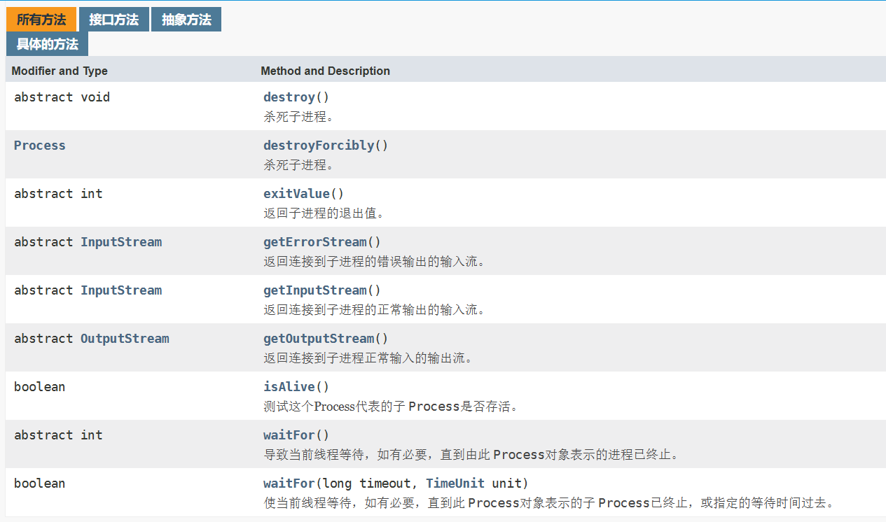
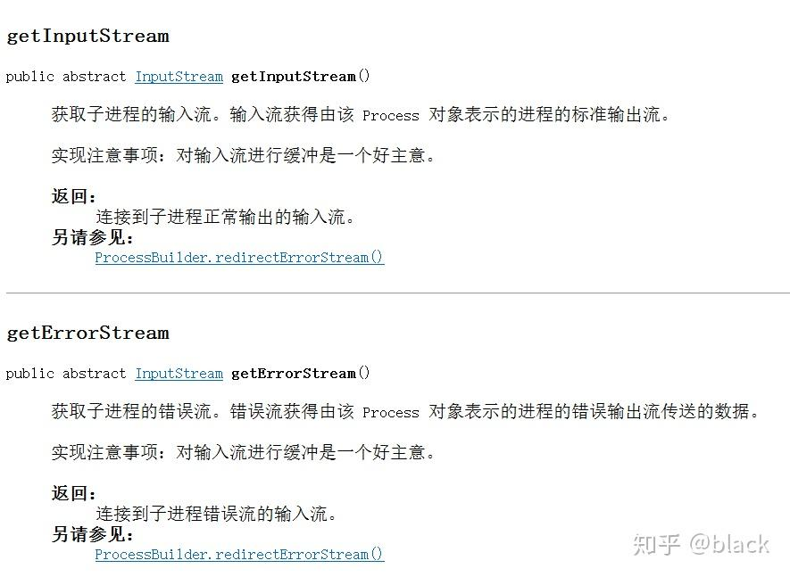

# Runtime类和Process类

## Runtime类和Process类的关系

Runtime的`exec()`方法会返回一个Process对象

```java
public Process exec(String command)throws IOException  // 执行command指令，启动一个新的进程
```

## Runtime类详细总结 	

> 原文地址：https://www.cnblogs.com/summerday152/p/14146809.html##runtime%E7%B1%BB%E7%AE%80%E4%BB%8B

###  Runtime类简介

Java中，Runtime类提供了许多的API 来与`java runtime environment`进行交互，如：

- 执行一个进程。
- 调用垃圾回收。
- 查看总内存和剩余内存。

Runtime是单例的，可以通过`Runtime.getRuntime()`得到这个单例。

### API列表

| public static Runtime getRuntime()                    | 返回单例的Runtime实例                           |
| :---------------------------------------------------- | :---------------------------------------------- |
| public void exit(int status)                          | 终止当前的虚拟机                                |
| public void addShutdownHook(Thread hook)              | 增加一个JVM关闭后的钩子                         |
| public Process exec(String command)throws IOException | 执行command指令，启动一个新的进程               |
| public int availableProcessors()                      | 获得JVM可用的处理器数量（一般为CPU核心数）      |
| public long freeMemory()                              | 获得JVM已经从系统中获取到的总共的内存数【byte】 |
| public long totalMemory()                             | 获得JVM中剩余的内存数【byte】                   |
| public long maxMemory()                               | 获得JVM中可以从系统中获取的最大的内存数【byte】 |

注：以上为列举的比较常见的一些方法，不完全。

### 经典案例

#### exec

```java
    @Test
    public void testExec(){
        Process process = null;
        try {
            // 打开记事本
            process = Runtime.getRuntime().exec("notepad");
            Thread.sleep(2000);
        } catch (IOException | InterruptedException e) {
            e.printStackTrace();
        }finally {
            if(process != null){
                process.destroy();
            }
        }
    }
```

#### 获取信息

```java
    @Test
    public void testFreeMemory(){
        Runtime r = Runtime.getRuntime();
        System.out.println("处理器个数: " + r.availableProcessors());
        System.out.println("最大内存 : " + r.maxMemory());
        System.out.println("总内存 : " + r.totalMemory());
        System.out.println("剩余内存: " + r.freeMemory());
        System.out.println("最大可用内存: " + getUsableMemory());

        for(int i = 0; i < 10000; i ++){
            new Object();
        }

        System.out.println("创建10000个实例之后, 剩余内存: " + r.freeMemory());
        r.gc();
        System.out.println("gc之后, 剩余内存: " + r.freeMemory());

    }
    /**
     * 获得JVM最大可用内存 = 最大内存-总内存+剩余内存
     */
    private long getUsableMemory() {
        Runtime r = Runtime.getRuntime();
        return r.maxMemory() - r.totalMemory() + r.freeMemory();
    }
处理器个数: 4
最大内存 : 3787980800
总内存 : 255328256
剩余内存: 245988344
最大可用内存: 3778640888
创建10000个实例之后, 剩余内存: 244650952
gc之后, 剩余内存: 252594608
```

#### 注册钩子线程

```java
    @Test
    public void testAddShutdownHook() throws InterruptedException {
        Runtime.getRuntime().addShutdownHook(new Thread(()-> System.out.println("programming exit!")));
        System.out.println("sleep 3s");
        Thread.sleep(3000);
        System.out.println("over");
    }
```

3s之后，test方法结束，打印信息。

#### 取消注册钩子线程

```java
    @Test
    public void testRemoveShutdownHook() throws InterruptedException {
        Thread thread = new Thread(()-> System.out.println("programming exit!"));
        Runtime.getRuntime().addShutdownHook(thread);
        System.out.println("sleep 3s");
        Thread.sleep(3000);
        Runtime.getRuntime().removeShutdownHook(thread);
        System.out.println("over");
    }
```

#### 终止！

```java
    @Test
    public void testExit(){
        Runtime.getRuntime().exit(0);
        //下面这段 无事发生
        System.out.println("Program Running Check");
    }
```

## Process类详解

> 原文地址：https://zhuanlan.zhihu.com/p/44957705


好的，进入正题，我们先来看看Process类在API中的解释：

> java.lang
> 类 Process
> java.lang.Object
>
> **java.lang.Process**
>
> public abstract class **Process** extends Object
>
> `ProcessBuilder.start()` 和 `Runtime.exec` 方法创建一个本机进程，并返回 `Process` 子类的一个实例，该实例可用来控制进程并获得相关信息。`Process` 类提供了执行从进程输入、执行输出到进程、等待进程完成、检查进程的退出状态以及销毁（杀掉）进程的方法。
> 创建进程的方法可能无法针对某些本机平台上的特定进程很好地工作，比如，本机窗口进程，守护进程，Microsoft Windows 上的 Win16/DOS 进程，或者 shell 脚本。创建的子进程没有自己的终端或控制台。它的所有标准 io（即 stdin、stdout 和 stderr）操作都将通过三个流 (`getOutputStream()`、`getInputStream()` 和 `getErrorStream()`) 重定向到父进程。父进程使用这些流来提供到子进程的输入和获得从子进程的输出。因为有些本机平台仅针对标准输入和输出流提供有限的缓冲区大小，如果读写子进程的输出流或输入流迅速出现失败，则可能导致子进程阻塞，甚至产生死锁。
> 当没有 `Process` 对象的更多引用时，不是删掉子进程，而是继续异步执行子进程。
> 对于带有 `Process` 对象的 Java 进程，没有必要异步或并发执行由 `Process` 对象表示的进程。

需要我们注意的地方就是“因为有些本机平台仅针对标准输入和输出流提供有限的缓冲区大小，如果读写子进程的输出流或输入流迅速出现失败，则可能导致子进程阻塞，甚至产生死锁。”。这是一个可能出现的BUG，我们只需留意一下。

以及“当没有 `Process` 对象的更多引用时，不是删掉子进程，而是继续异步执行子进程。”的意思，我大概理解为，即使在程序运行时已经没有变量引用Process的实例对象时，按java的gc机制，Process应该是被回收的，但是它不会，它会继续独立的运行下去，也就是说，如果我们Process对象已经使用完毕了，我们最好调用它的destroy方法去结束该子进程。

当`ProcessBuilder.start()` 和 `Runtime.exec` 方法执行之后都会返回一个Process类的实例，它不代表上述方法创建的进程，但是可以用来操纵该进程。那么既然可以操纵进程，那肯定要调用方法，如下：



由于Process类是Object类的直接子类，所以除了Object的基础方法外，以上便是Process所有的全部方法。

看本篇文章的标题大家也都清楚了，重点是如何对正在运行的程序输入数据，并获取输出的数据。在java中，数据的传递，主要是以IO的数据流为主，还要JDK1.4中开始提供NIO，以数据块传输，这又是后话了。

那么，如何获取Process的数据流呢，那便是要依靠 getInputStream 和 getOutputStream 方法了，但是！需要注意的是：

**Input和Output都是针对当前调用Process的程序而言的，而不是针对Process！**

**也就是说如果你要往Process进程中输入数据，那么你要调用Process的getOutputStream方法！**

**相反，如果你要获取Process进程的输出数据，那么你要调用Process的getInputStream方法！**

在API中也说了，但是并不好理解：



这是Process设计者的锅，不怪我们，但是我们也只有这样使用了。

另外的几个方法也简单介绍一下吧：

`destroy`：杀掉该Process对象代表的进程。

`exitValue`：返回该Process对象代表的进程的退出值，值0表示正常退出，非0非正常。关于该方法，应该是返回System.exit(int)方法中的参数。

`waitFor`：返回该Process对象代表的进程的出口值，值0表示正常退出，非0非正常。

该方法很类似exitValue方法，但是他们有个区别很大的地方，那就是exitValue方法会直接返回一个值，但是当前程序有可能还在运行中，所以该值不一定是正确的，而本方法会一直等待Process对象代表的进程退出后才返回值，而且调用本方法的进程将会一直堵塞等待返回值。建议使用本方法！

`getErrorStream`：与getInputStream的作用差不多，但略有些区别，在程序正常运行后输出的值是在getInputStream流中，但是如果程序出现错误后，输出的错误信息在getInputStream中是看不到的，因为错误信息在getErrorStream中！

我认为本方法和getInputStream的不同与System.out.println()和System.err.println()是对应的。所以我们在获取Process对象代表的进程的输出时不能只调用getInputStream方法，也应该调用getErrorStream方法，把两个流结合在一起进行查看。这样得到的信息才是完整的。

最后在来附上一个示例代码：

```java
import java.io.*;

/**
 *
 * @author black
 */
public class Test {

    public static void main(String[] args) throws IOException, InterruptedException {
	Runtime rt = Runtime.getRuntime();//获得Runtime对象
	String arr[] = {"CLASSPATH=D://","Path=C:\\Program Files\\Java\\jdk1.8.0_131\\bin"};//执行exec时的环境变量
        
        //exec方法第一个参数是执行的命令，第二个参数是环境变量，第三个参数是工作目录
	Process pr = rt.exec("cmd /c javac a.java && java a", arr, new File("D://"));
        
        //获取输出流并转换成缓冲区
        BufferedWriter bout = new BufferedWriter(new OutputStreamWriter(pr.getOutputStream()));
        bout.write("1 2");//输出数据
        bout.close();//关闭流
        
        //SequenceInputStream是一个串联流，能够把两个流结合起来，通过该对象就可以将
        //getInputStream方法和getErrorStream方法获取到的流一起进行查看了，当然也可以单独操作
	SequenceInputStream sis = new SequenceInputStream(pr.getInputStream(), pr.getErrorStream());
	InputStreamReader inst = new InputStreamReader(sis, "GBK");//设置编码格式并转换为输入流
	BufferedReader br = new BufferedReader(inst);//输入流缓冲区

	String res = null;
	StringBuilder sb = new StringBuilder();
	while ((res = br.readLine()) != null) {//循环读取缓冲区中的数据
	    sb.append(res+"\n");
	}
	br.close();
	pr.waitFor();
	pr.destroy();
	System.out.print(sb);//输出获取的数据
    }
}
```

