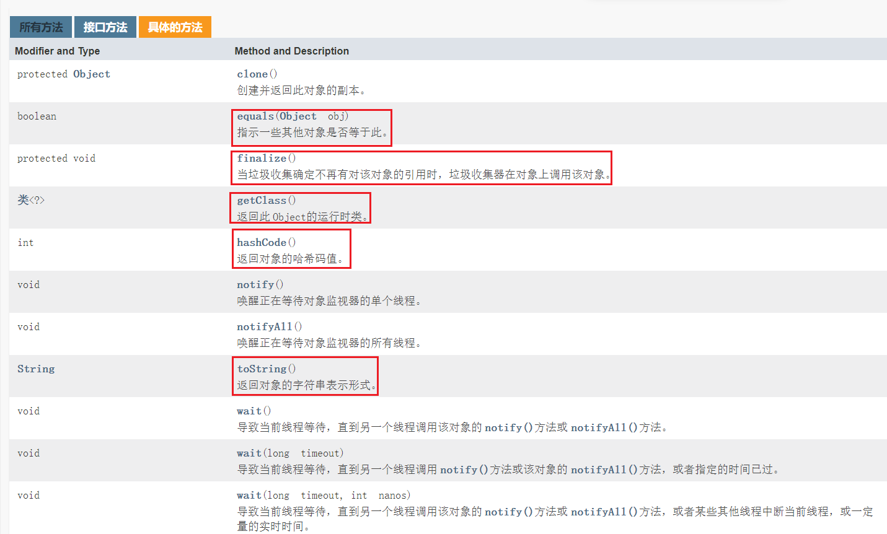
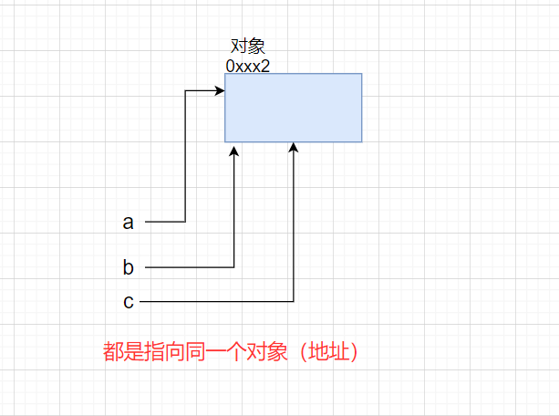
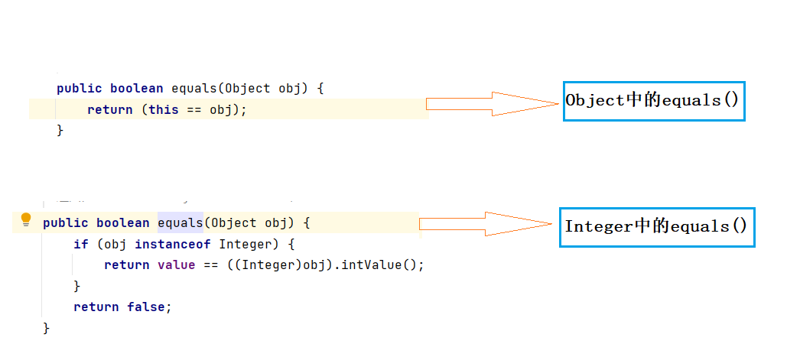
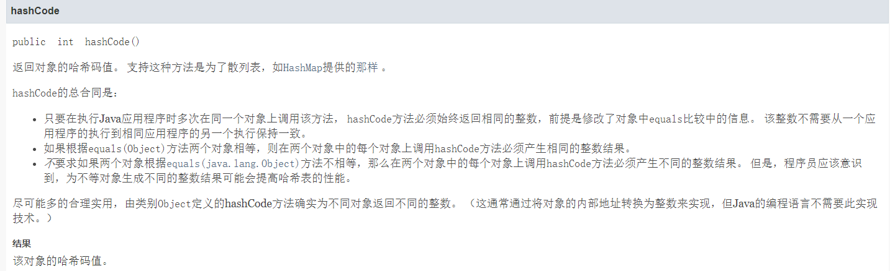
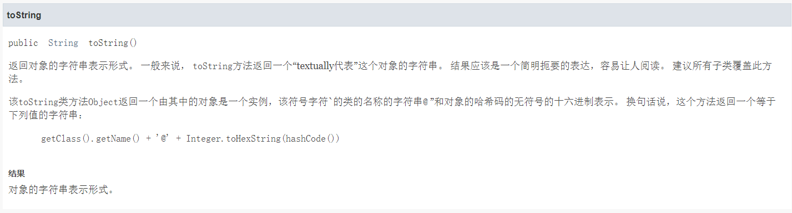
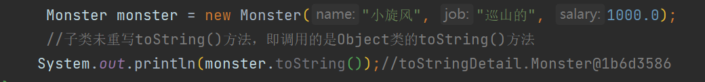
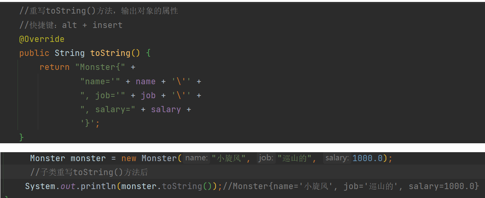
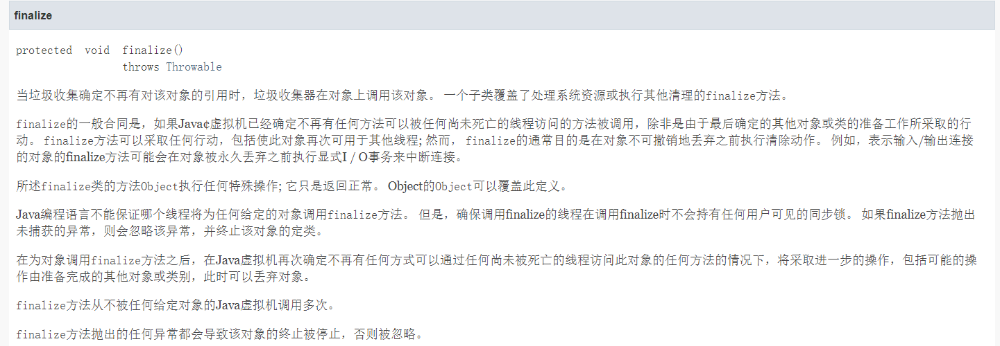

**常用类概述：**

1. 内部类
2. Object类
3. 包装类
4. 数学类
5. 时间类
6. 字符串
7. String Builder和StringBuffer
8. DecimalFormat口：

## 一、Object类

> jdk中文在线文档：[Java 8 中文版 - 在线API中文手册 - 码工具 (matools.com)](https://www.matools.com/api/java8)



### Object类常用方法：

### 1.equals方法

**`==`与`equals`的对比【面试题】+ jdk查看原码**

==是一个比较运算符

1. ==： 既可以判断基本类型，又可以判断引用类型

2. ==： 如果判断的是**基本类型**，**判断的是值是否相等**。

   ```java
           //==： 如果判断的是基本类型，判断的是 值 是否相等
           int x1 = 10;
           int x2 = 10;
           double x3 = 10.0;
           System.out.println(x1 == x2);//true
           System.out.println(x1 == x3);//true
   ```

3. ==： 如果判断的是**引用类型**，**判断的是地址是否相等，即判断是不是同一个对象**

   ```java
   package Equals;
   
   public class Test01 {
       public static void main(String[] args) {
           //==： 如果判断的是引用类型，判断的是地址是否相等，即判断是不是同一个对象
           A a = new A();
           A b = a;
           A c = b;
           System.out.println(a==c);// ? true
           System.out.println(b==c);// true
   
           B obj = a;
           System.out.println(obj==c);// true
   
       }
   }
   
   class B{}
   class A extends B{}
   ```



1. equals方法是Object类中的方法，**只能判断引用类型**。

> idea查看Jdk原码：鼠标光标放在要查看的方法上，直接输入`ctrl + b`
>
> 查看某个类所有方法：`ctrl + F12`

1. 默认判断的是地址是否相等，**子类(Object类是所有类的父类)往往重写该方法，用于判断内容是否相等**。

```java
/*
Object类 equals()方法原码

//默认判断地址是否一样
    public boolean equals(Object obj) {
        return (this == obj);
    }
    
子类往往重写该方法，用于判断内容是否相等  String类中的equals()方法原码（重写了父类equals()方法）
  
    public boolean equals(Object anObject) {
        if (this == anObject) { // 如果是同一个对象(地址相同)
            return true; // 返回true
        }
        if (anObject instanceof String) { // 判断类型
            String anotherString = (String)anObject; // 向下转型
            int n = value.length;
            if (n == anotherString.value.length) { // 如果长度相同
                char v1[] = value;
                char v2[] = anotherString.value;
                int i = 0;
                while (n-- != 0) { // 比较每一个字符
                    if (v1[i] != v2[i])
                        return false;
                    i++;
                }
                return true; // 如果两个字符串每一个字符都相同，则返回true
            }
        }
        return false;
    }

 */
```

再看个例子



【小练习】

写出输出结果：

```java
package Equals;

public class EqualsTest01 {
    public static void main(String[] args) {
        Person p1 = new Person();
        p1.name = "tom";
        Person p2 = new Person();
        p2.name = "tom";

        System.out.println(p1 == p2);// 引用类型——判断是否为同一个对象（地址）
        System.out.println(p1.name.equals(p2.name));// p.name是String类型，重写了equals()方法——判断内容是否一样
        System.out.println(p1.equals(p2));//p1,p2属于Person类，该类并没有重写equals()方法（继承父类equals()方法，即判断地址）

        String s1 = new String("abc");
        String s2 = new String("abc");

        System.out.println(s1.equals(s2));
        System.out.println(s1 == s2);

    }
}

class Person{
    public String name;
}
```

> 输出结果：
>
> false
> true
> false
> true
> false

### 2.hashCode方法



小结：（可以当作地址来看但它本质上不是地址）

1. 提高具有哈希结构的容器的效率
2. 两个引用，如果指向的是同一个对象，则哈希值肯定一样
3. 两个引用，如果指向的是不同对象，则哈希值是不一样的
4. 哈希值主要根据地址号来！不能将哈希值完全等价于地址
5. 在后面的集合中hashCode如果需要的话，也会重写

```java
package hashCode;

public class HashCode {
    public static void main(String[] args) {
        AA aa = new AA();
        AA aa2 = new AA();
        AA aa3 = aa;
        System.out.println("aa.hashCode()="+ aa.hashCode());
        System.out.println("aa2.hashCode()="+ aa2.hashCode());
        System.out.println("aa3.hashCode()="+ aa3.hashCode());
    }
}

class AA{}
```

> aa.hashCode()=460141958
> aa2.hashCode()=1163157884
> aa3.hashCode()=460141958

**ChatGPT 对hashCode()的解释**

1. `hashCode` 的定义

在 Java 中，`hashCode` 是 `Object` 类的一个方法，每个对象都有一个 `hashCode` 值。`hashCode` 的主要用途是用于散列表（如 `HashMap`、`HashSet`）中，作为键值对存储和检索的一个快速索引。

2. `hashCode` 和内存地址的关系

- **原理**：默认情况下，`Object` 类的 `hashCode` 方法返回一个与对象的内存地址相关的整数值。这意味着不同对象的默认 `hashCode` 通常是不同的，但这并不意味着它是对象的实际内存地址。
- **实现**：在大多数 JVM 实现中，默认的 `hashCode` 是根据对象在内存中的地址计算出来的一个值，但这个计算过程是内部实现的，并不直接暴露内存地址。

3. 为什么 `hashCode` 不能直接看作内存地址

- **抽象层次**：`hashCode` 是一个抽象的标识符，用于提高散列表操作的效率，而内存地址是底层的物理实现细节。在 JVM 层面，抽象和具体实现之间是有隔离的。
- **内存管理**：JVM 内存管理机制（如垃圾回收）可能会移动对象的位置，使得对象的内存地址发生变化，但 `hashCode` 通常不会改变（除非被显式重写）。
- **重写 `hashCode`**：在实际应用中，许多类会重写 `hashCode` 方法以提供自定义的哈希值计算方式，与内存地址无关。例如，`String` 类根据字符串的字符内容计算哈希值。

  4. 实际应用中的 `hashCode`

- **散列结构**：在 `HashMap` 或 `HashSet` 中，`hashCode` 用于确定对象存储的桶（bucket），从而加速查找和插入操作。
- **快速比较**：通过 `hashCode` 值快速比较对象是否相等，减少不必要的 `equals` 方法调用。

### 3.toString方法



基本介绍：

默认返回：全类名 + @ + 哈希值的十六进制

```
/*
    Object toString()原码
    //(1)getClass().getName() 类的全类名（包名+类名）
    //(2)Integer.toHexString(hashCode()) 将hashCode的值转成16进制字符串
    public String toString() {
        return getClass().getName() + "@" + Integer.toHexString(hashCode());
    }
 */
```



**子类往往重写toString方法，用于返回对象的属性信息（`快捷键：alt + insert`），当然我们也可以自己定制。**



当我们输出一个对象时，toString()方法会被默认调用


### 4.finzlize方法



finzlize方法：当垃圾收集确定不再有对该对象的引用时，垃圾收集器在对象上调用该对象。

1. 当对象被回收时，系统自动调用该对象的finzlize方法。子类可以重写该方法，做一些释放资源的操作
2. 什么时候被回收：当某个对象没有任何引用时，则jvm就认为这个对象是一个垃圾对象，就会时候垃圾回收机制来销毁该对象，在销毁该对象前，会先调用finzlize方法。


1. 垃圾回收机制的调用，是由系统来决定（即有自己的GC算法），也可以通过System.gc()主动触发垃圾回收机制。

> 注：在实际开发中，几乎不会用finzlize方法，更多的是为了应付面试

## 二、random类

> 前言：Random类中实现的随机算法是伪随机，也就是有规则的随机。在进行随机时，随机算法的起源数字称为种子数(seed)，在种子数的基础上进行一定的变换，从而产生需要的随机数字。相同种子数的Random对象，相同次数生成的随机数字是完全相同的。也就是说，两个种子数相同的Random对象，第一次生成的随机数字完全相同，第二次生成的随机数字也完全相同，这点在生成多个随机数字时需要特别注意。下面分三部分来讲解一下Random类的使用，以及如何生成指定区间的随机数组以及实现程序中要求的几率。

### 一、Random类两个构造方法：

1、public Random()：该构造方法使用一个和当前系统时间对应的相对时间有关的数字作为种子数，然后使用这个种子数构造Random对象。

2、public Random(long seed)：该构造方法可以通过制定一个种子数进行创建。

示例代码：

```java
Random r = new Random();
Random r1 = new Random(10);
```


再次强调：种子数只是随机算法的起源数字，和生成的随机数字的区间无关。

### 二、Random类中的常用5种方法：

Random类中各方法生成的随机数字都是均匀分布的，也就是说区间内部的数字生成的几率是均等的。

```java
1、public boolean nextBoolean()：
```

该方法的作用是生成一个随机的boolean值，生成true和false的值几率相等，也就是都是50%的几率。

```java
2、public double nextDouble()：
```

该方法的作用是生成一个随机的double值，数值介于[0,1.0)之间。

```java
3、public int nextInt()：
```

该方法的作用是生成一个随机的int值，该值介于int的区间，也就是-231到231-1之间。

如果需要生成指定区间的int值，则需要进行一定的数学变换，具体可以参看下面的使用示例中的代码。

```java
4、public int nextInt(int n)：
```

该方法的作用是生成一个随机的int值，该值介于[0,n)的区间，也就是0到n之间的随机int值，

包含0而不包含n。如果想生成指定区间的int值，也需要进行一定的数学变换，具体可以参看下面的使用示例中的代码。

```java
5、public void setSeed(long seed)：
```

该方法的作用是重新设置Random对象中的种子数。

设置完种子数以后的Random对象和相同种子数使用new关键字创建出的Random对象相同。

### 三、常见使用示例（重点）：

首先，初始化一个对象：``` Random r = new Random();```

#### 1、生成[0,1.0)区间的小数：

```java
double d1 = r.nextDouble();
```

#### 2、生成[0,5.0)区间的小数：将该区间扩大5倍即是要求的区间。

```java
double d1 = r.nextDouble() * 5;
```

#### 3、生成[1,2.5)区间的小数：只需要首先生成[0,1.5)区间的随机数字，然后将生成的随机数区间加1即可。

```java
double d3 = r.nextDouble() * 1.5 + 1;
```

#### 4、生成任意整数：直接使用nextInt方法即可。

```java
int n1 = r.nextInt();
```

#### 5、生成[0,10)区间的整数：

```java
int n2 = r.nextInt(10);

n2 = Math.abs(r.nextInt() % 10);
```

#### 6、生成[-3,15)区间的整数：

```java
int n4 = r.nextInt(18) - 3;
```

#### 7、几率实现：

在前面的方法介绍中，nextInt(int n)方法中生成的数字是均匀的，也就是说该区间内部的每个数字生成的几率是相同的。
比如生成一个[0,100)区间的随机整数，则每个数字生成的几率应该是相同的，而且由于该区间中总计有100个整数，
所以每个数字的几率都是1%。按照这个理论，可以实现程序中的几率问题。

题目：如何写出随机生成一个整数，该整数以55%的几率生成1，以40%的几率生成2，以5%的几率生成3，Java代码？

```java
int n5 = r.nextInt(100);
int m; //结果数字
if(n5 < 55){ //55个数字的区间，55%的几率
    m = 1;
}else if(n5 < 95){//[55,95)，40个数字的区间，40%的几率
    m = 2;
}else{
    m = 3;
}
```

分析：因为每个数字的几率都是1%，则任意55个数字的区间的几率就是55%，为了代码方便书写，这里使用[0,55)区间的所有整数。原理都一样。
当然，这里的代码可以简化，因为几率都是5%的倍数，所以只要以5%为基础来控制几率即可，下面是简化的代码实现：

```java
int n6 = r.nextInt(20);
int m1;
if(n6 < 11){
    m1 = 1;
}else if(n6 < 19){
    m1 = 2;
}else{
    m1 = 3;
}
```


### 四、常见问题：

#### 1、相同种子数Random对象问题：

测试代码：

```java
import java.io.*;
import java.util.Random;
class test  
{
	public static void main (String[] args) throws java.lang.Exception
	{
         Random r1 = new Random(10);
         Random r2 = new Random(10);
         for(int i = 0;i < 2;i++){
             System.out.println(r1.nextInt());
             System.out.println(r2.nextInt());
         }
	}
}
```

输出结果：完全相同！

> -1157793070
> -115779307
> 1913984760
> 1913984760

分析：在该代码中，对象r1和r2使用的种子数都是10，则这两个对象相同次数生成的随机数是完全相同的。

如果想避免出现随机数字相同的情况，则需要注意，无论项目中需要生成多少个随机数字，都只使用一个Random对象即可。


#### 2、关于Math类中的random方法：（代码习惯）


其实在Math类中也有一个random方法，该random方法的工作是生成一个[0,1.0)区间的随机小数。

通过阅读Math类的源代码可以发现，Math类中的random方法就是直接调用Random类中的nextDouble方法实现的。

只是random方法的调用比较简单，所以很多程序员都习惯使用Math类的random方法来生成随机数字。

## 三、包装类

### **1.基本数据类型以及对应的包装类：**

byte -> Byte

short -> Short

int -> Integer

long -> Long

float -> Float

double -> Double

char -> Character

boolean -> Boolean

这些类都在java.lang包

### **2.包装类的意义：**

1. 让基本数据类型有面向对象的特征
2. **封装了字符串转化成基本数据类型的方法（重点）**

### 3.包装类常用方法：

1. Integer.parseInt()
2. Long.paseLong()
3. Double.parseDouble()

【参考代码】

```java
public class Test {
    public static void main(String[] args) {
        
//        Integer i = new Integer(10);// 创建包装类对象
//        Integer ii = 10; // 自动打包
//        System.out.println(i+10); // 在使用上，int 和Integer 其实没有区别，可以互相使用
//        System.out.println(ii+10);
//        int j = ii;// 自动解包
//        System.out.println(j+100);

        String a = "12";
        String b = "34";
        System.out.println(a+b); // 1234
    // 转型:
        // 字符串转成int的唯一方案
        int c = Integer.parseInt(a);
        int d = Integer.parseInt(b);
        System.out.println(c+d); // 46
        
        // 字符串转成double类型
        String e = "1.25";
        double f = Double.parseDouble(e);
        System.out.println(f*6); // 7.5

        // 转成long类型
        long l = Long.parseLong("1234567");
        System.out.println(l);
    }
}
```

## 四、数学类

> 数学类的方法都是静态方法，可以直接引用——Math.方法();

**常用数学类方法：**

1. abs()：获取绝对值
2. max()：求最大值
3. min()：求最小值
4. pow()：求次幂
5. round()：四舍五入
6. sqrt()：求平方根

## 五、时间类

### Java常用时间类：

1. Date 日期类
2. Calendar 日历类
3. SimpleDateFormat 格式化时间类

> Date和Calendar类 在java.util包中
>
> SimpleDateFormat类 在java.text包

### 1.Date 日期

【1】new Date() 可以获取到系统时间

【2】getTime() 能获取到时间的long形式，可以用来计算时间差

> getTime()——获取计算机底层存储的数字，返回一个数字用来表示时间，这个数字的类型long，单位为毫秒。

【参考代码】

```java
import java.util.Date;

public class Test {
    public static void main(String[] args) {
        Date d = new Date();
        System.out.println(d); // 系统时间
        //get...()——获取年月日.....
        //除了getTime()方法，Date类中的getXXX方法都已被弃用，推荐使用SimpleDateFormat类中的parse()方法来获取年月日
        System.out.println(d.getYear()+1900); // 从1900年开始算的
        System.out.println(d.getMonth()+1); // 月份从0开始计算
        System.out.println(d.getDate()); // 天数
        System.out.println(d.getHours());// 小时

        //getTime()——获取到时间的毫秒形式 返回的是long
        System.out.println(d.getTime());
    }
}
```

### 2.Calendar 日历

【1】get() 获取到时间的某一部分

【2】set() 设置时间 - -> 计算时间：系统已经帮我们设置好了，不用担心二月有多少天等问题，计算时间十分方便

> 注：Calendar 日历类是抽象类，因此不可以去new对象。虽然抽象类不能创建对象，但是jdk官方提供了一个实例对象的操作：
>
> Calendar rightNow = Calendar.getInstance();
>
> 我们通过这条代码就是直接造了一个Calender的对象

【参考代码】：get() 获取到时间的某一部分：

```java
package date;

import java.util.Calendar;

public class TestCalendar {
    public static void main(String[] args) {
        Calendar cal = Calendar.getInstance();
//        System.out.println(cal);
        
        /*
 假设当天：
        2021
        8
        10
         */
	    // 获取Calendar创建的对象里的所有内容
        System.out.println(cal.get(Calendar.YEAR)); // 2021 年
        System.out.println(cal.get(Calendar.MONTH)+1); // 月份：从0开始的  结果：为10月
        System.out.println(cal.get(Calendar.DATE)); // 日
        System.out.println(cal.get(Calendar.HOUR_OF_DAY));// 小时
        System.out.println(cal.get(Calendar.MINUTE));
        System.out.println(cal.get(Calendar.SECOND));
    }
}
```

【参考代码】：set() 设置时间 - -> 计算时间：

> 注：cal.setTime(d); 把Date转化成Calendar

```java
package date;

import java.util.Calendar;
import java.util.Date;

public class TestCalendar {
    public static void main(String[] args) {

        Date d = new Date();

        Calendar cal = Calendar.getInstance();

        cal.setTime(d);// 把Date转化成Calendar

        System.out.println(cal);
        System.out.println(cal.get(Calendar.YEAR)); //  年
        System.out.println(cal.get(Calendar.MONTH)+1); // 月份：从0开始的
        System.out.println(cal.get(Calendar.DATE)); // 日
        
    }
}
```

### 3.SimpleDateFormat格式化时间

Date，Calendar通过引用也可以进行时间的格式化，但比较繁琐，而SimpleDateFormat类是专门帮我们格式化时间的工具类，它在java.text包中。

【时间格式】：yyyy-MM-dd HH:mm:ss

SimpleDateFormat类有两大常用方法：

【1】format(Date)：

> format(Date) 帮我们把时间转成字符串，字符串的格式为SimpleDateFormat类定义对象时设置的时间格式

【参考代码】

```java
package Simple;

import java.text.SimpleDateFormat;
import java.util.Date;
import java.util.logging.SimpleFormatter;

public class Test {
    public static void main(String[] args) {
        Date d = new Date();
        System.out.println(d); //Thu Aug 12 08:40:08 CST 2021  不美观

        // MM指的是月份，mm指的是分钟
        // HH是24小时制的小时，hh是12小时制的小时	
	    // 设置格式化时间的模式，我们常用yyyy-MM-dd HH:mm:ss这个模式
        SimpleDateFormat sdf = new SimpleDateFormat("yyyy-MM-dd HH:mm:ss");// 时间格式
        String s = sdf.format(d); // 格式化时间
        System.out.println(s); // 2021-08-12 08:45:09
        
        //一步到位的打印时间的写法
         // System.out.println(new SimpleDateFormat("HH:mm:ss").format(new Date()));
    }
}
```

【2】parse(String)：

> parse(String) 帮我们把字符串转化成时间

【参考代码】

```java
package Simple;

import java.text.ParseException;
import java.text.SimpleDateFormat;
import java.util.Date;
import java.util.Scanner;

public class Test2 {
    public static void main(String[] args) throws ParseException {
        Scanner sc = new Scanner(System.in);

        System.out.println("请输入一个时间(yyyy-MM-dd HH:mm:ss)：");

        String s = sc.nextLine();

        SimpleDateFormat sdf = new SimpleDateFormat("yyyy-MM-dd HH:mm:ss");

       Date d =  sdf.parse(s); // 把字符串转成时间

        System.out.println(d);
        
        /*
        请输入一个时间(yyyy-MM-dd HH:mm:ss)：
        2021-08-12 12:25:21
        Thu Aug 12 12:25:21 CST 2021
         */
    }
}
```

> 注：由于用户输入的字符串不一定是我们要求的格式，可能是任何东西，想把它们转成时间是不可能的，你不可能把一个人转成时间 对吧，因此存在着很大的风险未处理(异常: java.text.ParseException)，为此我们需要处理异常。

### 4.计算时间差

计算思路：

1. 格式化时间
2. 先将字符串转化成long类型时间
3. 计算毫秒级别时间差，取绝对值
4. 毫秒级别时间差转成秒级别
5. 秒级别时间差转成分钟级别
6. 分钟级别时间差转化显示成xx小时xx分钟

【参考代码】

```java
package Simple;

import java.text.ParseException;
import java.text.SimpleDateFormat;
import java.util.Date;

public class TestDiff {
    public static void main(String[] args) throws ParseException {

        String s1 = "2021-08-12 12:00:00"; // 开始时间
        String s2 = "2021-08-12 14:35:00"; // 结束时间

        //格式化时间
        SimpleDateFormat sdf = new SimpleDateFormat("YYYY-MM-dd HH:mm:ss");

        //将字符串转成时间形式
        Date d1 = sdf.parse(s1);
        Date d2 = sdf.parse(s2);

        //计算时间差:先要获取时间毫秒形式（long类型） 再做差
        long long1 = d1.getTime();
        long long2 = d2.getTime();
        long diffTime = Math.abs(long1 - long2);

        // 秒级别时间差
        long diffSec = diffTime / 1000;

        // 分级别时间差
        long diffMin = diffSec / 60;

        //显示 xx小时xx分钟
        long displayHours = diffMin / 60; // 小时
        long displayMin = diffMin % 60; //分钟

        System.out.println("您学习的时长为："+displayHours+"小时"+displayMin+"分钟");

    }
}
```

## 六、String类

### 字符串类常用方法

**方法汇总：**

| 修饰符和返回值的类型 |       方法名       | 解释                                              |
| :------------------: | :----------------: | :------------------------------------------------ |
|         char         |      charAt()      | 获取某个位置的字符                                |
|        String        |      concat()      | 字符串的拼接。一般字符串拼接直接相加就好了        |
|       boolean        |     contains()     | 判断原字符串是否含有xxx字符串，常用于子串的判断   |
|       boolean        |     endsWith()     | 判断原字符串是否以xxx字符串结尾                   |
|       boolean        |    startsWith()    | 判断原字符串是否以xxx字符串开头                   |
|       boolean        |      equals()      | 判断两边字符串内容是否相同；==判断地址是否相同    |
|       boolean        | equalsIgnoreCase() | 忽略大小写判断两边字符串的内容是否一样            |
|         int          |     indexOf()      | 计算给出字符串第一个出现的位置                    |
|         int          |   LastindexOf()    | 计算给出字符串最后一个出现的位置                  |
|         int          |      length()      | 计算字符串的长度                                  |
|        String        |     replace()      | 字符串内容的替换                                  |
|       String[]       |      split()       | 字符串切割，最终结果是一个字符串数组              |
|        String        |    substring()     | 字符串截取，左闭右开：[ )                         |
|        String        |       trim()       | 去掉字符串左右两边的空格，中间的不行              |
|    static String     |     valueOf()      | 官方：基本数据类型转为字符串操作；直接：变量 + "" |

> **注：字符串是一个不可变的类型（final类），几乎所有的字符串操作都会返回一个新字符串而不是在原有基础上进行修改。**

【示例代码】

```c++
public class Test {
    public static void main(String[] args) {
        String s = "我的名字叫李华";
        
        s.concat("hhh"); // 在字符串s上拼接，拼接hhh
        System.out.println(s);// 我的名字叫李华
        //字符串是不可变的数据类型
        //几乎所有的字符串操作都会返回一个新字符串
        String s1 = s.concat("hhh"); // 在字符串s上拼接，拼接hhh
        System.out.println(s1);//我的名字叫李华hhh
        
        
        String str1 = "李华喜欢看罗老师的视频";
        str1.replace("李华","张三");
        System.out.println(str3); //李华喜欢看罗老师的视频  并没有替换 字符串是不变的str1还是str1

        String str2 = str1.replace("李华","张三");//几乎所有的字符串操作都会返回一个新字符串 新串要用新变量接
        System.out.println(str2);//张三喜欢看罗老师的视频
         
   }
}
package String;

import java.util.Scanner;

public class Test {
    public static void main(String[] args) {
        String s = "我的名字叫李华";
        System.out.println(s.charAt(0)); // 获取第0个位置的字符

        s.concat("hhh");
        System.out.println(s);// 我的名字叫李华
        //字符串是不可变的数据类型
        //几乎所有的字符串操作都会返回一个新字符串
        String s1 = s.concat("hhh"); // 在字符串s上拼接，拼接hhh
        System.out.println(s1);//我的名字叫李华hhh

        System.out.println(s.contains("李华")); //true
        System.out.println(s.contains("牛津")); //false

        System.out.println("邀请李华来参加英语沙龙活动".endsWith("活动"));//true 判断是否以xxx为结尾
        System.out.println("邀请李华来参加英语沙龙活动".startsWith("李华"));//false 判断是否以xxx开头

        // equals字符串内容是否相同

        // 接受邀请参加活动的李华到现场后要输入验证码
//        String yanZhengMa = "AAkm";
//
//        Scanner sc = new Scanner(System.in);
//
//        System.out.println("请输入验证码("+yanZhengMa+")");
//
//        String userInput = sc.nextLine();
//
//        if(yanZhengMa.equalsIgnoreCase("aakm")){  // 忽略大小写判断两边的内容是否一样
//            System.out.println("欢迎参加英语沙龙活动！");
//        }else{
//            System.out.println("您未受到邀请，请现场报名！");
//        }

//        String str = "李华玩得很开心！";
//        System.out.println(str.indexOf("开心"));// 5 计算给出字符串第一个出现的位置

        String str2 = "李华成绩很好";
        System.out.println(str2.length()); // 6 计算字符串的长度

        String str3 = "李华喜欢看罗老师的视频";
        str3.replace("李华","张三");
        System.out.println(str3); //李华喜欢看罗老师的视频  并没有替换 字符串是不变的str3还是str3

        String str4 = str3.replace("李华","张三");//几乎所有的字符串操作都会返回一个新字符串 新串要用新变量接
        System.out.println(str4);//张三喜欢看罗老师的视频

        String str5 = "哈哈_呵呵_嘻嘻_噢no";
        String[] ss = str5.split("_");//切割
        System.out.println(ss[0]);//哈哈
        System.out.println(ss[1]);//哈哈
        System.out.println(ss[2]);//嘻嘻
        System.out.println(ss[3]);//噢no

        String str6 = "今天天气不错";
        System.out.println(str6.substring(2,4));//天气 字符串截取 [ ) 左闭右开，右边取不到

        String str7 ="     哈    哈      ";
        System.out.println(str7.trim());// 去掉左右两边的空格

        int i = 10;
        System.out.println(String.valueOf(i)); // 基本数据类型转为字符串
        System.out.println(i+""); // 野路子
    }
}
```

## 七、String Builder和StringBuffer

**String类的缺点：**

String 是一个不可变的数据类型，每次拼接都会产生一个新的字符串，那么内存迟早会被这些拼接的字符串塞满。

**String类和StringBuilder和StringBuffer类的区别：**

StringBuilder和StringBuffer：**可变的字符串，不产生新对象，比较省内存**，当进行大量的字符串拼接时建议使用StringBuffer和StringBuilder，但它们两个一些方法的实现几乎跟String一样。

**StringBuffer和StringBuilder类：**

【相似点】

两者用法一模一样，可以认为是一个类

【区别】

1. StringBuffer线程安全，StringBuilder非线程安全。
2. StringBuilder相比于StringBuffer有速度优势，**多数情况下建议使用StringBuilder类，但当被要求线程安全时必须使用StringBuffer类**

> 字符串拼接方法：append()方法
>
> StringBuffer和StringBuilder 转成String类 ：
>
> ```c++
> StringBuilder sb = new StringBuilder("猫喜欢吃鱼");
> String s = sb.toString();		
> ```

【参考代码】

```java
package String;

public class TestStringBuilder {
    public static void main(String[] args) {
        StringBuilder sb = new StringBuilder();// 一个空的字符串""

        StringBuilder sb2 = new StringBuilder("猫喜欢吃鱼");
        System.out.println(sb2);// 猫喜欢吃鱼

        sb2.append("，狗也喜欢吃鱼");
        System.out.println(sb2);// 追加  猫喜欢吃鱼，狗也喜欢吃鱼

        sb2.insert(1,"哈哈哈");
        System.out.println(sb2); //猫哈哈哈喜欢吃鱼，狗也喜欢吃鱼

        // 上述的操作huan'c

        // 把StringBuilder转化成String
        String s = sb2.toString();
        System.out.println(s); //猫哈哈哈喜欢吃鱼，狗也喜欢吃鱼

        // 上述操作都可以将StringBuilder换成StringBuffer，结果一样

    }
}
```

## 七-拓展、StringJoiner

要高效拼接字符串，应该使用`StringBuilder`。

很多时候，我们拼接的字符串像这样：

```java
// 输出: Hello Bob, Alice, Grace!
public class Main {
    public static void main(String[] args) {
        String[] names = {"Bob", "Alice", "Grace"};
        var sb = new StringBuilder();
        sb.append("Hello ");
        for (String name : names) {
            sb.append(name).append(", ");
        }
        // 注意去掉最后的", ":
        sb.delete(sb.length() - 2, sb.length());
        sb.append("!");
        System.out.println(sb.toString());
    }
}
```

### StringJoiner()

类似用分隔符拼接数组的需求很常见，所以Java标准库还提供了一个`StringJoiner`来干这个事：

```java
import java.util.StringJoiner;
public class Main {
    public static void main(String[] args) {
        String[] names = {"Bob", "Alice", "Grace"};
        var sj = new StringJoiner(", ");
        for (String name : names) {
            sj.add(name);
        }
        System.out.println(sj.toString());
    }
}
```

慢着！用`StringJoiner`的结果少了前面的`"Hello "`和结尾的`"!"`！遇到这种情况，需要给`StringJoiner`指定“开头”和“结尾”：

```java
import java.util.StringJoiner;
public class Main {
    public static void main(String[] args) {
        String[] names = {"Bob", "Alice", "Grace"};
        var sj = new StringJoiner(", ", "Hello ", "!");
        for (String name : names) {
            sj.add(name);
        }
        System.out.println(sj.toString());
    }
}
```

### String.join()

`String`还提供了一个静态方法`join()`，这个方法在内部使用了`StringJoiner`来拼接字符串，在不需要指定“开头”和“结尾”的时候，用`String.join()`更方便：

```java
String[] names = {"Bob", "Alice", "Grace"};
var s = String.join(", ", names);
```

### 小结

用指定分隔符拼接字符串数组时，使用`StringJoiner`或者`String.join()`更方便；

用`StringJoiner`拼接字符串时，还可以额外附加一个“开头”和“结尾”。

## 八、DecimalFormat

DecimalFormat：对小数进行格式化，保留几位小数。与格式化时间联想记。

> . 表示小数点
>
> 0和# 表示数位，保留几位就几个0或者#

【参考代码】

```java
import java.text.DecimalFormat;
import java.util.Scanner;

public class Test {
    public static void main(String[] args) {
        double d= 10/3.0;
        System.out.println(d);//3.3333333333333335
        
        // . 表示小数点
        // 0和#表示数字

        // 保留两位小数                        格式
        DecimalFormat df = new DecimalFormat(".00"); // 或者.##
        String s = df.format(d); // 把 d 转成上面设置的格式
        System.out.println(s);//3.33

   }
}
```

# 