###  1.线程 进程 多线程

多线程：多条执行路径，**主线程与子线程并行交替执行**（普通方法只有主线程一条路径）。

程序：指令和数据的有序集合，本身没有任何运行的含义，是一个静态的概念。

进程：**在操作系统中运行的程序**就是进程，即执行程序的一次执行过程，是一个动态的概念。

**一个进程可以有多个线程**，比如视频中同时听声音，看图像，看弹幕等。

**线程是CPU调度和执行的基本单位。**

```
注意：
 很多多线程是模拟出来的，真正的多线程是指有多个cpu，即多核，如服务器。如果是模拟出来的多线程，即在一个cpu的情况下，在同一个时间点，
cpu只能执行一个代码，因为切换的很快，所以就有同时执行的错觉。
```

#### 核心概念

- 线程就是独立的执行路径
- 在程序运行时,即使自己没有创建线程,后台也会有多个线程,比如主线程,GC线程(Java程序默认有两个线程，main线程和GC线程)
- main()称之为主线程,为系统的入口,用于执行整个程序
- 在一个进程中,如果开辟了多个线程,**线程的运行是由调度器（cpu）安排调度的**,调度器是与操作系统紧密相关的,先后顺序是不能人为干预的
- 对同一份资源操作时 会**存在资源抢夺的问题,需要加入并发控制**
- 线程会带来额外的开销,如CPU调度时间,并发控制开销
- 每个线程在自己的工作内存交互,内存控制不当会造成数据不一致

### 2.线程创建

三种方式：

1. 继承Thread类（重点）
2. 实现Runnable接口（重点）
3. 实现Callable接口（了解）

#### 方法1：Thread类

1. 自定义线程类 继承`Thread`类
2. 重写`run()`方法，编写线程执行体
3. 创建线程对象，调用`start()`方法启动线程

```java
package com.mine.demo01;
//线程不一定立即执行，由CPU安排调度
public class TestThread1 extends Thread{
    @Override
    public void run() {
        //run方法线程体
        for (int i = 0; i < 20; i++) {
            System.out.println("run方法线程--"+i);
        }
    }

    public static void main(String[] args) {
        //创建一个线程对象
        TestThread1 thread1 = new TestThread1();
        //start()开启线程
        thread1.start();

        //main主线程
        for (int i = 0; i < 1000; i++) {
            System.out.println("主线程--"+i);
        }
    }
//运行结果并发执行,穿插打印
}
```

##### 例子：下载图片

```java
package com.mine.demo01;

import org.apache.commons.io.FileUtils;

import java.io.File;
import java.io.IOException;
import java.net.URL;

/*
练习Thread，实现多线程同步下载图片
 */
public class TestThread2 extends Thread{

    private String url; //网络图片地址
    private String name; //保存的文件名

    public TestThread2(String url,String name){
        this.url=url;
        this.name=name;
    }

    @Override
    public void run() {
        WebDownloader webDownloader = new WebDownloader();
        webDownloader.downloader(url,name);
        System.out.println("下载了文件名为："+name);
    }

    public static void main(String[] args) {
        TestThread2 thread1 = new TestThread2("https://img-blog.csdnimg.cn/20210427081055529.png?x-oss-process=image/watermark,type_ZmFuZ3poZW5naGVpdGk,shadow_10," + "text_aHR0cHM6Ly9ibG9nLmNzZG4ubmV0L2ZsbG93X3dpbmQ=,size_16,color_FFFFFF,t_70","1.jpg");
        TestThread2 thread2 = new TestThread2("https://img-blog.csdnimg.cn/20210427081055529.png?x-oss-process=image/watermark,type_ZmFuZ3poZW5naGVpdGk,shadow_10," +    "text_aHR0cHM6Ly9ibG9nLmNzZG4ubmV0L2ZsbG93X3dpbmQ=,size_16,color_FFFFFF,t_70","2.jpg");
        TestThread2 thread3 = new TestThread2("https://img-blog.csdnimg.cn/20210427081055529.png?x-oss-process=image/watermark,type_ZmFuZ3poZW5naGVpdGk,shadow_10," +                "text_aHR0cHM6Ly9ibG9nLmNzZG4ubmV0L2ZsbG93X3dpbmQ=,size_16,color_FFFFFF,t_70","3.jpg");

        thread1.start();
        thread2.start();
        thread3.start();
        /*
        结果并没有按顺序执行，且每次运行结果不一样
         */
    }
}

//下载器
class WebDownloader{
    //下载方法
    public void downloader(String url,String name){
        try {
            FileUtils.copyURLToFile(new URL(url),new File(name));
        } catch (IOException e) {
            e.printStackTrace();
            System.out.println("io异常，downloader方法出现问题");
        }
    }
}
```

#### 方法2：Runnable接口

1. 自定义线程类实现`Runnable`接口
2. 实现`run()`方法,编写线程执行体
3. 创建线程对象,调用`start()`方法启动对象

**推荐使用Runnable对象,因为Java单继承的局限性**

```java
package com.mine.demo01;
/*
方式2：implements Runnable 与继承Thread很像
 */
public class TestThread3 implements Runnable{
    @Override
    public void run() {
        //run方法线程体
        for (int i = 0; i < 20; i++) {
            System.out.println("run方法线程--"+i);
        }
    }

    public static void main(String[] args) {
        //创建一个线程对象
        TestThread3 thread3 = new TestThread3();

        //开启线程对象来start()开启线程，代理
        new Thread(thread3).start();  //与方法1的区别

        //main主线程
        for (int i = 0; i < 1000; i++) {
            System.out.println("主线程--"+i);
        }
    }
}
```

##### 例子：买火车票

```java
package com.mine.demo01;
/*例子：买火车票 */
public class TestThread4 implements Runnable{
    //票数
    private int ticketNums = 10;

    @Override
    public void run() {
        while (true){
            if(ticketNums<=0) break;

            try { //模拟延时
                Thread.sleep(200);
            } catch (InterruptedException e) {
                e.printStackTrace();
            }

            System.out.println(Thread.currentThread().getName()+"拿到了第"+ticketNums--+"张票");
        }
    }
    public static void main(String[] args) {
        TestThread4 ticket = new TestThread4();
        new Thread(ticket,"小明").start();
        new Thread(ticket,"老师").start();
        new Thread(ticket,"黄牛党").start();
    }
    //问题：多个线程操作同一个资源的情况下，线程不安全，数据紊乱
}
```

例子2：龟兔赛跑

```java
package com.mine.demo01;
//龟兔赛跑
public class Race implements Runnable{
    //胜利者
    private static String winner;

    @Override
    public void run() {
        for (int i = 1; i <= 100; i++) {

            boolean flag=gameOver(i);//判断比赛是否结束
            if(flag) break;

            System.out.println(Thread.currentThread().getName()+"-->跑了"+i+"步");

            //模拟兔子休息
            if(Thread.currentThread().getName().equals("兔子")&& i%10==0){
                try {
                    Thread.sleep(100);
                } catch (InterruptedException e) {
                    e.printStackTrace();
                }
            }
        }
    }

    //判断是否完成比赛
    private boolean gameOver(int steps){
        if(winner!=null){
            return true;
        }{
            if (steps==100){
                winner=Thread.currentThread().getName();
                System.out.println("winner is"+winner);
                return true;
            }
        }
        return false;
    }

    public static void main(String[] args) {
        Race race = new Race();
        new Thread(race,"兔子").start();
        new Thread(race,"乌龟").start();
    }
}
```

#### 方法3：Callable接口 (JUC包下)

实现Callable接口，需要返回值类型

重写call方法，需要抛出异常

创建目标对象

创建执行服务：ExecutorService ser = Executors.newFixedThreadPool(1);

提交执行：Future result1 = ser.submit(11);

获取结果：boolean r1 = result1.get()

关闭服务：ser.shutdownNow();

**改写例子：下载图片**

```java
package com.mine.demo01;

import java.util.concurrent.*;
/**
 * 方式三：实现Callable接口
 * 1.可以返回值
 * 2.可以抛出异常
 */
public class TestCallable implements Callable<Boolean> {

    private String url;//网络图片地址
    private String name;//报错扥文件名

    //有参构造
    public TestCallable(String url, String name) {
        this.url = url;
        this.name = name;
    }

    //下载图片线程的执行体
    public Boolean call() throws Exception {
        WebDownloader webDownloader = new WebDownloader();
        webDownloader.downloader(url, name);
        System.out.println("下载了文件名为:" + name);
        return true;
    }

    public static void main(String[] args) throws ExecutionException, InterruptedException {
        TestCallable c = new TestCallable("https://img-home.csdnimg.cn/images/20201124032511.png", "1.png");
        TestCallable c1 = new TestCallable("https://img-home.csdnimg.cn/images/20201124032511.png", "2.png");
        TestCallable c2 = new TestCallable("https://img-home.csdnimg.cn/images/20201124032511.png", "3.png");
        //创建执行服务
        ExecutorService ser = Executors.newFixedThreadPool(3);
        //提交执行
        Future<Boolean> r = ser.submit(c);
        Future<Boolean> r1 = ser.submit(c1);
        Future<Boolean> r2 = ser.submit(c2);
        //获取结果
        boolean res = r.get();
        boolean res1 = r1.get();
        boolean res2 = r2.get();
        System.out.println(res);
        System.out.println(res1);
        System.out.println(res2);
        //关闭服务
        ser.shutdownNow();
    }
}
//class WebDownloader在前面下载图片已经定义了，这里就不用再次写，直接使用就好
```

#### 静态代理

```java
package com.mine.demo02;
/*
静态代理：
1.真实对象与代理对象要实现同一接口
2.代理对象创建代理真实角色
好处：
1.代理对象可以做很多真实对象做不了的事情，比如布置结婚场景
2.真实对象专注做自己的事情，结婚
 */
public class StaticProxy {
    public static void main(String[] args) {
        /*You you = new You();
        you.HappyMarry();*/ //原本方式，下面交给代理

        //线程类代理，实际调用了Runnable接口中的run方法
        new Thread(()-> System.out.println("我爱你")).start();

        WeddingCompany company = new WeddingCompany(new You());
        company.HappyMarry();
    }
}

interface Marry{
    void HappyMarry();
}

class You implements Marry{ //真实角色
    @Override
    public void HappyMarry() {
        System.out.println("我今天要结婚了！");
    }
}

class WeddingCompany implements Marry{ //代理角色

    private Marry target; //目标：真实对象

    public WeddingCompany(Marry target) {
        this.target = target;
    }

    @Override
    public void HappyMarry() { //实现代理
        before();
        this.target.HappyMarry(); //调用真实对象的方法
        after();
    }

    private void after() {
        System.out.println("善后工作！");
    }
    private void before() {
        System.out.println("婚前布置！");
    }
    
}
```

#### Lambda 表达式——狂神

- λ 希腊字母表中排序第十一位的字母，英语名称为 Lamda
- 避免匿名内部类定义过多
- 其实质属于函数式编程的概念
- 去掉了一堆没有意义的代码,只留下核心逻辑

```java
new Thread (()->System.out.println(“多线程学习。。。。”)).start();
```

**函数式接口的定义:**
任何接口,如果只包含唯一一个抽象方法,那么它就是一个函数式接口.

```java
public interface Runnable{
    public abstract void run();
}
```

对于函数式接口,我们可以通过Lamda表达式来创建该接口的对象.

```java
//1.定义一个函数式接口
interface ILike{
    void like();
}
//6.用lambda简化，-->函数式接口
like = ()->{
System.out.println("i like lambda5");
};
```

**Lamda表达式简化之路：**

```java
package com.mine.demo04;
/* Lambda表达式 只有一行代码的情况下可以究极简化3
* 前提：函数式接口，且只能有一个方法
* */
public class TestLambda2 {
    public static void main(String[] args) {
        ILove love = null;

        //Lambda表达式，原生简化
        love=(int a)->{
            System.out.println("I love you"+a);
        };

        //进阶简化1：去掉参数类型，多个参数也可以去掉，要去掉都去掉
        love=(a)->{
            System.out.println("I love her"+a);
        };

        //进阶简化2：去掉括号，只能支持一个参数
        love = a->{
            System.out.println("I love me"+a);
        };

        //进阶简化3：去掉大括号，只能单行函数体
        love = a-> System.out.println("I love me"+a);

        love.love(2); //测试
    }
}

interface ILove{
    void love(int a);
}
```

#### Lambda 表达式——博客

> 原文地址 ： https://objcoding.com/2019/03/04/lambda/

本节将介绍如何使用Lambda表达式简化匿名内部类的书写，但Lambda表达式并不能取代所有的匿名内部类，只能用来取代**函数接口（Functional Interface）**的简写。先别在乎细节，看几个例子再说。

##### 例子1：无参函数的简写

如果需要新建一个线程，一种常见的写法是这样：

```java
// JDK7 匿名内部类写法
new Thread(new Runnable(){// 接口名
	@Override
	public void run(){// 方法名
		System.out.println("Thread run()");
	}
}).start();
```

上述代码给`Tread`类传递了一个匿名的`Runnable`对象，重载`Runnable`接口的`run()`方法来实现相应逻辑。这是 `JDK7` 以及之前的常见写法。匿名内部类省去了为类起名字的烦恼，但还是不够简化，在Java 8中可以简化为如下形式：

```java
// JDK8 Lambda表达式写法
new Thread(
		() -> System.out.println("Thread run()")// 省略接口名和方法名
).start();
```

上述代码跟匿名内部类的作用是一样的，但比匿名内部类更进一步。这里连**接口名和函数名都一同省掉**了，写起来更加神清气爽。如果函数体有多行，可以用大括号括起来，就像这样：

```java
// JDK8 Lambda表达式代码块写法
new Thread(
        () -> {
            System.out.print("Hello");
            System.out.println(" Hoolee");
        }
).start();
```

##### 例子2：带参函数的简写

如果要给一个字符串列表通过自定义比较器，按照字符串长度进行排序，Java 7的书写形式如下：

```java
// JDK7 匿名内部类写法
List<String> list = Arrays.asList("I", "love", "you", "too");
Collections.sort(list, new Comparator<String>(){// 接口名
    @Override
    public int compare(String s1, String s2){// 方法名
        if(s1 == null)
            return -1;
        if(s2 == null)
            return 1;
        return s1.length()-s2.length();
    }
});
```

上述代码通过内部类重载了`Comparator`接口的`compare()`方法，实现比较逻辑。采用Lambda表达式可简写如下：

```java
// JDK8 Lambda表达式写法
List<String> list = Arrays.asList("I", "love", "you", "too");
Collections.sort(list, (s1, s2) ->{// 省略参数表的类型
    if(s1 == null)
        return -1;
    if(s2 == null)
        return 1;
    return s1.length()-s2.length();
});
```

上述代码跟匿名内部类的作用是一样的。除了省略了接口名和方法名，代码中把参数表的类型也省略了。这得益于`javac`的**类型推断**机制，编译器能够根据上下文信息推断出参数的类型，当然也有推断失败的时候，这时就需要手动指明参数类型了。注意，Java是强类型语言，每个变量和对象都必需有明确的类型。

##### 简写的依据

也许你已经想到了，**能够使用Lambda的依据是必须有相应的函数接口**（函数接口，是指内部只有一个抽象方法的接口）。这一点跟Java是强类型语言吻合，也就是说你并不能在代码的任何地方任性的写Lambda表达式。实际上*Lambda的类型就是对应函数接口的类型*。**Lambda表达式另一个依据是类型推断机制**，在上下文信息足够的情况下，编译器可以推断出参数表的类型，而不需要显式指名。Lambda表达更多合法的书写形式如下：

```java
// Lambda表达式的书写形式
Runnable run = () -> System.out.println("Hello World");// 1
ActionListener listener = event -> System.out.println("button clicked");// 2
Runnable multiLine = () -> {// 3 代码块
    System.out.print("Hello");
    System.out.println(" Hoolee");
};
BinaryOperator<Long> add = (Long x, Long y) -> x + y;// 4
BinaryOperator<Long> addImplicit = (x, y) -> x + y;// 5 类型推断
```

上述代码中，1展示了无参函数的简写；2处展示了有参函数的简写，以及类型推断机制；3是代码块的写法；4和5再次展示了类型推断机制。

##### 自定义函数接口

自定义函数接口很容易，只需要编写一个只有一个抽象方法的接口即可。

```java
// 自定义函数接口
@FunctionalInterface
public interface ConsumerInterface<T>{
	void accept(T t);
}
```

上面代码中的@FunctionalInterface是可选的，但加上该标注编译器会帮你检查接口是否符合函数接口规范。就像加入@Override标注会检查是否重载了函数一样。

有了上述接口定义，就可以写出类似如下的代码：

```java
ConsumerInterface<String> consumer = str -> System.out.println(str);
```

进一步的，还可以这样使用：

```java
class MyStream<T>{
	private List<T> list;
    ...
	public void myForEach(ConsumerInterface<T> consumer){// 1
		for(T t : list){
			consumer.accept(t);
		}
	}
}
MyStream<String> stream = new MyStream<String>();
stream.myForEach(str -> System.out.println(str));// 使用自定义函数接口书写Lambda表达式
```

### 3.线程状态及方法

#### 五大状态

**线程五大状态：**

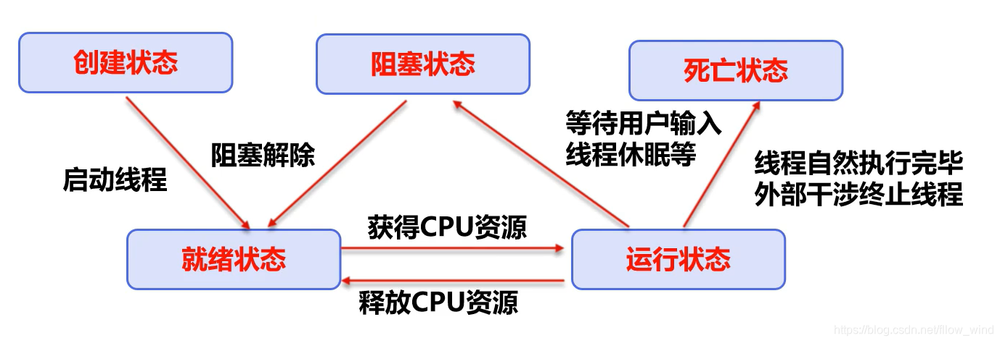
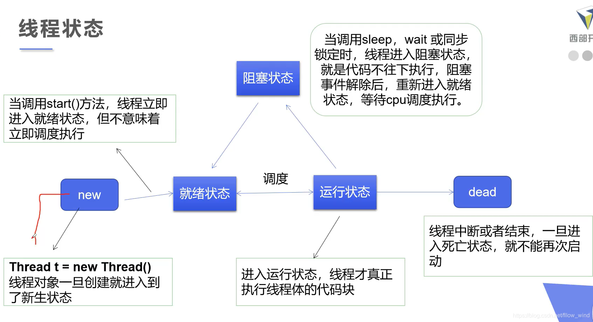

**线程方法：**

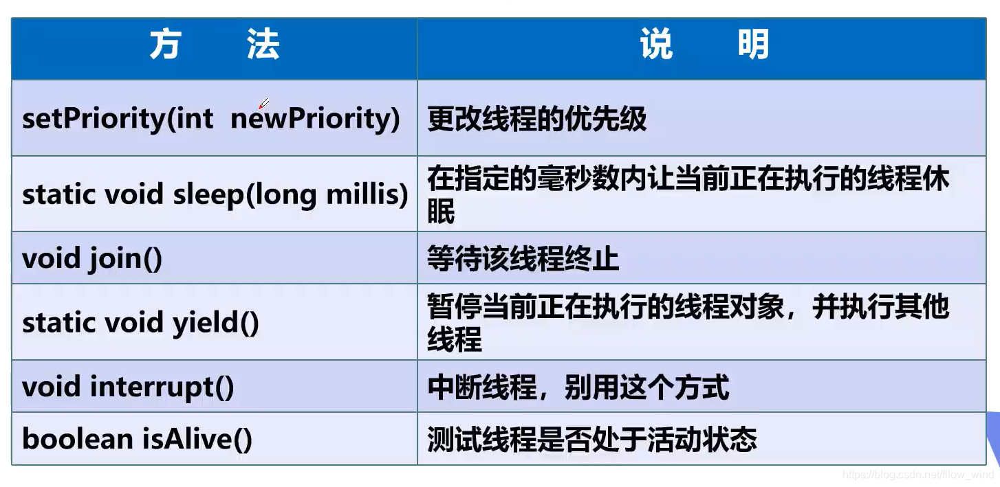

#### 线程停止

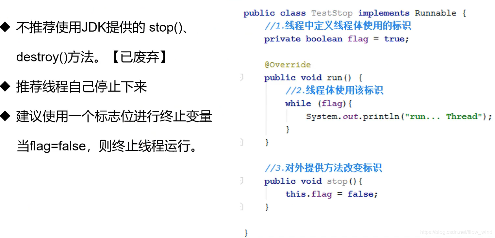

```java
package com.mine.demo05;

    /*    测试stop */
    public class TestStop implements Runnable {    //1.设置一个标识位    
        private boolean flag = true;

        @Override
        public void run() {
            int i = 0;
            while (flag) {
                System.out.println("run..Thread--" + i++);
            }
        }    //2.设置公开的方法，转换标识位，让线程停止    

        public void stop() {
            this.flag = false;
        }

        public static void main(String[] args) {
            TestStop thread = new TestStop();
            new Thread(thread).start();
            for (int i = 0; i < 1000; i++) {
                System.out.println("main--" + i);
                //3.调用方法停止线程            
                if (i == 900) {
                    thread.stop();
                    System.out.println("线程该停止了。。");
                }
            }
        }
    }
```

#### 线程休眠

- sleep(时间)指定当前线程阻塞的毫秒数；
- sleep时间到达后线程就进入就绪状态；
- sleep存在异常InterruptedException；
- sleep可以模拟网络延时，倒计时等。（故意设置延时收优化钱💴，不道德，比如某盘）
- 每一个对象都有一个锁🔒，sleep不会释放锁。

```java
package com.mine.demo05;

import java.text.SimpleDateFormat;
import java.util.Date;
//模拟倒计时，模拟时钟，模拟网络延时(买火车票例子)
public class TestSleep2 {

    public static void main(String[] args){

        try { //1.模拟倒计时
            tenDown(); //10s倒计时
        } catch (InterruptedException e) {
            e.printStackTrace();
        }

        //2.打印当前系统时间
        Date startTime = new Date(System.currentTimeMillis()); //获取当前时间

        while (true){ //模拟时钟
            try {
                Thread.sleep(1000); //每隔1s
                System.out.println(new SimpleDateFormat("HH:mm:ss").format(startTime));
                startTime = new Date(System.currentTimeMillis()); //更新当前时间
            } catch (InterruptedException e) {
                e.printStackTrace();
            }
        }

    }

    public static void tenDown() throws InterruptedException {
        int num = 10;
        while (true){
            Thread.sleep(1000); //每隔1s
            System.out.println(num--);
            if(num<=0) break;
        }
    }
}
```

#### 线程礼让

- 礼让线程，让当前正在执行的线程暂停，但不阻塞
- 将线程从运行状态转化为就绪状态
- 让CPU重新调度，但礼让不一定成功，看CPU心情

```java
package com.mine.demo05;

public class TestYield {
    public static void main(String[] args) {
        MyYield myYield = new MyYield(); //一个对象两个线程
        //礼让不一定成功
        new Thread(myYield,"a").start();
        new Thread(myYield,"b").start();
    }
}

class MyYield implements Runnable{

    @Override
    public void run() {
        System.out.println(Thread.currentThread().getName()+"线程开始执行");
        Thread.yield(); //礼让
        System.out.println(Thread.currentThread().getName()+"线程停止执行");
    }
}
```

#### 线程插队

- Join合并线程，待线程执行完成后，再执行其他线程，其他线程堵塞

```java
package com.mine.demo05;
/*
测试join方法，线程插队，强制执行，阻塞其他线程，尽量少用
 */
public class TestJoin implements Runnable{
    @Override
    public void run() {
        for (int i = 0; i <= 1000; i++) {
            System.out.println("线程vip来了"+i);
        }
    }

    public static void main(String[] args) throws InterruptedException {
        TestJoin testJoin = new TestJoin();
        Thread thread = new Thread(testJoin);
        thread.start(); //启动我们的线程

        //主线程
        for (int i = 0; i <= 500; i++) {
            if(i==200){
                thread.join();//插队，等线程执行完
            }
            System.out.println("main"+i);
        }
    }
}
```

#### 观测线程状态

- Thread.State

线程状态。 线程可以处于以下状态之一：

```java
public enum State {

    	//新建
    	//处于 NEW 状态的线程此时尚未启动。这里的尚未启动指的是还没调用 Thread 实例的start()方法。
        NEW,

    	//运行
    	//表示当前线程正在运行中。处于 RUNNABLE 状态的线程在 Java 虚拟机中运行，也有可能在等待 CPU 分配资源。
        RUNNABLE,

    	//阻塞
  	    //阻塞状态。处于 BLOCKED 状态的线程正等待锁（锁会在后面细讲）的释放以进入同步区。
        BLOCKED,

    	//等待
   	    //等待状态。处于等待状态的线程变成 RUNNABLE 状态需要其他线程唤醒。
        WAITING,

        //超时等待
        //超时等待状态。线程等待一个具体的时间，时间到后会被自动唤醒。
        TIMED_WAITING,

        //终止
        //终止状态。此时线程已执行完毕。
        TERMINATED;
    }
```

一个线程可以在给定时间点处于一个状态。 这些状态是不反映任何操作系统线程状态的虚拟机状态。

```java
package com.mine.demo05;

//观察测试线程状态
public class TestState {
    public static void main(String[] args) throws InterruptedException {
        Thread thread = new Thread(()->{
            for (int i = 0; i < 5; i++) {
                try {
                    Thread.sleep(1000);
                } catch (InterruptedException e) {
                    e.printStackTrace();
                }
            }
            System.out.println("///");
        });

        //观察状态
        Thread.State state = thread.getState();
        System.out.println(state); //NEW

        thread.start(); //启动 Run()方法
        state = thread.getState();
        System.out.println(state); //RUNNABLE

        //只要线程不终止
        while (state != Thread.State.TERMINATED){
            Thread.sleep(1000);
            state = thread.getState(); //每隔1s,打印一次线程状态
            System.out.println(state);
        }

        //thread.start();死亡之后的线程不能再次启动，报错
    }

}
```

#### 优先级

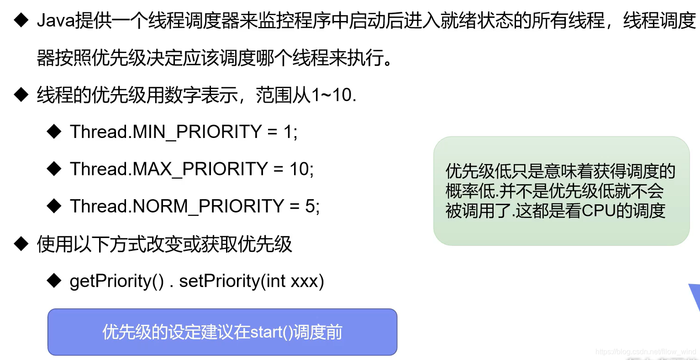

```java
package com.mine.demo05;
// 优先级
public class TestPriority{
    
    public static void main(String[] args) {
        //main 默认优先级 5
        System.out.println(Thread.currentThread().getName()+"-->"+Thread.currentThread().getPriority());
        
        MyPriority myPriority = new MyPriority();

        Thread t1 = new Thread(myPriority);
        Thread t2 = new Thread(myPriority);
        Thread t3 = new Thread(myPriority);
        Thread t4 = new Thread(myPriority);
        Thread t5 = new Thread(myPriority);

        //先设置优先级，再启动
        t1.start();  //Thread-0 默认优先级 5

        t2.setPriority(1);
        t2.start();

        t3.setPriority(4);
        t3.start();

        t4.setPriority(Thread.MAX_PRIORITY); //最大优先级
        t4.start();

        t5.setPriority(3);
        t5.start();
    }
}

class MyPriority implements Runnable{
    @Override
    public void run() {
        System.out.println(Thread.currentThread().getName()+"-->"+Thread.currentThread().getPriority());
    }
}
```

#### 守护线程

- 线程分为**用户线程**和**守护线程(daemon)**
- 虚拟机必须确保用户线程执行完毕
- 虚拟机不用等待守护线程执行完毕
- 如，后台记录操作日志，监控内存，垃圾回收等待…

```java
package com.mine.demo05;

//测试守护线程 daemon
public class TestDaemon {

    public static void main(String[] args) {
        God god = new God();
        You you = new You();

        //上帝是守护线程，用户线程结束自己也结束
        Thread thread = new Thread(god); 
        thread.setDaemon(true); //设置为守护线程 默认是false(表示用户线程)
        
        thread.start(); //守护线程启动

        new Thread(you).start(); //用户线程启动
    }

}

class God implements Runnable{
    @Override
    public void run() {
        while (true){
            System.out.println("上帝保佑着你");
        }
    }
}

class You implements Runnable{
    @Override
    public void run() {
        for (int i = 0; i < 36500; i++) {
            System.out.println("你度过了开心的第"+i+"天");
        }
        System.out.println("-==goodbye,world!==-");
    }
}
```

### 4.线程同步

- 并发：**同一对象被多个线程同时操作**（抢票）
- 线程同步是一个等待机制，多个需要同时访问此对象的线程进入这个**对象的等待池**形成队列，等待前一个线程使用完毕，下一个线程才能使用。

形成条件：**队列+锁**

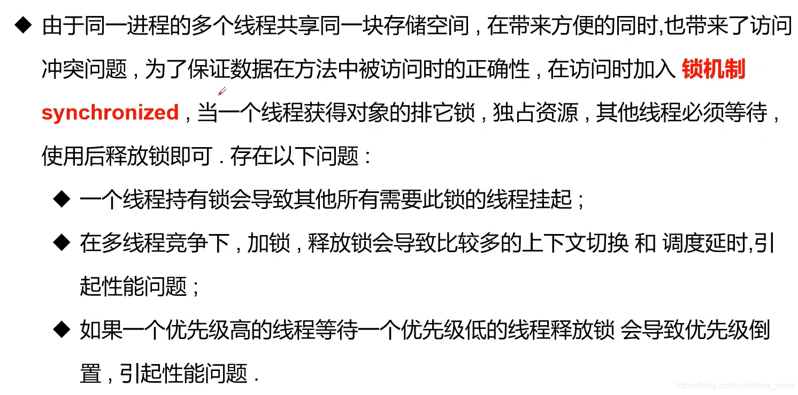

------

#### Synchronized方法

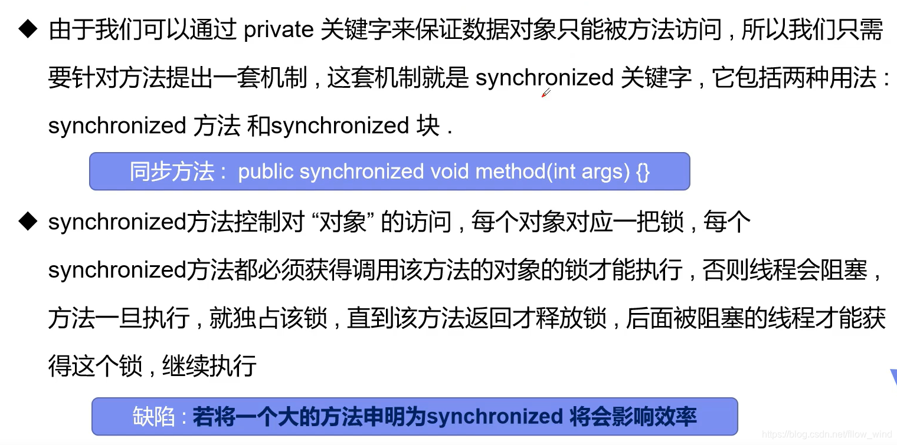

------

- **弊端：**
- **1. 方法里需要修改的内容才需要锁，只读可以不用锁，锁太多会浪费资源。**
- **2. A线程调用同步的方法执行一个长时间的任务，那么B线程就必须等待比较长的时间才能执行**

```java
package com.mine.demo06;
//一、买票不安全
public class UnsafeBuyTicket {

    public static void main(String[] args) {

        BuyTicket station = new BuyTicket();

        new Thread(station,"小明").start();
        new Thread(station,"张三").start();
        new Thread(station,"黄牛").start();
    }
}

class BuyTicket implements Runnable{
    private int ticketNums =10;
    boolean flag = true;

    @Override
    public void run() {
        while (flag){
            try {
                buy();
            } catch (InterruptedException e) {
                e.printStackTrace();
            }
        }
    }
    
    //同步方法：synchronized，锁的是this
    private synchronized void buy() throws InterruptedException {
        //判断是否有票
        if(ticketNums <= 0){
            this.flag = false;
            return;
        }
        Thread.sleep(500); //模拟延时
        //买票
        System.out.println(Thread.currentThread().getName()+"拿到"+ticketNums--);
    }
}
```

#### Synchronized代码块


先给大家介绍一下同步代码块怎么写，大体的代码框架是这样：

```java
synchronized(xxx) {
    
}
```

xxx 可以是 this 或者 Object 或者 xxx.class，下面我们就根据这 3 种不同加锁方式进行展开讨论。

##### this

表示的是锁住当前对象，和原来使用同步实例方式一样，锁住了当前的对象。

```java
package syn.block;

public class SynchronizedCodeTest {

    public static void main(String[] args) {
        SynchronizedCodeTest synchronizedCodeTest = new SynchronizedCodeTest();
        for (int i = 0; i < 5; i ++) {
            Thread thread = new Thread(() -> {
                synchronizedCodeTest.testSynchronizedCode();
            });
            thread.start();
        }
    }

    int count = 0;
    public void testSynchronizedCode() {
        System.out.printf("%s-start-count=%s\n", Thread.currentThread().getName(), count);
        synchronized (this) {
            System.out.printf("%s-synchronized-start-count=%s\n", Thread.currentThread().getName(), count);
            count ++;
            System.out.printf("%s-synchronized-end-count=%s\n", Thread.currentThread().getName(), count);
        }
        System.out.printf("%s-end-count=%s\n", Thread.currentThread().getName(), count);
    }

}

```

运行结果：

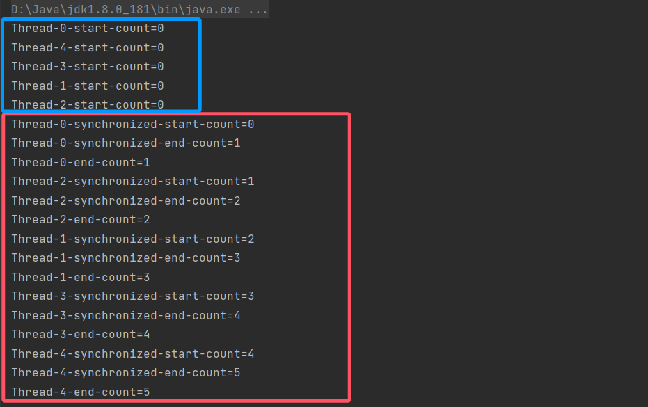

我们主要关注红色框和蓝色框的这部分结果，红色框里面是同步块的代码，线程之间是互斥的，但是蓝色框中**Thread-0**在执行同步块的过程中，其他线程非同步块也在执行，这里说明了锁的粒度确实变小了，变成了方法里面的同步块代码之间互斥，非同步块代码不互斥，count 的值最终是 5，说明到执行到同步块时，同一时刻只有一个线程在执行。

我们再写个测试代码，看一看 `synchronized(this)` 是锁住什么？

```java
public class SynchronizedCodeTest {

    public static void main(String[] args) {
        for (int i = 0; i < 5; i ++) {
            SynchronizedCodeTest synchronizedCodeTest = new SynchronizedCodeTest();
            Thread thread = new Thread(() -> {
                synchronizedCodeTest.testSynchronizedCode();
            });
            thread.start();
        }
    }
```

运行结果：

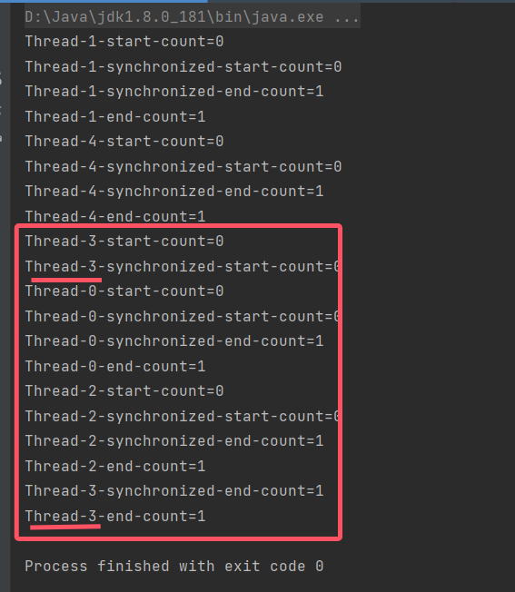

观察到红色框里面就可以发现，这时候同步块不起效果了，并且 count 最终都是 1，证明 `synchronized(this)` 锁住的是当前的对象，和 `public synchronized void testSynchronizedMethod()` 一样。

##### Object

同步代码块带来了灵活性，它不再只是锁住当前对象了，可以锁住任何我们创建的对象，下面就来看看。

```java
public class SynchronizedCodeTest {

    public static void main(String[] args) {
        Object lock = new Object();
        SynchronizedCodeTest synchronizedCodeTest = new SynchronizedCodeTest(lock);
        for (int i = 0; i < 5; i ++) {
            Thread thread = new Thread(() -> {
                synchronizedCodeTest.testSynchroniedLock();
            });
            thread.start();
        }
    }

    int count = 0;

    Object lock = null;
    public SynchronizedCodeTest(Object lock) {
        this.lock = lock;
    }

    public void testSynchroniedLock() {
        System.out.printf("%s-start-count=%s\n", Thread.currentThread().getName(), count);
        synchronized (lock) {
            System.out.printf("%s-synchronized-start-count=%s\n", Thread.currentThread().getName(), count);
            count ++;
            System.out.printf("%s-synchronized-end-count=%s\n", Thread.currentThread().getName(), count);
        }
        System.out.printf("%s-end-count=%s\n", Thread.currentThread().getName(), count);
    }

}
```

运行结果：

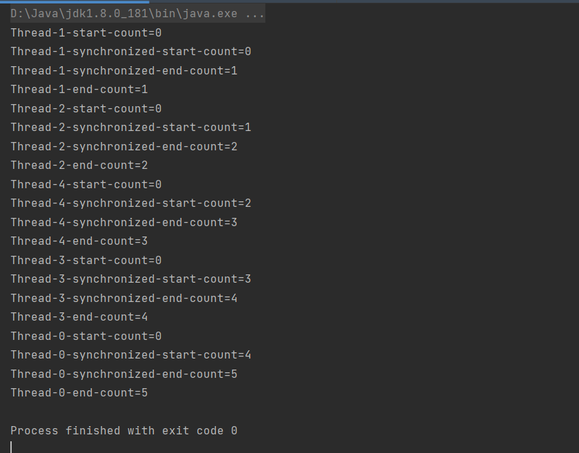

这段代码，我们创建了一个 lock 对象，作为参数传入到 synchronizedCodeTest 对象里，我们看到结果里面，5 个线程在同步块代码里是串行执行的，count 最终也得到结果是 5。这段代码没有看出锁对象带来的灵活性，下面再看一个例子，把测试代码稍微改一下，让每个线程都有自己的 synchronizedCodeTest 对象。

```java
public static void main(String[] args) {
	Object lock = new Object();
	for (int i = 0; i < 5; i ++) {
	SynchronizedCodeTest synchronizedCodeTest = new SynchronizedCodeTest(lock);
		Thread thread = new Thread(() -> {
			synchronizedCodeTest.testSynchroniedLock();
		});
		thread.start();
	}
}
```

运行结果：

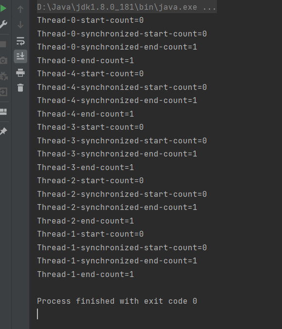

结果我们发现，虽然我们为每个线程创建一个 synchronizedCodeTest 对象，但是不管怎么运行，5 个线程的同步代码块都是串行执行的，原因在于，我们只创建了一个 lock 对象，这 5 个 synchronizedCodeTest 的 lock 对象都是同一个，因此竞争资源是同一个，才出现这种情况。看是不是比同步方法灵活多了，上一篇中，我们要让多个实例同步执行，我们需要使用**静态同步方法**，现在不用了，使用同步代码块就可以，只需要满足锁住同一个实例对象就行。

另外，这个例子的结果是每个实例的 count 最终都为 1，这是因为每个 synchronizedCodeTest 对象都有自己独立的变量 count，所以线程之间互不影响。

##### xxx.class

再来看看最后一种代码块锁 Class 类，这和 `public static synchronized testSynchronizedStatic()` 的作用是一样的，区别就只是代码块的锁范围可变。我们直接看看代码例子。

```java
public class SynchronizedCodeTest {

    public static void main(String[] args) {
        for (int i = 0; i < 5; i ++) {
            SynchronizedCodeTest synchronizedCodeTest = new SynchronizedCodeTest();
            Thread thread = new Thread(() -> {
                synchronizedCodeTest.testSynchronizedCodeClass();
            });
            thread.start();
        }
    }

    int count = 0;
    public void testSynchronizedCodeClass() {
        System.out.printf("%s-start-count=%s\n", Thread.currentThread().getName(), count);
        synchronized (SynchronizedCodeTest.class) {
            System.out.printf("%s-synchronized-start-count=%s\n", Thread.currentThread().getName(), count);
            count ++;
            System.out.printf("%s-synchronized-end-count=%s\n", Thread.currentThread().getName(), count);
        }
        System.out.printf("%s-end-count=%s\n", Thread.currentThread().getName(), count);
    }

}
```

运行结果：

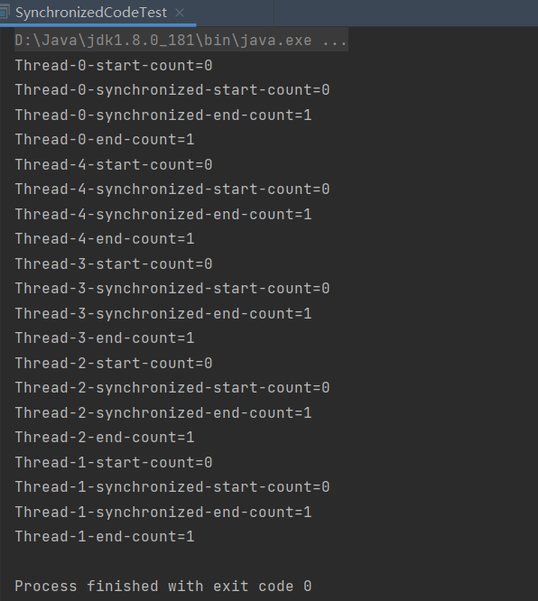

每个线程都有自己的实例，但是锁住 Class 会使每个线程实例对象的同步块都是串行执行，这个结果和上面的多个实例锁住同一个 Object 对象的结果是一样的。我个人更倾向于使用锁同一个 Object 对象，而不是锁 Class 类对象。

##### 总结

这篇介绍了**synchronizd 代码块**的 3 种使用方式，并详细介绍了各自的使用方式和区别。简单的列个表。

|   类型    |         使用方式          |         锁作用范围         |
| :-------: | :-----------------------: | :------------------------: |
|   this    |   synchronized(this){}    |     锁住当前的实例对象     |
|  object   |   synchronized(lock){}    | 锁住其他实例对象，比较灵活 |
| xxx.class | synchronized(xxx.class){} |      锁住 Class 对象       |


#### 死锁

- 多个线程各自占用一些共享资源，并且互相等待其他线程占有的资源才能运行，而导致两个或多个线程都在等待对方资源释放，都停止的情形。某一个同步块同时拥有**两个以上对象的锁**时，就可能会死锁。

```java
package com.mine.deadlock;
//死锁：多线程互相抱着对方需要的资源，然后形成僵持
public class DeadLock {
    public static void main(String[] args) {
        Makeup g1 = new Makeup(0, "灰姑娘");
        Makeup g2 = new Makeup(1, "白雪公主");

        g1.start();
        g2.start();
    }
}

//口红
class Lipstick{
}

//镜子
class Mirror{
}

class Makeup extends Thread{
    static Lipstick lipstick = new Lipstick();
    static Mirror mirror = new Mirror();

    int choice;//几种选择
    String girlName; //使用者

    public Makeup(int choice, String girlName) {
        this.choice = choice;
        this.girlName = girlName;
    }

    @Override
    public void run() {
        //化妆
        try {
            makeup();
        } catch (InterruptedException e) {
            e.printStackTrace();
        }
    }
    //互相持有对方的锁，就是需要拿到对方的资源
    private void makeup() throws InterruptedException {
        //选择1
        if(choice==0){
            synchronized (lipstick){ //获得口红的锁
                System.out.println(this.girlName+"获得口红的锁");
                Thread.sleep(1000);
                synchronized (mirror){ //一分钟后想拿镜子
                    System.out.println(this.girlName+"获得镜子的锁");
                }
            }
        }   //选择2
        else {
            synchronized (mirror){ //获得镜子的锁
                System.out.println(this.girlName+"获得镜子的锁");
                Thread.sleep(2000);
                synchronized (lipstick){ //一分钟后想拿口红
                    System.out.println(this.girlName+"获得口红的锁");
                }
            }

        }
    }
}
```


#### Lock(锁)

- 从JDK5.0开始，Java提供了更强大的同步线程机制——通过显式定义同步锁对象来实现同步，同步锁使用Lock对象充当。
- Lock接口是控制躲个线程对共享资源进行访问的工具。锁提供了对共享资源的独占访问，每次只能有一个线程对Lock加锁，线程开始访问资源前必须先获得Lock对象。
- ReentrantLock(可重入锁)类实现了Lock，它拥有与synchronized相同的并发性和内存语义，在实现线程安全的控制中，比较常用的是ReentrantLock，可以显式加锁，释放锁。

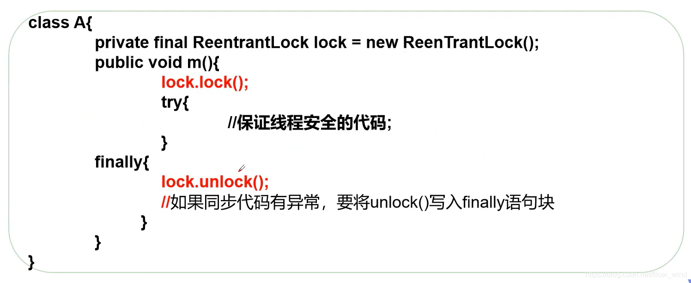

```java
package com.mine.gaoji;
import java.util.concurrent.locks.ReentrantLock;
//买票
public class TestLock {
    public static void main(String[] args) {
        TestLock2 testLock2 = new TestLock2();

        new Thread(testLock2).start();
        new Thread(testLock2).start();
        new Thread(testLock2).start();
    }
}

class TestLock2 implements Runnable{
    int ticketNums = 10;
    //定义Lock锁
    private final ReentrantLock lock = new ReentrantLock();
    
    @Override
    public void run() {
        while (true){
            try { //加锁
                lock.lock();
                if(ticketNums>0){
                    try {
                        Thread.sleep(1000);
                    } catch (InterruptedException e) {
                        e.printStackTrace();
                    }
                    System.out.println(ticketNums--);
                }else {
                    break;
                }
            }finally { //解锁
                lock.unlock();
            }
        }
    }

}
```

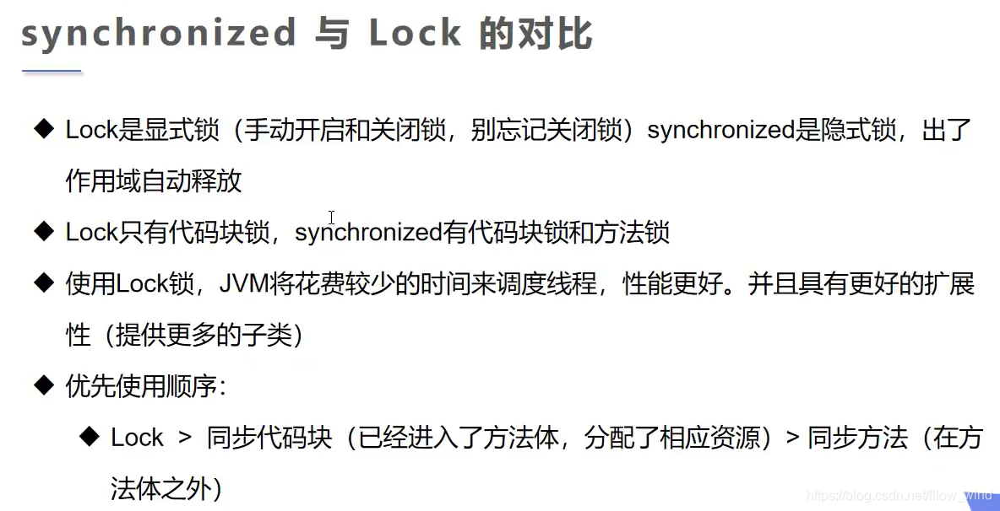

------

------

### 5.线程通信

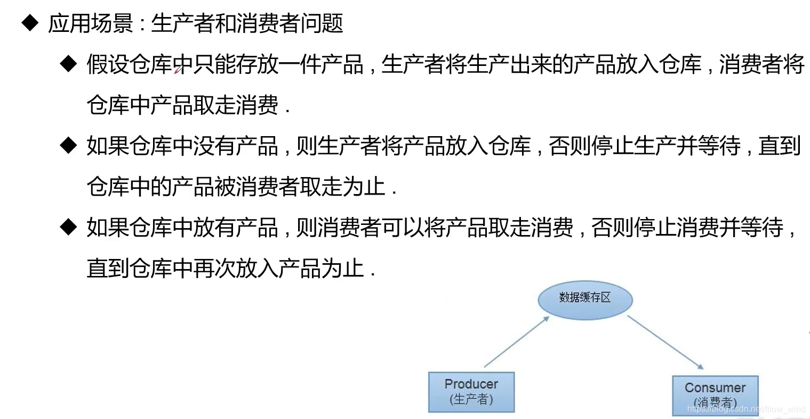

**这是一个线程同步问题，生产这与消费者共享同一个资源，他们之间相互依赖，互为条件。**

- 对于生产者，没有生产产品之前，要通知消费者等待，而生产了产品之后，又要马上通知消费者消费。
- 对于消费者，消费之后，要通知生产者生产新的产品。
- **synchronized**可阻止并发更新同一个共享资源，而**不能实现不同进程之间消息的传递。**

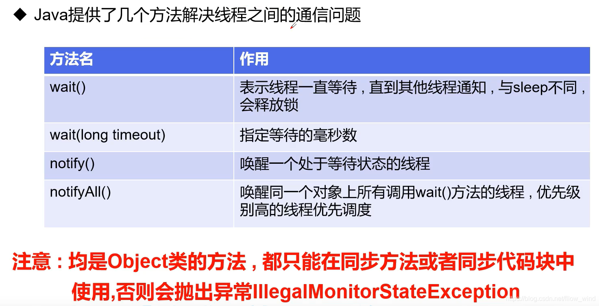

#### 管程法

```java
package com.mine.gaoji;
//生产者消费者问题：1.管程法
//生产者，消费者，产品，缓冲区
public class TestPC {
    public static void main(String[] args) {
        SynContainter containter = new SynContainter();

        new Productor(containter).start();
        new Consumer(containter).start();
    }
}
//生产者
class Productor extends Thread{
    SynContainter containter;

    public Productor(SynContainter containter){
        this.containter =containter;
    }
    //生产
    @Override
    public void run() {
        for (int i = 1; i < 100; i++) {
            containter.push(new Chicken(i));
            System.out.println("生产了"+i+"只鸡");
        }
    }
}
//消费者
class Consumer extends Thread{
    SynContainter containter;

    public Consumer(SynContainter containter){
        this.containter =containter;
    }
    //消费
    @Override
    public void run() {
        for (int i = 1; i < 100; i++) {
            System.out.println("消费了"+containter.pop().id+"只鸡");
        }
    }
}

class Chicken{
    int id; //产品编号

    public Chicken(int id){
        this.id=id;
    }
}

//缓冲区
class SynContainter{
    //容器容量
    Chicken[] chickens =new Chicken[10];
    int count = 0;

    //生产者放入产品
    public synchronized void push(Chicken chicken){
        if(count==chickens.length){
            //生产等待
            try {
                this.wait();
            } catch (InterruptedException e) {
                e.printStackTrace();
            }
        }
        chickens[count]=chicken;
        count++;

        //可以通知消费者消费了
        this.notifyAll();
    }

    //消费者消费产品
    public synchronized Chicken pop(){
        //判断能否消费
        if(count==0){
            //等待生产者生产
            try {
                this.wait();
            } catch (InterruptedException e) {
                e.printStackTrace();
            }
        }
        count--;
        Chicken chicken = chickens[count];

        //通知生产者生产
        this.notifyAll();
        return chicken;
    }

}
```

#### 信号灯法

```java
package com.mine.gaoji;

//生产者消费者问题：2.信号灯法，一个标志位解决(flag)
public class TestPC2 {
    public static void main(String[] args) {
        TV tv = new TV();

        new Player(tv).start();
        new Watcher(tv).start();
    }
}

//生产者-->演员
class Player extends Thread{
    TV tv;
    public Player(TV tv) {
        this.tv = tv;
    }

    @Override
    public void run() {
        for (int i = 0; i < 20; i++) {
            if(i%2==0){
                this.tv.play("快乐大本营");
            }else {
                this.tv.play("中国好声音");
            }
        }
    }
}

//消费者-->观众
class Watcher extends Thread{
    TV tv;
    public Watcher(TV tv) {
        this.tv = tv;
    }

    @Override
    public void run() {
        for (int i = 0; i < 20; i++) {
            tv.watch();
        }
    }
}

//产品-->节目
class TV{
    //演员表演，观众等待
    //观众观看，演员等待
    String voice; //表演的节目
    boolean flag = true;  //标志位

    //表演
    public synchronized void play(String voice){
        if(!flag){
            try {
                this.wait();
            } catch (InterruptedException e) {
                e.printStackTrace();
            }
        }
        System.out.println("演员表演了："+voice);
        //通知观众观看
        this.notifyAll();
        this.voice = voice;
        this.flag = !this.flag;
    }
    //观看
    public synchronized void watch(){
        if(flag){
            try {
                this.wait();
            } catch (InterruptedException e) {
                e.printStackTrace();
            }
        }
        System.out.println("观看了"+voice);
        //通知演员表演
        this.notifyAll();
        this.flag = !this.flag;
    }
}
```

#### 线程池

- 背景：经常销毁、使用量特别大的资源，比如并发情况下的线程，对性能影响很大。
- 思路：提前创建好多个线程，放入线程池中，使用时直接获取，使用完放回池中。可以避免频繁创建销毁、实现重复利用。类似生活中的公共交通工具。
- 好处：
  - 提高响应速度（减少了创建新线程的时间）
  - 降低资源消耗（重复利用线程池中线程，不用每次都创建）
  - 便于线程管理
    - **corePoolSize** (核心池大小)
    - **maximumPoolSize** (最大线程数)
    - **keepAliveTime** (当线程没有任务，保持多长时间终止)

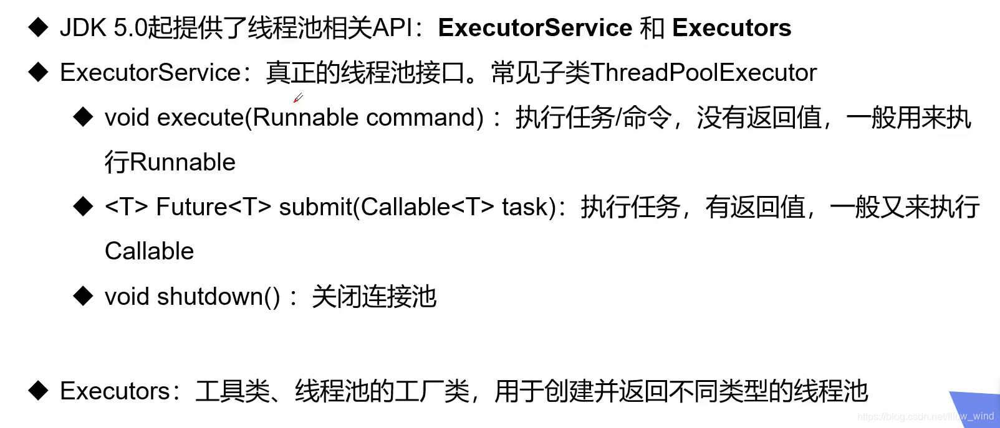

```java
package com.mine.gaoji;

import java.util.concurrent.ExecutorService;
import java.util.concurrent.Executors;
//线程池
public class TestPool {
    public static void main(String[] args) {
        //1.创建服务，创建线程池
        //newFixedThreadPool 参数：线程池大小
        ExecutorService service = Executors.newFixedThreadPool(10);

        //执行
        service.execute(new MyThread());
        service.execute(new MyThread());
        service.execute(new MyThread());
        service.execute(new MyThread());
        //2.关闭连接
        service.shutdown();
    }
}

class MyThread implements Runnable{
    @Override
    public void run() {
        System.out.println(Thread.currentThread().getName());
    }
}
```