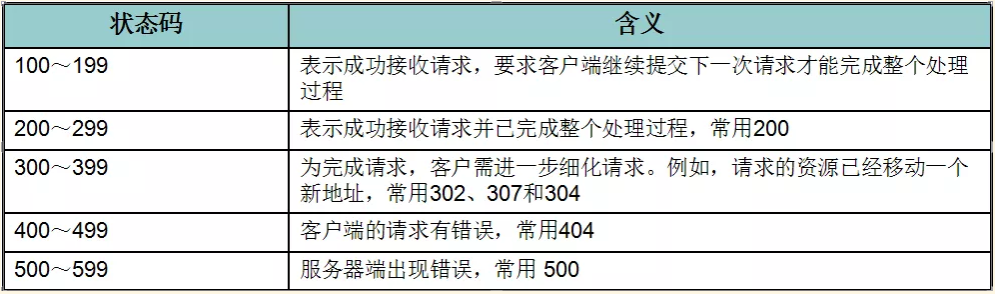
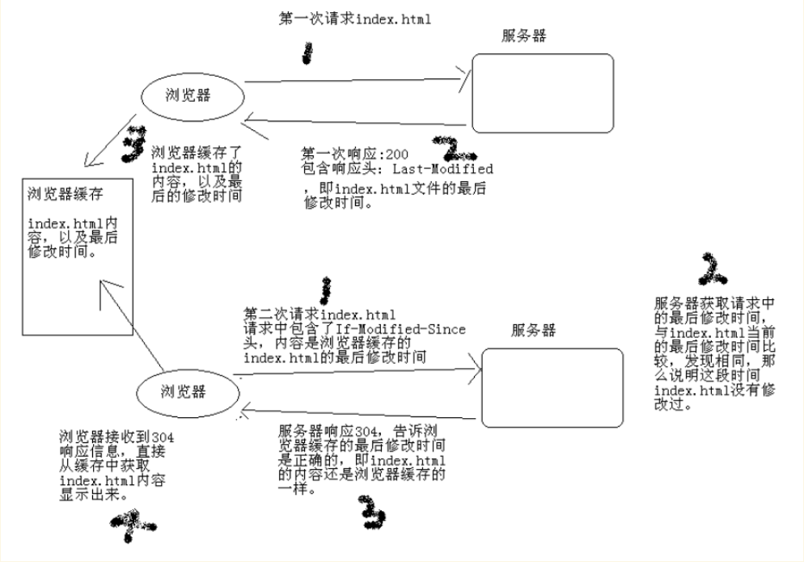
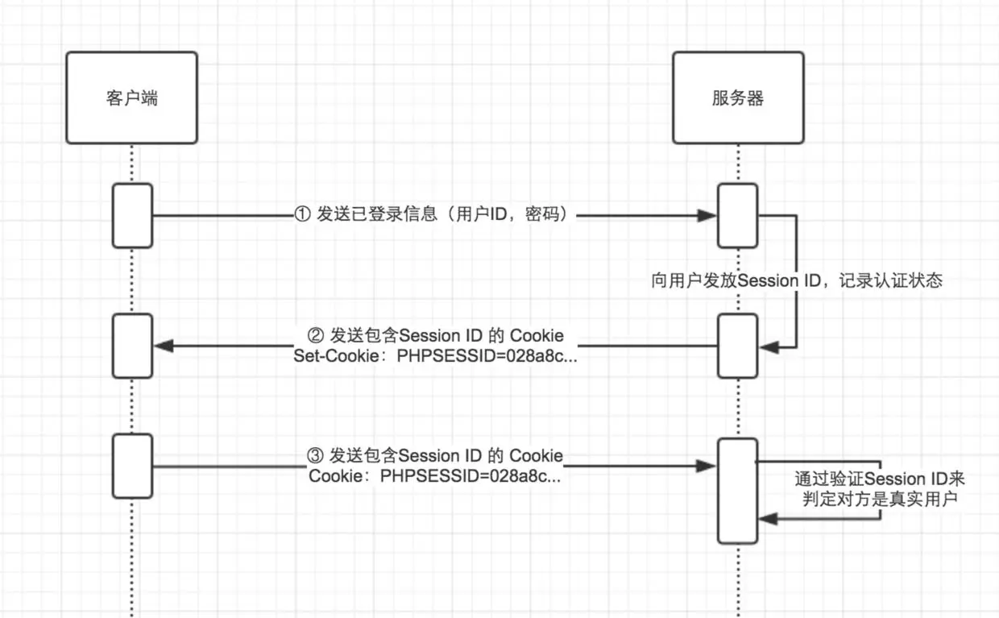
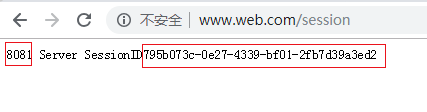
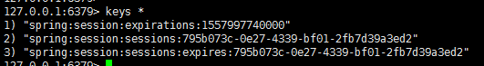
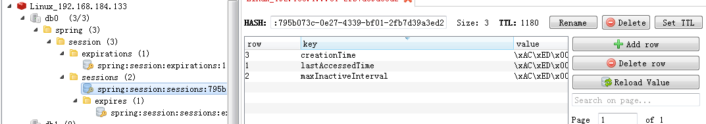
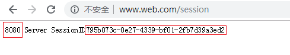
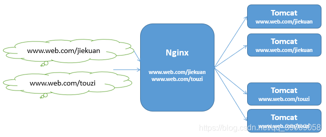
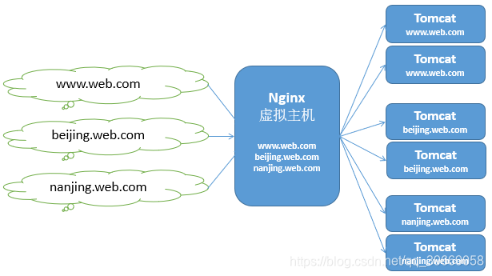

## HTTP协议 

### 一、HTTP概述

HTTP（hypertext transport protocol），即超文本传输协议。这个协议详细规定了浏览器和万维网服务器之间互相通信的规则。

HTTP就是一个通信规则，通信规则规定了客户端发送给服务器的内容格式，也规定了服务器发送给客户端的内容格式。客户端发送给服务器的格式叫“请求协议”；服务器发送给客户端的格式叫“响应协议”。

原理：当在浏览器中点击这个链接的时候，**浏览器会向服务器发送一段文本**，**告诉服务器请求打开的是哪一个网页。服务器收到请求后，就返回一段文本给浏览器，浏览器会将该文本解析，然后显示出来。**这段文本就是遵循HTTP协议规范的。

### 二、HTTP1.0和HTTP1.1的区别

HTTP1.0协议中，客户端与web服务器建立连接后，只能获得一个web资源【短连接，获取资源后就断开连接】

HTTP1.1协议，允许客户端与web服务器建立连接后，在一个连接上获取多个web资源【保持连接】

### 三、请求协议

#### （一）请求协议的格式如下：

```
请求首行；【描述客户端的请求方式、请求的资源名称，以及使用的HTTP协议版本号】
请求头信息；【描述客户端请求哪台主机，以及客户端的一些环境信息等】
空行；
请求体
```

浏览器发送给服务器的内容就这个格式的，如果不是这个格式服务器将无法解读！

#### （二）请求方式

请求方式有：POST,GET,HEAD,OPTIONS,DELETE,TRACE,PUT。

**常用的有：POST,GET**

一般来说，当我们**点击超链接，通过地址栏访问都是get请求方式**。通过**表单提交的数据一般是post方式**

可以简单理解**GET方式用来查询数据**,**POST方式用来提交数据**，**get的提交速度比post快**

GET方式：在URL地址后附带的**参数是有限制**的，其**数据容量通常不能超过1K**。

POST方式：可以在请求的实体内容中向服务器发送数据，**传送的数据量无限制**。

#### （三）get方式

```
GET /hello/index.jsp HTTP/1.1
Host: localhost
User-Agent: Mozilla/5.0 (Windows NT 5.1; rv:5.0) Gecko/20100101 Firefox/5.0
Accept: text/html,application/xhtml+xml,application/xml;q=0.9,*/*;q=0.8
Accept-Language: zh-cn,zh;q=0.5
Accept-Encoding: gzip, deflate
Accept-Charset: GB2312,utf-8;q=0.7,*;q=0.7
Connection: keep-alive
Cookie: JSESSIONID=369766FDF6220F7803433C0B2DE36D98
			//这个位置虽然没有东西，但很重要，它是空行。如果有请求体，那么请求体在空行的下面
1、GET /hello/index.jsp HTTP/1.1：GET请求，请求服务器路径为/hello/index.jsp，协议为1.1；
2、Host:localhost：请求的主机名为localhost；
3、User-Agent: Mozilla/5.0 (**Windows NT 5.1**; rv:5.0) Gecko/20100101 **Firefox/5.0**：与浏览器和OS相关的信息。有些网站会显示用户的系统版本和浏览器版本信息，这都是通过获取User-Agent头信息而来的；
4、Accept: text/html,application/xhtml+xml,application/xml;q=0.9,*/*;q=0.8：告诉服务器，当前客户端可以接收的文档类型，其实这里包含了*/*，就表示什么都可以接收；
5、Accept-Language: zh-cn,zh;q=0.5：当前客户端支持的语言，可以在浏览器的工具à选项中找到语言相关信息；
6、Accept-Encoding: gzip, deflate：支持的压缩格式。数据在网络上传递时，可能服务器会把数据压缩后再发送；
7、Accept-Charset: GB2312,utf-8;q=0.7,*;q=0.7：客户端支持的编码；
8、Connection: keep-alive：客户端支持的链接方式，保持一段时间链接，默认为3000ms；
9、Cookie: JSESSIONID=369766FDF6220F7803433C0B2DE36D98：因为不是第一次访问这个地址，所以会在请求中把上一次服务器响应中发送过来的Cookie在请求中一并发送去过；这个Cookie的名字为JSESSIONID
```

#### （四）post方法

```
POST /hello/index.jsp HTTP/1.1
Accept: image/gif, image/jpeg, image/pjpeg, image/pjpeg, application/msword, application/vnd.ms-excel, application/vnd.ms-powerpoint, application/x-ms-application, application/x-ms-xbap, application/vnd.ms-xpsdocument, application/xaml+xml, */*
Referer: http://localhost:8080/hello/index.jsp
Accept-Language: zh-cn,en-US;q=0.5
User-Agent: Mozilla/4.0 (compatible; MSIE 7.0; Windows NT 5.1; Trident/4.0; InfoPath.2; .NET CLR 2.0.50727; .NET CLR 3.0.4506.2152; .NET CLR 3.5.30729)
Content-Type: application/x-www-form-urlencoded
Accept-Encoding: gzip, deflate
Host: localhost:8080
Content-Length: 13
Connection: Keep-Alive
Cache-Control: no-cache
Cookie: JSESSIONID=E365D980343B9307023A1D271CC48E7D

keyword=hello
1、Referer: http://localhost:8080/hello/index.jsp：请求来自哪个页面，例如你在百度上点击链接到了这里，那么  		Referer:http://www.baidu.com；如果你是在浏览器的地址栏中直接输入的地址，那么就没有Referer这个请求头了；
2、Content-Type: application/x-www-form-urlencoded：表单的数据类型，说明会使用url格式编码数据；url编码的数据都是以“%”为前缀，后面跟随两位的16进制，例如“传智”这两个字使用UTF-8的url编码用为“%E4%BC%A0%E6%99%BA”；
3、Content-Length:13：请求体的长度，这里表示13个字节。
4、keyword=hello：请求体内容！hello是在表单中输入的数据，keyword是表单字段的名字。
```

Referer请求头是比较有用的一个请求头，它可以用来做统计工作，也可以用来做防盗链。

**统计工作**：比如一个公司网站在百度上做了广告，但不知道在百度上做广告对我们网站的访问量是否有影响，那么可以对每个请求中的Referer进行分析，如果Referer为百度的很多，那么说明用户都是通过百度找到我们公司网站的。

**防盗链**：比如一个公司网站上有一个下载链接，而其他网站盗链了这个地址，例如在公司网站上的index.html页面中有一个链接，点击即可下载JDK7.0，但有某个人的微博中盗链了这个资源，它也有一个链接指向我们网站的JDK7.0，也就是说登录它的微博，点击链接就可以从我网站上下载JDK7.0，这导致我们网站的广告没有看，但下载的却是我网站的资源。这时可以使用Referer进行防盗链，在资源被下载之前，我们对Referer进行判断，如果请求来自本网站，那么允许下载，如果非本网站，先跳转到本网站看广告，然后再允许下载。

**注意：POST请求是可以有体的，而GET请求不能有请求体。**

### 四、响应协议

#### （一）响应协议的格式如下：

```
响应首行；
响应头信息；
空行；
响应体
```

响应内容是由服务器发送给浏览器的内容，浏览器会根据响应内容来显示

响应头：

```
Location: http://www.it315.org/index.jsp 【服务器告诉浏览器要跳转到哪个页面】

Server:apache tomcat【服务器告诉浏览器，服务器的型号是什么】

Content-Encoding: gzip 【服务器告诉浏览器数据压缩的格式】

Content-Length: 80 【服务器告诉浏览器回送数据的长度】

Content-Language: zh-cn 【服务器告诉浏览器，服务器的语言环境】

Content-Type: text/html; charset=GB2312 【服务器告诉浏览器，回送数据的类型】

Last-Modified: Tue, 11 Jul 2000 18:23:51 GMT【服务器告诉浏览器该资源上次更新时间】

Refresh: 1;url=http://www.it315.org【服务器告诉浏览器要定时刷新】

Content-Disposition: attachment; filename=aaa.zip【服务器告诉浏览器以下载方式打开数据】

Transfer-Encoding: chunked 【服务器告诉浏览器数据以分块方式回送】

Set-Cookie:SS=Q0=5Lb_nQ; path=/search【服务器告诉浏览器要保存Cookie】

Expires: -1【服务器告诉浏览器不要设置缓存】【Expires头字段指定了响应被视为过期的日期和时间。将Expires值设置为-1，意味着这个响应在任何时候都不应该被缓存，应被立即视为过期。】

Cache-Control: no-cache 【服务器告诉浏览器不要设置缓存】【Cache-Control: no-cache指示浏览器每次在使用缓存的数据前都必须与服务器重新验证该响应的有效性，而不是直接使用缓存中的副本。】

Pragma: no-cache 【服务器告诉浏览器不要设置缓存】【Pragma: no-cache是一个历史遗留字段，用于向HTTP/1.0兼容的客户端指示不要缓存响应。在现代HTTP规范中，主要使用Cache-Control头字段，但为了向后兼容，有时仍会设置Pragma头字段。】

Connection: close/Keep-Alive 【服务器告诉浏览器连接方式】

Date: Tue, 11 Jul 2000 18:23:51 GMT【服务器告诉浏览器回送数据的时间】
```

#### （二）响应码：



200：请求成功，浏览器会把响应体内容（通常是html）显示在浏览器中；

404：请求的资源没有找到，说明客户端错误的请求了不存在的资源；

500：请求资源找到了，但服务器内部出现了错误；

302：重定向，当响应码为302时，表示服务器要求浏览器重新再发一个请求，服务器会发送一个响应头Location，它指定了新请求的URL地址；

304：比较If-Modified-Since的时间与文件真实的时间一样时，服务器会响应304，而且不会有响正文，表示浏览器缓存的就是最新版本下图解释了工作原理：



响应头：Last-Modified：最后的修改时间；

请求头：If-Modified-Since：把上次请求的index.html的最后修改时间还给服务器；

#### （三）其他响应头

1、告诉浏览器不要缓存的响应头：

Expires: -1；

Cache-Control: no-cache；

Pragma: no-cache；

2、自动刷新响应头，浏览器会在3秒之后请求指定的网址

```
Refresh: 3;url=http://www.itcast.cn
```

#### （四）HTML中指定响应头

在HTMl页面中可以使用`<meta http-equiv="" content="">`来指定响应头，例如在index.html页面中给出`<meta http-equiv="Refresh" content="3;url=http://www.baidu.com">`，表示浏览器只会显示index.html页面3秒，然后自动跳转到`http://www.baidu.com`.

## 一、Servlet简介、作用、生命周期、实现

###  一、Servlet简介

Servlet是sun公司提供的一门用于开发动态web资源的技术。
Sun公司在其API中提供了一个servlet接口，用户若想用发一个动态web资源(即开发一个Java程序向浏览器输出数据)，需要 完成以下2个步骤：
　　1、编写一个Java类，实现servlet接口。
　　2、把开发好的Java类部署到web服务器中。
　　按照一种约定俗成的称呼习惯，通常我们也把实现了servlet接口的java程序，称之为Servlet

简而言之，Servlet其实就是一个**遵循Servlet开发的java类**。Serlvet是**由服务器调用的**，**运行在服务器端**。

### 二、Servlet的作用

Servlet带给我们最大的作用就是能够**处理浏览器带来HTTP请求，并返回一个响应给浏览器，从而实现浏览器和服务器的交互**。

### 三、实现Servlet接口编写Servlet程序

1、创建一个Servlet类，实现Servlet接口

2、在Servlet中一共有5个方法需要我们实现，分别为：

```java
public class Servlet01 implements Servlet{
	/**
	 * 生命周期方法
	 * 在Servlet被销毁之前调用，并且只会调用一次
	 */
	@Override
	public void destroy() {
		System.out.println("destroy()");
	}

	/**
	 * 获取Servlet配置信息
	 */
	@Override
	public ServletConfig getServletConfig() {
		System.out.println("getServletConfig()");
		return null;
	}
	
	/**
	 * 获取Servlet信息
	 */
	@Override
	public String getServletInfo() {
		System.out.println("getServletInfo()");
		return null;
	}
	
	/**
	 * 生命周期方法
	 * 在Servlet对象创建之后马上执行，并且只执行一次
	 */
	@Override
	public void init(ServletConfig servletConfig) throws ServletException {
		System.out.println("init()");
	}
	
	/**
	 * 生命周期方法
	 * 会被调用多次
	 * 每次处理请求都是调用这个方法
	 */
	@Override
	public void service(ServletRequest request, ServletResponse response)
			throws ServletException, IOException {
		System.out.println("service()");
	}
}
```

3、在WebRoot/WEB_INF/web.xml中进行配置

```xml
<servlet>
  	<servlet-name>servlet01</servlet-name>
  	<servlet-class>com.zuobiao.servlet.Servlet01</servlet-class>
</servlet>

<servlet-mapping>
  	<servlet-name>servlet01</servlet-name>
  	<url-pattern>/Servlet01</url-pattern> 	<!-- 表示在浏览器中输入的访问路径 -->
</servlet-mapping>
```

当然，在以后的开发中都是使用的开发工具创建来Servlet类，创建完成之后也就自动在web.xml文件中配置好了，所以下面的实现都省去了这一步。

### 四、Servlet的生命周期

由第三点可以引出Servlet的**生命周期方法**共有三个：

```java
public void init(ServletConfig servletConfig) 
public void service(ServletRequest request, ServletResponse response)
public void destroy() 
```

实际上Servlet生命周期可分为5个步骤：

1. **加载Servlet**：当Tomcat第一次访问Servlet的时候，Tomcat会负责创建Servlet的实例
2. **初始化**：当Servlet被实例化后，Tomcat会调用init()方法初始化这个对象
3. **处理服务**：当浏览器访问Servlet的时候，Servlet 会调用service()方法处理请求
4. **销毁**：当Tomcat关闭时或者检测到Servlet要从Tomcat删除的时候会自动调用destroy()方法，让该实例释放掉所占的资源。一个Servlet如果长时间不被使用的话，也会被Tomcat自动销毁
5. **卸载**：当Servlet调用完destroy()方法后，等待垃圾回收。如果有需要再次使用这个Servlet，会重新调用init()方法进行初始化操作。
   **简单总结：只要访问Servlet，service()就会被调用。init()只有第一次访问Servlet的时候才会被调用。 destroy()只有在Tomcat关闭的时候才会被调用。**

### 五、Servlet的其他实现类

（一）**GenericServlet类**

 由于有时候我们需要使用ServletConfig来获取项目的一些配置信息，即：读取web.xml中的一些信息，那么此时就还需要同时实现ServletConfig接口，这样就导致我们的Servlet类比较麻烦。
​ 因此sun公司就定义了另外的一个类，GenericServlet类，该类同时继承了Servlet接口和ServletConfig接口，也就是说该类同时实现了这两个接口的方法：

```java
init(ServletConfig config)
destroy()
getServletInfo()
getServletConfig(ServletConfig config)
getInitParameter(String name)
getInitParameterNames()
getServletContext()
getServletName()
```

并且在该类重载了一个无参init()方法，部分源码如下：

```java
@Override
public void init(ServletConfig config) throws ServletException {
    this.config = config;
    this.init();
}

/**
*这个方法是GenericServlet自己的方法，而不是从Servlet继承下来的。当我们自定义Servlet时，如果想完成初始化作用就不要再重复init(ServletConfig)方法了，而是应该去重写init()方法。因为在GenericServlet中的init(ServletConfig)方法中保存了ServletConfig对象，如果覆盖了保存ServletConfig的代码，那么就不能再使用ServletConfig了。
*/
public void init() throws ServletException {
    // NOOP by default
}
```

这样就保证了我们可以405在往init()方法中添加代码的同时还不会重写有参init()方法，从而不会导致获取ServletConfig对象出现问题（这一方法非常值得学习）。

然后我们当我们需要创建Servlet类时，只需要继承GenericServlet类，实现service方法即可。

```java
public class Servlet02 extends GenericServlet {
	@Override
	public void service(ServletRequest req, ServletResponse res)
			throws ServletException, IOException {
		
	}
}
```

（二）**HttpServlet类**

但GenericServlet类并不能满足我们的需求，因为通常我们都会和HTTP打交道，所以就出现了HttpServlet类。

HttpServlet指能够处理HTTP请求的servlet，它继承了GenericServlet，并在原有Servlet接口上添加了一些与HTTP协议处理方法，它比Servlet接口的功能更为强大。因此开发人员在编写Servlet时，通常应继承这个类，而避免直接去实现Servlet接口。

HttpServlet在实现Servlet接口时，重写了service方法，该方法会自动判断用户的请求方式，如为GET请求，则调用HttpServlet的doGet方法，如为Post请求，则调用doPost方法。因此，开发人员在编写Servlet时，通常只需要重写doGet或doPost方法，而不要去重写service方法。

**注意：如果没有重写doGet或doPost方法，但是浏览器发送的请求的方法又是这两种的一种，则会报出405错误（表示该方法不支持）。**

```java
public class Servlet03 extends HttpServlet {
	@Override
	protected void doGet(HttpServletRequest req, HttpServletResponse resp)
			throws ServletException, IOException {
		System.out.println("doGet()...");
	}
	
	@Override
	protected void doPost(HttpServletRequest req, HttpServletResponse resp)
			throws ServletException, IOException {
		System.out.println("doPost()...");
	}
}
```

（三）**总结**

**实现Servlet有三种方式：**

1、实现javax.servlet.Servlet接口；
2、继承javax.servlet.GenericServlet类；
3、继承javax.servlet.http.HttpServlet类；
通常我们会去继承HttpServlet类来完成我们的Servlet

## 二、Servlet实现线程安全及其它细节补充

###  一、Servlet是单例的

（一）
​ 浏览器多次对Servlet的请求，一般情况下，**服务器只创建一个Servlet对象**，也就是说，Servlet对象一旦创建了，就会驻留在内存中，为后续的请求做服务，直到服务器关闭。

（二）
但是对于每次访问的请求对象和响应对象都是新的。对于每次访问请求，Servlet引擎都会创建一个新的HttpServletRequest请求对象和一个新的HttpServletResponse响应对象，然后将这两个对象作为参数传递给它调用的Servlet的service()方法，service方法再根据请求方式分别调用doXXX方法。

### 二、Servlet与线程安全

 因为一个类型的Servlet只有一个实例对象，那么就有可能会出现一个Servlet同时处理多个请求，那么Servlet是否为线程安全的呢？答案：“不是线程安全的”。这说明Servlet的工作效率很高，但也存在线程安全问题！
​ 所以我们不应该在Servlet中随便创建成员变量，因为可能会存在一个线程对这个成员变量进行写操作，另一个线程对这个成员变量进行读操作。

通常，会**通过以下方法来解决线程安全问题：**

1、不要在Servlet中创建成员变量！创建局部变量即可！

如果一个变量需要多个用户共享，则应当在访问该变量的时候，加同步机制synchronized (对象){}

如果一个变量不需要共享，则直接在 doGet() 或者 doPost()定义。这样不会存在线程安全问题

2、可以创建无状态成员！(该类中并没有其他成员变量，只有一些不涉及状态的方法)

```java
public class Servlet01 extends HttpServlet {
	private User user;
	
	@Override
	protected void doGet(HttpServletRequest req, HttpServletResponse resp)
			throws ServletException, IOException {
		System.out.println("doGet()...");
	}
	
	@Override
	protected void doPost(HttpServletRequest req, HttpServletResponse resp)
			throws ServletException, IOException {
		System.out.println("doPost()...");
	}
}

class User{
	public void sayHello(){
		System.out.println("hello...");
	}
}
```

3、可以创建有状态的成员，但状态必须为只读的！(只能取值，不能改变)

```java
public class Servlet02 extends HttpServlet {
	private User user;
	
	@Override
	protected void doGet(HttpServletRequest req, HttpServletResponse resp)
			throws ServletException, IOException {
		System.out.println("doGet()...");
	}
	
	@Override
	protected void doPost(HttpServletRequest req, HttpServletResponse resp)
			throws ServletException, IOException {
		System.out.println("doPost()...");
	}
}

class User{
	private String name;
	private int age;
	
	public String getName() {
		return name;
	}

	public int getAge() {
		return age;
	}
}
```

### 三、让服务器在启动时就创建Servlet

 默认情况下，服务器会在某个Servlet第一次收到请求时创建它。但其实也可以在web.xml中对Servlet进行配置，使服务器启动时就创建Servlet。

```
在<servlet>中配置<load-on-startup>，其中给出一个非负整数！且该数越小，优先级越高！
<servlet>
    <servlet-name>Servlet03</servlet-name>
    <servlet-class>com.zuobiao.servlet.Servlet03</servlet-class>
    <load-on-startup>0</load-on-startup> 
</servlet>
    
<servlet-mapping>
    <servlet-name>Servlet03</servlet-name>
    <url-pattern>/Servlet03</url-pattern>
</servlet-mapping>
```

如果在元素中配置了`<load-on-startup>`元素，那么服务器在启动时，就会装载并创建Servlet的实例对象、以及调用Servlet实例对象的init()方法。

### 四、同一个Servlet可以被映射到多个URL上

#### （一）

```xml
<servlet>
    <servlet-name>Servlet04</servlet-name>
    <servlet-class>com.zuobiao.servlet.Servlet04</servlet-class>
    <load-on-startup>0</load-on-startup> 
</servlet>
  
<servlet-mapping>
    <servlet-name>Servlet4</servlet-name>
    <url-pattern>/AServlet</url-pattern>
    <url-pattern>/BServlet</url-pattern>
</servlet-mapping> 
```

无论我访问的是http://localhost:8080/AServlet还是http://localhost:8080/BServlet。我访问的都是Servlet04。

注意：
`<url-pattern>是<servlet-mapping>`的子元素，用来指定Servlet的访问路径，即URL。它必须是以“/”开头！

#### （二）Servlet映射的URL可以使用通配符

1、所谓通配符就是星号“*”，星号可以匹配任何URL前缀或后缀，使用通配符可以命名一个Servlet绑定一组URL，例如：

```xml
路径匹配:
<url-pattern>/servlet/*<url-patter>：/servlet/a、/servlet/b，都匹配/servlet/*；
扩展名匹配:
<url-pattern>*.do</url-pattern>：/abc/def/ghi.do、/a.do，都匹配 *.do；
啥都匹配:
<url-pattern>/*<url-pattern>：匹配所有URL；
```

请注意，通配符要么为前缀，要么为后缀，不能出现在URL中间位置，也不能只有通配符。例如：/ * .do就是错误的，因为星号出现在URL的中间位置上了。*.*也是不对的，因为一个URL中最多只能出现一个通配符。

2、通配符是一种模糊匹配URL的方式，如果存在更具体的`<url-pattern>`，那么访问路径会去匹配具体的`<url-pattern>`。

```
1、看谁的匹配度高，谁就被选择
2、*.扩展名的优先级最低
```

例如：

```xml
<servlet>
	<servlet-name>hello1</servlet-name>
	<servlet-class>com.zuobiao.servlet.Hello1Servlet</servlet-class>
</servlet>
<servlet-mapping>
	<servlet-name>hello1</servlet-name>
	<url-pattern>/servlet/hello1</url-pattern>
</servlet-mapping>
	
<servlet>
	<servlet-name>hello2</servlet-name>
	<servlet-class>com.zuobiao.servlet.Hello2Servlet</servlet-class>
</servlet>
<servlet-mapping>
	<servlet-name>hello2</servlet-name>
	<url-pattern>/servlet/*</url-pattern>
</servlet-mapping>
```

当访问路径为`http://localhost:8080/hello/servlet/hello1`时，因为访问路径即匹配hello1的`<url-pattern>`，又匹配hello2的`<url-pattern>`，但因为hello1的`<url-pattern>`中没有通配符，所以优先匹配，即设置hello1。

#### （三）Servlet映射的URL可以使用通配符和Servlet可以被映射到多个URL上的作用：

1、隐藏网站是用什么编程语言写的【.php,.net,.asp实际上访问的都是同一个资源】

2、特定的后缀声明版权【公司缩写】

### 五、web.xml文件的继承（只是为了更好地理解从而比作继承）

1、每个完整的JavaWeb应用中都需要有web.xml，但我们不知道所有的web.xml文件都有一个共同的父文件，它在Tomcat的conf/web.xml路径。

2、在\conf\web.xml中的内容，相当于写到了每个项目的web.xml中，它是所有web.xml的父文件。

3、在\conf\web.xml中，还分别有一个默认的Servlet和一个后缀为jsp的Servlet，部分源码如下：

```xml
 <servlet>
        <servlet-name>default</servlet-name>
        <servlet-class>org.apache.catalina.servlets.DefaultServlet</servlet-class>
        <init-param>
            <param-name>debug</param-name>
            <param-value>0</param-value>
        </init-param>
        <init-param>
            <param-name>listings</param-name>
            <param-value>false</param-value>
        </init-param>
        <load-on-startup>1</load-on-startup>
</servlet>
<servlet>
        <servlet-name>jsp</servlet-name>
        <servlet-class>org.apache.jasper.servlet.JspServlet</servlet-class>
        <init-param>
            <param-name>fork</param-name>
            <param-value>false</param-value>
        </init-param>
        <init-param>
            <param-name>xpoweredBy</param-name>
            <param-value>false</param-value>
        </init-param>
        <load-on-startup>3</load-on-startup>
</servlet>

<servlet-mapping>
        <servlet-name>default</servlet-name>
        <url-pattern>/</url-pattern>
</servlet-mapping>

<servlet-mapping>
        <servlet-name>jsp</servlet-name>
        <url-pattern>*.jsp</url-pattern>
</servlet-mapping>
```

a. 该默认Servlet匹配所有URL，也就是说用户访问的URL路径没有匹配的页面时，那么执行的就是名为default的Servlet，如果它也不能处理则显示404。其实我们在访问index.html时也是在执行这个Servlet。

b. 任何URL后缀为jsp的访问，都会执行名为jsp的Servlet

## 三、ServletConfig、ServletContext

### 一、ServletConfig对象

ServletConfig是一个接口，它的对象是由服务器创建的，然后传递给Servlet的init()方法，你可以在init()方法中使用它。

该接口中有4个方法：

```java
String getInitParameter(String name)：通过参数名获取在web.xml中配置的初始化参数的值；
Enumeration getInitParameterNames()：获取所有初始化参数的名称。返回一个迭代器（或者说集合）
String getServletName()：获取Servlet在web.xml文件中的配置名称，即<servlet-name>指定的名称；
ServletContext getServletContext()：获取ServletContext对象
```

ServletConfig对象对应web.xml文件中的`<servlet>`元素。例如你想获取当前Servlet在web.xml文件中的配置名，那么可以使用servletConfig.getServletName()方法获取！

```xml
<servlet>
    <servlet-name>One</servlet-name>
    <servlet-class>cn.itcast.servlet.OneServlet</servlet-class>
    <init-param>
     	<param-name>paramName1</param-name>
    	<param-value>paramValue1</param-value>
    </init-param>
    <init-param>
    	<param-name>paramName2</param-name>
    	<param-value>paramValue2</param-value>
    </init-param>
</servlet>
在OneServlet中，可以使用ServletConfig对象的getInitParameter()方法来获取初始化参数，例如：
String value1 = servletConfig.getInitParameter(“paramName1”);//获取到paramValue1
```

### 二、ServletContext对象

#### （一）ServletContext概述

ServletContext也是一个接口，服务器会为**每个应用**创建一个ServletContext对象：

1、ServletContext对象的创建是在服务器启动时完成的；
2、ServletContext对象的销毁是在服务器关闭时完成的。

ServletContext对象的作用是在整个Web应用的动态资源之间共享数据！例如在AServlet中向ServletContext对象中保存一个值，然后在BServlet中就可以获取这个值，这就是共享数据了。

#### （二）获取ServletContext

```
-- ServletConfig 中的 getServletContext()；
-- GenericServlet 中的 getServletContext();
-- HttpSession 中的 getServletContext();
-- ServletContextEvent 中的 getServletContext();
```

#### （三）ServletContext的作用

1、ServletContext既然代表着当前web站点，那么所有Servlet都共享着一个ServletContext对象，所以Servlet之间可以通过ServletContext**实现通讯(存取数据)**。

2、ServletConfig获取的是配置的是单个Servlet的参数信息，ServletContext可以获取的是**配置整个web站点的参数信息**

3、利用ServletContext**读取web站点的资源文件**

4、实现Servlet的转发【用ServletContext转发不多，主要用request转发】

#### （四）作用的详细介绍

**实现通讯(存取数据)**

```java
域对象的功能
ServletContext是Servlet三大域对象之一：
1、ServletContext；
2、ServletRequest；
3、Session
```

所有域对象都有存取数据的功能，因为域对象内部有一个Map，用来存储数据，下面是ServletContext对象用来操作数据的方法：

```java
1、void setAttribute(String name, Object value):来存储一个对象，也可以称之为存储一个域属性，

2、Object getAttribute(String name)：用来获取ServletContext中的数据，当前在获取之前需要先去存储才行，

3、void removeAttribute(String name)：用来移除ServletContext中的域属性，如果参数name指定的域属性不存在，那么本方法什么都不做；

4、Enumeration getAttributeNames()：获取所有域属性的名称；
```


**配置整个web站点的参数信息**

1、Servlet可以获取初始化参数，但它是局部的参数；也就是说，一个Servlet只能获取自己的初始化参数，不能获取别人的，即初始化参数只为一个Servlet准备！

2、ServletContext可以配置公共的初始化参数，为所有Servlet而用！

3、还可以使用ServletContext来获取在web.xml文件中配置的整个应用的初始化参数！
注意：应用初始化参数与Servlet初始化参数不同：

如下，就为整个应用配置了两个初始化参数：

```xml
<context-param>
	<param-name>paramName1</param-name>
	<param-value>paramValue1</param-value>  	
</context-param>
<context-param>
	<param-name>paramName2</param-name>
	<param-value>paramValue2</param-value>  	
</context-param>
```

```java
	ServletContext context = this.getServletContext();
	String value1 = context.getInitParameter("paramName1");
	String value2 = context.getInitParameter("paramName2");
	System.out.println(value1 + ", " + value2);
		
	Enumeration names = context.getInitParameterNames();
	while(names.hasMoreElements()) {
		System.out.println(names.nextElement());
	}
```


**读取web站点的资源文件**

```java
1、获取真实路径 : servletContext.getRealPath(String path)

2、获取资源类 : servletContext.getResourceAsStream(String path)

3、获取指定目录下所有资源路径 : servletContext.getResourcePaths(String path)
  -- 本方法的路径必须以“/”开头
  -- 本方法返回一个Set集合
```

补充：

**获取类路径下资源**

类路径：对一个JavaWeb项目而言，就是/WEB-INF/classes和/WEB-INF/lib/每个jar包！

```
方法一：
Class类的getResourceAsStream(String path)：
	-- 路径以“/”开头，相对classes路径；
	-- 路径不以“/”开头，相对当前class文件所在路径，例如在cn.itcast.servlet.MyServlet中执行，        那么相对/classes/cn/itcast/servlet/路径；

方法二：
ClassLoader类的getResourceAsStream(String path)：
	-- 相对classes路径；
```

## 四、Request总结

###  一、Request概述

request是Servlet.service()方法的一个参数，类型为javax.servlet.http.HttpServletRequest。在客户端发出每个请求时，服务器都会创建一个request对象，并把请求数据封装到request中。这说明在service()方法中可以通过request对象来获取请求数据。

### 二、Request主要功能介绍

1、获取请求头
2、获取请求参数
3、Servlet三大域对象之一
4、请求包含和请求转发

### 三、HttpServletRequest的常用方法

#### （一）获取客户端相关信息

```java
getRemoteAddr()：获取IP地址
getMethod()：获取请求方法
getScheme()：获取请求协议
getServerName()：获取服务器名称
getServerPort()：获取服务器端口号
getContextPath()：获取项目名称
getServletPath()：获取Servlet路径
getQueryString()：获取参数部分
getRequestURI()：获取请求URI
getRequestURL()：获取请求URL
```

#### （二）获取客户端请求头

```java
String getHeader(String name)：获取指定名称的请求头
int getIntHeader(String name)：获取指定名称的请求头，把值转换成int类型。
Enumeration getHeaderNames()：获取所有请求头名称
```

#### （三）获取请求参数

```java
String getParameter(String name)：获取指定名称的参数，如果存在同名参数，那么该方法只获取第一个参数值
String[] getParameterValues(String name)：获取指定名称的参数，因为同名参数的存在，所以返回值为String[]
Enumeration getParameterNames():获取所有参数名称
Map getParameterMap()：获取所有参数，封装到Map中，key为参数名称，value为参数值。
```

#### （四）Request域方法

```java
void setAttribute(String name, Object value)：添加或替换request域属性
Object getAttribute(String name)：获取request域指定名称的域属性
void removeAttribute(String name)：移除request域指定名称的域属性
Enumeration getAttributeNames()：获取所有request域的属性名称
```

### 四、Request的请求转发和请求包含

为什么需要这样的操作呢？因为很多时候一个请求需要多个Servlet协作才能完成，所以需要在一个Servlet中跳转到另一个Servlet中处理。

在Servlet中我们可以使用javax.servlet.RequestDispatcher来处理请求转发和请求包含，如：

#### （一）请求转发

```java
public class ServletOne extends HttpServlet {
	public void doGet(HttpServletRequest request, HttpServletResponse response)
			throws ServletException, IOException {
		System.out.println("ServletOne...");
		
		response.setHeader("aaa", "AAA");//设置响应头
		request.getRequestDispatcher("/ServletTwo").forward(request, response);
	}
}
public class ServletTwo extends HttpServlet {
	public void doGet(HttpServletRequest request, HttpServletResponse response)
			throws ServletException, IOException {
		System.out.println("ServletTwo...");
		response.getWriter().print("hello ServletTwo!");//设置响应体
	}
}
```

#### （二）请求包含

```java
public class Servlet01 extends HttpServlet {
	public void doGet(HttpServletRequest request, HttpServletResponse response)
			throws ServletException, IOException {
		System.out.println("Servlet01...");
		
		request.getRequestDispatcher("/Servlet02").include(request, response);
	}
}
public class Servlet02 extends HttpServlet {
	public void doGet(HttpServletRequest request, HttpServletResponse response)
			throws ServletException, IOException {
		System.out.println("Servlet02...");
		
		response.getWriter().print("hello Servlet02!");//设置响应体
	}
}
```

**注意：getRequestDispatcher()方法中的参数为被包含或被转发的目标Servlet路径。**

#### （三）请求转发与请求包含比较

1、如果在AServlet中请求转发到BServlet，那么在AServlet中就不允许再输出响应体，即不能再使用 response.getWriter()和response.getOutputStream()向客户端输出，这一工作应该由BServlet来完成；如果是 使用请求包含，那么没有这个限制；
2、请求转发虽然不能输出响应体，但还是可以设置响应头的，例如：`response.setContentType(”text/html;charset=utf-8”);`
3、请求包含大多是应用在JSP页面中，完成多页面的合并；请求请求大多是应用在Servlet中，转发目标大多是JSP页面

#### （四）请求转发与重定向比较

1、请求转发是一个请求，而重定向是两个请求；
2、请求转发后浏览器地址栏不会有变化，而重定向会有变化，因为重定向是两个请求；
3、请求转发的目标只能是本应用中的资源，重定向的目标可以是其他应用；
4、请求转发对AServlet和BServlet的请求方法是相同的，即要么都是GET，要么都是POST，因为请求转发是一个请求；
5、重定向的第二个请求一定是GET；

### 五、HttpServletRequest应用

如：

1、使用Referer请求头进行防盗链

2、使用getRemoteAddr()方法判断IP，从而达到禁IP

## 五、Response总结

###  一、Response概述

response是Servlet.service方法的一个参数，类型为javax.servlet.http.HttpServletResponse。在客户端发出每个请求时，服务器都会创建一个response对象。response对象是用来对客户端进行响应的，这说明在HttpServletResponse的doXXX()方法中使用response对象可以完成对客户端的响应工作。

### 二、Response主要功能介绍

1、发送状态码；
2、设置响应头信息；
3、设置响应正文；
4、重定向；

### 三、HttpServletResponse的常用方法

#### （一）发送状态码

```
setStatus(状态码)
sendError(状态码, 状态码相关信息)
```

#### （二）设置响应头

```
setHeader(String name, int value)：设置响应头，只有一个值时
addHeader(String name, int value)：设置响应头，有多个值时
void setIntHeader(String name, int value)：设置响应头
void setDateHeader(String name, long date)：设置响应头      
```

#### （三）设置响应正文

```
ServletOutputStream getOutputStream()：用来向客户端响应字节数据；
PrintWriter getWriter()：用来向客户端响应字符数据；
```

#### （四）getWriter和getOutputStream细节

1、getWriter()和getOutputStream()两个方法**不能同时调用**。如同时调用就会出现异常
2、Servlet程序向ServletOutputStream或PrintWriter对象中写入的数据将被Servlet引擎从response里面获取，Servlet引擎将这些数据当作响应消息的正文，然后再与响应状态行和各响应头组合后输出到客户端。
3、Servlet的serice()方法结束后【也就是doPost()或者doGet()结束后】，Servlet引擎将检查getWriter或getOutputStream方法返回的输出流对象是否已经调用过close方法，如果没有，Servlet引擎将调用close方法关闭该输出流对象.

4、response字符流缓冲区大小为8KB，当向字符流中写入数据后，数据可能只在缓冲区中，而没有发送到浏览器。
可以调用response.flushBuffer()或response.getWriter().flush()方法刷新缓冲区，把数据发送到浏览器。

#### （五）重定向

```
//方法一：
response.sendStatus(302);
repsonse.setHeader("Location", "http://www.baidu.com");

//方法二：快捷的方法重定向：
response.sendRedirect("http://www.baidu.com");
```

### 四、HttpServletResponse应用

1、使用Refresh头进行定时刷新

2、禁用浏览器缓存

```java
/**
	Cache-Control: no-cache；
	Pragma: no-cache；
	Expires: -1；
*/
public class FServlet extends HttpServlet {
	public void doGet(HttpServletRequest request, HttpServletResponse response)
			throws ServletException, IOException {

		response.setHeader("Cache-Control", "no-cache");
		response.setHeader("Pragma", "no-cache");
		response.setDateHeader("Expires", -1);
	}
}
```

3、响应图片

```java
/**
*  响应图片
* 1、获取字节数组（使用CommonsIO）
* 2、获取OutputStream
* 3、写出数据
*/
public class GServlet extends HttpServlet {
	public void doGet(HttpServletRequest request, HttpServletResponse response)
			throws ServletException, IOException {

		//获取字节数组（使用CommonsIO）
		String path = "C:/Users/ASUS/Desktop/壁纸/35.jpg";
		FileInputStream is = new FileInputStream(path);
		byte[] datas = IOUtils.toByteArray(is);
		//获取OutputStream
		ServletOutputStream os = response.getOutputStream();
		//写出数据
		os.write(datas);

}
```

## 六、Cookie与Session

### 无状态的 HTTP 协议

还记得每当入门一门 Web 端语言的进行服务器端开发的时候，仅次于「Hello World」的 demo 就是「登录功能」了。实现登录功能很简单，验证客户端发送过来的账户和密码，如果通过验证就把用户塞进 session 中，然后在后续的访问中，只需检测 session 是否有这个用户就能知道用户是否登录了。Session 的中文翻译为：「会话」，只属于某一个客户端和某一个服务器端沟通的工具。但，计算机网络老师又说了，HTTP 协议是无状态的，怎么能记录用户的登录状态呢？
 鉴于 HTTP 是无状态协议，之前已认证成功的用户状态是无法通过协议层面保存下来的，既，无法实现状态管理，因此即使当该用户下一次继续访问，也无法区分他和其他的用户。于是我们会使用 Cookie 来管理 Session，以弥补 HTTP 协议中不存在的状态管理功能。

### 利用 Cookie 管理 Session



Session 管理及 Cookie 状态管理

- 步骤 1：客户端把用户 ID 和密码等登录信息放入报文的实体部分，通常是以 POST 方法把请求发送给服务器。
- 步骤 2：服务器会发放用以识别用户的 Session ID。通过验证从客户端发送过来的登录信息进行身份验证，然后把用户的认证状态与 Session ID 绑定后记录在服务器端。向客户端返回响应时，会在首部字段 Set-Cookie 内写入 Session ID。
- 步骤 3：客户端接收到从服务器端发来的 Session ID 后，会将其作为 Cookie 保存在本地。下次向服务器发送请求时，浏览器会自动发送 Cookie，所以 Session ID 也随之发送到服务器。服务器端可通过验证接收到的 Session ID 识别用户和其认证状态。

### 禁用Cookie会怎样?

如果客户在浏览器禁用了Cookie，该怎么办呢?

**方案一**：拼接SessionId参数。在GET或POST请求中拼接SessionID，GET请求通常通过URL后面拼接参数来实现，POST请求可以放在Body中。无论哪种形式都需要与服务器获取保持一致。

这种方案比较常见，比如老外的网站，经常会提示是否开启Cookie。如果未点同意或授权，会发现浏览器的URL路径中往往有"?sessionId=123abc"这样的参数。

**方案二**：基于Token(令牌)。在APP应用中经常会用到Token来与服务器进行交互。Token本质上就是一个唯一的字符串，登录成功后由服务器返回，标识客户的临时授权，客户端对其进行存储，在后续请求时，通常会将其放在HTTP的Header中传递给服务器（可以存放在请求头的Authorization字段中），用于服务器验证请求用户的身份。

### 分布式系统中Session如何处理?

在分布式系统中，往往会有多台服务器来处理同一业务。如果用户在A服务器登录，Session位于A服务器，那么当下次请求被分配到B服务器，将会出现登录失效的问题。

针对类似的场景，有三种解决方案：

**方案一**：请求精确定位。也就是通过负载均衡器让来自同一IP的用户请求始终分配到同一服务上。比如，Nginx的ip_hash策略，就可以做到。

**方案二**：Session复制共享。该方案的目标就是确保所有的服务器的Session是一致的。像Tomcat等多数主流web服务器都采用了Session复制实现Session的共享.

**方案三**：基于共享缓存。该方案是通过将Session放在一个公共地方，各个服务器使用时去取即可。比如，存放在Redis、Memcached等缓存中间件中。

在Spring Boot项目中，如果集成了Redis，Session共享可以非常方便的实现。

## 七、Spring Session实现分布式Session（解决Session共享）

### Spring Session简介

Spring Session 是Spring家族中的一个子项目，Spring Session提供了用于管理用户会话信息的API和实现。

它把servlet容器实现的httpSession替换为spring-session，专注于解决 session管理问题，Session信息存储在Redis中，可简单快速且无缝的集成到我们的应用中；

spring session官网地址：https://spring.io/projects/spring-session

Spring Session的特性：

1、提供用户session管理的API和实现；

2、提供HttpSession，以中立的方式取代web容器的session，比如tomcat中的session；

3、支持集群的session处理，不必绑定到具体的web容器去解决集群下的session共享问题；

pring Session 提供了一套创建和管理 Servlet HttpSession 的方案。Spring Session 提供了集群 Session（Clustered Sessions）功能，**默认采用外置的 Redis 来存储 Session 数据**（不用手动存储到redis中），以此来解决 Session 共享的问题。

### Spring Session示例

**引入依赖**：

```xml
<!-- redis -->
<dependency>
    <groupId>org.springframework.boot</groupId>
    <artifactId>spring-boot-starter-data-redis</artifactId>
</dependency>
<!--支持session共享 -->
<dependency>
    <groupId>org.springframework.session</groupId>
    <artifactId>spring-session-data-redis</artifactId>
</dependency>
```

**redis 配置**：

```properties
#redis
spring.redis.port=6379
spring.redis.host=127.0.0.1
spring.redis.password=123456
spring.redis.database=15
#最大连接数
spring.redis.jedis.pool.max-active=100
#最大等待数
spring.redis.jedis.pool.max-idle=8
#等待时间
spring.redis.jedis.pool.max-wait=60000
#spring-session
spring.session.store-type=redis
```

**模拟用户登录接口**：

```java
@GetMapping(value = "/login")
@ResponseBody
public Result login(HttpSession session) {
    if (session.getAttribute("userId") == null) {
        //将在redis操作session
        session.setAttribute("userId","123456");
        logger.info("====session为空=======");
    } else {
        logger.info("=========session========" + session.getAttribute("userId"));
    }
    return ResultUtil.success();
}

```

### 同域名下相同项目实现Session共享

在同一个域名下，比如：www.web.com。同一个项目，部署了多台tomcat，这就是典型的集群。

使Nginx负载均衡，每次发请求在两个tomcat容器之间负载均衡，这也是Nginx的默认策略


很显然看到的是负载均衡，然后放session，默认浏览器中没有session，会自动创键，看到8081服务器的sessionid为

```html
795b073c-0e27-4339-bf01-2fb7d39a3ed2f
```



查看redis，可以看到该session信息存储到Redis里面了，Redis仅仅是一个容器，也可以使用其他容器





再次执行请求，负载均衡，跳转到8080服务器，8080服务器上是没有session的会新生成一个sessionid，但是这时候没有新生产成sessionid，而是在使用8081生成的sessionid，这就达成了session共享。




### 同域名下不同项目实现Session共享

在同一个域名下，比如：

1. www.web.com/jiekuan
2. www.web.com/touzi

有多个不同的项目



做法：设置Cookie路径为根/上下文

### 同根域名不同二级子域名下的项目实现Session共享

同一个根域名，比如：

1. www.web.com
2. beijing.web.com
3. nanjing.web.com

不同的二级子域名



做法：

1. 设置Cookie路径为根/上下文
2. 设置域名为同域名 web.com

### 不同根域名下的项目实现Session共享

单点登录

1. 单点登录(Single Sign On)，简称为 SSO，是流行的企业业务整合的解决方案之一，SSO是指在多个应用系统中，用户只需要登录一次就可以访问所有相互信任的应用系统；
2. 比如阿里巴巴这样的公司，有多个业务线，多个网站，用户在一个网站登录，那么其他网站也会是登录了的状态，比如：登录了淘宝网，则天猫网也是登录的；

比如：

1. www.web.com
2. www.myweb.com
3. www.webtest.com

ip和域名也会产生不同的sessionid

对于不同根域名的场景，要实现一处登录，处处登录，Spring Session**不支持**

