## SpringBoot整合JDBC

### SpringData简介

- 对于数据访问层，无论是 SQL(关系型数据库) 还是 NOSQL(非关系型数据库)，Spring Boot 底层都是采用 Spring Data 的方式进行统一处理。

- Spring Boot 底层都是采用 Spring Data 的方式进行统一处理各种数据库，Spring Data 也是 Spring 中与 Spring Boot、Spring Cloud 等齐名的知名项目。

- Sping Data 官网：[https://spring.io/projects/spring-data](https://spring.io/projects/spring-data)

- 数据库相关的启动器 ：可以参考官方文档：[https://docs.spring.io/spring-boot/docs/2.2.5.RELEASE/reference/htmlsingle/#using-boot-starter](https://docs.spring.io/spring-boot/docs/2.2.5.RELEASE/reference/htmlsingle/#using-boot-starter)


### 整合JDBC

#### 创建测试项目测试数据源

1. 我去新建一个项目测试：springboot-data-jdbc ; 引入相应的模块！基础模块

   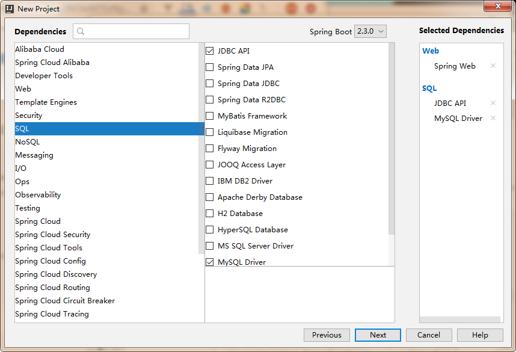

2. 项目建好之后，发现自动帮我们导入了如下的启动器：

   ```xml
   <dependency>
       <groupId>org.springframework.boot</groupId>
       <artifactId>spring-boot-starter-jdbc</artifactId>
   </dependency>
   <dependency>
       <groupId>mysql</groupId>
       <artifactId>mysql-connector-java</artifactId>
       <scope>runtime</scope>
   </dependency>
   ```

3. 编写yaml配置文件连接数据库；

   ```yaml
   spring:
     datasource:
       username: root
       password: admin
       #?serverTimezone=UTC解决时区的报错
       url: jdbc:mysql://localhost:3306/mybatis?serverTimezone=UTC&useUnicode=true&characterEncoding=utf-8
       driver-class-name: com.mysql.cj.jdbc.Driver
   ```

4. 配置完这一些东西后，我们就可以直接去使用了，因为SpringBoot已经默认帮我们进行了自动配置；去测试类测试一下

   ```java
   @SpringBootTest
   class SpringbootDataJdbcApplicationTests {
   
       //DI注入数据源
       @Autowired
       DataSource dataSource;
   
       @Test
       public void contextLoads() throws SQLException {
           //看一下默认数据源
           System.out.println(dataSource.getClass());
           //获得连接
           Connection connection = dataSource.getConnection();
           System.out.println(connection);
           //关闭连接
           connection.close();
       }
   }
   ```

   

结果：我们可以看到他默认给我们配置的数据源为 : class com.zaxxer.hikari.HikariDataSource ， 我们并没有手动配置

我们来全局搜索一下，找到数据源的所有自动配置都在 ：DataSourceAutoConfiguration文件：


```java
@Import(
    {Hikari.class, Tomcat.class, Dbcp2.class, Generic.class, DataSourceJmxConfiguration.class}
)
protected static class PooledDataSourceConfiguration {
    protected PooledDataSourceConfiguration() {
    }
}
```


这里导入的类都在 DataSourceConfiguration 配置类下，可以看出 Spring Boot 2.2.5 默认使用HikariDataSource 数据源，而以前版本，如 Spring Boot 1.5 默认使用 org.apache.tomcat.jdbc.pool.DataSource 作为数据源；

**<font color=red>HikariDataSource 号称 Java WEB 当前速度最快的数据源，相比于传统的 C3P0 、DBCP、Tomcat jdbc 等连接池更加优秀；</font>**

**可以使用 spring.datasource.type 指定自定义的数据源类型，值为 要使用的连接池实现的完全限定名。**


关于数据源我们并不做介绍，有了数据库连接，显然就可以 CRUD 操作数据库了。但是我们需要先了解一个对象 JdbcTemplate

#### JDBCTemplate

1. 有了数据源(com.zaxxer.hikari.HikariDataSource)，然后可以拿到数据库连接(java.sql.Connection)，有了连接，就可以使用原生的 JDBC 语句来操作数据库；

2. 即使不使用第三方第数据库操作框架，如 MyBatis等，Spring 本身也对原生的JDBC 做了轻量级的封装，即JdbcTemplate。

3. 数据库操作的所有 CRUD 方法都在 JdbcTemplate 中。

4. Spring Boot 不仅提供了默认的数据源，同时默认已经配置好了 JdbcTemplate 放在了容器中，程序员只需自己注入即可使用

5. JdbcTemplate 的自动配置是依赖 org.springframework.boot.autoconfigure.jdbc 包下的 JdbcTemplateConfiguration 类

**JdbcTemplate主要提供以下几类方法：**

- execute方法：可以用于执行任何SQL语句，一般用于执行DDL语句；
- update方法及batchUpdate方法：update方法用于执行新增、修改、删除等语句；batchUpdate方法用于执行批处理相关语句；
- query方法及queryForXXX方法：用于执行查询相关语句；
- call方法：用于执行存储过程、函数相关语句。

#### 测试

编写一个Controller，注入 jdbcTemplate，编写测试方法进行访问测试；

```java
package nuc.ss.controller;

import org.springframework.beans.factory.annotation.Autowired;
import org.springframework.jdbc.core.JdbcTemplate;
import org.springframework.web.bind.annotation.GetMapping;
import org.springframework.web.bind.annotation.PathVariable;
import org.springframework.web.bind.annotation.RestController;

import java.util.List;
import java.util.Map;

@RestController
public class JDBCController {

    @Autowired
    JdbcTemplate jdbcTemplate;

    // 查询数据库的所有信息
    // 没有实体类，获取数据库的东西，怎么获取？ Map
    @GetMapping("/userList")
    public List<Map<String,Object>> userList() {
        String sql = "select * from user";
        List<Map<String, Object>> maps = jdbcTemplate.queryForList(sql);
        return maps;
    }

    @GetMapping("/addUser")
    public String addUser() {
        String sql = "insert into mybatis.user(id, name, pwd) values(7,'小明','123456')";
        jdbcTemplate.update(sql);
        return "update-ok";
    }

    @GetMapping("/updateUser/{id}")
    public String updateUser(@PathVariable("id") int id) {
        String sql = "update mybatis.user set name  = ?,pwd = ? where id = " + id;
        //封装
        Object[] objects = new Object[2];

        objects[0] = "小明2";
        objects[1] = "aaaaaaa";

        jdbcTemplate.update(sql,objects);
        return "update-ok";
    }

    @GetMapping("/deleteUser/{id}")
    public String deleteUser(@PathVariable("id") int id) {
        String sql = "delete from mybatis.user where id = ?";
        jdbcTemplate.update(sql,id);
        return "update-ok";
    }
}

```

测试请求，结果正常；

到此，CURD的基本操作，使用 JDBC 就搞定了。


## SpringBoot整合DRUID数据源

### Druid简介

- Java程序很大一部分要操作数据库，为了提高性能操作数据库的时候，又不得不使用数据库连接池。

- Druid 是阿里巴巴开源平台上一个数据库连接池实现，结合了 C3P0、DBCP 等 DB 池的优点，同时加入了日志监控。

- Druid 可以很好的监控 DB 池连接和 SQL 的执行情况，天生就是针对监控而生的 DB 连接池。

- Druid已经在阿里巴巴部署了超过600个应用，经过一年多生产环境大规模部署的严苛考验。

- Spring Boot 2.0 以上默认使用 Hikari 数据源，可以说 Hikari 与 Driud 都是当前 Java Web 上最优秀的数据源，我们来重点介绍 Spring Boot 如何集成 Druid 数据源，如何实现数据库监控。

- Github地址：https://github.com/alibaba/druid/

**com.alibaba.druid.pool.DruidDataSource 基本配置参数如下：**

|           **配置**            |      **缺省值**       | **说明**                                                     |
| :---------------------------: | :-------------------: | ------------------------------------------------------------ |
|             name              |                       | 配置这个属性的意义在于，如果存在多个数据源，监控的时候可以通过名字来区分开来。 如果没有配置，将会生成一个名字，格式是：“DataSource-” + System.identityHashCode(this) |
|            jdbcUrl            |                       | 连接数据库的url，不同数据库不一样。例如： mysql : jdbc:mysql://10.20.153.104:3306/druid2 oracle : jdbc:oracle:thin:@10.20.149.85:1521:ocnauto |
|           username            |                       | 连接数据库的用户名                                           |
|           password            |                       | 连接数据库的密码。如果你不希望密码直接写在配置文件中，可以使用ConfigFilter。详细看这里：[https://github.com/alibaba/druid/wiki/%E4%BD%BF%E7%94%A8ConfigFilter](https://github.com/alibaba/druid/wiki/%E4%BD%BF%E7%94%A8ConfigFilter) |
|        driverClassName        |    根据url自动识别    | 这一项可配可不配，如果不配置druid会根据url自动识别dbType，然后选择相应的driverClassName(建议配置下) |
|          initialSize          |           0           | 初始化时建立物理连接的个数。初始化发生在显示调用init方法，或者第一次getConnection时 |
|           maxActive           |           8           | 最大连接池数量                                               |
|            maxIdle            |           8           | 已经不再使用，配置了也没效果                                 |
|            minIdle            |                       | 最小连接池数量                                               |
|            maxWait            |                       | 获取连接时最大等待时间，单位毫秒。配置了maxWait之后，缺省启用公平锁，并发效率会有所下降，如果需要可以通过配置useUnfairLock属性为true使用非公平锁。 |
|    poolPreparedStatements     |         false         | 是否缓存preparedStatement，也就是PSCache。PSCache对支持游标的数据库性能提升巨大，比如说oracle。在mysql下建议关闭。 |
|   maxOpenPreparedStatements   |          -1           | 要启用PSCache，必须配置大于0，当大于0时，poolPreparedStatements自动触发修改为true。在Druid中，不会存在Oracle下PSCache占用内存过多的问题，可以把这个数值配置大一些，比如说100 |
|        validationQuery        |                       | 用来检测连接是否有效的sql，要求是一个查询语句。如果validationQuery为null，testOnBorrow、testOnReturn、testWhileIdle都不会其作用。 |
|    validationQueryTimeout     |                       | 单位:秒，检测连接是否有效的超时时间。底层调用jdbc<br/>Statement对象的void setQueryTimeout(int seconds)方法 |
|         testOnBorrow          |         true          | 申请连接时执行validationQuery检测连接是否有效，做了这个配置会降低性能 |
|         testOnReturn          |         false         | 归还连接时执行validationQuery检测连接是否有效，做了这个配置会降低性能 |
|         testWhileIdle         |         false         | 建议配置为true，不影响性能，并且保证安全性。申请连接的时候检测，如果空闲时间大于timeBetweenEvictionRunsMillis，执行validationQuery检测连接是否有效 |
| timeBetweenEvictionRunsMillis | 1分钟<br/>( 1.0.14 )  | 有两个含义： 1) Destroy线程会检测连接的间隔时间 2) testWhileIdle的判断依据，详细看testWhileIdle属性的说明 |
|    numTestsPerEvictionRun     |                       | 不再使用，一个DruidDataSource只支持一个EvictionRun           |
|  minEvictableIdleTimeMillis   | 30分钟<br/>( 1.0.14 ) | 连接保持空闲而不被驱逐的最长时间                             |
|      connectionInitSqls       |                       | 物理连接初始化的时候执行的sql                                |
|        exceptionSorter        |  根据dbType自动识别   | 当数据库抛出一些不可恢复的异常时，抛弃连接                   |
|            filters            |                       | 属性类型是字符串，通过别名的方式配置扩展插件，常用的插件有： 监控统计用的filter:stat日志用的filter:log4j防御sql注入的filter:wall |
|         proxyFilters          |                       | 类型是List<com.alibaba.druid.filter.Filter>，如果同时配置了filters和proxyFilters，是组合关系，并非替换关系 |


### 配置数据源

1. 添加上 Druid 数据源依赖，这个依赖可以从Maven仓库官网[<font color=red>Maven Respository</font>](https://mvnrepository.com/artifact/com.alibaba/druid)中获取

   ```xml
   <dependency>
       <groupId>com.alibaba</groupId>
       <artifactId>druid</artifactId>
       <version>1.1.23</version>
   </dependency>
   ```

   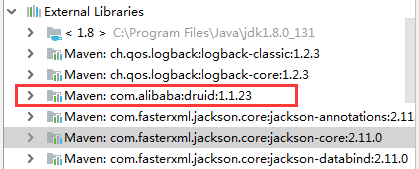

2. 切换数据源；之前已经说过 Spring Boot 2.0 以上默认使用 `com.zaxxer.hikari.HikariDataSource `数据源，但可以通过 `spring.datasource.type` 指定数据源。

   ```yam
   spring:
     datasource:
       username: root
       password: 123456
       url: jdbc:mysql://localhost:3306/springboot?serverTimezone=UTC&useUnicode=true&characterEncoding=utf-8
       driver-class-name: com.mysql.cj.jdbc.Driver
       type: com.alibaba.druid.pool.DruidDataSource # 自定义数据源
   ```

3. 数据源切换之后，在测试类中注入 DataSource，然后获取到它，输出一看便知是否成功切换；

   

4. 切换成功！既然切换成功，就可以设置数据源连接初始化大小、最大连接数、等待时间、最小连接数 等设置项；可以查看源码

   ```yaml
   spring:
     datasource:
       username: root
       password: 123456
       #?serverTimezone=UTC解决时区的报错
       url: jdbc:mysql://localhost:3306/springboot?serverTimezone=UTC&useUnicode=true&characterEncoding=utf-8
       driver-class-name: com.mysql.cj.jdbc.Driver
       type: com.alibaba.druid.pool.DruidDataSource
   
       #Spring Boot 默认是不注入这些属性值的，需要自己绑定
       #druid 数据源专有配置
       initialSize: 5
       minIdle: 5
       maxActive: 20
       maxWait: 60000
       timeBetweenEvictionRunsMillis: 60000
       minEvictableIdleTimeMillis: 300000
       validationQuery: SELECT 1 FROM DUAL
       testWhileIdle: true
       testOnBorrow: false
       testOnReturn: false
       poolPreparedStatements: true
   
       #配置监控统计拦截的filters，stat:监控统计、log4j：日志记录、wall：防御sql注入
       #如果允许时报错  java.lang.ClassNotFoundException: org.apache.log4j.Priority
       #则导入 log4j 依赖即可，Maven 地址：https://mvnrepository.com/artifact/log4j/log4j
       filters: stat,wall,log4j
       maxPoolPreparedStatementPerConnectionSize: 20
       useGlobalDataSourceStat: true
       connectionProperties: druid.stat.mergeSql=true;druid.stat.slowSqlMillis=500
   ```

5. 导入Log4j 的依赖

   ```xml
   <!-- https://mvnrepository.com/artifact/log4j/log4j -->
   <dependency>
       <groupId>log4j</groupId>
       <artifactId>log4j</artifactId>
       <version>1.2.17</version>
   </dependency>
   ```

6. 现在需要程序员自己为 DruidDataSource 绑定全局配置文件中的参数，再添加到容器中，而不再使用 Spring Boot 的自动生成了；我们需要 自己添加 DruidDataSource 组件到容器中，并绑定属性；

   ```java
   package nuc.ss.config;
   
   import com.alibaba.druid.pool.DruidDataSource;
   import org.springframework.boot.context.properties.ConfigurationProperties;
   import org.springframework.context.annotation.Bean;
   import org.springframework.context.annotation.Configuration;
   
   import javax.sql.DataSource;
   
   @Configuration
   public class DruidConfig {
   
       /*
          将自定义的 Druid数据源添加到容器中，不再让 Spring Boot 自动创建
          绑定全局配置文件中的 druid 数据源属性到 com.alibaba.druid.pool.DruidDataSource从而让它们生效
          @ConfigurationProperties(prefix = "spring.datasource")：作用就是将 全局配置文件中
          前缀为 spring.datasource的属性值注入到 com.alibaba.druid.pool.DruidDataSource 的同名参数中
        */
       @ConfigurationProperties(prefix = "spring.datasource")
       @Bean
       public DataSource druidDataSource() {
           return new DruidDataSource();
       }
   
   }
   ```

7. 去测试类中测试一下；看是否成功！

   ```java
   @SpringBootTest
   class SpringbootDataJdbcApplicationTests {
   
       //DI注入数据源
       @Autowired
       DataSource dataSource;
   
       @Test
       public void contextLoads() throws SQLException {
           //看一下默认数据源
           System.out.println(dataSource.getClass());
           //获得连接
           Connection connection =   dataSource.getConnection();
           System.out.println(connection);
   
           DruidDataSource druidDataSource = (DruidDataSource) dataSource;
           System.out.println("druidDataSource 数据源最大连接数：" + druidDataSource.getMaxActive());
           System.out.println("druidDataSource 数据源初始化连接数：" + druidDataSource.getInitialSize());
   
           //关闭连接
           connection.close();
       }
   }
   ```

8. 输出结果 ：可见配置参数已经生效！

   

### 配置Druid数据源监控

Druid 数据源具有监控的功能，并提供了一个 web 界面方便用户查看，类似安装 路由器 时，人家也提供了一个默认的 web 页面。

所以第一步需要设置 Druid 的后台管理页面，比如 登录账号、密码 等；配置后台管理；

```java
//配置 Druid 监控管理后台的Servlet；
//内置 Servlet 容器时没有web.xml文件，所以使用 Spring Boot 的注册 Servlet 方式
@Bean
public ServletRegistrationBean statViewServlet() {
    ServletRegistrationBean bean = new ServletRegistrationBean(new StatViewServlet(), "/druid/*");

    // 这些参数可以在 com.alibaba.druid.support.http.StatViewServlet 
    // 的父类 com.alibaba.druid.support.http.ResourceServlet 中找到
    Map<String, String> initParams = new HashMap<>();
    initParams.put("loginUsername", "root"); //后台管理界面的登录账号
    initParams.put("loginPassword", "admin"); //后台管理界面的登录密码

    //后台允许谁可以访问
    //initParams.put("allow", "localhost")：表示只有本机可以访问
    //initParams.put("allow", "")：为空或者为null时，表示允许所有访问
    initParams.put("allow", "");
    //deny：Druid 后台拒绝谁访问
    //initParams.put("kuangshen", "192.168.1.20");表示禁止此ip访问

    //设置初始化参数
    bean.setInitParameters(initParams);
    return bean;
}
```

配置完毕后，我们可以选择访问 ：[http://localhost:8080/druid/login.html](http://localhost:8080/druid/login.html)


进入之后


**配置 Druid web 监控 filter 过滤器**

```java
//配置 Druid 监控 之  web 监控的 filter
//WebStatFilter：用于配置Web和Druid数据源之间的管理关联监控统计
@Bean
public FilterRegistrationBean webStatFilter() {
    FilterRegistrationBean bean = new FilterRegistrationBean();
    bean.setFilter(new WebStatFilter());

    //exclusions：设置哪些请求进行过滤排除掉，从而不进行统计
    Map<String, String> initParams = new HashMap<>();
    initParams.put("exclusions", "*.js,*.css,/druid/*,/jdbc/*");
    bean.setInitParameters(initParams);

    //"/*" 表示过滤所有请求
    bean.setUrlPatterns(Arrays.asList("/*"));
    return bean;
}
```


## SpringBoot整合MyBatis


官方文档：[http://mybatis.org/spring-boot-starter/mybatis-spring-boot-autoconfigure/](http://mybatis.org/spring-boot-starter/mybatis-spring-boot-autoconfigure/)

Maven仓库地址：[https://mvnrepository.com/artifact/org.mybatis.spring.boot/mybatis-spring-boot-starter/2.1.3](https://mvnrepository.com/artifact/org.mybatis.spring.boot/mybatis-spring-boot-starter/2.1.3)


### 整合测试

1. 导入 MyBatis 所需要的依赖

   ```xml
   <dependency>
       <groupId>org.mybatis.spring.boot</groupId>
       <artifactId>mybatis-spring-boot-starter</artifactId>
       <version>2.1.3</version>
   </dependency>
   ```

2. 配置数据库连接信息（不变）

   ```yaml
   spring:
     datasource:
       username: root
       password: admin
       #?serverTimezone=UTC解决时区的报错
       url: jdbc:mysql://localhost:3306/mybatis?serverTimezone=UTC&useUnicode=true&characterEncoding=utf-8
       driver-class-name: com.mysql.cj.jdbc.Driver
       type: com.alibaba.druid.pool.DruidDataSource
   
       #Spring Boot 默认是不注入这些属性值的，需要自己绑定
       #druid 数据源专有配置
       initialSize: 5
       minIdle: 5
       maxActive: 20
       maxWait: 60000
       timeBetweenEvictionRunsMillis: 60000
       minEvictableIdleTimeMillis: 300000
       validationQuery: SELECT 1 FROM DUAL
       testWhileIdle: true
       testOnBorrow: false
       testOnReturn: false
       poolPreparedStatements: true
   
       #配置监控统计拦截的filters，stat:监控统计、log4j：日志记录、wall：防御sql注入
       #如果允许时报错  java.lang.ClassNotFoundException: org.apache.log4j.Priority
       #则导入 log4j 依赖即可，Maven 地址：https://mvnrepository.com/artifact/log4j/log4j
       filters: stat,wall,log4j
       maxPoolPreparedStatementPerConnectionSize: 20
       useGlobalDataSourceStat: true
       connectionProperties: druid.stat.mergeSql=true;druid.stat.slowSqlMillis=500
   ```

3. **测试数据库是否连接成功！**

4. **创建实体类，导入 Lombok！**

   `User.java`

   ```java
   package nuc.ss.pojo;
   
   import lombok.AllArgsConstructor;
   import lombok.Data;
   import lombok.NoArgsConstructor;
   
   @Data
   @AllArgsConstructor
   @NoArgsConstructor
   public class User {
       private int id;
       private String name;
       private String pwd;
   }
   ```

5. **创建mapper目录以及对应的 Mapper 接口**

   `UserMapper.java`

   ```java
   package nuc.ss.mapper;
   
   import nuc.ss.pojo.User;
   import org.apache.ibatis.annotations.Mapper;
   import org.springframework.stereotype.Repository;
   
   import java.util.List;
   
   // 这个注解表示了这是一个 mybatis 的 mapper 类
   @Mapper
   @Repository
   public interface UserMapper {
   
       List<User> queryUserList();
   
       User queryUserById(int id);
   
       int addUser(User user);
   
       int updateUser(User user);
   
       int deleteUser(int id);
   }
   ```

6. **对应的Mapper映射文件**

   `UserMapper.xml`

   ```xml
   <?xml version="1.0" encoding="UTF-8" ?>
   <!DOCTYPE mapper
           PUBLIC "-//mybatis.org//DTD Mapper 3.0//EN"
           "http://mybatis.org/dtd/mybatis-3-mapper.dtd">
   <!--namespace=绑定一个对应的Dao/Mapper接口-->
   <mapper namespace="nuc.ss.mapper.UserMapper">
       
       <select id="queryUserList" resultType="User">
           select * from mybatis.user;
       </select>
   
       <select id="queryUserById" resultType="User">
           select * from mybatis.user where id = #{id};
       </select>
   
       <insert id="addUser" parameterType="User">
           insert into mybatis.user (id, name, pwd) values (#{id},#{name},#{pwd});
       </insert>
   
       <update id="updateUser" parameterType="User">
           update mybatis.user set name=#{name},pwd = #{pwd} where id = #{id};
       </update>
   
       <delete id="deleteUser" parameterType="int">
           delete from mybatis.user where id = #{id}
       </delete>
   </mapper>
   ```

7. **maven配置资源过滤问题**

   ```xml
   <resources>
       <resource>
           <directory>src/main/java</directory>
           <includes>
               <include>**/*.xml</include>
           </includes>
           <filtering>true</filtering>
       </resource>
   </resources>
   ```

8. 在 `application.yml`中配置 Mybatis

   ```yaml
   mybatis:
     type-aliases-package: com.dt.pojo
     mapper-locations: classpath:mybatis/mapper/*.xml
   ```

9. **编写部门的 UserController 进行测试！**

   ```java
   @RestController
   public class UserController {
       @Autowired
       private UserMapper userMapper;
   
       @GetMapping("/queryUserList")
       public List<User> queryUserList() {
           List<User> userList = userMapper.queryUserList();
   
           for (User user : userList) {
               System.out.println(user);
           }
   
           return userList;
       }
       
        //添加一个用户
       @GetMapping("/addUser")
       public String addUser() {
           userMapper.addUser(new User(7,"阿毛","123456"));
           return "ok";
       }
   
       //修改一个用户
       @GetMapping("/updateUser")
       public String updateUser() {
           userMapper.updateUser(new User(7,"阿毛","123456"));
           return "ok";
       }
   
       @GetMapping("/deleteUser")
       public String deleteUser() {
           userMapper.deleteUser(7);
   
           return "ok";
       }
   }
   ```

**启动项目访问进行测试！**


## SpringBoot整合Swagger

[SpringBoot14：集成Swagger终极版](https://mp.weixin.qq.com/s?__biz=Mzg2NTAzMTExNg==&mid=2247483909&idx=1&sn=201ee629b9ce3b9276a263e18812e607&scene=19#wechat_redirect)

- 了解Swagger的概念及作用
- 了解前后端分离
- 在springboot中集成swagger


### Swagger简介

**前后端分离**

Vue+SpringBoot

后端时代：前端只用管理静态页面；html==>后端。模板引擎JSP=>后端才是主力

**前后端分离时代**

- 前端 -> 前端控制层、视图层
  - 伪造后端数据，json。已经存在了，不需要后端，前端工程队依旧能够跑起来
- 后端 -> 后端控制层、服务层、数据访问层
- 前后端通过API进行交互
- 前后端相对独立且松耦合

**产生的问题**

- 前后端集成联调，前端或者后端无法做到“及时协商，尽早解决”，最终导致问题集中爆发

**解决方案**

- 首先定义schema [ 计划的提纲 ]，并实时跟踪最新的API，降低集成风险；
- 早些年：指定word计划文档；
- 前后端分离：
  - 前端测试后端接口：postman
  - 后端提供接口，需要实时更新最新的消息及改动

### Swagger

- 号称世界上最流行的API框架
- Restful Api 文档在线自动生成器 => <font color=red>**API 文档 与API 定义同步更新**</font>
- 直接运行，在线测试API
- 支持多种语言 （如：Java，PHP等）
- 官网：https://swagger.io/

### SpringBoot集成Swagger

**SpringBoot集成Swagger** => **springfox**，两个jar包

- **[Springfox-swagger2](https://mvnrepository.com/artifact/io.springfox/springfox-swagger2)**
- [springfox-swagger-ui](https://mvnrepository.com/artifact/io.springfox/springfox-swagger-ui)

**使用Swagger**

要求：jdk 1.8 + 否则swagger2无法运行

步骤：

1. 新建一个SpringBoot-web项目

2. 添加Maven依赖（<font color=red>注意：2.9.2版本之前，之后的不行</font>）

   ```java
   <dependency>
      <groupId>io.springfox</groupId>
      <artifactId>springfox-swagger2</artifactId>
      <version>2.9.2</version>
   </dependency>
   
   <dependency>
      <groupId>io.springfox</groupId>
      <artifactId>springfox-swagger-ui</artifactId>
      <version>2.9.2</version>
   </dependency>
   ```

3. 编写HelloController，测试确保运行成功！

4. 要使用Swagger，我们需要编写一个配置类-SwaggerConfig来配置 Swagger

   ```java
   @Configuration //配置类
   @EnableSwagger2// 开启Swagger2的自动配置
   public class SwaggerConfig {  
   }
   ```

5. 访问测试 ：http://localhost:8080/swagger-ui.html ，可以看到swagger的界面；

   

### 配置Swagger

1. Swagger实例Bean是Docket，所以通过配置Docket实例来配置Swaggger。

   ```java
   @Bean //配置docket以配置Swagger具体参数
   public Docket docket() {
      return new Docket(DocumentationType.SWAGGER_2);
   }
   ```

2. 可以通过apiInfo()属性配置文档信息

   ```java
   //配置文档信息
   private ApiInfo apiInfo() {
      Contact contact = new Contact("联系人名字", "http://xxx.xxx.com/联系人访问链接", "联系人邮箱");
      return new ApiInfo(
              "Swagger学习", // 标题
              "学习演示如何配置Swagger", // 描述
              "v1.0", // 版本
              "http://terms.service.url/组织链接", // 组织链接
              contact, // 联系人信息
              "Apach 2.0 许可", // 许可
              "许可链接", // 许可连接
              new ArrayList<>()// 扩展
     );
   }
   ```

3. Docket 实例关联上 apiInfo()

   ```java
   @Bean
   public Docket docket() {
      return new Docket(DocumentationType.SWAGGER_2).apiInfo(apiInfo());
   }
   ```

4. 重启项目，访问测试 http://localhost:8080/swagger-ui.html  看下效果；

   

### 配置扫描接口

1. 构建Docket时通过select()方法配置怎么扫描接口。

   ```java
   @Bean
   public Docket docket() {
      return new Docket(DocumentationType.SWAGGER_2)
         .apiInfo(apiInfo())
         .select()// 通过.select()方法，去配置扫描接口,RequestHandlerSelectors配置如何扫描接口
         .apis(RequestHandlerSelectors.basePackage("nuc.ss.swagger.controller"))
         .build();
   }
   ```

2. 重启项目测试，由于我们配置根据包的路径扫描接口，所以我们只能看到一个类

   

3. 除了通过包路径配置扫描接口外，还可以通过配置其他方式扫描接口，这里注释一下所有的配置方式：

   ```java
   basePackage(final String basePackage) // 根据包路径扫描接口
   any() // 扫描所有，项目中的所有接口都会被扫描到
   none() // 不扫描接口
   // 通过方法上的注解扫描，如withMethodAnnotation(GetMapping.class)只扫描get请求
   withMethodAnnotation(final Class<? extends Annotation> annotation)
   // 通过类上的注解扫描，如.withClassAnnotation(Controller.class)只扫描有controller注解的类中的接口
   withClassAnnotation(final Class<? extends Annotation> annotation)
   ```

4. 除此之外，我们还可以配置接口扫描过滤：

   ```java
   @Bean
   public Docket docket() {
      return new Docket(DocumentationType.SWAGGER_2)
         .apiInfo(apiInfo())
         .select()
         .apis(RequestHandlerSelectors.basePackage("com.kuang.swagger.controller"))
          // 配置如何通过path过滤,即这里只扫描请求以/ss开头的接口
         .paths(PathSelectors.ant("/ss/**"))
         .build();
   }
   ```

5. 这里的可选值还有

   ```java
   any() // 任何请求都扫描
   none() // 任何请求都不扫描
   regex(final String pathRegex) // 通过正则表达式控制
   ant(final String antPattern) // 通过ant()控制
   ```

   

### 配置Swagger开关

1. 通过enable()方法配置是否启用swagger，如果是false，swagger将不能在浏览器中访问了

   ```java
   @Bean
   public Docket docket() {
      return new Docket(DocumentationType.SWAGGER_2)
         .apiInfo(apiInfo())
         .enable(false) //配置是否启用Swagger，如果是false，在浏览器将无法访问
         .select()
         .apis(RequestHandlerSelectors.basePackage("nuc.ss.swagger.controller"))
         .paths(PathSelectors.ant("/ss/**"))
         .build();
   }
   ```


2. 如何动态配置当项目处于test、dev环境时显示swagger，处于prod时不显示？

   ```java
   @Bean
   public Docket docket(Environment environment) {
      // 设置要显示swagger的环境
      Profiles of = Profiles.of("dev", "test");
      // 判断当前是否处于该环境
      // 通过 enable() 接收此参数判断是否要显示
      boolean b = environment.acceptsProfiles(of);
      
      return new Docket(DocumentationType.SWAGGER_2)
         .apiInfo(apiInfo())
         .enable(b)
         .select()
         .apis(RequestHandlerSelectors.basePackage("com.kuang.swagger.controller"))
         .paths(PathSelectors.ant("/ss/**"))
         .build();
   }
   ```

3. 可以在项目中增加配置文件

   - dev测试环境

     ```properties
     server.port=8081
     ```

     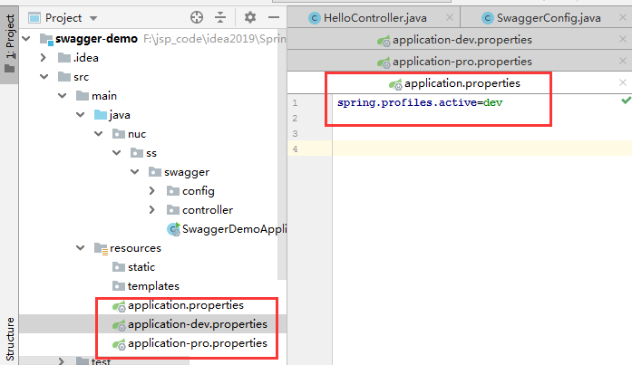

     项目运行结果

     

   - pro测试环境

     ```properties
     server.port=8082
     ```

     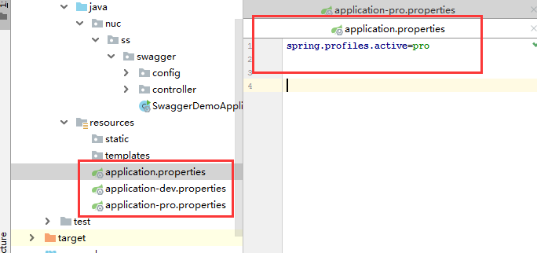

     项目运行结果

     

### 配置API分组

1. 如果没有配置分组，默认是default。通过groupName()方法即可配置分组：

   ```java
   @Bean
   public Docket docket(Environment environment) {
      return new Docket(DocumentationType.SWAGGER_2).apiInfo(apiInfo())
         .groupName("狂神") // 配置分组
          // 省略配置....
   }
   ```

2. 重启项目查看分组

   

3. 如何配置多个分组？配置多个分组只需要配置多个docket即可：

   ```java
   @Bean
   public Docket docket1(){
      return new Docket(DocumentationType.SWAGGER_2).groupName("group1");
   }
   @Bean
   public Docket docket2(){
      return new Docket(DocumentationType.SWAGGER_2).groupName("group2");
   }
   @Bean
   public Docket docket3(){
      return new Docket(DocumentationType.SWAGGER_2).groupName("group3");
   }
   ```

4. 重启项目查看即可

   

### 实体配置

1. 新建一个实体类

   ```java
   //@Api("注释")
   @ApiModel("用户实体")
   public class User {
       @ApiModelProperty("用户名")
       private String username;
       @ApiModelProperty("密码")
       private String password;
   
       public String getUsername() {
           return username;
       }
   
       public void setUsername(String username) {
           this.username = username;
       }
   
       public String getPassword() {
           return password;
       }
   
       public void setPassword(String password) {
           this.password = password;
       }
   }
   ```

2. 只要这个实体在**请求接口**的返回值上（即使是泛型），都能映射到实体项中：

   ```java
   @RestController
   public class HelloController {
   
       //   /error默认错误请求
       @GetMapping("/hello")
       public String hello() {
           return "hello";
       }
   
       //只要我们的接口中，返回值中存在实体类，他就会被扫描到Swagger中
       @PostMapping("/user")
       public User user() {
           return new User();
       }
   }
   ```

3. 重启查看测试

   

<font color=red>注：并不是因为@ApiModel这个注解让实体显示在这里了，而是只要出现在接口方法的返回值上的实体都会显示在这里，而@ApiModel和@ApiModelProperty这两个注解只是为实体添加注释的</font>。

- @ApiModel为类添加注释

- @ApiModelProperty为类属性添加注释

**总结：**

- 我们可以通过Swagger给一些比较难理解的接口或者属性，增加注释信息
- 接口文档实时更新
- 可以在线测试

Swagger是一个优秀的工具，几乎所有大公司都有使用它

<font color=red>【注意点】：在正式发布的时候，关闭Swagger！！！</font>

- 出于安全考虑
- 而且节省内存

### 常用注解

Swagger的所有注解定义在io.swagger.annotations包下

下面列一些经常用到的，未列举出来的可以另行查阅说明：

| Swagger注解                                            | 简单说明                                             |
| ------------------------------------------------------ | ---------------------------------------------------- |
| @Api(tags = "xxx模块说明")                             | 作用在模块类上                                       |
| @ApiOperation("xxx接口说明")                           | 作用在接口方法上                                     |
| @ApiModel("xxxPOJO说明")                               | 作用在模型类上：如VO、BO                             |
| @ApiModelProperty(value = "xxx属性说明",hidden = true) | 作用在类方法和属性上，hidden设置为true可以隐藏该属性 |
| @ApiParam("xxx参数说明")                               | 作用在参数、方法和字段上，类似@ApiModelProperty      |

我们也可以给请求的接口配置一些注释

1. 在HelloController控制类中的接口添加api接口注释

   ```java
   @RestController
   public class HelloController {
       ......
       @ApiOperation("Hello控制接口")
       @GetMapping("/hello")
       public String hello2(@ApiParam("用户名") String username) {
           return "hello" + username;
       }
       
       @ApiOperation("get测试")
       @GetMapping("/get")
       public User hello2(@ApiParam("用户") User user) {
           return user;
       }
   }
   ```

   

2. 进行try it out测试

   

   测试结果

   

**总结：**

1. 这样的话，可以给一些比较难理解的属性或者接口，增加一些配置信息，让人更容易阅读！

2. 相较于传统的Postman或Curl方式测试接口，使用swagger简直就是傻瓜式操作，不需要额外说明文档(写得好本身就是文档)而且更不容易出错，只需要录入数据然后点击Execute，如果再配合自动化框架，可以说基本就不需要人为操作了。

3. Swagger是个优秀的工具，现在国内已经有很多的中小型互联网公司都在使用它，相较于传统的要先出Word接口文档再测试的方式，显然这样也更符合现在的快速迭代开发行情。当然了，提醒下大家在正式环境要记得关闭Swagger，一来出于安全考虑二来也可以节省运行时内存。

### 拓展：其他皮肤

我们可以导入不同的包实现不同的皮肤定义：

1、默认的  **访问 http://localhost:8080/swagger-ui.html**

```xml
<dependency> 
   <groupId>io.springfox</groupId>
   <artifactId>springfox-swagger-ui</artifactId>
   <version>2.9.2</version>
</dependency>
```


2、bootstrap-ui  **访问 http://localhost:8080/doc.html**

```xml
<!-- 引入swagger-bootstrap-ui包 /doc.html-->
<dependency>
   <groupId>com.github.xiaoymin</groupId>
   <artifactId>swagger-bootstrap-ui</artifactId>
   <version>1.9.1</version>
</dependency>
```


3、Layui-ui  **访问 http://localhost:8080/docs.html**

```xml
<!-- 引入swagger-ui-layer包 /docs.html-->
<dependency>
   <groupId>com.github.caspar-chen</groupId>
   <artifactId>swagger-ui-layer</artifactId>
   <version>1.1.3</version>
</dependency>
```

- <font color=red>我这个测试没成功(Layui-ui)</font>

4、mg-ui  **访问 http://localhost:8080/document.html**

```xml
<!-- 引入swagger-ui-layer包 /document.html-->
<dependency>
   <groupId>com.zyplayer</groupId>
   <artifactId>swagger-mg-ui</artifactId>
   <version>1.0.6</version>
</dependency>
```


### Swagger配置示例

```java
package com.csu.mypetstoreclientbackend.config;

import org.springframework.context.annotation.Bean;
import org.springframework.context.annotation.Configuration;
import springfox.documentation.builders.ApiInfoBuilder;
import springfox.documentation.builders.PathSelectors;
import springfox.documentation.builders.RequestHandlerSelectors;
import springfox.documentation.service.ApiInfo;
import springfox.documentation.spi.DocumentationType;
import springfox.documentation.spring.web.plugins.Docket;
import springfox.documentation.swagger2.annotations.EnableSwagger2;

/**
 * @author: newfbin
 * @create: 2024-04-10 14:29
 * @Description: Swagger配置类
 */
@Configuration
@EnableSwagger2 //启用swagger2功能
public class Swagger2Config {
    @Bean
    public Docket createRestApi(){
        return new Docket(DocumentationType.SWAGGER_2)
                //api信息
                .apiInfo(apiInfo())
                //构建api选择器
                .select()
                //api选择器选择api的包,com包下的所有API交给swagger2管理
                .apis(RequestHandlerSelectors.basePackage("com"))
                //api选择器选择包路径下任何api显示在文档中
                .paths(PathSelectors.any())
                //创建文档
                .build();
    }

    //以下代码用于测试分组
/*    @Bean
    public Docket docket1(){
        return new Docket(DocumentationType.SWAGGER_2).groupName("group1");
    }
    @Bean
    public Docket docket2(){
        return new Docket(DocumentationType.SWAGGER_2).groupName("group2");
    }
    @Bean
    public Docket docket3(){
        return new Docket(DocumentationType.SWAGGER_2).groupName("group3");
    }*/

    private ApiInfo apiInfo(){
        return new ApiInfoBuilder()
                .title("MyPetStore客户端接口")
                .description("接口描述")
                .termsOfServiceUrl("termsOfServiceUrl")
                .version("1.0")
                .license("http://springfox.github.io/springfox/docs/current/")
                .licenseUrl("http://springfox.github.io/springfox/docs/current/")
                .build();
    }

}

```

## SpringBoot整合Knife4j

一般在使用 Spring Boot 开发前后端分离项目的时候，都会用到 [Swagger](https://javabetter.cn/springboot/swagger.html)（戳链接详细了解）。

但随着系统功能的不断增加，接口数量的爆炸式增长，Swagger 的使用体验就会变得越来越差，比如请求参数为 JSON 的时候没办法格式化，返回结果没办法折叠，还有就是没有提供搜索功能。

今天我们介绍的主角 Knife4j 弥补了这些不足，赋予了 Swagger 更强的生命力和表现力。

### 关于 Knife4j

Knife4j 的前身是 swagger-bootstrap-ui，是 springfox-swagger-ui 的增强 UI 实现。swagger-bootstrap-ui 采用的是前端 UI 混合后端 Java 代码的打包方式，在微服务的场景下显得非常臃肿，改良后的 Knife4j 更加小巧、轻量，并且功能更加强大。

springfox-swagger-ui 的界面长这个样子，说实话，确实略显丑陋。


swagger-bootstrap-ui 增强后的样子长下面这样。单纯从直观体验上来看，确实增强了。


那改良后的 Knife4j 不仅在界面上更加优雅、炫酷，功能上也更加强大：后端 Java 代码和前端 UI 模块分离了出来，在微服务场景下更加灵活；还提供了专注于 Swagger 的增强解决方案。


官方文档：

> https://doc.xiaominfo.com/knife4j/documentation/

码云地址：

> https://gitee.com/xiaoym/knife4j

示例地址：

> https://gitee.com/xiaoym/swagger-bootstrap-ui-demo

### 整合 Knife4j

Knife4j 完全遵循了 Swagger 的使用方式，所以可以无缝切换。

第一步，在 pom.xml 文件中添加 Knife4j 的依赖（**不需要再引入 springfox-boot-starter**了，因为 Knife4j 的 starter 里面已经加入过了）。

#### Knife4J 2 配置

```xml
        <dependency>
            <groupId>com.github.xiaoymin</groupId>
            <artifactId>knife4j-spring-boot-starter</artifactId>
            <version>2.0.7</version>
        </dependency>
```

```java
package com.yupi.springbootinit.config;

import org.springframework.context.annotation.Bean;
import org.springframework.context.annotation.Configuration;
import org.springframework.context.annotation.Profile;
import springfox.documentation.builders.ApiInfoBuilder;
import springfox.documentation.builders.PathSelectors;
import springfox.documentation.builders.RequestHandlerSelectors;
import springfox.documentation.service.ApiInfo;
import springfox.documentation.service.Contact;
import springfox.documentation.spi.DocumentationType;
import springfox.documentation.spring.web.plugins.Docket;
import springfox.documentation.swagger2.annotations.EnableSwagger2WebMvc;


@Configuration
@EnableSwagger2WebMvc
@Profile({"dev", "test"})   //版本控制访问
public class SwaggerConfig {
    @Bean(value = "defaultApi2")
    public Docket defaultApi2() {
        //DocumentationType.SWAGGER_2对应的是swagger2配置
        return new Docket(DocumentationType.SWAGGER_2)
                .apiInfo(apiInfo())
                .select()
                // 这里一定要标注你控制器的位置
                .apis(RequestHandlerSelectors.basePackage("com.yupi.springbootinit.controller"))
                .paths(PathSelectors.any())
                .build();
    }

    /**
     * api 信息
     * @return
     */
    private ApiInfo apiInfo() {
        return new ApiInfoBuilder()
                .title("鱼皮用户中心")
                .description("鱼皮用户中心接口文档")
                .termsOfServiceUrl("https://github.com/liyupi")
                .contact(new Contact("shayu","https://shayuyu.cn/","shayu-yusha@qq.com"))
                .version("1.0")
                .build();
    }
}


```


#### Knife4j 3 配置

```xml
<dependency>
    <groupId>com.github.xiaoymin</groupId>
    <artifactId>knife4j-spring-boot-starter</artifactId>
    <!--在引用时请在maven中央仓库搜索3.X最新版本号-->
    <version>3.0.2</version>
</dependency>
```

第二步，配置类 SwaggerConfig 还是 Swagger 时期原来的配方。

```java
@Configuration
@EnableOpenApi
public class SwaggerConfig {
    @Bean
    public Docket docket() {
        //DocumentationType.OAS_30对应的是swagger3配置
        Docket docket = new Docket(DocumentationType.OAS_30)
                .apiInfo(apiInfo()).enable(true)
                .select()
                //apis： 添加swagger接口提取范围
                .apis(RequestHandlerSelectors.basePackage("top.codingmore.controller"))
                .paths(PathSelectors.any())
                .build();

        return docket;
    }

    private ApiInfo apiInfo() {
        return new ApiInfoBuilder()
                .title("编程猫实战项目笔记")
                .description("编程喵是一个 Spring Boot+Vue 的前后端分离项目")
                .contact(new Contact("沉默王二", "https://codingmore.top","www.qing_gee@163.com"))
                .version("v1.0")
                .build();
    }
}
```

第三步，新建测试控制器类 Knife4jController.java：

```java
@Api(tags = "测试 Knife4j")
@RestController
@RequestMapping("/knife4j")
public class Knife4jController {

    @ApiOperation("测试")
    @RequestMapping(value ="/test", method = RequestMethod.POST)
    public String test() {
        return "沉默王二又帅又丑";
    }
}
```

第四步，由于 springfox 3.0.x 版本 和 Spring Boot 2.6.x 版本有冲突，所以还需要先解决这个 bug，一共分两步（在[Swagger](https://javabetter.cn/springboot/swagger.html) 那篇已经解释过了，这里不再赘述，但防止有小伙伴在学习的时候再次跳坑，这里就重复一下步骤）。

先在 application.yml 文件中加入：

```yaml
spring:
  mvc:
    path match:
      matching-strategy: ANT_PATH_MATCHER
```

再在 SwaggerConfig.java 中添加：

```java
@Bean
public static BeanPostProcessor springfoxHandlerProviderBeanPostProcessor() {
    return new BeanPostProcessor() {

        @Override
        public Object postProcessAfterInitialization(Object bean, String beanName) throws BeansException {
            if (bean instanceof WebMvcRequestHandlerProvider || bean instanceof WebFluxRequestHandlerProvider) {
                customizeSpringfoxHandlerMappings(getHandlerMappings(bean));
            }
            return bean;
        }

        private <T extends RequestMappingInfoHandlerMapping> void customizeSpringfoxHandlerMappings(List<T> mappings) {
            List<T> copy = mappings.stream()
                    .filter(mapping -> mapping.getPatternParser() == null)
                    .collect(Collectors.toList());
            mappings.clear();
            mappings.addAll(copy);
        }

        @SuppressWarnings("unchecked")
        private List<RequestMappingInfoHandlerMapping> getHandlerMappings(Object bean) {
            try {
                Field field = ReflectionUtils.findField(bean.getClass(), "handlerMappings");
                field.setAccessible(true);
                return (List<RequestMappingInfoHandlerMapping>) field.get(bean);
            } catch (IllegalArgumentException | IllegalAccessException e) {
                throw new IllegalStateException(e);
            }
        }
    };
}
```

以上步骤均完成后，开始下一步，否则要么项目启动的时候报错，要么在文档中看不到测试的文档接口。

第五步，运行 Spring Boot 项目，浏览器地址栏输入以下地址访问 API 文档，查看效果。

> 访问地址（和 Swagger 不同）：http://localhost:8080/doc.html


是不是比 Swagger 简洁大方多了？如果想测试接口的话，可以直接点击接口，然后点击「测试」，点击发送就可以看到返回结果了。


### Knife4j 的功能特点

编程喵🐱实战项目中已经整合好了 Knife4j，在本地跑起来后，就可以查看所有 API 接口了。编程喵中的管理端（codingmore-admin）端口为 9002，启动服务后，在浏览器中输入 http://localhost:9002/doc.html 就可以访问到了。


简单来介绍下 Knife4j 的 功能特点：

**1）支持登录认证**

Knife4j 和 Swagger 一样，也是支持头部登录认证的，点击「authorize」菜单，添加登录后的信息即可保持登录认证的 token。


如果某个 API 需要登录认证的话，就会把之前填写的信息带过来。


**2）支持 JSON 折叠**

Swagger 是不支持 JSON 折叠的，当返回的信息非常多的时候，界面就会显得非常的臃肿。Knife4j 则不同，可以对返回的 JSON 节点进行折叠。


**3）离线文档**

Knife4j 支持把 API 文档导出为离线文档（支持 markdown 格式、HTML 格式、Word 格式），


使用 Typora 打开后的样子如下，非常的大方美观。


**4）全局参数**

当某些请求需要全局参数时，这个功能就很实用了，Knife4j 支持 header 和 query 两种方式。


之后进行请求的时候，就会把这个全局参数带过去。


**5）搜索 API 接口**

Swagger 是没有搜索功能的，当要测试的接口有很多的时候，当需要去找某一个 API 的时候就傻眼了，只能一个个去拖动滚动条去找。


在文档的右上角，Knife4j 提供了文档搜索功能，输入要查询的关键字，就可以检索筛选了，是不是很方便？


目前支持搜索接口的地址、名称和描述。

### 尾声

除了我上面提到的增强功能，Knife4j 还提供了很多实用的功能，大家可以通过官网的介绍一一尝试下，生产效率会提高不少。

> https://doc.xiaominfo.com/knife4j/documentation/enhance.html


------


## SpringBoot整合SpringSecurity

### 安全简介

1、在 Web 开发中，安全一直是非常重要的一个方面。安全虽然属于应用的非功能性需求，但是应该在应用开发的初期就考虑进来。如果在应用开发的后期才考虑安全的问题，就可能陷入一个两难的境地：一方面，应用存在严重的安全漏洞，无法满足用户的要求，并可能造成用户的隐私数据被攻击者窃取；另一方面，应用的基本架构已经确定，要修复安全漏洞，可能需要对系统的架构做出比较重大的调整，因而需要更多的开发时间，影响应用的发布进程。因此，从应用开发的第一天就应该把安全相关的因素考虑进来，并在整个应用的开发过程中。

2、市面上存在比较有名的：Shiro，Spring Security ！

3、这里需要阐述一下的是，每一个框架的出现都是为了解决某一问题而产生了，那么Spring Security框架的出现是为了解决什么问题呢？

4、首先我们看下它的官网介绍：Spring Security官网地址

`Spring Security is a powerful and highly customizable authentication and access-control framework. It is the de-facto standard for securing Spring-based applications.`

Spring Security是一个功能强大且高度可定制的身份验证和访问控制框架。它实际上是保护基于spring的应用程序的标准。

`Spring Security is a framework that focuses on providing both authentication and authorization to Java applications. Like all Spring projects, the real power of Spring Security is found in how easily it can be extended to meet custom requirements`

Spring Security是一个框架，侧重于为Java应用程序提供身份验证和授权。与所有Spring项目一样，Spring安全性的真正强大之处在于它可以轻松地扩展以满足定制需求

5、从官网的介绍中可以知道这是一个权限框架。想我们之前做项目是没有使用框架是怎么控制权限的？对于权限 一般会细分为功能权限，访问权限，和菜单权限。代码会写的非常的繁琐，冗余。

6、怎么解决之前写权限代码繁琐，冗余的问题，一些主流框架就应运而生而Spring Scecurity就是其中的一种。

7、Spring 是一个非常流行和成功的 Java 应用开发框架。Spring Security 基于 Spring 框架，提供了一套 Web 应用安全性的完整解决方案。一般来说，Web 应用的安全性包括用户认证（Authentication）和用户授权（Authorization）两个部分。

- 用户认证指的是验证某个用户是否为系统中的合法主体，也就是说用户能否访问该系统。用户认证一般要求用户提供用户名和密码。系统通过校验用户名和密码来完成认证过程。
- 用户授权指的是验证某个用户是否有权限执行某个操作。在一个系统中，不同用户所具有的权限是不同的。比如对一个文件来说，有的用户只能进行读取，而有的用户可以进行修改。一般来说，系统会为不同的用户分配不同的角色，而每个角色则对应一系列的权限。

8、对于上面提到的两种应用情景，Spring Security 框架都有很好的支持。

- 在用户认证方面，Spring Security 框架支持主流的认证方式，包括 HTTP 基本认证、HTTP 表单验证、HTTP 摘要认证、OpenID 和 LDAP 等。
- 在用户授权方面，Spring Security 提供了基于角色的访问控制和访问控制列表（Access Control List，ACL），可以对应用中的领域对象进行细粒度的控制。

### 实战测试

#### 实验环境搭建

1. 新建一个初始的springboot项目web模块，thymeleaf模块

2. 导入静态资源

   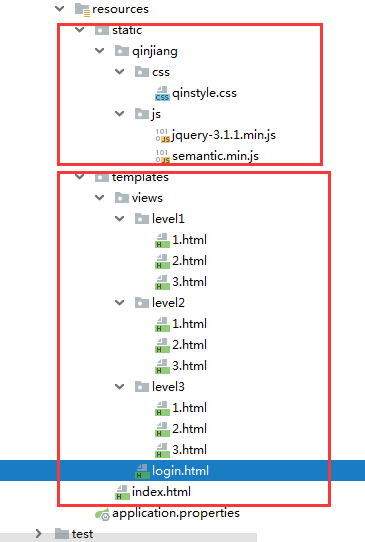

3. controller跳转！

   ```java
   package nuc.ss.controller;
   
   import org.springframework.stereotype.Controller;
   import org.springframework.web.bind.annotation.PathVariable;
   import org.springframework.web.bind.annotation.RequestMapping;
   
   @Controller
   public class RouterController {
   
       @RequestMapping({"/","/index"})
       public String index() {
           return "index";
       }
   
       @RequestMapping("/toLogin")
       public String toLogin() {
           return "views/login";
       }
   
       @RequestMapping("/level1/{id}")
       public String level1(@PathVariable("id") int id) {
           return "views/level1/" + id;
       }
   
       @RequestMapping("/level2/{id}")
       public String level2(@PathVariable("id") int id) {
           return "views/level2/" + id;
       }
   
       @RequestMapping("/level3/{id}")
       public String level3(@PathVariable("id") int id) {
           return "views/level3/" + id;
       }
   }
   ```

4. 测试实验环境是否OK！

   首页

   

   登录

   

   详情

   

#### 认识SpringSecurity

Spring Security 是针对Spring项目的安全框架，也是Spring Boot底层安全模块默认的技术选型，他可以实现强大的Web安全控制，对于安全控制，我们仅需要引入 spring-boot-starter-security 模块，进行少量的配置，即可实现强大的安全管理！

记住几个类：

- `WebSecurityConfigureAdapter`：自定义Security策略
- `AuthenticationManagerBuilder`：自定义认证策略
- `@EnableWebSecurity`：开启WebSecurity模式

Spring Security的两个主要目标是 “认证” 和 “授权”（访问控制）。

**“认证”（Authentication）**

身份验证是关于验证您的凭据，如用户名/用户ID和密码，以验证您的身份。

身份验证通常通过用户名和密码完成，有时与身份验证因素结合使用。

 **“授权” （Authorization）**

授权发生在系统成功验证您的身份后，最终会授予您访问资源（如信息，文件，数据库，资金，位置，几乎任何内容）的完全权限。

这个概念是通用的，而不是只在Spring Security 中存在。

#### 认证和授权

目前，我们的测试环境，是谁都可以访问的，我们使用 Spring Security 增加上认证和授权的功能

1. 引入 Spring Security 模块

   ```xml
   <dependency>
      <groupId>org.springframework.boot</groupId>
      <artifactId>spring-boot-starter-security</artifactId>
   </dependency>
   ```

   

2. 编写 Spring Security 配置类

   - 参考官网：[https://spring.io/projects/spring-security](https://spring.io/projects/spring-security)

   - 查看我们自己项目中的版本，找到对应的帮助文档：[https://docs.spring.io/spring-security/site/docs/5.3.0.RELEASE/reference/html5](https://docs.spring.io/spring-security/site/docs/5.3.0.RELEASE/reference/html5)  

   - servlet-applications 8.16.4

     ```java
     @EnableWebSecurity
     public class Config extends WebSecurityConfigurerAdapter {
         @Override
         protected void configure(HttpSecurity http) throws Exception {
             http
                 .apply(customDsl())
                     .flag(true)
                     .and()
                 ...;
         }
     }
     ```

     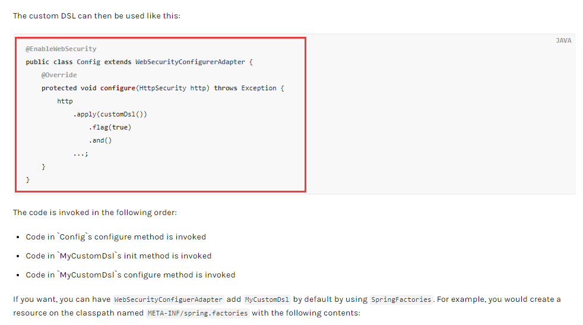

3. 编写基础配置类

   

   ```java
   package nuc.ss.config;
   
   import org.springframework.security.config.annotation.web.builders.HttpSecurity;
   import org.springframework.security.config.annotation.web.configuration.EnableWebSecurity;
   import org.springframework.security.config.annotation.web.configuration.WebSecurityConfigurerAdapter;
   
   @EnableWebSecurity// 开启WebSecurity模式
   public class SecurityConfig extends WebSecurityConfigurerAdapter {
   
       @Override
       protected void configure(HttpSecurity http) throws Exception {
           super.configure(http);
       }
   }
   
   ```

4. 定制请求的授权规则

   看源码

   

   仿写

   ```java
   //链式编程
   @Override
   protected void configure(HttpSecurity http) throws Exception {
       // 首页所有人都可以访问，功能也只有对应有权限的人才能访问到
       // 请求授权的规则
   
       http.authorizeRequests()
           .antMatchers("/").permitAll()
           .antMatchers("/level1/**").hasRole("vip1")
           .antMatchers("/level2/**").hasRole("vip2")
           .antMatchers("/level3/**").hasRole("vip3");
   
   }
   ```

5. 测试一下：发现除了首页都进不去了！因为我们目前没有登录的角色，因为请求需要登录的角色拥有对应的权限才可以！

   

6. 在configure()方法中加入以下配置，开启自动配置的登录功能！

   ```java
   // 开启自动配置的登录功能
   // /login 请求来到登录页
   // /login?error 重定向到这里表示登录失败
   http.formLogin();
   ```

7. 测试一下：发现，没有权限的时候，会跳转到登录的页面！

   

8. 查看刚才登录页的注释信息；

   我们可以定义认证规则，重写configure的另一个方法

   

   源码：

   

   仿写

   ```java
   // 认证，springboot 2.1.x 可以直接使用
   // 密码编码： PasswordEncoder
   @Override
   protected void configure(AuthenticationManagerBuilder auth) throws Exception {
   
       //这些数据正常应该中数据库中读
   
       auth.inMemoryAuthentication()
           .withUser("kuangshen").password("123456").roles("vip2","vip3")
           .and()
           .withUser("root").password("123456").roles("vip1","vip2","vip3")
           .and()
           .withUser("guest").password("123456").roles("vip1");
   }
   ```

9. 测试，我们可以使用这些账号登录进行测试！发现会报错！

   `There is no PasswordEncoder mapped for the id “null”`

   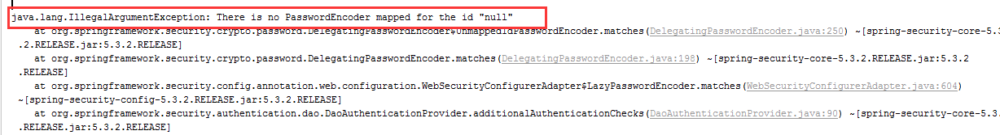

   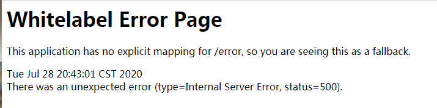

10. 原因，我们要将前端传过来的密码进行某种方式加密，否则就无法登录，修改代码

    ```java
    // 认证，springboot 2.1.x 可以直接使用
    // 密码编码： PasswordEncoder
    // 在spring Secutiry 5.0+ 新增了很多加密方法
    @Override
    protected void configure(AuthenticationManagerBuilder auth) throws Exception {
    
        //这些数据正常应该中数据库中读
        auth.inMemoryAuthentication().passwordEncoder(new BCryptPasswordEncoder())
            .withUser("kuangshen").password(new BCryptPasswordEncoder().encode("123456")).roles("vip2","vip3")
            .and()
            .withUser("root").password(new BCryptPasswordEncoder().encode("123456")).roles("vip1","vip2","vip3")
            .and()
            .withUser("guest").password(new BCryptPasswordEncoder().encode("123456")).roles("vip1");
    }
    ```

11. 测试，发现，登录成功，并且每个角色只能访问自己认证下的规则！搞定

#### 权限控制和注销

1. 开启自动配置的注销的功能

   ```java
   //定制请求的授权规则
   @Override
   protected void configure(HttpSecurity http) throws Exception {
      //....
      //开启自动配置的注销的功能
      // /logout 注销请求
      http.logout();
   }
   ```

2. 我们在前端，增加一个注销的按钮，`index.html `导航栏中

   ```html
   <!--注销-->
   <a class="item" th:href="@{/logout}">
       <i class="sign-out icon"></i> 注销
   </a>
   ```

3. 我们可以去测试一下，登录成功后点击注销，发现注销完毕会跳转到登录页面！

   

   

4. 但是，我们想让他注销成功后，依旧可以跳转到首页，该怎么处理呢？

   源码：

   

   ```java
   // .logoutSuccessUrl("/"); 注销成功来到首页
   http.logout().logoutSuccessUrl("/");
   ```

5. 测试，注销完毕后，发现跳转到首页OK

6. 我们现在又来一个需求：用户没有登录的时候，导航栏上只显示登录按钮，用户登录之后，导航栏可以显示登录的用户信息及注销按钮！还有就是，比如kuangshen这个用户，它只有 vip2，vip3功能，那么登录则只显示这两个功能，而vip1的功能菜单不显示！这个就是真实的网站情况了！该如何做呢？

   <font color=red>我们需要结合thymeleaf中的一些功能</font>

   `sec：authorize="isAuthenticated()"`:是否认证登录！来显示不同的页面

   Maven依赖：

   ```xml
   <!-- https://mvnrepository.com/artifact/org.thymeleaf.extras/thymeleaf-extras-springsecurity4 -->
   <dependency>
      <groupId>org.thymeleaf.extras</groupId>
      <artifactId>thymeleaf-extras-springsecurity5</artifactId>
      <version>3.0.4.RELEASE</version>
   </dependency>
   ```

   - 整合包4（springsecurity4）——springboot版本2.0.9
   - 整合包5（springsecurity5）——springboot版本之后

7. 修改我们的前端页面

   导入命名空间

   ```html
   <html lang="en" xmlns:th="http://www.thymeleaf.org"
         xmlns:sec="http://www.thymeleaf.org/thymeleaf-extras-springsecurity5">
   ```

   修改导航栏，增加认证判断

   ```html
   <!--登录注销-->
   <div class="right menu">
   
       <!--如果未登录-->
       <div sec:authorize="!isAuthenticated()">
           <a class="item" th:href="@{/login}">
               <i class="address card icon"></i> 登录
           </a>
       </div>
   
       <!--如果已登录-->
       <div sec:authorize="isAuthenticated()">
           <a class="item">
               <i class="address card icon"></i>
               用户名：<span sec:authentication="principal.username"></span>
               角色：<span sec:authentication="principal.authorities"></span>
           </a>
       </div>
   
       <div sec:authorize="isAuthenticated()">
           <a class="item" th:href="@{/logout}">
               <i class="sign-out  icon"></i> 注销
           </a>
       </div>
   </div>
   ```

8. 重启测试，我们可以登录试试看，登录成功后确实，显示了我们想要的页面；

   - 未登录

     

   - 登录

     

9. 点击注销产生的问题

   - 整合包4（springsecurity4）

     

   - 整合包5（springsecurity5）（不算问题，需要点击确定，才能回到首页）

     

     

   <font color=red>解决问题：</font>

   - 它默认防止csrf跨站请求伪造，因为会产生安全问题
   - 将请求改为post表单提交
   - 在spring security中关闭csrf功能`http.csrf().disable();`

   再次点击注销按钮之后（直接退出到首页）

   

10. 我们继续将下面的角色功能块认证完成！

    ```html
    <!--菜单根据用户的角色动态的实现-->
    <div class="column"  sec:authorize="hasRole('vip1')">
        <div class="ui raised segment">
            <div class="ui">
                <div class="content">
                    <h5 class="content">Level 1</h5>
                    <hr>
                    <div><a th:href="@{/level1/1}"><i class="bullhorn icon"></i> Level-1-1</a></div>
                    <div><a th:href="@{/level1/2}"><i class="bullhorn icon"></i> Level-1-2</a></div>
                    <div><a th:href="@{/level1/3}"><i class="bullhorn icon"></i> Level-1-3</a></div>
                </div>
            </div>
        </div>
    </div>
    
    <div class="column"  sec:authorize="hasRole('vip2')">
        <div class="ui raised segment">
            <div class="ui">
                <div class="content">
                    <h5 class="content">Level 2</h5>
                    <hr>
                    <div><a th:href="@{/level2/1}"><i class="bullhorn icon"></i> Level-2-1</a></div>
                    <div><a th:href="@{/level2/2}"><i class="bullhorn icon"></i> Level-2-2</a></div>
                    <div><a th:href="@{/level2/3}"><i class="bullhorn icon"></i> Level-2-3</a></div>
                </div>
            </div>
        </div>
    </div>
    
    <div class="column"  sec:authorize="hasRole('vip3')">
        <div class="ui raised segment">
            <div class="ui">
                <div class="content">
                    <h5 class="content">Level 3</h5>
                    <hr>
                    <div><a th:href="@{/level3/1}"><i class="bullhorn icon"></i> Level-3-1</a></div>
                    <div><a th:href="@{/level3/2}"><i class="bullhorn icon"></i> Level-3-2</a></div>
                    <div><a th:href="@{/level3/3}"><i class="bullhorn icon"></i> Level-3-3</a></div>
                </div>
            </div>
        </div>
    </div>
    ```


11. 测试一下！

- 用户首页未登录

  

- 某个用户登录

  

- 权限控制和注销搞定！


#### 记住我

现在的情况，我们只要登录之后，关闭浏览器，再登录，就会让我们重新登录，但是很多网站的情况，就是有一个记住密码的功能，这个该如何实现呢？很简单

1. 开启记住我功能

   ```java
   //定制请求的授权规则
   @Override
   protected void configure(HttpSecurity http) throws Exception {
   //。。。。。。。。。。。
      //开启记住我功能: cookie,默认保存两周
      http.rememberMe();
   }
   ```

2. 我们再次启动项目测试一下

   - 发现登录页多了一个记住我功能

     

   - 我们登录之后关闭 浏览器，然后重新打开浏览器访问，发现用户依旧存在！

     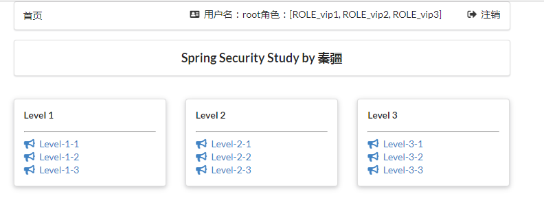

     <font color=red>思考：如何实现的呢？其实非常简单</font>

     我们可以查看浏览器的cookie

     

3. 我们点击注销的时候，可以发现，spring security 帮我们自动删除了这个 cookie

   

4. cookie发送给浏览器保存，以后登录带上这个cookie，只要通过检查就可以免登录了。如果点击注销，则会删除这个cookie，具体的原理我们在JavaWeb阶段都讲过了，这里就不在多说了！

#### 定制登录页

现在这个登录页面都是spring security 默认的，怎么样可以使用我们自己写的Login界面呢？

1. 在刚才的登录页配置后面指定 loginpage

   ```java
   protected void configure(HttpSecurity http) throws Exception {
       //......
   
       // 没有权限默认会到登录页面,需要开启登录的页面
       // /login页面
       http.formLogin().loginPage("/toLogin");
   
       //......
   }
   ```

2. 然后前端也需要指向我们自己定义的 login请求

   ```html
   <div sec:authorize="!isAuthenticated()">
       <a class="item" th:href="@{/toLogin}">
           <i class="address card icon"></i> 登录
       </a>
   </div>
   ```

3. 我们登录，需要将这些信息发送到哪里，我们也需要配置，login.html 配置提交请求及方式，方式必须为post:

   在 loginPage()源码中的注释上有写明：

   

4. 这个请求提交上来，我们还需要验证处理，怎么做呢？我们可以查看formLogin()方法的源码！我们配置接收登录的用户名和密码的参数！

   

   ```java
   protected void configure(HttpSecurity http) throws Exception {
       //......
   
       // 没有权限默认会到登录页面,需要开启登录的页面
       // /login页面
       http.formLogin()
         .usernameParameter("username")
         .passwordParameter("password")
         .loginPage("/toLogin")
         .loginProcessingUrl("/login"); // 登陆表单提交请求
   
       //......
   }
   ```

5. 在登录页增加记住我的多选框

   ```html
   <input type="checkbox" name="remember"> 记住我
   ```

6. 后端验证处理！

   ```java
   protected void configure(HttpSecurity http) throws Exception {
       //......
       //开启记住我功能: cookie,默认保存两周,自定义接收前端的参数
       http.rememberMe().rememberMeParameter("remember");
   }
   ```

7. 测试，OK

### 完整配置代码

```java
package nuc.ss.config;

import org.springframework.security.config.annotation.authentication.builders.AuthenticationManagerBuilder;
import org.springframework.security.config.annotation.web.builders.HttpSecurity;
import org.springframework.security.config.annotation.web.configuration.EnableWebSecurity;
import org.springframework.security.config.annotation.web.configuration.WebSecurityConfigurerAdapter;
import org.springframework.security.crypto.bcrypt.BCryptPasswordEncoder;

// AOP:拦截器
@EnableWebSecurity  // 开启WebSecurity模式
public class SecurityConfig extends WebSecurityConfigurerAdapter {

    //链式编程
    //授权
    @Override
    protected void configure(HttpSecurity http) throws Exception {
        // 首页所有人都可以访问，功能也只有对应有权限的人才能访问到
        // 请求授权的规则
        http.authorizeRequests()
                .antMatchers("/").permitAll()
                .antMatchers("/level1/**").hasRole("vip1")
                .antMatchers("/level2/**").hasRole("vip2")
                .antMatchers("/level3/**").hasRole("vip3");

        // 没有权限默认会到登录页面,需要开启登录的页面
        // /login页面
        http.formLogin()
                .usernameParameter("username")
                .passwordParameter("password")
                .loginPage("/toLogin")
                .loginProcessingUrl("/login");

        //注销,开启了注销功能,跳到首页
        http.logout().logoutSuccessUrl("/");

        // 防止网站工具：get，post
        http.csrf().disable();//关闭csrf功能，登录失败肯定存在的原因

        //开启记住我功能: cookie,默认保存两周,自定义接收前端的参数
        http.rememberMe().rememberMeParameter("remember");


    }

    // 认证，springboot 2.1.x 可以直接使用
    // 密码编码： PasswordEncoder
    // 在spring Secutiry 5.0+ 新增了很多加密方法
    @Override
    protected void configure(AuthenticationManagerBuilder auth) throws Exception {

        //这些数据正常应该中数据库中读
        auth.inMemoryAuthentication().passwordEncoder(new BCryptPasswordEncoder())
                .withUser("kuangshen").password(new BCryptPasswordEncoder().encode("123456")).roles("vip2","vip3")
                .and()
                .withUser("root").password(new BCryptPasswordEncoder().encode("123456")).roles("vip1","vip2","vip3")
                .and()
                .withUser("guest").password(new BCryptPasswordEncoder().encode("123456")).roles("vip1");
    }
}
```

## SpringBoot整合Shiro

### 1、Shiro简介

#### 1.1、Shiro 是什么？

- Apache Shiro 是 Java 的一个安全（权限）框架。

- Shiro 可以非常容易的开发出足够好的应用，其不仅可以用在 JavaSE 环境，也可以用在 JavaEE 环境。

- Shiro 可以完成：认证、授权、加密、会话管理、与Web 集成、缓存等。
- 下载地址
  - 官网：[http://shiro.apache.org/](http://shiro.apache.org/)
  - github：[https://github.com/apache/shiro](https://github.com/apache/shiro)


#### 1.2、有哪些功能？


- Authentication:身份认证/登录，验证用户是不是拥有相应的身份
- Authorization:授权，授权发生在系统成功验证您的身份后，最终会授予您访问资源（如信息，文件，数据库，资金，位置，几乎任何内容）的完全权限。这个概念是通用的.
- Session Management:会话管理，即用户登录后就是一次会话，在没有退出之前，它的所有信息都在会话中；会话可以是普通JavaSE环境，也可以是Web 环境的
- Cryptography:加密，保护数据的安全性，如密码加密存储到数据库，而不是明文存储
- Web Support:Web 支持，可以非常容易的集成到Web 环境
- Caching:缓存，比如用户登录后，其用户信息、拥有的角色/权限不必每次去查，这样可以提高效率
- Concurrency:Shiro支持多线程应用的并发验证，即如在一个线程中开启另一个线程，能把权限自动传播过去
- Testing:提供测试支持
- "Run As":允许一个用户假装为另一个用户（如果他们允许）的身份进行访问
- Remember Me:记住我，这个是非常常见的功能，即一次登录后，下次再来的话不用登录了

#### 1.3、Shiro架构(外部)

从外部来看Shiro，即从应用程序角度的来观察如何使用Shiro完成工作


- Subject：应用代码直接交互的对象是Subject，也就是说Shiro的对外API 核心就是Subject。Subject 代表了当前“用户”，这个用户不一定是一个具体的人，与当前应用交互的任何东西都是Subject，如网络爬虫，机器人等；与Subject 的所有交互都会委托给SecurityManager；Subject 其实是一个门面，SecurityManager才是实际的执行者

- SecurityManager：安全管理器；即所有与安全有关的操作都会与SecurityManager交互；且其管理着所有Subject；可以看出它是Shiro的核心，它负责与Shiro的其他组件进行交互，它相当于SpringMVC中DispatcherServlet的角色

- Realm：Shiro从Realm 获取安全数据（如用户、角色、权限），就是说SecurityManager要验证用户身份，那么它需要从Realm 获取相应的用户进行比较以确定用户身份是否合法；也需要从Realm 得到用户相应的角色/权限进行验证用户是否能进行操作；可以把Realm 看成DataSource

#### 1.4、Shiro架构(内部)


- Subject：任何可以与应用交互的“用户”；
- SecurityManager：相当于SpringMVC中的DispatcherServlet；是Shiro的心脏；所有具体的交互都通过SecurityManager进行控制；它管理着所有Subject、且负责进行认证、授权、会话及缓存的管理。
- Authenticator：负责Subject 认证，是一个扩展点，可以自定义实现；可以使用认证策略（Authentication Strategy），即什么情况下算用户认证通过了；
- Authorizer：授权器、即访问控制器，用来决定主体是否有权限进行相应的操作；即控制着用户能访问应用中的哪些功能；
- Realm：可以有1 个或多个Realm，可以认为是安全实体数据源，即用于获取安全实体的；可以是JDBC 实现，也可以是内存实现等等；由用户提供；所以一般在应用中都需要实现自己的Realm；
- SessionManager：管理Session 生命周期的组件；而Shiro并不仅仅可以用在Web 环境，也可以用在如普通的JavaSE环境
  CacheManager：缓存控制器，来管理如用户、角色、权限等的缓存的；因为这些数据基本上很少改变，放到缓存中后可以提高访问的性能
- Cryptography：密码模块，Shiro提高了一些常见的加密组件用于如密码加密/解密。

### 2、Hello World

#### 2.1、快速实践

- 查看官方文档：http://shiro.apache.org/tutorial.html

- 官方的quickstart : https://github.com/apache/shiro/tree/master/samples/quickstart/

  

1. 创建一个maven父工程，用来学习Shiro,删掉不必要的部分

2. 创建一个普通的Maven子工程：hell-shiro

   

3. 根据[官方文档](https://github.com/apache/shiro/blob/master/samples/quickstart/pom.xml)，我们导入Shiro的依赖

   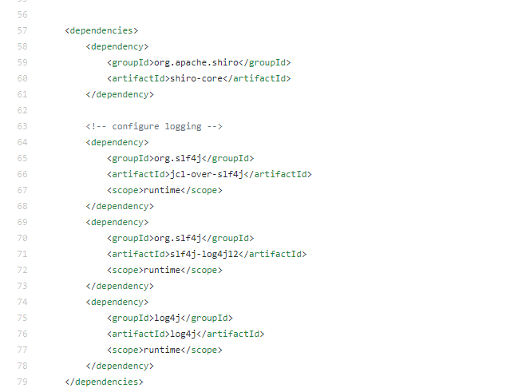

   

   [版本号点击这里](https://mvnrepository.com/artifact/org.apache.shiro/shiro-core)

   ```xml
   <dependencies>
       <dependency>
           <groupId>org.apache.shiro</groupId>
           <artifactId>shiro-core</artifactId>
           <version>1.5.3</version>
       </dependency>
   
       <!-- configure logging -->
       <dependency>
           <groupId>org.slf4j</groupId>
           <artifactId>jcl-over-slf4j</artifactId>
           <version>1.7.26</version>
       </dependency>
       <dependency>
           <groupId>org.slf4j</groupId>
           <artifactId>slf4j-log4j12</artifactId>
           <version>1.7.26</version>
       </dependency>
       <dependency>
           <groupId>log4j</groupId>
           <artifactId>log4j</artifactId>
           <version>1.2.17</version>
       </dependency>
   </dependencies>
   ```

4. 相关配置文件

   - log4j.properties——[官网](https://github.com/apache/shiro/blob/master/samples/quickstart/src/main/resources/log4j.properties)

     ```properties
     log4j.rootLogger=INFO, stdout
     
     log4j.appender.stdout=org.apache.log4j.ConsoleAppender
     log4j.appender.stdout.layout=org.apache.log4j.PatternLayout
     log4j.appender.stdout.layout.ConversionPattern=%d %p [%c] - %m %n
     
     # General Apache libraries
     log4j.logger.org.apache=WARN
     
     # Spring
     log4j.logger.org.springframework=WARN
     
     # Default Shiro logging
     log4j.logger.org.apache.shiro=INFO
     
     # Disable verbose logging
     log4j.logger.org.apache.shiro.util.ThreadContext=WARN
     log4j.logger.org.apache.shiro.cache.ehcache.EhCache=WARN
     ```

   - shiro.ini——[官网](https://github.com/apache/shiro/blob/master/samples/quickstart/src/main/resources/shiro.ini)

     ```ini
     [users]
     # user 'root' with password 'secret' and the 'admin' role
     root = secret, admin
     # user 'guest' with the password 'guest' and the 'guest' role
     guest = guest, guest
     # user 'presidentskroob' with password '12345' ("That's the same combination on
     # my luggage!!!" ;)), and role 'president'
     presidentskroob = 12345, president
     # user 'darkhelmet' with password 'ludicrousspeed' and roles 'darklord' and 'schwartz'
     darkhelmet = ludicrousspeed, darklord, schwartz
     # user 'lonestarr' with password 'vespa' and roles 'goodguy' and 'schwartz'
     lonestarr = vespa, goodguy, schwartz
     
     # -----------------------------------------------------------------------------
     # Roles with assigned permissions
     # 
     # Each line conforms to the format defined in the
     # org.apache.shiro.realm.text.TextConfigurationRealm#setRoleDefinitions JavaDoc
     # -----------------------------------------------------------------------------
     [roles]
     # 'admin' role has all permissions, indicated by the wildcard '*'
     admin = *
     # The 'schwartz' role can do anything (*) with any lightsaber:
     schwartz = lightsaber:*
     # The 'goodguy' role is allowed to 'drive' (action) the winnebago (type) with
     # license plate 'eagle5' (instance specific id)
     goodguy = winnebago:drive:eagle5
     ```

   - 启动类 Quickstart——[官网](https://github.com/apache/shiro/blob/master/samples/quickstart/src/main/java/Quickstart.java)

     ```java
     /*
      * Licensed to the Apache Software Foundation (ASF) under one
      * or more contributor license agreements.  See the NOTICE file
      * distributed with this work for additional information
      * regarding copyright ownership.  The ASF licenses this file
      * to you under the Apache License, Version 2.0 (the
      * "License"); you may not use this file except in compliance
      * with the License.  You may obtain a copy of the License at
      *
      *     http://www.apache.org/licenses/LICENSE-2.0
      *
      * Unless required by applicable law or agreed to in writing,
      * software distributed under the License is distributed on an
      * "AS IS" BASIS, WITHOUT WARRANTIES OR CONDITIONS OF ANY
      * KIND, either express or implied.  See the License for the
      * specific language governing permissions and limitations
      * under the License.
      */
     
     import org.apache.shiro.SecurityUtils;
     import org.apache.shiro.authc.*;
     import org.apache.shiro.config.IniSecurityManagerFactory;
     import org.apache.shiro.mgt.SecurityManager;
     import org.apache.shiro.session.Session;
     import org.apache.shiro.subject.Subject;
     import org.apache.shiro.util.Factory;
     import org.slf4j.Logger;
     import org.slf4j.LoggerFactory;
     
     
     /**
      * Simple Quickstart application showing how to use Shiro's API.
      * 简单入门Shiro使用API
      *
      * @since 0.9 RC2
      */
     public class Quickstart {
     
         private static final transient Logger log = LoggerFactory.getLogger(Quickstart.class);
     
     
         public static void main(String[] args) {
     
             // The easiest way to create a Shiro SecurityManager with configured
             // realms, users, roles and permissions is to use the simple INI config.
             // We'll do that by using a factory that can ingest a .ini file and
             // return a SecurityManager instance:
     
             // Use the shiro.ini file at the root of the classpath
             // (file: and url: prefixes load from files and urls respectively):
             // 读取配置文件:
             Factory<SecurityManager> factory = new IniSecurityManagerFactory("classpath:shiro.ini");
             SecurityManager securityManager = factory.getInstance();
     
             // for this simple example quickstart, make the SecurityManager
             // accessible as a JVM singleton.  Most applications wouldn't do this
             // and instead rely on their container configuration or web.xml for
             // webapps.  That is outside the scope of this simple quickstart, so
             // we'll just do the bare minimum so you can continue to get a feel
             // for things.
             SecurityUtils.setSecurityManager(securityManager);
     
             // Now that a simple Shiro environment is set up, let's see what you can do:
     
             // get the currently executing user:
             // 获取当前的用户对象 Subject
             Subject currentUser = SecurityUtils.getSubject();
     
             // Do some stuff with a Session (no need for a web or EJB container!!!)
             //通过当前用户拿到Shiro的Session 可以脱离web存值取值
             Session session = currentUser.getSession();
             session.setAttribute("someKey", "aValue");
             String value = (String) session.getAttribute("someKey");
             if (value.equals("aValue")) {
                 log.info("Retrieved the correct value! [" + value + "]");
             }
     
             // let's login the current user so we can check against roles and permissions:
             //判断当前的用户是否被认证
             if (!currentUser.isAuthenticated()) {
                 //Token 令牌
                 UsernamePasswordToken token = new UsernamePasswordToken("lonestarr", "vespa");
                 //设置记住我
                 token.setRememberMe(true);
                 try {
                     //执行登录操作
                     currentUser.login(token);
                 } catch (UnknownAccountException uae) {
                     log.info("There is no user with username of " + token.getPrincipal());
                 } catch (IncorrectCredentialsException ice) {
                     log.info("Password for account " + token.getPrincipal() + " was incorrect!");
                 } catch (LockedAccountException lae) {
                     log.info("The account for username " + token.getPrincipal() + " is locked.  " +
                             "Please contact your administrator to unlock it.");
                 }
                 // ... catch more exceptions here (maybe custom ones specific to your application?
                 catch (AuthenticationException ae) {
                     //unexpected condition?  error?
                 }
             }
     
             //say who they are:
             //print their identifying principal (in this case, a username):
             log.info("User [" + currentUser.getPrincipal() + "] logged in successfully.");
     
             //test a role:
             // 检查角色
             if (currentUser.hasRole("schwartz")) {
                 log.info("May the Schwartz be with you!");
             } else {
                 log.info("Hello, mere mortal.");
             }
     
             //test a typed permission (not instance-level)
             //粗粒度
             if (currentUser.isPermitted("lightsaber:wield")) {
                 log.info("You may use a lightsaber ring.  Use it wisely.");
             } else {
                 log.info("Sorry, lightsaber rings are for schwartz masters only.");
             }
     
             //a (very powerful) Instance Level permission:
             //细粒度
             if (currentUser.isPermitted("winnebago:drive:eagle5")) {
                 log.info("You are permitted to 'drive' the winnebago with license plate (id) 'eagle5'.  " +
                         "Here are the keys - have fun!");
             } else {
                 log.info("Sorry, you aren't allowed to drive the 'eagle5' winnebago!");
             }
     
             //all done - log out!
             //注销
             currentUser.logout();
     
             //结束
             System.exit(0);
         }
     }
     ```

     

   - Spring Security都有~（只是换了个名字）

     ```java
     // 获取当前的用户对象 Subject
     Subject currentUser = SecurityUtils.getSubject();
     Session session = currentUser.getSession();
     currentUser.isAuthenticated()
         currentUser.getPrincipal()
         currentUser.hasRole("schwartz")
         currentUser.isPermitted("lightsaber:wield")
         currentUser.logout();
     ```


### 3、SpringBoot集成

#### 3.2、Shiro实现登录拦截

- 在`ShiroConfig`中的`getShiroFilterFactoryBean`方法中添加如下配置

  - anon： 无需认证就可以访问
  - authc： 必须认证了才能访问
  - user： 必须拥有记住我功能才能用
  - perms： 拥有对某个资源的权限才能访问
  - role： 拥有某个角色权限

  ```java
  Map<String, String> filterMap = new LinkedHashMap<>();
  filterMap.put("/user/add","authc");
  filterMap.put("/user/update","authc");
  bean.setFilterChainDefinitionMap(filterMap);
  ```

- 点击首页的add或者update之后

  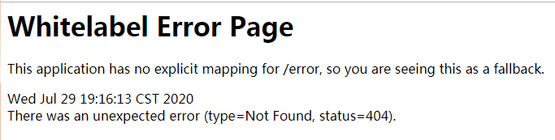

- 添加拦截成功页面

  - 登录页面login.html

    ```html
    <!DOCTYPE html>
    <html lang="en">
    <head>
        <meta charset="UTF-8">
        <title>登录页面</title>
    </head>
    <body>
    <h1>登录</h1>
    <hr>
    
    <form action="">
        <p>用户名：<input type="text" name="username"></p>
        <p>密码：<input type="text" name="password"></p>
        <p>密码：<input type="submit"></p>
    </form>
    </body>
    </html>
    ```

  - 在MyConfig中添加

    ```java
    @RequestMapping("/toLogin")
    public String toLogin() {
        return "login";
    }
    ```

  - 在`ShiroConfig`中的`getShiroFilterFactoryBean`方法中添加如下配置

    ```java
    //设置登录的请求
    bean.setLoginUrl("/toLogin");
    ```

- 拦截成功页面

  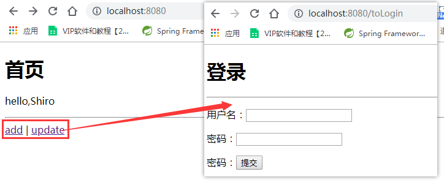

#### 3.3、Shiro实现用户认证

1. 在`MyController`中编写用户提交表单之后处理

   ```java
   @RequestMapping("/login")
   public String login(String username, String password, Model model) {
       //获取一个用户
       Subject subject = SecurityUtils.getSubject();
       // 封装用户的登录数据
       UsernamePasswordToken token = new UsernamePasswordToken(username, password);
   
       try {
           subject.login(token);//执行登录的方法，如果没有异常就说明ok了
           return "index";
       } catch (UnknownAccountException e) {//用户名不存在
           model.addAttribute("msg","用户名错误");
           return "login";
       } catch (IncorrectCredentialsException e) {//密码不存在
           model.addAttribute("msg","密码错误");
           return "login";
       }
   
   }
   ```

2. login.html的修改

   ```html
   <!DOCTYPE html>
   <html lang="en" xmlns:th="http://www.thymeleaf.org">
   <head>
       <meta charset="UTF-8">
       <title>登录页面</title>
   </head>
   <body>
   <h1>登录</h1>
   <hr>
   
   <p th:text="${msg}" style="color: red;"></p>
   <form th:action="@{/login}">
       <p>用户名：<input type="text" name="username"></p>
       <p>密码：<input type="text" name="password"></p>
       <p>密码：<input type="submit"></p>
   </form>
   </body>
   </html>
   ```

3. 用户输入登录信息

   - 页面

     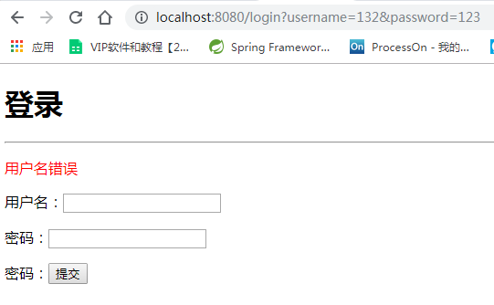

   - 控制台

     

4. 用户认证编写`UserRealm`中的认证（doGetAuthenticationInfo）

   ```java
   //认证
   @Override
   protected AuthenticationInfo doGetAuthenticationInfo(AuthenticationToken token) throws AuthenticationException {
       System.out.println("执行了=>认证doGetAuthorizationInfo");
       // 用户名、密码， 数据中取
       String name = "root";
       String password = "123456";
   
       UsernamePasswordToken userToken = (UsernamePasswordToken) token;
   
       if (!userToken.getUsername().equals(name)) {
           return null;//抛出异常 UnknownAccountException
       }
   
       // 密码认证，shiro做
       return new SimpleAuthenticationInfo("",password,"");
   }
   ```

#### 3.4、Shiro整合Mybatis

1. 导入依赖

   ```xml
   <dependency>
       <groupId>org.projectlombok</groupId>
       <artifactId>lombok</artifactId>
   </dependency>
   <dependency>
       <groupId>mysql</groupId>
       <artifactId>mysql-connector-java</artifactId>
   </dependency>
   
   <dependency>
       <groupId>log4j</groupId>
       <artifactId>log4j</artifactId>
       <version>1.2.17</version>
   </dependency>
   
   <dependency>
       <groupId>com.alibaba</groupId>
       <artifactId>druid</artifactId>
       <version>1.1.23</version>
   </dependency>
   
   <!--引入mybatis，这是MyBatis官方提供的适配spring Boot的，而不是spring Boot自己的-->
   <dependency>
       <groupId>org.mybatis.spring.boot</groupId>
    <artifactId>mybatis-spring-boot-starter</artifactId>
       <version>2.1.3</version>
   </dependency>
   ```

2. 配置文件application.yml的编写

   ```yml
   spring:
     datasource:
       username: root
       password: admin
       #?serverTimezone=UTC解决时区的报错
       url: jdbc:mysql://localhost:3306/mybatis?serverTimezone=UTC&useUnicode=true&characterEncoding=utf-8
       driver-class-name: com.mysql.cj.jdbc.Driver
       type: com.alibaba.druid.pool.DruidDataSource
   
       #Spring Boot 默认是不注入这些属性值的，需要自己绑定
       #druid 数据源专有配置
       initialSize: 5
       minIdle: 5
       maxActive: 20
       maxWait: 60000
       timeBetweenEvictionRunsMillis: 60000
       minEvictableIdleTimeMillis: 300000
       validationQuery: SELECT 1 FROM DUAL
       testWhileIdle: true
       testOnBorrow: false
       testOnReturn: false
       poolPreparedStatements: true
   
       #配置监控统计拦截的filters，stat:监控统计、log4j：日志记录、wall：防御sql注入
       #如果允许时报错  java.lang.ClassNotFoundException: org.apache.log4j.Priority
       #则导入 log4j 依赖即可，Maven 地址：https://mvnrepository.com/artifact/log4j/log4j
       filters: stat,wall,log4j
       maxPoolPreparedStatementPerConnectionSize: 20
       useGlobalDataSourceStat: true
       connectionProperties: druid.stat.mergeSql=true;druid.stat.slowSqlMillis=500
       
   mybatis:
     type-aliases-package: nuc.ss.pojo
     mapper-locations: classpath:mapper/*.xml
   ```

3. User类的编写

   ```java
   @Data
   @AllArgsConstructor
   @NoArgsConstructor
   public class User {
       private int id;
       private String name;
       private String pwd;
   }
   ```

4. UserMapper.xml映射

   ```xml
   <?xml version="1.0" encoding="UTF-8" ?>
   <!DOCTYPE mapper
        PUBLIC "-//mybatis.org//DTD Mapper 3.0//EN"
           "http://mybatis.org/dtd/mybatis-3-mapper.dtd">
   <!--namespace=绑定一个对应的Dao/Mapper接口-->
   <mapper namespace="nuc.ss.mapper.UserMapper">
       
       <select id="queryUserList" resultType="User">
           select * from mybatis.user;
       </select>
   
       <select id="queryUserById" resultType="User">
           select * from mybatis.user where id = #{id};
       </select>
   
       <insert id="addUser" parameterType="User">
           insert into mybatis.user (id, name, pwd) values (#{id},#{name},#{pwd});
       </insert>
   
       <update id="updateUser" parameterType="User">
           update mybatis.user set name=#{name},pwd = #{pwd} where id = #{id};
       </update>
   
       <delete id="deleteUser" parameterType="int">
           delete from mybatis.user where id = #{id}
       </delete>
   </mapper>
   ```

5. UserService接口实现

   ```java
   public interface UserService {
   
       public User queryUserByName(String name);
   }
   ```

6. UserServiceImpl业务逻辑

   ```java
   @Service
   public class UserServiceImpl implements UserService {
   
       @Autowired
       UserMapper userMapper;
       @Override
       public User queryUserByName(String name) {
           return userMapper.queryUserByName(name);
       }
   }
   
   ```

7. 测试环境

   ```java
   @SpringBootTest
   class ShiroSpringbootApplicationTests {
   
       @Autowired
       UserService userService;
       @Test
       void contextLoads() {
           System.out.println(userService.queryUserByName("狂神"));
       }
   
   }
   ```

   

8. `UserRealm`连接真实数据库

   ```java
   //认证
   @Override
   protected AuthenticationInfo doGetAuthenticationInfo(AuthenticationToken token) throws AuthenticationException {
       System.out.println("执行了=>认证doGetAuthorizationInfo");
   
       UsernamePasswordToken userToken = (UsernamePasswordToken) token;
       
       // 真实数据库 用户名、密码， 数据中取
       User user = userService.queryUserByName(userToken.getUsername());
   
       if (user == null) {//没有这个人
           return null;
       }
   
       // 密码认证，shiro做
       return new SimpleAuthenticationInfo("",user.getPwd(),"");
   }
   ```

   

9. 断点测试密码加密类型

   - 打断点Debug

     

   - 默认是`SimpleCredentialsMatcher`加密

     

   - MD5加密——[测试](http://tool.chinaz.com/tools/md5.aspx)

     123456——E10ADC3949BA59ABBE56E057F20F883E

   - MD5盐值加密

   - 所有加密

     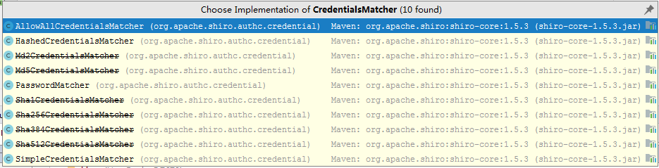

#### 3.5、Shiro实现用户授权

1. `ShiroConfig`中的`getShiroFilterFactoryBean`方法添加认证代码

   ```java
   //授权，正常情况下，没有授权会跳转到为授权页面
   filterMap.put("/user/add","perms[user:add]");
   filterMap.put("/user/update","perms[user:update]");
   ```

2. 登录之后点击add按钮会弹出如下页面

   

3. 添加为授权页面

   - MyController

     ```java
     @RequestMapping("/noauto")
     @ResponseBody
     public String unauthorized() {
         return "未经授权，无法访问此页面";
     }
     ```

   - `ShiroConfig`中的`getShiroFilterFactoryBean`方法中添加

     ```java
     //为授权页面
     bean.setUnauthorizedUrl("/noauto");
     ```

4. 再次测试

   

   

   所以需要在UserRealm中为用户进行真正授权

5. UserRealm类的修改

   ```java
   //自定义的UserRealm
   public class UserRealm extends AuthorizingRealm {
   
       @Autowired
       UserService userService;
       //授权
       @Override
       protected AuthorizationInfo doGetAuthorizationInfo(PrincipalCollection principalCollection) {
           System.out.println("执行了=>授权doGetAuthorizationInfo");
   
           SimpleAuthorizationInfo info = new SimpleAuthorizationInfo();
   
           //拿到当前登录的这个对象
           Subject subject = SecurityUtils.getSubject();
           User currentUser = (User)subject.getPrincipal();//拿到user对象
   
           //设置当前用户的权限
           info.addStringPermission(currentUser.getPerms());
   
           return info;
       }
   
       //认证
       @Override
       protected AuthenticationInfo doGetAuthenticationInfo(AuthenticationToken token) throws AuthenticationException {
           ......
           // 密码认证，shiro做
           return new SimpleAuthenticationInfo(user,user.getPwd(),"");
       }
   }
   
   ```

6. 再次测试

   

#### 3.6、Shiro整合Thymeleaf

1. shiro-thymeleaf整合包导入——[官网](https://mvnrepository.com/artifact/com.github.theborakompanioni/thymeleaf-extras-shiro)

   ```xml
   <!--shiro-thymeleaf整合-->
   <dependency>
       <groupId>com.github.theborakompanioni</groupId>
       <artifactId>thymeleaf-extras-shiro</artifactId>
       <version>2.0.0</version>
   </dependency>
   ```

2. 在ShiroConfig中整合ShiroDialect

   ```java
   // 整合ShiroDialect： 用来整合 Shiro thymeleaf
   @Bean
   public ShiroDialect getShiroDialect() {
       return new ShiroDialect();
   }
   ```

3. index.html页面

   ```html
   <!DOCTYPE html>
   <html lang="en" xmlns:th="http://www.thymeleaf.org"
         xmlns:shiro="http://www.thymeleaf.org/thymeleaf-extras-shiro">
   <head>
       <meta charset="UTF-8">
       <title>首页</title>
   </head>
   <body>
   
   <div>
       <h1>首页</h1>
       <p th:text="${msg}"></p>
   
       <!--用session实现，配合UserRealm中的session实现-->
       <!--<div th:if="${session.loginUser==null}">
           <a th:href="@{/toLogin}">登录</a>
       </div>-->
   
       <div shiro:notAuthenticated>
           <a th:href="@{/toLogin}">登录</a>
       </div>
   
       <hr>
   
       <div shiro:hasPermission="user:add">
           <a th:href="@{/user/add}">add</a>
       </div>
   
       <div shiro:hasPermission="user:update">
           <a th:href="@{/user/update}">update</a>
       </div>
   
   </div>
   </body>
   </html>
   ```

4. 页面显示

   

#### 3.7、所有代码

- ShiroConfig

  ```java
  package nuc.ss.config;
  
  import at.pollux.thymeleaf.shiro.dialect.ShiroDialect;
  import org.apache.shiro.spring.web.ShiroFilterFactoryBean;
  import org.apache.shiro.web.mgt.DefaultWebSecurityManager;
  import org.springframework.beans.factory.annotation.Qualifier;
  import org.springframework.context.annotation.Bean;
  import org.springframework.context.annotation.Configuration;
  
  import java.util.LinkedHashMap;
  import java.util.Map;
  
  @Configuration
  public class ShiroConfig {
  
      //shiroFilterFactoryBean
  
      @Bean
      public ShiroFilterFactoryBean getShiroFilterFactoryBean(@Qualifier("getDefaultWebSecurityManager") DefaultWebSecurityManager defaultWebSecurityManager) {
          ShiroFilterFactoryBean bean = new ShiroFilterFactoryBean();
          // 设置安全管理器
          bean.setSecurityManager(defaultWebSecurityManager);
  
          // 添加shiro的内置过滤器
          /*
              anon： 无需认证就可以访问
              authc： 必须认证了才能访问
              user： 必须拥有记住我功能才能用
              perms： 拥有对某个资源的权限才能访问
              role： 拥有某个角色权限
           */
  
          //拦截
          Map<String, String> filterMap = new LinkedHashMap<>();
          //filterMap.put("/user/add","authc");
          //filterMap.put("/user/update","authc");
  
  
          //授权，正常情况下，没有授权会跳转到为授权页面
          filterMap.put("/user/add","perms[user:add]");
          filterMap.put("/user/update","perms[user:update]");
  
          filterMap.put("/user/*","authc");
  
          bean.setFilterChainDefinitionMap(filterMap);
  
          //设置登录的请求
          bean.setLoginUrl("/toLogin");
  
          //为授权页面
          bean.setUnauthorizedUrl("/noauto");
  
        return bean;
      }
  
      //DefaultWebSecurityManager
  
      @Bean
      public DefaultWebSecurityManager getDefaultWebSecurityManager(@Qualifier("userRealm") UserRealm userRealm) {
          DefaultWebSecurityManager securityManager = new DefaultWebSecurityManager();
  
          // 关联userRealm
          securityManager.setRealm(userRealm);
          return securityManager;
      }
      //创建realm对象，需要自定义类
  
      @Bean
      public UserRealm userRealm() {
          return new UserRealm();
      }
  
      // 整合ShiroDialect： 用来整合 Shiro thymeleaf
      @Bean
      public ShiroDialect getShiroDialect() {
          return new ShiroDialect();
      }
  }
  ```

- UserRealm

  ```java
  package nuc.ss.config;
  
  import nuc.ss.pojo.User;
  import nuc.ss.service.UserService;
  import org.apache.shiro.SecurityUtils;
  import org.apache.shiro.authc.*;
  import org.apache.shiro.authz.AuthorizationInfo;
  import org.apache.shiro.authz.SimpleAuthorizationInfo;
  import org.apache.shiro.realm.AuthorizingRealm;
  import org.apache.shiro.session.Session;
  import org.apache.shiro.subject.PrincipalCollection;
  import org.apache.shiro.subject.Subject;
  import org.springframework.beans.factory.annotation.Autowired;
  
  //自定义的UserRealm
  public class UserRealm extends AuthorizingRealm {
  
      @Autowired
      UserService userService;
      //授权
      @Override
      protected AuthorizationInfo doGetAuthorizationInfo(PrincipalCollection principalCollection) {
          System.out.println("执行了=>授权doGetAuthorizationInfo");
  
          SimpleAuthorizationInfo info = new SimpleAuthorizationInfo();
  
          //info.addStringPermission("user:add");
  
          //拿到当前登录的这个对象
          Subject subject = SecurityUtils.getSubject();
          User currentUser = (User)subject.getPrincipal();//拿到user对象
  
          //设置当前用户的权限
          info.addStringPermission(currentUser.getPerms());
  
          return info;
      }
  
      //认证
      @Override
      protected AuthenticationInfo doGetAuthenticationInfo(AuthenticationToken token) throws AuthenticationException {
          System.out.println("执行了=>认证doGetAuthorizationInfo");
  
          UsernamePasswordToken userToken = (UsernamePasswordToken) token;
  
          // 虚拟用户
          //String name = "root";
          //String password = "123456";
          //if (!userToken.getUsername().equals(name)) {
          //    return null;//抛出异常 UnknownAccountException
          //}
  
          // 真实数据库 用户名、密码， 数据中取
          User user = userService.queryUserByName(userToken.getUsername());
  
          if (user == null) {//没有这个人
              return null;
          }
  
          //首页
          //Subject currentSubject = SecurityUtils.getSubject();
          //Session session = currentSubject.getSession();
          //session.setAttribute("loginUser",user);
  
  
          // 密码认证，shiro做
          return new SimpleAuthenticationInfo(user,user.getPwd(),"");
      }
  }
  ```

- MyController

  ```java
  package nuc.ss.controller;
  
  import org.apache.shiro.SecurityUtils;
  import org.apache.shiro.authc.IncorrectCredentialsException;
  import org.apache.shiro.authc.UnknownAccountException;
  import org.apache.shiro.authc.UsernamePasswordToken;
  import org.apache.shiro.subject.Subject;
  import org.springframework.stereotype.Controller;
  import org.springframework.ui.Model;
  import org.springframework.web.bind.annotation.RequestMapping;
  import org.springframework.web.bind.annotation.ResponseBody;
  
  @Controller
  public class MyController {
  
      @RequestMapping({"/","/index"})
      public String toIndex(Model model) {
          model.addAttribute("msg","hello,Shiro");
          return "index";
      }
  
      @RequestMapping("/user/add")
      public String add() {
          return "user/add";
      }
  
      @RequestMapping("/user/update")
      public String update() {
          return "user/update";
      }
  
      @RequestMapping("/toLogin")
      public String toLogin() {
          return "login";
      }
  
      @RequestMapping("/login")
      public String login(String username, String password, Model model) {
          //获取一个用户
          Subject subject = SecurityUtils.getSubject();
          // 封装用户的登录数据
          UsernamePasswordToken token = new UsernamePasswordToken(username, password);
  
          try {
              subject.login(token);//执行登录的方法，如果没有异常就说明ok了
              return "index";
          } catch (UnknownAccountException e) {//用户名不存在
              model.addAttribute("msg","用户名错误");
              return "login";
          } catch (IncorrectCredentialsException e) {//密码不存在
              model.addAttribute("msg","密码错误");
              return "login";
          }
      }
  
      @RequestMapping("/noauto")
      @ResponseBody
      public String unauthorized() {
          return "未经授权，无法访问此页面";
      }
  }
  
  ```

- pom依赖

  ```xml
  <?xml version="1.0" encoding="UTF-8"?>
  <project xmlns="http://maven.apache.org/POM/4.0.0" xmlns:xsi="http://www.w3.org/2001/XMLSchema-instance"
           xsi:schemaLocation="http://maven.apache.org/POM/4.0.0 https://maven.apache.org/xsd/maven-4.0.0.xsd">
      <modelVersion>4.0.0</modelVersion>
      <groupId>nuc.ss</groupId>
      <artifactId>shiro-springboot</artifactId>
      <version>0.0.1-SNAPSHOT</version>
      <name>shiro-springboot</name>
      <description>Demo project for Spring Boot</description>
  
      <properties>
          <java.version>1.8</java.version>
          <project.build.sourceEncoding>UTF-8</project.build.sourceEncoding>
          <project.reporting.outputEncoding>UTF-8</project.reporting.outputEncoding>
          <spring-boot.version>2.3.0.RELEASE</spring-boot.version>
      </properties>
  
      <dependencies>
  
          <!--
              Subject  用户
              SecurityManager 管理所有用户
              Realm 连接数据库
          -->
  
          <!--shiro-thymeleaf整合-->
          <!-- https://mvnrepository.com/artifact/com.github.theborakompanioni/thymeleaf-extras-shiro -->
          <dependency>
              <groupId>com.github.theborakompanioni</groupId>
              <artifactId>thymeleaf-extras-shiro</artifactId>
              <version>2.0.0</version>
          </dependency>
  
          <dependency>
              <groupId>org.projectlombok</groupId>
              <artifactId>lombok</artifactId>
          </dependency>
          <dependency>
              <groupId>mysql</groupId>
              <artifactId>mysql-connector-java</artifactId>
          </dependency>
  
          <dependency>
              <groupId>log4j</groupId>
              <artifactId>log4j</artifactId>
              <version>1.2.17</version>
          </dependency>
  
          <dependency>
              <groupId>com.alibaba</groupId>
              <artifactId>druid</artifactId>
              <version>1.1.23</version>
          </dependency>
  
          <!--引入mybatis，这是MyBatis官方提供的适配spring Boot的，而不是spring Boot自己的-->
          <dependency>
              <groupId>org.mybatis.spring.boot</groupId>
              <artifactId>mybatis-spring-boot-starter</artifactId>
              <version>2.1.3</version>
          </dependency>
  
          <!--shiro整合spring的包-->
          <dependency>
              <groupId>org.apache.shiro</groupId>
              <artifactId>shiro-spring</artifactId>
              <version>1.5.3</version>
          </dependency>
          <!--thymeleaf-->
          <dependency>
              <groupId>org.springframework.boot</groupId>
              <artifactId>spring-boot-starter-thymeleaf</artifactId>
          </dependency>
  
          <dependency>
              <groupId>org.springframework.boot</groupId>
              <artifactId>spring-boot-starter-web</artifactId>
          </dependency>
  
          <dependency>
              <groupId>org.springframework.boot</groupId>
              <artifactId>spring-boot-starter-test</artifactId>
              <scope>test</scope>
              <exclusions>
                  <exclusion>
                      <groupId>org.junit.vintage</groupId>
                      <artifactId>junit-vintage-engine</artifactId>
                  </exclusion>
              </exclusions>
          </dependency>
      </dependencies>
  
      <dependencyManagement>
          <dependencies>
              <dependency>
                  <groupId>org.springframework.boot</groupId>
                  <artifactId>spring-boot-dependencies</artifactId>
                  <version>${spring-boot.version}</version>
                  <type>pom</type>
                  <scope>import</scope>
              </dependency>
          </dependencies>
      </dependencyManagement>
  
      <build>
          <plugins>
              <plugin>
                  <groupId>org.apache.maven.plugins</groupId>
                  <artifactId>maven-compiler-plugin</artifactId>
                  <configuration>
                      <source>1.8</source>
                      <target>1.8</target>
                      <encoding>UTF-8</encoding>
                  </configuration>
              </plugin>
              <plugin>
                  <groupId>org.springframework.boot</groupId>
                  <artifactId>spring-boot-maven-plugin</artifactId>
              </plugin>
          </plugins>
      </build>
  
  </project>
  
  ```

  

### 4、完美的解释

[让 Apache Shiro 保护你的应用](https://www.infoq.cn/article/apache-shiro/?itm_source=infoq_en&itm_medium=link_on_en_item&itm_campaign=item_in_other_langs)


### 5、示例实战代码


CustomRealm

```java
package com.xjt.travel.config.shiro;

import com.xjt.travel.domain.TUser;
import com.xjt.travel.service.TUserService;
import lombok.extern.slf4j.Slf4j;
import org.apache.shiro.SecurityUtils;
import org.apache.shiro.authc.AuthenticationException;
import org.apache.shiro.authc.AuthenticationInfo;
import org.apache.shiro.authc.AuthenticationToken;
import org.apache.shiro.authc.SimpleAuthenticationInfo;
import org.apache.shiro.authz.AuthorizationInfo;
import org.apache.shiro.authz.SimpleAuthorizationInfo;
import org.apache.shiro.realm.AuthorizingRealm;
import org.apache.shiro.session.Session;
import org.apache.shiro.subject.PrincipalCollection;
import org.apache.shiro.util.SimpleByteSource;
import org.springframework.beans.factory.annotation.Autowired;

import java.util.Set;

@Slf4j
public class CustomRealm extends AuthorizingRealm {
    @Autowired
    private TUserService tUserService;

    @Override
    protected AuthorizationInfo doGetAuthorizationInfo(PrincipalCollection principals) {
        log.debug("======doAuthorizationInfo授权=======");

        String principal = (String) principals.getPrimaryPrincipal();
        //2、通过用户名查询所有的权限表达式
        Set<String> permissions = tUserService.getPermissionsByUsername(principal);
        log.debug("获得权限===>{}",permissions.iterator().toString());

        SimpleAuthorizationInfo authorizationInfo = new SimpleAuthorizationInfo();
        authorizationInfo.setStringPermissions(permissions);
        return authorizationInfo;
    }

    @Override
    protected AuthenticationInfo doGetAuthenticationInfo(AuthenticationToken token) throws AuthenticationException {
        log.debug("======doGetAuthenticationInfo认证=======");

        //从传过来的token获取到的用户名
        String principal = (String) token.getPrincipal();
        //根据用户名从数据库获得TUser对象
        TUser tUser = tUserService.findByUsername(principal);
        log.debug("====认证的tUser===="+tUser);

        if (tUser.getUsername().equals(principal)){
//            SimpleAuthenticationInfo info = new SimpleAuthenticationInfo(tUser, tUser.getPassword(), getName());
//            return info;
            System.out.println(getName());
            SimpleAuthenticationInfo simpleAuthenticationInfo = new SimpleAuthenticationInfo(
                    principal,
                    tUser.getPassword(),
                    new SimpleByteSource(tUser.getSalt()),
                    getName());

            Session session = SecurityUtils.getSubject().getSession();
            session.setAttribute("USER_SESSION",tUser);
            return simpleAuthenticationInfo;
        }

        return null;
    }
}

```

ShiroConfig

```java
package com.xjt.travel.config.shiro;

import org.apache.shiro.authc.credential.HashedCredentialsMatcher;
import org.apache.shiro.authz.Authorizer;
import org.apache.shiro.authz.ModularRealmAuthorizer;
import org.apache.shiro.cache.ehcache.EhCacheManager;
import org.apache.shiro.realm.Realm;
import org.apache.shiro.spring.security.interceptor.AuthorizationAttributeSourceAdvisor;
import org.apache.shiro.spring.web.ShiroFilterFactoryBean;
import org.apache.shiro.web.mgt.DefaultWebSecurityManager;
import org.springframework.aop.framework.autoproxy.DefaultAdvisorAutoProxyCreator;
import org.springframework.beans.factory.annotation.Qualifier;
import org.springframework.context.annotation.Bean;
import org.springframework.context.annotation.Configuration;

import java.util.HashMap;
import java.util.LinkedHashMap;
import java.util.Map;

@Configuration
public class ShiroConfig {
    @Bean
    public Authorizer authorizer(){
        return new ModularRealmAuthorizer();
    }

    //1.创建shiroFilter  负责拦截所有请求
    @Bean(name = "shiroFilterFactoryBean")
    public ShiroFilterFactoryBean getShiroFilterFactoryBean(DefaultWebSecurityManager securityManager){
        ShiroFilterFactoryBean shiroFilterFactoryBean = new ShiroFilterFactoryBean();
        //给filter设置安全管理
        shiroFilterFactoryBean.setSecurityManager(securityManager);

        //配置系统受限资源
        //配置系统公共资源
        Map<String, String> map = new LinkedHashMap<>();
        map.put("/user/toLogin","anon");   //anon 设置为公共资源
        map.put("/user/toLogout","anon");   //anon 设置为公共资源
        map.put("/user/toRegister","anon");   //anon 设置为公共资源
        map.put("/user/getCaptcha","anon");   //anon 设置为公共资源

//        map.put("/route/getByPage","anon");   //测试
//        map.put("/route/all/num","anon");   //测试

        map.put("/**","authc");     //authc 请求该资源需要认证和授权

        //默认登录界面路径（默认的是 /login.jsp）
        shiroFilterFactoryBean.setLoginUrl("/user/toLogin");
        shiroFilterFactoryBean.setFilterChainDefinitionMap(map);

        return shiroFilterFactoryBean;
    }

    //2.创建安全管理器
    @Bean
    public DefaultWebSecurityManager getDefaultWebSecurityManager(@Qualifier(value = "customRealm")  Realm customRealm){
        DefaultWebSecurityManager webSecurityManager = new DefaultWebSecurityManager();
        //给安全管理器设置realm
        webSecurityManager.setRealm(customRealm);

        return webSecurityManager;
    }

    //3.创建自定义的realm
    @Bean(name = "customRealm")
    public Realm customRealm(){
        CustomRealm customRealm = new CustomRealm();

        //加盐
        HashedCredentialsMatcher hashedCredentialsMatcher = new HashedCredentialsMatcher();
        hashedCredentialsMatcher.setHashAlgorithmName("md5");
        hashedCredentialsMatcher.setHashIterations(1024);
        customRealm.setCredentialsMatcher(hashedCredentialsMatcher);

        //开启缓存管理器
//        customRealm.setCachingEnabled(true);
//        customRealm.setAuthorizationCachingEnabled(true);
//        customRealm.setAuthorizationCachingEnabled(true);
//        customRealm.setCacheManager(new EhCacheManager());

        return customRealm;
    }

    /*开启Shiro的注解*/
    @Bean
    public DefaultAdvisorAutoProxyCreator advisorAutoProxyCreator() {
        DefaultAdvisorAutoProxyCreator advisorAutoProxyCreator = new DefaultAdvisorAutoProxyCreator();
        advisorAutoProxyCreator.setProxyTargetClass(true);
        return advisorAutoProxyCreator;
    }
    //开启aop注解支持
    public AuthorizationAttributeSourceAdvisor authorizationAttributeSourceAdvisor(@Qualifier(value = "defaultWebSecurityManager") DefaultWebSecurityManager defaultWebSecurityManager) {
        AuthorizationAttributeSourceAdvisor authorizationAttributeSourceAdvisor = new AuthorizationAttributeSourceAdvisor();
        authorizationAttributeSourceAdvisor.setSecurityManager(defaultWebSecurityManager);
        return authorizationAttributeSourceAdvisor;
    }
}

```


