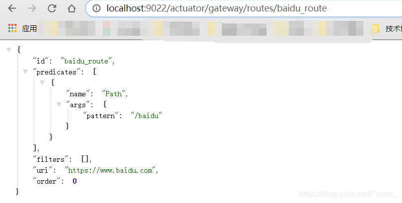
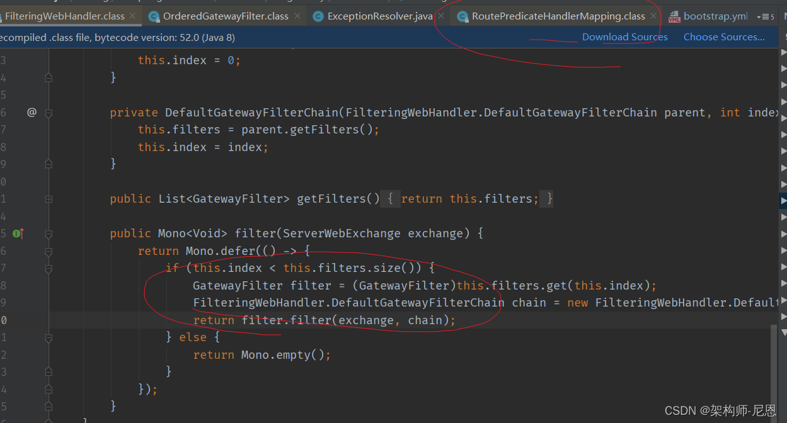
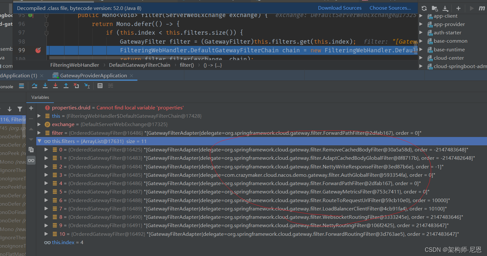

## 6、整合Nacos

### maven依赖

```xml
<?xml version="1.0" encoding="UTF-8"?>
<project xmlns="http://maven.apache.org/POM/4.0.0" xmlns:xsi="http://www.w3.org/2001/XMLSchema-instance"
         xsi:schemaLocation="http://maven.apache.org/POM/4.0.0 https://maven.apache.org/xsd/maven-4.0.0.xsd">
    <modelVersion>4.0.0</modelVersion>
    <parent>
        <groupId>org.springframework.boot</groupId>
        <artifactId>spring-boot-starter-parent</artifactId>
        <version>2.1.9.RELEASE</version>
        <relativePath/> <!-- lookup parent from repository -->
    </parent>
    <groupId>com.example</groupId>
    <artifactId>nacos_gateway</artifactId>
    <version>0.0.1-SNAPSHOT</version>
    <packaging>war</packaging>
    <name>nacos_gateway</name>
    <description>Demo project for Spring Boot</description>

    <properties>
        <java.version>1.8</java.version>
        <spring-cloud.version>Greenwich.SR3</spring-cloud.version>
    </properties>

    <dependencies>
        <dependency>
            <groupId>org.springframework.boot</groupId>
            <artifactId>spring-boot-starter-test</artifactId>
            <scope>test</scope>
        </dependency>
        <!--gateway-->
        <dependency>
            <groupId>org.springframework.cloud</groupId>
            <artifactId>spring-cloud-starter-gateway</artifactId>
        </dependency>
        <!--nacos dicovery-->
        <dependency>
            <groupId>org.springframework.cloud</groupId>
            <artifactId>spring-cloud-starter-alibaba-nacos-discovery</artifactId>
        </dependency>
    </dependencies>

    <dependencyManagement>
        <dependencies>
            <dependency>
                <groupId>org.springframework.cloud</groupId>
                <artifactId>spring-cloud-dependencies</artifactId>
                <version>${spring-cloud.version}</version>
                <type>pom</type>
                <scope>import</scope>
            </dependency>
            <dependency>
                <groupId>org.springframework.cloud</groupId>
                <artifactId>spring-cloud-alibaba-dependencies</artifactId>
                <version>0.2.2.RELEASE</version>
                <type>pom</type>
                <scope>import</scope>
            </dependency>
        </dependencies>
    </dependencyManagement>

    <build>
        <plugins>
            <plugin>
                <groupId>org.springframework.boot</groupId>
                <artifactId>spring-boot-maven-plugin</artifactId>
            </plugin>
        </plugins>
    </build>

</project>
```

需要注意在Gateway服务中的pom.xml文件中不要存在这个jar

```xml
<dependency>
    <groupId>org.springframework.boot</groupId>
    <artifactId>spring-boot-starter-tomcat</artifactId>
    <scope>provided</scope>
</dependency>
```

否则调用接口时会报以下错误因为gateway使用的是webflux,默认使用netty,所以从依赖中排除 tomcat相关的依赖

```yaml
java.lang.ClassCastException: org.springframework.core.io.buffer.DefaultDataBufferFactory cannot be cast to org.springframework.core.io.buffer.NettyDataBufferFactory
    at org.springframework.cloud.gateway.filter.NettyWriteResponseFilter.lambda$filter$1(NettyWriteResponseFilter.java:82) ~[spring-cloud-gateway-core-2.1.3.RELEASE.jar:2.1.3.RELEASE]
    at reactor.core.publisher.MonoDefer.subscribe(MonoDefer.java:44) [reactor-core-3.2.12.RELEASE.jar:3.2.12.RELEASE]
```

错误2 是由于 spring-boot-starter-web 引起

### 服务发现配置：从Nacos获取微服务提供者清单

```yaml
server:
  port: 9999

spring:
  application:
    name: springcloud-gateway
  profiles:
    active: dev
  cloud:
    nacos:
      discovery:
        server-addr: ${NACOS_SERVER:cdh1:8848}
      config:
        server-addr: ${NACOS_SERVER:cdh1:8848}
        prefix: springcloud-gateway
        group: DEFAULT_GROUP
        file-extension: yml
        ext-config:
          - data-id: crazymaker-db-dev.yml
            group: DEFAULT_GROUP
            refresh: true
          - data-id: crazymaker-redis-dev.yml
            group: DEFAULT_GROUP
            refresh: true
          - data-id: crazymaker-common-dev.yml
            group: DEFAULT_GROUP
            refresh: true
          - data-id: some.properties
            group: DEFAULT_GROUP
            refresh: true
    gateway:
      enabled: true
      discovery:
        locator:
          enabled: true  #开启从注册中心动态创建路由的功能，利用微服务名进行路由
          lower-case-service-id: true
          filters:
            - args[name]: serviceId
              name: Hystrix
          predicates:
            - args[pattern]: '"''/''+serviceId+''/**''"'
              name: Path
      routes:
        - id: blog
          uri: https://blog.csdn.net/
          predicates:
            - Path=/csdn
        - id: blog1
          uri: https://blog.csdn.net/
          predicates:
            - Path=/blog1/**
          filters:
            - RewritePath=/blog1/(?<segment>.*), /$\{segment}
        # 代理前  http://192.168.68.1:9999/blog1/crazymakercircle/article/details/80208650
        #  代理后  https://blog.csdn.net/crazymakercircle/article/details/80208650
        - id: service_provider_demo_route
          uri: lb://service-provider-demo
          predicates:
            - Path=/provider/**
        - id: service_provider_demo_route_filter
          uri: lb://service-provider-demo
          predicates:
            - Path=/filter/**
          filters:
            - RewritePath=/filter/(?<segment>.*), /provider/$\{segment}
            - UserIdCheck
        - id: service_consumer_demo_route
          uri: lb://service-consumer-demo
          predicates:
            - Path=/consumer/**
        - id: sentinel_demo_provider_route
          uri: lb://sentinel-demo-provider
          predicates:
            - Path=/sentinel-demo/**
        - id: uaa-provider_route
          uri: lb://uaa-provider
          predicates:
            - Path=/uaa-provider/**
    sentinel:
      transport:
        dashboard: cdh1:8849 #配置Sentinel dashboard地址
        port: 8719   #这里配置的是本地端口
      eager: true
    inetutils:
      timeout-seconds: 10
      preferred-networks: ${SCAFFOLD_PREFERRED_NETWORKS:192.168.68.}
      prefer-ip-address: true  #访问路径可以显示IP地址


ribbon:
  eager-load:
    enabled: true # 开启Ribbon的饥饿加载模式，启动时创建 RibbonClient
  MaxAutoRetries: 1 # 同一台实例的最大重试次数，但是不包括首次调用，默认为1次
  MaxAutoRetriesNextServer: 2  # 重试负载均衡其他实例的最大重试次数，不包括首次调用，默认为0次
  OkToRetryOnAllOperations: true  # 是否对所有操作都重试，默认false
  ServerListRefreshInterval: 2000 # 从注册中心刷新服务器列表信息的时间间隔，默认为2000毫秒，即2秒
  retryableStatusCodes: 400,401,403,404,500,502,504
  NFLoadBalancerRuleClassName: com.netflix.loadbalancer.RetryRule #配置规则 重试
  ConnectTimeout: 3000  #连接建立的超时时长，默认1秒
  ReadTimeout: 3000 #处理请求的超时时间，默认为1秒
  MaxTotalConnections: 1000  # 最大连接数
  MaxConnectionsPerHost: 1000  # 每个host最大连接数
  restclient:
    enabled: true


hystrix:
  threadpool:
    default:
      coreSize: 10 # 线程池核心线程数
      maximumSize: 20  # 线程池最大线程数
      allowMaximumSizeToDivergeFromCoreSize: true   # 线程池最大线程数是否有效
      keepAliveTimeMinutes: 10  # 设置可空闲时间，单位分钟
    demo-provider:
      coreSize: 20   # 线程池核心线程数
      maximumSize: 100   # 线程池最大线程数
      allowMaximumSizeToDivergeFromCoreSize: true   # 线程池最大线程数是否有效
      keepAliveTimeMinutes: 20  # 设置可空闲时间，单位分钟
  propagate:
    request-attribute:
      enabled: true
  command:
    default:  #全局默认配置
      execution:  #线程隔离相关配置
        timeout:
          enabled: true   #是否给方法执行设置超时时间，默认为true。一般我们不要改。
        isolation:
          strategy: THREAD    #配置请求隔离的方式，这里是默认的线程池方式。还有一种信号量的方式semaphore，使用比较少。
          thread:
            timeoutInMilliseconds: 100000  #方式执行的超时时间，默认为1000毫秒，在实际场景中需要根据情况设置
            interruptOnTimeout: true   #发生超时时是否中断方法的执行，默认值为true。不要改。
            interruptOnCancel: false  #是否在方法执行被取消时中断方法，默认值为false。没有实际意义，默认就好！
      circuitBreaker:   #熔断器相关配置
        enabled: true   #是否启动熔断器，默认为true，false表示不要引入 Hystrix。
        requestVolumeThreshold: 20     #启用熔断器功能窗口时间内的最小请求数，假设我们设置的窗口时间为10秒，
        sleepWindowInMilliseconds: 5000    #此配置的作用是指定熔断器打开后多长时间内允许一次请求尝试执行，官方默认配置为5秒。
        errorThresholdPercentage: 50   #窗口时间内超过50%的请求失败后就会打开熔断器将后续请求快速失败掉,默认配置为50
      metrics:
        rollingStats:
          timeInMilliseconds: 10000
          numBuckets: 10

# 暴露监控端点
management:
  endpoints:
    web:
      exposure:
        include: '*'
```

### nacos实现动态配置

使用nacos实现动态路由，以上两种方式都是实现的静态配置路径，只能应对部分场景，接下来配置nacos实现动态配置以及配置的存储，由于gateWay并没有适配nacos，需要自定义监听器：

```java
@Component
@Slf4j
public class NacosDynamicRouteService implements ApplicationEventPublisherAware {
    private String dataId = "gateway-router";
    private String group = "DEFAULT_GROUP";
    @Value("${spring.cloud.nacos.config.server-addr}")
    private String serverAddr;
    @Autowired
    private RouteDefinitionWriter routeDefinitionWriter;
    private ApplicationEventPublisher applicationEventPublisher;
    private static final List<String> ROUTE_LIST = new ArrayList<>();
    @PostConstruct
    public void dynamicRouteByNacosListener() {
        try {
            ConfigService configService = NacosFactory.createConfigService(serverAddr);
            configService.getConfig(dataId, group, 5000);
            configService.addListener(dataId, group, new Listener() {
                @Override
                public void receiveConfigInfo(String configInfo) {
                    clearRoute();
                    try {
                        if (StringUtil.isNullOrEmpty(configInfo)) {//配置被删除
                            return;
                        }
                        List<RouteDefinition> gatewayRouteDefinitions = JSONObject.parseArray(configInfo, RouteDefinition.class);
                        for (RouteDefinition routeDefinition : gatewayRouteDefinitions) {
                            addRoute(routeDefinition);
                        }
                        publish();
                    } catch (Exception e) {
                        log.error("receiveConfigInfo error" + e);
                    }
                }
                @Override
                public Executor getExecutor() {
                    return null;
                }
            });
        } catch (NacosException e) {
            log.error("dynamicRouteByNacosListener error" + e);
        }
    }
    private void clearRoute() {
        for (String id : ROUTE_LIST) {
            this.routeDefinitionWriter.delete(Mono.just(id)).subscribe();
        }
        ROUTE_LIST.clear();
    }
    private void addRoute(RouteDefinition definition) {
        try {
            routeDefinitionWriter.save(Mono.just(definition)).subscribe();
            ROUTE_LIST.add(definition.getId());
        } catch (Exception e) {
            log.error("addRoute error" + e);
        }
    }
    private void publish() {
        this.applicationEventPublisher.publishEvent(new RefreshRoutesEvent(this.routeDefinitionWriter));
    }
    @Override
    public void setApplicationEventPublisher(ApplicationEventPublisher applicationEventPublisher) {
        this.applicationEventPublisher = applicationEventPublisher;
    }
```

在nacos中增加一个规则：

```json
[{
    "filters": [],
    "id": "baidu_route",
    "order": 0,
    "predicates": [{
        "args": {
            "pattern": "/baidu"
        },
        "name": "Path"
    }],
    "uri": "https://www.baidu.com"
}]
```

访问网关的路由规则，能看到刚刚加入的规则，访问*http://localhost:9022/baidu*时请求直接被转发到百度的首页了。



### 服务发现路由predicates和filters的自定义定义

可以将网关配置为基于使用DiscoveryClient注册中心注册的服务发现路由。

要启用此功能，请设置`spring.cloud.gateway.discovery.locator.enabled=true`，并确保DiscoveryClient实现位于classpath上并已启用（如netflix eureka、consul或zookeeper）。

### 为注册中心路由配置断言和过滤器

默认情况下，网关为通过DiscoveryClient创建的路由定义单个断言和过滤器。

默认断言是使用`/serviceId/**`定义的path断言，其中 serviceId 是DiscoveryClient中服务的ID。
默认过滤器是使用正则表达式 `/serviceId/(?.*)`和替换的`/${remaining}`进行重写。这只是在请求被发送到下游之前从路径中截取掉 service id 。

**注意**

这个默认的过滤器，老版本没有，这就要命了

**尼恩这几天做 推送中台 架构实操的时候， 升级了一下 springcloud gateway，这就要要了命了**

请求全部是404

而且由于 响应式编程不是太好调试， 不过，尼恩不吃这套，喜欢深入敌后，进入源码后， 大概找到了 **断言处理迭代** 的地方， 看到了 10多个过滤器

其中一个过滤器 rewrite， 干了一件匪夷所思的事情，把后端服务的前缀给剔除了， 如果前缀是 serviceId的话

这就是咱们的问题所在：赶巧的是，咱后端微服务，需要路径前缀，并且，路径的前缀就是 serviceId

这下子，这个springcloud gateway的 升级骚操作，把 路劲前缀搞没了，当然路由不过去了， **害的我白瞎了2小时**



翻阅官方的文档，按照官方说明：

可以通过设置 spring.cloud.gateway.discovery.locator.predicates[x] and spring.cloud.gateway.discovery.locator.filters[y] 来， 去自定义 DiscoveryClient路由使用的断言和过滤器。

当做了定制以后，默认的就没了，如果你想要保留默认功能，需要手动加上 默认断言和过滤器。

下面是这样一个例子。

**Example 69. application.properties**

```yaml
spring.cloud.gateway.discovery.locator.predicates[0].name: Path
spring.cloud.gateway.discovery.locator.predicates[0].args[pattern]: "'/'+serviceId+'/**'"
spring.cloud.gateway.discovery.locator.predicates[1].name: Host
spring.cloud.gateway.discovery.locator.predicates[1].args[pattern]: "'**.foo.com'"
spring.cloud.gateway.discovery.locator.filters[0].name: Hystrix
spring.cloud.gateway.discovery.locator.filters[0].args[name]: serviceId
spring.cloud.gateway.discovery.locator.filters[1].name: RewritePath
spring.cloud.gateway.discovery.locator.filters[1].args[regexp]: "'/' + serviceId + '/(?<remaining>.*)'"
spring.cloud.gateway.discovery.locator.filters[1].args[replacement]: "'/${remaining}'"
```

于是，需要去掉这个RewritePath过滤器，下面为nacos定制客户端的过滤器

```yaml
    gateway:
      enabled: true
      discovery:
        locator:
          enabled: true  #开启从注册中心动态创建路由的功能，利用微服务名进行路由
          lower-case-service-id: true
          filters:
            - args[name]: serviceId
              name: Hystrix
          predicates:
            - args[pattern]: '"''/''+serviceId+''/**''"'
              name: Path
```

本质上，要不要去掉url的前缀，配置文件的下边，完全有规则可以自己配置，

当然，官方希望为 微服务 DiscoveryClient 路由 增加一些过滤器，也是可以理解的

不管怎么说，咱们这个场景下，只能覆盖 官方的默认的discovery.filters的配置啦， 于是进行了上边的修改

修改之后，重启，

再通过断点看过滤器，那个 rewrite 过滤器，没有了



终于不是404的错误了

> 看起来，springcloud 官方勤快的升级版本，也没有干什么有意义的事情， 做的很多都是花瓶的活儿

