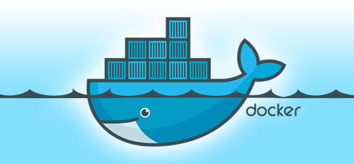
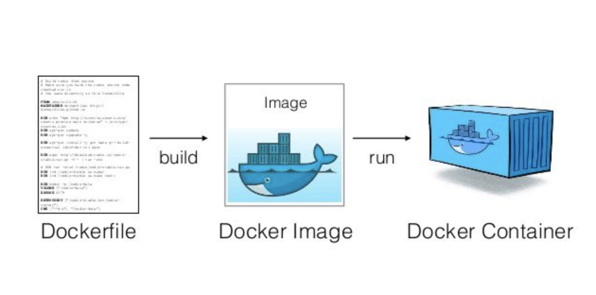
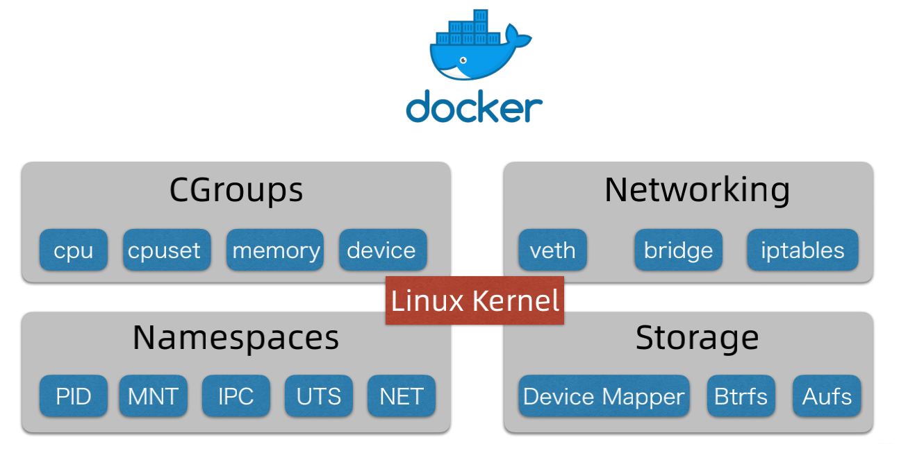
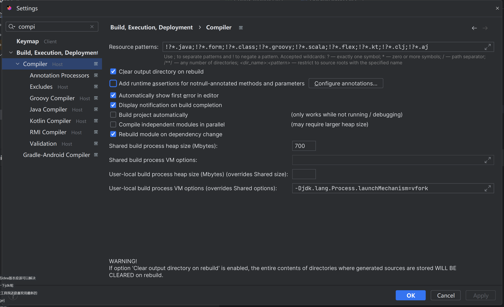

## 大纲

1. 讲解 Docker 的概念
2. Docker 的基本用法
   1. 命令行的用法
   2. Java 操作 Docker
   3. 使用 Docker 实现代码沙箱
3. 怎么提升 Docker 沙箱的安全性

## Docker 容器技术

为什么要用 Docker 容器技术？

为了进一步提升系统的安全性，把不同的程序和宿主机进行隔离，使得某个程序（应用）的执行不会影响到系统本身。

Docker 技术可以实现程序和宿主机的隔离。

### 什么是容器？

理解为对一系列应用程序、服务和环境的封装，从而把程序运行在一个隔离的、密闭的、隐私的空间内，对外整体提供服务。

可以把一个容器理解为一个新的电脑（定制化的操作系统）。



### Docker 基本概念

镜像：用来创建容器的安装包，可以理解为给电脑安装操作系统的系统镜像

容器：通过镜像来创建的一套运行环境，一个容器里可以运行多个程序，可以理解为一个电脑实例

Dockerfile：制作镜像的文件，可以理解为制作镜像的一个清单



镜像仓库：存放镜像的仓库，用户可以从仓库下载现成的镜像，也可以把做好的镜像放到仓库里

推荐使用 docker 官方的镜像仓库：https://hub.docker.com/search?q=nginx

### Docker 实现核心

> 对应题目：Docker 能实现哪些资源的隔离？

看图理解：

1）Docker 运行在 Linux 内核上

2）CGroups：实现了容器的资源隔离，底层是 Linux Cgroup 命令，能够控制进程使用的资源

3）Network 网络：实现容器的网络隔离，docker 容器内部的网络互不影响

4）Namespaces 命名空间：可以把进程隔离在不同的命名空间下，每个容器他都可以有自己的命名空间，不同的命名空间下的进程互不影响。

5）Storage 存储空间：容器内的文件是相互隔离的，也可以去使用宿主机的文件



docker compose：是一种同时启动多个容器的集群操作工具（容器管理工具），一般情况下，开发者仅做了解即可，实际使用 docker compose 时去百度配置文件

## 安装 Docker

一般情况下，不建议在 Windows 系统上安装。

Windows 本身就自带了一个虚拟机叫 WSL，但是我不推荐，肯定不如一个专业的、隔离的虚拟机软件要方便。

此处使用免费的 VMWare Workstation Player 软件：https://www.vmware.com/cn/products/workstation-player.html

请先完整观看教程，安装 Linux 虚拟机、Docker 环境和远程开发环境：https://www.bilibili.com/video/BV1h94y1k7Jf/（Ubuntu 系统）

## 命令行操作 Docker

1）查看命令用法

```shell
docker --help
```

查看具体子命令的用法：

```shell
docker run --help
```

2）从远程仓库拉取现成的镜像

用法：

```shell
docker pull [OPTIONS] NAME[:TAG|@DIGEST]
```

示例：

```shell
docker pull hello-world
```

3）根据镜像创建容器实例：

```shell
docker create [OPTIONS] IMAGE [COMMAND] [ARG...]
```

启动实例，得到容器实例 containerId：

```shell
sudo docker create hello-world
```

4）查看容器状态：

```shell
sudo docker ps -a
```

5）启动容器：

```shell
docker start [OPTIONS] CONTAINER [CONTAINER...]
```

启动示例：

```shell
sudo docker start mystifying_shamir
```

6）查看日志：

```shell
docker logs [OPTIONS] CONTAINER
```

启动示例：

```shell
sudo docker logs mystifying_shamir
```

7）删除容器实例：

```shell
docker rm [OPTIONS] CONTAINER [CONTAINER...]
```

删除示例：

```shell
sudo docker rm mystifying_shamir
```

8）删除镜像：

```shell
docker rmi --help
```

示例，强制删除：

```shell
sudo docker rmi hello-world -f
```

9）其他：构建镜像（build）、推送镜像（push）、运行容器（run）、执行容器命令（exec）等

## Java 操作 Docker

### 前置准备

使用 Docker-Java：https://github.com/docker-java/docker-java

官方入门：https://github.com/docker-java/docker-java/blob/main/docs/getting_started.md

先引入依赖：

```xml
<!-- https://mvnrepository.com/artifact/com.github.docker-java/docker-java -->
<dependency>
    <groupId>com.github.docker-java</groupId>
    <artifactId>docker-java</artifactId>
    <version>3.3.0</version>
</dependency>
<!-- https://mvnrepository.com/artifact/com.github.docker-java/docker-java-transport-httpclient5 -->
<dependency>
    <groupId>com.github.docker-java</groupId>
    <artifactId>docker-java-transport-httpclient5</artifactId>
    <version>3.3.0</version>
</dependency>
```

DockerClientConfig：用于定义初始化 DockerClient 的配置（类比 MySQL 的连接、线程数配置）

DockerHttpClient：用于向 Docker 守护进程（操作 Docker 的接口）发送请求的客户端，低层封装（不推荐使用），你要自己构建请求参数（简单地理解成 JDBC）

DockerClient（推荐）：才是真正和 Docker 守护进程交互的、最方便的 SDK，高层封装，对 DockerHttpClient 再进行了一层封装（理解成 MyBatis），提供了现成的增删改查

### 远程开发

使用 IDEA Development 先上传代码到 Linux，然后使用 JetBrains 远程开发完全连接 Linux 实时开发。

如果无法启动程序，修改 settings 的compiler 配置：`-Djdk.lang.Process.launchMechanism=vfork`



如果启动失败：

1）增加权限

2）重启虚拟机！重启远程开发环境！重启程序！

> 鱼皮直播时就是虚拟机卡了，重启后就好了

### 常用操作

1）拉取镜像：

```java
String image = "nginx:latest";
PullImageCmd pullImageCmd = dockerClient.pullImageCmd(image);
PullImageResultCallback pullImageResultCallback = new PullImageResultCallback() {
    @Override
    public void onNext(PullResponseItem item) {
        System.out.println("下载镜像：" + item.getStatus());
        super.onNext(item);
    }
};
pullImageCmd
        .exec(pullImageResultCallback)
        .awaitCompletion();
System.out.println("下载完成");
```

2）创建容器：

```java
CreateContainerCmd containerCmd = dockerClient.createContainerCmd(image);
CreateContainerResponse createContainerResponse = containerCmd
        .withCmd("echo", "Hello Docker")
        .exec();
System.out.println(createContainerResponse);
```

3）查看容器状态：

```java
ListContainersCmd listContainersCmd = dockerClient.listContainersCmd();
List<Container> containerList = listContainersCmd.withShowAll(true).exec();
for (Container container : containerList) {
    System.out.println(container);
}
```

4）启动容器：

```java

dockerClient.startContainerCmd(containerId).exec();
```

5）查看日志：

```java
// 查看日志
LogContainerResultCallback logContainerResultCallback = new LogContainerResultCallback() {
    @Override
    public void onNext(Frame item) {
        System.out.println(item.getStreamType());
        System.out.println("日志：" + new String(item.getPayload()));
        super.onNext(item);
    }
};

// 阻塞等待日志输出
dockerClient.logContainerCmd(containerId)
        .withStdErr(true)
        .withStdOut(true)
        .exec(logContainerResultCallback)
        .awaitCompletion();
```

6）删除容器：

```java

dockerClient.removeContainerCmd(containerId).withForce(true).exec();
```

7）删除镜像：

```java

dockerClient.removeImageCmd(image).exec();
```

## Docker 实现代码沙箱

实现思路：docker 负责运行 java 程序，并且得到结果。

流程几乎和 Java 原生实现流程相同：

1. 把用户的代码保存为文件
2. 编译代码，得到 class 文件
3. 把编译好的文件上传到容器环境内
4. 在容器中执行代码，得到输出结果
5. 收集整理输出结果
6. 文件清理，释放空间
7. 错误处理，提升程序健壮性

> 扩展：模板方法设计模式，定义同一套实现流程，让不同的子类去负责不同流程中的具体实现。执行步骤一样，每个步骤的实现方式不一样。

### 创建容器，上传编译文件

自定义容器的两种方式：

1）在已有镜像的基础上再扩充：比如拉取现成的 Java 环境（包含 jdk），再把编译后的文件复制到容器里。适合新项目、跑通流程

2）完全自定义容器：适合比较成熟的项目，比如封装多个语言的环境和	实现

思考：我们每个测试用例都单独创建一个容器，每个容器只执行一次 java 命令？

浪费性能，所以要创建一个 **可交互** 的容器，能接受多次输入并且输出。

创建容器时，可以指定文件路径（Volumn） 映射，作用是把本地的文件同步到容器中，可以让容器访问。

> 也可以叫容器挂载目录

```java
HostConfig hostConfig = new HostConfig();
hostConfig.setBinds(new Bind(userCodeParentPath, new Volume("/app")));
```

### 启动容器，执行代码

#### 执行代码

Docker 执行容器命令（操作已启动容器）：

```shell
 docker exec [OPTIONS] CONTAINER COMMAND [ARG...]
```

示例执行：

```shell
docker exec keen_blackwell java -cp /app Main 1 3
```

注意，要把命令按照空格拆分，作为一个数组传递，否则可能会被识别为一个字符串，而不是多个参数。

创建命令：

```java
String[] inputArgsArray = inputArgs.split(" ");
String[] cmdArray = ArrayUtil.append(new String[]{"java", "-cp", "/app", "Main"}, inputArgsArray);
ExecCreateCmdResponse execCreateCmdResponse = dockerClient.execCreateCmd(containerId)
        .withCmd(cmdArray)
        .withAttachStderr(true)
        .withAttachStdin(true)
        .withAttachStdout(true)
        .exec();
```

执行命令，通过回调接口来获取程序的输出结果，并且通过 StreamType 来区分标准输出和错误输出。

示例代码如下：

```java
String execId = execCreateCmdResponse.getId();
ExecStartResultCallback execStartResultCallback = new ExecStartResultCallback() {
    @Override
    public void onNext(Frame frame) {
        StreamType streamType = frame.getStreamType();
        if (StreamType.STDERR.equals(streamType)) {
            System.out.println("输出错误结果：" + new String(frame.getPayload()));
        } else {
            System.out.println("输出结果：" + new String(frame.getPayload()));
        }
        super.onNext(frame);
    }
};
try {
    dockerClient.execStartCmd(execId)
            .exec(execStartResultCallback)
            .awaitCompletion();
} catch (InterruptedException e) {
    System.out.println("程序执行异常");
    throw new RuntimeException(e);
}
```

尽量复用之前的 `ExecuteMessage` 对象，在异步接口中填充正常和异常信息，这样之后流程的代码都可以复用。

#### 获取程序执行时间

和 Java 原生一样，使用 StopWatch 在执行前后统计时间。

```java
stopWatch.start();
dockerClient.execStartCmd(execId)
        .exec(execStartResultCallback)
        .awaitCompletion(TIME_OUT, TimeUnit.MICROSECONDS);
stopWatch.stop();
time = stopWatch.getLastTaskTimeMillis();
```

#### 获取程序占用内存

程序占用的内存每个时刻都在变化，所以你不可能获取到所有时间点的内存。

我们要做的是，定义一个周期，定期地获取程序的内存。

Docker-Java 提供了内存定期统计的操作，示例代码如下：

```java
// 获取占用的内存
StatsCmd statsCmd = dockerClient.statsCmd(containerId);
ResultCallback<Statistics> statisticsResultCallback = statsCmd.exec(new ResultCallback<Statistics>() {

    @Override
    public void onNext(Statistics statistics) {
        System.out.println("内存占用：" + statistics.getMemoryStats().getUsage());
        maxMemory[0] = Math.max(statistics.getMemoryStats().getUsage(), maxMemory[0]);
    }

    @Override
    public void close() throws IOException {

    }

    @Override
    public void onStart(Closeable closeable) {

    }

    @Override
    public void onError(Throwable throwable) {

    }

    @Override
    public void onComplete() {

    }
});
statsCmd.exec(statisticsResultCallback);
```

注意，程序执行完后要关闭统计命令：

```java
statsCmd.close()
```

## Docker 容器安全性

### 超时控制

执行容器时，可以增加超时参数控制值：

```java
dockerClient.execStartCmd(execId)
        .exec(execStartResultCallback)
        .awaitCompletion(TIME_OUT, TimeUnit.MICROSECONDS);
```

但是，这种方式无论超时与否，都会往下执行，无法判断是否超时。

解决方案：可以定义一个标志，如果程序执行完成，把超时标志设置为 false。

示例代码如下：

```java
// 判断是否超时
final boolean[] timeout = {true};
String execId = execCreateCmdResponse.getId();
ExecStartResultCallback execStartResultCallback = new ExecStartResultCallback() {
    @Override
    public void onComplete() {
        // 如果执行完成，则表示没超时
        timeout[0] = false;
        super.onComplete();
    }
    
	...
};
```

### 内存资源

通过 HostConfig 的 withMemory 等方法，设置容器的最大内存和资源限制：

```java
CreateContainerCmd containerCmd = dockerClient.createContainerCmd(image);
HostConfig hostConfig = new HostConfig();
hostConfig.withMemory(100 * 1000 * 1000L);
hostConfig.withMemorySwap(0L);
hostConfig.withCpuCount(1L);
CreateContainerResponse createContainerResponse = containerCmd
        .withHostConfig(hostConfig)
        .exec();
```

### 网络资源

创建容器时，设置网络配置为关闭：

```java
CreateContainerResponse createContainerResponse = containerCmd
        .withHostConfig(hostConfig)
        .withNetworkDisabled(true)
```

### 权限管理

Docker 容器已经做了系统层面的隔离，比较安全，但不能保证绝对安全。

1）结合 Java 安全管理器和其他策略去使用

2）限制用户不能向 root 根目录写文件：

```java
CreateContainerResponse createContainerResponse = containerCmd
        .withHostConfig(hostConfig)
        .withNetworkDisabled(true)
        .withReadonlyRootfs(true)
```

3）Linux 自带的一些安全管理措施，比如 seccomp（Secure Computing Mode）是一个用于 Linux 内核的安全功能，它允许你限制进程可以执行的系统调用，从而减少潜在的攻击面和提高容器的安全性。通过配置 seccomp，你可以控制容器内进程可以使用的系统调用类型和参数。

示例 seccomp 配置文件 profile.json：

```json
{
  "defaultAction": "SCMP_ACT_ALLOW",
  "syscalls": [
    {
      "name": "write",
      "action": "SCMP_ACT_ALLOW"
    },
    {
      "name": "read",
      "action": "SCMP_ACT_ALLOW"
    }
  ]
}
```

在 hostConfig 中开启安全机制：

```java
String profileConfig = ResourceUtil.readUtf8Str("profile.json");
hostConfig.withSecurityOpts(Arrays.asList("seccomp=" + profileConfig));
```

## 本期成果

1. 学习 Java 操作 Docker 的方法
2. 用 Docker 实现了安全的代码沙箱

## 本期作业

1. 搭建 Linux + Docker 远程开发环境，掌握远程开发
2. 实践使用命令行和 Java 操作 Docker
3. 用 Docker 实现代码沙箱