## 本节重点

学习前端服务端渲染网站模板的开发，并且完成面试刷题平台 Web 前端的部分基础页面，包括：

- 需求分析
- Web 前端技术选型
- Next.js 前端万用模板开发（Web 前端项目初始化）

## 一、需求分析

### 需求列表

#### 基础功能（均为 P0）

- 用户模块
- - 用户注册
  - 用户登录（账号密码）
  - 【管理员】管理用户 - 增删改查
- 题库模块
- - 查看题库列表
  - 查看题库详情（展示题库下的题目）
  - 【管理员】管理题库 - 增删改查
- 题目模块
- - 题目搜索
  - 查看题目详情（进入刷题页面）
  - 【管理员】管理题目 - 增删改查（比如按照题库查询题目、修改题目所属题库等）

#### 高级功能（均为 P1 ~ P2）

- 题目批量管理 P1
- - 【管理员】批量向题库添加题目
  - 【管理员】批量从题库移除题目
  - 【管理员】批量删除题目
- 分词题目搜索 P1
- 用户刷题记录日历图 P1
- 自动缓存热门题目 P2
- 网站流量控制和熔断 P2
- 动态 IP 黑白名单过滤 P2
- 同端登录冲突检测 P2
- 分级题目反爬虫策略 P2

### 本节预期完成的需求

不涉及复杂的业务，仅开发通用的用户注册登录和数据管理能力。

- 用户模块
- - 用户注册 ✅
  - 用户登录（账号密码）✅
  - 【管理员】管理用户 - 增删改查 ✅
- 题库模块
- - 【管理员】管理题库 - 增删改查 ✅
- 题目模块
- - 【管理员】管理题目 - 增删改查 ✅

## 二、Web 前端技术选型

### 本项目选型

- React 18 框架
- ⭐️ Next.js 服务端渲染
- ⭐️ Redux 状态管理
- Ant Design 组件库
- 富文本编辑器组件
- ⭐️ 前端工程化：ESLint + Prettier + TypeScript
- ⭐️ OpenAPI 前端代码生成

其中，Next.js 服务端渲染技术是本项目学习的重点，也是前端开发的技术亮点。

### 服务端渲染介绍

#### 1、什么是客户端和服务端渲染？

网站渲染可以在服务端和客户端两种环境下进行。

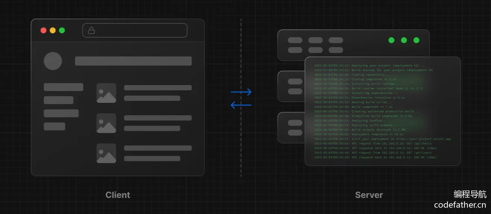

在客户端渲染（Client-Side Rendering，CSR）中，客户端（浏览器）会先向服务器请求 HTML 文件，服务器会返回一个基础的 HTML 文件，其中包含必要的 JavaScript 脚本。这些脚本在浏览器端运行，动态请求后端的数据、生成网页内容并渲染到页面上。

服务端渲染（Server-Side Rendering，SSR） 是一种将网页在 **服务器端** 生成并渲染为 HTML 内容的技术。在这种方式下，当用户请求一个网页时，服务器会提前调用后端能获取数据并生成完整的 HTML 文档，然后将其发送到客户端（浏览器）。浏览器接收到 HTML 后，直接展示页面内容，不用再动态地向后端发送请求来获取数据。

服务端渲染的工作流程通常如下：

1. 用户发送请求到服务器
2. 服务器处理请求，调用后端获取数据，并生成完整的 HTML 页面
3. 服务器将生成的 HTML 页面返回给客户端（浏览器）
4. 浏览器接收到 HTML 后，直接渲染页面

#### 2、客户端和服务端渲染的区别？

客户端渲染和服务端渲染的主要区别在于渲染过程发生的地点。

由于 Ajax、Vue、React 等新技术的崛起，大多数学前端的同学开发的网站都是基于客户端渲染实现的，客户端渲染的优点主要是：

1. 开发方便灵活：开发者不需要区分哪些数据要在服务端加载、哪些数据要在客户端加载，也不用担心哪些 API 无法在服务端使用。便于实现更加复杂和动态的用户界面，适合构建单页应用（SPA）和需要频繁交互的应用。
2. 减少服务器压力：由于渲染工作由客户端（用户自己的电脑）完成，因此服务器的负载相对较小，只需要提供静态资源（比如使用 Nginx 就能完成部署）。

以我们的 [编程导航网站](https://www.code-nav.cn/) 为例，就使用了客户端渲染，可以看到刚开始加载的 HTML 文档并不包含网站的数据，只有一个标题、以及一个 JS 脚本。

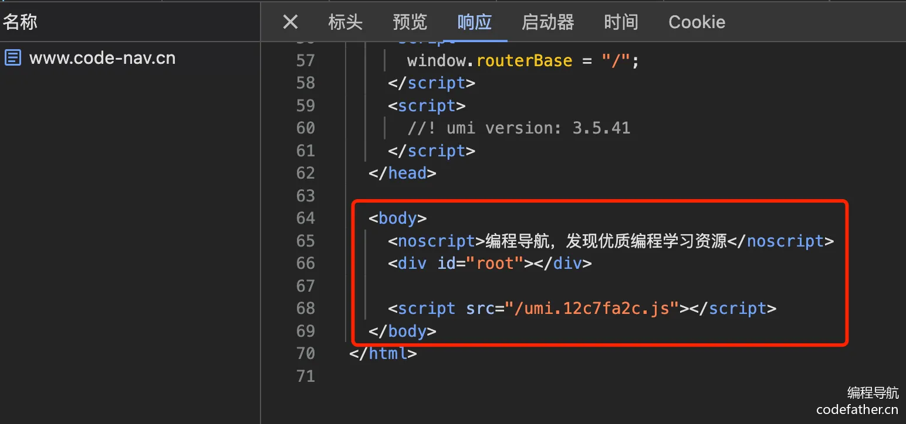

浏览器会执行该脚本，并触发后续的数据加载流程，逐渐加载显示整个页面，所以看到请求的过程是断断续续的。

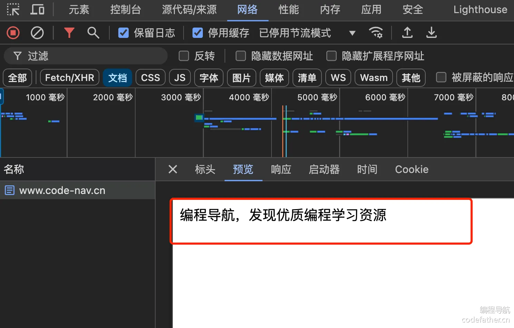

而我们的 [面试刷题网站 - 面试鸭](https://www.mianshiya.com/) 使用的是服务端渲染，可以看到，服务端返回的 HTML 文档中，就已经有完整的网站数据和样式了：

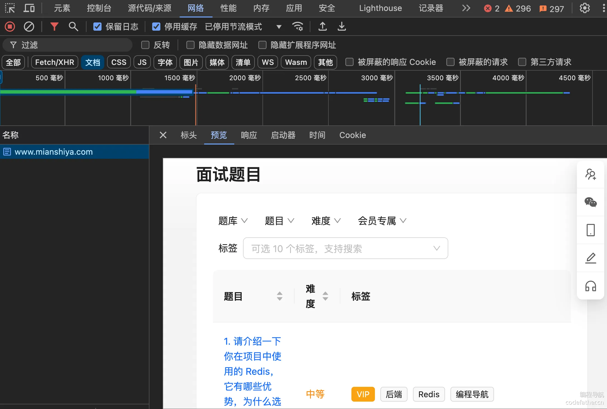

服务端渲染的好处是：

1. 减少初始加载时间：SSR 页面可以在首次加载时展示完整内容，减少白屏时间，而 CSR 通常需要等待 JavaScript 加载和执行后才能展示内容。
2. SEO 友好：SSR 更有利于 SEO，因为搜索引擎爬虫能够直接抓取完整页面的内容，而不依赖于 JavaScript 执行。

但相应的，SSR 将渲染任务交给服务器，可能会增加服务器的负载和压力。所以 SSR 更适合追求性能和 SEO 的企业级项目。

能够实现服务端渲染的技术很多，以前有 Java 的 JSP、PHP 等等，现在有基于 React 的 Next.js 和基于 Vue 的 Nuxt.js 框架，可以让你直接用前端的语法开发服务端渲染项目。

#### 3、其他渲染方式 - 静态网站生成

静态网站生成（Static Site Generation，SSG）是一种在构建阶段生成静态 HTML 文件的技术。与服务端渲染不同，静态网站生成是在构建时（而不是用户请求时）生成页面，所有页面都以静态文件的形式存在。

这种方式本质上也是客户端渲染，但是不需要由客户端再动态地向后端发送请求来获取数据，这些静态文件可以直接由内容分发网络（CDN）或静态服务器提供。

优点：

1. 高性能：由于服务器仅需提供静态文件，性能极高；而且由于数据不变化，特别适合通过 CDN 缓存加速。
2. SEO 友好：搜索引擎最喜欢的就是静态 HTML 文件，可以轻松索引并提升 SEO 效果。
3. 简化基础设施：无需复杂的前后端交互逻辑，静态文件的部署和维护成本较低。

缺点：

1. 动态内容有限：SSG 适合内容变化不频繁的场景，对于需要实时更新内容的网站，生成静态页面可能不够灵活。
2. 构建时间：生成大量静态页面时，构建时间可能较长，特别是数据量大的时候。

基于这些优缺点，静态网站生成适合内容数量有限的、内容基本不变的网站，比如个人博客。像 VuePress、Hugo、Hexo、Astro 都是主流的静态网站生成器。

[鱼皮的编程宝典](https://www.codefather.cn/) 就是基于 VuePress 开发的，模板也开源到了 GitHub 上：https://github.com/liyupi/codefather

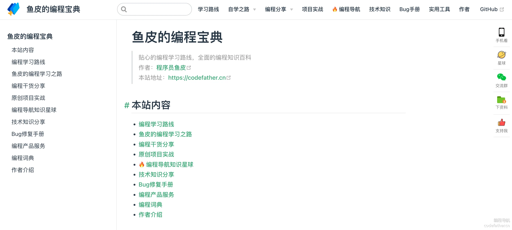

随着静态网站内容越来越多，每次构建会越来越慢，这种情况下，可以采用增量静态生成技术。

增量静态生成（Incremental Static Regeneration，ISR）允许部分页面在构建之后进行更新，而无需重新构建整个站点。这种技术适用于那些大多数内容不变、但某些部分需要动态更新的网站。

工作流程：

1. 在构建阶段，生成初始的静态页面。
2. 当页面内容更新时，通过配置的再生成间隔，静态页面可以增量更新，而不是重新生成整个站点，大幅减少构建时间。
3. 用户请求时，如果页面内容过期或更新，则后台自动生成新的静态页面并缓存。

这样一来，可以在享受静态网站高性能、SEO 友好特性的同时，及时更新网站的内容，并减少构建时间。

不过缺点就是架构更复杂、维护成本更高。但值得一提的是，很多大型网站为了做 SEO 优化，专门把动态网站转为静态 HTML（静态化）。

#### 4、结合使用（推荐）

实际情况下，前面讲到的几种方式可以结合使用。

比如 **部分预渲染**（Partial Prerendering，PPR）是一种将服务端渲染（或静态生成）与客户端渲染结合的技术。

工作流程：

1. 在构建阶段或请求阶段，页面的静态部分预先渲染（如导航栏、页脚等）。
2. 页面加载时，静态部分直接显示，动态部分由 JavaScript 在客户端加载并渲染。
3. 通过水合（Hydration）过程，客户端的 JavaScript 接管已经渲染的静态内容，并继续处理动态交互。

这样一来，兼具了 SSR 的 SEO 友好和快速初始加载、以及 CSR 灵活动态交互的优点。

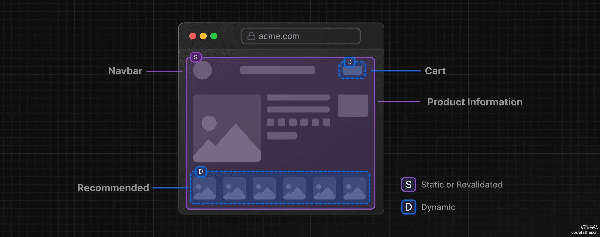

还有一个跟部分预渲染相似的概念叫 **同构渲染** ，是指同一套代码可以在服务端和客户端运行，并在服务端渲染页面的初始内容，然后在客户端接管渲染和交互。

实际情况下鱼皮也更推荐用这种方式，本项目鱼皮也会带大家使用主流的、新版本的 Next.js 框架实现同构渲染。下面先从 0 开始带大家做一个基于 Next.js 的前端万用项目模板。

## 三、Next.js 前端万用模板开发

自主打造一套前端开发项目模板！

### 确认环境！！！

打开 Next.js 的官方文档：https://nextjs.org/docs/getting-started/installation （注意不要看成国内的文档了，不够新）

本次我们要使用的是 14 版本的 Next.js，可以看到 Node.js 的版本要求必须 >= 18.18，一定要注意！

检测命令：

```shell
node -v
```

切换和管理 node 版本的工具：https://github.com/nvm-sh/nvm

```shell
npm -v
```

Next.js 有 2 种开发模式，注意，本项目用的是新的开发模式 App Router，不要看错了文档：

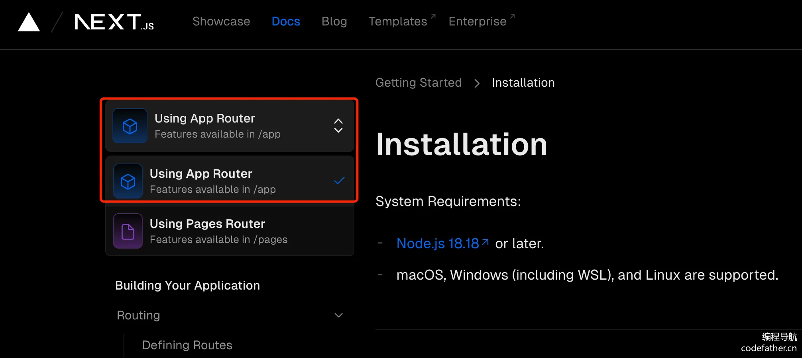

### 创建项目

直接按照官方文档的指引，使用 Npm 自带的 Npx 脚手架工具 `create-next-app` 来自动安装 Next.js 初始化项目：https://nextjs.org/docs/getting-started/installation#automatic-installation

执行安装命令：

```shell
npx create-next-app@latest
```

其中，latest 表示当前脚手架的最新版本。鱼皮使用的 `create-next-app` 脚手架版本是 `14.2.6`，可以在 [npm 包管理器网站](https://www.npmjs.com/package/create-next-app?activeTab=versions) 查看版本情况。如果 latest 版本安装失败或者后续跟鱼皮的项目不一致，建议把命令中的 latest 替换为 `14.2.6`。

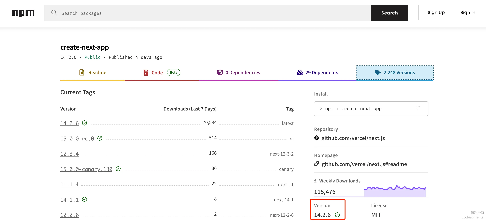

如果报了 “找不到命令” 错误，那么建议去 Node.js 官网重新安装 Npm，自动重新帮你配置环境变量。

脚手架可以帮我们自动整合 React、Next.js、TypeScript 语法、ESLint 校验等库，按下面的方式选择即可：

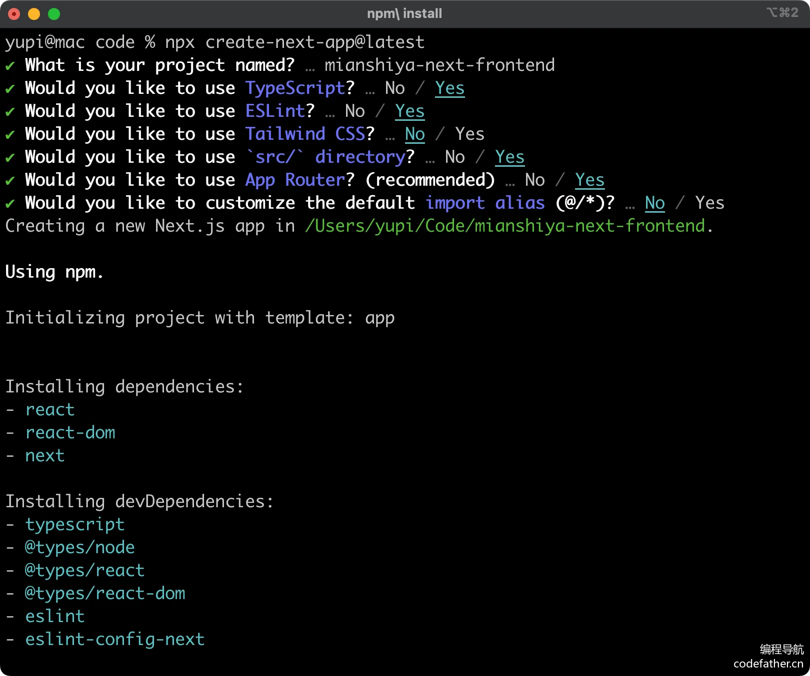

脚手架会自动生成代码并安装依赖，如果安装依赖卡住，可能需要更换 Npm 镜像为国内源：

```shell
npm config set registry https://registry.npmmirror.com/
```

然后用 WebStorm 打开项目，在终端执行 `npm run dev` 命令，能访问到网页就成功了。

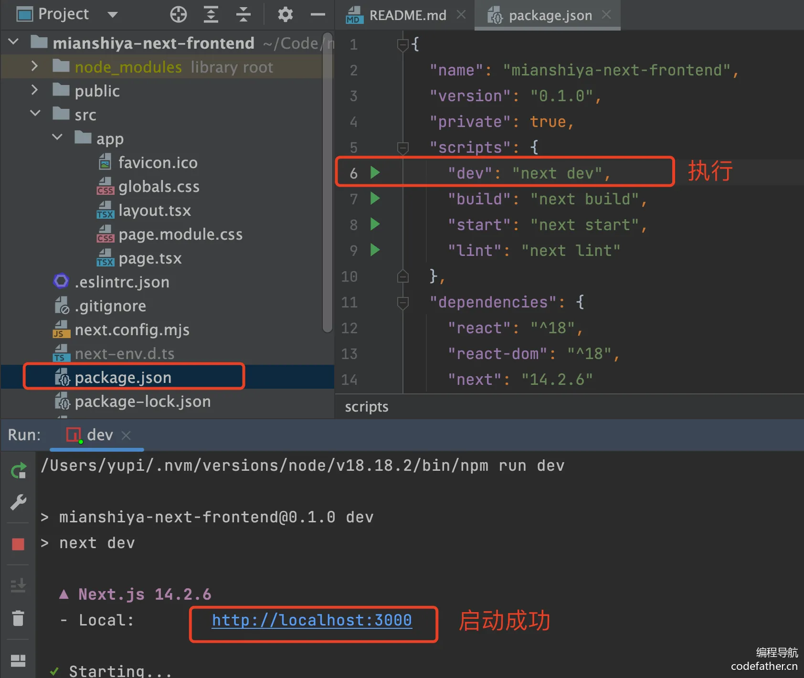

运行效果如图：

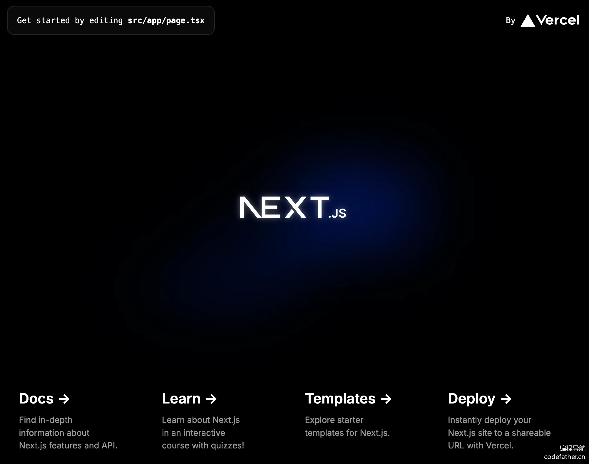

生成的项目代码已经默认使用 Git 版本控制系统进行托管，建议大家在后续开发模板和项目的过程中，多分步骤提交，便于回顾开发进度、除了问题也能快速回滚。

### 前端工程化配置

脚手架已经帮我们配置了 ESLint 自动校验、TypeScript 类型校验，但一般情况下，我们还需要代码自动格式化插件 Prettier，需要手动整合。

整合多个工具时，很容易出现版本冲突的问题，尤其是 ESlint 和 Prettier 整合时，校验规则可能也会存在冲突。所以最好按照官方文档的指引，比如：https://nextjs.org/docs/app/building-your-application/configuring/eslint#prettier

先去官网安装 prettier（ https://prettier.io/docs/en/install ），执行命令：

```shell
npm install --save-dev --save-exact prettier
```

然后通过命令安装整合包 eslint-config-prettier：

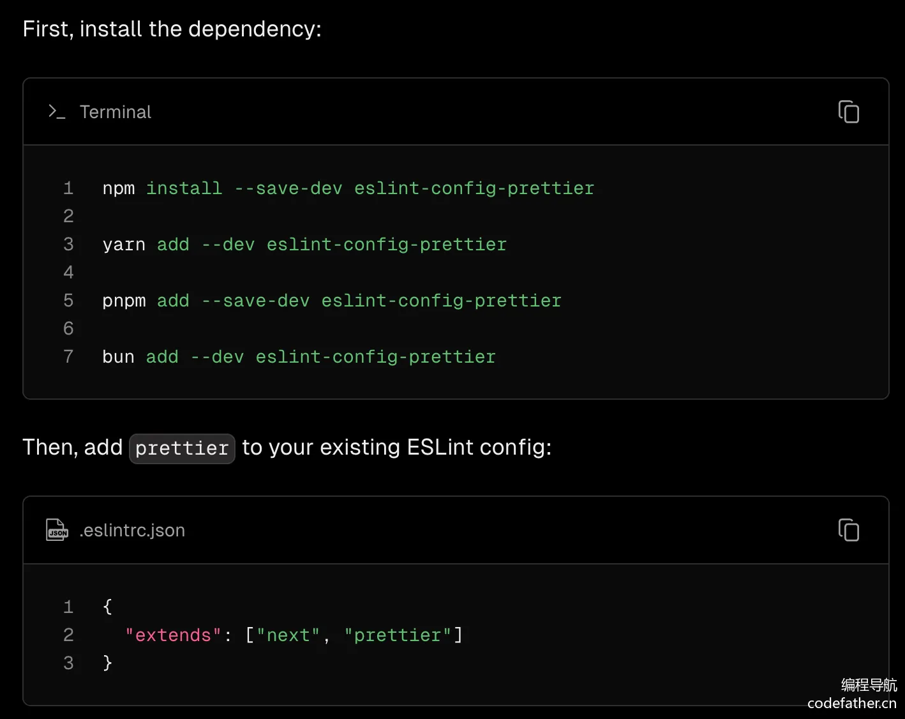

然后修改项目文件 `.eslintrc.json` 的配置：

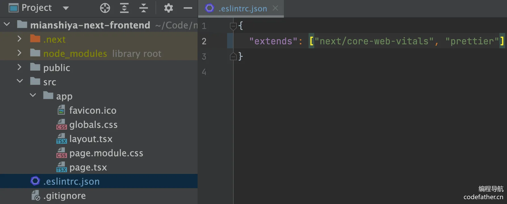

最后需要在 Webstorm 里开启代码美化插件：

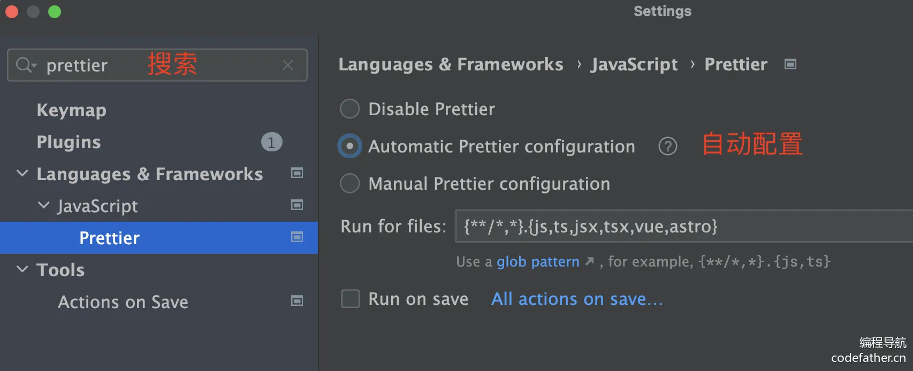

在任意一个 tsx 文件中执行格式化快捷键（Ctrl + Alt + L），不报错，表示配置工程化成功。

修改 .eslintrc.json 文件可以改变校验规则，一般自己做项目不需要修改，具体可以到 ESLint 和 Prettier 的官方文档查看。

如果不使用脚手架，就需要自己按照下面这些文档整合这些工具：

- 代码规范：https://eslint.org/docs/latest/use/getting-started
- 代码美化：https://prettier.io/docs/en/install.html
- 直接整合：https://github.com/prettier/eslint-plugin-prettier#recommended-configuration （包括了 https://github.com/prettier/eslint-config-prettier#installation ）

### 引入组件库

1）Ant Design 是 React 项目主流的组件库，Ant Design Procomponents 是在此基础上进一步封装的高级业务组件库，一般的项目使用这两个就足够了，我们的 [面试鸭](https://www.mianshiya.com/) 用的就是这些，完全满足需求。

参考官方文档在 Next.js 项目中引入 Ant Design 5.x 版本的组件库：https://ant-design.antgroup.com/docs/react/use-with-next-cn

执行安装：

```shell
npm install antd --save
```

针对 App Router 模式的 Next.js，需要处理页面闪动的情况：

```shell
npm install @ant-design/nextjs-registry --save
```

修改页面全局布局文件 `app/layout.tsx`：

```tsx
import { AntdRegistry } from "@ant-design/nextjs-registry";
import "./globals.css";

export default function RootLayout({
  children,
}: Readonly<{
  children: React.ReactNode;
}>) {
  return (
    <html lang="en">
      <body>
        <AntdRegistry>{children}</AntdRegistry>
      </body>
    </html>
  );
}
```

测试一下，随便在 `app/page.tsx` 引入一个组件，如果显示出来，就表示引入成功。

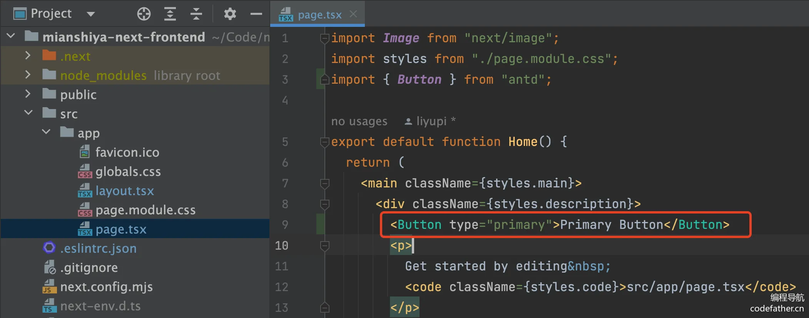

效果如图：

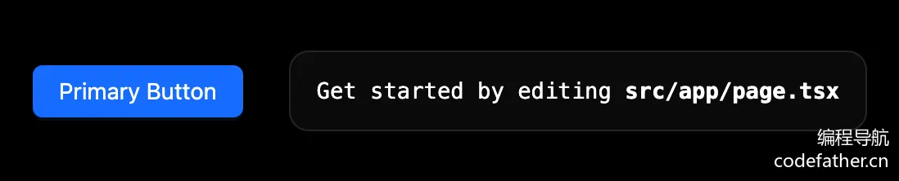

注意，引入 Ant Design 后，个人不建议再引入 Tailwind CSS 了，可能会有样式冲突问题。

2）引入 Ant Design 后，我们还可以引入 Ant Design Procomponents，参考 [官方文档](https://procomponents.ant.design/docs) 执行下列命令即可：

```shell
npm i @ant-design/pro-components --save
```

当前 ProComponents **每一个组件都是一个独立的包**，需要在你的项目中安装对应的 npm 包并使用。比如使用 ProTable 表格组件，还需要安装 `@ant-design/pro-table`。

3）引入组件库后，可以清理掉 `app/globals.css` 中的样式，减少样式冲突。

修改为如下样式，减少浏览器默认样式的影响：

```css
* {
  box-sizing: border-box;
  padding: 0;
  margin: 0;
}

html,
body {
  max-width: 100vw;
  max-height: 100vh;;
}
```

### Next.js 开发规范

对于一个新项目，定义统一的开发规范是至关重要的。一般我们可以通过使用的技术框架的官方文档找到官方推荐的 **最佳实践**。比如可以在 Next.js 官方文档搜索 “best practices”：


这种方式适合有一定水平和文档阅读能力的同学，下面鱼皮给大家分享一些开发规范。

#### 1、约定式路由

Next.js 使用 **约定式路由**，根据文件夹的结构和名称，自动将对应的 URL 地址映射到页面文件。

常见的几种路由规则如下：

1）基础规则：以 app 目录作为根路径，根据文件夹的名称和嵌套层级，自动映射为 URL 地址。注意，只有目录下直接包含 page 文件（js、jsx、ts、tsx 都支持），才会被识别为路由。

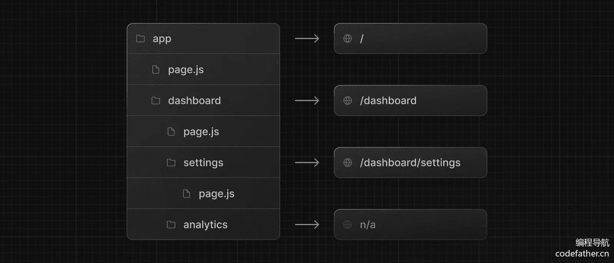

2）路由组：可以通过 `(xxx)` 语法，创建一个路由组，不会被转化为路径，可用于对路由进行分组管理，比如同组路由使用同一套布局。

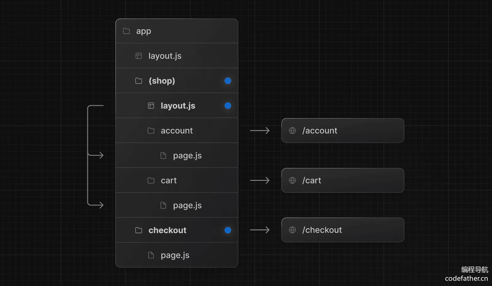

3）动态路由：可以通过 `[xxx]` 语法，让多个不同参数的 URL 复用同一个页面，比如 `app/question/[questionId]/page.tsx` 中 questionId 就是动态路由参数，可以匹配 `/question/1`、`/question/2` 等 URL 地址，在页面中可以获取到 questionId 并加载不同的题目。

```tsx
export default function Page({ params }: { params: { questionId: string } }) {
  return <div>我的题目: {params.questionId}</div>
}
```

以上只是 Next.js 的几种常用路由规则，还有其他的规则，详情可以见 Next.js 的官方文档：https://nextjs.org/docs/app/building-your-application/routing

#### 2、静态资源

Next.js 约定在 `/public` 目录下存放静态资源。在其中新建 assets 目录，可以在里面存放图片等静态资源文件，比如网站的 Logo。

对应官方文档：https://nextjs.org/docs/app/building-your-application/optimizing/static-assets


然后就可以用 Next.js 的 `Image` 组件加载静态资源，比如：

```tsx
<Image src={`/assets/logo.png`} alt={alt} width="64" height="64" />
```

Next.js 会针对该组件进行特定的图像优化，提升性能。

注意，某些特殊的、常用的元信息文件不是放在 public 目录下，而是应该根据特定规则放在 app 目录下！

对应官方文档：https://nextjs.org/docs/app/api-reference/file-conventions/metadata

比如将 favicon.ico 放到 app 的根目录下，可展示站点小图标：


阿里云盘：https://www.alipan.com/s/S2xSEgiAMJs 提取码: 86ai

将 robots.txt 放到 app 的根目录下，可用于告诉搜索引擎爬虫能否访问特定的页面、以及站点地图的地址，比如：

```tsx
User-Agent: *
Allow: /
Disallow: /private/

Sitemap: https://mianshiya.com/sitemap.xml
```

#### 3、文件组织形式

首先，项目中的每个页面和组件都是单独的文件夹。

基于 Next.js 的约定式路由，我们每个页面目录内需要添加 `page.tsx` 页面文件和 index.css 样式文件；每个组件目录内添加 `index.tsx` 页面文件和 index.css 样式文件。

对于项目中多页面公用的组件，放在 `src/components` 目录下；对于某个页面私有的组件，放在该页面的 components 目录下。

#### 4、页面开发规范

Next.js 支持 React 的语法，可以用函数的方式声明页面和组件。每个页面的根元素必须有 id、每个组件根元素必须有 className，用于控制样式和快速定位。

**为了区分服务端和客户端渲染，每个页面（或组件）都必须在开头显示编写 "use client" 或 "use server"**

比如定义一个客户端渲染的页面，代码如下：

```tsx
"use client";
// 引入样式
import "./index.css";

// 主页
export default function HomePage() {
  return (
    <main id="homePage">
      <div>
        程序员鱼皮x编程导航的项目教程
      </div>
    </main>
  );
}
```

2）定义组件的时候，需要使用 TypeScript 声明组件属性的类型，比如：

```tsx
"use client";
import { Viewer } from "@bytemd/react";
import "./index.css";

interface Props {
  value?: string;
}

const MdViewer = (props: Props) => {
  const { value = "" } = props;

  return (
    <div className="md-viewer">
      <Viewer value={value} plugins={plugins} />
    </div>
  );
};

export default MdViewer;
```

#### 5、其他注意事项

1）开发时要严格注意 TypeScript 的类型和编辑器的错误提示，并且定期打包构建。因为 Next.js 的构建要求非常严格，稍有不慎就会报错。构建报错的话，注意查看和处理构建中的报错信息。

2）在项目中慎用 window 等浏览器环境才支持的对象，服务端无法使用。注意保证客户端渲染页面和服务端渲染页面的一致性，否则会出现水合错误。

### 全局通用布局

所谓的布局，是指在多个页面间复用的 UI 元素，比如导航栏。

Next.js 支持全局根布局（每个页面都会生效）以及嵌套布局（可以只对部分页面生效），详情可 [参考文档](https://nextjs.org/docs/app/building-your-application/routing/layouts-and-templates#layouts)。

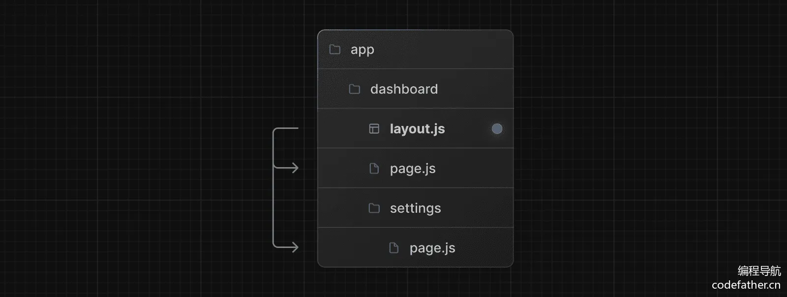

#### 基础布局结构

在 src 下新建 layouts 目录，用于存放项目中的各种布局。在该目录下新建一个布局 `BasicLayout`， 是一个文件夹，包括 index.tsx 页面和 index.css 样式文件。

可以直接使用 [Ant Design Procomponents 的布局组件](https://procomponents.ant.design/components/layout) 快速实现包含导航栏、内容、底部栏的响应式布局。

找一个和自己预期最符合的组件 Demo，并按需修改即可，比如 [基础布局示例](https://procomponents.ant.design/components/layout?tab=api#packages-layout-src-components-layout-tab-api-demo-base)：

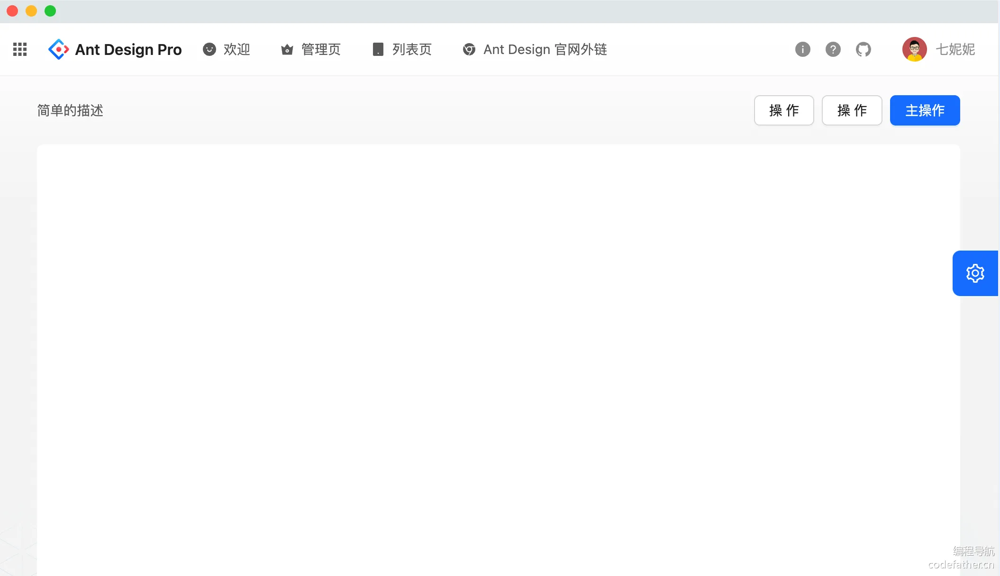

在 app 目录下的 layout.tsx 全局布局文件（可以理解为页面入口）中引入 BasicLayout：

```typescript
export default function RootLayout({
  children,
}: Readonly<{
  children: React.ReactNode;
}>) {
  return (
    <html lang="zh">
      <body>
        <AntdRegistry>
          <BasicLayout>{children}</BasicLayout>
        </AntdRegistry>
      </body>
    </html>
  );
}
```

💡 可以将 lang="en" 改为 lang="zh"，适配国内用户访问。

然后按需精简和修改 BasicLayout 中复制来的布局代码，直到项目可以正常运行并符合预期。

整个过程中，需要注意下面这些事项：

1）页面开头添加 "use client" 声明，表示客户端渲染

2）移除 useState、将获取 pathname 改为使用 Next.js 的 usePathname 钩子获取

3）移除无用代码，比如 token、siderMenuType

4）定义布局的 children 属性：

```typescript
interface Props {
  children: React.ReactNode;
}

export default function BasicLayout({ children }: Props) {
  // ...
}
```

5）修改菜单渲染函数：

```typescript
// 菜单渲染
menuItemRender={(item, dom) => (
  <Link href={item.path || "/"} target={item.target}>
    {dom}
  </Link>
)}
```

6）移除 window 对象的使用，解决服务端和客户端水合不一致的问题

#### 全局底部栏

在 src 下新建 components 目录，表示全局公用组件。

创建全局底部栏 GlobalFooter，通常用于展示版权信息，简单一点就好：

```tsx
import React from "react";
import "./index.css";

/**
 * 全局底部栏组件
 *
 * @author yupi
 */
export default function GlobalFooter() {
  const currentYear = new Date().getFullYear();

  return (
    <div className="global-footer">
      <div>© {currentYear} 面试刷题平台</div>
      <div>
        <a href="https://www.code-nav.cn" target="_blank">
          作者：编程导航 - 程序员鱼皮
        </a>
      </div>
    </div>
  );
}
```

样式代码如下：

```css
.global-footer {
  position: absolute;
  bottom: 0;
  width: 100%;
  background: #efefef;
  text-align: center;
  padding: 16px;
}
```

然后可以在 ProLayout 中渲染：

```tsx
footerRender={() => <GlobalFooter />}
```

需要在 BasicLayout 的样式文件中补充底部内边距，否则有些内容可能会被底部栏遮挡住。示例样式如下：

```css
.ant-pro-layout .ant-pro-layout-content {
  padding-bottom: 96px !important;
}
```

#### 全局顶部导航栏

可以直接利用 Ant Design Procomponents 的 ProLayout 组件实现，不用自己编写。

将 ProLayout 的 layout 属性设置为 top，可开启顶部导航栏：

```tsx
<ProLayout
  layout="top"
/>
```

ProLayout 将顶部导航栏从左到右分为几个区：标题区、菜单区、操作区、头像区

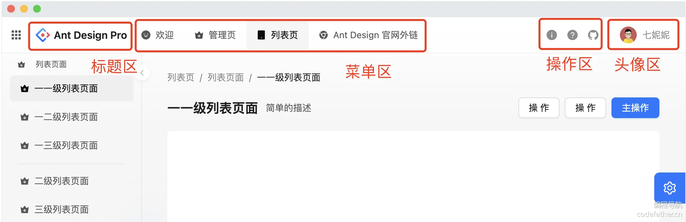

1）标题区：用于展示网站图标和标题

对应 ProLayout 的代码如下：

```tsx
// 标题渲染
headerTitleRender={(logo, title, _) => {
  return (
    <a href="https://www.mianshiya.com" target="_blank">
      {logo}
      {title}
    </a>
  );
}}
```

该渲染函数有 logo 和 title 参数，可以在 ProLayout 中添加对应的属性，以展示网站图标和标题。

```tsx
<ProLayout
  title="面试鸭刷题平台"
  logo={
    <Image
      src="/assets/logo.png"
      alt="面试鸭刷题网站"
      width={32}
      height={32}
    />
  }
>
```

效果如下：

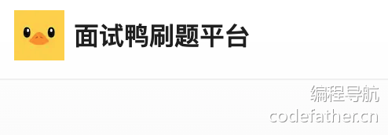

2）菜单区：用于展示导航栏的菜单，供用户切换页面

对应 ProLayout 的代码如下：

```tsx
// 菜单项数据
menuDataRender={() => {
  return [
    {
      path: "/",
      name: "主页",
    },
    {
      path: "/banks",
      name: "题库",
    },
  ];
}}
// 菜单渲染
menuItemRender={(item, dom) => (
  <Link href={item.path || "/"}>{dom}</Link>
)}
```

上述代码提供了两个函数，分别用于指定菜单项数据、菜单的渲染元素。

效果如下：


3）操作区：可用于配置右侧的操作栏，比如搜索条、小按钮等。

移动端可以不展示操作，对应 ProLayout 的代码如下：

```tsx
// 操作渲染
actionsRender={(props) => {
  if (props.isMobile) return [];
  return [
    <SearchInput key="search" />,
    <a
      key="github"
      href="https://github.com/liyupi/mianshiya-next"
      target="_blank"
    >
      <GithubFilled key="GithubFilled" />
    </a>,
  ];
}}
```

效果如下：

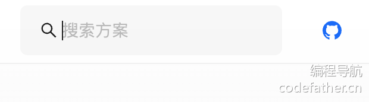

4）头像区：用于展示登录用户头像、用户昵称，鼠标悬浮上去还可以展示更多用户有关的操作按钮

对应 ProLayout 的代码如下：

```tsx
avatarProps={{
  src: "/assets/logo.png",
  size: "small",
  title: "鱼皮鸭",
  render: (props, dom) => {
    return (
      <Dropdown
        menu={{
          items: [
            {
              key: "logout",
              icon: <LogoutOutlined />,
              label: "退出登录",
            },
          ],
        }}
      >
        {dom}
      </Dropdown>
    );
  },
}}
```

整个顶部栏的效果如图：


#### 导航菜单配置

可以通过独立的配置文件更方便地修改导航菜单项，不用每次都修改布局代码。

实现步骤如下：

1）在 `/config` 目录下编写通用配置文件 `menus.tsx`，核心是菜单项数组，可以用 ProLayout 提供的 TypeScript 类型来规范：

```tsx
import { MenuDataItem } from "@ant-design/pro-layout";
import { CrownOutlined } from "@ant-design/icons";

// 菜单列表
const menus = [
  {
    path: "/",
    name: "主页",
  },
  {
    path: "/banks",
    name: "题库",
  },
  {
    path: "/questions",
    name: "题目",
  },
  {
    name: "面试鸭",
    path: "https://mianshiya.com",
    target: "_blank",
  },
  {
    path: "/admin",
    name: "管理",
    icon: <CrownOutlined />,
    children: [
      {
        path: "/admin/user",
        name: "用户管理",
      }
    ],
  },
] as MenuDataItem[];

// 导出
export default menus;
```

2）在全局布局的 ProLayout 中引入菜单数据：

```tsx
// 菜单项数据
menuDataRender={() => {
  return menus;
}}
```

可以看到如下效果：


3）同步路由的更新到菜单项高亮

同步高亮原理：可以使用 `usePathname` 客户端钩子函数获取到当前页面路径，然后传递给 ProLayout 的 location 属性即可自动匹配到对应 path 的菜单项。

代码如下：

```tsx
const pathname = usePathname();

<ProLayout
  layout="top"
  title="面试鸭刷题平台"
  location={{
    pathname,
  }}
/>
```

4）扩展能力：在 ProLayout 的菜单渲染函数中可以根据菜单项的属性来自定义菜单项渲染逻辑，比如支持配置超链接是否在新页面打开。

菜单项配置如下，target 的值为 `_blank` 表示在新页面打开：

```json
{
  name: "面试鸭",
  path: "https://mianshiya.com",
  target: "_blank",
}
```

修改菜单渲染函数，支持控制页面打开方式：

```tsx
// 菜单渲染
menuItemRender={(item, dom) => (
  <Link href={item.path || "/"} target={item.target}>{dom}</Link>
)}
```

💡 还可以按需补充更多能力，比如根据配置控制菜单的显隐，建议参考知名的菜单组件实现。

### 请求

前后端需要通过请求进行交互，本项目引入主流 Axios 请求库，并通过 OpenAPI 前端代码生成，大大提高开发效率。

注意，由于 Next.js 使用客户端和服务端同构渲染，需要选择一个同时支持 Node.js 和浏览器环境的请求库，而 Axios 是支持的。

#### 1、请求工具库

Axios 官方文档：https://axios-http.com/docs/intro

安装请求工具类 Axios，代码：

```shell
npm install axios
```

#### 2、全局自定义请求

需要自定义全局请求地址等，参考 Axios 官方文档，在 `/src/libs` 目录下编写请求配置文件 `request.ts`。包括全局接口请求地址、超时时间、自定义请求响应拦截器等。

比如可以在全局响应拦截器中，读取出结果中的 data，并校验 code 是否合法，如果是未登录状态，则自动登录。

示例代码如下，其中 `withCredentials: true` 一定要写，否则无法在发请求时携带 Cookie，就无法完成登录。

代码如下：

```typescript
import axios from "axios";

// 创建 Axios 示例
const myAxios = axios.create({
  baseURL: "http://localhost:8101",
  timeout: 10000,
  withCredentials: true,
});

// 创建请求拦截器
myAxios.interceptors.request.use(
  function (config) {
    // 请求执行前执行
    return config;
  },
  function (error) {
    // 处理请求错误
    return Promise.reject(error);
  },
);

// 创建响应拦截器
myAxios.interceptors.response.use(
  // 2xx 响应触发
  function (response) {
    // 处理响应数据
    const { data } = response;
    // 未登录
    if (data.code === 40100) {
      // 不是获取用户信息接口，或者不是登录页面，则跳转到登录页面
      if (
        !response.request.responseURL.includes("user/get/login") &&
        !window.location.pathname.includes("/user/login")
      ) {
        window.location.href = `/user/login?redirect=${window.location.href}`;
      }
    } else if (data.code !== 0) {
      // 其他错误
      throw new Error(data.message ?? "服务器错误");
    }
    return data;
  },
  // 非 2xx 响应触发
  function (error) {
    // 处理响应错误
    return Promise.reject(error);
  },
);

export default myAxios;
```

#### 3、自动生成请求代码

传统情况下，每个请求都要单独编写代码，很麻烦。

推荐使用 OpenAPI 工具，直接自动生成即可：https://www.npmjs.com/package/@umijs/openapi

按照官方文档的步骤，先安装：

```shell
npm i --save-dev @umijs/openapi
```

在 **项目根目录** 新建 `openapi.config.ts`，根据自己的需要定制生成的代码：

```typescript
const { generateService } = require("@umijs/openapi");

generateService({
  requestLibPath: "import request from '@/libs/request'",
  schemaPath: "http://localhost:8101/api/v2/api-docs",
  serversPath: "./src",
});
```

在 package.json 的 script 中添加 `"openapi": "ts-node openapi.config.ts"`

如果 ts-node 无法运行，改为 node

执行该命令，可以在 `/src/api` 目录看到生成的请求代码。

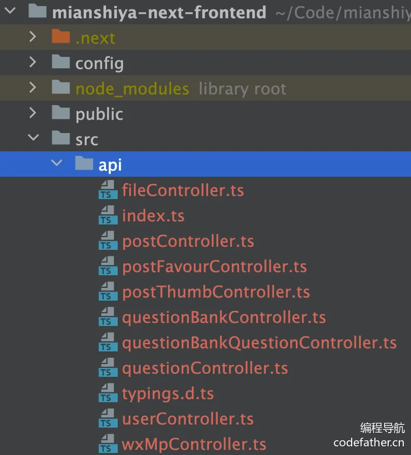

#### 4、测试请求代码

可以在 `app/page.tsx` 和 BasicLayout 中分别测试请求代码，分别在服务端和客户端执行请求：

```typescript
listQuestionBankVoByPageUsingPost({}).then((res) => {
    console.log(res);
});
```

查看编辑器控制台，可以看到 page.tsx 中服务端渲染执行的请求响应：

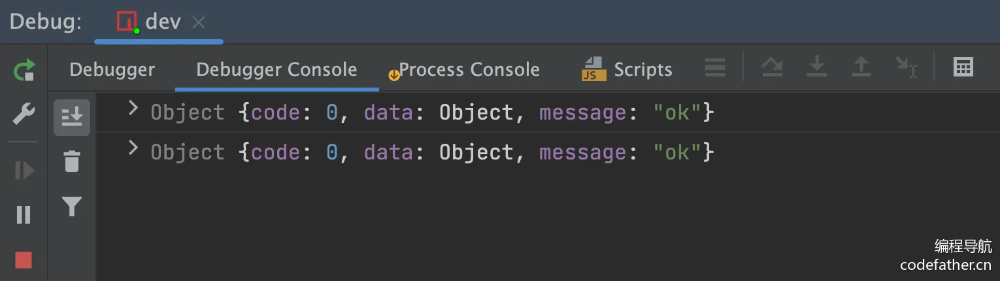

查看 F12 网络控制台，可以看到 BasicLayout 中客户端渲染执行的请求响应：

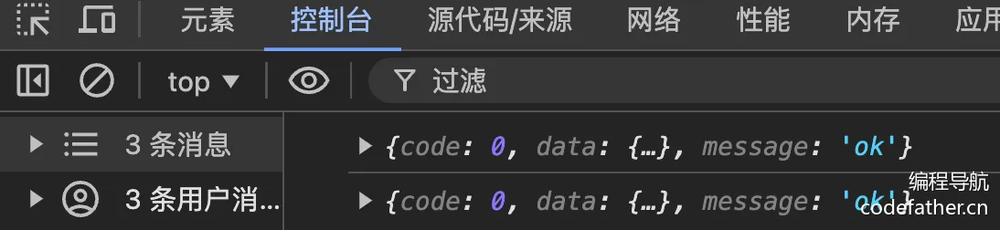

### 全局初始化逻辑

可以在 `app/layout.tsx` 中预留一个可以编写全局初始化逻辑的代码：

```tsx
/**
 * 全局初始化函数，有全局单次调用的代码，都可以写到这里
 */
const doInit = useCallback(() => {
  console.log("hello 欢迎来到我的项目");
}, []);

// 只执行一次
useEffect(() => {
  doInit();
}, []);
```

💡 注意，开发环境中可能会看到 useEffect 执行了 2 次，这是正常现象，生产环境不会出现这个问题。

可以封装出一层 InitLayout，而不要把初始化逻辑直接写到 RootLayout 中，可以更好地维护初始化逻辑，防止后续扩展代码时出现执行时机的冲突。（比如引入全局状态管理后，要先执行 RootLayout 的 Provider 组件，才能获取到 useDispatch）

```tsx
/**
 * 执行初始化逻辑的布局（多封装一层）
 * @param children
 * @constructor
 */
const InitLayout: React.FC<
  Readonly<{
    children: React.ReactNode;
  }>
> = ({ children }) => {
  /**
   * 全局初始化函数，有全局单次调用的代码，都可以写到这里
   */
  const doInit = useCallback(() => {
    console.log("hello 欢迎来到我的项目");
  }, []);
  
  // 只执行一次
  useEffect(() => {
    doInit();
  }, []);

  return <>{children}</>;
};
```

### 全局状态管理

#### 1、什么是全局状态管理？

是指多个页面需要共享或者跟踪变化的变量，可以放到全局来统一维护，而不是每个页面分别维护和获取。

适合作为全局状态的数据：已登录用户信息（每个页面几乎都要用）

在 Vue 中，主流的状态管理库有 Vuex 和 Pinia；在 React 项目中，主流的状态管理库是 Redux，本项目也将使用它。

#### 2、Redux 基本概念

React Redux 官方文档：https://react-redux.js.org/

Redux 中有一些常用的核心概念，不用理解，简单了解一下即可。

1）Store：整个应用状态（state）的容器，负责存储应用的状态，并提供访问状态、派发（dispatch）动作以及注册监听器等功能。

2）Action：一个普通的 JavaScript 对象，描述了状态变化的意图。每个 `action` 必须包含一个 `type` 字段，表示动作类型。

一般开发中，我们会用一个字符串常量（Action Types）来标识不同的动作类型。比如改变计数器需要的 increment 或 decrement：

```tsx
const INCREMENT = 'INCREMENT';
const DECREMENT = 'DECREMENT';
```

还会用 Action Creators 动作创建器函数来生成 action 对象，比如：

```tsx
const increment = () => ({
  type: INCREMENT,
});

const decrement = () => ({
  type: DECREMENT,
});
```

3）Dispatch：用于发送 action，触发状态更新。

4）Reducer：俗称状态处理器，根据当前状态和传入的 action 返回新的状态的函数。比如：

```tsx
const initialState = { count: 0 };

function counterReducer(state = initialState, action) {
  switch (action.type) {
    case INCREMENT:
      return { ...state, count: state.count + 1 };
    case DECREMENT:
      return { ...state, count: state.count - 1 };
    default:
      return state;
  }
}
```

可以通过一张图更好地理解这几个组件的关系： 


更多核心概念可以在官方文档了解：https://redux.js.org/tutorials/essentials/part-1-overview-concepts

#### 3、状态管理实战

React Redux 官方入门文档：https://react-redux.js.org/tutorials/quick-start

由于我们使用的是 TypeScript，还要参考 TypeScript 的快速启动文档：https://react-redux.js.org/tutorials/typescript-quick-start 。对于新手，上面两个文档最好按顺序阅读。

其实以前 Redux 的使用成本还是稍微有点高的，但官方提供了 Redux Toolkit，可以简化使用 Redux 的开发。

1）安装

```shell
npm install @reduxjs/toolkit react-redux
```

2）配置 Store

Store 是整个应用状态（state）的容器，负责存储应用的状态，并提供访问状态、派发（dispatch）动作以及注册监听器等功能。

在项目的 src 目录下新建 `stores` 目录，用于存放所有的状态。然后在 `stores` 目录下新建 `index.ts` 文件，创建一个空的 Redux Store：

```tsx
import { configureStore } from "@reduxjs/toolkit";

const store = configureStore({
  reducer: {
    // 在这里存放状态
  },
});

// 用于类型推断和提示
export type RootState = ReturnType<typeof store.getState>
export type AppDispatch = typeof store.dispatch

export default store;
```

3）在项目中引入 Redux Store，修改 `app/layout.tsx` 项目全局入口文件即可：

```typescript
import store from '@/stores'
import { Provider } from 'react-redux'

export default function RootLayout({
  children,
}: Readonly<{
  children: React.ReactNode;
}>) {

  return (
    <html lang="en">
      <body>
        <AntdRegistry>
          <Provider store={store}>
            <BasicLayout>{children}</BasicLayout>
          </Provider>
        </AntdRegistry>
      </body>
    </html>
  );
}
```

4）定义 Slice

Slice 是 Redux Toolkit 中的概念，它将状态和相关的 reducer 逻辑组织在一起，便于模块化管理。每个 slice 通常代表应用中的一部分状态（如用户、产品、购物车等）。

💡 在没有 Redux Toolkit 和 Slice 之前，传统的 Redux 开发需要定义 action types、action creators 和 reducer 函数，所有这些通常需要在不同的文件中编写，增加了代码的复杂性和维护成本。

在 `stores` 目录下新建 `loginUser.ts`，创建一个 slice 用于存储当前登录用户的信息。代码如下：

```tsx
import { createSlice, PayloadAction } from "@reduxjs/toolkit";
import { RootState } from "@/stores/index";

// 默认用户
const DEFAULT_USER: API.LoginUserVO = {
  userName: "未登录",
  userProfile: "暂无简介",
  userAvatar: "/assets/notLoginUser.png",
  userRole: "guest",
};

/**
 * 登录用户全局状态
 */
export const loginUserSlice = createSlice({
  name: "loginUser",
  initialState: DEFAULT_USER,
  reducers: {
    setLoginUser: (state, action: PayloadAction<API.LoginUserVO>) => {
      return {
        ...action.payload,
      };
    },
  },
});

// 修改状态
export const { setLoginUser } = loginUserSlice.actions;

export default loginUserSlice.reducer;
```

上述代码中，我们需要提供给未登录用户一个头像，放到 `/public/assets` 目录下，名称为 `notLoginUser.png`。如图：


5）在 Store 中引入新创建的 Slice，写在 reducer 里：

```tsx
import loginUser from "./loginUser";

const store = configureStore({
  reducer: {
    loginUser,
  },
});
```

6）获取状态

注意，状态是维护在客户端的，可以在任意 **客户端渲染** 页面（或组件）中使用状态，服务端渲染无法使用。

使用下列语法获取状态：

```tsx
const loginUser = useSelector((state: RootState) => state.loginUser);
```

比如可以在 BasicLayout 中添加上述代码，然后在页面中直接展示：

```typescript
{ JSON.stringify(loginUser) }
```

能够看到状态的初始值：

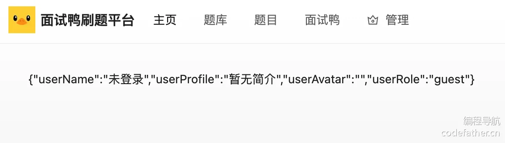

顶部导航栏右侧展示登录状态。修改 BasicLayout 中 ProLayout 的 avatarProps 的值即可。

```tsx
avatarProps={{
  src: loginUser.userAvatar || "/assets/logo.png",
  size: "small",
  title: loginUser.userName || "鱼皮鸭",
}
```

效果如下：

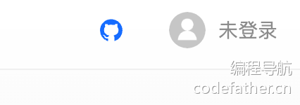

7）修改状态

修改状态也很方便，可以在 **首次进入到页面** 时，尝试获取登录用户信息。修改 `app/layout.tsx` 的全局初始化逻辑，编写远程获取登录用户数据的代码：

```typescript
/**
 * 初始化布局（多封装一层，使得能调用 useDispatch）
 * @param children
 * @constructor
 */
const InitLayout: React.FC<
  Readonly<{
    children: React.ReactNode;
  }>
> = ({ children }) => {
  const dispatch = useDispatch<AppDispatch>();

  // 初始化全局用户状态
  const doInitLoginUser = useCallback(async () => {
    // 获取用户信息
    const res = await getLoginUserUsingGet();
    if (res.data) {
      dispatch(setLoginUser(res.data));
    } else {
      // todo 测试代码，实际可删除
      setTimeout(() => {
        const testUser = { userName: "测试登录", id: 1 };
        dispatch(setLoginUser(testUser));
      }, 3000);
    }
  }, []);

  useEffect(() => {
    doInitLoginUser();
  }, []);

  return <>{children}</>;
};
```

其中，通过 dispatch 触发全局状态的更新：

```typescript
// 先获取 dispatch
const dispatch = useDispatch<AppDispatch>();
// 触发更新
dispatch(setLoginUser({...}));
```

效果如下：

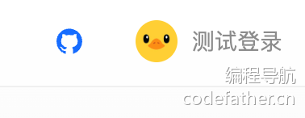

测试完成后可以移除登录按钮。

#### 扩展

有些页面可以不用获取全局初始化状态，比如用户登录和用户注册页，可以根据 pathname 判断：

```typescript
// 获取当前页面路径
const pathname = usePathname();

// 登录和注册页不用获取登录信息
if (
  !pathname.startsWith("/user/login") &&
  !pathname.startsWith("/user/register")
) {
  ...
}
```

### 全局权限管理

需求：能够灵活配置每个页面所需要的用户权限，由全局权限管理系统自动校验和拦截，而不需要在每个页面中编写权限校验代码，提高开发效率。

还要能够根据权限控制导航菜单的显隐，只有具有权限的菜单，才对用户可见。

#### 实现方案

1. 在路由配置文件， 定义某个路由的访问权限。由于 Next.js 项目是约定式路由，只有我们自定义的菜单配置文件，可以在菜单配置文件中定义权限。
2. 每次访问页面时，根据用户要访问页面的路由权限信息，判断用户是否有对应的访问权限，并进行相应的拦截处理。这是一个全局逻辑，可以在项目根布局 `app/layout.tsx` 中添加。
3. 导航栏展示菜单时，可以过滤掉登录用户没有权限的菜单项，从而实现根据权限控制导航菜单的显隐。

#### 开发实现

1）在 app 目录下新建 forbidden 无权限页面，内容随便写，比如：

```tsx
import { Result, Button } from "antd";
import React from "react";

/**
 * 无权限访问
 * @constructor
 */
const Forbidden = () => {
  return (
    <Result
      status="403"
      title="403"
      subTitle="抱歉，您无权访问此页面。 "
      extra={
        <Button type="primary" href="/">
          返回主页
        </Button>
      }
    />
  );
};

export default Forbidden;
```

2）在 src 下新建 access 目录，所有权限管理相关的代码都放在该目录下，模块化。只要不引入，就不会生效。

先在目录中定义权限枚举文件 accessEnum.ts：

```typescript
/**
 * 权限定义
 */
const ACCESS_ENUM = {
  NOT_LOGIN: "notLogin",
  USER: "user",
  ADMIN: "admin",
};

export default ACCESS_ENUM;
```

有了枚举类后，可以将全局状态中的默认用户权限改为 “未登录”：

```typescript
const DEFAULT_USER: API.LoginUserVO = {
  userName: "未登录",
  userProfile: "暂无简介",
  userAvatar: "/assets/notLoginUser.png",
  userRole: AccessEnum.NOT_LOGIN,
};
```

3）在菜单配置文件 menus.tsx 中补充对于权限的配置。比如：

```typescript
{
  path: "/admin",
  name: "管理",
  icon: <CrownOutlined />,
  access: ACCESS_ENUM.ADMIN,
  children: [
    {
      path: "/admin/user",
      name: "用户管理",
      access: ACCESS_ENUM.ADMIN,
    },
  ],
},
```

4）编写通用的权限校验方法。

为什么？因为菜单组件中要判断权限、权限拦截也要用到权限判断功能，所以抽离成公共模块。

新建 checkAccess.ts 文件，代码如下：

```typescript
import ACCESS_ENUM from "@/access/accessEnum";

/**
 * 检查权限（判断当前登录用户是否具有某个权限）
 * @param loginUser 当前登录用户
 * @param needAccess 需要有的权限
 * @return boolean 有无权限
 */
const checkAccess = (loginUser: API.LoginUserVO, needAccess = ACCESS_ENUM.NOT_LOGIN) => {
  // 获取当前登录用户具有的权限（如果没有 loginUser，则表示未登录）
  const loginUserAccess = loginUser?.userRole ?? ACCESS_ENUM.NOT_LOGIN;
  if (needAccess === ACCESS_ENUM.NOT_LOGIN) {
    return true;
  }
  // 如果用户登录才能访问
  if (needAccess === ACCESS_ENUM.USER) {
    // 如果用户没登录，那么表示无权限
    if (loginUserAccess === ACCESS_ENUM.NOT_LOGIN) {
      return false;
    }
  }
  // 如果需要管理员权限
  if (needAccess === ACCESS_ENUM.ADMIN) {
    // 如果不为管理员，表示无权限
    if (loginUserAccess !== ACCESS_ENUM.ADMIN) {
      return false;
    }
  }
  return true;
};

export default checkAccess;
```

可以根据自己的需要，修改判断权限的逻辑。

5）新增权限校验布局 AccessLayout.tsx，逻辑如下：

1. 获取到 pathname 和 loginUser
2. 根据 pathname 获取到对应的菜单项配置，并获取到所需的权限
3. 调用 checkAccess 函数检测是否具有权限。如果有，则正常返回内容；如果没有，返回到无权限页面。

可以先在 menus.tsx 中编写 “根据 pathname 获取到菜单项配置” 的函数，使用递归实现：

```tsx
// 根据路径查找所有菜单
export const findAllMenuItemByPath = (path: string): MenuDataItem | null => {
  return findMenuItemByPath(menus, path);
};

// 根据路径查找菜单
export const findMenuItemByPath = (
  menus: MenuDataItem[],
  path: string,
): MenuDataItem | null => {
  for (const menu of menus) {
    if (menu.path === path) {
      return menu;
    }
    if (menu.children) {
      const matchedMenuItem = findMenuItemByPath(menu.children, path);
      if (matchedMenuItem) {
        return matchedMenuItem;
      }
    }
  }
  return null;
};
```

由于该文件导出了多个函数，需要将 export default menus 改为 export menus：

```tsx
// 修改菜单项导出方式为 export
export const menus = [...];
```

并且同时修改 BasicLayout 中的引入代码：

```tsx
import { menus } from "../../../config/menus";
```

然后就可以编写权限校验布局 AccessLayout.tsx，代码如下：

```tsx
import { useSelector } from "react-redux";
import { RootState } from "@/stores";
import { usePathname } from "next/navigation";
import checkAccess from "@/access/checkAccess";
import Forbidden from "@/app/forbidden";
import React from "react";
import { findAllMenuItemByPath } from "../../config/menus";
import AccessEnum from "@/access/accessEnum";

/**
 * 统一权限校验拦截器
 * @param children
 * @constructor
 */
const AccessLayout: React.FC<
  Readonly<{
    children: React.ReactNode;
  }>
> = ({ children }) => {
  const pathname = usePathname();
  const loginUser = useSelector((state: RootState) => state.loginUser);
  // 权限校验
  const menu = findAllMenuItemByPath(pathname) || {};
  const needAccess = menu?.access ?? AccessEnum.NOT_LOGIN;
  const canAccess = checkAccess(loginUser, needAccess);
  if (!canAccess) {
    return <Forbidden />;
  }
  return <>{children}</>;
};

export default AccessLayout;
```

可以在 RootLayout 中引入，嵌入到 BasicLayout 中：

```tsx
export default function RootLayout({
  children,
}: Readonly<{
  children: React.ReactNode;
}>) {
  return (
    <html lang="zh">
      <body>
        <AntdRegistry>
          <Provider store={store}>
            <InitLayout>
              <BasicLayout>
                <AccessLayout>{children}</AccessLayout>
              </BasicLayout>
            </InitLayout>
          </Provider>
        </AntdRegistry>
      </body>
    </html>
  );
}
```

访问 /admin/user 页面，效果如下：


6）根据权限控制菜单显隐

新建 menuAccess.ts 文件，提供获取可访问菜单的函数：

```typescript
import checkAccess from "@/access/checkAccess";
import { menus } from "../../config/menus";

/**
 * 获取有权限、可访问的菜单
 * @param loginUser
 * @param menuItems
 */
const getAccessibleMenus = (loginUser: API.LoginUserVO, menuItems = menus) => {
  return menuItems.filter((item) => {
    if (!checkAccess(loginUser, item.access)) {
      return false;
    }
    if (item.children) {
      item.children = getAccessibleMenus(loginUser, item.children);
    }
    return true;
  });
};

export default getAccessibleMenus;
```

#### 扩展

还有其他实现权限校验的方法，比如使用高阶组件（HOC）在客户端进行权限校验，这种方法会更灵活。

创建一个 HOC 组件：

```tsx
// components/withAuth.js
import { useRouter } from 'next/router';
import { useEffect } from 'react';
import { useSelector } from 'react-redux'; // 或者使用其他全局状态管理库

export default function withAuth(Component) {
  return function AuthenticatedComponent(props) {
    const router = useRouter();
    const isAuthenticated = useSelector((state) => state.auth.isAuthenticated); // 获取用户登录状态

    useEffect(() => {
      if (!isAuthenticated) {
        // 如果未登录，重定向到登录页面
        router.push('/login');
      }
    }, [isAuthenticated]);

    // 如果未登录，不渲染组件
    if (!isAuthenticated) {
      return null;
    }

    // 如果已登录，渲染组件
    return <Component {...props} />;
  };
}
```

使用这个 HOC 包裹需要进行权限校验的页面：

```tsx
// pages/protected.js
import withAuth from '@/components/withAuth';

function ProtectedPage() {
  return <div>This is a protected page.</div>;
}

export default withAuth(ProtectedPage);
```

### 通用组件 - Markdown 编辑器组件

为什么用 Markdown？

一套通用的文本编辑语法，可以在各大网站上统一标准、渲染出统一的样式，比较简单易学。

推荐的 Md 编辑器：https://github.com/bytedance/bytemd

阅读官方文档，执行命令来安装编辑器主体、以及 gfm（表格支持）插件、highlight 代码高亮插件：

```shell
npm i @bytemd/react
npm i @bytemd/plugin-highlight @bytemd/plugin-gfm
```

在 `/src/components` 目录中新建 MdEditor 组件，编写代码：

```tsx
import { Editor } from "@bytemd/react";
import gfm from "@bytemd/plugin-gfm";
import highlight from "@bytemd/plugin-highlight";
import "bytemd/dist/index.css";
import "highlight.js/styles/vs.css";
import "./index.css";

interface Props {
  value?: string;
  onChange?: (v: string) => void;
  placeholder?: string;
}

const plugins = [gfm(), highlight()];

/**
 * Markdown 编辑器
 * @param props
 * @constructor
 */
const MdEditor = (props: Props) => {
  const { value = "", onChange, placeholder } = props;

  return (
    <div className="md-editor">
      <Editor
        value={value}
        placeholder={placeholder}
        mode="split"
        plugins={plugins}
        onChange={onChange}
      />
    </div>
  );
};

export default MdEditor;
```

上述代码中，我们要把 MdEditor 当前输入的值暴露给父组件，便于父组件去使用，同时也是提高组件的通用性，所以定义了属性和属性类型，把 value 和 onChange 事件交给父组件去管理。

可以按照官方文档对编辑器进行很多定制操作，比如切换语言为中文、切换主题样式、安装更多插件等等。如果发现官方给的操作无法满足定制需求和样式，可以使用覆盖 CSS、自己写 JS 的方式魔改。

比如隐藏编辑器中不需要的操作图标（像 GitHub 图标）：

```css
.bytemd-toolbar-icon.bytemd-tippy.bytemd-tippy-right:last-child {
    display: none;
}
```

有编辑器就有浏览器，MdViewer 示例代码如下：

```tsx
import { Viewer } from "@bytemd/react";
import gfm from "@bytemd/plugin-gfm";
import highlight from "@bytemd/plugin-highlight";
import "bytemd/dist/index.css";
import "highlight.js/styles/vs.css";
import "./index.css";

interface Props {
  value?: string;
}

const plugins = [gfm(), highlight()];

/**
 * Markdown 浏览器
 * @param props
 * @constructor
 */
const MdViewer = (props: Props) => {
  const { value = "" } = props;

  return (
    <div className="md-viewer">
      <Viewer value={value} plugins={plugins} />
    </div>
  );
};

export default MdViewer;
```

可以在任意客户端渲染页面（或组件）引入组件进行测试，这是因为该组件用到了 useRef 之类的仅客户端才支持的函数。比如在 BasicLayout 中引入：

```tsx
const [text, setText] = useState<string>('');

<MdEditor value={text} onChange={setText} />
<MdViewer value={text} />
```

效果如图：

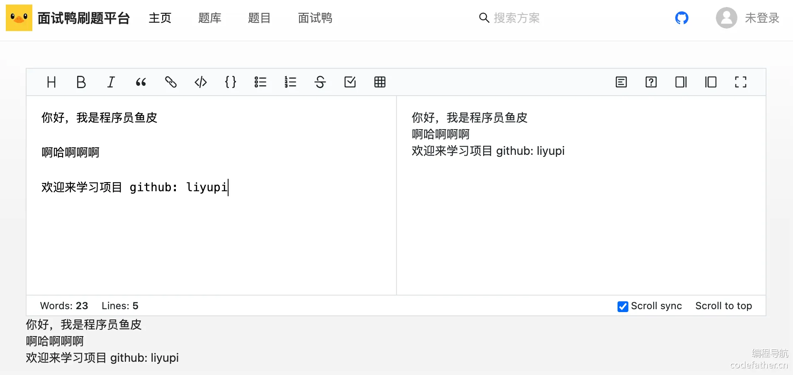

### 清理无用文件

最后，可以再清理一些无用文件，比如没用到的 public 资源、模板自带的页面代码等。

我们的万用基础前端项目模板（和业务无关）就搞定啦！接下来正式进入开发。

## 四、扩展思路

#### 1、前端模板支持多套布局

需求：不是所有页面都能统一布局，比如用户登录注册页可以不需要导航栏，因此模板需要多套布局能力。

实现思路：现在 layouts 目录中新定义一套布局。然后修改 `app/layout.tsx`，将写死的 BasicLayout 布局改为一个 getLayout 函数，函数内根据当前路由地址，返回不同的 Layout 布局。

#### 2、前端模板支持嵌套菜单配置

完善前端项目模板的导航菜单，根据嵌套路由生成嵌套的子菜单，如下图：

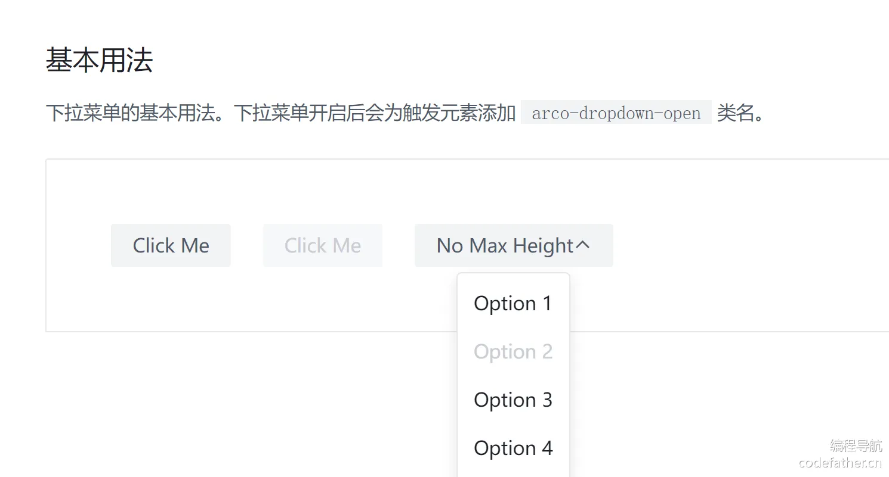

#### 3、前端全局错误处理

前端页面出现任何致命错误时，不是白屏，而是返回一个错误提示页面。

可以参考 Next.js 的官方文档实现：https://nextjs.org/docs/app/api-reference/file-conventions/error
