## 本节重点

内容安全性优化

- 同端登录冲突检测（基于 Sa-Token）
- 分级题目反爬虫策略（基于 Redis）

## 一、同端登录冲突检测

### 需求分析

在多用户系统中，如电商平台、企业办公系统或社交应用，用户的账户安全和系统的正常使用至关重要。

如果同一个账户同时在多个设备上登录，可能由于之前在别的地方临时登录后忘记退出账号，导致数据泄露或账户被滥用等问题。此外，还有可能会导致数据不一致问题，例如重复提交订单、聊天记录不同步等。

针对我们会员制的刷题网站，若会员账户被不法分子售卖或多人共享，将会损害公司利益。

为了防止这些情况，我们的系统需要能够实时监控和检测同一账户在多个设备上的登录情况，在检测到冲突时，及时通知用户并采取相应的安全措施（如强制下线或警告）。

### 方案设计

#### 1、账号冲突检测策略

常见业务上有 3 种冲突检测策略：

**1）单点登录模式**

同一时间，只允许同一账户在一个设备上登录。即每次新设备登录时，检测当前账户是否已经在其他设备上登录，若已登录则将其他设备强制下线。

一般应用于企业内部系统或包含敏感数据的系统中。

**2）多设备登录限制**

允许同一账户在多个设备上登录，但需限制设备数量（如最多两台）。即每次登录时，检测当前账户已登录设备数量，若超过限制，系统阻止登录或强制最早登录设备下线。

这种模式常见于视频网站、买断制 / 订阅制软件。

一个软件激活码只能同时在 X 台设备使用，也是类似的机制。

**3）同设备类型限制**

允许同一账户在不同设备类型（如手机和 PC）上同时登录，但同一类型设备只能登录一个。例如，用户可同时在电脑和 iPad 上使用我们的平台，但不能在两台手机上登录在线。（QQ 就是这样）

要想实现这种策略，需要记录账户登录设备的类型，每次登录时检查是否有同类设备已登录，如果有则强制下线相同设备类型的旧登录。

这种策略常应用于一些需兼顾多端体验的应用。比如我们的面试刷题平台用户，经常有 iPad 和电脑端同时刷题的需求，因此我们采用第 3 种策略 **同设备类型限制（同端互斥登录）。**

#### 2、实现思路

如何实现同端互斥登录呢？

1. 用户登录时获取当前设备信息（通过 User-Agent 获取）
2. 将用户登录信息与设备信息一起保存（本地或三方缓存中）
3. 用户登录时判断同设备是否已经登录（本地或缓存中是否已存在）
4. 如果检测到冲突，可以直接顶号（将前一个设备下线，也就是移除登录态）

其实自主实现这个需求也并不难，但涉及到登录这样的核心业务场景，经验不足的情况下，更建议使用一些成熟的第三方框架。比如轻量级 Java 权限认证框架 `Sa-Token` 内置了 [同端互斥登录功能](https://sa-token.cc/doc.html#/up/mutex-login)，可以更快更稳地实现。

以下为 Sa-Token 同端互斥示意图：

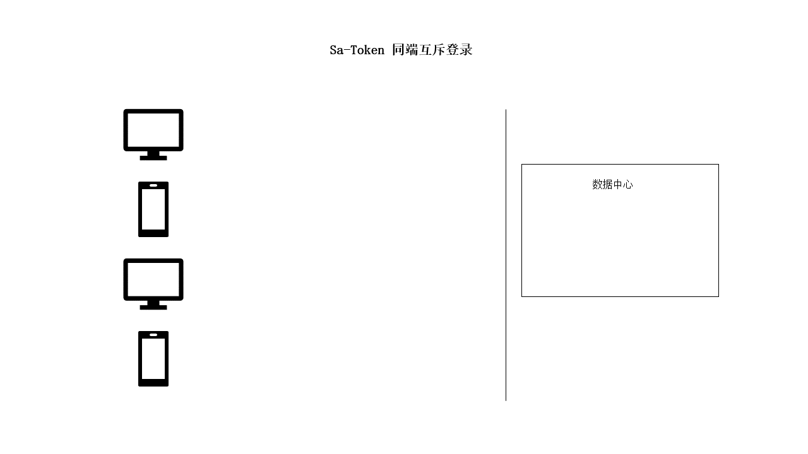

借这个场景，带大家学习下 Sa-Token 框架。

### Sa-Token 入门

[Sa-Token](https://sa-token.cc/) 是一个轻量级 Java 权限认证框架，主要解决：登录认证、权限认证、单点登录、OAuth2.0、分布式Session会话、微服务网关鉴权等一系列权限相关问题。

Sa-Token 功能一览：

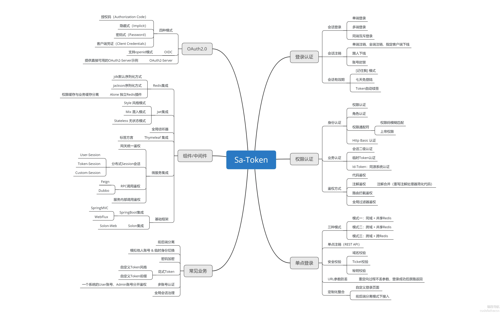

Sa-Token 旨在以简单、优雅的方式完成系统的权限认证部分，以登录认证为例，只需要一行代码：

```java
// 会话登录，参数填登录人的账号id 
StpUtil.login(10001);
```

无需实现任何接口、无需创建任何配置文件，只需要这一句静态代码的调用，便可以完成会话登录认证！

如果一个接口需要登录后才能访问，我们只需调用以下代码来检测该用户是否已经登录：

```java
// 校验当前客户端是否已经登录，如果未登录则抛出 `NotLoginException` 异常
StpUtil.checkLogin();
```

由于是国人开发，它的 [官方文档](https://sa-token.cc/doc.html#/) 写得非常通俗易懂，是纯天然的教程，基本上按照文档的顺序阅读一遍，就能够上手了。下面我们就先试着 [参考文档](https://sa-token.cc/doc.html#/start/example) 来运行下官方的 Demo。

#### 入门 Demo

在 Spring Boot 项目中，可以通过 `sa-token-spring-boot-starter` 快速引入 Sa-Token。注意版本：

```xml
<!-- Sa-Token 权限认证 -->
<dependency>
    <groupId>cn.dev33</groupId>
    <artifactId>sa-token-spring-boot-starter</artifactId>
    <version>1.39.0</version>
</dependency>
```

Sa-Token 支持通过配置定制框架的行为，比如登录态过期时间、不活跃自动下线等：

```yaml
server:
    # 端口
    port: 8081
    
############## Sa-Token 配置 (文档: https://sa-token.cc) ##############
sa-token: 
    # token 名称（同时也是 cookie 名称）
    token-name: satoken
    # token 有效期（单位：秒） 默认30天，-1 代表永久有效
    timeout: 2592000
    # token 最低活跃频率（单位：秒），如果 token 超过此时间没有访问系统就会被冻结，默认-1 代表不限制，永不冻结
    active-timeout: -1
    # 是否允许同一账号多地同时登录 （为 true 时允许一起登录, 为 false 时新登录挤掉旧登录）
    is-concurrent: true
    # 在多人登录同一账号时，是否共用一个 token （为 true 时所有登录共用一个 token, 为 false 时每次登录新建一个 token）
    is-share: true
    # token 风格（默认可取值：uuid、simple-uuid、random-32、random-64、random-128、tik）
    token-style: uuid
    # 是否输出操作日志 
    is-log: true
```

对于入门 Demo，我们可以不写配置，直接零配置启动项目。

然后我们编写 2 个测试接口，一个用于登录，一个用于检测是否已登录：

```java
/**
 * 测试 Sa-Token 框架实现用户登录
 */
@RestController
@RequestMapping("/test/user/")
public class TestSaTokenLoginController {

    // 测试登录，浏览器访问： http://localhost:8101/api/test/user/doLogin?username=zhang&password=123456
    @RequestMapping("doLogin")
    public String doLogin(String username, String password) {
        // 此处仅作模拟示例，真实项目需要从数据库中查询数据进行比对
        if ("zhang".equals(username) && "123456".equals(password)) {
            StpUtil.login(10001);
            return "登录成功";
        }
        return "登录失败";
    }

    // 查询登录状态，浏览器访问： http://localhost:8101/api/test/user/isLogin
    @RequestMapping("isLogin")
    public String isLogin() {
        return "当前会话是否登录：" + StpUtil.isLogin();
    }
}
```

然后可以通过直接访问接口地址来验证。

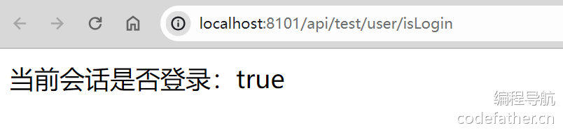

#### Sa-Token 实用功能

按顺序阅读 [官方文档](https://sa-token.cc/doc.html#/use/login-auth) 学习即可，重点学习下图中红圈里的内容，其他的作为可选学习项：

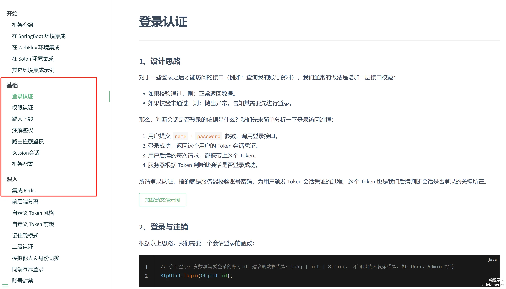

#### Sa-Token 原理

推荐阅读 Sa-Token 文档的 [附录部分](https://sa-token.cc/doc.html#/fun/session-model)，尤其是对前后端分离的登录模式不太熟悉的同学。重点阅读以下红圈部分：

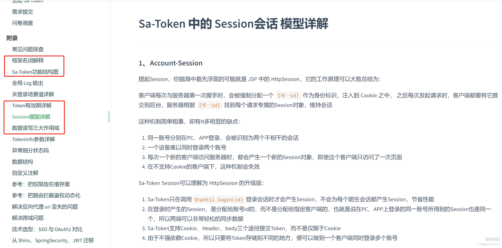

Sa-Token 认证流程图，要重点掌握。如果让你自己设计一个权限校验框架，就是按这个流程来：

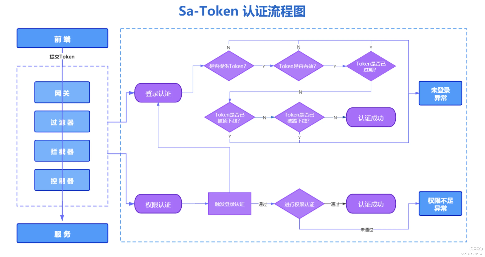

要理解 Sa-Token 的 [Session 模型](https://sa-token.cc/doc.html#/fun/session-model)，区别于 Servlet 的 HttpSession，Sa-Token 维护了自己的 Session，共有 3 种 Session 创建时机：

- `Account-Session`: 指的是框架为每个 账号 id 分配的 Session。是分配给账号id的，而不是分配给指定客户端的，也就是说在 PC、APP 上登录的同一账号所得到的 Session 也是同一个，所以两端可以非常轻松的同步数据。
- `Token-Session`: 指的是框架为每个 token 分配的 Session。不同的设备端，哪怕登录了同一账号，只要它们得到的 token 不一致，它们对应的 `Token-Session` 就不一致，这就为我们不同端的独立数据读写提供了支持。比如实现“指定客户端超过两小时无操作就自动下线，如果两小时内有操作，就再续期两小时，直到新的两小时无操作”。
- `Custom-Session`: 指的是以一个特定的值作为 SessionId，来分配的 Session。不依赖特定的账号id 或者 token，当成一个 Map 去使用即可，比如可以为一个团队的用户指定相同的 SessionId，让一个团队最多 N 个用户同时在线等。

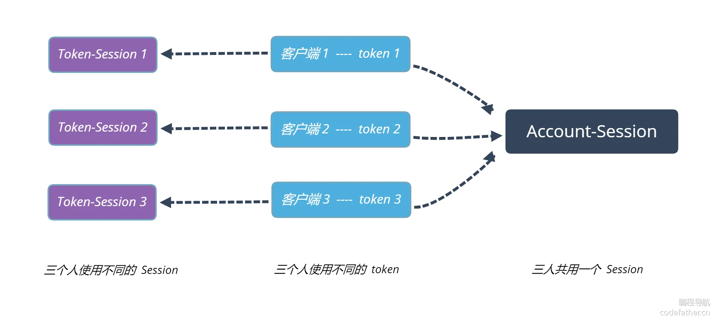

### 后端开发（Sa-Token 实战）

下面，带大家实战如何使用 Sa-Token 实现同端登录冲突检测功能，并且基于 Sa-Token 改造我们现有项目的鉴权方式。

#### 1、引入 Sa-Token

在项目中添加下列依赖：

```xml
<!-- Sa-Token 权限认证 -->
<dependency>
    <groupId>cn.dev33</groupId>
    <artifactId>sa-token-spring-boot-starter</artifactId>
    <version>1.39.0</version>
</dependency>
```

#### 2、配置 Sa-Token

在项目的 `application.yml` 中添加以下配置。重点关注 `is-concurrent`，需要设置为 false，这样才能实现同端冲突下线。

```yaml
# Sa-Token 配置
sa-token:
  # token 名称（同时也是 cookie 名称）
  token-name: mianshiya
  # token 有效期（单位：秒） 默认30天，-1 代表永久有效
  timeout: 2592000
  # token 最低活跃频率（单位：秒），如果 token 超过此时间没有访问系统就会被冻结，默认-1 代表不限制，永不冻结
  active-timeout: -1
  # 是否允许同一账号多地同时登录（为 true 时允许一起登录, 为 false 时新登录挤掉旧登录）
  is-concurrent: false
  # 在多人登录同一账号时，是否共用一个 token （为 true 时所有登录共用一个 token, 为 false 时每次登录新建一个 token）
  is-share: true
  # token 风格（默认可取值：uuid、simple-uuid、random-32、random-64、random-128、tik）
  token-style: uuid
  # 是否输出操作日志 
  is-log: true
```

#### 3、注册 Sa-Token 拦截器

我们现在的项目是使用 AOP + 自定义权限校验注解来实现的登录认证和权限认证：

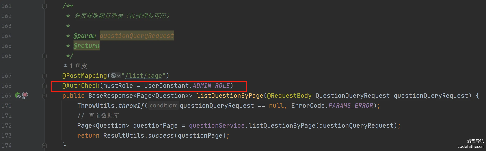

Sa-Token 也是一样的模式，使用全局拦截器完成注解鉴权功能。为了不为项目带来不必要的性能负担，拦截器默认处于关闭状态。因此。为了使用注解鉴权，必须手动将 Sa-Token 的全局拦截器注册到项目中。

新建 `satoken` 包，在里面新建配置类 `SaTokenConfigure`，注册拦截器：

```java
@Configuration
public class SaTokenConfigure implements WebMvcConfigurer {
    // 注册 Sa-Token 拦截器，打开注解式鉴权功能 
    @Override
    public void addInterceptors(InterceptorRegistry registry) {
        // 注册 Sa-Token 拦截器，打开注解式鉴权功能 
        registry.addInterceptor(new SaInterceptor()).addPathPatterns("/**");    
    }
}
```

然后就可以使用注解鉴权了，比如下列注解，可以平替我们项目中已经写的鉴权注解：

```java
// 登录校验：只有登录之后才能进入该方法 
@SaCheckLogin                        
@RequestMapping("info")
public String info() {
    return "查询用户信息";
}

// 角色校验：必须具有指定角色才能进入该方法 
@SaCheckRole("super-admin")        
@RequestMapping("add")
public String add() {
    return "用户增加";
}
```

💡 Sa-Token 还支持另外一种鉴权模式，通过编写 [路由拦截代码实现鉴权](https://sa-token.cc/doc.html#/use/route-check)，可以实现更灵活、集中式的鉴权能力。

比如这个场景：项目中所有接口均需要登录认证，只有“登录接口”本身对外开放。

示例代码如下：

```java
@Configuration
public class SaTokenConfigure implements WebMvcConfigurer {
    // 注册拦截器
    @Override
    public void addInterceptors(InterceptorRegistry registry) {
        // 注册 Sa-Token 拦截器，校验规则为 StpUtil.checkLogin() 登录校验。
        registry.addInterceptor(new SaInterceptor(handle -> StpUtil.checkLogin()))
                .addPathPatterns("/**")
                .excludePathPatterns("/user/doLogin"); 
    }
}
```

这个就很像我们后端项目模板中利用 Spring AOP 功能实现的 `AuthInterceptor`，只不过 Sa-Token 提供了很多方法，可以帮我们更快速清晰地编写鉴权规则：

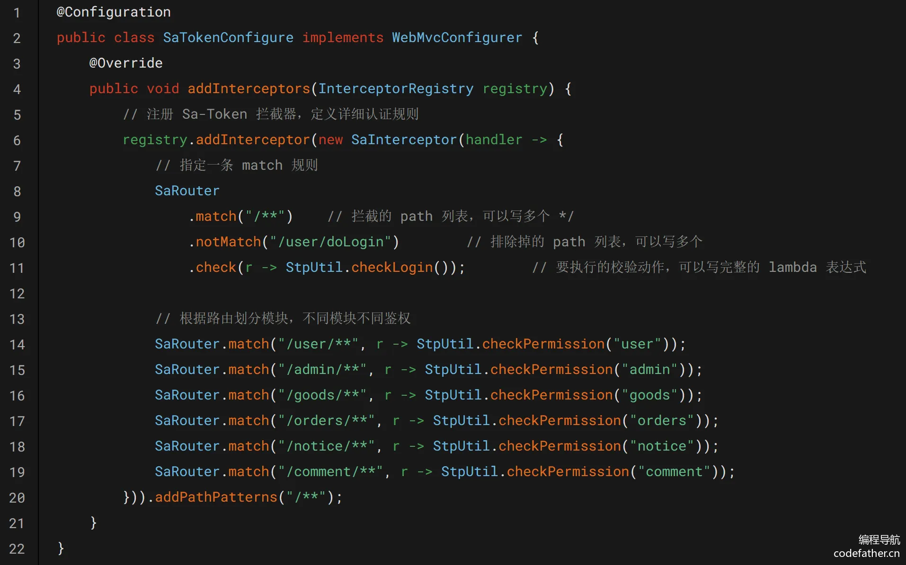

本项目中，还是采用注解校验的模式，跟已有写法尽量保持一致。

有了 Sa-Token 的拦截器后，将现有 `AuthInterceptor` 类的 Bean 加载注解进行注释即可：

```java
//@Aspect
//@Component
public class AuthInterceptor {
    ...
}
```

#### 4、定义权限与角色获取逻辑

部分接口需要特定的用户权限或对应的角色才能访问，那怎么知道当前登录用户具有哪些权限或角色呢？

按照 [Sa-Token 的开发模式](https://sa-token.cc/doc.html#/use/jur-auth)，我们需要新建一个类，实现 `StpInterface` 接口。该接口提供了获取当前登录用户的权限和角色的方法，在每次调用鉴权代码时，都会执行接口中的方法。

在 `satoken` 包下新建类，代码如下：

```java
@Component // 保证此类被 SpringBoot 扫描，完成 Sa-Token 的自定义权限验证扩展 
public class StpInterfaceImpl implements StpInterface {

    /**
     * 返回一个账号所拥有的权限码集合 (目前没用)
     */
    @Override
    public List<String> getPermissionList(Object loginId, String s) {
        return new ArrayList<>();
    }

    /**
     * 返回一个账号所拥有的角色标识集合 (权限与角色可分开校验)
     */
    @Override
    public List<String> getRoleList(Object loginId, String s) {
        // 从当前登录用户信息中获取角色
        User user = (User) StpUtil.getSessionByLoginId(loginId).get(USER_LOGIN_STATE);
        return Collections.singletonList(user.getUserRole());
    }
}
```

#### 5、新建设备信息获取工具类

可以从客户端发送的请求头中获取用户使用的设备信息，建议单独写一个工具类。本项目为了让大家学习更方便，采用模块化分包，将工具类也放到 `satoken` 包中。

代码如下：

```java
/**
 * 设备工具类
 */
public class DeviceUtils {

    /**
     * 根据请求获取设备信息
     **/
    public static String getRequestDevice(HttpServletRequest request) {
        String userAgentStr = request.getHeader(Header.USER_AGENT.toString());
        // 使用 Hutool 解析 UserAgent
        UserAgent userAgent = UserAgentUtil.parse(userAgentStr);
        ThrowUtils.throwIf(userAgent == null, ErrorCode.OPERATION_ERROR, "非法请求");
        // 默认值是 PC
        String device = "pc";
        // 是否为小程序
        if (isMiniProgram(userAgentStr)) {
            device = "miniProgram";
        } else if (isPad(userAgentStr)) {
            // 是否为 Pad
            device = "pad";
        } else if (userAgent.isMobile()) {
            // 是否为手机
            device = "mobile";
        }
        return device;
    }

    /**
     * 判断是否是小程序
     * 一般通过 User-Agent 字符串中的 "MicroMessenger" 来判断是否是微信小程序
     **/
    private static boolean isMiniProgram(String userAgentStr) {
        // 判断 User-Agent 是否包含 "MicroMessenger" 表示是微信环境
        return StrUtil.containsIgnoreCase(userAgentStr, "MicroMessenger")
                && StrUtil.containsIgnoreCase(userAgentStr, "MiniProgram");
    }

    /**
     * 判断是否为平板设备
     * 支持 iOS（如 iPad）和 Android 平板的检测
     **/
    private static boolean isPad(String userAgentStr) {
        // 检查 iPad 的 User-Agent 标志
        boolean isIpad = StrUtil.containsIgnoreCase(userAgentStr, "iPad");

        // 检查 Android 平板（包含 "Android" 且不包含 "Mobile"）
        boolean isAndroidTablet = StrUtil.containsIgnoreCase(userAgentStr, "Android")
                && !StrUtil.containsIgnoreCase(userAgentStr, "Mobile");

        // 如果是 iPad 或 Android 平板，则返回 true
        return isIpad || isAndroidTablet;
    }
}
```

可以根据实际需求，自己补充更多的设备、优化设备的判断方法。

#### 6、改造登录接口

修改 `UserServiceImpl#userLogin` 方法中的逻辑，需要给 Sa-Token 设置登录态，保存登录用户信息。

参考 [官方文档](https://sa-token.cc/doc.html#/up/mutex-login) ，直接给 `StpUtil.login` 方法多传递一个参数即可：

```java
// 3. 记录用户的登录态（移除这行代码）
request.getSession().setAttribute(USER_LOGIN_STATE, user);

// Sa-Token 登录，并指定设备，同端登录互斥
StpUtil.login(user.getId(), DeviceUtils.getRequestDevice(request));
StpUtil.getSession().set(USER_LOGIN_STATE, user);
```

`user.getId()` 就是登录成功的用户 id，可以在 `StpInterfaceImpl` 中通过方法参数 loginId 获取到。

注意，`StpUtil.getSession()` 是 `SaSession`，与 HttpSession 没任何关系， SaSession 是 Sa-Token 提供的会话中专业的数据缓存组件，通过 SaSession 我们可以很方便的缓存一些高频读写数据（比如登录用户信息），提高程序性能。

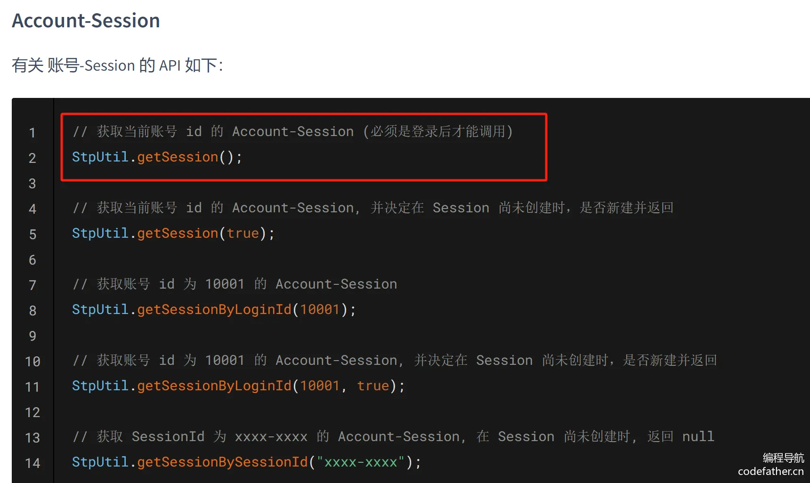

#### 7、改造获取用户信息的逻辑

将 `UserServiceImpl#getLoginUser` 修改为如下，不再从 `request.getSession()` 中获取登录用户的 id，改为从 Sa-Token 中获取。

```java
@Override
public User getLoginUser(HttpServletRequest request) {
    // 先判断是否已登录
    Object loginUserId = StpUtil.getLoginIdDefaultNull();
    if (loginUserId == null) {
        throw new BusinessException(ErrorCode.NOT_LOGIN_ERROR);
    }
    // 从数据库查询（追求性能的话可以注释，直接走缓存）
    User currentUser = this.getById((String) loginUserId);
    if (currentUser == null) {
        throw new BusinessException(ErrorCode.NOT_LOGIN_ERROR);
    }
    return currentUser;
}
```

如果用户信息几乎很少修改，可以不查数据库，直接从 Sa-Token 的 Session 中获取之前保存的用户登录态：

```java
@Override
public User getLoginUser(HttpServletRequest request) {
    // 先判断是否已登录
    Object loginId = StpUtil.getLoginIdDefaultNull();
    if (Objects.isNull(loginId)) {
        throw new BusinessException(ErrorCode.NOT_LOGIN_ERROR);
    }
    return (User) StpUtil.getSessionByLoginId(loginId).get(USER_LOGIN_STATE);
}
```

**注意，所有原本从 servlet Session 中取登录态的代码都要修改！** 比如还有 `UserServiceImpl#isAdmin` 方法：

```java
public boolean isAdmin(HttpServletRequest request) {
    // 仅管理员可查询
    // 基于 Sa-Token 改造
    Object userObj = StpUtil.getSession().get(USER_LOGIN_STATE);
    // Object userObj = request.getSession().getAttribute(USER_LOGIN_STATE);
    User user = (User) userObj;
    return isAdmin(user);
}
```

#### 8、改造用户注销功能

改为调用 Sa-Token 的注销方法，移除登录态：

```java
@Override
public boolean userLogout(HttpServletRequest request) {
    StpUtil.checkLogin();
    // 移除登录态
    StpUtil.logout();
    return true;
}
```

#### 9、替换鉴权注解

现在的项目中，如果是管理员权限的接口，打上了以下注解：

```java
@AuthCheck(mustRole = UserConstant.ADMIN_ROLE)
```

可以全局替换成 Sa-Token 的权限校验注解：

```java
@SaCheckRole(UserConstant.ADMIN_ROLE)
```

### 测试

启动项目，利用接口文档进行测试，分别执行用户登录（2 次） => 获取登录用户信息 => 获取题目列表（仅管理员可用）=> 用户注销 => 获取题目列表（仅管理员可用）

查看 Sa-Token 日志，发现同端登录冲突检测生效：

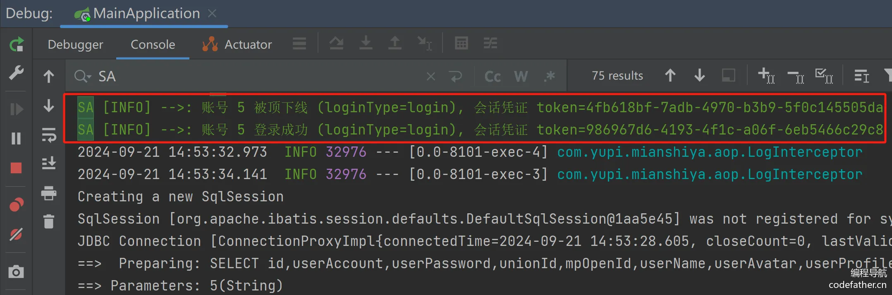用户注销时也会打印日志：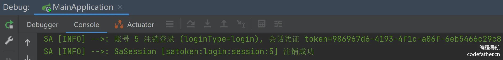

注销后，调用获取题目列表（仅管理员可用）接口，会出现报错：

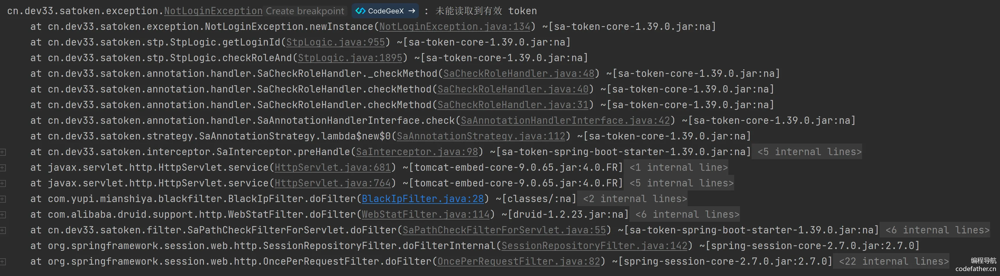

可以同时用 PC 端和移动端（F12 浏览器控制台模拟即可）执行用户登录，不会出现冲突。

### 扩展知识

#### 1、Sa-Token 登录异常捕获

通过测试发现，如果不做任何处理，接口返回的无权限和未登录的报错如下：

```json
{
  "code": 50000,
  "data": null,
  "message": "系统错误"
}
```

这是因为没有处理 Sa-Token 自己的未登录异常（获取不到 Token 的异常）。

可以在 `GlobalExceptionHandler` 文件中，全局错误拦截 Sa-Token 的 NotRoleException 和 NotLoginException 异常：

```java
@ExceptionHandler(NotRoleException.class)
public BaseResponse<?> notRoleExceptionHandler(RuntimeException e) {
    log.error("NotRoleException", e);
    return ResultUtils.error(ErrorCode.NO_AUTH_ERROR, "无权限");
}

@ExceptionHandler(NotLoginException.class)
public BaseResponse<?> notLoginExceptionHandler(RuntimeException e) {
    log.error("NotLoginException", e);
    return ResultUtils.error(ErrorCode.NOT_LOGIN_ERROR, "未登录");
}
```

之后，用户无访问权限和未登录的报错就更清晰了：

```json
{
  "code": 40101,
  "data": null,
  "message": "无权限"
}

{
  "code": 40100,
  "data": null,
  "message": "未登录"
}
```

还可以参考 [官方文档](https://sa-token.cc/doc.html#/fun/not-login-scene) ，进一步定制异常处理逻辑：

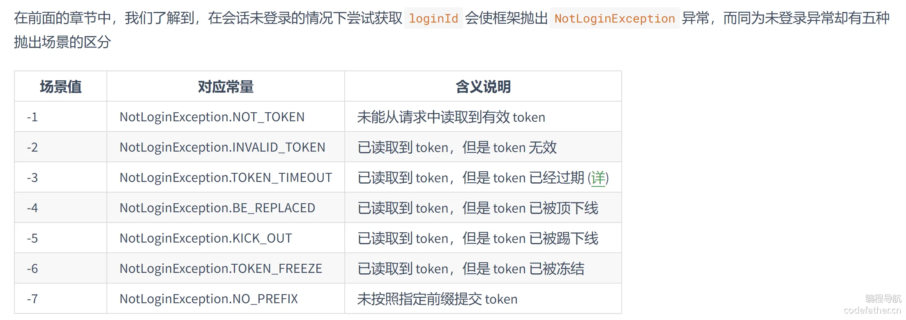

#### 2、Sa-Token 集成 Redis

`Sa-Token` 默认将数据保存在内存中，此模式读写速度最快，且避免了序列化与反序列化带来的性能消耗，但是此模式也有一些缺点，比如：

- 重启后数据会丢失
- 无法在分布式环境中共享数据

此时，可以将会话数据存储在一些专业的缓存中间件上（比如 Redis），做到重启数据不丢失，而且保证分布式环境下多节点的会话一致性。

可以参考 [官方文档](https://sa-token.cc/doc.html#/up/integ-redis) 整合 Redis，非常简单。集成 Redis 后，也不需要额外手动保存数据，框架会自动保存。集成 Redis 只需要引入对应的 pom依赖 即可，框架所有上层 API 保持不变。

1）引入依赖

`sa-token-redis` 和 `sa-token-redis-jackson` 依赖二选一，差别就是序列化方式不同：

```xml
<!-- Sa-Token 整合 Redis （使用 jdk 默认序列化方式） -->
<dependency>
    <groupId>cn.dev33</groupId>
    <artifactId>sa-token-redis</artifactId>
    <version>1.39.0</version>
</dependency>

<!-- Sa-Token 整合 Redis （使用 jackson 序列化方式） -->
<dependency>
    <groupId>cn.dev33</groupId>
    <artifactId>sa-token-redis-jackson</artifactId>
    <version>1.39.0</version>
</dependency>

<!-- 提供Redis连接池 -->
<dependency>
    <groupId>org.apache.commons</groupId>
    <artifactId>commons-pool2</artifactId>
</dependency>
```

2）添加 Redis 配置

在 `application.yml` 中添加 Redis 配置（已有则无需添加）

```yaml
spring: 
  # redis配置 
  redis:
    # Redis数据库索引（默认为0）
    database: 1
    # Redis服务器地址
    host: 127.0.0.1
    # Redis服务器连接端口
    port: 6379
    # Redis服务器连接密码（默认为空）
    # password: 
    # 连接超时时间
    timeout: 10s
    lettuce:
      pool:
        # 连接池最大连接数
        max-active: 200
        # 连接池最大阻塞等待时间（使用负值表示没有限制）
        max-wait: -1ms
        # 连接池中的最大空闲连接
        max-idle: 10
        # 连接池中的最小空闲连接
        min-idle: 0
```

### 可自主扩展

#### 1、不使用 Sa-Token，实现同端登录冲突检测

Sa-Token 本质上就是多维护了一个“当前登录用户对应的设备信息”，我们也可以自己在 request 对象的 Session（或 Redis）中存储该信息。当用户新登录账号时，先检测该用户是否已经登录、并且是否有设备冲突，冲突的话，把之前的登录态删除掉即可。**可以试着自主实现。**

wt4tVNmXm8QgLQdra6I0fKvSrV47aw99prVO/cGe5fU=idCS9V+nfwrRL0iG/PH4LTVnrJLG1jYWVEXVHodFH+k=BsIfCdbcOxfxcrAyHoNumjhUY27lclYvZBP3TWJ21Ak=yXZ+wplD/Z/TIlcCXWQJ7meUSnldS+OOOCauQaPvvSE=Zd4vN1X+Mu+cpkGy31rZ96a82qN0fwdgpTBxAm0Vg+g=zMgxcF7XAuB3MSprAFa9ecyIqm65CrajO2ECbq0kShk=19lREw9lV3H3I+rK7vjxERQeWUOy0kwqtJjqK+R58cE=

| 登录时间 | 设备 | sessionZd4vN1X+Mu+cpkGy31rZ96a82qN0fwdgpTBxAm0Vg+g=          |
| -------- | ---- | ------------------------------------------------------------ |
| 第 1 次  | ipad | device: "ipad"NlM19jOpdzoohJcm/GrGw+nMEUUssmqVWxgqzhb7Yyk=   |
| 第 2 次  | web  | device: "ipad" device: "web"wt4tVNmXm8QgLQdra6I0fKvSrV47aw99prVO/cGe5fU= |
| 第 3 次  | web  | device: "ipad" device: "web"（删除） device: "web"zMgxcF7XAuB3MSprAFa9ecyIqm65CrajO2ECbq0kShk= |

#### 2、同端登录冲突时，被踢下线的用户前端会收到通知

实现思路：

1）自定义“登录冲突被踢下线”异常，比如状态码 40110

2）用户在一个设备 A 登录后，如果在另一个设备 B 登录时，系统判断该用户已经在其他设备上登录过了，会移除设备 A 的登录态，并且在 Redis 里记录一条设备 A 的 sessionId 的冲突标识，之后用户在设备 A 请求任何一个接口（除登录接口），都会返回一个冲突的错误响应消息：

```javascript
{
  "code": 40110,
  "message": "用户已经在其他设备登录"
}
```

3）然后就可以移除在 Redis 里的冲突标识。之后请求任何接口，都能正常响应，如果需要登录，会和之前一样返回未登录。

4）前端全局响应拦截器中捕获该异常，并弹出消息通知框即可。

相比轮询或者 WebSocket，这种方案更轻量，能够减少服务器的压力。

#### 3、单点登录和 OAuth2

一般情况下公司都会有自己的单点登录或 OAuth2 基础设施，自学项目、或者小团队开发时可以不用掌握。但是建议学习一下这些概念和实现思路，面试时可能会被问到。

可以直接阅读 Sa-Token 的官方文档学习，介绍地非常详细：

- SSO 单点登录：https://sa-token.cc/doc.html#/sso/readme
- OAuth2：https://sa-token.cc/doc.html#/oauth2/readme

## 二、分级题目反爬虫策略

### 需求分析

对于以内容为卖点的网站（尤其是知识付费网站），网站上的数据可能被爬虫程序大规模抓取，导致竞争对手获得不当优势或者数据被滥用。而且恶意爬虫的频繁请求也会导致服务器的负载增加，影响正常用户的访问体验。

所以我们需要一些反爬虫的措施，来保护我们的系统和内容。

### 方案设计

#### 反爬虫的手段

之前鱼皮给大家分享过一些反爬的手段，包括使用协议条款、业务层处理、接入专业的反爬监测系统、设置溯源手段等等，推荐 [阅读文章](https://www.code-nav.cn/post/1821392938209808386) 或者 [观看视频](https://www.bilibili.com/video/BV1b142187Tb/)。

💡 有同学可能会想到“限流”。限流确实可以用来减缓爬虫的请求频率，通过限制每个用户或 IP 在一定时间内的请求数量来降低对系统的压力。然而，限流的核心目的是保护系统的可用性和性能，防止系统因瞬时过载而崩溃。它更像是一种流量控制措施，而不是专门的防爬策略。

如何反爬虫，是一门艺术，无法做到 100% 防御，但是可以 **根据实际业务定制** 一些特殊的限制逻辑、处理逻辑、追溯手段。即使防不住爬虫，但我们可以通过日志等途径定位到盗取内容或影响我们系统的用户，进行封号限制或追责。这也是本教程中要带大家实践的内容。

#### 多级反爬虫策略

对于我们的面试刷题网站，假设用户要浏览题目的答案（或者其他要保护的内容），那么 **必须要先登录**，这样才能够进行追溯，可以简单统计用户访问频率来限制数据的爬取。

频率限制为多少呢？

通过分析我们的系统使用情况、再加上人为主观判断：正常用户浏览一道面试题的时间是分钟级别的。我们稍微放宽一点，默认同一用户每分钟最多能够获取 10 道题目。

建议采用分级反爬虫策略，先告警、再采取强制措施，可以有效减少误封的风险：

- 如果每分钟超过 10 道题目，则给管理员发送告警，比如发送邮件或者短信。
- 如果每分钟超过 20 道题目，则直接将账号踢下线，且进行封号操作。（或者限制一段时间无法访问）

具体的策略大家可以针对实际情况自己定制。

------

那么如何统计用户访问题目的频率呢？有下面 3 种方案：

#### 统计访问频率 - 结合已有系统

在本项目之前的教程中，我们学习了 Hotkey 热 key 探测系统和 Sentinel 流控系统，这些系统的实现关键都在于如何统计一段时间内的调用频率。

所以我们完全可以利用这些系统帮我们进行统计，比如在 Hotkey 中配置热 key 的规则（业务前缀 + 用户 id 作为 key），如果发现一个 key 成为了热 key，就表示该 key 对应的用户访问题目过多，就可以进行后续处理。

或者在 Sentinel 中配置热点参数限流策略，如果某用户访问题目过多，该用户后续访问时会抛出流量阻塞异常，就可以进行后续处理。

这种方案的优点是利用专业的系统进行统计，更精准更可靠；缺点就是要依靠第三方依赖保证统计的可用性，万一 Sentinel 或 Hotkey 挂了，统计也失效了。

#### 统计访问频率 - 基于本地计数器（单机）

如果项目采用单机部署，可以使用 `LongAdder` 进行高并发的计数操作。

LongAdder 是 Java 中并发包提供的一个计数器，它扩展了 AtomicLong，主要通过分段（分散热点）来减少多线程竞争，能够在高并发情况下提供比 AtomicLong 更高的性能。

其工作原理是将计数值分散到多个独立的变量中，并且每个线程只更新其中一个变量，这样可以减少多个线程同时访问同一个变量的竞争。当需要获取总值时，会将这些变量的值汇总起来。

假设我们需要统计每个用户每分钟的访问次数，可以通过以下方式实现：

```java
import java.util.concurrent.ConcurrentHashMap;
import java.util.concurrent.TimeUnit;
import java.util.concurrent.atomic.LongAdder;

public class RequestRateLimiter {
    
    // 用于存储每个用户的访问次数计数器
    private ConcurrentHashMap<String, LongAdder> userRequestCounts = new ConcurrentHashMap<>();
    
    // 统计的时间间隔（比如每分钟重置一次计数）
    private final long interval;
    
    public RequestRateLimiter(long intervalInSeconds) {
        this.interval = intervalInSeconds;
        startResetTask();
    }

    /**
     * 每次用户访问时调用此方法
     * @param userId 用户的唯一标识符
     */
    public void recordRequest(String userId) {
        // 获取或者初始化用户的访问计数器
        userRequestCounts.computeIfAbsent(userId, key -> new LongAdder()).increment();
    }

    /**
     * 获取用户的当前访问次数
     * @param userId 用户的唯一标识符
     * @return 用户的访问次数
     */
    public long getRequestCount(String userId) {
        return userRequestCounts.getOrDefault(userId, new LongAdder()).sum();
    }

    /**
     * 定期重置每个用户的访问计数器
     */
    private void startResetTask() {
        // 定时任务，每隔指定的时间间隔重置计数
        new Thread(() -> {
            while (true) {
                try {
                    TimeUnit.SECONDS.sleep(interval);  // 等待指定的时间间隔
                } catch (InterruptedException e) {
                    Thread.currentThread().interrupt();
                    return;
                }
                // 重置每个用户的计数器
                userRequestCounts.clear();
            }
        }).start();
    }
    
    public static void main(String[] args) {
        RequestRateLimiter limiter = new RequestRateLimiter(60);  // 每分钟重置一次

        // 模拟用户请求
        limiter.recordRequest("user1");
        limiter.recordRequest("user1");

        System.out.println("User1's current request count: " + limiter.getRequestCount("user1"));  // 输出 2
    }
}
```

上述代码中，我们通过定时任务，每隔指定的时间间隔重置计数。

#### 统计访问频率 - 基于 Redis 统计（分布式）

如果项目多机分布式部署，那么就需要利用一个独立的持久化存储来统计访问频率。

分布式存储 Redis 的 string 结构支持 incr 累加操作，可以对每个用户分钟（或其他时间精度）级别的访问次数进行累加统计。

**1）设计 Redis 键值对**

要能区分出用户和时间窗，示例 key 为：`user:access:{userId}:{timestamp_in_minutes}`

- {userId} 是用户 ID。
- {timestamp_in_minutes} 是当前的分钟级时间戳，即将当前时间戳转化为分钟，这样每分钟的访问都会被统计到一个 key 中。

每个 key 的 value，就是该用户在这分钟内的访问次数。

**2）Redis 操作逻辑**

对 Redis 的操作包括设置 key、给 key 增加计数、给 key 设置过期时间。

听起来并不难，但很多同学可能会使用如下的代码：

```java
//假设使用 jedis 客户端
// 使用 Redis 的 INCR 操作增加当前秒的访问次数
jedis.incr(redisKey);

// 设置过期时间（TTL），例如只保存60秒的数据
jedis.expire(redisKey, 60);  // 60秒后自动过期
```

然而，这种方法存在潜在的设计陷阱：incr 和 expire 是两个独立的操作。如果你在高并发情况下调用 incr() 之后发生上下文切换（比如另一个线程执行操作），可能会导致两个问题：

1. 过期时间重置：如果在高并发场景下，多次调用 incr() 后又多次调用 expire()，可能会不断重置该 key 的过期时间，导致这个 key 永远不会过期。（当前场景不会，但是连续性访问的场景就有可能发生）
2. 非原子操作：由于 incr() 和 expire() 是独立操作，在并发情况下，两个线程都可能先判断 key 不存在，然后各自执行 set 操作，导致计数逻辑出错。

所以我们要确保计数和过期时间的操作是原子性的，可以使用 Redis 的 Lua 脚本来完成。如果 key 不存在，则初始化并设置过期时间，否则只进行计数。

示例脚本如下：

```lua
String luaScript = 
    "if redis.call('exists', KEYS[1]) == 1 then " +
    "  return redis.call('incr', KEYS[1]); " +
    "else " +
    "  redis.call('set', KEYS[1], 1); " +
    "  redis.call('expire', KEYS[1], 180); " +  // 设置 180 秒过期时间
    "  return 1; " +
    "end";
```

这里一定要给 Redis key 设置过期时间！因为统计超过一分钟，之前的数据就没什么用了。我选择 180 秒作为过期时间的目的是，给当前时间窗口（如 60 秒）多留一点冗余时间，以防止意外情况下需要用到历史记录，这是一个习惯。

------

对于我们的项目，主要的目的是反爬虫，而不是应对高并发大流量的请求，所以不需要结合 Sentinel 或 Hotkey 去精确统计流量。自主实现固定时间窗口（1 分钟）的访问频率统计就足够了。为了便于项目扩展为分布式，使用 Redis 方案来实现。

### 后端开发

#### 1、通用计数器

可以在 manager 包中封装一个计数器类，作为通用能力，便于复用。代码如下：

```java
@Slf4j
@Service
public class CounterManager {

    @Resource
    private RedissonClient redissonClient;

    /**
     * 增加并返回计数，默认统计一分钟内的计数结果
     *
     * @param key 缓存键
     * @return
     */
    public long incrAndGetCounter(String key) {
        return incrAndGetCounter(key, 1, TimeUnit.MINUTES);
    }

    /**
     * 增加并返回计数
     *
     * @param key          缓存键
     * @param timeInterval 时间间隔
     * @param timeUnit     时间间隔单位
     * @return
     */
    public long incrAndGetCounter(String key, int timeInterval, TimeUnit timeUnit) {
        int expirationTimeInSeconds;
        switch (timeUnit) {
            case SECONDS:
                expirationTimeInSeconds = timeInterval;
                break;
            case MINUTES:
                expirationTimeInSeconds = timeInterval * 60;
                break;
            case HOURS:
                expirationTimeInSeconds = timeInterval * 60 * 60;
                break;
            default:
                throw new IllegalArgumentException("Unsupported TimeUnit. Use SECONDS, MINUTES, or HOURS.");
        }

        return incrAndGetCounter(key, timeInterval, timeUnit, expirationTimeInSeconds);
    }

    /**
     * 增加并返回计数
     *
     * @param key                     缓存键
     * @param timeInterval            时间间隔
     * @param timeUnit                时间间隔单位
     * @param expirationTimeInSeconds 计数器缓存过期时间
     * @return
     */
    public long incrAndGetCounter(String key, int timeInterval, TimeUnit timeUnit, int expirationTimeInSeconds) {
        if (StrUtil.isBlank(key)) {
            return 0;
        }

        // 根据时间粒度生成 redisKey
        long timeFactor;
        switch (timeUnit) {
            case SECONDS:
                timeFactor = Instant.now().getEpochSecond() / timeInterval;
                break;
            case MINUTES:
                timeFactor = Instant.now().getEpochSecond() / 60 / timeInterval;
                break;
            case HOURS:
                timeFactor = Instant.now().getEpochSecond() / 3600 / timeInterval;
                break;
            default:
                throw new IllegalArgumentException("Unsupported TimeUnit. Use SECONDS, MINUTES, or HOURS.");
        }

        String redisKey = key + ":" + timeFactor;

        // Lua 脚本
        String luaScript =
                "if redis.call('exists', KEYS[1]) == 1 then " +
                        "  return redis.call('incr', KEYS[1]); " +
                        "else " +
                        "  redis.call('set', KEYS[1], 1); " +
                        "  redis.call('expire', KEYS[1], ARGV[1]); " +
                        "  return 1; " +
                        "end";

        // 执行 Lua 脚本
        RScript script = redissonClient.getScript(IntegerCodec.INSTANCE);
        Object countObj = script.eval(
                RScript.Mode.READ_WRITE,
                luaScript,
                RScript.ReturnType.INTEGER,
                Collections.singletonList(redisKey), expirationTimeInSeconds);
        return (long) countObj;
    }
}
```

其中，通过 Java 8 的 `java.time.Instant` 类获取 {timestamp_in_minutes}：

```java
// getEpochSecond 获取秒级时间戳，除以 60 为分钟，除以 3600 为小时
long timestampInMinutes = Instant.now().getEpochSecond() / 60;
```

通过 Redisson 提交 Lua 脚本到 Redis 执行：

```java
RScript script = redissonClient.getScript(IntegerCodec.INSTANCE);
Object countObj = script.eval(
        RScript.Mode.READ_WRITE,
        luaScript,
        RScript.ReturnType.INTEGER,
        Collections.singletonList(redisKey), expirationTimeInSeconds);
```

#### 2、检测爬虫逻辑

针对我们的需求，编写一个检测爬虫并分级处理的方法。每次请求题目时，都会调用该方法。

代码如下：

```java
@Resource
private CounterManager counterManager;

/**
 * 检测爬虫
 *
 * @param loginUserId
 */
private void crawlerDetect(long loginUserId) {
    // 调用多少次时告警
    final int WARN_COUNT = 10;
    // 超过多少次封号
    final int BAN_COUNT = 20;
    // 拼接访问 key
    String key = String.format("user:access:%s", loginUserId);
    // 一分钟内访问次数，180 秒过期
    long count = counterManager.incrAndGetCounter(key, 1, TimeUnit.MINUTES, 180);
    // 是否封号
    if (count > BAN_COUNT) {
        // 踢下线
        StpUtil.kickout(loginUserId);
        // 封号
        User updateUser = new User();
        updateUser.setId(loginUserId);
        updateUser.setUserRole("ban");
        userService.updateById(updateUser);
        throw new BusinessException(ErrorCode.NO_AUTH_ERROR, "访问太频繁，已被封号");
    }
    // 是否告警
    if (count == WARN_COUNT) {
        // 可以改为向管理员发送邮件通知
        throw new BusinessException(110, "警告访问太频繁");
    }
}
```

#### 3、使用检测爬虫方法

在 getQuestionVOById 接口中调用检测爬虫的方法即可：

```java
@GetMapping("/get/vo")
public BaseResponse<QuestionVO> getQuestionVOById(long id, HttpServletRequest request) {
    ThrowUtils.throwIf(id <= 0, ErrorCode.PARAMS_ERROR);
    // 检测和处置爬虫
    User loginUser = userService.getLoginUser(request);
    crawlerDetect(loginUser.getId());
    // 查询数据库
    Question question = questionService.getById(id);
    ThrowUtils.throwIf(question == null, ErrorCode.NOT_FOUND_ERROR);
    // 获取封装类
    return ResultUtils.success(questionService.getQuestionVO(question, request));
}
```

### 测试

通过接口文档调用获取题目接口，第 10 次时会触发告警、第 20 次时会触发封号：

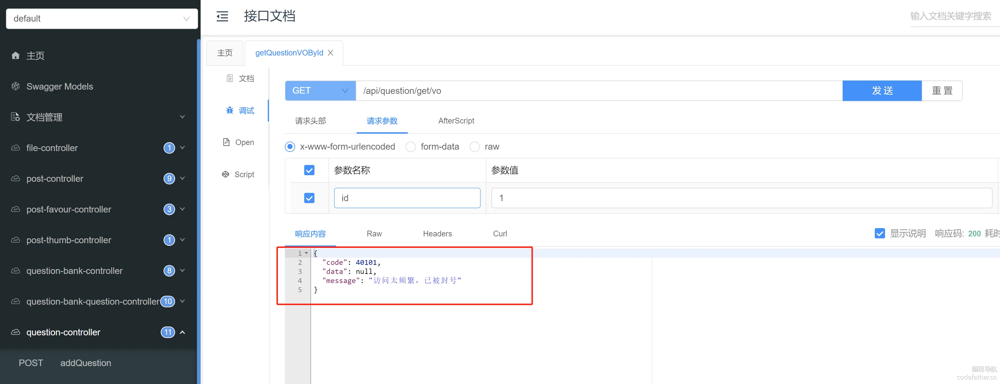

查看数据库，会发现该用户已被封禁：

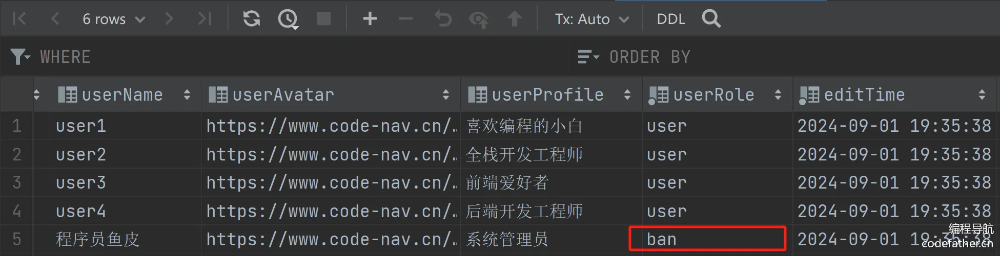

### 扩展

#### 1、配置动态化

可以将以下 2 个配置放到 Nacos 中，并通过 @Value 注解获取，支持动态调整反爬虫的配置：

```java
@NacosValue(value = "${warn.count:10}", autoRefreshed = true)
private Integer warnCount;

@NacosValue(value = "${ban.count:20}", autoRefreshed = true)
private Integer banCount;
```

包括 CounterManager 中的 timeInterval、timeUnit 这两个参数，也可以抽取为配置，放置到 Nacos 中。

#### 2、策略模式

可以用策略模式实现多种计数器，比如基于 LongAdder 的本地计数器，开发者可以自主选择使用何种计数器。

而且还可以将本地计数器作为 Redis 计数器统计异常的降级，这样即使项目没有配置 Redis 也可以使用。

#### 3、优化频率统计

目前每次统计都要请求 Redis，频率非常高的情况下，可能会对 Redis 造成压力。可以先本地聚合统计结果，每隔一段时间再统一发送给 Redis。这也是之前讲过的 Hotkey 的统计原理，在高并发点赞系统中，也可以运用类似的设计思路。

当然，也可以直接尝试结合 Hotkey 或 Sentinel 优化频率统计的精准度（采用滑动窗口统计）。

#### 4、提升检测爬虫的易用性

如果有更多接口需要检测爬虫，可以考虑封装一个检测爬虫的注解，并通过 AOP 进行扫描；使用时直接给要反爬的接口添加注解即可。