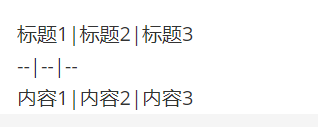

# MarkDown学习

## 标题

### 三级标题

#### 四级标题（最多6级标题）


# 字体

### **粗体**

两边各加两个 *

### *斜体*

两边各加一个* 

### *** 斜体加粗体***

两边各加三个* 

### ~~删 除 线~~

两边各两个~

# 引用

> 文字开头加一个 >

# 分割线

三个减号 --- ， 效果如下

---

或者三个星号 *** ，效果如下

# 图片（   )

 


# 超链接 []()

[点击跳转]()

# 列表

### 有序列表

(数字 . 内容 --点的前后都要有空格)

1. A
2. B
3. C

### 无序列表

(减号 + 空格 )

- a
- B
- C

# 表格

### 1. 右键插入

|      |      |      |
| ---- | ---- | ---- |
|      |      |      |
|      |      |      |
|      |      |      |

### 2.用键盘敲



进入源代码模式，把行与行之间的回车删掉，就出现表格了。建议直接右键插入

标题1|标题2|标题3

--|--|--

内容1|内容2|内容3

# 代码

```java
// ```
// ```java
// ```python
// 以上指令都会出现代码块
```

```

```


# 拓展

## Markdown 链接到文档标题


下面这个方法，比较丑陋吧，好处是标题怎么改都没问题，因为是以 id 来链接：

```markdown
## 目录
1. [标题1](#jump1)

...
...
### <span id="jump1">1. 标题1</span>
```

**(推荐)** 其实文档标题就是 Markdown 锚点，即：任何级别的标题可以直接作为锚点目标。如果标题比较固定（不是经常改来改去），可以直接使用标题作为锚点。例如：

```markdown
## 目录
1. [标题](###_11title)

...
...
### 1.1 Title
```

如果标题中有空格和特殊字符，按照下面的规则进行处理：

1. 大写字母改成小写
2. 特殊字符，如 `.` 全删除
3. 空格改成横线（-）
4. `#`与 标题 之间添加 `_`