###  1. 什么是JUC

JUC就是java.util.concurrent下面的类包，专门用于多线程的开发。

### 2. 线程和进程

> 进程是操作系统中的应用程序、是资源分配的基本单位，线程是用来执行具体的任务和功能，是CPU调度和分派的最小单位
>
> 一个进程往往可以包含多个线程，至少包含一个

#### 1）进程

**一个程序，QQ.EXE Music.EXE；数据+代码+pcb**

一个进程可以包含多个线程，至少包含一个线程！

Java默认有几个线程？**2个线程！** main线程、GC线程

#### 2）线程

**开了一个进程Typora，写字，等待几分钟会进行自动保存(线程负责的)**

对于Java而言：Thread、Runable、Callable进行开启线程的。

**提问？JAVA真的可以开启线程吗？ 开不了的！**

Java是没有权限去开启线程、操作硬件的，这是一个native的一个本地方法，它调用的底层的C++代码。

```java
    public synchronized void start() {
        /**
         * This method is not invoked for the main method thread or "system"
         * group threads created/set up by the VM. Any new functionality added
         * to this method in the future may have to also be added to the VM.
         *
         * A zero status value corresponds to state "NEW".
         */
        if (threadStatus != 0)
            throw new IllegalThreadStateException();

        /* Notify the group that this thread is about to be started
         * so that it can be added to the group's list of threads
         * and the group's unstarted count can be decremented. */
        group.add(this);

        boolean started = false;
        try {
            start0();
            started = true;
        } finally {
            try {
                if (!started) {
                    group.threadStartFailed(this);
                }
            } catch (Throwable ignore) {
                /* do nothing. If start0 threw a Throwable then
                  it will be passed up the call stack */
            }
        }
    }
	//这是一个C++底层，Java是没有权限操作底层硬件的
    private native void start0();
```

#### 3）并发

多线程操作同一个资源。

- CPU 只有一核，模拟出来多条线程，天下武功，唯快不破。那么我们就可以使用CPU快速交替，来模拟多线程。
- 并发编程的本质：**充分利用CPU的资源！**

#### 4）并行

**并行：** 多个人一起行走

- CPU多核，多个线程可以同时执行。 我们可以使用线程池！

**获取cpu的核数**

```java
public class Test1 {
    public static void main(String[] args) {
        //获取cpu的核数
        System.out.println(Runtime.getRuntime().availableProcessors());
    }
}
```

#### 5）线程的状态

以下是Java线程的状态，操作系统线程的状态和Java线程的状态不一样

```java
public enum State {

    	//新建
    	//处于 NEW 状态的线程此时尚未启动。这里的尚未启动指的是还没调用 Thread 实例的start()方法。
        NEW,

    	//运行
    	//表示当前线程正在运行中。处于 RUNNABLE 状态的线程在 Java 虚拟机中运行，也有可能在等待 CPU 分配资源。
        RUNNABLE,

    	//阻塞
  	    //阻塞状态。处于 BLOCKED 状态的线程正等待锁（锁会在后面细讲）的释放以进入同步区。
        BLOCKED,

    	//等待
   	    //等待状态。处于等待状态的线程变成 RUNNABLE 状态需要其他线程唤醒。
        WAITING,

        //超时等待
        //超时等待状态。线程等待一个具体的时间，时间到后会被自动唤醒。
        TIMED_WAITING,

        //终止
        //终止状态。此时线程已执行完毕。
        TERMINATED;
    }
```

#### 6）wait/sleep

**1、来自不同的类**

wait => Object类

sleep => Thread类

一般情况企业中使用休眠是：

```java
TimeUnit.DAYS.sleep(1); //休眠1天
TimeUnit.SECONDS.sleep(1); //休眠1s
```

**2、关于锁的释放**

wait 会释放锁；

sleep睡觉了，不会释放锁；

**3、使用的范围是不同的**

wait 必须在同步代码块中；

sleep 可以在任何地方睡；

**4、是否需要捕获异常**

~~wait是不需要捕获异常；~~

~~sleep必须要捕获异常；~~

sleep必须捕获异常，**wait也需要捕获异常**（网上非常多的代码说不用抛出异常，应该是没去看源码和尝试吧，下面附图），notify和notifyAll不需要捕获异常。

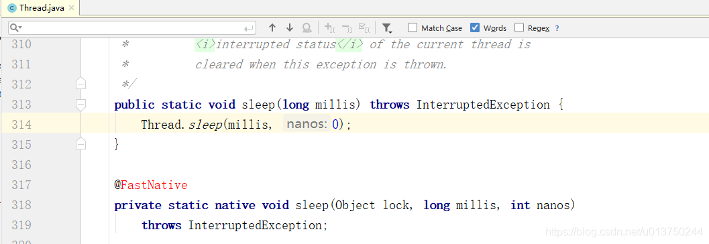

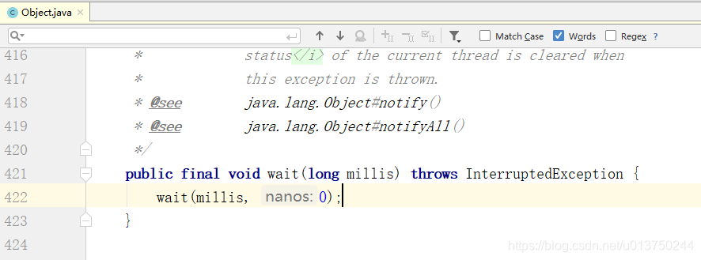


### 3.Lock	

#### 1）传统的 synchronized

```java
package com.marchsoft.juctest;

import lombok.Synchronized;

/**
 * Description：synchronized
 *
 * @author jiaoqianjin
 * Date: 2020/8/10 21:36
 **/

public class Demo01 {
    public static void main(String[] args) {
        final Ticket ticket = new Ticket();

        new Thread(()->{
            for (int i = 0; i < 40; i++) {
                ticket.sale();
            }
        },"A").start();
        new Thread(()->{
            for (int i = 0; i < 40; i++) {
                ticket.sale();
            }
        },"B").start();
        new Thread(()->{
            for (int i = 0; i < 40; i++) {
                ticket.sale();
            }
        },"C").start();
    }
}
// 资源类 OOP 属性、方法
class Ticket {
    private int number = 30;

    //卖票的方式
    public synchronized void sale() {
        if (number > 0) {
            System.out.println(Thread.currentThread().getName() + "卖出了第" + (number--) + "张票剩余" + number + "张票");
        }
    }
}
```

#### 2）Lock


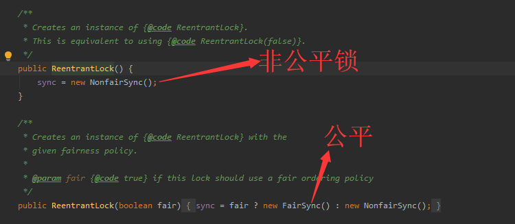

**公平锁：** 十分公平，必须先来后到~；

**非公平锁：** 十分不公平，可以插队；**(默认)**

```java
package com.marchsoft.juctest;

import java.util.concurrent.locks.Lock;
import java.util.concurrent.locks.ReentrantLock;

/**
 * Description：
 *
 * @author jiaoqianjin
 * Date: 2020/8/10 22:05
 **/

public class LockDemo {
    public static void main(String[] args) {
        final Ticket2 ticket = new Ticket2();

        new Thread(() -> {
            for (int i = 0; i < 40; i++) {
                ticket.sale();
            }
        }, "A").start();
        new Thread(() -> {
            for (int i = 0; i < 40; i++) {
                ticket.sale();
            }
        }, "B").start();
        new Thread(() -> {
            for (int i = 0; i < 40; i++) {
                ticket.sale();
            }
        }, "C").start();
    }
}
//lock三部曲
//1、    Lock lock=new ReentrantLock();
//2、    lock.lock() 加锁
//3、    finally=> 解锁：lock.unlock(); 
class Ticket2 {
    private int number = 30;
	
    // 创建锁
    Lock lock = new ReentrantLock();
    //卖票的方式
    public synchronized void sale() {
        lock.lock(); // 开启锁
        try {
            //业务代码
            if (number > 0) {
                System.out.println(Thread.currentThread().getName() + "卖出了第" + (number--) + "张票剩余" + number + "张票");
            }
        }finally {
            lock.unlock(); // 关闭锁
        }

    }
}
```

#### 3. Synchronized 与Lock 的区别

1、Synchronized 内置的Java关键字，Lock是一个Java类

2、Synchronized 无法判断获取锁的状态，Lock可以判断

3、Synchronized 会自动释放锁，lock必须要手动加锁和手动释放锁！**可能会遇到死锁**

4、Synchronized 线程1(获得锁->阻塞)、线程2(等待)；lock就不一定会一直等待下去，**lock会有一个trylock去尝试获取锁**，不会造成长久的等待。

5、Synchronized 是可重入锁，不可以中断的，非公平的；Lock，可重入的，可以判断锁，可以自己设置公平锁和非公平锁；

6、Synchronized 适合锁少量的代码同步问题，Lock适合锁大量的同步代码；

### 4. 生产者和消费者的关系

#### 1）Synchronzied + wait + notify版本

```java
package com.marchsoft.juctest;

/**
 * Description：
 *
 * @author jiaoqianjin
 * Date: 2020/8/10 22:33
 **/

public class ConsumeAndProduct {
    public static void main(String[] args) {
        Data data = new Data();

        new Thread(() -> {
            for (int i = 0; i < 10; i++) {
                try {
                    data.increment();
                } catch (InterruptedException e) {
                    e.printStackTrace();
                }
            }
        }, "A").start();
        new Thread(() -> {
            for (int i = 0; i < 10; i++) {
                try {
                    data.decrement();
                } catch (InterruptedException e) {
                    e.printStackTrace();
                }
            }
        }, "B").start();
    }
}

class Data {
    private int num = 0;

    // +1
    public synchronized void increment() throws InterruptedException {
        // 判断等待
        if (num != 0) {
            this.wait();
        }
        num++;
        System.out.println(Thread.currentThread().getName() + "=>" + num);
        // 通知其他线程 +1 执行完毕
        this.notifyAll();
    }

    // -1
    public synchronized void decrement() throws InterruptedException {
        // 判断等待
        if (num == 0) {
            this.wait();
        }
        num--;
        System.out.println(Thread.currentThread().getName() + "=>" + num);
        // 通知其他线程 -1 执行完毕
        this.notifyAll();
    }
}
```

#### 2）存在问题（虚假唤醒）

**问题，如果有四个线程**，其中两个线程操作一个资源，另外两个线程操作另外一个资源，会出现虚假唤醒

（在下图中，A,C操作等于0的数，B,D操作不等于0的数）


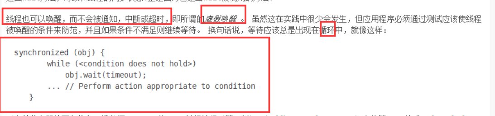

解决方式 ，**if 改为while即可，防止虚假唤醒**

> 结论：用if判断的话，由于if和if内的语句被执行过了，唤醒后线程会从wait之后的代码开始运行，但是不会重新判断if条件，直接继续运行if代码块之后的代码。
>
> 而如果使用while的话，虽然while和while内的语句被执行过，但是while是一个循环，while内的wait执行完后会再次判断条件，也就是被唤醒后会重新判断循环条件，如果不成立再执行while代码块之后的代码块，成立的话继续wait。
>
> 这也就是为什么用while而不用if的原因了，因为线程被唤醒后，执行开始的地方是wait之后

```java
package com.marchsoft.juctest;

/**
 * Description：
 *
 * @author jiaoqianjin
 * Date: 2020/8/10 22:33
 **/

public class ConsumeAndProduct {
    public static void main(String[] args) {
        Data data = new Data();

        new Thread(() -> {
            for (int i = 0; i < 10; i++) {
                try {
                    data.increment();
                } catch (InterruptedException e) {
                    e.printStackTrace();
                }
            }
        }, "A").start();
        new Thread(() -> {
            for (int i = 0; i < 10; i++) {
                try {
                    data.decrement();
                } catch (InterruptedException e) {
                    e.printStackTrace();
                }
            }
        }, "B").start();
        new Thread(() -> {
            for (int i = 0; i < 10; i++) {
                try {
                    data.increment();
                } catch (InterruptedException e) {
                    e.printStackTrace();
                }
            }
        }, "C").start();
        new Thread(() -> {
            for (int i = 0; i < 10; i++) {
                try {
                    data.decrement();
                } catch (InterruptedException e) {
                    e.printStackTrace();
                }
            }
        }, "D").start();
    }
}

class Data {
    private int num = 0;

    // +1
    public synchronized void increment() throws InterruptedException {
        // 判断等待
        while (num != 0) {
            this.wait();
        }
        num++;
        System.out.println(Thread.currentThread().getName() + "=>" + num);
        // 通知其他线程 +1 执行完毕
        this.notifyAll();
    }

    // -1
    public synchronized void decrement() throws InterruptedException {
        // 判断等待
        while (num == 0) {
            this.wait();
        }
        num--;
        System.out.println(Thread.currentThread().getName() + "=>" + num);
        // 通知其他线程 -1 执行完毕
        this.notifyAll();
    }
}
```

#### 3）Lock + await + signal版本 

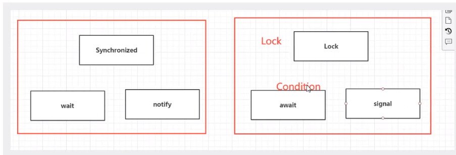

```java
package com.marchsoft.juctest;

import java.util.concurrent.locks.Condition;
import java.util.concurrent.locks.Lock;
import java.util.concurrent.locks.ReentrantLock;

/**
 * Description：
 *
 * @author jiaoqianjin
 * Date: 2020/8/11 9:48
 **/

public class LockCAP {
    public static void main(String[] args) {
        Data2 data = new Data2();

        new Thread(() -> {
            for (int i = 0; i < 10; i++) {

                try {
                    data.increment();
                } catch (InterruptedException e) {
                    e.printStackTrace();
                }

            }
        }, "A").start();
        new Thread(() -> {
            for (int i = 0; i < 10; i++) {
                try {
                    data.decrement();
                } catch (InterruptedException e) {
                    e.printStackTrace();
                }
            }
        }, "B").start();
        new Thread(() -> {
            for (int i = 0; i < 10; i++) {
                try {
                    data.increment();
                } catch (InterruptedException e) {
                    e.printStackTrace();
                }
            }
        }, "C").start();
        new Thread(() -> {
            for (int i = 0; i < 10; i++) {
                try {
                    data.decrement();
                } catch (InterruptedException e) {
                    e.printStackTrace();
                }
            }
        }, "D").start();
    }
}

class Data2 {
    private int num = 0;
    Lock lock = new ReentrantLock();
    Condition condition = lock.newCondition();
    // +1
    public  void increment() throws InterruptedException {
        lock.lock();
        try {
            // 判断等待
            while (num != 0) {
                condition.await();
            }
            num++;
            System.out.println(Thread.currentThread().getName() + "=>" + num);
            // 通知其他线程 +1 执行完毕
            condition.signalAll();
        }finally {
            lock.unlock();
        }

    }

    // -1
    public  void decrement() throws InterruptedException {
        lock.lock();
        try {
            // 判断等待
            while (num == 0) {
                condition.await();
            }
            num--;
            System.out.println(Thread.currentThread().getName() + "=>" + num);
            // 通知其他线程 +1 执行完毕
            condition.signalAll();
        }finally {
            lock.unlock();
        }

    }
}
```

#### 4）Condition的优势

精准的通知和唤醒的线程！

**如果我们要指定通知的下一个进行顺序怎么办呢？ 我们可以使用Condition来指定通知进程~**

```java
package com.marchsoft.juctest;

import java.util.concurrent.locks.Condition;
import java.util.concurrent.locks.Lock;
import java.util.concurrent.locks.ReentrantLock;

/**
 * Description：
 * A 执行完 调用B
 * B 执行完 调用C
 * C 执行完 调用A
 *
 * @author jiaoqianjin
 * Date: 2020/8/11 9:58
 **/

public class ConditionDemo {
    public static void main(String[] args) {
        Data3 data3 = new Data3();

        new Thread(() -> {
            for (int i = 0; i < 10; i++) {
                data3.printA();
            }
        },"A").start();
        new Thread(() -> {
            for (int i = 0; i < 10; i++) {
                data3.printB();
            }
        },"B").start();
        new Thread(() -> {
            for (int i = 0; i < 10; i++) {
                data3.printC();
            }
        },"C").start();
    }

}
class Data3 {
    private Lock lock = new ReentrantLock();
    private Condition condition1 = lock.newCondition();
    private Condition condition2 = lock.newCondition();
    private Condition condition3 = lock.newCondition();
    private int num = 1; // 1A 2B 3C

    public void printA() {
        lock.lock();
        try {
            // 业务代码 判断 -> 执行 -> 通知
            while (num != 1) {
                condition1.await();
            }
            System.out.println(Thread.currentThread().getName() + "==> AAAA" );
            num = 2;
            condition2.signal();
        }catch (Exception e) {
            e.printStackTrace();
        }finally {
            lock.unlock();
        }
    }
    public void printB() {
        lock.lock();
        try {
            // 业务代码 判断 -> 执行 -> 通知
            while (num != 2) {
                condition2.await();
            }
            System.out.println(Thread.currentThread().getName() + "==> BBBB" );
            num = 3;
            condition3.signal();
        }catch (Exception e) {
            e.printStackTrace();
        }finally {
            lock.unlock();
        }
    }
    public void printC() {
        lock.lock();
        try {
            // 业务代码 判断 -> 执行 -> 通知
            while (num != 3) {
                condition3.await();
            }
            System.out.println(Thread.currentThread().getName() + "==> CCCC" );
            num = 1;
            condition1.signal();
        }catch (Exception e) {
            e.printStackTrace();
        }finally {
            lock.unlock();
        }
    }
}
/*
A==> AAAA
B==> BBBB
C==> CCCC
A==> AAAA
B==> BBBB
C==> CCCC
...
*/
```

### 5.  8锁现象

如何判断锁的是谁！锁到底锁的是谁？

锁会锁住：对象、Class

深刻理解我们的锁

#### 1.一个对象调用两个普通同步方法

两个同步方法，先执行发短信还是打电话

```java
//分析代码中的锁：
//由于synchronized 锁住的对象是方法的调用者！所以phone对象被上了锁
//线程1：new Thread(() -> { phone.sendMs(); }).start(); 启动了一个新线程，该线程调用 phone.sendMs() 方法。因为 sendMs() 是 synchronized 的，所以线程 1 需要获取 phone 对象的锁才能进入该方法。
//线程2：new Thread(() -> { phone.call(); }).start(); 启动了另一个新线程，调用 phone.call()。由于 call() 方法也是 synchronized 的，线程 2 必须等待，直到线程 1 释放 phone 对象的锁才能进入 call() 方法。

public class dome01 {
    public static void main(String[] args) {
        Phone phone = new Phone();

        new Thread(() -> { phone.sendMs(); }).start();
        TimeUnit.SECONDS.sleep(1);
        new Thread(() -> { phone.call(); }).start();
    }
}

class Phone {
    public synchronized void sendMs() {
        System.out.println("发短信");
    }
    public synchronized void call() {
        System.out.println("打电话");
    }
}
```

输出结果为

发短信

打电话

**为什么？ 如果你认为是顺序在前？ 这个答案是错误的！**

#### 2.一个对象调用两个普通同步方法，先拿到锁的方法睡眠几秒

**我们再来看：我们让发短信 延迟4s**

```java
public class dome01 {
    public static void main(String[] args) throws InterruptedException {
        Phone phone = new Phone();

        new Thread(() -> {
            try {
                phone.sendMs();
            } catch (InterruptedException e) {
                e.printStackTrace();
            }
        }).start();
        TimeUnit.SECONDS.sleep(1);
        new Thread(() -> { phone.call(); }).start();
    }
}

class Phone {
    public synchronized void sendMs() throws InterruptedException {
        TimeUnit.SECONDS.sleep(4);
        System.out.println("发短信");
    }
    public synchronized void call() {
        System.out.println("打电话");
    }
}
```

现在结果是什么呢？

结果：**还是先发短信，然后再打电话！**

**why？**

> 原因：并不是顺序执行，而是synchronized 锁住的对象是方法的调用者！对于两个方法用的是同一个锁（即phone对象的锁），哪个方法先拿到锁谁就先执行，另外一个方法等待

#### 3.一个对象调用一个普通同步方法、一个普通方法

加一个普通方法

```java
public class dome01 {
    public static void main(String[] args) throws InterruptedException {
        Phone phone = new Phone();

        new Thread(() -> {
            try {
                phone.sendMs();
            } catch (InterruptedException e) {
                e.printStackTrace();
            }
        }).start();
        TimeUnit.SECONDS.sleep(1);
        new Thread(() -> { phone.hello(); }).start();
    }
}

class Phone {
    public synchronized void sendMs() throws InterruptedException {
        TimeUnit.SECONDS.sleep(4);
        System.out.println("发短信");
    }
    public synchronized void call() {
        System.out.println("打电话");
    }
    public void hello() {
        System.out.println("hello");
    }
}
```

输出结果为

hello

发短信

> 原因：hello是一个普通方法，不受synchronized锁的影响，不用等待锁的释放

#### 4.两个对象分别调用两个普通同步方法

**如果我们使用的是两个对象，一个调用发短信，一个调用打电话，那么整个顺序是怎么样的呢？**

```java
public class dome01 {
    public static void main(String[] args) throws InterruptedException {
        Phone phone1 = new Phone();
        Phone phone2 = new Phone();

        new Thread(() -> {
            try {
                phone1.sendMs();
            } catch (InterruptedException e) {
                e.printStackTrace();
            }
        }).start();
        TimeUnit.SECONDS.sleep(1);
        new Thread(() -> { phone2.call(); }).start();
    }
}

class Phone {
    public synchronized void sendMs() throws InterruptedException {
        TimeUnit.SECONDS.sleep(4);
        System.out.println("发短信");
    }
    public synchronized void call() {
        System.out.println("打电话");
    }
    public void hello() {
        System.out.println("hello");
    }
}
```

输出结果

打电话

发短信

> 原因：两个对象两把锁，不会出现等待的情况，发短信睡了4s,所以先执行打电话

#### 5、6.同时调用两个静态同步方法

**如果我们把两个synchronized的方法加上static变成静态方法！那么顺序又是怎么样的呢？**

（1）我们先来使用一个对象调用两个方法！

答案是：**先发短信,后打电话**

（2）如果我们使用两个对象调用两个方法！

答案是：**还是先发短信，后打电话**

原因是什么呢？ **为什么加了static就始终前面一个对象先执行呢！为什么后面会等待呢？**

原因是：**对于static静态方法来说，对于整个类Class来说只有一份，对于不同的对象使用的是同一份方法，相当于这个方法是属于这个类的，如果静态static方法使用synchronized锁定，那么这个synchronized锁会锁住整个对象！不管多少个对象，对于静态的锁都只有一把锁，谁先拿到这个锁就先执行，其他的进程都需要等待！**

------

#### 7.一个对象调用静态同步方法和普通同步方法

**如果我们使用一个静态同步方法、一个同步方法、一个对象调用顺序是什么？**

```java
public class dome01 {
    public static void main(String[] args) throws InterruptedException {
        Phone phone1 = new Phone();
//        Phone phone2 = new Phone();

        new Thread(() -> {
            try {
                phone1.sendMs();
            } catch (InterruptedException e) {
                e.printStackTrace();
            }
        }).start();
        TimeUnit.SECONDS.sleep(1);
        new Thread(() -> { phone1.call(); }).start();
    }
}

class Phone {
    public static synchronized void sendMs() throws InterruptedException {
        TimeUnit.SECONDS.sleep(4);
        System.out.println("发短信");
    }
    public synchronized void call() {
        System.out.println("打电话");
    }
    public void hello() {
        System.out.println("hello");
    }
}
```

输出结果

打电话

发短信

> 原因：因为一个锁的是Class类的模板，一个锁的是对象的调用者。所以不存在等待，直接运行。

#### 8.一个对象调用静态同步方法，一个对象调用普通同步方法

**如果我们使用一个静态同步方法、一个同步方法、两个对象调用顺序是什么？**

```java
public class dome01 {
    public static void main(String[] args) throws InterruptedException {
        Phone phone1 = new Phone();
        Phone phone2 = new Phone();

        new Thread(() -> {
            try {
                phone1.sendMs();
            } catch (InterruptedException e) {
                e.printStackTrace();
            }
        }).start();
        TimeUnit.SECONDS.sleep(1);
        new Thread(() -> { phone2.call(); }).start();
    }
}

class Phone {
    public static synchronized void sendMs() throws InterruptedException {
        TimeUnit.SECONDS.sleep(4);
        System.out.println("发短信");
    }
    public synchronized void call() {
        System.out.println("打电话");
    }
    public void hello() {
        System.out.println("hello");
    }
}
```

输出结果

打电话

发短信

> 原因：两把锁锁的不是同一个东西

**小结**

普通的同步方法锁住的是方法的调用者，也就是this对象

static同步方法锁住的是类模板，一个类new出来的对象都共享一个类模板。

### 6. 集合不安全

#### 1）List 不安全

```java
//java.util.ConcurrentModificationException 并发修改异常！
public class ListTest {
    public static void main(String[] args) {

        List<Object> arrayList = new ArrayList<>();

        for(int i=1;i<=10;i++){
            new Thread(()->{
                arrayList.add(UUID.randomUUID().toString().substring(0,5));
                System.out.println(arrayList);
            },String.valueOf(i)).start();
        }

    }
}
```

会导致 java.util.ConcurrentModificationException 并发修改异常！

**ArrayList 在并发情况下是不安全的**

解决方案：

```java
public class ListTest {
    public static void main(String[] args) {
        /**
         * 解决方案
         * 1. List<String> list = new Vector<>(); （Vector在jdk1.0就有了，ArrayList在jdk2.0才出现，因此不会用vector解决ArrayList的线程不安全问题）
         * 2. List<String> list = Collections.synchronizedList(new ArrayList<>()); 
         * 3. List<String> list = new CopyOnWriteArrayList<>(); （适用于读远多于写的场景）
         */
        List<String> list = new CopyOnWriteArrayList<>();
        

        for (int i = 1; i <=10; i++) {
            new Thread(() -> {
                list.add(UUID.randomUUID().toString().substring(0,5));
                System.out.println(list);
            },String.valueOf(i)).start();
        }
    }
}
```

**CopyOnWriteArrayList**：写入时复制！CopyOnWrite简称 **COW ，是计算机程序设计领域的一种优化策略**

核心思想是，如果有多个调用者（Callers）同时要求相同的资源（如内存或者是磁盘上的数据存储），他们会共同获取相同的指针指向相同的资源，直到某个调用者试图修改资源内容时，系统才会真正复制一份专用副本（private copy）给该调用者，而其他调用者所见到的最初的资源仍然保持不变。这过程对其他的调用者都是透明的（transparently）。此做法主要的优点是如果调用者没有修改资源，就不会有副本（private copy）被创建，因此多个调用者只是读取操作时可以共享同一份资源。

读的时候不需要加锁，如果读的时候有多个线程正在向CopyOnWriteArrayList添加数据，读还是会读到旧的数据，因为写的时候不会锁住旧的CopyOnWriteArrayList。

多个线程调用的时候，list，读取的时候，固定的，写入（存在覆盖操作）；在写入的时候避免覆盖，造成数据错乱的问题；

> **CopyOnWriteArrayList**比**Vector**厉害在哪里？

**Vector**底层是使用**synchronized**关键字来实现的：效率特别低下。

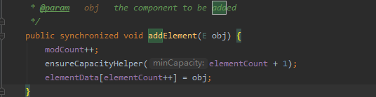

**CopyOnWriteArrayList**使用的是Lock锁，效率会更加高效！


##### 解决方案：vector（及其不推荐）

从JDK1.0开始，矢量便存在JDK中，向量是一个线程安全的列表，采用数组实现。

**缺点**：其线程安全的实现方式是对**所有操作都加上了同步关键字**，这种方式严重影响效率，因此，不再推荐使用Vector了

##### 解决方案：Collections.synchronizedList （工具类写法）

**优点**：
Collections.synchronizedList的写操作性能比的CopyOnWriteArrayList在多线程操作的情况下要好很多，

**缺点：**

1.遍历没有加锁，也就是其源码中迭代器listIterator没有加锁，如果直接调用listIterator方法或者使用forEach间接调用listIterator方法，会导致ConcurrentModificationException被抛出
2.由于listIterator没有加锁，因此需要在遍历时手动加锁。手动加锁后，Collections.synchronizedList的读操作性能将不如CopyOnWriteArrayList。

##### 解决方案：CopyOnWriteArrayList （JUC写法）

**优点**:

1.保证多线程的并发读写的线程安全

**缺点**:

内存:有数组拷贝自然有内存问题。如果实际应用数据比较多，而且比较大的情况下，占用内存会比较大，这个可以用ConcurrentHashMap来代替。

数据一致性:CopyOnWrite容器只能保证数据的最终一致性，不能保证数据的实时一致性。所以如果你希望写入的的数据，马上能读到，请不要使用CopyOnWrite容器

**适用场景：**

根据jdk api文档的介绍说明，应用场景为：1.遍历操作远多于修改   2.或内存开销可忽略。

#### 2）set 不安全

**Set和List同理可得:** 多线程情况下，普通的Set集合是线程不安全的；

解决方案还是两种：

- 使用Collections工具类的**synchronized**包装的Set类
- 使用CopyOnWriteArraySet 写入复制的**JUC**解决方案

```java
public class SetTest {
    public static void main(String[] args) {
        /**
         * 1. Set<String> set = Collections.synchronizedSet(new HashSet<>());
         * 2. Set<String> set = new CopyOnWriteArraySet<>();
         */
//        Set<String> set = new HashSet<>();
        Set<String> set = new CopyOnWriteArraySet<>();

        for (int i = 1; i <= 30; i++) {
            new Thread(() -> {
                set.add(UUID.randomUUID().toString().substring(0,5));
                System.out.println(set);
            },String.valueOf(i)).start();
        }
    }
}
```

**HashSet底层是什么？**

hashSet底层就是一个**HashMap**；


向HashSet中存值，调用的就是HashMap的put方法，set中的值被存为map中的键。


而map中的值:PRESENT,就是一个空的对象

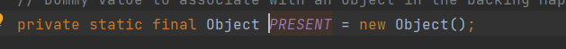

由于HashMap的键有不能重复的特性，HashSet的值也就有了唯一性。

#### 3）Map不安全

```java
//map 是这样用的吗？  不是，工作中不使用这个
//默认等价什么？ new HashMap<>(16, 0.75);
Map<String, String> map = new HashMap<>();
//加载因子、初始化容量
```

默认**加载因子是0.75**,默认的**初始容量是16**

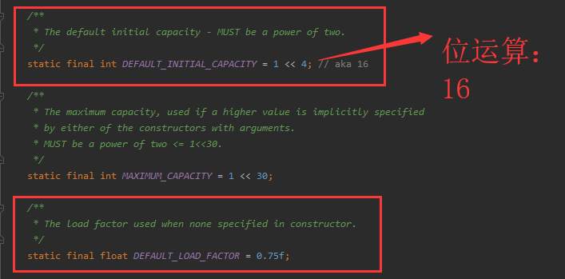

同样的HashMap基础类也存在**并发修改异常**！

```java
public class MapTest {
    public static void main(String[] args) {
        //map 是这样用的吗？  不是，工作中不使用这个
        //默认等价什么？ new HashMap<>(16,0.75);
        /**
         * 解决方案
         * 1. HashTable
         * 2. Map<String, String> map = Collections.synchronizedMap(new HashMap<>());
         * 3. Map<String, String> map = new ConcurrentHashMap<>();
         */
        Map<String, String> map = new ConcurrentHashMap<>();
        //加载因子、初始化容量
        for (int i = 1; i < 100; i++) {
            new Thread(()->{
                map.put(Thread.currentThread().getName(), UUID.randomUUID().toString().substring(0,5));
                System.out.println(map);
            },String.valueOf(i)).start();
        }
    }
}
```

**TODO:研究ConcurrentHashMap底层原理：**

##### 解决方案：HashTable

HashTable使用synchronized关键字来保证线程安全。当一个线程访问HashTable的同步方法，其他线程也访问HashTable的同步方法就会进入阻塞或轮训状态。这个的同步方法包括读和写，可以理解HashTable只有一把锁，所有的线程不管做什么，都是竞争这一把锁，例如线程1使用put进行元素添加，线程2不但不能使用put来添加元素，也不能使用get方法来获取元素，显然这效率是多低。

```Java
public synchronized V get(Object key) {
       // 省略实现
}
public synchronized V put(K key, V value) {
    // 省略实现
}
```

##### 解决方案：Collections.synchronizedMap

synchronizedMap的实现如下，没直接在方法上加，尽管其实质与HashTable是等效的，也同样有HashTable的缺陷，但synchronizedMap给用户留下了选择的空间：用户可以在不需要加锁时直接操作原始Map，在实际编码时就可以基于这点进行优化。

```Java
// synchronizedMap方法
public static <K,V> Map<K,V> synchronizedMap(Map<K,V> m) {
       return new SynchronizedMap<>(m);
   }
// SynchronizedMap类
private static class SynchronizedMap<K,V>
       implements Map<K,V>, Serializable {
       private static final long serialVersionUID = 1978198479659022715L;

       private final Map<K,V> m;     // Backing Map
       final Object      mutex;        // Object on which to synchronize

       SynchronizedMap(Map<K,V> m) {
           this.m = Objects.requireNonNull(m);
           mutex = this;
       }

       SynchronizedMap(Map<K,V> m, Object mutex) {
           this.m = m;
           this.mutex = mutex;
       }

       public int size() {
           synchronized (mutex) {return m.size();}
       }
       public boolean isEmpty() {
           synchronized (mutex) {return m.isEmpty();}
       }
       public boolean containsKey(Object key) {
           synchronized (mutex) {return m.containsKey(key);}
       }
       public boolean containsValue(Object value) {
           synchronized (mutex) {return m.containsValue(value);}
       }
       public V get(Object key) {
           synchronized (mutex) {return m.get(key);}
       }

       public V put(K key, V value) {
           synchronized (mutex) {return m.put(key, value);}
       }
       public V remove(Object key) {
           synchronized (mutex) {return m.remove(key);}
       }
       // 省略其他方法
}
```

##### 解决方案：ConcurrentHashMap

ConcurconrentHashMap是使用最多的，也是三者中效率最高的，也是实现最复杂的

### 7. Callable

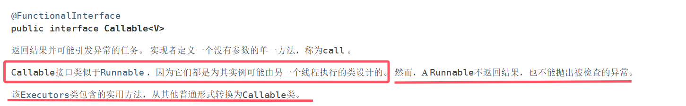

**1、可以有返回值；
2、可以抛出异常；
3、方法不同，run()/call()**

> 以下两段代码能够说明`FutureTask` 的核心特性：**结果缓存**

```java
//CallableTest 类中创建了一个 MyThread1 对象，并将其传递给 FutureTask 构造方法中生成了一个 FutureTask 实例。接着，将 FutureTask 实例分别放入两个线程 A 和 B 中启动。但 FutureTask 的核心特性是 结果缓存，即在第一次计算完成后，无论后续有多少次 call() 调用，它都只会返回缓存的结果，而不会再次调用 call() 方法。无论有多少线程使用同一个 FutureTask 实例，call() 方法只会被调用一次，结果会被缓存起来。这就是为什么即使有多个线程启动，也只有一个线程会执行 call() 方法，最终只打印一次 call()。

public class CallableTest {
    public static void main(String[] args) throws ExecutionException, InterruptedException {

        MyThread1 myThread1 = new MyThread1();

        FutureTask<Integer> futureTask = new FutureTask<>(myThread1); //适配类
        // 放入Thread中使用，结果会被缓存
        new Thread(futureTask, "A").start();
        new Thread(futureTask, "B").start();
        // 如果call方法中有一个耗时的方法，这个get方法可能会被阻塞。所以一般情况我们会把这个放在最后，或者使用异步通信
        int a = futureTask.get();
        System.out.println("返回值:" + a);
    }

}

class MyThread1 implements Callable<Integer> {

    @Override
    public Integer call() throws Exception {
        System.out.println("call()");
        return 1024;
    }
}
```

```java
//每次循环都会创建一个新的 MyThread1 实例和一个新的 FutureTask 实例，并将 FutureTask 传递给新的线程启动。这意味着每个循环都会启动一个独立的 FutureTask 实例，每个实例都有自己的 call() 方法。由于 FutureTask 的缓存机制仅适用于单个实例，故每次循环创建的新 FutureTask 会执行其各自的 call() 方法。这样，循环 9 次后，call() 方法就会被打印 9 次。

public class CallableTest {
    public static void main(String[] args) throws ExecutionException, InterruptedException {
        for (int i = 1; i < 10; i++) {
            MyThread1 myThread1 = new MyThread1();

            FutureTask<Integer> futureTask = new FutureTask<>(myThread1); //适配类
            // 放入Thread中使用，结果会被缓存
            new Thread(futureTask,String.valueOf(i)).start();
            // 如果call方法中有一个耗时的方法，这个get方法可能会被阻塞。所以一般情况我们会把这个放在最后，或者使用异步通信
            int a = futureTask.get();
            System.out.println("返回值:" + a);
        }

    }

}
class MyThread1 implements Callable<Integer> {

    @Override
    public Integer call() throws Exception {
        System.out.println("call()");
        return 1024;
    }
}
```

### 8. 常用的辅助类(必会)

#### 1）CountDownLatch

```java
public class CountDownLatchDemo {
    public static void main(String[] args) throws InterruptedException {
        // 总数是6
        CountDownLatch countDownLatch = new CountDownLatch(6);

        for (int i = 1; i <= 6; i++) {
            new Thread(() -> {
                System.out.println(Thread.currentThread().getName() + "==> Go Out");
                countDownLatch.countDown(); // 每个线程都数量 -1
            },String.valueOf(i)).start();
        }
        countDownLatch.await(); // 等待计数器归零 然后向下执行
        System.out.println("close door");
    }
}
```

主要方法：

- countDown 减一操作；
- await 等待计数器归零

await 等待计数器归零，就唤醒，再继续向下运行

#### 2）CyclickBarrier


加法计数器

```java
//代码执行流程：
//1.每个线程依次打印“收集了第X颗龙珠”，并调用 await() 方法。
//2.当第 7 个线程调用 await() 后，栅栏触发，打印“召唤神龙”，所有线程继续运行。

public class CyclicBarrierDemo {
    public static void main(String[] args) {
        // 主线程
        CyclicBarrier cyclicBarrier = 	new CyclicBarrier(7,() -> {
            System.out.println("召唤神龙");
        });

        for (int i = 1; i <= 7; i++) {
            // 子线程
            int finalI = i;
            new Thread(() -> {
                System.out.println(Thread.currentThread().getName() + "收集了第" + finalI + "颗龙珠");
                try {
                    cyclicBarrier.await(); // 加法计数 等待
                } catch (InterruptedException e) {
                    e.printStackTrace();
                } catch (BrokenBarrierException e) {
                    e.printStackTrace();
                }
            }).start();
        }
    }
}
```

#### 3）Semaphore

```java
public class SemaphoreDemo {
    public static void main(String[] args) {

        // 线程数量，停车位，限流
        Semaphore semaphore = new Semaphore(3);
        for (int i = 0; i <= 6; i++) {
            new Thread(() -> {
                // acquire() 得到
                try {
                    semaphore.acquire();
                    System.out.println(Thread.currentThread().getName() + "抢到车位");
                    TimeUnit.SECONDS.sleep(2);
                    System.out.println(Thread.currentThread().getName() + "离开车位");
                }catch (Exception e) {
                    e.printStackTrace();
                }finally {
                    semaphore.release(); // release() 释放
                }
            }).start();
        }
    }
}
Thread-1抢到车位
Thread-0抢到车位
Thread-2抢到车位
Thread-0离开车位
Thread-2离开车位
Thread-1离开车位
Thread-5抢到车位
Thread-3抢到车位
Thread-4抢到车位
Thread-5离开车位
Thread-3离开车位
Thread-6抢到车位
Thread-4离开车位
Thread-6离开车位

Process finished with exit code 0
```

原理：

**semaphore.acquire()获得资源，如果资源已经使用完了，就等待资源释放后再进行使用！**

**semaphore.release()释放，会将当前的信号量+1，然后唤醒等待的线程！**

作用： 多个共享资源互斥的使用！ 并发限流，控制最大的线程数！

### 9. 读写锁

未使用任何锁时，进行读写操作：

```java
public class ReadWriteLockDemo {
    public static void main(String[] args) {
        MyCache myCache = new MyCache();
        int num = 6;
        for (int i = 1; i <= num; i++) {
            int finalI = i;
            new Thread(() -> {

                myCache.write(String.valueOf(finalI), String.valueOf(finalI));

            },String.valueOf(i)).start();
        }

        for (int i = 1; i <= num; i++) {
            int finalI = i;
            new Thread(() -> {

                myCache.read(String.valueOf(finalI));

            },String.valueOf(i)).start();
        }
    }
}

/**
 *  方法未加锁，导致写的时候被插队
 */
class MyCache {
    private volatile Map<String, String> map = new HashMap<>();

    public void write(String key, String value) {
        System.out.println(Thread.currentThread().getName() + "线程开始写入");
        map.put(key, value);
        System.out.println(Thread.currentThread().getName() + "线程写入ok");
    }

    public void read(String key) {
        System.out.println(Thread.currentThread().getName() + "线程开始读取");
        map.get(key);
        System.out.println(Thread.currentThread().getName() + "线程写读取ok");
    }
}
2线程开始写入
2线程写入ok
3线程开始写入
3线程写入ok
1线程开始写入    # 插入了其他线程的写入，导致数据不一致
4线程开始写入
4线程写入ok
1线程写入ok
6线程开始写入
6线程写入ok
5线程开始写入
5线程写入ok
1线程开始读取
1线程写读取ok
2线程开始读取
2线程写读取ok
3线程开始读取
3线程写读取ok
4线程开始读取
4线程写读取ok
5线程开始读取
6线程开始读取
6线程写读取ok
5线程写读取ok

Process finished with exit code 0
```

所以如果我们不加锁的情况，多线程的读写会造成数据不可靠的问题。

我们也可以采用**synchronized**这种重量锁和轻量锁 **lock**去保证数据的可靠。

但是这次我们采用更细粒度的锁：**ReadWriteLock** 读写锁来保证

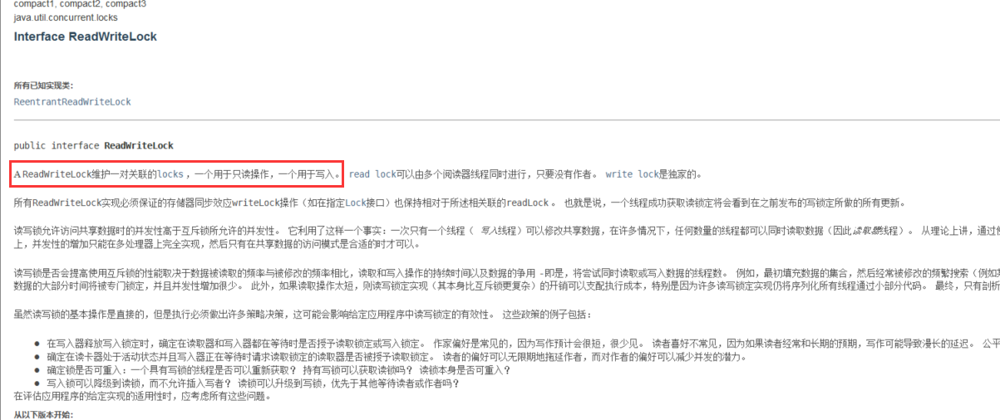

使用读写锁时进行读写操作：

> 使用读写锁注意事项：
>
> 写锁（独占锁）：一次只能被一个线程占有
> 读锁（共享锁）：多个线程可以同时占有
>
> 读--写：不能共存（读线程读取时，写线程不能写入；写线程写入时，读线程不能读取）
> 读--读：可以共存（读线程读取时，其它读线程仍能够读取）
> 写--写：不能共存（写线程写入时，其它写线程不能写入）

```java
public class ReadWriteLockDemo {
    public static void main(String[] args) {
        MyCache2 myCache = new MyCache2();
        int num = 6;
        for (int i = 1; i <= num; i++) {
            int finalI = i;
            new Thread(() -> {

                myCache.write(String.valueOf(finalI), String.valueOf(finalI));

            },String.valueOf(i)).start();
        }

        for (int i = 1; i <= num; i++) {
            int finalI = i;
            new Thread(() -> {

                myCache.read(String.valueOf(finalI));

            },String.valueOf(i)).start();
        }
    }

}
class MyCache2 {
    private volatile Map<String, String> map = new HashMap<>();
    private ReadWriteLock lock = new ReentrantReadWriteLock();

    public void write(String key, String value) {
        lock.writeLock().lock(); // 写锁
        try {
            System.out.println(Thread.currentThread().getName() + "线程开始写入");
            map.put(key, value);
            System.out.println(Thread.currentThread().getName() + "线程写入ok");

        }finally {
            lock.writeLock().unlock(); // 释放写锁
        }
    }

    public void read(String key) {
        lock.readLock().lock(); // 读锁
        try {
            System.out.println(Thread.currentThread().getName() + "线程开始读取");
            map.get(key);
            System.out.println(Thread.currentThread().getName() + "线程写读取ok");
        }finally {
            lock.readLock().unlock(); // 释放读锁
        }
    }
}
1线程开始写入
1线程写入ok
6线程开始写入
6线程写入ok
3线程开始写入
3线程写入ok
2线程开始写入
2线程写入ok
5线程开始写入
5线程写入ok
4线程开始写入
4线程写入ok
    
1线程开始读取
5线程开始读取
2线程开始读取
1线程写读取ok
3线程开始读取
2线程写读取ok
6线程开始读取
6线程写读取ok
5线程写读取ok
4线程开始读取
4线程写读取ok
3线程写读取ok

Process finished with exit code 0
```

### 10. 阻塞队列

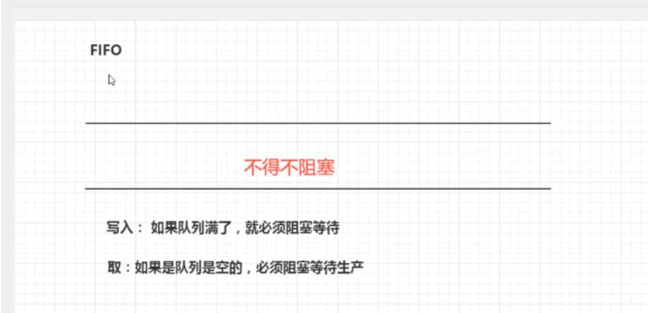

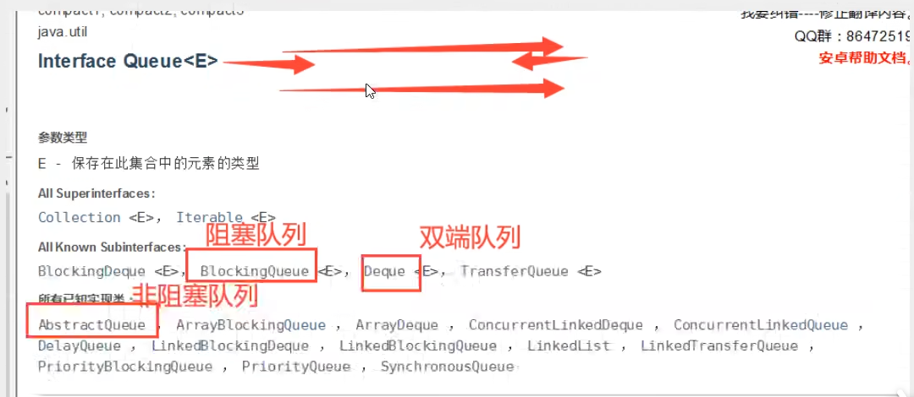

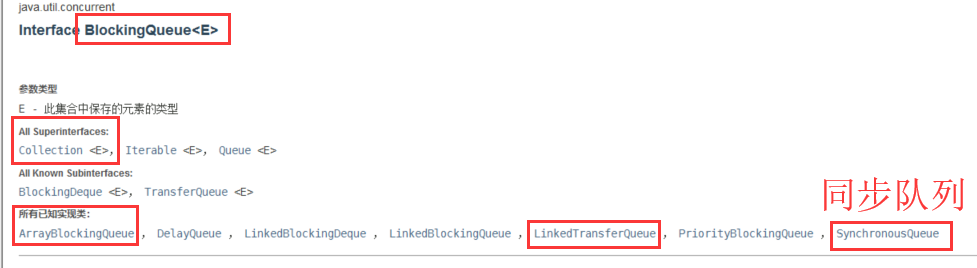

#### 1）BlockingQueue

是Collection的一个子类

什么情况下我们会使用阻塞队列

> 多线程并发处理、线程池

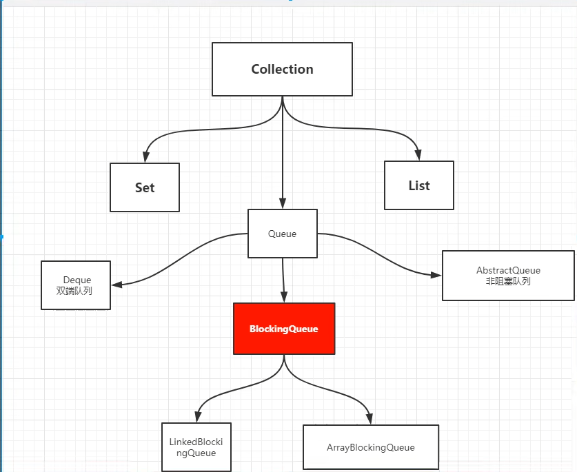

BlockingQueue 有四组api

| 方式         | 抛出异常 | 不会抛出异常，有返回值 | 阻塞，等待 | 超时等待                        |
| ------------ | -------- | ---------------------- | ---------- | ------------------------------- |
| 添加         | add      | offer                  | put        | offer(param1, param2, param3  ) |
| 移出         | remove   | poll                   | take       | poll(param1, param2)            |
| 判断队首元素 | element  | peek                   | -          | -                               |

```java
/**
     * 抛出异常
     */
    public static void test1(){
        //需要初始化队列的大小
        ArrayBlockingQueue blockingQueue = new ArrayBlockingQueue<>(3);

        System.out.println(blockingQueue.add("a"));
        System.out.println(blockingQueue.add("b"));
        System.out.println(blockingQueue.add("c"));
        //抛出异常：java.lang.IllegalStateException: Queue full
//        System.out.println(blockingQueue.add("d"));
        System.out.println(blockingQueue.remove());
        System.out.println(blockingQueue.remove());
        System.out.println(blockingQueue.remove());
        //如果多移除一个
        //这也会造成 java.util.NoSuchElementException 抛出异常
        System.out.println(blockingQueue.remove());
    }
=======================================================================================
/**
     * 不抛出异常，有返回值
     */
    public static void test2(){
        ArrayBlockingQueue blockingQueue = new ArrayBlockingQueue<>(3);
        System.out.println(blockingQueue.offer("a"));
        System.out.println(blockingQueue.offer("b"));
        System.out.println(blockingQueue.offer("c"));
        //添加 一个不能添加的元素 使用offer只会返回false 不会抛出异常
        System.out.println(blockingQueue.offer("d"));

        System.out.println(blockingQueue.poll());
        System.out.println(blockingQueue.poll());
        System.out.println(blockingQueue.poll());
        //弹出 如果没有元素 只会返回null 不会抛出异常
        System.out.println(blockingQueue.poll());
    }
=======================================================================================
/**
     * 等待 一直阻塞
     */
    public static void test3() throws InterruptedException {
        ArrayBlockingQueue blockingQueue = new ArrayBlockingQueue<>(3);

        //一直阻塞 不会返回
        blockingQueue.put("a");
        blockingQueue.put("b");
        blockingQueue.put("c");

        //如果队列已经满了， 再进去一个元素  这种情况会一直等待这个队列 什么时候有了位置再进去，程序不会停止
//        blockingQueue.put("d");

        System.out.println(blockingQueue.take());
        System.out.println(blockingQueue.take());
        System.out.println(blockingQueue.take());
        //如果我们再来一个  这种情况也会等待，程序会一直运行 阻塞
        System.out.println(blockingQueue.take());
    }
=======================================================================================
/**
     * 等待 超时阻塞
     *  这种情况也会等待队列有位置 或者有产品 但是会超时结束
     */
    public static void test4() throws InterruptedException {
        ArrayBlockingQueue blockingQueue = new ArrayBlockingQueue<>(3);
        blockingQueue.offer("a");
        blockingQueue.offer("b");
        blockingQueue.offer("c");
        System.out.println("开始等待");
        blockingQueue.offer("d",2, TimeUnit.SECONDS);  //超时时间2s 等待如果超过2s就结束等待
        System.out.println("结束等待");
        System.out.println("===========取值==================");
        System.out.println(blockingQueue.poll());
        System.out.println(blockingQueue.poll());
        System.out.println(blockingQueue.poll());
        System.out.println("开始等待");
        blockingQueue.poll(2,TimeUnit.SECONDS); //超过两秒 我们就不要等待了
        System.out.println("结束等待");
    }
```

#### 2）同步队列

同步队列 没有容量，也可以视为**容量为1的队列**；

进去一个元素，必须等待取出来之后，才能再往里面放入一个元素；

**put**方法 和 **take**方法；

**Synchronized** 和 其他的**BlockingQueue** 不一样 它不存储元素；

put了一个元素，就必须从里面先take出来，否则不能再put进去值！

并且SynchronousQueue 的take是使用了**lock锁保证线程安全**的。

```java
package com.marchsoft.queue;

import java.util.concurrent.BlockingDeque;
import java.util.concurrent.BlockingQueue;

/**
 * Description：
 *
 * @author jiaoqianjin
 * Date: 2020/8/12 10:02
 **/

public class SynchronousQueue {
    public static void main(String[] args) {
        BlockingQueue<String> synchronousQueue = new java.util.concurrent.SynchronousQueue<>();
        // 网queue中添加元素
        new Thread(() -> {
            try {
                System.out.println(Thread.currentThread().getName() + "put 01");
                synchronousQueue.put("1");
                System.out.println(Thread.currentThread().getName() + "put 02");
                synchronousQueue.put("2");
                System.out.println(Thread.currentThread().getName() + "put 03");
                synchronousQueue.put("3");
            } catch (InterruptedException e) {
                e.printStackTrace();
            }
        }).start();
        // 取出元素
        new Thread(()-> {
            try {
                TimeUnit.SECONDS.sleep(3);
                System.out.println(Thread.currentThread().getName() + "take" + synchronousQueue.take());
                TimeUnit.SECONDS.sleep(3);                
                System.out.println(Thread.currentThread().getName() + "take" + synchronousQueue.take());
                TimeUnit.SECONDS.sleep(3);                
                System.out.println(Thread.currentThread().getName() + "take" + synchronousQueue.take());
            }catch (InterruptedException e) {
                e.printStackTrace();
            }
        }).start();
    }
}
Thread-0put 01
Thread-1take1
Thread-0put 02
Thread-1take2
Thread-0put 03
Thread-1take3

Process finished with exit code 0
```

### 11. 线程池(重点)

线程池：三大方式、七大参数、四种拒绝策略

> 池化技术

程序的运行，本质：占用系统的资源！我们需要去优化资源的使用 ===> 池化技术

线程池、JDBC的连接池、内存池、对象池 等等。。。。

资源的创建、销毁十分消耗资源

**池化技术**：事先准备好一些资源，如果有人要用，就来我这里拿，用完之后还给我，以此来提高效率。

#### 1）线程池的好处：

1、降低资源的消耗；

2、提高响应的速度；

3、方便管理；

**线程复用、可以控制最大并发数、管理线程；**

#### 2）线程池：三大方法（不应该使用）

> 不应该使用这三个方法创建线程池
>
> 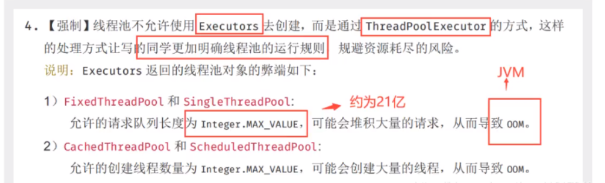

- **ExecutorService threadPool = Executors.newSingleThreadExecutor();//单个线程**
- **ExecutorService threadPool2 = Executors.newFixedThreadPool(5); //创建一个固定的线程池的大小**
- **ExecutorService threadPool3 = Executors.newCachedThreadPool(); //可伸缩的**

```java
//工具类 Executors 三大方法；
public class Demo01 {
    public static void main(String[] args) {

        ExecutorService threadPool = Executors.newSingleThreadExecutor();//单个线程
        ExecutorService threadPool2 = Executors.newFixedThreadPool(5); //创建一个固定的线程池的大小
        ExecutorService threadPool3 = Executors.newCachedThreadPool(); //可伸缩的

        //线程池用完必须要关闭线程池
        try {

            for (int i = 1; i <=100 ; i++) {
                //通过线程池创建线程
                threadPool.execute(()->{
                    System.out.println(Thread.currentThread().getName()+ " ok");
                });
            }
        } catch (Exception e) {
            e.printStackTrace();
        } finally {
            threadPool.shutdown();
        }
    }
}
```

#### 3）七大参数

ThreadPoolExecutor源码：

```java
public ThreadPoolExecutor(int corePoolSize,  //核心线程池大小
                          int maximumPoolSize, //最大的线程池大小
                          long keepAliveTime,  //超时了没有人调用就会释放
                          TimeUnit unit, //超时单位
                          BlockingQueue<Runnable> workQueue, //阻塞队列
                          ThreadFactory threadFactory, //线程工厂 创建线程的 一般不用动
                          RejectedExecutionHandler handler //拒绝策略
                         ) {
    if (corePoolSize < 0 ||
        maximumPoolSize <= 0 ||
        maximumPoolSize < corePoolSize ||
        keepAliveTime < 0)
        throw new IllegalArgumentException();
    if (workQueue == null || threadFactory == null || handler == null)
        throw new NullPointerException();
    this.corePoolSize = corePoolSize;
    this.maximumPoolSize = maximumPoolSize;
    this.workQueue = workQueue;
    this.keepAliveTime = unit.toNanos(keepAliveTime);
    this.threadFactory = threadFactory;
    this.handler = handler;
}
```

图解ThreadPoolExecutor中的corePoolSIze, maximumPoolSize, BlockingQueue, RejectedExecutionHandler:

>  最开始银行只开放两个窗口处理顾客请求，其余顾客在候客区等待。
>
>  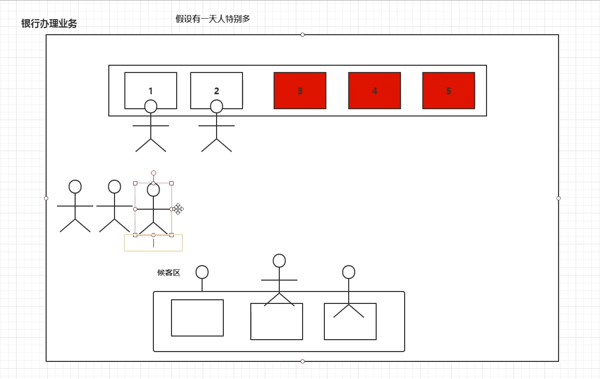
>
>  当候客区满了，还有顾客源源不断地进来时，原本的两个窗口已经不够用了，这时就会临时开放其余未开放的窗口。
>
>  若全部窗口已经开放，候客区已经满了，还有顾客进来，此时就会采用拒绝策略来拒绝外来顾客地请求。
>
>  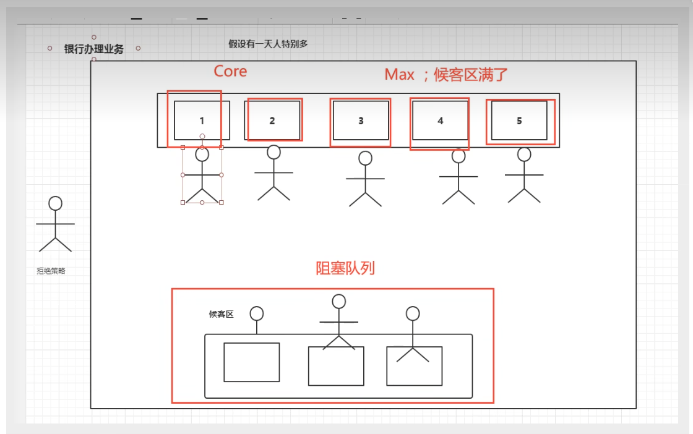
>
>  如果请求已被处理完毕，暂时开放的窗口在空闲一段时间后将被再次关闭。
>
>  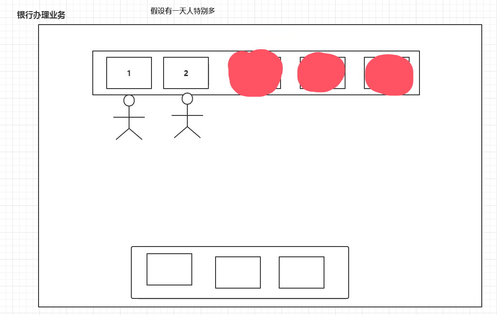
>
>  原本的两个窗口是corePoolSize,
>  所有的窗口是maximumPoolSize
>  候客区是blockingQueue
>  拒绝策略是 RejectedExecutionHandler
>  空闲的一段时间是keepAliveTime


阿里巴巴的Java操作手册中明确说明：对于Integer.MAX_VALUE初始值较大，所以一般情况我们要使用底层的**ThreadPoolExecutor**来创建线程池。

```java
public class PollDemo {
    public static void main(String[] args) {
        // 获取cpu 的核数
        int max = Runtime.getRuntime().availableProcessors();
        ExecutorService service =new ThreadPoolExecutor(
                2,
                max,
                3,
                TimeUnit.SECONDS,
                new LinkedBlockingDeque<>(3),
                Executors.defaultThreadFactory(),
                new ThreadPoolExecutor.AbortPolicy()
        );
        try {
            for (int i = 1; i <= 10; i++) {
                service.execute(() -> {
                    System.out.println(Thread.currentThread().getName() + "ok");
                });
            }
        }catch (Exception e) {
            e.printStackTrace();
        }
        finally {
            service.shutdown();
        }
    }
}
```

#### 4）拒绝策略

**1. new ThreadPoolExecutor.AbortPolicy()：** //该拒绝策略为：银行满了，还有人进来，不处理这个人的，并抛出异常

超出最大承载，就会抛出异常：队列容量大小+maxPoolSize

**2. new ThreadPoolExecutor.CallerRunsPolicy()：** //该拒绝策略为：哪来的去哪里，main线程进行处理

**3. new ThreadPoolExecutor.DiscardPolicy():** //该拒绝策略为：队列满了,丢掉异常，不会抛出异常。

**4. new ThreadPoolExecutor.DiscardOldestPolicy()：** //该拒绝策略为：队列满了，尝试去和最早的进程竞争，不会抛出异常

#### 5）如何设置线程池的大小

狂神说法

> **1、CPU密集型：电脑的核数是几核就选择几；选择maximunPoolSize的大小**
>
> ```java
> // 获取cpu 的核数
>   int max = Runtime.getRuntime().availableProcessors();
>   ExecutorService service =new ThreadPoolExecutor(
>           2,
>           max,
>           3,
>           TimeUnit.SECONDS,
>           new LinkedBlockingDeque<>(3),
>           Executors.defaultThreadFactory(),
>           new ThreadPoolExecutor.AbortPolicy()
>   );
> ```
>
> **2、I/O密集型：**
>
> 在程序中有15个大型任务，io十分占用资源；I/O密集型就是判断我们程序中十分耗I/O的线程数量，大约是最大I/O数的一倍到两倍之间。

博客园说法 （原文链接:https://cnblogs.com/wangstudyblog/p/17231480.html）

> **核心线程数**：如果任务是 CPU 密集型，即计算任务比较多，可以设置线程数为核心数+1，这样可以让 CPU 资源得到充分利用。如果任务是 IO 密集型，即网络请求比较多，可以根据实际情况设置线程数，一般可以设置为 2 * 核心数。
>
> **最大线程数**：最大线程数一般设置为 2 * 核心线程数，可以根据实际情况调整。
>
> **阻塞队列大小**：如果任务是 CPU 密集型，即计算任务比较多，可以将队列大小设置为 0 或者 1，这样可以让线程池及时处理任务，避免任务堆积。如果任务是 IO 密集型，即网络请求比较多，可以设置队列大小为 2 * 核心线程数，这样可以缓存一些请求，避免线程池因为等待 IO 密集型任务而阻塞。
>
> 动态调整：可以根据实际情况动态调整线程池的核心数、最大线程数和队列大小，比如根据系统负载、CPU 使用率、任务执行时间等指标来调整。
>
> 监控和优化：可以通过监控线程池的运行状况，比如任务的平均响应时间、任务的完成数量等指标来优化线程池的配置，从而提高吞吐量。

### 12. 四大函数式接口(重点、必须掌握)

新时代的程序员：**lambda表达式、链式编程、函数式接口、Stream流式计算**

函数式接口：只有一个方法的接口


#### 1）Function 函数型接口


```java
public class FunctionDemo {
    public static void main(String[] args) {
        Function<String, String> function = (str) -> {return str;};
        System.out.println(function.apply("aaaaaaaaaa"));
    }
}
```

#### 2）Predicate 断定型接口

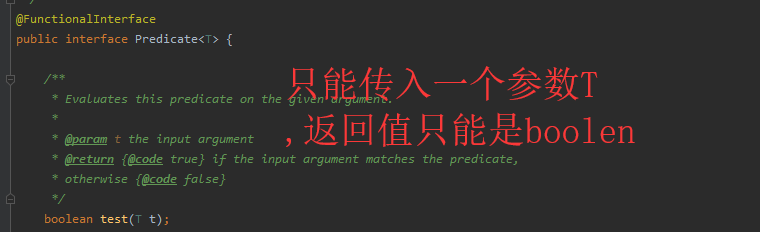

```java
public class PredicateDemo {
    public static void main(String[] args) {
        Predicate<String> predicate = (str) -> {return str.isEmpty();};
        // false
        System.out.println(predicate.test("aaa"));
        // true
        System.out.println(predicate.test(""));
    }
}
```

#### 3）Suppier 供给型接口


```java
/**
 * 供给型接口，只返回，不输入
 */
public class Demo4 {
    public static void main(String[] args) {
        Supplier<String> supplier = ()->{return "1024";};
        System.out.println(supplier.get());
    }
}
```

#### 4）Consummer 消费型接口

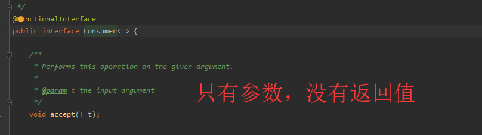

```java
/**
 * 消费型接口 没有返回值！只有输入！
 */
public class Demo3 {
    public static void main(String[] args) {
        Consumer<String> consumer = (str)->{
            System.out.println(str);
        };
        consumer.accept("abc");
    }
}
```

### 13. Stream 流式计算

```java
/**
 * Description：
 * 题目要求： 用一行代码实现
 * 1. Id 必须是偶数
 * 2.年龄必须大于23
 * 3. 用户名转为大写
 * 4. 用户名倒序
 * 5. 只能输出一个用户
 *
 * @author jiaoqianjin
 * Date: 2020/8/12 14:55
 **/

public class StreamDemo {
    public static void main(String[] args) {
        User u1 = new User(1, "a", 23);
        User u2 = new User(2, "b", 23);
        User u3 = new User(3, "c", 23);
        User u4 = new User(6, "d", 24);
        User u5 = new User(4, "e", 25);

        List<User> list = Arrays.asList(u1, u2, u3, u4, u5);
        // lambda、链式编程、函数式接口、流式计算
        list.stream()
                .filter(user -> {return user.getId()%2 == 0;})
                .filter(user -> {return user.getAge() > 23;})
                .map(user -> {return user.getName().toUpperCase();})
                .sorted((user1, user2) -> {return user2.compareTo(user1);})
                .limit(1)
                .forEach(System.out::println);
    }
}
```

### 14. ForkJoin

使用场景：大数据量

ForkJoin 在JDK1.7，并行执行任务！提高效率~。在大数据量速率会更快！

大数据中：**MapReduce 核心思想->把大任务拆分为小任务！**  

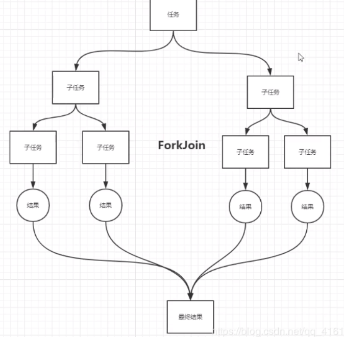

#### 1）ForkJoin 特点： 工作窃取！

实现原理是：**双端队列**！从上面和下面都可以去拿到任务进行执行！


#### 2）如何使用ForkJoin?

- 1、通过**ForkJoinPool**来执行

- 2、计算任务 **execute(ForkJoinTask<?> task)**

- 3、计算类要去继承ForkJoinTask；

  **ForkJoin 的计算类**

```java
package com.marchsoft.forkjoin;

import java.util.concurrent.RecursiveTask;

/**
 * Description：
 *
 * @author jiaoqianjin
 * Date: 2020/8/13 8:33
 **/

public class ForkJoinDemo extends RecursiveTask<Long> {
    private long star;
    private long end;
    /** 临界值 */
    private long temp = 100_0000L;

    public ForkJoinDemo(long star, long end) {
        this.star = star;
        this.end = end;
    }

    /**
     * 计算方法
     * @return
     */
    @Override
    protected Long compute() {
        if ((end - star) < temp) {
            Long sum = 0L;
            for (Long i = star; i < end; i++) {
                sum += i;
            }
            return sum;
        }else {
            // 使用ForkJoin 分而治之 计算
            //1 . 计算平均值
            long middle = (star + end) / 2;
            ForkJoinDemo forkJoinDemo1 = new ForkJoinDemo(star, middle);
            // 拆分任务，把线程压入线程队列
            forkJoinDemo1.fork();
            ForkJoinDemo forkJoinDemo2 = new ForkJoinDemo(middle, end);
            forkJoinDemo2.fork();

            long taskSum = forkJoinDemo1.join() + forkJoinDemo2.join();
            return taskSum;
        }
    }
}
```

**测试类**

```java
package com.marchsoft.forkjoin;

import java.util.concurrent.ExecutionException;
import java.util.concurrent.ForkJoinPool;
import java.util.concurrent.ForkJoinTask;
import java.util.stream.LongStream;

/**
 * Description：
 *
 * @author jiaoqianjin
 * Date: 2020/8/13 8:43
 **/

public class ForkJoinTest {
    private static final long SUM = 20_0000_0000;

    public static void main(String[] args) throws ExecutionException, InterruptedException {
        test1();
        test2();
        test3();
    }

    /**
     * 使用普通方法
     */
    public static void test1() {
        long star = System.currentTimeMillis();
        long sum = 0L;
        for (long i = 1; i < SUM ; i++) {
            sum += i;
        }
        long end = System.currentTimeMillis();
        System.out.println(sum);
        System.out.println("时间：" + (end - star));
        System.out.println("----------------------");
    }
    /**
     * 使用ForkJoin 方法
     */
    public static void test2() throws ExecutionException, InterruptedException {
        long star = System.currentTimeMillis();

        ForkJoinPool forkJoinPool = new ForkJoinPool();
        ForkJoinTask<Long> task = new ForkJoinDemo(0L, SUM);
        ForkJoinTask<Long> submit = forkJoinPool.submit(task);
        Long along = submit.get();

        System.out.println(along);
        long end = System.currentTimeMillis();
        System.out.println("时间：" + (end - star));
        System.out.println("-----------");
    }
    /**
     * 使用 Stream 流计算
     */
    public static void test3() {
        long star = System.currentTimeMillis();

        long sum = LongStream.range(0L, 20_0000_0000L).parallel().reduce(0, Long::sum);
        System.out.println(sum);
        long end = System.currentTimeMillis();
        System.out.println("时间：" + (end - star));
        System.out.println("-----------");
    }
}
```

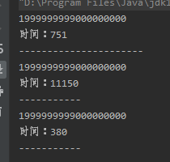

**.parallel().reduce(0, Long::sum)使用一个并行流去计算整个计算，提高效率。**

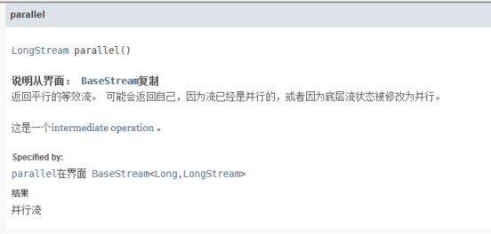

### 15. 异步回调

> Future 设计的初衷：对将来的某个事件结果进行建模！

其实就是前端 --> 发送ajax异步请求给后端

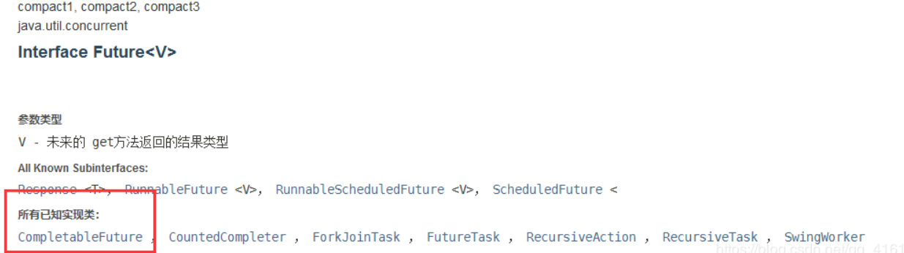

但是我们平时都使用**CompletableFuture**

##### （1）没有返回值的runAsync异步回调

```java
public static void main(String[] args) throws ExecutionException, InterruptedException 
{
        // 发起 一个 请求
        System.out.println(System.currentTimeMillis());
        System.out.println("---------------------");
        CompletableFuture<Void> future = CompletableFuture.runAsync(()->{
            //发起一个异步任务
            try {
                TimeUnit.SECONDS.sleep(2);
            } catch (InterruptedException e) {
                e.printStackTrace();
            }
            System.out.println(Thread.currentThread().getName()+".....");
        });
        System.out.println(System.currentTimeMillis());
        System.out.println("------------------------------");
        //输出执行结果
        System.out.println(future.get());  //获取执行结果
 }
```

runAsync传入自定义的线程池：

```java
@SpringBootTest
public class InsertUserTest {
    @Resource
    private UserService userService;

    //线程池设置
    private ExecutorService executorService = new ThreadPoolExecutor(16, 1000, 10000, TimeUnit.MINUTES, new ArrayBlockingQueue<>(10000));


    /**
     * 并发批量插入用户   100000  耗时： 26830ms
     */
    //@Test
    public void doConcurrencyInsertUser() {
        StopWatch stopWatch = new StopWatch();
        stopWatch.start();
        final int INSERT_NUM = 100000;
        // 分十组
        int j = 0;
        //批量插入数据的大小
        int batchSize = 5000;
        List<CompletableFuture<Void>> futureList = new ArrayList<>();
        // i 要根据数据量和插入批量来计算需要循环的次数。（鱼皮这里直接取了个值，会有问题,我这里随便写的）
        for (int i = 0; i < INSERT_NUM / batchSize; i++) {
            List<User> userList = new ArrayList<>();
            //确定每个线程要处理的列表
            while (true) {
                j++;
                User user = new User();
                user.setUserName("假数据");
                user.setUserAccount("FakeAccount");
                user.setUserAvatar("https://i.ytimg.com/vi/ucPl4gJuev0/maxresdefault.jpg");
                user.setUserPassword("12345678");
                user.setUserRole("user");
                user.setTags("[]");
                userList.add(user);
                if (j % batchSize == 0) {
                    break;
                }
            }
            //异步执行 使用CompletableFuture开启异步任务
            CompletableFuture<Void> future = CompletableFuture.runAsync(() -> {
                System.out.println("ThreadName：" + Thread.currentThread().getName());
                userService.saveBatch(userList, batchSize);
                //executorService是用于执行异步任务的线程池。
            }, executorService);
            futureList.add(future);
        }
        //allOf方法用于等待多个异步任务的完成
        //join() 方法会阻塞当前线程，直到所有异步任务都完成。如果任务有异常，它会抛出异常。
        CompletableFuture.allOf(futureList.toArray(new CompletableFuture[]{})).join();

        stopWatch.stop();
        System.out.println(stopWatch.getLastTaskTimeMillis());
    }
}

```


##### （2）有返回值的异步回调supplyAsync

```java
//有返回值的异步回调
package async;

import java.util.concurrent.CompletableFuture;
import java.util.concurrent.ExecutionException;
import java.util.concurrent.TimeUnit;

public class AsyncTest {
    public static void main(String[] args) throws ExecutionException, InterruptedException {

        //有返回值的异步回调
        CompletableFuture<Integer> completableFuture = CompletableFuture.supplyAsync(() -> {
            System.out.println(Thread.currentThread().getName());
            try {
                TimeUnit.SECONDS.sleep(2);
                int i = 1 / 0;
            } catch (InterruptedException e) {
                e.printStackTrace();
            }
            return 1024;
        });

        System.out.println(completableFuture.whenComplete((t, u) ->
                {
                    //success 回调
                    System.out.println("t=>" + t); //正常的返回结果
                    System.out.println("u=>" + u); //抛出异常的 错误信息
                }).

                exceptionally((e) ->
                {
                    //error回调
                    System.out.println("e=>" + e);
                    System.out.println("e.getMessage() = " + e.getMessage());
                    return 404;
                }).get());
    }
}
/*
whenComplete方法中参数的解释：

        t（成功结果）：
        在 whenComplete 中，t 表示 任务成功完成后的返回结果。
        如果任务执行成功，t 会被赋值为返回值 1024。
        如果任务抛出异常，t 将为 null。
        u、e（异常信息）：
        在 whenComplete 中，u 表示 任务执行过程中发生的异常。
        如果任务成功完成，u 的值为 null。
        如果任务抛出异常，u 会被赋值为异常对象，在这里会显示 ArithmeticException（因为 1 / 0 抛出了异常）。
*/
```

> 程序执行结果：
>
> 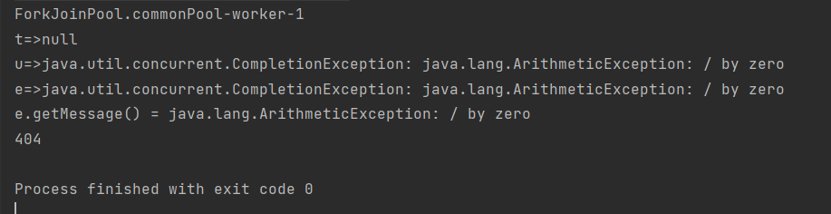

**whenComplete**: 有两个参数，一个是t 一个是u

T：是代表的 **正常返回的结果**；

U：是代表的 **抛出异常的错误信息**；

如果发生了异常，get可以获取到**exceptionally**返回的值；

### 16. JMM

JMM：JAVA内存模型，不存在的东西，是一个概念，也是一个约定！

**关于JMM的一些同步的约定：**

1、线程解锁前，必须把共享变量**立刻**刷回主存；

2、线程加锁前，必须**读取主存**中的最新值到工作内存中；

3、加锁和解锁是同一把锁；

线程中分为 **工作内存、主内存**

**8种操作**:

- **Read（读取）**：作用于主内存变量，它把一个变量的值从主内存传输到线程的工作内存中，以便随后的load动作使用；

- **load（载入）**：作用于工作内存的变量，它把read操作从主存中变量放入工作内存中；

- **Use（使用）**：作用于工作内存中的变量，它把工作内存中的变量传输给执行引擎，每当虚拟机遇到一个需要使用到变量的值，就会使用到这个指令；

- **assign（赋值）**：作用于工作内存中的变量，它把一个从执行引擎中接受到的值放入工作内存的变量副本中；

- **store（存储）**：作用于主内存中的变量，它把一个从工作内存中一个变量的值传送到主内存中，以便后续的write使用；

- **write（写入）**：作用于主内存中的变量，它把store操作从工作内存中得到的变量的值放入主内存的变量中；

- **lock（锁定）**：作用于主内存的变量，把一个变量标识为线程独占状态；

- **unlock（解锁）**：作用于主内存的变量，它把一个处于锁定状态的变量释放出来，释放后的变量才可以被其他线程锁定；

  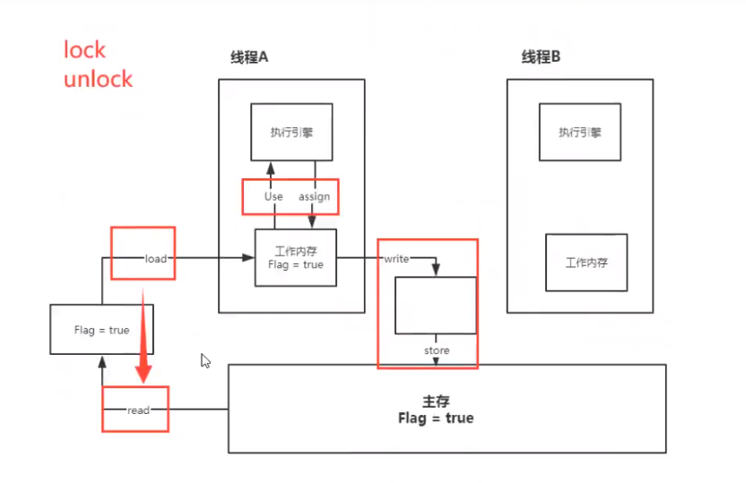

  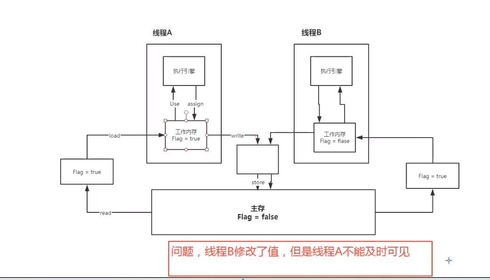

  **JMM对这8种操作给了相应的规定**：

  - 不允许read和load、store和write操作之一单独出现。即使用了read必须load，使用了store必须write
  - 不允许线程丢弃他最近的assign操作，即工作变量的数据改变了之后，必须告知主存
  - 不允许一个线程将没有assign的数据从工作内存同步回主内存
  - 一个新的变量必须在主内存中诞生，不允许工作内存直接使用一个未被初始化的变量。就是对变量实施use、store操作之前，必须经过assign和load操作
  - 一个变量同一时间只有一个线程能对其进行lock。多次lock后，必须执行相同次数的unlock才能解锁
  - 如果对一个变量进行lock操作，会清空所有工作内存中此变量的值，在执行引擎使用这个变量前，必须重新load或assign操作初始化变量的值
  - 如果一个变量没有被lock，就不能对其进行unlock操作。也不能unlock一个被其他线程锁住的变量
  - 对一个变量进行unlock操作之前，必须把此变量同步回主内存

  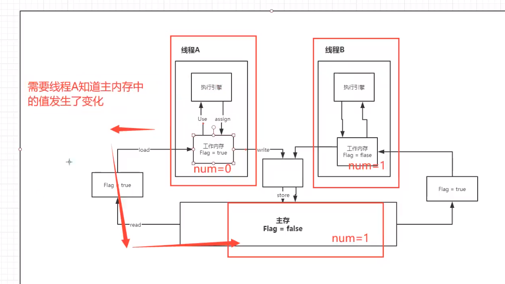

遇到问题：**程序不知道主存中的值已经被修改过了！；**

**测试JMM模式主存和线程工作内存不一致问题：**

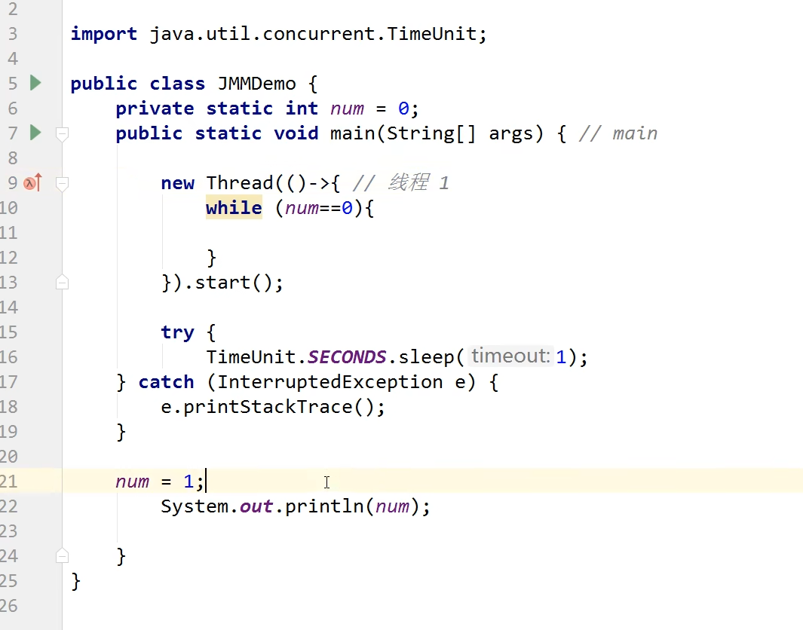

> 在上面这段代码中，一共存在两个线程：main线程和线程1。
>
> 线程1先把num=0读入到了自己的工作内存中。
>
> 之后num被main线程从0修改为了1，并将修改后的结果写入到了主存
>
> 主存和线程1共存内存出现了数据不一致问题
>
>
> 以上程序执行结果如下：
>
> 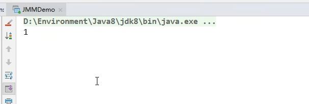
>
> main线程输出num为1
>
> 线程1因为工作内存中的num==0而一直运行

### 17. volatile

#### 对Volatile 的理解

**Volatile** 是 Java 虚拟机提供 **轻量级的同步机制**

**1、保证可见性
2、不保证原子性
3、禁止指令重排**

**如何实现可见性**

volatile变量修饰的共享变量在进行写操作的时候回多出一行汇编：

0x01a3de1d:movb $0×0，0×1104800（%esi）;0x01a3de24**:lock** addl $0×0,(%esp);

Lock前缀的指令在多核处理器下会引发两件事情。

1）将当前处理器缓存行的数据写回到系统内存。

2）这个写回内存的操作会使其他cpu里缓存了该内存地址的数据无效。

**多处理器总线嗅探：**

 为了提高处理速度，处理器不直接和内存进行通信，而是先将系统内存的数据读到内部缓存后再进行操作，但操作不知道何时会写到内存。如果对声明了volatile的变量进行写操作，JVM就会向处理器发送一条lock前缀的指令，将这个变量所在缓存行的数据写回到系统内存。但是在**多处理器下**，为了保证各个处理器的缓存是一致的，就会实现缓存缓存一致性协议，**每个处理器通过嗅探在总线上传播的数据来检查自己的缓存值是不是过期了，如果处理器发现自己缓存行对应的内存地址呗修改，就会将当前处理器的缓存行设置无效状态**，当处理器对这个数据进行修改操作的时候，会重新从系统内存中把数据库读到处理器缓存中。

#### 1）保证可见性

> volatile 的可见性是指**当多个线程访问同一个变量（共享变量）时，如果在这期间有某个线程修改了该共享变量的值，那么其他线程能够立即看得到修改后的值**

```java
public class JMMDemo01 {

    // 如果不加volatile 程序会死循环
    // 加了volatile是可以保证可见性的
    private volatile static Integer number = 0;

    public static void main(String[] args) {//main线程
        new Thread(()->{  //子线程1
            while (number==0){
            }
        }).start();
        try {
            TimeUnit.SECONDS.sleep(2);
        } catch (InterruptedException e) {
            e.printStackTrace();
        }
        
        number=1;
        System.out.println(number);
    }
}
```

#### 2）不保证原子性

原子性：不可分割；

线程A在执行任务的时候，不能被打扰的，也不能被分割的，要么同时成功，要么同时失败。

```java
/**
 * 不保证原子性
 * number <=2w
 * 
 */
public class VDemo02 {

    private static volatile int number = 0;

    public static void add(){
        number++; 
        //++ 不是一个原子性操作，是两个~3个操作
        //
    }

    public static void main(String[] args) {
        //理论上number  === 20000

        for (int i = 1; i <= 20; i++) {
            new Thread(()->{
                for (int j = 1; j <= 1000 ; j++) {
                    add();
                }
            }).start();
        }

        while (Thread.activeCount()>2){
            //main  gc
            Thread.yield();
        }
        System.out.println(Thread.currentThread().getName()+",num="+number);
    }
}
```

通过反编译VDemo02.class文件，可以看到add函数中的num++操作，实际执行了5步。

换言之，虽然只有num++一行代码，但这一行代码由于底层有不止1个操作，而导致这行代码并不是原子性的代码。

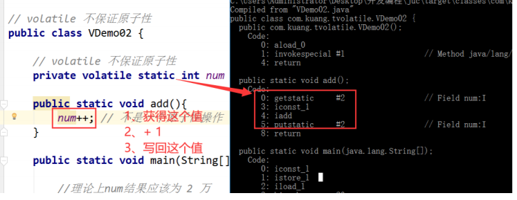

**如果不加lock和synchronized ，怎么样保证原子性？**

**使用原子类**

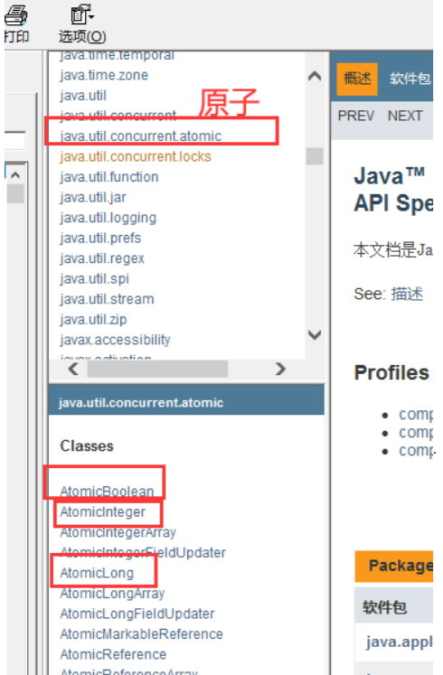

```java
public class VDemo02 {

    private static volatile AtomicInteger number = new AtomicInteger();

    public static void add(){
//        number++;
        number.incrementAndGet();  //底层是CAS保证的原子性。CAS的并发效率远比Sychronized和Lock高
    }

    public static void main(String[] args) {
        //理论上number  === 20000

        for (int i = 1; i <= 20; i++) {
            new Thread(()->{
                for (int j = 1; j <= 1000 ; j++) {
                    add();
                }
            }).start();
        }

        while (Thread.activeCount()>2){
            //main  gc
            Thread.yield();
        }
        System.out.println(Thread.currentThread().getName()+",num="+number);
    }
}
```

这些类的底层都直接和操作系统挂钩！直接在内存中修改值。

Unsafe类是一个很特殊的存在；

> 原子类为什么这么高级？

#### 3）禁止指令重排

**什么是指令重排？**

我们写的程序，计算机并不是按照我们自己写的那样去执行的

源代码–>编译器优化重排–>指令并行也可能会重排–>内存系统也会重排–>执行

**处理器在进行指令重排的时候，会考虑数据之间的依赖性！**

```java
int x=1; //1
int y=2; //2
x=x+5;   //3
y=x*x;   //4

//我们期望的执行顺序是 1_2_3_4  可能执行的顺序会变成2134 1324
//可不可能是 4123？ 不可能的
1234567
```

可能造成的影响结果：前提：a b x y这四个值 默认都是0

| 线程A | 线程B |
| ----- | ----- |
| x=a   | y=b   |
| b=1   | a=2   |

正常的结果： x = 0; y =0;

| 线程A | 线程B |
| ----- | ----- |
| b=1   | a=2   |
| x=a   | y=b   |

可能在线程A中会出现，先执行b=1,然后再执行x=a；

在B线程中可能会出现，先执行a=2，然后执行y=b；

那么就有可能结果如下：x=2; y=1.

**volatile可以避免指令重排：**

**volatile中会加一道内存的屏障，这个内存屏障可以保证在这个屏障中的指令顺序。**

内存屏障：CPU指令。作用：

1、保证特定的操作的执行顺序；

2、可以保证某些变量的内存可见性（利用这些特性，就可以保证volatile实现的可见性）

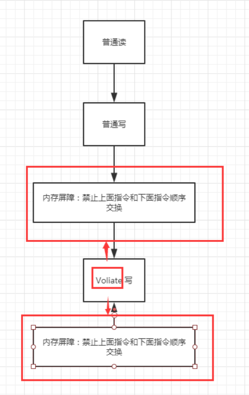

#### 4）总结

- **volatile可以保证可见性；**
- **不能保证原子性**
- **由于内存屏障，可以保证避免指令重排的现象产生**

面试官：那么你知道在哪里用这个内存屏障用得最多呢？**单例模式**

### 18. 玩转单例模式

饿汉式、DCL懒汉式

#### 1）饿汉式

> 线程不安全，如果多个线程同时调用getInstance()方法，最终可能会创建不止一个hungry对象

```java
/**
 * 饿汉式单例
 */
public class Hungry {

    /**
     * 可能会浪费空间
     */
    private byte[] data1=new byte[1024*1024];
    private byte[] data2=new byte[1024*1024];
    private byte[] data3=new byte[1024*1024];
    private byte[] data4=new byte[1024*1024];


    private Hungry(){

    }
    private final static Hungry hungry = new Hungry();

    public static Hungry getInstance(){
        return hungry;
    }

}
```

#### 2）DCL懒汉式

```java
//懒汉式单例模式
public class LazyMan {

    private static boolean key = false;

    private LazyMan(){
        synchronized (LazyMan.class){
            if (key==false){
                key=true;
            }
            else{
                throw new RuntimeException("不要试图使用反射破坏异常");
            }
        }
        System.out.println(Thread.currentThread().getName()+" ok");
    }
    //添加volatile防止指令重排
    private volatile static LazyMan lazyMan;

    //双重检测锁模式 简称DCL懒汉式
    public static LazyMan getInstance(){
        //需要加锁
        if(lazyMan==null){
            synchronized (LazyMan.class){
                if(lazyMan==null){
                    lazyMan=new LazyMan();
                    //上面的 LazyMan = new LazyMan()仍然不是安全的操作，因为这句代码不是一个原子性的操作。会经历以下步骤
                    /**
                     * 1、分配内存空间
                     * 2、执行构造方法，初始化对象
                     * 3、把这个对象指向这个空间
                     *
                     *  正常的执行顺序是1、2、3
                     *  但是有可能出现指令重排问题
                     *  比如执行的顺序是1 3 2 ，
                     *  如果A线程在执行3时，线程B就调用了getInstance()方法。
                     *  因为A线程已经先指向了空间，但是还没有执行步骤2初始化对象。而线程B访问空间得到LazyMan != null
                     *  此时线程B就直接return LazyMan导致返回的是一个空对象。
                     *  我们就可以添加volatile保证指令重排问题
                     */
                }
            }
        }
        return lazyMan;
    }
    //单线程下 是ok的
    //但是如果是并发的
    public static void main(String[] args) throws NoSuchMethodException, IllegalAccessException, InvocationTargetException, InstantiationException, NoSuchFieldException {
        //Java中有反射
		//LazyMan instance = LazyMan.getInstance();
        Field key = LazyMan.class.getDeclaredField("key");
        key.setAccessible(true);
        Constructor<LazyMan> declaredConstructor = LazyMan.class.getDeclaredConstructor(null);
        declaredConstructor.setAccessible(true); //无视了私有的构造器
        LazyMan lazyMan1 = declaredConstructor.newInstance();
        key.set(lazyMan1,false);
        LazyMan instance = declaredConstructor.newInstance();

        System.out.println(instance);
        System.out.println(lazyMan1);
        System.out.println(instance == lazyMan1);
    }
}
```

#### 3）静态内部类

```java
//静态内部类
public class Holder {
    private Holder(){

    }
    public static Holder getInstance(){
        return InnerClass.holder;
    }
    public static class InnerClass{
        private static final Holder holder = new Holder();
    }
}
```

> 单例不安全, 因为反射

#### 4）枚举（完全防止反射破坏）

```java
//enum 是什么？ enum本身就是一个Class 类
public enum EnumSingle {
    INSTANCE;
    public EnumSingle getInstance(){
        return INSTANCE;
    }
}

class Test{
    public static void main(String[] args) throws NoSuchMethodException, IllegalAccessException, InvocationTargetException, InstantiationException {
        EnumSingle instance1 = EnumSingle.INSTANCE;
        Constructor<EnumSingle> declaredConstructor = EnumSingle.class.getDeclaredConstructor(String.class,int.class);
        declaredConstructor.setAccessible(true);
        //java.lang.NoSuchMethodException: com.ogj.single.EnumSingle.<init>()

        EnumSingle instance2 = declaredConstructor.newInstance();
        System.out.println(instance1);
        System.out.println(instance2);
    }
}
```

使用枚举，我们就可以防止反射破坏了。

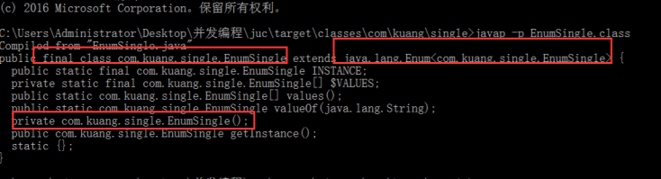

枚举类型的最终反编译源码：

```java
public final class EnumSingle extends Enum
{

    public static EnumSingle[] values()
    {
        return (EnumSingle[])$VALUES.clone();
    }

    public static EnumSingle valueOf(String name)
    {
        return (EnumSingle)Enum.valueOf(com/ogj/single/EnumSingle, name);
    }

    private EnumSingle(String s, int i)
    {
        super(s, i);
    }

    public EnumSingle getInstance()
    {
        return INSTANCE;
    }

    public static final EnumSingle INSTANCE;
    private static final EnumSingle $VALUES[];

    static 
    {
        INSTANCE = new EnumSingle("INSTANCE", 0);
        $VALUES = (new EnumSingle[] {
            INSTANCE
        });
    }
}
```

### 19. 深入理解CAS

#### 1）什么是CAS？

大厂必须深入研究底层！！！！**修内功！操作系统、计算机网络原理、组成原理、数据结构**

```java
public class casDemo {
    //CAS : compareAndSet 比较并交换
    public static void main(String[] args) {
        AtomicInteger atomicInteger = new AtomicInteger(2020);

        //boolean compareAndSet(int expect, int update)
        //期望值、更新值
        //如果实际值 和 我的期望值相同，那么就更新
        //如果实际值 和 我的期望值不同，那么就不更新
        System.out.println(atomicInteger.compareAndSet(2020, 2021));
        System.out.println(atomicInteger.get());

        //因为期望值是2020  实际值却变成了2021  所以会修改失败
        //CAS 是CPU的并发原语
        atomicInteger.getAndIncrement(); //++操作
        System.out.println(atomicInteger.compareAndSet(2020, 2021));
        System.out.println(atomicInteger.get());
    }
}
```

Unsafe 类


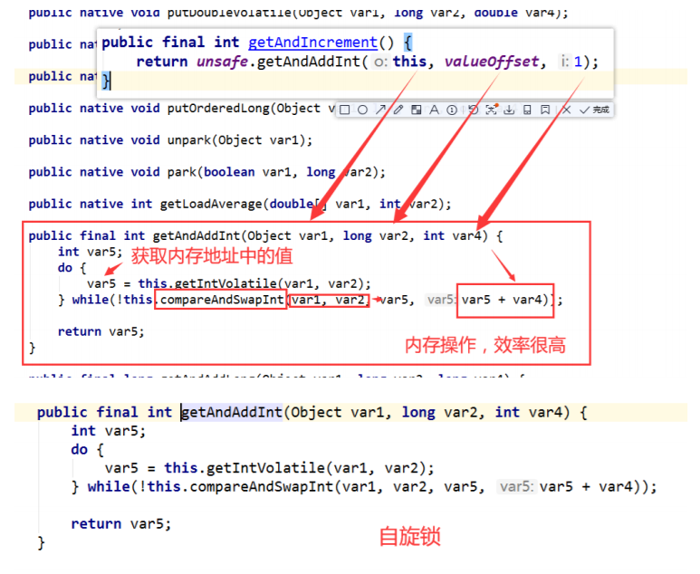

#### 2）总结

CAS：比较当前工作内存中的值 和 主内存中的值，如果这个值是期望的，那么则执行操作！如果不是就一直循环，使用的是自旋锁。

**缺点：**

- 循环会耗时；
- 一次性只能保证一个共享变量的原子性；
- 它会存在ABA问题

> CAS：ABA问题？(狸猫换太子)

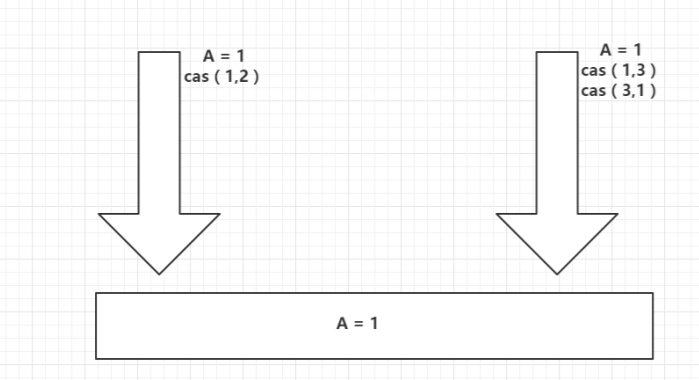

线程1：期望值是1，要变成2；

线程2：两个操作：

- 1、期望值是1，变成3
- 2、期望是3，变成1

所以对于线程1来说，A的值还是1，所以就出现了问题，骗过了线程1；

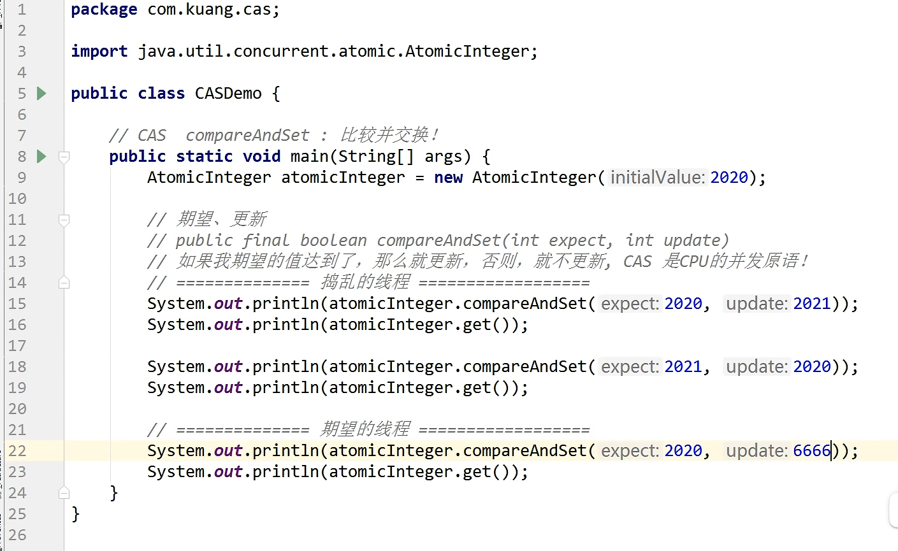

### 20. 原子引用

> 解决ABA问题，引入原子引用。对应的思想：**乐观锁~**

带版本号的 原子操作！

> 关于Integer的坑：
>
> **Integer 使用了对象缓存机制，默认范围是-128~127，推荐使用静态工厂方法valueOf获取对象实例，而不是new，因为valueOf使用缓存，而new一定会创建新的对象分配新的内存空间。**
>
> 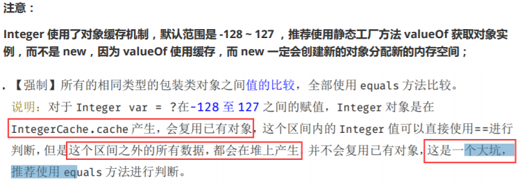

**带版本号的原子操作**

```java
package com.marchsoft.lockdemo;

import java.util.concurrent.TimeUnit;
import java.util.concurrent.atomic.AtomicStampedReference;

/**
 * Description：
 *
 * @author jiaoqianjin
 * Date: 2020/8/12 22:07
 **/

public class CASDemo {
    /**AtomicStampedReference 注意，如果泛型是一个包装类，注意对象的引用问题
     * 正常在业务操作，这里面比较的都是一个个对象
     */
    static AtomicStampedReference<Integer> atomicStampedReference = new
            AtomicStampedReference<>(1, 1);

    // CAS compareAndSet : 比较并交换！
    public static void main(String[] args) {
        new Thread(() -> {
            int stamp = atomicStampedReference.getStamp(); // 获得版本号
            System.out.println("a1=>" + stamp);
            
            try {
                TimeUnit.SECONDS.sleep(1);
            } catch (InterruptedException e) {
                e.printStackTrace();
            }
            // 修改操作时，版本号更新 + 1
            atomicStampedReference.compareAndSet(1, 2,
                    atomicStampedReference.getStamp(),
                    atomicStampedReference.getStamp() + 1);
            
            System.out.println("a2=>" + atomicStampedReference.getStamp());
            // 重新把值改回去， 版本号更新 + 1
            System.out.println(atomicStampedReference.compareAndSet(2, 1,
                    atomicStampedReference.getStamp(),
                    atomicStampedReference.getStamp() + 1));
            System.out.println("a3=>" + atomicStampedReference.getStamp());
        }, "a").start();
        
        // 乐观锁的原理相同！
        new Thread(() -> {
            int stamp = atomicStampedReference.getStamp(); // 获得版本号
            System.out.println("b1=>" + stamp);
            try {
                TimeUnit.SECONDS.sleep(2);
            } catch (InterruptedException e) {
                e.printStackTrace();
            }
            System.out.println(atomicStampedReference.compareAndSet(1, 3,
                    stamp, stamp + 1));
            System.out.println("b2=>" + atomicStampedReference.getStamp());
        }, "b").start();
    }
}
```


> 运行结果：
>
> 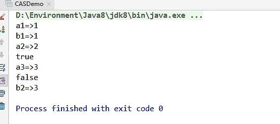

### 21. 各种锁的理解

#### 1）公平锁，非公平锁

1. 公平锁：非常公平，不能插队，必须先来后到

```java
/**
 * Creates an instance of {@code ReentrantLock}.
 * This is equivalent to using {@code ReentrantLock(false)}.
 */
public ReentrantLock() {
    sync = new NonfairSync();
}
```

1. 非公平锁：非常不公平，允许插队，可以改变顺序

```java
/**
 * Creates an instance of {@code ReentrantLock} with the
 * given fairness policy.
 *
 * @param fair {@code true} if this lock should use a fair ordering policy
 */
public ReentrantLock(boolean fair) {
    sync = fair ? new FairSync() : new NonfairSync();
}
```

#### 2）可重入锁

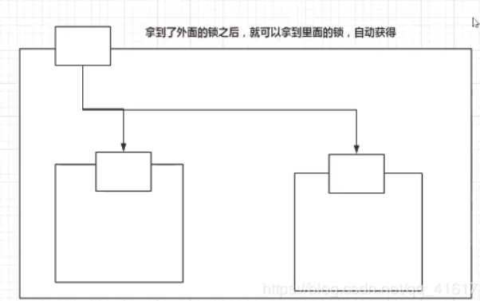

1. Synchonized 锁

```java
public class Demo01 {
    public static void main(String[] args) {
        Phone phone = new Phone();
        new Thread(()->{
            phone.sms();
        },"A").start();
        new Thread(()->{
            phone.sms();
        },"B").start();
    }

}

class Phone{
    public synchronized void sms(){
        System.out.println(Thread.currentThread().getName()+"=> sms");
        call();//这里也有一把锁
    }
    public synchronized void call(){
        System.out.println(Thread.currentThread().getName()+"=> call");
    }
}
```

1. Lock 锁

```java
//lock
public class Demo02 {

    public static void main(String[] args) {
        Phone2 phone = new Phone2();
        new Thread(()->{
            phone.sms();
        },"A").start();
        new Thread(()->{
            phone.sms();
        },"B").start();
    }

}
class Phone2{

    Lock lock=new ReentrantLock();

    public void sms(){
        lock.lock(); //细节：这个是两把锁，两个钥匙
        //lock锁必须配对，否则就会死锁在里面
        try {
            System.out.println(Thread.currentThread().getName()+"=> sms");
            call();//这里也有一把锁
        } catch (Exception e) {
            e.printStackTrace();
        }finally {
            lock.unlock();
        }
    }
    public void call(){
        lock.lock();
        try {
            System.out.println(Thread.currentThread().getName() + "=> call");
        }catch (Exception e){
            e.printStackTrace();
        }
        finally {
            lock.unlock();
        }
    }
}
```

- lock锁必须配对，相当于lock和 unlock 必须数量相同；
- 在外面加的锁，也可以在里面解锁；在里面加的锁，在外面也可以解锁；

#### 3）自旋锁

1. spinlock

```java
public final int getAndAddInt(Object var1, long var2, int var4) {
    int var5;
    do {
        var5 = this.getIntVolatile(var1, var2);
    } while(!this.compareAndSwapInt(var1, var2, var5, var5 + var4));
    return var5;
}
```

1. 自我设计自旋锁

```java
public class SpinlockDemo {

    // 默认
    // int 0
    //thread null
    AtomicReference<Thread> atomicReference=new AtomicReference<>();

    //加锁
    public void myLock(){
        Thread thread = Thread.currentThread();
        System.out.println(thread.getName()+"===> mylock");

        //自旋锁
        while (!atomicReference.compareAndSet(null,thread)){
            System.out.println(Thread.currentThread().getName()+" ==> 自旋中~");
        }
    }


    //解锁
    public void myUnlock(){
        Thread thread=Thread.currentThread();
        System.out.println(thread.getName()+"===> myUnlock");
        atomicReference.compareAndSet(thread,null);
    }

}
public class TestSpinLock {
    public static void main(String[] args) throws InterruptedException {
        ReentrantLock reentrantLock = new ReentrantLock();
        reentrantLock.lock();
        reentrantLock.unlock();


        //使用CAS实现自旋锁
        SpinlockDemo spinlockDemo=new SpinlockDemo();
        new Thread(()->{
            spinlockDemo.myLock();
            try {
                TimeUnit.SECONDS.sleep(3);
            } catch (Exception e) {
                e.printStackTrace();
            } finally {
                spinlockDemo.myUnlock();
            }
        },"t1").start();

        TimeUnit.SECONDS.sleep(1);


        new Thread(()->{
            spinlockDemo.myLock();
            try {
                TimeUnit.SECONDS.sleep(3);
            } catch (Exception e) {
                e.printStackTrace();
            } finally {
                spinlockDemo.myUnlock();
            }
        },"t2").start();
    }
}
```

运行结果：

**t2进程必须等待t1进程Unlock后，才能Unlock，在这之前进行自旋等待。。。。**

#### 4）死锁

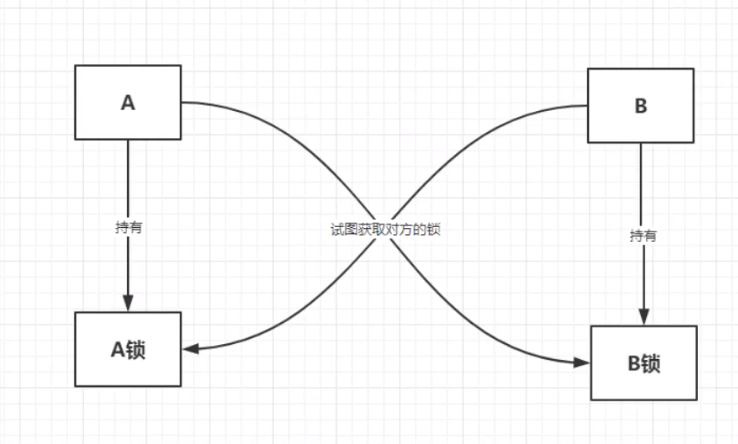

```java
package com.ogj.lock;

import java.util.concurrent.TimeUnit;

public class DeadLock {
    public static void main(String[] args) {
        String lockA= "lockA";
        String lockB= "lockB";

        new Thread(new MyThread(lockA,lockB),"t1").start();
        new Thread(new MyThread(lockB,lockA),"t2").start();
    }
}

class MyThread implements Runnable{

    private String lockA;
    private String lockB;

    public MyThread(String lockA, String lockB) {
        this.lockA = lockA;
        this.lockB = lockB;
    }

    @Override
    public void run() {
        synchronized (lockA){
            System.out.println(Thread.currentThread().getName()+" lock"+lockA+"===>get"+lockB);
            try {
                TimeUnit.SECONDS.sleep(2);
            } catch (InterruptedException e) {
                e.printStackTrace();
            }
            synchronized (lockB){
                System.out.println(Thread.currentThread().getName()+" lock"+lockB+"===>get"+lockA);
            }
        }
    }
}
```

如何解开死锁

**1、使用jps定位进程号，jdk的bin目录下： 有一个jps**

命令：`jps -l`

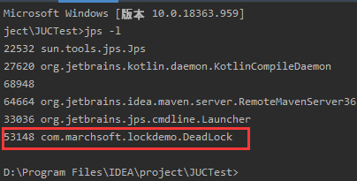

**2、使用`jstack` 进程进程号 找到死锁信息**

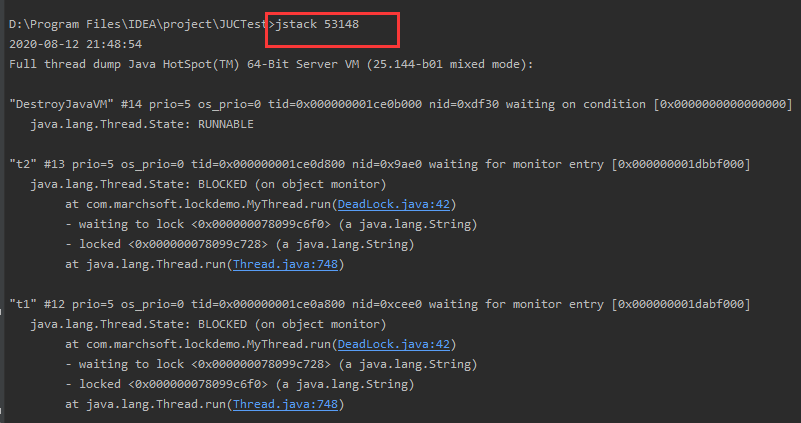

**一般情况信息在最后：**

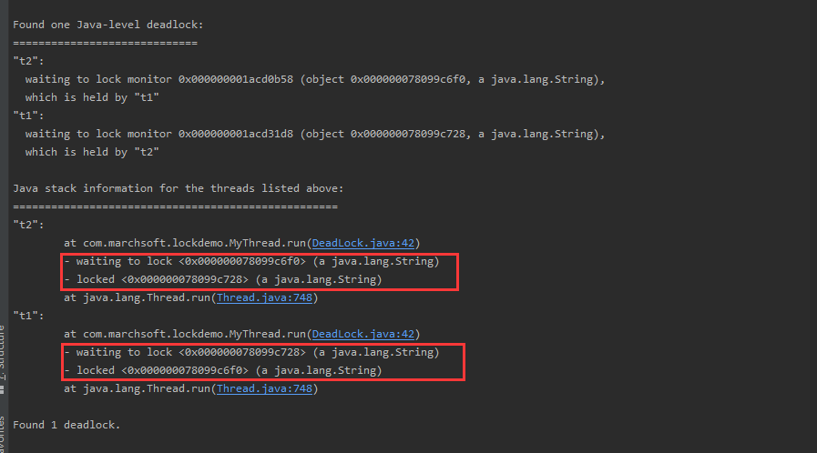


