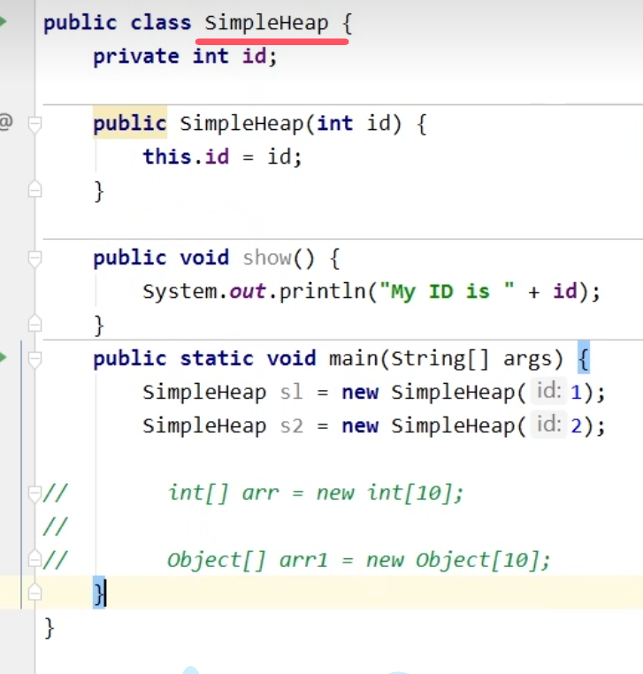
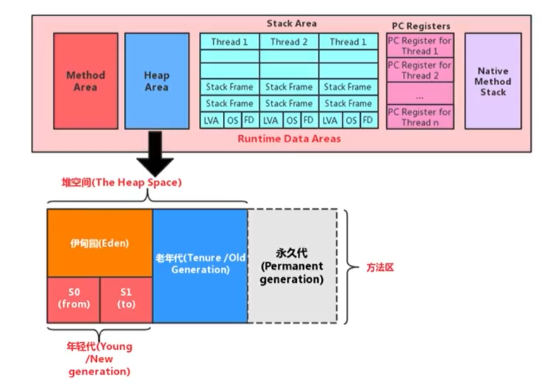
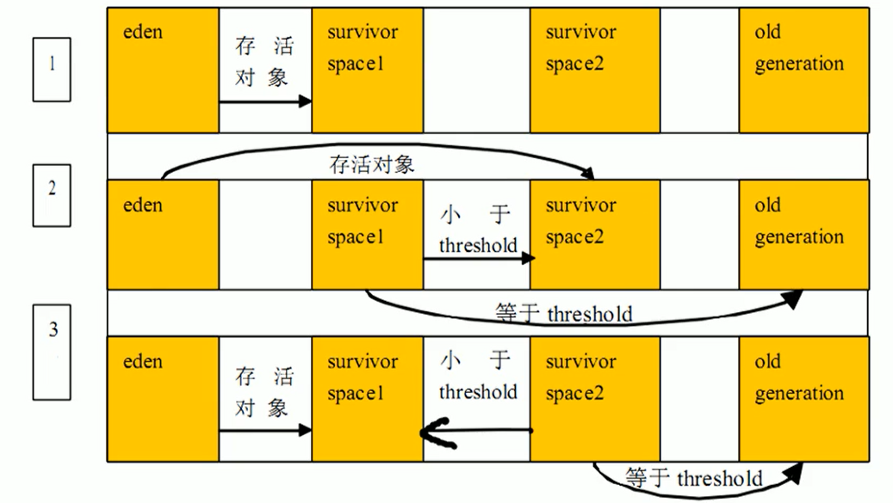

> 笔记来源：[尚硅谷 JVM 全套教程，百万播放，全网巅峰（宋红康详解 java 虚拟机）](https://www.bilibili.com/video/BV1PJ411n7xZ "尚硅谷JVM全套教程，百万播放，全网巅峰（宋红康详解java虚拟机）")
>
> 同步更新：https://gitee.com/vectorx/NOTE_JVM
>
> https://codechina.csdn.net/qq_35925558/NOTE_JVM
>
> https://github.com/uxiahnan/NOTE_JVM

[toc]

# 6. 堆

## 6.1. 堆（Heap）的核心概述

堆针对一个 JVM 进程来说是唯一的，也就是一个进程只有一个 JVM，但是进程包含多个线程，他们是共享同一堆空间的。


一个 JVM 实例只存在一个堆内存，堆也是 Java 内存管理的核心区域。

Java 堆区在 JVM 启动的时候即被创建，其空间大小也就确定了。是 JVM 管理的最大一块内存空间。

- 堆内存的大小是可以调节的。

《Java 虚拟机规范》规定，堆可以处于物理上不连续的内存空间中，但在逻辑上它应该被视为连续的。

所有的线程共享 Java 堆，在这里还可以划分线程私有的缓冲区（Thread Local Allocation Buffer，TLAB）。

《Java 虚拟机规范》中对 Java 堆的描述是：所有的对象实例以及数组都应当在运行时分配在堆上。（`The heap is the run-time data area from which memory for all class instances and arrays is allocated`）

数组和对象可能永远不会存储在栈上，因为栈帧中保存引用，这个引用指向对象或者数组在堆中的位置。

在方法结束后，堆中的对象不会马上被移除，仅仅在垃圾收集的时候才会被移除。

堆，是 GC（Garbage Collection，垃圾收集器）执行垃圾回收的重点区域。


> 方法区中的SimpleHeap是一个自定义的类
>
> 

### 6.1.1. 堆内存细分

Java 7 及之前堆内存逻辑上分为三部分：新生区+养老区+<mark>永久区</mark>

- Young Generation Space 新生区 Young/New 又被划分为 Eden 区和 Survivor 区
- Tenure generation space 养老区 Old/Tenure
- Permanent Space 永久区 Perm

Java 8 及之后堆内存逻辑上分为三部分：新生区+养老区+<mark>元空间</mark>

- Young Generation Space 新生区 Young/New 又被划分为 Eden 区和 Survivor 区
- Tenure generation space 养老区 Old/Tenure
- Meta Space 元空间 Meta

约定：新生区（代）<=>年轻代 、 养老区<=>老年区（代）、 永久区<=>永久代

### 6.1.2. 堆空间内部结构（JDK7）



### 6.1.3. 堆空间内部结构（JDK8）


## 6.2. 设置堆内存大小与 OOM

### 6.2.1. 堆空间大小的设置

Java 堆区用于存储 Java 对象实例，那么堆的大小在 JVM 启动时就已经设定好了，大家可以通过选项"-Xmx"和"-Xms"来进行设置。

- “-Xms"用于表示堆区的起始内存，等价于`-XX:InitialHeapSize`
- “-Xmx"则用于表示堆区的最大内存，等价于`-XX:MaxHeapSize`

> 一般会将-Xms和-Xmx设置为大小一样的值。这样可以避免每次垃圾回收之后，堆内存空间自动调整，造成性能开销

一旦堆区中的内存大小超过“-Xmx"所指定的最大内存时，将会抛出 OutOfMemoryError 异常。

通常会将-Xms 和-Xmx 两个参数配置相同的值，其目的是<mark>为了能够在 java 垃圾回收机制清理完堆区后不需要重新分隔计算堆区的大小，从而提高性能。</mark>

默认情况下

- 初始内存大小：物理电脑内存大小 / 64
- 最大内存大小：物理电脑内存大小 / 4

### 6.2.2. OutOfMemory 举例

```java
public class OOMTest {
    public static void main(String[]args){
        ArrayList<Picture> list = new ArrayList<>();
        while(true){
            try {
                Thread.sleep(20);
            } catch (InterruptedException e){
                e.printStackTrace();
            }
            list.add(new Picture(new Random().nextInt(1024*1024)));
        }
    }
}
```

```java
Exception in thread "main" java.lang.OutofMemoryError: Java heap space
    at com.atguigu. java.Picture.<init>(OOMTest. java:25)
    at com.atguigu.java.O0MTest.main(OOMTest.java:16)
```

## 6.3. 年轻代与老年代

存储在 JVM 中的 Java 对象可以被划分为两类：

- 一类是生命周期较短的瞬时对象，这类对象的创建和消亡都非常迅速
- 另外一类对象的生命周期却非常长，在某些极端的情况下还能够与 JVM 的生命周期保持一致

Java 堆区进一步细分的话，可以划分为年轻代（YoungGen）和老年代（oldGen）

其中年轻代又可以划分为 Eden 空间、Survivor0 空间和 Survivor1 空间（有时也叫做 from 区、to 区）


下面这参数开发中一般不会调：


配置新生代与老年代在堆结构的占比。

- 默认`-XX:NewRatio=2`，表示新生代占 1，老年代占 2，新生代占整个堆的 1/3
- 可以修改`-XX:NewRatio=4`，表示新生代占 1，老年代占 4，新生代占整个堆的 1/5

在 HotSpot 中，Eden 空间和另外两个 survivor 空间缺省所占的比例是 8：1：1

当然开发人员可以通过选项“`-xx:SurvivorRatio`”调整这个空间比例。比如`-xx:SurvivorRatio=8`

<mark>几乎所有的 Java 对象都是在 Eden 区被 new 出来的。</mark>绝大部分的 Java 对象的销毁都在新生代进行了。

- IBM 公司的专门研究表明，新生代中 80%的对象都是“朝生夕死”的。

可以使用选项"`-Xmn`"设置新生代最大内存大小，这个参数一般使用默认值就可以了。


## 6.4. 图解对象分配过程

为新对象分配内存是一件非常严谨和复杂的任务，JVM 的设计者们不仅需要考虑内存如何分配、在哪里分配等问题，并且由于内存分配算法与内存回收算法密切相关，所以还需要考虑 GC 执行完内存回收后是否会在内存空间中产生内存碎片。

1. new 的对象先放伊甸园区。此区有大小限制。

2. 当伊甸园的空间填满时，程序又需要创建对象，JVM 的垃圾回收器将对伊甸园区进行垃圾回收（MinorGC），将伊甸园区中的不再被其他对象所引用的对象进行销毁。再加载新的对象放到伊甸园区

3. 然后将伊甸园中的剩余对象移动到幸存者 0 区。

4. 如果再次触发垃圾回收，此时上次幸存下来的放到幸存者 0 区的，如果没有回收，就会放到幸存者 1 区。

5. 如果再次经历垃圾回收，此时会重新放回幸存者 0 区，接着再去幸存者 1 区。

6. 啥时候能去养老区呢？可以设置次数。默认是 15 次。

   - <mark>可以设置参数：`-Xx:MaxTenuringThreshold= N`进行设置</mark>

7. 在养老区，相对悠闲。当养老区内存不足时，再次触发 GC：Major GC，进行养老区的内存清理

8. 若养老区执行了 Major GC 之后，发现依然无法进行对象的保存，就会产生 OOM 异常。

   ```java
   java.lang.OutofMemoryError: Java heap space
   ```


**流程图**


**总结**

- <mark>针对幸存者 s0，s1 区的总结：复制之后有交换，谁空谁是 to</mark>
- <mark>关于垃圾回收：频繁在新生区收集，很少在老年代收集，几乎不再永久代和元空间进行收集</mark>

**常用调优工具（在 JVM 下篇：性能监控与调优篇会详细介绍）**

- JDK 命令行
- Eclipse:Memory Analyzer Tool
- Jconsole
- VisualVM
- Jprofiler
- Java Flight Recorder
- GCViewer
- GC Easy

## 6.5. Minor GC，MajorGC、Full GC

JVM 在进行 GC 时，并非每次都对上面三个内存区域一起回收的，大部分时候回收的都是指新生代。

针对 Hotspot VM 的实现，它里面的 GC 按照回收区域又分为两大种类型：一种是部分收集（Partial GC），一种是整堆收集（FullGC）

- 部分收集：不是完整收集整个 Java 堆的垃圾收集。其中又分为：
  - 新生代收集（Minor GC / Young GC）：只是新生代的垃圾收集
  - 老年代收集（Major GC / Old GC）：只是老年代的圾收集。
    - 目前，只有 CMSGC 会有单独收集老年代的行为。
    - <mark>注意，很多时候 Major GC 会和 Full GC 混淆使用，需要具体分辨是老年代回收还是整堆回收。</mark>
  - 混合收集（MixedGC）：收集整个新生代以及部分老年代的垃圾收集。
    - 目前，只有 G1 GC 会有这种行为
- 整堆收集（Full GC）：收集整个 java 堆和方法区的垃圾收集。

### 6.5.1. 最简单的分代式 GC 策略的触发条件

### 年轻代 GC（Minor GC）触发机制

- 当年轻代空间不足时，就会触发 MinorGC，这里的年轻代满指的是 Eden 代满，Survivor 满不会引发 GC。（每次 Minor GC 会清理年轻代的内存。）

- 因为<mark>Java 对象大多都具备朝生夕灭的特性</mark>.，所以 Minor GC 非常频繁，一般回收速度也比较快。这一定义既清晰又易于理解。

- Minor GC 会引发 STW，暂停其它用户的线程，等垃圾回收结束，用户线程才恢复运行



### 老年代 GC（Major GC / Full GC）触发机制

- 指发生在老年代的 GC，对象从老年代消失时，我们说 “Major GC” 或 “Full GC” 发生了

- 出现了 Major Gc，经常会伴随至少一次的 Minor GC（但非绝对的，在 Paralle1 Scavenge 收集器的收集策略里就有直接进行 MajorGC 的策略选择过程）
  - 也就是在老年代空间不足时，会先尝试触发 Minor Gc。如果之后空间还不足，则触发 Major GC
- Major GC 的速度一般会比 Minor GC 慢 10 倍以上，STW 的时间更长
- 如果 Major GC 后，内存还不足，就报 OOM 了

### Full GC 触发机制（后面细讲）：

触发 Full GC 执行的情况有如下五种：

1. 调用 System.gc()时，系统建议执行 Full GC，但是不必然执行
2. 老年代空间不足
3. 方法区空间不足
4. 通过 Minor GC 后进入老年代的平均大小大于老年代的可用内存
5. 由 Eden 区、survivor space0（From Space）区向 survivor space1（To Space）区复制时，对象大小大于 To Space 可用内存，则把该对象转存到老年代，且老年代的可用内存小于该对象大小

<mark>说明：Full GC 是开发或调优中尽量要避免的。这样暂时时间会短一些</mark>

## 6.6. 堆空间分代思想

为什么要把 Java 堆分代？不分代就不能正常工作了吗？

经研究，不同对象的生命周期不同。70%-99%的对象是临时对象。

- 新生代：有 Eden、两块大小相同的 survivor（又称为 from/to，s0/s1）构成，to 总为空。
- 老年代：存放新生代中经历多次 GC 仍然存活的对象。


其实不分代完全可以，分代的唯一理由就是优化 GC 性能。如果没有分代，那所有的对象都在一块，就如同把一个学校的人都关在一个教室。GC 的时候要找到哪些对象没用，这样就会对堆的所有区域进行扫描。而很多对象都是朝生夕死的，如果分代的话，把新创建的对象放到某一地方，当 GC 的时候先把这块存储“朝生夕死”对象的区域进行回收，这样就会腾出很大的空间出来。


## 6.7. 内存分配策略

如果对象在 Eden 出生并经过第一次 Minor GC 后仍然存活，并且能被 Survivor 容纳的话，将被移动到 survivor 空间中，并将对象年龄设为 1。对象在 survivor 区中每熬过一次 MinorGC，年龄就增加 1 岁，当它的年龄增加到一定程度（默认为 15 岁，其实每个 JVM、每个 GC 都有所不同）时，就会被晋升到老年代

对象晋升老年代的年龄阀值，可以通过选项`-XX:MaxTenuringThreshold`来设置

针对不同年龄段的对象分配原则如下所示：

- 优先分配到 Eden
- 大对象直接分配到老年代（尽量避免程序中出现过多的大对象）
- 长期存活的对象分配到老年代
- 动态对象年龄判断：如果 survivor 区中相同年龄的所有对象大小的总和大于 Survivor 空间的一半，年龄大于或等于该年龄的对象可以直接进入老年代，无须等到`MaxTenuringThreshold`中要求的年龄。
- 空间分配担保： `-XX:HandlePromotionFailure`

## 6.8. 为对象分配内存：TLAB

### 6.8.1. 为什么有 TLAB（Thread Local Allocation Buffer）？

- 堆区是线程共享区域，任何线程都可以访问到堆区中的共享数据

- 由于对象实例的创建在 JVM 中非常频繁，因此在并发环境下从堆区中划分内存空间是线程不安全的

- 为避免多个线程操作同一地址，需要使用加锁等机制，进而影响分配速度。

### 6.8.2. 什么是 TLAB？

- 从内存模型而不是垃圾收集的角度，对 Eden 区域继续进行划分，JVM 为<mark>每个线程分配了一个私有缓存区域</mark>，它包含在 Eden 空间内。

- 多线程同时分配内存时，使用 TLAB 可以避免一系列的非线程安全问题，同时还能够提升内存分配的吞吐量，因此我们可以将这种内存分配方式称之为<mark>快速分配策略</mark>。

- 据我所知所有 OpenJDK 衍生出来的 JVM 都提供了 TLAB 的设计。


### 6.8.3. TLAB 的再说明

- 尽管不是所有的对象实例都能够在 TLAB 中成功分配内存，但<mark>JVM 确实是将 TLAB 作为内存分配的首选</mark>。
- 在程序中，开发人员可以通过选项“`-XX:UseTLAB`”设置是否开启 TLAB 空间。

- 默认情况下，TLAB 空间的内存非常小，<mark>仅占有整个 Eden 空间的 1%</mark>，当然我们可以通过选项 “`-XX:TLABWasteTargetPercent`” 设置 TLAB 空间所占用 Eden 空间的百分比大小。

- 一旦对象在 TLAB 空间分配内存失败时，JVM 就会尝试着通过使用加锁机制确保数据操作的原子性，从而直接在 Eden 空间中分配内存。


## 6.9. 小结：堆空间的参数设置

官网地址：[https://docs.oracle.com/javase/8/docs/technotes/tools/windows/java.html](https://docs.oracle.com/javase/8/docs/technotes/tools/windows/java.html)

```java
// 详细的参数内容会在JVM下篇：性能监控与调优篇中进行详细介绍，这里先熟悉下
-XX:+PrintFlagsInitial  //查看所有的参数的默认初始值
-XX:+PrintFlagsFinal  //查看所有的参数的最终值（可能会存在修改，不再是初始值）
-Xms  //初始堆空间内存（默认为物理内存的1/64）
-Xmx  //最大堆空间内存（默认为物理内存的1/4）
-Xmn  //设置新生代的大小。（初始值及最大值）
-XX:NewRatio  //配置新生代与老年代在堆结构的占比
-XX:SurvivorRatio  //设置新生代中Eden和S0/S1空间的比例
-XX:MaxTenuringThreshold  //设置新生代垃圾的最大年龄
-XX:+PrintGCDetails //输出详细的GC处理日志
//打印gc简要信息：①-Xx：+PrintGC ② - verbose:gc
-XX:HandlePromotionFalilure：//是否设置空间分配担保
```

在发生 Minor GC 之前，虚拟机会<mark>检查老年代最大可用的连续空间是否大于新生代所有对象的总空间</mark>。

- 如果大于，则此次 Minor GC 是安全的
- 如果小于，则虚拟机会查看`-XX:HandlePromotionFailure`设置值是否允担保失败。
  - 如果`HandlePromotionFailure=true`，那么会继续检查老年代最大可用连续空间是否大于历次晋升到老年代的对象的平均大小。
    - 如果大于，则尝试进行一次 Minor GC，但这次 Minor GC 依然是有风险的；
    - 如果小于，则改为进行一次 Full GC。
  - 如果`HandlePromotionFailure=false`，则改为进行一次 Full Gc。

在 JDK6 Update24 之后，HandlePromotionFailure 参数不会再影响到虚拟机的空间分配担保策略，观察 openJDK 中的源码变化，虽然源码中还定义了 HandlePromotionFailure 参数，但是在代码中已经不会再使用它。JDK6 Update 24 之后的规则变为<mark>只要老年代的连续空间大于新生代对象总大小或者历次晋升的平均大小就会进行 Minor GC</mark>，否则将进行 FullGC。

## 6.X. 堆是分配对象的唯一选择么？

在《深入理解 Java 虚拟机》中关于 Java 堆内存有这样一段描述：

> 随着 JIT 编译期的发展与<mark>逃逸分析技术</mark>逐渐成熟，<mark>栈上分配</mark>、<mark>标量替换优化技术</mark>将会导致一些微妙的变化，所有的对象都分配到堆上也渐渐变得不那么“绝对”了。

在 Java 虚拟机中，对象是在 Java 堆中分配内存的，这是一个普遍的常识。但是，有一种特殊情况，那就是<mark>如果经过逃逸分析（Escape Analysis）后发现，一个对象并没有逃逸出方法的话，那么就可能被优化成栈上分配</mark>.。这样就无需在堆上分配内存，也无须进行垃圾回收了。这也是最常见的堆外存储技术。

此外，前面提到的基于 OpenJDK 深度定制的 TaoBaoVM，其中创新的 GCIH（GC invisible heap）技术实现 off-heap，将生命周期较长的 Java 对象从 heap 中移至 heap 外，并且 GC 不能管理 GCIH 内部的 Java 对象，以此达到降低 GC 的回收频率和提升 GC 的回收效率的目的。

### 6.X.1. 逃逸分析概述

如何将堆上的对象分配到栈，需要使用逃逸分析手段。

这是一种可以有效减少 Java 程序中同步负载和内存堆分配压力的跨函数全局数据流分析算法。

通过逃逸分析，Java Hotspot 编译器能够分析出一个新的对象的引用的使用范围从而决定是否要将这个对象分配到堆上。

逃逸分析的基本行为就是分析对象动态作用域：

- 当一个对象在方法中被定义后，对象只在方法内部使用，则认为没有发生逃逸。
- 当一个对象在方法中被定义后，它被外部方法所引用，则认为发生逃逸。例如作为调用参数传递到其他地方中。

**举例 1**

```java
public void my_method() {
    V v = new V();
    // use v
    // ....
    v = null;
}
```

没有发生逃逸的对象，则可以分配到栈上，随着方法执行的结束，栈空间就被移除，每个栈里面包含了很多栈帧

```java
public static StringBuffer createStringBuffer(String s1, String s2) {
    StringBuffer sb = new StringBuffer();
    sb.append(s1);
    sb.append(s2);
    return sb;
}
```

上述方法如果想要`StringBuffer sb`不发生逃逸，可以这样写

```java
public static String createStringBuffer(String s1, String s2) {
    StringBuffer sb = new StringBuffer();
    sb.append(s1);
    sb.append(s2);
    return sb.toString();
}
```

**举例 2**

```java
public class EscapeAnalysis {

    public EscapeAnalysis obj;

    /**
     * 方法返回EscapeAnalysis对象，发生逃逸
     * @return
     */
    public EscapeAnalysis getInstance() {
        return obj == null ? new EscapeAnalysis() : obj;
    }

    /**
     * 为成员属性赋值，发生逃逸
     */
    public void setObj() {
        this.obj = new EscapeAnalysis();
    }

    /**
     * 对象的作用于仅在当前方法中有效，没有发生逃逸
     */
    public void useEscapeAnalysis() {
        EscapeAnalysis e = new EscapeAnalysis();
    }

    /**
     * 引用成员变量的值，发生逃逸
     */
    public void useEscapeAnalysis2() {
        EscapeAnalysis e = getInstance();
    }
}
```

**参数设置**

在 JDK 6u23 版本之后，HotSpot 中默认就已经开启了逃逸分析

如果使用的是较早的版本，开发人员则可以通过：

- 选项“`-XX:+DoEscapeAnalysis`"显式开启逃逸分析
- 通过选项“`-XX:+PrintEscapeAnalysis`"查看逃逸分析的筛选结果

**结论**：<mark>开发中能使用局部变量的，就不要使用在方法外定义。</mark>

### 6.X.2. 逃逸分析：代码优化

使用逃逸分析，编译器可以对代码做如下优化：

一、<mark>栈上分配</mark>：将堆分配转化为栈分配。如果一个对象在子程序中被分配，要使指向该对象的指针永远不会发生逃逸，对象可能是栈上分配的候选，而不是堆上分配

二、<mark>同步省略</mark>：如果一个对象被发现只有一个线程被访问到，那么对于这个对象的操作可以不考虑同步。

三、<mark>分离对象或标量替换</mark>：有的对象可能不需要作为一个连续的内存结构存在也可以被访问到，那么对象的部分（或全部）可以不存储在内存，而是存储在 CPU 寄存器中。

#### 栈上分配

JIT 编译器在编译期间根据逃逸分析的结果，发现如果一个对象并没有逃逸出方法的话，就可能被优化成栈上分配。分配完成后，继续在调用栈内执行，最后线程结束，栈空间被回收，局部变量对象也被回收。这样就无须进行垃圾回收了。

**常见的栈上分配的场景**

在逃逸分析中，已经说明了。分别是给成员变量赋值、方法返回值、实例引用传递。

#### 同步省略

线程同步的代价是相当高的，同步的后果是降低并发性和性能。

在动态编译同步块的时候，JIT 编译器可以<mark>借助逃逸分析来判断同步块所使用的锁对象是否只能够被一个线程访问而没有被发布到其他线程</mark>。如果没有，那么 JIT 编译器在编译这个同步块的时候就会取消对这部分代码的同步。这样就能大大提高并发性和性能。这个取消同步的过程就叫同步省略，也叫<mark>锁消除</mark>。

**举例**

```java
public void f() {
    Object hellis = new Object();
    synchronized(hellis) {
        System.out.println(hellis);
    }
}
```

代码中对 hellis 这个对象加锁，但是 hellis 对象的生命周期只在 f()方法中，并不会被其他线程所访问到，所以在 JIT 编译阶段就会被优化掉，优化成：

```java
public void f() {
    Object hellis = new Object();
	System.out.println(hellis);
}
```

#### 标量替换

<mark>标量（scalar）</mark>是指一个无法再分解成更小的数据的数据。Java 中的原始数据类型就是标量。

相对的，那些还可以分解的数据叫做<mark>聚合量（Aggregate）</mark>，Java 中的对象就是聚合量，因为他可以分解成其他聚合量和标量。

在 JIT 阶段，如果经过逃逸分析，发现一个对象不会被外界访问的话，那么经过 JIT 优化，就会把这个对象拆解成若干个其中包含的若干个成员变量来代替。这个过程就是标量替换。

**举例**

```java
public static void main(String args[]) {
    alloc();
}
private static void alloc() {
    Point point = new Point(1,2);
    System.out.println("point.x" + point.x + ";point.y" + point.y);
}
class Point {
    private int x;
    private int y;
}
```

以上代码，经过标量替换后，就会变成

```java
private static void alloc() {
    int x = 1;
    int y = 2;
    System.out.println("point.x = " + x + "; point.y=" + y);
}
```

可以看到，Point 这个聚合量经过逃逸分析后，发现他并没有逃逸，就被替换成两个标量了。那么标量替换有什么好处呢？就是可以大大减少堆内存的占用。因为一旦不需要创建对象了，那么就不再需要分配堆内存了。 标量替换为栈上分配提供了很好的基础。

**标量替换参数设置**

参数`-XX:EliminateAllocations`：开启了标量替换（默认打开），允许将对象打散分配到栈上。

上述代码在主函数中进行了 1 亿次 alloc。调用进行对象创建，由于 User 对象实例需要占据约 16 字节的空间，因此累计分配空间达到将近 1.5GB。如果堆空间小于这个值，就必然会发生 GC。使用如下参数运行上述代码：

```shell
-server -Xmx100m -Xms100m -XX:+DoEscapeAnalysis -XX:+PrintGC -XX:+EliminateAllocations
```

这里设置参数如下：

- 参数`-server`：启动 Server 模式，因为在 server 模式下，才可以启用逃逸分析。
- 参数`-XX:+DoEscapeAnalysis`：启用逃逸分析
- 参数`-Xmx10m`：指定了堆空间最大为 10MB
- 参数`-XX:+PrintGC`：将打印 Gc 日志
- 参数`-XX:+EliminateAllocations`：开启了标量替换（默认打开），允许将对象打散分配在栈上，比如对象拥有 id 和 name 两个字段，那么这两个字段将会被视为两个独立的局部变量进行分配

### 6.X.3. 逃逸分析小结：逃逸分析并不成熟

关于逃逸分析的论文在 1999 年就已经发表了，但直到 JDK1.6 才有实现，而且这项技术到如今也并不是十分成熟。

其根本原因就是<mark>无法保证逃逸分析的性能消耗一定能高于他的消耗。虽然经过逃逸分析可以做标量替换、栈上分配、和锁消除。但是逃逸分析自身也是需要进行一系列复杂的分析的，这其实也是一个相对耗时的过程。 </mark>

一个极端的例子，就是经过逃逸分析之后，发现没有一个对象是不逃逸的。那这个逃逸分析的过程就白白浪费掉了。

虽然这项技术并不十分成熟，但是它也<mark>是即时编译器优化技术中一个十分重要的手段</mark>。

注意到有一些观点，认为通过逃逸分析，JVM 会在栈上分配那些不会逃逸的对象，这在理论上是可行的，但是取决于 JVM 设计者的选择。据我所知，Oracle Hotspot JVM 中并未这么做，这一点在逃逸分析相关的文档里已经说明，所以可以明确<mark>所有的对象实例都是创建在堆上</mark>。

目前很多书籍还是基于 JDK7 以前的版本，JDK 已经发生了很大变化，intern 字符串的缓存和静态变量曾经都被分配在永久代上，而永久代已经被元数据区取代。但是，intern 字符串缓存和静态变量并不是被转移到元数据区，而是直接在堆上分配，所以这一点同样符合前面一点的结论：对象实例都是分配在堆上。

## 本章小结

年轻代是对象的诞生、成长、消亡的区域，一个对象在这里产生、应用，最后被垃圾回收器收集、结束生命。

老年代放置长生命周期的对象，通常都是从 survivor 区域筛选拷贝过来的 Java 对象。当然，也有特殊情况，我们知道普通的对象会被分配在 TLAB 上；如果对象较大，JVM 会试图直接分配在 Eden 其他位置上；如果对象太大，完全无法在新生代找到足够长的连续空闲空间，JVM 就会直接分配到老年代。当 GC 只发生在年轻代中，回收年轻代对象的行为被称为 MinorGc。

当 GC 发生在老年代时则被称为 MajorGc 或者 FullGC。一般的，MinorGc 的发生频率要比 MajorGC 高很多，即老年代中垃圾回收发生的频率将大大低于年轻代。