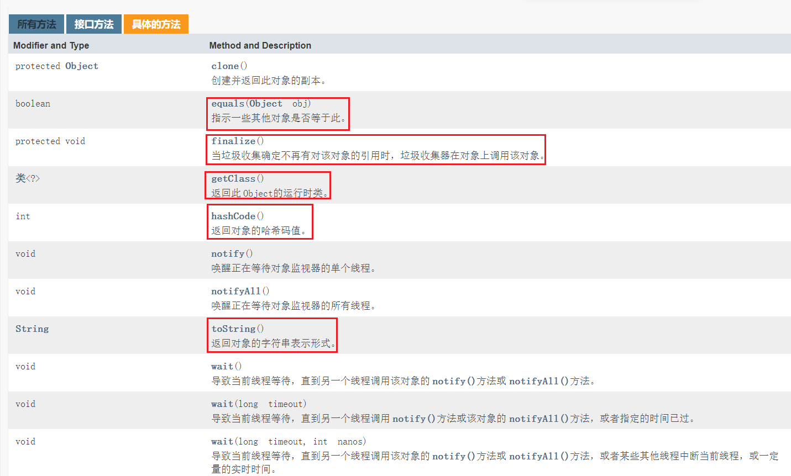
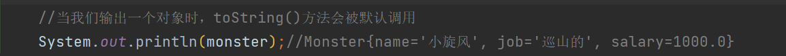
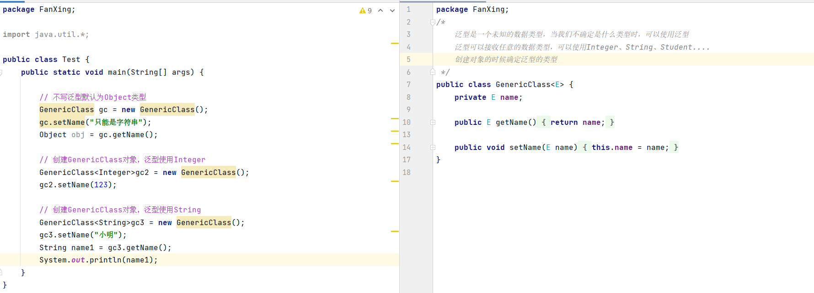
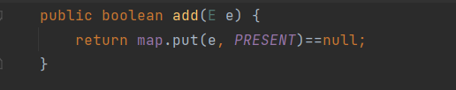
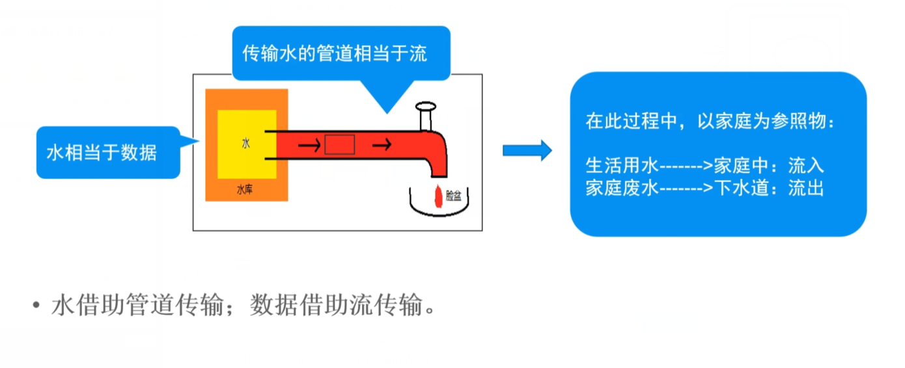
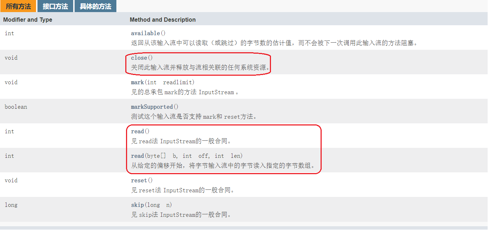
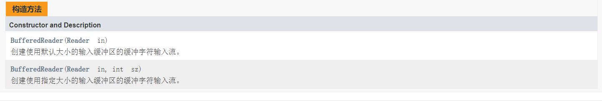
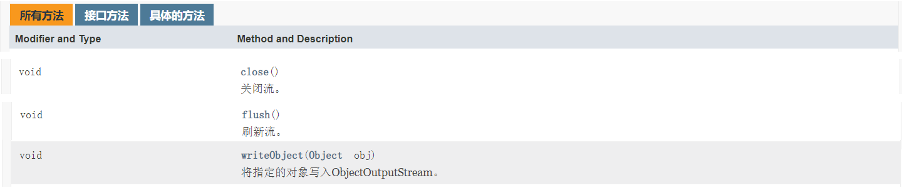

# Java-基础-常用类-集合框架-IO流

# ---常用类---

**常用类概述：**

1. 内部类
2. Object类
3. 包装类
4. 数学类
5. 时间类
6. 字符串
7. String Builder和StringBuffer
8. DecimalFormat口：

## 一、Object类

> jdk中文在线文档：[Java 8 中文版 - 在线API中文手册 - 码工具 (matools.com)](https://www.matools.com/api/java8)



### Object类常用方法：

### 1.equals方法

**`==`与`equals`的对比【面试题】+ jdk查看原码**

==是一个比较运算符

1. ==： 既可以判断基本类型，又可以判断引用类型

2. ==： 如果判断的是**基本类型**，**判断的是值是否相等**。

   ```java
           //==： 如果判断的是基本类型，判断的是 值 是否相等
           int x1 = 10;
           int x2 = 10;
           double x3 = 10.0;
           System.out.println(x1 == x2);//true
           System.out.println(x1 == x3);//true
   ```

3. ==： 如果判断的是**引用类型**，**判断的是地址是否相等，即判断是不是同一个对象**

   ```java
   package Equals;
   
   public class Test01 {
       public static void main(String[] args) {
           //==： 如果判断的是引用类型，判断的是地址是否相等，即判断是不是同一个对象
           A a = new A();
           A b = a;
           A c = b;
           System.out.println(a==c);// ? true
           System.out.println(b==c);// true
   
           B obj = a;
           System.out.println(obj==c);// true
   
       }
   }
   
   class B{}
   class A extends B{}
   ```


1. equals方法是Object类中的方法，**只能判断引用类型**。

> idea查看Jdk原码：鼠标光标放在要查看的方法上，直接输入`ctrl + b`
>
> 查看某个类所有方法：`ctrl + F12`

1. 默认判断的是地址是否相等，**子类(Object类是所有类的父类)往往重写该方法，用于判断内容是否相等**。

```java
/*
Object类 equals()方法原码

//默认判断地址是否一样
    public boolean equals(Object obj) {
        return (this == obj);
    }
    
子类往往重写该方法，用于判断内容是否相等  String类中的equals()方法原码（重写了父类equals()方法）
  
    public boolean equals(Object anObject) {
        if (this == anObject) { // 如果是同一个对象(地址相同)
            return true; // 返回true
        }
        if (anObject instanceof String) { // 判断类型
            String anotherString = (String)anObject; // 向下转型
            int n = value.length;
            if (n == anotherString.value.length) { // 如果长度相同
                char v1[] = value;
                char v2[] = anotherString.value;
                int i = 0;
                while (n-- != 0) { // 比较每一个字符
                    if (v1[i] != v2[i])
                        return false;
                    i++;
                }
                return true; // 如果两个字符串每一个字符都相同，则返回true
            }
        }
        return false;
    }

 */
```

再看个例子


【小练习】

写出输出结果：

```java
package Equals;

public class EqualsTest01 {
    public static void main(String[] args) {
        Person p1 = new Person();
        p1.name = "tom";
        Person p2 = new Person();
        p2.name = "tom";

        System.out.println(p1 == p2);// 引用类型——判断是否为同一个对象（地址）
        System.out.println(p1.name.equals(p2.name));// p.name是String类型，重写了equals()方法——判断内容是否一样
        System.out.println(p1.equals(p2));//p1,p2属于Person类，该类并没有重写equals()方法（继承父类equals()方法，即判断地址）

        String s1 = new String("abc");
        String s2 = new String("abc");

        System.out.println(s1.equals(s2));
        System.out.println(s1 == s2);

    }
}

class Person{
    public String name;
}
```

> 输出结果：
>
> false
> true
> false
> true
> false

### 2.hashCode方法


小结：（可以当作地址来看但它本质上不是地址）

1. 提高具有哈希结构的容器的效率
2. 两个引用，如果指向的是同一个对象，则哈希值肯定一样
3. 两个引用，如果指向的是不同对象，则哈希值是不一样的
4. 哈希值主要根据地址号来！不能将哈希值完全等价于地址
5. 在后面的集合中hashCode如果需要的话，也会重写

```java
package hashCode;

public class HashCode {
    public static void main(String[] args) {
        AA aa = new AA();
        AA aa2 = new AA();
        AA aa3 = aa;
        System.out.println("aa.hashCode()="+ aa.hashCode());
        System.out.println("aa2.hashCode()="+ aa2.hashCode());
        System.out.println("aa3.hashCode()="+ aa3.hashCode());
    }
}

class AA{}
```

> aa.hashCode()=460141958
> aa2.hashCode()=1163157884
> aa3.hashCode()=460141958

**ChatGPT 对hashCode()的解释**

1. `hashCode` 的定义

在 Java 中，`hashCode` 是 `Object` 类的一个方法，每个对象都有一个 `hashCode` 值。`hashCode` 的主要用途是用于散列表（如 `HashMap`、`HashSet`）中，作为键值对存储和检索的一个快速索引。

2. `hashCode` 和内存地址的关系

- **原理**：默认情况下，`Object` 类的 `hashCode` 方法返回一个与对象的内存地址相关的整数值。这意味着不同对象的默认 `hashCode` 通常是不同的，但这并不意味着它是对象的实际内存地址。
- **实现**：在大多数 JVM 实现中，默认的 `hashCode` 是根据对象在内存中的地址计算出来的一个值，但这个计算过程是内部实现的，并不直接暴露内存地址。

3. 为什么 `hashCode` 不能直接看作内存地址

- **抽象层次**：`hashCode` 是一个抽象的标识符，用于提高散列表操作的效率，而内存地址是底层的物理实现细节。在 JVM 层面，抽象和具体实现之间是有隔离的。
- **内存管理**：JVM 内存管理机制（如垃圾回收）可能会移动对象的位置，使得对象的内存地址发生变化，但 `hashCode` 通常不会改变（除非被显式重写）。
- **重写 `hashCode`**：在实际应用中，许多类会重写 `hashCode` 方法以提供自定义的哈希值计算方式，与内存地址无关。例如，`String` 类根据字符串的字符内容计算哈希值。

  4. 实际应用中的 `hashCode`

- **散列结构**：在 `HashMap` 或 `HashSet` 中，`hashCode` 用于确定对象存储的桶（bucket），从而加速查找和插入操作。
- **快速比较**：通过 `hashCode` 值快速比较对象是否相等，减少不必要的 `equals` 方法调用。

### 3.toString方法


基本介绍：

默认返回：全类名 + @ + 哈希值的十六进制

```
/*
    Object toString()原码
    //(1)getClass().getName() 类的全类名（包名+类名）
    //(2)Integer.toHexString(hashCode()) 将hashCode的值转成16进制字符串
    public String toString() {
        return getClass().getName() + "@" + Integer.toHexString(hashCode());
    }
 */
```


**子类往往重写toString方法，用于返回对象的属性信息（`快捷键：alt + insert`），当然我们也可以自己定制。**


当我们输出一个对象时，toString()方法会被默认调用



### 4.finzlize方法


finzlize方法：当垃圾收集确定不再有对该对象的引用时，垃圾收集器在对象上调用该对象。

1. 当对象被回收时，系统自动调用该对象的finzlize方法。子类可以重写该方法，做一些释放资源的操作
2. 什么时候被回收：当某个对象没有任何引用时，则jvm就认为这个对象是一个垃圾对象，就会时候垃圾回收机制来销毁该对象，在销毁该对象前，会先调用finzlize方法。


1. 垃圾回收机制的调用，是由系统来决定（即有自己的GC算法），也可以通过System.gc()主动触发垃圾回收机制。

> 注：在实际开发中，几乎不会用finzlize方法，更多的是为了应付面试

## 二、random类

> 前言：Random类中实现的随机算法是伪随机，也就是有规则的随机。在进行随机时，随机算法的起源数字称为种子数(seed)，在种子数的基础上进行一定的变换，从而产生需要的随机数字。相同种子数的Random对象，相同次数生成的随机数字是完全相同的。也就是说，两个种子数相同的Random对象，第一次生成的随机数字完全相同，第二次生成的随机数字也完全相同，这点在生成多个随机数字时需要特别注意。下面分三部分来讲解一下Random类的使用，以及如何生成指定区间的随机数组以及实现程序中要求的几率。

### 一、Random类两个构造方法：

1、public Random()：该构造方法使用一个和当前系统时间对应的相对时间有关的数字作为种子数，然后使用这个种子数构造Random对象。

2、public Random(long seed)：该构造方法可以通过制定一个种子数进行创建。

示例代码：

```java
Random r = new Random();
Random r1 = new Random(10);
```


再次强调：种子数只是随机算法的起源数字，和生成的随机数字的区间无关。

### 二、Random类中的常用5种方法：

Random类中各方法生成的随机数字都是均匀分布的，也就是说区间内部的数字生成的几率是均等的。

```java
1、public boolean nextBoolean()：
```

该方法的作用是生成一个随机的boolean值，生成true和false的值几率相等，也就是都是50%的几率。

```java
2、public double nextDouble()：
```

该方法的作用是生成一个随机的double值，数值介于[0,1.0)之间。

```java
3、public int nextInt()：
```

该方法的作用是生成一个随机的int值，该值介于int的区间，也就是-231到231-1之间。

如果需要生成指定区间的int值，则需要进行一定的数学变换，具体可以参看下面的使用示例中的代码。

```java
4、public int nextInt(int n)：
```

该方法的作用是生成一个随机的int值，该值介于[0,n)的区间，也就是0到n之间的随机int值，

包含0而不包含n。如果想生成指定区间的int值，也需要进行一定的数学变换，具体可以参看下面的使用示例中的代码。

```java
5、public void setSeed(long seed)：
```

该方法的作用是重新设置Random对象中的种子数。

设置完种子数以后的Random对象和相同种子数使用new关键字创建出的Random对象相同。

### 三、常见使用示例（重点）：

首先，初始化一个对象：``` Random r = new Random();```

#### 1、生成[0,1.0)区间的小数：

```java
double d1 = r.nextDouble();
```

#### 2、生成[0,5.0)区间的小数：将该区间扩大5倍即是要求的区间。

```java
double d1 = r.nextDouble() * 5;
```

#### 3、生成[1,2.5)区间的小数：只需要首先生成[0,1.5)区间的随机数字，然后将生成的随机数区间加1即可。

```java
double d3 = r.nextDouble() * 1.5 + 1;
```

#### 4、生成任意整数：直接使用nextInt方法即可。

```java
int n1 = r.nextInt();
```

#### 5、生成[0,10)区间的整数：

```java
int n2 = r.nextInt(10);

n2 = Math.abs(r.nextInt() % 10);
```

#### 6、生成[-3,15)区间的整数：

```java
int n4 = r.nextInt(18) - 3;
```

#### 7、几率实现：

在前面的方法介绍中，nextInt(int n)方法中生成的数字是均匀的，也就是说该区间内部的每个数字生成的几率是相同的。
比如生成一个[0,100)区间的随机整数，则每个数字生成的几率应该是相同的，而且由于该区间中总计有100个整数，
所以每个数字的几率都是1%。按照这个理论，可以实现程序中的几率问题。

题目：如何写出随机生成一个整数，该整数以55%的几率生成1，以40%的几率生成2，以5%的几率生成3，Java代码？

```java
int n5 = r.nextInt(100);
int m; //结果数字
if(n5 < 55){ //55个数字的区间，55%的几率
    m = 1;
}else if(n5 < 95){//[55,95)，40个数字的区间，40%的几率
    m = 2;
}else{
    m = 3;
}
```

分析：因为每个数字的几率都是1%，则任意55个数字的区间的几率就是55%，为了代码方便书写，这里使用[0,55)区间的所有整数。原理都一样。
当然，这里的代码可以简化，因为几率都是5%的倍数，所以只要以5%为基础来控制几率即可，下面是简化的代码实现：

```java
int n6 = r.nextInt(20);
int m1;
if(n6 < 11){
    m1 = 1;
}else if(n6 < 19){
    m1 = 2;
}else{
    m1 = 3;
}
```


### 四、常见问题：

#### 1、相同种子数Random对象问题：

测试代码：

```java
import java.io.*;
import java.util.Random;
class test  
{
	public static void main (String[] args) throws java.lang.Exception
	{
         Random r1 = new Random(10);
         Random r2 = new Random(10);
         for(int i = 0;i < 2;i++){
             System.out.println(r1.nextInt());
             System.out.println(r2.nextInt());
         }
	}
}
```

输出结果：完全相同！

> -1157793070
> -115779307
> 1913984760
> 1913984760

分析：在该代码中，对象r1和r2使用的种子数都是10，则这两个对象相同次数生成的随机数是完全相同的。

如果想避免出现随机数字相同的情况，则需要注意，无论项目中需要生成多少个随机数字，都只使用一个Random对象即可。


#### 2、关于Math类中的random方法：（代码习惯）


其实在Math类中也有一个random方法，该random方法的工作是生成一个[0,1.0)区间的随机小数。

通过阅读Math类的源代码可以发现，Math类中的random方法就是直接调用Random类中的nextDouble方法实现的。

只是random方法的调用比较简单，所以很多程序员都习惯使用Math类的random方法来生成随机数字。

## 三、包装类

### **1.基本数据类型以及对应的包装类：**

byte -> Byte

short -> Short

int -> Integer

long -> Long

float -> Float

double -> Double

char -> Character

boolean -> Boolean

这些类都在java.lang包

### **2.包装类的意义：**

1. 让基本数据类型有面向对象的特征
2. **封装了字符串转化成基本数据类型的方法（重点）**

### 3.包装类常用方法：

1. Integer.parseInt()
2. Long.paseLong()
3. Double.parseDouble()

【参考代码】

```java
public class Test {
    public static void main(String[] args) {
        
//        Integer i = new Integer(10);// 创建包装类对象
//        Integer ii = 10; // 自动打包
//        System.out.println(i+10); // 在使用上，int 和Integer 其实没有区别，可以互相使用
//        System.out.println(ii+10);
//        int j = ii;// 自动解包
//        System.out.println(j+100);

        String a = "12";
        String b = "34";
        System.out.println(a+b); // 1234
    // 转型:
        // 字符串转成int的唯一方案
        int c = Integer.parseInt(a);
        int d = Integer.parseInt(b);
        System.out.println(c+d); // 46
        
        // 字符串转成double类型
        String e = "1.25";
        double f = Double.parseDouble(e);
        System.out.println(f*6); // 7.5

        // 转成long类型
        long l = Long.parseLong("1234567");
        System.out.println(l);
    }
}
```

## 四、数学类

> 数学类的方法都是静态方法，可以直接引用——Math.方法();

**常用数学类方法：**

1. abs()：获取绝对值
2. max()：求最大值
3. min()：求最小值
4. pow()：求次幂
5. round()：四舍五入
6. sqrt()：求平方根

## 五、时间类

### Java常用时间类：

1. Date 日期类
2. Calendar 日历类
3. SimpleDateFormat 格式化时间类

> Date和Calendar类 在java.util包中
>
> SimpleDateFormat类 在java.text包

### 1.Date 日期

【1】new Date() 可以获取到系统时间

【2】getTime() 能获取到时间的long形式，可以用来计算时间差

> getTime()——获取计算机底层存储的数字，返回一个数字用来表示时间，这个数字的类型long，单位为毫秒。

【参考代码】

```java
import java.util.Date;

public class Test {
    public static void main(String[] args) {
        Date d = new Date();
        System.out.println(d); // 系统时间
        //get...()——获取年月日.....
        //除了getTime()方法，Date类中的getXXX方法都已被弃用，推荐使用SimpleDateFormat类中的parse()方法来获取年月日
        System.out.println(d.getYear()+1900); // 从1900年开始算的
        System.out.println(d.getMonth()+1); // 月份从0开始计算
        System.out.println(d.getDate()); // 天数
        System.out.println(d.getHours());// 小时

        //getTime()——获取到时间的毫秒形式 返回的是long
        System.out.println(d.getTime());
    }
}
```

### 2.Calendar 日历

【1】get() 获取到时间的某一部分

【2】set() 设置时间 - -> 计算时间：系统已经帮我们设置好了，不用担心二月有多少天等问题，计算时间十分方便

> 注：Calendar 日历类是抽象类，因此不可以去new对象。虽然抽象类不能创建对象，但是jdk官方提供了一个实例对象的操作：
>
> Calendar rightNow = Calendar.getInstance();
>
> 我们通过这条代码就是直接造了一个Calender的对象

【参考代码】：get() 获取到时间的某一部分：

```java
package date;

import java.util.Calendar;

public class TestCalendar {
    public static void main(String[] args) {
        Calendar cal = Calendar.getInstance();
//        System.out.println(cal);
        
        /*
 假设当天：
        2021
        8
        10
         */
	    // 获取Calendar创建的对象里的所有内容
        System.out.println(cal.get(Calendar.YEAR)); // 2021 年
        System.out.println(cal.get(Calendar.MONTH)+1); // 月份：从0开始的  结果：为10月
        System.out.println(cal.get(Calendar.DATE)); // 日
        System.out.println(cal.get(Calendar.HOUR_OF_DAY));// 小时
        System.out.println(cal.get(Calendar.MINUTE));
        System.out.println(cal.get(Calendar.SECOND));
    }
}
```

【参考代码】：set() 设置时间 - -> 计算时间：

> 注：cal.setTime(d); 把Date转化成Calendar

```java
package date;

import java.util.Calendar;
import java.util.Date;

public class TestCalendar {
    public static void main(String[] args) {

        Date d = new Date();

        Calendar cal = Calendar.getInstance();

        cal.setTime(d);// 把Date转化成Calendar

        System.out.println(cal);
        System.out.println(cal.get(Calendar.YEAR)); //  年
        System.out.println(cal.get(Calendar.MONTH)+1); // 月份：从0开始的
        System.out.println(cal.get(Calendar.DATE)); // 日
        
    }
}
```

### 3.SimpleDateFormat格式化时间

Date，Calendar通过引用也可以进行时间的格式化，但比较繁琐，而SimpleDateFormat类是专门帮我们格式化时间的工具类，它在java.text包中。

【时间格式】：yyyy-MM-dd HH:mm:ss

SimpleDateFormat类有两大常用方法：

【1】format(Date)：

> format(Date) 帮我们把时间转成字符串，字符串的格式为SimpleDateFormat类定义对象时设置的时间格式

【参考代码】

```java
package Simple;

import java.text.SimpleDateFormat;
import java.util.Date;
import java.util.logging.SimpleFormatter;

public class Test {
    public static void main(String[] args) {
        Date d = new Date();
        System.out.println(d); //Thu Aug 12 08:40:08 CST 2021  不美观

        // MM指的是月份，mm指的是分钟
        // HH是24小时制的小时，hh是12小时制的小时	
	    // 设置格式化时间的模式，我们常用yyyy-MM-dd HH:mm:ss这个模式
        SimpleDateFormat sdf = new SimpleDateFormat("yyyy-MM-dd HH:mm:ss");// 时间格式
        String s = sdf.format(d); // 格式化时间
        System.out.println(s); // 2021-08-12 08:45:09
        
        //一步到位的打印时间的写法
         // System.out.println(new SimpleDateFormat("HH:mm:ss").format(new Date()));
    }
}
```

【2】parse(String)：

> parse(String) 帮我们把字符串转化成时间

【参考代码】

```java
package Simple;

import java.text.ParseException;
import java.text.SimpleDateFormat;
import java.util.Date;
import java.util.Scanner;

public class Test2 {
    public static void main(String[] args) throws ParseException {
        Scanner sc = new Scanner(System.in);

        System.out.println("请输入一个时间(yyyy-MM-dd HH:mm:ss)：");

        String s = sc.nextLine();

        SimpleDateFormat sdf = new SimpleDateFormat("yyyy-MM-dd HH:mm:ss");

       Date d =  sdf.parse(s); // 把字符串转成时间

        System.out.println(d);
        
        /*
        请输入一个时间(yyyy-MM-dd HH:mm:ss)：
        2021-08-12 12:25:21
        Thu Aug 12 12:25:21 CST 2021
         */
    }
}
```

> 注：由于用户输入的字符串不一定是我们要求的格式，可能是任何东西，想把它们转成时间是不可能的，你不可能把一个人转成时间 对吧，因此存在着很大的风险未处理(异常: java.text.ParseException)，为此我们需要处理异常。

### 4.计算时间差

计算思路：

1. 格式化时间
2. 先将字符串转化成long类型时间
3. 计算毫秒级别时间差，取绝对值
4. 毫秒级别时间差转成秒级别
5. 秒级别时间差转成分钟级别
6. 分钟级别时间差转化显示成xx小时xx分钟

【参考代码】

```java
package Simple;

import java.text.ParseException;
import java.text.SimpleDateFormat;
import java.util.Date;

public class TestDiff {
    public static void main(String[] args) throws ParseException {

        String s1 = "2021-08-12 12:00:00"; // 开始时间
        String s2 = "2021-08-12 14:35:00"; // 结束时间

        //格式化时间
        SimpleDateFormat sdf = new SimpleDateFormat("YYYY-MM-dd HH:mm:ss");

        //将字符串转成时间形式
        Date d1 = sdf.parse(s1);
        Date d2 = sdf.parse(s2);

        //计算时间差:先要获取时间毫秒形式（long类型） 再做差
        long long1 = d1.getTime();
        long long2 = d2.getTime();
        long diffTime = Math.abs(long1 - long2);

        // 秒级别时间差
        long diffSec = diffTime / 1000;

        // 分级别时间差
        long diffMin = diffSec / 60;

        //显示 xx小时xx分钟
        long displayHours = diffMin / 60; // 小时
        long displayMin = diffMin % 60; //分钟

        System.out.println("您学习的时长为："+displayHours+"小时"+displayMin+"分钟");

    }
}
```

## 六、String类

### 字符串类常用方法

**方法汇总：**

| 修饰符和返回值的类型 |       方法名       | 解释                                              |
| :------------------: | :----------------: | :------------------------------------------------ |
|         char         |      charAt()      | 获取某个位置的字符                                |
|        String        |      concat()      | 字符串的拼接。一般字符串拼接直接相加就好了        |
|       boolean        |     contains()     | 判断原字符串是否含有xxx字符串，常用于子串的判断   |
|       boolean        |     endsWith()     | 判断原字符串是否以xxx字符串结尾                   |
|       boolean        |    startsWith()    | 判断原字符串是否以xxx字符串开头                   |
|       boolean        |      equals()      | 判断两边字符串内容是否相同；==判断地址是否相同    |
|       boolean        | equalsIgnoreCase() | 忽略大小写判断两边字符串的内容是否一样            |
|         int          |     indexOf()      | 计算给出字符串第一个出现的位置                    |
|         int          |   LastindexOf()    | 计算给出字符串最后一个出现的位置                  |
|         int          |      length()      | 计算字符串的长度                                  |
|        String        |     replace()      | 字符串内容的替换                                  |
|       String[]       |      split()       | 字符串切割，最终结果是一个字符串数组              |
|        String        |    substring()     | 字符串截取，左闭右开：[ )                         |
|        String        |       trim()       | 去掉字符串左右两边的空格，中间的不行              |
|    static String     |     valueOf()      | 官方：基本数据类型转为字符串操作；直接：变量 + "" |

> **注：字符串是一个不可变的类型（final类），几乎所有的字符串操作都会返回一个新字符串而不是在原有基础上进行修改。**

【示例代码】

```c++
public class Test {
    public static void main(String[] args) {
        String s = "我的名字叫李华";
        
        s.concat("hhh"); // 在字符串s上拼接，拼接hhh
        System.out.println(s);// 我的名字叫李华
        //字符串是不可变的数据类型
        //几乎所有的字符串操作都会返回一个新字符串
        String s1 = s.concat("hhh"); // 在字符串s上拼接，拼接hhh
        System.out.println(s1);//我的名字叫李华hhh
        
        
        String str1 = "李华喜欢看罗老师的视频";
        str1.replace("李华","张三");
        System.out.println(str3); //李华喜欢看罗老师的视频  并没有替换 字符串是不变的str1还是str1

        String str2 = str1.replace("李华","张三");//几乎所有的字符串操作都会返回一个新字符串 新串要用新变量接
        System.out.println(str2);//张三喜欢看罗老师的视频
         
   }
}
package String;

import java.util.Scanner;

public class Test {
    public static void main(String[] args) {
        String s = "我的名字叫李华";
        System.out.println(s.charAt(0)); // 获取第0个位置的字符

        s.concat("hhh");
        System.out.println(s);// 我的名字叫李华
        //字符串是不可变的数据类型
        //几乎所有的字符串操作都会返回一个新字符串
        String s1 = s.concat("hhh"); // 在字符串s上拼接，拼接hhh
        System.out.println(s1);//我的名字叫李华hhh

        System.out.println(s.contains("李华")); //true
        System.out.println(s.contains("牛津")); //false

        System.out.println("邀请李华来参加英语沙龙活动".endsWith("活动"));//true 判断是否以xxx为结尾
        System.out.println("邀请李华来参加英语沙龙活动".startsWith("李华"));//false 判断是否以xxx开头

        // equals字符串内容是否相同

        // 接受邀请参加活动的李华到现场后要输入验证码
//        String yanZhengMa = "AAkm";
//
//        Scanner sc = new Scanner(System.in);
//
//        System.out.println("请输入验证码("+yanZhengMa+")");
//
//        String userInput = sc.nextLine();
//
//        if(yanZhengMa.equalsIgnoreCase("aakm")){  // 忽略大小写判断两边的内容是否一样
//            System.out.println("欢迎参加英语沙龙活动！");
//        }else{
//            System.out.println("您未受到邀请，请现场报名！");
//        }

//        String str = "李华玩得很开心！";
//        System.out.println(str.indexOf("开心"));// 5 计算给出字符串第一个出现的位置

        String str2 = "李华成绩很好";
        System.out.println(str2.length()); // 6 计算字符串的长度

        String str3 = "李华喜欢看罗老师的视频";
        str3.replace("李华","张三");
        System.out.println(str3); //李华喜欢看罗老师的视频  并没有替换 字符串是不变的str3还是str3

        String str4 = str3.replace("李华","张三");//几乎所有的字符串操作都会返回一个新字符串 新串要用新变量接
        System.out.println(str4);//张三喜欢看罗老师的视频

        String str5 = "哈哈_呵呵_嘻嘻_噢no";
        String[] ss = str5.split("_");//切割
        System.out.println(ss[0]);//哈哈
        System.out.println(ss[1]);//哈哈
        System.out.println(ss[2]);//嘻嘻
        System.out.println(ss[3]);//噢no

        String str6 = "今天天气不错";
        System.out.println(str6.substring(2,4));//天气 字符串截取 [ ) 左闭右开，右边取不到

        String str7 ="     哈    哈      ";
        System.out.println(str7.trim());// 去掉左右两边的空格

        int i = 10;
        System.out.println(String.valueOf(i)); // 基本数据类型转为字符串
        System.out.println(i+""); // 野路子
    }
}
```

## 七、String Builder和StringBuffer

**String类的缺点：**

String 是一个不可变的数据类型，每次拼接都会产生一个新的字符串，那么内存迟早会被这些拼接的字符串塞满。

**String类和StringBuilder和StringBuffer类的区别：**

StringBuilder和StringBuffer：**可变的字符串，不产生新对象，比较省内存**，当进行大量的字符串拼接时建议使用StringBuffer和StringBuilder，但它们两个一些方法的实现几乎跟String一样。

**StringBuffer和StringBuilder类：**

【相似点】

两者用法一模一样，可以认为是一个类

【区别】

1. StringBuffer线程安全，StringBuilder非线程安全。
2. StringBuilder相比于StringBuffer有速度优势，**多数情况下建议使用StringBuilder类，但当被要求线程安全时必须使用StringBuffer类**

> 字符串拼接方法：append()方法
>
> StringBuffer和StringBuilder 转成String类 ：
>
> ```c++
> StringBuilder sb = new StringBuilder("猫喜欢吃鱼");
> String s = sb.toString();		
> ```

【参考代码】

```java
package String;

public class TestStringBuilder {
    public static void main(String[] args) {
        StringBuilder sb = new StringBuilder();// 一个空的字符串""

        StringBuilder sb2 = new StringBuilder("猫喜欢吃鱼");
        System.out.println(sb2);// 猫喜欢吃鱼

        sb2.append("，狗也喜欢吃鱼");
        System.out.println(sb2);// 追加  猫喜欢吃鱼，狗也喜欢吃鱼

        sb2.insert(1,"哈哈哈");
        System.out.println(sb2); //猫哈哈哈喜欢吃鱼，狗也喜欢吃鱼

        // 上述的操作huan'c

        // 把StringBuilder转化成String
        String s = sb2.toString();
        System.out.println(s); //猫哈哈哈喜欢吃鱼，狗也喜欢吃鱼

        // 上述操作都可以将StringBuilder换成StringBuffer，结果一样

    }
}
```

## 八、DecimalFormat

DecimalFormat：对小数进行格式化，保留几位小数。与格式化时间联想记。

> . 表示小数点
>
> 0和# 表示数位，保留几位就几个0或者#

【参考代码】

```java
import java.text.DecimalFormat;
import java.util.Scanner;

public class Test {
    public static void main(String[] args) {
        double d= 10/3.0;
        System.out.println(d);//3.3333333333333335
        
        // . 表示小数点
        // 0和#表示数字

        // 保留两位小数                        格式
        DecimalFormat df = new DecimalFormat(".00"); // 或者.##
        String s = df.format(d); // 把 d 转成上面设置的格式
        System.out.println(s);//3.33

   }
}
```

# ---集合框架---

## 一：Collection集合

### 1.1集合概述:

集合：Java中提供的一种容器，可以用来存储多个数据。java集合大致可以分为Set，List，Queue和Map四种体系。

数组和集合的区别：

- 数组的长度是固定的。集合的长度是可变的。
- 数组存储的是同一类型的数据，可以存储基本数据类型值。容器能存储对象，而且存储对象的类型可以不一致。在开发中当对象多的时候，使用容器进行存储。

### 1.2集合架构


单列集合体系结构：


> Collection接口是所有单列集合的父接口，因此在单列集合中定义的List和set通用的一些方法，这些方法可以操作所有的单列集合。方法如下：

### 1.3Collection集合常用方法

- public boolean add(E e)； 向集合中添加元素
- public boolean remove(E e); 删除集合中的某个元素
- public void clear(); 清空集合中所有的元素
- public boolean contains(); 判断集合中是否含有xxx元素
- public boolean isEmpty(); 判断集合是否为空
- public int size(); 计算集合的长度
- public Object[] toArray(); 将集合转成一个数组

【参考代码】

```java
 package Collection;
 
 import java.util.ArrayList;
 import java.util.Collection;
 
 /*
 Collection集合常用方法
 boolean add(E e)；                    向集合中添加元素
 boolean remove(E e);                  删除集合中的某个元素
 void clear();                       清空集合中所有的元素
 boolean contains();                       判断集合中是否含有xxx元素
 boolean isEmpty();                    判断集合是否为空
 int size();                            计算集合的长度
 Object[] toArray();                       将集合转成一个数组
  */
 public class Test {
     public static void main(String[] args) {
         //创建集合对象 , 可以多态使用
         Collection<String>col = new ArrayList<>();
 //      Collection<String>col = new HashSet<>();    下面的功能照样能实现：共性方法
         col.add("小明"); // 添加元素
         col.add("小红");
         col.add("小蓝");
         col.add("小绿");
         System.out.println(col); //[小明, 小红, 小蓝, 小绿]
 
         //boolean remove(E e);      删除集合中的某个元素
 //        boolean ans = col.remove("小明");
 //        System.out.println(ans);//true
 //        System.out.println(col);//[小红, 小蓝, 小绿]
 
         //void clear();             清空集合中所有的元素
 //        col.clear();
 //        System.out.println(col);//[]
 
         //boolean contains();        判断集合中是否含有xxx元素
 //        boolean result = col.contains("小明");
 //        System.out.println(result);//true
 
         //boolean isEmpty();          判断集合是否为空
 //        boolean result = col.isEmpty();
 //        System.out.println(result);// 不为空false
 
         //int size();             计算集合的长度
 //        int len = col.size();
 //        System.out.println(len);// 4
 
         //Object[] toArray();        将集合转成一个数组
         Object[] arr = col.toArray();
         // 遍历数组
 //        for (int i = 0; i < arr.length; i++) {
 //            System.out.println(arr[i]);
 //        }
     }
 }
```

 

## 二：迭代器Iterator

引入：由于集合有多种，每种集合存储跟读取的方式都不一样，好比衣柜、水瓶、药瓶，你存和取的方式肯定不一样。如果每种集合都定义一种遍历方式那将十分的繁琐。

迭代器(Iterator)：它不是一个容器而是接口，它是一种用于访问容器的方法，可用于迭代 List、Set和Map等容器。

迭代：即Collection集合的通用获取方式。再获取元素之前先要判断集合中是否有元素，如果有就将这个元素去取出来，继续再判断，直到集合所有元素被取出来为止。即：一个一个的往外拿。

**作用：帮我们遍历或者拿到容器里边的数据。**

### 2.1Iterator接口

迭代器常用操作：

1. next() 下一个
2. hasNext() 判断是否存在下一个元素
3. remove() 删除元素

迭代器的使用步骤：

1. 使用集合中的方法iterator()获取迭代器的实现类对象，使用Iterator接口接收（多态）
2. 使用Iterator接口中的方法hashnext()判断还有没有下一个元素
3. 使用Iterator接口中的方法next()取出集合的下一个元素

【参考代码】

```java
 package Iterator;
 
 import javax.swing.text.html.parser.Entity;
 import java.util.*;
 
 public class Test {
     public static void main(String[] args) {
         //创建一个集合对象
         Collection<String> col = new ArrayList();
         //添加元素
         col.add("小明");
         col.add("小红");
         col.add("小蓝");
         col.add("小绿");
 
         /*
         1.使用集合的方法iterator()获取迭代器的实现类对象，使用Iterator接口接收（多态）
         注意：
             Iterator接口也是有泛型的，迭代器的泛型跟集合走，集合是什么泛型，迭代器就是什么泛型
          */
         // 多态 接口             实现类对象
         Iterator<String> it = col.iterator();
 
         // 2.使用 Iterator接口中的hashNext方法判断是否还有下一个元素
         while(it.hasNext());{
         // 3.使用 Iterator接口中的next方法取出集合的下一个元素
         String str = it.next();
         System.out.println(str);        
         }
 
     }
 }
```

### 2.2Iterator的实现原理：


### 2.3增强for()

增强for循环（for each循环）是JDk1.5之后的一个高循环，专门用来遍历数组和集合的，所有的数组跟单列集合都可以使用。它的内部原理就是一个迭代器Iterator，所以在遍历过程中，不能对集合元素进行增删操作。

语法：

```
 for(类型 变量 : 数组/集合){// 数组或者集合里的每一项赋值给这个变量
     // 循环体
 }
```

【参考代码】

```
         String[] student = {"小明","小红","小蓝"};
 //        // 传统遍历方式
 //        for (int i = 0; i < student.length; i++) {
 //            System.out.println(student[i]);
 //        }
 
         // 增强for
         for(String c : student){
             System.out.println(c);
         }
 
  --------------------------------
         List<Integer>list = new ArrayList<Integer>();
         list.add(123);
         list.add(234);
         list.add(456);
         for(Integer n : list){
             System.out.println(n);
         }
```

> 注：增强for必须有被遍历的目标。目标只能是数组或者Collection，而它仅仅作为遍历操作实现

### 2.4迭代器注意事项

- 迭代器是一次性对象。我们不能重置迭代器，它不能被重用。
- 要再次遍历同一集合的元素，请通过调用集合的iterator()方法来创建一个新的Iterator。

## 三：泛型

### 3.1泛型概述

在前面学习集合时，我们知道集合是可以存放任意对象的，只要把对象存储集合后，它们都会被向上转型提升为Object类型。当我们要取出这些对象时必须进行类型强制转换，由Object类型变为原来的类型。


### 3.2泛型的优缺点

不使用泛型：

```
 - 好处：集合默认类型是Object类，可以存储任意类型的数据
 - 弊端：不安全，会引发异常，需要强转。
 public static void main(String[] args) {
         List list = new ArrayList();
         list.add("小明");
         list.add("小红");
         for (int i = 0; i < list.size(); i++) {
         String s= (String)list.get(i) // 强转
             System.out.println(s);
         }
     }
 
```

使用泛型：

```
 - 好处：避免了类型强制转化的麻烦，存的什么类型，取出来的也是什么类型；代码运行之后才会抛出异常，写代码时不会报错
 - 弊端：泛型是什么类型只能存储什么类型的数据。
 public static void main(String[] args) {
         List<String> list = new ArrayList();// 规范了数据类型，只能放字符串!
         list.add("小明");
         list.add("小红");
         //stringList.add(123);// 除了字符串以外的类型不能加，报错！
         for (int i = 0; i < list.size(); i++) {
             String s = list.get(i); // 不用再强转了
             System.out.println(s);
         }
     }
 
```

> 在上述的实例中，我们只能添加String类型的数据，否则编译器会报错。

### 3.3泛型的定义与使用

#### 泛型类

定义格式：

```
 修饰符 class 类名<泛型变量>{
 
 }
 // 注：泛型变量建议使用E、T、K、V
```

例如：

```
 public class Box<T> {
  
   private T t;
  
   public void add(T t) {
     this.t = t;
   }
  
   public T get() {
     return t;
   }
```

参考示例：



> 注：在创建对象时确定泛型的类型

 

#### 泛型方法

定义格式：

```java
 修饰符 <泛型变量> 返回值的类型 方法名称(形参列表){
     //方法体
 }
```

> 注：含有泛型的方法，在调用的时候确定泛型的数据类型
>
> 传递什么类型的参数，泛型就是什么类型

参考示例：


#### 泛型接口

定义格式：

```
 public interface 接口名<泛型类型> {
     
 }
```

使用方式1：定义接口的实现类，实现接口，并且指定接口的泛型


 

使用方式2：接口使用什么泛型，实现类就使用什么泛型，类跟着接口走。

就相当于定义了一个含有泛型的类，创建对象的时候确定泛型的类型。

下图接口同上图接口


### 3.4泛型的通配符

当使用泛型类或接口时，传递数据中，泛型类型不确定，可以通过通配符表示<?>表示。但一旦使用泛型的通配符后，只能使用Object类中的共性方法，集合中元素自身方法无法使用。

### 通配符的基本使用

泛型的通配符：**不知道使用什么类型来接收的时候，此时可以使用 ? ，？**表示**未知通配符**

此时只能接收数据，不能往集合中存储数据。

【参考代码】

```java
 package FanXing;
 
 import javax.swing.text.html.HTMLDocument;
 import java.util.ArrayList;
 import java.util.Iterator;
 /*
     泛型的通配符：
         ？：代表数据类型
     使用方式：
         不能在创建对象时使用
         只能作为方法的传递参数使用
  */
 public class Generic {
     public static void main(String[] args) {
 
         ArrayList<Integer> list01 = new ArrayList<>();
         list01.add(123);
         list01.add(456);
 
         ArrayList<String> list02 = new ArrayList<>();
         list02.add("小明");
         list02.add("小红");
 // ......还有很多其它类型
         printArray(list01);
         printArray(list02);
         /*
             定义一个方法，能遍历所有类型的ArrayList集合
             这时候我们不知道ArrayList集合使用的是什么类型，可以使用泛型的通配符：？来代表数据类型
             注意：泛型没有继承的概念
          */
     }
 
     public static void printArray(ArrayList<?>list){
         // 使用迭代器遍历集合
        Iterator<?> it = list.iterator();
        while(it.hasNext()){
            Object obj = it.next();//it.next()取出的元素是Object类。Object类 可以接收任意的数据类型
            System.out.println(obj);
        }
 
     }
 }
```

### 通配符高级使用-----受限泛型

之前设置泛型的时候，实际上是可以可以任意设置的，只要是类就可以设置。但在Java的泛型中可以指定一个泛型的上限和下限。

**泛型的上限：**

- 格式：类型名称<? extends E >对象名称 代表的泛型只能是E类型的子类/本身
- 意义：只能接收该类型及其子集

**泛型的下限：**

- 格式：类型名称<? super E >对象名称 代表的泛型只能是E类型的父类/本身
- 意义：只能接收该类型及其父类

比如：Object类、String类、Number类、Integer类，其中Number类是Integer的父类。

## 四：Java常见数据结构

集合是基于数据结构做出来的，不同的集合底层采用不同的数据结构。不同的数据结构，功能和作用是不一样的。

数据结构是指数据以什么方式组织在一起。不同的数据结构，增删查的性能是不一样的。

### 41栈

栈：stack，又称堆栈，它是运算受限的线性表，只能在栈的受限一端进行插入和删除操作。

特点：先进后出

### 4.2队列

队列：queue，简称队，它同栈由于也是运算受限的线性表，只能在表的一端进行插入操作，而在表的另一端进行删除操作。

特点：先进先出

### 4.3数组

数组：Array，是个有序的元素序列，数组在内存中开辟一段连续的空间。

特点：

- 查询快：随机存取，通过索引可以快速访问元素
- 增删慢：静态分配内存，数组的长度是固定，存在空间闲置或者溢出现象；不适合进行插入和删除操作，需要移动大量元素。

### 4.4链表

链表：linked list，由一系列结点node组成，结点可以在运行时动态产生。每个节点包含两个部分：数据域(data)和指向下一个节点的指针域(next)。链表包括单链表和双向链表。

- 单链表：链表中只有一条链子，不能保证元素的顺序（存储和取出的顺序可能不一致）
- 双向链表：链表中只有两条链子，有一条链子专门记录元素的顺序，是一个有序的集合。

特点：

- 查询慢：链表的地址不是连续的，每次查询都要从头到尾进行遍历。
- 增删快：动态分派内存，增/删一个节点对于链表整体结构没有影响，增删操作效率高。

### 4.5红黑树

红黑树：R-B Tree，全称是Red-Black Tree，又称为“红黑树”，它一种特殊的二叉查找树。红黑树的每个节点上都有存储位表示节点的颜色，可以是红(Red)或黑(Black)，它是一种弱平衡二叉树（Weak AVL）。

特点：

（1）每个节点或者是黑色，或者是红色。 （2）根节点是黑色。 （3）每个叶子节点（NIL）是黑色。 [注意：这里叶子节点，是指为空(NIL或NULL)的叶子节点！] （4）如果一个节点是红色的，则它的子节点必须是黑色的。 （5）从一个节点到该节点的子孙节点的所有路径上包含相同数目的黑节点。

> 注：以上数据结构可以结合所学过c语言数据结构

## 五：List集合体系

### 5.1List概述

List集合体系：添加元素，是有序，可重复，有索引的，大小可变。实际开发中常用的是ArrayList集合。List集合体系包括以下几种：

- ArrayList——添加元素，是有序，可重复，有索引的。
- LinkedList——添加元素，是有序，可重复，有索引的。
- Vector——查询快，增删慢；运行效率慢、线程安全

List集合继承了Collection集合的全部功能，同时因为List集合系列有索引，所以多了很多按照索引操作元素的方法：

```
 add(int index, E element) 根据索引添加元素
 get(int index) 根据索引获取元素
 remove(int index) 根据索引删除元素
 set(int index, E element) 根据索引修改该位置上的元素
 contains(E element)判断容器是否含有XXX东西
 clear() 清空集合中的元素
 size()计算集合的大小
```

【参考代码】

```
 package Collection;
 
 import java.util.ArrayList;
 import java.util.LinkedList;
 import java.util.List;
 
 public class TestList {
     public static void main(String[] args) {
         List<String>list = new ArrayList();
         // 换成Linkedist 下面的操作都能一样实现
 
         list.add("小明");
         list.add("小红");
         list.add("小蓝");
         list.add("小绿");
         list.add("小明");
 
 
 //        // 在某个索引位置往集合中添加元素
 //        list.add(2,"哈哈哈哈");
 //        System.out.println(list);
 
 //        // 删除集合中某个元素
 //        list.remove("小蓝");
 
 
 //        // 根据索引获取元素
 //        System.out.println(list.get(0));
 
 //        // 修改索引位置处的元素
 //        list.set(0,"小明很明白!");
 //        System.out.println(list.get(0));//小明很明白!
 
 //        // 计算列表的大小(长度)：
 //        System.out.println(list.size());
 
 //        //判断列表中是否有xxx false
 //        System.out.println(list.contains("小蓝"));
 
     }
 }
```

### 5.2List遍历方式

1. for循环

   ```
    // 遍历列表
    for (int i = 0; i < list.size(); i++) {
        String str = list.get(i);
        System.out.println(str);
    
    }
   ```

2. 迭代器

   ```
    Iterator<String>it = list.iterator(); // 创建一个List的迭代器
    
    while(it.hasNext()){// 判断有没有下一个元素
        String s = it.next(); 
        System.out.println(s);
    }
   ```

3. 增强for

   ```
    List<String>list = new ArrayList<>();
    
        for(String s : list){
            System.out.println(s);
        }
   ```

4. Lambda表达式(了解)

   ```
    list.foreach(s -> {
          System.out.println(s);    
    });
   ```

### 5.3ArrayList集合

ArrayList集合存储的结构是数组结构，元素增删慢，查询快。最常用。

### 5.4LinkedList集合

LinkedList集合存储的结构是链表结构，方便元素的添加、删除操作。LinkedList是一个双向链表

**LinkedList的特点：**

1. 底层是一个链表结构：查询慢，增删快
2. 里边含有大量操作首尾元素的方法
3. 注：使用LinkedList集合特有的方法，不能使用多态，命名要注意了！

实际开发中对一个集合的添加、删除操作经常涉及首尾操作，LinkedList提供了很多操作首尾元素方法

```
 public void addFirst(E e); 将指定的元素插到列表开头。
 public void addLat(E e); 将指定的元素插到列表结尾。 此方法等效于add()方法
 public void push(E e); 将元素推入此列表所示的堆栈。 此方法等效于addFirst()方法
 
 public E getFirst(); 返回此列表的第一个元素
 public E getLast(); 返回此列表的最后一个元素
 
 public E removeFirst(); 移除并返回此列表的第一个元素
 public E removeLast(); 移除并返回此列表的最后一个元素
 public E pop(E e); 入此列表所示的堆栈中弹出一个元素。
 
 public boolean isEmpty(); 如果列表为空 返回true
```

【参考代码】

```
 package Collection;
 /*
 public void addFirst(E e); 将指定的元素插到列表开头。
 public void addLast(E e); 将指定的元素插到列表结尾。
 public void push(E e); 将元素推入此列表所示的堆栈。
 
 public E getFrist(); 返回此列表的第一个元素
 public E getLast(); 返回此列表的最后一个元素
 
 public E removeFrist(); 移除并返回此列表的第一个元素
 public E removeLast(); 移除并返回此列表的最后一个元素
 public E pop(E e); 入此列表所示的堆栈中弹出一个元素。
 
 public boolean isEmpty(); 如果列表为空 返回true
  */
 
 import java.util.LinkedList;
 import java.util.List;
 
 public class TestLinkedList {
     public static void main(String[] args) {
     show01();
     show02();
     show03();
     }
 
     /*
     public void addFirst(E e); 将指定的元素插到列表开头。
     public void addLast(E e); 将指定的元素插到列表结尾。
     public void push(E e); 将元素推入此列表所示的堆栈
      */
     public static void show01(){
 //        注：LinkedList特有的方法不能使用多态！
 //        List<String> list = new LinkedList<>(); 是不对的
         LinkedList<String>list = new LinkedList<>();
 
         // add()添加元素
         list.add("a");
         list.add("b");
         list.add("c");
         System.out.println(list);//[a, b, c]
 
         list.addFirst("hhh");
         //public void push(E e); 将元素推入此列表所示的堆栈。 等效于addFirst()
         list.push("hhh");
         System.out.println(list);
 
         //public void lastFrist(E e); 将指定的元素插到列表结尾。 等效于add()
         list.addLast("com");
         System.out.println(list);
 
     }
     /*
     public E getFrist(); 返回此列表的第一个元素
     public E getLast(); 返回此列表的最后一个元素
      */
     public static void show02(){
         LinkedList<String>list = new LinkedList<>();
         // add()添加元素
         list.add("a");
         list.add("b");
         list.add("c");
 //        list.clear(); // 清空集合中所有元素
         if(! list.isEmpty()){
             System.out.println(list.getFirst());//a
             System.out.println(list.getLast());//c
         }
     }
     /*
     public E removeFrist(); 移除并返回此列表的第一个元素
     public E removeLast(); 移除并返回此列表的最后一个元素
     public E pop(E e); 入此列表所示的堆栈中弹出一个元素。
      */
     public static void show03(){
         LinkedList<String>list = new LinkedList<>();
         // add()添加元素
         list.add("a");
         list.add("b");
         list.add("c");
         System.out.println(list.pop());
         //public E pop(E e); 入此列表所示的堆栈中弹出一个元素。 等效于 removefirst()
         //System.out.println(list.pop());   
         System.out.println(list.removeFirst());//a
         System.out.println(list.removeLast());//c
         System.out.println(list);//[b]
     }
 }
```

> 注：使用LinkedList集合特有的方法，不能使用多态。

### 5.5Vector集合(了解)

数组结构实现，查询快，增删慢；

JDK1.0版本，运行效率慢、线程安全

【参考代码】

```
 package Collection;
 
 import javax.swing.text.html.HTMLDocument;
 import java.util.Enumeration;
 import java.util.Iterator;
 import java.util.Vector;
 
 /*
     Vector集合的使用
         存储结构：数组
  */
 public class VectorTest {
     public static void main(String[] args) {
         // 创建集合
         Vector<String>vector = new Vector<>();
         // 添加元素
         vector.add("小明");
         vector.add("小红");
         vector.add("小蓝");
         System.out.println("元素个数"+ vector.size());
         // 判断
         System.out.println(vector.contains("小明"));
         System.out.println(vector.isEmpty());
         //删除
         vector.remove("小红");
         System.out.println(vector);
         //清空 clear(); vector.clear();
         // 遍历
         Iterator<String> it = vector.iterator();
         while (it.hasNext()){
             String str = it.next();
             System.out.println(str);
         }
         //vector独有的遍历  使用枚举器
 //        Enumeration<String>en = vector.elements();
 //        while (en.hasMoreElements()){
 //            String s = en.nextElement();
 //            System.out.println(s);
 //        }
     }
 }
```

## 六：Set系列集合

### 6.1概述

Set系列集合：添加的元素，是无序的，不重复的，无索引的(索引的操作不能用)。

——HashSet：添加的元素，是**无序的**，不重复的，无索引的。

——LinkedHashSet：添加的元素，是**有序的**，不重复的，无索引的。

——TreeSet：不重复，无索引，按照大小默认升序排序！！(可排序集合)

遍历方式：由于Set集合无索引，故没有for循环遍历，只有三种遍历。

 

### 6.2Set集合存储元素不重复的原理


> 注：存储的字符串，Integer等类型的数据，它们是Java已经定义好了类，它们都重写了hashCode方法和equals方法，保证了元素的唯一性！

**HashSet 保证元素唯一性的原理**

我们使用 Set 集合都是需要去掉重复元素的, 如果在存储的时候逐个 equals() 比较, 效率较低,哈希算法提高了去重复的效率, 降低了使用 equals() 方法的次数。

当 HashSet 调用 add() 方法存储对象的时候, 先调用对象的 hashCode() 方法得到一个哈希值, 然后在集合中查找是否有哈希值相同的对象，如果没有哈希值相同的对象就直接存入集合。如果有哈希值相同的对象, 就和哈希值相同的对象逐个进行 equals() 比较,比较结果为 false 就存入, true 则不存。存储元素必需要重写HashCode方法和equals方法

### 6.3HashSet存储自定义类型元素

**HashSet底层：**

hashSet底层就是一个**HashMap**；


向HashSet中存值，调用的就是HashMap的put方法，set中的值被存为map中的键。



而map中的值:PRESENT,就是一个空的对象


由于HashMap的键有不能重复的特性，HashSet的值也就有了唯一性。


**HashSet存放自定义类型**：

给HashSet中存放**自定义的类型**时，必需要重写HashCode方法和equals方法，建立自己的比较方式，才能保证HashSet集合中对象的唯一性！

【参考代码】

Person类：

```java
 package Collection;
 
 import java.util.Objects;
 
 public class Person {
     private String name;
     private int age;
 
     public Person(String name, int age) {
         this.name = name;
         this.age = age;
     }
 
     // 用于打印
     @Override
     public String toString() {
         return "Person{" +
                 "name='" + name + '\'' +
                 ", age=" + age +
                 '}';
     }
     // 重写hashCode方法和equals方法
     @Override
     public boolean equals(Object o) {
         if (this == o) return true;
         if (o == null || getClass() != o.getClass()) return false;
         Person person = (Person) o;
         return age == person.age && Objects.equals(name, person.name);
     }
 
     @Override
     public int hashCode() {
         return Objects.hash(name, age);
     }
 
     public String getName() {
         return name;
     }
 
     public void setName(String name) {
         this.name = name;
     }
 
     public int getAge() {
         return age;
     }
 
     public void setAge(int age) {
         this.age = age;
     }
 }
 // 主控制台
 package Collection;
 
 import java.util.HashSet;
 import java.util.Set;
 /*
     HashSet存储自定义类型的元素
 
     Set集合保证元素唯一性：
         存储的元素(String Integer,...Student,Person...) 必须重写hashCode方法和equals方法
     要求：
         同名且同年龄视为同一个人噢
  */
 public class TestHaxhSet {
     public static void main(String[] args) {
         // 创建hashSet集合存储Person
         Set<Person>set = new HashSet<>();
        //集合类存放对象的！
         // 创建对象(人)
 /*
        // 在没有重写hashCode方法和equals方法前，它们的哈希值都是不一样的,equals也为false 故没有重复
         Person p1 = new Person("小明",18);
         Person p2 = new Person("小明",19);
         Person p3 = new Person("小明",18);
         System.out.println(p1.hashCode());// 460141958
         System.out.println(p2.hashCode());// 1163157884
         System.out.println(p3.hashCode());// 1956725890
         System.out.println(p1.equals(p2));// false
         set.add(p1);
         set.add(p2);
         set.add(p3);
         System.out.println(set);// [Person{name='小明', age=18}, Person{name='小明', age=19}, Person{name='小明', age=18}]
 */
         // 重写hashCode方法和equals方法之后set对象就唯一性了
         Person p1 = new Person("小明",18);
         Person p2 = new Person("小明",19);
         Person p3 = new Person("小明",18);
         set.add(p1);
         set.add(p2);
         set.add(p3);
         System.out.println(set);// [Person{name='小明', age=19}, Person{name='小明', age=18}]
 
     }
 }
```

### 6.4LinkedHashSet集合

我们知道HashSet保证元素的唯一性，但存放进去的元素是无序的，那我们要保证有序，该怎么办好呢？

在HashSet下面的一个子类Java.util.LinkedHashSet。它是链表和哈希表组合的一个数据结构。

**LinkedHashSet集合的特点：**

底层是一个哈希表（数组+链表/红黑树）+链表：多了一条链表（记录元素的存储顺序），保证元素有序

具有可预知迭代顺序的 Set 接口的哈希表和链接列表实现，即**按照将元素插入到 set 中的顺序（插入顺序）进行迭代**。

**HashSet与LinkedHashSet的区别：**

【参考代码】

```java
 package Collection;
 
 import java.util.HashSet;
 import java.util.LinkedHashSet;
 import java.util.Set;
 
 public class TestHashSet {
     public static void main(String[] args) {
         Set<String>set = new HashSet<>();
         set.add("kkk");
         set.add("abc");
         set.add("abc");
         set.add("afterglow");
         System.out.println(set);//[afterglow, abc, kkk] 无序，不重复
 
         Set<String>Linkset = new LinkedHashSet<>();
         Linkset.add("kkk");
         Linkset.add("abc");
         Linkset.add("abc");
         Linkset.add("afterglow");
         System.out.println(Linkset);//[kkk, abc, afterglow] 有序，不重复
     }
 
 }
```

### 6.5可变参数

使用前提：

如果我们定义一个方法需要接收多个参数，并且多个参数类型一致，我们可以对其做如下格式的简化：

> 修饰符 返回值类型 方法名(参数类型... 形参名){ }
>
> 这个写法完全等价于：
>
> 修饰符 返回值类型 方法名(参数类型[] 形参名){ } ,
>
> 后者在调用时必须传递数组，而前者可以直接传递数据类型。

可变参数原理：

可变参数底层是一个数组，根据参数个数不同，会创建不同长度的数组来存储这些参数。传递参数的个数，可以是0~n个

【参考代码】

```java
 package Collection;
 
 public class KeBiancanShu {
     public static void main(String[] args) {
         int i =add(1,2,3,4);
         System.out.println(i);
     }
 
 //    // 两个数的和
 //    public static int add(int a, int b){
 //        return a + b;
 //    }
 //    // 三个数的和,要是多个一直往下写，很麻烦!
 //    public static int add(int a, int b, int c){
 //        return a + b +c;
 //    }
 
     /*    
         求0~n个整数的和
         数据类型已经确定：int
         参数个数不确定，可以使用可变参数
 
      */
     public static int add(int...arr){
 //        System.out.println(arr);// [I@1b6d3586 底层是一个数组
 //        System.out.println(arr.length);// 可变数组的长度，却决于你添加的个数
         int sum = 0;
         for (int i : arr){
            sum += i;
         }
         return sum;
     }
 }
```

注意事项：

- 一个方法的参数列表，只能有一个可变参数
- 如果方法的参数有多个，那么可变参数必须写在参数列表的末尾!

【示例代码】

```java
     /*
     可变参数注意事项：
         一个方法的参数列表，只能有一个可变参数
         如果方法的参数有多个，那么可变参数必须写在参数列表的末尾!
      */
     //一个方法的参数列表，只能有一个可变参数
 //    public static void method01(int...a,String...b){ 报错!
 //         }
     
     //如果方法的参数有多个，那么可变参数必须写在参数列表的末尾!
     public static void method02(String b, double c, int...a){
         
     }
```

## 七：Collections工具类

### 7.1常用方法：

- Java.utils.collections 是集合工具类，用于对集合进行操作。常用功能如下：
- `max() / min()` ：求集合的最大 / 小值
- `public static <T> boolenan addAll(Collect<T> c , T. . . elements)` ：往集合中添加一些元素
- `public static void shuffle(List<?> list)` ：打乱集合顺序
- `public static void sort(List<T> list)` ：将集合按照默认规则（升序）进行排序
- `public static void sort(List<T> list , Comparator<? super T >)` ;将集合按照指定的规则进行排序

【参考代码】

```java
 public class Test {
     public static void main(String[] args) {
         List<Integer>list = new ArrayList<Integer>();
         list.add(120);
         list.add(20);
         list.add(220);
 
         // 求最值
         Integer max = Collections.max(list);
         System.out.println(max);
         Integer min = Collections.min(list);
         System.out.println(min);
         // 排序
         Collections.sort(list);
         System.out.println(list);
         // 打乱顺序
         Collections.shuffle(list); // 斗地主发牌
         System.out.println(list);
         // 不定参数添加
         Collections.addAll(list,456,789);
         System.out.println(list);//[220, 20, 120, 456, 789]
         
     }
 }
```

#### sort(List < T > list)使用

> 注意：
>
> sort(List<T> list)使用前提：
>
> 排序的集合里边存储的元素，必须实现Comparable接口，重写接口中的方法compareTo定义排序的规则。在Java中Integer、String等等数据类型已经帮我们实现Comparable接口并重写接口中的方法compareTo了。如果要对自己定义的类进行排序，我们就要自己实现接口并重写compareTo然后进行自定义排序规则。
>
> Comparable接口的排序规则：
>
> 自己(this) - 参数：升序，反之降序

【示例参考】：比较自定义类型


> 输出结果：
>
> [Student{name='小明', age=18}, Student{name='小红', age=20}, Student{name='小蓝', age=19}] 
>
> [Student{name='小明', age=18}, Student{name='小蓝', age=19}, Student{name='小红', age=20}]

#### sort(List< T > list , Comparator<? super T >)

> sort(List< T > list , Comparator<? super T >)的使用：
>
> Comparator：相当于找一个第三放的裁判，按照Comparator比较器里面重写的compare方法对元素进行排序比较
>
> Comparator的比较规则：
>
> o1 - o2 升序

【参考代码】

```java
 public class TestComparator {
     public static void main(String[] args) {
         List<Integer> list = new ArrayList<>();
         list.add(2);
         list.add(1);
         list.add(3);
 
         Collections.sort(list, new Comparator<Integer>() {
             @Override
             public int compare(Integer o1, Integer o2) {
                 return o1 - o2;// 升序
 //                return o2 - o1;// 降序
             }
         });
 
         System.out.println(list);// [1, 2, 3]
     }
 }
```

【示例参考】：比较自定义类型


#### Comparator和Comparable的区别

- Comparable：自己（this）和别人（参数）比较，自己需要实现Comparable接口，重写比较规则compareTo方法
- Comparator：相当于找一个第三放的裁判，按照Comparator比较器里面重写的compare方法对元素进行排序比较

## 八：Map集合

### 8.1概述

Map集合的特点

1. Map是一个双列集合，其中每个元素表示一个键值对作为<key，value> ;
2. Map集合中的元素，key和value的数据类型可以相同，也可以不同
3. Map集合中的元素，key不允许出现重复，value可以重复
4. Map集合中的元素，key和value是一一对应的（映射）

> 注：映射由`Map<K，V>`接口的实例表示，它不是继承自`Collection`接口。

### 8.2Map集合常见子类

Map系列集合，常用子类的包括：

——HashMap

——LinkedHashMap

**【HashMap集合】**

`java.util.HashMap<k , v >`集合`implements Map<k , v>`接口.

HashMap集合的特点：

1. HashMap底层是哈希表：查询速度特别快

   JDK1.8之前：数组 + 单项链表

   JDK1.8之后：数组 + 单项链表/红黑树(链表长度超过8)：提高查询速度

2. HashMap集合是一个无序的集合，存储元素和取出元素的顺序有可能不一致

**【LinkedHashMap集合】**

`java.util.LinkedHashMap<k , v >`集合`extends HashMap<k , v>`集合。

LinkedHashMap集合的特点：

1. LinkedHashMap底层是哈希表 + 链表(保证迭代的顺序)
2. HashMap集合是一个有序的集合，存储元素和取出元素的顺序是一致的

### 8.3Map接口中的常用方法

Map接口中定义了很多方法，常见如下：

- `public V put(K key , V value)`：把指定的键(key)和指定的值(value)添加到Map集合中
- `public V remove(Object key)`：把指定的key所对应的value从Map集合中删除，返回被删元素的值
- `public V get(Object key)`：在集合中获取指定key对应value的元素
- `boolean containsKey(Object key)`：判断集合中是否含有xxxkey
- `boolean containsValue(Object key)`：判断集合中是否含有xxxvalue
- `public Set<K> KeySet()`：把Map中所有的key打包成（存储到）set集合返回
- `public Set< Map.Entry<K,V> > entrySet()`：获取Map中所有key和value对象的集合（Entry）存储在集合Set中

【参考代码】

```java
 package Map;
 
 import java.util.HashMap;
 import java.util.Map;
 
 public class Test {
     public static void main(String[] args) {
         // 创建Map集合对象，多态
         Map<Integer,String>map = new HashMap();
         map.put(11,"小明");
         map.put(22,"小红");
         map.put(33,"小蓝");
         map.put(44,"小绿");
         System.out.println(map);// {33=小蓝, 22=小红, 11=小明, 44=小绿} HashMap无序的
 
         map.remove(44);// 删除
         System.out.println(map);// {33=小蓝, 22=小红, 11=小明}
 
         System.out.println(map.size()); //大小 3
 
         System.out.println(map.containsKey(33)); //true
         System.out.println(map.containsValue("小蓝")); //true
 
         map.put(22,"小芳"); // {33=小蓝, 22=小芳, 11=小明} 若出现重复的key原来的数据会被顶替
         System.out.println(map);
 //        map.put(55,"小明");
 //        System.out.println(map);//是否被顶替却决于key，key映射value，而不是value映射key {33=小蓝, 22=小芳, 55=小明, 11=小明}
 
         System.out.println(map.keySet()); // [33, 22, 11] 把map中的key打包成Set集合的形式
 
         System.out.println(map.get(33));// 小蓝  通过key查询value
     }
 }
 
```

### 8.4Map的遍历

**方法一**:通过键找值的方式

1. 使用Map集合中的方法keySet()，把Map集合里所有的key取出来，存放到一个Set集合中
2. 遍历set集合，获取Map集合中的每一个key
3. 通过Map集合中的get(key)方法，找到value

【参考代码】

```java
 package Map;
 
 import javax.swing.text.html.HTMLDocument;
 import java.util.HashMap;
 import java.util.Iterator;
 import java.util.Map;
 import java.util.Set;
 
 public class Test {
     public static void main(String[] args) {
         // 创建Map集合对象
         Map<String,Integer>map = new HashMap<>();
         map.put("小明",18);
         map.put("小红",18);
         map.put("小蓝",19);
         map.put("小绿",20);
 
         //1. 使用Map集合中的方法keySet()，把Map集合里所有的key取出来，存放到一个Set集合中\
         Set<String> set = map.keySet();
         
         //2.遍历set集合，获取Map集合中的每一个key
         /* 使用while遍历 */
         Iterator <String> it = set.iterator();
         while (it.hasNext()){
             String key = it.next();
             
             //3.通过Map集合中的get(key)方法，找到value
             Integer value = map.get(key);
             System.out.println(key+"="+value);
         }
         System.out.println("-----------------------");
         /* 使用增强for遍历 */
         for(String key : set){
             //3.通过Map集合中的get(key)方法，找到value
             Integer value = map.get(key);
             
             System.out.println(key+"="+value);
         }
 
     }
 }
```

**【总结】：**

while——迭代器遍历：

```java
     Set<String> set = map.keySet();
     Iterator <String> it = set.iterator();
     
     while (it.hasNext()){
         String key = it.next();
         Integer value = map.get(key);
         System.out.println(key+"="+value);
     }
```

增强for遍历：

```java
     Set<String> set = map.keySet();
     
     for(String key : set){
         //3.通过Map集合中的get(key)方法，找到value
         Integer value = map.get(key);
         System.out.println(key+"="+value);
     }
```

 

**方法二**：键值对的方式遍历（更加面向对象）

把键值对当成一个整体遍历，增强for无法遍历，这个整体不是类型，因此Java提供了方法：

Map集合通过代码Set<Map.Entry<K,V>> ，将**键值对元素**转成了一个实体类型，此时得到的是一个Entry对象，类型是：Map.Entry<K,V>

1. 通过Map集合中的entrySet()方法，把Map集合中的多个Entry对象取出来，存储到一个Set集合中
2. 此时键值对元素的类型就确定了，类型是键值对实体类型：Map.Entry<K,V>
3. 接下来就可以用增强for遍历了

【参考代码】

```java
 package Map;
 
 import javax.swing.text.html.HTMLDocument;
 import java.util.HashMap;
 import java.util.Iterator;
 import java.util.Map;
 import java.util.Set;
 
 public class Test {
     public static void main(String[] args) {
         // 创建Map集合对象
         Map<String,Integer>map = new HashMap<>();
         map.put("小明",18);
         map.put("小红",18);
         map.put("小蓝",19);
         map.put("小绿",20);
 
         //1.通过Map集合中的entrySet()方法，把Map集合中的多个Entry对象取出来，存储到一个Set集合中
         Set <Map.Entry<String,Integer>> set = map.entrySet();
 
         //遍历set集合，获取每一个Entry对象
         //使用迭代器遍历set集合
         Iterator <Map.Entry<String,Integer>> it = set.iterator();
         while (it.hasNext()){
             Map.Entry<String,Integer>entry = it.next();
             // 使用Entry对象中的getKey()和getValue()方法获取键和值
             String key = entry.getKey();
             Integer value = entry.getValue();
             System.out.println(key+"="+value);
         }
         System.out.println("-----------");
 
         //增强for
         for(Map.Entry<String,Integer> entry : set){
             // 使用Entry对象中的getKey()和getValue()方法获取键和值
             String key = entry.getKey();
             Integer value = entry.getValue();
             System.out.println(key+"="+value);
         }
     }
 }
```

【**总结】：**

while——迭代器遍历：

```java
         Set<Map.Entry<String,Integer>> set = map.entrySet();
 
         //遍历set集合，获取每一个Entry对象
         //使用迭代器遍历set集合
         Iterator <Map.Entry<String,Integer>> it = set.iterator();
         while (it.hasNext()){
             Map.Entry<String,Integer>entry = it.next();
             
             // 使用Entry对象中的getKey()和getValue()方法获取键和值
             String key = entry.getKey();
             Integer value = entry.getValue();
             System.out.println(key+"="+value);
         }
```

增强for遍历：

```java
      //增强for
         for(Map.Entry<String,Integer> entry : set){
             // 使用Entry对象中的getKey()和getValue()方法获取键和值
             String key = entry.getKey();
             Integer value = entry.getValue();
             System.out.println(key+"="+value);
         }
```

 

> Entry：表示一个key和value，它提供了获取对应key和value的方法：
>
> `public K getKey()`：获取Entry中的key
>
> `public V getValue()`：获取Entry中的value

方法二图解：


### 8.5HashMap存储自定义类型键值

练习：每位学生(姓名，年龄)都有自己的家庭住址。那么，既然有对应关系，则将学生对象和家庭住址存储到map集合中，学生作为键，地址为值。

> 注：学生姓名、年龄相同则视为同一人

 

```java
 package Map;
 /*
     hashMap存储自定义类型键值：
     Map集合保证key是唯一的：
         作为key元素，必须重写hashMap方法和equals方法，以保证key唯一
  */
 
 import java.util.HashMap;
 import java.util.Set;
 
 public class HashMapSavePerson {
     public static void main(String[] args) {
         show01();
         /*
             上海-->HashMapSavePerson{name='小蓝', age=18}
             深圳-->HashMapSavePerson{name='小绿', age=18}
             北京-->HashMapSavePerson{name='小红', age=18}
             
             key唯一
          */
     }
     
         /*
            hashMap存储自定义类型键值：
              key:String类型
                String类重写hashCode方法和equals方法，可以保证key唯一
             value:Person类型
                value可以重复（同名同年龄视为重复）
          */
 
 
     public static void show01(){
 
         // 创造HashMap集合
         HashMap<String,Person> map = new HashMap<>();
         //往集合中添加元素
         map.put("深圳",new Person("小明",18));
         map.put("上海",new Person("小蓝",18));
         map.put("北京",new Person("小红",18));
         map.put("深圳",new Person("小绿",18));
         // 使用keySet()增强for遍历map集合
         Set<String> set = map.keySet();
         for(String key:set){
             Person value = map.get(key);
             System.out.println(key+"-->"+value);
             // 因为字符串类（Java帮我们的）重写了hashCode方法和equals方法，所以键（key）是不能重复的
         }
         
     }
     
 }
```

Person类：


 

下面这个是我们自己定义的key的类型，Person类，上面例子的是String类：

```java
 package Map;
 /*
     hashMap存储自定义类型键值：
     Map集合保证key是唯一的：
         作为key元素，必须重写hashMap方法和equals方法，以保证key唯一
  */
 
 import javax.swing.text.html.HTMLDocument;
 import java.util.HashMap;
 import java.util.Iterator;
 import java.util.Map;
 import java.util.Set;
 
 public class HashMapSavePerson {
     public static void main(String[] args) {
         
         show02();
     }
           /*
            hashMap存储自定义类型键值：
              key:Person类型
                Person就必须类重写hashCode方法和equals方法，来保证key唯一
             value:String类型
                value可以重复（同名同年龄视为重复）
          */
 
     public static void show02(){
         // 创造HashMap集合
         HashMap<Person,String> map02 = new HashMap<>();
         // 往集合中添加元素
         map02.put(new Person("张三",18),"法外狂徒");
         map02.put(new Person("黄老板",18),"英国");
         map02.put(new Person("陈奕迅",18),"中国");
         map02.put(new Person("张三",18),"法外狂徒");
 
        // 使用迭代器遍历set集合中的Entry对象
         Set<Map.Entry<Person,String>> set = map02.entrySet();
         Iterator<Map.Entry<Person,String>> it = set.iterator();
         while(it.hasNext()){
             Map.Entry<Person,String> entry = it.next();
 
             Person key = entry.getKey();
             String value = entry.getValue();
             System.out.println(key+"--->"+value);
         }
     }
 
 }
```


这里再介绍一下本例中Entry对象遍历的图解，再次加深印象：


### 8.6 HashMap底层数据结构？jdk1.8算法优化，hash冲突，扩容等问题

####  1、能说说HashMap的底层原理吗？

```java
HashMap<String,String> map = new HashMap<String,String>(); 

map.put(“key”,”value”); 

[<key1,value1>,<key2,value2>,<key3,value3>] 
```

HashMap底层实现是数组+链表，用来存储**<key,value>**形式的数据，当我们调用**put(key,value)**时，首先会通过hash(key) 来获取key的hash值，hash值对数组长度进行取模运算，定位到数组的一个存储位置 bucket，如果bucket没有发生冲突的话则直接放入数组，发生冲突的话则以链表的形式存储，jdk1.8之后引入了红黑树，链表的长度超过8之后会使用红黑树，小于6之后则又转换回来。

> 如下2、3条皆为第1条的补充，预防面试官细问。

#### 2、jdk1.8中对hash算法和寻址算法的优化

jdk1.8中对hash算法进行了优化，之前在对key进行hash(key)计算时，采用的是取模运算，即第1条提到的，而优化后采用的是寻址算法，即：**(n-1) & hash** 『n为数组长度』

为什么要使用寻址算法呢？首先 「**hash & (n-1)**」 效果跟 hash 对 n 取模的效果是一样的， 但是『&』与运算的性能要优于 hash 对 n 取模。

#### 3、hash冲突？怎么解决？

当我们**put<key,value>**时，首先通过hash(key)计算得到的hash值，再通过『&』与运算之后，得到了数组存储位置bucket，但此时有可能出现两个不同的key却计算出相等的bucket，举个例子：

数组A[0]位置计算出存放**<张三,我是张三>**数据，而在**put<李四,我是李四>**数据时，也计算为存放在A[0]位置，一个位置想存放两个数据？这就出现hash冲突了，怎么处理呢？

JDK是这样处理的，它会在这个位置（A[0]）挂一个链表，这个链表表里面存放出现冲突的数据，即：让多个**<key,value>**数据同时放在数组的一个位置里。

get(key)时怎么取呢？当我们调用get(key)定位到数组位置时，如果发现这个位置挂载的是一个链表，那么就遍历链表，从里面找到自己想要的那个**<key,value>**数据。

格外补充：这个地方，在JDK1.8之后引入了红黑树的概念，首先我们看一下为啥要引入红黑树，如果没有引入红黑树，当数组挂载的链表达到一定长度之后，查询是非常耗时的，性能比较差，时间复杂度为：O(n)「读作：偶en」。

JDK1.8的优化就是，当链表的长度发到了一定长度后(8)会自动转换为红黑树，遍历一棵红黑树查找一个元素的时间复杂度为：O(logn)「读作:偶，老个en」，性能相对链表要高一些。

简单总结一下：

1. 出现hash冲突的原因？两个不同的key计算出相同的数组存放位置；
2. 初期是怎么解决的？在出现数组冲突的位置挂一个链表，实现存放多个数据。
3. JDK1.8的优化？当数组长度达到一定值后自动转换为红黑树，降低时间复杂度。

#### 4、HashMap是如何扩容的？

HashMap底层是一个数组，当数组满了之后，他会自动进行2倍扩容，用于盛放更多的数据。

比如，本来数组默认长度=16，扩容后*2=32。

扩容后还有一步操作：**rehash**，重新对每个hash值进行寻址，也就是用每个hash值跟新的数组长度 n-1 进行『&』与运算操作。

补充：扩容之后的与运算可能会导致之前的发生hash冲突的元素不再发生冲突。

**延伸一：之前一直在背的面试题中， 提到 HashMap 在多线程是不安全的「死循环」，为啥呢？或为什么说HashMap可能会导致死循环？**

这个过程就是发生在扩容阶段，在jdk1.7之前，hashmap在扩容到2倍新容器时，由于采用的是头插法「头插法就是总是把新增结点插在头部」，会造成链表翻转形成闭环，也就是形成死循环，jdk1.8之后就不再采用头插法了，而是直接插入链表尾部，因此不会形成环形链表形成死循环，但是在多线程的情况下仍然是不安全的，在put数据时如果出现两个线程同时操作，可能会发生数据覆盖，引发线程不安全，总之，用ConcurrentHashMap没错了。 

**延伸二：这为什么说HashTable效率低下呢？**

HashTable使用synchronized关键字来保证线程安全。当一个线程访问HashTable的同步方法，其他线程也访问HashTable的同步方法就会进入阻塞或轮训状态。这个的同步方法包括读和写，可以理解HashTable只有一把锁，所有的线程不管做什么，都是竞争这一把锁，例如线程1使用put进行元素添加，线程2不但不能使用put来添加元素，也不能使用get方法来获取元素，显然这效率是多低。

### 8.6LinkedHashMap集合

我们知道HashMap保证key唯一，并且查询速度快，可是成对元素存放进去是没有顺序的(存和取的顺序可能不一致)，那我们要如何保证顺序呢？

在HashMap下面有个LinkedHashMap（继承关系），它是链表（记录元素的顺序）和哈希表组合的一个数据存储结构，是个有序的集合

【参考代码】

```java
 package Map;
 
 import javax.swing.text.html.HTMLDocument;
 import java.util.*;
 
 public class Test {
     public static void main(String[] args) {
 
         HashMap<String,String> map = new LinkedHashMap<>();
         map.put("a","a");
         map.put("c","c");
         map.put("b","b");
         map.put("d","d");
         System.out.println(map);//{a=a, c=c, b=b, d=d}
     }
 }
 
```

> 输出结果：（存储和取出的顺序是一样的）
>
> {a=a, c=c, b=b, d=d}

# ---IO流---

## 一、流的概念

概念：内存与存储设备之间传输数据的通道。



## 二、流的分类

**按方向分类：**

- 输入流：将<存储设备>中的内容读入到<内存>中
- 输出流：将<内存>中的内容读入到<存储设备>中


> 内存：内存是一种用于暂时存放[CPU]中的运算数据和外部储存器交换数据的随机储存器。
>
> 存储：一般可分为[机械硬盘]和[固态硬盘]，是一种储存硬件，用于存放数据。

**按单位进行划分：**

- 字节流：以字节为单位，可以读写所有数据。
- 字符流：以字符为单位，只能读写文本数据。

**按功能进行划分：**

- 节点流：具有实际传输数据的读写功能。
- 过滤流：在节点流的基础上增强功能，比如缓冲流。

## 三、字节流

### 文件字节流

#### 字节流的两个抽象父类：

- 字节输入流：`InputStream`

 这个抽象类是表示输入字节流的所有类的超类。

 常用方法：


- 字节输出流：`OutputStream`

 这个抽象类是表示字节输出流的所有类的超类。 输出流接收输出字节并将其发送到某个接收器。

 常用方法：


>flush() 方法的作用是强制将缓冲区中的数据立即写入到文件中，即使缓冲区没有满。在文件写入操作中，通常会有一个缓冲区，数据首先被写入到这个缓冲区中，当缓冲区满或者关闭流时，数据才会被真正写入到文件中。调用 flush() 可以确保数据立即被写入到文件，这在需要确保数据即时写入的场景中很有用。

#### 字节流的两个子类——文件字节流：


##### 文件字节输入流：`FileInputStream`——读取文件

> public class FileInputStream extends InputStream

 从文件系统中的文件获取输入字节。 什么文件可用取决于主机环境。

 `FileInputStream`用于读取诸如图像数据的原始字节流。 要阅读字符串，请考虑使用`FileReader` 。

构造方法：


常用方法：


> public int read(byte[] b)
> 从流中读取`多个`字节，将读到的内容存入`b`数组，返回实际读到的`字节数`；如果达到文件的尾部，则返回`-1`

**第一种读取方式**：单个字节读取——效率不高！

【参考代码】

```java
import java.io.FileInputStream;
import java.io.FileNotFoundException;

public class InputStreamTest {
  public static void main(String[] args) {
        try {
            // 1. 创建 FileInputStream，并指定文件路径
            FileInputStream fis = new FileInputStream("d:\\aaa.txt");

            // 2. 读取文件 fis.read()：一个一个的读
            int data;
            while ((data = fis.read()) != -1) {
                // 输出读取到的字节数据(由于无法指定编码格式，所以读取中文并输出时会出现乱码)
                System.out.print((char) data);
            }

            // 3. 读完之后，关闭流
            fis.close();
        } catch (IOException e) {
            e.printStackTrace();
        }
    }
}
```

**第二种读取方式**：一次读取多个字节，多一个字节数组！

```java
import java.io.FileInputStream;
import java.io.FileNotFoundException;

public class InputStreamTest {
    public static void main(String[] args) throws Exception {
//        1.创建FileInputStream，并指定文件路径
        FileInputStream fis = new FileInputStream("d:\\aaa.txt");
//        2 .一次读取多个字节
        byte[] buf = new byte[1024];
        int count = 0;
        while ((count = fis.read(buf)) != -1){
            System.out.println(new String(buf, 0, count)); // abcdefg
        }
//        3.读完之后，关闭流
        fis.close();
    }

}
```

##### 文件字节输出流：`FileOutputStream`——写入文件

> public class FilterOutputStream extends OutputStream

这个类是过滤输出流的所有类的超类。 这些流位于已经存在的输出流（ *底层*输出流） *之上* ，它使用它作为数据的基本接收器，但是可能沿着数据方向转换或提供附加功能。

构造方法：


常用方法：


> public int write(byte[] b)
> 一次写多个字节，将b数组中的所有字节，写入输出流中！

【参考代码】

```java
import java.io.FileNotFoundException;
import java.io.FileOutputStream;

public class FileOutPutStreamTest {
    public static void main(String[] args) throws Exception {
        // 创建文件输出流
        FileOutputStream fos = new FileOutputStream("d:\\bbb.txt",true);//加true后新的字节不会覆盖文件中原有的字节
        // 读入多个字节
        String str = "abcdef";
        fos.write(str.getBytes());
        // 关闭流
        fos.close();
        System.out.println("加载完毕！");

    }
}
```

> 注：如果是文本文件最好用字符流

**案例：使用文件字节流进行文件复制**

复制文件：利用文件字节流，一边读取，一边写入！

> 注：使用字节流可以复制任意文件，而字符流却不行！

【参考代码】

```java
import java.io.FileInputStream;
import java.io.FileOutputStream;

public class FileCopyDemon {
    public static void main(String[] args) throws Exception{
        // 创建文件输入流
        FileInputStream fis = new FileInputStream("d:\\bbb.txt");

        // 创建文件输出流
        FileOutputStream fos = new FileOutputStream("d:\\ccc.txt");

        //复制文件：一边读取，一边写入
        byte[] buf = new byte[1024];
        int count = 0;// count实际读取的个数
        while ((count = fis.read(buf)) != -1){
            fos.write(buf, 0, count);
        }
        fis.close();
        fos.close();
        System.out.println("复制完毕！");
    }
}
```

### 文件字节缓冲流


缓冲流：`BufferedInputStream/BufferedOutputStream`。提高IO效率，减少访问磁盘的次数；数据存储在缓冲区，`flush`是将缓冲区的内容写入文件中，也可以直接`close`。

- 字节输入缓冲流：`BufferedInputStream`——快速读取文件

 `BufferedInputStream`为另一个输入流添加了功能，即缓冲输入和支持`mark`和`reset`方法的功能。 当创建`BufferedInputStream`时，将创建一个内部缓冲区数组。 当从流中读取或跳过字节时，内部缓冲区将根据需要从所包含的输入流中重新填充，一次有多个字节。 `mark`操作会记住输入流中的一点，并且`reset`操作会导致从最近的`mark`操作之后读取的所有字节在从包含的输入流中取出新的字节之前重新读取。

构造方法：


常用方法：



【参考代码】

```java
import java.io.BufferedInputStream;
import java.io.FileInputStream;

public class BufferedInputStreamDemon {
    public static void main(String[] args) throws Exception{
        FileInputStream fis = new FileInputStream("d:\\aaa.txt");
        //1. 创建字节缓冲输入流
        /* BufferedInputStream 的构造函数没有指定缓冲区大小，因此它将使用默认的 8192 字节缓冲区。当 bis.read() 第一次被调用时，BufferedInputStream 会从 FileInputStream 中读取最多 8192 字节的数据填充其内部缓冲区。之后，每次调用 bis.read() 时，BufferedInputStream 都会尝试从缓冲区中读取数据，直到缓冲区为空，此时它会再次从 FileInputStream 中读取数据填充缓冲区。*/
        BufferedInputStream bis = new BufferedInputStream(fis); // 维护字节流，从缓冲区读取字节，加快效率

        //2. 读取
        int data = 0;
        while((data = bis.read()) != -1){
            System.out.println((char) data);
        }

        //3. 关闭缓冲流
        bis.close();
    }
}
```

- 字节输出缓冲流：`BufferedOutputStream`——快速写入文件

 该类实现缓冲输出流。 通过设置这样的输出流，应用程序可以向底层输出流写入字节，不必为写入的每个字节导致底层系统的调用。

构造方法：


常用方法：


【参考代码】

```java
import java.io.BufferedOutputStream;
import java.io.FileOutputStream;

public class BufferedOutputStreamDemon {
    public static void main(String[] args) throws Exception{

        FileOutputStream fos = new FileOutputStream("d:\\buff.txt");
        //1. 创建输出缓冲流
        BufferedOutputStream bos = new BufferedOutputStream(fos);
        //2. 写入文件
        String str = "hello";
        for(int i = 0; i <= 5; i ++){
            bos.write(str.getBytes()); // 写入8k缓冲区
            bos.flush(); // 刷新到硬盘
        }
        //3. 关闭流(内部调用)
        fos.close();
    }
}
```


## 四、字符流

**引入：**3个字节相当于一个字符，当我们要读取汉字（字符）时，如果用字节流来读取的话，他是一个一个字节读取的，最终的结果是字节，而不是我们想要的字符了！

字符流的两个父类（抽象类）：

- `Reader`：字符输入流

  常用方法：

  ```java
  public int read() {}
  public int read(char[] c) {}
  public int read(char[] b, int off, int len) {}
  ```

- `Write`：字符输出流

  常用方法：

  ```java
  public void write(int n) {}
  public void write(String str) {}
  public void write(char[] c) {}
  ```

### 文件字符流


- `FileReader`——文件字符输入流

读取字符文件的便利类。 该类的构造函数假定默认字符编码和默认字节缓冲区大小是适当的。 要自己指定这些值，请在FileInputStream上构造一个InputStreamReader。

`FileReader`是用于读取字符流。 要读取原始字节流，请考虑使用`FileInputStream` 。

```java
public class FileReader	extends InputStreamReader
```

构造方法：


常用方法：继承父类

```java
public int read(char[] c);
从流中读取多个字符，将读到内容存入c数组，返回实际读到的字符数；如果文件达到尾部，则返回-1.
```

【参考代码】

```java
import java.io.FileReader;

public class FileReaderDemon {
    public static void main(String[] args) throws Exception{

        //1. 创建FileReader 文件字符输入流
        FileReader fr = new FileReader("d:\\hello.txt");

        //2. 读取
        //2.1 单个读取
//        int data = 0;
//        while ((data = fr.read()) != -1){ // 读取一个字符！
//            System.out.println((char)data);
//        }
        char[] buf = new char[1024];
        int count = 0;
        while((count = fr.read(buf)) != -1){
            System.out.println(new String(buf, 0, count));
        }
        //3. 关闭
        fr.close();
    }
}
```

- `FileWriter`——文件字符输出流

```java
public void write(String str);
一次写入多个字符，将b数组中所有字符，写入输出流；
```

【参考代码】

```java
import java.io.FileWriter;

public class FileWriterDemon {
    public static void main(String[] args) throws Exception{

        //1. 创建FileWriter对象
        FileWriter fw = new FileWriter("d:\\write.txt");

        //2. 写入字符
        String str = "防不胜防";
        for(int i = 0; i < str.length(); i ++){
            fw.write(str);
            //flush() 方法的作用是强制将缓冲区中的数据立即写入到文件中，即使缓冲区没有满。在文件写入操作中，通常会有一个缓冲区，数据首先被写入到这个缓冲区中，当缓冲区满或者关闭流时，数据才会被真正写入到文件中。调用 flush() 可以确保数据立即被写入到文件，这在需要确保数据即时写入的场景中很有用。
            fw.flush();
        }
        //3. 关闭
        fw.close();
        System.out.println("执行完毕");
    }
}
```

**案例：文件字符流实现文本文件复制**

注：`FileReader、FileWriter`只能复制文本文件，不能复制图片或者二进制文件！—— 文本文件有字符编码！

【参考代码】

```java
import java.io.FileReader;
import java.io.FileWriter;

public class CopyDemon {
    public static void main(String[] args) throws Exception{

        //1. 创建FileReader  FileWriter 对象
        FileReader fr = new FileReader("d:\\write.txt");
        FileWriter fw = new FileWriter("d:\\write2.txt");

        //2. 读写
        int data = 0;
        while((data = fr.read()) != -1){
            fw.write(data);
            fw.flush();
        }
        
        //3. 关闭
        fr.close();
        fw.close();
        System.out.println("复制完毕！");

    }
}
```

### 字符缓冲流

字符缓冲流：`BufferedReader/BufferedWriter`

（1）高效读写

（2）支持输入换行

（3）可一次写一行，读一行。

- `BufferedReader`——字符缓冲输入流

 从字符输入流读取文本，缓冲字符，以提供字符，数组和行的高效读取。

 可以指定缓冲区大小，或者可以使用默认大小。 默认值足够大，可用于大多数用途。

 通常，由读取器做出的每个读取请求将引起对底层字符或字节流的相应读取请求。 因此，建议将BufferedReader包装在其read（）操 作可能昂贵的读取器上，例如FileReader

```java
  BufferedReader in = new BufferedReader(new FileReader("foo.in")); 
```

将缓冲指定文件的输入。 没有缓冲，每次调用read（）或readLine（）可能会导致从文件中读取字节，转换成字符，然后返回，这可能非常低效。

构造方法：



常用方法：


【参考代码】

~~~java
import java.io.BufferedReader;
import java.io.FileReader;

/**
 * 字符缓冲流读取文件
 */
public class BufferedReaderDemon {
    public static void main(String[] args) throws Exception{

        //1. 创建缓冲流
        FileReader fr = new FileReader("d:\\write.txt");
        BufferedReader br = new BufferedReader(fr);

        //2. 读取
        //2.1 第一种读取方式
//        char[] buf = new char[1024];
//        int count = 0;
//        while ((count = br.read(buf)) != -1){
//            System.out.println(new String(buf, 0, count));
//        }
        //2.2 第二种读取方式。 一行一行的读取
        String line = null;
        while ((line = br.readLine()) != null){
            System.out.println(line);
        }
        //3. 关闭
        br.close();
    }
}
~~~

- `BufferedWriter`——字符缓冲输出流（写入字符）

将文本写入字符输出流，缓冲字符，以提供单个字符，数组和字符串的高效写入。

可以指定缓冲区大小，或者可以接受默认大小。 默认值足够大，可用于大多数用途。

提供了一个newLine（）方法，它使用平台自己的系统属性`line.separator`定义的行分隔符概念。 并非所有平台都使用换行符（'\ n'）来终止行。 因此，调用此方法来终止每个输出行，因此优选直接写入换行符。

构造方法：


常用方法：


【参考代码】

```java
import java.io.BufferedWriter;
import java.io.FileWriter;

public class BufferedWriterDemon {
    public static void main(String[] args) throws Exception{
        //1. 创建BufferedWriter对象
        FileWriter fw = new FileWriter("d:\\buffer.txt");
        BufferedWriter bw = new BufferedWriter(fw);
        //2. 写入
        for (int i = 0; i < 5; i ++){
            bw.write("好好学习吧！");
            bw.newLine();// 换行！
        }
        //3. 关闭
        //在bw.close()方法调用时，BufferedWriter会自动执行flush()操作，将缓冲区的内容写入到文件中
        bw.close();
    }
}
```


### 转换流


api文档对转换流的解释


转换流：`InputStreamReader/OutputStreamWriter`

（1）可以将字节流转为字符流

（2）可设置字符的编码方式

**转换流的使用：**

InputStreamReader读取文件

【参考代码】

```java
import java.io.FileInputStream;
import java.io.InputStreamReader;

public class ZhuanHuanLiuTest {
        public static void main(String[] args) throws Exception{
            //1. 创建InputStreamReader对象
            FileInputStream fis = new FileInputStream("d:\\write.txt");
            InputStreamReader isr = new InputStreamReader(fis, "utf-8"); // 转换流设置编码方式

            //2.读取文件
            int data = 0;
            while ((data = isr.read()) != -1){
                System.out.println((char) data);
            }
            //3. 关闭
            isr.close();
        }
}
```

OutputStreamWriter——写入文件

【参考代码】

```java
import java.io.FileOutputStream;
import java.io.OutputStreamWriter;

public class ZhuanHuanLiuTest {
    public static void main(String[] args) throws Exception{
        //1. 创建OutputStreamWriter对象
        FileOutputStream  fos = new FileOutputStream("d:\\info.txt");
        OutputStreamWriter osw = new OutputStreamWriter(fos, "gbk"); // 转换流设置编码方式

        //2. 写入
        for(int i = 0; i < 5; i ++){
            osw.write("我爱学习\r\n");
        }
        //3. 关闭
        osw.close();
    }
}
```

## 五、处理流

### 缓冲流 （Buffered）

（1）字节缓冲流：`BufferedInputStream/BufferedOutputStream`。(详见--字节流/文件字节缓冲流)
（2）字符缓冲流：`BufferedReader/BufferedWriter`（详见--字符流/字符缓冲流）

### 打印流（Print）（待补充）

- `PrintWriter`——打印流

将对象的格式表示打印到文本输出流。 这个类实现了全部在发现`print种`方法[`PrintStream`](https://www.matools.com/file/manual/jdk_api_1.8_google/java/io/PrintStream.html) 。 它不包含用于编写原始字节的方法，程序应使用未编码的字节流。

不像类，如果启用自动刷新，它只会在调用的`println，printf，`或`format`方法来完成，而不是当一个换行符恰好是输出。 这些方法使用平台自己的行分隔符而不是换行符。

### 转换流

转换流：`InputStreamReader/OutputStreamWriter`

（1）可以将字节流转为字符流

（2）可设置字符的编码方式

**转换流的使用：**

InputStreamReader读取文件

【参考代码】

```java
import java.io.FileInputStream;
import java.io.InputStreamReader;

public class ZhuanHuanLiuTest {
        public static void main(String[] args) throws Exception{
            //1. 创建InputStreamReader对象
            FileInputStream fis = new FileInputStream("d:\\write.txt");
            InputStreamReader isr = new InputStreamReader(fis, "utf-8"); // 转换流设置编码方式

            //2.读取文件
            int data = 0;
            while ((data = isr.read()) != -1){
                System.out.println((char) data);
            }
            //3. 关闭
            isr.close();
        }
}
```

OutputStreamWriter——写入文件

【参考代码】

```java
import java.io.FileOutputStream;
import java.io.OutputStreamWriter;

public class ZhuanHuanLiuTest {
    public static void main(String[] args) throws Exception{
        //1. 创建OutputStreamWriter对象
        FileOutputStream  fos = new FileOutputStream("d:\\info.txt");
        OutputStreamWriter osw = new OutputStreamWriter(fos, "gbk"); // 转换流设置编码方式

        //2. 写入
        for(int i = 0; i < 5; i ++){
            osw.write("我爱学习\r\n");
        }
        //3. 关闭
        osw.close();
    }
}
```

### 数据流（Data）（待补充）

- `DataInputStream/DataOutputStream`：读写Java原始数据类型


### 对象流（Object）

对象流：`ObjectInputStream/ObjectOutputStream`。

（1）增强了缓冲区功能

（2）增强了读取8种基本数据类型和字符串功能

（3）增强了读写对象的功能：

 readObject() 从流中读取一个对象（反序列化）

 writeObject(Object obj) 向流中写入一个对象（序列化）

> 使用流传输对象的过程称为序列化，和反序列化。

- 对象输出流：`ObjectOutputStream`——序列化（写入对象）

 ObjectOutputStream将Java对象的原始数据类型和图形写入OutputStream。 可以使用ObjectInputStream读取（重构）对象。 可以 通过使用流的文件来实现对象的持久存储。 如果流是网络套接字流，则可以在另一个主机上或另一个进程中重构对象。

构造方法：


常用方法：



【参考代码】

```java
import java.io.FileInputStream;
import java.io.FileOutputStream;
import java.io.ObjectOutputStream;
import java.io.Serializable;


public class ObjectOutputStreamDemon {
    /**
     * 使用ObjectOutputStream实现对象的序列化————读入对象
     * 要求：序列化类必须实现接口
     */
    public static void main(String[] args) throws Exception{

       //1. 创建对象流
       //.bin是二进制文件格式，用于存储序列化后的对象。相比于文本文件，二进制文件更高效地存储数据，并且能保持对象的完整结构。
        FileOutputStream fos = new FileOutputStream("d:\\stu.bin");
        ObjectOutputStream oos = new ObjectOutputStream(fos);

        //2. 序列化（写入操作）
        Student student = new Student("张三",19);
        oos.writeObject(student);

        //3. 关闭(自带flush()方法了)
        oos.close();
        System.out.println("序列化完毕");

    }
}

class  Student implements Serializable {
     //自定义序列化版本号的好处：
     //在反序列化之前，如果突然临时增加或删除Student类的属性，反序列化依然能够顺利完成。
    //如果使用自动生成的serialVersionUID，在更类的属性后，serialVersionUID也会自动改变，从而导致文件中的serialVersionUID和类中的serialVersionUID不匹配，导致反序列化失败。
    //自定义serialVersionUID一直不会发生改变，避免了之一情况发生。
    private static final long  serialVersionUID = -6537681922718042751L;
    private String name;
    private int age;

    public Student(String name, int age) {
        this.name = name;
        this.age = age;
    }

    public String getName() {
        return name;
    }

    public void setName(String name) {
        this.name = name;
    }

    public int getAge() {
        return age;
    }

    public void setAge(int age) {
        this.age = age;
    }

    @Override
    public String toString() {
        return "Student{" +
                "name='" + name + '\'' +
                ", age=" + age +
                '}';
    }
}
```

> 使用ObjectOutputStream实现对象的序列化————写入对象
>
> 要求：序列化类必须实现接口

- 对象输入流：`ObjectInputStream`——反序列化（读取重构成对象）

 ObjectInputStream反序列化先前使用ObjectOutputStream编写的原始数据和对象。

构造方法：


常用方法：


【参考代码】

```java
import java.io.*;


public class ObjectInputStreamDemon {
    public static void main(String[] args) throws Exception{
        //1. 创建对象流
        FileInputStream fis = new FileInputStream("d:\\stu.bin");
        ObjectInputStream ois = new ObjectInputStream(fis);

        //2. 读取文件（反序列化）
        Student st = (Student) ois.readObject();

        //3. 关闭
        ois.close();

        System.out.println(st.toString());// Student{name='张三', age=19}
    }
}
```

序列化和反序列化注意事项：

（1）序列化类必须实现`Serializable`接口

（2）序列化类中对象属性要求实现Serializable接口

（3）序列化版本号ID，保证序列化的类和反序列化的类是同一个类

（4）使用transient（瞬间的）修饰属性，这个属性不能序列化

（5）静态属性不能序列化

（6）序列化多个对象，可以借助集合

### 过滤流（Filter）（待补充）


## 六、节点流

在Java IO中，节点流主要包括以下几种：

- `InputStream和OutputStream`：InputStream和OutputStream是所有输入流和输出流的父类，它们定义了读和写的基本操作。InputStream提供了read()方法，可以读取一个字节或一组字节，而OutputStream提供了write()方法，可以写入一个字节或一组字节。
- `FileInputStream和FileOutputStream`：FileInputStream和FileOutputStream是用于读写文件的流。FileInputStream负责从文件中读取数据，而FileOutputStream负责向文件中写入数据。
- `ByteArrayInputStream和ByteArrayOutputStream`：ByteArrayInputStream和ByteArrayOutputStream是用于读写字节数组的流。ByteArrayInputStream负责从字节数组中读取数据，而ByteArrayOutputStream负责向字节数组中写入数据。
- `DataInputStream和DataOutputStream`：DataInputStream和DataOutputStream是用于读写基本数据类型的流。DataInputStream提供了readXXX()方法，可以读取int、long、float、double等基本数据类型，而DataOutputStream提供了writeXXX()方法，可以写入int、long、float、double等基本数据类型。
- `BufferedInputStream和BufferedOutputStream`：BufferedInputStream和BufferedOutputStream是用于缓冲读写的流。它们可以提高读写性能，减少读写操作对磁盘的访问次数。BufferedInputStream负责读取数据并将其存储在缓冲区中，而BufferedOutputStream负责将缓冲区中的数据写入到目标中。
- `ObjectInputStream和ObjectOutputStream`：ObjectInputStream和ObjectOutputStream是用于读写Java对象的流。ObjectInputStream负责从输入流中读取对象，而ObjectOutputStream负责将对象写入输出流中。
- `PipedInputStream和PipedOutputStream`：PipedInputStream和PipedOutputStream是用于实现管道通信的流。PipedInputStream负责从管道中读取数据，而PipedOutputStream负责将数据写入管道中。

## 七、节点流和处理流 区别

理解好Java-IO中的节点流和处理流是理解Java输入、输出的关键基础，因此，了解节点流和处理流相关的知识点尤为重要。

### 1.定义

（1）节点流：可以从或向一个特定的地方（节点）读写数据。如FileReader。

（2）处理流（用来包装节点流）：是对一个已存在的流的连接和封装，通过所封装的流的功能调用实现数据读写。如BufferedReader.处理流的构造方法总是要带一个其他的流对象做参数。一个流对象经过其他流的多次包装，称为流的链接。

 

### 2.区别与联系

（1）节点流是低级流,直接跟数据源相接。

　　 处理流(也叫包装流)把节点流包装了一层,属于修饰器设计模式，不会直接与数据源相连，通过处理流来包装节点流既可以消除不同节点流的实现差异，也可以提供更方便的方法来完成输入输出。

（2）处理流的功能主要体现在以下两个方面:

​    1.性能的提高:主要以增加缓冲的方式来提高输入输出的效率。

​    2.操作的便捷:处理流可能提供了一系列便捷的方法来一次输入输出大批量的内容,而不是输入/输出一个或多个水滴处理流可以嫁接在任何已存在的流的基础上。

 

### 3.节点流和处理流的分类


## 八、编码方式


注：当编码方式和解码方式不一致时，就会出现乱码！

>乱码问题通常出现在编码和解码过程中使用不一致的字符编码方式时。字符编码是将字符映射到特定编码系统中的数字的过程，而解码则是将这些数字重新转换回字符的过程。如果编码和解码使用的编码系统不一致，就会导致无法正确还原原始字符，从而产生乱码。
>
>### 举例说明
>
>假设我们有一个文本文件，其中包含一个简单的句子：“你好，世界！”。这个文本文件是用UTF-8编码保存的。
>
>#### 编码过程（UTF-8）
>
>1. 使用UTF-8编码，每个中文字符（如“你”和“好”）通常占用3个字节，而英文字符（如“，”和“！”）占用1个字节。
>2. 例如，“你”在UTF-8中的编码可能是`E4 BD A0`，“好”可能是`E5 A5 BD`。
>
>#### 解码过程（假设使用GB2312解码）
>
>1. 如果这个文件被错误地用GB2312编码来解码，GB2312是一种主要用于简体中文的编码方式，它对中文字符的编码与UTF-8不同。
>2. 当尝试用GB2312解码UTF-8编码的字节时，由于编码映射不匹配，原本的UTF-8编码字节无法正确转换为GB2312中的字符。
>3. 例如，UTF-8中的`E4 BD A0`（“你”）在GB2312中没有对应的字符，因此解码结果会显示为乱码或不可识别的字符。
>
>#### 结果
>
>- 在GB2312解码下，原本的“你好，世界！”可能会显示为不可读的字符序列，如“鎴戞槸锛屼笘鐣屽ぇ瀹跺拰鐨勫畨鍏ㄥ悕锛?”，这是因为GB2312尝试将UTF-8编码的字节映射到其字符集中的字符，但映射失败。
>
>### 结论
>
>这个例子说明了当编码和解码使用的字符编码不一致时，会导致字符无法正确还原，从而产生乱码。为了避免这种情况，确保在编码和解码过程中使用相同的字符编码是非常重要的。

## 九、File类

概念：代表物理磁盘中的一个**文件**或者**文件夹（目录）**。

常用方法：


### 文件操作

**（1）分隔符：**

- 路径分隔符`;`
- 名称分隔符`\`

**（2）文件操作：**

- 创建文件`createNewFile()`

  > `boolean createNewFile()`当且仅当具有该名称的文件尚不存在时，原子地创建一个由该抽象路径名命名的新的空文件。

  ```java
  if(!file.exists()){ // 如果文件不存在则创建
      boolean b = file.createNewFile();
      System.out.println("创建结果" + b);
  }
  ```

- **删除文件**

  直接删除：`delete()`

  > `boolean delete()`删除由此抽象路径名表示的文件或目录

  JVM退出时删除：

  ```java
  file.deleteOnExit();
  Thread.sleep(5000); // 休眠五秒
  ```

- **获取文件信息**

  - `getAbsolutePath()`：获取到文件的绝对路径

  - `getPath()`：获取到文件的路径

  - `getName()`：获取文件的名称

  - `getParent()`：获取文件的父级目录

  - `length()`：获取文件的长度

  - `lastModified()`：获取文件最后的修改时间（如果是新创建的文件夹，获得的是文件的创建时间）

    ```java
    System.out.println("文件最后修改时间（或新文件创建时间）：" + new Date(file.lastModified()));
    ```

- 判断

  - `canWrite()`：判断文件是否可写
  - `isFile()`：判断是否是文件
  - `isHidden()`：判断文件是否隐藏

【参考代码】

```java
import java.io.File;
import java.util.Date;

public class FileTest {
    public static void main(String[] args) throws Exception{
        fileOpe();
    }

    /**
     * 文件操作
     */
    public static void fileOpe() throws Exception{
        //1. 创建文件
        File file = new File("d:\\file.txt"); // 只是创建了一个文件对象，此时在d盘下并没有该文件
        if(!file.exists()){ // 如果文件不存在则创建
            boolean b = file.createNewFile();
            System.out.println("创建结果" + b);
        }
        //2. 删除文件
        //2.1 直接删除
//        System.out.println("删除结果" + file.delete());
//        //2.2 JVM退出时删除
//        file.deleteOnExit();
//        Thread.sleep(5000); // 休眠五秒

        //3. 获取文件信息
        System.out.println("获取文件绝对路径" + file.getAbsolutePath()); // 获取文件绝对路径d:\file.txt
        System.out.println("获取路径" + file.getPath());
        System.out.println("获取文件名称" + file.getName());
        System.out.println("获取文件父目录" + file.getParent());
        System.out.println("获取文件长度" + file.length());
        System.out.println("文件最后修改时间（或新文件创建时间）：" + new Date(file.lastModified()));

        //4. 判断
        System.out.println("是否可写" + file.canWrite());
        System.out.println("是否是文件" + file.isFile());
        System.out.println("是否隐藏" + file.isHidden());

    }
}
```

### 文件夹操作

- 创建文件夹

  | `boolean` | `mkdir()`创建由此抽象路径名命名的目录。                      |
  | --------- | ------------------------------------------------------------ |
  | `boolean` | `mkdirs()`创建由此抽象路径名命名的目录，包括任何必需但不存在的父目录。 |

  ```java
          File dir = new File("d:\\aaa\\bbb\\ccc");
          if(! dir.exists()){
              dir.mkdir();// 只能单级目录
              System.out.println("创建结果：" +  dir.mkdirs()); //mkdirs();//可以创建多级目录
          }
  ```

- 删除文件夹

  直接删除：`delete()`——只能删除空目录

  JVM删除：`file.deleteOnExit();Thread.sleep(5000);` // 休眠五秒

- 获取文件夹信息

  - `getAbsolutePath()`：获取到文件夹的绝对路径
  - `getPath()`：获取到文件夹的路径
  - `getName()`：获取文件夹的名称（最里层）
  - `getParent()`：获取文件夹的父级目录
  - `lastModified()`：文件夹最后修改时间（或新文件夹创建时间）

- 判断

  - `isDirectory()`：判断是否是文件夹
  - `isHidden()`：判断文件是否隐藏

- 遍历文件

  (1)`list()`

  | `String[]` | `list()`返回一个字符串数组，命名由此抽象路径名表示的目录中的文件和目录。 |
  | ---------- | ------------------------------------------------------------ |
  |            |                                                              |

  ```java
         //5. 遍历文件夹
          File dir2 = new File("e:\\picture");
          String[] files = dir2.list();
          for(String str: files){
              System.out.println(str);
          }
  ```

  (2)` listFiles()`

  | `File[]` | `listFiles()`返回一个抽象路径名数组，表示由该抽象路径名表示的目录中的File对象。 |
  | -------- | ------------------------------------------------------------ |
  |          |                                                              |

  ```java
      //5. 遍历文件夹
       File dir2 = new File("e:\\picture");
       File[] files = dir2.listFiles(); // 文件数组
       for(File file: files){
           System.out.println(file.getName());
       }
  ```

### FileFilter接口

当调用File类中的`listFiles()`方法时，支持传入`FileFilter`接口接口实现类，对获取文件进行过滤，只有满足条件的文件才可以出现在`listFiles()`方法的返回值中。

| `File[]` | `listFiles(FileFilter filter)`返回一个抽象路径名数组，表示由此抽象路径名表示的满足指定过滤器的目录中的文件和目录。 |
| -------- | ------------------------------------------------------------ |
|          |                                                              |

【参考代码】

```java
		File dir2 = new File("e:\\picture");
		// 过滤：过滤出满足条件的文件
        File[] file2 = dir2.listFiles(new FileFilter() {
            @Override
            public boolean accept(File pathname) {
                if(pathname.getName().endsWith(".png")){ // 只要.png结尾的图片
                    return true;
                }
                return false;
            }
        });
        // 遍历输出
        for(File file : file2){
            System.out.println(file.getName());
        }
```

### 递归遍历与删除

**递归遍历文件夹：**

遍历拿到`dir.listFiles()`路径的路径数组，数组不为空且有文件的情况下，如果是文件夹递归则进去，直到不是文件夹，然后输出文件，否则输出当前目录下的文件！

【参考代码】

```java
import java.io.File;

public class ListDemon {
    public static void main(String[] args) {
        listDir(new File("e:\\aaa"));
    }
    //递归遍历文件夹
    public static void listDir(File dir){
        File[] files = dir.listFiles();// 得到所有得子文件与子文件夹
        System.out.println("路径："+ dir.getAbsolutePath());
        if(files != null && files.length > 0){
            for(File file : files){
                if(file.isDirectory()){// 判断是否为文件夹
                    listDir(file); // 如果是文件夹递归进去，直到不是文件夹
                }else{// 不是文件夹 则输出
                    System.out.println(file.getAbsolutePath());
                }
            }
        }

    }
}
```

我电脑E盘下的aaa文件如下图：


递归删除文件夹:

我们直到`delete()`方法只能删除空目录。如果目录里边有内容，`delete()`方法是无法删除的，即我们想用`delete()`方法删除上述aaa文件是行不通的！

为此，我们得先将`aaa`文件中所有内容给删除之后，才能将`aaa`文件删除掉！`aaa`里边有`bbb`文件夹，为此得先把它里边得内容先删掉，`bbb`里边有`ccc`文件夹为此得先把它里边得内容先删掉........然后再逐步回退删除文件夹！

【参考代码】

```java
import java.io.File;

public class ListDemon {
    public static void main(String[] args) {
        deleteDir(new File("e:\\aaa"));
    }

    // 递归删除文件夹
    public static void deleteDir(File dir){
        File[] files = dir.listFiles();
        if(files != null && files.length > 0){
            for(File file : files){
                if(file.isDirectory()){
                    deleteDir(file); // 递归
                }else {
                    // 删除文件
                    System.out.println(file.getAbsolutePath() + "删除：" + file.delete());
                }
            }
        }
        // 删除文件夹
        System.out.println(dir.getAbsolutePath() + "删除：" + dir.delete());
    }

}
```

图示：


### Properties

Properties：属性集合

> public class Properties extends Hashtable<Object,Object>

`Properties`类表示一组持久的属性。 `Properties`可以保存到流中或从流中加载。 属性列表中的每个键及其对应的值都是一个字符串。

属性列表可以包含另一个属性列表作为其“默认值”; 如果在原始属性列表中找不到属性键，则会搜索此第二个属性列表。

特点：

- 存储属性名和属性值
- 属性名和属性值都是字符串类型
- 没有泛型
- 和流有关

| `String` | `getProperty(String key)`使用此属性列表中指定的键搜索属性，得到对应得value。 |
| -------- | ------------------------------------------------------------ |
| `Object` | `setProperty(String key, String value)`同 `Hashtable`方法 `put` 。 |
| `void`   | `list(PrintStream out)`将此属性列表打印到指定的输出流。      |
| `void`   | `load(InputStream inStream)`从输入字节流读取属性列表（键和元素对）。 |
| `void`   | `store(OutputStream out, String comments)`将此属性列表（键和元素对）写入此 `Properties`表中，以适合于使用方法加载到 `Properties`表中的格式输出流。 |

**后面学习的JDBC连接数据会用得到`.properties`文件**