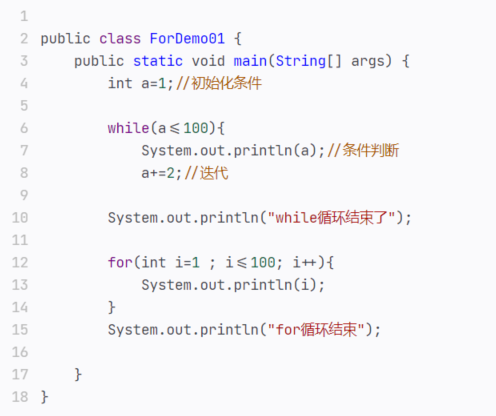
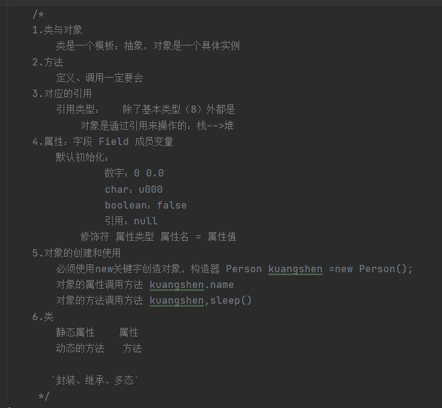
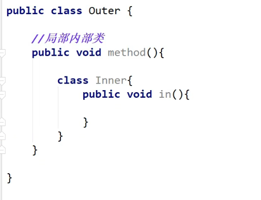

## Java基础

### 创建一个空项目并配置java环境

1.创建空项目，不做配置


2.创建模块


3.修改项目结构（增加java环境，此时是没有配置环境的）


若没有勾选环境，代码内可能没有绿色箭头（不让执行）


### Idea中的常用的缩写

- **psvm：** public static void main(String[] args){}–>main函数
- **sout:** System.out.printLn()–>输出

### Idea中常用快捷键

有可能会跟其他软件冲突，导致无法使用

知道有就行，现在暂时用不上，可以往后看着先

- 新建, 插入：alt+insert
  - 通常用在自动化生成get、set等地方
- 复制当前行到入下一行：Ctrl+D
- 格式化代码：ctrl+alt+l
- 全局查找：Ctrl+shift+F
- 全局查找并替换：Ctral+Shift+R

### 注释

#### **注释是什么？**

平时我们编写的代码，在代码量少的时候，我们还能看懂，但项目复杂起来，我们就需要注释了，否则就会出现，每次回头看前两天写的代码时，需要完完全全从头开始读的现象

- 注释不会被执行了，是给我们这些写代码的人看的
- 书写注释是一个非常好的习惯
- 平时写代码一定要注意规范

Java中的注释有三种

- 单行注释
- 多行注释
- 文档注释

#### 修改注释颜色


#### 有趣的代码注释

** 百度有趣的代码注释，有奇奇怪怪的东西**


### 标识符与关键字

#### **什么是标识符？**

- 所有的东西都有名字，身为代码的造物主，我们需要给每个类、变量、方法等命名，我们给它们的名字称为标识符
- Java所有组成都需要命名

**PS：程序源于生活，要和生活联系起来，标识符要使用看得懂的东西命名，而非abcd**

#### **什么是关键字？**

- 就是已经被系统使用了的标识符
- 为了保证系统的正常运行，不允许使用关键字名命标识符

常见的关键字如下


### 数据类型

#### **强类型语言和弱类型语言**

编程语言分为强类型语言和弱类型语言，区别如下

- 强类型语言：要求变量的使用要严格符合规定，所有变量都必须先定义后才能使用（Java、C#）
- 弱类型语言：要求变量的使用符合一定规则，可以不定义直接使用（JavaScript）
- 强类型语言更具有安全性，但是运行速度下降
- 强类型语言中一个变量定义后，不进行类型转换类型永远不变，但是弱类型语言不同变量类型直接可以直接赋值转换

#### **Java的两类数据类型**

- 基本类型（Primitive type）和引用类型（reference type）

两种类型包含的内容如下


八大基本数据类型用法如下


#### **什么是 位、字节？**

- 位（bit）：计算机内部最小的存储单位，一位表示一个0或1，如11001100是一个八位二进制数。
- 字节（byte）：计算机中数据处理的基本单位，习惯上用大写的B表示
- 转换关系： 1B（byte，字节）=8bit（位）
- 字符：是指计算机中使用的字母、数字、字和符号

**拓展**

- 从1B开始每1024倍（2^10）为一个新的单位


- 32位电脑和64位电脑指的就是内存大小最大为232B和264B的电脑，因此32位电脑最大内存为4G

#### 数据类型拓展

- 一个数可以用多种进制表示
- 浮点数直接的比较是不精确的
- 字符实际上都能被转换为数字
- 转义字符的使用
- 同一个字符使用对象创建和直接赋值，比较时得到的结果不同
  - 之后学到对象时具体解释，new开辟了新的地址空间，比较时比较的是地址


### 类型转换

- 由于Java是强类型语言，所以进行运算的时候，需要用到类型转换
- 不同类型的数据进行运算需要转换成同一类型才能运算
- 类型容量从低到高排序如下图所示
  - 低容量数据类型可以自动转换为高容量类型，而高容量类型转为低容量类型时需要强制类型转换


#### 

#### 为什么浮点数是最高容量类型？

我们可以看到，long类型要8个字节，而float类型存储只要4个字节，那为什么long能自动转为float呢？

- **long：占位** 8个字节节，范围是：-263~263-1
- **float：** 占位四个字节，范围是：一3.403E38~3.403E38
- **原因：** float存储机制为 V=(-1)^s * M * 2^E，其中第1位，符号位，即S。接下来的8位，指数域，即E。剩下的23位，小数域，即M，M的取值范围为[1，2）或[0，1）。
  - 即，相当于float和double这两个浮点数类型，实际上是用科学计数法表示的，而不是直接存储整数
    - 例：整数100000000000000000000 ，用科学技术法表示就可以写成 1*10^20
- 但是整数转为浮点数时会失去精度，例下面


PS：因为存储机制不同，及精度降低，所以小数的优先级一定大于整数


### 变量与常量

#### 变量

- 就是可以变化的量，类似有一元函数方程中的变量
- Java是强类型语言，每个变量都必须声明其类型。
- 数据通过变量放入内存，以供cpu调用计算
- Java变量是程序中最基本的存储单元，设计到了变量名、变量类型、作用域等概念


#### 变量定义的注意事项

- 每个变量都要有类型，类型可以是基本类型，也可以是是引用类型
- 变量名必须是合法标识符
- 变量声明是一条完整的语句，因此每个声明都必须以分号结束。

#### 生命周期、变量默认值


#### 常量

- 初始化之后就不能再改变其值。
- 所谓常量可以理解成一种特殊的变量，值被设定后，程序运行过程不允许改变。
- 常量名一般使用的大写字符


#### 变量命名规范

- 所有变量、方法、类目要 **见名知意**
- 类成员变量：首字母小写和驼峰原则，即 除了第一个单词以外，后满单词首字母大写 （monthSalary）
- 局部变量：首字母小写和驼峰原则
- 常量：大写字母和下划线（MAX_VAELUE）
- 类名： **首字母大写** 和驼峰原则（Man，GoodMan）
- 方法名：首字母小写和驼峰原则（run()，runRun()）

### 运算符

- 算数运算符： +，-，*，/，%，++，–
- 赋值运算符：=
- 关系运算符：>，<，>=，<=，==，！=，instanceof(用于判断该对象是否是改类或其子类，用法：obj instanceof Class)
- 逻辑运算符：&&，||，！
- 位运算符：&，|，^，~，>>，<<，>>>(了解！！)
- 条件运算符：？（用法：x？y:z，表示若x为真执行y否则执行z）
- 拓展赋值运算符：+=，-+，*=，/=

#### 运算符优先级

- 就如同 1+2*3这条数学公式是先算2*3而不是先算1+2一般，大多数语言都有自己的运算符优先级
  - 为了避免优先级混乱，尽可能使用（）包裹代码


### 包机制：对项目文件进行分类

- 为了更好的组织类，Java提供了包机制，用于区别类的命名空间，同一名字的类可以通过不同的包应用。
- 包语句的语法格式为：package pkg1 [.pkg2][.pkg3]
- 要想使用某个包的成员，就需要在Java程序中导入该包，使用“import”语句可以引用包


包的本质就是文件夹，你在写一个类的时候就需要先申明是否用到了其他包（文件夹）里的东西

#### **包的创建方式**


#### 注意事项

- 一般使用公司域名倒置作为包名 （com.kuangstudy.www）–>会自动生成三级目录
- 新建包的时候，创建com.baidu.www包


- 如果没有多级目录，则取消下面选项


- 包引用如果删除了就无法使用包内的类了
- 平时使用的String类型也是包，但是系统预置引用了

例如：未引用Date包时，则无法使用Date


#### 如何引用自己写的包？

import 包名/包名…/类


#### 一次性导入某个包中所有类

import 包名/包名…/*

### 拓展：三元表达式


### 作业：看完阿里巴巴开发手册

### javaDoc

- 三种注释方法的一种，写在类或方法上表明用途、作者等信息
  - 特殊点在于，javadoc注释能够通过命令能生成自己的API文档

#### javaDoc参数

- @author 作者名
- @version 版本号
- @since 指明需要最早使用的jkd版本
- @param 参数名
- @return 返回值情况
- @throws 异常抛出情况

#### 如何自动生成API文档

写一个代码并写上javadoc注释

- 当代码中如同下面代码一样填写了JavaDoc参数的时候，就能自动生成文档了


**方法1：CMD中生成**

**在文件所在路径中使用cmd中执行命令：** javadoc -encoding UTF-8 -charset UTF-8 Doc.java

随后会生成html文件，打开index.html就能进入api文档的首页


**方法二：使用IDEA生成**

- **内容来源：**
  - **菜菜今天不菜：**[ **用IDEA生成JAVADoc**](https://blog.csdn.net/qq_48245617/article/details/128577975)


1.选择生成JavaDoc文档的范围

2.输出目录自己专门设置一个文件夹，方便后期查阅

3.区域设置，决定文档的语言，简体中文就是zh_CN、繁体(台湾)zh_tw、繁体(香港)zh-hk、英语(香港)en-hk、英语(美国)en-
us、英语(英国)en-gb、英语(全球)en-ww

4.设置参数为了显示中文不出现乱码

-encoding UTF-8 -charset UTF-8

## 流程控制

### 用户交互：Scanner

之前学的基本语法中并没有实现程序和人的交互，但实际上几乎所有软件的人机交互都是不可或缺的，因此Java这样的一个工具类，我们可以获取用户的输入。

- java.util.Scanner是Java5的新特性，可以通过Scannner类获取用户输入

**语法**


- Scanner类的next()和nextLine()可以读取输入的字符串，可以通过hasNext()和hasNextLine()判断是否有输入的数据
- next()会把空格当成无效字符处理，而无效字符在开头会直接略过，无效字符在有效字符后会被当成结束符。因此 使用next()读区 " Hello World"时，只能读区到Hello


### 顺序结构

- Java的基本结构就是顺序结构，除非使用了其他结构语句，否则就会按顺序一句一句执行
- 顺序结构时最简单的算法结构
- 语句与语句之间，框与框之间都是从上到下的顺序执行，顺序结构是任何一个算法都离不开的基本算法结构


### 选择结构

- 在布尔表达式取值是具体几个值对比时（例：a=b），if选择结构和switch选择结构可以互相替代
- 在布尔表达式取值是来源于范围比较的时候（例：70<a<80），只能用if选择结构

#### if选择结构

**if选着结构可以分为四类：** if单选结构、if双选结构、嵌套if结构、if多选择结构

**if单选结构**

用于判断一个东西是否可行，如果可行我们采取执行，用一个if表示


**If双选择结构**

那现在有个需求，公司要收购一个软件，成功了，给人支付100万元，失败了，自己找人开发。这样的需求用一个if就搞不定了，我们需要有两个判断，需要一个双选择结构，所以就有了if-
else结构。


**if多选择结构**

我们发现刚才的代码不符合实际情况，真实的情况可能存在ABCD，存在区间多级判断。比如90-100就是A，80-90就是B
等等，在我们生活中也不仅仅有两个选项，所以我们需要一个多选择结构来处理这类问题。


resource://database/1605:0)

**嵌套if结构**

在if选择结构中继续使if选择结构是合法的，也就是说你可以在一个if中继续使用i 语句


**拓展：**
嵌套结构在二分法时非常高效，100个数中筛选一个数，可以使用多个if嵌套，每次筛选出一半的数据，最多七次就能猜出来。遍历的话可能要100次。

#### switch多选择结构

多选择结构的另一种实现方式

- switch的case语句判断一个变量与一系列值中魔偶个值是否相等，每个值称为一个分支
- 支持变量类型，byte、short、int、char，从Java SE7开始支持String
- case标签必须为字符串常量或者字面量


**case支持String的原因**

实际上String会被转换成一段hash值（又叫哈希值，为一串数字）对比字符串实际上是对比哈希值是否星等

#### 拓展：反编译class文件

1. 找到项目结构


1. 找到编译后的文件


1. 将编译后的class文件通过 文件资源管理器 拉入源码文件夹中


1. IDEA中双击class文件


#### **原文与结果对比**


### 循环结构

- while循环
- do…while循环
- for循环
- 增强型for循环
- 各种循环可以互相替代

#### while循环结构

最基本的循环


- 只要表示式为true，循环一直执行
- 大多数情况我们需要让循环停止下来，往往会在循环内容中改变布尔值表达式的变量值，使整个布尔表达式在某次循环后能结束
- 极少部分情况，如服务器请求响应监听等我们会用到死循环(永不结束的循环，即 布尔表达式永远为true的循环)


#### do while循环

**与while的差别**

- while循环从第一次循环开始每次都判断是否满足条件，而do while循环第一次执行时不判断是否满足条件（即至少执行一次）


#### For循环

虽然所有的循环都能通过while和do while 表示，但Java提供了另一种循环——for循环，能使一些循环更简单

- for循环提供了迭代条件填写位置与初始变量赋值填写位置，是最有效、最灵活的循环结构


**for循环和while对比**



#### 增强for循环

Java5引入的用于对数组的遍历的循环结构，会将数组中的每个元素遍历一遍并将当前遍历到的数组元素的值赋值给声明语句中定义的变量。


- 声明语句：声明新的局部变量，该变量类型必须和数组原神的类型匹配，该变量在循环过程中等于当前时刻遍历到的数组元素
- 表达式：填写要访问的数组名，或者能返回数组的方法


### break continue

break和continue能用于任何循环结构的主体部分当中

- break会强制停止当次循环（哪怕循环体内容还没执行完毕），并不在执行之后的循环（哪怕循环体的布尔表达式仍然为true）
- continue会强制停止当次循环（哪怕循环体内容还没执行完毕），但只会跳过这次循环，若下一次循环时的循环体的布尔表达式仍为true，循环体仍会继续循环执行。


### goto关键字

goto关键字在很早的程序设计语言中就出现了，尽管goto关键字是Java的保留字，但并未在Java中正式使用，即Java没有goto。

不过通过带标签的break和continue我们能实现goto的功能

- “标签”指后面跟着一个冒号的标识符，例： label:
  - 完全不用掌握的东西

对于Java来说唯一用到个功能的的地是是在循环语句之前，而在循环之前设置标签的唯一理由是：

- 我们希望在其中嵌套另一个循环
- 普通方法使用的break和continue关键字通常只中断当前循环，但若随同标签使用，它们就会中断语句直到到存在标签的地方。


### 练习：利用循环输出三角形


- 实际上就是把上图中空白处两个三角形利用空格表示，阴影处两个三角形利用*表示

## 方法

### 何谓方法？

- 例：System.out.println()，就是一个方法

概括性的来说方法就是语句的集合，这些语句配合执行，完成一个功能

- 解决一类问题的步骤的有序组合
- 包含在类或对象中
- 方法在程序中被创建，在其他狄梵被引用
- 可以有输入和输出也可以没有

**注意：** 方法的命名也要遵守标识符规范

#### 设计原则

- 方法的本意是功能块，就是实现某个功能的语句块的集合。我们设计方法的时候最好保持方法的原子性（即 一个方法只能完成一个功能），这样有利于后期拓展维护

#### 方法的定义

定义公式：

​	

关键字的位置可以有多个关键字，比如在` public static synchronized void hello(){}`中，static 和synchronized都是关键字

- java的方法从功能上来看类似裕C语言的函数


#### 方法调用


#### 方法重载

- 注意事项：仅返回值类型不是判断方法是否重载的依据，只有返回类型改变，不构成方法重载


### 命令行处传参

- 在哪：main方法中的 args[]参数就是用来存储参数的
  - 只有在使用命令行，且带参启动时才使用arg
- 使用方法：
  - 在项目文件夹的src文件夹内使用命令行运行有main的class文件
  - 在后面输入的参数会依次存放如args[]数组中


接下来我们示范一下如何使用


- 注意：要进入正确的文件夹指定到类所在在的位置所在位置后才能运行代码，否者报错如下


### 可变参数

- **作用：** 对于同一个方法可以使用不同个数的参数
- 也叫不定向参数
- 声明：
  - 声明形参时在类型后面加上…
  - 该形参必必须在最后一个参数位
- 使用：
  - 调用有可变参数的函数方法时该可变参数对应位可以输入多个参数
  - 这些参数会被保存到对应形参的形参名为名的数组中
  - 使用可变参数实际上就是使用数组保存多个参数


### 递归

- 方法内部调用自身


递归一定要有递归头（边界条件），否则就会进入死循环

- 如下面的代码就没有限制边界条件，那么最终就会超出内存然后报错


- 正确使用递归的示例


### 作业

- 加油！


## 数组

### 数组的定义

- 相同类型数据的有序集合
- 数组中描述的是相同类型的若干个数据，按照一定的先后次序排列组合而成
- 其中，每个数乘坐一个数组元素，每个数组元素可以通过对应下标访问

### 数组声明创建


### 内存分析

#### 和普通变量的区别

- 当声明一个变量时，内存中就开出一个只能存储一个值的空间
- 当声明一个10位数的数组时，内存中会开辟一个能存储10个数的数组


#### java内存简介

- 内存可以分为三块区域，即 堆、栈、方法区
  - 堆：存放new出来的引用对象的具体值（如对象和数组），存放后可以被所有线程共享不会存放对象引用
  - 栈：存放基本变量类型及其数值、存放引用对象的变量（会存放这个引用在堆里面的具体地址）
  - 方法区：可以被所有线程共享，包含了所有的class和static变量


#### 数组在内存中的存储

- 在栈中存放数组变量的引用，引用指向栈中的具体地址
- 栈中开辟一串连续的地址
- 存储数组的具体值


代码如下


### 初始化数组


### 数组的四个基本特点

- 长度必须是确定的，数组一旦被创建，大小就是不可改变的
- 元素必须是相同类型，不允许出现混合类型
- 数组中的袁术可以是任何数据类型，包括基本类型和引用类型（自定义对象等）
- 数组变量本身属于引用类型，所以可以看成是对象，数组中的每个元素相当于该对象的成员变量
  - 数组和对象一样，值都是存储在堆中，因此数组无论保存什么对象都是存储在堆中

### 数组的边界

- 数组是从0开始计数的，所以有效下标范围为【0，length-1】
  - 例如：大小为10的数组，合法区间是 0-9，如果使用了9以外的数就会报错


### 数组的使用

- 普通for循环用法及 计算数组和、查早数组最大元素的方法


- foreach循环用法 及 数组作为入参、出参


### 多维数组

多维数组 **创建方法如下** ，更高维数组以此类推


声明数组时方括号也能写前面


**多维数组可以看成是数组的数组**

- 比如二维数组就是一个特殊的一维数组，其每一个元素都是一个一维数组。
  - 例如： int[][] a = new int[3][2]，即是一个有三个元素的一维数组，每个元素是一个有两个元素的数组，展示图如下


**多维数组的使用**


### Arrays类


使用代码如下


### 冒泡排序

- 人尽皆知的一种简单排序，
- 嵌套了两层循环，时间复杂度维O(n2)
  - 不懂时间复杂度可以先跳过，不用纠结

交换方法如下git


### 稀疏数组


**稀疏矩阵的使用**

- 类似于五子棋这样的矩阵中就可以用稀疏数组表示


- 代码如下


- 结果如下


## 面对对象编程

### 什么是面对对象

- OO：面对对象 ，OOP：面对对象编程

#### **面对过程思想**

- 步骤清晰，第一步做什么、第二步做什么，即线性思维（或者说是写一个固定流程执行程序）
- 面对过程适合处理一些比较简单的问题
- 例如，下图就是典型的面对过程编程
  - 定义了一些方法，再main方法中编写流程控制，在main函数中通过特定的执行顺序调用调用


#### **面对对象思想**

利用抽象思维将现实中的对象进行归类，并找出构建系统需要的属性，从而创建出java类，在通过类创建一个虚拟的对象，最后通过流程控制的方式让虚拟之间进行交互，从而完成对现实的模拟，这就是面对对象思想。

- 如现实中学生请假的流程，就是由学生提交申请表给教师审批的。
  - 其中的学生和教师等群体我们就可以分别抽象为一个类，甚至请假表也能抽象一个类
  - 例如，以归类学生群体为例，我们有如下学生
    - 小红
      - 属性（班级（1班）、姓名（小红）、学号（123）、爱好（阅读）、饭量（小）、颜值（高）……）
      - 动作（打篮球、请假、吃饭、睡觉）
    - 小明
      - 属性（班级（2班）、姓名（小明）、学号（234）、爱好（打球）、饭量（大）、厨艺（高））
      - 动作（唱歌、请假、吃饭、睡觉）
    - 张三
      - 属性（班级（3班）、姓名（张三）、学号（345）、爱好（在危险边缘试探）、饭量（中）、好朋友（））
      - 动作（唱、跳、rap、篮球、请假、吃饭、睡觉）
  - 有了个体我们就要他们归类，他们都是学生，于是给类为学生类之后就胡发现他们都有班级、姓名、学号、爱好这些属性和请假、吃饭、睡觉这些动作
    - 学生
      - 属性（班级、姓名、学号、爱好、饭量）
      - 方法（请假、吃饭、睡觉）
  - 而我们在请假这个事件中只关心，学生的班级姓名学号和请假这个动作，而不关心兴趣爱好饭量吃饭睡觉等东西
  - 所以 java中的我们定义的学生类的属性最终为
    - 学生群体的共有属性（如班级、姓名、学号等）和共有方法（交申请表等）
  - 以此类推教师和请假表java类如下
    - 教师群体的共有属性（如姓名）和方法（审表）
    - 请假表类的共有属性（如请假学生姓名、请假学生班级、请假学生学号、请假状态）
- 定义好了类，就相当于订好了一个模板，这个模板可以用来生成一个具体的实例（即对象），如定义了学生类（学生模板）我们就能用学生类（学生模板）生成一个具体的虚拟对象（虚拟学生），如虚拟的学生小明
- 之后，我们就可以通过面向过程编程的方式编写一个流程调用生成的学生，完成一个虚拟请假流程了
- 对现实生活的虚拟化就是我们开发的本质！

代码如下

- main函数（通过面对过程的方式调用对象按照特定流程执行流）


- 运行结果


**小结**

- 上面的代码就很形象的说明了，面对对象编程实际上就是模拟现实这个道理
  - 现实中我们是学生填写申请表，教师审核
  - 面对对象编程的代码中我们也是学生填写申请表，教师审核
- 当然这里面的学生类、和教师类以及申请表类都还要我们定义，不过最重要的就是 **要理解，面对对象编程实际上就是对现实的模拟** 这一个概念！

**其他类的代码**

- 学生类


- r教师类


- 请假表类


**小结**

- 我们通过代码可以发现
  - 从宏观上来看，我们需要区分析整个系统，抽象归纳现实类群所具有的属性与行为，并转为我们需要的java类，这就是面向对象思想
  - 而从具体操作来看，我们是调用 生成的对象（小明、表、老师）以我们固定好流程执行（如，请假要学生先填表、然后老师再审批这一过程是不能颠倒的），这个编写固定流程的过程实际上就是面对过程编程思想

**因此我们可以说，对于描述复杂的事物，为了从宏观上把握、从整体上合理分析，我们需要使用面向对象的思路来分析整个系统。但是，具体到微观操作，仍然需要面向过程的思路去处理。**

#### 抽象

- 从上面中，我们可以知道， **面对对象编程实际上就是对现实的模拟**
- 而我们在这个过程中就需要使用抽象的方法
  - 将显示个体抽象为现实群体再提取我们需要的属性和动作抽象为虚拟群体（类），最后对虚拟群体（类）赋值，从而生成一个虚拟的个体（对象） **（即面对对象编程）**
  - 观察现实个体执行构想事情的流程，再抽象为虚拟的请假流程，并编写流程调用虚拟个体（对象）执行流程 **（即面对过程编程）**
- 通过抽象的方式，将面对对象和面对过程的结合，我们就完成对整个事件（学生请假事件）的虚拟化
- **对现实模型（事件）的虚拟化（数字化），也就是我们开发系统的目的**


从上面的例子我们也不难发现

**面对对象的编程的本质就是：以类的方式组织代码，以对象的方式组织（封装）数据**

- **以类的方式组织代码：** 包括学生、教师、请假表，甚至时请假流程的main函数都是写在一个类之中的
- **以对象的方式组织（封装）数据：** 一个类（虚拟群体）是没有意义的，我们需要给他赋值一个对象（虚拟个体），才能让他执行事件流程。这个过程中，就是以对象的方式来承载数据。


#### 面对对象编程的三大特征

- 封装：代码数据封装起来，对外留一个出入口
- 继承：子类有父类所有东西
- 多态：同一个事务有多种形态
  - 例如：人这个java对象学习方法，小明小红是人，但是他们学习后得到结果（分数）却不一样

### 方法的回顾和深入

#### 方法的定义

- 修饰符、返回类型、方法名、参数列表[参数类型 参数名]、后面还会学异常抛出


#### 方法的调用

- 静态方法、非静态方法


- 形参和实参


- 值传递和引用传递


值传递时，我们在方法中的操作不影响main函数中的值，引用传递时我们在方法中的操作影响main中的值

### 类与对象的关系

- 类是一种抽象数据类型，他是某一类事物的整体描述/定义，但是并不能代表某一个具体事务
  - 类：动物、植物、手机、电脑、person类、pet类、car类
  - 用于描述/定义某一类具体事务应该具备的特点和行为
- 对象就是抽象概念的具体示例
  - 对象：张三这个人、张三家里养的旺财这条狗
  - 能够体现出特点，展现出功能的具体实例

我的理解：

如之前说的抽象那个部分内容，我们把现实的事件流程转为电子流程，需要经历 现实个体、现实群体、虚拟群体、虚拟个体的四个步骤转换

执行一个事件，在现实中我们需要现实个体去执行，如现实中小明去跟现实中王老师请假。但是在我们要想把这个流程电子化，那么就需要有虚拟的小明和虚拟的王老师来执行。而我们需要创建一个虚拟的小明或者老王，就需要用虚拟的群体也就是类进行创建并初始化

- 类实际上也就相当于一个用来创建对象（虚拟个体）的模板


### 创建与初始化对象

- 构造器也叫构造方法


- 一个类即使什么也不写，它也会有一个构造方法，但一旦定义了有参构造，如果还需要使用无参构造就必须定义无参构造

### 创建对象内存分析

- 下面的图可以看作简单的内存图，实际内存还有类加载器、class对象等，这些东西后面讲反射时再讲

先新建一个类，然后我们分析用它生成对象时的内存结构


- 程序运行要先加载运行模板所以第一步时将application类放入方法区，包括了main（）和常量
- 然后会把main放入栈中，main会被放入栈底，当main被弹出时，程序也就结束了
- 然后就会执行new一个pet，这时就会把pet加载进方法区，包括了属性和方法，此时属性都是null
- 随后在堆中new一块空间存放pet对象，此时仍未赋值
- 随后在栈中存入dog引用
- 最后对dog赋值


- 新增一个cat，流程类似


**小结**

- 方法区也是堆的组成
- 堆存放创建出来的对象
- 栈存放变量引用和方法

更高深的以后再说

- 结社之前的数组内容，我们可以知道对象数组的存储方式如下


### 回顾



### 封装


- 就是通过设置属性为private，并设置get/set方法实现的
- 封装更多是对于属性来说的，方法很少用到

当我们使用了private后就能发现，不在能直接通过 对象.属性的方式调用属性了


这时我们要操作这些属性就需要用到方法，get/set

- get获取属性的值
- set设置属性的值


使用alt+insert键，然后能快捷生成get/set方法


#### **封装的意义**

1.提高程序安全性，保护数据

2.隐藏代码的实现细节

3.统一接口

4.系统可维护增加了

我们可以在调用方法时做一些控制，控制值的合法性

- 如我们可以限制，在设置年龄属性时，必须要在0~120之间，否则报错


完整代码如下


### 继承

- 现实生活中的继承是无处不在
  - 动物->哺乳动物、爬行动物->猫/狗、蜥蜴
  - 人->国家/肤色
- 继承是类和类的关系，子类继承了父类就会拥有父类的全部方法


Student类中并没有写say方法，但是通过继承Person可以直接使用


我们如果设置了public属性，那么也会被子类继承

- 所以为了防止子类使用了父类的属性，往往会将属性定义为private
  - 可以发现继承和封装也有关系


按ctrl+h就能看见类的继承关系

- 从中我们也能发现所有的类都继承自Object


测试：即使什么也没定义，类中依旧有方法可以使用，因为所有类都继承了Object类


#### super

- 使用super能调用父类的属性或方法
- 私有的东西无法被继承


调用用子类构造器时，实际上隐藏执行了 父类构造器，

- 如果要把父类构造器写在子类构造器中，也就是super()，那么必须写在子类构造器第一行


所以我们如果在写了有参构造后一定要写上无参构造，否则子类因为调用不了无参构造就会报错，除非你想下面一样，在子类无参中直接调用父类有参


super注意点

1. super调用父类的构造方法，必须在构造方法第一个
2. super必须只能出现在子类或者构造方法中！
3. super和this不能同时调用构造方法

super和this的区别

- 代表对象不同
  - this：调用这个对象本身
  - super：代表父类对象的应用
- 前提
  - this：没有继承也能使用
  - super：只能再继承条件下才能使用
- 构造方法
  - this（）：本类的构造方法
  - super（）：父类的构造方法

#### 方法的重写


- 有继承关系时，能够用父类引用指向子类对象
- 方法的调用只和左边（引用类型）有关


- 调用子类和父类都有的的方法时，静态方法和非静态方法有区别
- 静态方法：只和左边定义的数据类型有关
- 非静态方法：子类会重写父类方法，调用时使用的new出来的对象类型是谁就用谁的

重写方法idea会有提示，在子类中提示重写，在父类中提示被继承


**总结**

重写：需要有继承关系，子类重写父类的方法！

1. 方法名必须相同
2. 参数列表必须相同
3. 修饰符：范围可以扩大不能缩小 public>protected>Default>private
4. 抛出异常：范围可以被缩小但不能扩大（没学到），ClassNotFoundException （小）- >Exception（大）

重写，子类的方法和父类必须一直：方法体不同！

为什么要重写：

- 父类的功能，子类不一定需要，或者不一定满足

快捷键重写：

A;t + Insert–>overrider

### 多态


- student中没定义run，但是person中定义了run，而student继承了person，那么person引用指向studnet实例时，能调用run方法


- 子类重写了父类方法，则无论引用类型时父类还是子类都是执行子类方法


- 子类定义的方法，父类引用类型无法使用，上图中s2.eat()报错

**总结**

对象能执行哪些方法主要看对象左边的类型，和右边关系不大

**多态注意事项:**

1. 多态是方法的多态，属性没有多态
2. 父类和子类要有联系；否则报错类型转换异常（classcastException）
3. 存在条件：继承关系，方法需要重写，父类的引用子项子类对象（例：father f1 = new Son（））

**不能重写的方法**

1.static 方法 属于类，不属于实例，所以不能重写

1. final 常量

4.private方法

- 可以实现动态编译，数据类型只有在编译时才确定（现在理解不了，现在知道多态能提高了程序拓展性就好）


- 第一行解释：同样都是run，通过s1和s2可能产生不一样的结果

### instanceof和类型转换

- instanceof是Java的一个二元操作符（运算符），和==，>，<是同一类东西
- 它的作用是判断其左边对象是否为其右边类的实例


- instanceof 判断类型是否相似（有无继承等关系）


- student和teacher类继承了person，所以前三行都是true


- person和String绝对没有关系，所以编译就报错了


- studnet和teacher也没有继承关系，所以false


- 能不能编译通过取决于x和y有没有继承关系


- person类型比student高一级，所以用不了go，那么就要类型转换


- 转换后就可以使用了


- 父类型要调用父类方法只能通过强制类型转换了

**总结**

1.父类引用指向子类的对象 自动

2.把子类实例转换为父类实例，向上转型（低转高）

3.把父类转子类，向下转型 强制转换（会丢失子类独有方法）

**作用**

方便方法调用，减少重复代码；不用重新new一个类，把原来的类降级或升级就行

封装、继承、多态！一个比一个抽象

之后更抽象的东西： 抽象类、接口


### static详解

**静态属性**

- 非静态的方法不能直接通过类名调用
- 静态变量推荐使用类名直接调用，代码更易于理解


**静态方法**

- 非静态方法，不能通过类名直接调用，静态可以
  - 此处甚至连类名都可以不要直接使用go()，因为此处main就在lstudnet类中
- 静态方法可以直接调用静态方法，但是不能直接调用非静态方法
  - 例：main也是个静态方法，调用非静态方法润报错
  - 因为静态方法和类一起加载，而非静态方法要和对象一起加载，所以静态方法调用非静态方法时，非静态方法还没加载出来，所以无法调用

之后会学习类加载机制（注解反射模块），具体内容到时候讲


#### **代码块**

- 一般不建议这样写
- 代码块：创建对象时自动执行了，在构造器之前
- 静态代码块：在类加载的时候自动执行
- 静态方法只在类加载时执行一次（相当于整个项目运行一次执行一次），非静态方法创建一次对象执行一次


**测试代码**


增加一个person2


- 可以看见，静态方法只执行一次，非静态方法创建一次对象执行一次

很多人自学半年都学不到这，因为学完之前的他们就觉得能循环输出东西了，很厉害了

### 新特性


- 每次都要写Math很烦，我们可以利用新特性省略掉Math


很少人会这样玩，主要是告诉你java的东西非常多，只要想学就能一直学下去

**final**

- 通过final限定的类，就不能被继承了


### 抽象类


- 子类如果继承了抽象类，就必须实现里面的抽象方法，否则报错
  - 除非子类也是抽象类


**总结**

1. 不能new抽象类，只能靠子类去实现它：只是一种约束

2.抽象类可以写普通方法

3.抽象方法必须在抽象类中

- 抽象的抽象：约束
  - java类是我们通过现实抽象出来的，抽象类又是我们抽象java类抽象出来的

**思考题**

抽象类有构造器吗–>有

存在的意义：创建游戏角色，重复创建过于麻烦，因此继承抽象类，但是其中每个角色的特殊点我们要自己去实现（抽象方法）

作用：提高开发效率

- 并不是重要内容，接口才是重要内容，不过理解了抽象类更容易理解接口

### 接口

在大型系统开发时，我们一般会把所有的接口都先设计好，文档也定义好，之后只要找一些码农（学的不好但是也干程序的）就能实现。

- 希望大家以后不要做这些主要就是做一些实现别人接口的工作
- 做这种工作对自己来说没啥提升，只是能赚点钱
- 主要是外包公司（中软……），经常是帮外国人打工


- 接口的图标是 I ，类的图标是C


- 通过interface定义
- 接口中不允许写方法的实现
- 接口里面的方法默认就是 public abstract，可以直接省略不写


- 类实现了接口必须要实现接口里的所有方法，否则报错


- 一个类可以实现多个接口，但只能继承一个抽象类


- 口里面定义常量一定是静态常量
  - 不过一般没人会在接口定义常量


**杂谈**

企业中的开发、包括后面要学的很多框架，核心是想就是写很多接口然后实现它，包括以后写业务也是

接口实现是很容易的，但是如何把一个系统抽象称多个接口是很难的

- 锻炼抽象思维是特别难的，不是一下能练出来的，
- 这就是为什么有的人能做到架构师有的不行，当你能把一个系统抽象为各个接口的时候你的抽象能力就已经很强了

大部分人都只能默默学习，看自己是否有能力能够持续学习，持续提高

**总结**

- 作用：约束
  - 定义一些方方法，让不容的人实现，（10个员工可以都实现一个接口）
- 方法都是public astract
- 常量都是 public static final
- 接口不能被实例化，接口没有构造方法
- implement可以实现多个接口
- 必须重写接口的方法

**杂谈**

**大家一定要总结自己的博客** ，才能更好理解学习，如果理解不了你就会发现以后项目都是用的都是这种规约的思想，就是把所有东西都接口化，然后实现它就行

公司里面干活并不难，虽然我们离干活还有很远要走

java学完后去看23种设计模式：面对对象的精髓

### 内部类


内部类总是让人觉得奇葩，明明可以正常写，非要这样写

#### 成员内部类

- 一般不这样用


- 内部类能直接访问外部类的私有变量和方法


此处狂神表示，多的东西不介绍了，需要更深入了解的可以看他的文章

#### 静态内部类


- 加上static后，id就拿不到了，应为静态类先于对象创建

先认识就好了，以后聊到lambda表达式时再推到

#### **其他**

- 下面这种写法不算内部类的，可以看见项目结构中这个文件能展开成两个类
  - 一个java文件里面能写多个class类
- 但是一个java文件只能有一个public class ，所以classA不能写成public


#### 局部内部类

- 方法里面定义的类



#### 类的奇怪使用方法

- 匿名对象


#### 匿名内部类

- 之前说了接口不能new，但是实际上接口new了后会变成匿名内部类


当你使用 `new SomeClass() {}` 这种语法时，实际上你是在创建一个 **匿名内部类**，并且这个匿名类是 `SomeClass` 的子类。之所以说它是子类，是因为在 Java 中，当你使用 `new 类名() {}` 这种形式时，**总是会创建一个新的类**，这个类是你正在实例化的类的子类，哪怕你并没有显式地声明它。

**学完面对对象课程应该会的东西**

1.面对对象思想，用程序的思维看待世界

2.关键字

3.java学无止境

### 枚举

在Java中，我们可以通过`static final`来定义常量。例如，我们希望定义周一到周日这7个常量，可以用7个不同的`int`表示：

```java
public class Weekday {
    public static final int SUN = 0;
    public static final int MON = 1;
    public static final int TUE = 2;
    public static final int WED = 3;
    public static final int THU = 4;
    public static final int FRI = 5;
    public static final int SAT = 6;
}
```

使用常量的时候，可以这么引用：

```java
if (day == Weekday.SAT || day == Weekday.SUN) {
    // TODO: work at home
}
```

也可以把常量定义为字符串类型，例如，定义3种颜色的常量：

```java
public class Color {
    public static final String RED = "r";
    public static final String GREEN = "g";
    public static final String BLUE = "b";
}
```

使用常量的时候，可以这么引用：

```java
String color = ...
if (Color.RED.equals(color)) {
    // TODO:
}
```

无论是`int`常量还是`String`常量，使用这些常量来表示一组枚举值的时候，有一个严重的问题就是，编译器无法检查每个值的合理性。例如：

```java
if (weekday == 6 || weekday == 7) {
    if (tasks == Weekday.MON) {
        // TODO:
    }
}
```

上述代码编译和运行均不会报错，但存在两个问题：

- 注意到`Weekday`定义的常量范围是`0`~`6`，并不包含`7`，编译器无法检查不在枚举中的`int`值；
- 定义的常量仍可与其他变量比较，但其用途并非是枚举星期值。

#### enum

为了让编译器能自动检查某个值在枚举的集合内，并且，不同用途的枚举需要不同的类型来标记，不能混用，我们可以使用`enum`来定义枚举类：

```java
// enum
public class Main {
    public static void main(String[] args) {
        Weekday day = Weekday.SUN;
        if (day == Weekday.SAT || day == Weekday.SUN) {
            System.out.println("Work at home!");
        } else {
            System.out.println("Work at office!");
        }
    }
}

enum Weekday {
    SUN, MON, TUE, WED, THU, FRI, SAT;
}
```

注意到定义枚举类是通过关键字`enum`实现的，我们只需依次列出枚举的常量名。

和`int`定义的常量相比，使用`enum`定义枚举有如下好处：

首先，`enum`常量本身带有类型信息，即`Weekday.SUN`类型是`Weekday`，编译器会自动检查出类型错误。例如，下面的语句不可能编译通过：

```java
int day = 1;
if (day == Weekday.SUN) { // Compile error: bad operand types for binary operator '=='
}
```

其次，不可能引用到非枚举的值，因为无法通过编译。

最后，不同类型的枚举不能互相比较或者赋值，因为类型不符。例如，不能给一个`Weekday`枚举类型的变量赋值为`Color`枚举类型的值：

```java
Weekday x = Weekday.SUN; // ok!
Weekday y = Color.RED; // Compile error: incompatible types
```

这就使得编译器可以在编译期自动检查出所有可能的潜在错误。

#### enum的比较

使用`enum`定义的枚举类是一种引用类型。前面我们讲到，引用类型比较，要使用`equals()`方法，如果使用`==`比较，它比较的是两个引用类型的变量是否是同一个对象。因此，引用类型比较，要始终使用`equals()`方法，但`enum`类型可以例外。

这是因为`enum`类型的每个常量在JVM中只有一个唯一实例，所以可以直接用`==`比较：

```java
if (day == Weekday.FRI) { // ok!
}
if (day.equals(Weekday.SUN)) { // ok, but more code!
}
```

#### enum类型

通过`enum`定义的枚举类，和其他的`class`有什么区别？

答案是没有任何区别。`enum`定义的类型就是`class`，只不过它有以下几个特点：

- 定义的`enum`类型总是继承自`java.lang.Enum`，且无法被继承；
- 只能定义出`enum`的实例，而无法通过`new`操作符创建`enum`的实例；
- 定义的每个实例都是引用类型的唯一实例；
- 可以将`enum`类型用于`switch`语句。

例如，我们定义的`Color`枚举类：

```java
public enum Color {
    RED, GREEN, BLUE;
}
```

编译器编译出的`class`大概就像这样：

```java
public final class Color extends Enum { // 继承自Enum，标记为final class
    // 每个实例均为全局唯一:
    public static final Color RED = new Color();
    public static final Color GREEN = new Color();
    public static final Color BLUE = new Color();
    // private构造方法，确保外部无法调用new操作符:
    private Color() {}
}
```

所以，编译后的`enum`类和普通`class`并没有任何区别。但是我们自己无法按定义普通`class`那样来定义`enum`，必须使用`enum`关键字，这是Java语法规定的。

因为`enum`是一个`class`，每个枚举的值都是`class`实例，因此，这些实例有一些方法：

##### name()

返回常量名，例如：

```java
String s = Weekday.SUN.name(); // "SUN"
```

##### ordinal()

返回定义的常量的顺序，从0开始计数，例如：

```java
int n = Weekday.MON.ordinal(); // 1
```

改变枚举常量定义的顺序就会导致`ordinal()`返回值发生变化。例如：

```java
public enum Weekday {
    SUN, MON, TUE, WED, THU, FRI, SAT;
}
```

和

```java
public enum Weekday {
    MON, TUE, WED, THU, FRI, SAT, SUN;
}
```

的`ordinal`就是不同的。如果在代码中编写了类似`if(x.ordinal()==1)`这样的语句，就要保证`enum`的枚举顺序不能变。新增的常量必须放在最后。

有些童鞋会想，`Weekday`的枚举常量如果要和`int`转换，使用`ordinal()`不是非常方便？比如这样写：

```java
String task = Weekday.MON.ordinal() + "/ppt";
saveToFile(task);
```

但是，如果不小心修改了枚举的顺序，编译器是无法检查出这种逻辑错误的。要编写健壮的代码，就不要依靠`ordinal()`的返回值。因为`enum`本身是`class`，所以我们可以定义`private`的构造方法，并且，给每个枚举常量添加字段：

```java
// enum
public class Main {
    public static void main(String[] args) {
        Weekday day = Weekday.SUN;
        if (day.dayValue == 6 || day.dayValue == 0) {
            System.out.println("Work at home!");
        } else {
            System.out.println("Work at office!");
        }
    }
}

enum Weekday {
    MON(1), TUE(2), WED(3), THU(4), FRI(5), SAT(6), SUN(0);

    public final int dayValue;

    private Weekday(int dayValue) {
        this.dayValue = dayValue;
    }
}
```

这样就无需担心顺序的变化，新增枚举常量时，也需要指定一个`int`值。

 注意

枚举类的字段也可以是非final类型，即可以在运行期修改，但是不推荐这样做！

默认情况下，对枚举常量调用`toString()`会返回和`name()`一样的字符串。但是，`toString()`可以被覆写，而`name()`则不行。我们可以给`Weekday`添加`toString()`方法：

```java
// enum
public class Main {
    public static void main(String[] args) {
        Weekday day = Weekday.SUN;
        if (day.dayValue == 6 || day.dayValue == 0) {
            System.out.println("Today is " + day + ". Work at home!");
        } else {
            System.out.println("Today is " + day + ". Work at office!");
        }
    }
}

enum Weekday {
    MON(1, "星期一"), TUE(2, "星期二"), WED(3, "星期三"), THU(4, "星期四"), FRI(5, "星期五"), SAT(6, "星期六"), SUN(0, "星期日");

    public final int dayValue;
    private final String chinese;

    private Weekday(int dayValue, String chinese) {
        this.dayValue = dayValue;
        this.chinese = chinese;
    }

    @Override
    public String toString() {
        return this.chinese;
    }
}
```

覆写`toString()`的目的是在输出时更有可读性。

 注意

判断枚举常量的名字，要始终使用name()方法，绝不能调用toString()！

#### switch

最后，枚举类可以应用在`switch`语句中。因为枚举类天生具有类型信息和有限个枚举常量，所以比`int`、`String`类型更适合用在`switch`语句中：

```java
// switch
public class Main {
    public static void main(String[] args) {
        Weekday day = Weekday.SUN;
        switch(day) {
        case MON:
        case TUE:
        case WED:
        case THU:
        case FRI:
            System.out.println("Today is " + day + ". Work at office!");
            break;
        case SAT:
        case SUN:
            System.out.println("Today is " + day + ". Work at home!");
            break;
        default:
            throw new RuntimeException("cannot process " + day);
        }
    }
}

enum Weekday {
    MON, TUE, WED, THU, FRI, SAT, SUN;
}
```

加上`default`语句，可以在漏写某个枚举常量时自动报错，从而及时发现错误。

#### 小结

Java使用`enum`定义枚举类型，它被编译器编译为`final class Xxx extends Enum { … }`；

通过`name()`获取常量定义的字符串，注意不要使用`toString()`；

通过`ordinal()`返回常量定义的顺序（无实质意义）；

可以为`enum`编写构造方法、字段和方法

`enum`的构造方法要声明为`private`，字段强烈建议声明为`final`；

`enum`适合用在`switch`语句中。


## 正则表达式

### 正则表达式语法

在 Java 的正则表达式中，两个 \ 代表其他语言中的一个 \，这也就是为什么表示一位数字的正则表达式是 \\\d，而表示一个普通的反斜杠是 \\\。

> 根据 Java Language Specification 的要求，Java 源代码的字符串中的反斜线被解释为 Unicode 转义或其他字符转义。因此必须在字符串字面值中使用两个反斜线，表示正则表达式受到保护，不被 Java 字节码编译器解释。例如，当解释为正则表达式时，字符串字面值 "\b" 与单个退格字符匹配，而 "\\b" 与单词边界匹配。字符串字面值 "\(hello\)" 是非法的，将导致编译时错误；要与字符串 (hello) 匹配，必须使用字符串字面值 "\\(hello\\)"。

```
System.out.print("\\");    // 输出为 \
System.out.print("\\\\");  // 输出为 \\
```

| 字符          | 说明                                                         |
| :------------ | :----------------------------------------------------------- |
| \             | 将下一字符标记为特殊字符、文本、反向引用或八进制转义符。例如， **n**匹配字符 **n**。**\n** 匹配换行符。序列 **\\\\** 匹配 **\\** ，**\\(** 匹配 **(**。 |
| ^             | 匹配输入字符串开始的位置。如果设置了 **RegExp** 对象的 **Multiline** 属性，^ 还会与"\n"或"\r"之后的位置匹配。 |
| $             | 匹配输入字符串结尾的位置。如果设置了 **RegExp** 对象的 **Multiline** 属性，$ 还会与"\n"或"\r"之前的位置匹配。 |
| *             | 零次或多次匹配前面的字符或子表达式。例如，zo* 匹配"z"和"zoo"。* 等效于 {0,}。 |
| +             | 一次或多次匹配前面的字符或子表达式。例如，"zo+"与"zo"和"zoo"匹配，但与"z"不匹配。+ 等效于 {1,}。 |
| ?             | 零次或一次匹配前面的字符或子表达式。例如，"do(es)?"匹配"do"或"does"中的"do"。? 等效于 {0,1}。 |
| {*n*}         | *n* 是非负整数。正好匹配 *n* 次。例如，"o{2}"与"Bob"中的"o"不匹配，但与"food"中的两个"o"匹配。 |
| {*n*,}        | *n* 是非负整数。至少匹配 *n* 次。例如，"o{2,}"不匹配"Bob"中的"o"，而匹配"foooood"中的所有 o。"o{1,}"等效于"o+"。"o{0,}"等效于"o*"。 |
| {*n*,*m*}     | *m* 和 *n* 是非负整数，其中 *n* <= *m*。匹配至少 *n* 次，至多 *m* 次。例如，"o{1,3}"匹配"fooooood"中的头三个 o。'o{0,1}' 等效于 'o?'。注意：您不能将空格插入逗号和数字之间。 |
| ?             | 当此字符紧随任何其他限定符（*、+、?、{*n*}、{*n*,}、{*n*,*m*}）之后时，匹配模式是"非贪心的"。"非贪心的"模式匹配搜索到的、尽可能短的字符串，而默认的"贪心的"模式匹配搜索到的、尽可能长的字符串。例如，在字符串"oooo"中，"o+?"只匹配单个"o"，而"o+"匹配所有"o"。 |
| .             | 匹配除"\r\n"之外的任何单个字符。若要匹配包括"\r\n"在内的任意字符，请使用诸如"[\s\S]"之类的模式。 |
| (*pattern*)   | 匹配 *pattern* 并捕获该匹配的子表达式。可以使用 **$0…$9** 属性从结果"匹配"集合中检索捕获的匹配。若要匹配括号字符 ( )，请使用"\("或者"\)"。 |
| (?:*pattern*) | 匹配 *pattern* 但不捕获该匹配的子表达式，即它是一个非捕获匹配，不存储供以后使用的匹配。这对于用"or"字符 (\|) 组合模式部件的情况很有用。例如，'industr(?:y\|ies) 是比 'industry\|industries' 更经济的表达式。 |
| (?=*pattern*) | 执行正向预测先行搜索的子表达式，该表达式匹配处于匹配 *pattern* 的字符串的起始点的字符串。它是一个非捕获匹配，即不能捕获供以后使用的匹配。例如，'Windows (?=95\|98\|NT\|2000)' 匹配"Windows 2000"中的"Windows"，但不匹配"Windows 3.1"中的"Windows"。预测先行不占用字符，即发生匹配后，下一匹配的搜索紧随上一匹配之后，而不是在组成预测先行的字符后。 |
| (?!*pattern*) | 执行反向预测先行搜索的子表达式，该表达式匹配不处于匹配 *pattern* 的字符串的起始点的搜索字符串。它是一个非捕获匹配，即不能捕获供以后使用的匹配。例如，'Windows (?!95\|98\|NT\|2000)' 匹配"Windows 3.1"中的 "Windows"，但不匹配"Windows 2000"中的"Windows"。预测先行不占用字符，即发生匹配后，下一匹配的搜索紧随上一匹配之后，而不是在组成预测先行的字符后。 |
| *x*\|*y*      | 匹配 *x* 或 *y*。例如，'z\|food' 匹配"z"或"food"。'(z\|f)ood' 匹配"zood"或"food"。 |
| [*xyz*]       | 字符集。匹配包含的任一字符。例如，"[abc]"匹配"plain"中的"a"。 |
| [^*xyz*]      | 反向字符集。匹配未包含的任何字符。例如，"[^abc]"匹配"plain"中"p"，"l"，"i"，"n"。 |
| [*a-z*]       | 字符范围。匹配指定范围内的任何字符。例如，"[a-z]"匹配"a"到"z"范围内的任何小写字母。 |
| [^*a-z*]      | 反向范围字符。匹配不在指定的范围内的任何字符。例如，"[^a-z]"匹配任何不在"a"到"z"范围内的任何字符。 |
| \b            | 匹配一个字边界，即字与空格间的位置。例如，"er\b"匹配"never"中的"er"，但不匹配"verb"中的"er"。 |
| \B            | 非字边界匹配。"er\B"匹配"verb"中的"er"，但不匹配"never"中的"er"。 |
| \c*x*         | 匹配 *x* 指示的控制字符。例如，\cM 匹配 Control-M 或回车符。*x* 的值必须在 A-Z 或 a-z 之间。如果不是这样，则假定 c 就是"c"字符本身。 |
| \d            | 数字字符匹配。等效于 [0-9]。                                 |
| \D            | 非数字字符匹配。等效于 [^0-9]。                              |
| \f            | 换页符匹配。等效于 \x0c 和 \cL。                             |
| \n            | 换行符匹配。等效于 \x0a 和 \cJ。                             |
| \r            | 匹配一个回车符。等效于 \x0d 和 \cM。                         |
| \s            | 匹配任何空白字符，包括空格、制表符、换页符等。与 [ \f\n\r\t\v] 等效。 |
| \S            | 匹配任何非空白字符。与 [^ \f\n\r\t\v] 等效。                 |
| \t            | 制表符匹配。与 \x09 和 \cI 等效。                            |
| \v            | 垂直制表符匹配。与 \x0b 和 \cK 等效。                        |
| \w            | 匹配任何字类字符，包括下划线。与"[A-Za-z0-9_]"等效。         |
| \W            | 与任何非单词字符匹配。与" [^A-Za-z0-9_]"等效。               |
| \x*n*         | 匹配 *n*，此处的 *n* 是一个十六进制转义码。十六进制转义码必须正好是两位数长。例如，"\x41"匹配"A"。"\x041"与"\x04"&"1"等效。允许在正则表达式中使用 ASCII 代码。 |
| \*num*        | 匹配 *num*，此处的 *num* 是一个正整数。到捕获匹配的反向引用。例如，"(.)\1"匹配两个连续的相同字符。 |
| \*n*          | 标识一个八进制转义码或反向引用。如果 \*n* 前面至少有 *n* 个捕获子表达式，那么 *n* 是反向引用。否则，如果 *n* 是八进制数 (0-7)，那么 *n* 是八进制转义码。 |
| \*nm*         | 标识一个八进制转义码或反向引用。如果 \*nm* 前面至少有 *nm* 个捕获子表达式，那么 *nm* 是反向引用。如果 \*nm* 前面至少有 *n* 个捕获，则 *n* 是反向引用，后面跟有字符 *m*。如果两种前面的情况都不存在，则 \*nm* 匹配八进制值 *nm*，其中 *n* 和 *m* 是八进制数字 (0-7)。 |
| \nml          | 当 *n* 是八进制数 (0-3)，*m* 和 *l* 是八进制数 (0-7) 时，匹配八进制转义码 *nml*。 |
| \u*n*         | 匹配 *n*，其中 *n* 是以四位十六进制数表示的 Unicode 字符。例如，\u00A9 匹配版权符号 (©)。 |

### 正则表达式匹配Unicode

有时我们需要匹配 ASCII 范围之外的字符，例如：中文、韩文、泰文等。在正则表达式中，可以使用通过 Unicode 来表示非 ASCII 范围内的字符。

#### 什么是unicode

Unicode（又称统一码、万国码、单一码）是计算机科学领域里的一项业界标准，包括字符集、编码方案等。Unicode是为了解决传统的字符编码方案的局限而产生的，它为每种语言中的每个字符设定了统一并且唯一的二进制编码，以满足跨语言、跨平台进行文本转换、处理的要求。1990年开始研发，1994年正式公布。

Unicode 码扩展自 ASCII 码。在严格的 ASCII 码中，每个字符用7位表示，电脑上普遍使用的每字符有8位宽；而 Unicode 使用全16位表示。这使得 Unicode 能够表示世界上所有的书写语言中可能用于电脑通讯的字符、象形文字和其他符号。

### java.util.regex 包

**java.util.regex** 包是 Java 标准库中用于支持正则表达式操作的包。

java.util.regex 包主要包括以下三个类：

- **Pattern** 类：

  pattern 对象是一个正则表达式的编译表示。Pattern 类没有公共构造方法。要创建一个 Pattern 对象，你必须首先调用其公共静态编译方法，它返回一个 Pattern 对象。该方法接受一个正则表达式作为它的第一个参数。

- **Matcher** 类：

  Matcher 对象是对输入字符串进行解释和匹配操作的引擎。与Pattern 类一样，Matcher 也没有公共构造方法。你需要调用 Pattern 对象的 matcher 方法来获得一个 Matcher 对象。

- **PatternSyntaxException**：

  PatternSyntaxException 是一个非强制异常类，它表示一个正则表达式模式中的语法错误。

### Matcher 类的方法

#### 索引方法

索引方法提供了有用的索引值，精确表明输入字符串中在哪能找到匹配：

| **序号** | **方法及说明**                                               |
| :------- | :----------------------------------------------------------- |
| 1        | **public int start()** 返回以前匹配的初始索引。              |
| 2        | **public int start(int group)**  返回在以前的匹配操作期间，由给定组所捕获的子序列的初始索引 |
| 3        | **public int end()** 返回最后匹配字符之后的偏移量。          |
| 4        | **public int end(int group)** 返回在以前的匹配操作期间，由给定组所捕获子序列的最后字符之后的偏移量。 |

#### 查找方法

查找方法用来检查输入字符串并返回一个布尔值，表示是否找到该模式：

| **序号** | **方法及说明**                                               |
| :------- | :----------------------------------------------------------- |
| 1        | **public boolean lookingAt()**  尝试将从区域开头开始的输入序列与该模式匹配。 |
| 2        | **public boolean find()** 尝试查找与该模式匹配的输入序列的下一个子序列。 |
| 3        | **public boolean find(int start**）重置此匹配器，然后尝试查找匹配该模式、从指定索引开始的输入序列的下一个子序列。 |
| 4        | **public boolean matches()** 尝试将整个区域与模式匹配。      |

#### 替换方法

替换方法是替换输入字符串里文本的方法：

| **序号** | **方法及说明**                                               |
| :------- | :----------------------------------------------------------- |
| 1        | **public Matcher appendReplacement(StringBuffer sb, String replacement)** 实现非终端添加和替换步骤。 |
| 2        | **public StringBuffer appendTail(StringBuffer sb)** 实现终端添加和替换步骤。 |
| 3        | **public String replaceAll(String replacement)**  替换模式与给定替换字符串相匹配的输入序列的每个子序列。 |
| 4        | **public String replaceFirst(String replacement)**  替换模式与给定替换字符串匹配的输入序列的第一个子序列。 |
| 5        | **public static String quoteReplacement(String s)** 返回指定字符串的字面替换字符串。这个方法返回一个字符串，就像传递给Matcher类的appendReplacement 方法一个字面字符串一样工作。 |

#### start 和 end 方法

下面是一个对单词 "cat" 出现在输入字符串中出现次数进行计数的例子：

```java
import java.util.regex.Matcher;
import java.util.regex.Pattern;
 
public class RegexMatches
{
    private static final String REGEX = "\\bcat\\b";
    private static final String INPUT =
                                    "cat cat cat cattie cat";
 
    public static void main( String[] args ){
       Pattern p = Pattern.compile(REGEX);
       Matcher m = p.matcher(INPUT); // 获取 matcher 对象
       int count = 0;
 
       while(m.find()) {
         count++;
         System.out.println("Match number "+count);
         System.out.println("start(): "+m.start());
         System.out.println("end(): "+m.end());
      }
   }
}
```

以上实例编译运行结果如下：

可以看到这个例子是使用单词边界，以确保字母 "c" "a" "t" 并非仅是一个较长的词的子串。它也提供了一些关于输入字符串中匹配发生位置的有用信息。

Start 方法返回在以前的匹配操作期间，由给定组所捕获的子序列的初始索引，end 方法最后一个匹配字符的索引加 1。

#### matches 和 lookingAt 方法

matches 和 lookingAt 方法都用来尝试匹配一个输入序列模式。它们的不同是 matches 要求整个序列都匹配，而lookingAt 不要求。

lookingAt 方法虽然不需要整句都匹配，但是需要从第一个字符开始匹配。

这两个方法经常在输入字符串的开始使用。

我们通过下面这个例子，来解释这个功能：

```java
import java.util.regex.Matcher;
import java.util.regex.Pattern;
 
public class RegexMatches
{
    private static final String REGEX = "foo";
    private static final String INPUT = "fooooooooooooooooo";
    private static final String INPUT2 = "ooooofoooooooooooo";
    private static Pattern pattern;
    private static Matcher matcher;
    private static Matcher matcher2;
 
    public static void main( String[] args ){
       pattern = Pattern.compile(REGEX);
       matcher = pattern.matcher(INPUT);
       matcher2 = pattern.matcher(INPUT2);
 
       System.out.println("Current REGEX is: "+REGEX);
       System.out.println("Current INPUT is: "+INPUT);
       System.out.println("Current INPUT2 is: "+INPUT2);
 
 
       System.out.println("lookingAt(): "+matcher.lookingAt());
       System.out.println("matches(): "+matcher.matches());
       System.out.println("lookingAt(): "+matcher2.lookingAt());
   }
}
```

以上实例编译运行结果如下：


#### replaceFirst 和 replaceAll 方法

replaceFirst 和 replaceAll 方法用来替换匹配正则表达式的文本。不同的是，replaceFirst 替换首次匹配，replaceAll 替换所有匹配。

下面的例子来解释这个功能：

```java
import java.util.regex.Matcher;
import java.util.regex.Pattern;
 
public class RegexMatches
{
    private static String REGEX = "dog";
    private static String INPUT = "The dog says meow. " +
                                    "All dogs say meow.";
    private static String REPLACE = "cat";
 
    public static void main(String[] args) {
       Pattern p = Pattern.compile(REGEX);
       // get a matcher object
       Matcher m = p.matcher(INPUT); 
       INPUT = m.replaceAll(REPLACE);
       System.out.println(INPUT);
   }
}
```

以上实例编译运行结果如下：


#### appendReplacement 和 appendTail 方法

Matcher 类也提供了appendReplacement 和 appendTail 方法用于文本替换：

看下面的例子来解释这个功能：

```java
import java.util.regex.Matcher;
import java.util.regex.Pattern;
 
public class RegexMatches
{
   private static String REGEX = "a*b";
   private static String INPUT = "aabfooaabfooabfoobkkk";
   private static String REPLACE = "-";
   public static void main(String[] args) {
      Pattern p = Pattern.compile(REGEX);
      // 获取 matcher 对象
      Matcher m = p.matcher(INPUT);
      StringBuffer sb = new StringBuffer();
      while(m.find()){
         m.appendReplacement(sb,REPLACE);
      }
      m.appendTail(sb);
      System.out.println(sb.toString());
   }
}
```

以上实例编译运行结果如下：


### PatternSyntaxException 类的方法

PatternSyntaxException 是一个非强制异常类，它指示一个正则表达式模式中的语法错误。

PatternSyntaxException 类提供了下面的方法来帮助我们查看发生了什么错误。

| **序号** | **方法及说明**                                               |
| :------- | :----------------------------------------------------------- |
| 1        | **public String getDescription()** 获取错误的描述。          |
| 2        | **public int getIndex()**  获取错误的索引。                  |
| 3        | **public String getPattern()** 获取错误的正则表达式模式。    |
| 4        | **public String getMessage()** 返回多行字符串，包含语法错误及其索引的描述、错误的正则表达式模式和模式中错误索引的可视化指示。 |

## 异常

#### 什么是异常


例：

- a，b无限循环调用，严重错误就是erro


- 被除数为0


- 少写一个分号


这些都是程序中的错误，我们要规避他，异常发生的原因有很多有可能时jvm有可能时程序员疏忽的原因


#### 异常的分类

- 检查性异常：程序员很难避免
  - 公司里面有个岗位叫测试，这就是专门去招bug，在某些情况下会不会出现特定问题
  - 程序员很难指导用户在使用时输入什么，所以没法完全写出没有bug的代码
- 运行时异常：较容易避免，自己写的代码会怎样运行是比较清楚的，如刚才的无限递归调用a（）b（）


#### 异常体系结构

- erro我们一般无法预见，exception我们能预见
- 下图只写出了部分

之后我们就要学习，如何捕获异常（当异常出现了，我们发现他并进行处理）


- 上卖弄这些异常如果能力不行，可能排错你都不知道如何排
- 除了运行时异常以外的东西都统称为非运行时异常，通常都是检查性错误

从程序语法上讲，异常必须处理，否则有可能编译都通过不了，如IO异常、sql异常，不过大多数情况下我们不用自定义异常

我们要把每一个报错都当作自己的提升机会，总结到自己博客里面

#### 异常处理机制


例：


解决办法


try、catch是必要的，finally可以不要

- finally一般在执行完必须要关闭的东西里面使用，如IO、资源


- 可以发现，ArithmeticException无法捕获到循环调用导致的异常


- Throwable是最高级的异常类，可以捕获所有异常

所以我们能发现，catch中的类型表示，需要捕获的异常的类型，我们需要捕获什么异常就写什么类型

可以捕捉多种异常


- 捕捉多个异常时要层层递进，如果把Throwable放在最上面，那么永远就只能捕捉带TThrowable

Ctral+Alet+T：选中代码后，能通过快捷选中语句对讲选中代码块包裹起来


主动抛出异常


向上抛出异常


- throw和throws不一样！！

#### 自定以异常

用的不多，java已经定义好了很多异常，开源框架也自定义了很多异常，如果不是写开源框架或者大型系统的话，很少用


修改传递数字为11


#### 总结


对于不确定是否出异常的代码，idea会在代码下面提示图波浪线，我们这时选中并按下Alt+Enter，可以查看可能出现的异常，和处理方法

# 拓展

## java-各种路径详解

①文件分割符：在Windows中文件分隔符是 \，在linux和unix中文件分隔符是/。实际写时可以把分隔符用File.separator代替。

同时，需要注意的是，在Windows中直接写\是不行的，因为\本身是需要转义的。

同时，需要注意的是，在Windows中分隔符写成/也是可以的，程序能正常找到路径。

②工程路径、类路径：

可以使用System.getProperty("user.dir")来获取**工程路径**，或者在默认情况下，就是说new File("")就表示在工程路径下。

**类路径**，表示当前类的路径：

System.out.println(PathDemo.class.getResource("/").getPath());

System.out.println(PathDemo.class.getResource("").getPath());

这里用getPath可以获得类路径，当什么都不写时，就是PathDemo.class的当前类路径，当带上/时，就表示这是一个绝对路径，寻找到的是类路径的根目录。

③Java中/表示根目录，不管是在什么系统上。

④经常看到类似"resoueces/js/Myjs.js"这样的路径表示，这就表示一个相对路径。表示在当前目录下找resources目录，然后在resources目录下找js目录。

注意：一般情况下，当前路径是工程路径。


```java
public class PathDemo {

    public PathDemo() {
    }

    public static void main(String[] args) throws IOException {
        File file = new File("resources/txt.txt");
        System.out.println(file.getPath());
        System.out.println(file.getAbsolutePath());
        System.out.println(file.getCanonicalFile());
        System.out.println(System.getProperty("user.dir"));
        
        System.out.println("-------------------------------------");
        File file2 = new File("./resources/txt2.txt");
        System.out.println(file2.getPath());
        System.out.println(file2.getAbsolutePath());
        System.out.println(file2.getCanonicalFile());
        System.out.println(System.getProperty("user.dir"));
        System.out.println("------------------------------------");
        File file3 = new File("");
        System.out.println(file3.getPath());
        System.out.println(file3.getAbsolutePath());
        System.out.println(file3.getCanonicalFile());
        System.out.println(System.getProperty("user.dir"));
        System.out.println("---------------------------------");
        System.out.println(PathDemo.class.getResource("").getPath());
        System.out.println(PathDemo.class.getResource("/").getPath());
        System.out.println("---------------------------------");
    }

}
```

```powershell
resources\txt.txt
D:\workspace\java测试环境\java测试\resources\txt.txt
D:\workspace\java测试环境\java测试\resources\txt.txt
D:\workspace\java测试环境\java测试
-------------------------------------
.\resources\txt2.txt
D:\workspace\java测试环境\java测试\.\resources\txt2.txt
D:\workspace\java测试环境\java测试\resources\txt2.txt
D:\workspace\java测试环境\java测试
------------------------------------

D:\workspace\java测试环境\java测试
D:\workspace\java测试环境\java测试
D:\workspace\java测试环境\java测试
---------------------------------
/D:/workspace/java%e6%b5%8b%e8%af%95%e7%8e%af%e5%a2%83/java%e6%b5%8b%e8%af%95/bin/wuxin/path/
/D:/workspace/java%e6%b5%8b%e8%af%95%e7%8e%af%e5%a2%83/java%e6%b5%8b%e8%af%95/bin/
---------------------------------
```