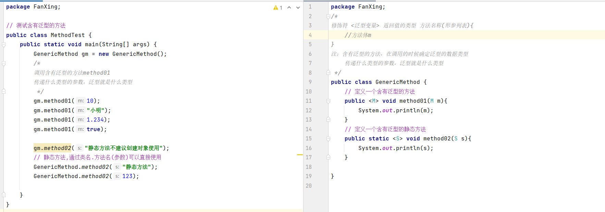
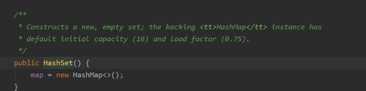
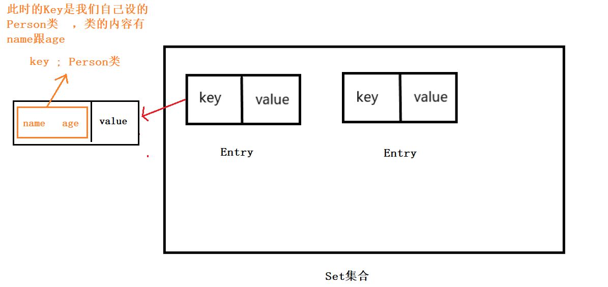

## 一：Collection集合

### 1.1集合概述:

集合：Java中提供的一种容器，可以用来存储多个数据。java集合大致可以分为Set，List，Queue和Map四种体系。

数组和集合的区别：

- 数组的长度是固定的。集合的长度是可变的。
- 数组存储的是同一类型的数据，可以存储基本数据类型值。容器能存储对象，而且存储对象的类型可以不一致。在开发中当对象多的时候，使用容器进行存储。

### 1.2集合架构


单列集合体系结构：


> Collection接口是所有单列集合的父接口，因此在单列集合中定义的List和set通用的一些方法，这些方法可以操作所有的单列集合。方法如下：

### 1.3Collection集合常用方法

```java
public boolean add(E e) // 向集合中添加元素

public boolean remove(E e); // 删除集合中的某个元素

public void clear(); // 清空集合中所有的元素

public boolean contains() // 判断集合中是否含有xxx元素

public boolean isEmpty() // 判断集合是否为空

public int size(); // 计算集合的长度

public Object[] toArray() // 将集合转成一个数组 
```

## 二：迭代器Iterator

引入：由于集合有多种，每种集合存储跟读取的方式都不一样，好比衣柜、水瓶、药瓶，你存和取的方式肯定不一样。如果每种集合都定义一种遍历方式那将十分的繁琐。

迭代器(Iterator)：它不是一个容器而是接口，它是一种用于访问容器的方法，可用于迭代 List、Set和Map等容器。

迭代：即Collection集合的通用获取方式。再获取元素之前先要判断集合中是否有元素，如果有就将这个元素去取出来，继续再判断，直到集合所有元素被取出来为止。即：一个一个的往外拿。

**作用：帮我们遍历或者拿到容器里边的数据。**

### 2.1Iterator接口

迭代器常用操作：

1. next() 下一个
2. hasNext() 判断是否存在下一个元素
3. remove() 删除元素

迭代器的使用步骤：

1. 使用集合中的方法iterator()获取迭代器的实现类对象，使用Iterator接口接收（多态）
2. 使用Iterator接口中的方法hashnext()判断还有没有下一个元素
3. 使用Iterator接口中的方法next()取出集合的下一个元素

【参考代码】

```java
 package Iterator;
 
 import javax.swing.text.html.parser.Entity;
 import java.util.*;
 
 public class Test {
     public static void main(String[] args) {
         //创建一个集合对象
         Collection<String> col = new ArrayList();
         //添加元素
         col.add("小明");
         col.add("小红");
         col.add("小蓝");
         col.add("小绿");
 
         /*
         1.使用集合的方法iterator()获取迭代器的实现类对象，使用Iterator接口接收（多态）
         注意：
             Iterator接口也是有泛型的，迭代器的泛型跟集合走，集合是什么泛型，迭代器就是什么泛型
          */
         // 多态 接口             实现类对象
         Iterator<String> it = col.iterator();
 
         // 2.使用 Iterator接口中的hashNext方法判断是否还有下一个元素
         while(it.hasNext());{
         // 3.使用 Iterator接口中的next方法取出集合的下一个元素
         String str = it.next();
         System.out.println(str);        
         }
 
     }
 }
```

### 2.2Iterator的实现原理：


### 2.3增强for()

增强for循环（for each循环）是JDk1.5之后的一个高循环，专门用来遍历数组和集合的，所有的数组跟单列集合都可以使用。它的内部原理就是一个迭代器Iterator，所以在遍历过程中，不能对集合元素进行增删操作。

语法：

```
 for(类型 变量 : 数组/集合){// 数组或者集合里的每一项赋值给这个变量
     // 循环体
 }
```

【参考代码】

```
         String[] student = {"小明","小红","小蓝"};
 //        // 传统遍历方式
 //        for (int i = 0; i < student.length; i++) {
 //            System.out.println(student[i]);
 //        }
 
         // 增强for
         for(String c : student){
             System.out.println(c);
         }
 
  --------------------------------
         List<Integer>list = new ArrayList<Integer>();
         list.add(123);
         list.add(234);
         list.add(456);
         for(Integer n : list){
             System.out.println(n);
         }
```

> 注：增强for必须有被遍历的目标。目标只能是数组或者Collection，而它仅仅作为遍历操作实现

### 2.4迭代器注意事项

- 迭代器是一次性对象。我们不能重置迭代器，它不能被重用。
- 要再次遍历同一集合的元素，请通过调用集合的iterator()方法来创建一个新的Iterator。

## 三：泛型

### 3.1泛型概述

在前面学习集合时，我们知道集合是可以存放任意对象的，只要把对象存储集合后，它们都会被向上转型提升为Object类型。当我们要取出这些对象时必须进行类型强制转换，由Object类型变为原来的类型。


### 3.2泛型的优缺点

不使用泛型：

```
 - 好处：集合默认类型是Object类，可以存储任意类型的数据
 - 弊端：不安全，会引发异常，需要强转。
 public static void main(String[] args) {
         List list = new ArrayList();
         list.add("小明");
         list.add("小红");
         for (int i = 0; i < list.size(); i++) {
         String s= (String)list.get(i) // 强转
             System.out.println(s);
         }
     }
 
```

使用泛型：

```
 - 好处：避免了类型强制转化的麻烦，存的什么类型，取出来的也是什么类型；代码运行之后才会抛出异常，写代码时不会报错
 - 弊端：泛型是什么类型只能存储什么类型的数据。
 public static void main(String[] args) {
         List<String> list = new ArrayList();// 规范了数据类型，只能放字符串!
         list.add("小明");
         list.add("小红");
         //stringList.add(123);// 除了字符串以外的类型不能加，报错！
         for (int i = 0; i < list.size(); i++) {
             String s = list.get(i); // 不用再强转了
             System.out.println(s);
         }
     }
 
```

> 在上述的实例中，我们只能添加String类型的数据，否则编译器会报错。

### 3.3泛型的定义与使用

#### 泛型类

定义格式：

```
 修饰符 class 类名<泛型变量>{
 
 }
 // 注：泛型变量建议使用E、T、K、V
```

例如：

```
 public class Box<T> {
  
   private T t;
  
   public void add(T t) {
     this.t = t;
   }
  
   public T get() {
     return t;
   }
```

参考示例：


> 注：在创建对象时确定泛型的类型

 

#### 泛型方法

定义格式：

```java
 修饰符 <泛型变量> 返回值的类型 方法名称(形参列表){
     //方法体
 }
```

> 注：含有泛型的方法，在调用的时候确定泛型的数据类型
>
> 传递什么类型的参数，泛型就是什么类型

参考示例：



#### 泛型接口

定义格式：

```
 public interface 接口名<泛型类型> {
     
 }
```

使用方式1：定义接口的实现类，实现接口，并且指定接口的泛型


 

使用方式2：接口使用什么泛型，实现类就使用什么泛型，类跟着接口走。

就相当于定义了一个含有泛型的类，创建对象的时候确定泛型的类型。

下图接口同上图接口


### 3.4泛型的通配符

当使用泛型类或接口时，传递数据中，泛型类型不确定，可以通过通配符表示<?>表示。但一旦使用泛型的通配符后，只能使用Object类中的共性方法，集合中元素自身方法无法使用。

### 通配符的基本使用

泛型的通配符：**不知道使用什么类型来接收的时候，此时可以使用 ? ，？**表示**未知通配符**

此时只能接收数据，不能往集合中存储数据。

【参考代码】

```java
 package FanXing;
 
 import javax.swing.text.html.HTMLDocument;
 import java.util.ArrayList;
 import java.util.Iterator;
 /*
     泛型的通配符：
         ？：代表数据类型
     使用方式：
         不能在创建对象时使用
         只能作为方法的传递参数使用
  */
 public class Generic {
     public static void main(String[] args) {
 
         ArrayList<Integer> list01 = new ArrayList<>();
         list01.add(123);
         list01.add(456);
 
         ArrayList<String> list02 = new ArrayList<>();
         list02.add("小明");
         list02.add("小红");
 // ......还有很多其它类型
         printArray(list01);
         printArray(list02);
         /*
             定义一个方法，能遍历所有类型的ArrayList集合
             这时候我们不知道ArrayList集合使用的是什么类型，可以使用泛型的通配符：？来代表数据类型
             注意：泛型没有继承的概念
          */
     }
 
     public static void printArray(ArrayList<?>list){
         // 使用迭代器遍历集合
        Iterator<?> it = list.iterator();
        while(it.hasNext()){
            Object obj = it.next();//it.next()取出的元素是Object类。Object类 可以接收任意的数据类型
            System.out.println(obj);
        }
 
     }
 }
```

### 通配符高级使用-----受限泛型

之前设置泛型的时候，实际上是可以可以任意设置的，只要是类就可以设置。但在Java的泛型中可以指定一个泛型的上限和下限。

**泛型的上限：**

- 格式：类型名称<? extends E >对象名称 代表的泛型只能是E类型的子类/本身
- 意义：只能接收该类型及其子集

**泛型的下限：**

- 格式：类型名称<? super E >对象名称 代表的泛型只能是E类型的父类/本身
- 意义：只能接收该类型及其父类

比如：Object类、String类、Number类、Integer类，其中Number类是Integer的父类。

## 四：Java常见数据结构

集合是基于数据结构做出来的，不同的集合底层采用不同的数据结构。不同的数据结构，功能和作用是不一样的。

数据结构是指数据以什么方式组织在一起。不同的数据结构，增删查的性能是不一样的。

### 41栈

栈：stack，又称堆栈，它是运算受限的线性表，只能在栈的受限一端进行插入和删除操作。

特点：先进后出

### 4.2队列

队列：queue，简称队，它同栈由于也是运算受限的线性表，只能在表的一端进行插入操作，而在表的另一端进行删除操作。

特点：先进先出

### 4.3数组

数组：Array，是个有序的元素序列，数组在内存中开辟一段连续的空间。

特点：

- 查询快：随机存取，通过索引可以快速访问元素
- 增删慢：静态分配内存，数组的长度是固定，存在空间闲置或者溢出现象；不适合进行插入和删除操作，需要移动大量元素。

### 4.4链表

链表：linked list，由一系列结点node组成，结点可以在运行时动态产生。每个节点包含两个部分：数据域(data)和指向下一个节点的指针域(next)。链表包括单链表和双向链表。

- 单链表：链表中只有一条链子，不能保证元素的顺序（存储和取出的顺序可能不一致）
- 双向链表：链表中只有两条链子，有一条链子专门记录元素的顺序，是一个有序的集合。

特点：

- 查询慢：链表的地址不是连续的，每次查询都要从头到尾进行遍历。
- 增删快：动态分派内存，增/删一个节点对于链表整体结构没有影响，增删操作效率高。

### 4.5红黑树

红黑树：R-B Tree，全称是Red-Black Tree，又称为“红黑树”，它一种特殊的二叉查找树。红黑树的每个节点上都有存储位表示节点的颜色，可以是红(Red)或黑(Black)，它是一种弱平衡二叉树（Weak AVL）。

特点：

（1）每个节点或者是黑色，或者是红色。 （2）根节点是黑色。 （3）每个叶子节点（NIL）是黑色。 [注意：这里叶子节点，是指为空(NIL或NULL)的叶子节点！] （4）如果一个节点是红色的，则它的子节点必须是黑色的。 （5）从一个节点到该节点的子孙节点的所有路径上包含相同数目的黑节点。

> 注：以上数据结构可以结合所学过c语言数据结构

## 五：List集合体系

### 5.1List概述

List集合体系：添加元素，是有序，可重复，有索引的，大小可变。实际开发中常用的是ArrayList集合。List集合体系包括以下几种：

- ArrayList——添加元素，是有序，可重复，有索引的。
- LinkedList——添加元素，是有序，可重复，有索引的。
- Vector——查询快，增删慢；运行效率慢、线程安全

List集合继承了Collection集合的全部功能，同时因为List集合系列有索引，所以多了很多按照索引操作元素的方法：

```java
 add(int index, E element) 根据索引添加元素
 get(int index) 根据索引获取元素
 remove(int index) 根据索引删除元素
 set(int index, E element) 根据索引修改该位置上的元素
 contains(E element)判断容器是否含有XXX东西
 clear() 清空集合中的元素
 size()计算集合的大
```

### 5.2List遍历方式

1. for循环

   ```java
    // 遍历列表
    for (int i = 0; i < list.size(); i++) {
        String str = list.get(i);
        System.out.println(str);
    
    }
   ```

2. 迭代器

   ```java
    Iterator<String>it = list.iterator(); // 创建一个List的迭代器
    
    while(it.hasNext()){// 判断有没有下一个元素
        String s = it.next(); 
        System.out.println(s);
    }
   ```

3. 增强for

   ```java
    List<String>list = new ArrayList<>();
    
        for(String s : list){
            System.out.println(s);
        }
   ```

4. Lambda表达式(了解)

   ```java
    list.foreach(s -> {
          System.out.println(s);    
    });
   ```

### 5.3ArrayList集合

ArrayList集合存储的结构是数组结构，元素增删慢，查询快。最常用。

### 5.4LinkedList集合

LinkedList集合存储的结构是链表结构，方便元素的添加、删除操作。LinkedList是一个双向链表

由于LinkedList实现了Deque、List、Queue接口，因此可以作为Deque、List、Queue的实现类。


**LinkedList的特点：**

1. 底层是一个链表结构：查询慢，增删快
2. 里边含有大量操作首尾元素的方法
3. 注：使用LinkedList集合特有的方法，不能使用多态，命名要注意了！

实际开发中对一个集合的添加、删除操作经常涉及首尾操作，LinkedList提供了很多操作首尾元素方法

```java
 public void addFirst(E e); //将指定的元素插到列表开头。
 public void addLat(E e); // 将指定的元素插到列表结尾。 此方法等效于add()方法
 public void push(E e); // 将元素推入此列表所示的堆栈。 此方法等效于addFirst()方法
 
 public E getFirst(); // 返回此列表的第一个元素
 public E getLast(); // 返回此列表的最后一个元素
 
 public E removeFirst();// 移除并返回此列表的第一个元素
 public E removeLast();// 移除并返回此列表的最后一个元素
 public E pop(E e);// 入此列表所示的堆栈中弹出一个元素。
 
 public boolean isEmpty();// 如果列表为空 返回true
```

> 注：使用LinkedList集合特有的方法，不能使用多态。

### 5.5Vector集合(了解)

数组结构实现，查询快，增删慢；

JDK1.0版本，运行效率慢、线程安全

【参考代码】

```java
 package Collection;
 
 import javax.swing.text.html.HTMLDocument;
 import java.util.Enumeration;
 import java.util.Iterator;
 import java.util.Vector;
 
 /*
     Vector集合的使用
         存储结构：数组
  */
 public class VectorTest {
     public static void main(String[] args) {
         // 创建集合
         Vector<String>vector = new Vector<>();
         // 添加元素
         vector.add("小明");
         vector.add("小红");
         vector.add("小蓝");
         System.out.println("元素个数"+ vector.size());
         // 判断
         System.out.println(vector.contains("小明"));
         System.out.println(vector.isEmpty());
         //删除
         vector.remove("小红");
         System.out.println(vector);
         //清空 clear(); vector.clear();
         // 遍历
         Iterator<String> it = vector.iterator();
         while (it.hasNext()){
             String str = it.next();
             System.out.println(str);
         }
         //vector独有的遍历  使用枚举器
 //        Enumeration<String>en = vector.elements();
 //        while (en.hasMoreElements()){
 //            String s = en.nextElement();
 //            System.out.println(s);
 //        }
     }
 }
```

## 六：Set集合系列

### 6.1概述

Set系列集合：添加的元素，是无序的，不重复的，无索引的(索引的操作不能用)。

——HashSet：添加的元素，是**无序的**，不重复的，无索引的。

——LinkedHashSet：添加的元素，是**有序的**，不重复的，无索引的。

——TreeSet：不重复，无索引，按照大小默认升序排序！！(可排序集合)

遍历方式：由于Set集合无索引，故没有for循环遍历，只有三种遍历。

 

### 6.2Set集合存储元素不重复的原理


> 注：存储的字符串，Integer等类型的数据，它们是Java已经定义好了类，它们都重写了hashCode方法和equals方法，保证了元素的唯一性！

**HashSet 保证元素唯一性的原理**

我们使用 Set 集合都是需要去掉重复元素的, 如果在存储的时候逐个 equals() 比较, 效率较低,哈希算法提高了去重复的效率, 降低了使用 equals() 方法的次数。

当 HashSet 调用 add() 方法存储对象的时候, 先调用对象的 hashCode() 方法得到一个哈希值, 然后在集合中查找是否有哈希值相同的对象，如果没有哈希值相同的对象就直接存入集合。如果有哈希值相同的对象, 就和哈希值相同的对象逐个进行 equals() 比较,比较结果为 false 就存入, true 则不存。存储元素必需要重写HashCode方法和equals方法

### 6.3HashSet存储自定义类型元素

**HashSet底层：**

hashSet底层就是一个**HashMap**；



向HashSet中存值，调用的就是HashMap的put方法，set中的值被存为map中的键。


而map中的值:PRESENT,就是一个空的对象


由于HashMap的键有不能重复的特性，HashSet的值也就有了唯一性。


**HashSet存放自定义类型**：

给HashSet中存放**自定义的类型**时，必需要重写HashCode方法和equals方法，建立自己的比较方式，才能保证HashSet集合中对象的唯一性！

【参考代码】

Person类：

```java
 package Collection;
 
 import java.util.Objects;
 
 public class Person {
     private String name;
     private int age;
 
     public Person(String name, int age) {
         this.name = name;
         this.age = age;
     }
 
     // 用于打印
     @Override
     public String toString() {
         return "Person{" +
                 "name='" + name + '\'' +
                 ", age=" + age +
                 '}';
     }
     // 重写hashCode方法和equals方法
     @Override
     public boolean equals(Object o) {
         if (this == o) return true;
         if (o == null || getClass() != o.getClass()) return false;
         Person person = (Person) o;
         return age == person.age && Objects.equals(name, person.name);
     }
 
     @Override
     public int hashCode() {
         return Objects.hash(name, age);
     }
 
     public String getName() {
         return name;
     }
 
     public void setName(String name) {
         this.name = name;
     }
 
     public int getAge() {
         return age;
     }
 
     public void setAge(int age) {
         this.age = age;
     }
 }
 // 主控制台
 package Collection;
 
 import java.util.HashSet;
 import java.util.Set;
 /*
     HashSet存储自定义类型的元素
 
     Set集合保证元素唯一性：
         存储的元素(String Integer,...Student,Person...) 必须重写hashCode方法和equals方法
     要求：
         同名且同年龄视为同一个人噢
  */
 public class TestHaxhSet {
     public static void main(String[] args) {
         // 创建hashSet集合存储Person
         Set<Person>set = new HashSet<>();
        //集合类存放对象的！
         // 创建对象(人)
 /*
        // 在没有重写hashCode方法和equals方法前，它们的哈希值都是不一样的,equals也为false 故没有重复
         Person p1 = new Person("小明",18);
         Person p2 = new Person("小明",19);
         Person p3 = new Person("小明",18);
         System.out.println(p1.hashCode());// 460141958
         System.out.println(p2.hashCode());// 1163157884
         System.out.println(p3.hashCode());// 1956725890
         System.out.println(p1.equals(p2));// false
         set.add(p1);
         set.add(p2);
         set.add(p3);
         System.out.println(set);// [Person{name='小明', age=18}, Person{name='小明', age=19}, Person{name='小明', age=18}]
 */
         // 重写hashCode方法和equals方法之后set对象就唯一性了
         Person p1 = new Person("小明",18);
         Person p2 = new Person("小明",19);
         Person p3 = new Person("小明",18);
         set.add(p1);
         set.add(p2);
         set.add(p3);
         System.out.println(set);// [Person{name='小明', age=19}, Person{name='小明', age=18}]
 
     }
 }
```

### 6.4LinkedHashSet集合

我们知道HashSet保证元素的唯一性，但存放进去的元素是无序的，那我们要保证有序，该怎么办好呢？

在HashSet下面的一个子类Java.util.LinkedHashSet。它是链表和哈希表组合的一个数据结构。

**LinkedHashSet集合的特点：**

底层是一个哈希表（数组+链表/红黑树）+链表：多了一条链表（记录元素的存储顺序），保证元素有序

具有可预知迭代顺序的 Set 接口的哈希表和链接列表实现，即**按照将元素插入到 set 中的顺序（插入顺序）进行迭代**。

**HashSet与LinkedHashSet的区别：**

【参考代码】

```java
 package Collection;
 
 import java.util.HashSet;
 import java.util.LinkedHashSet;
 import java.util.Set;
 
 public class TestHashSet {
     public static void main(String[] args) {
         Set<String>set = new HashSet<>();
         set.add("kkk");
         set.add("abc");
         set.add("abc");
         set.add("afterglow");
         System.out.println(set);//[afterglow, abc, kkk] 无序，不重复
 
         Set<String>Linkset = new LinkedHashSet<>();
         Linkset.add("kkk");
         Linkset.add("abc");
         Linkset.add("abc");
         Linkset.add("afterglow");
         System.out.println(Linkset);//[kkk, abc, afterglow] 有序，不重复
     }
 
 }
```

### 6.5可变参数

使用前提：

如果我们定义一个方法需要接收多个参数，并且多个参数类型一致，我们可以对其做如下格式的简化：

> 修饰符 返回值类型 方法名(参数类型... 形参名){ }
>
> 这个写法完全等价于：
>
> 修饰符 返回值类型 方法名(参数类型[] 形参名){ } ,
>
> 后者在调用时必须传递数组，而前者可以直接传递数据类型。

可变参数原理：

可变参数底层是一个数组，根据参数个数不同，会创建不同长度的数组来存储这些参数。传递参数的个数，可以是0~n个

【参考代码】

```java
 package Collection;
 
 public class KeBiancanShu {
     public static void main(String[] args) {
         int i =add(1,2,3,4);
         System.out.println(i);
     }
 
 //    // 两个数的和
 //    public static int add(int a, int b){
 //        return a + b;
 //    }
 //    // 三个数的和,要是多个一直往下写，很麻烦!
 //    public static int add(int a, int b, int c){
 //        return a + b +c;
 //    }
 
     /*    
         求0~n个整数的和
         数据类型已经确定：int
         参数个数不确定，可以使用可变参数
 
      */
     public static int add(int...arr){
 //        System.out.println(arr);// [I@1b6d3586 底层是一个数组
 //        System.out.println(arr.length);// 可变数组的长度，却决于你添加的个数
         int sum = 0;
         for (int i : arr){
            sum += i;
         }
         return sum;
     }
 }
```

注意事项：

- 一个方法的参数列表，只能有一个可变参数
- 如果方法的参数有多个，那么可变参数必须写在参数列表的末尾!

【示例代码】

```java
     /*
     可变参数注意事项：
         一个方法的参数列表，只能有一个可变参数
         如果方法的参数有多个，那么可变参数必须写在参数列表的末尾!
      */
     //一个方法的参数列表，只能有一个可变参数
 //    public static void method01(int...a,String...b){ 报错!
 //         }
     
     //如果方法的参数有多个，那么可变参数必须写在参数列表的末尾!
     public static void method02(String b, double c, int...a){
         
     }
```

## 七：Collections工具类

### 7.1常用方法：

- Java.utils.collections 是集合工具类，用于对集合进行操作。常用功能如下：
- `max() / min()` ：求集合的最大 / 小值
- `public static <T> boolenan addAll(Collect<T> c , T. . . elements)` ：往集合中添加一些元素
- `public static void shuffle(List<?> list)` ：打乱集合顺序
- `public static void sort(List<T> list)` ：将集合按照默认规则（升序）进行排序
- `public static void sort(List<T> list , Comparator<? super T >)` ;将集合按照指定的规则进行排序

【参考代码】

```java
 public class Test {
     public static void main(String[] args) {
         List<Integer>list = new ArrayList<Integer>();
         list.add(120);
         list.add(20);
         list.add(220);
 
         // 求最值
         Integer max = Collections.max(list);
         System.out.println(max);
         Integer min = Collections.min(list);
         System.out.println(min);
         // 排序
         Collections.sort(list);
         System.out.println(list);
         // 打乱顺序
         Collections.shuffle(list); // 斗地主发牌
         System.out.println(list);
         // 不定参数添加
         Collections.addAll(list,456,789);
         System.out.println(list);//[220, 20, 120, 456, 789]
         
     }
 }
```

#### sort(List < T > list)使用

> 注意：
>
> sort(List<T> list)使用前提：
>
> 排序的集合里边存储的元素，必须实现Comparable接口，重写接口中的方法compareTo定义排序的规则。在Java中Integer、String等等数据类型已经帮我们实现Comparable接口并重写接口中的方法compareTo了。如果要对自己定义的类进行排序，我们就要自己实现接口并重写compareTo然后进行自定义排序规则。
>
> Comparable接口的排序规则：
>
> 自己(this) - 参数：升序，反之降序

【示例参考】：比较自定义类型


> 输出结果：
>
> [Student{name='小明', age=18}, Student{name='小红', age=20}, Student{name='小蓝', age=19}] 
>
> [Student{name='小明', age=18}, Student{name='小蓝', age=19}, Student{name='小红', age=20}]

#### sort(List< T > list , Comparator<? super T >)

> sort(List< T > list , Comparator<? super T >)的使用：
>
> Comparator：相当于找一个第三放的裁判，按照Comparator比较器里面重写的compare方法对元素进行排序比较
>
> Comparator的比较规则：
>
> o1 - o2 升序

【参考代码】

```java
 public class TestComparator {
     public static void main(String[] args) {
         List<Integer> list = new ArrayList<>();
         list.add(2);
         list.add(1);
         list.add(3);
 
         Collections.sort(list, new Comparator<Integer>() {
             @Override
             public int compare(Integer o1, Integer o2) {
                 return o1 - o2;// 升序
 //                return o2 - o1;// 降序
             }
         });
 
         System.out.println(list);// [1, 2, 3]
     }
 }
```

【示例参考】：比较自定义类型


#### Comparator和Comparable的区别

- Comparable：自己（this）和别人（参数）比较，自己需要实现Comparable接口，重写比较规则compareTo方法
- Comparator：相当于找一个第三放的裁判，按照Comparator比较器里面重写的compare方法对元素进行排序比较

## 八：Map集合系列

### 8.1概述

Map集合的特点

1. Map是一个双列集合，其中每个元素表示一个键值对作为<key，value> ;
2. Map集合中的元素，key和value的数据类型可以相同，也可以不同
3. Map集合中的元素，key不允许出现重复，value可以重复
4. Map集合中的元素，key和value是一一对应的（映射）

> 注：映射由`Map<K，V>`接口的实例表示，它不是继承自`Collection`接口。

### 8.2Map集合常见实现类

Map系列集合，常用实现类的包括：

——HashMap

——LinkedHashMap

**【HashMap集合】**

`java.util.HashMap<k , v >`集合`implements Map<k , v>`接口.

HashMap集合的特点：

1. HashMap底层是哈希表：查询速度特别快

   JDK1.8之前：数组 + 单项链表

   JDK1.8之后：数组 + 单项链表/红黑树(链表长度超过8)：提高查询速度

2. HashMap集合是一个无序的集合，存储元素和取出元素的顺序有可能不一致

**【LinkedHashMap集合】**

`java.util.LinkedHashMap<k , v >`集合`extends HashMap<k , v>`集合。

LinkedHashMap集合的特点：

1. LinkedHashMap底层是哈希表 + 链表(保证迭代的顺序)
2. HashMap集合是一个有序的集合，存储元素和取出元素的顺序是一致的

### 8.3Map接口中的常用方法

Map接口中定义了很多方法，常见如下：

```java
public V put(K key , V value) // 把指定的键(key)和指定的值(value)添加到Map集合中

public V remove(Object key) // 把指定的key所对应的value从Map集合中删除，返回被删元素的值

public V get(Object key) // 在集合中获取指定key对应value的元素

boolean containsKey(Object key) // 判断集合中是否含有xxxkey

boolean containsValue(Object key) // 判断集合中是否含有xxxvalue

public Set<K> KeySet() // 把Map中所有的key打包成（存储到）set集合返回

public Set< Map.Entry<K,V> > entrySet() // 获取Map中所有key和value对象的集合（Entry）存储在集合Set中
```


【参考代码】

```java
 package Map;
 
 import java.util.HashMap;
 import java.util.Map;
 
 public class Test {
     public static void main(String[] args) {
         // 创建Map集合对象，多态
         Map<Integer,String>map = new HashMap();
         map.put(11,"小明");
         map.put(22,"小红");
         map.put(33,"小蓝");
         map.put(44,"小绿");
         System.out.println(map);// {33=小蓝, 22=小红, 11=小明, 44=小绿} HashMap无序的
 
         map.remove(44);// 删除
         System.out.println(map);// {33=小蓝, 22=小红, 11=小明}
 
         System.out.println(map.size()); //大小 3
 
         System.out.println(map.containsKey(33)); //true
         System.out.println(map.containsValue("小蓝")); //true
 
         map.put(22,"小芳"); // {33=小蓝, 22=小芳, 11=小明} 若出现重复的key原来的数据会被顶替
         System.out.println(map);
 //        map.put(55,"小明");
 //        System.out.println(map);//是否被顶替却决于key，key映射value，而不是value映射key {33=小蓝, 22=小芳, 55=小明, 11=小明}
 
         System.out.println(map.keySet()); // [33, 22, 11] 把map中的key打包成Set集合的形式
 
         System.out.println(map.get(33));// 小蓝  通过key查询value
     }
 }
 
```

### 8.4Map的遍历

**方法一**:通过键找值的方式

1. 使用Map集合中的方法keySet()，把Map集合里所有的key取出来，存放到一个Set集合中
2. 遍历set集合，获取Map集合中的每一个key
3. 通过Map集合中的get(key)方法，找到value

【参考代码】

```java
 package Map;
 
 import javax.swing.text.html.HTMLDocument;
 import java.util.HashMap;
 import java.util.Iterator;
 import java.util.Map;
 import java.util.Set;
 
 public class Test {
     public static void main(String[] args) {
         // 创建Map集合对象
         Map<String,Integer>map = new HashMap<>();
         map.put("小明",18);
         map.put("小红",18);
         map.put("小蓝",19);
         map.put("小绿",20);
 
         //1. 使用Map集合中的方法keySet()，把Map集合里所有的key取出来，存放到一个Set集合中\
         Set<String> set = map.keySet();
         
         //2.遍历set集合，获取Map集合中的每一个key
         /* 使用while遍历 */
         Iterator <String> it = set.iterator();
         while (it.hasNext()){
             String key = it.next();
             
             //3.通过Map集合中的get(key)方法，找到value
             Integer value = map.get(key);
             System.out.println(key+"="+value);
         }
         System.out.println("-----------------------");
         /* 使用增强for遍历 */
         for(String key : set){
             //3.通过Map集合中的get(key)方法，找到value
             Integer value = map.get(key);
             
             System.out.println(key+"="+value);
         }
 
     }
 }
```

**【总结】：**

while——迭代器遍历：

```java
     Set<String> set = map.keySet();
     Iterator <String> it = set.iterator();
     
     while (it.hasNext()){
         String key = it.next();
         Integer value = map.get(key);
         System.out.println(key+"="+value);
     }
```

增强for遍历：

```java
     Set<String> set = map.keySet();
     
     for(String key : set){
         //3.通过Map集合中的get(key)方法，找到value
         Integer value = map.get(key);
         System.out.println(key+"="+value);
     }
```

 

**方法二**：键值对的方式遍历（更加面向对象）

把键值对当成一个整体遍历，增强for无法遍历，这个整体不是类型，因此Java提供了方法：

Map集合通过代码Set<Map.Entry<K,V>> ，将**键值对元素**转成了一个实体类型，此时得到的是一个Entry对象，类型是：Map.Entry<K,V>

1. 通过Map集合中的entrySet()方法，把Map集合中的多个Entry对象取出来，存储到一个Set集合中
2. 此时键值对元素的类型就确定了，类型是键值对实体类型：Map.Entry<K,V>
3. 接下来就可以用增强for遍历了

【参考代码】

```java
 package Map;
 
 import javax.swing.text.html.HTMLDocument;
 import java.util.HashMap;
 import java.util.Iterator;
 import java.util.Map;
 import java.util.Set;
 
 public class Test {
     public static void main(String[] args) {
         // 创建Map集合对象
         Map<String,Integer>map = new HashMap<>();
         map.put("小明",18);
         map.put("小红",18);
         map.put("小蓝",19);
         map.put("小绿",20);
 
         //1.通过Map集合中的entrySet()方法，把Map集合中的多个Entry对象取出来，存储到一个Set集合中
         Set <Map.Entry<String,Integer>> set = map.entrySet();
 
         //遍历set集合，获取每一个Entry对象
         //使用迭代器遍历set集合
         Iterator <Map.Entry<String,Integer>> it = set.iterator();
         while (it.hasNext()){
             Map.Entry<String,Integer>entry = it.next();
             // 使用Entry对象中的getKey()和getValue()方法获取键和值
             String key = entry.getKey();
             Integer value = entry.getValue();
             System.out.println(key+"="+value);
         }
         System.out.println("-----------");
 
         //增强for
         for(Map.Entry<String,Integer> entry : set){
             // 使用Entry对象中的getKey()和getValue()方法获取键和值
             String key = entry.getKey();
             Integer value = entry.getValue();
             System.out.println(key+"="+value);
         }
     }
 }
```

【**总结】：**

while——迭代器遍历：

```java
         Set<Map.Entry<String,Integer>> set = map.entrySet();
 
         //遍历set集合，获取每一个Entry对象
         //使用迭代器遍历set集合
         Iterator <Map.Entry<String,Integer>> it = set.iterator();
         while (it.hasNext()){
             Map.Entry<String,Integer>entry = it.next();
             
             // 使用Entry对象中的getKey()和getValue()方法获取键和值
             String key = entry.getKey();
             Integer value = entry.getValue();
             System.out.println(key+"="+value);
         }
```

增强for遍历：

```java
      //增强for
         for(Map.Entry<String,Integer> entry : set){
             // 使用Entry对象中的getKey()和getValue()方法获取键和值
             String key = entry.getKey();
             Integer value = entry.getValue();
             System.out.println(key+"="+value);
         }
```

 

> Entry：表示一个key和value，它提供了获取对应key和value的方法：
>
> `public K getKey()`：获取Entry中的key
>
> `public V getValue()`：获取Entry中的value

方法二图解：


### 8.5HashMap存储自定义类型键值

练习：每位学生(姓名，年龄)都有自己的家庭住址。那么，既然有对应关系，则将学生对象和家庭住址存储到map集合中，学生作为键，地址为值。

> 注：学生姓名、年龄相同则视为同一人

 

```java
 package Map;
 /*
     hashMap存储自定义类型键值：
     Map集合保证key是唯一的：
         作为key元素，必须重写hashMap方法和equals方法，以保证key唯一
  */
 
 import java.util.HashMap;
 import java.util.Set;
 
 public class HashMapSavePerson {
     public static void main(String[] args) {
         show01();
         /*
             上海-->HashMapSavePerson{name='小蓝', age=18}
             深圳-->HashMapSavePerson{name='小绿', age=18}
             北京-->HashMapSavePerson{name='小红', age=18}
             
             key唯一
          */
     }
     
         /*
            hashMap存储自定义类型键值：
              key:String类型
                String类重写hashCode方法和equals方法，可以保证key唯一
             value:Person类型
                value可以重复（同名同年龄视为重复）
          */
 
 
     public static void show01(){
 
         // 创造HashMap集合
         HashMap<String,Person> map = new HashMap<>();
         //往集合中添加元素
         map.put("深圳",new Person("小明",18));
         map.put("上海",new Person("小蓝",18));
         map.put("北京",new Person("小红",18));
         map.put("深圳",new Person("小绿",18));
         // 使用keySet()增强for遍历map集合
         Set<String> set = map.keySet();
         for(String key:set){
             Person value = map.get(key);
             System.out.println(key+"-->"+value);
             // 因为字符串类（Java帮我们的）重写了hashCode方法和equals方法，所以键（key）是不能重复的
         }
         
     }
     
 }
```

Person类：


 

下面这个是我们自己定义的key的类型，Person类，上面例子的是String类：

```java
 package Map;
 /*
     hashMap存储自定义类型键值：
     Map集合保证key是唯一的：
         作为key元素，必须重写hashMap方法和equals方法，以保证key唯一
  */
 
 import javax.swing.text.html.HTMLDocument;
 import java.util.HashMap;
 import java.util.Iterator;
 import java.util.Map;
 import java.util.Set;
 
 public class HashMapSavePerson {
     public static void main(String[] args) {
         
         show02();
     }
           /*
            hashMap存储自定义类型键值：
              key:Person类型
                Person就必须类重写hashCode方法和equals方法，来保证key唯一
             value:String类型
                value可以重复（同名同年龄视为重复）
          */
 
     public static void show02(){
         // 创造HashMap集合
         HashMap<Person,String> map02 = new HashMap<>();
         // 往集合中添加元素
         map02.put(new Person("张三",18),"法外狂徒");
         map02.put(new Person("黄老板",18),"英国");
         map02.put(new Person("陈奕迅",18),"中国");
         map02.put(new Person("张三",18),"法外狂徒");
 
        // 使用迭代器遍历set集合中的Entry对象
         Set<Map.Entry<Person,String>> set = map02.entrySet();
         Iterator<Map.Entry<Person,String>> it = set.iterator();
         while(it.hasNext()){
             Map.Entry<Person,String> entry = it.next();
 
             Person key = entry.getKey();
             String value = entry.getValue();
             System.out.println(key+"--->"+value);
         }
     }
 
 }
```


这里再介绍一下本例中Entry对象遍历的图解，再次加深印象：




### 8.6 HashMap底层数据结构？jdk1.8算法优化，hash冲突，扩容等问题

####  1、能说说HashMap的底层原理吗？

```java
HashMap<String,String> map = new HashMap<String,String>(); 

map.put(“key”,”value”); 

[<key1,value1>,<key2,value2>,<key3,value3>] 
```

HashMap底层实现是数组+链表，用来存储**<key,value>**形式的数据，当我们调用**put(key,value)**时，首先会通过hash(key) 来获取key的hash值，hash值对数组长度进行取模运算，定位到数组的一个存储位置 bucket，如果bucket没有发生冲突的话则直接放入数组，发生冲突的话则以链表的形式存储，jdk1.8之后引入了红黑树，链表的长度超过8之后会使用红黑树，小于6之后则又转换回来。

> 如下2、3条皆为第1条的补充，预防面试官细问。

#### 2、jdk1.8中对hash算法和寻址算法的优化

jdk1.8中对hash算法进行了优化，之前在对key进行hash(key)计算时，采用的是取模运算，即第1条提到的，而优化后采用的是寻址算法，即：**(n-1) & hash** 『n为数组长度』

为什么要使用寻址算法呢？首先 「**hash & (n-1)**」 效果跟 hash 对 n 取模的效果是一样的， 但是『&』与运算的性能要优于 hash 对 n 取模。

#### 3、hash冲突？怎么解决？

当我们**put<key,value>**时，首先通过hash(key)计算得到的hash值，再通过『&』与运算之后，得到了数组存储位置bucket，但此时有可能出现两个不同的key却计算出相等的bucket，举个例子：

数组A[0]位置计算出存放**<张三,我是张三>**数据，而在**put<李四,我是李四>**数据时，也计算为存放在A[0]位置，一个位置想存放两个数据？这就出现hash冲突了，怎么处理呢？

JDK是这样处理的，它会在这个位置（A[0]）挂一个链表，这个链表表里面存放出现冲突的数据，即：让多个**<key,value>**数据同时放在数组的一个位置里。

get(key)时怎么取呢？当我们调用get(key)定位到数组位置时，如果发现这个位置挂载的是一个链表，那么就遍历链表，从里面找到自己想要的那个**<key,value>**数据。

格外补充：这个地方，在JDK1.8之后引入了红黑树的概念，首先我们看一下为啥要引入红黑树，如果没有引入红黑树，当数组挂载的链表达到一定长度之后，查询是非常耗时的，性能比较差，时间复杂度为：O(n)「读作：偶en」。

JDK1.8的优化就是，当链表的长度发到了一定长度后(8)会自动转换为红黑树，遍历一棵红黑树查找一个元素的时间复杂度为：O(logn)「读作:偶，老个en」，性能相对链表要高一些。

简单总结一下：

1. 出现hash冲突的原因？两个不同的key计算出相同的数组存放位置；
2. 初期是怎么解决的？在出现数组冲突的位置挂一个链表，实现存放多个数据。
3. JDK1.8的优化？当数组长度达到一定值后自动转换为红黑树，降低时间复杂度。

#### 4、HashMap是如何扩容的？

HashMap底层是一个数组，当数组满了之后，他会自动进行2倍扩容，用于盛放更多的数据。

比如，本来数组默认长度=16，扩容后*2=32。

扩容后还有一步操作：**rehash**，重新对每个hash值进行寻址，也就是用每个hash值跟新的数组长度 n-1 进行『&』与运算操作。

补充：扩容之后的与运算可能会导致之前的发生hash冲突的元素不再发生冲突。

**延伸一：之前一直在背的面试题中， 提到 HashMap 在多线程是不安全的「死循环」，为啥呢？或为什么说HashMap可能会导致死循环？**

这个过程就是发生在扩容阶段，在jdk1.7之前，hashmap在扩容到2倍新容器时，由于采用的是头插法「头插法就是总是把新增结点插在头部」，会造成链表翻转形成闭环，也就是形成死循环，jdk1.8之后就不再采用头插法了，而是直接插入链表尾部，因此不会形成环形链表形成死循环，但是在多线程的情况下仍然是不安全的，在put数据时如果出现两个线程同时操作，可能会发生数据覆盖，引发线程不安全，总之，用ConcurrentHashMap没错了。 

**延伸二：这为什么说HashTable效率低下呢？**

HashTable使用synchronized关键字来保证线程安全。当一个线程访问HashTable的同步方法，其他线程也访问HashTable的同步方法就会进入阻塞或轮训状态。这个的同步方法包括读和写，可以理解HashTable只有一把锁，所有的线程不管做什么，都是竞争这一把锁，例如线程1使用put进行元素添加，线程2不但不能使用put来添加元素，也不能使用get方法来获取元素，显然这效率是多低。

### 8.6LinkedHashMap集合

我们知道HashMap保证key唯一，并且查询速度快，可是成对元素存放进去是没有顺序的(存和取的顺序可能不一致)，那我们要如何保证顺序呢？

在HashMap下面有个LinkedHashMap（继承关系），它是链表（记录元素的顺序）和哈希表组合的一个数据存储结构，是个有序的集合

【参考代码】

```java
 package Map;
 
 import javax.swing.text.html.HTMLDocument;
 import java.util.*;
 
 public class Test {
     public static void main(String[] args) {
 
         HashMap<String,String> map = new LinkedHashMap<>();
         map.put("a","a");
         map.put("c","c");
         map.put("b","b");
         map.put("d","d");
         System.out.println(map);//{a=a, c=c, b=b, d=d}
     }
 }
 
```

> 输出结果：（存储和取出的顺序是一样的）
>
> {a=a, c=c, b=b, d=d}

## 九：Queue集合系列

###  3.1 Queue集合概述

Queue集合一般用于模拟队列这种数据结构。队列的特点是先进先出，队列的头部保存在队列中存放时间最长的元素，尾部保存存放时间最短的元素。新元素插入到队列的尾部，取出元素会返回队列头部的元素。通常，队列不允许随机访问队列中的元素；

- Queue接口的体系结构：


在Queue本身是一个队列，队列一般都是单向操作，先进先出，只能操作头部的元素；但Queue下面的Deque接口则是双向队列，该接口下的实现类允许对队列的头部和尾部进行操作，其中LinkedList就是Deque接口下比较常见的一个实现类了；
另外Queue下面还有另一个集合派系——BlockingQueue，该接口规范的是阻塞队列，其中有ArrayBlockingQueue、DelayQueue、LinkedBlockingQueue等类的实现，这些类底层都是采用不同的数据结构来实现阻塞队列的功能；
Tips：关于阻塞队列我们以后的章节再详细介绍，本章重点介绍Deque派系的集合；

### 3.2 Queue集合的使用

由于Queue也是属于单列集合，因此Queue同样具备Collection中的相关方法，这里就不再演示；

### 3.3 Queue常用方法

Queue中的方法如下：

```java
boolean add(E e) // 将元素添加到队列的尾部

boolean offer(E e) // 将元素添加到队列的尾部，功能和add()方法一致

E remove() // 移除队列头部的元素并将该元素返回

E poll() // 移除队列头部的元素并将该元素返回，功能和remove()方法一致

E element() // 获取队列头部的元素，并不会删除该元素

E peek() // 获取队列头部的元素，并不会删除该元素，功能和element()方法一致
```

### 3.4 Deque集合概述

Deque是Queue接口的子类，Deque规范的是一个双向的队列，因此Deque接口中定义了很多有关于队列头部和尾部操作的方法；

在开发时，**Deque集合也可以作为链表、栈、队列等结构的使用**。因此Deque除了定义队列相关的头部和尾部操作的方法外，还提供了很多栈和链表的操作方法；这些方法在Deque的子类中都得到了实现；其中LinkedList底层则是采用链表来实现链表、栈、队列等数据结构；

由于Deque是双向队列，因此Deque可以获取反向迭代的迭代器；

### 3.5 Deque集合常用方法

Deque集合常用方法如下：

```java
链表相关方法：

public void addFirst(E e) // 将指定元素插入此列表的开头。

public void addLast(E e) // 将指定元素添加到此列表的结尾。

public E getFirst() // 返回此列表的第一个元素。

public E getLast() // 返回此列表的最后一个元素。

public E removeFirst() // 移除并返回此列表的第一个元素。

public E removeLast() // 移除并返回此列表的最后一个元素。

栈相关方法：

public void push(E e) // 将元素推入此列表所表示的堆栈（栈顶），类似于addFirst()。

public E pop() // 从此列表所表示的堆栈（栈顶）处弹出一个元素，类似于removeFirst()。

队列相关方法：

public boolean offer(E e) // 将元素添加到队列尾部，类似于addLast()。

public boolean offerFirst(E e) // 将元素添加到队列头部，类似于addFirst()。

public boolean offerLast(E e) // 将元素添加到队列尾部，类似于addLast()。

public E pollFirst() // 移除并返回此列表的第一个元素。类似于removeFirst()。

public E pollLast() // 移除并返回此列表的最后一个元素。类似于removeLast()。

迭代器相关方法：

Iterator iterator() // 获取集合的迭代器

Iterator descendingIterator() // 获取集合的反向迭代器
```


### 3.6  Queue / Deque实现类--ArrayDeque

Deque接口下有两个常用的实现类，分别为：LinkedList、ArrayDeque；这两个类基本上没有对Deque接口进行功能上的扩充，只是底层的实现方式不同了，达到的功能都是一致的；**LinkedList采用的是链表来实现双向队列，而ArrayDeque采用的是数组来实现双向队列；**
ArrayDeque的继承体系：


- ArrayDeque的特点如下：
  - **1）底层采用数组来实现双向队列**
  - **2）默认初始化大小为16，每次2倍扩容**
  - **3）线程不安全，多线程访问可能会引发线程安全问题**
  - **4）不能存储null值，执行双向迭代器遍历**
- ArrayDeque使用示例：

```java
package com.dfbz.deque;

import java.util.ArrayDeque;

/**
 * @author lscl
 * @version 1.0
 * @intro:
 */
public class Demo02_ArrayDeque {
    public static void main(String[] args) {

        ArrayDeque<String> arr = new ArrayDeque<>();

        arr.addFirst("江西");
        arr.addFirst("陕西");
        arr.addFirst("山西");
        arr.addFirst("广西");

        System.out.println(arr);        // [广西, 山西, 陕西, 江西]

        System.out.println(arr.removeFirst());      // 广西
        System.out.println(arr);                    // [山西, 陕西, 江西]
        System.out.println(arr.removeLast());       // 江西
        System.out.println(arr);                    // [山西, 陕西]
    }
}
```

Tips：ArrayDeque同样具备关于链表、双向队列、栈等相关的方法；

### 3.7 Queue / Deque实现类--LinkedList

见[LinkedList](###_54linkedlist集合)

### 3.8  Queue 和 Deque 出队和入队方法比较

| Queue              | Deque                  |                                 |
| ------------------ | ---------------------- | ------------------------------- |
| 添加元素到队尾     | add(E e) / offer(E e)  | addLast(E e) / offerLast(E e)   |
| 取队首元素并删除   | E remove() / E poll()  | E removeFirst() / E pollFirst() |
| 取队首元素但不删除 | E element() / E peek() | E getFirst() / E peekFirst()    |
| 添加元素到队首     | 无                     | addFirst(E e) / offerFirst(E e) |
| 取队尾元素并删除   | 无                     | E removeLast() / E pollLast()   |
| 取队尾元素但不删除 | 无                     | E getLast() / E peekLast()      |

对于添加元素到队尾的操作，`Queue`提供了`add()`/`offer()`方法，而`Deque`提供了`addLast()`/`offerLast()`方法。添加元素到队首、取队尾元素的操作在`Queue`中不存在，在`Deque`中由`addFirst()`/`removeLast()`等方法提供。