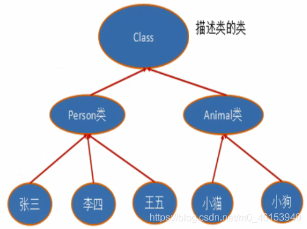
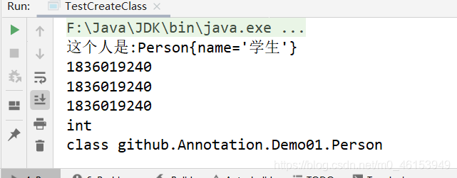
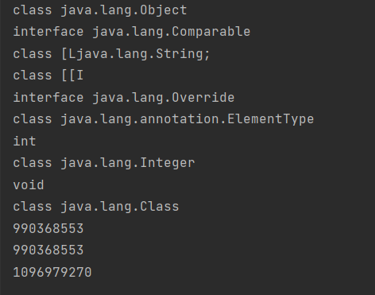
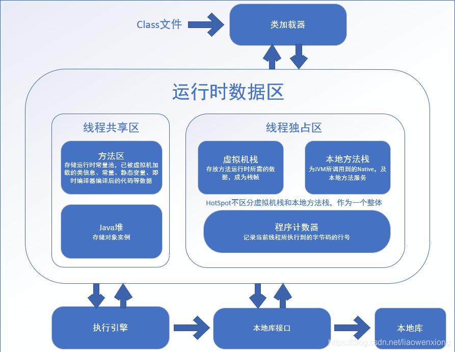
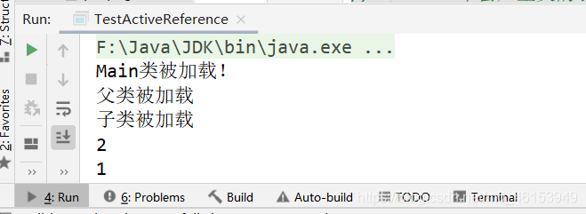
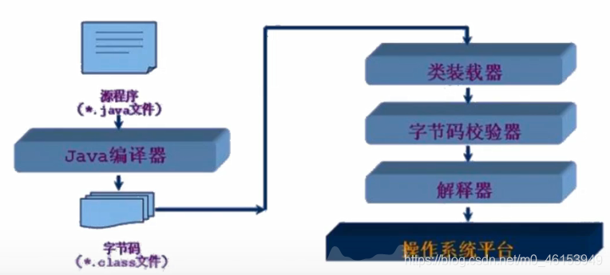
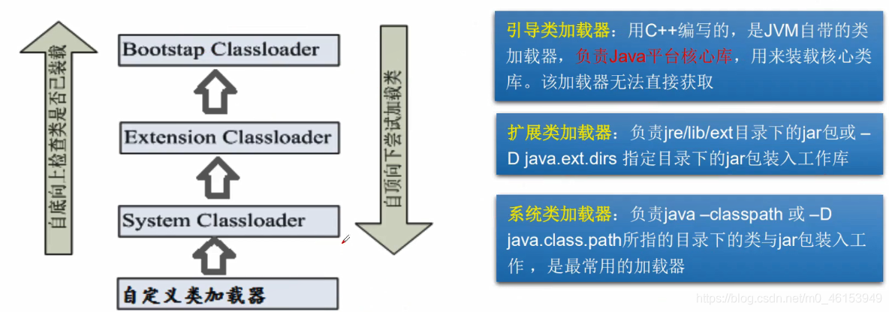
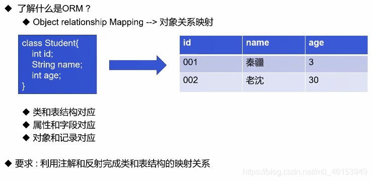

# 04-Java-注解与反射-狂神

##  1.注解

### 1.注解入门

- Annotation是jdk1.5开始引入的新技术。
- Annotation的作用：
  - 不是程序本身，可以对程序作出解释；
  - 可以被其他程序（例如编译器）读取。
- Annotation的格式
  - “@注解名”，也可以带参数，例如：@SuppressWarnings(value=“unchcked”)
- Annotation在哪里使用？
  - 可以附加在package、class、method、field上，相当于给它们添加了额外的辅助信息，还可以通过反射机制编程实现对这些元数据的访问。

```java
package github.Annotation;

/**
 * 什么是注解？
 * @author subeiLY
 * @create 2021-06-07 14:02
 */
public class Test01 extends Object{
    // Override 重写的注解
    @Override
    public String toString(){
        return super.toString();
    }
}
```

### 2.内置注解

- @ Override：定义在 java. lang Override中，此注释只适用于修辞方法，表示一个方法声明打算重写超类中的另一个方法声明。
- @ Deprecated：定义在 Java. lang. Deprecated中，此注释可以用于修辞方法，属性，类，表示不鼓励程序员使用这样的元素，通常是因为它很危险或者存在更好的选择。
- @ SuppressWarnings：定义在 Java. lang. SuppressWarnings中，用来抑制编译时的警告信息。
- 与前两个注释有所不同，你需要添加一个参数才能正确使用，这些参数都是已经定义好了的，我们选择性的使用就好了。
  - @SuppressWarnings （ “all”）
  - @SuppressWarnings （unchecked"）
  - @ SuppressWarnings（value=f"unchecked"， " deprecation "）
  - 等等……

```java
package github.Annotation.Demo01;

import java.util.ArrayList;
import java.util.List;

/**
 * 什么是注解？
 * @author subeiLY
 * @create 2021-06-07 14:02
 */
public class Test01 extends Object{
    // Override 重写的注解
    @Override
    public String toString(){
        return super.toString();
    }

    // @Deprecated 不推荐使用,但可以使用,或者存在更好的更新方式
    @Deprecated
    public static void test(){
        System.out.println("Deprecated");
    }

    // @SuppressWarnings 镇压警告
    @SuppressWarnings("all")
    public void test01(){
        List<String> list = new ArrayList<>();
    }

    public static void main(String[] args) {
        test();
    }
}
```

### 3.自定义注解

- 元注解的作用就是负责注解其他注解，Java定叉了4个标准的meta- annotation类型，他们被用来提供对其他 annotation类型作说明。
- 这些类型和它们所支持的类在 java. lang annotation包中可以找到。（@Target，@Retention，@Documented, @Inherited）
  - @ Target：用于描述注解的使用范围（即被描述的注解可以用在什么地方）。
  - @ Retention：表示需要在什么级别保存该注释信息，用于描述注解的生命周期。
    - SOURCE < CLASS < RUNTIME
  - @ Document：说明该注解将被包含在 Javadoc中。
  - @ Inherited：说明子类可以继承父类中的该注解。  

```java
package github.Annotation.Demo01;

import java.lang.annotation.*;

/**
 * 测试元注解
 * @author subeiLY
 * @create 2021-06-07 14:09
 */
public class TestAnnotation {
    @MyAnnotion
    public void test(){

    }
}

// 定义一个注解
/*
Target 注解可以用在什么地方
ElementType.METHOD 方法上有效  ElementType.TYPE类上有效
 */
@Target(value = ElementType.METHOD)
/*
@Retention 在什么地方有效
RUNTIME > CLASS > SOURCES
 */
@Retention(value = RetentionPolicy.RUNTIME)
// @Documented 表示是否将我们的注解生成在Javadoc中
@Documented
// @Inherited 子类可以继承父类的注解
@Inherited
@interface MyAnnotion{

}
```

> 自定义注解

- 使用@ interface自定义注解时，自动继承了 java. lang annotation. Annotation接口。
- 分析：
  - @ interface用来声明一个注解，格式：public @interface 注解名{定义内容}
  - 其中的每一个方法实际上是声明了一个配置参数；
  - 方法的名称就是参数的名称。
  - 返回值类型就是参数的类型（返回值只能是 基本类型, Class, String, enum）
  - 可以通过 default 来声明参数的默认值；
  - 如果只有一个参数成员，一般参数名为vaue；
  - 注解元素必须要有值，我们定义注解元素时，经常使用空字符串，0作为默认值

```java
package github.Annotation.Demo01;

import java.lang.annotation.ElementType;
import java.lang.annotation.Retention;
import java.lang.annotation.RetentionPolicy;
import java.lang.annotation.Target;

public class TestCustomAnnotation {
    // 注解可以显示赋值,如果没有默认值,就必须给注解赋值
    @MyAnnotation2(name = "王五")
    public void test() {

    }
    
    @MyAnnotion3("subei")
    public void test2(){
        
    }
}

@Target(value = ElementType.METHOD)
@Retention(value = RetentionPolicy.RUNTIME)
@interface MyAnnotation2 {
    // 注解的参数: 参数类型 + 参数名()
    // String name();
    String name() default "";

    int age() default 0;

    int id() default -1; // -1代表不存在

    String[] schools() default {"暑假好长", "不想实习"};
}

@Target(value = ElementType.METHOD)
@Retention(value = RetentionPolicy.RUNTIME)
@interface MyAnnotion3{
    String value();
}
```

## 2.反射机制

### 1.Java反射机制概念

#### 1. 静态 & 动态语言

- 动态语言
  - 是一类在运行时可以改变其结构的语言：例如新的函数、对象、甚至代码可以被引进，已有的函数可以被删除或是其他结构上的变化。通俗点说就是在运行时代码可以根据某些条件改变自身结构。
  - 主要动态语言：Object-C、C#、 JavaScript、PHP、 Python等。
- 静态语言
  - 与动态语言相对应的，运行时结构不可变的语言就是静态语言。如Java、C、C++。
  - Java不是动态语言，但Java可以称之为“准动态语言”。即Java有一定的动态性我们可以利用反射机制获得类似动态语言的特性。Java的动态性让编程的时候更加灵活。

#### 2. 反射机制概念

- Reflection（反射）是Java被视为动态语言的关键，反射机制允许程序在执行期借助于 Reflection API 取得仼何类的内部信息，并能直接操作任意对象的内部属性及方法。
  - Class c= Class.forName(“java.lang.String”);
- 加载完类之后，在堆內存的方法区中就产生了一个 Class类型的对象（一个类只有一个Cass对象），这个对象就包含了完整的类的结构信息。我们可以通过这个对象看到类的结构。这个对象就像一面镜子，透过这个镜子看到类的结构，所以，我们形象的称之为：反射。


#### 3. 反射机制研究与应用

- Java反射机制提供的功能
  - 在运行时判断任意一个对象所属的类；
  - 在运行时构造任意一个类的对象；
  - 在运行时判断任意一个类所具有的成员变量和方法；
  - 在运行时获取泛型信息；
  - 在运行时调用任意一个对象的成员变量和方法；
  - 在运行时处理注解；
  - 生成动态代理；
  - ……
- 反射的使用场景
  - **框架和库开发**：如Spring、Hibernate等，使用反射来管理对象和依赖注入。
  - **动态代理**：如Java动态代理机制，通过反射实现动态代理类。
  - **调试和测试工具**：反射可以用来构建通用的测试框架。


#### 4. 反射机制优缺点

- 优点：
  - 可以实现动态创建对象和编译，体现出很大的灵活性。
- 缺点
  - 对性能有影响。使用反射基本上是一种解释操作，我们可以告诉JVM，我们希望做什么并且它满足我们的要求。这类操作总是慢于直接执行相同的操作。

#### 5. 实现

```java
package github.Annotation.Demo01;

public class Test02 {
    public static void main(String[] args) throws ClassNotFoundException {
        // 通过反射获取class对象
        Class name = Class.forName("github.Annotation.Demo01.User");
        System.out.println(name);

        Class c1 = Class.forName("github.Annotation.Demo01.User");
        Class c2 = Class.forName("github.Annotation.Demo01.User");
        Class c3 = Class.forName("github.Annotation.Demo01.User");
        Class c4 = Class.forName("github.Annotation.Demo01.User");

        /*
        一个类在内存中只有一个Class对象
        一个类被加载后,类的整个结构都会被封装在Class对象中
        public native int hashCode();返回该对象的hash码值
        注：哈希值是根据哈希算法算出来的一个值，这个值跟地址值有关，但不是实际地址值。
         */

        System.out.println(c1.hashCode());
        System.out.println(c2.hashCode());
        System.out.println(c3.hashCode());
        System.out.println(c4.hashCode());
    }
}

// 实体类:pojo entity
class User{
    private int id;
    private int age;
    private String name;

    public User() {
    }

    public User(int id, int age, String name) {
        this.id = id;
        this.age = age;
        this.name = name;
    }

    public int getId() {
        return id;
    }

    public void setId(int id) {
        this.id = id;
    }

    public int getAge() {
        return age;
    }

    public void setAge(int age) {
        this.age = age;
    }

    public String getName() {
        return name;
    }

    public void setName(String name) {
        this.name = name;
    }

    @Override
    public String toString() {
        return "User{" +
                "id=" + id +
                ", age=" + age +
                ", name='" + name + '\'' +
                '}';
    }
}
```


### 2.理解Class类并获取Class实例

#### 1. class类介绍

- 在 Object类中定义了以下的方法，此方法将被所有子类继承
  - public final Class getclass()
- 以上的方法返回值的类型是一个 Class类，此类是Java反射的源头，实际上所谓反射从程序的运行结果来看也很好理解，即：可以通过对象反射求出类的名称。



- 对象照镜子后可以得到的信息：某个类的属性、方法和构造器、某个类到底实现了哪些接口对于每个类而言，JVM 都为其保留一个不变的Cass类型的对象。一个Class对象包含了特定某个结构（ class/interface/enum/annotation/ primitive type/void/[]）的有关信息。
  - Class本身也是一个类；
  - Class对象只能由系统建立对象；
  - 一个加载的类在JVM中只会有一个Class实例；
  - 一个Cass对象对应的是一个加载到JM中的一个class文件；
  - 每个类的实例都会记得自己是由哪个Class实例所生成；
  - 通过class可以完整地得到一个类中的所有被加载的结构；
  - class类是 Reflection的根源，针对任何你想动态加载、运行的类，唯有先获得相应的Class对象。
- class类的常用方法

| 方法名                                  | 功能说明                                                     |
| --------------------------------------- | ------------------------------------------------------------ |
| static Class<?> forName (String name)   | 返回指定类名name的class对象                                  |
| Object newInstance ()                   | 调用缺省构造函数，返回 Class对象的一个实例                   |
| getName ()                              | 返回此Class对象所表示的实体（类，接口，数组类或void）的名称。 |
| Class getSuperClass ()                  | 返回当前class对象的父类的class对象                           |
| Class[] getinterfaces ()                | 获取当前 Class对象的接口                                     |
| ClassLoader getclassLoader ()           | 返回该类的类加载器                                           |
| Constructor getConstructors ()          | 返回一个包含某些 Constructor对象的数组                       |
| Method getMothed (String name, Class…T) | 返回一个 Method对象，此对象的形参类型为paramType             |
| Field[] getDeclaredFields ()            | 返回Field对象的一个数组                                      |

#### 2. 获取Class类的实例

- 若已知具体的类，通过类的class属性获取，该方法最为安全可靠，程序性能最高。
  - 获取Class对象最简单的方法，编译时即确定，不涉及反射调用。
  - Class clazz = Person.class;

- 已知某个类的实例，调用该实例的 getClass () 方法获取Class对象。
  - Class clazz= person. getClass();
- 已知一个类的全类名，且该类在类路径下，可通过class类的静态方法 forName（获取，可能抛出 ClassNotFound Exception。
  - Class clazz = Class.forName（“demo01.Student”);
- 内置基本数据类型可以直接用类名.Type。
- 还可以利用 Classloader。

```java
package github.Annotation.Demo01;

/**
 * 测试class类的创建方式有哪些
 */
public class Test03 {
    public static void main(String[] args) throws ClassNotFoundException {
        Person person = new Student();
        System.out.println("这个人是:" + person);

        // 方式一:通过对象查询
        Class c1 = person.getClass();
        System.out.println(c1.hashCode());

        // 方式二:forName获得
        Class c2 = Class.forName("github.Annotation.Demo01.Student");
        System.out.println(c2.hashCode());

        // 方式三:通过类名.class获得 (获取Class对象最简单的方法，编译时即确定，不涉及反射调用。)
        Class c3 = Student.class;
        System.out.println(c3.hashCode());

        // 方式四:基本类型的包装类都有一个Type
        Class c4 = Integer.TYPE;
        System.out.println(c4);

        // 获得父类类型
        Class c5 = c1.getSuperclass();
        System.out.println(c5);

    }
}

class Person{
    String name;

    public Person() {
    }

    public Person(String name) {
        this.name = name;
    }

    @Override
    public String toString() {
        return "Person{" +
                "name='" + name + '\'' +
                '}';
    }
}

class Student extends Person{
    public Student() {
        this.name = "学生";
    }
}

class Teacher extends Person{
    public Teacher(){
        this.name = "老师";
    }
}
```



#### 3. 哪些类型可以有Class对象

- class：外部类，成员（成员内部类，静态内部类），局部内部类，匿名内部类。
- interface：接口
- []：数组
- enum：枚举
- annotation：注解@interface
- primitive type：基本数据类型
- void

```java
package github.Annotation.Demo02;

import java.lang.annotation.ElementType;

/**
 * 所有类型的Class
 */
public class Test04 {
    public static void main(String[] args) {
        Class c1 = Object.class;    // 类
        Class c2 = Comparable.class;    // 接口
        Class c3 = String[].class; // 一维数组
        Class c4 = int[][].class; // 二维数组
        Class c5 = Override.class; // 注解
        Class c6 = ElementType.class; // 枚举
        Class c7 = int.class;// 基本数据类型
        Class c8 = Integer.class;
        Class c9 = void.class; // void
        Class c10 = Class.class; // class


        System.out.println(c1);
        System.out.println(c2);
        System.out.println(c3);
        System.out.println(c4);
        System.out.println(c5);
        System.out.println(c6);
        System.out.println(c7);
        System.out.println(c8);
        System.out.println(c9);
        System.out.println(c10);

        // 只要元素类型与维度一样,就是同一个Class
        int[] a = new int[10];
        int[] b = new int[100];
        int[][] c = new int[10][10];
        System.out.println(a.getClass().hashCode());
        System.out.println(b.getClass().hashCode());
        System.out.println(c.getClass().hashCode());

    }
}
```



### 3.类的加载与ClassLoader

#### 1. Java内存分析




#### 2. 类的加载

- 当程序主动使用某个类时，如果该类还未被加载到内存中，则系统会通过如下三个步骤来对该类进行初始化。


- 加载：将 class文件字节码內容加载到内存中，并将这些静态数据转换成方法区的运行时数据结构，然后生成一个代表这个类的 java. lang.Class对象。
- 链接：将Java类的二进制代码合并到JVM的运行状态之中的过程。
  - 验证：确保加载的类信息符合JVM规范，没有安全方面的问题。
  - 准备：正式为类变量（ static）分配内存并设置类变量默认初始值的阶段，这些内存都将在方法区中进行分配。
  - 解析：虚拟机常量池内的符号引用（常量名）替换为直接引用（地址）的过程。
- 初始化：
  - 执行类构造器< clinit>() 方法的过程。类构造器< clinit>() 方法是由编译期自动收集类中所有类变量的赋值动作和静态代码块中的语句合并产生的。（类构造器是构造类信息的，不是构造该类对象的构造器）。
  - 当初始化一个类的时候，如果发现其父类还没有进行初始化，则需要先触发其父类的初始化。
  - 虛拟机会保证一个类的< clinit >()方法在多线程环境中被正确加锁和同步。
- [深刻理解类加载](https://blog.csdn.net/m0_38075425/article/details/81627349)

```java
package github.Annotation.Demo02;


public class Test05 {
    public static void main(String[] args) {
        A a = new A();
        System.out.println(A.m);
        /*
        1. 加载到内存,会产生一个类对应的Class对象
        2. 链接,连接结束后m=0
        3. 初始化
           <clinit>(){
                System.out.println("A类静态代码块初始化");
                m = 300;
                m = 100;
         }
         */
    }
}
class A{
    static{
        System.out.println("A类静态代码块初始化");
        m=300;
    }

    static int m=100;

    public A(){
        System.out.println("A类无参构造初始化");
    }
}
```


#### 3. 什么时候会发生类初始化

- 类的主动引用（一定会发生类的初始化）
  - 当虚拟机启动，先初始化main方法所在的类；
  - new一个类的对象；
  - 调用类的静态成员（除了fina常量）和静态方法；
  - 使用 java. lang. reflect包的方法对类进行反射调用；
  - 当初始化一个类，如果其父类没有被初始化，则先会初始化它的父类。
- 类的被动引用（不会发生类的初始化）
  - 当访问一个静态域时，只有真正声明这个域的类才会被初始化。如：当通过子类引用父类的静态变量，不会导致子类初始化；
  - 通过数组定义类引用，不会触发此类的初始化；
  - 引用常量不会触发此类的初始化（常量在链接阶段就存入调用类的常量池中了）。

```java
/**
 * 测试类什么时候会初始化
 */
public class Test06 {
    static{
        System.out.println("Main类被加载！");
    }

    public static void main(String[] args) throws ClassNotFoundException {

//        1. 主动调用
        Son son = new Son();

//        反射也会产生主动引用
        Class.forName("reflection.Son");

//        不会产生类的引用的方法
        System.out.println(Son.b);

        Son[] array = new Son[5];

        System.out.println(Son.a);
    }
}

class Father{
    static final int b=2;
    static {
        System.out.println("父类被加载");
    }
}

class Son extends Father{
    static {
        System.out.println("子类被加载");
        m=100;
    }

    static int m=300;
    static final int a=1;
}
```



#### 4. 类加载器的作用

- 类加载的作用：将 class文件字节码内容加载到内存中，并将这些静态数据转换成方法区的运行时数据结构，然后在堆中生成一个代表这个类的 java. lang Class对象，作为方法区中类数据的访问入口。
- 类缓存：标准的 JavaSe类加载器可以按要求查找类，但一旦某个类被加载到类加载器中，它将维持加载（缓存）一段时间。不过丿M垃圾回收机制可以回收这些 Classi对象



- 类加载器作用是用来把类（αlass）装载进内存的。丿VM规范定义了如下类型的类的加载器。



- ClassLoader systemClassLoader = ClassLoader.getSystemClassLoader();//获取系统类的加载器
- ClassLoader parent = systemClassLoader.getParent();//获取系统类加载器的父类加载器–>扩展类加载器 jre1.8.0_91\lib\ext
- ClassLoader parent1 = parent.getParent();//获取扩展类加载器父类加载器–>根加载器(c/c++) jre1.8.0_91\lib\rt.jar

```java
/**
 * 类加载器
 */
public class Test07 {
    public static void main(String[] args) throws ClassNotFoundException {
        // 获取系统类的加载器
        ClassLoader systemClassLoader = ClassLoader.getSystemClassLoader();
        System.out.println(systemClassLoader);

        // 获取系统类加载器的父类加载器-->扩展类加载器    jre1.8.0_91\lib\ext
        ClassLoader parent = systemClassLoader.getParent();
        System.out.println(parent);

        // 获取扩展类加载器父类加载器-->根加载器(c/c++)  jre1.8.0_91\lib\rt.jar
        ClassLoader parent1 = parent.getParent();
        System.out.println(parent1);

        // 测试当前类是哪个加载器加载的
        ClassLoader classLoader = Class.forName("reflection.Test07").getClassLoader();
        System.out.println(classLoader);

        // 测试JDK内置的类是谁加载的
        classLoader = Class.forName("java.lang.Object").getClassLoader();
        System.out.println(classLoader);

        // 如何获得系统类加载器可以加载的路径
        System.out.println(System.getProperty("java.class.path"));

        // 双亲委派机制  检测安全性 你写的类和跟加载器一样的不会用你写的类
        // java.lang.String -->往上推

        /*
        F:\java\JDK\jre\lib\charsets.jar;
        F:\java\JDK\jre\lib\deploy.jar;
        F:\java\JDK\jre\lib\ext\access-bridge-64.jar;
        F:\java\JDK\jre\lib\ext\cldrdata.jar;
        F:\java\JDK\jre\lib\ext\dnsns.jar;
        F:\java\JDK\jre\lib\ext\jaccess.jar;
        F:\java\JDK\jre\lib\ext\jfxrt.jar;
        F:\java\JDK\jre\lib\ext\localedata.jar;
        F:\java\JDK\jre\lib\ext\nashorn.jar;
        F:\java\JDK\jre\lib\ext\sunec.jar;
        F:\java\JDK\jre\lib\ext\sunjce_provider.jar;
        F:\java\JDK\jre\lib\ext\sunmscapi.jar;
        F:\java\JDK\jre\lib\ext\sunpkcs11.jar;
        F:\java\JDK\jre\lib\ext\zipfs.jar;
        F:\java\JDK\jre\lib\javaws.jar;
        F:\java\JDK\jre\lib\jce.jar;
        F:\java\JDK\jre\lib\jfr.jar;
        F:\java\JDK\jre\lib\jfxswt.jar;
        F:\java\JDK\jre\lib\jsse.jar;
        F:\java\JDK\jre\lib\management-agent.jar;
        F:\java\JDK\jre\lib\plugin.jar;
        F:\java\JDK\jre\lib\resources.jar;
        F:\java\JDK\jre\lib\rt.jar;
        F:\java\IDEA2020.2\Study\out\production\Study;
        F:\java\JDK\jre\lib\commons-io-2.6.jar;
        F:\java\IDEA2020.2\IntelliJ IDEA 2020.2.2\lib\idea_rt.jar

         */
    }
}
```

### 4.获取运行类的完整结构

- 通过反射获取运行时类的完整结构
- Field、 Method、 Constructor.、 Superclass、 Interface、 Annotation
- 实现的全部接口
- 所继承的父类
- 全部的构造器
- 全部的方法
- 全部的Feld
- 注解
- ……

```java
import java.lang.reflect.Constructor;
import java.lang.reflect.Field;
import java.lang.reflect.Method;


public class Test08 {
    public static void main(String[] args) throws Exception{
        Class c1 = Class.forName("reflection.User");
        User user = new User();
        c1 = user.getClass();

        // 获得类的名字
        System.out.println(c1.getName());// 获得包名 + 类名
        System.out.println(c1.getSimpleName());// 获得类名

        System.out.println("=======================");

        // 获得类的属性
        Field[] fields = c1.getFields();// 只能找到public属性
        for (Field field : fields) {
            System.out.println("getFields:" + field);
        }
        fields = c1.getDeclaredFields();// 找到全部的属性
        for (Field field : fields) {
            System.out.println("getDeclaredFields:" + field);
        }
        // 获得指定属性的值
        Field name = c1.getDeclaredField("name");
        System.out.println(name);

        System.out.println("=======================");

        // 获得类的方法
        Method[] methods = c1.getMethods(); // 获得本类及父类的全部public方法
        for (Method method : methods) {
            System.out.println("getMethods:" + method);
        }
        methods = c1.getDeclaredMethods(); // 获得本类的所有方法
        for (Method method : methods) {
            System.out.println("getDeclaredMethods:" + method);
        }
        System.out.println("=======================");
        // 获得指定的方法
        // 重载
        Method getName = c1.getMethod("getName", null);
        Method setName = c1.getMethod("setName", String.class);
        System.out.println(getName);
        System.out.println(setName);
        // 获得类的构造器
        System.out.println("=======================");
        Constructor[] constructors = c1.getConstructors();
        for (Constructor constructor : constructors) {
            System.out.println("getConstructors:" + constructor);
        }
        constructors = c1.getDeclaredConstructors();
        for (Constructor constructor : constructors) {
            System.out.println("getDeclaredConstructors:" + constructor);
        }
        // 获得指定的构造器
        Constructor declaredConstructor = c1.getDeclaredConstructor(int.class, int.class, String.class);
        System.out.println("指定构造器" + declaredConstructor);
    }
}
```

- 在实际的操作中，取得类的信息的操作代码，并不会经常开发。
- 一定要熟悉 java.lang.reflect包的作用，反射机制。
- 如何取得属性、方法、构造器的名称，修饰符等。

### 5.调用运行时类的指定结构

#### 1. 有Class对象,能做什么

- 创建类的对象：调用 Class对象的 newInstance()方法
  - 1）类必须有一个无参数的构造器。
  - 2）类的构造器的访问权限需要足够。
- 思考？难道没有无参的构造器就不能创建对象了吗？只要在操作的时候明确的调用类中的构造器，并将参数传递进去之后，才可以实例化操作。
- 步骤如下：
  - 1）通过class类的 getDeclaredConstructor（ Class…， parameterTypes）取得本类的指定形参类型的构造器；
  - 2）向构造器的形参中传递一个对象数组进去，里面包含了构造器中所需的各个参数。
  - 3）通过 Constructor实例化对象

#### 2. 方法及使用

```java
import java.lang.reflect.Constructor;
import java.lang.reflect.Field;
import java.lang.reflect.InvocationTargetException;
import java.lang.reflect.Method;

/**
 * 动态的创建对象,通过反射
 */
public class Test09 {
    public static void main(String[] args) throws Exception {
        // 获得Class对象
        Class c1 = Class.forName("reflection.User");

        // 构造一个对象
        User user = (User) c1.newInstance();    // 本质上调用了类的无参构造器
        System.out.println(user);

        // 通过构造器创建对象
        Constructor constructor = c1.getDeclaredConstructor(int.class, int.class, String.class);
        User user1 = (User) constructor.newInstance(1,17,"newfbin");
        System.out.println(user1);

        // 通过反射调用普通方法
        User user2 = (User) c1.newInstance();
        // 通过反射获取一个方法
        Method setName = c1.getDeclaredMethod("setName", String.class);
        // invoke:激活
        // (对象,"方法值")
        setName.invoke(user2, "newfbin");
        System.out.println(user2.getName());

        // 通过反射操作属性
        User user3 = (User) c1.newInstance();
        Field name = c1.getDeclaredField("name");

        // 不能直接操作私有属性,我们需要关闭程序的安全检测,属性或方法的setAccessible(true)
        // 设置安全检测
        name.setAccessible(true);

        name.set(user3, "newfbin2");
        System.out.println(user3.getName());
    }
}
```


- 通过反射，调用类中的方法，通过 Method类完成。
  - ①通过Class类的 getMethod（ String name, Class… parameterTypes）方法取得一个 Method对象，并设置此方法操作时所需要的参数类型。
  - ②之后使用 Object invoke（ Object obj，Object[] args）进行调用，并向方法中传递要设置的ob对象的参数信息。


> 调用指定的方法：

- Object invoke（object obj, Object... args）
- Object对应原方法的返回值，若原方法无返回值，此时返回null；
- 若原方法若为静态方法，此时形参 Object obj可为null；
- 若原方法形参列表为空，则 Object... args为null；
- 若原方法声明为 private，则需要在调用此 invoke（）方法前，显式调用方法对象的setAccessible（true）方法，将可访问 private的方法。

> setAccessible

- Method和 Field、 Constructor对象都有 setAccessible()方法。
- setAccessible作用是启动和禁用访问安全检查的开关。
- 参数值为true则指示反射的对象在使用时应该取消Java语言访问检査。
  - 提高反射的效率。如果代码中必须用反射，而该句代码需要频繁的被调用，那么请设置为true；
  - 使得原本无法访问的私有成员也可以访问；
- 参数值为false则指示反射的对象应该实施Java语言访问检查。

#### 3. 性能检测

```java
package github.Annotation.Demo03;

import java.lang.reflect.InvocationTargetException;
import java.lang.reflect.Method;

/**
 * 分析性能问题
 */
public class Test10 {
    // 普通方式调用
    public static void test01() {
        User user = new User();
        long startTime = System.currentTimeMillis();

        for (int i = 0; i < 1000000000; i++) {
            user.getName();
        }

        long endTime = System.currentTimeMillis();
        System.out.println("普通方式执行10亿次:" + (endTime - startTime) + "ms");
    }

    // 反射方式调用
    public static void test02() throws NoSuchMethodException, InvocationTargetException, IllegalAccessException {
        User user = new User();
        Class c1 = user.getClass();
        Method getName = c1.getDeclaredMethod("getName", null);
        long startTime = System.currentTimeMillis();

        for (int i = 0; i < 1000000000; i++) {
            getName.invoke(user,null);
        }

        long endTime = System.currentTimeMillis();
        System.out.println("反射方式执行10亿次:" + (endTime - startTime) + "ms");
    }

    // 反射方式调用,关闭检测
    public static void test03() throws NoSuchMethodException, InvocationTargetException, IllegalAccessException {
        User user = new User();
        Class c1 = user.getClass();
        Method getName = c1.getDeclaredMethod("getName", null);
        getName.setAccessible(true);
        long startTime = System.currentTimeMillis();

        for (int i = 0; i < 1000000000; i++) {
            getName.invoke(user,null);
        }

        long endTime = System.currentTimeMillis();
        System.out.println("反射方式执行10亿次,关闭检测:" + (endTime - startTime) + "ms");
    }

    public static void main(String[] args) throws NoSuchMethodException, IllegalAccessException, InvocationTargetException {
        test01();
        test02();
        test03();
    }
}
```


### 6.反射操作泛型

- Java采用泛型擦除的机制来引入泛型，Java中的泛型仅仅是给编译器javac使用的，确保数据的安全性和免去强制类型转换问题，但是，一旦编译完成，所有和泛型有关的类型全部擦除。
- 为了通过反射操作这些类型，Java新增了 ParameterizedType, GenericArray Type, Type Variable和 WildcardType几种类型来代表不能被归一到class类中的类型但是又和原始类型齐名的类型。
- ParameterizedType：表示一种参数化类型，比如 Collection< String>
- GenericArray Type：表示一种元素类型是参数化类型或者类型变量的数组类型；
- Type Variable：是各种类型变量的公共父接口；
- WildcardType：代表一种通配符类型表达式。

```java
import java.lang.reflect.Method;
import java.lang.reflect.ParameterizedType;
import java.lang.reflect.Type;
import java.util.List;
import java.util.Map;

/**
 * 通过反射获取泛型
 */
public class Test11 {
    public void test02(Map<String,User> map, List<User> list){
        System.out.println("test02");
    }

    public Map<String,User> test03(){
        System.out.println("Test03");
        return null;
    }

    public static void main(String[] args) throws NoSuchMethodException {
        Method method = Test01.class.getMethod("test02", Map.class, List.class);

        Type[] genericParameterTypes = method.getGenericParameterTypes();
        for (Type genericParameterType : genericParameterTypes){
            System.out.println("#" + genericParameterType);
            if(genericParameterType instanceof ParameterizedType){
                Type[] typeArguments = ((ParameterizedType) genericParameterType).getActualTypeArguments();
                for (Type typeArgument : typeArguments){
                    System.out.println(typeArgument);
                }
            }
        }

        method = Test01.class.getMethod("test03", null);
        Type returnType = method.getGenericReturnType();
        if(returnType instanceof ParameterizedType){
            Type[] typeArguments = ((ParameterizedType) returnType).getActualTypeArguments();
            for (Type typeArgument : typeArguments){
                System.out.println(typeArgument);
            }
        }

    }
}
```

### 7.反射操作注解

- getAnnotations
- getAnnotation



```java
package github.Annotation.Demo03;

import java.lang.annotation.*;
import java.lang.reflect.Field;

/**
 * 练习反射操作注解
 */
public class Test12 {
    public static void main(String[] args) throws ClassNotFoundException, NoSuchFieldException {
        Class c1 = Class.forName("github.Annotation.Demo03.Student2");
        //通过反射获取注解
        Annotation[] annotations = c1.getAnnotations();
        for (Annotation annotation : annotations) {
            System.out.println(annotation);
        }

        //获得注解value
        TableDoris tableDoris = (TableDoris) c1.getAnnotation(TableDoris.class);
        String value = tableDoris.value();
        System.out.println(value);

        //获得类指定的注解
        Field name = c1.getDeclaredField("name");
        FiledDoris annotation = name.getAnnotation(FiledDoris.class);
        System.out.println(annotation.columnName());
        System.out.println(annotation.type());
        System.out.println(annotation.length());
    }
}

@TableDoris("db_student")
class Student2 {
    @FiledDoris(columnName = "db_id", type = "int", length = 10)
    private int id;
    @FiledDoris(columnName = "db_age", type = "int", length = 3)
    private int age;
    @FiledDoris(columnName = "db_name", type = "varchar", length = 200)
    private String name;

    public Student2() {
    }

    public Student2(int id, int age, String name) {
        this.id = id;
        this.age = age;
        this.name = name;
    }

    @Override
    public String toString() {
        return "Student2{" +
                "id=" + id +
                ", age=" + age +
                ", name='" + name + '\'' +
                '}';
    }

    public int getId() {
        return id;
    }

    public void setId(int id) {
        this.id = id;
    }

    public int getAge() {
        return age;
    }

    public void setAge(int age) {
        this.age = age;
    }

    public String getName() {
        return name;
    }

    public void setName(String name) {
        this.name = name;
    }
}

// 类名注解
@Target(ElementType.TYPE)
@Retention(RetentionPolicy.RUNTIME)
@interface TableDoris {
    String value();
}

// 属性注解
@Target(ElementType.FIELD)
@Retention(RetentionPolicy.RUNTIME)
@interface FiledDoris {
    String columnName();
    String type();

    int length();
}
```

### 8.反射实现动态代理

> 该部分来自ChatGPT

#### 1. 定义一个接口

首先，我们定义一个接口，以便稍后生成的代理类实现该接口的方法。

```java
public interface MyInterface {
    void doSomething();
    String getSomething(String input);
}
```

#### 2. 实现接口

实现该接口的具体类：

```java
public class MyInterfaceImpl implements MyInterface {
    @Override
    public void doSomething() {
        System.out.println("Doing something...");
    }

    @Override
    public String getSomething(String input) {
        return "Got: " + input;
    }
}
```

#### 3. 创建InvocationHandler

创建一个类实现`InvocationHandler`接口，用于处理代理实例的方法调用。

```java
import java.lang.reflect.InvocationHandler;
import java.lang.reflect.Method;

public class MyInvocationHandler implements InvocationHandler {
    private final Object target;

    public MyInvocationHandler(Object target) {
        this.target = target;
    }

    @Override
    public Object invoke(Object proxy, Method method, Object[] args) throws Throwable {
        System.out.println("Before method: " + method.getName());
        Object result = method.invoke(target, args);
        System.out.println("After method: " + method.getName());
        return result;
    }
}
```

#### 4. 生成代理对象

使用`Proxy`类生成动态代理对象。

```java
import java.lang.reflect.Proxy;

public class ProxyExample {
    public static void main(String[] args) {
        // 真实对象
        MyInterfaceImpl realObject = new MyInterfaceImpl();

        // 创建InvocationHandler
        MyInvocationHandler handler = new MyInvocationHandler(realObject);

        // 生成代理对象
        MyInterface proxyInstance = (MyInterface) Proxy.newProxyInstance(
                realObject.getClass().getClassLoader(),
                realObject.getClass().getInterfaces(),
                handler
        );

        // 调用代理对象的方法
        proxyInstance.doSomething();
        String result = proxyInstance.getSomething("Hello");
        System.out.println(result);
    }
}
```

#### 5. 运行结果

运行以上代码，将会看到如下输出：

```
Before method: doSomething
Doing something...
After method: doSomething
Before method: getSomething
After method: getSomething
Got: Hello
```

#### 详细解释

1. **定义接口和实现类**：`MyInterface`是我们的目标接口，`MyInterfaceImpl`是实现该接口的类。
2. **创建InvocationHandler**：`MyInvocationHandler`实现了`InvocationHandler`接口，在`invoke`方法中处理对代理实例的所有方法调用。
3. **生成代理对象**：使用`Proxy.newProxyInstance`方法创建代理对象，该方法需要三个参数：类加载器、接口列表和InvocationHandler实例。
4. **使用代理对象**：通过代理对象调用方法时，会被`InvocationHandler`拦截并处理。

通过这种方式，使用Java反射机制可以动态生成代理对象，并在方法调用前后进行额外的处理，如日志记录、权限检查等。这种机制在AOP（面向切面编程）中非常常见。

#### 动态代理 VS 静态代理

##### 动态代理

**优点**

1. **灵活性高**：可以在运行时动态生成代理类，适用于那些不能在编译时确定的场景。
2. **代码复用**：可以通过一个`InvocationHandler`处理多个代理类的逻辑，减少代码冗余。
3. **易于维护**：修改代理逻辑只需修改`InvocationHandler`，而不需要改变每个代理类。

**缺点**

1. **性能开销**：由于是在运行时生成代理类，性能可能会稍逊于静态代理。
2. **调试困难**：动态生成的代码在调试时不如静态代码直观。

**举例**
动态代理可以通过一个 `InvocationHandler` 处理多个代理类的逻辑，修改代理逻辑只需修改 `InvocationHandler`，而不需要改变每个代理类。
假设我们有一个接口 `Service` 和两个实现类 `ServiceImpl1` 和 `ServiceImpl2`：

```java
public interface Service {
    void performTask();
}

public class ServiceImpl1 implements Service {
    @Override
    public void performTask() {
        System.out.println("ServiceImpl1 performing task");
    }
}

public class ServiceImpl2 implements Service {
    @Override
    public void performTask() {
        System.out.println("ServiceImpl2 performing task");
    }
}
```

我们可以使用动态代理，通过一个 `InvocationHandler` 来处理：

```java
import java.lang.reflect.InvocationHandler;
import java.lang.reflect.Method;
import java.lang.reflect.Proxy;

public class ServiceInvocationHandler implements InvocationHandler {
    private Object target;

    public ServiceInvocationHandler(Object target) {
        this.target = target;
    }

    @Override
    public Object invoke(Object proxy, Method method, Object[] args) throws Throwable {
        System.out.println("Pre-processing");
        Object result = method.invoke(target, args);
        System.out.println("Post-processing");
        return result;
    }
}
```

使用动态代理创建代理实例：

```java
public class DynamicProxyExample {
    public static void main(String[] args) {
        Service service1 = new ServiceImpl1();
        Service service2 = new ServiceImpl2();

        Service proxy1 = (Service) Proxy.newProxyInstance(
                service1.getClass().getClassLoader(),
                service1.getClass().getInterfaces(),
                new ServiceInvocationHandler(service1)
        );

        Service proxy2 = (Service) Proxy.newProxyInstance(
                service2.getClass().getClassLoader(),
                service2.getClass().getInterfaces(),
                new ServiceInvocationHandler(service2)
        );

        proxy1.performTask();
        proxy2.performTask();
    }
}
```

如果 `Service` 接口发生变化，例如增加 `void newTask()` 方法，只需在实现类中添加该方法，而 `InvocationHandler` 无需修改即可处理新的代理逻辑：

```java
public class ServiceImpl1 implements Service {
    @Override
    public void performTask() {
        System.out.println("ServiceImpl1 performing task");
    }

    @Override
    public void newTask() {
        System.out.println("ServiceImpl1 performing new task");
    }
}

public class ServiceImpl2 implements Service {
    @Override
    public void performTask() {
        System.out.println("ServiceImpl2 performing task");
    }

    @Override
    public void newTask() {
        System.out.println("ServiceImpl2 performing new task");
    }
}
```

这样，动态代理只需通过一个 `InvocationHandler` 即可统一处理，减少了修改多个代理类的需要，大大降低了维护成本。


##### 静态代理

**优点**

1. **性能较高**：由于代理类是在编译时生成，运行时性能通常优于动态代理。
2. **简单直观**：代理类代码在编译时即明确存在，便于调试和理解。

**缺点**

1. **代码冗余**：每个代理类都需要单独编写，代码量大且重复，维护困难。
2. **灵活性差**：如果接口发生变化，需要修改多个代理类，增加了维护成本。

**举例**
在静态代理中，每个代理类都需要单独编写。如果接口发生变化，需要修改多个代理类，这会增加维护成本。
同样的接口和实现类：

```java
public interface Service {
    void performTask();
}

public class ServiceImpl1 implements Service {
    @Override
    public void performTask() {
        System.out.println("ServiceImpl1 performing task");
    }
}

public class ServiceImpl2 implements Service {
    @Override
    public void performTask() {
        System.out.println("ServiceImpl2 performing task");
    }
}
```

我们需要为这两个实现类分别编写代理类 `ServiceProxy1` 和 `ServiceProxy2`：

```java
public class ServiceProxy1 implements Service {
    private ServiceImpl1 serviceImpl1;

    public ServiceProxy1(ServiceImpl1 serviceImpl1) {
        this.serviceImpl1 = serviceImpl1;
    }

    @Override
    public void performTask() {
        System.out.println("Proxy1: Pre-processing");
        serviceImpl1.performTask();
        System.out.println("Proxy1: Post-processing");
    }
}

public class ServiceProxy2 implements Service {
    private ServiceImpl2 serviceImpl2;

    public ServiceProxy2(ServiceImpl2 serviceImpl2) {
        this.serviceImpl2 = serviceImpl2;
    }

    @Override
    public void performTask() {
        System.out.println("Proxy2: Pre-processing");
        serviceImpl2.performTask();
        System.out.println("Proxy2: Post-processing");
    }
}
```

在这个例子中，如果 `Service` 接口发生变化（例如增加一个新方法 `void newTask()`），我们必须修改 `ServiceImpl1` 和 `ServiceImpl2`，同时还需要分别修改 `ServiceProxy1` 和 `ServiceProxy2` 以实现新方法：

```java
public class ServiceProxy1 implements Service {
    private ServiceImpl1 serviceImpl1;

    public ServiceProxy1(ServiceImpl1 serviceImpl1) {
        this.serviceImpl1 = serviceImpl1;
    }

    @Override
    public void performTask() {
        System.out.println("Proxy1: Pre-processing");
        serviceImpl1.performTask();
        System.out.println("Proxy1: Post-processing");
    }

    @Override
    public void newTask() {
        System.out.println("Proxy1: Pre-processing for new task");
        serviceImpl1.newTask();
        System.out.println("Proxy1: Post-processing for new task");
    }
}

public class ServiceProxy2 implements Service {
    private ServiceImpl2 serviceImpl2;

    public ServiceProxy2(ServiceImpl2 serviceImpl2) {
        this.serviceImpl2 = serviceImpl2;
    }

    @Override
    public void performTask() {
        System.out.println("Proxy2: Pre-processing");
        serviceImpl2.performTask();
        System.out.println("Proxy2: Post-processing");
    }

    @Override
    public void newTask() {
        System.out.println("Proxy2: Pre-processing for new task");
        serviceImpl2.newTask();
        System.out.println("Proxy2: Post-processing for new task");
    }
}
```

显然，每次接口变化都需要在多个代理类中做类似的修改，增加了维护成本。

##### 总结

- **动态代理**更适用于需要高度灵活性的场景，例如框架级别的开发（如Spring AOP）。
- **静态代理**则适合于功能相对固定、性能要求较高的场景。