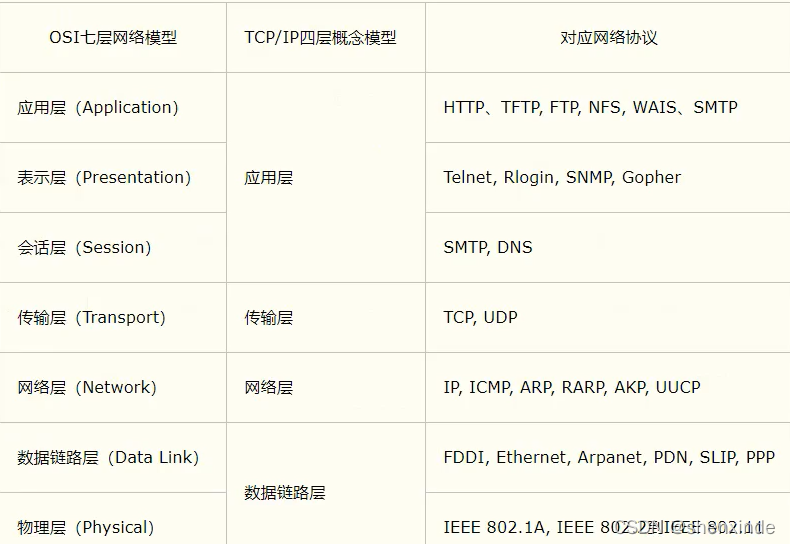
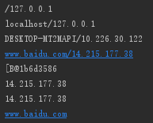
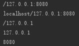
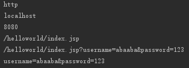
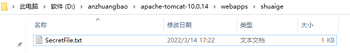
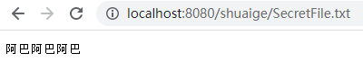
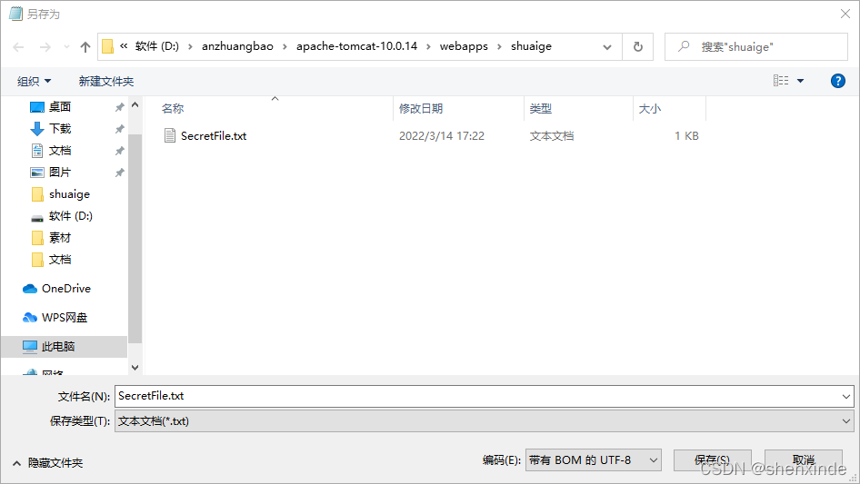
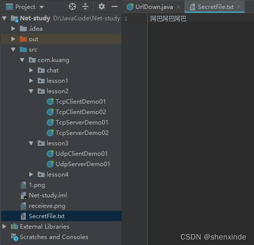

####  1、概述

- 计算机网络：
  计算机网络是指将地理位置不同的具有独立功能的多台计算机及其外部设备，通过通信线路连接起来，在网络操作系统，网络管理软件及网络通信协议的管理和协调下，实现资源共享和信息传递的计算机系统。
- 网络编程的目的：
  无线电台。传播交流信息。数据交换。通信
- 想要达到这个效果需要什么：
  - 1.如何准确地定位网络上的一台主机 192.168.16.124：端口，定位到这个计算机上的某个资源
  - 2.找到了这个主机，如何传输数据呢？
    Javaweb：网页编程 B/S
    网络编程：TCP/IP C/S

#### 2、网络通信要素

- 如何实现网络的通信？
- 通信双方的地址：
  - ip
  - 端口号
  - 192.168.16.124：5900
- 规则：网络通信的协议
- TCP/IP参考模型
  
- 小结：
- 1.网络编程中有两个主要的问题
  - 如何准确的定位到网络上的一台或者多台主机
  - 找到主机之后如何进行通信
- 2.网络编程中的要素
  - IP和端口号 IP
  - 网络通信协议 UDP、TCP
- 3.万物皆对象

#### 3、IP地址

IP地址在 Java.Inet.Address类中

- 唯一定位一台网络上的计算机
- 本机 127.0.0.1：localhost
- IP地址的分类：
  - ipv4 / ipv6
  - 公网-私网
- 域名：记忆IP问题
  - IP：www.vip.com

```java
package com.kuang.lesson1;

import java.net.InetAddress;
import java.net.UnknownHostException;

//测试IP
public class TestInetAddress {
    public static void main(String[] args) {
        try {
            //查询本机地址
            InetAddress inetAddress1 = InetAddress.getByName("127.0.0.1");
            System.out.println(inetAddress1);
            InetAddress inetAddress3 = InetAddress.getByName("localhost");
            System.out.println(inetAddress3);
            InetAddress inetAddress4 = InetAddress.getLocalHost();
            System.out.println(inetAddress4);

            //查询网站ip地址
            InetAddress inetAddress2 = InetAddress.getByName("www.baidu.com");  //www.baidu.com/14.215.177.38
            System.out.println(inetAddress2);

            //常用方法
//            System.out.println(inetAddress2.getAddress());
            System.out.println(inetAddress2.getCanonicalHostName());    //规范的名字
            System.out.println(inetAddress2.getHostAddress());  //ip
            System.out.println(inetAddress2.getHostName()); //域名，或者自己电脑的名字
        } catch (UnknownHostException e) {
            e.printStackTrace();
        }
    }
}
```

- 运行结果
  

#### 4、端口

端口表示计算机上的一个程序的进程：

- 不同的进程有不同的端口号，用来区分软件！
- 被规定 0~65535
- TCP，UDP 每个协议都有65535。单个协议下，端口号不能冲突
- 端口分类：
  - 公有端口 0 ~ 1023：
    - HTTP：80
    - HTTPS：443
    - FTP：21
    - Telent：23
  - 程序注册端口：1024 ~ 49151，分配用户或者程序
    - Tomcat：8080
    - MySql：3306
    - Oracle：1521

```bash
netstat -ano	#查看所有端口
netstat -ano|findstr "5900"	#查看指定的端口
tasklist|findstr "8696"	#查看指定端口的进程
package com.kuang.lesson1;

import java.net.InetSocketAddress;

public class TestInetSocketAddress {
    public static void main(String[] args) {
        InetSocketAddress socketAddress = new InetSocketAddress("127.0.0.1", 8080);
        InetSocketAddress socketAddress2 = new InetSocketAddress("localhost", 8080);
        System.out.println(socketAddress);
        System.out.println(socketAddress2);

        System.out.println(socketAddress.getAddress());
        System.out.println(socketAddress.getHostName());    //地址
        System.out.println(socketAddress.getPort());    //端口

    }
}
```

- 运行结果：
  

#### 1.5、通信协议

- 网络通信协议：速率，传输码率，代码结构，传输控制…
- 问题非常复杂：分层！大事化小
- TCP/IP协议簇：实际上是一组协议
  - TCP：用户传输协议
  - UDP：用户数据报协议
- IP：网络互连协议

#### 6、TCP 实现聊天

- 客户端
  - 1.连接服务器 Socket
  - 2.发送消息

```java
package com.kuang.lesson2;

import java.io.IOException;
import java.io.OutputStream;
import java.net.InetAddress;
import java.net.Socket;
import java.net.UnknownHostException;

public class TcpClientDemo01 {
    public static void main(String[] args) {
        Socket socket = null;
        OutputStream os = null;

        try {
            //1.要知道服务器的地址,端口号
            InetAddress serverIP = InetAddress.getByName("127.0.0.1");
            int port = 9999;
            //2.创建一个socket链接
            socket = new Socket(serverIP, port);
            //3.发送消息    IO流
            os = socket.getOutputStream();
            os.write("你好你好".getBytes());
        } catch (Exception e) {
            e.printStackTrace();
        } finally {
            try {
                os.close();
                socket.close();
            } catch (IOException e) {
                e.printStackTrace();
            }
        }

    }
}
```

- 服务端
  - 1.建立服务的端口 ServerSocket
  - 2.等待用户的链接 accept
  - 3.接收用户的消息

```java
package com.kuang.lesson2;

import java.io.ByteArrayOutputStream;
import java.io.IOException;
import java.io.InputStream;
import java.net.ServerSocket;
import java.net.Socket;

public class TcpServerDemo01 {
    public static void main(String[] args) {
        ServerSocket serverSocket = null;
        Socket socket = null;
        InputStream is = null;
        ByteArrayOutputStream baos = null;

        try {
            //1.我得有一个地址
            serverSocket = new ServerSocket(9999);

            while (true){
                //2.等待客户端链接过来
                socket = serverSocket.accept();
                //3.读取客户端的消息
                is = socket.getInputStream();

                //管道流
                baos = new ByteArrayOutputStream();
                byte[] buffer = new byte[1024];
                int len;
                while((len = is.read(buffer)) != -1){
                    baos.write(buffer, 0, len);
                }
                System.out.println(baos.toString());
            }


        } catch (IOException e) {
            e.printStackTrace();
        } finally {
            //关闭资源
            try {
                baos.close();
                is.close();
                socket.close();
                serverSocket.close();
            } catch (IOException e) {
                e.printStackTrace();
            }
        }

    }
}
```

#### 7、TCP 发送文件

- 客户端

```java
package com.kuang.lesson2;

import java.io.*;
import java.net.InetAddress;
import java.net.Socket;

public class TcpClientDemo02 {
    public static void main(String[] args) throws Exception{
        Socket socket = null;
        //1.创建一个Socket连接
        InetAddress serverIP = InetAddress.getByName("127.0.0.1");
        int port = 9000;
        socket = new Socket(serverIP, port);
        //2.创建一个输出流
        OutputStream os = socket.getOutputStream();
        //3.读取文件
        FileInputStream fis = new FileInputStream(new File("1.png"));
        //4.写出文件
        byte[] buffer = new byte[1024];
        int len;
        while((len=fis.read(buffer)) != -1){
            os.write(buffer, 0, len);   //写入0到len长度的内容
        }

        //通知服务器，我已经发送完毕
        socket.shutdownOutput();

        //确定服务器接收完毕，才能够断开连接
        InputStream inputStream = socket.getInputStream();
        ByteArrayOutputStream baos = new ByteArrayOutputStream();

        byte[] buffer2 = new byte[1024];
        int len2;
        while((len2 = inputStream.read(buffer2)) != -1){
            baos.write(buffer2, 0, len2);
        }

        System.out.println(baos.toString());

        //5.关闭资源
        baos.close();
        inputStream.close();
        fis.close();
        os.close();
        socket.close();
    }
}
```

- 服务端

```java
package com.kuang.lesson2;

import java.io.*;
import java.net.ServerSocket;
import java.net.Socket;

public class TcpServerDemo02 {
    public static void main(String[] args) throws Exception{
        //1.创建服务
        ServerSocket serverSocket = new ServerSocket(9000);
        //2.监听客户端的链接
        Socket socket = serverSocket.accept();  //阻塞式监听，会一直等待用户连接
        //3.获取输入流
        InputStream is = socket.getInputStream();
        //4.文件输出
        FileOutputStream fos = new FileOutputStream(new File(("receieve.png")));
        byte[] buffer = new byte[1024];
        int len;
        while((len=is.read(buffer)) != -1){
            fos.write(buffer, 0, len);
        }

        //通知客户端我接收完毕了
        OutputStream os = socket.getOutputStream();
        os.write("我接收完毕了，你可以断开了".getBytes());

        try {
            //关闭资源
            fos.close();
            is.close();
            socket.close();
            serverSocket.close();
        } catch (IOException e) {
            e.printStackTrace();
        }
    }
}
```

#### 8、初识 tomcat

- 服务端
  - 自定义 S
  - Tomcat服务器 S：Java后台开发！
- 客户端
  - 自定义 C
  - 浏览器 B

#### 9、UDP

##### 发送消息

- 发送端

```java
package com.kuang.lesson3;

import java.net.DatagramPacket;
import java.net.DatagramSocket;
import java.net.InetAddress;

//不需要连接服务器
public class UdpClientDemo01 {
    public static void main(String[] args) throws Exception{
        //1.建立一个Socket
        DatagramSocket socket = new DatagramSocket();

        //2.建立个包
        String msg = "你好啊，服务器";
        //发送给谁
        InetAddress localhost = InetAddress.getByName("localhost");
        int port = 9090;
        //数据，数据的长度起始，要发送给谁
        DatagramPacket packet = new DatagramPacket(msg.getBytes(), 0, msg.getBytes().length, localhost, port);

        //3.发送包
        socket.send(packet);

        //4.关闭流
        socket.close();
    }
}
```

- 接收端

```java
package com.kuang.lesson3;

import java.net.DatagramPacket;
import java.net.DatagramSocket;

//还是要等待客户端的连接
public class UdpServerDemo01 {
    public static void main(String[] args) throws Exception{
        //开放端口
        DatagramSocket socket = new DatagramSocket(9090);
        //接收数据包
        byte[] buffer = new byte[1024];
        DatagramPacket packet = new DatagramPacket(buffer, 0, buffer.length);

        socket.receive(packet); //阻塞接收

        System.out.println(packet.getAddress().getHostAddress());
        System.out.println(new String(packet.getData(), 0, packet.getLength()));

        //关闭连接
        socket.close();
    }
}
```

##### 聊天实现-循环发送

- 发送端

```java
package com.kuang.chat;

import java.io.BufferedReader;
import java.io.InputStreamReader;
import java.net.DatagramPacket;
import java.net.DatagramSocket;
import java.net.InetSocketAddress;

public class UdpSenderDemo01 {
    public static void main(String[] args) throws Exception{
        DatagramSocket socket = new DatagramSocket(8888);

        //准备数据：控制台读取 System.in
        BufferedReader reader = new BufferedReader(new InputStreamReader(System.in));

        while (true){
            String data = reader.readLine();
            byte[] datas = data.getBytes();
            DatagramPacket packet = new DatagramPacket(datas, 0, datas.length, new InetSocketAddress("localhost", 6666));

            socket.send(packet);
            if(data.equals("bye")){
                break;
            }
        }


        socket.close();
    }
}
```

- 接收方

```java
package com.kuang.chat;

import java.net.DatagramPacket;
import java.net.DatagramSocket;

public class UdpReceiveDemo01 {
    public static void main(String[] args) throws Exception{
        DatagramSocket socket = new DatagramSocket(6666);

        while(true){
            //准备接收包裹
            byte[] container = new byte[1024];
            DatagramPacket packet = new DatagramPacket(container, 0, container.length);
            socket.receive(packet);

            //断开连接 bye
            byte[] data = packet.getData();
            String receiveData = new String(data, 0, data.length);

            System.out.println(receiveData);

            if(receiveData.equals("bye")){
                break;
            }
        }

        socket.close();
    }
}
```

##### 在线互相聊天：都可以发和收

- 接收端

```java
package com.kuang.chat;

import java.io.IOException;
import java.net.DatagramPacket;
import java.net.DatagramSocket;
import java.net.SocketException;

public class TalkReceive implements Runnable{

    DatagramSocket socket = null;
    private int port;
    private String msgFrom;

    public TalkReceive(int port, String msgFrom){
        this.port = port;
        this.msgFrom = msgFrom;
        try {
            socket = new DatagramSocket(port);
        } catch (SocketException e) {
            e.printStackTrace();
        }
    }

    @Override
    public void run() {

        while(true){
            try {
                //准备接收包裹
                byte[] container = new byte[1024];
                DatagramPacket packet = new DatagramPacket(container, 0, container.length);
                socket.receive(packet);

                //断开连接 bye
                byte[] data = packet.getData();
                String receiveData = new String(data, 0, data.length);

                System.out.println(msgFrom + "：" + receiveData);

                if(receiveData.equals("bye")){
                    break;
                }
            } catch (IOException e) {
                e.printStackTrace();
            }
        }

        socket.close();
    }
}
```

- 发送端

```java
package com.kuang.chat;

import java.io.BufferedReader;
import java.io.IOException;
import java.io.InputStreamReader;
import java.net.DatagramPacket;
import java.net.DatagramSocket;
import java.net.InetSocketAddress;
import java.net.SocketException;

public class Talksend implements Runnable{

    DatagramSocket socket = null;
    BufferedReader reader = null;   //BuffReader-输入流

    private int fromPort;
    private String toIP;
    private int toPort;

    public Talksend(int fromPort, String toIP, int toPort) {
        this.fromPort = fromPort;
        this.toIP = toIP;
        this.toPort = toPort;

        try {
            socket = new DatagramSocket(fromPort);
        } catch (SocketException e) {
            e.printStackTrace();
        }
    }

    @Override
    public void run() {
        while(true){
            try {
                reader = new BufferedReader(new InputStreamReader(System.in));
                String data = reader.readLine();
                byte[] datas = data.getBytes();
                DatagramPacket packet = new DatagramPacket(datas, 0, datas.length, new InetSocketAddress(this.toIP, this.toPort));

                socket.send(packet);
                if (data.equals("bye")){
                    break;
                }
            } catch (IOException e) {
                e.printStackTrace();
            }
        }

        socket.close();
    }
}
```

- 学生端

```java
package com.kuang.chat;

public class TalkStudent {
    public static void main(String[] args) {
        //开启两个线程
        new Thread(new Talksend(7777, "localhost", 9999)).start();
        new Thread(new TalkReceive(8888, "老师")).start();
    }
}
```

- 老师端

```java
package com.kuang.chat;

public class TalkTeacher {
    public static void main(String[] args) {
        new Thread(new Talksend(5555, "localhost", 8888)).start();
        new Thread(new TalkReceive(9999, "学生")).start();
    }
}
```

#### 10、URL

https://www.baidu.com/
统一资源定位符：定位资源的，定位互联网上的某一个资源

> 协议://ip地址:端口/项目名/资源

- 示例

```java
package com.kuang.lesson4;

import java.net.MalformedURLException;
import java.net.URL;

public class URLDemo01 {
    public static void main(String[] args) throws MalformedURLException {
        URL url = new URL("http://localhost:8080/helloworld/index.jsp?username=abaaba&password=123");
        System.out.println(url.getProtocol());  //协议
        System.out.println(url.getHost());  //主机ip
        System.out.println(url.getPort());  //端口
        System.out.println(url.getPath());  //文件地址
        System.out.println(url.getFile());  //文件全路径
        System.out.println(url.getQuery()); //参数
    }
}
```

- 运行结果
  
- 使用 url 下载网络资源

```java
package com.kuang.lesson4;

import java.io.FileOutputStream;
import java.io.InputStream;
import java.net.HttpURLConnection;
import java.net.URL;

public class UrlDown {
    public static void main(String[] args) throws Exception{
        //1.下载地址
        URL url = new URL("http://localhost:8080/shuaige/SecretFile.txt");

        //2.连接到这个资源 HTTP
        HttpURLConnection urlConnection = (HttpURLConnection) url.openConnection();

        InputStream inputStream = urlConnection.getInputStream();

        FileOutputStream fos = new FileOutputStream("SecretFile.txt");

        byte[] buffer = new byte[1024];
        int len;
        while((len=inputStream.read(buffer))!=-1){
            fos.write(buffer, 0, len);  //写出这个数据
        }

        fos.close();
        inputStream.close();
        urlConnection.disconnect(); //断开连接

    }
}
```

- 第一步：先在 tomcat 的对应路径下创建一个文件，如下图所示
  
- 第二步：在浏览器中输入：协议://ip地址:端口/项目名/资源
- 注意：若网页显示为乱码，需对文本进行修改格式，点另存为然后改成下图的样式。
  
- 第三步：跑程序，然后可以看到在 Net-study 目录下出现文件
  


