### 按要求生成README.md与_sidebar.md

#### 1.Paths.get()

Paths类获取文件或文件目录路径可以使用采用多个字符串形式，也可以使用`Path.get(D:\\url1\\url2)`这种形式。
返回的Path对象完全可以代替File类用于文件IO操作。

**Path对象的常用处理方式如下**：

```Java
//以docs/study作为Path对象 (与Path p = Paths.get("docs", "study") 代码效果相同)
Path p = Paths.get("docs/study"); 
//对应的路径
System.out.println("p对象的对应路径：" + p);  // p对象的对应路径：docs\study
//路径数量是以路径名的数量作为标准
System.out.println("p路径数量：" + p.getNameCount());  // p路径数量：2
//获取绝对路径
System.out.println("p绝对路径:"+p.toAbsolutePath());//p绝对路径:D:\学习文件\自学\项目\docsify-auto-generate\docs\study
//获取父路径
System.out.println("p父路径："  + p.getParent()); // p父路径：docs
//获取p2对象的文件名或者文件目录名
System.out.println(p.getFileName()); // study
//通过Path对象返回一个分隔符对象
Spliterator<Path> split = p.spliterator();
```

#### 2.Files类的方法

##### Files.walk()

`Files.walk()`方法通过递归遍历**以给定起始文件为根的文件树**来返回由Path延迟填充的流，且文件树是基于深度优先遍历。
该方法可用于千万级文件数量下高性能深度遍历。

通过以下代码查看`Files.walk()`返回的结果是什么：

```java
package com.newfbin;

import java.io.IOException;
import java.nio.file.Files;
import java.nio.file.Path;
import java.nio.file.Paths;
import java.util.stream.Stream;

public class Test {
    private static final String ROOT = "docs";
    private static final String STUDY_ROOT = ROOT + "/study";
    public static void main(String[] args) throws IOException {
 		//通过遍历paths查看Files.walk返回的结果
        try (Stream<Path> paths = Files.walk(Paths.get(STUDY_ROOT))){
            paths.forEach(System.out::println);
        }
    }
}
```

通过结果可以看到`Files.walk()`的输出结果为：

以传入的`Path`对象引用的路径为根，通过在根后拼接遍历到的路径得到新路径，并返回一个引用了新路径的`Path`对象。

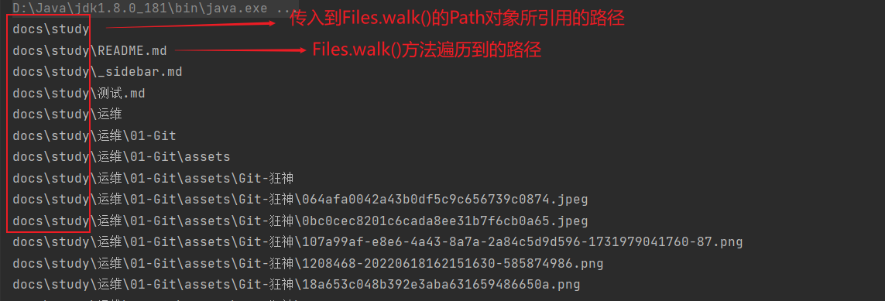

##### Files.list()

`Files.list()`用于列出指定目录下的所有直接子项（文件和子目录、不递归），返回一个 `Stream<Path>`。

**使用示例**：

```java
package com.newfbin;

import java.io.IOException;
import java.nio.file.Files;
import java.nio.file.Path;
import java.nio.file.Paths;
import java.util.stream.Stream;

public class Test {
    private static final String ROOT = "docs";
    private static final String STUDY_ROOT = ROOT + "/study";
    public static void main(String[] args) throws IOException {
        //获取docs/study目录下的所有直接子项，并打印
        try (Stream<Path> paths = Files.list(Paths.get(STUDY_ROOT))){
            paths.forEach(System.out::println);
        }
    }
}
```

`docs/study`下的结构如下图所示：

> 可以观察到直接子项有四个：运维、测试.md、_sidebar.md、README.md 

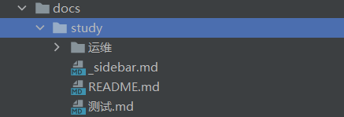

输出结果

> 与上图所示的结构对应

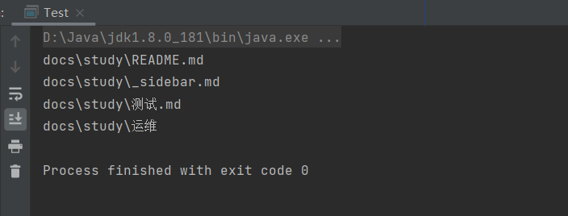

##### Files.write

> **支持多种数据类型**：
>
> - **字节数组（`byte[]`）**：用于写入二进制数据或已编码的文本。
> - **字符串集合（`List<String>`）**：用于按行写入文本文件。
>
> **可控制写入模式**：
>
> - **覆盖**（默认行为）
> - **追加**（使用 `StandardOpenOption.APPEND`）
> - **创建新文件**（使用 `StandardOpenOption.CREATE_NEW`）
> - 查看`StandardOpenOption`了解更多写入模式...
>
> **自动管理资源**：不需要手动关闭流，简化代码。
>
> **适用场景**：
>
> - **快速写入小型文本或二进制文件**（例如配置文件、日志、简单数据）。
> - **替代 `FileWriter` 和 `BufferedWriter`**，减少冗余代码。
> - **写入二进制数据**（如图片、音频、视频文件）。
>
> 如果需要写入 **大文件**，建议使用 **流式写入**（如 `BufferedWriter`），以提高性能并减少内存占用。

**`Files.write`重载方法**：

```java
//重载1（本文代码所使用的方式）
public static Path write(Path path, byte[] bytes, OpenOption... options)
    throws IOException
//重载2
public static Path write(Path path, Iterable<? extends CharSequence> lines,
                             Charset cs, OpenOption... options)
        throws IOException
//重载3
public static Path write(Path path,
                             Iterable<? extends CharSequence> lines,
                             OpenOption... options)
        throws IOException
```

**重载1示例**：

```java
Path path = Paths.get("example.txt");
byte[] data = "Hello, World!".getBytes(StandardCharsets.UTF_8);
Files.write(path, data, StandardOpenOption.CREATE, StandardOpenOption.TRUNCATE_EXISTING);
```

#### 3.streamAPI

##### filter

**filter**：筛选，是按照一定的规则校验流中的元素，将符合条件的元素提取到新的流中的操作。

```java
//Predicate 断定型接口。传入一个参数T,返回值是boolean
Stream<T> filter(Predicate<? super T> predicate);
```

> **对filter方法的解释**：
>
> `filter`方法的参数是 `Predicate<T>`，由于`paths`的类型为`Stream<Path>`,所以`filter`方法的参数类型为`Predicate<Path>`。
>
> 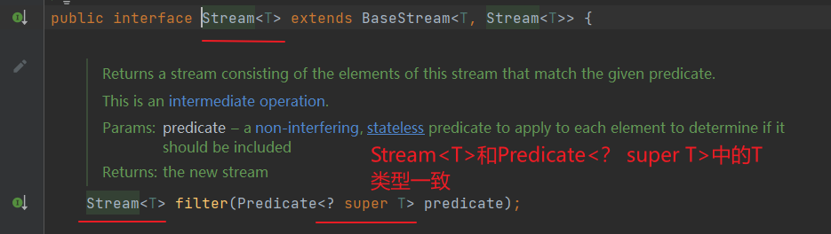
>
> `Predicate<T>` 是一个**函数式接口中的断定型接口**（**只包含一个抽象方法** `test(T t)`  ）
>
> 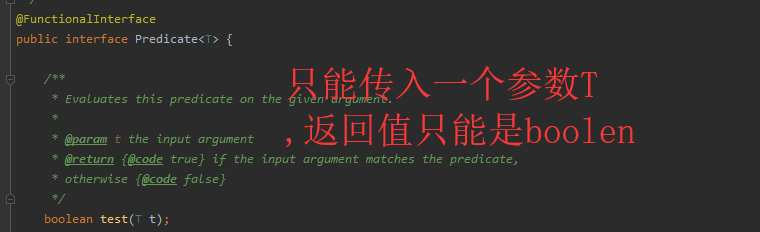
>
> 因此`filter` 需要一个 `Predicate<Path>`，即 `test(Path path): boolean` 这样的方法。
>
> `Files.isDirectory` 方法的定义如下：
>
> ```java
> public static boolean isDirectory(Path path, LinkOption... options)
> ```
>
> 它的参数 `Path path` **匹配** `Predicate<Path>` 的 `test(T t)` 方法的签名。
> `Files::isDirectory` 符合 `Predicate<Path>`，可以作为 `filter` 方法的参数
>
> **可以将`Files::isDirectory` 替换为Lambda表达式**:
>
> ```java
> paths.filter(path -> Files.isDirectory(path))
> ```
>
> `path -> Files.isDirectory(path)`更直观地实现了`Predicate<Path>`中的 `test(Path path): boolean`方式，即参数为`Path`，返回值为`boolean`。
> 这与 `Files::isDirectory` 等价，但更明确地展示了 `path` 作为参数传入。
>
> **`filter`方法中可以传入其它方法引用**：
>
> 假设你有一个自定义方法：
>
> ```java
> public static boolean isLargeFile(Path path) {
>     try {
>         return Files.size(path) > 1024 * 1024; // 文件大于 1MB
>     } catch (IOException e) {
>         return false;
>     }
> }
> ```
>
> 你可以传入 `YourClass::isLargeFile`：
>
> ```java
> paths.filter(YourClass::isLargeFile)
> ```
>
> 因为 `isLargeFile(Path path)` 返回 `boolean`，符合 `Predicate<Path>` 的要求。
>
> **`filter`方法中可以传入其它Lambda表达式**：
>
> 你可以传入任何符合 `Predicate<Path>` 的 Lambda 表达式，例如：
>
> ```java
> // 过滤出所有 .txt 文件
> paths.filter(path -> path.toString().endsWith(".txt"))
> // 过滤掉隐藏文件
> paths.filter(path -> !path.getFileName().toString().startsWith("."))
> ```

`filter`方法流程解析图如下：

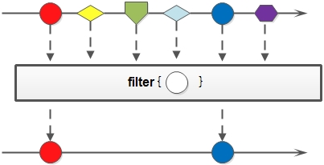

`filter`方法使用举例：

```java
public static void main(String[] args) {
    List<Integer> list = Arrays.asList(6, 7, 3, 8, 1, 2);
    Stream<Integer> stream = list.stream();
    stream.filter(x -> x > 5).forEach(System.out::println);
}
//结果如下：
6
7
8
```

##### forEach

**forEach**：该方法接收一个Lambda表达式，然后在Stream的每一个元素上执行该表达式

可以理解为我们平时使用的for循环，但是较于for循环，又略有不同！咱们待会再讲。

```java
void forEach(Consumer<? super T> action);
```

> **对forEach方法的解释**：
>
> `forEach`方法的参数是 `Consumer<T>`，由于`paths`的类型为`Stream<Path>`,所以`forEach`方法的参数类型为`Consumer<Path>`。
>
> 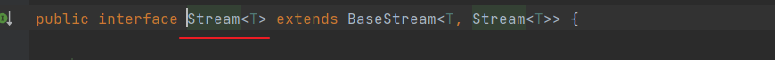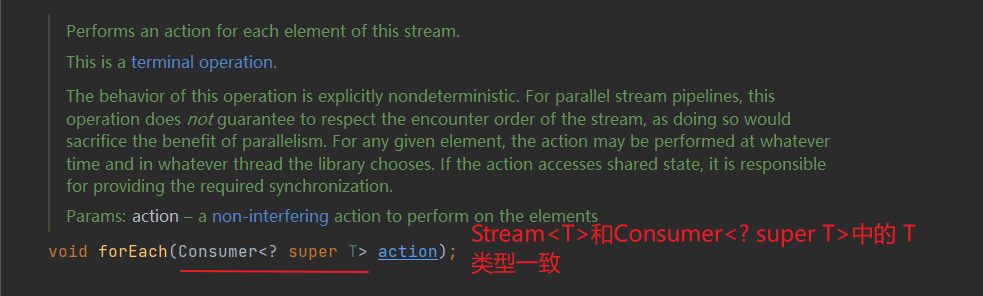
>
> `Consumer<T>` 是一个**函数式接口**（**只包含一个抽象方法** `accept(T t)`  ）
>
> 
>
> 因此`forEach` 需要一个 `Consumer<Path>`，即 `accept(Path path): void` 这样的方法。
>
> `forEach`内的 lambda表达式符合 `Consumer<Path>`中的 `accept(Path path): void` ，即传入的参数为`Path`，没有返回值。
> 因此该lambda表达式可以作为 `Consumer<Path>`中的 `accept(Path path): void` 的具体实现

`filter`方法流程解析图如下：


`forEach`方法使用举例：

```java
List<String> strAry = Arrays.asList( "Jhonny", "David", "Jack", "Duke", "Jill","Dany","Julia","Jenish","Divya");

strAry.stream().forEach(s-> {
            if("Jack".equalsIgnoreCase(s)) System.out.println(s);
        });

//输出
Jack
```

那如果我们把 "Jack"用在循环外部用一个变量接收，如下操作：

```java
String name = "Jack";
strAry.stream().forEach(s-> {
    if(name.equalsIgnoreCase(s)) name = "Jackson";
});
```

那么此时编辑器则会爆红，	

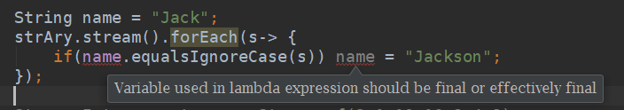

因为lambda中，使用的外部变量必须是最终的，不可f变的，所以如果我们想要对其进行修改，那是不可能的！如果必须这么使用，可以将外部变量，移至表达式之中使用才行！

##### sorted

- sorted：返回由该流的元素组成的流，并根据自然顺序排序

该接口有两种形式：无参和有参数，如：

```java
Stream<T> sorted();

Stream<T> sorted(Comparator<? super T> comparator);
```

区别其实就在于：**传入比较器的参数，可以自定义这个比较器，即自定义比较规则**。

##### comparing

**`comparing`方法源码**：

```java
public static <T, U extends Comparable<? super U>> Comparator<T> comparing(
        Function<? super T, ? extends U> keyExtractor)
{
    Objects.requireNonNull(keyExtractor);
    return (Comparator<T> & Serializable)
        (c1, c2) -> keyExtractor.apply(c1).compareTo(keyExtractor.apply(c2));
}
```

**`? super T, ? extends U` 的解释**：

`? super T`（通配符超类限定 `super`）：意味着 `Function` 的输入类型可以是 `T` 或 `T` 的某个 **父类型**。

`? extends U`（通配符子类限定 `extends`）：意味着 `Function` 的返回类型必须是 `U` 或 `U` 的某个 **子类型**。

**源码分析**：

`T = Path`（因为 调用`sorted`的变量`stream`为`Stream<Path>`类型，因此`sorted`的参数为`Comparator<Path>`类型，因此`comparing`方法的返回值也为`Comparator<Path>`类型。由此推断出`T = Path`）。

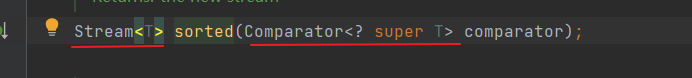

`U = String`（因为 `p.getFileName().toString()` 返回的是 `String`，而 `String` 实现了 `Comparable<String>`，符合 `U extends Comparable<? super U>` 的约束）。

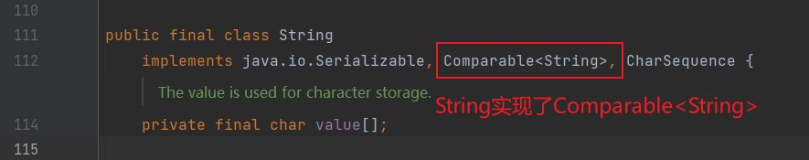

因此`comparing` 需要一个 `Function<Path, String>`，即 `apply(Path path): String` 这样的方法。


lambda表达式 `p -> p.getFileName().toString()`正好符合`apply(Path path): String` 方法，即参数为Path，返回值类型为String。

##### collect

- **collect：称为收集器，是一个终端操作,它接收的参数是将流中的元素累积到汇总结果的各种方式**。

```java
<R, A> R collect(Collector<? super T, A, R> collector); //第一种方式

<R> R collect(Supplier<R> supplier,
                  BiConsumer<R, ? super T> accumulator,
                  BiConsumer<R, R> combiner);  //第二种方式
```

**第一种方式**会比较经常使用到，也比较方便使用，现在先看一看里面常用的一些方法：

| 工厂方法                                                     | 返回类型           | 用于                                                         |
| ------------------------------------------------------------ | ------------------ | ------------------------------------------------------------ |
| **toList**                                                   | List               | 把流中所有元素收集到List中                                   |
| **示例:List**                                                |                    |                                                              |
| **toSet**                                                    | Set                | 把流中所有元素收集到Set中,删除重复项                         |
| **示例:Set**                                                 |                    |                                                              |
| **toCollection**                                             | Collection         | 把流中所有元素收集到给定的供应源创建的集合中                 |
| **示例:ArrayList**                                           |                    |                                                              |
| **Counting**                                                 | Long               | 计算流中元素个数                                             |
| **示例:Long count=Menu.getMenus.stream().collect(counting);** |                    |                                                              |
| **SummingInt**                                               | Integer            | 对流中元素的一个整数属性求和                                 |
| **示例:Integer count=Menu.getMenus.stream().collect(summingInt(Menu::getCalories));** |                    |                                                              |
| **averagingInt**                                             | Double             | 计算流中元素integer属性的平均值                              |
| **示例:Double averaging=Menu.getMenus.stream().collect(averagingInt(Menu::getCalories));** |                    |                                                              |
| **Joining**                                                  | String             | 连接流中每个元素的toString方法生成的字符串                   |
| **示例:String name=Menu.getMenus.stream().map(Menu::getName).collect(joining(“, ”));** |                    |                                                              |
| **maxBy**                                                    | Optional           | 一个包裹了流中按照给定比较器选出的最大元素的optional 如果为空返回的是Optional.empty() |
| **示例:Optional**                                            |                    |                                                              |
| **minBy**                                                    | Optional           | 一个包裹了流中按照给定比较器选出的最小元素的optional 如果为空返回的是Optional.empty() |
| **示例: Optional**                                           |                    |                                                              |
| **Reducing**                                                 | 归约操作产生的类型 | 从一个作为累加器的初始值开始,利用binaryOperator与流中的元素逐个结合,从而将流归约为单个值 |
| **示例:int count=Menu.getMenus.stream().collect(reducing(0,Menu::getCalories,Integer::sum));** |                    |                                                              |
| **collectingAndThen**                                        | 转换函数返回的类型 | 包裹另一个转换器,对其结果应用转换函数                        |
| **示例:Int count=Menu.getMenus.stream().collect(collectingAndThen(toList(),List::size));** |                    |                                                              |
| **groupingBy**                                               | Map<K,List>        | 根据流中元素的某个值对流中的元素进行分组,并将属性值做为结果map的键 |
| **示例:Map<Type,List**                                       |                    |                                                              |
| **partitioningBy**                                           | Map<Boolean,List>  | 根据流中每个元素应用谓语的结果来对项目进行分区               |
| **示例:Map<Boolean,List**                                    |                    |                                                              |

#### 4.Files::isDirectory--方法引用

方法引用就是把方法当做参数传到stream内部，使stream的每个元素都传入到该方法里面执行一下。

使用方法：

> 类名::方法名

例如

```java
表达式:
person -> person.getAge();
可以替换成
Person::getAge

表达式:
() -> new HashMap<>();
可以替换成
HashMap::new
```

因为`isDirectory`是Files类中的静态方法，所以可以从Lambda表达式简化为方法引用

#### 5.Path类的方法

##### relativize

> `Path.relativize(Path other)` 方法用于计算 **当前路径** (`this`) 到 **目标路径** (`other`) 之间的相对路径。
>
> - **适用于同一根目录下的路径**。
> - **如果路径层级不同，则会抛出异常**（例如，一个是绝对路径，一个是相对路径）。
> - **不会检查文件是否实际存在**，只是纯粹的路径计算。

**（1）计算相对路径**:

```java
import java.nio.file.*;

public class RelativizeExample {
    public static void main(String[] args) {
        Path path1 = Paths.get("/home/user/docs");
        Path path2 = Paths.get("/home/user/music");

        Path relativePath = path1.relativize(path2);
        System.out.println("相对路径: " + relativePath);
    }
}
```

🔹 **输出**：

```bash
相对路径: ../music
```

🔹 **解析**：

- `path1 = /home/user/docs ` 
- `path2 = /home/user/music` 
- `relativize` 计算 `docs` 到 `music` 目录的相对路径为 `../music`。

**（2）路径层级差异**

```java
Path path1 = Paths.get("/home/user/docs");
Path path2 = Paths.get("/home/user/docs/reports/2024");

Path relativePath = path1.relativize(path2);
System.out.println(relativePath);
```

🔹 **输出**：

```bash
reports/2024
```

🔹 **解析**：

- `path1 = /home/user/docs`
- `path2 = /home/user/docs/reports/2024`
- `relativize` 计算 `docs` 到 `reports/2024` 的相对路径，即 `reports/2024`。

#### 代码

```java
package com.newfbin;

import java.io.IOException;
import java.nio.charset.StandardCharsets;
import java.nio.file.Files;
import java.nio.file.Path;
import java.nio.file.Paths;
import java.util.Comparator;
import java.util.List;
import java.util.stream.Collectors;
import java.util.stream.Stream;

public class DocsGenerator {
    private static final String ROOT = "docs";
    private static final String STUDY_ROOT = ROOT + "/study";

    public static void main(String[] args) throws IOException {
        generateStudyDocs();
    }

    private static void generateStudyDocs() throws IOException {
        // 1 Paths.get() 、2 Files.walk() 
        try (Stream<Path> paths = Files.walk(Paths.get(STUDY_ROOT))) {
            // 3 filter 、4 Files::isDirectory 
            paths.filter(Files::isDirectory)
                    .forEach(dir -> {
                        try {
                            if (shouldSkip(dir)) return;
                            if (isStudyRoot(dir)) {
                                generateStudyRootReadme(dir);
                                generateStudyRootSidebar(dir);
                            } else {
                                generateStudyReadme(dir);
                                generateStudySidebar(dir);
                            }
                        } catch (IOException e) {
                            e.printStackTrace();
                        }
                    });
        }
    }

    private static boolean isStudyRoot(Path dir) {
        return dir.equals(Paths.get(STUDY_ROOT));
    }

    private static void generateStudyRootReadme(Path dir) throws IOException {
        List<Path> items = getStudyRootItems();
        String itemsContent = items.stream()
                .map(item -> {
                    if (Files.isDirectory(item)) {
                        return "*  [" + item.getFileName().toString() + "](/study/" + item.getFileName().toString() + "/README)";
                    } else {
                        String fileName = item.getFileName().toString().replace(".md", "");
                        return "*  [" + fileName + "](/study/" + fileName + ")";
                    }
                })
                .collect(Collectors.joining("\n"));
        String content = "#  导读\n\n> [newfbin的学习笔记](https://newfbin.github.io/learning-notes/) ==> https://newfbin.github.io/learning-notes/\n\n" +
                "该项目用于记录个人学习笔记，有部分内容来自图书、博客、论坛等。\n\n" +
                "如有**侵权**等问题，请联系fubinniu@gmail.com，本人会第一时间删除相关内容。\n\n## 目录\n\n" +
                itemsContent;
        writeFile(dir.resolve("README.md"), content);
    }

    private static void generateStudyRootSidebar(Path dir) throws IOException {
        List<Path> items = getStudyRootItems();
        String itemsContent = items.stream()
                .map(item -> {
                    if (Files.isDirectory(item)) {
                        return "  * [**" + item.getFileName().toString() + "**](/study/" + item.getFileName().toString() + "/README)";
                    } else {
                        String fileName = item.getFileName().toString().replace(".md", "");
                        return "  * [**" + fileName + "**](/study/" + fileName + ")";
                    }
                })
                .collect(Collectors.joining("\n"));
        String content = "* 导读\n" + itemsContent + "\n  * 持续更新中...";
        writeFile(dir.resolve("_sidebar.md"), content);
    }

    private static void generateStudyReadme(Path dir) throws IOException {
        String title = dir.getFileName().toString();
        String content = "#  " + title + "\n\n## 目录\n\n" +
                getDirectoryItems(dir).stream()
                        .map(item -> formatLink(dir, item))
                        .collect(Collectors.joining("\n"));
        writeFile(dir.resolve("README.md"), content);
    }

    private static void generateStudySidebar(Path dir) throws IOException {
        Path relativePath = Paths.get(STUDY_ROOT).relativize(dir);
        String parentLink = relativePath.getParent() != null ?
                "  * [⬆️（返回）](/study/" + relativePath.getParent() + "/README)\n" : "";

        String content = "* **目录**\n" +
                "  * [🏠（起点）](/study/README)\n" +
                parentLink +
                getDirectoryItems(dir).stream()
                        .map(item -> formatLink(dir, item))
                        .collect(Collectors.joining("\n"));
        writeFile(dir.resolve("_sidebar.md"), content);
    }

    private static List<Path> getStudyRootItems() throws IOException {
        // 2 Files.list()
        try (Stream<Path> stream = Files.list(Paths.get(STUDY_ROOT))) {
            return stream.filter(path -> !isSpecialFile(path))
                	//3 sorted、comparing
                    .sorted(Comparator.comparing(p -> p.getFileName().toString()))
                	//3 collect
                    .collect(Collectors.toList());
        }
    }

    private static List<Path> getDirectoryItems(Path dir) throws IOException {
        try (Stream<Path> stream = Files.list(dir)) {
            return stream.filter(path -> !isSpecialFile(path))
                    .sorted(Comparator.comparing(p -> p.getFileName().toString()))
                    .collect(Collectors.toList());
        }
    }

    private static String formatLink(Path dir, Path item) {
        String name = item.getFileName().toString().replace(".md", "");
        //
        String relativePath = Paths.get(STUDY_ROOT).relativize(item).toString().replace("\\", "/");
        String link = Files.isDirectory(item) ? "/study/" + relativePath + "/README" : "/study/" + relativePath.replace(".md", "");
        return String.format("  * [%s](%s)", name, link);
    }

    private static boolean shouldSkip(Path path) {
        return path.getFileName().toString().startsWith(".") ||
                path.toString().contains("assets") ||
                path.toString().contains("media");
    }

    private static boolean isSpecialFile(Path path) {
        String fileName = path.getFileName().toString();
        boolean isSpecial = fileName.equals("README.md") ||
                fileName.equals("_sidebar.md") ||
                fileName.startsWith(".") ||
                (Files.isDirectory(path) && (fileName.contains("assets") || fileName.contains("media")));

        if (!Files.isDirectory(path) && !fileName.toLowerCase().endsWith(".md")) {
            isSpecial = true;
        }
        return isSpecial;
    }

    private static void writeFile(Path path, String content) throws IOException {
        // 2 Files.write
        Files.write(path, content.getBytes(StandardCharsets.UTF_8));
    }
}
```

### 删除assets文件夹下.md文档

#### 1.File类的方法

##### listFiles & list

list()方法是返回某个目录下的所有文件和目录的文件名，返回的是String数组

listFiles()方法是返回某个目录下所有文件和目录的绝对路径，返回的是File数组

**测试：**

```java
public class FileTest {

	public static void main(String[] args) {
		
		//创建File对象
		File file = new File("D:\\Android");
		//获取该目录下的所有文件
		String[] files = file.list();
		
		for (String f : files){
			System.out.println(f);
		}
		
		//listFiles是获取该目录下所有文件和目录的绝对路径
		File[] fs = file.listFiles();
		for (File f : fs){
			System.out.println(f);
		}
	}
}
```

通过list()方法获取的结果：

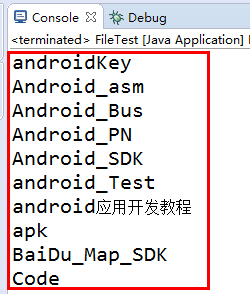

通过listFiles()方法获取的结果：

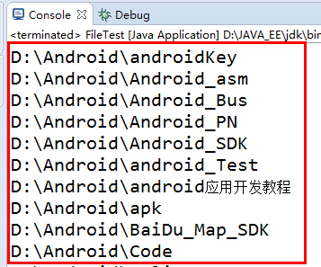

##### getName

`File.getName()` 用于提取路径中的纯文件名或末端目录名

**示例1：基础用法**:

```java
File file1 = new File("/home/user/docs/report.pdf");
System.out.println(file1.getName());  // 输出: report.pdf

File file2 = new File("C:\\Program Files\\Java\\jdk17");
System.out.println(file2.getName());  // 输出: jdk17
```

**示例2：目录和根目录**:

```java
File dir = new File("/tmp/logs/");
System.out.println(dir.getName());    // 输出: logs（忽略结尾的/）

File rootDir = new File("/");
System.out.println(rootDir.getName()); // 输出: （空字符串）
```

**示例3：相对路径**:

```java
File relFile = new File("../src/main/App.java");
System.out.println(relFile.getName());  // 输出: App.java
```

------

**注意事项**：

1. **跨平台路径构造**：

   - **推荐方式**：使用`File.separator`或直接写`/`（Java自动转换）

   ```java
   File crossPlat = new File("data" + File.separator + "config.xml");
   ```

2. **避免的误区**：

   - **获取全路径** → 误用`getName()`，应改用`getPath()`
   - **检查存在性** → `getName()`不验证文件是否存在

##### delete

`File.delete()`方法用于删除文件或空目录

使用示例：

```java
public class Test {
    public static void main(String[] args) {
        File file = new File("README.md");
        //执行完成后本地README.md文件被删除
        file.delete();
    }
}
```

#### 代码

```java
package com.newfbin;

import java.io.File;

public class DeleteMarkdownInAssets {
    public static void main(String[] args) {
        File currentDir = new File("."); // 当前路径
        findAndCleanAssets(currentDir);
    }

    public static void findAndCleanAssets(File dir) {
        if (dir == null || !dir.isDirectory()) {
            return;
        }
		
        //1、listFiles & list
        File[] files = dir.listFiles();
        if (files == null) {
            return;
        }

        for (File file : files) {
            if (file.isDirectory()) {
                //1、getName
                if (file.getName().equals("assets")) {
                    deleteMarkdownFiles(file);
                } else {
                    findAndCleanAssets(file); // 递归查找子目录
                }
            }
        }
    }

    public static void deleteMarkdownFiles(File assetsDir) {
        File[] files = assetsDir.listFiles();
        if (files == null) {
            return;
        }

        for (File file : files) {
            if (file.isDirectory()) {
                deleteMarkdownFiles(file); // 递归删除子目录中的 .md 文件
            } else if (file.getName().endsWith(".md")) {
                //1、getAbsolutePath
                System.out.println("Deleting: " + file.getAbsolutePath());
                //1、delete
                file.delete();
            }
        }
    }
}
```

### 按照正则表达式匹配并重命名文件名称

#### `File` 类关键方法

|         方法          |              作用               |         示例代码         |
| :-------------------: | :-----------------------------: | :----------------------: |
|      `exists()`       |      验证文件/目录是否存在      |    `rootDir.exists()`    |
|    `isDirectory()`    |         判断是否为目录          | `rootDir.isDirectory()`  |
|     `listFiles()`     |   获取目录下所有文件对象数组    | `directory.listFiles()`  |
|      `getName()`      |     获取文件名（含扩展名）      |     `file.getName()`     |
|     `getParent()`     |         获取父目录路径          |    `file.getParent()`    |
| `renameTo(File dest)` | 重命名/移动文件（返回操作状态） | `file.renameTo(newFile)` |

#### 正则表达式类（`Pattern` & `Matcher`）

|             类/方法             |            作用            |             示例代码              |
| :-----------------------------: | :------------------------: | :-------------------------------: |
| `Pattern.compile(String regex)` | 编译正则表达式为可重用模式 | `Pattern.compile("^water.*#...")` |
|  `matcher(CharSequence input)`  |       创建匹配器对象       |    `pattern.matcher(filename)`    |
|           `matches()`           |        全量匹配检测        |        `matcher.matches()`        |
|       `group(int group)`        |       获取捕获组内容       |        `matcher.group(1)`         |

#### 代码

```java
package com.newfbin;

import java.io.File;
import java.util.regex.Matcher;
import java.util.regex.Pattern;

public class ImageRenamer {
    // 正则表达式模式（可调整）
    private static final String REGEX = "^water.*?#(pic.*\\.png)$";
    // 目标目录路径（需修改）
    private static final String TARGET_DIR = "D:\\学习文件\\learning-notes\\docs\\study";

    // 统计计数器
    private static int totalFiles = 0;
    private static int renamedCount = 0;

    public static void main(String[] args) {
        File rootDir = new File(TARGET_DIR);

        if (!rootDir.exists() || !rootDir.isDirectory()) {
            System.err.println("无效目录: " + TARGET_DIR);
            return;
        }

        // 开始递归处理
        processDirectory(rootDir);

        System.out.printf("\n处理完成: 共扫描 %d 个文件，成功重命名 %d 个文件", totalFiles, renamedCount);
    }

    private static void processDirectory(File directory) {
        File[] files = directory.listFiles();
        if (files == null) return;

        Pattern pattern = Pattern.compile(REGEX);

        for (File file : files) {
            if (file.isDirectory()) {
                // 递归处理子目录
                processDirectory(file);
            } else {
                // 处理文件
                totalFiles++;
                renameFile(file, pattern);
            }
        }
    }

    private static void renameFile(File file, Pattern pattern) {
        String oldName = file.getName();
        Matcher matcher = pattern.matcher(oldName);

        if (matcher.matches()) {
            String newName = matcher.group(1);
            File newFile = new File(file.getParent(), newName); // 保持原目录

            if (file.renameTo(newFile)) {
                System.out.printf("重命名成功: [%s] -> [%s]\n",
                        file.getAbsolutePath(),
                        newFile.getAbsolutePath());
                renamedCount++;
            } else {
                System.err.printf("重命名失败: %s (可能权限不足或文件名冲突)\n",
                        file.getAbsolutePath());
            }
        }
    }
}
```

### 查找所有名称中含有某个字符的文件或文件夹

#### File类核心方法详解

|        方法         |             作用              |         代码示例          |
| :-----------------: | :---------------------------: | :-----------------------: |
| `File(String path)` |       创建文件/目录对象       | `new File("docs/study")`  |
|     `exists()`      |       验证路径是否存在        |   `directory.exists()`    |
|   `isDirectory()`   |        判断是否为目录         | `directory.isDirectory()` |
|    `listFiles()`    |  获取目录下所有文件和子目录   |     `dir.listFiles()`     |
|     `getName()`     | 获取文件/目录名称（不含路径） |     `file.getName()`      |
| `getAbsolutePath()` |       获取完整绝对路径        | `file.getAbsolutePath()`  |
|   `isDirectory()`   |  判断是否为目录（递归条件）   |   `file.isDirectory()`    |

#### 代码

```java
package com.newfbin;

import java.io.File;
import java.util.ArrayList;
import java.util.List;

public class SpecialCharacterFiles {
    // 存储包含特殊字符的路径
    private static List<String> specialFiles = new ArrayList<>();

    public static void main(String[] args) {
        String directoryPath = "docs/study";
        File directory = new File(directoryPath);

        if (directory.exists() && directory.isDirectory()) {
            traverseDirectory(directory);

            if (specialFiles.isEmpty()) {
                System.out.println("恭喜你，你的项目中不存在任何特殊字符");
            } else {
                System.out.println("补豪，下面这些文件或文件夹名称中含有特殊字符，请检查其中是否包含 #  ？ %   /   <   >   \"   '");
                specialFiles.forEach(System.out::println);
            }
        } else {
            System.out.println("被检查的目录不存在，请将脚本移动到docs/study文件夹下");
        }
    }

    private static void traverseDirectory(File directory) {
        File[] files = directory.listFiles();
        if (files != null) {
            for (File file : files) {
                // 检查当前文件/文件夹名称
                String fileName = file.getName();
                if (containsSpecialCharacters(fileName)) {
                    specialFiles.add(file.getAbsolutePath());
                }
                // 递归遍历子目录
                if (file.isDirectory()) {
                    traverseDirectory(file);
                }
            }
        }
    }

    private static boolean containsSpecialCharacters(String name) {
        String specialCharacters = "#?%/<>\"'"; // 包含英文?和转义后的"'
        for (int i = 0; i < name.length(); i++) {
            if (specialCharacters.indexOf(name.charAt(i)) != -1) {
                return true;
            }
        }
        return false;
    }
}
```

