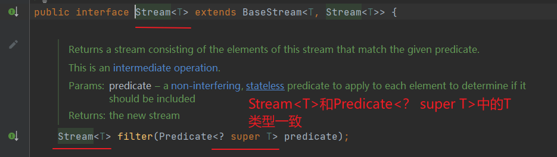
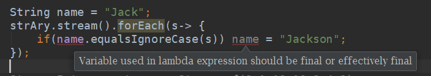

## 文件读写

### 向docsify项目中生成README.md与_sidebar.md

#### 1.Paths.get()

Paths类获取文件或文件目录路径可以使用采用多个字符串形式，也可以使用`Path.get(D:\\url1\\url2)`这种形式。
返回的Path对象完全可以代替File类用于文件IO操作。

**Path对象的常用处理方式如下**：

```Java
//以docs/study作为Path对象 (与Path p = Paths.get("docs", "study") 代码效果相同)
Path p = Paths.get("docs/study"); 
//对应的路径
System.out.println("p对象的对应路径：" + p);  // p对象的对应路径：docs\study
//路径数量是以路径名的数量作为标准
System.out.println("p路径数量：" + p.getNameCount());  // p路径数量：2
//获取绝对路径
System.out.println("p绝对路径:"+p.toAbsolutePath());//p绝对路径:D:\学习文件\自学\项目\docsify-auto-generate\docs\study
//获取父路径
System.out.println("p父路径："  + p.getParent()); // p父路径：docs
//获取p2对象的文件名或者文件目录名
System.out.println(p.getFileName()); // study
//通过Path对象返回一个分隔符对象
Spliterator<Path> split = p.spliterator();
```

#### 2.Files.walk()

`Files.walk()`方法通过递归遍历**以给定起始文件为根的文件树**来返回由Path延迟填充的流，且文件树是基于深度优先遍历。
该方法可用于千万级文件数量下高性能深度遍历。

#### 3.paths.filter().forEach()--streamAPI

##### filter

**filter**：筛选，是按照一定的规则校验流中的元素，将符合条件的元素提取到新的流中的操作。

```java
//Predicate 断定型接口。传入一个参数T,返回值是boolean
Stream<T> filter(Predicate<? super T> predicate);
```

> **对filter方法的解释**：
>
> `filter`方法的参数是 `Predicate<T>`，由于`paths`的类型为`Stream<Path>`,所以`filter`方法的参数类型为`Predicate<Path>`。
>
> 
>
> `Predicate<T>` 是一个**函数式接口**（**只包含一个抽象方法** `test(T t)`  ）
>
> 
>
> 因此`filter` 需要一个 `Predicate<Path>`，即 `test(Path path): boolean` 这样的方法。
>
> `Files.isDirectory` 方法的定义如下：
>
> ```java
> public static boolean isDirectory(Path path, LinkOption... options)
> ```
>
> 它的参数 `Path path` **匹配** `Predicate<Path>` 的 `test(T t)` 方法的签名。
> `Files::isDirectory` 符合 `Predicate<Path>`，可以作为 `filter` 方法的参数
>
> **可以将`Files::isDirectory` 替换为Lambda表达式**:
>
> ```java
> paths.filter(path -> Files.isDirectory(path))
> ```
>
> `path -> Files.isDirectory(path)`更直观地实现了`Predicate<Path>`中的 `test(Path path): boolean`方式，即参数为`Path`，返回值为`boolean`。
> 这与 `Files::isDirectory` 等价，但更明确地展示了 `path` 作为参数传入。
>
> **`filter`方法中可以传入其它方法引用**：
>
> 假设你有一个自定义方法：
>
> ```java
> public static boolean isLargeFile(Path path) {
>     try {
>         return Files.size(path) > 1024 * 1024; // 文件大于 1MB
>     } catch (IOException e) {
>         return false;
>     }
> }
> ```
>
> 你可以传入 `YourClass::isLargeFile`：
>
> ```java
> paths.filter(YourClass::isLargeFile)
> ```
>
> 因为 `isLargeFile(Path path)` 返回 `boolean`，符合 `Predicate<Path>` 的要求。
>
> **`filter`方法中可以传入其它Lambda表达式**：
>
> 你可以传入任何符合 `Predicate<Path>` 的 Lambda 表达式，例如：
>
> ```java
> // 过滤出所有 .txt 文件
> paths.filter(path -> path.toString().endsWith(".txt"))
> // 过滤掉隐藏文件
> paths.filter(path -> !path.getFileName().toString().startsWith("."))
> ```

流程解析图如下：


举个栗子：

```java
public static void main(String[] args) {
    List<Integer> list = Arrays.asList(6, 7, 3, 8, 1, 2);
    Stream<Integer> stream = list.stream();
    stream.filter(x -> x > 5).forEach(System.out::println);
}
//结果如下：
6
7
8
```

##### forEach

**forEach**：该方法接收一个Lambda表达式，然后在Stream的每一个元素上执行该表达式

可以理解为我们平时使用的for循环，但是较于for循环，又略有不同！咱们待会再讲。

```java
void forEach(Consumer<? super T> action);
```

> 对forEach方法的解释：
>
> 

举个栗子：

```java
List<String> strAry = Arrays.asList( "Jhonny", "David", "Jack", "Duke", "Jill","Dany","Julia","Jenish","Divya");

strAry.stream().forEach(s-> {
            if("Jack".equalsIgnoreCase(s)) System.out.println(s);
        });

//输出
Jack
```

那如果我们把 "Jack"用在循环外部用一个变量接收，如下操作：

```java
String name = "Jack";
strAry.stream().forEach(s-> {
    if(name.equalsIgnoreCase(s)) name = "Jackson";
});
```

那么此时编辑器则会爆红，	



因为lambda中，使用的外部变量必须是最终的，不可f变的，所以如果我们想要对其进行修改，那是不可能的！如果必须这么使用，可以将外部变量，移至表达式之中使用才行！

#### 4.Files::isDirectory--方法引用

方法引用就是把方法当做参数传到stream内部，使stream的每个元素都传入到该方法里面执行一下。

使用方法：

> 类名::方法名

例如

```java
表达式:
person -> person.getAge();
可以替换成
Person::getAge

表达式:
() -> new HashMap<>();
可以替换成
HashMap::new
```

因为`isDirectory`是Files类中的静态方法，所以可以从Lambda表达式简化为方法引用

#### 代码

```java
package com.newfbin;

import java.io.IOException;
import java.nio.charset.StandardCharsets;
import java.nio.file.Files;
import java.nio.file.Path;
import java.nio.file.Paths;
import java.util.Comparator;
import java.util.List;
import java.util.stream.Collectors;
import java.util.stream.Stream;

public class DocsGenerator {
    private static final String ROOT = "docs";
    private static final String STUDY_ROOT = ROOT + "/study";

    public static void main(String[] args) throws IOException {
        generateStudyDocs();
    }

    private static void generateStudyDocs() throws IOException {
        // 1、2
        try (Stream<Path> paths = Files.walk(Paths.get(STUDY_ROOT))) {
            // 3、4
            paths.filter(Files::isDirectory)
                    .forEach(dir -> {
                        try {
                            if (shouldSkip(dir)) return;
                            if (isStudyRoot(dir)) {
                                generateStudyRootReadme(dir);
                                generateStudyRootSidebar(dir);
                            } else {
                                generateStudyReadme(dir);
                                generateStudySidebar(dir);
                            }
                        } catch (IOException e) {
                            e.printStackTrace();
                        }
                    });
        }
    }

    private static boolean isStudyRoot(Path dir) {
        return dir.equals(Paths.get(STUDY_ROOT));
    }

    private static void generateStudyRootReadme(Path dir) throws IOException {
        List<Path> items = getStudyRootItems();
        String itemsContent = items.stream()
                .map(item -> {
                    if (Files.isDirectory(item)) {
                        return "*  [" + item.getFileName().toString() + "](/study/" + item.getFileName().toString() + "/README)";
                    } else {
                        String fileName = item.getFileName().toString().replace(".md", "");
                        return "*  [" + fileName + "](/study/" + fileName + ")";
                    }
                })
                .collect(Collectors.joining("\n"));
        String content = "#  导读\n\n> [newfbin的学习笔记](https://newfbin.github.io/learning-notes/) ==> https://newfbin.github.io/learning-notes/\n\n" +
                "该项目用于记录个人学习笔记，有部分内容来自图书、博客、论坛等。\n\n" +
                "如有**侵权**等问题，请联系fubinniu@gmail.com，本人会第一时间删除相关内容。\n\n## 目录\n\n" +
                itemsContent;
        writeFile(dir.resolve("README.md"), content);
    }

    private static void generateStudyRootSidebar(Path dir) throws IOException {
        List<Path> items = getStudyRootItems();
        String itemsContent = items.stream()
                .map(item -> {
                    if (Files.isDirectory(item)) {
                        return "  * [**" + item.getFileName().toString() + "**](/study/" + item.getFileName().toString() + "/README)";
                    } else {
                        String fileName = item.getFileName().toString().replace(".md", "");
                        return "  * [**" + fileName + "**](/study/" + fileName + ")";
                    }
                })
                .collect(Collectors.joining("\n"));
        String content = "* 导读\n" + itemsContent + "\n  * 持续更新中...";
        writeFile(dir.resolve("_sidebar.md"), content);
    }

    private static void generateStudyReadme(Path dir) throws IOException {
        String title = dir.getFileName().toString();
        String content = "#  " + title + "\n\n## 目录\n\n" +
                getDirectoryItems(dir).stream()
                        .map(item -> formatLink(dir, item))
                        .collect(Collectors.joining("\n"));
        writeFile(dir.resolve("README.md"), content);
    }

    private static void generateStudySidebar(Path dir) throws IOException {
        Path relativePath = Paths.get(STUDY_ROOT).relativize(dir);
        String parentLink = relativePath.getParent() != null ?
                "  * [⬆️（返回）](/study/" + relativePath.getParent() + "/README)\n" : "";

        String content = "* **目录**\n" +
                "  * [🏠（起点）](/study/README)\n" +
                parentLink +
                getDirectoryItems(dir).stream()
                        .map(item -> formatLink(dir, item))
                        .collect(Collectors.joining("\n"));
        writeFile(dir.resolve("_sidebar.md"), content);
    }

    private static List<Path> getStudyRootItems() throws IOException {
        try (Stream<Path> stream = Files.list(Paths.get(STUDY_ROOT))) {
            return stream.filter(path -> !isSpecialFile(path))
                    .sorted(Comparator.comparing(p -> p.getFileName().toString()))
                    .collect(Collectors.toList());
        }
    }

    private static List<Path> getDirectoryItems(Path dir) throws IOException {
        try (Stream<Path> stream = Files.list(dir)) {
            return stream.filter(path -> !isSpecialFile(path))
                    .sorted(Comparator.comparing(p -> p.getFileName().toString()))
                    .collect(Collectors.toList());
        }
    }

    private static String formatLink(Path dir, Path item) {
        String name = item.getFileName().toString().replace(".md", "");
        String relativePath = Paths.get(STUDY_ROOT).relativize(item).toString().replace("\\", "/");
        String link = Files.isDirectory(item) ? "/study/" + relativePath + "/README" : "/study/" + relativePath.replace(".md", "");
        return String.format("  * [%s](%s)", name, link);
    }

    private static boolean shouldSkip(Path path) {
        return path.getFileName().toString().startsWith(".") ||
                path.toString().contains("assets") ||
                path.toString().contains("media");
    }

    private static boolean isSpecialFile(Path path) {
        String fileName = path.getFileName().toString();
        boolean isSpecial = fileName.equals("README.md") ||
                fileName.equals("_sidebar.md") ||
                fileName.startsWith(".") ||
                (Files.isDirectory(path) && (fileName.contains("assets") || fileName.contains("media")));

        if (!Files.isDirectory(path) && !fileName.toLowerCase().endsWith(".md")) {
            isSpecial = true;
        }
        return isSpecial;
    }

    private static void writeFile(Path path, String content) throws IOException {
        Files.write(path, content.getBytes(StandardCharsets.UTF_8));
    }
}
```


## 并发多线程


