# 一、什么是SpringMVC

## 1、回顾MVC

### 1.1、什么是MVC

MVC是模型(Model)、视图(View)、控制器(Controller)的简写，是一种软件设计规范。
是将业务逻辑、数据、显示分离的方法来组织代码。
MVC主要作用是**降低了视图与业务逻辑间的双向偶合**。
MVC不是一种设计模式，**MVC是一种架构模式**。当然不同的MVC存在差异。

**Model（模型）：**数据模型，提供要展示的数据，因此包含数据和行为，可以认为是领域模型或JavaBean组件（包含数据和行为），不过现在一般都分离开来：Value Object（数据Dao） 和 服务层（行为Service）。也就是模型提供了模型数据查询和模型数据的状态更新等功能，包括数据和业务。

**View（视图）：**负责进行模型的展示，一般就是我们见到的用户界面，客户想看到的东西。

**Controller（控制器）：**接收用户请求，委托给模型进行处理（状态改变），处理完毕后把返回的模型数据返回给视图，由视图负责展示。也就是说控制器做了个调度员的工作。

**最典型的MVC就是JSP + servlet + javabean的模式。**


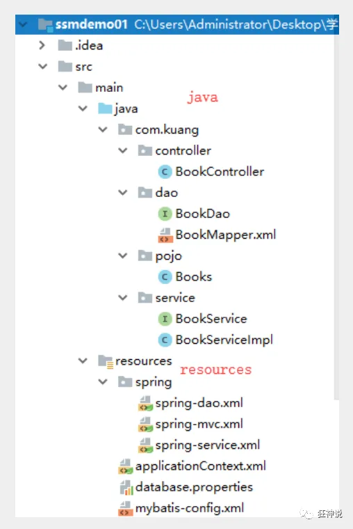

### 1.2、Model1时代

在web早期的开发中，通常采用的都是Model1。
Model1中，主要分为两层，视图层和模型层。

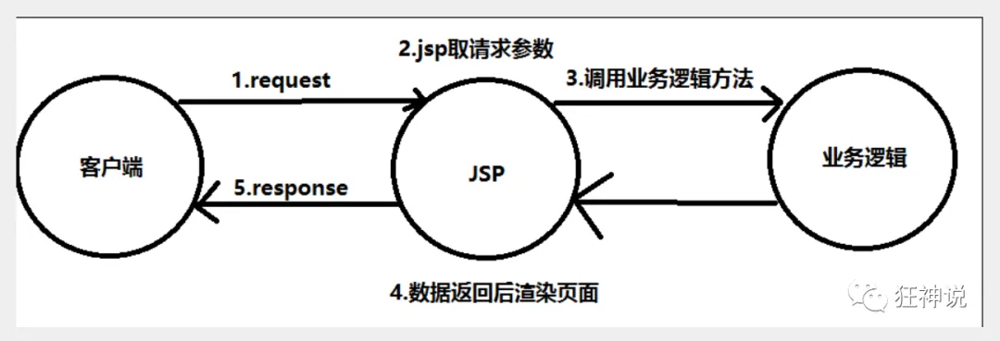

Model1优点：架构简单，比较适合小型项目开发；

Model1缺点：JSP职责不单一，职责过重，不便于维护；

### 1.3、Model2时代

Model2把一个项目分成三部分，包括**视图、控制、模型。**

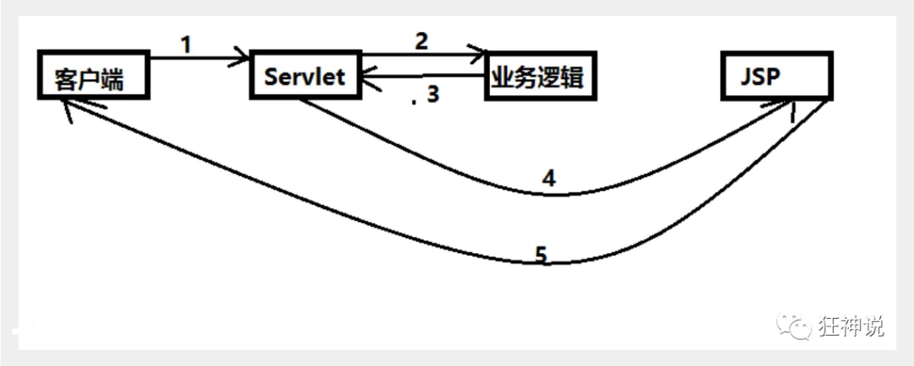

1. 用户发请求
2. Servlet接收请求数据，并调用对应的业务逻辑方法
3. 业务处理完毕，返回更新后的数据给servlet
4. servlet转向到JSP，由JSP来渲染页面
5. 响应给前端更新后的页面

**职责分析：**

**Controller：控制器**

1. 取得表单数据
2. 调用业务逻辑
3. 转向指定的页面

**Model：模型**

1. 业务逻辑
2. 保存数据的状态

**View：视图**

1. 显示页面

Model2这样不仅提高的代码的复用率与项目的扩展性，且大大降低了项目的维护成本。Model 1模式的实现比较简单，适用于快速开发小规模项目，Model1中JSP页面身兼View和Controller两种角色，将控制逻辑和表现逻辑混杂在一起，从而导致代码的重用性非常低，增加了应用的扩展性和维护的难度。Model2消除了Model1的缺点。


### 1.4、回顾Servlet

1. 新建一个Maven工程当做父工程！pom依赖！

   ```xml
   <dependencies>
      <dependency>
          <groupId>junit</groupId>
          <artifactId>junit</artifactId>
          <version>4.12</version>
      </dependency>
      <dependency>
          <groupId>org.springframework</groupId>
          <artifactId>spring-webmvc</artifactId>
          <version>5.1.9.RELEASE</version>
      </dependency>
      <dependency>
          <groupId>javax.servlet</groupId>
          <artifactId>servlet-api</artifactId>
          <version>2.5</version>
      </dependency>
      <dependency>
          <groupId>javax.servlet.jsp</groupId>
          <artifactId>jsp-api</artifactId>
          <version>2.2</version>
      </dependency>
      <dependency>
          <groupId>javax.servlet</groupId>
          <artifactId>jstl</artifactId>
          <version>1.2</version>
      </dependency>
   </dependencies>
   ```

2. 建立一个Moudle：springmvc-01-servlet ， 添加Web app的支持！

3. 导入servlet 和 jsp 的 jar 依赖

   ```xml
   <dependency>
      <groupId>javax.servlet</groupId>
      <artifactId>servlet-api</artifactId>
      <version>2.5</version>
   </dependency>
   <dependency>
      <groupId>javax.servlet.jsp</groupId>
      <artifactId>jsp-api</artifactId>
      <version>2.2</version>
   </dependency>
   ```

4. 编写一个Servlet类，用来处理用户的请求

   ```java
   package com.kuang.servlet;
   
   //实现Servlet接口
   public class HelloServlet extends HttpServlet {
      @Override
      protected void doGet(HttpServletRequest req, HttpServletResponse resp) throws ServletException, IOException {
          //取得参数
          String method = req.getParameter("method");
          if (method.equals("add")){
              req.getSession().setAttribute("msg","执行了add方法");
         }
          if (method.equals("delete")){
              req.getSession().setAttribute("msg","执行了delete方法");
         }
          //业务逻辑
          //视图跳转
          req.getRequestDispatcher("/WEB-INF/jsp/hello.jsp").forward(req,resp);
     }
   
      @Override
      protected void doPost(HttpServletRequest req, HttpServletResponse resp) throws ServletException, IOException {
          doGet(req,resp);
     }
   }
   ```

5. 编写Hello.jsp，在WEB-INF目录下新建一个jsp的文件夹，新建hello.jsp

   ```jsp
   <%@ page contentType="text/html;charset=UTF-8" language="java" %>
   <html>
   <head>
      <title>Kuangshen</title>
   </head>
   <body>
   ${msg}
   </body>
   </html>
   ```

6. 在web.xml中注册Servlet

   ```xml
   <?xml version="1.0" encoding="UTF-8"?>
   <web-app xmlns="http://xmlns.jcp.org/xml/ns/javaee"
           xmlns:xsi="http://www.w3.org/2001/XMLSchema-instance"
           xsi:schemaLocation="http://xmlns.jcp.org/xml/ns/javaee http://xmlns.jcp.org/xml/ns/javaee/web-app_4_0.xsd"
           version="4.0">
      <servlet>
          <servlet-name>HelloServlet</servlet-name>
          <servlet-class>com.kuang.servlet.HelloServlet</servlet-class>
      </servlet>
      <servlet-mapping>
          <servlet-name>HelloServlet</servlet-name>
          <url-pattern>/user</url-pattern>
      </servlet-mapping>
   
   </web-app>
   ```

7. 配置Tomcat，并启动测试

8. localhost:8080/user?method=add
   localhost:8080/user?method=delete

**MVC框架要做哪些事情**

1. 将url映射到java类或java类的方法 .
2. 封装用户提交的数据 .
3. 处理请求--调用相关的业务处理--封装响应数据 .
4. 将响应的数据进行渲染 . jsp / html 等表示层数据 .

**说明：**

​	常见的服务器端MVC框架有：Struts、Spring MVC、ASP.NET MVC、Zend Framework、JSF；常见前端MVC框架：vue、angularjs、react、backbone；由MVC演化出了另外一些模式如：MVP、MVVM 等等....


## 2、什么是SpringMVC

### 2.1、概述


Spring MVC是Spring Framework的一部分，是基于Java实现MVC的轻量级Web框架。

查看官方文档：https://docs.spring.io/spring/docs/5.2.0.RELEASE/spring-framework-reference/web.html#spring-web

**我们为什么要学习SpringMVC呢?**

 Spring MVC的特点：

1. 轻量级，简单易学
2. 高效 , 基于请求响应的MVC框架
3. 与Spring兼容性好，无缝结合
4. 约定优于配置
5. 功能强大：RESTful、数据验证、格式化、本地化、主题等
6. 简洁灵活

Spring的web框架围绕**DispatcherServlet** [ 调度Servlet ] 设计。

DispatcherServlet的作用是将请求分发到不同的处理器。从Spring 2.5开始，使用Java 5或者以上版本的用户可以采用基于注解形式进行开发，十分简洁；

正因为SpringMVC好 , 简单 , 便捷 , 易学 , 天生和Spring无缝集成(使用SpringIoC和Aop) , 使用约定优于配置 . 能够进行简单的junit测试 . 支持Restful风格 .异常处理 , 本地化 , 国际化 , 数据验证 , 类型转换 , 拦截器 等等......所以我们要学习 .

**最重要的一点还是用的人多 , 使用的公司多 .** 


### 2.2、中心控制器

​	Spring的web框架围绕DispatcherServlet设计。DispatcherServlet的作用是将请求分发到不同的处理器。从Spring 2.5开始，使用Java 5或者以上版本的用户可以采用基于注解的controller声明方式。

​	Spring MVC框架像许多其他MVC框架一样, **以请求为驱动** , **围绕一个中心Servlet分派请求及提供其他功能**，**DispatcherServlet是一个实际的Servlet (它继承自HttpServlet 基类)**。

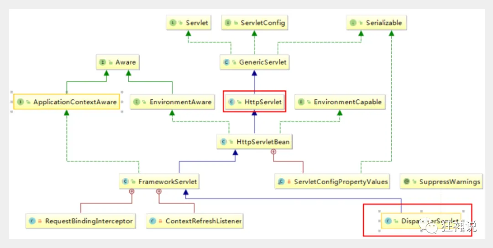

SpringMVC的原理如下图所示：

​	当发起请求时被前置的控制器拦截到请求，根据请求参数生成代理请求，找到请求对应的实际控制器，控制器处理请求，创建数据模型，访问数据库，将模型响应给中心控制器，控制器使用模型与视图渲染视图结果，将结果返回给中心控制器，再将结果返回给请求者。

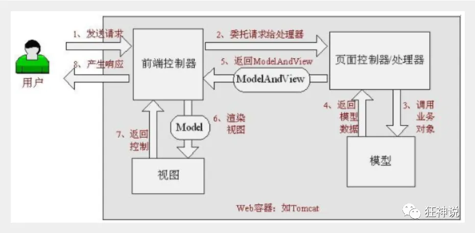

### 2.3、SpringMVC执行原理

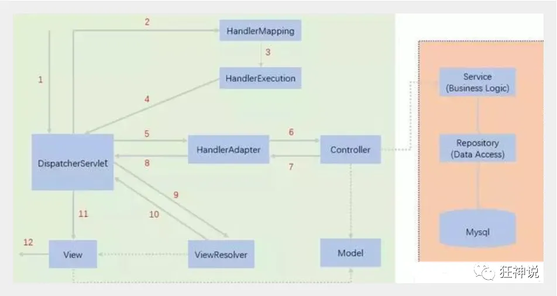

图为SpringMVC的一个较完整的流程图，实线表示SpringMVC框架提供的技术，不需要开发者实现，虚线表示需要开发者实现。

**简要分析执行流程**

1. DispatcherServlet表示前置控制器，是整个SpringMVC的控制中心。用户发出请求，DispatcherServlet接收请求并拦截请求。

   我们假设请求的url为 : http://localhost:8080/SpringMVC/hello

   

   **如上url拆分成三部分：**

   http://localhost:8080服务器域名

   SpringMVC部署在服务器上的web站点

   hello表示控制器

   通过分析，如上url表示为：请求位于服务器localhost:8080上的SpringMVC站点的hello控制器。

2. HandlerMapping为处理器映射。DispatcherServlet调用HandlerMapping,HandlerMapping根据请求url查找Handler。

3. HandlerExecution表示具体的Handler,其主要作用是根据url查找控制器，如上url被查找控制器为：hello。

4. HandlerExecution将解析后的信息传递给DispatcherServlet,如解析控制器映射等。

5. HandlerAdapter表示处理器适配器，其按照特定的规则去执行Handler。

6. Handler让具体的Controller执行。

7. Controller将具体的执行信息返回给HandlerAdapter,如ModelAndView。

8. HandlerAdapter将视图逻辑名或模型传递给DispatcherServlet。

9. DispatcherServlet调用视图解析器(ViewResolver)来解析HandlerAdapter传递的逻辑视图名。

10. 视图解析器将解析的逻辑视图名传给DispatcherServlet。

11. DispatcherServlet根据视图解析器解析的视图结果，调用具体的视图。

12. 最终视图呈现给用户。

在这里先听一遍原理，不理解没有关系，我们马上来写一个对应的代码实现大家就明白了，如果不明白，那就写10遍，没有笨人，只有懒人！

# 二、第一个MVC程序


在上一节中，我们讲解了 什么是SpringMVC以及它的执行原理！

[狂神说SpringMVC01：什么是SpringMVC](http://mp.weixin.qq.com/s?__biz=Mzg2NTAzMTExNg==&mid=2247483970&idx=1&sn=352e571ee88957ce391e972344e2a3d7&chksm=ce6104e1f9168df7f98eea39bd8478bb5082853ec8727c9da58c894625c43d44ebd64d36e2a8&scene=21#wechat_redirect)

现在我们来看看如何快速使用SpringMVC编写我们的程序吧！

### 配置版

1、新建一个Moudle ， springmvc-02-hello ， 添加web的支持！

2、确定导入了SpringMVC 的依赖！

3、配置web.xml  ， 注册DispatcherServlet

```xml
<?xml version="1.0" encoding="UTF-8"?>
<web-app xmlns="http://xmlns.jcp.org/xml/ns/javaee" 
         xmlns:xsi="http://www.w3.org/2001/XMLSchema-instance"
         xsi:schemaLocation="http://xmlns.jcp.org/xml/ns/javaee 
                             http://xmlns.jcp.org/xml/ns/javaee/web-app_4_0.xsd"
         version="4.0">
    <!--1.注册DispatcherServlet-->
    <servlet>
        <servlet-name>springmvc</servlet-name>
        <servlet-class>org.springframework.web.servlet.DispatcherServlet
        </servlet-class>       <!--关联一个springmvc的配置文件:【servlet-name】-servlet.xml-->
        <init-param>
            <param-name>contextConfigLocation</param-name>
            <param-value>classpath:springmvc-servlet.xml</param-value>
        </init-param>       <!--启动级别-1-->
        <load-on-startup>1</load-on-startup>
    </servlet>
    <!--/ 匹配所有的请求；（不包括.jsp）-->   
    <!--/* 匹配所有的请求；（包括.jsp）-->
    <servlet-mapping>
        <servlet-name>springmvc</servlet-name>
        <url-pattern>/</url-pattern>
    </servlet-mapping>
</web-app>
```

4、编写SpringMVC 的 配置文件！名称：springmvc-servlet.xml  : [servletname]-servlet.xml

说明，这里的名称要求是按照官方来的

```xml
<?xml version="1.0" encoding="UTF-8"?>
<beans xmlns="http://www.springframework.org/schema/beans"
       xmlns:xsi="http://www.w3.org/2001/XMLSchema-instance"
       xsi:schemaLocation="http://www.springframework.org/schema/beans
             http://www.springframework.org/schema/beans/spring-beans.xsd">
</beans>
```

5、添加 处理映射器

```xml
<bean class="org.springframework.web.servlet.handler.BeanNameUrlHandlerMapping"/>
```

6、添加 处理器适配器

```xml
<bean class="org.springframework.web.servlet.mvc.SimpleControllerHandlerAdapter"/>
```

7、添加 视图解析器

```xml
    <bean class="org.springframework.web.servlet.view.InternalResourceViewResolver"
          id="InternalResourceViewResolver">   
        <!--前缀-->
        <property name="prefix" value="/WEB-INF/jsp/"/>   
        <!--后缀-->
        <property name="suffix" value=".jsp"/>
    </bean>
```

8、编写我们要操作业务Controller ，要么实现Controller接口，要么增加注解；需要返回一个ModelAndView，装数据，封视图；

```java
package com.kuang.controller;
import org.springframework.web.servlet.ModelAndView;
import org.springframework.web.servlet.mvc.Controller;
import javax.servlet.http.HttpServletRequest;
import javax.servlet.http.HttpServletResponse;
//注意：这里我们先导入Controller接口
public class HelloController implements Controller {
	public ModelAndView handleRequest(HttpServletRequest request, HttpServletResponse response) throws Exception {       
        //ModelAndView 模型和视图       
        ModelAndView mv = new ModelAndView();
        //封装对象，放在ModelAndView中。Model       
        mv.addObject("msg","HelloSpringMVC!");       
        //封装要跳转的视图，放在ModelAndView中       
        mv.setViewName("hello"); 
        //: /WEB-INF/jsp/hello.jsp       
        return mv;  
    }   
}
```

9、将自己的类交给SpringIOC容器，注册bean


```xml
<!--Handler-->
<bean id="/hello" class="com.kuang.controller.HelloController"/>
```

10、写要跳转的jsp页面，显示ModelandView存放的数据，以及我们的正常页面；

```jsp
<%@ page contentType="text/html;charset=UTF-8" language="java" %>
<html>
	<head>   
		<title>Kuangshen</title>
	</head>
	<body>
		${msg}
	</body>
</html>
```

11、配置Tomcat 启动测试！


**可能遇到的问题：访问出现404，排查步骤：**

1. 查看控制台输出，看一下是不是缺少了什么jar包。
2. 如果jar包存在，显示无法输出，就在IDEA的项目发布中，添加lib依赖！
3. 重启Tomcat 即可解决！

小结：看这个估计大部分同学都能理解其中的原理了，但是我们实际开发才不会这么写，不然就疯了，还学这个玩意干嘛！我们来看个注解版实现，这才是SpringMVC的精髓，到底有多么简单，看这个图就知道了。

### 注解版

**1、新建一个Moudle，springmvc-03-hello-annotation 。添加web支持！**

2、由于Maven可能存在资源过滤的问题，我们将配置完善


```xml
<build>
    <resources>
        <resource>
            <directory>src/main/java</directory>
            <includes>
                <include>**/*.properties</include>
                <include>**/*.xml</include>
            </includes>
            <filtering>false</filtering>
        </resource>
        <resource>
            <directory>src/main/resources</directory>
            <includes>
                <include>**/*.properties</include>
                <include>**/*.xml</include>
            </includes>
            <filtering>false</filtering>
        </resource>
    </resources>
</build>
```

3、在pom.xml文件引入相关的依赖：主要有Spring框架核心库、Spring MVC、servlet , JSTL等。我们在父依赖中已经引入了！

**4、配置web.xml**

注意点：	


```xml
<?xml version="1.0" encoding="UTF-8"?>
<web-app xmlns="http://xmlns.jcp.org/xml/ns/javaee" xmlns:xsi="http://www.w3.org/2001/XMLSchema-instance"
         xsi:schemaLocation="http://xmlns.jcp.org/xml/ns/javaee http://xmlns.jcp.org/xml/ns/javaee/web-app_4_0.xsd"
         version="4.0">
    <!--1.注册servlet-->
    <servlet>
        <servlet-name>SpringMVC</servlet-name>
        <servlet-class>org.springframework.web.servlet.DispatcherServlet</servlet-class>     
        <!--通过初始化参数指定SpringMVC配置文件的位置，进行关联-->
        <init-param>
            <param-name>contextConfigLocation</param-name>
            <param-value>classpath:springmvc-servlet.xml</param-value>
        </init-param>
        <!--启动顺序，数字越小，启动越早 -->
        <load-on-startup>1</load-on-startup>
    </servlet>
    <!--所有请求都会被springmvc拦截 -->
    <servlet-mapping>
        <servlet-name>SpringMVC</servlet-name>
        <url-pattern>/</url-pattern>
    </servlet-mapping>
</web-app>
```

**/ 和 /\* 的区别：**< url-pattern > / </ url-pattern > 不会匹配到.jsp， 只针对我们编写的请求；即：.jsp 不会进入spring的 DispatcherServlet类 。< url-pattern > /* </ url-pattern > 会匹配 *.jsp，会出现返回 jsp视图 时再次进入spring的DispatcherServlet 类，导致找不到对应的controller所以报404错。

```
注意web.xml版本问题，要最新版！

注册DispatcherServlet

关联SpringMVC的配置文件

启动级别为1

映射路径为 / 【不要用/*，会404】

```

**5、添加Spring MVC配置文件**

在resource目录下添加springmvc-servlet.xml配置文件，配置的形式与Spring容器配置基本类似，为了支持基于注解的IOC，设置了自动扫描包的功能，具体配置信息如下：

```xml
<?xml version="1.0" encoding="UTF-8"?>
<beans xmlns="http://www.springframework.org/schema/beans" xmlns:xsi="http://www.w3.org/2001/XMLSchema-instance"
       xmlns:context="http://www.springframework.org/schema/context"
       xmlns:mvc="http://www.springframework.org/schema/mvc"
       xsi:schemaLocation="http://www.springframework.org/schema/beans
       http://www.springframework.org/schema/beans/spring-beans.xsd
       http://www.springframework.org/schema/context
       https://www.springframework.org/schema/context/spring-context.xsd
       http://www.springframework.org/schema/mvc
       https://www.springframework.org/schema/mvc/spring-mvc.xsd">
    <!--自动扫描包，让指定包下的注解生效,由IOC容器统一管理 -->
    <context:component-scan base-package="com.kuang.controller"/>
    <!--让Spring MVC不处理静态资源 -->
    <mvc:default-servlet-handler/>
    <!-- 支持mvc注解驱动 在spring中一般采用@RequestMapping注解来完成映射关系 要想使@RequestMapping注解生效 必须向上下文中注册DefaultAnnotationHandlerMapping和一个AnnotationMethodHandlerAdapter实例 这两个实例分别在类级别和方法级别处理。 而annotation-driven配置帮助我们自动完成上述两个实例的注入。 -->
    <mvc:annotation-driven/>
    <!--视图解析器 -->
    <bean class="org.springframework.web.servlet.view.InternalResourceViewResolver" id="internalResourceViewResolver"><
        !--前缀 -->
        <property name="prefix" value="/WEB-INF/jsp/"/>
        <!--后缀 -->
        <property name="suffix" value=".jsp"/>
    </bean>
</beans>
```

在视图解析器中我们把所有的视图都存放在/WEB-INF/目录下，这样可以保证视图安全，因为这个目录下的文件，客户端不能直接访问。

让IOC的注解生效

静态资源过滤 ：HTML . JS . CSS . 图片 ， 视频 .....

MVC的注解驱动

配置视图解析器

  

**6、创建Controller**

编写一个Java控制类：com.kuang.controller.HelloController , 注意编码规范

```java
package com.kuang.controller;
import org.springframework.stereotype.Controller;
import org.springframework.ui.Model;
import org.springframework.web.bind.annotation.RequestMapping;
@Controller
@RequestMapping("/HelloController")
public class HelloController {
   //真实访问地址 : 项目名/HelloController/hello   
    @RequestMapping("/hello")   
    public String sayHello(Model model){       
        //向模型中添加属性msg与值，可以在JSP页面中取出并渲染       
        model.addAttribute("msg","hello,SpringMVC");       
        //web-inf/jsp/hello.jsp       
        return "hello";  
    }
}
```

@Controller是为了让Spring IOC容器初始化时自动扫描到；
@RequestMapping是为了映射请求路径，这里因为类与方法上都有映射所以访问时应该是/HelloController/hello；
方法中声明Model类型的参数是为了把Action中的数据带到视图中；
方法返回的结果是视图的名称hello，加上配置文件中的前后缀变成WEB-INF/jsp/**hello**.jsp。

7、**创建视图层**

在WEB-INF/ jsp目录中创建hello.jsp ， 视图可以直接取出并展示从Controller带回的信息；

可以通过EL表示取出Model中存放的值，或者对象；

```html
<%@ page contentType="text/html;charset=UTF-8" language="java" %>
<html>
	<head>   
		<title>SpringMVC</title>
	</head>
	<body>
		${msg}
	</body>
</html>
```

**8、配置Tomcat运行**

配置Tomcat ，  开启服务器 ， 访问对应的请求路径！

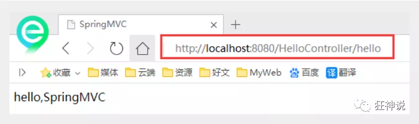

**OK，运行成功！**


### 小结

实现步骤其实非常的简单：

1. 新建一个web项目
2. 导入相关jar包
3. 编写web.xml , 注册DispatcherServlet
4. 编写springmvc配置文件
5. 接下来就是去创建对应的控制类 , controller
6. 最后完善前端视图和controller之间的对应
7. 测试运行调试.

使用springMVC必须配置的三大件：

**处理器映射器、处理器适配器、视图解析器**

通常，我们只需要**手动配置视图解析器**，而**处理器映射器**和**处理器适配器**只需要开启**注解驱动**即可，而省去了大段的xml配置

再来回顾下原理吧~


下面我们准备研究下Controller及RestFul风格！

# 三、Controller和RestFul风格

### 控制器Controller

- 控制器提供访问复杂应用程序的行为，通常实现Controller接口或注解定义两种方法实现。

- 控制器负责解析用户的请求并将其转换为一个模型。

- 在Spring MVC中一个控制器类可以包含多个方法

- 在Spring MVC中，对于Controller的配置方式有很多种

  

### 实现Controller接口

Controller是一个接口，在org.springframework.web.servlet.mvc包下，接口中只有一个方法；

```java
//实现该接口的类获得控制器功能
public interface Controller {
   //处理请求且返回一个模型与视图对象
   ModelAndView handleRequest(HttpServletRequest var1, HttpServletResponse var2) throws Exception;
}
```

**测试**

1. 新建一个Moudle，springmvc-04-controller 。将刚才的03 拷贝一份, 我们进行操作！

2. - 删掉HelloController

   - mvc的配置文件只留下 视图解析器！(不用配置BeanNameUrlHandlerMapping和SimpleControllerHandlerAdapter也能正常运行与访问)

     ```xml
     <?xml version="1.0" encoding="UTF-8"?>
     <beans xmlns="http://www.springframework.org/schema/beans"
            xmlns:xsi="http://www.w3.org/2001/XMLSchema-instance"
            xmlns:context="http://www.springframework.org/schema/context"
            xmlns:mvc="http://www.springframework.org/schema/mvc"
            xsi:schemaLocation="http://www.springframework.org/schema/beans
             http://www.springframework.org/schema/beans/spring-beans.xsd
             http://www.springframework.org/schema/context
             http://www.springframework.org/schema/context/spring-context.xsd
             http://www.springframework.org/schema/mvc
             http://www.springframework.org/schema/mvc/spring-mvc.xsd">
     
     <!--    <context:component-scan base-package="com.newfbin.controller"/>-->
     <!--    <mvc:default-servlet-handler/>-->
     <!--    <mvc:annotation-driven/>-->
     
         <bean class="org.springframework.web.servlet.view.InternalResourceViewResolver" id="internalResourceViewResolver">
             <property name="prefix" value="/WEB-INF/jsp/"/>
             <property name="suffix" value=".jsp"/>
         </bean> 
     </beans>
     ```

3. 编写一个Controller类，ControllerTest1

   ```java
   //定义控制器
   //注意点：不要导错包，实现Controller接口，重写方法；
   public class ControllerTest1 implements Controller {
   
      public ModelAndView handleRequest(HttpServletRequest httpServletRequest, HttpServletResponse httpServletResponse) throws Exception {
          //返回一个模型视图对象
          ModelAndView mv = new ModelAndView();
          mv.addObject("msg","Test1Controller");
          mv.setViewName("test");
          return mv;
     }
   }
   ```

4. 编写完毕后，去Spring配置文件中注册请求的bean；name对应请求路径，class对应处理请求的类

   ```xml
   <bean name="/t1" class="com.kuang.controller.ControllerTest1"/>
   ```

5. 编写前端test.jsp，注意在WEB-INF/jsp目录下编写，对应我们的视图解析器

   ```jsp
   <%@ page contentType="text/html;charset=UTF-8" language="java" %>
   <html>
   <head>
      <title>Kuangshen</title>
   </head>
   <body>
   ${msg}
   </body>
   </html>
   ```

6. 配置Tomcat运行测试，我这里没有项目发布名配置的就是一个 / ，所以请求不用加项目名，OK！

   

   

**说明：**

- 实现接口Controller定义控制器是较老的办法

- 缺点是：一个控制器中只有一个方法，如果要多个方法则需要定义多个Controller；定义的方式比较麻烦；

  

### 使用注解@Controller

- @Controller注解类型用于声明Spring类的实例是一个控制器（在讲IOC时还提到了另外3个注解）；

- Spring可以使用扫描机制来找到应用程序中所有基于注解的控制器类，为了保证Spring能找到你的控制器，需要在配置文件中声明组件扫描。

  ```xml
  <!-- 自动扫描指定的包，下面所有注解类交给IOC容器管理 -->
  <context:component-scan base-package="com.kuang.controller"/>
  ```

- 增加一个ControllerTest2类，使用注解实现；

  ```java
  //@Controller注解的类会自动添加到Spring上下文中
  @Controller
  public class ControllerTest2{
  
     //映射访问路径
     @RequestMapping("/t2")
     public String index(Model model){
         //Spring MVC会自动实例化一个Model对象用于向视图中传值
         model.addAttribute("msg", "ControllerTest2");
         //返回视图位置
         return "test";
    }
  
  }
  ```

- 运行tomcat测试

  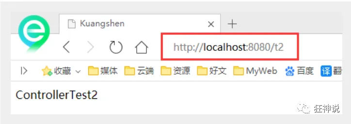

  

**可以发现，我们的两个请求都可以指向一个视图，但是页面结果的结果是不一样的，从这里可以看出视图是被复用的，而控制器与视图之间是弱偶合关系。**

**注解方式是平时使用的最多的方式！**


### RequestMapping

**@RequestMapping**

- @RequestMapping注解用于映射url到控制器类或一个特定的处理程序方法。可用于类或方法上。用于类上，表示类中的所有响应请求的方法都是以该地址作为父路径。

- 为了测试结论更加准确，我们可以加上一个项目名测试 myweb

- 只注解在方法上面

  ```java
  @Controller
  public class TestController {
     @RequestMapping("/h1")
     public String test(){
         return "test";
    }
  }
  ```

  访问路径：http://localhost:8080 / 项目名 / h1

- 同时注解类与方法

  ```java
  @Controller
  @RequestMapping("/admin")
  public class TestController {
     @RequestMapping("/h1")
     public String test(){
         return "test";
    }
  }
  ```

  访问路径：http://localhost:8080 / 项目名/ admin /h1  , 需要先指定类的路径再指定方法的路径；


### RestFul 风格

**概念**

Restful就是一个资源定位及资源操作的风格。不是标准也不是协议，只是一种风格。基于这个风格设计的软件可以更简洁，更有层次，更易于实现缓存等机制。

**功能**

资源：互联网所有的事物都可以被抽象为资源

资源操作：使用POST、DELETE、PUT、GET，使用不同方法对资源进行操作。

分别对应 添加、 删除、修改、查询。

**传统方式操作资源**  ：**通过不同的参数**（通过不同的链接）来实现不同的效果！方法单一，post 和 get

​	http://127.0.0.1/item/queryItem.action?id=1 查询,GET

​	http://127.0.0.1/item/saveItem.action 新增,POST

​	http://127.0.0.1/item/updateItem.action 更新,POST

​	http://127.0.0.1/item/deleteItem.action?id=1 删除,GET或POST

**使用RESTful操作资源** ：可以**通过不同的请求方式**来实现不同的效果！如下：请求地址一样，但是功能可以不同！

​	http://127.0.0.1/item/1 查询,GET

​	http://127.0.0.1/item 新增,POST

​	http://127.0.0.1/item 更新,PUT

​	http://127.0.0.1/item/1 删除,DELETE

**学习测试**

1. 在新建一个类 RestFulController

   ```java
   @Controller
   public class RestFulController {
   }
   ```

2. 在Spring MVC中可以使用  @PathVariable 注解，让方法参数的值对应绑定到一个URI模板变量上。

   ```java
   @Controller
   public class RestFulController {
   
      //映射访问路径
      @RequestMapping("/commit/{p1}/{p2}")
      public String index(@PathVariable int p1, @PathVariable int p2, Model model){
          
          int result = p1+p2;
          //Spring MVC会自动实例化一个Model对象用于向视图中传值
          model.addAttribute("msg", "结果："+result);
          //返回视图位置
          return "test";
          
     }
      
   }
   ```

3. 我们来测试请求查看下

   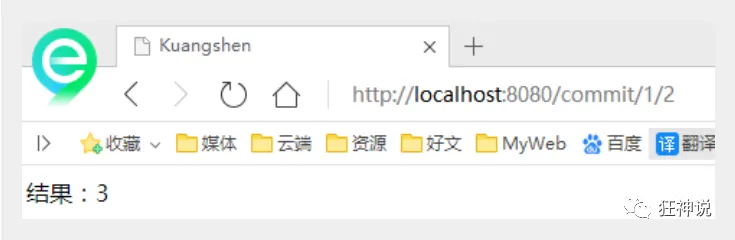

4. 思考：使用路径变量的好处？

   * 使路径变得更加简洁；

   - 获得参数更加方便，框架会自动进行类型转换。

   - 通过路径变量的类型可以约束访问参数，如果类型不一样，则访问不到对应的请求方法，如这里访问是的路径是/commit/1/a，则路径与方法不匹配，而不会是参数转换失败。

     

     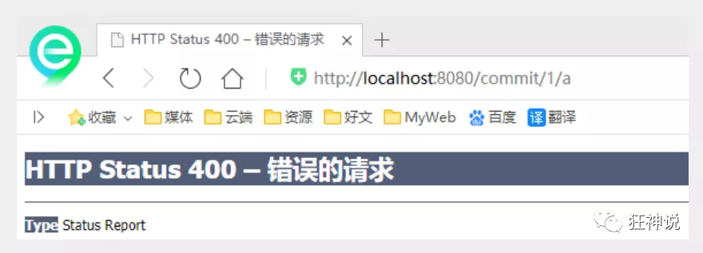

5. 我们来修改下对应的参数类型，再次测试

   ```java
   //映射访问路径
   @RequestMapping("/commit/{p1}/{p2}")
   public String index(@PathVariable int p1, @PathVariable String p2, Model model){
   
      String result = p1+p2;
      //Spring MVC会自动实例化一个Model对象用于向视图中传值
      model.addAttribute("msg", "结果："+result);
      //返回视图位置
      return "test";
   
   }
   ```

   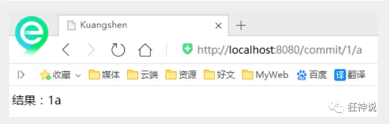

**使用method属性指定请求类型**

用于约束请求的类型，可以收窄请求范围。指定请求谓词的类型如GET, POST, HEAD, OPTIONS, PUT, PATCH, DELETE, TRACE等

我们来测试一下：

- 增加一个方法

  ```java
  //映射访问路径,必须是POST请求
  @RequestMapping(value = "/hello",method = {RequestMethod.POST})
  public String index2(Model model){
     model.addAttribute("msg", "hello!");
     return "test";
  }
  ```

- 我们使用浏览器地址栏进行访问默认是Get请求，会报错405：

  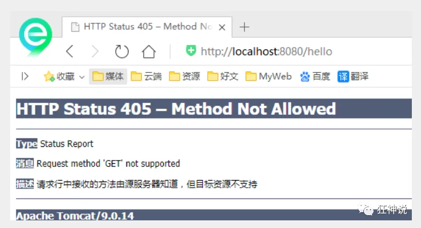

- 如果将POST修改为GET则正常了；

  ```java
  //映射访问路径,必须是Get请求
  @RequestMapping(value = "/hello",method = {RequestMethod.GET})
  public String index2(Model model){
     model.addAttribute("msg", "hello!");
     return "test";
  }
  ```

  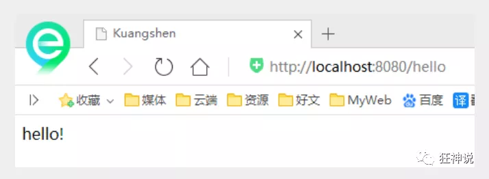

**小结：**

Spring MVC 的 @RequestMapping 注解能够处理 HTTP 请求的方法, 比如 GET, PUT, POST, DELETE 以及 PATCH。

**所有的地址栏请求默认都会是 HTTP GET 类型的。**

方法级别的注解变体有如下几个：组合注解

```java
@GetMapping
@PostMapping
@PutMapping
@DeleteMapping
@PatchMapping
```

@GetMapping 是一个组合注解，平时使用的会比较多！

它所扮演的是 @RequestMapping(method =RequestMethod.GET) 的一个快捷方式。


### 扩展：小黄鸭调试法

场景一：*我们都有过向别人（甚至可能向完全不会编程的人）提问及解释编程问题的经历，但是很多时候就在我们解释的过程中自己却想到了问题的解决方案，然后对方却一脸茫然。*

场景二：你的同行跑来问你一个问题，但是当他自己把问题说完，或说到一半的时候就想出答案走了，留下一脸茫然的你。

其实上面两种场景现象就是所谓的小黄鸭调试法（Rubber Duck Debuging），又称橡皮鸭调试法，它是我们软件工程中最常使用调试方法之一。


此概念据说来自《程序员修炼之道》书中的一个故事，传说程序大师随身携带一只小黄鸭，在调试代码的时候会在桌上放上这只小黄鸭，然后详细地向鸭子解释每行代码，然后很快就将问题定位修复了。

# 四、数据处理及跳转

## 结果跳转方式

### ModelAndView

设置ModelAndView对象 , 根据view的名称 , 和视图解析器跳到指定的页面 .

页面 : {视图解析器前缀} + viewName +{视图解析器后缀}

```xml
<!-- 视图解析器 -->
<bean class="org.springframework.web.servlet.view.InternalResourceViewResolver"
     id="internalResourceViewResolver">
   <!-- 前缀 -->
   <property name="prefix" value="/WEB-INF/jsp/" />
   <!-- 后缀 -->
   <property name="suffix" value=".jsp" />
</bean>
```

对应的controller类

```java
public class ControllerTest1 implements Controller {

   public ModelAndView handleRequest(HttpServletRequest httpServletRequest, HttpServletResponse httpServletResponse) throws Exception {
       //返回一个模型视图对象
       ModelAndView mv = new ModelAndView();
       mv.addObject("msg","ControllerTest1");
       mv.setViewName("test");
       return mv;
  }
}
```


### ServletAPI

通过设置ServletAPI , 不需要视图解析器 .

1、通过HttpServletResponse进行输出

2、通过HttpServletResponse实现重定向

3、通过HttpServletResponse实现转发

```java
/* 标注了@RequestMapping的方法可以直接使用HttpServletRequest req, HttpServletResponse resp这两个参数 */

@Controller
//类被标注为@Controller，这告诉Spring框架这是一个控制器类
//控制器类不需要直接继承自HttpServlet，因为Spring框架提供了自己的控制器层次结构和请求处理机制。

public class ResultGo {
   @RequestMapping("/result/t1")
//每个处理方法（如test1、test2、test3）都标注了@RequestMapping注解，指定了处理特定URL请求的方法。
//这些方法可以接受HttpServletRequest和HttpServletResponse作为参数
//这是因为Spring框架的DispatcherServlet会在调用这些方法时，自动传入当前的HttpServletRequest和HttpServletResponse对象。

   public void test1(HttpServletRequest req, HttpServletResponse rsp) throws IOException {
       rsp.getWriter().println("Hello,Spring BY servlet API");
  }

   @RequestMapping("/result/t2")
   public void test2(HttpServletRequest req, HttpServletResponse rsp) throws IOException {
       rsp.sendRedirect("/index.jsp");
  }

   @RequestMapping("/result/t3")
   public void test3(HttpServletRequest req, HttpServletResponse rsp) throws Exception {
       //转发
       req.setAttribute("msg","/result/t3");
       req.getRequestDispatcher("/WEB-INF/jsp/test.jsp").forward(req,rsp);
  }

}
```


### SpringMVC

**通过SpringMVC来实现转发和重定向 - 无需视图解析器；**

测试前，需要将视图解析器注释掉

```java
@Controller
public class ResultSpringMVC {
   @RequestMapping("/rsm/t1")
   public String test1(){
       //转发
       return "/index.jsp";
  }

   @RequestMapping("/rsm/t2")
   public String test2(){
       //转发二
       return "forward:/index.jsp";
  }

   @RequestMapping("/rsm/t3")
   public String test3(){
       //重定向
       return "redirect:/index.jsp";
  }
}
```


**通过SpringMVC来实现转发和重定向 - 有视图解析器；**

重定向 , 不需要视图解析器 , 本质就是重新请求一个新地方嘛 , 所以注意路径问题.

可以重定向到另外一个请求实现 .

```java
@Controller
public class ResultSpringMVC2 {
   @RequestMapping("/rsm2/t1")
   public String test1(){
       //转发
       return "test";
  }

   @RequestMapping("/rsm2/t2")
   public String test2(){
       //重定向
       return "redirect:/index.jsp";
       //return "redirect:hello.do"; //hello.do为另一个请求/
  }

}
```


## 数据处理

### 处理提交数据

**1、提交的域名称和处理方法的参数名一致**

提交数据 : http://localhost:8080/hello?name=kuangshen

处理方法 :

```java
@RequestMapping("/hello")
public String hello(String name){
   System.out.println(name);
   return "hello";
}
```

后台输出 : kuangshen


**2、提交的域名称和处理方法的参数名不一致**

提交数据 : http://localhost:8080/hello?username=kuangshen

处理方法 :

```java
//@RequestParam("username") : username提交的域的名称 .
@RequestMapping("/hello")
public String hello(@RequestParam("username") String name){
   System.out.println(name);
   return "hello";
}
```

后台输出 : kuangshen


**3、提交的是一个对象**

要求提交的表单域和对象的属性名一致  , 参数使用对象即可

1、实体类

```Java
public class User {
   private int id;
   private String name;
   private int age;
   //构造
   //get/set
   //tostring()
}
```

2、提交数据 : http://localhost:8080/mvc04/user?name=kuangshen&id=1&age=15

3、处理方法 :

```java
@RequestMapping("/user")
public String user(User user){
   System.out.println(user);
   return "hello";
}
```

后台输出 : User { id=1, name='kuangshen', age=15 }

说明：如果使用对象的话，前端传递的参数名和对象名必须一致，否则就是null。


### 数据显示到前端

**第一种 : 通过ModelAndView**

我们前面一直都是如此 . 就不过多解释

```java
public class ControllerTest1 implements Controller {

   public ModelAndView handleRequest(HttpServletRequest httpServletRequest, HttpServletResponse httpServletResponse) throws Exception {
       //返回一个模型视图对象
       ModelAndView mv = new ModelAndView();
       mv.addObject("msg","ControllerTest1");
       mv.setViewName("test");
       return mv;
  }
}
```


**第二种 : 通过ModelMap**

ModelMap

```java
@RequestMapping("/hello")
public String hello(@RequestParam("username") String name, ModelMap model){
   //封装要显示到视图中的数据
   //相当于req.setAttribute("name",name);
   model.addAttribute("name",name);
   System.out.println(name);
   return "hello";
}
```


**第三种 : 通过Model**

Model

```java
@RequestMapping("/ct2/hello")
public String hello(@RequestParam("username") String name, Model model){
   //封装要显示到视图中的数据
   //相当于req.setAttribute("name",name);
   model.addAttribute("msg",name);
   System.out.println(name);
   return "test";
}
```


### 对比

就对于新手而言简单来说使用区别就是：

```
Model 只有寥寥几个方法只适合用于储存数据，简化了新手对于Model对象的操作和理解；

ModelMap 继承了 LinkedMap ，除了实现了自身的一些方法，同样的继承 LinkedMap 的方法和特性；

ModelAndView 可以在储存数据的同时，可以进行设置返回的逻辑视图，进行控制展示层的跳转。
```

当然更多的以后开发考虑的更多的是性能和优化，就不能单单仅限于此的了解。

**请使用80%的时间打好扎实的基础，剩下18%的时间研究框架，2%的时间去学点英文，框架的官方文档永远是最好的教程。**


### 乱码问题

测试步骤：

1、我们可以在首页编写一个提交的表单

```html
<form action="/e/t" method="post">
 <input type="text" name="name">
 <input type="submit">
</form>
```

2、后台编写对应的处理类

```java
@Controller
public class Encoding {
   @RequestMapping("/e/t")
   public String test(Model model,String name){
       model.addAttribute("msg",name); //获取表单提交的值
       return "test"; //跳转到test页面显示输入的值
  }
}
```

3、输入中文测试，发现乱码


不得不说，乱码问题是在我们开发中十分常见的问题，也是让我们程序猿比较头大的问题！

以前乱码问题通过过滤器解决 , 而SpringMVC给我们提供了一个过滤器 , 可以在web.xml中配置 .

修改了xml文件需要重启服务器！

```xml
<filter>
   <filter-name>encoding</filter-name>
   <filter-class>org.springframework.web.filter.CharacterEncodingFilter</filter-class>
   <init-param>
       <param-name>encoding</param-name>
       <param-value>utf-8</param-value>
   </init-param>
</filter>
<filter-mapping>
   <filter-name>encoding</filter-name>
   <url-pattern>/*</url-pattern>
</filter-mapping>
```

但是我们发现 , 有些极端情况下.这个过滤器对get的支持不好 .

处理方法 :

1、修改tomcat配置文件 ：设置编码！

```xml
<Connector URIEncoding="utf-8" port="8080" protocol="HTTP/1.1"
          connectionTimeout="20000"
          redirectPort="8443" />
```

2、自定义过滤器

```java
package com.kuang.filter;

import javax.servlet.*;
import javax.servlet.http.HttpServletRequest;
import javax.servlet.http.HttpServletRequestWrapper;
import javax.servlet.http.HttpServletResponse;
import java.io.IOException;
import java.io.UnsupportedEncodingException;
import java.util.Map;

/**
* 解决get和post请求 全部乱码的过滤器
*/
public class GenericEncodingFilter implements Filter {

   @Override
   public void destroy() {
  }

   @Override
   public void doFilter(ServletRequest request, ServletResponse response, FilterChain chain) throws IOException, ServletException {
       //处理response的字符编码
       HttpServletResponse myResponse=(HttpServletResponse) response;
       myResponse.setContentType("text/html;charset=UTF-8");

       // 转型为与协议相关对象
       HttpServletRequest httpServletRequest = (HttpServletRequest) request;
       // 对request包装增强
       HttpServletRequest myrequest = new MyRequest(httpServletRequest);
       chain.doFilter(myrequest, response);
  }

   @Override
   public void init(FilterConfig filterConfig) throws ServletException {
  }

}

//自定义request对象，HttpServletRequest的包装类
class MyRequest extends HttpServletRequestWrapper {

   private HttpServletRequest request;
   //是否编码的标记
   private boolean hasEncode;
   //定义一个可以传入HttpServletRequest对象的构造函数，以便对其进行装饰
   public MyRequest(HttpServletRequest request) {
       super(request);// super必须写
       this.request = request;
  }

   // 对需要增强方法 进行覆盖
   @Override
   public Map getParameterMap() {
       // 先获得请求方式
       String method = request.getMethod();
       if (method.equalsIgnoreCase("post")) {
           // post请求
           try {
               // 处理post乱码
               request.setCharacterEncoding("utf-8");
               return request.getParameterMap();
          } catch (UnsupportedEncodingException e) {
               e.printStackTrace();
          }
      } else if (method.equalsIgnoreCase("get")) {
           // get请求
           Map<String, String[]> parameterMap = request.getParameterMap();
           if (!hasEncode) { // 确保get手动编码逻辑只运行一次
               for (String parameterName : parameterMap.keySet()) {
                   String[] values = parameterMap.get(parameterName);
                   if (values != null) {
                       for (int i = 0; i < values.length; i++) {
                           try {
                               // 处理get乱码
                               values[i] = new String(values[i]
                                      .getBytes("ISO-8859-1"), "utf-8");
                          } catch (UnsupportedEncodingException e) {
                               e.printStackTrace();
                          }
                      }
                  }
              }
               hasEncode = true;
          }
           return parameterMap;
      }
       return super.getParameterMap();
  }

   //取一个值
   @Override
   public String getParameter(String name) {
       Map<String, String[]> parameterMap = getParameterMap();
       String[] values = parameterMap.get(name);
       if (values == null) {
           return null;
      }
       return values[0]; // 取回参数的第一个值
  }

   //取所有值
   @Override
   public String[] getParameterValues(String name) {
       Map<String, String[]> parameterMap = getParameterMap();
       String[] values = parameterMap.get(name);
       return values;
  }
}
```

这个也是我在网上找的一些大神写的，一般情况下，SpringMVC默认的乱码处理就已经能够很好的解决了！

**然后在web.xml中配置这个过滤器即可！**

乱码问题，需要平时多注意，在尽可能能设置编码的地方，都设置为统一编码 UTF-8！


有了这些知识，我们马上就可以进行SSM整合了！


# 五、整合SSM框架

## 整合SSM

> 环境要求

环境：

- IDEA
- MySQL 5.7.19
- Tomcat 9
- Maven 3.6

 要求：

- 需要熟练掌握MySQL数据库，Spring，JavaWeb及MyBatis知识，简单的前端知识；


> 数据库环境

创建一个存放书籍数据的数据库表

```sql
CREATE DATABASE `ssmbuild`;

USE `ssmbuild`;

DROP TABLE IF EXISTS `books`;

CREATE TABLE `books` (
`bookID` INT(10) NOT NULL AUTO_INCREMENT COMMENT '书id',
`bookName` VARCHAR(100) NOT NULL COMMENT '书名',
`bookCounts` INT(11) NOT NULL COMMENT '数量',
`detail` VARCHAR(200) NOT NULL COMMENT '描述',
KEY `bookID` (`bookID`)
) ENGINE=INNODB DEFAULT CHARSET=utf8

INSERT  INTO `books`(`bookID`,`bookName`,`bookCounts`,`detail`)VALUES
(1,'Java',1,'从入门到放弃'),
(2,'MySQL',10,'从删库到跑路'),
(3,'Linux',5,'从进门到进牢');
```


> 基本环境搭建

1、新建一Maven项目！ssmbuild ， 添加web的支持

2、导入相关的pom依赖！

```xml
<dependencies>
   <!--Junit-->
   <dependency>
       <groupId>junit</groupId>
       <artifactId>junit</artifactId>
       <version>4.12</version>
   </dependency>
   <!--数据库驱动-->
   <dependency>
       <groupId>mysql</groupId>
       <artifactId>mysql-connector-java</artifactId>
       <version>5.1.47</version>
   </dependency>
   <!-- 数据库连接池 -->
   <dependency>
       <groupId>com.mchange</groupId>
       <artifactId>c3p0</artifactId>
       <version>0.9.5.2</version>
   </dependency>

   <!--Servlet - JSP -->
   <dependency>
       <groupId>javax.servlet</groupId>
       <artifactId>servlet-api</artifactId>
       <version>2.5</version>
   </dependency>
   <dependency>
       <groupId>javax.servlet.jsp</groupId>
       <artifactId>jsp-api</artifactId>
       <version>2.2</version>
   </dependency>
   <dependency>
       <groupId>javax.servlet</groupId>
       <artifactId>jstl</artifactId>
       <version>1.2</version>
   </dependency>

   <!--Mybatis-->
   <dependency>
       <groupId>org.mybatis</groupId>
       <artifactId>mybatis</artifactId>
       <version>3.5.2</version>
   </dependency>
   <dependency>
       <groupId>org.mybatis</groupId>
       <artifactId>mybatis-spring</artifactId>
       <version>2.0.2</version>
   </dependency>

   <!--Spring-->
   <dependency>
       <groupId>org.springframework</groupId>
       <artifactId>spring-webmvc</artifactId>
       <version>5.1.9.RELEASE</version>
   </dependency>
   <dependency>
       <groupId>org.springframework</groupId>
       <artifactId>spring-jdbc</artifactId>
       <version>5.1.9.RELEASE</version>
   </dependency>
</dependencies>
```

3、Maven资源过滤设置

```xml
<build>
   <resources>
       <resource>
           <directory>src/main/java</directory>
           <includes>
               <include>**/*.properties</include>
               <include>**/*.xml</include>
           </includes>
           <filtering>false</filtering>
       </resource>
       <resource>
           <directory>src/main/resources</directory>
           <includes>
               <include>**/*.properties</include>
               <include>**/*.xml</include>
           </includes>
           <filtering>false</filtering>
       </resource>
   </resources>
</build>
```

4、建立基本结构和配置框架！

- com.kuang.pojo

- com.kuang.dao

- com.kuang.service

- com.kuang.controller

- mybatis-config.xml

  ```xml
  <?xml version="1.0" encoding="UTF-8" ?>
  <!DOCTYPE configuration
         PUBLIC "-//mybatis.org//DTD Config 3.0//EN"
         "http://mybatis.org/dtd/mybatis-3-config.dtd">
  <configuration>
  
  </configuration>
  ```

- applicationContext.xml

  ```xml
  <?xml version="1.0" encoding="UTF-8"?>
  <beans xmlns="http://www.springframework.org/schema/beans"
        xmlns:xsi="http://www.w3.org/2001/XMLSchema-instance"
        xsi:schemaLocation="http://www.springframework.org/schema/beans
         http://www.springframework.org/schema/beans/spring-beans.xsd">
  
  </beans>
  ```


> Mybatis层编写

1、数据库配置文件 **database.properties**

```properties
jdbc.driver=com.mysql.jdbc.Driver
jdbc.url=jdbc:mysql://localhost:3306/ssmbuild?useSSL=true&useUnicode=true&characterEncoding=utf8
jdbc.username=root
jdbc.password=123456
```

2、IDEA关联数据库

3、编写MyBatis的核心配置文件

```xml
<?xml version="1.0" encoding="UTF-8" ?>
<!DOCTYPE configuration
       PUBLIC "-//mybatis.org//DTD Config 3.0//EN"
       "http://mybatis.org/dtd/mybatis-3-config.dtd">
<configuration>
   
   <typeAliases>
       <package name="com.kuang.pojo"/>
   </typeAliases>
   <mappers>
       <mapper resource="com/kuang/dao/BookMapper.xml"/>
   </mappers>

</configuration>
```

4、编写数据库对应的实体类 com.kuang.pojo.Books

使用lombok插件！

```java
package com.kuang.pojo;

import lombok.AllArgsConstructor;
import lombok.Data;
import lombok.NoArgsConstructor;

@Data
@AllArgsConstructor
@NoArgsConstructor
public class Books {
   
   private int bookID;
   private String bookName;
   private int bookCounts;
   private String detail;
   
}
```

5、编写Dao层的 Mapper接口！

```java
package com.kuang.dao;

import com.kuang.pojo.Books;
import java.util.List;

public interface BookMapper {

   //增加一个Book
   int addBook(Books book);

   //根据id删除一个Book
   int deleteBookById(int id);

   //更新Book
   int updateBook(Books books);

   //根据id查询,返回一个Book
   Books queryBookById(int id);

   //查询全部Book,返回list集合
   List<Books> queryAllBook();

}
```

6、编写接口对应的 Mapper.xml 文件。需要导入MyBatis的包；

```xml
<?xml version="1.0" encoding="UTF-8" ?>
<!DOCTYPE mapper
       PUBLIC "-//mybatis.org//DTD Mapper 3.0//EN"
       "http://mybatis.org/dtd/mybatis-3-mapper.dtd">

<mapper namespace="com.kuang.dao.BookMapper">

   <!--增加一个Book-->
   <insert id="addBook" parameterType="Books">
      insert into ssmbuild.books(bookName,bookCounts,detail)
      values (#{bookName}, #{bookCounts}, #{detail})
   </insert>

   <!--根据id删除一个Book-->
   <delete id="deleteBookById" parameterType="int">
      delete from ssmbuild.books where bookID=#{bookID}
   </delete>

   <!--更新Book-->
   <update id="updateBook" parameterType="Books">
      update ssmbuild.books
      set bookName = #{bookName},bookCounts = #{bookCounts},detail = #{detail}
      where bookID = #{bookID}
   </update>

   <!--根据id查询,返回一个Book-->
   <select id="queryBookById" resultType="Books">
      select * from ssmbuild.books
      where bookID = #{bookID}
   </select>

   <!--查询全部Book-->
   <select id="queryAllBook" resultType="Books">
      SELECT * from ssmbuild.books
   </select>

</mapper>
```

7、编写Service层的接口和实现类

接口：

```java
package com.kuang.service;

import com.kuang.pojo.Books;

import java.util.List;

//BookService:底下需要去实现,调用dao层
public interface BookService {
   //增加一个Book
   int addBook(Books book);
   //根据id删除一个Book
   int deleteBookById(int id);
   //更新Book
   int updateBook(Books books);
   //根据id查询,返回一个Book
   Books queryBookById(int id);
   //查询全部Book,返回list集合
   List<Books> queryAllBook();
}
```

实现类：

```java
package com.kuang.service;

import com.kuang.dao.BookMapper;
import com.kuang.pojo.Books;
import java.util.List;

public class BookServiceImpl implements BookService {

   //调用dao层的操作，设置一个set接口，方便Spring管理
   private BookMapper bookMapper;

   public void setBookMapper(BookMapper bookMapper) {
       this.bookMapper = bookMapper;
  }
   
   public int addBook(Books book) {
       return bookMapper.addBook(book);
  }
   
   public int deleteBookById(int id) {
       return bookMapper.deleteBookById(id);
  }
   
   public int updateBook(Books books) {
       return bookMapper.updateBook(books);
  }
   
   public Books queryBookById(int id) {
       return bookMapper.queryBookById(id);
  }
   
   public List<Books> queryAllBook() {
       return bookMapper.queryAllBook();
  }
}
```

**OK，到此，底层需求操作编写完毕！**


> Spring层

1、配置**Spring整合MyBatis**，我们这里数据源使用c3p0连接池；

2、我们去编写Spring整合Mybatis的相关的配置文件；spring-dao.xml

```xml
<?xml version="1.0" encoding="UTF-8"?>
<beans xmlns="http://www.springframework.org/schema/beans"
      xmlns:xsi="http://www.w3.org/2001/XMLSchema-instance"
      xmlns:context="http://www.springframework.org/schema/context"
      xsi:schemaLocation="http://www.springframework.org/schema/beans
       http://www.springframework.org/schema/beans/spring-beans.xsd
       http://www.springframework.org/schema/context
       https://www.springframework.org/schema/context/spring-context.xsd">

   <!-- 配置整合mybatis -->
   <!-- 1.关联数据库文件 -->
   <context:property-placeholder location="classpath:database.properties"/>

   <!-- 2.数据库连接池 -->
   <!--数据库连接池
       dbcp 半自动化操作 不能自动连接
       c3p0 自动化操作（自动的加载配置文件 并且设置到对象里面）
   -->
   <bean id="dataSource" class="com.mchange.v2.c3p0.ComboPooledDataSource">
       <!-- 配置连接池属性 -->
       <property name="driverClass" value="${jdbc.driver}"/>
       <property name="jdbcUrl" value="${jdbc.url}"/>
       <property name="user" value="${jdbc.username}"/>
       <property name="password" value="${jdbc.password}"/>

       <!-- c3p0连接池的私有属性 -->
       <property name="maxPoolSize" value="30"/>
       <property name="minPoolSize" value="10"/>
       <!-- 关闭连接后不自动commit -->
       <property name="autoCommitOnClose" value="false"/>
       <!-- 获取连接超时时间 -->
       <property name="checkoutTimeout" value="10000"/>
       <!-- 当获取连接失败重试次数 -->
       <property name="acquireRetryAttempts" value="2"/>
   </bean>

   <!-- 3.配置SqlSessionFactory对象 -->
   <bean id="sqlSessionFactory" class="org.mybatis.spring.SqlSessionFactoryBean">
       <!-- 注入数据库连接池 -->
       <property name="dataSource" ref="dataSource"/>
       <!-- 配置MyBaties全局配置文件:mybatis-config.xml -->
       <property name="configLocation" value="classpath:mybatis-config.xml"/>
   </bean>

   <!-- 4.配置扫描Dao接口包，动态实现Dao接口注入到spring容器中 -->
   <!--解释 ：https://www.cnblogs.com/jpfss/p/7799806.html-->
   <bean class="org.mybatis.spring.mapper.MapperScannerConfigurer">
       <!-- 注入sqlSessionFactory -->
       <property name="sqlSessionFactoryBeanName" value="sqlSessionFactory"/>
       <!-- 给出需要扫描Dao接口包 -->
       <property name="basePackage" value="com.kuang.dao"/>
   </bean>

</beans>
```

3、**Spring整合service层**

```xml
<?xml version="1.0" encoding="UTF-8"?>
<beans xmlns="http://www.springframework.org/schema/beans"
      xmlns:xsi="http://www.w3.org/2001/XMLSchema-instance"
      xmlns:context="http://www.springframework.org/schema/context"
      xsi:schemaLocation="http://www.springframework.org/schema/beans
   http://www.springframework.org/schema/beans/spring-beans.xsd
   http://www.springframework.org/schema/context
   http://www.springframework.org/schema/context/spring-context.xsd">

   <!-- 扫描service相关的bean -->
   <context:component-scan base-package="com.kuang.service" />

   <!--BookServiceImpl注入到IOC容器中-->
   <bean id="BookServiceImpl" class="com.kuang.service.BookServiceImpl">
       <property name="bookMapper" ref="bookMapper"/>
   </bean>

   <!-- 配置事务管理器 -->
   <bean id="transactionManager" class="org.springframework.jdbc.datasource.DataSourceTransactionManager">
       <!-- 注入数据库连接池 -->
       <property name="dataSource" ref="dataSource" />
   </bean>

</beans>
```

Spring层搞定！再次理解一下，Spring就是一个大杂烩，一个容器！对吧！


> SpringMVC层

1、**web.xml**

```xml
<?xml version="1.0" encoding="UTF-8"?>
<web-app xmlns="http://xmlns.jcp.org/xml/ns/javaee"
        xmlns:xsi="http://www.w3.org/2001/XMLSchema-instance"
        xsi:schemaLocation="http://xmlns.jcp.org/xml/ns/javaee http://xmlns.jcp.org/xml/ns/javaee/web-app_4_0.xsd"
        version="4.0">

   <!--DispatcherServlet-->
   <servlet>
       <servlet-name>DispatcherServlet</servlet-name>
       <servlet-class>org.springframework.web.servlet.DispatcherServlet</servlet-class>
       <init-param>
           <param-name>contextConfigLocation</param-name>
           <!--一定要注意:我们这里加载的是总的配置文件，之前被这里坑了！-->  
           <param-value>classpath:applicationContext.xml</param-value>
       </init-param>
       <load-on-startup>1</load-on-startup>
   </servlet>
   <servlet-mapping>
       <servlet-name>DispatcherServlet</servlet-name>
       <url-pattern>/</url-pattern>
   </servlet-mapping>

   <!--encodingFilter-->
   <filter>
       <filter-name>encodingFilter</filter-name>
       <filter-class>
          org.springframework.web.filter.CharacterEncodingFilter
       </filter-class>
       <init-param>
           <param-name>encoding</param-name>
           <param-value>utf-8</param-value>
       </init-param>
   </filter>
   <filter-mapping>
       <filter-name>encodingFilter</filter-name>
       <url-pattern>/*</url-pattern>
   </filter-mapping>
   
   <!--Session过期时间-->
   <session-config>
       <session-timeout>15</session-timeout>
   </session-config>
   
</web-app>
```

2、**spring-mvc.xml**

```xml
<?xml version="1.0" encoding="UTF-8"?>
<beans xmlns="http://www.springframework.org/schema/beans"
      xmlns:xsi="http://www.w3.org/2001/XMLSchema-instance"
      xmlns:context="http://www.springframework.org/schema/context"
      xmlns:mvc="http://www.springframework.org/schema/mvc"
      xsi:schemaLocation="http://www.springframework.org/schema/beans
   http://www.springframework.org/schema/beans/spring-beans.xsd
   http://www.springframework.org/schema/context
   http://www.springframework.org/schema/context/spring-context.xsd
   http://www.springframework.org/schema/mvc
   https://www.springframework.org/schema/mvc/spring-mvc.xsd">

   <!-- 配置SpringMVC -->
   <!-- 1.开启SpringMVC注解驱动 -->
   <mvc:annotation-driven />
   <!-- 2.静态资源默认servlet配置-->
   <mvc:default-servlet-handler/>

   <!-- 3.配置jsp 显示ViewResolver视图解析器 -->
   <bean class="org.springframework.web.servlet.view.InternalResourceViewResolver">
       <property name="viewClass" value="org.springframework.web.servlet.view.JstlView" />
       <property name="prefix" value="/WEB-INF/jsp/" />
       <property name="suffix" value=".jsp" />
   </bean>

   <!-- 4.扫描web相关的bean -->
   <context:component-scan base-package="com.kuang.controller" />

</beans>
```

3、**Spring配置整合文件，applicationContext.xml**

```xml
<?xml version="1.0" encoding="UTF-8"?>
<beans xmlns="http://www.springframework.org/schema/beans"
      xmlns:xsi="http://www.w3.org/2001/XMLSchema-instance"
      xsi:schemaLocation="http://www.springframework.org/schema/beans
       http://www.springframework.org/schema/beans/spring-beans.xsd">

   <import resource="spring-dao.xml"/>
   <import resource="spring-service.xml"/>
   <import resource="spring-mvc.xml"/>
   
</beans>
```

**配置文件，暂时结束！Controller 和 视图层编写**

1、BookController 类编写 ， 方法一：查询全部书籍

```java
@Controller
@RequestMapping("/book")
public class BookController {

   @Autowired
   @Qualifier("BookServiceImpl")
   private BookService bookService;

   @RequestMapping("/allBook")
   public String list(Model model) {
       List<Books> list = bookService.queryAllBook();
       model.addAttribute("list", list);
       return "allBook";
  }
}
```

2、编写首页 **index.jsp**

```html
<%@ page language="java" contentType="text/html; charset=UTF-8" pageEncoding="UTF-8" %>
<!DOCTYPE HTML>
<html>
<head>
   <title>首页</title>
   <style type="text/css">
       a {
           text-decoration: none;
           color: black;
           font-size: 18px;
      }
       h3 {
           width: 180px;
           height: 38px;
           margin: 100px auto;
           text-align: center;
           line-height: 38px;
           background: deepskyblue;
           border-radius: 4px;
      }
   </style>
</head>
<body>

<h3>
   <a href="${pageContext.request.contextPath}/book/allBook">点击进入列表页</a>
</h3>
</body>
</html>
```

3、书籍列表页面 **allbook.jsp**

```jsp
<%@ taglib prefix="c" uri="http://java.sun.com/jsp/jstl/core" %>
<%@ page contentType="text/html;charset=UTF-8" language="java" %>
<html>
<head>
   <title>书籍列表</title>
   <meta name="viewport" content="width=device-width, initial-scale=1.0">
   <!-- 引入 Bootstrap -->
   <link href="https://cdn.bootcss.com/bootstrap/3.3.7/css/bootstrap.min.css" rel="stylesheet">
</head>
<body>

<div class="container">

   <div class="row clearfix">
       <div class="col-md-12 column">
           <div class="page-header">
               <h1>
                   <small>书籍列表 —— 显示所有书籍</small>
               </h1>
           </div>
       </div>
   </div>

   <div class="row">
       <div class="col-md-4 column">
           <a class="btn btn-primary" href="${pageContext.request.contextPath}/book/toAddBook">新增</a>
       </div>
   </div>

   <div class="row clearfix">
       <div class="col-md-12 column">
           <table class="table table-hover table-striped">
               <thead>
               <tr>
                   <th>书籍编号</th>
                   <th>书籍名字</th>
                   <th>书籍数量</th>
                   <th>书籍详情</th>
                   <th>操作</th>
               </tr>
               </thead>

               <tbody>
               <c:forEach var="book" items="${requestScope.get('list')}">
                   <tr>
                       <td>${book.getBookID()}</td>
                       <td>${book.getBookName()}</td>
                       <td>${book.getBookCounts()}</td>
                       <td>${book.getDetail()}</td>
                       <td>
                           <a href="${pageContext.request.contextPath}/book/toUpdateBook?id=${book.getBookID()}">更改</a> |
                           <a href="${pageContext.request.contextPath}/book/del/${book.getBookID()}">删除</a>
                       </td>
                   </tr>
               </c:forEach>
               </tbody>
           </table>
       </div>
   </div>
</div>
```

4、BookController 类编写 ， 方法二：添加书籍

```java
@RequestMapping("/toAddBook")
public String toAddPaper() {
   return "addBook";
}

@RequestMapping("/addBook")
public String addPaper(Books books) {
   System.out.println(books);
   bookService.addBook(books);
   return "redirect:/book/allBook";
}
```

5、添加书籍页面：**addBook.jsp**

```jsp
<%@ taglib prefix="c" uri="http://java.sun.com/jsp/jstl/core" %>
<%@ page contentType="text/html;charset=UTF-8" language="java" %>

<html>
<head>
   <title>新增书籍</title>
   <meta name="viewport" content="width=device-width, initial-scale=1.0">
   <!-- 引入 Bootstrap -->
   <link href="https://cdn.bootcss.com/bootstrap/3.3.7/css/bootstrap.min.css" rel="stylesheet">
</head>
<body>
<div class="container">

   <div class="row clearfix">
       <div class="col-md-12 column">
           <div class="page-header">
               <h1>
                   <small>新增书籍</small>
               </h1>
           </div>
       </div>
   </div>
   <form action="${pageContext.request.contextPath}/book/addBook" method="post">
      书籍名称：<input type="text" name="bookName"><br><br><br>
      书籍数量：<input type="text" name="bookCounts"><br><br><br>
      书籍详情：<input type="text" name="detail"><br><br><br>
       <input type="submit" value="添加">
   </form>

</div>
```

6、BookController 类编写 ， 方法三：修改书籍

```java
@RequestMapping("/toUpdateBook")
public String toUpdateBook(Model model, int id) {
   Books books = bookService.queryBookById(id);
   System.out.println(books);
   model.addAttribute("book",books );
   return "updateBook";
}

@RequestMapping("/updateBook")
public String updateBook(Model model, Books book) {
   System.out.println(book);
   bookService.updateBook(book);
   Books books = bookService.queryBookById(book.getBookID());
   model.addAttribute("books", books);
   return "redirect:/book/allBook";
}
```

7、修改书籍页面  **updateBook.jsp**

```jsp
<%@ taglib prefix="c" uri="http://java.sun.com/jsp/jstl/core" %>
<%@ page contentType="text/html;charset=UTF-8" language="java" %>
<html>
<head>
   <title>修改信息</title>
   <meta name="viewport" content="width=device-width, initial-scale=1.0">
   <!-- 引入 Bootstrap -->
   <link href="https://cdn.bootcss.com/bootstrap/3.3.7/css/bootstrap.min.css" rel="stylesheet">
</head>
<body>
<div class="container">

   <div class="row clearfix">
       <div class="col-md-12 column">
           <div class="page-header">
               <h1>
                   <small>修改信息</small>
               </h1>
           </div>
       </div>
   </div>

   <form action="${pageContext.request.contextPath}/book/updateBook" method="post">
       <input type="hidden" name="bookID" value="${book.getBookID()}"/>
      书籍名称：<input type="text" name="bookName" value="${book.getBookName()}"/>
      书籍数量：<input type="text" name="bookCounts" value="${book.getBookCounts()}"/>
      书籍详情：<input type="text" name="detail" value="${book.getDetail() }"/>
       <input type="submit" value="提交"/>
   </form>

</div>
```

8、BookController 类编写 ， 方法四：删除书籍

```java
@RequestMapping("/del/{bookId}")
public String deleteBook(@PathVariable("bookId") int id) {
   bookService.deleteBookById(id);
   return "redirect:/book/allBook";
}
```

**配置Tomcat，进行运行！**

到目前为止，这个SSM项目整合已经完全的OK了，可以直接运行进行测试！这个练习十分的重要，大家需要保证，不看任何东西，自己也可以完整的实现出来！

**项目结构图** 


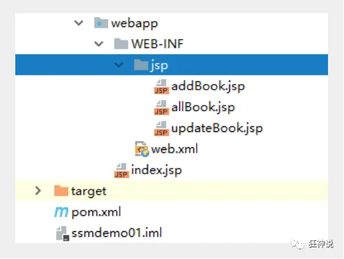


> 小结及展望

这个是同学们的第一个SSM整合案例，一定要烂熟于心！

SSM框架的重要程度是不言而喻的，学到这里，大家已经可以进行基本网站的单独开发。但是这只是增删改查的基本操作。可以说学到这里，大家才算是真正的步入了后台开发的门。也就是能找一个后台相关工作的底线。

或许很多人，工作就做这些事情，但是对于个人的提高来说，还远远不够！

我们后面还要学习一些 SpringMVC 的知识！

- Ajax  和  Json
- 文件上传和下载
- 拦截器

# 六、Json交互处理

##  什么是JSON？

- JSON(JavaScript Object Notation, JS 对象标记) 是一种轻量级的数据交换格式，目前使用特别广泛。
- 采用完全独立于编程语言的**文本格式**来存储和表示数据。
- 简洁和清晰的层次结构使得 JSON 成为理想的数据交换语言。
- 易于人阅读和编写，同时也易于机器解析和生成，并有效地提升网络传输效率。

在 JavaScript 语言中，一切都是对象。因此，任何JavaScript 支持的类型都可以通过 JSON 来表示，例如字符串、数字、对象、数组等。看看他的要求和语法格式：

- 对象表示为键值对，数据由逗号分隔
- 花括号保存对象
- 方括号保存数组

**JSON 键值对**是用来保存 JavaScript 对象的一种方式，和 JavaScript 对象的写法也大同小异，键/值对组合中的键名写在前面并用双引号 "" 包裹，使用冒号 : 分隔，然后紧接着值：

```json
{"name": "QinJiang"}
{"age": "3"}
{"sex": "男"}
```

很多人搞不清楚 JSON 和 JavaScript 对象的关系，甚至连谁是谁都不清楚。其实，可以这么理解：

JSON 是 JavaScript 对象的字符串表示法，它使用文本表示一个 JS 对象的信息，本质是一个字符串。

```javascript
var obj = {a: 'Hello', b: 'World'}; //这是一个对象，注意键名也是可以使用引号包裹的
var json = '{"a": "Hello", "b": "World"}'; //这是一个 JSON 字符串，本质是一个字符串
```


## JSON 和 JavaScript 对象互转

要实现从JSON字符串转换为JavaScript 对象，使用 JSON.parse() 方法：

```javascript
var obj = JSON.parse('{"a": "Hello", "b": "World"}');
//结果是 {a: 'Hello', b: 'World'}
```

要实现从JavaScript 对象转换为JSON字符串，使用 JSON.stringify() 方法：

```javascript
var json = JSON.stringify({a: 'Hello', b: 'World'});
//结果是 '{"a": "Hello", "b": "World"}'
```


**代码测试**

1、新建一个module ，springmvc-05-json ， 添加web的支持

2、在web目录下新建一个 json-1.html ， 编写测试内容

```html
<!DOCTYPE html>
<html lang="en">
<head>
   <meta charset="UTF-8">
   <title>JSON_秦疆</title>
</head>
<body>

<script type="text/javascript">
   //编写一个js的对象
   var user = {
       name:"秦疆",
       age:3,
       sex:"男"
  };
   //将js对象转换成json字符串
   var str = JSON.stringify(user);
   console.log(str);
   
   //将json字符串转换为js对象
   var user2 = JSON.parse(str);
   console.log(user2.age,user2.name,user2.sex);

</script>

</body>
</html>
```

3、在IDEA中使用浏览器打开，查看控制台输出！

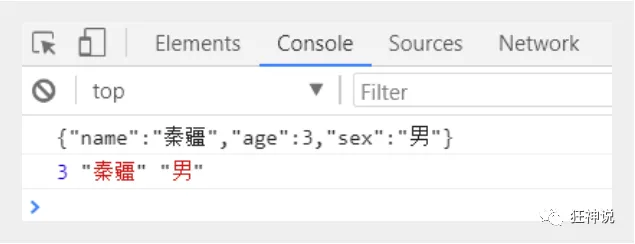


## Controller返回JSON数据

Jackson应该是目前比较好的json解析工具了

当然工具不止这一个，比如还有阿里巴巴的 fastjson 等等。

我们这里使用Jackson，使用它需要导入它的jar包；

```xml
<!-- https://mvnrepository.com/artifact/com.fasterxml.jackson.core/jackson-core -->
<dependency>
   <groupId>com.fasterxml.jackson.core</groupId>
   <artifactId>jackson-databind</artifactId>
   <version>2.9.8</version>
</dependency>
```

配置SpringMVC需要的配置

web.xml

```xml
<?xml version="1.0" encoding="UTF-8"?>
<web-app xmlns="http://xmlns.jcp.org/xml/ns/javaee"
        xmlns:xsi="http://www.w3.org/2001/XMLSchema-instance"
        xsi:schemaLocation="http://xmlns.jcp.org/xml/ns/javaee http://xmlns.jcp.org/xml/ns/javaee/web-app_4_0.xsd"
        version="4.0">

   <!--1.注册servlet-->
   <servlet>
       <servlet-name>SpringMVC</servlet-name>
       <servlet-class>org.springframework.web.servlet.DispatcherServlet</servlet-class>
       <!--通过初始化参数指定SpringMVC配置文件的位置，进行关联-->
       <init-param>
           <param-name>contextConfigLocation</param-name>
           <param-value>classpath:springmvc-servlet.xml</param-value>
       </init-param>
       <!-- 启动顺序，数字越小，启动越早 -->
       <load-on-startup>1</load-on-startup>
   </servlet>

   <!--所有请求都会被springmvc拦截 -->
   <servlet-mapping>
       <servlet-name>SpringMVC</servlet-name>
       <url-pattern>/</url-pattern>
   </servlet-mapping>

   <filter>
       <filter-name>encoding</filter-name>
       <filter-class>org.springframework.web.filter.CharacterEncodingFilter</filter-class>
       <init-param>
           <param-name>encoding</param-name>
           <param-value>utf-8</param-value>
       </init-param>
   </filter>
   <filter-mapping>
       <filter-name>encoding</filter-name>
       <url-pattern>/</url-pattern>
   </filter-mapping>

</web-app>
```

springmvc-servlet.xml

```xml
<?xml version="1.0" encoding="UTF-8"?>
<beans xmlns="http://www.springframework.org/schema/beans"
      xmlns:xsi="http://www.w3.org/2001/XMLSchema-instance"
      xmlns:context="http://www.springframework.org/schema/context"
      xmlns:mvc="http://www.springframework.org/schema/mvc"
      xsi:schemaLocation="http://www.springframework.org/schema/beans
       http://www.springframework.org/schema/beans/spring-beans.xsd
       http://www.springframework.org/schema/context
       https://www.springframework.org/schema/context/spring-context.xsd
       http://www.springframework.org/schema/mvc
       https://www.springframework.org/schema/mvc/spring-mvc.xsd">

   <!-- 自动扫描指定的包，下面所有注解类交给IOC容器管理 -->
   <context:component-scan base-package="com.kuang.controller"/>

   <!-- 视图解析器 -->
   <bean class="org.springframework.web.servlet.view.InternalResourceViewResolver"
         id="internalResourceViewResolver">
       <!-- 前缀 -->
       <property name="prefix" value="/WEB-INF/jsp/" />
       <!-- 后缀 -->
       <property name="suffix" value=".jsp" />
   </bean>

</beans>
```

我们随便编写一个User的实体类，然后我们去编写我们的测试Controller；

```java
package com.kuang.pojo;

import lombok.AllArgsConstructor;
import lombok.Data;
import lombok.NoArgsConstructor;

//需要导入lombok
@Data
@AllArgsConstructor
@NoArgsConstructor
public class User {

   private String name;
   private int age;
   private String sex;
   
}
```

这里我们需要两个新东西，一个是@ResponseBody，一个是ObjectMapper对象，我们看下具体的用法

编写一个Controller；

```java
@Controller
public class UserController {

   @RequestMapping("/json1")
   @ResponseBody //加上@ResponseBody之后，返回的数据就不会走视图解析器，而是返回字符串
   public String json1() throws JsonProcessingException {
       //创建一个jackson的对象映射器，用来解析数据  
       ObjectMapper mapper = new ObjectMapper();
       //创建一个对象
       User user = new User("秦疆1号", 3, "男");
       //将我们的对象解析成为json格式
       String str = mapper.writeValueAsString(user);
       //由于@ResponseBody注解，这里会将str转成json格式返回；十分方便
       return str;
  }

}
```

配置Tomcat ， 启动测试一下！

http://localhost:8080/json1


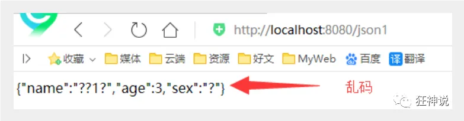

发现出现了乱码问题，我们需要设置一下他的编码格式为utf-8，以及它返回的类型；

通过@RequestMaping的produces属性来实现，修改下代码

```java
//produces:指定响应体返回类型和编码
@RequestMapping(value = "/json1",produces = "application/json;charset=utf-8")
```

再次测试， http://localhost:8080/json1 ， 乱码问题OK！


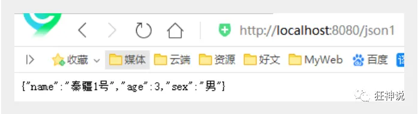

【注意：使用json记得处理乱码问题】


> 代码优化

### 乱码统一解决（使用Jackson时）

上一种方法比较麻烦，如果项目中有许多请求则每一个都要添加，可以通过Spring配置统一指定，这样就不用每次都去处理了！

我们可以在springmvc的配置文件上添加一段消息StringHttpMessageConverter转换配置！

```xml
<mvc:annotation-driven>
   <mvc:message-converters register-defaults="true">
       <bean class="org.springframework.http.converter.StringHttpMessageConverter">
           <constructor-arg value="UTF-8"/>
       </bean>
       <bean class="org.springframework.http.converter.json.MappingJackson2HttpMessageConverter">
           <property name="objectMapper">
               <bean class="org.springframework.http.converter.json.Jackson2ObjectMapperFactoryBean">
                   <property name="failOnEmptyBeans" value="false"/>
               </bean>
           </property>
       </bean>
   </mvc:message-converters>
</mvc:annotation-driven>
```

### 返回json字符串统一解决

在类上直接使用 **@RestController** ，这样子，里面所有的方法都只会返回 json 字符串了，不用再每一个都添加@ResponseBody ！我们在前后端分离开发中，一般都使用 @RestController ，十分便捷！

而@ResponseBody通常配合@Controller使用，因为@Controller标注的类中的方法返回的数据仍会走视图解析器，在该方法中选择需要返回字符串的方法加上@ResponseBody注解。

```java
@RestController
public class UserController {

   //produces:指定响应体返回类型和编码
   @RequestMapping(value = "/json1")
   public String json1() throws JsonProcessingException {
       //创建一个jackson的对象映射器，用来解析数据
       ObjectMapper mapper = new ObjectMapper();
       //创建一个对象
       User user = new User("秦疆1号", 3, "男");
       //将我们的对象解析成为json格式
       String str = mapper.writeValueAsString(user);
       //由于@ResponseBody注解，这里会将str转成json格式返回；十分方便
       return str;
  }

}
```

启动tomcat测试，结果都正常输出！


### 输出集合

增加一个新的方法

```java
@RequestMapping("/json2")
public String json2() throws JsonProcessingException {

   //创建一个jackson的对象映射器，用来解析数据
   ObjectMapper mapper = new ObjectMapper();
   //创建一个对象
   User user1 = new User("秦疆1号", 3, "男");
   User user2 = new User("秦疆2号", 3, "男");
   User user3 = new User("秦疆3号", 3, "男");
   User user4 = new User("秦疆4号", 3, "男");
   List<User> list = new ArrayList<User>();
   list.add(user1);
   list.add(user2);
   list.add(user3);
   list.add(user4);

   //将我们的对象解析成为json格式
   String str = mapper.writeValueAsString(list);
   return str;
}
```

运行结果 : 十分完美，没有任何问题！

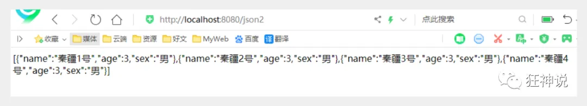

### 输出时间对象

增加一个新的方法

```java
@RequestMapping("/json3")
public String json3() throws JsonProcessingException {

   ObjectMapper mapper = new ObjectMapper();

   //创建时间一个对象，java.util.Date
   Date date = new Date();
   //将我们的对象解析成为json格式
   String str = mapper.writeValueAsString(date);
   return str;
}
```

运行结果 :


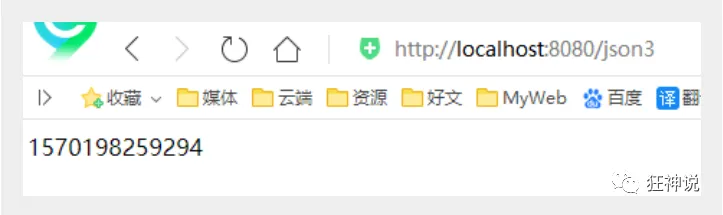

- 默认日期格式会变成一个数字，是1970年1月1日到当前日期的毫秒数！
- Jackson 默认是会把时间转成timestamps形式

**解决方案：取消timestamps形式 ， 自定义时间格式**

```java
@RequestMapping("/json4")
public String json4() throws JsonProcessingException {

   ObjectMapper mapper = new ObjectMapper();

   //不使用时间戳的方式
   mapper.configure(SerializationFeature.WRITE_DATES_AS_TIMESTAMPS, false);
   //自定义日期格式对象
   SimpleDateFormat sdf = new SimpleDateFormat("yyyy-MM-dd HH:mm:ss");
   //指定日期格式
   mapper.setDateFormat(sdf);

   Date date = new Date();
   String str = mapper.writeValueAsString(date);

   return str;
}
```

运行结果 : 成功的输出了时间！


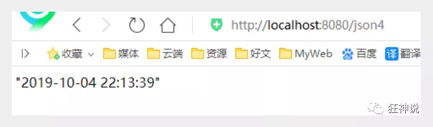

> 抽取为工具类

**如果要经常使用的话，这样是比较麻烦的，我们可以将这些代码封装到一个工具类中；我们去编写下**

```java
package com.kuang.utils;

import com.fasterxml.jackson.core.JsonProcessingException;
import com.fasterxml.jackson.databind.ObjectMapper;
import com.fasterxml.jackson.databind.SerializationFeature;

import java.text.SimpleDateFormat;

public class JsonUtils {
   
   public static String getJson(Object object) {
       return getJson(object,"yyyy-MM-dd HH:mm:ss");
  }

   public static String getJson(Object object,String dateFormat) {
       ObjectMapper mapper = new ObjectMapper();
       //不使用时间差的方式
       mapper.configure(SerializationFeature.WRITE_DATES_AS_TIMESTAMPS, false);
       //自定义日期格式对象
       SimpleDateFormat sdf = new SimpleDateFormat(dateFormat);
       //指定日期格式
       mapper.setDateFormat(sdf);
       try {
           return mapper.writeValueAsString(object);
      } catch (JsonProcessingException e) {
           e.printStackTrace();
      }
       return null;
  }
}
```

我们使用工具类，代码就更加简洁了！

```java
@RequestMapping("/json5")
public String json5() throws JsonProcessingException {
   Date date = new Date();
   String json = JsonUtils.getJson(date);
   return json;
}
```

大功告成！完美！


### FastJson

fastjson.jar是阿里开发的一款专门用于Java开发的包，可以方便的实现json对象与JavaBean对象的转换，实现JavaBean对象与json字符串的转换，实现json对象与json字符串的转换。实现json的转换方法很多，最后的实现结果都是一样的。

fastjson 的 pom依赖！

```xml
<dependency>
   <groupId>com.alibaba</groupId>
   <artifactId>fastjson</artifactId>
   <version>1.2.60</version>
</dependency>
```

fastjson 三个主要的类：

**JSONObject  代表 json 对象** 

- JSONObject实现了Map接口, 猜想 JSONObject底层操作是由Map实现的。
- JSONObject对应json对象，通过各种形式的get()方法可以获取json对象中的数据，也可利用诸如size()，isEmpty()等方法获取"键：值"对的个数和判断是否为空。其本质是通过实现Map接口并调用接口中的方法完成的。

**JSONArray  代表 json 对象数组**

- 内部是有List接口中的方法来完成操作的。

**JSON代表 JSONObject和JSONArray的转化**

- JSON类源码分析与使用
- 仔细观察这些方法，主要是实现json对象，json对象数组，javabean对象，json字符串之间的相互转化。


**代码测试，我们新建一个FastJsonDemo 类**

```java
package com.kuang.controller;

import com.alibaba.fastjson.JSON;
import com.alibaba.fastjson.JSONObject;
import com.kuang.pojo.User;

import java.util.ArrayList;
import java.util.List;

public class FastJsonDemo {
   public static void main(String[] args) {
       //创建一个对象
       User user1 = new User("秦疆1号", 3, "男");
       User user2 = new User("秦疆2号", 3, "男");
       User user3 = new User("秦疆3号", 3, "男");
       User user4 = new User("秦疆4号", 3, "男");
       List<User> list = new ArrayList<User>();
       list.add(user1);
       list.add(user2);
       list.add(user3);
       list.add(user4);

       System.out.println("*******Java对象 转 JSON字符串*******");
       String str1 = JSON.toJSONString(list);
       System.out.println("JSON.toJSONString(list)==>"+str1);
       String str2 = JSON.toJSONString(user1);
       System.out.println("JSON.toJSONString(user1)==>"+str2);

       System.out.println("\n****** JSON字符串 转 Java对象*******");
       User jp_user1=JSON.parseObject(str2,User.class);
       System.out.println("JSON.parseObject(str2,User.class)==>"+jp_user1);

       System.out.println("\n****** Java对象 转 JSON对象 ******");
       JSONObject jsonObject1 = (JSONObject) JSON.toJSON(user2);
       System.out.println("(JSONObject) JSON.toJSON(user2)==>"+jsonObject1.getString("name"));

       System.out.println("\n****** JSON对象 转 Java对象 ******");
       User to_java_user = JSON.toJavaObject(jsonObject1, User.class);
       System.out.println("JSON.toJavaObject(jsonObject1, User.class)==>"+to_java_user);
  }
}
```

这种工具类，我们只需要掌握使用就好了，在使用的时候在根据具体的业务去找对应的实现。和以前的commons-io那种工具包一样，拿来用就好了！


Json在我们数据传输中十分重要，一定要学会使用！


# 七、Ajax研究

### 7.1、简介

- **AJAX = Asynchronous JavaScript and XML（异步的 JavaScript 和 XML）。**
- AJAX 是一种在无需重新加载整个网页的情况下，能够更新部分网页的技术。
- **Ajax 不是一种新的编程语言，而是一种用于创建更好更快以及交互性更强的Web应用程序的技术。**
- 在 2005 年，Google 通过其 Google Suggest 使 AJAX 变得流行起来。Google Suggest能够自动帮你完成搜索单词。
- Google Suggest 使用 AJAX 创造出动态性极强的 web 界面：当您在谷歌的搜索框输入关键字时，JavaScript 会把这些字符发送到服务器，然后服务器会返回一个搜索建议的列表。
- 就和国内百度的搜索框一样!
- 传统的网页(即不用ajax技术的网页)，想要更新内容或者提交一个表单，都需要重新加载整个网页。
- 使用ajax技术的网页，通过在后台服务器进行少量的数据交换，就可以实现异步局部更新。
- 使用Ajax，用户可以创建接近本地桌面应用的直接、高可用、更丰富、更动态的Web用户界面。


### 7.2、伪造Ajax

我们可以使用前端的一个标签来伪造一个ajax的样子。iframe标签

1. 新建一个module ：sspringmvc-06-ajax ， 导入web支持！

2. 编写一个 ajax-frame.html 使用 iframe 测试，感受下效果

   ```html
   <!DOCTYPE html>
   <html>
   <head lang="en">
      <meta charset="UTF-8">
      <title>kuangshen</title>
   </head>
   <body>
   
   <script type="text/javascript">
      window.onload = function(){
          var myDate = new Date();
          document.getElementById('currentTime').innerText = myDate.getTime();
     };
   
      function LoadPage(){
          var targetUrl =  document.getElementById('url').value;
          console.log(targetUrl);
          document.getElementById("iframePosition").src = targetUrl;
     }
   
   </script>
   
   <div>
      <p>请输入要加载的地址：<span id="currentTime"></span></p>
      <p>
          <input id="url" type="text" value="https://www.baidu.com/"/>
          <input type="button" value="提交" onclick="LoadPage()">
      </p>
   </div>
   
   <div>
      <h3>加载页面位置：</h3>
      <iframe id="iframePosition" style="width: 100%;height: 500px;"></iframe>
   </div>
   
   </body>
   </html>
   
   ```

3. 使用IDEA开浏览器测试一下！

**利用AJAX可以做：**

- 注册时，输入用户名自动检测用户是否已经存在。
- 登陆时，提示用户名密码错误
- 删除数据行时，将行ID发送到后台，后台在数据库中删除，数据库删除成功后，在页面DOM中将数据行也删除。
- ....等等

### 7.3、jQuery.ajax

- 纯JS原生实现Ajax我们不去讲解这里，直接使用jquery提供的，方便学习和使用，避免重复造轮子，有兴趣的同学可以去了解下JS原生XMLHttpRequest ！
- Ajax的核心是XMLHttpRequest对象(XHR)。XHR为向服务器发送请求和解析服务器响应提供了接口。能够以异步方式从服务器获取新数据。
- jQuery 提供多个与 AJAX 有关的方法。
- 通过 jQuery AJAX 方法，您能够使用 HTTP Get 和 HTTP Post 从远程服务器上请求文本、HTML、XML 或 JSON – 同时您能够把这些外部数据直接载入网页的被选元素中。
- jQuery 不是生产者，而是大自然搬运工。
- jQuery Ajax本质就是 XMLHttpRequest，对他进行了封装，方便调用！

```javascript
jQuery.ajax(...)
      部分参数：
            url：请求地址
            type：请求方式，GET、POST（1.9.0之后用method）
        headers：请求头
            data：要发送的数据
    contentType：即将发送信息至服务器的内容编码类型(默认: "application/x-www-form-urlencoded; charset=UTF-8")
          async：是否异步
        timeout：设置请求超时时间（毫秒）
      beforeSend：发送请求前执行的函数(全局)
        complete：完成之后执行的回调函数(全局)
        success：成功之后执行的回调函数(全局)
          error：失败之后执行的回调函数(全局)
        accepts：通过请求头发送给服务器，告诉服务器当前客户端可接受的数据类型
        dataType：将服务器端返回的数据转换成指定类型
          "xml": 将服务器端返回的内容转换成xml格式
          "text": 将服务器端返回的内容转换成普通文本格式
          "html": 将服务器端返回的内容转换成普通文本格式，在插入DOM中时，如果包含JavaScript标签，则会尝试去执行。
        "script": 尝试将返回值当作JavaScript去执行，然后再将服务器端返回的内容转换成普通文本格式
          "json": 将服务器端返回的内容转换成相应的JavaScript对象
        "jsonp": JSONP 格式使用 JSONP 形式调用函数时，如 "myurl?callback=?" jQuery 将自动替换 ? 为正确的函数名，以执行回调函数

```

**我们来个简单的测试，使用最原始的HttpServletResponse处理 , .最简单 , 最通用**

1. 配置web.xml 和 springmvc的配置文件【记得静态资源过滤和注解驱动配置上】

   ```xml
   <?xml version="1.0" encoding="UTF-8"?>
   <beans xmlns="http://www.springframework.org/schema/beans"
         xmlns:xsi="http://www.w3.org/2001/XMLSchema-instance"
         xmlns:context="http://www.springframework.org/schema/context"
         xmlns:mvc="http://www.springframework.org/schema/mvc"
         xsi:schemaLocation="http://www.springframework.org/schema/beans
          http://www.springframework.org/schema/beans/spring-beans.xsd
          http://www.springframework.org/schema/context
          https://www.springframework.org/schema/context/spring-context.xsd
          http://www.springframework.org/schema/mvc
          https://www.springframework.org/schema/mvc/spring-mvc.xsd">
   
      <!-- 自动扫描指定的包，下面所有注解类交给IOC容器管理 -->
      <context:component-scan base-package="com.kuang.controller"/>
       <!--静态资源过滤-->
      <mvc:default-servlet-handler />
       <!--注解驱动配-->
      <mvc:annotation-driven />
   
      <!-- 视图解析器 -->
      <bean class="org.springframework.web.servlet.view.InternalResourceViewResolver"
            id="internalResourceViewResolver">
          <!-- 前缀 -->
          <property name="prefix" value="/WEB-INF/jsp/" />
          <!-- 后缀 -->
          <property name="suffix" value=".jsp" />
      </bean>
   
   </beans>
   
   ```

2. 编写一个AjaxController

   ```java
   @Controller
   public class AjaxController {
   
      @RequestMapping("/a1")
      public void ajax1(String name , HttpServletResponse response) throws IOException {
          if ("admin".equals(name)){
              response.getWriter().print("true");
         }else{
              response.getWriter().print("false");
         }
     }
   
   }
   
   ```

3. 导入jquery ， 可以使用在线的CDN ， 也可以下载导入

   ```js
   <script src="https://code.jquery.com/jquery-3.1.1.min.js"></script>
   <script src="${pageContext.request.contextPath}/statics/js/jquery-3.1.1.min.js"></script>
   
   ```

4. 编写index.jsp测试

   ```jsp
   <%@ page contentType="text/html;charset=UTF-8" language="java" %>
   <html>
    <head>
      <title>$Title$</title>
     <%--<script src="https://code.jquery.com/jquery-3.1.1.min.js"></script>--%>
      <script src="${pageContext.request.contextPath}/statics/js/jquery-3.1.1.min.js"></script>
      <script>
          function a1(){
              $.post({
                  url:"${pageContext.request.contextPath}/a1",
                  data:{'name':$("#txtName").val()},
                  success:function (data,status) {
                      alert(data);
                      alert(status);
                 }
             });
         }
      </script>
    </head>
    <body>
   
   <%--onblur：失去焦点触发事件--%>
   用户名:<input type="text" id="txtName" onblur="a1()"/>
   
    </body>
   </html>
   
   ```

5. 启动tomcat测试！打开浏览器的控制台，当我们鼠标离开输入框的时候，可以看到发出了一个ajax的请求！是后台返回给我们的结果！测试成功！

### 7.4、**Springmvc实现**

1. 实体类user（使用了lombok插件，可以自己写实现类方法）

   ```java
   @Data
   @AllArgsConstructor
   @NoArgsConstructor
   public class User {
   
      private String name;
      private int age;
      private String sex;
   
   }
   
   ```

2. 我们来获取一个集合对象，展示到前端页面

   ```java
   @RequestMapping("/a2")
   public List<User> ajax2(){
      List<User> list = new ArrayList<User>();
      list.add(new User("秦疆1号",3,"男"));
      list.add(new User("秦疆2号",3,"男"));
      list.add(new User("秦疆3号",3,"男"));
      return list; //由于@RestController注解，将list转成json格式返回
   }
   
   ```

3. 前端页面

   ```jsp
   <%@ page contentType="text/html;charset=UTF-8" language="java" %>
   <html>
   <head>
       <title>Title</title>
       <script src="${pageContext.request.contextPath}/static/js/jquery-3.4.1.js"></script>
       <script>
           $(function () {
               $("#btn").click(function () {
                   // console.log('点击事件成功')
                   // $.post(url,param,[可以省略],success)
                   $.post("${pageContext.request.contextPath}/a2",function (data) {
                       console.log(data[0].name);
                       let html =  "";
                       for (let i = 0; i < data.length; i++) {
                           html += `<tr>
                                       <td>${"${data[i].name}"}</td>
                                       <td>${"${data[i].age}"}</td>
                                       <td>${"${data[i].sex}"}</td>
                                   </tr>`
                       }
                       $("#content").html(html)
                       console.log(html)
                   })
               })
           })
       </script>
   </head>
   <body>
   <input type="button" value="加载数据" id="btn">
   <table>
       <thead>
           <tr>
               <td>姓名</td>
               <td>年龄</td>
               <td>性别</td>
           </tr>
       </thead>
       <tbody id="content">
           <%--数据：后台--%>
       </tbody>
   </table>
   </body>
   </html>
   
   ```

**成功实现了数据回显！可以体会一下Ajax的好处！**


### 7.5、注册提示效果

1. 我们写一个Controller

   ```java
   @RequestMapping("/a3")
   public String ajax3(String name,String pwd){
      String msg = "";
      //模拟数据库中存在数据
      if (name!=null){
          if ("admin".equals(name)){
              msg = "OK";
         }else {
              msg = "用户名输入错误";
         }
     }
      if (pwd!=null){
          if ("123456".equals(pwd)){
              msg = "OK";
         }else {
              msg = "密码输入有误";
         }
     }
      return msg; //由于@RestController注解，将msg转成json格式返回
   }
   
   ```

2. 前端页面 login.jsp

   ```jsp
   <%@ page contentType="text/html;charset=UTF-8" language="java" %>
   <html>
   <head>
      <title>ajax</title>
      <script src="${pageContext.request.contextPath}/statics/js/jquery-3.1.1.min.js"></script>
      <script>
   
          function a1(){
              $.post({
                  url:"${pageContext.request.contextPath}/a3",
                  data:{'name':$("#name").val()},
                  success:function (data) {
                      if (data.toString()=='OK'){
                          $("#userInfo").css("color","green");
                     }else {
                          $("#userInfo").css("color","red");
                     }
                      $("#userInfo").html(data);
                 }
             });
         }
          function a2(){
              $.post({
                  url:"${pageContext.request.contextPath}/a3",
                  data:{'pwd':$("#pwd").val()},
                  success:function (data) {
                      if (data.toString()=='OK'){
                          $("#pwdInfo").css("color","green");
                     }else {
                          $("#pwdInfo").css("color","red");
                     }
                      $("#pwdInfo").html(data);
                 }
             });
         }
   
      </script>
   </head>
   <body>
   <p>
     用户名:<input type="text" id="name" onblur="a1()"/>
      <span id="userInfo"></span>
   </p>
   <p>
     密码:<input type="text" id="pwd" onblur="a2()"/>
      <span id="pwdInfo"></span>
   </p>
   </body>
   </html>
   
   ```

3. <font color=red>记得处理json乱码问题</font>

   ```xml
   <!--JSON乱码问题配置-->
       <mvc:annotation-driven>
           <mvc:message-converters register-defaults="true">
               <bean class="org.springframework.http.converter.StringHttpMessageConverter">
                   <constructor-arg value="UTF-8"/>
               </bean>
               <bean class="org.springframework.http.converter.json.MappingJackson2HttpMessageConverter">
                   <property name="objectMapper">
                       <bean class="org.springframework.http.converter.json.Jackson2ObjectMapperFactoryBean">
                           <property name="failOnEmptyBeans" value="false"/>
                       </bean>
                   </property>
               </bean>
           </mvc:message-converters>
       </mvc:annotation-driven>
   
   
   ```

4. 测试一下效果，动态请求响应，局部刷新，就是如此！

   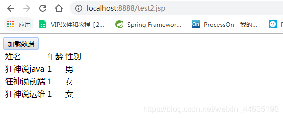


### 7.6、获取baidu接口Demo

1. JSONP.html

   ```html
   <!DOCTYPE HTML>
   <html>
   <head>
      <meta http-equiv="Content-Type" content="text/html; charset=utf-8">
      <title>JSONP百度搜索</title>
      <style>
          #q{
              width: 500px;
              height: 30px;
              border:1px solid #ddd;
              line-height: 30px;
              display: block;
              margin: 0 auto;
              padding: 0 10px;
              font-size: 14px;
         }
          #ul{
              width: 520px;
              list-style: none;
              margin: 0 auto;
              padding: 0;
              border:1px solid #ddd;
              margin-top: -1px;
              display: none;
         }
          #ul li{
              line-height: 30px;
              padding: 0 10px;
         }
          #ul li:hover{
              background-color: #f60;
              color: #fff;
         }
      </style>
      <script>
   
          // 2.步骤二
          // 定义demo函数 (分析接口、数据)
          function demo(data){
              var Ul = document.getElementById('ul');
              var html = '';
              // 如果搜索数据存在 把内容添加进去
              if (data.s.length) {
                  // 隐藏掉的ul显示出来
                  Ul.style.display = 'block';
                  // 搜索到的数据循环追加到li里
                  for(var i = 0;i<data.s.length;i++){
                      html += '<li>'+data.s[i]+'</li>';
                 }
                  // 循环的li写入ul
                  Ul.innerHTML = html;
             }
         }
   
          // 1.步骤一
          window.onload = function(){
              // 获取输入框和ul
              var Q = document.getElementById('q');
              var Ul = document.getElementById('ul');
   
              // 事件鼠标抬起时候
              Q.onkeyup = function(){
                  // 如果输入框不等于空
                  if (this.value != '') {
                      // ☆☆☆☆☆☆☆☆☆☆☆☆☆☆☆☆☆☆JSONPz重点☆☆☆☆☆☆☆☆☆☆☆☆☆☆☆☆☆☆☆☆
                      // 创建标签
                      var script = document.createElement('script');
                      //给定要跨域的地址 赋值给src
                      //这里是要请求的跨域的地址 我写的是百度搜索的跨域地址
                      script.src = 'https://sp0.baidu.com/5a1Fazu8AA54nxGko9WTAnF6hhy/su?wd='+this.value+'&cb=demo';
                      // 将组合好的带src的script标签追加到body里
                      document.body.appendChild(script);
                 }
             }
         }
      </script>
   </head>
   
   <body>
   <input type="text" id="q" />
   <ul id="ul">
   
   </ul>
   </body>
   </html>
   
   ```

2. 测试

   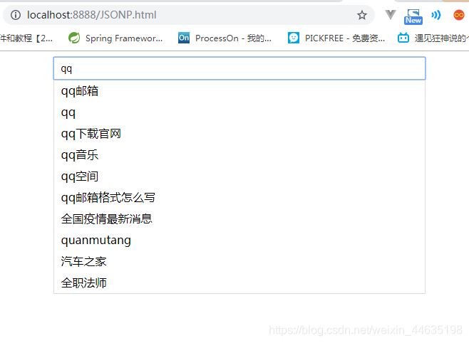


# 八、拦截器

### 8.1、概述

- SpringMVC的处理器拦截器类似于Servlet开发中的过滤器Filter,用于对处理器进行预处理和后处理。
- 开发者可以自己定义一些拦截器来实现特定的功能。

**过滤器与拦截器的区别：**拦截器是<font color=red>AOP思想</font>的具体应用。

**过滤器**

- servlet规范中的一部分，任何javaweb工程都可以使用
- 在url-pattern中配置了/*之后，可以对所有要访问的资源进行拦截

**拦截器** 

- 拦截器是SpringMVC框架自己的，只有使用了SpringMVC框架的工程才能使用
- 拦截器只会拦截访问的控制器方法， 如果访问的是jsp/html/css/image/js是不会进行拦截的

### 8.2、自定义拦截器

1. 新建一个Moudule ， springmvc-Interceptor  ， 添加web支持

2. 配置web.xml 和 springmvc-servlet.xml 文件

3. 编写一个拦截器（必须实现<font color=red> HandlerInterceptor 接口</font>）

   ```java
   package nuc.ss.config;
   
   import org.springframework.web.servlet.HandlerInterceptor;
   import org.springframework.web.servlet.ModelAndView;
   
   import javax.servlet.http.HttpServletRequest;
   import javax.servlet.http.HttpServletResponse;
   
   public class MyInterceptor implements HandlerInterceptor {
       //return true; 执行下一个拦截器，放行
       //return false; 不执行下一个拦截器，拦截
       public boolean preHandle(HttpServletRequest request, HttpServletResponse response, Object handler) throws Exception {
           System.out.println("===========处理前===========");
           return true;
       }
       //日志
       public void postHandle(HttpServletRequest request, HttpServletResponse response, Object handler, ModelAndView modelAndView) throws Exception {
           System.out.println("===========处理后===========");
   
       }
       //日志
       public void afterCompletion(HttpServletRequest request, HttpServletResponse response, Object handler, Exception ex) throws Exception {
           System.out.println("===========清理===========");
   
       }
   }
   
   
   ```

4. 在springmvc的配置文件中配置拦截器

   ```xml
   <!--拦截器配置-->
   <mvc:interceptors>
       <mvc:interceptor>
           <!--包括这个请求下面的所有请求-->
           <mvc:mapping path="/**"/>
           <bean class="nuc.ss.config.MyInterceptor"/>
       </mvc:interceptor>
   
   </mvc:interceptors>
   
   ```

5. 编写一个Controller，接收请求

   ```java
   package nuc.ss.controller;
   
   import org.springframework.web.bind.annotation.GetMapping;
   import org.springframework.web.bind.annotation.RestController;
   
   @RestController
   public class TestController {
       @GetMapping("/t1")
       public String test() {
           System.out.println("TestController.test");
           return "ok";
       }
   }
   
   ```

6. 启动tomcat 测试一下！(http://localhost:8888/t1)

### 9.3、验证用户是否登录 (认证用户)

**实现思路**

1. 有一个登陆页面，需要写一个controller访问页面。
2. 登陆页面有一提交表单的动作。需要在controller中处理。判断用户名密码是否正确。如果正确，向session中写入用户信息。*返回登陆成功。*
3. 拦截用户请求，判断用户是否登陆。如果用户已经登陆。放行， 如果用户未登陆，跳转到登陆页面

**测试：**

1. 编写一个登陆页面  login.jsp

   ```jsp
   <%@ page contentType="text/html;charset=UTF-8" language="java" %>
   <html>
   <head>
       <title>登录</title>
   </head>
   <body>
   <%--在web-inf下面的所有页面或者资源，只能通过controller或者Servlet进行访问--%>
   <h1>登录页面</h1>
   
   <form action="${pageContext.request.contextPath}/user/login" method="post">
       用户名：<input type="text" name="username">
       密码：<input type="text" name="password">
       <input type="submit" value="提交">
   </form>
   </body>
   </html>
   
   
   ```

2. 编写一个Controller处理请求

   ```java
   @Controller
   @RequestMapping("/user")
   public class LoginController {
       @RequestMapping("/main")
       public String main() {
           return "main";
       }
   
       @RequestMapping("/goLogin")
       public String login() {
           return "login";
       }
       @RequestMapping("/login")
       public String login(HttpSession session, String username, String password, Model model) {
   
           //把用户的信息存在session中
           session.setAttribute("userLoginInfo",username);
           model.addAttribute("password",password);
           model.addAttribute("username",username);
           return "main";
       }
   
       @RequestMapping("/goOut")
       public String goOut(HttpSession sessionl) {
           sessionl.removeAttribute("userLoginInfo");
           return "login";
       }
   }
   
   
   ```

3. 编写一个登陆成功的页面 main.jsp

   ```jsp
   <%@ page contentType="text/html;charset=UTF-8" language="java" %>
   <html>
   <head>
       <title>首页</title>
   </head>
   <body>
   <h1>首页</h1>
   <span>${password}</span>
   <span>${username}</span>
   
   <p>
       <a href="${pageContext.request.contextPath}/user/goOut">注销</a>
   </p>
   
   </body>
   </html>
   
   
   ```

4. 在 index 页面上测试跳转！启动Tomcat 测试，未登录也可以进入主页！

   ```jsp
   <%@ page contentType="text/html;charset=UTF-8" language="java" %>
   <html>
   <head>
     <title>index</title>
   </head>
   <body>
   <h1><a href="${pageContext.request.contextPath}/user/goLogin">登录页面</a></h1>
   <h1><a href="${pageContext.request.contextPath}/user/main">首页</a></h1>
   
   </body>
   </html>
   
   ```

5. 编写用户登录拦截器

   ```java
   package nuc.ss.config;
   
   import org.springframework.web.servlet.HandlerInterceptor;
   
   import javax.servlet.http.HttpServletRequest;
   import javax.servlet.http.HttpServletResponse;
   import javax.servlet.http.HttpSession;
   
   public class LoginInterceptor implements HandlerInterceptor {
       public boolean preHandle(HttpServletRequest request, HttpServletResponse response, Object handler) throws Exception {
           HttpSession session = request.getSession();
           //放行:判断什么情况下登录
   
           //登录页面也会放行
           if (request.getRequestURI().contains("goLogin")) {
               return true;
           }
           if (request.getRequestURI().contains("login")) {
               return true;
           }
           if (session.getAttribute("userLoginInfo") != null) {
               return true;
           }
           //判断什么情况下没有登录
           request.getRequestDispatcher("/WEB-INF/jsp/login.jsp").forward(request,response);
           return false;
       }
   }
   
   
   ```

6. 在Springmvc的配置文件中注册拦截器

   ```xml
   <!--关于拦截器的配置-->
   <mvc:interceptors>
      <mvc:interceptor>
          <mvc:mapping path="/**"/>
          <bean id="loginInterceptor" class="com.kuang.interceptor.LoginInterceptor"/>
      </mvc:interceptor>
   </mvc:interceptors>
   
   ```

7. 再次重启Tomcat测试！

**OK，测试登录拦截功能无误.**

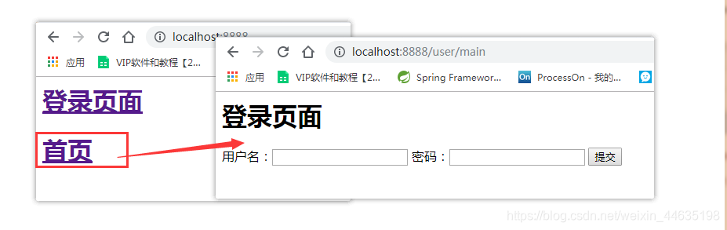


# 九、文件上传和下载

### 9.1、准备工作

- 文件上传是项目开发中最常见的功能之一 ,springMVC 可以很好的支持文件上传。
- SpringMVC上下文中默认没有装配MultipartResolver，因此默认情况下其不能处理文件上传工作。如果想使用Spring的文件上传功能，则需要在上下文中配置MultipartResolver。
- 前端表单要求：为了能上传文件，必须将表单的method设置为POST，并将enctype设置为multipart/form-data。只有在这样的情况下，浏览器才会把用户选择的文件以二进制数据发送给服务器；

**对表单中的 enctype 属性做个详细的说明：**

- application/x-www=form-urlencoded：默认方式，只处理表单域中的 value 属性值，采用这种编码方式的表单会将表单域中的值处理成 URL 编码方式。
- multipart/form-data：这种编码方式会以二进制流的方式来处理表单数据，这种编码方式会把文件域指定文件的内容也封装到请求参数中，不会对字符编码。
- text/plain：除了把空格转换为 "+" 号外，其他字符都不做编码处理，这种方式适用直接通过表单发送邮件。

```html
<form action="" enctype="multipart/form-data" method="post">
   <input type="file" name="file"/>
   <input type="submit">
</form>

```

一旦设置了enctype为multipart/form-data，浏览器即会采用二进制流的方式来处理表单数据，而对于文件上传的处理则涉及在服务器端解析原始的HTTP响应。在2003年，Apache Software Foundation发布了开源的Commons FileUpload组件，其很快成为Servlet/JSP程序员上传文件的最佳选择。

- Servlet3.0规范已经提供方法来处理文件上传，但这种上传需要在Servlet中完成。
- 而Spring MVC则提供了更简单的封装。
- Spring MVC为文件上传提供了直接的支持，这种支持是用即插即用的MultipartResolver实现的。
- Spring MVC使用Apache Commons FileUpload技术实现了一个MultipartResolver实现类：
- CommonsMultipartResolver。因此，<font color=red>SpringMVC的文件上传还需要依赖Apache Commons FileUpload的组件。</font>


### 9.2、文件上传

1. 导入文件上传的jar包，commons-fileupload ， Maven会自动帮我们导入他的依赖包 commons-io包；

   ```xml
   <!--文件上传-->
   <dependency>
      <groupId>commons-fileupload</groupId>
      <artifactId>commons-fileupload</artifactId>
      <version>1.3.3</version>
   </dependency>
   <!--servlet-api导入高版本的-->
   <dependency>
      <groupId>javax.servlet</groupId>
      <artifactId>javax.servlet-api</artifactId>
      <version>4.0.1</version>
   </dependency>
   
   ```

2. 配置bean：multipartResolver

   <font color=red>【**注意！！！这个bena的id必须为：multipartResolver ， 否则上传文件会报400的错误！在这里栽过坑,教训！**】</font>

   ```xml
   <!--文件上传配置-->
   <bean id="multipartResolver"  class="org.springframework.web.multipart.commons.CommonsMultipartResolver">
      <!-- 请求的编码格式，必须和jSP的pageEncoding属性一致，以便正确读取表单的内容，默认为ISO-8859-1 -->
      <property name="defaultEncoding" value="utf-8"/>
      <!-- 上传文件大小上限，单位为字节（10485760=10M） -->
      <property name="maxUploadSize" value="10485760"/>
      <property name="maxInMemorySize" value="40960"/>
   </bean>
   
   ```

   CommonsMultipartFile 的 常用方法：

   - **String getOriginalFilename()：获取上传文件的原名**
   - **InputStream getInputStream()：获取文件流**
   - **void transferTo(File dest)：将上传文件保存到一个目录文件中**

    我们去实际测试一下

3. 编写前端页面

   ```jsp
   <form action="/upload" enctype="multipart/form-data" method="post">
    <input type="file" name="file"/>
    <input type="submit" value="upload">
   </form>
   
   ```

4. **Controller**

   ```java
   package nuc.ss.controller;
   
   import org.springframework.web.bind.annotation.RequestMapping;
   import org.springframework.web.bind.annotation.RequestParam;
   import org.springframework.web.bind.annotation.RestController;
   import org.springframework.web.multipart.commons.CommonsMultipartFile;
   
   import javax.servlet.http.HttpServletRequest;
   import javax.servlet.http.HttpServletResponse;
   import java.io.*;
   import java.net.URLEncoder;
   
   @RestController
   public class FileController {
   
       //@RequestParam("file") 将name=file控件得到的文件封装成CommonsMultipartFile 对象
       //批量上传CommonsMultipartFile则为数组即可
       @RequestMapping("/upload")
       public String fileUpload(@RequestParam("file") CommonsMultipartFile file , HttpServletRequest request) throws IOException {
   
           //获取文件名 : file.getOriginalFilename();
           String uploadFileName = file.getOriginalFilename();
   
           //如果文件名为空，直接回到首页！
           if ("".equals(uploadFileName)){
               return "redirect:/index.jsp";
           }
           System.out.println("上传文件名 : "+uploadFileName);
   
           //上传路径保存设置
           String path = request.getServletContext().getRealPath("/upload");
           //如果路径不存在，创建一个
           File realPath = new File(path);
           if (!realPath.exists()){
               realPath.mkdir();
           }
           System.out.println("上传文件保存地址："+realPath);
   
           InputStream is = file.getInputStream(); //文件输入流
           OutputStream os = new FileOutputStream(new File(realPath,uploadFileName)); //文件输出流
   
           //读取写出
           int len=0;
           byte[] buffer = new byte[1024];
           while ((len=is.read(buffer))!=-1){
               os.write(buffer,0,len);
               os.flush();
           }
           os.close();
           is.close();
           return "redirect:/index.jsp";
       }
   
       /*
        * 采用file.Transto 来保存上传的文件
        */
       @RequestMapping("/upload2")
       public String  fileUpload2(@RequestParam("file") CommonsMultipartFile file, HttpServletRequest request) throws IOException {
   
           //上传路径保存设置
           String path = request.getServletContext().getRealPath("/upload");
           File realPath = new File(path);
           if (!realPath.exists()){
               realPath.mkdir();
           }
           //上传文件地址
           System.out.println("上传文件保存地址："+realPath);
   
           //通过CommonsMultipartFile的方法直接写文件（注意这个时候）
           file.transferTo(new File(realPath +"/"+ file.getOriginalFilename()));
   
           return "redirect:/index.jsp";
       }
   
       @RequestMapping(value="/download")
       public String downloads(HttpServletResponse response , HttpServletRequest request) throws Exception{
           //要下载的图片地址
           String  path = request.getServletContext().getRealPath("/upload");
           String  fileName = "bg1.jpg";
   
           //1、设置response 响应头
           response.reset(); //设置页面不缓存,清空buffer
           response.setCharacterEncoding("UTF-8"); //字符编码
           response.setContentType("multipart/form-data"); //二进制传输数据
           //设置响应头
           response.setHeader("Content-Disposition",
                   "attachment;fileName="+ URLEncoder.encode(fileName, "UTF-8"));
   
           File file = new File(path,fileName);
           //2、 读取文件--输入流
           InputStream input=new FileInputStream(file);
           //3、 写出文件--输出流
           OutputStream out = response.getOutputStream();
   
           byte[] buff =new byte[1024];
           int index=0;
           //4、执行 写出操作
           while((index= input.read(buff))!= -1){
               out.write(buff, 0, index);
               out.flush();
           }
           out.close();
           input.close();
           return null;
       }
   }
   
   
   ```

5. 测试上传文件，OK！

**采用file.Transto 来保存上传的文件**

1. 编写Controller

   ```java
   /*
   * 采用file.Transto 来保存上传的文件
   */
   @RequestMapping("/upload2")
   public String  fileUpload2(@RequestParam("file") CommonsMultipartFile file, HttpServletRequest request) throws IOException {
   
      //上传路径保存设置
      String path = request.getServletContext().getRealPath("/upload");
      File realPath = new File(path);
      if (!realPath.exists()){
          realPath.mkdir();
     }
      //上传文件地址
      System.out.println("上传文件保存地址："+realPath);
   
      //通过CommonsMultipartFile的方法直接写文件（注意这个时候）
      file.transferTo(new File(realPath +"/"+ file.getOriginalFilename()));
   
      return "redirect:/index.jsp";
   }
   
   ```

2. 前端表单提交地址修改

3. 访问提交测试，OK！

### 9.3、文件下载

**文件下载步骤：**

1. 设置 response 响应头
2. 读取文件 -- InputStream
3. 写出文件 -- OutputStream
4. 执行操作
5. 关闭流 （先开后关）

**代码实现：**

```java
@RequestMapping(value="/download")
public String downloads(HttpServletResponse response ,HttpServletRequest request) throws Exception{
   //要下载的图片地址
   String  path = request.getServletContext().getRealPath("/upload");
   String  fileName = "基础语法.jpg";

   //1、设置response 响应头
   response.reset(); //设置页面不缓存,清空buffer
   response.setCharacterEncoding("UTF-8"); //字符编码
   response.setContentType("multipart/form-data"); //二进制传输数据
   //设置响应头
   response.setHeader("Content-Disposition",
           "attachment;fileName="+URLEncoder.encode(fileName, "UTF-8"));

   File file = new File(path,fileName);
   //2、 读取文件--输入流
   InputStream input=new FileInputStream(file);
   //3、 写出文件--输出流
   OutputStream out = response.getOutputStream();

   byte[] buff =new byte[1024];
   int index=0;
   //4、执行 写出操作
   while((index= input.read(buff))!= -1){
       out.write(buff, 0, index);
       out.flush();
  }
   out.close();
   input.close();
   return null;
}

```

前端

```jsp
<a href="/download">点击下载</a>

```

测试，文件下载OK


# 扩展

## 1、什么是视图解析器

什么是视图解析器?

SpringMVC视图解析器的主要作用就是将逻辑视图转换用户可以看到的物理视图，视图解析器是用来接收经过处理器适配器调用具体的controller后生成的逻辑视图的，它接受 DispatcherServlet传过来的ModelAndView，然后将ModelAndView数据填充到相应的视图中，然后返回一个带有数据的视图再传给DispatcherServlet。

SpringMVC中处理视图最终要的两个接口就是ViewResolver和View，ViewResolver的作用是将逻辑视图解析成物理视图，View的主要作用是调用其render()方法将物理视图进行渲染。

一般来说，对于SpringMVC控制器中的方法，无论是返回String、View或者是ModelAndView，SpringMVC在内部都会将返回结果封装成ModelAndView对象，然后返回给用户。


视图解析器需要配置在SpringMVC的配置文件中


根据返回的字符串，到springmvc-servlet.xml配置，拼接 视图解析器，组成一个新的URI，默认是转发。

视图解析器工作流程：

1、将SpringMVC控制器中的返回结果封装成一个ModelAndView对象。

2、通过SpringMVC中的视图解析器，使用ViewResolver对控制器返回的ModelAndView对象进行解析，将逻辑视图转换成物理视图。

## 2、JSON详细解释

### 1. JSON的基本概念

JSON是一种基于文本的数据格式，用于表示结构化的数据。它由键-值对组成，其中键是字符串，值可以是字符串、数字、布尔值、数组、对象或null。JSON的结构类似于JavaScript中的对象和数组。

下面是一个简单的JSON示例：

```sql
{
 "name": "John",
 "age": 30,
 "isStudent": false,
 "hobbies": ["reading", "coding", "hiking"],
 "address": {
   "street": "123 Main St",
   "city": "New York",
   "country": "USA"
},
 "isNull": null
}
```

在上面的示例中，我们有一个包含个人信息的JSON对象。它包含了姓名、年龄、学生状态、爱好、地址和一个空值。

### 2. JSON的语法规则

JSON具有一些语法规则，我们需要遵循这些规则来编写有效的JSON数据：

- 键和字符串值必须用双引号括起来。
- 键和值之间使用冒号分隔。
- 键-值对之间使用逗号分隔。
- JSON对象使用花括号（{}）包围。
- JSON数组使用方括号（[]）包围。

### 3. JSON的解析和序列化

在大多数编程语言中，都有用于解析和序列化JSON数据的内置函数或库。解析是将JSON数据转换为编程语言中的对象或数据结构，而序列化是将对象或数据结构转换为JSON数据。

下面是一个简单的Python示例，演示了如何解析和序列化JSON数据：

```sql
import json

# JSON解析
json_data = '{"name": "John", "age": 30, "isStudent": false}'

data = json.loads(json_data)
print(data["name"])  # 输出：John

# JSON序列化
person = {
   "name": "John",
   "age": 30,
   "isStudent": False
}

json_data = json.dumps(person)
print(json_data)  # 输出：{"name": "John", "age": 30, "isStudent": false}
```

在上面的示例中，我们使用了Python的json模块来解析和序列化JSON数据。json.loads()函数将JSON字符串解析为Python对象，json.dumps()函数将Python对象序列化为JSON字符串。

### 4. JSON中的数组和对象

JSON中的值可以是数组或对象。数组是一组有序的值，可以包含不同类型的数据。对象是一组无序的键-值对集合，其中键是字符串，值可以是任何合法的JSON数据类型。

下面是一个包含数组和对象的JSON示例：

```sql
{
 "fruits": ["apple", "banana", "orange"],
 "person": {
   "name": "John",
   "age": 30
}
}
```

在上面的示例中，我们有一个包含水果数组和个人对象的JSON对象。

### 5. JSON中的特殊值

JSON支持三种特殊值：true、false和null。它们分别表示布尔值的真、假和空值。

下面是一个包含特殊值的JSON示例：

```sql
{
 "isActive": true,
 "hasPermission": false,
 "data": null
}
```

在上面的示例中，我们有一个包含布尔值和空值的JSON对象。

### 6. JSON的应用

JSON在各种应用中得到广泛的应用，包括网络数据交换、配置文件、日志记录等。它是一种通用的数据格式，易于使用和理解，因此被广泛接受。

在Web开发中，JSON常用于客户端和服务器之间的数据交换。服务器可以将数据以JSON格式发送给客户端，然后客户端可以解析该数据并在网页上进行相应的操作。

在配置文件中，JSON可以用于存储和读取应用程序的配置信息。开发人员可以将配置选项以JSON格式保存在文件中，然后在应用程序启动时读取并使用这些选项。

在日志记录中，JSON可以用于存储结构化的日志信息。开发人员可以将日志数据以JSON格式记录下来，以便后续的分析和处理。

## 3、Gson、FastJson与Jackson实用入门

### 三者有何不同？

小提示

推荐初学者用Fastjson。 Fastjson相较于其他json库，最容易理解，最好上手。

#### gson

Gson当初是为因应Google公司内部需求而由Google自行研发而来，Gson的应用主要为toJson与fromJson两个转换函数，无依赖，不需要例外额外的jar。

#### Fastjson

Fastjson是一个Java语言编写的高性能的JSON处理器,由阿里巴巴公司开发。无依赖，不需要例外额外的jar，能够直接跑在JDK上。FastJson采用独创的算法，将parse的速度提升到极致，超过所有json库。

#### Jackson

Jackson是当前用的比较广泛的，用来序列化和反序列化json的Java开源框架。Jackson社区相对比较活跃，更新速度也比较快，Jackson是最流行的json解析器之一，spring默认使用Jackson。

### 使用方法

#### gson

使用Gson解析json需要用到一个Gson实例，可以直接这样创建。

```java
Gson gson = new Gson();
```

在Gson中，所有的Json对象都继承于`JsonElement` ，也就是说，他们都是json元素。 `string`,`number`,`array`,`Object`都可以是Gson中的`JsonElement`对象。

###### 解析json对象

###### 从JsonObject得到对应的值

从jsonObject得到对应的值，只需要3步，其他的都是以此类推。

 1.得到JsonObject

```java
Gson gson = new Gson();
String json = """
        {
            "string1":"value1"
        }
        """;
JsonObject jsonObject = gson.fromJson(json, JsonObject.class);
System.out.println(jsonObject);
```

 2.得到对应的JsonElement

```java
JsonElement jsonElement = jsonObject.get("string1");
System.out.println(jsonElement);
```

 3.转换为对应的对象

```java
String string1 = jsonElement.getAsString();
System.out.println(string1);
```

 4.接下来就是以此类推

```java
Gson gson = new Gson();
String json = """
{
    "string1":"value1",
    "number1":12,
    "number2":5.2,
    "object1":{
        "key":"value"
    }
}
""";
JsonObject jsonObject = gson.fromJson(json, JsonObject.class);
String string1 = jsonObject.get("string1").getAsString();
int number1 = jsonObject.get("number1").getAsInt();
double number2 = jsonObject.get("number2").getAsDouble();
JsonObject object1 = jsonObject.get("object1").getAsJsonObject();
System.out.println(string1);
System.out.println(number1);
System.out.println(number2);
System.out.println(object1);
```

###### 解析Array对象

 1.得到JsonArray

```java
Gson gson = new Gson();
String array = """
        [
            1,
            2,
            5
        ]
        """;
JsonArray jsonArray = gson.fromJson(array, JsonArray.class);
System.out.println(jsonArray);
```

> 除了得到JsonArray类型，还可以将JsonArray解析为 Set，List等
>
> 示例如下
>
> ```java
> String userTags = "["Java","Python","C++"]"
> Set<String> tempTagNameSet =  gson.fromJson(userTags, new TypeToken<Set<String>>(){}.getType());
> ```

2.得到对应的JsonElement

```java
JsonElement jsonElement = jsonArray.get(0);//得到下标为0的元素
System.out.println(jsonElement);
```

 3.转换为对应的对象

```java
int index0 = jsonElement.getAsInt();
System.out.println(index0);
```

 4.接下来就是以此类推

```java
Gson gson = new Gson();
String array = """
[
    1,
    {"key":"value"},
    ["a","b","c"]
]
""";
JsonArray jsonArray = gson.fromJson(array, JsonArray.class);
int index0 = jsonArray.get(0).getAsInt();
JsonObject index1 = jsonArray.get(1).getAsJsonObject();
JsonArray index2 = jsonArray.get(2).getAsJsonArray();
System.out.println(index0);
System.out.println(index1);
System.out.println(index2);
```

#### FastJson

FastJson解析字符串最常用的工具类就是`JSON`,这是一个接口但是其中有很多静态方法。

###### 解析json对象

 1.得到JSONObject对象

```java
String json = """
{
    "string1":"value1"
}
""";
JSONObject jsonObject = JSON.parseObject(json);
System.out.println(jsonObject);
```

 2.得到对应的值

```java
String string1 = jsonObject.getString("string1");
System.out.println(string1);
```

 3.其他的也是以此类推

```java
String json = """
{
    "string1":"value1",
    "number1":12,
    "number2":5.2,
    "object1":{
        "key":"value"
    }
}
""";
JSONObject jsonObject = JSON.parseObject(json);
String string1 = jsonObject.getString("string1");
int number1 = jsonObject.getIntValue("number1");
double number2 = jsonObject.getDoubleValue("number2");
JSONObject jsonObject1 = jsonObject.getJSONObject("object1");
System.out.println(string1);
System.out.println(number1);
System.out.println(number2);
System.out.println(jsonObject1);
```

###### 解析Array

 1.得到JsonArray

```java
String array = """
[
    1,
    2,
    3
]
""";
JSONArray jsonArray = JSON.parseArray(array);
System.out.println(jsonArray);
```

 2.得到对应的值

```java
int index0 = jsonArray.getIntValue(0);
System.out.println(index0);
```

 3.其他的也是以此类推

```java
    String array = """
    [
        1,
        {"key":"value"},
        ["a","b","c"]
    ]
    """;
    JSONArray jsonArray = JSON.parseArray(array);
    int index0 = jsonArray.getIntValue(0);
    JSONObject index1 = jsonArray.getJSONObject(1);
    JSONArray index2 = jsonArray.getJSONArray(2);
    System.out.println(index0);
    System.out.println(index1);
    System.out.println(index2);
```

#### Jackson

在Jackson中，所有的json元素都是`JsonNode`,使用这个接口就够用了。

jackson解析json需要用到一个`ObjectMapper`实例，可以直接这样创建

```java
ObjectMapper objectMapper = new ObjectMapper();
```

###### 解析json对象

 1.得到JsonNode

```java
ObjectMapper objectMapper = new ObjectMapper();
String json = """
{
    "string1":"value1"
}
""";
ObjectNode objectNode = objectMapper.readValue(json,ObjectNode.class);
System.out.println(objectNode);
```

 2.得到对应的JsonNode

```java
JsonNode jsonNode = objectNode.get("string1");
System.out.println(jsonNode);
```

 3.得到对应的值

```java
String string1 = jsonNode.asText();
System.out.println(string1);
```

 4.其他也是以此类推

```java
ObjectMapper objectMapper = new ObjectMapper();
String json = """
{
    "string1":"value1",
    "number1":12,
    "number2":5.2,
    "object1":{
        "key":"value"
    }
}
""";
JsonNode objectNode = objectMapper.readValue(json,JsonNode.class);
String string1 = objectNode.get("string1").asText();
int number1 = objectNode.get("number1").asInt();
double number2 = objectNode.get("number2").asDouble();
JsonNode objectNode1 = objectNode.get("object1");
System.out.println(string1);
System.out.println(number1);
System.out.println(number2);
System.out.println(objectNode1);
```

###### 解析Array

array也和json对象一样用JsonNode的方式解析。

 1.得到JsonNode

```java
ObjectMapper objectMapper = new ObjectMapper();
String array = """
[
    1,
    2,
    3
]
""";
JsonNode objectNode = objectMapper.readValue(array,JsonNode.class);
```

 2.得到对应的JsonNode

```java
JsonNode index1Node = objectNode.get(0);
System.out.println(index1Node);
```

 3.得到对应的值

```java
int index1 = index1Node.asInt();
System.out.println(index1);
```

 4.其他也是以此类推

```java
ObjectMapper objectMapper = new ObjectMapper();
String array = """
[
    1,
    {"key":"value"},
    ["a","b","c"]
]
""";
JsonNode objectNode = objectMapper.readValue(array,JsonNode.class);
int index0 = objectNode.get(0).asInt();
JsonNode index1 = objectNode.get(1);
JsonNode index2 = objectNode.get(2);
System.out.println(index0);
System.out.println(index1);
System.out.println(index2);
```

#### 怎么转换成字符串？

对应的对象toString()一下就ok可以了。

## 4、Gson的TypeToken与泛型擦除

###  问题

在Java的json框架中，Gson是使用得比较广泛的一个，其`Gson`类提供了`toJson()`与`fromJson()`方法，分别用来序列化与反序列化。

json序列化用得最多的场景是在调用外部服务接口时，大致如下：

```java
@Data
@AllArgsConstructor
public class Response<T>{
    int code;
    String message;
    T body;
}

@Data
@AllArgsConstructor
public class PersonInfo{
    long id;
    String name;
    int age;
}

/**
 * 服务端
 */
public class Server {
    public static String getPersonById(Long id){
        PersonInfo personInfo = new PersonInfo(1234L, "zhangesan", 18);
        Response<PersonInfo> response = new Response<>(200, "success", personInfo);
        //序列化
        return new Gson().toJson(response);
    }
}

/**
 * 客户端
 */
public class Client {
    public static void getPerson(){
        String responseStr = Server.getPersonById(1234L);
        //反序列化
        Response<PersonInfo> response = new Gson().fromJson(responseStr, new TypeToken<Response<PersonInfo>>(){}.getType());
        System.out.println(response);
    }
}
```

由于大多数接口设计中，都会有统一的响应码结构，因此大多项目都会像上面一样，设计一个通用Response类来对应这种统一响应码结构，是很常见的情况。

但会发现，在反序列化过程中，传入目标类型时，使用了一段很奇怪的代码，即`new TypeToken<Response<PersonInfo>>(){}.getType()`，那它是什么？为啥要使用它？

### TypeToken是什么

为什么要使用TypeToken呢？我们直接使用`Response<PersonInfo>.class`行不行？如下：
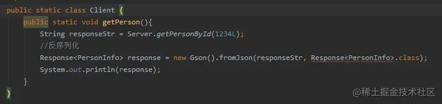
可以发现，java并不允许这么使用！

那传`Response.class`呢？如下：
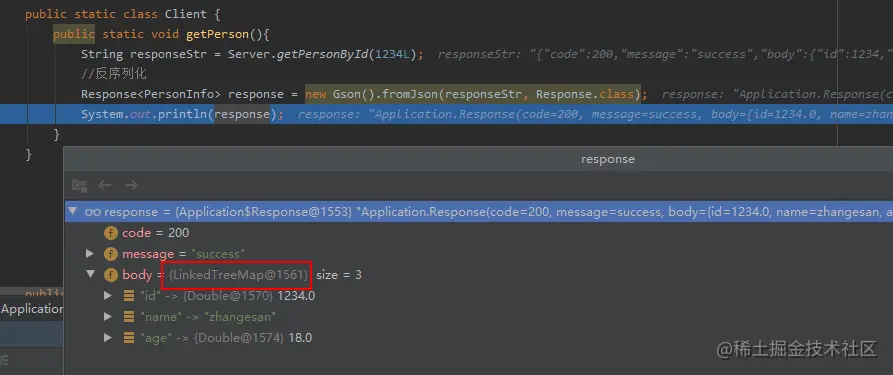
可以发现，代码能跑起来，但是Body变成了`LinkedHashMap`类型，这是因为传给gson的类型是`Response.class`，gson并不知道body属性是什么类型，那它只能使用`LinkedHashMap`这个默认的json对象类型了。

这就是TypeToken由来的原因，对于带泛型的类，使用TypeToken才能得到准确的类型信息，那TypeToken是怎么取到准确的类型的呢？

首先，`new TypeToken<Response<PersonInfo>>(){}.getType()`实际上是定义了一个匿名内部类的对象，然后调用了这个对象的`getType()`方法。

看看`getType()`的实现，如下：
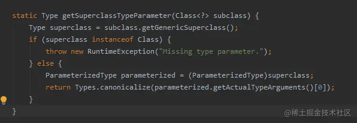
逻辑也比较简单，先通过`getGenericSuperclass()`获取了此对象的父类，即`TypeToken<Response<PersonInfo>>`，然后又通过`getActualTypeArguments()[0]`获取了实际类型参数，即`Response<PersonInfo>`。

额，逻辑看起来说得通，但不是说Java泛型会擦除吗？这里不会擦除？

从所周知，java泛型擦除发生在编译期，ok，那我模拟上面的原理，写个空类继承`TypeToken<Response<PersonInfo>>`，然后编译这个类之后再反编译一下，看类型到底擦除没！

```java
public class PersonResponseTypeToken extends TypeToken<Response<PersonInfo>> {

}
```

反编译结果如下：
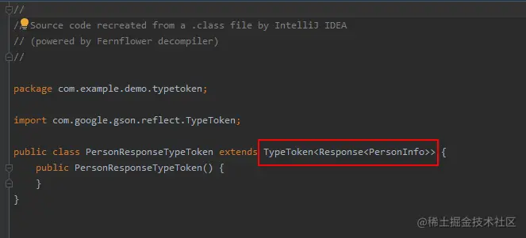
也就是说，被继承的父类上的泛型是不擦除的。

### 其它使用场景

有时为了编程的方便，经常会有框架将远程调用接口化，类似下面这样：

```java
public class RemoteUtil {
    private static final ConcurrentMap<Class, Object> REMOTE_CACHE = new ConcurrentHashMap<>();

    public static <T> T get(Class<T> clazz) {
        return clazz.cast(REMOTE_CACHE.computeIfAbsent(clazz, RemoteUtil::getProxyInstance));
    }

    private static Object getProxyInstance(Class clazz) {
        return Proxy.newProxyInstance(ClassLoader.getSystemClassLoader(), new Class[]{clazz}, (proxy, method, args) -> {
            Gson gson = new Gson();
            String path = method.getAnnotation(RequestMapping.class).path()[0];
            HttpURLConnection conn = null;
            try {
                conn = (HttpURLConnection) new URL("http://localhost:8080/" + path).openConnection();
                conn.setRequestMethod("POST");
                conn.setDoOutput(true);
                conn.setDoInput(true);
                conn.connect();
                //设置请求数据
                JsonObject requestBody = new JsonObject();
                try (Writer out = new OutputStreamWriter(conn.getOutputStream(), StandardCharsets.UTF_8)) {
                    int i = 0;
                    for (Parameter parameter : method.getParameters()) {
                        String name = parameter.getAnnotation(RequestParam.class).name();
                        requestBody.add(name, gson.toJsonTree(args[i]));
                        i++;
                    }
                    out.write(requestBody.toString());
                }
                //获取响应数据
                if (conn.getResponseCode() != HttpURLConnection.HTTP_OK) {
                    throw new RuntimeException("远程调用发生异常：url:" + conn.getURL() + ", requestBody:" + requestBody);
                }
                String responseStr = IOUtils.toString(conn.getInputStream(), StandardCharsets.UTF_8);
                //响应结果反序列化为具体对象
                return gson.fromJson(responseStr, method.getReturnType());
            } finally {
                if (conn != null) {
                    conn.disconnect();
                }
            }
        });
    }

}

public interface PersonApi {
    @RequestMapping(path = "/person")
    Response<PersonInfo> getPersonById(@RequestParam(name = "id") Long id);
}

public class Client {

    public static void getPerson() {
        Response<PersonInfo> response = RemoteUtil.get(PersonApi.class).getPersonById(1234L);
        System.out.println(response.getBody());
    }
}
```

这样做的好处是，开发人员不必再关心如何发远程请求了，只需要定义与调用接口即可。

但上面调用过程中会有一个问题，就是获取的response对象中body属性是LinkedHashMap，原因是gson反序列化时是通过`method.getReturnType()`来获取返回类型的，而返回类型中的泛型会被擦除掉。

要解决这个问题也很简单，和上面TypeToken一样的道理，定义一个空类`PersonResponse`来继承`Response<PersonInfo>`，然后将返回类型定义为`PersonResponse`，如下：

```java
public class PersonResponse extends Response<PersonInfo> {
}

public interface PersonApi {
    @RequestMapping(path = "/person")
    PersonResponse getPersonById(@RequestParam(name = "id") Long id);
}
```

然后你就会发现，gson可以正确识别到body属性的类型了。

### 解释new TypeToken<Response< PersonInfo>>(){}

new TypeToken<Response< PersonInfo>>(){}中，最后加了个花括号，相当于构建了一个TypeToken<Response< PersonInfo>>子类的匿名实例。

之所以构建的是子类的实例，是因为在 Java 中，当你使用 `new 类名() {}` 这种形式时，**总是会创建一个新的类**，这个类是你正在实例化的类的子类，哪怕你并没有显式地声明它。

而根据上文，被继承的父类上的泛型是不擦除的，这样TypeToken<Response< PersonInfo>>的类型就会保留下来，getType()方法也就能获取到该类的真正类型了。

