## SpringFramework

## SpringMVC

### 1、详解Spring项目中的classpath路径-CSDN

在java项目中，你一定碰到过classpath，通常情况下，我们是用它来指定配置/资源文件的路径。在刚开始学习的时候，自己也糊里糊涂，但是现在，是时候弄清楚它到底是指什么了。

**顾名思义**，classpath就是class的path，也就是类文件(*.class的路径)。一谈到文件的路径，我们就很有必要了解一个java项目（通常也是web项目）它在真正运行时候，这个项目内部的目录、文件的结构；这样，我们才好分析、理解classpath。

#### 开发时期的web项目结构

下面，我以一个ssm的项目为例，我先把开发时候的项目的目录结构图放出来。根据maven的约定，一般我们的项目结构就像下面这样。

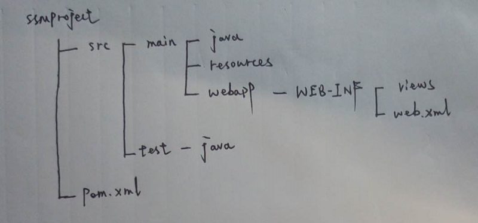

对于一个编译过的Spring工程，会生成一个target文件夹，该文件夹下有多个子文件夹：

 

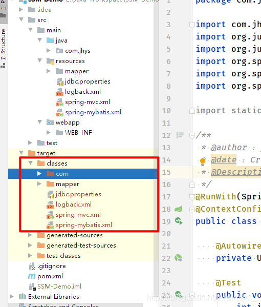

Spring工程编译后，会按照配置，将生成的.class文件和各类资源文件放到classes文件夹下。同时配置也决定了是直接放到classes根目录，还是带有文件夹路径。

#### web项目发布后的目录结构

我们使用IDEA对项目进行打包，一种是war包，一种是explorer的文件夹，war包解压后就是explorer了。我们来对解压后的目录结构进行分析。

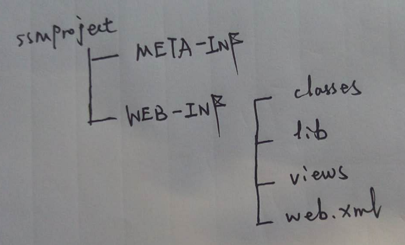

经过对比，我们要注意到，开发时期的项目里，`src/main/`下面的`java`和`resources`文件夹都被(编译)打包到了生产包的`WEB-INF/classes/`目录下；而原来WEB-INF下面的views和web.xml则仍然还是在WEB-INF下面。同时由maven引入的依赖都被放入到了`WEB-INF/lib/`下面。**最后，编译后的class文件和资源文件都放在了classes目录下。**

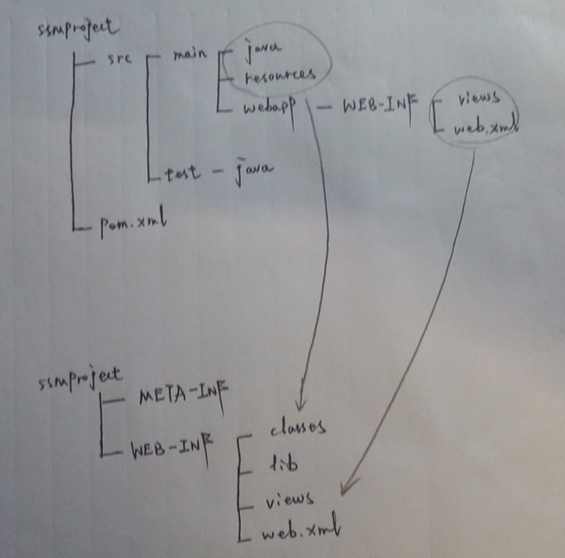

#### classpath原来是这个

在编译打包后的项目中，根目录是`META-INF`和`WEB-INF` 。这个时候，我们可以看到classes这个文件夹，它就是我们要找的classpath。

`classpath:entry/dev/spring-mvc.xml` 中，classpath就是指`WEB-INF/classes/`这个目录的路径。需要声明的一点是，使用`classpath:`这种前缀，**就只能代表一个文件**。

`classpath*:**/mapper/mapping/*Mapper.xml`，使用`classpath*:`这种前缀，**则可以代表多个匹配的文件**；`**/mapper/mapping/*Mapper.xml`，双星号`**`表示在任意目录下，也就是说在`WEB-INF/classes/`下任意层的目录，只要符合后面的文件路径，都会被作为资源文件找到。

## SpringBoot

### 1、SpringBoot3项目变为SpringBoot2项目

> 点击以下红色框中的按钮

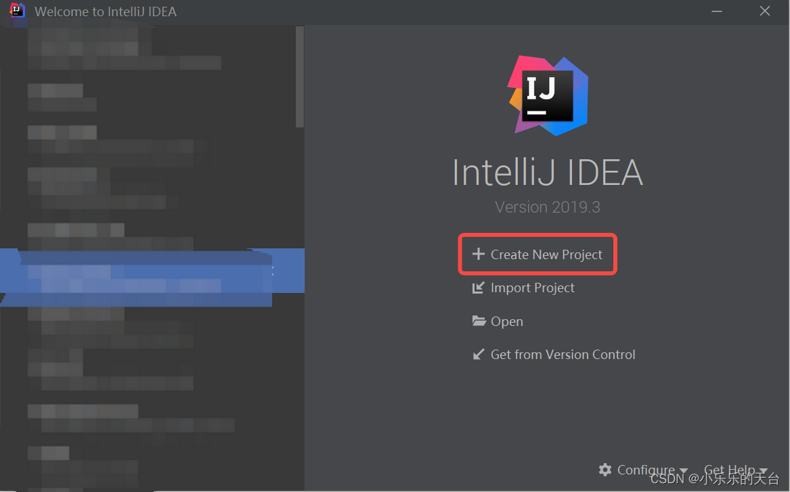

> 出现了如下图所示：

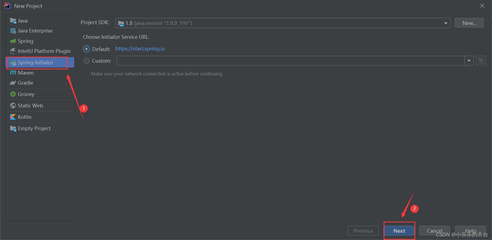

> 到这里我们发现没有jdk8的版本，不要慌，我们可以先在这里选择21，然后进入到真正的项目中手动去修改这个jdk的版本，要理解清楚这个配置是干嘛的，才能灵活的去创建项目。

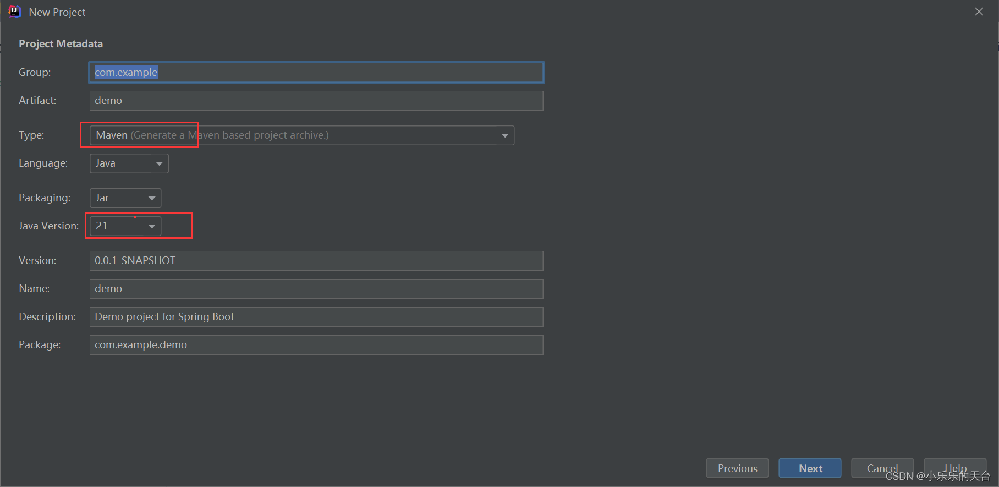

> 点击next进入下一步之后，会看到下面这样的一个情形，在选择springboot版本时发现还是没有2.x的版本，但是依旧不要慌，我们继续所以选择一个没有后缀名的版本先，至于左边的依赖就按照自己的业务选择就好了，我一般只选一个web，方便测试，如下所示：

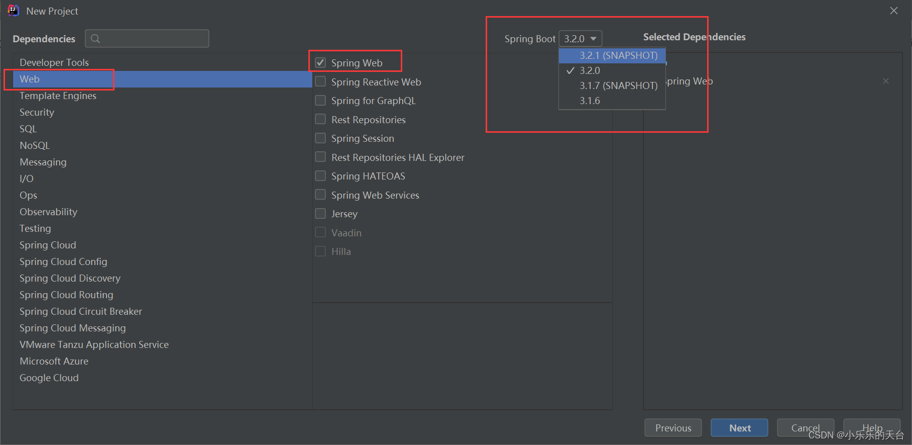

> 再往后走，没啥好说的，就选择自己的项目路径就行，然后点击完成，如下图所示：

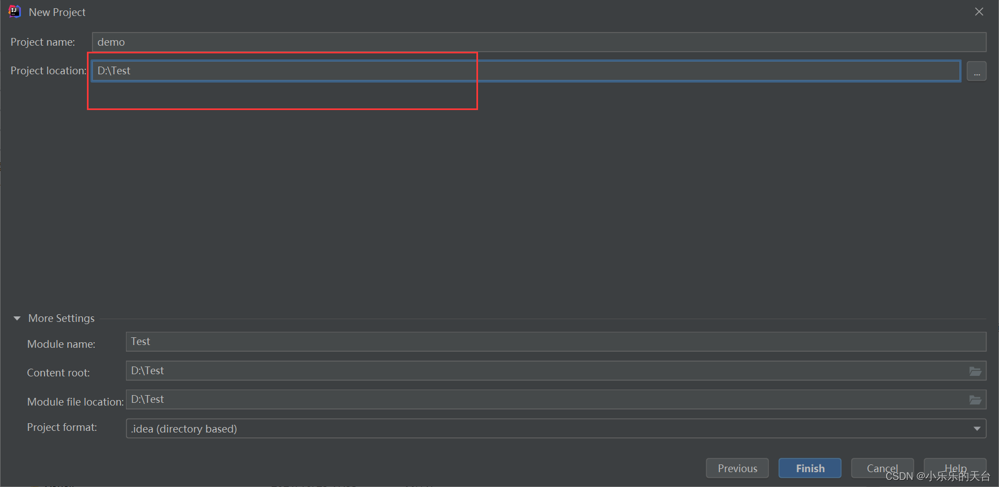

> 创建完成之后我们需要来修改一下自己项目的配置，因为刚才不论是jdk的选择还是springboot的选择都不一致
> 这里有两种办法
> 1、来改掉pom文件中的依赖（但是风险很大，不建议新手）
> 2、将原来项目的pom文件直接拿过来覆盖掉当前的pom文件
> 下面介绍第一种：
> 如下图所示，这个是我们的springboot依赖，上面是我们在创建项目时选择的3.x版本，以及我们的jdk版本：21

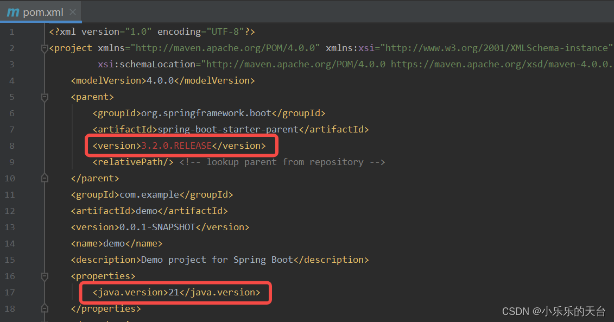

> 我们需要将它修改成为我们的2.x，这样子才能和jdk8匹配，并且也将21改为1.8，如下图所示，修改完之后，点击刷新maven

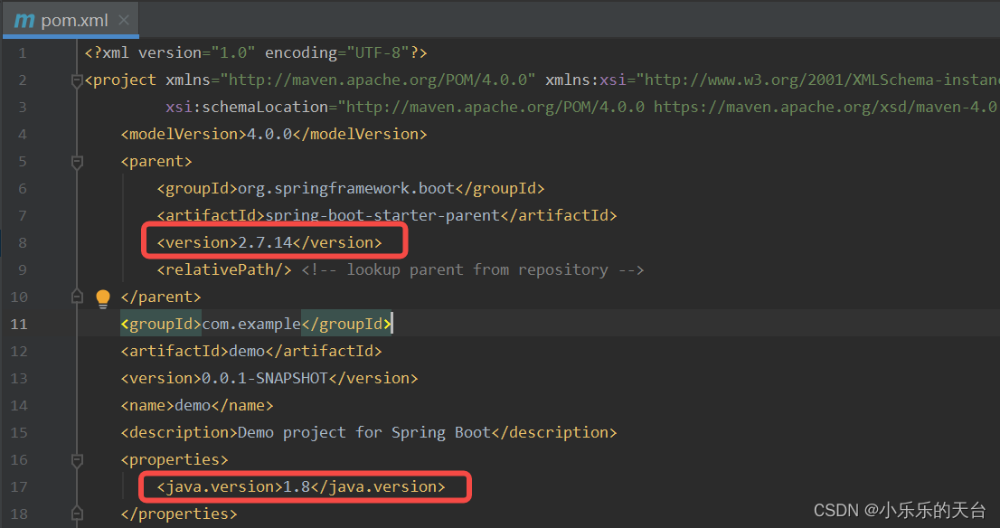

> 最后我们需要检查一下我们的此项目中别的地方关于jdk的配置

[查看jdk的配置参考这篇博客](https://blog.csdn.net/qq_41931364/article/details/134855527)

> 写测试代码调试：

```java
@Controller
@RequestMapping("/test")
@ResponseBody
public class TestController {

    @RequestMapping("/hello")
    public String hello() {
        return "Hello world";
    }
}
```

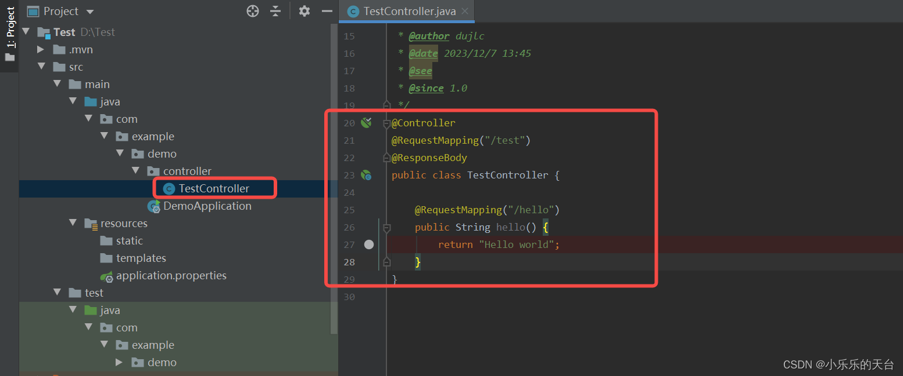

> 启动项目访问：
> http://127.0.0.1:8080/test/hello
> 如下图所示：项目启动成功

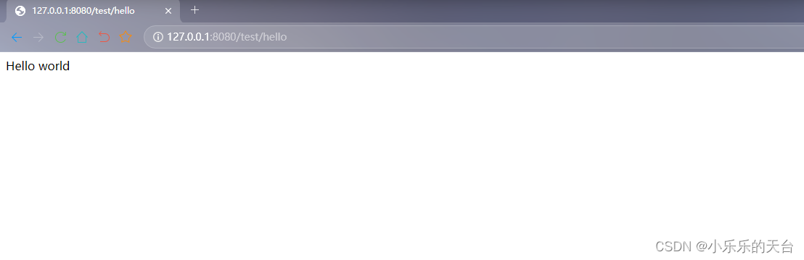

### 2、SpringBoot路径匹配策略

在 **Spring Boot 2.6.x** 和在 **Spring Framework 5.3**及以后版本中，**默认的路径匹配策略**已经从之前的 **`AntPathMatcher`** 改为 **`PathPatternParser`**。这个变更旨在提升性能和提供更精确的路径匹配规则。

#### 1. 变化原因

- **性能提升**：`PathPatternParser` 相比 `AntPathMatcher` 能更快解析路径模式。
- **灵活性和安全性**：新解析器更严格，减少了模糊匹配的副作用。

#### 2. **主要区别**

| 特性         | `AntPathMatcher` | `PathPatternParser`           |
| ------------ | ---------------- | ----------------------------- |
| 匹配风格     | 宽松（不严格）   | 严格                          |
| 支持的表达式 | `*`, `**`, `?`   | 更严格的 `*` 和 `**` 匹配规则 |
| 性能         | 较慢             | 更快                          |
| 推荐用法     | 老项目           | 新项目                        |

#### 3. **影响与应对措施**

- 如果你在升级后发现路径匹配不工作，可以通过在配置文件中显式回退到 `AntPathMatcher`：

```yaml
spring:
  web:
    pathmatch:
      matching-strategy: ant_path_matcher
```

#### 4. **示例匹配差异**

- **`AntPathMatcher`**：`/api/*` 会匹配 `/api/` 和 `/api/anything`。
- **`PathPatternParser`**：同样的模式 `/api/*` 只会匹配单层路径，如 `/api/test`，但不匹配 `/api/test/more`。

建议在升级项目时仔细测试路径匹配逻辑，避免不兼容情况影响应用的正常运行。

### 3、@ResponseBody和@RestController的使用场景

在类上直接使用 **@RestController** ，这样子，里面所有的方法都只会返回 json 字符串了，不用再每一个都添加@ResponseBody ！我们在前后端分离开发中，一般都使用 @RestController ，十分便捷！

而@ResponseBody通常配合@Controller使用，因为@Controller标注的类中的方法返回的数据仍会走视图解析器，在该方法中选择需要返回字符串的方法加上@ResponseBody注解。

### 4、@RequestParam与@RequestBody的使用场景

#### 一、前言

一直有这么一个疑问：在使用postman工具测试api接口的时候，如何使用 `json` 字符串传值呢，而不是使用 `x-www-form-urlencoded` 类型，毕竟通过 `key-value` 传值是有局限性的。假如我要测试**批量插入数据**的接口呢，使用 `x-www-form-urlencoded` 方法根本就不适用于这种场景。

那么如何通过postman工具使用json字符串传值呢，这里就引申出来了spring的两个注解：

- @RequestParam
- @RequestBody

总而言之，这两个注解都可以在后台接收参数，但是使用场景不一样。继续往下看 ↓

#### 二、@RequestParam

先介绍一下@RequestParam的使用场景：

注解@RequestParam接收的参数是**来自requestHeader**中，即**请求头**。**通常用于GET请求**，比如常见的url：http://localhost:8081/spring-boot-study/novel/findByAuthorAndType?author=唐家三少&type=已完结，其在`Controller` 层的写法如下图所示：

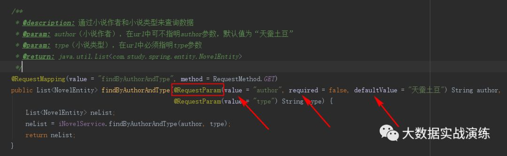

@RequestParam有三个配置参数：

- `required` 表示是否必须，默认为 `true`，必须。
- `defaultValue` 可设置请求参数的默认值。
- `value` 为接收url的参数名（相当于key值）。

**@RequestParam用来处理 `Content-Type` 为 `application/x-www-form-urlencoded` 编码的内容，`Content-Type`默认为该属性。**

**@RequestParam也可用于其它类型的请求，例如：POST、DELETE等请求**。比如向表中插入单条数据，`Controller` 层的写法如下图所示：


由于@RequestParam是用来处理 `Content-Type` 为 `application/x-www-form-urlencoded` 编码的内容的，所以在postman中，要选择body的类型为 `x-www-form-urlencoded`，这样在headers中就自动变为了 `Content-Type` : `application/x-www-form-urlencoded` 编码格式。如下图所示：

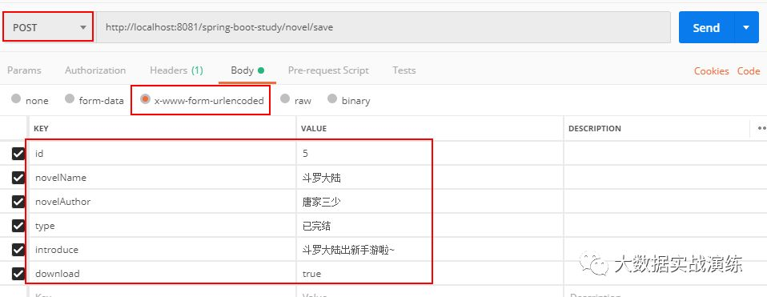

但是这样不支持批量插入数据啊，如果改用 `json` 字符串来传值的话，类型设置为 `application/json`，点击发送的话，会报错，后台接收不到值，为 `null`。

这时候，注解@RequestBody就派上用场了。继续往下看 ↓

#### 三、@RequestBody

先介绍一下@RequestBody的使用场景：

注解@RequestBody接收的参数是**来自requestBody**中，即**请求体**。一般用于处理非 `Content-Type: application/x-www-form-urlencoded`编码格式的数据，比如：`application/json`、`application/xml`等类型的数据。

就`application/json`类型的数据而言，使用注解@RequestBody可以将body里面所有的json数据传到后端，后端再进行解析。

##### 3.1 向表中批量插入数据

举个批量插入数据的例子，Controller层的写法如下图所示：

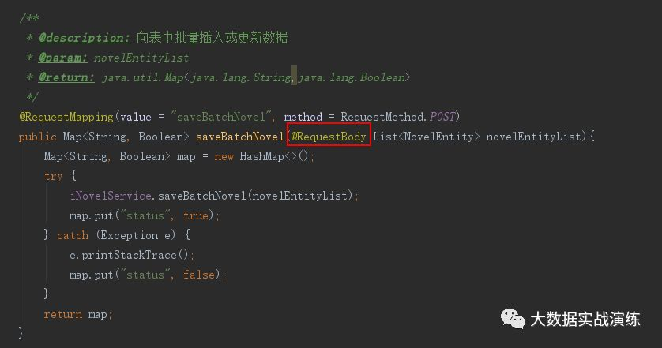

由于@RequestBody可用来处理 `Content-Type` 为 `application/json` 编码的内容，所以在postman中，选择body的类型为`row` -> `JSON(application/json)`，这样在 `Headers` 中也会自动变为 `Content-Type` : `application/json` 编码格式。body内的数据如下图所示：

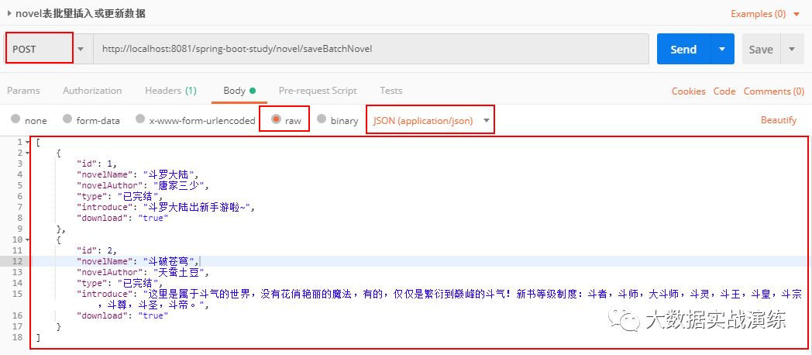

批量向表中插入两条数据，这里的 `saveBatchNovel()`方法已经封装了 `JPA`的 `saveAll()` 方法。`body` 里面的 `json` 语句的 `key` 值要与后端实体类的属性一一对应。

**注意：**前端使用$.ajax的话，一定要指定 `contentType: "application/json;charset=utf-8;"`，默认为 `application/x-www-form-urlencoded`。

##### **3.2 后端解析json数据**

上述示例是传递到实体类中的具体写法，那么如果传递到非实体类中，body里面的json数据需要怎么解析呢？我们再来看下面这个例子：

在body中，我们还是输入上面的json数据，根据分析，上面的json数据是一个List数组内嵌套着map对象，那么在后台的接收形式可写为 `List<Map<String, String>>`，具体代码如下图所示：

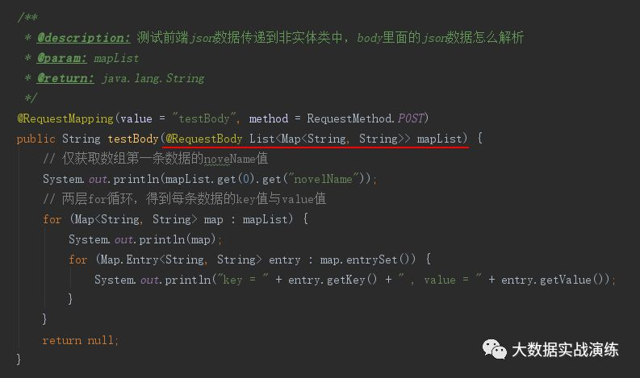

postman请求：

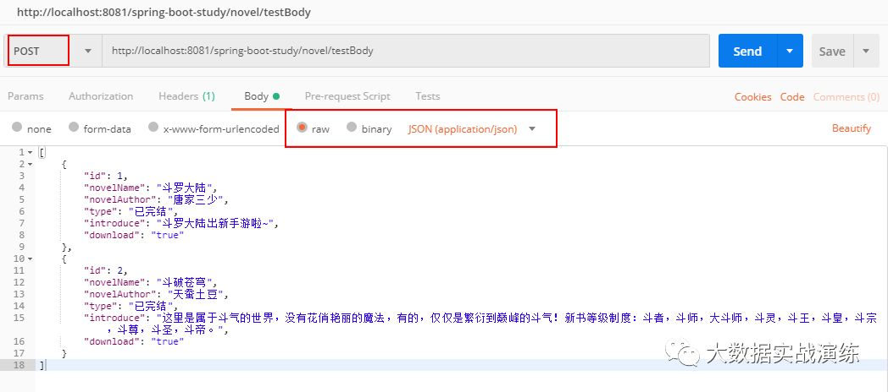

控制台输出：

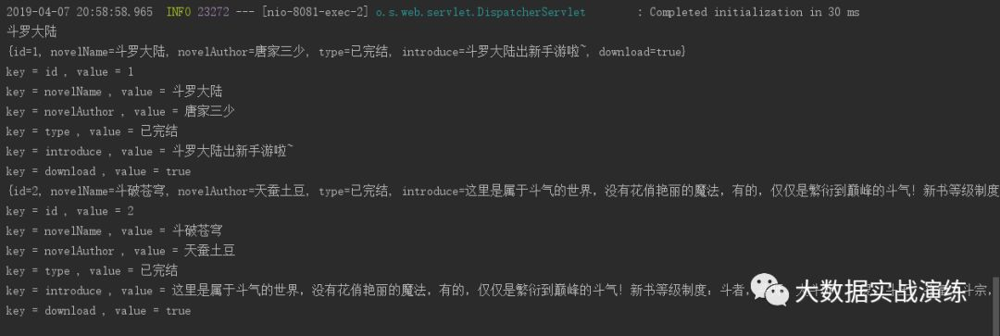

得出结论，通过@RequestBody可以解析Body中json格式的数据。

#### 四、总结

注解@RequestParam接收的参数是**来自requestHeader**中，即**请求头**。**通常用于GET请求**，像POST、DELETE等其它类型的请求也可以使用。

注解@RequestBody接收的参数是**来自requestBody**中，即**请求体**。一般用于处理非 `Content-Type: application/x-www-form-urlencoded`编码格式的数据，比如：`application/json`、`application/xml`等类型的数据。通常用于接收POST、DELETE等类型的请求数据，GET类型也可以适用。

### 5、SpringBoot Web容器之Tomcat配置

#### 1.前言

在 `SpringBoot` 项目中，可以内置 `Tomcat`、`Jetty`、`Undertow`、`Netty` 等服务器容器。当我们添加了 `spring-boot-starter-web` 依赖后，默认会使用 `Tomcat` 作为 `Web` 容器。

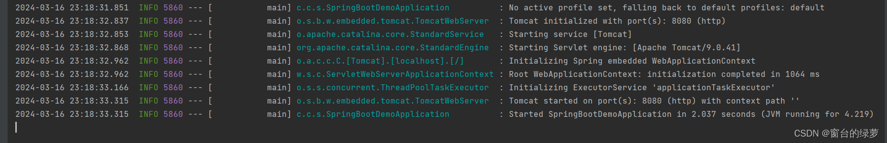

#### 2.Tomcat常用配置项

如果需要对Tomcat进行定制化配置，可以在springboot项目中的application.yml或application.properties文件中进行配置。

```xml
server:
  port: 8080 #配置程序端口，默认为8080
  servlet:
    context-path: / #配置访问路径，默认为/
    session:
      timeout: 30m #session失效时间，30m表示30分钟，如果不写单位，默认单位是秒
  tomcat:
    max-http-form-post-size: 2MB #tomcat限制了POST请求的大小，默认为2M,-1表示不限制
    max-swallow-size: 2MB #请求正文的大小
    uri-encoding: utf-8 #配置Tomcat编码，默认为UTF-8，用于解码URI的字符编码
    connection-timeout: 60000ms #socket调用read()等待读取的时间，如果超出时间范围，主动断开连接
    max-connections: 8192 #服务器接受和处理的最大连接数，默认是8192
    accept-count: 100 #等待队列的最大队列长度，当前服务器最大线程数用完后，传入的连接请求会进入到等待队列中进行等待
    threads:
      max: 200 #最大工作线程数，max-connections为服务器最大连接数，但并不是同时在工作
      min-spare: 10 #最小工作线程数
  compression: #和tomcat是一个级别的
      enabled: true #tomcat是否开启压缩，默认是关闭false

```

#### 3.Tomcat所有配置项

要想知道SpringBoot支持Tomcat哪些配置项，我们可以通过SpingBoot的源码去查找。

##### 3.1.进入ServletWebServerFactoryAutoConfiguration

在ServletWebServerFactoryAutoConfiguration这个类中，我们可以看到，相关配置信息是放在ServerProperties这个类中。

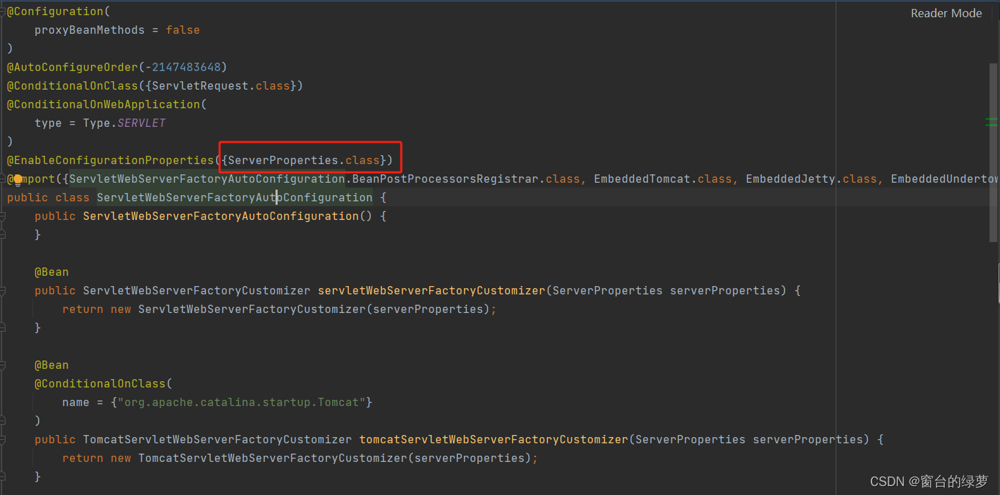

##### 3.2.进入ServerProperties

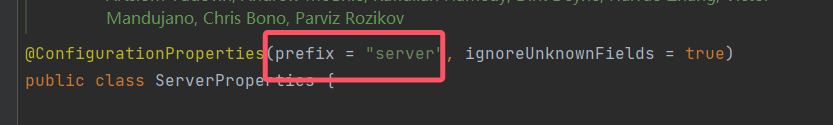

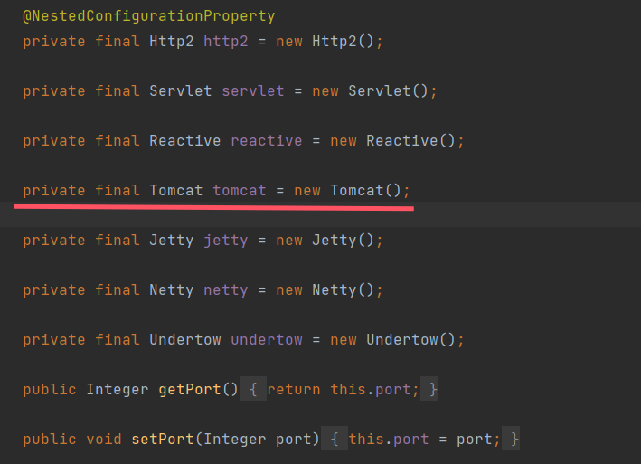

在ServerProperties中，我们可以看到以server开头的一些相关配置属性，如果还想看到tomcat独有相关配置，需要进入ServerProperties.Tomcat这个内部类中。

##### 3.3.进入Tomcat

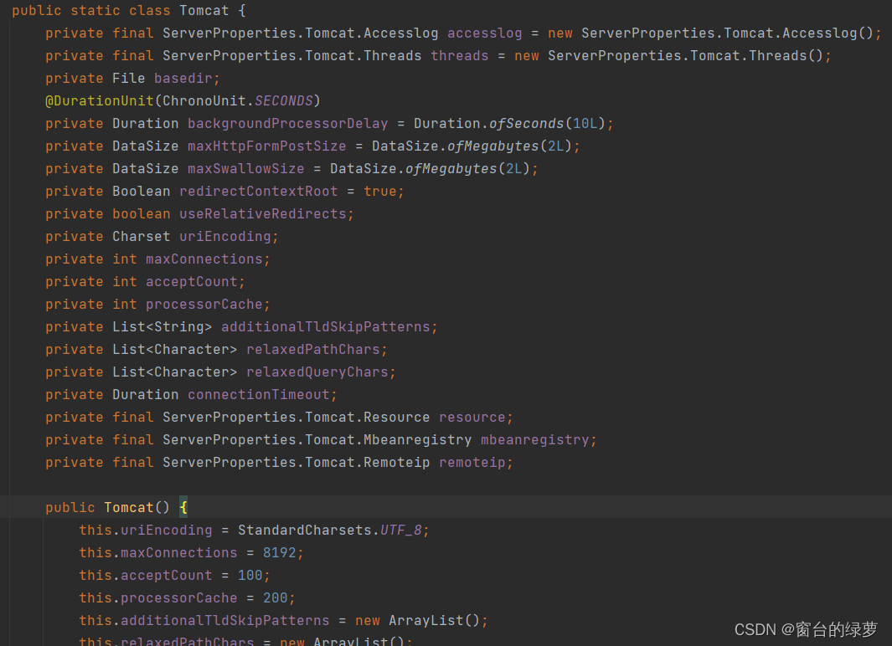

可以根据类中提供的相关参数含义在配置文件中定制化修改相关配置属性的默认值。

### 6、设置种Session的范围

共享 Cookie 是在多个子域之间实现状态或数据共享的常见需求。例如，在一个公司的多个子网站之间（如 `sub1.example.com` 和 `sub2.example.com`）共享用户的登录状态。
在 HTTP 协议中，Cookie 是通过域名和路径来确定其作用范围的。当服务器向客户端发送一个 Cookie 时，可以指定 Cookie 的 Domain 属性。浏览器会根据这个属性来决定 Cookie 是否在特定域名或子域名下发送。

为了使多个子域共享一个 Cookie，可以将 Cookie 的 Domain 属性设置为一个更高层的公共域名，例如将 `sub1.example.com` 和 `sub2.example.com` 的 Cookie 设置为 `example.com`。这样做的好处在于：

1. **共享状态：** 用户在一个子域登录后，在其他子域也可以保持登录状态，不需要再次登录。
2. **统一管理：** 可以通过一个公共域名来统一管理和操作 Cookie，简化了操作和维护。

以下是设置共享 Cookie 的示例代码：

```java
javaCookie cookie = new Cookie("username", "john");
cookie.setDomain(".example.com"); // 设置公共域名
cookie.setPath("/"); // 设置路径范围为整个站点
cookie.setMaxAge(60 * 60 * 24); // 设置有效期为1天
response.addCookie(cookie);
```

在这个例子中，Cookie 的 Domain 设置为 `.example.com`（注意前面的点），这样所有 `example.com` 及其子域（如 `sub1.example.com` 和 `sub2.example.com`）都可以访问这个 Cookie。

#### 在SpringBoot中配置

在 Spring Boot 3 中，可以使用更简洁的方法通过配置属性来共享 Cookie。

配置 `application.properties` 文件

在 Spring Boot 3 中，可以直接在 `application.properties` 或 `application.yml` 文件中配置 `server.servlet.session.cookie.domain` 属性来设置 Cookie 的域名。

**`application.properties` 示例：**

```
propertiesserver.servlet.session.cookie.domain=.example.com
```

**`application.yml` 示例：**

```yml
yamlserver:
  servlet:
    session:
      cookie:
        domain: .example.com
```

通过这种方式，可以在 Spring Boot 3 中使用更简洁的方法配置共享 Cookie 的域名，使多个子域之间能够共享状态信息。

### 7、Maven项目子模块使用父项目的依赖

> 在父项目中添加下面的代码

​	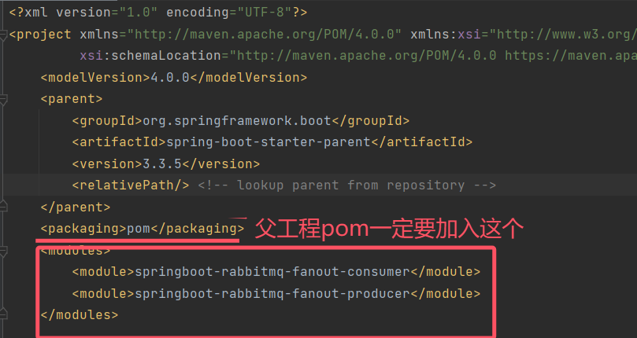

> 在子模块中添加下面的代码

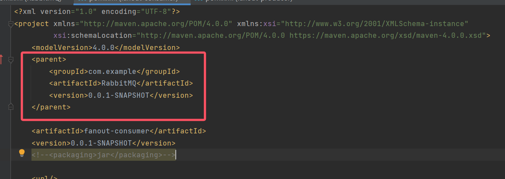

## SpringCloud