##  1.初识mysql

只会写代码的是码农；学好数据库，基本能混口饭吃；在此基础上再学好操作系统和计算机网络，就能当一个不错的程序员。如果能再把离散数学、数字电路、体系结构、数据结构/算法、编译原理
学通透，再加上丰富的实践经验与领域特定知识，就能算是一个优秀的工程师了 。

### 1.1为什么学数据库

1、岗位技能需求
2、现在的世界，得数据者得天下
3、存储数据的方法
4、程序网站中，大量数据如何长久保存
5、数据库几乎是软件体系中最核心的一个存在。

### 1.2什么是数据库

数据库（Datebase，简称DB）
**概念**：长期存放在计算机内，有组织，可共享的大量数据的集合，是一个数据“仓库”

**作用**：保存，并能安全管理数据（如：增删改查等），减少冗余。。。

**数据库总览**：

- 关系数据库（SQL）
  - MYSQL,Orcle,SQL Server, SQLLite,DB2,…
  - 关系型数据库通过外键关联来建立表与表之间的关系
- 非关系型数据库（NOSQL）
  - Redis， MongoDB，。。。
  - 非关系型数据库通常指数据以对象的形式存储在数据库中， 而对象之间的关系通过每个对象自身的属性来决定

### 1.3什么是DBMS

** 数据库管理系统*（database Management System）
数据库管理软件， 科学组织和存储数据， 高效地获取和维护数据*

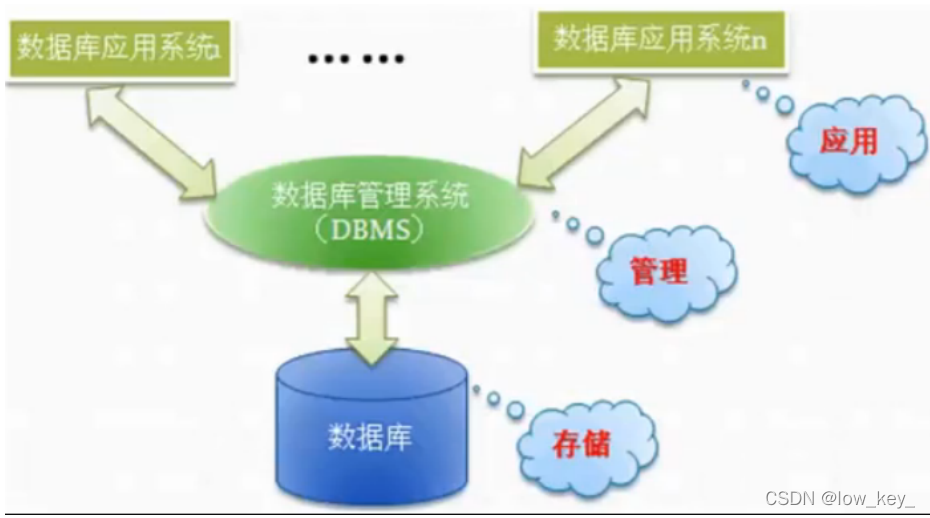我们要学习的mysql算是一个数据库管理系统

### 1.4Mysql简介

**概念**：是现在流行的开源的，免费的关系型数据库
**历史**：由瑞典MySQL AB 公司开发，目前属于 Oracle 旗下产品。
**特点** :

- 免费 , 开源数据库
- 小巧 , 功能齐全
- 使用便捷
- 可运行于Windows或Linux操作系统
- 可适用于中小型甚至大型网站应用
  官网链接: https://www.mysql.com/

### 1.5 安装Mysql

> 1.软件下载

mysql5.7 64位下载地址:
https://dev.mysql.com/get/Downloads/MySQL-5.7/mysql-5.7.19-winx64.zip
电脑是64位的就下载使用64位版本的!

> 2.步骤

1、下载后得到zip压缩包.
2、解压到自己想要安装到的目录，本人解压到的是D:\Environment\mysql-5.7.19
3、添加环境变量：我的电脑->属性->高级->环境变量

> 选择PATH,在其后面添加: 你的mysql 安装文件下面的bin文件夹

4、编辑 my.ini 文件 ,注意替换路径位置

> [mysqld]
> basedir=D:\Program Files\mysql-5.7
> datadir=D:\Program Files\mysql-5.7\data\
> port=3306 skip-grant-tables

5、启动管理员模式下的CMD，并将路径切换至mysql下的bin目录，然后输入mysqld –install (安装
mysql)
6、再输入 mysqld --initialize-insecure --user=mysql 初始化数据文件
7、然后再次启动mysql 然后用命令 mysql –u root –p 进入mysql管理界面（密码可为空）
8、进入界面后更改root密码

> update mysql.user set authentication_string=password(‘123456’) where user=‘root’ and Host = ‘localhost’;

9.刷新权限

> flush privileges;

10、修改 my.ini文件删除最后一句skip-grant-tables
11、重启mysql即可正常使用

```sql
net stop mysql 
net start mysql
```

12、连接上测试出现以下结果就安装好了


一步步去做 , 理论上是没有任何问题的 .
如果您以前装过,现在需要重装,一定要将环境清理干净 .
好了,到这里大家都装好了,因为刚接触,所以我们先不学习命令.
这里给大家推荐一个工具 : SQLyog .
即便有了可视化工具,可是基本的DOS命名大家还是要记住!

**不推荐SQLyog，狗都不用，看起来就不好用，还是Navicat好用**
软件自己找/狗头
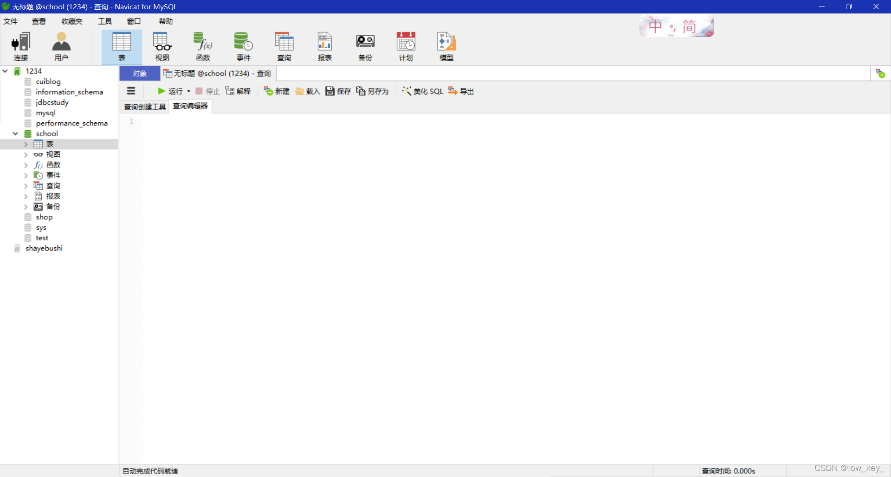
连接数据库
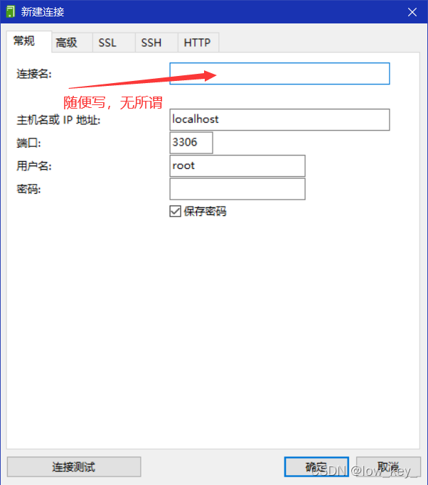

## 2.操作数据库

### 2.1结构化查询语句分类

| 名称                 | 解释                                         | 命令                     |
| -------------------- | -------------------------------------------- | ------------------------ |
| DDL （数据定义语言） | 定义和管理数据对象，如数据库，数据表等       | CREATE、DROP、ALTER      |
| DML （数据操作语言） | 用于操作数据库对象中所包含的数据             | INSERT、UPDATE、DELETE   |
| DQL （数据查询语言） | 用于查询数据库数据                           | SELECT                   |
| DCL （数据控制语言） | 用于管理数据库的语言，包括管理权限及数据更改 | GRANT、commit、 rollback |

### 2.2 数据库操作

> 命令行操作数据库

创建数据库 : create database [if not exists] 数据库名;
删除数据库 : drop database [if exists] 数据库名;
查看数据库 : show databases;
使用数据库 : use 数据库名;

### 2.3 创建数据表

属于DDL的一种，语法 :

```sql
create table [if not exists] `表名`( 
	'字段名1' 列类型 [属性][索引][注释], 
	'字段名2' 列类型 [属性][索引][注释], #... 
	'字段名n' 列类型 [属性][索引][注释] 
)[表类型][表字符集][注释];
```

**说明**: 反引号用于区别MySQL保留字与普通字符而引入的 (键盘esc下面的键)

### 2.4数据值和列类型

列类型 : 规定数据库中该列存放的数据类型

> 数值类型
> 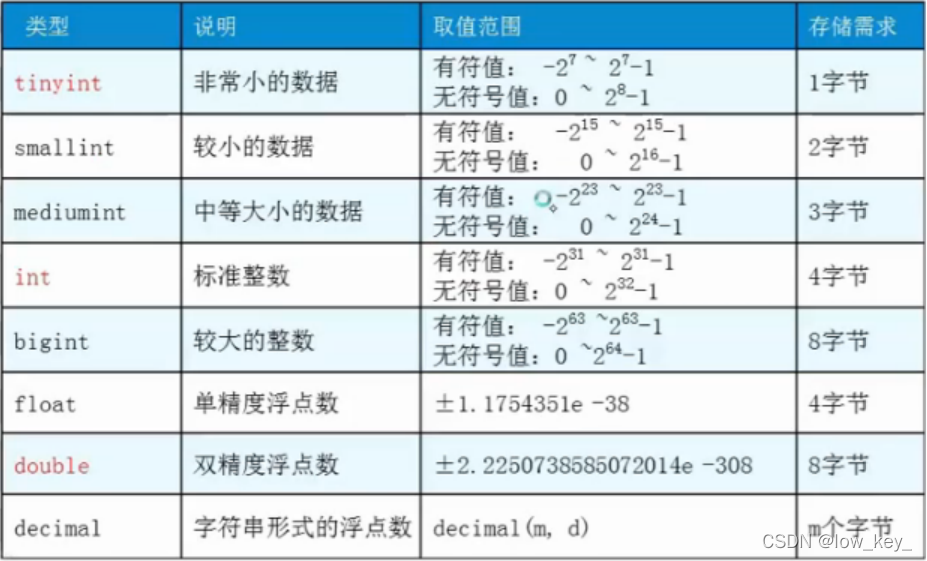
> 字符串类型

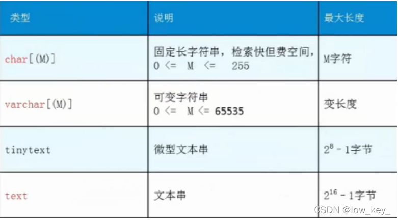

> 日期和时间型数值类型

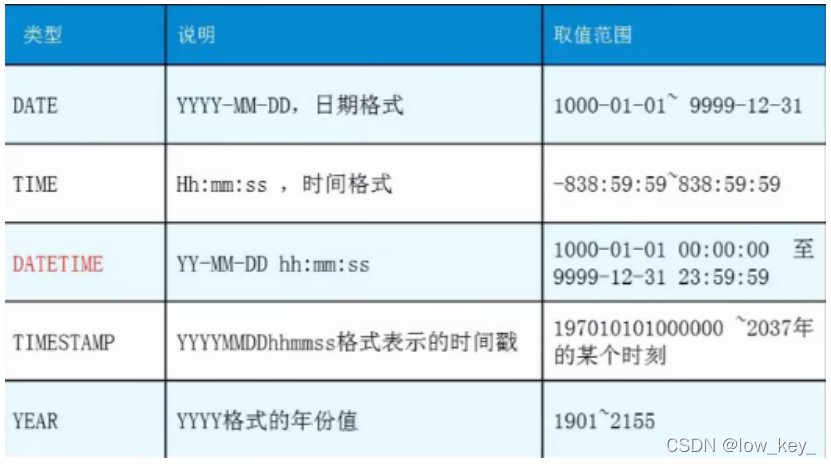

> NULL值

- 理解为 “没有值” 或 “未知值”
- 不要用NULL进行算术运算 , 结果仍为NULL

### 2.5数据字段属性

**UnSigned**

- 无符号的
- 声明该数据列不允许负数 .

**ZEROFILL**

- 0填充的
- 不足位数的用0来填充 , 如int(3),5则为005

**Auto_InCrement**

- 自动增长的 , 每添加一条数据 , 自动在上一个记录数上加 1(默认)
- 通常用于设置主键 , 且为整数类型
- 可定义起始值和步长
  - 当前表设置步长(AUTO_INCREMENT=100) : 只影响当前表
  - SET @@auto_increment_increment=5 ; 影响所有使用自增的表(全局)

** NULL 和 NOT NULL**

- 默认为NULL , 即没有插入该列的数值
- 如果设置为NOT NULL , 则该列必须有值

**DEFAULT**

- 默认的
- 用于设置默认值
- 例如,性别字段,默认为"男" , 否则为 “女” ; 若无指定该列的值 , 则默认值为"男"的值

```sql
-- 目标 : 创建一个school数据库 
-- 创建学生表(列,字段) 
-- 学号int 登录密码varchar(20) 姓名,性别varchar(2),出生日期(datatime),家庭住 址,email 
-- 创建表之前 , 一定要先选择数据库 
CREATE TABLE IF NOT EXISTS `student` ( 
	`id` int(4) NOT NULL AUTO_INCREMENT COMMENT '学号', 
	`name` varchar(30) NOT NULL DEFAULT '匿名' COMMENT '姓名', 
	`pwd` varchar(20) NOT NULL DEFAULT '123456' COMMENT '密码', 
	`sex` varchar(2) NOT NULL DEFAULT '男' COMMENT '性别', 
	`birthday` datetime DEFAULT NULL COMMENT '生日', 
	`address` varchar(100) DEFAULT NULL COMMENT '地址', 
	`email` varchar(50) DEFAULT NULL COMMENT '邮箱', 
	PRIMARY KEY (`id`) 
	) ENGINE=InnoDB DEFAULT CHARSET=utf8 

-- 查看数据库的定义 SHOW CREATE DATABASE school; 
-- 查看数据表的定义 SHOW CREATE TABLE student; 
-- 显示表结构 
DESC student; 
-- 设置严格检查模式(不能容错了)
SET sql_mode='STRICT_TRANS_TABLES';
```

### 2.6数据表的类型

> 设置数据表的类型

```sql
CREATE TABLE 表名(
 -- 省略一些代码 
 -- Mysql注释 
 -- 1. # 单行注释 
 -- 2. /*...*/ 多行注释 
 )ENGINE = MyISAM (or InnoDB) 
 -- 查看mysql所支持的引擎类型 (表类型) 
 SHOW ENGINES;
```

MySQL的数据表的类型 : MyISAM , InnoDB , HEAP , BOB , CSV等…
常见的 MyISAM 与 InnoDB 类型：

| 名称       | MyISAM | InnoDB       |
| ---------- | ------ | ------------ |
| 事务处理   | 不支持 | 支持         |
| 数据行锁定 | 支持   | 不支持       |
| 外键约束   | 不支持 | 支持         |
| 全文索引   | 支持   | 不支持       |
| 表空间大小 | 较小   | 较大，约二倍 |

经验 ( 适用场合 ) :

- 适用 MyISAM : 节约空间及相应速度
- 适用 InnoDB : 安全性 , 事务处理及多用户操作数据表

> 数据表的存储位置

- MySQL数据表以文件方式存放在磁盘中
  - 包括表文件 , 数据文件 , 以及数据库的选项文件
  - 位置 : Mysql安装目录\data\下存放数据表 . 目录名对应数据库名 , 该目录下文件名对应数据表
- 注意：
  - InnoDB类型数据表只有一个 *.frm文件 , 以及上一级目录的ibdata1文件
  - MyISAM类型数据表对应三个文件 :
    - . frm – 表结构定义文件
    - . MYD – 数据文件 ( data )
    - . MYI – 索引文件 ( index )

> 设置数据表字符集

我们可为数据库,数据表,数据列设定不同的字符集，设定方法 :

- 创建时通过命令来设置 , 如 : CREATE TABLE 表名()CHARSET = utf8;
- 如无设定 , 则根据MySQL数据库配置文件 my.ini 中的参数设定

### 2.7修改数据库

> 修改表名

修改表名 : ALTER TABLE 旧表名 RENAME AS 新表名
添加字段 : ALTER TABLE 表名 ADD字段名 列属性[属性]
修改字段 :

- ALTER TABLE 表名 MODIFY 字段名 列类型[属性]
- ALTER TABLE 表名 CHANGE 旧字段名 新字段名 列属性[属性]
  删除字段 : ALTER TABLE 表名 DROP 字段名

> 删除数据表

语法： DROP TABLE [IF EXISTS] 表名

- IF EXISTS 为可选 , 判断是否存在该数据表
- 如删除不存在的数据表会抛出错误

> 其他

```sql
1. 可用反引号（`）为标识符（库名、表名、字段名、索引、别名）包裹，以避免与关键字重名！
 中文 也可以作为标识符！
2. 每个库目录存在一个保存当前数据库的选项文件db.opt。
3. 注释：
	 单行注释 # 注释内容 
	多行注释 /* 注释内容 */ 
	单行注释 -- 注释内容 (标准SQL注释风格，要求双破折号后加一空格符（空格、TAB、 换行等）) 
4. 模式通配符：
	  _ 任意单个字符
	% 任意多个字符，甚至包括零字符 
	单引号需要进行转义 \' 
5. CMD命令行内的语句结束符可以为 ";", "\G", "\g"，仅影响显示结果。其他地方还是用分号结 束。
delimiter 可修改当前对话的语句结束符。 
6. SQL对大小写不敏感 （关键字） 
7.清除已有语句：\c
```

## 3.Mysql数据管理

### 3.1外键

> 外键概念

如果公共关键字在一个关系中是主关键字，那么这个公共关键字被称为另一个关系的外键。由此可见，
外键表示了两个关系之间的相关联系。以另一个关系的外键作主关键字的表被称为主表，具有此外键的
表被称为主表的从表。
在实际操作中，将一个表的值放入第二个表来表示关联，所使用的值是第一个表的主键值(在必要时可包
括复合主键值)。此时，第二个表中保存这些值的属性称为外键(foreign key)。
外键作用
保持数据一致性，完整性，主要目的是控制存储在外键表中的数据,约束。 使两张表形成关联，外键只能
引用外表中的列的值或使用空值。

> 创建外键

建表时指定外键约束

```sql
-- 创建外键的方式一 : 创建子表同时创建外键 
-- 年级表 (id\年级名称) 
CREATE TABLE `grade` (
	 `gradeid` INT(10) NOT NULL AUTO_INCREMENT COMMENT '年级ID', 
	 `gradename` VARCHAR(50) NOT NULL COMMENT '年级名称', 
	 PRIMARY KEY (`gradeid`) 
) ENGINE=INNODB DEFAULT CHARSET=utf8 
-- 学生信息表 (学号,姓名,性别,年级,手机,地址,出生日期,邮箱,身份证号) 
CREATE TABLE `student` ( 
	`studentno` INT(4) NOT NULL COMMENT '学号', 
	`studentname` VARCHAR(20) NOT NULL DEFAULT '匿名' COMMENT '姓名', 
	`sex` TINYINT(1) DEFAULT '1' COMMENT '性别', 
	`gradeid` INT(10) DEFAULT NULL COMMENT '年级', 
	`phoneNum` VARCHAR(50) NOT NULL COMMENT '手机', 
	`address` VARCHAR(255) DEFAULT NULL COMMENT '地址', 
	`borndate` DATETIME DEFAULT NULL COMMENT '生日', 
	`email` VARCHAR(50) DEFAULT NULL COMMENT '邮箱', 
	`idCard` VARCHAR(18) DEFAULT NULL COMMENT '身份证号', 
	PRIMARY KEY (`studentno`), 
	KEY `FK_gradeid` (`gradeid`), 
	CONSTRAINT `FK_gradeid` FOREIGN KEY (`gradeid`) REFERENCES `grade` (`gradeid`) 
) ENGINE=INNODB DEFAULT CHARSET=utf8
```

建表后修改

```sql
-- 创建外键方式二 : 创建子表完毕后,修改子表添加外键 
ALTER TABLE `student` 
	ADD CONSTRAINT `FK_gradeid` FOREIGN KEY (`gradeid`) REFERENCES `grade` 
	(`gradeid`);
```

> 删除外键

操作：删除grade表，发现报错
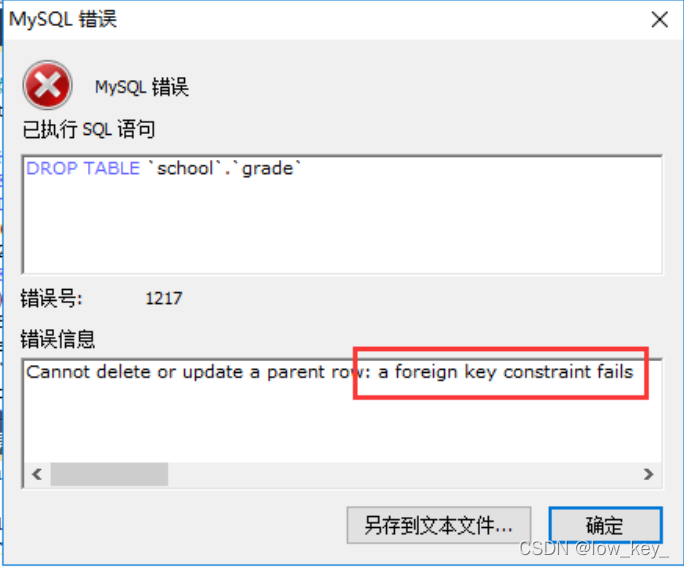
注意 : 删除具有主外键关系的表时 , 要先删子表 , 后删主表

```sql
-- 删除外键 
ALTER TABLE student DROP FOREIGN KEY FK_gradeid; 
-- 发现执行完上面的,索引还在,所以还要删除索引 
-- 注:这个索引是建立外键的时候默认生成的 
ALTER TABLE student DROP INDEX FK_gradeid;
```

### 3.2DML语言

**数据库意义**：数据存储，数据管理
**管理数据库数据方法：
\- 通过Navicat等管理工具管理数据库
\- 通过DML语句管理数据库数据

DML语言：数据操作语言

- 用于操作数据库对象中所包含的数据
- 包括：
  - INSERT (添加数据语句)
  - UPDATE (更新数据语句)
  - DELETE (删除数据语句)

### 添加数据

> insert命令

语法：

```sql
INSERT INTO 表名[(字段1,字段2,字段3,...)] VALUES('值1','值2','值3')
```

注意 :

- 字段或值之间用英文逗号隔开 .
- ’ 字段1,字段2…’ 该部分可省略 , 但添加的值务必与表结构,数据列,顺序相对应,且数量一致 .
- 可同时插入多条数据 , values 后用英文逗号隔开

```sql
-- 使用语句如何增加语句? 
-- 语法 : INSERT INTO 表名[(字段1,字段2,字段3,...)] VALUES('值1','值2','值3') INSERT INTO grade(gradename) VALUES ('大一'); 
-- 主键自增,那能否省略呢? 
INSERT INTO grade VALUES ('大二'); 
-- 查询:INSERT INTO grade VALUE ('大二')错误代码： 1136 
Column count doesn`t match value count at row 1 
-- 结论:'字段1,字段2...'该部分可省略 , 但添加的值务必与表结构,数据列,顺序相对应,且数量一致. 
-- 一次插入多条数据 
INSERT INTO grade(gradename) VALUES ('大三'),('大四');
```

**练习题目**
自己使用INSERT语句为课程表subject添加数据 . 使用到外键

### 3.4修改数据

> update命令
> 语法：

```sql
UPDATE 表名 SET column_name=value [,column_name2=value2,...] [WHERE condition];
```

**注意 :**

- column_name 为要更改的数据列
- value 为修改后的数据 , 可以为变量 , 具体指 , 表达式或者嵌套的SELECT结果
- condition 为筛选条件 , 如不指定则修改该表的所有列数据

> where条件语句

```
可以简单的理解为 : 有条件地从表中筛选数据
```

| 运算符    | 含义   | 范围 | 结果  |
| --------- | ------ | ---- | ----- |
| =         | 等于   | 5=6  | false |
| <> 或 ！= | 不等于 | 5!=6 | true  |

> |大于 |5>6 |false
> < |小于 |5<6| true
> = |大于等于| 5>=6| false
> <=| 小于等于 |5<=6| true
> BETWEEN |在某个范围之间| BETWEEN 5 AND 10
> AND |并且 |5 > 1 AND 1 > 2| false
> OR |或| 5 > 1 OR 1 > 2| true

测试：

```sql
-- 修改年级信息 
UPDATE grade SET gradename = '高中' WHERE gradeid = 1;
```

### 3.5删除数据

> delete命令

语法

```sql
DELETE FROM 表名 [WHERE condition]
```

注意：condition为筛选条件 , 如不指定则删除该表的所有列数据

```sql
-- 删除最后一个数据 
DELETE FROM grade WHERE gradeid = 5 
```

> TRUNCATE命令

作用：用于完全清空表数据 , 但表结构 , 索引 , 约束等不变 ;
语法：

```sql
TRUNCATE [TABLE] table_name; 
-- 清空年级表 
TRUNCATE grade
```

注意：区别于DELETE命令

- 相同 : 都能删除数据 , 不删除表结构 , 但TRUNCATE速度更快
- 不同 :
  - 使用TRUNCATE TABLE 重新设置AUTO_INCREMENT计数器
  - 使用TRUNCATE TABLE不会对事务有影响 （事务后面会说）
    测试：

```sql
-- 创建一个测试表 
CREATE TABLE `test` ( 
	`id` INT(4) NOT NULL AUTO_INCREMENT, 
	`coll` VARCHAR(20) NOT NULL, 
	PRIMARY KEY (`id`) 
) ENGINE=INNODB DEFAULT CHARSET=utf8 
-- 插入几个测试数据 
INSERT INTO test(coll) VALUES('row1'),('row2'),('row3');
 -- 删除表数据(不带where条件的delete) 
 DELETE FROM test; 
 -- 结论:如不指定Where则删除该表的所有列数据,自增当前值依然从原来基础上进行,会记录日志. 
 -- 删除表数据(truncate) 
 TRUNCATE TABLE test; 
 -- 结论:truncate删除数据,自增当前值会恢复到初始值重新开始;不会记录日志. 
 -- 同样使用DELETE清空不同引擎的数据库表数据.重启数据库服务后 
 -- InnoDB : 自增列从初始值重新开始 (因为是存储在内存中,断电即失) 
 -- MyISAM : 自增列依然从上一个自增数据基础上开始 (存在文件中,不会丢失) 
```

## 4 使用DQL查询数据

### 4.1 DQL语言

**DQL( Data Query Language 数据查询语言 )**

- 查询数据库数据 , 如SELECT语句
- 简单的单表查询或多表的复杂查询和嵌套查询
- 是数据库语言中最核心,最重要的语句
- 使用频率最高的语句

> SELECT语法

```sql
SELECT [ALL | DISTINCT] 
{* | table.* | [table.field1[as alias1][,table.field2[as alias2]][,...]]} 
FROM table_name [as table_alias]
	 [left | right | inner join table_name2] 
	 -- 联合查询 
	 [WHERE ...] 
	 -- 指定结果需满足的条件 
	 [GROUP BY ...] 
	 -- 指定结果按照哪几个字段来分组 
	 [HAVING] 
	 -- 过滤分组的记录必须满足的次要条件 
	 [ORDER BY ...] 
	 -- 指定查询记录按一个或多个条件排序 
	 [LIMIT {[offset,]row_count | row_countOFFSET offset}]; 
	 -- 指定查询的记录从哪条至哪条
```

注意 : [ ] 括号代表可选的 , { }括号代表必选得

### 4.2 指定查询字段

```sql
-- 查询表中所有的数据列结果 , 采用 **" \* "** 符号; 但是效率低，不推荐 . 
-- 查询所有学生信息 
SELECT * FROM student; 
-- 查询指定列(学号 , 姓名) 
SELECT studentno,studentname FROM student;
```

> as语句作为别名

作用：

- 可给数据列取一个新别名
- 可给表取一个新别名
- 可把经计算或总结的结果用另一个新名称来代替

```sql
-- 这里是为列取别名(当然as关键词可以省略) 
SELECT studentno AS 学号,studentname AS 姓名 FROM student; 

-- 使用as也可以为表取别名 
SELECT studentno AS 学号,studentname AS 姓名 FROM student AS s; 

-- 使用as,为查询结果取一个新名字 
-- CONCAT()函数拼接字符串 
SELECT CONCAT('姓名:',studentname) AS 新姓名 FROM student;
```

> DISTINCT关键字的使用

作用 : 去掉SELECT查询返回的记录结果中重复的记录 ( 返回所有列的值都相同 ) , 只返回一条

```sql
-- # 查看哪些同学参加了考试(学号) 去除重复项 
SELECT * FROM result; 

-- 查看考试成绩 
SELECT studentno FROM result;
 -- 查看哪些同学参加了考试 
 SELECT DISTINCT studentno FROM result; 
 -- 了解:DISTINCT 去除重复项 , (默认是ALL)
```

> 使用表达式的列

**数据库中的表达式 : 一般由文本值 , 列值 , NULL , 函数和操作符等组成**

- 应用场景 :
- SELECT语句返回结果列中使用
- SELECT语句中的ORDER BY , HAVING等子句中使用
- DML语句中的 where 条件语句中使用表达式

```sql
-- selcet查询中可以使用表达式
 SELECT @@auto_increment_increment; 
 -- 查询自增步长
 SELECT VERSION(); 
 -- 查询版本号 
 SELECT 100*3-1 AS 计算结果; -- 表达式 

-- 学员考试成绩集体提分一分查看 
SELECT studentno,StudentResult+1 AS '提分后' FROM result;
```

### 4.3 where条件语句

作用：用于检索数据表中 符合条件 的记录
搜索条件可由一个或多个逻辑表达式组成 , 结果一般为真或假

> 逻辑操作符

| 操作符名称 | 语法              | 描述                               |
| ---------- | ----------------- | ---------------------------------- |
| AND 或 &&  | a AND b 或 a && b | 逻辑与，同时为真结果才为真         |
| OR 或 \|\| | aOR b 或 a\|\|b   | 逻辑或，只要一个为真，则结果为真   |
| NOT 或 ！  | NOT a 或 ！a      | 逻辑非，若操作数为假，则结果为真！ |
| **测试：** |                   |                                    |

```sql
-- 满足条件的查询(where) 
SELECT Studentno,StudentResult FROM result; 
-- 查询考试成绩在95-100之间的 
SELECT Studentno,StudentResult 
FROM result 
WHERE StudentResult>=95 AND StudentResult<=100; 
-- AND也可以写成 && 
SELECT Studentno,StudentResult 
FROM result 
WHERE StudentResult>=95 && StudentResult<=100; 
-- 模糊查询(对应的词:精确查询) 

SELECT Studentno,StudentResult 
FROM result
WHERE StudentResult BETWEEN 95 AND 100; 
-- 除了1000号同学,要其他同学的成绩 
SELECT studentno,studentresult 
FROM result 
WHERE studentno!=1000; 
-- 使用NOT 
SELECT studentno,studentresult 
FROM result 
WHERE NOT studentno=1000;
```

> 模糊查询：比较操作符

| 操作符名称  | 语法                 | 描述                                    |
| ----------- | -------------------- | --------------------------------------- |
| IS NULL     | a IS NULL            | 若操作符为NULL，则结果为真              |
| IS NOT NULL | a IS NOT NULL        | 若操作符不为NULL，则结果为真            |
| BETWEEN     | a BETWEEN b AND c    | 若 a 范围在 b 与 c 之间，则结果为真     |
| LIKE        | a LIKE b             | SQL 模式匹配，若a匹配b，则结果为真      |
| IN          | a IN (a1，a2，a3，…) | 若 a 等于 a1,a2… 中的某一个，则结果为真 |

**注意**：

- 数值数据类型的记录之间才能进行算术运算 ;
- 相同数据类型的数据之间才能进行比较 ;

**测试：**

```sql
-- 模糊查询 between and \ like \ in \ null -- ============================================= 
-- LIKE -- 
============================================= 
-- 查询姓刘的同学的学号及姓名 
-- like结合使用的通配符 : % (代表0到任意个字符) _ (一个字符) 
SELECT studentno,studentname FROM student 
WHERE studentname LIKE '刘%'; 

-- 查询姓刘的同学,后面只有一个字的 
SELECT studentno,studentname FROM student 
WHERE studentname LIKE '刘_'; 

-- 查询姓刘的同学,后面只有两个字的 
SELECT studentno,studentname FROM student 
WHERE studentname LIKE '刘__'; 

-- 查询姓名中含有 嘉 字的
SELECT studentno,studentname FROM student 
WHERE studentname LIKE '%嘉%'; 

-- 查询姓名中含有特殊字符的需要使用转义符号 '\' 
-- 自定义转义符关键字: ESCAPE ':' -- ============================================= 
-- IN -- 
============================================= 

-- 查询学号为1000,1001,1002的学生姓名 
SELECT studentno,studentname FROM student 
WHERE studentno IN (1000,1001,1002); 

-- 查询地址在北京,南京,河南洛阳的学生 
SELECT studentno,studentname,address FROM student 
WHERE address IN ('北京','南京','河南洛阳'); 

-- ============================================= 
-- NULL 空 -- 
============================================= 
-- 查询出生日期没有填写的同学 
-- 不能直接写=NULL , 这是代表错误的 , 用 is null 
SELECT studentname FROM student 
WHERE BornDate IS NULL; 
-- 查询出生日期填写的同学 
SELECT studentname FROM student 
WHERE BornDate IS NOT NULL; 
-- 查询没有写家庭住址的同学(空字符串不等于null) 
SELECT studentname FROM student 
WHERE Address='' OR Address IS NULL;
```

### 4.4 连接查询

> join对比

| 操作符名称 | 描述                                       |
| ---------- | ------------------------------------------ |
| INNER JOIN | 如果表中有至少一个匹配，则返回行           |
| LEFT JOIN  | 即使右表中没有匹配，也从左表中返回所有的行 |
| RIGHT JOIN | 即使左表中没有匹配，也从右表中返回所有的行 |

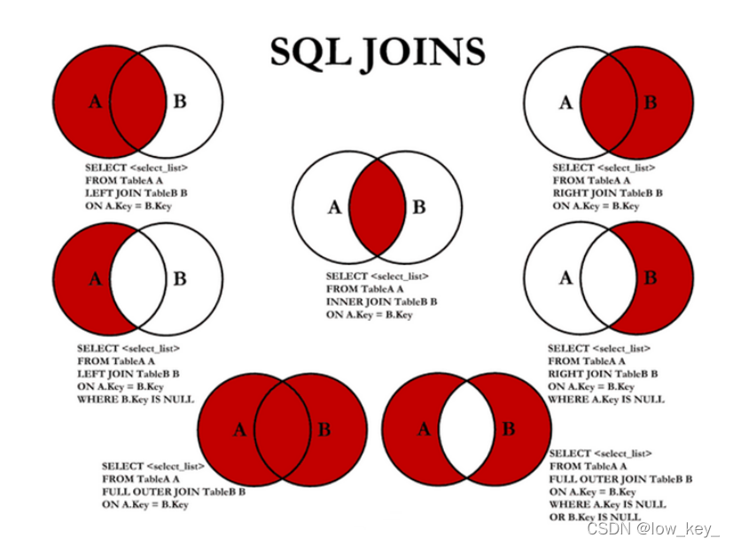

**测试** ：

```sql
/*连接查询
	如需要多张数据表的数据进行查询,则可通过连接运算符实现多个查询 
内连接 inner join 
	查询两个表中的结果集中的交集 
外连接 outer join 
	左外连接 left join 
	(以左表作为基准,右边表来一一匹配,匹配不上的,返回左表的记录,右表以NULL填充) 
	右外连接 right join 
	(以右表作为基准,左边表来一一匹配,匹配不上的,返回右表的记录,左表以NULL填充) 

等值连接和非等值连接 

自连接 *
/-- 查询参加了考试的同学信息(学号,学生姓名,科目编号,分数) 
SELECT * FROM student;
 SELECT * FROM result; 
 
 /*思路: (1):分析需求,确定查询的列来源于两个类,student result,连接查询 
 (2):确定使用哪种连接查询?(内连接) */
 SELECT s.studentno,studentname,subjectno,StudentResult 
 FROM student s 
 INNER JOIN result r ON r.studentno = s.studentno

-- 右连接(也可实现) 
SELECT s.studentno,studentname,subjectno,StudentResult 
FROM student s RIGHT JOIN result r ON r.studentno = s.studentno 

-- 等值连接 
SELECT s.studentno,studentname,subjectno,StudentResult 
FROM student s , result r 
WHERE r.studentno = s.studentno 

-- 左连接 (查询了所有同学,不考试的也会查出来) 
SELECT s.studentno,studentname,subjectno,StudentResult 
FROM student s LEFT JOIN result r ON r.studentno = s.studentno 

-- 查一下缺考的同学(左连接应用场景) 
SELECT s.studentno,studentname,subjectno,StudentResult 
FROM student s LEFT JOIN result r ON r.studentno = s.studentno
 WHERE StudentResult IS NULL 
 
 -- 思考题:查询参加了考试的同学信息(学号,学生姓名,科目名,分数) 
 SELECT s.studentno,studentname,subjectname,StudentResult 
 FROM student s INNER JOIN result r ON r.studentno = s.studentno 
 INNER JOIN `subject` sub ON sub.subjectno = r.subjectno
```

> 自连接

```sql
/*自连接数据表与自身进行连接 
需求:从一个包含栏目ID , 栏目名称和父栏目ID的表中 查询父栏目名称和其他子栏目名称 */

-- 创建一个表 
CREATE TABLE `category` ( 
	`categoryid` INT(10) UNSIGNED NOT NULL AUTO_INCREMENT COMMENT '主题id', 
	`pid` INT(10) NOT NULL COMMENT '父id', 
	`categoryName` VARCHAR(50) NOT NULL COMMENT '主题名字', 
	PRIMARY KEY (`categoryid`) 
) ENGINE=INNODB AUTO_INCREMENT=9 DEFAULT CHARSET=utf8 

-- 插入数据 
INSERT INTO `category` (`categoryid`, `pid`, `categoryName`) 
VALUES('2','1','信息技术'), ('3','1','软件开发'),
('4','3','数据库'),
('5','1','美术设计'), ('6','3','web开发'),
('7','5','ps技术'), ('8','2','办公信息'); 
  
-- 编写SQL语句,将栏目的父子关系呈现出来 (父栏目名称,子栏目名称) 
-- 核心思想:把一张表看成两张一模一样的表,然后将这两张表连接查询(自连接) 
SELECT a.categoryName AS '父栏目',b.categoryName AS '子栏目' 
FROM category AS a,category AS b WHERE a.`categoryid`=b.`pid` 
  
-- 思考题:查询参加了考试的同学信息(学号,学生姓名,科目名,分数) 
SELECT s.studentno,studentname,subjectname,StudentResult 
  FROM student s INNER JOIN result r ON r.studentno = s.studentno 
  INNER JOIN `subject` sub ON sub.subjectno = r.subjectno 

-- 查询学员及所属的年级(学号,学生姓名,年级名) 
SELECT studentno AS 学号,studentname AS 学生姓名,gradename AS 年级名称 
FROM student s INNER JOIN grade g ON s.`GradeId` = g.`GradeID` 


-- 查询科目及所属的年级(科目名称,年级名称) 
SELECT subjectname AS 科目名称,gradename AS 年级名称 
FROM SUBJECT sub INNER JOIN grade g ON sub.gradeid = g.gradeid 
-- 查询 数据库结构-1 的所有考试结果(学号 学生姓名 科目名称 成绩) 
SELECT s.studentno,studentname,subjectname,StudentResult 
FROM student s INNER JOIN result r ON r.studentno = s.studentno 
INNER JOIN `subject` sub ON r.subjectno = sub.subjectno 
WHERE subjectname='数据库结构-1'
```

### 4.5 排序和分页

测试：

```sql
/*============== 排序 ================ 
语法 : ORDER BY ORDER BY 语句用于根据指定的列对结果集进行排序。 
ORDER BY 语句默认按照ASC升序对记录进行排序。 
如果您希望按照降序对记录进行排序，可以使用 DESC 关键字。 */


-- 查询 数据库结构-1 的所有考试结果(学号 学生姓名 科目名称 成绩) 
-- 按成绩降序排序
SELECT s.studentno,studentname,subjectname,StudentResult 
FROM student s INNER JOIN result r ON r.studentno = s.studentno 
INNER JOIN `subject` sub ON r.subjectno = sub.subjectno 
WHERE subjectname='数据库结构-1' 
ORDER BY StudentResult DESC 


/*============== 分页 ================ 
语法 : SELECT * FROM table LIMIT [offset,] rows | rows OFFSET offset 
好处 : (用户体验,网络传输,查询压力) 
推导:
	第一页 : limit 0,5 
	第二页 : limit 5,5 
	第三页 : limit 10,5 ...... 
	第N页 : limit (pageNo-1)*pageSzie,pageSzie [pageNo:页码,pageSize:单页面显示条数] */


-- 每页显示5条数据 
SELECT s.studentno,studentname,subjectname,StudentResult 
FROM student s INNER JOIN result r ON r.studentno = s.studentno 
INNER JOIN `subject` sub ON r.subjectno = sub.subjectno 
WHERE subjectname='数据库结构-1' ORDER BY StudentResult DESC , studentno LIMIT 0,5
-- 查询 JAVA第一学年 课程成绩前10名并且分数大于80的学生信息(学号,姓名,课程名,分数) 
SELECT s.studentno,studentname,subjectname,StudentResult 
FROM student s INNER JOIN result r ON r.studentno = s.studentno 
INNER JOIN `subject` sub ON r.subjectno = sub.subjectno 
WHERE subjectname='JAVA第一学年' 
ORDER BY StudentResult DESC LIMIT 0,10
```

### 4.6 子查询

```sql
/*============== 子查询 ================ 
什么是子查询? 
	在查询语句中的WHERE条件子句中,又嵌套了另一个查询语句 
	嵌套查询可由多个子查询组成,求解的方式是由里及外; 
	子查询返回的结果一般都是集合,故而建议使用IN关键字; */
-- 查询 数据库结构-1 的所有考试结果(学号,科目编号,成绩),并且成绩降序排列

-- 方法一:使用连接查询 
SELECT studentno,r.subjectno,StudentResult 
FROM result r INNER JOIN `subject` sub ON r.`SubjectNo`=sub.`SubjectNo` 
WHERE subjectname = '数据库结构-1' ORDER BY studentresult DESC; 

-- 方法二:使用子查询(执行顺序:由里及外) 
SELECT studentno,subjectno,StudentResult 
FROM result WHERE subjectno=( SELECT subjectno FROM `subject` 
WHERE subjectname = '数据库结构-1' )
ORDER BY studentresult DESC; 

-- 查询课程为 高等数学-2 且分数不小于80分的学生的学号和姓名 
-- 方法一:使用连接查询 
SELECT s.studentno,studentname 
FROM student s INNER JOIN result r ON s.`StudentNo` = r.`StudentNo` 
INNER JOIN `subject` sub ON sub.`SubjectNo` = r.`SubjectNo` 
WHERE subjectname = '高等数学-2' AND StudentResult>=80 

-- 方法二:使用连接查询+子查询 
-- 分数不小于80分的学生的学号和姓名 
SELECT r.studentno,studentname
 FROM student s INNER JOIN result r ON s.`StudentNo`=r.`StudentNo` 
WHERE StudentResult>=80 

-- 在上面SQL基础上,添加需求:课程为 高等数学-2 
SELECT r.studentno,studentname FROM student s 
INNER JOIN result r ON s.`StudentNo`=r.`StudentNo` 
WHERE StudentResult>=80 AND subjectno=( 
	SELECT subjectno FROM `subject` 
	WHERE subjectname = '高等数学-2' )
-- 方法三:使用子查询 
-- 分步写简单sql语句,然后将其嵌套起来 
SELECT studentno,studentname FROM student 
WHERE studentno IN( 
	SELECT studentno FROM result 
	WHERE StudentResult>=80 AND subjectno=( 
		SELECT subjectno FROM `subject` 
		WHERE subjectname = '高等数学-2' 
		) 
	)
```

## 5.Mysql函数

### 5.1常用函数

**数据函数**

```sql
SELECT ABS(-8); /*绝对值*/ 
SELECT CEILING(9.4); /*向上取整*/ 
SELECT FLOOR(9.4); /*向下取整*/ 
SELECT RAND(); /*随机数,返回一个0-1之间的随机数*/ 
SELECT SIGN(0); /*符号函数: 负数返回-1,正数返回1,0返回0*/
```

**字符串函数**

```sql
SELECT CHAR_LENGTH('狂神说坚持就能成功'); /*返回字符串包含的字符数*/ 
SELECT CONCAT('我','爱','程序'); /*合并字符串,参数可以有多个*/ 

SELECT INSERT('我爱编程helloworld',1,2,'超级热爱');
/*替换字符串,从某个位置开始替 换某个长度*/ 

SELECT LOWER('KuangShen'); /*小写*/ 
SELECT UPPER('KuangShen'); /*大写*/ 
SELECT LEFT('hello,world',5); /*从左边截取*/ 
SELECT RIGHT('hello,world',5); /*从右边截取*/ 
SELECT REPLACE('狂神说坚持就能成功','坚持','努力'); /*替换字符串*/ 
SELECT SUBSTR('狂神说坚持就能成功',4,6); /*截取字符串,开始和长度*/ 
SELECT REVERSE('狂神说坚持就能成功'); /*反转 -- 查询姓周的同学,改成邹 
SELECT REPLACE(studentname,'周','邹') AS 新名字 FROM student 
WHERE studentname LIKE '周%';
```

日期和时间函数

```sql
SELECT CURRENT_DATE(); /*获取当前日期*/ 
SELECT CURDATE(); /*获取当前日期*/ 
SELECT NOW(); /*获取当前日期和时间*/ 
SELECT LOCALTIME(); /*获取当前日期和时间*/ 
SELECT SYSDATE(); /*获取当前日期和时间*/ -- 获取年月日,时分秒 
SELECT YEAR(NOW()); 
SELECT MONTH(NOW()); 
SELECT DAY(NOW()); 
SELECT HOUR(NOW()); 
SELECT MINUTE(NOW()); 
SELECT SECOND(NOW());
```

**系统信息函数**

```sql
SELECT VERSION(); /*版本*/ 
SELECT USER(); /*用户*/
```

### 5.2聚合函数

| 函数名称 | 描述                                                         |
| -------- | ------------------------------------------------------------ |
| COUNT()  | 返回满足Select条件的记录总和数，如 select count(*) 【不建议使用 *，效率低】 |
| SUM()    | 返回数字字段或表达式列作统计，返回一列的总和。               |
| AVG()    | 通常为数值字段或表达列作统计，返回一列的平均值               |
| MAX()    | 可以为数值字段，字符字段或表达式列作统计，返回最大的值。     |
| MIN()    | 可以为数值字段，字符字段或表达式列作统计，返回最小的值。     |

```sql
-- 
聚合函数 /*COUNT:非空的*/ 
SELECT COUNT(studentname) FROM student; 
SELECT COUNT(*) FROM student; 
SELECT COUNT(1) FROM student; /*推荐*/ 
-- 从含义上讲，count(1) 与 count(*) 都表示对全部数据行的查询。 
-- count(字段) 会统计该字段在表中出现的次数，忽略字段为null 的情况。即不统计字段为null 的记录。 
-- count(*) 包括了所有的列，相当于行数,在统计结果的时候，包含字段为null 的记录； 
-- count(1) 用1代表代码行，在统计结果的时候，包含字段为null 的记录 。 
/*很多人认为count(1)执行的效率会比count(*)高，原因是count(*)会存在全表扫描，
而count(1) 可以针对一个字段进行查询。
其实不然，count(1)和count(*)都会对全表进行扫描，统计所有记录的条数，
包括那些为null的记录，因此，它们的效率可以说是相差无几。而count(字段)则与前两者不同，
它会统计该字段不为null的记录条数。 
	下面它们之间的一些对比：
		 1）在表没有主键时，count(1)比count(*)快 
		 2）有主键时，主键作为计算条件，count(主键)效率最高； 
		 3）若表格只有一个字段，则count(*)效率较高。 */

SELECT SUM(StudentResult) AS 总和 FROM result; 
SELECT AVG(StudentResult) AS 平均分 FROM result; 
SELECT MAX(StudentResult) AS 最高分 FROM result; 
SELECT MIN(StudentResult) AS 最低分 FROM result;
```

题目：

```sql
-- 查询不同课程的平均分,最高分,最低分 
-- 前提:根据不同的课程进行分组 
SELECT subjectname,
	AVG(studentresult) AS 平均分,
	MAX(StudentResult) AS 最高分,
	MIN(StudentResult) AS 最低分 
FROM result AS r 
INNER JOIN `subject` AS s ON r.subjectno = s.subjectno 
GROUP BY r.subjectno HAVING 平均分>80; 
/*
where写在group by前面. 要是放在分组后面的筛选 要使用HAVING.. 因为having是从前面筛选的字段再筛选，而where是从数据表中的>字段直接进行的筛选的 */
```

> MD5加密

一、MD5简介
MD5即Message-Digest Algorithm 5（信息-摘要算法5），用于确保信息传输完整一致。是计算机广泛`在这里插入代码片`使用的杂凑算法之一（又译摘要算法、哈希算法），主流编程语言普遍已有MD5实现。将数据（如汉字）运算为另一固定长度值，是杂凑算法的基础原理，MD5的前身有MD2、MD3和MD4。

二、实现数据加密
新建一个表 testmd5

```sql
CREATE TABLE `testmd5` ( 
	`id` INT(4) NOT NULL, `name` VARCHAR(20) NOT NULL, 
	`pwd` VARCHAR(50) NOT NULL, 
	PRIMARY KEY (`id`) 
	) ENGINE=INNODB DEFAULT CHARSET=utf8
```

插入一些数据

```sql
INSERT INTO testmd5 VALUES(1,'kuangshen','123456'),(2,'qinjiang','456789') 1
```

如果我们要对pwd这一列数据进行加密，语法是：

```sql
update testmd5 set pwd = md5(pwd);
```

如果单独对某个用户(如kuangshen)的密码加密：

```sql
INSERT INTO testmd5 VALUES(3,'kuangshen2','123456') 
update testmd5 set pwd = md5(pwd) where name = 'kuangshen2';
```

插入新的数据自动加密

```sql
INSERT INTO testmd5 VALUES(4,'kuangshen3',md5('123456')); 
```

查询登录用户信息（md5对比使用，查看用户输入加密后的密码进行比对）

```sql
SELECT * FROM testmd5 WHERE `name`='kuangshen' AND pwd=MD5('123456');
```

### 5.3 小结

```sql
-- ================ 内置函数 ================
-- 数值函数 
abs(x) -- 绝对值 
abs(-10.9) = 10 format(x, d) -- 格式化千分位数值 
format(1234567.456, 2) = 1,234,567.46 ceil(x) -- 向上取整 
ceil(10.1) = 11 floor(x) -- 向下取整 
floor (10.1) = 10 round(x) -- 四舍五入去整 
mod(m, n) -- m%n m mod n 求余 10%3=1 pi() -- 获得圆周率 
pow(m, n) -- m^n sqrt(x) -- 算术平方根 
rand() -- 随机数 
truncate(x, d) -- 截取d位小数 

-- 时间日期函数 
now(), current_timestamp(); -- 当前日期时间 
current_date(); -- 当前日期 
current_time(); -- 当前时间 
date('yyyy-mm-dd hh:ii:ss'); -- 获取日期部分 
time('yyyy-mm-dd hh:ii:ss'); -- 获取时间部分 
date_format('yyyy-mm-dd hh:ii:ss', '%d %y %a %d %m %b %j'); -- 格式化时间 
unix_timestamp(); -- 获得unix时间戳 
from_unixtime(); -- 从时间戳获得时间 

-- 字符串函数 
length(string) -- string长度，字节 
char_length(string) -- string的字符个数 
substring(str, position [,length]) -- 从str的position开始,取length个字符 
replace(str ,search_str ,replace_str) --在str中用replace_str替换
search_str instr(string ,substring) -- 返回substring首次在string中出现的位置 
concat(string [,...]) -- 连接字串 
charset(str) -- 返回字串字符集 
lcase(string) -- 转换成小写 
left(string, length) -- 从string2中的左边起取length个字符 
load_file(file_name) -- 从文件读取内容 
locate(substring, string [,start_position]) -- 同instr,但可指定开始位置 
lpad(string, length, pad) -- 重复用pad加在string开头,直到字串长度为
length ltrim(string) -- 去除前端空格 
repeat(string, count) -- 重复count次 
rpad(string, length, pad) --在str后用pad补充,直到长度为length 
rtrim(string) -- 去除后端空格 strcmp(string1 ,string2) -- 逐字符比较两字串大小 


-- 聚合函数 count() 
sum(); 
max(); 
min(); 
avg(); 
group_concat() 

-- 其他常用函数 
md5(); 
default();
```

## 6.事务

### 6.1概述

> 什么是事务

- 事务就是将一组SQL语句放在同一批次内去执行
- 如果一个SQL语句出错,则该批次内的所有SQL都将被取消执行
- MySQL事务处理只支持InnoDB和BDB数据表类型

> 事务的ACID原则

**原子性(Atomic)**
整个事务中的所有操作，要么全部完成，要么全部不完成，不可能停滞在中间某个环节。事务在执行过程中发生错误，会被回滚（ROLLBACK）到事务开始前的状态，就像这个事务从来没有执行过一样。

**一致性(Consist)**
一个事务可以封装状态改变（除非它是一个只读的）。事务必须始终保持系统处于一致的状态，不管在任何给定的时间并发事务有多少。也就是说：如果事务是并发多个，系统也必须如同串行事务一样操作。其主要特征是保护性和不变性(Preserving an Invariant)，以转账案例为例，假设有五个账户，每个账户余额是100元，那么五个账户总额是500元，如果在这个5个账户之间同时发生多个转账，无论并发多少个，比如在A与B账户之间转账5元，在C与D账户之间转账10元，在B与E之间转账15元，五个账户总额也应该还是500元，这就是保护性和不变性。

**隔离性(Isolated)**
隔离状态执行事务，使它们好像是系统在给定时间内执行的唯一操作。如果有两个事务，运行在相同的时间内，执行相同的功能，事务的隔离性将确保每一事务在系统中认为只有该事务在使用系统。这种属性有时称为串行化，为了防止事务操作间的混淆，必须串行化或序列化请求，使得在同一时间仅有一个请求用于同一数据。

**持久性(Durable)**
在事务完成以后，该事务对数据库所作的更改便持久的保存在数据库之中，并不会被回滚。

### 6.2事务实现

**基本语法：**

```sql
-- 使用set语句来改变自动提交模式 
SET autocommit = 0; /*关闭*/ 
SET autocommit = 1; /*开启*/ 

-- 注意: 
--- 1.MySQL中默认是自动提交 
--- 2.使用事务时应先关闭自动提交 

-- 开始一个事务,标记事务的起始点 
START TRANSACTION

-- 提交一个事务给数据库 
COMMIT 

-- 将事务回滚,数据回到本次事务的初始状态
ROLLBACK 

-- 还原MySQL数据库的自动提交 
SET autocommit =1; 

-- 保存点 
SAVEPOINT 保存点名称 -- 设置一个事务保存点 
ROLLBACK TO SAVEPOINT 保存点名称 -- 回滚到保存点 
RELEASE SAVEPOINT 保存点名称 -- 删除保存点
```

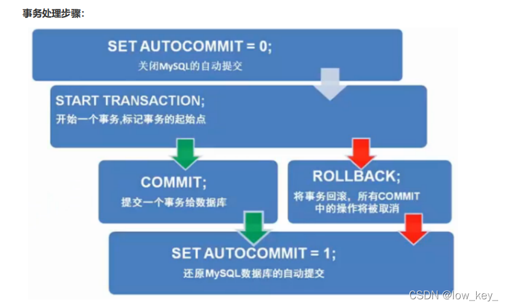

### 6.3 测试题目

```sql
/*课堂测试题目 A在线买一款价格为500元商品,网上银行转账. A的银行卡余额为2000,然后给商家B支付500. 商家B一开始的银行卡余额为10000 创建数据库shop和创建表account并插入2条数据 */
CREATE DATABASE `shop`CHARACTER SET utf8 COLLATE utf8_general_ci; 
USE `shop`; 

CREATE TABLE `account` ( 
`id` INT(11) NOT NULL AUTO_INCREMENT, 
`name` VARCHAR(32) NOT NULL,
`cash` DECIMAL(9,2) NOT NULL, 
PRIMARY KEY (`id`) 
) ENGINE=INNODB DEFAULT CHARSET=utf8 

INSERT INTO account (`name`,`cash`) VALUES('A',2000.00),('B',10000.00) 

-- 转账实现 
SET autocommit = 0; 
-- 关闭自动提交 
START TRANSACTION; 
-- 开始一个事务,标记事务的起始点 
UPDATE account SET cash=cash-500 WHERE `name`='A'; 
UPDATE account SET cash=cash+500 WHERE `name`='B'; 
COMMIT; -- 提交事务 
# rollback; 
SET autocommit = 1; -- 恢复自动提交
```

## 7 索引

### 7.1 索引分类

> 索引的作用

- 提高查询速度
- 确保数据的唯一性
- 可以加速表和表之间的连接 , 实现表与表之间的参照完整性
- 使用分组和排序子句进行数据检索时 , 可以显著减少分组和排序的时间
- 全文检索字段进行搜索优化.

> 分类

- 主键索引 (Primary Key)
- 唯一索引 (Unique)
- 常规索引 (Index)
- 全文索引 (FullText)

### 7.2 主键索引

主键 : 某一个属性组能唯一标识一条记录
特点 :

- 最常见的索引类型
- 确保数据记录的唯一性
- 确定特定数据记录在数据库中的位置

### 7.3 唯一索引

作用 : 避免同一个表中某数据列中的值重复
与主键索引的区别

- 主键索引只能有一个
- 唯一索引可能有多个

```sql
CREATE TABLE `Grade`( 
`GradeID` INT(11) AUTO_INCREMENT PRIMARYKEY, 
`GradeName` VARCHAR(32) NOT NULL UNIQUE 
-- 或 UNIQUE KEY `GradeID` (`GradeID`) 
)
```

### 7.4 常规索引

作用 : 快速定位特定数据
注意 :

- index 和 key 关键字都可以设置常规索引
- 应加在查询找条件的字段
- 不宜添加太多常规索引,影响数据的插入,删除和修改操作

```sql
CREATE TABLE `result`( 
	-- 省略一些代码 
	INDEX/KEY `ind` (`studentNo`,`subjectNo`) -- 创建表时添加 
	
	-- 创建后添加 
	ALTER TABLE `result` ADD INDEX `ind`(`studentNo`,`subjectNo`);
)
```

### 7.5 全文索引

百度搜索：全文索引
作用 : 快速定位特定数据
注意 :

- 只能用于MyISAM类型的数据表
- 只能用于CHAR , VARCHAR , TEXT数据列类型
- 适合大型数据集

```sql
/*#方法一：创建表时 
	CREATE TABLE 表名 ( 
		字段名1 数据类型 [完整性约束条件…], 
		字段名2 数据类型 [完整性约束条件…], 
		[UNIQUE | FULLTEXT | SPATIAL ] INDEX | KEY [索引名] 
		(字段名[(长度)] [ASC |DESC]) ); 

#方法二：CREATE在已存在的表上创建索引 
CREATE [UNIQUE | FULLTEXT | SPATIAL ] INDEX 索引名
			ON 表名 (字段名[(长度)] [ASC |DESC]) ; 

#方法三：ALTER TABLE在已存在的表上创建索引 
	ALTER TABLE 表名 ADD [UNIQUE | FULLTEXT | SPATIAL ] INDEX 
		索引名 (字段名[(长度)] [ASC |DESC]) ; 
		
#删除索引：DROP INDEX 索引名 ON 表名字; 
#删除主键索引: ALTER TABLE 表名 DROP PRIMARY KEY; 

#显示索引信息: SHOW INDEX FROM student; */

/*增加全文索引*/ 
ALTER TABLE `school`.`student` ADD FULLTEXT INDEX `
	studentname` (`StudentName`); 

/*EXPLAIN : 分析SQL语句执行性能*/ 
EXPLAIN SELECT * FROM student WHERE studentno='1000'; 

/*使用全文索引*/ 
-- 全文搜索通过 MATCH() 函数完成。 
-- 搜索字符串做为 against() 的参数被给定。搜索以忽略字母大小写的方式执行。
-- 对于表中的每个 记录行，MATCH() 返回一个相关性值。
-- 即，在搜索字符串与记录行在 MATCH()列表中指定的列的文 本之间的相似性尺度。 
EXPLAIN SELECT *FROM student WHERE MATCH(studentname) AGAINST('love'); 


/*开始之前，先说一下全文索引的版本、存储引擎、数据类型的支持情况 
MySQL 5.6 以前的版本，只有 MyISAM 存储引擎支持全文索引； 
MySQL 5.6 及以后的版本，
MyISAM 和 InnoDB 存储引擎均支持全文索引; 
只有字段的数据类型为 char、varchar、text 及其系列才可以建全文索引。 
测试或使用全文索引时，要先看一下自己的 MySQL 版本、存储引擎和数据类型是否支持全文索引。*/
```

关于 EXPLAIN ：

https://blog.csdn.net/jiadajing267/article/details/81269067

### 拓展：测试索引

**建表app_user：**

```sql
CREATE TABLE `app_user` ( 
	`id` bigint(20) unsigned NOT NULL AUTO_INCREMENT, 
	`name` varchar(50) DEFAULT '' COMMENT '用户昵称', 
	`email` varchar(50) NOT NULL COMMENT '用户邮箱', 
	`phone` varchar(20) DEFAULT '' COMMENT '手机号', 
	`gender` tinyint(4) unsigned DEFAULT '0' COMMENT '性别（0:男；1：女）', 
	`password` varchar(100) NOT NULL COMMENT '密码',
	`age` tinyint(4) DEFAULT '0' COMMENT '年龄',
	`create_time` datetime DEFAULT CURRENT_TIMESTAMP, 
	`update_time` timestamp NULL DEFAULT CURRENT_TIMESTAMP ON UPDATE
	CURRENT_TIMESTAMP,
	 PRIMARY KEY (`id`) 
) ENGINE=InnoDB DEFAULT CHARSET=utf8mb4 COMMENT='app用户表
```

**批量插入数据：100w**

```sql
DROP FUNCTION IF EXISTS mock_data; 
DELIMITER $$ 
CREATE FUNCTION mock_data() 
RETURNS INT 
BEGIN 
	DECLARE num INT DEFAULT 1000000; 
	DECLARE i INT DEFAULT 0; 
	WHILE i < num DO 
		INSERT INTO app_user(`name`, `email`, `phone`, 
		`gender`, `password`, `age`)
		VALUES(CONCAT('用户', i), '24736743@qq.com', 
		CONCAT('18', FLOOR(RAND()* (999999999-100000000)+100000000)),
		FLOOR(RAND()*2),UUID(), FLOOR(RAND()*100)); 
		SET i = i + 1; 
		END WHILE; 
	RETURN i; 
END; 
SELECT mock_data();
```

** 索引效率测试**

- 无索引

```sql
SELECT * FROM app_user WHERE name = '用户9999';-- 查看耗时 
SELECT * FROM app_user WHERE name = '用户9999';
SELECT * FROM app_user WHERE name = '用户9999'; 
mysql> EXPLAIN SELECT * FROM app_user WHERE name = '用户9999'\G *************************** 1. row *************************** 
id: 1 select_type: SIMPLE 
table: app_user partitions: NULL 
type: ALL 
possible_keys: NULL 
key: NULL 
key_len: NULL 
ref: NULL 
rows: 992759 
filtered: 10.00 
Extra: Using where 1 row in set, 
1 warning (0.00 sec)
```

- 创建索引

```sql
CREATE INDEX idx_app_user_name ON app_user(name);
```

- 测试普通索引

```sql
mysql> EXPLAIN SELECT * FROM app_user 
WHERE name = '用户9999'\G 
*************************** 1. row *************************** 
id: 1 
select_type: SIMPLE 
table: app_user 
partitions: NULL 
type: ref 
possible_keys: idx_app_user_name 
key: idx_app_user_name 
key_len: 203 
ref: const 
rows: 1 
filtered: 100.00 
Extra: NULL 1 row in set, 1 warning (0.00 sec) 
mysql> SELECT * FROM app_user WHERE name = '用户9999'; 
1 row in set (0.00 sec) 
mysql> SELECT * FROM app_user WHERE name = '用户9999'; 
1 row in set (0.00 sec) 
mysql> SELECT * FROM app_user WHERE name = '用户9999'; 
1 row in set (0.00 sec)
```

### 7.6 索引准则

- 索引不是越多越好
- 不要对经常变动的数据加索引
- 小数据量的表建议不要加索引
- 索引一般应加在查找条件的字段

### 7.7 索引的数据结构

```sql
-- 我们可以在创建上述索引的时候，为其指定索引类型，分两类 
hash类型的索引：查询单条快，范围查询慢 
btree类型的索引：b+树，层数越多，数据量指数级增长（我们就用它，因为innodb默认支持它） 

-- 不同的存储引擎支持的索引类型也不一样 
InnoDB 支持事务，支持行级别锁定，支持 B-tree、Full-text 等索引，不支持 Hash 索引； 
MyISAM 不支持事务，支持表级别锁定，支持 B-tree、Full-text 等索引，不支持 Hash 索引；
 Memory 不支持事务，支持表级别锁定，支持 B-tree、Hash 等索引，不支持 Full-text 索引； 
 NDB 支持事务，支持行级别锁定，支持 Hash 索引，不支持 B-tree、Full-text 等索引； 
 Archive 不支持事务，支持表级别锁定，不支持 B-tree、Hash、Full-text 等索引；
```

**关于索引的本质：**

http://blog.codinglabs.org/articles/theory-of-mysql-index.html

## 8 权限管理

### 8.1 用户管理

> 用navicat创建用户

**先点击用户，再点击新建**

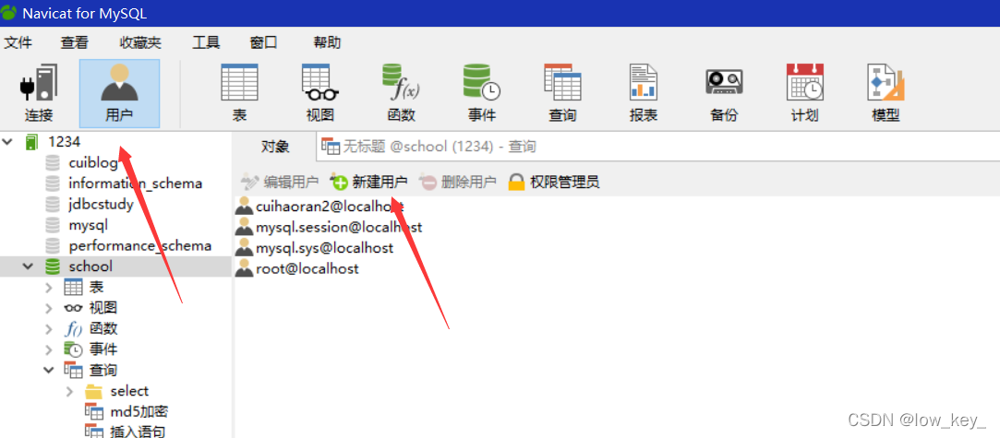


> 2、基本命令

```sql
/* 用户和权限管理 */ ------------------ 
用户信息表：mysql.user 

-- 刷新权限 
FLUSH PRIVILEGES 

-- 增加用户 CREATE USER kuangshen IDENTIFIED BY '123456' 
CREATE USER 用户名 IDENTIFIED BY [PASSWORD] 密码(字符串) 
- 必须拥有mysql数据库的全局CREATE USER权限，或拥有INSERT权限。 
- - 只能创建用户，不能赋予权限。 
- - 用户名，注意引号：如 'user_name'@'192.168.1.1' 
- - 密码也需引号，纯数字密码也要加引号 
- - 要在纯文本中指定密码，需忽略PASSWORD关键词。要把密码指定为由PASSWORD()函数返回的 混编值，需包含关键字PASSWORD 

- -- 重命名用户 RENAME USER kuangshen TO kuangshen2 
- RENAME USER old_user TO new_user 
- 
- -- 设置密码 
- SET PASSWORD = PASSWORD('密码')  -- 为当前用户设置密码 
SET PASSWORD FOR 用户名 = PASSWORD('密码') -- 为指定用户设置密码

-- 删除用户 DROP USER kuangshen2 
DROP USER 用户名 

-- 分配权限/添加用户 
GRANT 权限列表 ON 表名 TO 用户名 [IDENTIFIED BY [PASSWORD] 'password'] 
	- all privileges 表示所有权限 
	- - *.* 表示所有库的所有表 - 库名.表名 表示某库下面的某表 

-- 查看权限 SHOW GRANTS FOR root@localhost; 
SHOW GRANTS FOR 用户名
 
-- 查看当前用户权限 
SHOW GRANTS; 或 SHOW GRANTS FOR CURRENT_USER; 
或 SHOW GRANTS FOR CURRENT_USER(); 

-- 撤消权限 
REVOKE 权限列表 ON 表名 FROM 用户名 
REVOKE ALL PRIVILEGES, GRANT OPTION FROM 用户名 -- 撤销所有权限
```

> 权限解释

```sql
-- 权限列表 
ALL [PRIVILEGES] -- 设置除GRANT OPTION之外的所有简单权限 
ALTER -- 允许使用ALTER TABLE 
ALTER ROUTINE -- 更改或取消已存储的子程序 
CREATE -- 允许使用CREATE TABLE CREATE ROUTINE -- 创建已存储的子程序 
CREATE TEMPORARY TABLES -- 允许使用CREATE TEMPORARY TABLE 
CREATE USER -- 允许使用CREATE USER, DROP USER, RENAME USER和REVOKE ALL PRIVILEGES。 
CREATE VIEW -- 允许使用CREATE VIEW 
DELETE -- 允许使用DELETE 
DROP -- 允许使用DROP TABLE 
EXECUTE -- 允许用户运行已存储的子程序 
FILE -- 允许使用SELECT...INTO OUTFILE和LOAD DATA INFILE 
INDEX -- 允许使用CREATE INDEX和DROP INDEX 
INSERT -- 允许使用INSERT 
LOCK TABLES -- 允许对您拥有SELECT权限的表使用LOCK TABLES 
PROCESS -- 允许使用SHOW FULL PROCESSLIST 
REFERENCES -- 未被实施 RELOAD -- 允许使用FLUSH 
REPLICATION  CLIENT -- 允许用户询问从属服务器或主服务器的地址 
REPLICATION SLAVE -- 用于复制型从属服务器（从主服务器中读取二进制日志事件） 
SELECT -- 允许使用SELECT 
SHOW DATABASES -- 显示所有数据库 
SHOW VIEW -- 允许使用SHOW CREATE 
VIEW SHUTDOWN -- 允许使用mysqladmin shutdown 
SUPER -- 允许使用CHANGE MASTER, KILL, PURGE MASTER LOGS和SET GLOBAL语句， 
-- mysqladmin debug命令；允许您连接（一次），即使已达到max_connections。 
UPDATE -- 允许使用UPDATE 
USAGE -- “无权限”的同义词 
GRANT OPTION -- 允许授予权限

 /* 表维护 */
-- 分析和存储表的关键字分布 
ANALYZE [LOCAL | NO_WRITE_TO_BINLOG] TABLE 表名 ... 

-- 检查一个或多个表是否有错误 
CHECK TABLE tbl_name [, tbl_name] ... [option] ...
option = {QUICK | FAST | MEDIUM | EXTENDED | CHANGED} 

-- 整理数据文件的碎片 
OPTIMIZE [LOCAL | NO_WRITE_TO_BINLOG] TABLE tbl_name [, tbl_name] ...
```

### 8.2 MySQL备份

数据库备份必要性

- 保证重要数据不丢失
- 数据转移

MySQL数据库备份方法

- mysqldump备份工具
- 数据库管理工具,如SQLyog
- 直接拷贝数据库文件和相关配置文件

**mysqldump客户端**
作用 :

- 转储数据库
- 搜集数据库进行备份
- 将数据转移到另一个SQL服务器,不一定是MySQL服务器

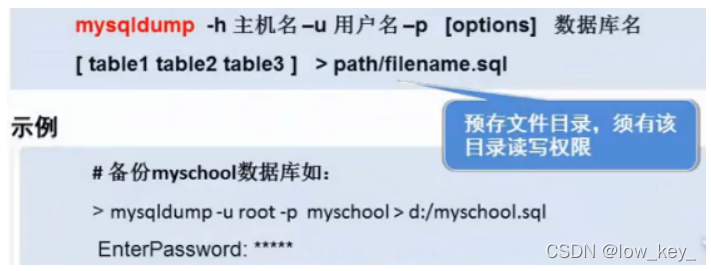

```sql
-- 导出 
1. 导出一张表 -- mysqldump -uroot -p123456 school student >D:/a.sql 
	mysqldump -u用户名 -p密码 库名 表名 > 文件名(D:/a.sql) 
2. 导出多张表 -- mysqldump -uroot -p123456 school student result >D:/a.sql 
	mysqldump -u用户名 -p密码 库名 表1 表2 表3 > 文件名(D:/a.sql) 
3. 导出所有表 -- mysqldump -uroot -p123456 school >D:/a.sql 
	mysqldump -u用户名 -p密码 库名 > 文件名(D:/a.sql) 
4. 导出一个库 -- mysqldump -uroot -p123456 -B school >D:/a.sql 
	mysqldump -u用户名 -p密码 -B 库名 > 文件名(D:/a.sql) 
	
可以-w携带备份条件

-- 导入 
1. 在登录mysql的情况下： -- source D:/a.sql 	
	source 备份文件 
2. 在不登录的情况下 
	mysql -u用户名 -p密码 库名 < 备份文件
```

## 9 规范化数据库设计

### 9.1 为什么需要数据库设计

当数据库比较复杂时我们需要设计数据库
**糟糕的数据库设计 :**

- 数据冗余,存储空间浪费
- 数据更新和插入的异常
- 程序性能差
  **良好的数据库设计 :**
- 节省数据的存储空间
- 能够保证数据的完整性
- 方便进行数据库应用系统的开发
  **软件项目开发周期中数据库设计 :**
  需求分析阶段: 分析客户的业务和数据处理需求
  概要设计阶段:设计数据库的E-R模型图 , 确认需求信息的正确和完整.
  **设计数据库步骤**
- 收集信息
  - 与该系统有关人员进行交流 , 座谈 , 充分了解用户需求 , 理解数据库需要完成的任务.
- 标识实体[Entity]
  - 标识数据库要管理的关键对象或实体,实体一般是名词
- 标识每个实体需要存储的详细信息[Attribute]
- 标识实体之间的关系[Relationship]

### 9.2 三大范式

**问题 : 为什么需要数据规范化?**
不合规范的表设计会导致的问题：

- 信息重复
- 更新异常
- 插入异常
  - 无法正确表示信息
- 删除异常
  - 丢失有效信息
  - 

**第一范式 (1st NF)**
第一范式的目标是确保每列的原子性,如果每列都是不可再分的最小数据单元,则满足第一范式

**第二范式(2nd NF)**
第二范式（2NF）是在第一范式（1NF）的基础上建立起来的，即满足第二范式（2NF）必须先满足第一
范式（1NF）。
第二范式要求每个表只描述一件事情

**第三范式(3rd NF)**
如果一个关系满足第二范式,并且除了主键以外的其他列都不传递依赖于主键列,则满足第三范式.
第三范式需要确保数据表中的每一列数据都和主键直接相关，而不能间接相关。

**规范化和性能的关系**
为满足某种商业目标 , 数据库性能比规范化数据库更重要
在数据规范化的同时 , 要综合考虑数据库的性能
通过在给定的表中添加额外的字段,以大量减少需要从中搜索信息所需的时间
通过在给定的表中插入计算列,以方便查询

## 10 JDBC

### 10.1 数据库驱动

这里的驱动的概念和平时听到的那种驱动的概念是一样的，比如平时购买的声卡，网卡直接插到计算机上面是不能用的，必须要安装相应的驱动程序之后才能够使用声卡和网卡，同样道理，我们安装好数据库之后，我们的应用程序也是不能直接使用数据库的，必须要通过相应的数据库驱动程序，通过驱动程序去和数据库打交道，如下所示：

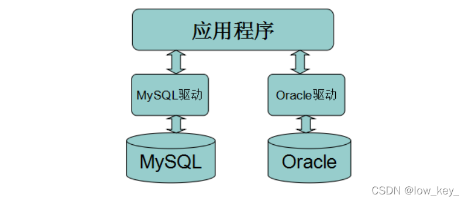

### 10.2 JDBC介绍

SUN公司为了简化、统一对数据库的操作，定义了一套Java操作数据库的规范（接口），称之为JDBC。
这套接口由数据库厂商去实现，这样，开发人员只需要学习jdbc接口，并通过jdbc加载具体的驱动，就
可以操作数据库。
如下图所示：

JDBC全称为：Java Data Base Connectivity（java数据库连接），它主要由接口组成。
组成JDBC的２个包：java.sql、javax.sql
开发JDBC应用需要以上2个包的支持外，还需要导入相应JDBC的数据库实现(即数据库驱动，换句话说，就是 mysql-connector-j 这个Maven包中的 com.mysql.cj.jdbc.Driver 这个驱动类)。

### 10.3 编写JDBC程序

> 搭建实验环境

```sql
CREATE DATABASE jdbcStudy CHARACTER SET utf8 COLLATE utf8_general_ci; 
USE jdbcStudy; 
CREATE TABLE users( 
	id INT PRIMARY KEY, 
	NAME VARCHAR(40), 
	PASSWORD VARCHAR(40), 
	email VARCHAR(60), 
	birthday DATE );
INSERT INTO users(id,NAME,PASSWORD,email,birthday) 
VALUES(1,'zhansan','123456','zs@sina.com','1980-12-04'), 
(2,'lisi','123456','lisi@sina.com','1981-12-04'), 
(3,'wangwu','123456','wangwu@sina.com','1979-12-04');
```

> 新建一个Java工程，并导入数据驱动
> 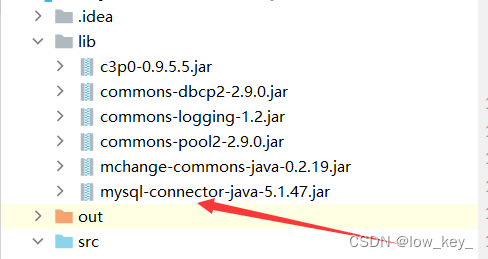
> 编写程序从user表中读取数据，并打印在命令行窗口中

```java
package com.jdbc.lesson01;

import java.sql.*;

public class jdbcFirstDemo {
    public static void main(String[] args) throws ClassNotFoundException,SQLException {
        // 1.加载驱动
        Class.forName("com.mysql.jdbc.Driver"); // 固定写法，加载驱动
        //DriverManager.registerDriver(new com.mysql.jdbc.Driver());

        // 2.用户信息和url
        String url = "jdbc:mysql://localhost:3306/jdbcstudy?useUnicode=true&characterEncoding=utf8&useSSL=false";
        String username="root";
        String password="root";

        // 3.连接成功，数据库对象
        Connection connection =DriverManager.getConnection(url,username,password);

        // 4.执行sql的对象
        Statement statement= connection.createStatement();
//        statement.executeQuery(); // 查询操作返回resultset
//        statement.execute();       // 执行任何sql
//        statement.executeUpdate();  // 更新，插入，删除，都是用这个，返回一个受影响1行数
        // 5.执行sql的对象，去执行sql可能存在结果，查看返回结果
        String sql = "SELECT * FROM users";
        ResultSet resultSet= statement.executeQuery(sql); //返回的结果集，结果集中封装了我们全部查询出来的结果

        while(resultSet.next()){
            System.out.println("id="+ resultSet.getObject("id"));
            System.out.println("name="+ resultSet.getObject("name"));
            System.out.println("password="+ resultSet.getObject("password"));
            System.out.println("email="+ resultSet.getObject("email"));
            System.out.println("birthday="+ resultSet.getObject("birthday"));
        }
        // 6. 释放连接
        resultSet.close();
        statement.close();
        connection.close();
    }
}
```

### 10.4 对象说明

> DriverManager类讲解

Jdbc程序中的DriverManager用于加载驱动，并创建与数据库的链接，这个API的常用方法：

```java
DriverManager.registerDriver(new Driver()) 
DriverManager.getConnection(url, user, password) 
```

注意：在实际开发中并不推荐采用registerDriver方法注册驱动。原因有二：

1. 查看Driver的源代码可以看到，如果采用此种方式，会导致驱动程序注册两次，也就是在内存中会有两个Driver对象。
2. 程序依赖mysql的api，脱离mysql的jar包，程序将无法编译，将来程序切换底层数据库将会非常麻烦。
   推荐方式：Class.forName(“com.mysql.jdbc.Driver”);
   采用此种方式不会导致驱动对象在内存中重复出现，并且采用此种方式，程序仅仅只需要一个字符串，不需要依赖具体的驱动，使程序的灵活性更高。

> 数据库URL讲解

URL用于标识数据库的位置，通过URL地址告诉JDBC程序连接哪个数据库，URL的写法为：


常用数据库URL地址的写法：

- Oracle写法：jdbc:oracle:thin:@localhost:1521:sid
- SqlServer写法：jdbc:microsoft:sqlserver://localhost:1433; DatabaseName=sid
- MySql写法：jdbc:mysql://localhost:3306/sid
  如果连接的是本地的Mysql数据库，并且连接使用的端口是3306，那么的url地址可以简写为
  **jdbc:mysql:///数据库**

> Connection类讲解

Jdbc程序中的Connection，它用于代表数据库的链接，Collection是数据库编程中最重要的一个对象，
客户端与数据库所有交互都是通过connection对象完成的，这个对象的常用方法：

- createStatement()：创建向数据库发送sql的statement对象。
- prepareStatement(sql) ：创建向数据库发送预编译sql的PrepareSatement对象。
- setAutoCommit(boolean autoCommit)：设置事务是否自动提交。
- commit() ：在链接上提交事务。
- rollback() ：在此链接上回滚事务。

> Statement类讲解

Jdbc程序中的Statement对象用于向数据库发送SQL语句， Statement对象常用方法：

- executeQuery(String sql) ：用于向数据发送查询语句。
- executeUpdate(String sql)：用于向数据库发送insert、update或delete语句
- execute(String sql)：用于向数据库发送任意sql语句
- addBatch(String sql) ：把多条sql语句放到一个批处理中。
- executeBatch()：向数据库发送一批sql语句执行。

> ResultSet类讲解

Jdbc程序中的ResultSet用于代表Sql语句的执行结果。Resultset封装执行结果时，采用的类似于表格的方式。ResultSet 对象维护了一个指向表格数据行的游标，初始的时候，游标在第一行之前，调用ResultSet.next() 方法，可以使游标指向具体的数据行，进行调用方法获取该行的数据ResultSet既然用于封装执行结果的，所以该对象提供的都是用于获取数据的get方法：

- 获取任意类型的数据
  - getObject(int index)
  - getObject(string columnName)
- 获取指定类型的数据，例如：
  - getString(int index)
  - getString(String columnName)
- ResultSet还提供了对结果集进行滚动的方法：
  - next()：移动到下一行
  - Previous()：移动到前一行
  - absolute(int row)：移动到指定行
  - beforeFirst()：移动resultSet的最前面。
  - afterLast() ：移动到resultSet的最后面。

> 释放资源

Jdbc程序运行完后，切记要释放程序在运行过程中，创建的那些与数据库进行交互的对象，这些对象通常是ResultSet, Statement和Connection对象，特别是Connection对象，它是非常稀有的资源，用完后必须马上释放，如果Connection不能及时、正确的关闭，极易导致系统宕机。Connection的使用原则是尽量晚创建，尽量早的释放。
为确保资源释放代码能运行，资源释放代码也一定要放在finally语句中。

### 10.5 statement对象

Jdbc中的statement对象用于向数据库发送SQL语句，想完成对数据库的增删改查，只需要通过这个对象向数据库发送增删改查语句即可。

Statement对象的executeUpdate方法，用于向数据库发送增、删、改的sql语句，executeUpdate执行完后，将会返回一个整数（即增删改语句导致了数据库几行数据发生了变化）。
Statement.executeQuery方法用于向数据库发送查询语句，executeQuery方法返回代表查询结果的ResultSet对象。

> CRUD操作-create

使用executeUpdate(String sql)方法完成数据添加操作，示例操作

```java
Statement st = conn.createStatement(); 
String sql = "insert into user(….) values(…..) "; 
int num = st.executeUpdate(sql); 
if(num>0){ 
	System.out.println("插入成功！！！"); 
}
```

> CRUD操作-delete

使用executeUpdate(String sql)方法完成数据删除操作，示例操作

```java
Statement st = conn.createStatement(); 
String sql = "delete from user where id=1"; 
int num = st.executeUpdate(sql); 
if(num>0){ 
	System.out.println(“删除成功！！！"); 
}
```

> CRUD操作-update

使用executeUpdate(String sql)方法完成数据修改操作，示例操作：

```java
Statement st = conn.createStatement(); 
String sql = "update user set name='' where name=''"; 
int num = st.executeUpdate(sql); 
if(num>0){ System.out.println(“修改成功！！！"); }
```

> CRUD操作-read

使用executeQuery(String sql)方法完成数据查询操作，示例操作：

```java
Statement st = conn.createStatement(); 
String sql = "select * from user where id=1"; 
ResultSet rs = st.executeUpdate(sql); 
while(rs.next()){ //根据获取列的数据类型，分别调用rs的相应方法映射到java对象中 }
```

使用jdbc对数据库增删改查
1、新建一个 lesson02 的包
2、在src目录下创建一个db.properties文件，如下图所示：


**要注意每个文件所放的位置，db.properties和lesson02是品级的**

> db.properities

**这里一定要注意配置文件，mysql8.0后需要在url后面加时区另外，狂神将的时候useSSL=True，但是我只有在useSSL=false的时候才能正常运行，可能是因为版本问题。

```java
driver=com.mysql.jdbc.Driver
url=jdbc:mysql://localhost:3306/jdbcstudy?useUnicode=true&characterEncoding=utf8&useSSL=False
username=root
password=root
```

3、在lesson02 下新建一个 utils 包，新建一个类 JdbcUtils

```java
package com.jdbc.lesson02.utils;

import java.io.IOException;
import java.io.InputStream;
import java.sql.*;
import java.util.Properties;

public class JdbcUtils {
    private static String driver = null;
    private static String url = null;
    private static String username = null;
    private static String password = null;
    static {
        try{
            InputStream in = JdbcUtils.class.getClassLoader().getResourceAsStream("db.properties");
            Properties properties = new Properties();
            properties.load(in);
            driver = properties.getProperty("driver");
            url = properties.getProperty("url");
            username = properties.getProperty("username");
            password = properties.getProperty("password");

            // 1.驱动只加载一次
            Class.forName(driver);
        }catch (IOException e){
            e.printStackTrace();
        }catch (ClassNotFoundException e){
            e.printStackTrace();
        }
    }

    // 获取连接
    public static Connection getConnection() throws SQLException {
        return DriverManager.getConnection(url,username,password);
    }

    //释放连接资源
    public static void release(Connection conn , Statement st, ResultSet rs){
        if (rs!=null)
        {
            try {
                rs.close();
            }catch (SQLException e){
                e.printStackTrace();
            }
        }
        if (st!=null)
        {
            try {
                st.close();
            }catch (SQLException e){
                e.printStackTrace();
            }
        }
        if (conn!=null)
        {
            try {
                conn.close();
            }catch (SQLException e){
                e.printStackTrace();
            }
        }
    }
}
```

> 使用statement对象完成对数据库的CRUD操作

1、插入一条数据

```java
package com.jdbc.lesson02;

import com.jdbc.lesson02.utils.JdbcUtils;

import java.sql.Connection;
import java.sql.ResultSet;
import java.sql.SQLException;
import java.sql.Statement;

public class TestInsert {
    public static void main(String[] args) {
        Connection conn = null;
        Statement st=null;
        ResultSet rs = null;

        try{
            conn = JdbcUtils.getConnection();//获取数据库连接
            st = conn.createStatement(); // 获取SQL的执行对象
            String sql = "insert into users(id,name,password,email,birthday)" + "values(46,'jianghhaifeng','123456','sdadad','2021-01-01')";

            int i = st.executeUpdate(sql);
            if(i>0){
                System.out.println("插入成功");
            }
        }catch (SQLException e){
            e.printStackTrace();
        }finally {
            JdbcUtils.release(conn,st,rs);

        }
    }
}
```

**由于我偷懒只写了一个插入的，所以后面三个操作代码都是照搬狂神的，需要的可以把代码复制到idea里然后alt + ctrl +L进行格式化操作**
2、删除一条数据

```java
package com.kuang.lesson02; import com.kuang.lesson02.utils.JdbcUtils; import java.sql.Connection; import java.sql.ResultSet; import java.sql.Statement; public class TestDelete { public static void main(String[] args) { Connection conn = null; Statement st = null; ResultSet rs = null; try{conn = JdbcUtils.getConnection(); String sql = "delete from users where id=4"; st = conn.createStatement(); int num = st.executeUpdate(sql); if(num>0){ System.out.println("删除成功！！"); }
}catch (Exception e) { e.printStackTrace(); }finally{ JdbcUtils.release(conn, st, rs); } } }
```

3、更新一条数据

```java
package com.kuang.lesson02; import com.kuang.lesson02.utils.JdbcUtils; import java.sql.Connection; import java.sql.ResultSet; import java.sql.Statement; public class TestUpdate { public static void main(String[] args) { Connection conn = null; Statement st = null; ResultSet rs = null; try{conn = JdbcUtils.getConnection(); String sql = "update users set name='kuangshen',email='24736743@qq.com' where id=3"; st = conn.createStatement(); int num = st.executeUpdate(sql); if(num>0){ System.out.println("更新成功！！"); } }catch (Exception e) { e.printStackTrace(); }finally{ JdbcUtils.release(conn, st, rs); } } }
```

4、查询数据

```java
package com.kuang.lesson02; import com.kuang.lesson02.utils.JdbcUtils; import java.sql.Connection; import java.sql.ResultSet; import java.sql.Statement; public class TestSelect { public static void main(String[] args) { Connection conn = null; Statement st = null; ResultSet rs = null; try{
conn = JdbcUtils.getConnection(); String sql = "select * from users where id=3"; st = conn.createStatement(); rs = st.executeQuery(sql); if(rs.next()){ System.out.println(rs.getString("name")); } }catch (Exception e) { e.printStackTrace(); }finally{ JdbcUtils.release(conn, st, rs); } } }
```

> SQL 注入问题

通过巧妙的技巧来拼接字符串，造成SQL短路，从而获取数据库数据

```java
package com.kuang.lesson02; 
import com.kuang.lesson02.utils.JdbcUtils; 
import java.sql.Connection; 
import java.sql.ResultSet; 
import java.sql.Statement; 
public class SQL注入 { public static void main(String[] args) { 
	//login("zhangsan","123456"); // 正常登陆 
	login("'or '1=1","123456"); // SQL 注入 
}

public static void login(String username,String password){ 
	Connection conn = null; 
	Statement st = null; 
	ResultSet rs = null; 
	try{
		conn = JdbcUtils.getConnection(); 
		// select * from users where name='' or '1=1' and password = '123456' 
		String sql = "select * from users where name='"+username+"' and password='"+password+"'"; 
		st = conn.createStatement(); 
		rs = st.executeQuery(sql); 
		while(rs.next()){ 
			System.out.println(rs.getString("name")); 	
			System.out.println(rs.getString("password")); 	
			System.out.println("=============="); 
			} 
		}catch (Exception e) { 
			e.printStackTrace(); 
		}finally{ 
			JdbcUtils.release(conn, st, rs); 
		}
	}
}
```

### 10.6 PreparedStatement对象

PreperedStatement是Statement的子类，它的实例对象可以通过调用
Connection.preparedStatement()方法获得，相对于Statement对象而言：PreperedStatement可以避免SQL注入的问题。

Statement会使数据库频繁编译SQL，可能造成数据库缓冲区溢出。

PreparedStatement可对SQL进行预编译，从而提高数据库的执行效率。并且PreperedStatement对于sql中的参数，允许使用占位符的形式进行替换，简化sql语句的编写。

> 使用PreparedStatement对象完成对数据库的CRUD操作

1、插入数据

```java
package com.jdbc.lesson03;

import com.jdbc.lesson02.utils.JdbcUtils;

import java.sql.Connection;
import java.util.Date;
import java.sql.PreparedStatement;
import java.sql.SQLException;

public class testInsert {
    public static void main(String[] args) {
        Connection conn = null;
        PreparedStatement pstm = null;

        try {
            conn = JdbcUtils.getConnection();
            String sql = "insert into users(id,name,password,email,birthday)" + "values(?,?,?,?,?)";

            //区别
            //使用？占位符代替参数
            pstm = conn.prepareStatement(sql); // 预编译sql， 先写sql。然后不执行

            //手动给参数赋值
            pstm.setInt(1,5);
            pstm.setString(2,"qingjiang");
            pstm.setString(3,"12342424");
            pstm.setString(4,"12121212");
            pstm.setDate(5,new java.sql.Date(new Date().getTime()));

            //执行
            int i  = pstm.executeUpdate();
            if(i>0){
                System.out.println("插入成功");
            }
        } catch (SQLException throwables) {
            throwables.printStackTrace();
        }finally {
            JdbcUtils.release(conn,pstm,null);
        }
    }


}
```

2、删除一条数据

```java
    package com.kuang.lesson03; 
    import com.kuang.lesson02.utils.JdbcUtils; 
    import java.sql.Connection; 
    import java.sql.PreparedStatement; 
    import java.sql.ResultSet;

    public class TestDelete {
        public static void main(String[] args) {
            Connection conn = null;
            PreparedStatement st = null;
            ResultSet rs = null;
            try {
                conn = JdbcUtils.getConnection();
                String sql = "delete from users where id=?";
                st = conn.prepareStatement(sql);
                st.setInt(1, 4);
                int num = st.executeUpdate();
                if (num > 0) {
                    System.out.println("删除成功！！");
                }
            } catch (Exception e) {
                e.printStackTrace();
            } finally {
                JdbcUtils.release(conn, st, rs);
            }
        }
    }
```

3、更新一条数据

```java
package com.kuang.lesson03; 
    import com.kuang.lesson02.utils.JdbcUtils; 
    import java.sql.Connection; 
    import java.sql.PreparedStatement; 
    import java.sql.ResultSet;

    public class TestUpdate {
        public static void main(String[] args) {
            Connection conn = null;
            PreparedStatement st = null;
            ResultSet rs = null;
            try {
                conn = JdbcUtils.getConnection();
                String sql = "update users set name=?,email=? where id=?";
                st = conn.prepareStatement(sql);
                st.setString(1, "kuangshen");
                st.setString(2, "24736743@qq.com");
                st.setInt(3, 2);
                int num = st.executeUpdate();
                if (num > 0) {
                    System.out.println("更新成功！！");
                }
            } catch (Exception e) {
                e.printStackTrace();
            } finally {
                JdbcUtils.release(conn, st, rs);
            }
        }
    }
```

4、查询一条数据

```java
package com.jdbc.lesson03;

import com.jdbc.lesson02.utils.JdbcUtils;

import java.sql.Connection;
import java.sql.PreparedStatement;
import java.sql.ResultSet;
import java.sql.SQLException;

public class testSelect {
    public static void main(String[] args) {
        Connection conn = null;
        PreparedStatement st = null;
        ResultSet rs = null;

        try {
            conn = JdbcUtils.getConnection();
            String sql = "select * from users where id=?";
            st = conn.prepareStatement(sql);
            st.setInt(1, 1);
            rs = st.executeQuery();//执行
            if (rs.next()){
                System.out.println(rs.getString("name"));
            }
        } catch (SQLException throwables) {
            throwables.printStackTrace();
        }finally {
            JdbcUtils.release(conn,st,rs);
        }


    }
}
```

> 避免SQL 注入

```java
package com.kuang.lesson03; 
import com.kuang.lesson02.utils.JdbcUtils;
import java.sql.Connection; 
import java.sql.PreparedStatement; 
import java.sql.ResultSet; 
import java.sql.Statement; 
public class SQL注入 { public static void main(String[] args) { 
	// login("zhangsan","123456"); // 正常登陆 
	login("'or '1=1","123456"); // SQL 注入 
	}
public static void login(String username,String password){ 
	Connection conn = null; 
	PreparedStatement st = null; 
	ResultSet rs = null; 
	try{conn = JdbcUtils.getConnection(); 
	// select * from users where name='' or '1=1' and password = '123456' 
	String sql = "select * from users where name=? and password=?"; 
	st = conn.prepareStatement(sql); 
	st.setString(1,username); 
	st.setString(2,password); 
	rs = st.executeQuery(); 
	while(rs.next()){ 
		System.out.println(rs.getString("name")); 
		System.out.println(rs.getString("password")); 	
		System.out.println("=============="); 
		} 
	}
	catch (Exception e) { 
			e.printStackTrace(); 
	}finally{ 
	JdbcUtils.release(conn, st, rs); 
		} 
	}	 
}
```

原理：执行的时候参数会用引号包起来，并把参数中的引号作为转义字符，从而避免了参数也作为条件的一部分

### 10.7 事务

> 概念

**事务指逻辑上的一组操作，组成这组操作的各个单元，要不全部成功，要不全部不成功。**

> ACID 原则

**原子性(Atomic)**

- 整个事务中的所有操作，要么全部完成，要么全部不完成，不可能停滞在中间某个环节。事务在执行过程中发生错误，会被回滚（ROLLBACK）到事务开始前的状态，就像这个事务从来没有执行过一样。

**一致性(Consist)**

- 一个事务可以封装状态改变（除非它是一个只读的）。事务必须始终保持系统处于一致的状态，不管在任何给定的时间并发事务有多少。也就是说：如果事务是并发多个，系统也必须如同串行事务一样操作。其主要特征是保护性和不变性(Preserving an Invariant)，以转账案例为例，假设有五个账户，每个账户余额是100元，那么五个账户总额是500元，如果在这个5个账户之间同时发生多个转账，无论并发多少个，比如在A与B账户之间转账5元，在C与D账户之间转账10元，在B与E之间转账15元，五个账户总额也应该还是500元，这就是保护性和不变性。

**隔离性(Isolated)**

- 隔离状态执行事务，使它们好像是系统在给定时间内执行的唯一操作。如果有两个事务，运行在相同的时间内，执行相同的功能，事务的隔离性将确保每一事务在系统中认为只有该事务在使用系统。这种属性有时称为串行化，为了防止事务操作间的混淆，必须串行化或序列化请求，使得在同一时间仅有一个请求用于同一数据。

**持久性(Durable)**

- 在事务完成以后，该事务对数据库所作的更改便持久的保存在数据库之中，并不会被回滚。

> 隔离性问题

1、脏读：脏读指一个事务读取了另外一个事务未提交的数据。
2、不可重复读：不可重复读指在一个事务内读取表中的某一行数据，多次读取结果不同。
3、虚读(幻读) : 虚读(幻读)是指在一个事务内读取到了别的事务插入的数据，导致前后读取不一致。

> 代码测试

```sql
/*创建账户表*/ 
CREATE TABLE account( 
	id INT PRIMARY KEY AUTO_INCREMENT, 
	NAME VARCHAR(40), money FLOAT );
	/*插入测试数据*/ 
	insert into account(name,money) values('A',1000); 
	insert into account(name,money) values('B',1000); 
	insert into account(name,money) values('C',1000);
```

当Jdbc程序向数据库获得一个Connection对象时，默认情况下这个Connection对象会自动向数据库提交在它上面发送的SQL语句。若想关闭这种默认提交方式，让多条SQL在一个事务中执行，可使用下列的JDBC控制事务语句

- Connection.setAutoCommit(false);//开启事务(start transaction)
- Connection.rollback();//回滚事务(rollback)
- Connection.commit();//提交事务(commit)

> 程序编写

1、模拟转账成功时的业务场景

```java
package com.kuang.lesson04; 
import com.kuang.lesson02.utils.JdbcUtils; 
import java.sql.Connection; 
import java.sql.PreparedStatement; 
import java.sql.ResultSet; //模拟转账成功时的业务场景 
public class TestTransaction1 { 
	public static void main(String[] args) { 
		Connection conn = null; 
		PreparedStatement st = null; 
		ResultSet rs = null; 
		try{
			conn = JdbcUtils.getConnection(); 
			conn.setAutoCommit(false);//通知数据库开启事务(start transaction) 
			String sql1 = "update account set money=money-100 where name='A'"; 
			st = conn.prepareStatement(sql1); 
			st.executeUpdate(); 
			String sql2 = "update account set money=money+100 where name='B'"; 
			st = conn.prepareStatement(sql2); 
			st.executeUpdate(); 
			conn.commit();//上面的两条SQL执行Update语句成功之后就通知数据库提交事务 (commit) 
			System.out.println("成功！！！"); //log4j 
		}catch (Exception e) { 
			e.printStackTrace(); 
		}finally{ 
			JdbcUtils.release(conn, st, rs); 
		} 
	} 
}
```

2、模拟转账过程中出现异常导致有一部分SQL执行失败后让数据库自动回滚事务

```java
package com.kuang.lesson04; 
    import com.kuang.lesson02.utils.JdbcUtils; 
    import java.sql.Connection; 
    import java.sql.PreparedStatement; 
    import java.sql.ResultSet;

    // 模拟转账过程中出现异常导致有一部分SQL执行失败后让数据库自动回滚事务 
    public class TestTransaction2 {
        public static void main(String[] args) {
            Connection conn = null;
            PreparedStatement st = null;
            ResultSet rs = null;
            try {
                conn = JdbcUtils.getConnection();
                conn.setAutoCommit(false);
                //通知数据库开启事务(start transaction) 
                String sql1 = "update account set money=money-100 where name='A'";
                st = conn.prepareStatement(sql1);
                st.executeUpdate(); //用这句代码模拟执行完SQL1之后程序出现了异常而导致后面的SQL无法正常执行，事 务也无法正常提交，此时数据库会自动执行回滚操作 
                int x = 1 / 0;
                String sql2 = "update account set money=money+100 where name='B'";
                st = conn.prepareStatement(sql2);
                st.executeUpdate();
                conn.commit();//上面的两条SQL执行Update语句成功之后就通知数据库提交事务 (commit) 
                System.out.println("成功！！！");
            } catch (
                    Exception e) {
                e.printStackTrace();
            } finally {
                JdbcUtils.release(conn, st, rs);
            }
        }
    }
```

3、模拟转账过程中出现异常导致有一部分SQL执行失败时手动通知数据库回滚事务

```java
package com.kuang.lesson04; 
    import com.kuang.lesson02.utils.JdbcUtils; 
    import java.sql.Connection; 
    import java.sql.PreparedStatement; 
    import java.sql.ResultSet; 
    import java.sql.SQLException;

    //模拟转账过程中出现异常导致有一部分SQL执行失败时手动通知数据库回滚事务 
    public class TestTransaction3 {
        public static void main(String[] args) {
            Connection conn = null;
            PreparedStatement st = null;
            ResultSet rs = null;
            try {
                conn = JdbcUtils.getConnection();
                conn.setAutoCommit(false);//通知数据库开启事务(start transaction) 
                String sql1 = "update account set money=money-100 where name='A'";
                st = conn.prepareStatement(sql1);
                st.executeUpdate(); //用这句代码模拟执行完SQL1之后程序出现了异常而导致后面的SQL无法正常执行，事 务也无法正常提交
                int x = 1 / 0;
                String sql2 = "update account set money=money+100 where name='B'";
                st = conn.prepareStatement(sql2);
                st.executeUpdate();
                conn.commit();
                //上面的两条SQL执行Update语句成功之后就通知数据库提交事务 (commit) 
                System.out.println("成功！！！");
            } catch (Exception e) {
                try {
                    //捕获到异常之后手动通知数据库执行回滚事务的操作 
                    conn.rollback();
                } catch (SQLException e1) {
                    e1.printStackTrace();
                }
                e.printStackTrace();
            } finally {
                JdbcUtils.release(conn, st, rs);
            }
        }
    }
```

### 10.8 数据库连接池

用户每次请求都需要向数据库获得链接，而数据库创建连接通常需要消耗相对较大的资源，创建时间也较长。假设网站一天10万访问量，数据库服务器就需要创建10万次连接，极大的浪费数据库的资源，并且极易造成数据库服务器内存溢出、拓机。
**数据库连接池的基本概念**
数据库连接是一种关键的有限的昂贵的资源,这一点在多用户的网页应用程序中体现的尤为突出.对数据库连接的管理能显著影响到整个应用程序的伸缩性和健壮性,影响到程序的性能指标.数据库连接池正式针对这个问题提出来的.数据库连接池负责分配,管理和释放数据库连接,它允许应用程序重复使用一个现有的数据库连接,而不是重新建立一个。

数据库连接池在初始化时将创建一定数量的数据库连接放到连接池中, 这些数据库连接的数量是由最小数据库连接数来设定的.无论这些数据库连接是否被使用,连接池都将一直保证至少拥有这么多的连接数量.连接池的最大数据库连接数量限定了这个连接池能占有的最大连接数,当应用程序向连接池请求的连接数超过最大连接数量时,这些请求将被加入到等待队列中.

数据库连接池的最小连接数和最大连接数的设置要考虑到以下几个因素:

1. 最小连接数:是连接池一直保持的数据库连接,所以如果应用程序对数据库连接的使用量不大,将会有大量的数据库连接资源被浪费.
2. 最大连接数:是连接池能申请的最大连接数,如果数据库连接请求超过次数,后面的数据库连接请求将被加入到等待队列中,这会影响以后的数据库操作
3. 如果最小连接数与最大连接数相差很大:那么最先连接请求将会获利,之后超过最小连接数量的连接请求等价于建立一个新的数据库连接.不过,这些大于最小连接数的数据库连接在使用完不会马上被释放,他将被放到连接池中等待重复使用或是空间超时后被释放.

**编写连接池需实现java.sql.DataSource接口。**

> 开源数据库连接池

现在很多WEB服务器(Weblogic, WebSphere, Tomcat)都提供了DataSoruce的实现，即连接池的实现。通常我们把DataSource的实现，按其英文含义称之为数据源，数据源中都包含了数据库连接池的实现。

也有一些开源组织提供了数据源的独立实现：

- DBCP 数据库连接池
- C3P0 数据库连接池

在使用了数据库连接池之后，在项目的实际开发中就不需要编写连接数据库的代码了，直接从数据源获得数据库的连接。

> DBCP数据源

DBCP 是 Apache 软件基金组织下的开源连接池实现，要使用DBCP数据源，需要应用程序应在系统中增
加如下两个 jar 文件：
Commons-dbcp.jar：连接池的实现
Commons-pool.jar：连接池实现的依赖库
Tomcat 的连接池正是采用该连接池来实现的。该数据库连接池既可以与应用服务器整合使用，也可由应用程序独立使用。
测试：
1、导入相关jar包
2、在类目录下加入dbcp的配置文件：dbcpconfig.properties

```java
#连接设置
driverClassName=com.mysql.jdbc.Driver
url=jdbc:mysql://localhost:3306/jdbcstudy?useUnicode=true&characterEncoding=utf8&useSSL=false
username=root
password=root

#<!-- 初始化连接 -->
initialSize=10

#最大连接数量
maxActive=50

#<!-- 最大空闲连接 -->
maxIdle=20

#<!-- 最小空闲连接 -->
minIdle=5

#<!-- 超时等待时间以毫秒为单位 6000毫秒/1000等于60秒 -->
maxWait=60000
#JDBC驱动建立连接时附带的连接属性属性的格式必须为这样：【属性名=property;】
#注意："user" 与 "password" 两个属性会被明确地传递，因此这里不需要包含他们。
connectionProperties=useUnicode=true;characterEncoding=UTF8

#指定由连接池所创建的连接的自动提交（auto-commit）状态。
defaultAutoCommit=true

#driver default 指定由连接池所创建的连接的只读（read-only）状态。
#如果没有设置该值，则“setReadOnly”方法将不被调用。（某些驱动并不支持只读模式，如：Informix）
defaultReadOnly=

#driver default 指定由连接池所创建的连接的事务级别（TransactionIsolation）。
#可用值为下列之一：（详情可见javadoc。）NONE,READ_UNCOMMITTED, READ_COMMITTED, REPEATABLE_READ, SERIALIZABLE
defaultTransactionIsolation=READ_UNCOMMITTED
```

3、编写工具类 JdbcUtils_DBCP

```java
package com.jdbc.lesson05.utils;

import org.apache.commons.dbcp2.BasicDataSourceFactory;

import javax.sql.DataSource;
import java.io.InputStream;
import java.sql.*;
import java.util.Properties;

public class JdbcUtils_DBCP {

    private static DataSource dataSource = null;

    static{
        try {
            InputStream resourceAsStream = JdbcUtils_DBCP.class.getClassLoader().getResourceAsStream("dbcp.properties");
            Properties properties = new Properties();
            properties.load(resourceAsStream);

            // 创建数据源 工厂模式 ----> 创建
            dataSource = BasicDataSourceFactory.createDataSource(properties);


        } catch (Exception e) {
            e.printStackTrace();
        }
    }

    // 获取连接
    public static Connection getConnection() throws SQLException {
        // 从数据源中获取连接
        return dataSource.getConnection();
    }

    // 释放资源

    public static void release(Connection conn, Statement statement, ResultSet resultSet) {
        if (resultSet != null) {
            try {
                resultSet.close();
            } catch (SQLException e) {
                e.printStackTrace();
            }
        }
        if (statement != null) {
            try {
                statement.close();
            } catch (SQLException e) {
                e.printStackTrace();
            }
        }
        if (conn != null) {
            try {
                conn.close();
            } catch (SQLException e) {
                e.printStackTrace();
            }
        }
    }
}
```

测试类

```java
package com.jdbc.lesson05;

import com.jdbc.lesson05.utils.JdbcUtils_DBCP;

import java.sql.Connection;
import java.sql.PreparedStatement;
import java.sql.SQLException;

public class testDBCP {
    public static void main(String[] args) {
        Connection conn = null;
        PreparedStatement preparedStatement = null;

        try {
            conn = JdbcUtils_DBCP.getConnection();

            // 使用“？”占位符 来代替参数
            String sql = "INSERT INTO users (`id`,`NAME`,`PASSWORD`,`email`,`birthday`) VALUES(?,?,?,?,?)";
            // 预编译sql，
            preparedStatement = conn.prepareStatement(sql);

            // 手动给参数赋值
            preparedStatement.setInt(1,4);
            preparedStatement.setString(2,"no4");
            preparedStatement.setString(3, "123456");
            preparedStatement.setString(4, "4@qq.com");
            // sql.Date 数据库 java.sql.Date()
            // util.Date Java  new Date().getTime() ----> System.currentTimeMillis()
            preparedStatement.setDate(5, new java.sql.Date(System.currentTimeMillis()));

            // 执行
            int i = preparedStatement.executeUpdate();
            if (i > 0) {
                System.out.println("插入成功");
            }
        } catch (SQLException e) {
            e.printStackTrace();
        }finally {
            JdbcUtils_DBCP.release(conn, preparedStatement, null);
        }
    }
}
```

> C3P0

C3P0是一个开源的JDBC连接池，它实现了数据源和JNDI绑定，支持JDBC3规范和JDBC2的标准扩展。目前使用它的开源项目有Hibernate，Spring等。C3P0数据源在项目开发中使用得比较多。
**c3p0与dbcp区别**

- dbcp没有自动回收空闲连接的功能
- c3p0有自动回收空闲连接功能
  测试
  1、导入相关jar包 2、在类目录下加入C3P0的配置文件：c3p0-config.xml

```java
<?xml version="1.0" encoding="UTF-8"?>
<c3p0-config>
    <!--
c3p0的缺省（默认）配置
如果在代码中"ComboPooledDataSource ds=new ComboPooledDataSource();"这样写就表示使用的是c3p0的缺省（默认）-->
    <default-config>
        <property name="driverClass">com.mysql.jdbc.Driver</property>
        <property name="jdbcUrl">jdbc:mysql://localhost:3306/jdbcstudy?userUnicode=true&amp;characterEncoding=utf8&amp;uesSSL=false</property>
        <property name="user">root</property>
        <property name="password">root</property>

        <property name="acquiredIncrement">5</property>
        <property name="initialPoolSize">10</property>
        <property name="minPoolSize">5</property>
        <property name="maxPoolSize">20</property>
    </default-config>
</c3p0-config>
```

3、创建工具类

```java
package com.jdbc.lesson05.utils;

import com.mchange.v2.c3p0.ComboPooledDataSource;
import org.apache.commons.dbcp2.BasicDataSourceFactory;

import javax.sql.DataSource;
import java.io.InputStream;
import java.sql.Connection;
import java.sql.ResultSet;
import java.sql.SQLException;
import java.sql.Statement;
import java.util.Properties;

public class JdbcUtils_c3p0 {

    private static DataSource dataSource = null;

    static{
        try {

            // 创建数据源 工厂模式 ----> 创建
            dataSource = new ComboPooledDataSource();

        } catch (Exception e) {
            e.printStackTrace();
        }
    }

    // 获取连接
    public static Connection getConnection() throws SQLException {
        // 从数据源中获取连接
        return dataSource.getConnection();
    }

    // 释放资源

    public static void release(Connection conn, Statement statement, ResultSet resultSet) {
        if (resultSet != null) {
            try {
                resultSet.close();
            } catch (SQLException e) {
                e.printStackTrace();
            }
        }
        if (statement != null) {
            try {
                statement.close();
            } catch (SQLException e) {
                e.printStackTrace();
            }
        }
        if (conn != null) {
            try {
                conn.close();
            } catch (SQLException e) {
                e.printStackTrace();
            }
        }
    }
}
```

测试类

```java
package com.jdbc.lesson05;

import com.jdbc.lesson05.utils.JdbcUtils_DBCP;
import com.jdbc.lesson05.utils.JdbcUtils_c3p0;

import java.sql.Connection;
import java.sql.PreparedStatement;
import java.sql.SQLException;

public class test_c3p0 {
    public static void main(String[] args) {
        Connection conn = null;
        PreparedStatement preparedStatement = null;

        try {
            conn = JdbcUtils_c3p0.getConnection();

            // 使用“？”占位符 来代替参数
            String sql = "INSERT INTO users (`id`,`NAME`,`PASSWORD`,`email`,`birthday`) VALUES(?,?,?,?,?)";
            // 预编译sql，
            preparedStatement = conn.prepareStatement(sql);

            // 手动给参数赋值
            preparedStatement.setInt(1,6);
            preparedStatement.setString(2,"no4");
            preparedStatement.setString(3, "123456");
            preparedStatement.setString(4, "4@qq.com");
            // sql.Date 数据库 java.sql.Date()
            // util.Date Java  new Date().getTime() ----> System.currentTimeMillis()
            preparedStatement.setDate(5, new java.sql.Date(System.currentTimeMillis()));

            // 执行
            int i = preparedStatement.executeUpdate();
            if (i > 0) {
                System.out.println("插入成功");
            }
        } catch (SQLException e) {
            e.printStackTrace();
        }finally {
            JdbcUtils_c3p0.release(conn, preparedStatement, null);
        }
    }
}
```

# 补充

## MySQL运算符

### 1. 算术运算符

MySQL 支持的算术运算符包括:

| 运算符   | 作用 |
| :------- | :--- |
| +        | 加法 |
| -        | 减法 |
| *        | 乘法 |
| / 或 DIV | 除法 |
| % 或 MOD | 取余 |

### 2. 比较运算符

   SELECT 语句中的条件语句经常要使用比较运算符。通过这些比较运算符，可以判断表中的哪些记录是符合条件的。比较结果为真，则返回 1，为假则返回 0，比较结果不确定则返回 NULL。

| 符号            | 描述                       | 备注                                                         |
| :-------------- | :------------------------- | :----------------------------------------------------------- |
| =               | 等于                       |                                                              |
| <>, !=          | 不等于                     |                                                              |
| >               | 大于                       |                                                              |
| <               | 小于                       |                                                              |
| <=              | 小于等于                   |                                                              |
| >=              | 大于等于                   |                                                              |
| BETWEEN         | 在两值之间                 | >=min&&<=max                                                 |
| NOT BETWEEN     | 不在两值之间               |                                                              |
| IN              | 在集合中                   |                                                              |
| NOT IN          | 不在集合中                 |                                                              |
| <=>             | 严格比较两个NULL值是否相等 | 两个操作码均为NULL时，其所得值为1；而当一个操作码为NULL时，其所得值为0 |
| LIKE            | 模糊匹配                   |                                                              |
| REGEXP 或 RLIKE | 正则式匹配                 |                                                              |
| IS NULL         | 为空                       |                                                              |
| IS NOT NULL     | 不为空                     |                                                              |

### 3. 逻辑运算符

逻辑运算符用来判断表达式的真假。如果表达式是真，结果返回 1。如果表达式是假，结果返回 0。

| 运算符号 | 作用     |
| :------- | :------- |
| NOT 或 ! | 逻辑非   |
| AND      | 逻辑与   |
| OR       | 逻辑或   |
| XOR      | 逻辑异或 |

### 4. 位运算符

位运算符是在二进制数上进行计算的运算符。位运算会先将操作数变成二进制数，进行位运算。然后再将计算结果从二进制数变回十进制数。

| 运算符号 | 作用     |
| :------- | :------- |
| &        | 按位与   |
| \|       | 按位或   |
| ^        | 按位异或 |
| !        | 取反     |
| <<       | 左移     |
| >>       | 右移     |

## SQL优化总结

### MySQL内部逻辑图

在开始介绍如何优化sql前，先附上mysql内部逻辑图让大家有所了解。


 

**1）连接器：**主要负责跟客户端建立连接 获取权限 维持和管理连接。

**2）查询缓存：**优先在缓存中进行查询，如果查到了则直接返回，如果缓存中查询不到，再去数据库中查询。

MySQL缓存是默认关闭的，也就是说不推荐使用缓存，并且在MySQL8.0 版本已经将查询缓存的整块功能删掉了。这主要是它的使用场景限制造成的：

- 先说下缓存中数据存储格式：key（sql语句）- value（数据值），所以如果SQL语句（key）只要存在一点不同之处就会直接进行数据库查询了；

- 由于表中的数据不是一成不变的，大多数是经常变化的，而当数据库中的数据变化了，那么相应的与此表相关的缓存数据就需要移除掉。

**3）解析器/分析器：**分析器的工作主要是对要执行的SQL语句进行词法解析 语法解析，最终得到抽象语法树，然后再使用预处理器对抽象语法树进行语义校验，判断抽象语法树中的表是否存在，如果存在的话，再接着判断select投影列字段是否在表中存在等。

**4）优化器：**主要将SQL经过词法解析 语法解析后得到的语法树，通过数据字典和统计信息的内容，再经过一系列运算 ，最终得出一个执行计划，包括选择使用哪个索引。

在分析是否走索引查询时，是通过进行动态数据采样统计分析出来；只要是统计分析出来的，那就可能会存在分析错误的情况，所以在SQL执行不走索引时，也要考虑到这方面的因素。

**5）执行器：**根据一系列的执行计划去调用存储引擎提供的API接口去调用操作数据，完成SQL的执行。

### 一 SQL语句的优化

#### 1 尽量避免使用子查询

例：

```sql
SELECT * FROM t1 WHERE id = (SELECT id FROM t2 WHERE name = 'chackca');
```

子查询在Mysql5.5版本里，内部执行计划是这样：先查外表再匹配内表，而不是先查内表t2。（即：会先扫描`t1`表，然后对于`t1`中的每一行，执行子查询`SELECT id FROM t2 WHERE name = 'chackca'`。）当外表`t1`很大时，这种方式效率会非常低。

在MariaDB10/Mysql5.6版本里，采用join关联方式对其进行了优化，这条SQL语句会自动转换为：

```sql
SELECT t1.* FROM t1 JOIN t2 on t1.id = t2.id WHERE name = 'chackca'
```

但请注意的是：优化只针对SELECT有效，对UPDATE/DELETE子查询无效，故生产环境应避免使用子查询

由于MySQL的优化器对于子查询的处理能力比较弱，所以不建议使用子查询，可以改写成Inner Join，之所以 join 连接效率更高，是因为 MySQL不需要在内存中创建临时表

#### 2 用IN来替换OR

- **低效查询**

```sql
SELECT * FROM t WHERE id = 10 OR id = 20 OR id = 30;
```

- **高效查询**

```sql
SELECT * FROM t WHERE id IN (10,20,30);
```

另外，MySQL对于IN做了相应的优化，即将IN中的常量全部存储在一个数组里面，而且这个数组是排好序的。但是如果数值较多，产生的消耗也是比较大的。再例如：

```sql
select id from table_name where num in(1,2,3)
```

对于连续的数值，能用 between 就不要用 in 了；再或者使用连接来替换。

#### 3 读取适当的记录LIMIT M,N，而不要读多余的记录

```sql
select id,name from t limit 866613, 20
```

使用上述sql语句做分页的时候，可能有人会发现，随着表数据量的增加，直接使用limit分页查询会越来越慢。

对于 limit m, n 的分页查询，越往后面翻页（即m越大的情况下）SQL的耗时会越来越长，对于这种应该先取出主键id，然后通过主键id跟原表进行Join关联查询。因为MySQL 并不是跳过 offset 行，而是取 offset+N 行，然后放弃前 offset 行，返回 N 行，那当 offset 特别大的时候，效率就非常地低下，要么控制返回的总页数，要么对超过特定阈值的页数进行 SQL 改写。

优化的方法如下：可以取前一页的最大行数的id（将上次遍历到的最末尾的数据ID传给数据库，然后直接定位到该ID处，再往后面遍历数据），然后根据这个最大的id来限制下一页的起点。比如此列中，上一页最大的id是866612。sql可以采用如下的写法：

```sql
select id,name from table_name where id> 866612 limit 20	
```

#### 4 禁止不必要的Order By排序

如果我们对结果没有排序的要求，就尽量少用排序；

如果排序字段没有用到索引，也尽量少用排序；

另外，分组统计查询时可以禁止其默认排序

```sql
SELECT goods_id,count(*) FROM t GROUP BY goods_id;
```

默认情况下，Mysql会对所有的GROUP BY col1,col2…的字段进行排序，也就是说上述会对 goods_id进行排序，如果想要避免排序结果的消耗，可以指定ORDER BY NULL禁止排序：

```sql
SELECT goods_id,count(*) FROM t GROUP BY goods_id ORDER BY NULL
```

#### 5 总和查询可以禁止排重用union all

- **`UNION`**：用于合并两个或多个结果集，并在合并后自动去除重复的行。这种操作会涉及到排序和唯一性检查，这会消耗更多的CPU资源并增加查询的延迟。
- **`UNION ALL`**：同样用于合并两个或多个结果集，但不会去除重复的行。因此，它不需要进行排序和唯一性检查，因而消耗的CPU资源更少，速度更快。
- **使用 `UNION`**：当你不确定结果集中是否会有重复数据，或者你确实需要去除重复的数据时，使用 `UNION` 是合适的。
- **使用 `UNION ALL`**：当你确定结果集中不会有重复数据，或者即使有重复数据也无关紧要时，使用 `UNION ALL` 可以提高查询速度，因为它省去了去重和排序的步骤。

#### 6 避免随机取记录

```sql
SELECT * FROM t1 WHERE 1 = 1 ORDER BY RAND() LIMIT 4;        
SELECT * FROM t1 WHERE id >= CEIL(RAND()*1000) LIMIT 4;
```

以上两个语句都无法用到索引

#### 7 将多次插入换成批量Insert插入

```sql
INSERT INTO t(id, name) VALUES(1, 'aaa');       
INSERT INTO t(id, name) VALUES(2, 'bbb');        
INSERT INTO t(id, name) VALUES(3, 'ccc');       
—> INSERT INTO t(id, name) VALUES(1, 'aaa'),(2, 'bbb'),(3, 'ccc');
```

#### 8 只返回必要的列，用具体的字段列表代替 select \* 语句

SELECT * 会增加很多不必要的消耗（cpu io 内存 网络带宽）；增加了使用覆盖索引的可能性；当表结构发生改变时，前者也需要经常更新。所以要求直接在select后面接上字段名。

MySQL数据库是按照行的方式存储，而数据存取操作都是以一个页大小进行IO操作的，每个IO单元中存储了多行，每行都是存储了该行的所有字段。所以无论取一个字段还是多个字段，实际上数据库在表中需要访问的数据量其实是一样的。

但是如果查询的字段都在索引中，也就是覆盖索引，那么可以直接从索引中获取对应的内容直接返回，不需要进行回表，减少IO操作。除此之外，当存在 order by 操作的时候，select 子句中的字段多少会在很大程度上影响到我们的排序效率。

#### 9 区分in和exists

 ```sql 
select * from 表A where id in (select id from 表B)
 ```

上面的语句相当于：

```sql
select * from 表A where exists(select * from 表B where 表B.id=表A.id)
```

区分in和exists主要是造成了驱动顺序的改变（这是性能变化的关键），如果是exists，那么以外层表为驱动表，先被访问，如果是IN，那么先执行子查询。所以IN适合于外表大而内表小的情况；EXISTS适合于外表小而内表大的情况。

另外，in查询在某些情况下有可能会查询返回错误的结果，因此，通常是建议在确定且有限的集合时，可以使用in。如 IN （0，1，2）。

#### 10 优化Group By语句

如果对group by语句的结果没有排序要求，要在语句后面加 order by null（group 默认会排序）；

尽量让group by过程用上表的索引，确认方法是explain结果里没有Using temporary 和 Using filesort；

如果group by需要统计的数据量不大，尽量只使用内存临时表；也可以通过适当调大tmp_table_size参数，来避免用到磁盘临时表

- 如果数据量实在太大，使用SQL_BIG_RESULT这个提示，来告诉优化器直接使用排序算法（直接用磁盘临时表）得到group by的结果。

使用where子句替换Having子句：避免使用having子句，having只会在检索出所有记录之后才会对结果集进行过滤，这个处理需要排序分组，如果能通过where子句提前过滤查询的数目，就可以减少这方面的开销。

- **低效**

```sql
SELECT JOB, AVG(SAL) FROM EMP GROUP by JOB HAVING JOB = ‘PRESIDENT’ OR JOB = ‘MANAGER’
```

- **高效**

```sql
SELECT JOB, AVG(SAL) FROM EMP WHERE JOB = ‘PRESIDENT’ OR JOB = ‘MANAGER’ GROUP by JOB
```

#### 11 尽量使用数字型字段

若只含数值信息的字段尽量不要设计为字符型，这会降低查询和连接的性能。引擎在处理查询和连接时会逐个比较字符串中每一个字符，而对于数字型而言只需要比较一次就够了。

#### 12 优化Join语句

当我们执行两个表的Join的时候，就会有一个比较的过程，逐条比较两个表的语句是比较慢的，因此可以把两个表中数据依次读进一个内存块中，在Mysql中执行：

```sql
show variables like ‘join_buffer_size’
```

可以看到join在内存中的缓存池大小，其大小将会影响join语句的性能。在执行join的时候，数据库会选择一个表把他要返回以及需要进行和其他表进行比较的数据放进join_buffer。

什么是驱动表，什么是被驱动表，这两个概念在查询中有时容易让人搞混，有下面几种情况，大家需要了解。

**1）当连接查询没有where条件时**

- left join 前面的表是驱动表，后面的表是被驱动表
- right join 后面的表是驱动表，前面的表是被驱动表
- inner join / join 会自动选择表数据比较少的作为驱动表
- straight_join(≈join) 直接选择左边的表作为驱动表（语义上与join类似，但去除了join自动选择小表作为驱动表的特性）

**2）当连接查询有where条件时，带where条件的表是驱动表，否则是被驱动表**

假设有表如右边：t1与t2表完全一样，a字段有索引，b无索引，t1有100条数据，t2有1000条数据

若被驱动表有索引，那么其执行算法为：Index Nested-Loop Join（NLJ），示例如下：

①执行语句：select * from t1 straight_join t2 on (t1.a=t2.a)；由于被驱动表t2.a是有索引的，其执行逻辑如下：

- 从表t1中读入一行数据 R
- 从数据行R中，取出a字段到表t2里去查找
- 取出表t2中满足条件的行，跟R组成一行，作为结果集的一部分
- 重复执行步骤1到3，直到表t1的末尾循环结束
- 如果一条join语句的Extra字段什么都没写的话，就表示使用的是NLJ算法


若被驱动表无索引，那么其执行算法为：Block Nested-Loop Join（BLJ）（Block 块，每次都会取一块数据到内存以减少I/O的开销），示例如下：

②执行语句：select * from t1 straight_join t2 on (t1.a=t2.b)；由于被驱动表t2.b是没有索引的，其执行逻辑如下：

- 把驱动表t1的数据读入线程内存join_buffer（无序数组）中，由于我们这个语句中写的是select *，因此是把整个表t1放入了内存；
- 顺序遍历表t2，把表t2中的每一行取出来，跟join_buffer中的数据做对比，满足join条件的，作为结果集的一部分返回。


③另外还一种算法为Simple Nested-Loop Join（SLJ），其逻辑为：顺序取出驱动表中的每一行数据，到被驱动表去做全表扫描匹配，匹配成功则作为结果集的一部分返回。

另外，Innodb会为每个数据表分配一个存储在磁盘的 表名.ibd 文件，若关联的表过多，将会导致查询的时候磁盘的磁头移动次数过多，从而影响性能

所以实践中，尽可能减少Join语句中的NestedLoop的循环次数：“永远用小结果集驱动大的结果集”

- 用小结果集驱动大结果集，将筛选结果小的表（在决定哪个表做驱动表的时候，应该是两个表按照各自的条件过滤，过滤完成之后，计算参与join的各个字段的总数据量，数据量小的那个表，就是“小表”）首先连接，再去连接结果集比较大的表，尽量减少join语句中的Nested Loop的循环总次数

- 优先优化Nested Loop的内层循环（也就是最外层的Join连接），因为内层循环是循环中执行次数最多的，每次循环提升很小的性能都能在整个循环中提升很大的性能；

- 对被驱动表的join字段上建立索引；

- 当被驱动表的join字段上无法建立索引的时候，设置足够的Join Buffer Size。

- 尽量用inner join(因为其会自动选择小表去驱动大表).避免 LEFT JOIN (一般我们使用Left Join的场景是大表驱动小表)和NULL，那么如何优化Left Join呢？

- 条件中尽量能够过滤一些行将驱动表变得小一点，用小表去驱动大表

- 右表的条件列一定要加上索引（主键 唯一索引 前缀索引等），最好能够使type达到range及以上（ref,eq_ref,const,system）

- 适当地在表里面添加冗余信息来减少join的次数

- 使用更快的固态硬盘

性能优化，left join 是由左边决定的，左边一定都有，所以右边是我们的关键点，建立索引要建在右边。当然如果索引是在左边的，我们可以考虑使用右连接，如下：

```sql
select * from atable left join btable on atable.aid=btable.bid;        -- 最好在bid上建索引
```

Tips：Join左连接在右边建立索引；组合索引则尽量将数据量大的放在左边，在左边建立索引。

### 二 索引的优化/如何避免索引失效

#### 1 最佳左前缀法则

如果索引了多列，要遵守最左前缀法则，指的是查询从索引的最左前列开始并且不跳过索引中的列。Mysql查询优化器会对查询的字段进行改进，判断查询的字段以哪种形式组合能使得查询更快，所有比如创建的是(a,b)索引，查询的是(b,a)，查询优化器会修改成(a,b)后使用索引查询。

#### 2 不在索引列上做任何操作

**1）计算：**对索引进行表达式计算会导致索引失效，如 where id + 1 = 10，可以转换成 where id = 10 -1，这样就可以走索引

**2）函数：**select * from t_user where length(name)=6; 此语句对字段使用到了函数，会导致索引失效

从 MySQL 8.0 开始，索引特性增加了函数索引，即可以针对函数计算后的值建立一个索引，也就是说该索引的值是函数计算后的值，所以就可以通过扫描索引来查询数据。

```sql
alter table t_user add key idx_name_length ((length(name)));
```

（自动/手动）类型转换

- （字符串类型必须带''引号才能使索引生效）字段是varchar，用整型进行查询时，无法走索引，如select * from user where phone = 13030303030；

Mysql 在执行上述语句时，会把字段转换为数字再进行比较，所以上面那条语句就相当于：select * from user where CAST(phone AS signed int) = 13030303030; CAST 函数是作用在了 phone 字段，而 phone 字段是索引，也就是对索引使用了函数！所以索引失效

- 字段是int，用string进行查询时，mysql会自动转化，可以走索引，如：select * from user where id = '1'；

MySQL 在遇到字符串和数字比较的时候，会自动把字符串转为数字，然后再进行比较。以上这条语句相当于：select * from user where id = CAST(“1” AS signed int)，索引字段并没有用任何函数，CAST 函数是用在了输入参数，因此是可以走索引扫描的。

#### 3）存储引擎不能使用索引中范围条件右边的列。

如这样的sql: select * from user where username='123' and age>20 and phone='1390012345',其中username, age, phone都有索引，只有username和age会生效，phone的索引没有用到。

#### 4）尽量使用覆盖索引（只访问索引的查询（索引列和查询列一致））

如select age from user，减少select *

#### 5）mysql在使用负向查询条件(!= <> not in not exists not like)的时候无法使用索引会导致全表扫描。

你可以想象一下，对于一棵B+树，根节点是40，如果你的条件是等于20，就去左面查，你的条件等于50，就去右面查，但是你的条件是不等于66，索引应该咋办？还不是遍历一遍才知道。

#### 6）is null, is not null 也无法使用索引

在实际中尽量不要使用null（避免在 where 子句中对字段进行 null 值判断） 不过在mysql的高版本已经做了优化，允许使用索引

对于null的判断会导致引擎放弃使用索引而进行全表扫描。

#### 7）like 以通配符开头(%abc..)时，mysql索引失效会变成全表扫描的操作。

所以最好用右边like ‘abc%’。如果两边都要用，可以用select username from user where username like '%abc%'，其中username是必须是索引列，才可让索引生效（但是不能充分利用索引，因为它需要匹配任意位置的模式，通常会导致全表扫描。）

假如index(a,b,c), where a=3 and b like ‘abc%’ and c=4，a能用，b能用，c不能用，类似于不能使用范围条件右边的列的索引

对于一棵B+树索引来讲，如果根节点是字符def，假如查询条件的通配符在后面，例如abc%，则其知道应该搜索左子树，假如传入为efg%，则应该搜索右子树，如果通配符在前面%abc，则数据库不知道应该走哪一面，就都扫描一遍了。

#### 8）少用or

在 WHERE 子句中，如果在 OR 前的条件列是索引列，而在 OR 后的条件列不是索引列，那么索引会失效。

```sql
select * from t_user where id = 1 or age = 18;        -- id有索引，name没有，此时没法走索引
```

因为 OR 的含义就是两个只要满足一个即可，因此只有一个条件列是索引列是没有意义的，只要有条件列不是索引列，就会进行全表扫描。

必须要or前后的字段都有索引，查询才能使用上索引（分别使用，最后合并结果type = index_merge）


#### 9）在组合/联合索引中，将有区分度的索引放在前面

如果没有区分度，例如用性别，相当于把整个大表分成两部分，查找数据还是需要遍历半个表才能找到，使得索引失去了意义。

#### 10）使用前缀索引

短索引不仅可以提高查询性能而且可以节省磁盘空间和I/O操作，减少索引文件的维护开销，但缺点是不能用于 ORDER BY 和 GROUP BY 操作，也不能用于覆盖索引。

比如有一个varchar(255)的列，如果该列在前10个或20个字符内，可以做到既使前缀索引的区分度接近全列索引，那么就不要对整个列进行索引。为了减少key_len，可以考虑创建前缀索引，即指定一个前缀长度，可以使用count(distinct leftIndex(列名, 索引长度))/count(*) 来计算前缀索引的区分度。

#### 11）SQL 性能优化 explain 中的 type**：

至少要达到 range 级别，要求是 ref 级别，如果可以是 consts 最好。

- consts：单表中最多只有一个匹配行（主键或者唯一索引），在优化阶段即可读取到数据。
- ref：使用普通的索引
- range：对索引进行范围检索
  当 type=index 时，索引物理文件全扫，速度非常慢。

### 三 创建索引的规则

将有区分度的字段作为索引
经常用哪个字段来查询，就用哪个字段作为索引